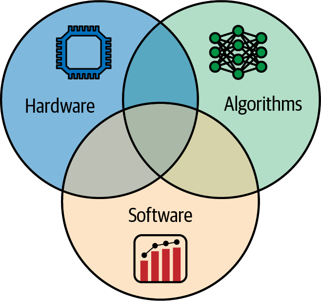

# 第1章 引言与AI系统概述 (Introduction and AI System Overview)

## 1.1 DeepSeek案例：性能工程的力量 (DeepSeek Case: The Power of Performance Engineering)

2024年末，中国一家名为DeepSeek.AI的小型初创公司震惊了AI社区，他们在无法获得当时最新、最先进的NVIDIA GPU的情况下，训练出了一个前沿大型语言模型（LLM）。由于出口限制，DeepSeek的工程师无法获得顶级的NVIDIA Blackwell（B200、B300等）或Hopper（H100、H200等）GPU，因此他们不得不使用当时本地可用的、符合出口合规要求的替代品，包括NVIDIA H800 GPU。他们使用自定义内核和高级优化技术（如模型蒸馏）从这些能力较弱的GPU中榨取最大性能。

> In late 2024, a small startup in China called DeepSeek.AI stunned the AI community by training a frontier large language model (LLM) without access to the latest, state-of-the-art NVIDIA GPUs at the time. Due to export restrictions, DeepSeek's engineers could not obtain top-tier NVIDIA Blackwell (B200, B300, etc.) or Hopper (H100, H200, etc.) GPUs, so they resorted to locally available, export-compliant alternatives at the time, including the NVIDIA H800 GPU. They used custom kernels and advanced optimization techniques such as model distillation to squeeze out maximum performance from these less capable GPUs.

尽管存在这些限制，DeepSeek.AI训练出了他们的DeepSeek-R1模型，并实现了接近当时在最强大的NVIDIA芯片上训练的领先前沿模型的推理能力。这个案例凸显了熟练掌握AI系统性能工程的从业者和研究人员可以在任何硬件条件下获得最佳性能——无论存在什么约束。

> Despite these limitations, DeepSeek.AI trained their DeepSeek-R1 model and achieved reasoning capabilities near the performance of leading frontier models that were trained on the most capable NVIDIA chips at the time. This case underscores that practitioners and researchers skilled in AI systems performance engineering can get the most out of their available hardware—no matter the constraints.

例如，DeepSeek的工程师将通信带宽视为稀缺资源，优化网络上传输的每一个字节，以实现许多人认为在该基础设施上不可能实现的目标。他们扩展到数千个受限制的GPU——使用有限的带宽互连连接——使用新颖的软件和算法优化来克服这些限制。

> For example, DeepSeek's engineers treated communication bandwidth as a scarce resource, optimizing every byte over the wire to achieve what many thought impossible on that infrastructure. They scaled out to thousands of these constrained GPUs—connected with limited-bandwidth interconnects—using novel software and algorithmic optimizations to overcome these limitations.

将DeepSeek的方法与美国和欧洲最大的AI前沿实验室采用的"暴力"路径进行对比。这些实验室继续追求更大的计算集群和更大的模型。模型规模从数百万爆炸式增长到数十亿，现在达到数万亿参数。虽然每次10倍的规模增长都解锁了质的新的能力，但它们需要巨大的成本和资源。

> Contrast DeepSeek's approach with the "brute force" path taken by the largest AI frontier labs in the United States and Europe. These labs continue to pursue larger compute clusters and larger models. Model sizes have exploded from millions to billions and now to trillions of parameters. And while each 10× increase in scale has unlocked qualitatively new capabilities, they require tremendous cost and resources.

例如，据报道，训练OpenAI的GPT-4（2023年）花费了约1亿美元，而训练Google的Gemini Ultra（2023年末）估计高达约1.91亿美元。这表明随着这些模型规模和成本的增长，需要提高资源效率。DeepSeek声称他们的DeepSeek-R1模型的训练计算成本不到600万美元——比GPT-4和Gemini Ultra等模型低一个数量级。同时，DeepSeek-R1与成本高出数个数量级的竞争模型的性能相当。

> For instance, training OpenAI's GPT-4 (2023) reportedly cost an estimated ~$100 million, while training Google's Gemini Ultra (late 2023) is estimated at a staggering ~$191 million. This demonstrates the need for resource efficiency going forward as these models scale up in size and cost. DeepSeek claims that their DeepSeek-R1 model was trained for less than $6 million in compute—an order of magnitude lower than models like GPT-4 and Gemini Ultra. At the same time, DeepSeek-R1 matches the performance of rival models that cost orders of magnitude more money.

尽管对600万美元声明的有效性存在一些疑问——以及它确切包括什么（例如，仅单次训练运行）或排除什么（例如，实验和模型开发流程）——但这一公告短暂地震动了美国金融市场，包括NVIDIA的股票，该消息导致其股价在一天内下跌约17%。这是出于对DeepSeek的效率创新在某种程度上会减少未来对NVIDIA硬件需求的担忧。虽然这种市场反应有些过度——NVIDIA股票在随后的交易中恢复——但它展示了AI效率突破对全球金融市场可能产生的重大财务影响。

> And while there is some doubt as to the validity of the $6 million claim—and what exactly it includes (e.g., just a single training run) or excludes (e.g., experimentation and the model-development pipeline)—the announcement briefly shocked the US financial markets, including NVIDIA's stock, which dropped ~17% in a single day based on this news. This was caused by concerns that DeepSeek's efficiency innovations would somehow require less NVIDIA hardware in the future. While this market reaction was a bit overblown—and NVIDIA stock recovered in subsequent trading sessions—it demonstrates the significant financial impact that breakthroughs in AI efficiency can have on global financial markets.

除了模型训练，DeepSeek还在推理效率方面取得了显著提升，通过对驱动大多数现代前沿LLM的transformer架构进行新颖的硬件感知算法改进。DeepSeek清楚地证明了巧妙的AI系统性能工程优化可以颠覆超大规模AI模型训练和推理的经济学。这些优化将在本书其余部分中讨论。

> Beyond model training, DeepSeek boasts significant inference efficiency gains through novel hardware-aware algorithmic improvements to the transformer architecture that powers most modern, frontier LLMs. DeepSeek has clearly demonstrated that clever AI systems performance engineering optimizations can upend the economics of ultrascale AI model training and inference. These optimizations are covered throughout the rest of the book.

关键要点是一个深刻的认识：在这种规模下，从系统中榨取的每一分性能都可能转化为节省数百万甚至数十亿美元。消除的每一个瓶颈都可能对训练吞吐量和推理延迟产生巨大影响。这反过来降低了成本并提高了最终用户的满意度。简而言之，AI系统性能工程不仅仅关乎速度——它关乎使以前不可能的事情变得可能且负担得起。

> The takeaway is a profound realization that, at these scales, every bit of performance squeezed out of our systems could translate to millions, or even billions, of dollars saved. Every bottleneck eliminated can have an outsized impact on training throughput and inference latency. This, in turn, reduces cost and increases overall end-user happiness. In short, AI systems performance engineering isn't just about speed—it's about making the previously impossible both possible and affordable.

## 1.2 AI系统性能工程师 (The AI Systems Performance Engineer)

AI系统性能工程师是一个专注于优化AI模型及其运行底层系统性能的专业角色。这些工程师确保AI训练和推理管道快速、成本高效且高性能——以及可靠和高可用。随着规模增加，AI系统性能工程师变得更加关键。

> The AI systems performance engineer is a specialized role focused on optimizing the performance of AI models and the underlying systems they run on. These engineers ensure that AI training and inference pipelines are fast, cost-efficient, and performant—as well as reliable and highly available. As the scale increases, the AI systems performance engineer becomes even more critical.

AI系统性能工程师获得顶尖薪酬——而且有充分理由。我们的工作对底线有明确影响。我们融合硬件、软件和算法方面的专业知识。我们必须理解底层操作系统考虑因素、内存层次结构、网络基础，以及Python和C++等多种语言，以及不同的AI框架和库，如PyTorch、OpenAI的Triton和NVIDIA的Compute Unified Device Architecture（CUDA）。

> An AI systems performance engineer commands top salaries—and for very good reasons. Our work has a clear impact on the bottom line. We blend expertise across hardware, software, and algorithms. We must understand low-level OS considerations, memory hierarchies, networking fundamentals, and multiple languages like Python and C++, as well as different AI frameworks and libraries such as PyTorch, OpenAI's Triton, and NVIDIA's Compute Unified Device Architecture (CUDA).

在任何一天，AI系统性能工程师可能正在检查底层GPU内核效率、优化操作系统线程调度、分析内存访问模式、提高网络吞吐效率，或调试分布式训练算法。AI系统性能工程师的主要职责包括基准测试、性能分析、调试、优化、扩展和高效管理资源。虽然性能工程师可能专注于硬件、软件和算法的组合，但关键点是这些专业化需要协同设计（见图1-1）。因此，了解它们的权衡以及它们如何相互影响是很有益的。

> On any given day, an AI systems performance engineer might be examining low-level GPU kernel efficiency, optimizing OS thread scheduling, analyzing memory access patterns, increasing network throughput efficiency, or debugging distributed training algorithms. Key responsibilities of an AI systems performance engineer include benchmarking, profiling, debugging, optimizing, scaling, and managing resources efficiently. And while performance engineers may specialize in a combination of hardware, software, and algorithms, the point is that these specializations need to be codesigned together (see Figure 1-1). As such, it's good to understand their trade-offs and how they affect one another.

### 1.2.1 基准测试和性能分析 (Benchmarking and Profiling)

基准测试和性能分析涉及测量AI模型在各种工作负载（包括训练和推理）下的延迟、吞吐量、内存使用和其他性能指标。要识别瓶颈，我们必须迭代地使用NVIDIA Nsight Systems和NVIDIA Nsight Compute以及PyTorch profiler。这些工具组合在一起，帮助我们在继续提高AI系统整体性能的同时，在不同栈级别定位瓶颈并随时间跟踪性能。设置自动化性能测试以在开发周期早期捕获回归（性能下降）非常重要。

> Benchmarking and profiling involve measuring latency, throughput, memory usage, and other performance metrics for AI models under various workloads, including training and inference. To identify bottlenecks, we must iteratively use NVIDIA Nsight Systems and NVIDIA Nsight Compute together with the PyTorch profiler. Combined, these tools help pinpoint bottlenecks and track performance over time at different levels of the stack as we continue to improve overall performance of our AI system. It's important to set up automated performance tests to catch regressions, reductions in performance, early in the development cycle.

### 1.2.2 调试和优化 (Debugging and Optimizing)

调试和优化性能问题需要我们将性能问题追溯到其根本原因，无论是次优的CUDA内核、不必要的通信开销，还是训练或推理工作负载中的不平衡。

> Debugging and optimizing performance issues requires that we trace performance issues to their root cause, whether it's a suboptimal CUDA kernel, an unnecessary communication overhead, or an imbalance in our training or inference workload.

在一种情况下，我们可能希望使用更高效的矩阵操作，利用最新的NVIDIA Transformer Engine（TE）硬件，该硬件针对使用transformer架构的现代LLM进行了优化。在另一种情况下，我们可以通过为"易并行"推理工作负载配置更高程度的并行性来改进软件框架。在又一种情况下，我们可能尝试通过实现更好的内存管理并减少相对于所需GPU计算量进出GPU RAM的内存量来改进transformer的注意力算法。

> In one case, we may want to use more efficient matrix operations that take advantage of the latest NVIDIA Transformer Engine (TE) hardware optimized for modern LLMs that use the transformer architecture. In another case, we can improve the software framework by configuring a higher degree of parallelism for our "embarrassingly parallel" inference workload. In yet another case, we may try to improve the transformer's attention algorithm by implementing better memory management and reducing the amount of memory moved in and out of GPU RAM relative to the number of GPU computations required.

即使是微小的代码调整也能产生巨大的收益。例如，也许用Python编写的数据预处理步骤正在阻塞整个训练管道。你可以通过用C++重新实现代码或使用NVIDIA cuPyNumeric（NumPy的直接替代品）来消除该瓶颈，它可以将数组操作工作负载分布在CPU和GPU上。

> Even minor code tweaks can produce major wins. For example, maybe a data preprocessing step written in Python is holding up an entire training pipeline. You can remove that bottleneck by reimplementing the code in C++ or use NVIDIA cuPyNumeric, a drop in NumPy replacement, that can distribute array-operation workloads across both CPUs and GPUs.

### 1.2.3 扩展分布式训练和推理 (Scaling Distributed Training and Inference)

将小型研究工作负载扩展到超大规模集群上的大型生产工作负载，将确保当我们从8个GPU移动到80,000个GPU时，系统能以最小的开销和效率损失进行扩展。这需要使用NVIDIA Collective Communications Library（NCCL，发音为"nickel"）优化通信，用于训练运行中常见的分布式集合操作如all-reduce。此外，NVIDIA Inference Xfer Library（NIXL）为分布式推理提供高吞吐量、低延迟的点对点数据移动，跨越GPU内存和存储层。这种通信可以在单个节点上的GPU之间或跨数千个节点进行。它们还优化了通信和集合聚合操作，如all-reduce、all-to-all和all-gather，这些在模型训练和推理期间广泛使用。

> Scaling small research workloads to larger production workloads on ultrascale clusters will ensure that as we move from 8 GPUs to 80,000 GPUs, the system will scale with minimal overhead and loss of efficiency. This requires optimizing communication using NVIDIA Collective Communications Library (NCCL, pronounced "nickel") for distributed collectives like all-reduce commonly seen in training runs. In addition, the NVIDIA Inference Xfer Library (NIXL) provides high throughput, low latency, and point-to-point data movement across GPU memory and storage tiers for distributed inference. This communication can be between GPUs either on a single node or across thousands of nodes. They also optimize communication and collective aggregation operations like all-reduce, all-to-all, and all-gather, which are used extensively during model training and inference.

你可能希望使用数据、张量和流水线并行性巧妙地跨节点放置数据。或者你可能需要重新设计工作负载以使用张量并行性或流水线并行性，因为模型太大而无法放入单个GPU。也许你正在使用混合专家（MoE）模型，可以利用专家并行性。

> You may want to place data cleverly across nodes using data, tensor, and pipeline parallelism. Or you may need to redesign the workload to use tensor parallelism or pipeline parallelism because the model is so large that it doesn't fit onto a single GPU. Perhaps you are using a mixture of experts (MoE) model and can take advantage of expert parallelism.

### 1.2.4 高效管理资源 (Managing Resources Efficiently)

优化模型如何利用CPU核心、GPU内存、互连带宽和存储I/O等资源非常重要。这可能涉及许多工作，如确保GPU以全速获得数据、将线程绑定到特定CPU核心、减少上下文切换开销、编排内存使用，以及在训练和推理大型模型时避免GPU上的内存不足（OOM）错误。像GPU虚拟化（例如NVIDIA的Multi-Instance GPU [MIG]）这样的技术可以在不需要完整GPU功率进行作业时分区GPU资源以获得更好的整体利用率。

> It's important to optimize how models utilize resources like CPU cores, GPU memory, interconnect bandwidth, and storage I/O. This can involve many efforts such as ensuring GPUs are fed with data at full throttle, pinning threads on specific CPU cores, reducing context-switch overhead, orchestrating memory usage, and avoiding out-of-memory (OOM) errors on GPUs when training and inferencing with large models. Techniques like GPU virtualization (e.g., NVIDIA's Multi-Instance GPU [MIG]) can partition GPU resources for better overall utilization when full GPU power isn't needed for a job.

### 1.2.5 跨团队协作 (Collaborating Across Teams)

跨团队协作对AI系统性能工程师来说绝对至关重要。与研究人员、数据科学家和应用开发人员以及基础设施团队（包括网络和存储）密切合作非常重要。

> Cross-team collaboration is absolutely critical for AI systems performance engineers. It's important to work hand in hand with researchers, data scientists, and application developers—as well as infrastructure teams, including networking and storage.

提高性能可能需要修改模型代码，这涉及与研究人员协调。或者你可能希望部署新的GPU驱动程序以提高效率，这需要基础设施团队。通常，性能改进跨越多个团队。例如，更新CUDA驱动程序或CUDA版本以修复错误和提高效率将涉及与DevOps、基础设施和支持团队的仔细协调。改进模型代码以提高性能涉及与研究人员的密切合作。性能工程师位于这些多学科领域的交叉点，说着AI、计算机科学和系统工程的语言。

> Improving performance might require modifying model code, which involves coordination with researchers. Or you may want to deploy a new GPU driver to improve efficiency, which requires the infrastructure team. Often, performance improvements span multiple teams. For instance, updating the CUDA driver or CUDA version for bug fixes and efficiency will involve careful coordination with DevOps, infrastructure, and support teams. And improving model code for performance involves close work with researchers. The performance engineer sits at the intersection of these multidisciplinary domains and speaks the language of AI, computer science, and systems engineering.

## 1.3 透明度和可重复性 (Transparency and Reproducibility)

在性能工程中，测量一切并信任数据而非假设至关重要。通过发布你的工作，其他人可以学习、复现并在你的发现基础上构建。

> In performance engineering, it's vital to measure everything and trust data, not assumptions. By publishing your work, others can learn, reproduce, and build upon your findings.

DeepSeek故事的一个显著特点是他们如何公开分享基础设施优化。在2025年2月的DeepSeek开源周期间，他们发布了一套开源GitHub仓库，包括FlashMLA、DeepGEMM、DeepEP、专家并行负载均衡器（EPLB）、DualPipe和Fire-Flyer文件系统（3FS）。每个项目都经过生产测试，旨在从硬件中榨取最大性能。这些项目在DeepSeek-V3技术报告中有所描述。

> One notable aspect of DeepSeek's story is how openly they shared their infrastructure optimizations. During DeepSeek's Open-Source Week in February 2025, they released a suite of open source GitHub repositories, including FlashMLA, DeepGEMM, DeepEP, expert parallelism load balancer (EPLB), DualPipe, and Fire-Flyer File System (3FS). Each project was production-tested and aimed at squeezing the most performance from their hardware. These projects are described in the DeepSeek-V3 Technical Report.

FlashMLA是他们用CUDA C++编写的优化注意力内核。DeepGEMM提供了一个FP8优化的矩阵乘法库，据报道在密集和稀疏操作上都优于许多供应商内核。Deep Experts Parallelism（DeepEP）是他们为混合专家（MoE）模型高度调优的通信库。EPLB实现了冗余专家策略，复制高负载专家以处理额外负载。DualPipe是一种双向流水线并行算法，重叠前向/后向计算和通信阶段以减少流水线气泡。3FS是他们的高性能分布式文件系统，提醒我们需要优化每一层——包括文件系统——以从AI系统中获得最大性能。

> FlashMLA is their optimized attention kernel written in CUDA C++. DeepGEMM provides an FP8-optimized matrix multiplication library that reportedly outperforms many vendor kernels on both dense and sparse operations. Deep Experts Parallelism (DeepEP) is their highly tuned communication library for mixture-of-experts (MoE) models. EPLB implements a redundant expert strategy that duplicates heavily loaded experts to handle the additional load. DualPipe is a bidirectional pipeline parallelism algorithm that overlaps the forward/backward computation and communication phases to reduce pipeline bubbles. And 3FS is their high-performance distributed filesystem, reminding us that every layer needs to be optimized—including the filesystem—to get the most performance out of our AI system.

通过在2025年2月的"开源周"期间在GitHub上开源这些项目，DeepSeek不仅通过允许其他人复现他们的结果来证明其声明的可信度，而且还回馈了社区。这种透明度允许其他开发者对其方法进行基准测试、复现和学习，包括使用DeepEP/DualPipe流水线并行重叠通信，以及使用3FS饱和NVMe SSD/RDMA带宽。

> By open sourcing these projects on GitHub during their February 2025 "Open-Source Week," DeepSeek not only demonstrated the credibility of their claims by allowing others to reproduce their results but also contributed back to the community. This transparency allows other developers to benchmark, reproduce, and learn from their methods, including overlapping communication with DeepEP/DualPipe pipeline parallelism and saturating NVMe SSD/RDMA bandwidth with 3FS.

像DeepSeek的Open Infra Index这样的开放努力提供了有价值的基线和工具。它们提供各种AI硬件设置的真实性能测量，并鼓励同类比较和可重复性。同样，MLPerf开放基准测试套件提供了一个标准，用于可重复地比较不同硬件和软件设置的训练和推理性能。

> Open efforts like DeepSeek's Open Infra Index provide valuable baselines and tools. They provide real-world performance measurements on various AI hardware setups and encourage apples-to-apples comparisons and reproducibility. Similarly, the MLPerf open benchmark suite provides a standard for reproducibly comparing training and inference performance across hardware and software setups.

MLPerf等行业基准测试已经量化了跨硬件代的这些协同设计优化。在MLPerf Training v5.0（2025）中，基于Blackwell的NVIDIA GB200 NVL72系统在每个GPU上的训练吞吐量比等效的Hopper系统高出2.6倍，如图1-2所示。在MLPerf Inference v5.0（2025）中，Blackwell NVL72由于更高的单GPU性能和更大的NVLink域，在每个GPU上的推理吞吐量比等效的Hopper集群高出约3.4倍。这些结果如图1-3所示。

> Industry benchmarks such as MLPerf have quantified these kinds of codesigned optimizations across hardware generations. In MLPerf Training v5.0 (2025), a Blackwell-based NVIDIA GB200 NVL72 system produced up to 2.6× higher training throughput per GPU over an equivalent Hopper system, as shown in Figure 1-2. In MLPerf Inference v5.0 (2025), the Blackwell NVL72 achieved about 3.4× higher inference throughput per GPU over an equivalent Hopper cluster due to higher per-GPU performance and the much larger NVLink domain. These results are shown in Figure 1-3.

在后面的章节中，我们将引用其中一些开放基准测试来支持各种性能调优概念。例如，在讨论GPU内核优化时，我们将引用DeepSeek发布的性能分析，展示他们的自定义内核如何在NVIDIA GPU上实现接近峰值的内存带宽利用率。

> In later chapters, we'll reference some of these open benchmarks to support various performance tuning concepts. For instance, when discussing GPU kernel optimizations, we will reference DeepSeek's published profiles showing how their custom kernels achieved near-peak memory bandwidth utilization on NVIDIA GPUs.

实验透明度和可重复性对于推动AI性能工程领域的发展至关重要。很容易陷入轶事性的"感觉"优化陷阱（"我们做了X，感觉更快了"）。相反，我提倡一种严谨的科学方法，即提出假设，用可重复的基准测试测量结果，调整以改进结果，重新运行基准测试，并在每一步分享所有结果。

> Experimental transparency and reproducibility are critical in moving the field of AI performance engineering forward. It's easy to fall into the trap of anecdotal "vibe" optimizations ("We did X and things felt faster"). Instead, I'm advocating for a rigorous, scientific approach that develops hypotheses, measures the results with reproducible benchmarks, adjusts to improve the results, reruns the benchmarks, and shares all of the results at every step.

## 1.4 DeepSeek在美国出口硬件限制下扩展至约6800亿参数模型 (DeepSeek Scales to ~680-Billion-Parameter Model Under US Export Hardware Restrictions)

有时系统性能创新源于必要性。如前所述，由于美国出口限制，DeepSeek被迫只能使用NVIDIA的H800 GPU。H800是Hopper GPU的出口合规版本。与H100相比，它降低了NVLink互连带宽和FP64性能，同时保持HBM容量和带宽基本相似。

> Sometimes systems-performance innovations are born from necessity. As mentioned, DeepSeek found itself constrained to using only NVIDIA's H800 GPUs due to US export restrictions. The H800 is an export-compliant variant of the Hopper GPU. Compared to the H100, it reduces NVLink interconnect bandwidth and FP64 performance while keeping HBM capacity and bandwidth largely similar.

作为参考，NVIDIA H100提供约900 GB/s的每GPU NVLink互连带宽，而H800提供约400 GB/s的每GPU带宽。这使得GPU间数据传输更慢，最终限制了多GPU可扩展性。此外，虽然H100提供3.35 TB/s的内存带宽，但H800的有限吞吐量意味着数据传输要慢得多。这威胁到分布式训练作业的瓶颈并限制可扩展性效率。

> For context, an NVIDIA H100 provides about 900 GB/s NVLink interconnect bandwidth per GPU, while H800 provides about 400 GB/s bandwidth per GPU. This makes inter-GPU data transfers slower and ultimately limits multi-GPU scalability. Additionally, while the H100 offers 3.35 TB/s of memory bandwidth, the H800's limited throughput means that data transfers are much slower. This threatens to bottleneck distributed training jobs and limit scalability efficiency.

DeepSeek在这个高度受限的环境中着手训练一个巨大的约6800亿参数MoE语言模型，称为DeepSeek-V3。这个MoE模型每个输入token只使用约370亿活跃参数——而不是一次使用全部约6800亿参数。

> DeepSeek set out to train a massive ~680-billion-parameter MoE language model, called DeepSeek-V3, in this heavily constrained environment. This MoE model uses only about 37 billion active parameters per input token—rather than all ~680 billion at once.

使用这种架构，任何给定时间只激活模型的一小部分。这有助于管理计算负载——即使使用紧凑的H800设置。具体来说，对于每个token，DeepSeek-V3使用1个共享专家加上8个路由选择的专家（从256个专家中选出），每个token总共9个活跃专家，如图1-4所示。

> With this architecture, only a fraction of the model is activated at any given time. This helps manage computational load—even with the compact H800 setup. Specifically, for each token, DeepSeek-V3 uses 1 shared expert plus 8 router-selected experts (out of 256 experts) for a total of 9 active experts per token, as shown in Figure 1-4.

我们将在接下来的章节中更详细地介绍MoE。但只需知道，为了克服环境限制，DeepSeek实现了一种新颖的DualPipe并行算法，精心重叠计算和通信以掩盖H800的固有弱点。

> We'll cover MoEs in more detail in the upcoming chapters. But just know that, to work around the environment limitations, DeepSeek implemented a novel DualPipe parallelism algorithm that carefully overlaps computation and communication to mask the H800's inherent weaknesses.

通过设计自定义CUDA内核来绕过一些默认的NCCL通信集合操作，DeepSeek能够协调数据传输与正在进行的计算。这使得GPU尽管互连带宽降低，仍能高效利用。这种通信/计算重叠是我们将在本书其余部分反复讨论的主题。

> By designing custom CUDA kernels to bypass some of the default NCCL communication collectives, DeepSeek was able to coordinate data transfers in tandem with ongoing computations. This keeps the GPUs efficiently utilized despite their reduced interconnect bandwidth. This kind of communication/computation overlap is a theme we will revisit throughout the rest of the book.

这种创新工程取得了成效，DeepSeek-V3的训练完成所用的GPU时间（和成本）仅为OpenAI、Meta、DeepMind等公司类似规模前沿模型的一小部分。这只是许多人认为使用更强大集群训练这种规模模型所需资源的一小部分。

> This innovative engineering paid off, as DeepSeek-V3 was trained to completion at a fraction of the GPU time (and cost) of similarly sized frontier models from OpenAI, Meta, DeepMind, and others. This is a fraction of the resources that many assumed were necessary to train a model of this scale using a more capable cluster.

DeepSeek报告称，V3在多个标准化基准测试上的性能接近GPT-4，包括语言理解、阅读理解和推理。它甚至在一些测试中匹配或略微超过GPT-4。这些比较基于行业使用的标准化测试。这意味着一个开放的MoE模型可以与最好的闭源模型竞争——尽管使用了能力较弱的硬件。

> DeepSeek reports that V3's performance approaches GPT-4's on several standardized benchmarks, including language understanding, reading comprehension, and reasoning. It even matches or slightly exceeds GPT-4 on some tests. These comparisons were based on standardized tests used across the industry. This implies that an open MoE model can rival the best closed models—despite using less capable hardware.

在DeepSeek-V3模型的基础上，团队随后创建了DeepSeek-R1，这是其专门的推理模型，类似于OpenAI的o1和o3系列推理模型。DeepSeek没有严重依赖昂贵的人类反馈循环进行微调，而是开创了一种"冷启动"策略，使用最少的监督数据，转而强调强化学习技术将链式思维推理直接嵌入R1。这种方法降低了训练成本和时间，并强调了智能软件和算法设计可以克服硬件瓶颈。

> Building on the DeepSeek-V3 model, the team then created DeepSeek-R1, which is its specialized reasoning model built similarly to OpenAI's o1 and o3 series of reasoning models. Instead of relying heavily on costly human feedback loops for fine-tuning, DeepSeek pioneered a "cold start" strategy that used minimal supervised data, instead emphasizing reinforcement learning techniques to embed chain-of-thought reasoning directly into R1. This approach reduced training cost and time and underscored that smart software and algorithm design can overcome hardware bottlenecks.

经验教训是，大型稀疏激活的MoE模型即使在有限的内存和计算预算下也可以有效扩展。新颖的训练调度和低级通信/计算重叠优化可以克服硬件限制，正如DeepSeek努力的巨大投资回报（ROI）所证明的那样。

> The lessons learned are that large, sparsely activated MoE models can be effectively scaled even on limited memory and compute budgets. Novel training schedules and low-level communication/computation overlap optimizations can overcome hardware limitations, as demonstrated by the enormous return on investment (ROI) of DeepSeek's efforts.

ROI是显而易见的，因为DeepSeek的非传统方法带来了巨大的效率，并以更低的训练成本和时间创建了一系列强大的模型。通过从NVIDIA的H800 GPU中榨取每一分性能——即使在通信带宽降低的限制下——团队以减少数百万美元的成本提供了GPT-4级别的模型性能。此外，DeepSeek在R1的推理微调阶段不需要那么多人类标注数据，从而节省了更多资金。

> The ROI is clear, as DeepSeek's unconventional approach brought about huge efficiencies and created a series of powerful models at much lower training cost and time. By extracting every ounce of performance from NVIDIA's H800 GPU—even under the constraints of reduced communication bandwidth—the team delivered GPT-4-level model performance for millions of dollars less. Additionally, DeepSeek saved even more money by not requiring as much human-labeled data during R1's fine-tuning stage for reasoning.

简而言之，智能软件和算法设计克服了暴力硬件限制。这使DeepSeek能够在紧张的成本和硬件预算下开发大规模AI模型。

> In short, smart software and algorithm design overcame brute-force hardware limitations. This enabled DeepSeek to develop large-scale AI models on a tight cost and hardware budget.

## 1.5 迈向100万亿参数模型 (Toward 100-Trillion-Parameter Models)

100万亿参数模型是AI的一个理想里程碑，经常与人脑新皮层中估计的100万亿突触连接相比较。每个突触连接相当于一个模型参数。实现这种规模的模型在理论上是可能的，但它需要大量的资源——和金钱。通过暴力扩展到100万亿参数模型对于除绝对最富有的组织之外的所有组织来说是不切实际的。

> 100-trillion-parameter models are an aspirational milestone for AI and are often compared against the estimated 100 trillion synaptic connections in the human neocortex. Each synaptic connection is equivalent to a model parameter. Achieving a model of this size is theoretically possible, but it demands an extraordinary amount of resources—and money. Scaling to 100-trillion-parameter models by brute force would be impractical for all but the absolute wealthiest organizations.

粗略估计，在约29万亿token上训练的密集100万亿参数模型需要约1.2 × 10²⁹次浮点运算（FLOPS）。更大的token数量会线性扩展这个数字，而使用稀疏（MoE）模型可以减少有效计算量。然而，即使有稀疏性，这也表明仅靠暴力不足以满足超大规模模型的计算需求。需要新方法使100万亿参数训练在合理时间内可行。实现这种规模需要在硬件、软件和算法协同设计方面取得突破性效率——而不是仅仅继续扩展现有方法。

> As a rough order of magnitude, a dense 100-trillion-parameter model trained on about 29 trillion tokens would require on the order of 1.2 × 10²⁹ floating point operations (FLOPS). Larger token counts scale this linearly, while using sparse (MoE) models can reduce the effective compute. However, even with sparsity, this demonstrates that mere brute force is not enough to satisfy the compute needs of ultrascale models. New approaches are needed to make 100-trillion-parameter training feasible in a reasonable amount of time. Achieving this kind of scale requires breakthrough efficiencies in hardware, software, and algorithms codesign—rather than just continuing to scale out current methods.

这种训练成本的爆炸式增长正在推动寻找新的AI系统和软件工程技术，以提高性能、降低成本，并使极限规模AI在有限的计算资源、功率限制和资金下可行。研究人员一直在探索新技术以减少有效计算需求。

> Such explosive growth in training cost is driving a search for new AI systems and software engineering techniques to increase performance, reduce cost, and make extreme-scale AI feasible with limited compute resources, power constraints, and money. Researchers are always exploring novel techniques to reduce the effective compute requirements.

一个突出的想法是使用稀疏性，特别是MoE模型。像MoE这样的稀疏模型与OpenAI流行的传统密集模型（如常见的GPT系列大型语言模型（LLM））形成对比。事实上，有公开猜测认为一些前沿模型，如OpenAI专有的GPT系列和o系列推理模型，是基于MoE架构的。

> One prominent idea is to use sparsity and, specifically, MoE models. Sparse models like MoEs are in contrast to traditional dense models like the common GPT-series large language models (LLMs) made popular by OpenAI. In fact, there is public speculation that some frontier models like OpenAI's proprietary GPT-series and o-series reasoning models are based on the MoE architecture.

像MoE这样的稀疏模型只激活每个输入token的部分模型。通过将每个输入token仅路由到其众多内部"专家"的一个子集，每个token的FLOPS大致保持不变，即使总参数增长。这种稀疏模型证明，扩展到万亿参数模型可以在没有相应计算成本爆炸的情况下完成。此外，由于这些模型在推理期间使用较少的活跃参数，MoE模型的请求-响应延迟通常比其密集等效模型低得多。这些是训练和服务100万亿参数规模模型的关键见解。

> Sparse models like MoEs activate only parts of the model for each input token. By routing each input token through only a subset of its many internal "experts," the FLOPS per token stays roughly constant even as total parameters grow. Such sparse models prove that scaling to multi-trillion-parameter models is done without an equivalent explosion in computation cost. Additionally, since these models use fewer active parameters during inference, request-response latencies are typically much lower for MoE models compared to their dense equivalents. These are crucial insights toward training and serving 100-trillion-parameter-scale models.

DeepSeek-V3（基础模型）和-R1（基于强化学习的推理变体）是MoE效率的绝佳例子。它们包含约6800亿总参数，每个输入token约370亿活跃参数。DeepSeek的技术报告和公开文章描述了一个MoE，每个token有1个共享专家和从256个中选出的8个选定专家，这产生约9个活跃专家和每个token约370亿活跃参数。这使得DeepSeek-V3和-R1比类似规模的密集大型语言模型更加资源高效。另一个例子是Google 2021年的Switch Transformer MoE。这个1.6万亿参数的MoE模型仅用一小部分计算就达到了与密集模型相同的精度。它的训练速度比类似的密集方法快7倍。

> DeepSeek-V3 (base model) and -R1 (reinforcement-learning-based reasoning variant) are great examples of MoE efficiency. They contain ~680 billion total parameters with about 37 billion active per input token. DeepSeek's technical report and public write-ups describe an MoE with 1 shared expert and 8 selected experts out of 256 per token, which yields about 9 active experts and roughly 37 billion active parameters per token. This makes DeepSeek-V3 and -R1 much more resource-efficient than similarly sized dense large language models. Another example is Google's Switch Transformer MoE from 2021. This 1.6-trillion-parameter MoE model achieved the same accuracy as a dense model with only a fraction of the computation. It was trained 7× faster than a comparable dense approach.

除了巨大的计算需求，内存也是一个主要瓶颈。例如，如果每个参数以16位（2字节）精度存储，100万亿参数模型需要约182 TB的GPU内存（182 TB = 100万亿参数 × 每权重16位 × 每字节8位）来加载模型。这与单个NVIDIA Blackwell B200 GPU上的192（180可用）GB GPU RAM相比是3个数量级（1000倍）。

> In addition to massive compute requirements, memory is also a major bottleneck. For example, a 100-trillion-parameter model would require approximately 182 TB of GPU memory (182 TB = 100 trillion parameters × 16 bits per weight × 8 bits per byte) to load the model if each parameter is stored in 16-bit (2-byte) precision. This is 3 orders of magnitude (1,000×) compared to the 192 (180 usable) GB of GPU RAM on a single NVIDIA Blackwell B200 GPU.

仅仅加载100万亿模型权重就需要近1000个Blackwell B200 GPU（每个192[180可用]GB）——或700个Blackwell Ultra B300 GPU（每个约288 GB）。这个估计只是加载模型，不包括激活内存、优化器状态和推理输入。这些会进一步增加所需的总内存。

> To simply load the 100-trillion model weights would require close to 1,000 Blackwell B200 GPUs (192 [180 usable] GB each)—or 700 Blackwell Ultra B300 GPUs (~288 GB each). And this estimate is just to load the model and does not include activation memory, optimizer states, and inference input. These would further increase the total memory required.

作为参考，典型的B200 GPU计算节点只包含8个B200 GPU。要使用这些，你需要约125个GPU节点才能用B200加载模型，约86个GPU节点才能用Ultra B300 GPU计算节点集群加载模型（每个节点8个B300 GPU）。

> For context, a typical B200 GPU compute node contains just 8 B200 GPUs. To use these, you would require ~125 GPU nodes just to load the model with a B200, and ~86 GPU nodes to load the model with a cluster of Ultra B300 GPU compute nodes (8 B300 GPUs per node).

此外，加载训练数据也变得极其困难，因为以足够快的速度向这样的模型提供数据以保持所有这些GPU忙碌并非易事。特别是，当100万亿参数模型被分区到1000个B200 GPU或700个B300 GPU上时，GPU之间的通信开销会显著增加。训练单个模型可能消耗数百万GPU小时和兆瓦时的能源。这是扩展到足够大以训练和服务100万亿参数模型的巨大成本——和能源消耗。

> Additionally, loading training data also becomes extremely difficult since feeding such a model with data fast enough to keep all of those GPUs busy is nontrivial. In particular, communication overhead between the GPUs grows significantly as the 100-trillion-parameter model is partitioned across 1,000 B200 GPUs or 700 B300 GPUs. Training a single model could consume millions of GPU-hours and megawatt-hours of energy. This is an enormous amount of cost—and energy consumption—to scale out large enough to train and serve a 100-trillion-parameter model.

100万亿参数AI时代将迫使我们完全重新思考系统设计，使这种规模的训练和部署变得实际。硬件、算法和软件都需要共同进化以满足这一新前沿。

> The era of 100-trillion-parameter AI will force us to completely rethink system design to make training and deployment practical at this scale. Hardware, algorithms, and software all need to coevolve to meet this new frontier.

## 1.6 NVIDIA的"机架式AI超级计算机" (NVIDIA's "AI Supercomputer in a Rack")

为了应对超大规模计算的挑战，NVIDIA构建了一类新的AI超级计算机，专门针对万亿参数规模的工作负载。例如2024年的NVIDIA Grace Blackwell GB200 NVL72和GB300 NVL72 Ultra，后者使用每个GPU 288 GB HBM3e的Blackwell Ultra GPU，并保持72个GPU的NVLink域，具有约130 TB/s的聚合带宽。Vera Rubin VR200（2026）和Feynman（2028）系统延续了这种将艾级超级计算机压缩到单个数据中心机架的趋势。事实上，NVIDIA将NVL72这样的机架系统称为"机架式AI超级计算机"——这是有充分理由的。

> To meet the challenges of ultrascale computing, NVIDIA has built a new class of AI supercomputers specifically aimed at trillion-parameter-scale workloads. Some examples include the NVIDIA Grace Blackwell GB200 NVL72 in 2024 and the GB300 NVL72 Ultra, which uses Blackwell Ultra GPUs with 288 GB HBM3e per GPU and maintains a 72-GPU NVLink domain with about 130 terabytes per second aggregate bandwidth. Vera Rubin VR200 (2026) and Feynman (2028) systems continue this trend of exascale supercomputers condensed into a single data center rack. In fact, NVIDIA refers to these rack systems like NVL72 as "AI supercomputers in a rack"—and for good reason.

每个GB200/GB300 NVL72机架集成了36个Grace Blackwell，通过NVLink与NVSwitch连接，提供机架级交换结构。每个Grace Blackwell Superchip是一个NVIDIA Grace CPU（具有72个CPU核心）和两个NVIDIA Blackwell GPU的组合，总共36个Grace CPU和72个Blackwell GPU——因此名称"NVL72"中的"72"。

> Each GB200/GB300 NVL72 rack integrates 36 Grace Blackwells connected through NVLink with NVSwitch, providing the rack scale switching fabric. Each Grace Blackwell Superchip is a combination of one NVIDIA Grace CPU (with 72 CPU cores) and two NVIDIA Blackwell GPUs for a total of 36 Grace CPUs and 72 Blackwell GPUs—hence, the "72" in the name "NVL72."

每个Grace Blackwell板使用NVSwitch（机架上的NVLink交换网络）连接到其他板。这样，所有72个GPU可以以每GPU 1.8 TB/s双向的全NVLink 5带宽（18 × 100 GB/s链路）相互通信。在整个机架上，NVLink交换系统在一个NVL72域内提供约130 TB/s的GPU到GPU聚合带宽。

> Each Grace Blackwell board connects to other boards using NVSwitch, the on-rack NVLink switch network. This way, all 72 GPUs can communicate with one another at full NVLink 5 bandwidth of 1.8 TB/s bidirectional per GPU (18 × 100 GB/s links). Across the rack, the NVLink Switch System provides about 130 TB/s aggregate GPU to GPU bandwidth within one NVL72 domain.

实际上，NVL72的内部结构将所有72个Grace Blackwell GPU统一成一个高速集群。因此，像PyTorch（用于训练）和vLLM（用于推理）这样的框架可以使用单一NVLink域进行高效的数据张量流水线和专家并行。CUDA统一内存可以在需要时通过NVLink迁移或远程访问页面。但是，远程内存具有独特的延迟和带宽，应该被视为非均匀的。当依赖Grace和Blackwell之间的托管分配时，最好使用cudaMemPrefetchAsync和cudaMemAdvise进行显式预取以减少页面错误停顿。

> Effectively, the NVL72's internal fabric unifies all 72 Grace Blackwell GPUs into one high-speed cluster. As such, frameworks like PyTorch for training and vLLM for inference can use the single NVLink domain for efficient data tensor pipeline and expert parallelism. CUDA Unified Memory can migrate or remotely access pages across NVLink when needed. However, remote memory has distinct latency and bandwidth that should be treated as nonuniform. When relying on managed allocations across Grace and Blackwell, prefer explicit prefetch using cudaMemPrefetchAsync and cudaMemAdvise to reduce page-fault stalls.

一个完整的GB200 NVL72机架理论上可以达到约1.44 exaFLOPS的FP4性能（具有2:1结构化稀疏性）和约720 petaFLOPS的FP8性能（具有2:1结构化稀疏性）。它在72个GPU上提供约13.5 TB（13,824 GB = 每GPU 192 GB × 72个GPU）的HBM3e，当计入同一NVLink域中的Grace CPU内存时，总共约30 TB。

> A full GB200 NVL72 rack can theoretically reach about 1.44 exaFLOPS for FP4 with 2 to 1 structured sparsity and about 720 petaFLOPS for FP8 with 2 to 1 structured sparsity. It provides roughly 13.5 TB (13,824 GB = 192 GB per GPU × 72 GPUs) of HBM3e across the 72 GPUs and around 30 TB total when counting Grace CPU memory in the same NVLink domain.

简而言之，GB200 NVL72是一个独立的72 GPU、1.44 exaFLOPS、30 TB内存系统，机架功率约120到132 kW，具体取决于供应商配置和冷却。它确实是一台可以在单个机架中训练和服务万亿参数模型的AI超级计算机。

> In short, the GB200 NVL72 is a self-contained 72 GPU 1.44 exaFLOPS 30 TB memory system with about 120 to 132 kW rack power, depending on vendor configuration and cooling. It's truly an AI supercomputer that can train and serve multi-trillion-parameter models in a single rack.

通过组合这些机架形成超大规模集群，你可以支持大规模的万亿参数模型。更好的是，你可以使用你喜欢的云提供商（包括Amazon Web Services（AWS）、Google Cloud Platform（GCP）、Microsoft Azure、CoreWeave、Lambda Labs等）通过几次点击（和相当多的美元！）来配置这些机架和机架集群。

> By combining these racks to form ultrascale clusters, you can support massive multi-trillion-parameter models. Even better, you can provision these racks and rack clusters with a few clicks (and quite a few dollars!) using your favorite cloud provider, including Amazon Web Services (AWS), Google Cloud Platform (GCP), Microsoft Azure, CoreWeave, Lambda Labs, and many others.

在本书中，你将了解每一代在计算、内存、网络和存储方面的创新如何促进更多的AI扩展，形式包括超大规模集群、万亿参数模型、高吞吐量训练作业和极低延迟模型推理服务器。这些创新由硬件感知算法推动，这些算法执行下一节讨论的机械同情和硬件-软件协同设计原则。

> Throughout the book, you will learn how each generation's innovation in compute, memory, networking, and storage will contribute to more AI scaling in the form of ultrascale clusters, multi-trillion-parameter models, high-throughput training jobs, and extreme-low-latency model inference servers. These innovations are fueled by hardware-aware algorithms that enforce the principles of mechanical sympathy and hardware-software codesign discussed in the next section.

## 1.7 机械同情：硬件-软件协同设计 (Mechanical Sympathy: Hardware-Software Codesign)

机械同情是软件工程师Martin Thompson最初创造的术语，他类比于英国一级方程式冠军Jackie Stewart，后者深入了解他的汽车的机械细节。在计算中，它指的是编写深度了解其运行硬件的软件。在AI背景下，它意味着与硬件能力协同设计算法以最大化性能。

> Mechanical sympathy is a term originally coined by software engineer Martin Thompson, who was drawing an analogy to the British Formula One champion Jackie Stewart, who intimately understood his cars' mechanical details. In computing, it refers to writing software that is deeply aware of the hardware it runs on. In the AI context, it means codesigning algorithms hand in hand with hardware capabilities to maximize performance.

现实世界的经验表明，即使对GPU内核或内存访问模式进行微小的调整也能产生巨大的收益。一个典型的例子是FlashAttention，这是一种以硬件感知方式重新实现transformer注意力机制的新颖算法。

> Real-world experience has shown that even minor tweaks in GPU kernels or memory access patterns can produce outsized gains. A classic example is FlashAttention, a novel algorithm that reimplements the transformer attention mechanism in a hardware-aware way.

FlashAttention对GPU计算进行"分块"，最大限度地减少向GPU内存发出的读写次数。FlashAttention显著减少了内存移动并加速了注意力计算。用FlashAttention替换默认的transformer注意力机制/算法可以在长序列的训练和推理中产生2-4倍的加速，同时也减少了整体内存占用。

> FlashAttention "tiles" GPU computations, which minimizes the number of reads and writes issued to the GPU's memory. FlashAttention significantly reduces memory movement and speeds up attention computation. Replacing the default transformer attention mechanism/algorithm with FlashAttention produces a 2×–4× speedup in training and inference for long sequences while also reducing the overall memory footprint.

这种变化将曾经的主要瓶颈（注意力）减少到整体运行时间的一小部分。FlashAttention几乎一夜之间成为许多库的默认选择，因为它让模型能够更快、更高效地处理更长的序列。自FlashAttention以来，出现了许多新的注意力算法，包括DeepSeek的多头潜在注意力（MLA）。

> This kind of change reduces what used to be a major bottleneck (attention) down to a fraction of overall runtime. FlashAttention became the default in many libraries almost overnight because it let models handle longer sequences faster and more efficiently. Since FlashAttention, many new attention algorithms have emerged, including DeepSeek's Multi-Head Latent Attention (MLA).

DeepSeek的MLA算法——作为NVIDIA GPU内核实现并于2025年开源——是硬件-软件协同设计或机械同情的另一个例子。与FlashAttention类似，MLA重构了注意力计算以更好地利用NVIDIA的内存层次结构和专用GPU"Tensor Cores"。这些优化使MLA能够利用受限的H800 GPU架构，以一小部分成本实现更高的吞吐量——甚至超过了FlashAttention在相同H800系统上的性能。

> DeepSeek's MLA algorithm—implemented as an NVIDIA GPU kernel and open sourced in 2025—is another example of hardware-software codesign, or mechanical sympathy. Similar to FlashAttention, MLA restructures the attention computations to better utilize NVIDIA's memory hierarchies and dedicated GPU "Tensor Cores." These optimizations allowed MLA to exploit the constrained H800 GPUs' architecture, achieving higher throughput at a fraction of the cost—surpassing even FlashAttention's performance on those same H800 systems.

整本书实际上是对机械同情的研究。我们将看到无数案例，其中新的硬件功能——或硬件限制，如DeepSeek的情况——激发了新颖的软件和算法技术。相反，我们将看到新的软件算法如何鼓励新的硬件创新。

> This entire book is effectively a study in mechanical sympathy. We will see countless cases where new hardware features—or hardware constraints, as in the case of DeepSeek—inspire novel new software and algorithmic techniques. Conversely, we'll see where new software algorithms encourage new hardware innovations.

例如，transformer模型的兴起和降低精度量化（如FP8/FP4）促使NVIDIA添加了专门的硬件，如Transformer Engine和专用的降低精度Tensor Core，用于更快的矩阵数学计算单元。这些硬件创新反过来使研究人员能够探索新的数值优化器和神经网络架构。这进一步推动硬件设计师，然后解锁更新的算法，等等。这是一个良性循环！

> For instance, the rise of transformer models and reduced-precision quantization (e.g., FP8/FP4) led NVIDIA to add specialized hardware like the Transformer Engine and dedicated reduced-precision Tensor Cores for faster matrix-math computation units. These hardware innovations, in turn, enable researchers to explore novel numeric optimizers and neural-network architectures. This, then, pushes hardware designers even further, which then unlocks even newer algorithms, etc. It's a virtuous cycle!

这种紧密的相互作用——GPU和AI算法共同进化——是AI中机械同情的核心。这些协同设计创新只有在硬件公司（如NVIDIA和ARM）、AI研究实验室（如OpenAI和Anthropic）和AI系统性能工程师（如我们！）之间的密切合作下才能实现。

> This tight interplay—GPUs and AI algorithms coevolving—is the heart of mechanical sympathy in AI. These codesign innovations can happen only with close collaboration between the hardware companies (e.g., NVIDIA and ARM), AI research labs (e.g., OpenAI and Anthropic), and AI systems performance engineers (e.g., us!).

## 1.8 测量"有效吞吐量"Goodput (Measuring "Goodput")

当运营数百、数千或数百万GPU的集群时，了解理论硬件能力中有多少实际执行有用工作非常重要。传统的吞吐量指标如FLOPS和设备利用率误导性地高，因为大部分时间可能花在停滞的通信、空闲计算或失败的作业重启上。这就是"goodput"概念的由来——正如Meta在2025年的一篇论文中将其描述为"有效训练时间比率"。

> When operating clusters of hundreds, thousands, or millions of GPUs, it's important to understand how much of the theoretical hardware capability is actually performing useful work. Traditional throughput metrics like FLOPS and device utilization are misleadingly high, as much of the time is likely spent on stalled communication, idling computation, or failed job restarts. This is where the concept of "goodput" comes in—as described by Meta as "effective training-time ratio" in a 2025 paper.

简单来说，goodput测量单位时间内完成的有用工作的吞吐量（处理的token数量或完成的推理请求数）——扣除所有不直接贡献于模型训练或推理的内容。它实际上是系统从生产性模型训练或推理角度看的端到端效率。Goodput可以通过集群的最大可能吞吐量进行归一化，产生一个百分比效率值。

> In simple terms, goodput measures the throughput of useful work completed (number of tokens processed or inference requests completed) per unit time—discounting everything that doesn't directly contribute to model training or inference. It's effectively the end-to-end efficiency of the system from the perspective of productive model training or inference. Goodput can then be normalized by the cluster's maximum possible throughput to produce a percent efficiency value.

例如，假设一个有8个GPU的节点可以在10秒内处理100,000个token。在这种情况下，它的goodput是每秒10,000个token。如果节点中的每个GPU可以达到每秒1,500个token的峰值理论吞吐量，或者所有8个GPU总共每秒12,000个token，那么节点的效率是83.3%（0.833 = 10,000实际吞吐量/12,000峰值吞吐量）。

> For example, suppose a node with 8 GPUs can process 100,000 tokens in 10 seconds. In this case, its goodput is 10,000 tokens per second. If each GPU in the node can achieve a peak theoretical throughput of 1,500 tokens per second, or 12,000 tokens per second across all 8 GPUs, the node's efficiency is 83.3% (0.833 = 10,000 achieved throughput/12,000 peak throughput).

Meta的AI基础设施团队在"Revisiting Reliability"论文中强调了goodput的重要性。该论文引入了有效训练时间比率指标，并展示了抢占、资源碎片化和失败如何减少实际训练时间，即使标题利用率很高。在这篇论文中，Meta团队分析了抢占、硬件故障和网络拥塞如何减少实际吞吐量。

> Meta's AI infrastructure team highlighted the importance of goodput in the "Revisiting Reliability" paper. The paper introduces the effective training time ratio metric and shows how preemptions resource fragmentation and failures reduce realized training time even when headline utilization is high. In this paper, Meta's team analyzes how preemptions, hardware faults, and network congestion reduce realized throughput.

换句话说，虽然集群看起来100%被利用，但70%-75%的计算由于通信延迟、次优并行化、数据延迟或故障恢复等开销而损失。此外，Meta的分析表明，在规模上，作业抢占、网络热点和不可恢复的故障是goodput损失的主要因素。

> In other words, while the cluster appeared to be 100% utilized, 70%–75% of the compute was lost due to overheads like communication delays, suboptimal parallelization, data delays, or failure recovery. Additionally, Meta's analysis showed that, at scale, issues like job preemptions, network hotspots, and unrecoverable faults were major contributors to lost goodput.

例如，想象一个训练作业在理想硬件上理论上可以处理1,000个样本/秒，但由于糟糕的输入管道和过多的同步，它只能达到300个样本/秒的实际训练吞吐量。我们会说这个作业以30%的goodput运行。剩余70%的容量基本上被浪费了。

> For example, imagine a training job that could theoretically process 1,000 samples/second on ideal hardware, but due to a poor input pipeline and excessive synchronization, it achieves only 300 samples/second of actual training throughput. We'd say that the job is running at 30% goodput. The remaining 70% capacity is essentially wasted.

识别这些差距并弥合它们是我们工作的核心部分。例如，如果GPU在等待从存储加载数据，我们可以引入缓存或异步预取。如果它们在模型训练过程的梯度同步步骤期间空闲，我们可能希望将GPU计算（例如，计算梯度）与GPU之间的通信（例如，同步梯度）重叠。我们的目标是将浪费的、低效的周期转化为有用的工作。

> Identifying these gaps and closing them is a core part of our work. For instance, if GPUs are waiting on data loading from storage, we might introduce caching or async prefetch. If they're idling during the gradient synchronization step of our model training process, we likely want to overlap the GPU computation (e.g., calculating the gradients) with the communication between GPUs (e.g., synchronizing the gradients). Our goal is to turn wasted, inefficient cycles into useful work.

理论性能和实际性能之间的差距是AI系统性能工程师角色的价值主张。我们的使命是通过在栈的每个级别（包括硬件、软件和算法）解决低效问题并降低成本，将goodput数值尽可能提高——理想情况下将其提高到接近100%。

> This gap between theoretical and realized performance is the value proposition of the AI systems performance engineer role. Our mission is to drive that goodput number as high as possible—ideally increasing it closer to 100%—by attacking inefficiencies and reducing cost at every level of the stack, including hardware, software, and algorithms.

通过关注goodput，我们正在优化真正重要的东西——每美元成本和每焦耳功率完成的有用训练量。Goodput是成功的终极指标——比原始FLOPS或设备利用率更重要——因为它概括了硬件、软件和算法在更快、更便宜地训练AI模型的最终目标方面协调得有多好。

> By focusing on goodput, we are optimizing what truly matters—the amount of useful training done per dollar of cost and per joule of power. Goodput is the ultimate metric of success—more so than raw FLOPS or device utilization—because it encapsulates how well hardware, software, and algorithms are harmonized toward the end goal of training AI models faster and cheaper.

提高goodput需要深入理解硬件（如CPU、GPU、网络拓扑、内存层次结构、存储布局）、软件（如操作系统配置、分页内存、I/O利用率）和算法（如transformer架构变体、注意力机制替代方案以及不同的缓存和批处理策略）之间的相互作用。

> Improving goodput requires a deep understanding of the interactions between the hardware (e.g., CPUs, GPUs, network topologies, memory hierarchies, storage layouts), software (e.g., operating system configurations, paged memory, I/O utilization), and algorithms (e.g., transformer architecture variants, attention mechanism alternatives, and different caching and batching strategies).

这种对多学科（包括硬件、软件和算法）的广泛而深入的理解是当今AI系统性能工程师如此稀缺的原因。这也是我写这本书的原因！

> This broad and deep understanding of multiple disciplines—including hardware, software, and algorithms—is why AI systems performance engineers are so scarce today. This is also why I'm writing this book!

## 1.9 书籍路线图和方法论 (Book Roadmap and Methodology)

我们将如何优化100万亿参数的AI系统？本书的组织结构将带你从硬件基础开始，逐步深入软件栈和算法技术——并在每个层面强调实践分析。以下是本书其余部分的概览。

> How will we approach the optimization of 100-trillion-parameter AI systems? This book is organized to take you from the hardware fundamentals up through the software stack and algorithmic techniques—with an emphasis on hands-on analysis at each level. Here is a breakdown of the rest of the book.

**第2章**深入介绍NVIDIA AI系统硬件，包括GB200/GB300 NVL72"机架式AI超级计算机"，它将Grace Blackwell Superchip设计与NVLink网络相结合，创造出AI超级计算机的性能/功耗特性。

> **Chapter 2** provides an in-depth look at NVIDIA AI system hardware, including the GB200/GB300 NVL72 "AI supercomputer in a rack," which combines Grace Blackwell Superchip design with the NVLink network to create performance/power characteristics of an AI supercomputer.

**第3-5章**将介绍GPU基础AI系统的操作系统级、网络和存储优化。这些优化包括CPU和内存绑定，以及Docker容器和Kubernetes编排考虑因素，包括GPU环境的网络I/O和存储配置。

> **Chapters 3–5** will then cover OS-level, networking, and storage optimizations for GPU-based AI systems. These optimizations include CPU and memory pinning, as well as Docker container and Kubernetes orchestration considerations, including network I/O and storage configurations for GPU environments.

**第6-12章**讨论NVIDIA CUDA编程基础和CUDA内核优化，这对于开发新颖的硬件感知算法至关重要。这些流行算法包括FlashAttention和DeepSeek的MLA。这些算法针对transformer架构中资源密集的注意力机制，该机制主导着当今的生成式AI工作负载。

> **Chapters 6–12** discuss NVIDIA CUDA programming fundamentals and CUDA-kernel optimizations that are essential for developing novel hardware-aware algorithms. Such popular algorithms include FlashAttention and DeepSeek's MLA. These algorithms target the resource-intensive attention mechanism of the transformer architecture, which dominates today's generative AI workloads.

**第13和14章**讨论PyTorch特定的优化，包括PyTorch编译器栈和OpenAI基于Python的Triton语言和编译器，用于自定义GPU内核。这些编译器降低了开发新颖CUDA内核的门槛，因为它们不需要开发CUDA内核通常所需的深入C++理解。这些章节还讨论了模型训练的分布式并行化技术，包括数据并行（DP）、全分片数据并行（FSDP）、张量并行（TP）、流水线并行（PP）、上下文并行（CP）和混合专家（MoE）。

> **Chapters 13 and 14** discuss PyTorch-specific optimizations, including the PyTorch compiler stack and OpenAI's Python-based Triton language and compiler for custom GPU kernels. These compilers lower the barrier for developing novel CUDA kernels, as they don't require a deep understanding of C++ typically required to develop CUDA kernels. These chapters also discuss distributed parallelization techniques for model training, including data parallelism (DP), fully sharded data parallelism (FSDP), tensor parallelism (TP), pipeline parallelism (PP), context parallelism (CP), and mixture-of-experts (MoE).

**第15-19章**专注于高吞吐量、低延迟模型推理和智能体AI系统的软件和算法创新。这包括分离式预填充和解码，现在NVIDIA Dynamo和社区栈支持通过UCX与GPUDirect RDMA、NCCL点对点或框架提供的传输进行键值（KV）缓存移动。我们还讨论广泛使用的模型服务引擎，包括vLLM、SGLang和NVIDIA TensorRT LLM。

> **Chapters 15–19** focus on software and algorithmic innovations for high-throughput, low-latency model inference and agentic AI systems. This includes disaggregated prefill and decode, which is now supported in NVIDIA Dynamo and community stacks with key-value (KV) cache movement over UCX with GPUDirect RDMA, NCCL point-to-point, or framework-provided transports. We also discuss the widely used model serving engines, including vLLM, SGLang, and NVIDIA TensorRT LLM.

**第20章**描述了使用AI辅助工具优化内核和AI系统性能的现代努力。该章还包括高效训练和服务数十亿和万亿参数模型的案例研究。它还涵盖了自我改进AI系统优化和智能体的新兴趋势。

> **Chapter 20** describes modern efforts to use AI-assisted tools to optimize kernel and AI system performance. The chapter also includes case studies on training and serving multi-billion- and multi-trillion-parameter models efficiently. It also covers emerging trends for self-improving AI system optimizations and agents.

**附录**提供了应用于你自己AI系统的常见性能优化和成本节约技巧清单。这是本书讨论的可操作优化和效率提升的总结。

> **The Appendix** provides a checklist of common performance-optimization and cost-saving tips and tricks to apply to your own AI system. This is a summary of actionable optimizations and efficiency gains discussed throughout this book.

简而言之，本书采用实践和实证的方法来应用性能优化。我们将经常分析实际运行、案例研究、基准测试结果和性能分析数据，以了解瓶颈并验证改进。到本书结束时，你应该掌握优化超大规模AI系统的原则——并获得一些工具使用经验，以便在超大规模、多GPU、多节点和多机架AI系统（如NVIDIA GB200/GB300 NVL72机架式AI超级计算机）或现在和未来的类似AI系统上应用这些优化。

> In short, this book implements a hands-on and empirical methodology to apply performance optimizations. We will frequently analyze actual runs, case studies, benchmark results, and profiling data to understand bottlenecks and verify improvements. By the end of the book, you should grasp the principles of optimizing ultralarge AI systems—as well as gain some practical experience with tools to apply those optimizations on ultrascale, multi-GPU, multinode, and multirack AI systems like the NVIDIA GB200/GB300 NVL72 AI supercomputer in a rack—or similar AI systems now and in the future.

## 1.10 关键要点 (Key Takeaways)

以下品质共同定义了AI系统性能工程师的角色，他们在将深度技术知识与战略性、基于性能分析的优化相结合方面的专业知识，将原始硬件转化为经济高效、高性能的AI解决方案：

> The following qualities collectively define the role of the AI systems performance engineer, whose expertise in merging deep technical knowledge with strategic, profile-driven optimizations transforms raw hardware into cost-effective, high-performance AI solutions:

**测量有效吞吐量**

超越原始FLOPS或利用率。相反，测量GPU执行有用工作（如前向/反向传播计算）与等待数据或其他开销的时间比率。使用NVIDIA Nsight Systems/Compute或PyTorch profiler来测量这个比率。努力改进这个比率，因为goodput关注有效的、有用的GPU利用率。

> **Measure goodput** — Look beyond raw FLOPS or utilization. Instead, measure the ratio of time the GPU spends performing useful work (e.g., forward/backprop computations) versus waiting on data or other overhead. Use NVIDIA Nsight Systems/Compute or PyTorch profiler to measure this ratio. Strive to improve this ratio, as goodput focuses on effective, useful GPU utilization.

**优先选择熟练的工程优化而非暴力投入**

更多硬件不是银弹。当硬件有限时，巧妙的软件和系统优化可以弥合差距，实现原本需要更昂贵基础设施的结果。我们在DeepSeek的成就中看到了这一点。通过优化通信和硬件使用，他们的工程师在受限的H800 GPU（具有有限的互连带宽）上以一小部分成本训练出了前沿模型。DeepSeek模型匹配了在更强大硬件上训练的前沿模型的性能。换句话说，熟练的工程胜过暴力投入。

> **Prefer skillful engineering optimizations instead of brute-force spending** — More hardware isn't a silver bullet. Clever software and system optimizations can bridge the gap when hardware is limited, enabling results that would otherwise require far more expensive infrastructure. We saw this with DeepSeek's achievement. By optimizing communication and hardware usage, their engineers trained a frontier model on restricted H800 GPUs (with limited interconnect bandwidth) at a fraction of the cost. The DeepSeek model matched the performance of frontier models trained on far more powerful hardware. In other words, skillful engineering outperformed brute-force spending.

**通过增量优化寻找数量级影响**

在规模上，即使是小百分比的效率提升也可以节省数百万美元。换句话说，冗余计算和慢速数据管道等小低效问题会随着系统扩展而悄无声息地增加成本。

> **Look for order-of-magnitude impact with incremental optimizations** — At scale, even a small-percentage efficiency gain can save millions of dollars. Said differently, small inefficiencies such as redundant computations and slow data pipelines can silently increase costs as the system scales.

**以基于性能分析的心态进行性能调优**

使用数据和性能分析工具来指导优化。使用性能分析器识别真正的瓶颈——无论是计算利用率、内存带宽、内存延迟、缓存未命中还是通信/网络延迟。然后针对该瓶颈应用有针对性的优化。

> **Approach performance tuning with a profile-driven mindset** — Use data and profiling tools to guide optimizations. Use profilers to identify the true bottlenecks—whether it's compute utilization, memory bandwidth, memory latency, cache misses, or communication/network delays. Then apply targeted optimizations for that bottleneck.

**保持全局视角**

提高AI系统性能涉及硬件（包括GPU、CPU、内存和网络）以及软件（如算法和库）。任何一层的弱点都可能成为整个系统的瓶颈。最好的性能工程师考虑硬件-软件协同设计：有时算法更改可以缓解硬件限制，有时新硬件功能可以实现新算法。

> **Maintain a holistic view** — Improving AI systems performance spans hardware, including the GPU, CPU, memory, and network—as well as software such as algorithms and libraries. A weakness in any layer can bottleneck the whole. The best performance engineers consider hardware-software codesign: sometimes algorithm changes can alleviate hardware limits, and sometimes new hardware features enable new algorithms.

**了解最新的硬件、软件和算法**

现代AI硬件和软件发展迅速。统一CPU-GPU内存、更快的互连和新颖的数值精度格式等新功能可以改变最优策略。好的性能工程师会关注这些，并相应地更新他们的心智模型，以快速消除瓶颈。此外，MLPerf基准测试套件是了解各种模型AI硬件性能的绝佳资源。

> **Stay informed on the latest hardware, software, and algorithms** — Modern AI hardware and software are evolving rapidly. New capabilities such as unified CPU-GPU memory, faster interconnects, and novel numerical-precision formats can change the optimal strategies. A good performance engineer keeps an eye on these and updates their mental models accordingly to eliminate bottlenecks quickly. Additionally, the MLPerf benchmark suites are a great resource to understand AI hardware performance for various models.

## 1.11 结论 (Conclusion)

这个引言分析强调，在大规模下优化不是可选的——它们是绝对必要的。这是一个可行的系统与一个完全不切实际的系统之间的区别。传统方法，无论是硬件还是算法，在这个规模下都会失效。要向前推进，我们需要先进的硬件和智能的软件技术。

> This introductory analysis underscores that optimizations are not optional at large scale—they are absolutely necessary. It is the difference between a system that works and one that is utterly impractical. Traditional approaches, whether in hardware or algorithms, break down at this scale. To push forward, we need both advanced hardware and smart software techniques.

很明显，AI模型正在推动物理资源极限。硬件正在努力跟上新的模型架构和算法。而性能工程师是确保所有这些昂贵设备真正交付结果的主导者。

> It's clear that AI models are pushing physical resource limits. Hardware is racing to keep up with new model architectures and algorithms. And performance engineers are the ones in the driver's seat to ensure that all this expensive machinery is actually delivering results.

我们已经证明，AI系统性能工程师的角色正变得越来越重要。简单地投入金钱和硬件是不够的。我们需要协同优化一切——模型架构、算法、硬件和系统设计——以推动AI能力的下一个飞跃。

> We have demonstrated that the role of the AI systems performance engineer is gaining more and more importance. Simply throwing money and hardware at the problem is not enough. We need to co-optimize everything—model architectures, algorithms, hardware, and system design—to push toward the next leaps in AI capability.

作为AI系统性能工程师，你的工作是多学科、复杂和动态的。你今天可能深入研究GPU性能分析，明天研究网络拓扑，后天可能研究算法复杂度。这是一个适合"全栈"性能极客的角色，他们喜欢从硬件和软件中榨取每一分可用性能。

> As an AI systems performance engineer, your job is multidisciplinary, complex, and dynamic. You will dive into GPU profiling one day, network topology the next day, and perhaps algorithmic complexity the following day. This is a role for a "full-stack" performance geek who loves to squeeze out every drop of available performance from both hardware and software.

本质上，AI系统性能工程师的座右铭是"机械同情"。我们深入了解机器——包括硬件和软件——这样我们就可以定制高效的解决方案，充分利用整个栈的性能能力。

> In essence, an AI systems performance engineer's mantra is "mechanical sympathy." We deeply understand the machinery—both hardware and software—so that we can tailor efficient solutions that exploit the entire stack's performance capabilities to the fullest.

正如我们之前看到的，100万亿参数模型远超当今硬件的能力范围——即使是艾级系统也需要数千年的GPU时间来完成一次训练运行。这显然是不切实际的，强调了为什么我们需要先进的硬件和巧妙的软件优化才能达到这个规模。

> As we saw earlier, a 100-trillion-parameter model is well beyond the reach of today's hardware—even an exascale system would require several millennia of GPU time for one training run. This is clearly impractical, underscoring why we need both advanced hardware and clever software optimizations to ever reach this scale.

在接下来的章节中，我们将演示如何分解AI系统的组件——从处理器到内存到互连到软件框架——并学习如何以有原则的方式优化每个组件。我们将研究具体的案例研究，其中小的改变带来巨大的性能和成本改进。这样做，我们将帮助创建一个多维度推理性能优化的心智模型。

> In the coming chapters, we will demonstrate how to break down the components of an AI system from processors to memory to interconnects to software frameworks—and learn how to optimize each component in a principled way. We'll study concrete case studies where making small changes brings about huge performance and cost improvements. Doing so, we will help create a mental model for reasoning about performance optimization along multiple dimensions.

在这个旅程结束时，作为读者和从业者，你将掌握当今最佳实践的知识以及应对明天挑战的工程思维。你将拥有一套技术武器，可以将AI系统推向极限——现在和未来。对于AI系统性能工程师来说，使命是明确的。我们必须从这些创新中学习，并准备在栈的每个层面应用积极的优化。

> By the end of this journey, you as a reader and practitioner will be equipped with knowledge of today's best practices as well as an engineering mindset to tackle tomorrow's challenges. You will have an arsenal of techniques to push AI systems to their limits—now and in the future. For AI systems performance engineers, the mandate is clear. We must learn from these innovations and be ready to apply aggressive optimizations at every level of the stack.

现在，随着背景的建立，让我们深入现代AI系统的硬件组件，包括CPU、GPU、内存技术、网络结构和存储机制。通过研究支撑当代AI超级计算机的组件，你将学习为后续章节深入优化技术提供基础的基本原理。

> Now, with the context established, let's dive into the hardware components of modern AI systems, including the CPUs, GPUs, memory technologies, network fabrics, and storage mechanisms. By studying the components that underpin contemporary AI supercomputers, you will learn the fundamentals that provide the foundation of subsequent deep dives into optimization techniques in later chapters.
