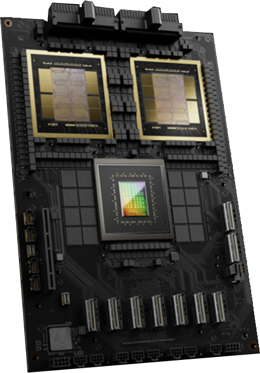
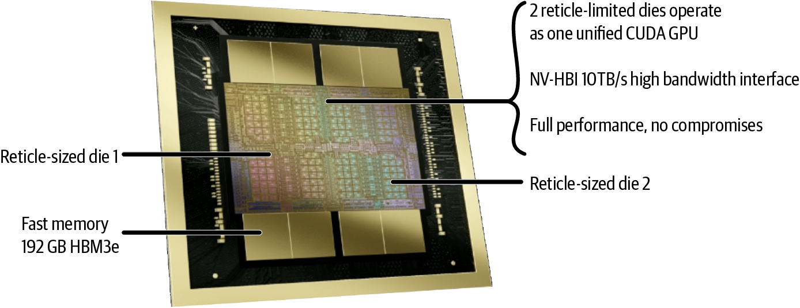
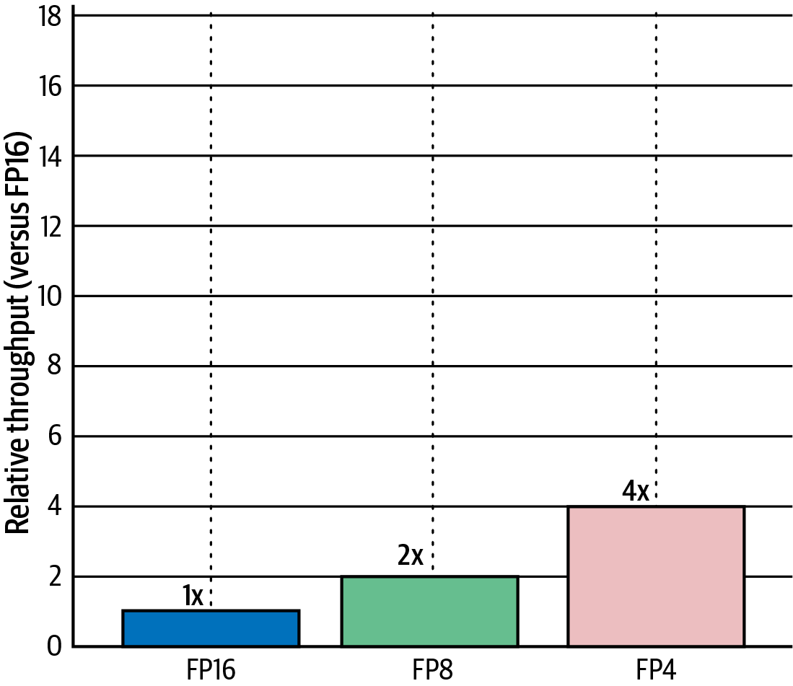
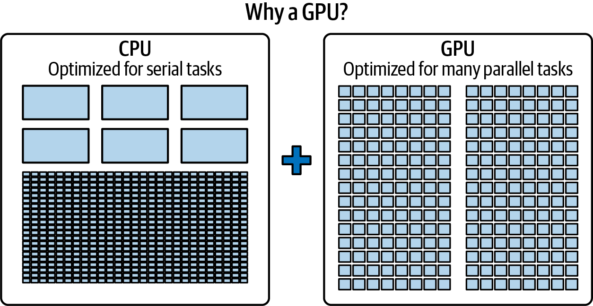
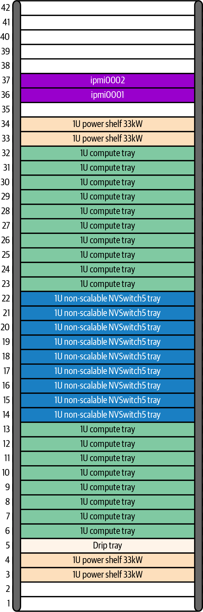
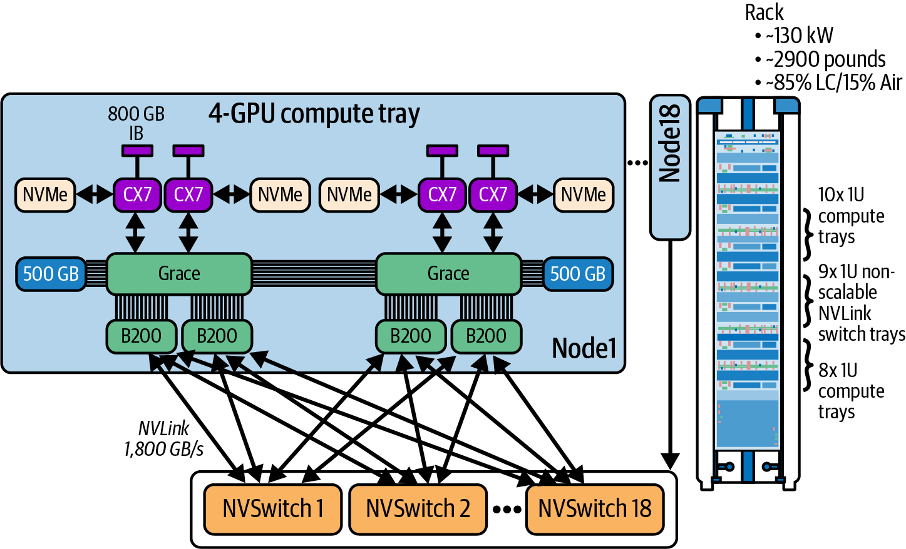

# 第2章 AI系统硬件概述 (AI System Hardware Overview)

想象一下将超级计算机级别的AI硬件浓缩到单个机柜中。NVIDIA的最新架构正是做到了这一点。在本章中，我们将深入探讨NVIDIA如何将CPU和GPU融合为强大的超级芯片，然后通过超高速互连将数十个这样的芯片连接起来，创建一个"盒中AI超级计算机"。我们将探索基本的硬件构建模块--Grace CPU和Blackwell GPU--并了解它们的紧密集成和巨大的内存池如何让AI工程师的工作变得更加轻松。

> Imagine condensing a supercomputer's worth of AI hardware into a single rack. NVIDIA's latest architecture does exactly that. In this chapter, we dive into how NVIDIA fused CPUs and GPUs into powerful superchips and then wired dozens of them together with ultrafast interconnects to create an AI supercomputer-in-a-box. We'll explore the fundamental hardware building blocks-the Grace CPU and Blackwell GPU-and see how their tight integration and enormous memory pool make life easier for AI engineers.

然后，我们将扩展到连接72个GPU的网络架构，使它们就像一台机器一样工作。在此过程中，我们将重点介绍计算性能、内存容量和效率方面的飞跃，这些赋予了这个系统超能力。到最后，你将理解这一尖端硬件如何实现训练和服务以前看似不可能的多万亿参数模型。

> Then we'll expand outward to the networking fabric that links 72 of these GPUs as if they were one machine. Along the way, we'll highlight the leaps in compute performance, memory capacity, and efficiency that give this system its superpowers. By the end, you'll appreciate how this cutting-edge hardware enables training and serving multi-trillion-parameter models that previously seemed impossible.

## 2.1 CPU和GPU超级芯片 (The CPU and GPU Superchip)

NVIDIA扩展AI的方法始于单个组合的CPU + GPU超级芯片模块级别。从Hopper代开始，NVIDIA开始将基于ARM的CPU与一个或多个GPU封装在同一单元中，通过高速接口紧密连接它们。结果是一个行为像统一计算引擎的单一模块。

> NVIDIA's approach to scaling AI starts at the level of a single, combined CPU + GPU superchip module. Beginning with the Hopper generation, NVIDIA started packaging an ARM-based CPU together with one or more GPUs in the same unit, tightly linking them with a high-speed interface. The result is a single module that behaves like a unified computing engine.

超级芯片的第一个实现是Grace Hopper（GH200），它将一个Grace CPU与一个Hopper GPU配对。接下来是Grace Blackwell（GB200）超级芯片，它将一个Grace CPU与两个Blackwell GPU封装在同一封装中。Grace CPU位于模块中心，两侧是两个Blackwell GPU裸片，如图2-1所示。

> The first implementation of the superchip was Grace Hopper (GH200), which pairs one Grace CPU with one Hopper GPU. Next came the Grace Blackwell (GB200) Superchip, which pairs one Grace CPU with two Blackwell GPUs in the same package. The Grace CPU sits in the center of the module, surrounded by two Blackwell GPU dies, as shown in Figure 2-1.

在传统系统中，CPU和GPU有独立的内存池，通过相对较慢的总线（如PCIe）进行通信，这意味着数据必须来回复制。NVIDIA的超级芯片通过使用称为NVLink-C2C（芯片到芯片）的定制高速链路连接CPU和GPU，消除了这一障碍。

> In a traditional system, the CPU and GPU have separate memory pools and communicate over a relatively slow bus (like PCIe), which means data has to be copied back and forth. NVIDIA's superchip eliminates that barrier by connecting the CPU and GPUs with a custom high-speed link called NVLink-C2C (chip-to-chip).

NVLink-C2C在GB200超级芯片中提供Grace CPU和Blackwell GPU之间高达约900 GB/s的带宽。相比之下，PCIe Gen5 x16（Blackwell B200）每个方向约64 GB/s，PCIe Gen6 x16（Blackwell Ultra B300）每个方向约128 GB/s。NVLink-C2C的互连速度比典型PCIe快一个数量级。而且，重要的是，它是缓存一致的。

> NVLink-C2C provides up to ~900 GB/s between the Grace CPU and the Blackwell GPUs in GB200 Superchips. By comparison, PCIe Gen5 x16 (Blackwell B200) is about 64 GB/s per direction, and PCIe Gen6 x16 (Blackwell Ultra B300) is about 128 GB/s per direction. NVLink-C2C's interconnect speed is an order of magnitude faster than typical PCIe. And, importantly, it is cache-coherent.

缓存一致性意味着CPU和GPU共享一致的统一内存架构。因此，它们始终看到相同的值。在实践中，超级芯片上的Grace CPU和Blackwell GPU都可以直接访问彼此的内存，就像它是一个巨大的内存池一样。GPU可以读取或写入存储在CPU内存中的数据，反之亦然，无需显式复制。这种统一内存架构通常被NVIDIA称为统一CPU-GPU内存或扩展GPU内存（EGM），它有效地模糊了CPU内存和GPU内存之间的界限。

> Cache coherency means the CPU and GPU share a coherent, unified memory architecture. As such, they always see the same values. In practice, the Grace CPU and Blackwell GPUs on a superchip can all access one another's memory directly as if it were one huge memory pool. The GPU can read or write data stored in the CPU's memory, and vice versa, without needing explicit copies. This unified memory architecture is often called Unified CPU-GPU Memory or Extended GPU Memory (EGM) by NVIDIA, and it effectively blurs the line between CPU memory and GPU memory.

每个Grace Blackwell超级芯片承载着巨大的内存量。Grace CPU附带数百GB的LPDDR5X DRAM，每个Blackwell GPU都有自己的高速高带宽内存（HBM）堆栈。

> Each Grace Blackwell Superchip carries a tremendous amount of memory. The Grace CPU comes with hundreds of gigabytes of LPDDR5X DRAM attached, and each Blackwell GPU has its own high-speed, high-bandwidth memory (HBM) stacks.

在GB200超级芯片中，Grace CPU提供高达约480 GB的LPDDR5X，带宽高达约500 GB/s，两个Blackwell GPU共同贡献高达约384 GB的HBM3e内存（每个GPU总共192 GB）。总的来说，GB200超级芯片在统一地址空间中暴露了约900 GB的可被GPU和CPU访问的一致统一内存。

> In the GB200 Superchip, the Grace CPU provides up to ~480 GB of LPDDR5X at up to ~500 GB/s, and the two Blackwell GPUs together contribute up to ~384 GB of HBM3e memory (192 total GB per GPU). In total, a GB200 Superchip exposes roughly ~900 GB of memory of coherent, unified memory accessible by the GPUs and CPUs in a unified address space.

简而言之，每个超级芯片拥有近一太字节的快速统一内存可供使用。这对巨型AI模型来说是游戏规则的改变者。在旧系统中，单个GPU可能被限制在< 100 GB的内存，这意味着超过此大小的模型必须被分区或卸载到较慢的存储。在这里，GPU可以无缝地利用CPU的内存作为扩展。

> To put it simply, each superchip has nearly a terabyte of fast, unified memory at its disposal. This is a game changer for giant AI models. In older systems, a single GPU might be limited to < 100 GB of memory, which meant models larger than that had to be partitioned or offloaded to slower storage. Here, a GPU can seamlessly utilize the CPU's memory as an extension.

如果神经网络层或大型嵌入表不适合GPU的本地HBM，它可以驻留在CPU的内存中，GPU仍然可以通过NVLink-C2C与其协同工作。从程序员的角度来看，统一虚拟地址空间和一致性简化了正确性。但是，为了性能，应该使用异步预取和分段流水线等技术显式管理放置和内存移动。使用NVLink-C2C访问LPDDR5X比直接访问HBM具有更高的延迟和大致低一个数量级的带宽。

> If a neural network layer or a large embedding table doesn't fit in the GPU's local HBM, it can reside in the CPU's memory, and the GPU will still be able to work with it across NVLink-C2C. From a programmer's perspective, the unified virtual address space and coherence simplify correctness. However, for performance, one should explicitly manage placement and memory movement using techniques such as asynchronous prefetch and staged pipelines. Accessing LPDDR5X using NVLink-C2C has higher latency and roughly an order-of-magnitude lower bandwidth than accessing HBM directly.

GPU内存仍然比CPU内存快得多，更接近GPU核心--你可以将CPU内存视为一个大但稍慢的扩展。访问LPDDR5X中的数据不如GPU上的HBM快。它的带宽大约低10倍，延迟更高。智能运行时会将最常用的数据保留在HBM中，并使用CPU的LPDDR5X存储溢出或不太关键的数据。关键点是，溢出不再需要通过NVMe SSD或跨网络。

> GPU memory is still much faster and closer to the GPU cores than CPU memory-you can think of the CPU memory as a large but somewhat slower extension. Accessing data in LPDDR5X isn't as quick as HBM on the GPU. It's on the order of 10x lower bandwidth and higher latency. A smart runtime will keep the most frequently used data in HBM and use the CPU's LPDDR5X for overflow or less speed-critical data. The key point is that overflow no longer requires going out to NVMe SSD or across a network.

GPU可以以大约900 GB/s的速度从CPU RAM获取数据（每个方向450 GB/s），虽然比HBM慢，但比从NVMe SSD存储获取快得多。这种灵活性至关重要，因为这意味着一个500 GB大小的模型（对于单个GPU的HBM来说太大）仍然可以完全放置在一个超级芯片模块内，访问组合的192（180可用）GB HBM和约500 GB的CPU内存。该模型可以在不跨多个GPU分区的情况下运行。GPU只会在需要时透明地从CPU内存中提取额外数据。

> The GPU can fetch from CPU RAM at perhaps 900 GB/s (450 GB/s per direction), which, while slower than HBM, is much faster than fetching from NVMe SSD storage. This flexibility is critical, as it means a model that is, say, 500 GB in size (too large for a single GPU's HBM) can still be placed entirely within one superchip module with access to a combined 192 (180 usable) GB in HBM and ~500 GB of CPU memory. This model can run without partitioning the model across multiple GPUs. The GPU would just transparently pull the extra data from CPU memory when needed.

本质上，只要总模型适合超级芯片的组合CPU + GPU内存，内存大小就不再是适应超大型模型的硬限制。许多研究人员在模型不适合GPU时遇到了可怕的"内存不足"错误--这种架构旨在显著推后这一边界。

> In essence, memory size ceases to be a hard limit for fitting ultralarge models, as long as the total model fits within the combined CPU + GPU memory of the superchip. Many researchers have faced the dreaded "out of memory" errors when models don't fit on a GPU-this architecture is designed to push that boundary out significantly.

## 2.2 NVIDIA Grace CPU

Grace CPU本身绝非等闲之辈。它是由NVIDIA专为带宽和效率定制的ARM Neoverse V2 CPU。它在超级芯片中的工作是处理通用任务、预处理并向GPU提供数据，以及管理附着在其上的大量内存。它以适中的时钟速度运行，但通过巨大的内存带宽--高达约500 GB/s到其LPDDR5X内存--以及大量缓存（包括超过100 MB的L3缓存）来弥补。

> The Grace CPU itself is no sloth. It's an ARM Neoverse V2 CPU custom-designed by NVIDIA for bandwidth and efficiency. Its job in the superchip is to handle general-purpose tasks, preprocess and feed data to the GPUs, and manage the mountain of memory attached to it. It runs at a modest clock speed but makes up for it with huge memory bandwidth-up to ~500 GB/s to its LPDDR5X memory-and lots of cache, including over 100 MB of L3 cache.

其理念是，在向GPU推送数据时，CPU永远不应成为瓶颈。它可以从存储流式传输数据或执行即时数据转换（如分词或数据增强），通过NVLink-C2C非常高效地向GPU提供数据。如果你的工作负载的一部分在CPU上更好，Grace核心可以处理这些，并使结果立即可被GPU访问。

> The philosophy is that the CPU should never become a bottleneck when shoveling data to the GPUs. It can stream data from storage or perform on-the-fly data transformations like tokenization or data augmentation-feeding the GPUs through NVLink-C2C very efficiently. If part of your workload is better on the CPU, the Grace cores can tackle that and make the results immediately accessible by the GPUs.

这是一种和谐的耦合，CPU在GPU较弱的领域扩展了GPU的能力，如随机内存访问或控制密集型代码。而GPU加速了CPU无法跟上的数值计算。

> This is a harmonious coupling in which the CPU extends the GPU's capabilities in areas where GPUs are weaker, like random memory accesses or control-heavy code. And the GPUs accelerate the number-crunching where CPUs can't keep up.

CPU和GPU之间的低延迟链路意味着它们可以在没有通常开销的情况下交换任务。例如，从CPU启动GPU内核可以比在传统系统上快得多，因为命令不必穿越慢速PCIe总线。CPU和GPU本质上在同一块板上。这类似于调用快速本地函数与较慢的远程函数。接下来，让我们谈谈Blackwell GPU，超级芯片的强力引擎。

> The low-latency link between the CPU and GPUs means they can trade tasks without the usual overhead. For example, launching a GPU kernel from the CPU can happen much faster than on a traditional system, since the command doesn't have to traverse a slow PCIe bus. The CPU and GPU are essentially on the same board. This is similar to calling a fast local function versus a slower remote function. Next, let's talk about the Blackwell GPU, the brute-force engine of the superchip.

## 2.3 NVIDIA Blackwell "双裸片" GPU (NVIDIA Blackwell "Dual-Die" GPU)

Blackwell是NVIDIA对这一GPU代的代号，它在计算能力和内存方面都代表了相对于前一代Hopper（H100）GPU的显著飞跃。Blackwell B200和B300 "Ultra" GPU不是单芯片。相反，它们使用多芯片模块（MCM）设计，将两个GPU裸片放置在单个模块中。因此，Blackwell被称为双裸片GPU（见图2-2）。

> Blackwell is NVIDIA's codename for this GPU generation, and it represents a significant leap over the previous Hopper (H100) GPUs in both compute horsepower and memory. The Blackwell B200 and B300 "Ultra" GPU are not single chips. Instead, they use a multichip module (MCM) design with two GPU dies placed in a single module. As such, Blackwell is called a dual-die GPU (see Figure 2-2).

这种小芯片方法将通常是一个巨大GPU的东西分成较小的GPU裸片--用超快的封装内裸片到裸片互连将它们连接起来。为什么要这样做？因为单片裸片受到制造限制，因为硅片上芯片的大小有限制。通过将两个物理GPU裸片组合到单个模块中，NVIDIA可以使模块的总晶体管预算翻倍。

> This chiplet approach splits what would normally be one enormous GPU into smaller GPU dies-linking them together with a superfast, on-package die-to-die interconnect. Why do this? Because a single monolithic die is limited by manufacturing because there's a limit to how large you can make a chip on silicon. By combining two physical GPU dies into a single module, NVIDIA can double the total transistor budget for the module.

对于Blackwell B200 MCM，每个GPU裸片约有1040亿个晶体管和96 GB HBM3e内存。组合的GPU模块约有2080亿个晶体管和每个B200 GPU总共192（180可用）GB内存。相比之下，Hopper H100 GPU有约800亿个晶体管和80 GB HBM3（相对于Blackwell的HBM3e）内存。因此，Blackwell的B200使晶体管数量增加了一倍多，内存大小增加了约2.4倍。

> For the Blackwell B200 MCM, each GPU die has about 104 billion transistors and 96 GB HBM3e memory. The combined GPU module has around 208 billion transistors and 192 (180 usable) GB total memory per B200 GPU. By comparison, the Hopper H100 GPU had ~80 billion transistors and 80 GB HBM3 (versus Blackwell's HBM3e) memory. As such, Blackwell's B200 more than doubles transistor count and ~2.4x increases memory size.

Blackwell的两个GPU裸片使用称为NV-HBI（高带宽接口）的专用高速10 TB/s裸片到裸片互连进行通信。这使得模块中的两个GPU裸片可以作为单个统一GPU运行。运行在其上的软件层只看到一个GPU。

> Blackwell's two GPU dies communicate using a specialized, high-speed 10 TB/s die-to-die interconnect called NV-HBI (High-Bandwidth Interface). This lets the two GPU dies in the module function as a single unified GPU. The software layer running on top of it sees only a single GPU.

从系统的角度来看，Blackwell GPU是一个单一模块或设备，具有大容量内存池（192 [180可用] GB HBM3e）和大量执行单元，但在底层它是两个协同工作的芯片。NVIDIA的软件和调度确保工作在两个GPU裸片之间平衡，内存访问是一致的。这使开发人员能够在很大程度上忽略这种复杂性，因为它们表现为一个GPU，正如NVIDIA所预期的那样。

> From the system's perspective, a Blackwell GPU is one single module, or device, with a large pool of memory (192 [180 usable] GB HBM3e) and a ton of execution units, but under the hood it's two chips working in tandem. NVIDIA's software and scheduling ensure that work is balanced across the two GPU dies and memory accesses are coherent. This allows developers to largely ignore this complexity, as they appear as one GPU, as NVIDIA intended.

每个Blackwell B200 GPU模块在两个GPU裸片（每个96 GB）上组合了192（180可用）GB的HBM3e内存，分为8-Hi堆栈。8-Hi HBM3e堆栈通过垂直堆叠八个DRAM裸片构建--每个3 GB--每个堆栈总共24 GB。

> Each Blackwell B200 GPU module has 192 (180 usable) GB of HBM3e memory combined across the two GPU dies (96 GB each) and divided into 8-Hi stacks. An 8-Hi HBM3e stack is built by vertically stacking eight DRAM dies-each 3 GB-for a total of 24 GB per stack.

B200 GPU使用八个这样的堆栈（每个裸片四个）提供192（180可用）GB（192 GB = 8堆栈 x 每堆栈24 GB）的封装内内存。与前一代Hopper GPU相比，这增加了每GPU堆栈数量和容量--并为模型参数、激活、梯度和输入数据提供了更多空间。

> The B200 GPU uses eight of these stacks (four per die) to provide 192 (180 usable) GB (192 GB = 8 stacks x 24 GB per stack) of on-package memory. This increases the per-GPU stack count and capacity compared to the previous generation Hopper GPUs-and gives more headroom for model parameters, activations, gradients, and input data.

内存也更快，因为Blackwell的B200 HBM3e每个GPU的总带宽高达约8 TB/s。相比之下，Hopper使用前一代HBM3，每个GPU提供约3.35 TB/s。因此，Blackwell的内存带宽吞吐量比Hopper高约2.4倍。

> The memory is also faster, as Blackwell's B200 HBM3e has an aggregate bandwidth up to roughly 8 TB/s per GPU. For comparison, the Hopper uses the previous generation HBM3, which delivers ~3.35 TB/s per GPU. As such, Blackwell's memory bandwidth throughput is roughly 2.4x higher than Hopper's.

以每秒8太字节的速度提供数据，Blackwell GPU核心保持忙碌地处理巨大矩阵，而不经常因等待数据而停顿。NVIDIA还增强了片上缓存，Blackwell总共有126 MB的L2缓存（每个裸片63 MB）。这个缓存是GPU上的一个小但超快的内存，保存最近使用的数据。

> Feeding data at 8 terabytes per second, the Blackwell GPU cores are kept busy crunching on huge matrices without frequently stalling to wait for data. NVIDIA also beefed up on-chip caching, as Blackwell has a total of 126 MB of L2 cache (63 MB per die). This cache is a small but ultrafast memory on the GPU that holds recently used data.

通过将L2缓存大小比Hopper的50 MB L2缓存增加超过2.5倍，Blackwell可以将更多神经网络权重或中间结果保留在芯片上，避免额外的HBM访问。这再次有助于确保GPU的计算单元很少因缺乏数据而停顿。

> By increasing the L2 cache size by more than 2.5x compared to Hopper's 50 MB L2 cache, Blackwell can keep more of the neural network weights or intermediate results on chip, avoiding extra trips out to HBM. This again helps ensure the GPU's compute units are seldom starved for data.

接下来，让我们展示Blackwell GPU如何与专用的一组低精度Tensor Core配对--以及来自NVIDIA的transformer优化硬件和软件API，称为Transformer Engine。像PyTorch这样的框架和像vLLM这样的推理引擎通过使用CUDA、CUTLASS和OpenAI的Triton等库支持这些优化，我们将在后面的章节中讨论这些。

> Next, let's show how the Blackwell GPU is paired with a dedicated set of reduced-precision Tensor Cores-as well as transformer-optimized hardware and software APIs from NVIDIA called the Transformer Engine. Frameworks, like PyTorch and inference engines like vLLM, support these optimizations by using libraries like CUDA, CUTLASS, and OpenAI's Triton, which we talk about in later chapters.

## 2.4 NVIDIA GPU Tensor Core和Transformer Engine

说到计算单元，Blackwell引入了专门针对AI工作负载的增强功能。核心是NVIDIA的Tensor Core技术和Transformer Engine（TE）。Tensor Core是GPU每个流式多处理器（SM）内的专用单元，可以以非常高的速度执行矩阵乘法操作。

> Speaking of compute units, Blackwell introduces enhancements specifically aimed at AI workloads. Central to this is NVIDIA's Tensor Core technology and the Transformer Engine (TE). Tensor Cores are specialized units within each streaming multiprocessor (SM) of the GPU that can perform matrix multiplication operations at very high speed.

Tensor Core在前几代中就已存在，但Blackwell的Tensor Core支持更多数值格式，包括极低精度的格式，如8位和4位浮点。低精度背后的想法很简单。通过使用更少的位来表示数字，你可以同时执行更多操作--更不用说你的内存可以更持久，因为表示相同数字所需的位更少。这假设你的算法可以容忍数值精度的一点损失。如今，许多AI算法在设计时就考虑了低精度数值格式。

> Tensor Cores were present in prior generations, but Blackwell's Tensor Cores support even more numerical formats, including extremely low-precision ones like 8-bit and 4-bit floating point. The idea behind lower precision is simple. By using fewer bits to represent numbers, you can perform more operations at the same time-not to mention your memory goes further since fewer bits are used to represent the same numbers. This assumes that your algorithm can tolerate a little loss in numerical precision. These days, a lot of AI algorithms are designed with low-precision numerical formats in mind.

NVIDIA开创了TE，可以在深度学习中自动调整和使用混合精度，其中关键层使用较高精度（FP16或BF16），较不关键的层使用FP8。TE自动优化精度的平衡，目标是在较低精度下保持模型的准确性。

> NVIDIA pioneered the TE to automatically adjust and use mixed precision in deep learning where critical layers use higher precision (FP16 or BF16) and less critical layers use FP8. TE automatically optimizes the balance of precision with the goal of maintaining the model's accuracy at the lower precision.

在Hopper代中，TE首次引入了FP8支持，使吞吐量比FP16翻倍。Blackwell通过引入NVIDIA FP4（NVFP4）更进一步，这是一种4位浮点格式，使用的位数是FP8的一半。FP4非常小，它可能使FP8的计算吞吐量翻倍。图2-3显示了FP8和FP4相对于FP16的加速比。

> In the Hopper generation, the TE first introduced FP8 support, which doubled the throughput versus FP16. Blackwell takes it one step further by introducing NVIDIA FP4 (NVFP4), a 4-bit floating-point format that uses half the number of bits of FP8. FP4 is so small that it can potentially double the compute throughput of FP8. Figure 2-3 shows the relative speedup of FP8 and FP4 compared to FP16.

整个NVL72机柜（72个GPU）在4位精度下的理论Tensor Core吞吐量超过1.4 exaFLOPS（即1.4 x 10¹⁸）。这是一个令人难以置信的数字，使这个单一机柜进入了世界最快超级计算机的领域--尽管是在低FP4精度下。即使实际工作负载并不总是达到那个峰值，这种能力是存在的，这是令人惊叹的。

> An entire NVL72 rack (72 GPUs) has a theoretical Tensor Core throughput over 1.4 exaFLOPS (that's 1.4 x 10¹⁸) in 4-bit precision. This is a mind-boggling number that puts this single rack in the realm of the world's fastest supercomputers-albeit at low FP4 precision. Even if real-world workloads don't always hit that peak, the capability is there, which is astonishing.

现代GPU使用添加了NVFP4支持以及改进的缩放和校准的TE。在实践中，你通过在PyTorch等框架中使用其内核和模块来采用TE。这样，FP8和NVFP4在保持准确性的情况下被应用。这不是所有框架中完全自动的逐层决策。

> Modern GPUs use a TE that adds NVFP4 support together with improved scaling and calibration. In practice, you adopt TE by using its kernels and modules in frameworks such as PyTorch. This way, FP8 and NVFP4 are applied when they preserve accuracy. This is not a fully automatic per-layer decision in all frameworks.

高级技术包括在训练和推理期间动态更改神经网络每一层的精度。目标是为每一层使用仍能保持模型准确性的最低精度。例如，TE可能将神经网络的前几层保持在FP16，因为早期层可能对噪声敏感。但是，基于启发式方法，它可能决定对更容忍的后续层使用FP8或FP4--或者对于高精度不太关键的大型嵌入矩阵。

> Advanced techniques include dynamically changing the precision for each layer of a neural network during training and inference. The goal is to use the lowest precision that will still preserve model accuracy for each of those layers. For example, the TE might keep the first layers of a neural net in FP16 since early layers can be sensitive to noise. But, based on heuristics, it could decide to use FP8 or FP4 for later layers that are more tolerant-or for giant embedding matrices where high precision isn't as critical.

所有这些都可以在NVIDIA库和PyTorch等AI框架的后台发生。作为用户，你只需启用混合精度，结果是一个基本上"免费"获得的巨大加速。我们将在第9章讨论混合精度，但只需知道许多LLM今天出于这个原因使用混合精度。这些降低的精度提高了相对于FP16和FP32的训练速度--并减少了精度损失。Blackwell旨在使FP8和FP4易于访问和高效。

> All of this can happen under the hood in NVIDIA libraries and AI frameworks like PyTorch. As a user, you just enable mixed precision, and the result is a huge speedup that essentially comes "for free." We'll discuss mixed precision in Chapter 9, but just know that many LLMs today use mixed precision for this reason. These reduced precisions improve training speed compared to FP16 and FP32-and reduce accuracy loss. Blackwell was built to make FP8 and FP4 accessible and efficient.

这些降低精度的格式也减少了内存使用。使用FP4使每个参数所需的内存比FP8减半（FP8使FP16内存使用减半），这意味着你可以将更大的模型装入GPU的内存。

> These reduced-precision formats reduce memory usage as well. Using FP4 halves the memory needed per parameter compared to FP8 (and FP8 halves FP16 memory usage), meaning you can pack an even larger model into the GPU's memory.

NVIDIA实际上押注于AI的未来在于低精度算术，并赋予Blackwell在此方面卓越的能力。这对于大规模模型的推理服务尤为关键，其中吞吐量（每秒token数）和延迟至关重要。

> NVIDIA has effectively bet on AI's future being in lower precision arithmetic and has given Blackwell the ability to excel at it. This is especially critical for inference serving of massive models, where throughput (tokens per second) and latency are paramount.

为了说明从Hopper到Blackwell的代际飞跃，NVIDIA报告称，基于H100的系统对于大型1.8万亿参数MoE模型每个GPU只能生成约3.4个token每秒--第一个token的延迟超过5秒。这对于交互式使用来说太慢了。

> To illustrate the generational leap forward from Hopper to Blackwell, NVIDIA reported an H100-based system could generate only about 3.4 tokens per second per GPU for a large 1.8-trillion-parameter MoE model-with over 5 seconds of latency for the first token. This is too slow for interactive use.

基于Blackwell的系统（NVL72）运行相同的模型，每个GPU约150个token每秒，第一个token延迟低至约50毫秒。这大约是相对于Hopper代的30倍实时吞吐量改进。NVL72使这个巨大的模型能够提供实时响应--为更多低延迟用例打开了大门。

> The Blackwell-based system (NVL72) ran the same model with around 150 tokens per second per GPU and a low first-token latency of ~50 milliseconds. That is roughly 30x the real-time throughput improvement over the Hopper generation. The NVL72 allowed this massive model to serve real-time responses-opening it up to many more low-latency use cases.

这种加速来自原始FLOPS、更快GPU的组合、低精度（FP4）使用以及NVLink互连保持GPU数据供应充足。它强调了跨越计算和通信的整体设计如何转化为实际性能收益。

> This speedup came from raw FLOPS, the combination of faster GPUs, lower precision (FP4) usage, and the NVLink interconnect keeping the GPUs fed with data. It underscores how a holistic design that spans across both compute and communication can translate into real-world performance gains.

本质上，Blackwell GPU比其前身更强大、更智能、数据供应更充足。由于Tensor Core、TE和低精度，它们更快地处理数学运算。此外，系统架构确保通过巨大的内存带宽、大型缓存和NVLink快速提供数据。

> In essence, Blackwell GPUs are more powerful, smarter, and better fed with data than their predecessors. They chew through math faster, thanks to Tensor Cores, TE, and low precision. Additionally, the system architecture ensures that data is made available quickly thanks to huge memory bandwidth, large caches, and NVLink.

在继续之前，让我们快速讨论GPU内部的层次结构，因为这对于理解后面的性能调优很有用。

> Before moving on, let's quickly discuss the hierarchy inside the GPU, as this is useful to understand performance tuning later.

## 2.5 流式多处理器、线程和Warp (Streaming Multiprocessor, Threads, and Warps)

每个Blackwell GPU，像其前身一样，由许多流式多处理器（SM）组成。可以将这些视为GPU的"核心"，如图2-4所示。

> Each Blackwell GPU, like its predecessors, consists of many streaming multiprocessors (SMs). Think of these like the "cores" of the GPU, as shown in Figure 2-4.

每个SM包含一堆算术单元（用于FP32、INT32等）、用于矩阵数学的Tensor Core、用于内存操作的加载/存储单元，以及一些用于超越数学等事情的特殊功能单元。GPU还有自己的小型超快内存池，包括寄存器、共享内存和L1缓存。

> Each SM contains a bunch of arithmetic units (for FP32, INT32, etc.), Tensor Cores for matrix math, load/store units for memory operations, and some special function units for things like transcendental math. The GPU also has its own small pool of superfast memory, including registers, shared memory, and L1 cache.

SM以称为warp的固定大小组执行线程，每个warp包含恰好32个线程，它们以锁步方式执行完全相同的指令。这称为单指令多线程（SIMT）执行模型。

> An SM executes threads in fixed-size groups known as warps, with each warp containing exactly 32 threads that execute the exact same instructions in lockstep. This is called the single instruction, multiple threads (SIMT) execution model.

SM并行执行许多活动warp，以帮助覆盖线程等待从全局内存访问数据的延迟。考虑一个SM同时有数十个warp（数百个线程）在运行。如果一个warp正在等待内存获取，另一个warp可以运行。这称为延迟隐藏。我们将在整本书中重新讨论延迟隐藏。这是你的调优工具箱中非常重要的性能优化工具。

> SMs execute many active warps in parallel to help cover the latency of a thread waiting on data accessed from global memory. Consider an SM having dozens of warps (hundreds of threads) in flight concurrently. If one warp is waiting on a memory fetch, another warp can run. This is called latency hiding. We will revisit latency hiding throughout the book. This is a very important performance-optimization tool to have in your tuning toolbox.

像Blackwell这样的高端GPU将有数百个SM。每个SM能够同时运行数千个线程。这就是我们如何在单个GPU上获得数万个活动线程。所有这些SM共享我们之前提到的126 MB L2缓存，并共享连接到HBM的内存控制器。内存层次结构包含寄存器（每线程）→ 共享内存（每线程块，在每个SM上）→ L1缓存（每SM）→ L2缓存（在GPU上的所有SM之间共享）→ HBM内存（片外），如图2-5所示。

> A high-end GPU like Blackwell will have hundreds of SMs. Each SM is capable of running thousands of threads concurrently. This is how we get tens of thousands of active threads onto a single GPU. All those SMs share a 126 MB L2 cache, as we mentioned earlier, and share the memory controllers that connect to the HBM. The memory hierarchy contains registers (per thread) → shared memory (per thread block, on each SM) → L1 cache (per SM) → L2 cache (shared across all SMs on the GPU) → HBM memory (off chip), as shown in Figure 2-5.

为了获得最佳性能，数据需要尽可能保持在层次结构的高层。如果每个操作都以8 TB/s的速度访问HBM，GPU将因访问片外内存的延迟增加而过于频繁地停顿。通过将可重用数据保留在SM本地内存或L2缓存中，GPU可以实现巨大的吞吐量。Blackwell架构的缓存和带宽翻倍正是为了让GPU巨兽保持饱足和快乐。

> For best performance, data needs to stay as high in that hierarchy as possible. If every operation went out to HBM even at 8 TB/s, the GPU would stall too often due to the increased latency of accessing off-chip memory. By keeping reusable data in SM local memory or L2 cache, the GPU can achieve enormous throughput. The Blackwell architecture's doubling of cache and bandwidth is aimed exactly at keeping the GPU beast fed and happy.

作为性能工程师，我们将看到许多示例，其中内核的性能受计算以及内存流量和吞吐量的限制。NVIDIA显然设计了Blackwell，使得对于许多AI工作负载，FLOPS和内存带宽之间的平衡是良好匹配的。

> As performance engineers, we'll see many examples where a kernel's performance is bound by compute as well as memory traffic and throughput. NVIDIA clearly designed Blackwell so that, for many AI workloads, the balance between FLOPS and memory bandwidth is well-matched.

Blackwell的设计平衡了计算和内存，因此对于许多AI内核，GPU可以以最少的停顿继续计算。在实践中，优化良好的密集数学操作可以从片上内存重用数据，接近峰值FLOPS，而不会严重受内存限制。

> Blackwell's design balances compute and memory so that for many AI kernels the GPUs can keep computing with minimal stalls. In practice, well-optimized dense math operations can reuse data from on-chip memory to approach peak FLOPS without being severely memory bound.

所有这些意味着，给定优化良好的代码，GPU通常会忙于计算而不是等待数据。请注意，某些操作如大型归约或随机内存访问仍然可能受内存限制，但更新的GPU、内存和互连硬件使这不再那么成问题。

> All of this means that, given well-optimized code, the GPUs will often be busy computing rather than waiting on data. Note that certain operations like huge reductions or random memory accesses can still be memory bound, but the updated GPU, memory, and interconnect hardware make this a bit less of an issue.

## 2.6 超大规模网络：将许多GPU视为一个 (Ultrascale Networking: Treating Many GPUs as One)

将两个GPU和一个CPU封装到超级芯片中为我们提供了一个极其强大的节点。下一个挑战是将许多这样的超级芯片连接起来，以扩展到更大的模型训练。

> Packing two GPUs and a CPU into a superchip gives us an incredibly powerful node. The next challenge is connecting many of these superchips together to scale out to even larger model training.

NVIDIA使用GB200/GB300超级芯片提供大型机柜配置，称为NVL72系统。NVL72代表一个具有72个Blackwell GPU和36个Grace CPU的系统--全部通过NVLink互连。这本质上是单个机柜中的AI超级计算机。

> NVIDIA provides a large rack configuration using GB200/GB300 Superchips called the NVL72 system. NVL72 stands for a system with 72 Blackwell GPUs-and 36 Grace CPUs-all interconnected with NVLink. This is essentially an AI supercomputer in a single rack.

GB200/GB300 NVL72构建为18个计算节点，其中每个节点包含两个GB200/GB300超级芯片，总共四个Blackwell GPU + 每个计算节点两个Grace CPU，如图2-6所示。

> The GB200/GB300 NVL72 is built as 18 compute nodes in which each node contains two GB200/GB300 Superchips for a total of four Blackwell GPUs + two Grace CPUs per compute node, as shown in Figure 2-6.

在这里，每个超级芯片模块有一个Grace CPU和两个Blackwell GPU（每个B200是双裸片MCM）。NVL72有18个这样的托盘连接在一起。通过将18个计算节点连接在一起，GB200/GB300 NVL72连接了72个Blackwell GPU（18节点 x 4 GPU）和36个Grace CPU（18节点 x 2 CPU）形成一个强大的统一CPU-GPU集群。

> Here, each superchip module has one Grace CPU and two Blackwell GPUs (each B200 is a dual-die MCM). The NVL72 has 18 of these trays linked together. By connecting the 18 compute nodes together, the GB200/GB300 NVL72 links 72 Blackwell GPUs (18 nodes x 4 GPUs) and 36 Grace CPUs (18 nodes x 2 CPUs) together to form a powerful, unified CPU-GPU cluster.

NVL72的有趣之处在于，每个GPU都可以通过NVLink交换架构在单个NVLink域内以非常高的速度与任何其他GPU通信。NVIDIA使用GPU上的NVLink 5连接和称为NVSwitch的专用交换硅芯片的组合实现了这一点。

> The interesting thing about the NVL72 is that every GPU can talk to any other GPU through the NVLink Switch fabric at very high speed within a single NVLink domain. NVIDIA achieved this using a combination of NVLink 5 connections on the GPUs and a dedicated switch silicon called NVSwitch.

### 2.6.1 NVLink和NVSwitch (NVLink and NVSwitch)

每个Blackwell GPU暴露18个NVLink 5端口。总双向NVLink带宽为每GPU 1.8 TB/s（18个NVLink链路 x 100 GB/s双向），NVL72将所有端口连接到NVLink交换系统。每个NVLink交换托盘提供144个100 GB/s的NVLink端口。在九个托盘中，每个GPU的18个NVLink 5链路每个连接到一个NVSwitch芯片，因此72个GPU以全双分带宽完全连接。

> Each Blackwell GPU exposes 18 NVLink 5 ports. Aggregate bidirectional NVLink bandwidth is 1.8 TB/s per GPU (18 NVLink links x 100 GB/s bidirectional) with the NVL72 wiring all ports to the NVLink Switch System. Each NVLink switch tray delivers 144 NVLink ports at 100 GB/s. Across the nine trays, each GPU's 18 NVLink 5 links are wired one per NVSwitch chip so the 72 GPUs are fully connected at full bisection bandwidth.

这是前一代Hopper GPU使用的每GPU NVLink带宽的两倍。Hopper H100使用18个NVLink 4端口，但以NVLink 5一半的速度运行。通过NVLink的GPU间延迟在个位数微秒范围内。

> This is double the per-GPU NVLink bandwidth of the previous generation used by Hopper GPUs. The Hopper H100 uses 18 NVLink 4 ports but runs at half the speed of NVLink 5. Inter-GPU latency over NVLink is in the single-digit microsecond range.

GPU通过NVSwitch芯片在网络中布线。NVSwitch本质上是一个类似于网络交换机的交换芯片，但它是专门为NVLink构建的。这意味着任何GPU都可以通过NVLink交换系统中的一个交换阶段以全双分带宽到达任何其他GPU。这个单阶段属性在单个NVL72机柜内成立，因为每个GPU使用其18个NVLink链路连接到18个NVSwitch芯片，通过单个交换机启用路径。图2-7显示了NVL72中使用的NVLink交换托盘。

> The GPUs are cabled in a network through NVSwitch chips. NVSwitch is essentially a switching chip similar to a network switch, but it's built specifically for NVLink. This means any GPU can reach any other GPU through one switch stage in the NVLink Switch System at full bisection bandwidth. This one-stage property holds true within a single NVL72 rack because each GPU uses its 18 NVLink links to connect to the 18 NVSwitch chips, enabling a path through a single switch. Figure 2-7 shows an NVLink Switch tray used in NVL72.

每个交换托盘包含两个NVSwitch芯片和多个高速端口。NVL72机柜由9个这样的交换托盘和18个计算托盘组成，如图2-8所示。

> Each switch tray contains two NVSwitch chips and multiple high-speed ports. The NVL72 rack comprises 9 such switch trays and 18 compute trays, as shown in Figure 2-8.

由于9个交换托盘中的每个包含两个NVSwitch芯片，NVL72系统中总共有18个NVSwitch芯片。网络安排为全交叉开关，使得每个GPU连接到每个NVSwitch，每个NVSwitch连接到每个GPU。这提供了任何GPU对之间的高带宽路径。

> Since each of the 9 switch trays contains two NVSwitch chips, the total is 18 NVSwitch chips in the NVL72 system. The network is arranged as a full crossbar such that every GPU is connected to every NVSwitch, and every NVSwitch is connected to every GPU. This provides a high-bandwidth path between any pair of GPUs.

每个交换托盘暴露144个NVLink端口以完全连接每个GPU上的18个NVLink链路。具体来说，每个GPU使用其18个NVLink链路连接到18个NVSwitch芯片（每个交换机一个链路）。这意味着任何GPU可以在一跳内到达任何其他GPU（GPU → NVSwitch → GPU），沿途具有巨大带宽。图2-9显示了具有72个完全连接的GPU（36个GB200超级芯片）和18个NVSwitch的完整NVL72架构。

> Each switch tray exposes 144 NVLink ports to fully connect the 18 NVLink links on each GPU. Concretely, each GPU uses its 18 NVLink links to connect to the 18 NVSwitch chips (one link to each switch). This means any GPU can reach any other GPU in one hop (GPU → NVSwitch → GPU), with enormous bandwidth along the way. Figure 2-9 shows the full NVL72 architecture with 72 fully connected GPUs (36 GB200 superchips) and 18 NVSwitches.

整个72 GPU网络的总双分带宽在NVL72机柜内约为130 TB/s。作为参考，这比类似规模的顶级InfiniBand集群高出许多倍。该设计暴露了一个完全连接的高带宽架构，具有跨GPU的全局地址空间。这允许高效的集合操作和单边操作，同时保留对同步和一致性的显式软件控制。

> The aggregate bisection bandwidth across the entire 72-GPU network is about 130 TB/s within an NVL72 rack. For perspective, that is many times higher than even a top-end InfiniBand cluster of similar scale. The design exposes a fully connected, high-bandwidth fabric with a global address space across GPUs. This allows efficient collectives and one-sided operations while preserving explicit software control over synchronization and consistency.

### 2.6.2 多GPU编程 (Multi-GPU Programming)

从编程模型的角度来看，一个GPU可以使用点对点和分区全局地址空间（PGAS）模型（如NVIDIA SHMEM（NVSHMEM），NVIDIA的GPU加速OpenSHMEM实现）通过NVLink直接访问另一个GPU的内存。

> From a programming model standpoint, one GPU can directly access another GPU's memory over NVLink using peer-to-peer and partitioned global address space (PGAS) models such as NVIDIA SHMEM (NVSHMEM), NVIDIA's GPU-accelerated OpenSHMEM implementation.

有一个全局地址空间，但GPU缓存在GPU之间不是全局一致的。只有CPU-GPU路径上的NVLink-C2C是缓存一致的。NCCL和NVSHMEM等软件栈提供正确多GPU访问所需的同步和排序。

> There is a global address space, but GPU caches are not globally coherent across GPUs. Only the CPU-GPU path over NVLink-C2C is cache coherent. Software stacks such as NCCL and NVSHMEM provide the synchronization and ordering required for correct multi-GPU access.

结合硬件缓存一致性和软件同步技术，NVL72可以被视为本质上一个大GPU。

> Combined, hardware cache coherency and software synchronization techniques allow the NVL72 to be seen as essentially one big GPU.

远程直接内存访问（RDMA）是一种网络技术，可以在InfiniBand和融合以太网上的RDMA（RoCE）传输之间实现主机之间的直接零拷贝内存传输。可选的远程原子操作由InfiniBand贸易协会（IBTA）为InfiniBand和RoCE定义。

> Remote direct memory access (RDMA) is a network technology that enables direct, zero-copy memory transfers between hosts across InfiniBand and RDMA over Converged Ethernet (RoCE) transports. Optional remote atomic operations are defined by the InfiniBand Trade Association (IBTA) for InfiniBand and RoCE.

GPUDirect RDMA是NVIDIA的RDMA协议实现，使网络接口控制器（NIC）能够注册GPU内存并使用nvidia-peermem驱动程序直接向GPU内存执行RDMA。这允许GPU在不涉及CPU的情况下跨节点交换数据和执行原子操作。这允许NIC直接向GPU内存执行DMA，而无需通过主机RAM进行暂存。

> GPUDirect RDMA, NVIDIA's implementation of the RDMA protocol, enables network interface controllers (NICs) to register GPU memory and perform RDMA directly to and from GPU memory using the nvidia-peermem driver. This allows GPUs to exchange data and execute atomic operations across nodes without involving the CPU. This allows NICs to perform direct DMA to and from GPU memory without staging through host RAM.

跨节点的远程原子操作和单边操作由NVSHMEM等上层库提供，这些库在RDMA传输上实现这些语义。请注意，GPUDirect RDMA提供直接数据路径，而不是原子API本身。分布式训练和推理工作负载需要在许多GPU之间频繁同步和交换信息。

> Remote atomics and one-sided operations across nodes are provided by upper-layer libraries such as NVSHMEM, which implement these semantics over RDMA transports. Note that GPUDirect RDMA supplies the direct data path rather than the atomic APIs themselves. Distributed training and inference workloads need to synchronize and exchange information frequently across many GPUs.

传统上，GPU位于不同的计算节点和机柜中。因此，同步可以通过相对较慢的网络链路（如InfiniBand和以太网）进行。这通常是扩展到许多GPU以支持大型AI模型时的瓶颈。

> Traditionally, the GPUs are in different compute nodes and racks. As such, synchronization can happen over relatively slow network links like InfiniBand and Ethernet. This is often the bottleneck when scaling across many GPUs to support large AI models.

使用NVL72系统，这些交换通过NVLink和NVSwitch以超快速度进行。这意味着你可以将训练作业或推理集群扩展到72个GPU，通信开销最小。而且由于GPU花费更少的时间等待彼此的数据，整体吞吐量几乎线性扩展到72个GPU。

> With an NVL72 system, those exchanges happen over NVLink and NVSwitch at a superfast pace. This means you can scale your training job or inference cluster up to 72 GPUs with minimal communication overhead. And since the GPUs spend far less time waiting for data from one another, overall throughput scales near-linearly up to 72 GPUs.

相比之下，考虑在类似规模的72 GPU H100集群（九个独立计算服务器，每个有八个Hopper H100 GPU）上扩展相同的作业。此配置需要InfiniBand，这将创建网络瓶颈，大大降低集群的扩展效率。

> In contrast, consider scaling the same job across a similarly sized 72-GPU H100 cluster of nine separate compute servers-each with eight Hopper H100 GPUs. This configuration requires InfiniBand, which will create network bottlenecks that greatly reduce the cluster's scaling efficiency.

让我们使用具体数字分析和比较NVL72和72 GPU H100集群。在单个NVL72机柜内，GPU到GPU带宽高达每GPU 1.8 TB/s（双向总和），延迟约为千字节级小消息的1-2微秒。大消息需要更长时间，通常受带宽限制。通过传统的InfiniBand网络，每GPU带宽可能更像20-80 GB/s--取决于有多少NIC及其速度--延迟可能为5-10微秒或更多。

> Let's analyze and compare the NVL72 and 72-GPU H100 clusters using concrete numbers. Within a single NVL72 rack, GPU-to-GPU bandwidth is up to 1.8 TB/s per GPU (bidirectional aggregate), and latency is on the order of 1-2 microseconds for a small message on the order of kilobytes. Large messages take longer and are typically bandwidth-limited. Across a conventional InfiniBand network, bandwidth per GPU might be more like 20-80 GB/s-depending on how many NICs and their speed-and latency is likely 5-10 microseconds or more.

NVL72网络提供比主机NIC架构更高的每GPU带宽和更低的延迟。具体来说，NVLink 5提供每GPU约1.8 TB/s的总带宽，而现代主机NIC在400-800 Gb/s线路速率下每端口提供约50-100 GB/s。所有这些将集合操作开销从百分之几十降低到仅几个百分点。

> The NVL72 network offers substantially higher per-GPU bandwidth and lower latency than host-NIC fabrics. Specifically, NVLink 5 provides about 1.8 TB/s of aggregate bandwidth per GPU, whereas modern host NICs provide about 50-100 GB/s per port at 400-800 Gb/s line rates. All of this decreases collective-operation overhead down from tens of percent down to just a few percent.

实际上，在NVLink连接的NVL72系统内，集合开销比传统节点到节点架构低得多，但迭代时间的确切比例取决于工作负载。例如，NVIDIA报告称，1.8万亿参数MoE模型从H100上每GPU约3.4个token每秒、第一个token时间超过5秒，改进到GB200 NVL72上每GPU约150个token每秒、第一个token时间约50毫秒。这种加速很大程度上是由于在NVL72机柜内消除了GPU间通信瓶颈，以及Blackwell更高的计算吞吐量。

> In practical terms, collective overhead is substantially lower within an NVLink-connected NVL72 system versus a traditional node-to-node fabric, but the exact fraction of iteration time is workload-dependent. For example, NVIDIA reported that a 1.8-trillion-parameter MoE model improved from about 3.4 tokens per second per GPU with over 5 seconds time to first token on H100 to about 150 tokens per second per GPU with roughly 50 ms time to first token on GB200 NVL72. This speedup is largely due to eliminating inter-GPU communication bottlenecks inside the NVL72 rack in addition to Blackwell's higher compute throughput.

在单个NVL72机柜内，通信如此之快，以至于通信瓶颈变得低优先级，因为它们几乎完全被消除，而传统InfiniBand和以太网集群中的通信通常是主要瓶颈，需要在软件级别进行仔细优化和调优。

> Within a single NVL72 rack, communication is so fast that communication bottlenecks become low priority as they are almost completely eliminated, whereas communication in traditional InfiniBand and Ethernet clusters is often the primary bottleneck and needs careful optimization and tuning at the software level.

简而言之，你应该设计和实现利用NVL72配置的软件，通过将尽可能多的工作负载通信保持在机柜内（"机柜内"）来利用高速NVLink和NVSwitch硬件。仅在绝对必要时使用机柜之间较慢的基于InfiniBand或以太网的通信（"机柜间"），以扩展超出NVL72的计算和内存资源。

> In short, you should design and implement software that exploits the NVL72 configuration by keeping as much of the workload's communication inside the rack ("intra-rack") as possible to take advantage of the high-speed NVLink and NVSwitch hardware. Use the slower InfiniBand- or Ethernet-based communication between racks ("inter-rack") only when absolutely necessary to scale beyond the NVL72's compute and memory resources.

### 2.6.3 使用NVIDIA SHARP的网络内聚合 (In-Network Aggregation with NVIDIA SHARP)

另一个硬件启用的优化是NVIDIA可扩展分层聚合和归约协议（SHARP）。对于NVLink交换系统机柜，网络内归约使用集成到NVSwitch ASIC中的SHARP引擎在网络中卸载归约和其他集合操作（见图2-10）。

> Another hardware-enabled optimization is NVIDIA Scalable Hierarchical Aggregation and Reduction Protocol (SHARP). For NVLink Switch System racks, in-network reductions use SHARP engines integrated into NVSwitch ASICs to offload reductions and other collectives in-network (see Figure 2-10).

NVSwitch架构组合部分结果，而无需数据通过GPU进行漏斗式传输。通过将集合计算从GPU卸载到交换机硬件本身，SHARP允许GPU专注于更复杂的计算，降低集合延迟，减少穿越网络的数据总量，并提高系统效率。

> The NVSwitch fabric combines partial results without the data needing to funnel through the GPUs. By offloading collective computations from the GPUs to the switch hardware itself, SHARP allows the GPUs to focus on more complex computations, lowers collective latencies, reduces the overall volume of data traversing the network, and increases system efficiency.

SHARP提高的效率意味着，在分布式训练期间，聚合梯度或同步参数的繁重工作由NVSwitch的专用SHARP引擎处理。结果是跨机柜内和机柜间配置的更高效扩展。使用SHARP，即使GPU数量增长，你也会看到接近线性的性能改进。这种网络内计算能力对于训练超大型模型尤为关键，其中在集合操作上节省的每一微秒都可以转化为显著的整体加速。

> SHARP's increased efficiency means that during distributed training, the heavy lifting of aggregating gradients or synchronizing parameters is handled by the NVSwitch's dedicated SHARP engines. The result is much more efficient scaling across both intra-rack and inter-rack configurations. With SHARP, you'll see near-linear performance improvements even as the number of GPUs grows. This in-network computing capability is especially critical for training ultralarge models, where every microsecond saved on collective operations can translate into substantial overall speedups.

SHARP是NVIDIA在2019-2020年收购Mellanox期间获得的最具影响力的创新之一。如果你目前没有使用SHARP，你应该探索它。SHARP可以显著减少集合操作的延迟和流量，通常可以提高通信受限训练的扩展效率。

> SHARP is one of the most impactful innovations that NVIDIA received during their 2019-2020 acquisition of Mellanox. You should explore SHARP if you are not currently using it. SHARP can significantly reduce latency and traffic for collectives and often improves scaling efficiency for communication-bound training.

### 2.6.4 多机架和存储通信 (Multirack and Storage Communication)

接下来，让我们讨论NVL72机柜如何与另一个NVL72通信--或与共享文件系统等外部存储系统通信。正如我们所展示的，在NVL72机柜内部，NVLink覆盖所有GPU到GPU流量。但在机柜外部，它依赖于更传统的网络硬件。

> Next, let's discuss how an NVL72 rack talks to another NVL72-or to an external storage system like a shared filesystem. As we have shown, inside the NVL72 rack, NVLink covers all GPU-to-GPU traffic. But outside the rack, it relies on more traditional networking hardware.

NVL72中的每个计算节点都配备有高速网络接口卡和数据处理器（DPU）。DPU从主机CPU卸载、加速和隔离网络、存储、安全和管理任务。通过直接在NIC上运行这些操作，DPU减少了CPU开销和延迟。

> Each compute node in NVL72 is equipped with high-speed Network Interface Cards and a Data Processing Unit (DPU). A DPU offloads, accelerates, and isolates networking, storage, security, and management tasks from the host CPU. By running these operations directly on the NIC, DPUs reduce CPU overhead and latency.

在NVL72设计中，BlueField-3 DPU处理线速数据包处理、RDMA和NVMe over Fabrics（oF）操作。NVMe-oF是NVMe的协议变体，通过网络结构扩展存储。因此，DPU在网络、存储和GPU内存之间直接移动数据，无需CPU参与。这最大化了整体系统吞吐量和效率。

> In the NVL72 design, the BlueField-3 DPU handles line-rate packet processing, RDMA, and NVMe over Fabrics (oF) operations. NVMe-oF is a protocol variant of NVMe that extends storage across network fabrics. As such, the DPU moves data directly between the network, storage, and GPU memory without CPU involvement. This maximizes overall system throughput and efficiency.

GB200/GB300 NVL72机柜与Quantum-X800 InfiniBand或Spectrum-X800 Ethernet结构集成。计算托盘通常每个节点使用四个ConnectX-8 800 Gb/s NIC以获得高外部带宽。BlueField-3 DPU用于需要网络内加速或卸载的存储、安全和控制平面任务。

> GB200/GB300 NVL72 racks integrate with Quantum-X800 InfiniBand or Spectrum-X800 Ethernet fabrics. The compute trays commonly use four ConnectX-8 800 Gb/s NICs per node for high external bandwidth. BlueField-3 DPUs are used where in-network acceleration or offload is required for storage, security, and control-plane tasks.

使用四个800 Gb/s NIC，每个计算节点为3.2 Tbit/s，每个机柜约57.6 Tbit/s（57.6 Tbit/s = 每节点3.2 Tbit/s x 18节点）。虽然这个吞吐量令人瞠目结舌，但请记住，当你离开机柜时，你仍然需要一个超快的网络。这样，多机架扩展就不会在机柜边界处成为瓶颈。NVIDIA将这些多机架部署称为AI工厂。他们确保NVL72可以使用每个节点这四个NIC插入更大的网络结构。

> With four 800 Gb/s NICs, it is 3.2 Tbit/s per compute node and about 57.6 Tbit/s per rack (57.6 Tbit/s = 3.2 Tbit/s per node x 18 nodes). While this throughput is eye-popping, remember that when you exit the rack, you still need an ultrafast network. This way, multirack scaling isn't bottlenecked at the rack boundary. NVIDIA calls these multirack deployments AI factories. And they've made sure that the NVL72 can plug into a larger network fabric using these four NICs per node.

每个节点中的BlueField-3 DPU帮助卸载RDMA、TCP/IP和NVMe SSD存储访问等网络任务。这确保Grace CPU不会被管理网络中断所拖累。DPU本质上充当智能网络控制器，使用NVIDIA的GPUDirect RDMA软件直接在NIC和GPU内存之间移动数据。这不需要通过主机内存暂存数据或使用任何CPU周期。

> The BlueField-3 DPU in each node helps offload networking tasks like RDMA, TCP/IP, and NVMe SSD storage access. This makes sure the Grace CPU isn't bogged down managing network interrupts. The DPU essentially serves as a smart network controller, moving data directly between NICs and GPU memory using NVIDIA's GPUDirect RDMA software. This does not require staging data through host memory or using any CPU cycles.

BlueField DPU避免CPU参与，这在从存储服务器流式传输大型数据集进行大规模训练作业时特别有用。具体来说，DPU可以处理传输并将数据直接存入GPU内存--而CPU专注于数据预处理等其他任务。

> BlueField DPUs avoid CPU involvement, which is especially useful when streaming large datasets from a storage server for large-scale training jobs. Specifically, the DPU can handle the transfer and deposit data directly into GPU memory-while the CPU focuses on other tasks like data preprocessing.

除了提供性能卸载能力外，DPU还支持安全多租户。它为不同作业和用户隔离网络流量--充当节点上的智能防火墙/交换机。

> In addition to providing performance-offload capabilities, the DPU supports secure multitenancy. It isolates network traffic for different jobs and users-acting as a smart firewall/switch on the node.

当扩展到多个NVL72机柜时，NVIDIA使用Quantum系列InfiniBand交换机。多个NVL72机柜可以使用这些InfiniBand交换机互连，形成NVL72机柜的大型集群。

> When scaling out to multiple NVL72 racks, NVIDIA uses Quantum-series InfiniBand switches. Multiple NVL72 racks can be interconnected using these InfiniBand switches to form a large cluster of NVL72 racks.

例如，总计576个GPU的8机柜NVL72使用NVLink交换系统作为一个NVLink 5域连接。然后使用InfiniBand或Ethernet将该NVLink域连接到其他域（例如，其他NVL72机柜）或外部存储（尽管跨机柜InfiniBand或Ethernet通信的性能将低于机柜内NVLink/NVSwitch通信）。

> For example, an 8-rack NVL72 totaling 576 GPUs is connected as one NVLink 5 domain using the NVLink Switch System. InfiniBand or Ethernet is then used to connect that NVLink domain to other domains (e.g., other NVL72 racks) or to external storage (though the performance for cross-rack InfiniBand or Ethernet communication will be lower than the intra-rack NVLink/NVSwitch communication).

简而言之，InfiniBand和Ethernet NIC（如NVIDIA的ConnectX和BlueField DPU）通常与NVLink一起使用。这些提供机柜之间的高带宽连接，并使用DPU上的网络内计算卸载协议。

> In short, InfiniBand and Ethernet NICs such as NVIDIA's ConnectX and BlueField DPU are typically used alongside NVLink. These provide high-bandwidth connectivity between racks and also offload protocols using in-network computing on DPUs.

### 2.6.5 预集成机柜设备 (Preintegrated Rack Appliance)

由于NVL72是一个如此复杂的系统，NVIDIA将其作为单个机柜中的预集成机柜"设备"交付。它随所有18个计算节点、所有9个NVSwitch单元、内部NVLink布线、配电和冷却系统一起组装。这个想法是，组织可以将其作为一个单元订购，到达时即可使用。只需将机柜连接到设施电源，连接水冷接口，将InfiniBand电缆连接到网络，然后开机即可。

> Because NVL72 is such a complex system, NVIDIA delivers it as a preintegrated rack "appliance" in a single cabinet. It comes assembled with all 18 compute nodes, all 9 NVSwitch units, internal NVLink cabling, power distribution, and a cooling system. The idea is that an organization can order this as a unit that is ready to go when it arrives. One simply connects the rack to facility power, hooks up the water cooling interfaces, connects the InfiniBand cables to your network, and powers it on.

该系统本质上开箱即用，只需最少的设置即可开始运行AI工作负载。无需单独用NVLink连接72个GPU，因为NVIDIA已经在机柜内部为你完成了这项工作。甚至液冷设置也是自包含的，我们很快就会讨论。

> The system is essentially ready for use out of the box, requiring only minimal setup to begin running AI workloads. There is no need to individually cable 72 GPUs with NVLink, as NVIDIA has already done this inside the rack for you. Even the liquid cooling setup is self-contained, as we'll discuss soon.

这种设备方法加速了部署，并确保系统构建正确并经过NVIDIA验证。机柜还包括其NVIDIA Base Command Manager集群管理软件--以及用于集群作业调度和编排的简单Linux实用程序（SLURM）和Kubernetes。

> This appliance approach accelerates deployment and ensures that the system is built correctly and validated by NVIDIA. The rack also includes its NVIDIA Base Command Manager cluster-management software-as well as the Simple Linux Utility for Resource Management (SLURM) and Kubernetes for cluster-job scheduling and orchestration.

简而言之，NVL72机柜设计为可以直接放入你的环境，开箱即运行生产AI工作负载。它不需要任何手动安装或复杂配置。

> In short, the NVL72 rack is designed to be dropped into your environment and ready to run production AI workloads right out of the box. It doesn't need any manual installation or complex configuration.

### 2.6.6 共封装光学：网络硬件的未来 (Co-Packaged Optics: Future of Networking Hardware)

随着网络数据吞吐量攀升至800 Gbit/s、1.6 Tbit/s及更高，NVIDIA已开始将硅光子学和共封装光学（CPO）集成到其网络硬件中。这包括Quantum-X800 InfiniBand和Spectrum-X800 Ethernet平台。这些平台提供800 Gb/s端到端连接和网络内计算功能（如SHARP）。使用CPO，光发射器直接集成在交换硅旁边。这大大缩短了电路径，实现了机柜之间更高的带宽链路，降低了功耗，并提高了整体通信效率。

> As networking data throughput rates climb to 800 Gbit/s, 1.6 Tbit/s, and beyond, NVIDIA has begun integrating silicon photonics and co-packaged optics (CPO) into its networking hardware. This includes the Quantum-X800 InfiniBand and Spectrum-X800 Ethernet platforms. These platforms ship with 800 Gb/s end-to-end connectivity and in-network computing features (e.g., SHARP). With CPO, the optical transmitters are integrated right next to the switch silicon. This drastically shortens electrical pathways, enabling even higher bandwidth links between racks, reducing power draw, and improving overall communication efficiency.

实际上，像CPO这样的技术正在为将数百和数千个机柜（AI工厂）连接成单一统一结构铺平道路，其中机柜间带宽不再是瓶颈。这种光学网络进步对于超大规模所需的高性能机柜间带宽至关重要，确保网络能够跟上GPU的步伐。

> In practical terms, technologies like CPO are paving the way to connect hundreds and thousands of racks (AI factories) into a single unified fabric in which inter-rack bandwidth is no longer the bottleneck. Such optical networking advancements are crucial to the high-performance, inter-rack bandwidth needed to ensure that the network can keep up with the GPUs at ultrascale.

总之，在NVL72机柜内部，NVIDIA使用NVLink和NVSwitch在72个GPU之间创建极快的全连接网络。这些互连如此快速和统一，以至于GPU在许多集合操作中实际上表现得像一个单元。在机柜之外，高速NIC（如InfiniBand或Ethernet）将机柜连接到其他机柜或存储，DPU高效管理数据移动。

> To summarize, inside an NVL72 rack, NVIDIA uses NVLink and NVSwitch to create a blazingly fast, all-to-all connected network between 72 GPUs. These interconnects are so fast and uniform that the GPUs effectively behave like one unit for many collective operations. Beyond the rack, high-speed NICs (e.g., InfiniBand or Ethernet) connect the rack to other racks or to storage, with DPUs to manage data movement efficiently.

NVL72是一个极其强大的独立系统，也是更大AI超级计算机或AI工厂的基本构建块。AI工厂的概念--由多个此类机柜组成的大规模AI数据中心--正在成为现实。NVIDIA与HPE和Supermicro等OEM和系统供应商合作供应GB200 NVL72系统。NVIDIA的硬件和网络路线图明确瞄准实现AI工厂愿景。简而言之，NVL72展示了协同设计可以达到的程度，因为GPU、网络和物理机柜硬件是携手构建的，以尽可能无缝和高效地扩展到数千和数百万GPU。

> The NVL72 is an immensely powerful standalone system and a basic building block for larger AI supercomputers or AI factories. The concept of an AI factory, a large-scale AI data center composed of multiple such racks, is now becoming reality. NVIDIA partners with OEM and system vendors like HPE and Supermicro to supply the GB200 NVL72 systems. NVIDIA's hardware and network roadmaps are squarely aimed at enabling the AI factory vision. In short, the NVL72 shows how far codesign can go as the GPU, networking, and physical-rack hardware are built hand in hand to scale to thousands and millions of GPUs as seamlessly and efficiently as possible.

## 2.7 计算密度和功率要求 (Compute Density and Power Requirements)

NVL72机柜在计算方面密度极高，这意味着它对于单个机柜来说消耗非常高的功率。满载的NVL72在最大负载下可消耗高达约130 kW的功率。这比NVIDIA前一代AI机柜高出2倍多，后者消耗约50-60 kW。将72个尖端GPU--以及所有支持硬件--装入一个机柜，推动了数据中心基础设施能处理的极限。

> The NVL72 rack is incredibly dense in terms of compute, which means it draws a very high amount of power for a single rack. A fully loaded NVL72 can consume up to ~130 kW of power under max load. This is more than 2x NVIDIA's previous generation AI rack, which consumed around 50-60 kW. Packing 72 bleeding-edge GPUs-and all the supporting hardware-into one rack pushes the limits of what data center infrastructure can handle.

要为NVL72机柜提供130 kW，你不能只使用单个标准电源馈电。数据中心通常会配置多个高容量电路来提供这种功率。例如，数据中心可以部署两个完全独立的电源馈电。在这种情况下，每个馈电的大小都可以承载整个机柜负载，以防其中一个馈电发生故障。

> To supply 130 kW to the NVL72 rack, you can't just use a single standard power feed. Data centers will typically provision multiple high-capacity circuits to feed this kind of power. For instance, a data center can deploy two fully independent power feeds. In this case, each feed is sized to carry the entire rack load in case of a failure on one of the feeds.

如果一个馈电离线，剩余电路可以支持完整的130 kW负载，以避免电路跳闸。这种冗余是重要的保护。否则，电源中断可能会停止你长达数月的训练作业。

> If one feed goes offline, the remaining circuit can support the full 130 kW draw to avoid a blown circuit. This kind of redundancy is important protection. Otherwise, the power interruption could halt your multimonth training job.

在机柜内，功率分配到每个1U计算节点的电源。功率从AC转换为DC用于本地电子设备。NVL72中的每个计算节点包含两个Grace Blackwell超级芯片，它们共同消耗约6 kW的功率。有18个计算节点，总功耗约110 kW。NVSwitch托盘、网络交换机、空气冷却和水冷泵占总共约20 kW，整个NVL72机柜消耗130 kW。

> Within the rack, power is distributed to the power supplies of each 1U compute node. The power is converted from AC to DC for the local electronics. Each compute node in the NVL72 contains two Grace Blackwell Superchips, which together consume on the order of 6 kW. With 18 compute nodes, the total power consumed is ~110 kW. The NVSwitch trays, network switches, air cooling, and water cooling pumps account for ~20 kW for a total of 130 kW consumed by the entire NVL72 rack.

典型数据中心电压（例如415 V三相AC）下使用的电流是巨大的，因此一切都为高电流而设计。运营商必须仔细规划托管这样的机柜，这通常需要专用的配电单元（PDU）和仔细的监控。功率瞬态也是一个考虑因素，因为72个GPU从空闲到全功率时，可能仅在几毫秒内快速汲取数十kW的功率。良好的设计将包括电容器或排序以避免大的电压降。系统可能会以微小间隔错开GPU加速时钟，使它们不会在同一微秒全部尖峰，平滑浪涌。这些是使130 kW机柜可管理的电气工程细节。

> The current used at a typical data center in voltages (e.g., 415 V 3-phase AC) is massive, so everything is engineered for high amperage. Operators have to carefully plan to host such a rack, which often requires dedicated power distribution units (PDUs) and careful monitoring. Power transients are also a consideration, as 72 GPUs, when ramping from idle to full power, could rapidly draw tens of kW of power in just milliseconds. A good design will include capacitors or sequencing to avoid large voltage drops. The system might stagger the GPU boost clocks by tiny intervals so they don't all spike at exactly the same microsecond, smoothing out the surge. These are the kind of electrical engineering details that go into making a 130 kW rack manageable.

称这个处于高密度计算前沿的NVL72机柜为小型变电站并不夸张。八个这样的机柜组合成576个GPU将消耗近1 MW的功率（8机柜 x 130 kW每机柜），这是小型数据中心的整个容量！好的一面是，虽然130 kW在一个机柜中很多，但你也在每瓦上完成了很多工作。如果一个NVL72替代几个旧设备的机柜，整体效率会更好。但你绝对需要基础设施来支持这种集中的功耗。任何托管NVL72机柜的设施都必须确保有足够的功率容量和冷却，我们接下来将讨论这些。

> It's not far-fetched to call this NVL72 rack, at the cutting edge of high-density compute, a mini power substation. Eight of these racks combined for 576 GPUs would draw nearly 1 MW of power (8 racks x 130 kW per rack), which is the entire capacity of a small data center! The silver lining is that although 130 kW is a lot in one rack, you are also getting a lot of work done per watt. If one NVL72 replaces several racks of older equipment, the overall efficiency is better. But you definitely need the infrastructure to support that concentrated power draw. And any facility hosting the NVL72 racks must ensure they have adequate power capacity and cooling, as we will discuss next.

## 2.8 液冷与风冷 (Liquid Cooling Versus Air Cooling)

在一个机柜中冷却130 kW超出了传统风冷的能力范围。对每个可散热约1,200瓦的72个GPU吹风将需要飓风般的气流，并且会非常嘈杂和低效--更不用说热空气排气将是残酷的。因此，液冷是在此功率密度下运行的NVL72机柜的唯一实用解决方案。

> Cooling 130 kW in one rack is beyond the reach of traditional air cooling. Blowing air over 72 GPUs that each can dissipate ~1,200 watts would require hurricane-like airflow and would be extremely loud and inefficient-not to mention the hot air exhaust would be brutal. As such, liquid cooling is the only practical solution for the NVL72 rack running at this power density.

NVL72是一个完全液冷的系统。每个Grace Blackwell超级芯片模块和每个NVSwitch芯片都附有冷板。冷板是带有内部管道的金属板，直接位于组件上。水基冷却液流过管道带走热量。所有这些冷板通过软管、歧管和泵连接，在整个系统中循环冷却液。

> The NVL72 is a fully liquid-cooled system. Each Grace Blackwell Superchip module and each NVSwitch chip has a cold plate attached. A cold plate is a metal plate with internal tubing that sits directly on the component. A water-based coolant liquid flows through the tubing to carry away heat. All these cold plates are linked by hoses, manifolds, and pumps that circulate the coolant throughout the system.

通常，机柜将为每个节点提供快速断开接头，以便你可以在不溢出冷却液的情况下滑入或滑出服务器。然后机柜有供应和返回连接到外部设施的冷水系统。通常，有一个称为冷却液分配单元（CDU）的热交换器，要么内置在机柜中，要么紧邻其旁边。CDU将热量从机柜的内部冷却液回路传递到数据中心的水回路。

> Typically, the rack will have quick-disconnect couplings for each node so you can slide a server in or out without spilling the coolant. The rack then has supply and return connections to the external facility's chilled water system. Often, there's a heat exchanger called a Coolant Distribution Unit (CDU) either built into the rack or immediately next to it. The CDU transfers heat from the rack's internal coolant loop to the data center's water loop.

设施提供20-30°C的冷水。水通过热交换器吸收热量。加热后的水然后被泵回冷却器或冷却塔再次冷却。在现代设计中，它们甚至可能运行温水冷却，其中冷水以30°C进入系统，以45°C离开。然后水可以通过蒸发冷却塔冷却，无需主动制冷，提高整体效率。关键是，水或液体冷却液每单位流量可以携带比空气更多的热量，因此液冷在小空间内高功率运行时效率大大提高。

> The facility provides chilled water at 20-30°C. The water absorbs the heat through the heat exchanger. The warmed-up water is then pumped back into the chillers or cooling towers to be cooled again. In modern designs, they might even run warm water cooling, in which chilled water comes into the system at 30°C and leaves at 45°C. The water can then be cooled by evaporative cooling towers without active refrigeration, improving overall efficiency. The point is, water, or a liquid coolant, can carry far more heat per unit of flow than air, so liquid cooling is vastly more effective when running at high watts in small spaces.

通过使GPU和CPU温度远低于风冷所能达到的温度，液冷减少了GPU热节流。GPU可以在不达到温度限制的情况下维持其最大时钟频率。此外，在较低温度下运行芯片提高了可靠性甚至效率，因为在较低温度下运行时功率泄漏较低。

> By keeping the GPU and CPU temperatures much lower than they would be with air, liquid cooling reduces thermal GPU throttling. The GPUs can sustain their maximum clocks without hitting temperature limits. Also, running chips cooler improves reliability and even efficiency since power leakage is lower when running at lower temperatures.

NVL72将GPU温度保持在负载下的50-70°C范围内，这对于如此耗电的设备来说是极好的。冷板和冷却液回路经过非常仔细的工程设计，允许每个GPU向系统排放1,000 W，每个CPU排放500 W。此外，冷却液流量必须足够以快速移除该热量。粗略估计显示，在10-12°C水温上升的情况下，需要约150-200升每分钟的流量来散热约130 kW。系统无疑有冷却液温度、压力和泄漏检测的传感器和控制。如果从其滴漏或压力损失传感器检测到泄漏，系统可以快速关闭或隔离该部分。建议使用自密封连接--也许还有二级容纳托盘--以最小化流体泄漏的风险。

> The NVL72 keeps GPU temps in the 50-70°C range under load, which is excellent for such power-hungry devices. The cold plates and coolant loops have been engineered very carefully to allow each GPU to dump 1,000 W and each CPU to dump 500 W into the system. In addition, the coolant flow rate has to be sufficient to remove that heat quickly. A rough estimate shows on the order of 150-200 liters per minute at a 10-12°C water temperature rise to dissipate about 130 kW. The system undoubtedly has sensors and controls for coolant temperature, pressure, and leak detection. If a leak is detected from its drip or pressure-loss sensors, the system can shut down or isolate that section quickly. It's recommended to use self-sealing connections-and perhaps a secondary containment tray-to minimize the risk of leaking fluids.

这种级别的机柜液冷曾经是罕见的，但现在已成为这些大规模AI集群的标准。Meta、xAI和Google等公司正在为其AI集群采用液冷，因为风冷根本无法支持从这些系统汲取的大量功率。因此，虽然NVL72需要更多的设施复杂性，包括液冷回路，但许多数据中心现在在设计时就考虑了液冷。NVL72机柜具有内置的内部液冷，可以直接连接到冷却回路。

> This level of liquid cooling in racks was once exotic, but it is now the standard for these large-scale AI clusters. Companies like Meta, xAI, and Google are adopting liquid cooling for their AI clusters because air cooling simply cannot support the large amount of power drawn from these systems. So while an NVL72 requires more facility complexity, including liquid-cooling loops, many data centers are now built with liquid cooling in mind. The NVL72 rack, with its built-in internal liquid cooling, can be connected directly to the cooling loop.

内部液冷的一个副作用是机柜的重量。NVL72机柜在装满硬件和冷却液时重量约为3,000磅（1.3-1.4公吨）。这对于机柜来说非常重，大约相当于一辆小汽车的重量，但集中在几平方英尺的地板上。具有架空地板的数据中心必须检查地板是否可以支撑这种负载，以每平方英尺磅数衡量。通常，高密度机柜放置在加固板上或由额外支柱支撑。移动这样的机柜需要叉车等特殊设备。这是部署考虑的一部分，因为你正在安装AI超级计算机，这有其独特的物理和物流挑战。

> One side effect of the internal liquid cooling is the weight of the rack. The NVL72 rack weighs on the order of 3,000 lbs (1.3-1.4 metric tons) when filled with hardware and coolant. This is extremely heavy for a rack, as it's roughly the weight of a small car but concentrated on a few square feet of floor. Data centers with raised floors have to check that the floor can support this load, measured in pounds per square foot. Often, high-density racks are placed on reinforced slabs or supported by additional struts. Moving such a rack requires special equipment such as forklifts. This is all part of the deployment consideration, as you're installing an AI supercomputer, which comes with its unique physical and logistical challenges.

NVIDIA还在机柜管理控制器的形式中集成管理和安全功能，该控制器监控冷却泵、阀门位置和功耗等事项，并监控每个节点的状态。管理员可以与其交互以执行诸如跨所有节点更新固件或安全关闭系统等操作。所有这些考虑说明NVL72是与数据中心基础设施协同设计的。NVIDIA与系统工程师一起研究计算架构，系统工程师解决了功率输送和冷却问题，并与设施工程师一起指定如何安装和运行这些东西。这不仅仅是关于快速芯片--这是关于交付一个平衡、可用的系统。

> NVIDIA also integrates management and safety features in the form of a rack management controller that oversees things like coolant pumps, valve positions, and power usage, and monitors every node's status. Administrators can interface with it to do things like update firmware across all nodes, or to shut down the system safely. All these considerations illustrate that the NVL72 was codesigned with data center infrastructure in mind. NVIDIA worked on the compute architecture in tandem with system engineers who figured out power delivery and cooling, and in tandem with facility engineers who specified how to install and run these things. It's not just about fast chips-it's about delivering a balanced, usable system.

这种复杂性的回报是巨大的。通过推动功率和冷却的极限，巨大的计算量被集中到单个机柜中，并转化为大量的每瓦计算量。是的，130 kW是很多功率，但每个GPU或每万亿FLOP（TFLOP），它实际上比将相同GPU分布在多个冷却效率较低的机柜中更高效。

> The payoff for this complexity is huge. By pushing the limits of power and cooling, an enormous, amount of compute is concentrated into a single rack and translates to a large amount of compute-per-watt. Yes, 130 kW is a lot of power, but per GPU or per trillion FLOP (TFLOP), it's actually efficient compared to spreading the same GPUs across multiple racks with less efficient cooling.

## 2.9 性能监控和实际利用率 (Performance Monitoring and Utilization in Practice)

当你拥有一台如此强大的机器时，你想确保从中获得最大的收益。有效运营NVL72需要仔细监控性能、利用率和功率。NVIDIA提供数据中心GPU管理器（DCGM）等工具，可以跟踪每个GPU的指标，如GPU利用率百分比、内存使用、温度和NVLink吞吐量。

> When you have a machine this powerful, you want to make sure you're getting the most out of it. Operating an NVL72 effectively requires careful monitoring of performance, utilization, and power. NVIDIA provides tools like Data Center GPU Manager (DCGM) that can track metrics on each GPU for things like GPU utilization percentage, memory usage, temperature, and NVLink throughput.

作为性能工程师，你会在训练运行和推理工作负载期间关注这些指标。理想情况下，你希望GPU在训练作业的大部分时间内接近100%利用率。如果你看到GPU在50%利用率，这意味着有什么东西让它们一半时间处于空闲状态。可能是数据加载瓶颈或同步问题。

> As a performance engineer, you'd keep an eye on these during training runs and inference workloads. Ideally, you want your GPUs to be near 100% utilized most of the time during a training job. If you see GPUs at 50% utilization, that means something is keeping them idle for half the time. Perhaps there is a data loading bottleneck or a synchronization issue.

同样，你可以监控NVLink使用情况。如果你的NVLink链路经常饱和，通信可能是罪魁祸首。BlueField DPU和NIC有自己的统计数据，可以进行监控以确保在读取数据时不会饱和存储链路。像NVL72这样的现代系统会暴露这些遥测数据。

> Similarly, you can monitor the NVLink usage. If your NVLink links are saturating frequently, communication is likely the culprit. The BlueField DPUs and NICs have their own statistics that are monitored to ensure that you're not saturating your storage links when reading data. Modern systems like the NVL72 expose this telemetry.

功率监控也至关重要。在约130 kW的情况下，即使是微小的低效或配置错误也会浪费大量功率和金钱。系统可能让你监控每个节点或每个GPU的功耗。如果不需要全性能，管理员可能会限制GPU的功率或时钟，以节省能源。

> Power monitoring is also crucial. At ~130 kW, even a small inefficiency or misconfiguration can waste a lot of power and money. The system likely lets you monitor power draw per node or per GPU. Administrators might cap the power or clocks of GPUs if full performance isn't needed, to save energy.

NVIDIA GPU允许设置功率限制。例如，如果你正在运行一个不需要每一点性能的较小作业，你可以降低GPU时钟以提高效率--以每瓦性能衡量--同时仍然满足你的吞吐量要求。这可以在过程中节省数千瓦的功率。在数周的训练中，这可以转化为显著的节省和成本效率。

> NVIDIA GPUs allow setting power limits. For instance, if you're running a smaller job that doesn't need every last drop of performance, you could dial down GPU clocks to improve efficiency-measured in performance per watt-and still meet your throughput requirement. This could save kilowatts of power in the process. Over weeks of training, this can translate to significant savings and cost efficiency.

## 2.10 共享和调度 (Sharing and Scheduling)

另一个方面是在NVL72上共享和调度工作负载。很少有每个作业都需要全部72个GPU。你可能有多个团队或多个实验在GPU子集上运行。使用SLURM或Kubernetes等集群调度器配合NVIDIA的插件，你可以在同一机柜内为一位用户分配8个GPU，为另一位用户分配16个GPU，为又一位用户分配48个GPU。

> Another aspect is sharing and scheduling workloads on the NVL72. Rarely will every single job need all 72 GPUs. You might have multiple teams or multiple experiments running on subsets of GPUs. Using a cluster scheduler like SLURM or Kubernetes with NVIDIA's plugins, you can carve out, say, 8 GPUs for one user, 16 GPUs for another user, and 48 GPUs for yet another user-all within the same rack.

此外，NVIDIA的多实例GPU（MIG）功能允许你在硬件级别将单个物理GPU分割成更小的GPU分区。例如，一个具有180 GB GPU内存的Blackwell GPU可以分成更小的块来同时运行许多小型推理作业。每个Blackwell GPU支持多达七个完全隔离的MIG实例。这允许将一个物理GPU分区为多达七个具有专用内存和SM的较小GPU。MIG大小由产品代固定。我们将在下一章深入讨论MIG分区的细节。

> Furthermore, NVIDIA's Multi-Instance GPU (MIG) feature lets you split a single physical GPU into smaller GPUs partitioned at the hardware level. For example, one Blackwell GPU with 180 GB of GPU memory could be split into smaller chunks to run many small inference jobs concurrently. Each Blackwell GPU supports up to seven fully isolated MIG instances. This allows one physical GPU to be partitioned into up to seven smaller GPUs with dedicated memory and SMs. MIG sizes are fixed by product generation. We will dive into the details of MIG partitions in the next chapter.

在实践中，对于如此大的GPU，MIG可能用于推理场景，你想在一个GPU上服务多个模型。BlueField DPU的存在还支持安全多租户，因为DPU可以充当防火墙和虚拟交换机。这为不同作业和用户隔离网络流量。这意味着组织可以安全地让不同部门甚至外部客户使用系统的分区而不相互干扰--类似于云提供商如何通过安全多租户隔离为大客户分区大型服务器。

> In practice, with such a large GPU, MIG might be used for inference scenarios where you want to serve many models on one GPU. The presence of the BlueField DPU also enables secure multitenancy as the DPU can act as a firewall and virtual switch. This isolates network traffic for different jobs and users. This means an organization could safely let different departments or even external clients use partitions of the system without interfering with one another-similar to how cloud providers partition a big server for multiple customers with secure multitenant isolation.

从成本角度来看，像NVL72这样的系统是数百万美元的资产，每月可能消耗数万美元的电费。所以你真的想尽可能多地做有用的工作，或goodput。如果它闲置，那就是大量的资本和运营成本浪费。这就是为什么随时间监控利用率很重要。你可能会跟踪使用的GPU小时数与可用小时数。

> From a cost perspective, a system like NVL72 is a multimillion dollar asset, and it could consume tens of thousands of dollars in electricity per month. So you really want to do as much useful work, or goodput, as possible. If it sits idle, that's a lot of capital and operational cost wasted. This is why monitoring utilization over time is important. You might track GPU hours used versus available hours.

如果你发现系统利用率不足，你可能希望整合工作负载或向更多团队提供更多项目。一些组织实施计费模式，内部团队使用自己的预算按GPU小时使用量付费。这鼓励高效使用并计入电力和折旧成本。这种透明度确保人们重视资源。

> If you find that the system is underutilized, you might want to consolidate workloads or offer it to additional teams for more projects. Some organizations implement a chargeback model where internal teams use their own budget to pay per GPU-hour of usage. This encourages efficient use and accounts for electricity and depreciation costs. Such transparency ensures that people value the resource.

## 2.11 硬件升级的投资回报 (ROI of Upgrading Your Hardware)

人们可能会问投资这种尖端硬件是否值得。在分析投资回报（ROI）时，答案通常归结为每美元性能。如果NVL72可以做，比如说，四个旧一代机柜的工作，从长远来看它实际上可能会省钱，无论是硬件还是功率。在本章前面，我们讨论了一个Blackwell GPU如何在吞吐量方面替代2-3个Hopper GPU。这意味着如果你升级，你可能需要更少的总GPU来完成相同的工作。

> One might ask if it's worth investing in this bleeding-edge hardware. When analyzing the return on investment (ROI), the answer often comes down to performance per dollar. If NVL72 can do the work of, say, four older-generation racks, it might actually save money long-term, both in hardware and power. Earlier in the chapter, we discussed how one Blackwell GPU could replace 2-3 Hopper GPUs in terms of throughput. This means if you upgrade, you might need fewer total GPUs for the same work.

让我们分析一个快速案例研究。假设你目前有100个H100 GPU处理你的工作负载。你可能可以用50个Blackwell GPU处理它，因为每个GPU速度是两倍以上（或更多，使用FP8/FP4）。所以你会购买50个而不是100个GPU。即使每个Blackwell比H100成本更高，购买一半数量可能是成本中性或更好。在功率方面，100个H100可能消耗70 kW，而50个Blackwell可能为相同工作消耗50 kW。这是一个显著的功率节省。

> Let's analyze a quick case study. Suppose you currently have 100 H100 GPUs handling your workload. You could potentially handle it with 50 Blackwell GPUs because each is more than twice as fast (or more, using FP8/FP4). So you'd buy 50 instead of 100 GPUs. And even if each Blackwell costs more than an H100, buying half as many could be cost-neutral or better. Power-wise, 100 H100s might draw 70 kW, whereas 50 Blackwells might draw 50 kW for the same work. This is a notable power savings.

一年下来，这种功率差异可以节省数万美元。此外，更少的GPU意味着更少的服务器需要维护，这意味着这些服务器的CPU、RAM和网络开销更少，提供更大的节省。总之，在某些情况下升级到新硬件可以在1-2年内收回成本--特别是如果你有足够的工作让它们每天24小时忙碌。

> Over a year, that power difference saves tens of thousands of dollars. Additionally, fewer GPUs means fewer servers to maintain, which means less overhead in CPUs, RAM, and networking for those servers, providing even further savings. All told, an upgrade to new hardware can pay for itself in 1-2 years in some cases-especially if you have enough work to keep them busy 24 hours a day.

这个计算显然取决于确切的价格和使用模式，但关键是对大规模部署采用最新AI硬件的ROI可能非常高。除了有形的ROI，还有软性好处，比如使用单个强大系统而不是许多较小的系统可以简化系统架构。这种简化通过降低功耗和减少网络复杂性来提高运营效率。

> The math obviously depends on exact prices and usage patterns, but the point is that the ROI for adopting the latest AI hardware can be very high for large-scale deployments. Besides the tangible ROI, there are soft benefits like using a single powerful system instead of many smaller ones that can simplify your system architecture. This simplification improves operational efficiency by lowering power consumption and reducing network complexity.

例如，由于内存限制不需要在多个旧GPU上拆分模型可以简化软件并降低工程复杂性。此外，拥有最新硬件确保你可以利用最新的软件优化并与同样升级的竞争对手保持同步。没有人希望以竞争对手一半的速度训练和服务模型。升级将提高你的性能，同时支持更大的模型、更快的迭代和更快的响应。

> For example, not having to split models across multiple older GPUs due to memory limits can simplify software and reduce engineering complexity. Also, having the latest hardware ensures you can take advantage of the newest software optimizations and keep up with competitors who also upgrade. Nobody wants to be left training and serving models at half the speed of rivals. Upgrading will improve your performance while simultaneously enabling larger models, faster iterations, and quicker responses.

有效运营NVL72既是软件和管理挑战，也是硬件壮举。硬件为你提供了惊人的潜力，但工程师需要通过监控性能、保持高利用率和智能调度作业来充分利用硬件的全部力量。

> Running an NVL72 effectively is as much a software and management challenge as it is a hardware feat. The hardware gives you incredible potential, but it's up to the engineers to harness the full power of the hardware by monitoring performance, keeping utilization high, and scheduling jobs smartly.

好消息是NVIDIA提供丰富的软件栈来监控和提高性能，包括驱动程序、分析器、容器运行时和集群编排工具。在本书的其余部分，我们将看到如何优化软件以充分利用像GB200/GB300 NVL72这样的系统。目前，关键要点是，当你获得一个具有艾级性能的AI系统时，你需要同样先进的策略来让每一次浮点运算和每一个字节都发挥作用。

> The good news is NVIDIA provides a rich software stack to monitor and improve performance, including drivers, profilers, container runtimes, and cluster orchestration tools. Throughout the rest of the book, we'll see how to optimize software to fully utilize systems like the GB200/GB300 NVL72. For now, the takeaway is that when you're given an AI system with exaFLOPS-scale performance in a box, you need equally advanced strategies to make every flop and every byte count.

## 2.12 展望未来：NVIDIA的路线图 (A Glimpse into the Future: NVIDIA's Roadmap)

在撰写本文时，Grace Blackwell NVL72平台代表了AI硬件的最先进水平。但NVIDIA已经在准备下一个飞跃。值得简要了解NVIDIA未来几年的硬件路线图，因为它显示了清晰的扩展模式。NVIDIA打算继续在性能、内存和集成方面加倍投入。

> At the time of writing, the Grace Blackwell NVL72 platform represents the state-of-the-art in AI hardware. But NVIDIA is already preparing the next leaps. It's worth briefly looking at NVIDIA's hardware roadmap for the coming few years, because it shows a clear pattern of scaling. NVIDIA intends to continue doubling down on performance, memory, and integration.

### 2.12.1 Blackwell Ultra和Grace Blackwell Ultra

NVIDIA的Blackwell Ultra（B300）和相应的Grace Blackwell Ultra超级芯片（GB300）是NVL72架构的直接升级。每个Blackwell Ultra B300 GPU比B200（180 GB）具有约50%更高的内存容量（288 GB）--以及1.5倍更高的AI计算性能和更大的片上加速器，专门为注意力操作和降低精度（如NVFP4）设计。这意味着Blackwell B300比B200产生45-50%更高的推理吞吐量。

> NVIDIA's Blackwell Ultra (B300) and corresponding Grace Blackwell Ultra Superchip (GB300) are a drop-in upgrade to the NVL72 architecture. Each Blackwell Ultra B300 GPU has approximately 50% more memory capacity (288 GB) than the B200 (180 GB)-as well as 1.5x higher AI compute performance and larger on-die accelerators specifically designed for attention operations and reduced precision (e.g., NVFP4). This translates to the Blackwell B300 producing 45-50% higher inference throughput than the B200.

72个GPU的GB300机柜由36个Grace Blackwell Ultra模块组成（每个2个GPU + 1个CPU），约20.7 TB的HBM（72 x 288 GB）和约18 TB的DDR（36 x 500 GB）。总计，每个GB300 NVL72机柜拥有约38 TB的快速内存。GB300 NVL72 Ultra中的机柜内NVLink和NVSwitch网络使用与GB200 NVL72相同的NVLink 5代。

> A 72-GPU rack of GB300s consists of 36 Grace Blackwell Ultra modules (2 GPUs + 1 CPU each), ~20.7 TB of HBM (72 x 288 GB), and ~18 TB of DDR (36 x 500 GB). Combined, this is ~38 TB of fast memory per GB300 NVL72 rack. And the intra-rack NVLink and NVSwitch networks in the GB300 NVL72 Ultra use the same NVLink 5 generation as the GB200 NVL72.

简而言之，GB300是GB200的进化升级，因为它使用相同的架构。然而，它拥有更多的一切，包括更多SM、更高内存和更快时钟。

> In short, the GB300 is an evolutionary upgrade to the GB200, as it uses the same architecture. However, it has more of everything, including more SMs, higher memory, and faster clocks.

### 2.12.2 Vera Rubin超级芯片（2026）(Vera Rubin Superchip (2026))

以女性天文学家命名的Vera Rubin超级芯片（VR200）是下一个主要架构步骤。Vera是Grace CPU的基于ARM的CPU继任者，Rubin是Blackwell的GPU架构继任者。NVIDIA继续超级芯片概念，将一个Vera CPU与两个Rubin GPU组合在单个模块（VR200）中，类似于Grace Blackwell（GB200/GB300）配置。

> Codenamed after the female astronomer whose work provided evidence of dark matter, the Vera Rubin Superchip (VR200) is the next major architecture step. Vera is the ARM-based CPU successor to the Grace CPU, and Rubin is the GPU architecture successor to Blackwell. NVIDIA continues the superchip concept by combining one Vera CPU with two Rubin GPUs in a single module (VR200) similar to the Grace Blackwell (GB200/GB300) configuration.

Vera CPU使用TSMC的3nm半导体工艺，具有更多CPU核心和以约1 TB/s运行的更快LPDDR6内存。Rubin GPU支持以约13-14 TB/s运行的更高GPU高带宽内存（HBM）。

> The Vera CPU uses TSMC's 3nm semiconductor process with more CPU cores and faster LPDDR6 memory running at approximately 1 TB/s. The Rubin GPU supports higher GPU high-bandwidth memory (HBM) running at approximately 13-14 TB/s.

NVLink也有望移动到第六代NVLink 6，这将使CPU到GPU和GPU到GPU的链路带宽翻倍。还有推测认为Vera Rubin可能允许每机柜更多节点--或每NVLink域更多机柜--以扩展超出八机柜GB200/GB300 NVL72集群的576 GPU限制。底线是Vera Rubin代在大多数指标上又是约2倍的跳跃，包括更多核心、更多内存、更多带宽和更多TFLOPS。

> NVLink is also expected to move to its sixth generation, NVLink 6, which would double the CPU-to-GPU and GPU-to-GPU link bandwidth. There's also speculation that the Vera Rubin could allow more nodes per rack-or more racks per NVLink domain-to scale beyond the 576 GPU limit of the eight-rack GB200/GB300 NVL72 cluster. The bottom line is that the Vera Rubin generation is yet another ~2x jump in most metrics, including more cores, more memory, more bandwidth, and more TFLOPS.

Rubin GPU将SM数量增加到每裸片约200个SM。这可以进一步提高效率。它们还可能集成新功能，如第二代FP4甚至实验性的2位精度，尽管这只是猜测。

> Rubin GPUs increase SM counts to ~200 SMs per die. This could further add efficiency improvements. They could also integrate new features like second-generation FP4 or even experimental 2-bit precisions, though that's just speculation at this point.

另一个特别有趣的可能性是，由于Rubin的288 GB HBM RAM对于大型AI模型仍然是瓶颈，NVIDIA可能会在GPU模块中直接为GPU加入一些二级内存。例如，他们可能在GPU模块的基板上放置一些LPDDR内存，作为GPU更大但更慢的内存池--独立于Vera的CPU DDR内存。

> Another especially interesting possibility is that because Rubin's 288 GB HBM RAM is still a bottleneck for large AI models, NVIDIA might incorporate some second-tier memory for GPUs directly in the GPU module. For instance, they may place some LPDDR memory directly on the base of the GPU module to act as an even larger, but slower, memory pool for the GPU-separate from Vera's CPU DDR memory.

如果这发生，单个GPU模块可能拥有约550 GB（288 GB HBM + 256 GB LPDDR）的总缓存一致统一内存。这将进一步模糊CPU和GPU内存之间的界限，因为GPU将拥有自己的多层内存层次结构。无论这是否在Rubin GPU代发生，这都是一个值得关注的方向。

> If this happens, a single GPU module could have ~550 GB (288 GB HBM + 256 GB LPDDR) of total cache-coherent, unified memory. This would further blur the line between CPU and GPU memory, as GPUs would have a multitier memory hierarchy of their own. Whether this happens with the Rubin GPU generation or not, it's a direction to keep an eye on.

总体而言，Vera Rubin和Vera Rubin Ultra机柜提供GB200/GB300 NVL72的5倍性能。它们还以5倍功率运行--每机柜近600 kW。VR200/VR300 NVL系统随所有Rubin GPU（每GPU 288 GB HBM）提供大量总GPU HBM，加上数十TB的CPU内存。机柜内的NVLink 6比NVLink 5产生更少的通信开销。

> Overall, the Vera Rubin and Vera Rubin Ultra racks deliver 5x the performance of a GB200/GB300 NVL72. They also run at 5x the power-nearly 600 kW per rack. The VR200/VR300 NVL system comes with a massive amount of total GPU HBM per rack across all of the Rubin GPUs (288 GB HBM per GPU) plus tens of TB of CPU memory. And NVLink 6 within the rack incurs less communication overhead than NVLink 5.

### 2.12.3 Rubin Ultra和Vera Rubin Ultra（2027）(Rubin Ultra and Vera Rubin Ultra (2027))

按照规律，Rubin的"Ultra"版本（R300）和Vera Rubin在原始版本发布一年后推出。一份报告表明，届时NVIDIA可能会转向四裸片GPU模块。这将把两个双裸片Rubin封装组合在一起，产生一个四裸片Rubin GPU。这个R300 Rubin Ultra GPU模块在一个封装上有四个GPU裸片和16个HBM堆栈，在单个R300 GPU模块上总计1 TB的HBM内存。四个裸片一起使双裸片B300模块的核心数翻倍。

> Following the pattern, an "Ultra" version of Rubin (R300) and Vera Rubin arrives a year after the original release. One report suggests that NVIDIA might move to a four-die GPU module by then. This would combine two dual-die Rubin packages and put them together to yield a quad-die Rubin GPU. This R300 Rubin Ultra GPU module has four GPU dies on one package and 16 HBM stacks totaling 1 TB of HBM memory on a single R300 GPU module. The four dies together double the cores of the dual-die B300 module.

特别是，Vera Rubin NVL144系统在机柜中有144个这样的裸片。这是36个超级芯片模块，每个有四个裸片。还有一个Vera Rubin NVL576配置，将在完整系统中拥有4倍的GPU数量和多裸片封装。

> In particular, the Vera Rubin NVL144 system has 144 of those dies across the rack. This is 36 superchip modules of four dies each. There is also a Vera Rubin NVL576 configuration that will have 4x the GPU count with multidie packages in the complete system.

到2027年，每个机柜可能推动3-4 exaFLOPS的计算性能和总计165 TB的GPU HBM RAM（每Rubin GPU 288 GB HBM x 576个GPU）。虽然这些数字仍然有些推测性，但朝着具有大量exaFLOPS计算和TB级GPU HBM RAM的超大规模AI系统的轨迹是清晰的。

> By 2027, each rack could be pushing 3-4 exaFLOPS of compute performance and a combined 165 TB of GPU HBM RAM (288 GB HBM per Rubin GPU x 576 GPUs). While these numbers are still a bit speculative, the trajectory toward ultrascale AI systems with a massive number of exaFLOPS for compute and terabytes for GPU HBM RAM is clear.

### 2.12.4 Feynman GPU（2028）

NVIDIA将后Rubin代命名为Feynman，计划于2028年发布。细节很少，但Feynman GPU可能会移动到更精细的2 nm TSMC工艺节点。它可能会使用HBM5并在模块内包含更多DDR内存。也许它会将裸片数量从四个翻倍到八个。

> NVIDIA has code-named the post-Rubin generation as Feynman, which is scheduled for a 2028 release. Details are scarce, but the Feynman GPU will likely move to an even finer 2 nm TSMC process node. It will likely use HBM5 and include even more DDR memory inside the module. And perhaps it will double the number of dies from four to eight.

到2028年，预计推理需求将主导AI工作负载--特别是随着推理在AI模型中的持续演进。推理需要比以前的非推理模型多数百或数千倍的推理时计算。因此，芯片设计可能会针对大规模推理效率进行优化，这可能包括更多新颖的精度、更多片上内存和封装内光链路以进一步提高NVLink的吞吐量。

> By 2028, it's expected that inference demands will surely dominate AI workloads-especially as reasoning continues to evolve in AI models. Reasoning requires hundreds or thousands of times more inference-time computation than previous, nonreasoning models. As such, chip designs will likely optimize for inference efficiency at scale, which might include more novel precisions, more on-chip memory, and on-package optical links to improve NVLink's throughput even further.

NVIDIA似乎每年都在翻倍某些东西。一年他们翻倍内存，另一年翻倍裸片数量，再一年翻倍互连带宽，等等。几年下来，这种翻倍的复合效应是巨大的。NVIDIA的激进轨迹可以从每一代翻倍某些重要东西中看出。例如，Blackwell引入了双GPU裸片（每模块两个裸片而不是一个），NVLink每链路双向带宽从约900 GB/s翻倍到约1.8 TB/s，每GPU内存从Blackwell的180 GB增加到Blackwell Ultra代的约288 GB。Rubin和Feynman进一步增加计算、内存和带宽。

> NVIDIA seems to be doubling something every generation, every year if possible. One year they double memory, another year they double the number of dies, another year they double interconnect bandwidth, and so on. Over a few years, the compound effect of this doubling is huge. NVIDIA's aggressive trajectory can be seen in how each generation doubles something significant. For instance, Blackwell introduced dual GPU dies (two dies per module instead of one), NVLink bidirectional bandwidth per link doubled from ~900 GB/s to ~1.8 TB/s, and per-GPU memory increases from 180 GB in Blackwell to ~288 GB in the Blackwell Ultra generation. Rubin and Feynman further increase compute, memory, and bandwidth.

NVIDIA反复谈论AI工厂，其中机柜是AI模型的生产线。NVIDIA设想通过其合作伙伴提供机柜即服务，这样公司可以租用超级计算机的一部分而不是自己构建一切。这一趋势可能会继续，因为尖端硬件将作为可部署的集成pod交付。每一代都允许你换入新的pod以使容量翻倍、提高性能并降低成本。

> NVIDIA repeatedly talks about AI factories where the racks are the production lines for AI models. NVIDIA envisions offering a rack as a service through its partners so companies can rent a slice of a supercomputer rather than building everything themselves. This trend will likely continue as the cutting-edge hardware will be delivered as integrated pods that you can deploy. And each generation allows you to swap in new pods to double your capacity, increase your performance, and reduce your cost.

对于我们作为性能工程师来说，重要的是硬件将继续解锁新的规模水平。今天不可行的模型可能在几年内变得常规。这也意味着我们必须不断调整软件以利用新的精度格式、更大的内存池和改进的互连。这是一个激动人心的时刻，因为前沿模型的进步与这些硬件创新密切相关。

> For us as performance engineers, what matters is that the hardware will keep unlocking new levels of scale. Models that are infeasible today might become routine in a few years. It also means we'll have to continually adapt our software to leverage things like new precision formats, larger memory pools, and improved interconnects. This is an exciting time as the advancement of frontier models is very much tied to these hardware innovations.

## 2.13 关键要点 (Key Takeaways)

以下创新共同使NVIDIA的硬件能够以前所未有的速度、效率和可扩展性处理超大型AI模型：

> The following innovations collectively enable NVIDIA's hardware to handle ultralarge AI models with unprecedented speed, efficiency, and scalability:

**集成超级芯片架构**：NVIDIA将基于ARM的CPU（Grace）与GPU（Hopper/Blackwell）融合到单个超级芯片中，创建了统一内存空间。这种设计通过消除CPU和GPU之间手动数据传输的需要，简化了数据管理。

> **Integrated superchip architecture**: NVIDIA fuses ARM-based CPUs (Grace) with GPUs (Hopper/Blackwell) into a single superchip, which creates a unified memory space. This design simplifies data management by eliminating the need for manual data transfers between CPU and GPU.

**统一内存架构**：统一内存架构和一致互连降低了编程复杂性。开发人员可以编写代码而无需担心显式数据移动，这加速了开发并帮助他们专注于改进AI算法。

> **Unified memory architecture**: The unified memory architecture and coherent interconnect reduce the programming complexity. Developers can write code without worrying about explicit data movement, which accelerates development and helps them focus on improving AI algorithms.

**超快互连**：使用NVLink（包括NVLink-C2C和NVLink 5）和NVSwitch，系统实现了极高的机柜内带宽和低延迟。这意味着GPU几乎可以像大型处理器的一部分一样进行通信，这对于扩展AI训练和推理至关重要。

> **Ultrafast interconnects**: Using NVLink (including NVLink-C2C and NVLink 5) and NVSwitch, the system achieves extremely high intra-rack bandwidth and low latency. This means GPUs can communicate nearly as if they were parts of one large processor, which is critical for scaling AI training and inference.

**高密度、超大规模系统（NVL72）**：NVL72机柜在一个紧凑的系统中集成了72个GPU。这种整合设计通过将高计算性能与巨大的统一内存池相结合，支持大规模模型，使传统设置上不切实际的任务成为可能。

> **High-density, ultrascale system (NVL72)**: The NVL72 rack integrates 72 GPUs in one compact system. This consolidated design supports massive models by combining high compute performance with an enormous unified memory pool, enabling tasks that would be impractical on traditional setups.

**先进冷却和功率管理**：NVL72依赖复杂的液冷和强大的配电系统，每个机柜以约130 kW运行。这种冷却和功率量对于管理高密度、高性能组件和确保可靠运行至关重要。

> **Advanced cooling and power management**: NVL72 relies on sophisticated liquid cooling and robust power distribution systems and operates at around 130 kW per rack. This amount of cooling and power are essential for managing the high-density, high-performance components and ensuring reliable operation.

**显著的性能和效率提升**：与前几代（如Hopper H100）相比，Blackwell GPU在计算和内存带宽方面提供约2-2.5倍的改进。这导致训练和推理速度的显著提升--在使用Blackwell的FP4 Tensor Core和Transformer Engine的某些情况下，推理速度提高30倍--以及通过减少GPU数量实现的潜在成本节约。

> **Significant performance and efficiency gains**: Compared to previous generations such as the Hopper H100, Blackwell GPUs offer roughly 2-2.5x improvements in compute and memory bandwidth. This leads to significant improvements in training and inference speeds-up to 30x faster inference in some cases that use Blackwell's FP4 Tensor Cores and Transformer Engine-as well as potential cost savings through reduced GPU counts.

**现代软件栈支持**：NVIDIA的软件和框架持续演进以充分利用其最新硬件并支持最新的协同设计系统优化。这包括统一内存管理和原生FP8/FP4精度支持。因此，工程师可以通过最少的代码更改利用系统的全部性能。

> **Modern software stack support**: NVIDIA's software and frameworks continue to evolve to fully utilize their latest hardware and support the latest codesigned system optimizations. This includes unified memory management and native FP8/FP4 precision support. As such, engineers can utilize the system's full performance with minimal code changes.

**面向未来的路线图**：NVIDIA的开发路线图（包括Blackwell Ultra、Vera Rubin、Vera Rubin Ultra和Feynman）承诺持续翻倍计算吞吐量和内存带宽等关键参数。这一轨迹旨在支持未来更大型的AI模型和更复杂的工作负载。

> **Future-proof roadmap**: NVIDIA's development roadmap (including Blackwell Ultra, Vera Rubin, Vera Rubin Ultra, and Feynman) promises continual doubling of key parameters like compute throughput and memory bandwidth. This trajectory is designed to support ever-larger AI models and more complex workloads in the future.

## 2.14 结论 (Conclusion)

NVIDIA NVL72系统--及其Grace Blackwell超级芯片、NVLink架构和先进冷却--体现了AI硬件设计的最前沿。在本章中，我们看到了每个组件如何协同设计以服务于加速AI工作负载的单一目标。CPU和GPU融合为一个单元，以消除数据传输瓶颈并提供巨大的统一内存。

> The NVIDIA NVL72 system-with its Grace Blackwell Superchips, NVLink fabric, and advanced cooling-exemplifies the cutting-edge of AI hardware design. In this chapter, we've seen how every component is codesigned to serve the singular goal of accelerating AI workloads. The CPU and GPU are fused into one unit to eliminate data transfer bottlenecks and provide a gigantic, unified memory.

数十个GPU通过超快网络连接在一起，使它们表现得像一个巨大的GPU，通信延迟最小。内存子系统被扩展和加速，以满足GPU核心的贪婪需求。甚至功率输送和热管理也被推向新高度，以允许这种计算密度。

> Dozens of GPUs are wired together with an ultrafast network so they behave like one colossal GPU with minimal communication delay. And the memory subsystem is expanded and accelerated to feed the voracious appetite of the GPU cores. Even the power delivery and thermal management are pushed to new heights to allow this density of computing.

结果是一个单一机柜提供了以前只有在多机柜超级计算机中才能看到的性能。NVIDIA采用了整个计算栈--芯片、板、网络、冷却--并端到端优化，以允许在超大规模下训练和服务大规模AI模型。

> The result is a single rack that delivers performance previously seen only in multirack supercomputers. NVIDIA took the entire computing stack-chips, boards, networking, cooling-and optimized it end to end to allow training and serving massive AI models at ultrascale.

但这种硬件创新带来了挑战，因为你需要专门的设施、仔细的功率和冷却规划，以及复杂的软件来充分利用它们。但回报是巨大的。研究人员现在可以以前所未有的规模和复杂性进行模型实验，而无需等待数周或数月的结果。在旧基础设施上可能需要一个月训练的模型可能在NVL72上几天内完成训练。几乎不具交互性的推理任务（每查询数秒）现在成为实时（毫秒）现实。这为以前不切实际的AI应用打开了大门，例如万亿参数交互式AI助手和智能体。

> But such hardware innovations come with challenges, as you need specialized facilities, careful planning for power and cooling, and sophisticated software to utilize them fully. But the payoff is immense. Researchers can now experiment with models of unprecedented scale and complexity without waiting weeks or months for results. A model that might have taken a month to train on older infrastructure might train in a few days on NVL72. Inference tasks that were barely interactive (seconds per query) are now a real-time (milliseconds) reality. This opens the door for AI applications that were previously impractical, such as multi-trillion-parameter interactive AI assistants and agents.

NVIDIA的快速路线图表明这仅仅是开始。Grace Blackwell架构将演变为Vera Rubin和Feynman及更高版本。正如NVIDIA首席执行官Jensen Huang所描述的："AI正以光速前进，公司正在竞相建设AI工厂，以扩展满足推理AI和推理时间扩展的处理需求。"

> NVIDIA's rapid roadmap suggests that this is just the beginning. The Grace Blackwell architecture will evolve into Vera Rubin and Feynman and beyond. As NVIDIA's CEO, Jensen Huang, describes, "AI is advancing at light speed, and companies are racing to build AI factories that can scale to meet the processing demands of reasoning AI and inference time scaling."

NVL72及其继任者是AI工厂的核心。它是将通过大量数据产生惊人AI能力的重要机械。作为性能工程师，我们站在这一硬件创新的肩膀上。它为我们提供了巨大的原始能力，我们的角色是通过开发充分利用硬件潜力的软件和算法来利用这一创新。

> The NVL72 and its successors are the core of the AI factory. It's the heavy machinery that will churn through mountains of data to produce incredible AI capabilities. As performance engineers, we stand on the shoulders of this hardware innovation. It gives us a tremendous raw capability, as our role is to harness this innovation by developing software and algorithms that make the most of the hardware's potential.

在下一章中，我们将从硬件转向软件。我们将探讨如何优化NVL72等系统上的操作系统、驱动程序和库，以确保这些令人敬畏的硬件不会被充分利用不足。在后面的章节中，我们将研究补充软件架构的内存管理和分布式训练/推理算法。

> In the next chapter, we will transition from hardware to software. We'll explore how to optimize the operating systems, drivers, and libraries on systems like NVL72 to ensure that none of this awesome hardware goes underutilized. In later chapters, we'll look at memory management and distributed training/inference algorithms that complement the software architecture.

本书的主题是协同设计。正如硬件是为AI协同设计的，我们的软件和方法必须协同设计以利用硬件。现在对硬件基础有了清晰的了解，我们准备好深入研究改进AI系统性能的软件策略。AI超级计算时代已经到来，充分利用它将是一段激动人心的旅程。

> The theme for this book is codesign. Just as the hardware was codesigned for AI, our software and methods must be codesigned to leverage the hardware. With a clear understanding of the hardware fundamentals now, we're equipped to dive into software strategies to improve AI system performance. The era of AI supercomputing is here, and it's going to be a thrilling ride utilizing it to its fullest.

让我们开始吧！

> Let's dive in!
