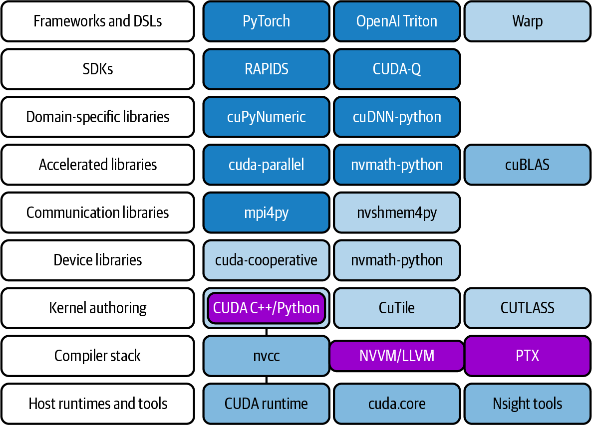
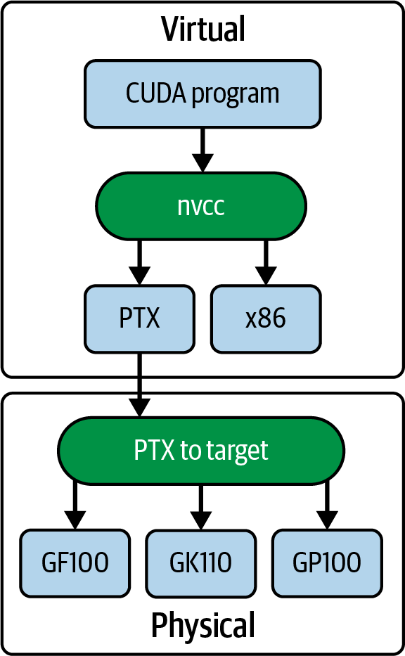
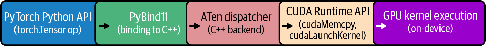
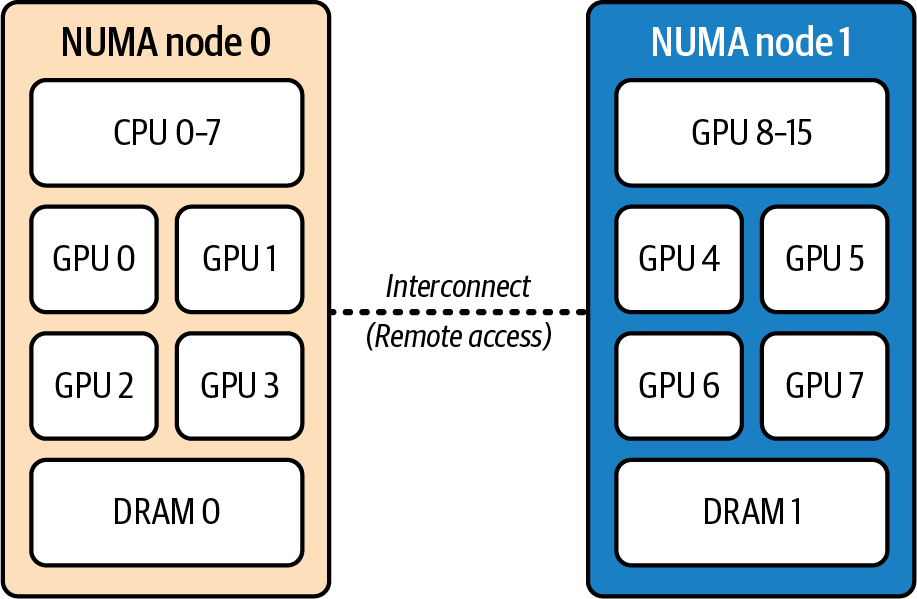
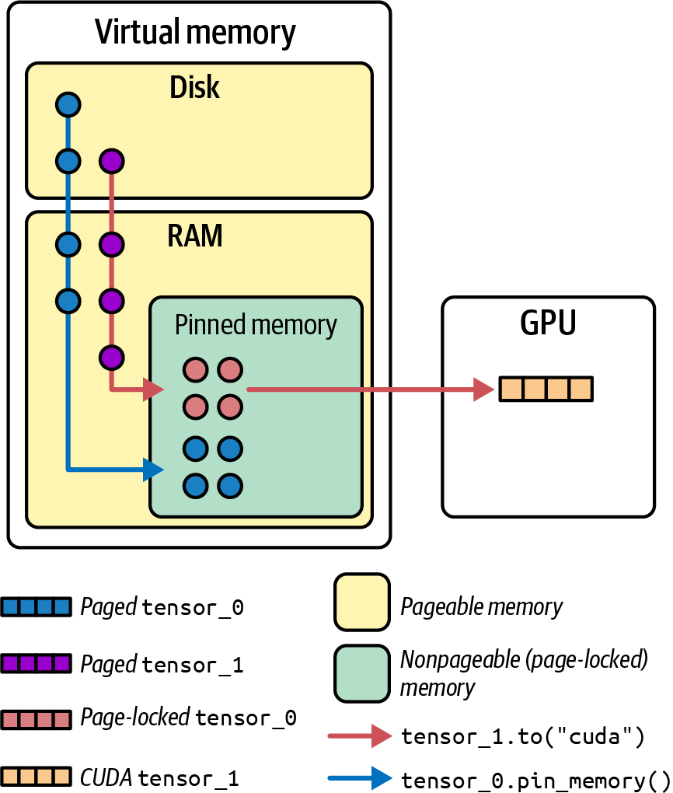
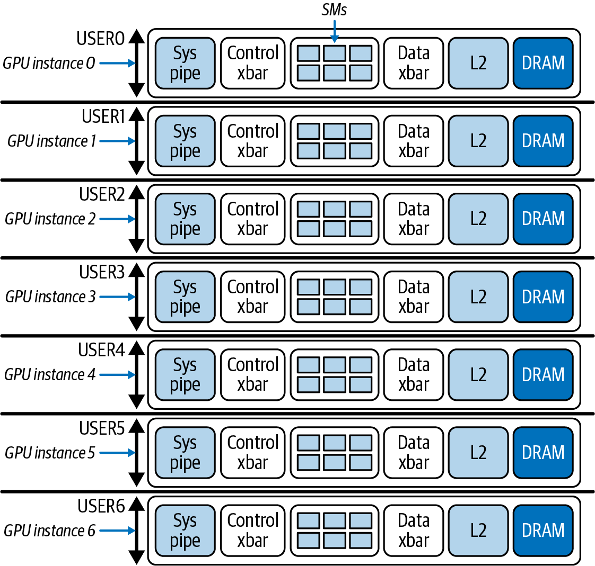

# 第3章 GPU环境的操作系统、Docker和Kubernetes调优

即使拥有高度优化的GPU代码和库，系统级瓶颈也可能限制大规模AI训练的性能。最快的GPU只有在环境能够有效提供数据和指令时才能发挥最大作用。在本章中，我们将探讨如何调优操作系统和容器运行时，让GPU发挥其全部潜力。

> Even with highly optimized GPU code and libraries, system-level bottlenecks can limit performance in large-scale AI training. The fastest GPU is only as good as the environment feeding it data and instructions. In this chapter, we explore how to tune the operating system and container runtime to let GPUs reach their full potential.

我们首先探索基础的GPU软件栈。然后深入探讨关键的CPU和内存优化，如NUMA亲和性和大页内存（hugepages）。这些确保数据能够高效地从存储通过CPU流向GPU。同时，我们讨论关键的GPU驱动设置，如持久化模式、多进程服务（MPS）和多实例GPU（MIG）分区。

> We begin by exploring the foundational GPU software stack. We then dive into key CPU and memory optimizations such as NUMA affinity and hugepages. These ensure that data flows efficiently from storage through the CPU to the GPU. In parallel, we discuss critical GPU driver settings like persistence mode, Multi-Process Service (MPS), and Multi-Instance GPU (MIG) partitions.

使用NVIDIA Container Toolkit、Container Runtime、Kubernetes Topology Manager和Kubernetes GPU Operator等解决方案，你可以为GPU环境创建统一且高度优化的软件栈。这些解决方案支持单节点和多节点GPU环境中的高效资源分配和工作负载调度——并确保GPU能力得到充分利用。

> Using solutions like the NVIDIA Container Toolkit, Container Runtime, Kubernetes Topology Manager, and Kubernetes GPU Operator, you can create a unified and highly optimized software stack for GPU environments. These solutions enable efficient resource allocation and workload scheduling across single-node and multinode GPU environments—and ensure GPU capabilities are fully utilized.

## 3.1 操作系统 (Operating System)

操作系统（OS）是一切运行的基础。GPU服务器通常运行Linux发行版，如Ubuntu Server LTS或Red Hat，并使用支持最新GPU硬件的更新内核。NVIDIA驱动安装内核模块，创建设备文件，如/dev/nvidia0、/dev/nvidia1和/dev/nvidia2——每个GPU一个。

> The operating system (OS) is the foundation that everything runs on. GPU servers typically run a Linux distribution such as Ubuntu Server LTS or Red Hat with an updated kernel that supports the latest GPU hardware. The NVIDIA driver installs kernel modules that create device files like /dev/nvidia0, /dev/nvidia1, and /dev/nvidia2—one for each GPU.

OS管理CPU调度、内存、网络和存储——所有这些都应该针对高GPU吞吐量进行调优。因此，OS应该配置为避免干扰GPU任务。例如，GPU节点应该禁用交换或将vm.swappiness设置为0，以避免任何OS发起的内存交换干扰GPU工作负载。

> The OS manages CPU scheduling, memory, networking, and storage—all of which should be tuned for high GPU throughput. As such, the OS should be configured to avoid interfering with GPU tasks. For example, GPU nodes should disable swapping or set vm.swappiness to 0 to avoid any OS-initiated memory swapping that could interfere with GPU workloads.

面向GPU的服务器可能需要运行额外的守护进程或后台进程，如NVIDIA Persistence Daemon以保持GPU驱动和硬件上下文加载并准备就绪——即使没有GPU作业运行。此外，Fabric Manager管理GPU互连拓扑。NVIDIA数据中心GPU管理器（DCGM）监控GPU系统健康指标。

> A GPU-focused server might want to run additional daemons, or background processes, such as the NVIDIA Persistence Daemon to keep the GPU driver and hardware context loaded and ready—even when no GPU jobs are running. In addition, the Fabric Manager manages GPU interconnect topology. And the NVIDIA Data Center GPU Manager (DCGM) monitors GPU system health metrics.

## 3.2 NVIDIA软件栈 (NVIDIA Software Stack)

运行多petaFLOP GPU集群不仅仅涉及编写高级PyTorch、TensorFlow或JAX代码。支撑GPU操作的是整个软件栈，每一层都可能影响性能。图3-1显示了用于开发和生产化现代LLM工作负载的常见框架、库、编译器、运行时和工具集。



> Running a multi-petaFLOP GPU cluster involves more than just writing high-level PyTorch, TensorFlow, or JAX code. There is a whole software stack underpinning GPU operations, and each layer can affect performance. Figure 3-1 shows a common set of frameworks, libraries, compilers, runtimes, and tools used to develop and productionize modern LLM workloads.

此外，NVIDIA GPU和CUDA生态系统拥抱Python库，允许你使用OpenAI的Triton领域特定语言（DSL）和NVIDIA的Warp框架等框架在Python中创建CUDA内核——以及NVIDIA的CUDA Python、cuTile和CUTLASS库。

> In addition, the NVIDIA GPU and CUDA ecosystem embraces Python libraries and allows you to create CUDA kernels in Python using frameworks like OpenAI's Triton domain-specific language (DSL) and NVIDIA's Warp framework—as well as NVIDIA's CUDA Python, cuTile, and CUTLASS libraries.

### 3.2.1 GPU驱动 (GPU Driver)

基础是NVIDIA GPU驱动，它在Linux OS和GPU硬件之间建立接口。驱动管理低级GPU操作，包括设备上的内存分配、GPU核心上的任务调度，以及为多租户使用分区GPU。

> At the base is the NVIDIA GPU driver, which interfaces between the Linux OS and the GPU hardware. The driver manages low-level GPU operations, including memory allocation on the device, task scheduling on GPU cores, and partitioning the GPU for multitenant usage.

GPU驱动开启GPU的功能并保持硬件有工作可做。保持NVIDIA驱动更新很重要。新驱动版本通常会解锁性能改进并支持最新的GPU架构和CUDA功能。nvidia-smi等工具随驱动提供，允许你监控温度、测量利用率、查询纠错码（ECC）内存状态，并启用不同的GPU模式。

> The GPU driver turns on the GPUs' features and keeps the hardware fed with work. It's important to keep the NVIDIA driver up-to-date. New driver releases often unlock performance improvements and support the latest GPU architectures and CUDA features. Tools such as nvidia-smi come with the driver and allow you to monitor temperatures, measure utilization, query error-correcting code (ECC) memory status, and enable different GPU modes like persistence mode.

### 3.2.2 CUDA Toolkit和运行时 (CUDA Toolkit and Runtime)

在驱动之上是CUDA Runtime和称为CUDA Toolkit的库。工具包包括CUDA编译器nvcc，用于编译CUDA C++内核。编译后，CUDA程序链接到CUDA运行时（cudart）。CUDA运行时直接与NVIDIA驱动通信，在GPU上启动工作并分配内存。

> On top of the driver sits the CUDA Runtime and libraries called the CUDA Toolkit. The toolkit includes the CUDA compiler, nvcc, used to compile CUDA C++ kernels. When compiled, CUDA programs link against the CUDA runtime (cudart). The CUDA runtime communicates directly with the NVIDIA driver to launch work and allocate memory on the GPU.

此外，CUDA Toolkit提供许多优化库：用于神经网络原语的cuDNN、用于线性代数的cuBLAS、用于多GPU通信的NCCL等。因此，使用支持GPU计算能力（CC）的最新CUDA Toolkit版本至关重要，因为最新的工具包具有针对你GPU的最新编译器优化和库。

> Additionally, the CUDA Toolkit provides many optimized libraries: cuDNN for neural network primitives, cuBLAS for linear algebra, NCCL for multi-GPU communication, etc. As such, it's critical to use the latest CUDA Toolkit version that supports your GPU's compute capability (CC) since an up-to-date toolkit has the latest compiler optimizations and libraries specific to your GPU.

### 3.2.3 CUDA跨GPU硬件代的向前和向后兼容性 (CUDA Forward and Backward Compatibility Across GPU Hardware Generations)

NVIDIA GPU编程模型的一个重要特性是其跨硬件代的兼容性。当你编译CUDA代码时，生成的二进制文件包含虚拟或中间PTX代码以及物理设备代码（例如，ARM、x86、GPU指令），如图3-2所示。



> An important feature of NVIDIA's GPU programming model is its compatibility across hardware generations. When you compile CUDA code, the resulting binary includes virtual, or intermediate, PTX code as well as physical device code (e.g., ARM, x86, GPU instructions), as shown in Figure 3-2.

这允许较新的GPU即时（JIT）编译PTX，使你的程序能在未来架构上运行——并允许较新的GPU执行针对先前架构的旧二进制代码。这种兼容性通过NVIDIA的fatbinary模型实现，该模型包含用于面向未来的PTX和用于已知架构的CUBIN（或架构特定的CUDA设备代码二进制文件）。

> This allows newer GPUs to just-in-time (JIT) compile the PTX so your program runs on future architectures—and allows newer GPUs to execute older binary code for prior architectures. This compatibility is achieved through NVIDIA's fatbinary model, which contains PTX for future-proofing and CUBIN, or architecture-specific CUDA device code binaries, for known architectures.

CUBIN是使用nvcc的-cubin选项生成的二进制文件。它包含为给定NVIDIA架构编译的GPU流汇编器（SASS）指令。它被打包成fatbinary，供CUDA驱动在运行时加载。与PTX（一种中间的、向前兼容的表示）不同，CUBIN二进制文件允许在已知GPU架构上直接执行。当与PTX一起包含在fatbinary中时，CUBIN支持为新GPU JIT编译PTX和在较新硬件上运行旧CUBIN代码。

> CUBIN is the binary produced by nvcc using the -cubin option. It contains compiled GPU streaming assembler (SASS) instructions for a given NVIDIA architecture. It's packaged into a fatbinary for loading by the CUDA driver at runtime. Unlike PTX, which is an intermediate, forward-compatible representation, CUBIN binary files allow direct execution on known GPU architectures. When included alongside PTX in a fatbinary, CUBIN supports both JIT-compiling PTX for future GPUs and running older CUBIN code on newer hardware.

简而言之，当嵌入PTX时，CUDA提供向前兼容性，因为驱动可以在运行时为新架构JIT编译PTX。CUBIN对象是架构特定的，不能向前兼容未来的GPU架构，因此你应该包含PTX或发布包含当前架构SASS和用于向前兼容性的PTX的fat binary（也称为"fatbinaries"或简称"fatbins"）。

> In short, CUDA provides forward compatibility when PTX is embedded because the driver can JIT-compile PTX for newer architectures at runtime. CUBIN objects are architecture-specific and are not forward-compatible to future GPU architectures, so you should include PTX or ship fat binaries (aka "fatbinaries" or just "fatbins") that contain both SASS for the current architectures and PTX for forward compatibility.

### 3.2.4 C++和Python CUDA库 (C++ and Python CUDA Libraries)

虽然大多数CUDA工具包库是C++，但NVIDIA当前面向Python的选项包括CUDA Python（例如，低级驱动和运行时访问）；cuPyNumeric、CuTe DSL、cuTile和CuPy用于数组编程；以及NVIDIA Warp用于在Python中编写GPU内核。CUTLASS是C++模板库，在cuBLAS等库的底层使用，而不是Python库。

> While most CUDA toolkit libraries are C++, NVIDIA's current Python-facing options include CUDA Python (e.g., low-level driver and runtime access); cuPyNumeric, CuTe DSL, cuTile, and CuPy for array programming; and NVIDIA Warp for authoring GPU kernels in Python. CUTLASS is a C++ templated library used under the hood by libraries such as cuBLAS rather than a Python library.

虽然大多数CUDA Toolkit库是基于C++的，但越来越多基于Python的库从NVIDIA涌现，它们以"Cu"为前缀并基于C++工具包构建。例如，cuTile和cuPyNumeric是2025年初推出的Python库。它们的目标是降低Python开发者使用CUDA为NVIDIA GPU构建应用程序的门槛。

> While most of the CUDA Toolkit libraries are C++ based, more and more Python-based libraries are emerging from NVIDIA that are prefixed with "Cu" and built upon the C++ toolkit. For instance, cuTile and cuPyNumeric are Python libraries launched in early 2025. They are targeted at lowering the barrier to entry for Python developers to build applications for NVIDIA GPUs using CUDA.

cuTile是一个Python库，旨在通过将大型矩阵分解为称为tile的更小、更易管理的子矩阵来简化GPU上的大型矩阵操作。它提供了高级的、基于tile的抽象，使执行块级计算、优化内存访问模式和高效调度GPU内核变得更加容易。通过将大型矩阵分成tile，cuTile帮助开发者充分利用GPU的并行性，而无需手动管理低级细节。这种方法可以改善缓存使用，并在需要密集矩阵计算的应用程序中提高整体性能。

> cuTile is a Python library designed to simplify working with large matrices on GPUs by breaking them into smaller, more manageable submatrices called tiles. It provides a high-level, tile-based abstraction that makes it easier to perform block-wise computations, optimize memory access patterns, and efficiently schedule GPU kernels. By dividing a large matrix into tiles, cuTile helps developers take full advantage of the GPU's parallelism without needing to manage low-level details manually. This approach can lead to improved cache usage and overall better performance in applications that require intensive matrix computations.

cuPyNumeric是流行的numpy Python库的即插即用替代品，它利用GPU。它提供与NumPy几乎相同的函数、方法和行为，因此开发者通常只需对代码进行最小更改即可切换到它。在底层，cuPyNumeric利用CUDA在GPU上并行执行操作。这为大规模数值计算、矩阵操作和数据分析等计算密集型任务带来显著的性能提升。通过将工作卸载到GPU，cuPyNumeric加速计算并提高处理海量数据集的应用程序的效率。其目标是为Python开发者降低利用GPU能力的门槛，而无需学习全新的接口，使其成为高性能计算中NumPy的强大替代品。

> cuPyNumeric is a drop-in replacement for the popular numpy Python library that utilizes the GPU. It provides nearly the same functions, methods, and behaviors as NumPy, so developers can often switch to it with minimal changes to their code. Under the hood, cuPyNumeric leverages CUDA to perform operations in parallel on the GPU. This leads to significant performance gains for compute-intensive tasks such as large-scale numerical computations, matrix operations, and data analysis. By offloading work to the GPU, cuPyNumeric accelerates computation and improves efficiency for applications handling massive datasets. Its goal is to lower the barrier for Python developers to harness GPU power without having to learn a completely new interface, making it a powerful drop-in alternative to NumPy for high-performance computing.

另一个值得注意的基于Python的编程模型是OpenAI的开源Triton语言和编译器。Triton是一个Python DSL，允许在Python中编写自定义GPU内核。虽然不是NVIDIA库，但Triton通过允许开发者直接在Python中编写高性能内核来补充CUDA。我们将在后面的章节中介绍Triton和各种基于Triton的优化，但只需知道Triton在许多情况下减少了对手工编写CUDA C++的需求。它已集成到PyTorch的编译器后端中，可自动优化和融合GPU操作以获得更好的性能。现在让我们转向PyTorch的讨论。

> Another notable Python-based programming model is OpenAI's open source Triton language and compiler. Triton is a Python DSL that allows writing custom GPU kernels in Python. While not an NVIDIA library, Triton complements CUDA by allowing developers to write high-performance kernels directly in Python. We cover Triton and various Triton-based optimizations in a later chapter, but just know that Triton reduces the need for handwritten CUDA C++ in many cases. And it's integrated into PyTorch's compiler backend to automatically optimize and fuse GPU operations for better performance. Let's now turn the discussion to PyTorch.

### 3.2.5 PyTorch和高级AI框架 (PyTorch and Higher-Level AI Frameworks)

一些基于CUDA构建的流行Python框架包括PyTorch、TensorFlow、JAX和Keras。这些框架为深度学习提供高级接口，同时利用NVIDIA GPU的能力。本书主要关注PyTorch的编译和图优化功能，包括torch.compile栈。

> Some popular Python-based frameworks built on CUDA are PyTorch, TensorFlow, JAX, and Keras. These frameworks provide high-level interfaces for deep learning while leveraging the power of NVIDIA GPUs. This book primarily focuses on PyTorch's compilation and graph optimization features, including the torch.compile stack.

PyTorch编译器栈由TorchDynamo、AOT Autograd和TorchInductor或加速线性代数（XLA）等后端组成，它们自动捕获和优化你的模型。TorchInductor是最常见的后端，它在底层使用OpenAI的Triton。Triton融合内核并为你的特定GPU和系统环境执行内核自动调优，我们将在第14章介绍。

> The PyTorch compiler stack consists of TorchDynamo, AOT Autograd, and a backend like TorchInductor or Accelerated Linear Algebra (XLA), which automatically capture and optimize your models. TorchInductor is the most common backend, and it uses OpenAI's Triton under the hood. Triton fuses kernels and performs kernel autotuning for your specific GPU and system environment, as we'll cover in Chapter 14.

当你使用GPU对PyTorch张量执行操作时，它们从CPU移动到GPU，看起来像是单个Python调用。然而，这个单个调用实际上被转换为一系列对CUDA运行时的调用，利用各种CUDA库，如图3-3所示。



> When you perform operations on PyTorch tensors using GPUs, they are moved from the CPU to the GPU in what appears to be a single Python call. However, this single call is actually translated into a series of calls to the CUDA runtime utilizing various CUDA libraries, as shown in Figure 3-3.

例如，当你执行矩阵乘法时，PyTorch将这些任务委托给cuBLAS等库。cuBLAS是CUDA Toolkit的一部分，针对GPU执行进行了优化。在幕后，PyTorch确保前向和后向传递等操作使用低级、优化的CUDA函数和库执行。

> When you perform matrix multiplications, for example, PyTorch delegates these tasks to libraries such as cuBLAS. cuBLAS is part of the CUDA Toolkit and optimized for GPU execution. Behind the scenes, PyTorch ensures that operations like forward and backward passes are executed using low-level, optimized CUDA functions and libraries.

简而言之，PyTorch抽象了直接CUDA编程的复杂性，允许你编写直观的Python代码，最终调用高度优化的CUDA例程，既提供开发便捷性又提供高性能。我们将在第4章和第5章讨论CUDA编程和优化——以及第9章的PyTorch优化。

> In short, PyTorch abstracts away the complexity of direct CUDA programming, allowing you to write intuitive Python code that ultimately calls highly optimized CUDA routines, delivering both ease of development and high performance. We will discuss CUDA programming and optimizations in Chapters 4 and 5—as well as PyTorch optimizations in Chapter 9.

所有这些组件——OS、GPU驱动、CUDA Toolkit、CUDA库和PyTorch——必须协同工作，才能创建理想的基于GPU的开发环境。当研究人员提交训练作业时，调度器保留节点，OS使用NVIDIA驱动提供GPU设备和内存分配，容器提供正确的软件环境（包括优化的、硬件感知的CUDA库）。用户代码（如PyTorch、TensorFlow、JAX）使用这些CUDA库，这些库最终与驱动和硬件通信。本章描述的优化旨在使这个栈的每一层尽可能高效。它们将帮助GPU保持忙碌于实际有用的训练和推理工作——而不是GPU等待CPU、等待内存或磁盘I/O，或等待其他GPU同步。

> All of these components—OS, GPU Driver, CUDA Toolkit, CUDA libraries, and PyTorch—must work together to create the ideal GPU-based development environment. When a researcher submits a training job, the scheduler reserves nodes, the OS provides the GPU devices and memory allocations using the NVIDIA driver, and the container provides the correct software environment (including the optimized, hardware-aware CUDA libraries). The user code (e.g., PyTorch, TensorFlow, JAX) uses these CUDA libraries, which ultimately communicate with the driver and hardware. The optimizations described in this chapter are designed to make each layer of this stack as efficient as possible. They will help the GPUs stay busy with actual useful training and inference work—instead of the GPU waiting on the CPU, waiting for memory or disk I/O, or waiting on other GPUs to synchronize.

一个调优良好的系统确保跨数十个GPU分割的模型不会因I/O或OS开销而成为瓶颈。系统级调优经常被忽视，取而代之的是模型优化，但系统级优化可以产生显著的性能提升。在某些情况下，通过对OS级配置进行小调整，你可以获得两位数的百分比改进。在大型AI项目的规模下，这可以节省数万或数十万美元的计算时间。

> A well-tuned system ensures that models split across dozens of GPUs are not bottlenecked by I/O or OS overhead. System-level tuning is often overlooked in favor of model optimizations, but system-level optimizations can yield substantial performance gains. In some cases, you can get double-digit percentage improvements with small tweaks to your OS-level configuration. At the scale of a big AI project, this can save tens or hundreds of thousands of dollars in compute time.

## 3.3 为GPU环境配置CPU和OS (Configuring the CPUs and OS for GPU Environments)

GPU无法达到充分利用的最常见原因之一是CPU没有为它们提供有用的工作。在典型的训练循环中，CPU负责准备下一批数据，包括从磁盘加载数据、对数据进行分词、转换数据等。此外，CPU负责调度GPU内核并协调线程和进程之间的工作。

> One of the most common reasons that GPUs don't reach full utilization is that the CPU isn't keeping them fed with useful work. In a typical training loop, the CPU is responsible for preparing the next batch of data, including loading the data from disk, tokenizing the data, transforming it, etc. In addition, the CPU is responsible for dispatching GPU kernels and coordinating between threads and processes.

如果这些主机端任务很慢——或者OS调度它们不当——昂贵的GPU可能会发现自己空闲，等待下一个任务或数据批次。为了避免这种情况，我们需要优化CPU和OS处理GPU工作负载的方式。

> If these host-side tasks are slow—or if the OS schedules them poorly—the expensive GPU can find itself idle, twiddling its transistors and waiting for the next task or batch of data. To avoid this, we need to optimize how the CPU and OS handle GPU workloads.

这些优化包括设置CPU亲和性以避免跨NUMA节点流量，使用内存分配策略避免NUMA惩罚，以及应用OS级更改消除不必要的延迟。这样，GPU永远不会因数据而饥饿。

> These optimizations include setting the CPU affinity to avoid cross-NUMA-node traffic so the right cores handle the right data, using memory-allocation strategies to avoid NUMA penalties and applying OS-level changes to eliminate unnecessary latency. This way, the GPU is never starved for data.

### 3.3.1 NUMA感知和CPU绑定 (NUMA Awareness and CPU Pinning)

现代服务器CPU有数十个核心，通常分为多个NUMA节点。NUMA节点是CPU、GPU、网络接口控制器（NIC）和内存的逻辑分组，它们在物理上彼此靠近。了解系统的NUMA架构对性能调优很重要。在单个NUMA节点内访问资源比访问其他NUMA节点中的资源更快。

> Modern server CPUs have dozens of cores and are often split into multiple NUMA nodes. A NUMA node is a logical grouping of CPUs, GPUs, network interface controllers (NICs), and memory that are physically close to one another. Being aware of the system's NUMA architecture is important for performance tuning. Accessing resources within a single NUMA node is faster than accessing resources in other NUMA nodes.

例如，如果运行在NUMA节点0中CPU上的进程需要访问NUMA节点1中的GPU，它需要跨节点链路发送数据，这将产生更高的延迟。实际上，跨NUMA节点时内存访问延迟几乎会翻倍。

> For example, if a process running on a CPU in NUMA node 0 needs to access a GPU in NUMA node 1, it will need to send data across an internode link, which will incur higher latency. In fact, memory access latency can nearly double when crossing to the other NUMA nodes.

在基于Grace的超级芯片（如GH200和GB200）上，CPU和GPU通过NVLink-C2C连接，该链路在Grace与其配对的加速器之间提供高达约900 GB/s的一致CPU到GPU内存访问。Linux仍将CPU DRAM视为CPU NUMA内存，将GPU HBM视为设备内存。因此，你应该继续将CPU线程绑定到本地Grace CPU并尊重数据局部性，即使一致性降低了软件开销。

> On Grace-based superchips such as GH200 and GB200, the CPU and GPU are linked by NVLink-C2C, which provides coherent CPU-to-GPU memory access at up to ~900 GB/s between Grace and its paired accelerator. Linux still treats CPU DRAM as CPU NUMA memory and GPU HBM as device memory. As such, you should continue to bind CPU threads to the local Grace CPU and respect data locality, even though coherence reduces software overheads.

在许多双插槽系统上，远程内存访问延迟可能显著高于本地内存访问。在一个实验中，本地NUMA节点内存访问延迟约为80 ns，而远程（跨节点）内存访问延迟约为139 ns。这大约是75%的延迟增加，这是本地和远程NUMA节点内存访问速度之间的巨大差异。

> On many dual-socket systems, remote memory access latency can be significantly higher than local memory access. In one experiment, local NUMA node memory access latency is ~80 ns compared to remote (cross-node) memory access latency of ~139 ns. This is roughly a 75% increase in latency, which is a huge difference in access speed between local and remote NUMA node memory access.

通过将进程绑定到与其GPU位于同一NUMA节点的CPU，我们可以避免这种额外开销。例如，你可以使用numactl --cpunodebind=<node> --membind=<node>将CPU线程和内存分配绑定到GPU的本地NUMA节点。你将在稍后了解更多关于此内容。关键思想是将CPU执行和内存访问保持在服务于GPU的本地。

> By binding a process to a CPU on the same NUMA node as its GPU, we can avoid this extra overhead. For instance, you can use numactl --cpunodebind=<node> --membind=<node> to bind both CPU threads and memory allocations to the GPU's local NUMA node. You'll learn more about this in a bit. The key idea is to keep CPU execution and memory access local to the GPU that it's serving.

虽然Linux包含基本的NUMA平衡，但对于性能关键的AI工作负载通常不够。默认情况下，进程可能会跨NUMA节点迁移。这将导致远程内存访问带来的额外延迟。因此，重要的是将进程和内存显式绑定到与本地GPU相同的NUMA节点。你可以使用numactl、taskset或cgroups来实现，我们将在稍后展示。

> While Linux includes basic NUMA balancing, it's usually not sufficient for performance-critical AI workloads. By default, processes may be migrated across NUMA nodes. This will lead to additional latency caused by remote memory accesses. As such, it's important to explicitly bind processes and memory to the same NUMA node as the local GPU. You can do this using numactl, taskset, or cgroups, as we'll show in a bit.

要显式指定NUMA亲和性，你需要将进程或线程"绑定"到与GPU连接到同一NUMA节点的特定CPU。这种类型的CPU亲和性称为CPU绑定。假设你在一个节点中有八个GPU，其中四个GPU连接到NUMA节点0，另外四个连接到NUMA节点1。

> To explicitly specify NUMA-affinity, you need to "pin" processes or threads to specific CPUs that are connected to the same NUMA node as the GPU. This type of CPU affinity is called CPU pinning. Suppose you have eight GPUs in a node, with four GPUs connected to NUMA node 0 and the other four to NUMA node 1.

如果你启动八个训练进程，每个GPU一个，你应该将每个训练进程绑定到与GPU连接到同一NUMA节点的CPU核心或CPU核心集。在这种情况下，GPU 0-3连接到NUMA节点0，GPU 4-7连接到NUMA节点1的核心，如图3-4所示。



> If you launch eight training processes, one per GPU, you should bind each training process to a CPU core—or set of CPU cores—connected to the same NUMA node as the GPUs. In this case, GPUs 0–3 are connected to NUMA node 0 and GPUs 4–7 are connected to NUMA node 1's cores, as shown in Figure 3-4.

这样，当CPU进程想要向GPU 4提供数据时，它应该运行在连接到NUMA节点1的CPU上，因为GPU 4连接到NUMA节点1。Linux提供了执行此操作的工具，包括numactl --cpunodebind=<node> --membind=<node>，它启动绑定到给定NUMA节点的进程。

> This way, when a CPU process wants to feed data to GPU 4, it should be running on a CPU connected to NUMA node 1 since GPU 4 is connected to NUMA node 1. Linux provides tools to do this, including numactl --cpunodebind=<node> --membind=<node>, which launches a process pinned to the given NUMA node.

你也可以使用taskset将进程绑定到特定的核心ID。以下是使用numactl将train.py脚本绑定到与GPU 4在同一NUMA节点1中运行的CPU的示例：

```bash
numactl --cpunodebind=1 --membind=1 \
    python train.py --gpu 4
```

> You can also use taskset to pin processes to specific core IDs. Here is an example using numactl to bind the train.py script to a CPU running in the same NUMA node 1 as GPU 4:

以下脚本使用nvidia-smi topo动态查询拓扑，并使用本地NUMA节点将脚本绑定到GPU：

```bash
#!/bin/bash
for GPU in 0 1 2 3; do
  # Query NUMA node for this GPU
  NODE=$(nvidia-smi topo -m -i $GPU \
         | awk '/NUMA Affinity/ {print $NF}')

  # Launch the training process pinned to that NUMA node
  numactl --cpunodebind=$NODE --membind=$NODE \
    bash -c "CUDA_VISIBLE_DEVICES=$GPU python train.py --gpu $GPU"
done
```

> The following script dynamically queries the topology using nvidia-smi topo and binds the script to GPUs using the local NUMA node:

许多深度学习框架还允许你以编程方式设置线程亲和性。例如，PyTorch的DataLoader暴露worker_init_fn，以便你可以在初始化期间为每个工作进程设置CPU亲和性。

> Many deep learning frameworks also let you set thread affinities programmatically. For instance, PyTorch's DataLoader exposes worker_init_fn so you can set CPU affinity for each worker process during initialization.

虽然Linux包含基本的NUMA平衡，但对于性能关键的AI工作负载通常不够。默认情况下，进程可能会跨NUMA节点迁移。这将导致远程内存访问带来的额外延迟。因此，重要的是将进程和内存显式绑定到与本地GPU相同的NUMA节点。

> While Linux includes basic NUMA balancing, it's usually not sufficient for performance-critical AI workloads. By default, processes may be migrated across NUMA nodes. This will lead to additional latency caused by remote memory accesses. As such, it's important to explicitly bind processes and memory to the same NUMA node as the local GPU.

### 3.3.2 NUMA友好的内存分配和内存固定 (NUMA-Friendly Memory Allocation and Memory Pinning)

默认情况下，进程将从其当前运行的CPU的NUMA节点分配内存。因此，如果你将进程绑定到NUMA节点0，其内存将自然来自NUMA节点0的本地RAM，这是理想的。但是，如果OS调度器迁移线程——或者如果你在绑定之前分配了一些内存——你可能会遇到进程运行在NUMA节点0但使用NUMA节点1内存的非理想情况。

> By default, a process will allocate memory from the NUMA node of the CPU it's currently running on. So if you pin a process to NUMA node 0, its memory will naturally come from NUMA node 0's local RAM, which is ideal. However, if the OS scheduler migrates threads—or if some memory was allocated before you did the pinning—you could end up with the nonideal scenario in which a process running in NUMA node 0 is using memory from NUMA node 1.

为了避免这种情况，numactl --membind选项强制从特定NUMA节点分配内存。一般规则是保持内存靠近CPU，CPU靠近GPU。这样，从内存到CPU到GPU的数据移动链都在单个NUMA节点内。

> To avoid this, the numactl --membind option forces memory allocation from a specific NUMA node. The general rule is to keep memory close to the CPU, which is close to the GPU. That way the chain of data movement from memory to CPU to GPU is all within a single NUMA node.

此外，固定内存（也称为页锁定内存）对于高效的直接GPU访问至关重要。当内存被固定时，OS不会交换或移动它。这导致更快的直接内存访问（DMA）传输。从固定主机内存复制数据到GPU可以比从常规可分页内存快2-3倍，因为GPU或NIC可以直接执行DMA。

> In addition, pinned memory, also called page-locked memory, is essential for efficient and direct GPU access. When memory is pinned, the OS won't swap or move it. This leads to faster direct memory access (DMA) transfers. Copying data from pinned host memory to GPU can be 2–3× faster than from regular pageable memory since the GPU or NIC can perform DMA directly.

你可以使用已安装的CUDA工具中的bandwidthTest --memory=<pinned or pageable>来测试CPU内存和GPU内存之间的数据传输带宽。

> You can test the data-transfer bandwidth between CPU memory and GPU memory using bandwidthTest --memory=<pinned or pageable> from the installed CUDA utilities.

事实上，这是NVIDIA GPUDirect技术的基础，例如GPUDirect RDMA，它允许InfiniBand等NIC直接与GPU内存交换数据。类似地，GPUDirect Storage（GDS）允许NVMe驱动器将数据流式传输到GPU内存，而无需额外的CPU开销。

> In fact, this is the basis of NVIDIA's GPUDirect technologies such as GPUDirect RDMA, which allows NICs like InfiniBand to directly exchange data with GPU memory. Similarly, GPUDirect Storage (GDS) allows NVMe drives to stream data into GPU memory without extra CPU overhead.

深度学习框架提供选项为数据加载器使用固定内存。例如，PyTorch的DataLoader有一个标志pin_memory=True，当为true时，意味着加载的批次将被放置在固定RAM中，如图3-5所示。



> Deep learning frameworks provide options to use pinned memory for data loaders. For example, PyTorch's DataLoader has a flag pin_memory=True, which, when true, means the batches loaded will be placed in pinned RAM, as shown in Figure 3-5.

内存固定加速了tensor.to(device)操作，因为CUDA驱动程序不必即时固定页面。当你使用大批量大小或每次迭代读取大量数据时，这尤其有益。许多从业者注意到，在PyTorch中仅启用pin_memory=True就可以通过减少数据传输瓶颈和提高主机到设备传输吞吐量来提高性能10%-20%。

> Memory pinning speeds up the tensor.to(device) operations because the CUDA driver doesn't have to pin pages on the fly. It's especially beneficial when you are using large batch sizes or reading a lot of data in each iteration. Many practitioners have noticed that just turning on pin_memory=True in PyTorch can improve performance up to 10%–20% by reducing data transfer bottlenecks and increasing host-to-device transfer throughput.

简而言之，你应该确保数据加载器使用固定内存（例如，PyTorch DataLoader中的pin_memory=True），并为支持的硬件启用GPUDirect RDMA和GDS。这将减少数据传输延迟。

> In short, you should make sure that your data loader uses pinned memory (e.g., pin_memory=True in PyTorch DataLoader) and that GPUDirect RDMA and GDS are enabled for supported hardware. This will reduce data transfer latency.

### 3.3.3 透明大页内存 (Transparent Hugepages)

除了固定内存并将其绑定到NUMA节点外，我们还应该讨论透明大页内存（THP）。Linux内存管理通常使用4 KB页面，但当你有使用数十或数百GB内存的进程时（如深度学习数据集、预取批次、模型参数等），管理数百万个小页面是低效的。

> In addition to pinning memory and binding it to NUMA nodes, we should talk about transparent hugepages (THPs). Linux memory management typically uses 4 KB pages, but managing millions of tiny pages is inefficient when you have processes using tens or hundreds of gigabytes of memory, as in the case of deep learning datasets, prefetched batches, model parameters, etc.

大页内存——2 MB甚至1 GB页面——可以通过使内存块更大来减少虚拟内存管理的开销。主要好处是更少的页面错误和更少的转换后备缓冲区（TLB）压力。TLB是CPU用于将虚拟地址映射到物理地址的缓存。更少、更大的页面意味着TLB可以用相同数量的条目覆盖更多内存，减少未命中。

> Hugepages—2 MB or even 1 GB pages—can reduce the overhead of virtual memory management by making memory chunks bigger. The main benefits are fewer page faults and less pressure on the translation lookaside Buffer (TLB). The TLB is a cache that the CPU uses to map virtual addresses to physical ones. Fewer, larger pages means the TLB can cover more memory with the same number of entries, reducing misses.

大页内存通常产生适度的改进——通常约3%-5%的吞吐量提升。它们通过减少页面错误开销和TLB压力来实现这一点。启用THP在大多数系统上是一个简单的胜利，因为内核会自动用2 MB页面支持大型分配。

> Hugepages typically produce modest gains—often on the order of ~3%–5% throughput improvement. They do this by reducing page-fault overhead and TLB pressure. Enabling THP is a simple win on most systems since the kernel will automatically back large allocations with 2 MB pages.

现代共识是为大多数基于GPU的训练工作负载启用THP，其中吞吐量很重要；对于推理等延迟重要的工作负载，完全禁用THP（transparent_hugepage=never）——或使用madvise。对于许多rank（GPU）同时分配内存的分布式训练工作负载也是如此。

> The modern consensus is to enable THP for most GPU-based training workloads in which throughput is important and to disable THP completely (transparent_hugepage=never)—or use madvise—for workloads like inference in which latency is important. This is also true for distributed training workloads in which many ranks (GPUs) allocate memory simultaneously.

### 3.3.4 调度器和中断亲和性 (Scheduler and Interrupt Affinity)

在繁忙的系统上，你需要确保重要线程（如数据管道线程）不会被频繁中断。Linux默认使用完全公平调度器（CFS），在大多数情况下工作良好。但如果你有一个非常延迟敏感的线程向GPU提供数据，你可以考虑为该线程使用实时先进先出（FIFO）或轮询（RR）优先级调度。

> On a busy system, you want to make sure that important threads such as data-pipeline threads aren't interrupted frequently. Linux by default uses the Completely Fair Scheduler (CFS) that works well for most cases. But if you have a very latency-sensitive thread that feeds the GPU with data, for example, you could consider using real-time first in, first out (FIFO) or round-robin (RR) priority scheduling for that thread.

另一个选择是隔离核心或创建单独的CPU分区，以进一步减少这些专用计算资源上的中断。为此，你可以使用cset、内核参数如isolcpus和nohz_full，或cgroup cpuset隔离。通过隔离，OS调度器将这些CPU核心留给你随意使用。

> Another option is to isolate cores or create separate CPU partitions to further reduce interruptions on these dedicated compute resources. To do this, you can use cset, kernel parameters like isolcpus and nohz_full, or cgroup cpuset isolation. With isolation, the OS scheduler leaves those CPU cores for you to use as you wish.

你可以将每个设备的硬件中断分配给同一NUMA节点上的核心。这将防止跨节点中断处理，否则会产生额外延迟并驱逐远程节点上有用的缓存行。

> You can assign each device's hardware interrupts to cores on the same NUMA node. This will prevent cross-node interrupt handling that would otherwise incur extra latency and evict useful cache lines on a remote node.

### 3.3.5 虚拟内存和交换 (Virtual Memory and Swapping)

不言而喻，但你应该始终尝试避免内存交换。如果进程的任何部分被交换到磁盘，你将看到灾难性的、多个数量级的减速。GPU程序倾向于分配大量主机内存用于数据缓存。如果OS决定将一些数据从内存交换到磁盘，当GPU需要访问该数据时将经历巨大延迟。

> It goes without saying, but you should always try to avoid memory swapping. If any part of your process's memory gets swapped to disk, you will see a catastrophic, multiple-orders-of-magnitude slowdown. GPU programs tend to allocate a lot of host memory for data caching. If the OS decides to swap some data out of memory and onto disk, the GPU will experience huge delays when it needs to access that data.

我们建议设置vm.swappiness=0，这告诉Linux避免交换，除非在极端内存压力下。你也可以使用sudo swapoff -a临时禁用所有交换设备和文件，直到下次重启。只需确保你有足够的RAM用于工作负载——或设置限制以防止过度提交。否则，OOM killer可能会终止进程。

> We recommend setting vm.swappiness=0, which tells Linux to avoid swapping except under extreme memory pressure. You can also use sudo swapoff -a to temporarily disable all swap devices and files until the next reboot. Just make sure you have enough RAM for your workload—or put limits to prevent overcommit. Otherwise, the OOM killer may reap the process.

### 3.3.6 文件系统缓存和回写 (Filesystem Caching and Write-Back)

大型训练作业的最佳实践是频繁将检查点写入磁盘，以便你可以从已知良好检查点重新启动失败的作业。然而，在检查点期间，巨大的数据突发可能会填满OS页面缓存并导致停顿。

> A best practice for large training jobs is to write frequent checkpoints to disk in case you need to restart a failed job from a known good checkpoint. During checkpointing, however, huge bursts of data might fill up the OS page cache and cause stalls.

对于存储，你可以调整vm.dirty_ratio和vm.dirty_background_ratio来调整页面缓存大小以缓冲写入。例如，对于多GB检查点，使用更高的脏数据比率让OS在刷新到磁盘之前在RAM中批处理更多数据。这将平滑大型检查点写入并减少训练循环中的停顿。

> For storage, you can adjust vm.dirty_ratio and vm.dirty_background_ratio to tune the page-cache size for buffering writes. For example, with multi-GB checkpoints, using a higher dirty ratio lets the OS batch more data in RAM before flushing to disk. This will smooth out large checkpoint writes and reduce stalls in your training loop.

### 3.3.7 CPU频率和C状态 (CPU Frequency and C-states)

默认情况下，许多计算节点将以省电模式运行CPU，这会降低CPU频率或在空闲时使其休眠。这有助于节省能源、减少热量并降低成本。在模型训练期间，当GPU正在处理其数据集的最后批次时，CPU可能不会始终100%利用。然而，当新工作到达时，这些电源管理功能可能会导致额外延迟。

> By default, many compute nodes will run CPUs in a power-saving mode, which either downclocks a CPU or puts it to sleep when it's idle. This helps save energy and reduce heat and lowers the cost. During model training, the CPUs might not always be 100% utilized as the GPUs are churning through the final batches of their dataset. However, these power management features could cause extra latency when the system wakes the CPUs up again when new work arrives.

为获得最大和一致的性能，AI系统通常将CPU频率调控器配置为"performance"模式，这使CPU始终保持最大频率。这可以使用cpupower frequency-set -g performance或在BIOS中完成。

> For maximum and consistent performance, AI systems often configure the CPU frequency governor to "performance" mode, which keeps the CPU at max frequency all the time. This can be done using cpupower frequency-set -g performance or in the BIOS.

同样，禁用深度C状态可以防止核心进入低功耗休眠状态。CPU C状态是由系统ACPI规范定义的省电模式。当CPU核心空闲时，它可以进入C状态以节省能源。C状态越深，节省的功率越多，但当工作到达时核心唤醒可能需要更长时间。禁用更深的C状态可以消除过多的延迟峰值。

> Likewise, disabling deep C-states can keep cores from going into a low-power sleep state. CPU C-states are power-saving modes defined by the system's ACPI specification. When a CPU core is idle, it can enter a C-state to save energy. The deeper the C-state, the more power is saved but the longer it may take for the core to wake up when work arrives. Disabling deeper C-states can remove excessive latency spikes.

### 3.3.8 调优主机CPU内存分配器 (Tune Host CPU Memory Allocator)

在调优良好的GPU服务器上，CPU使用率可能不会很高，因为GPU处理大部分计算。然而，CPU使用率应保持稳定并与GPU活动同步。CPU必须保持忙碌准备每个传入批次，而当前批次正被GPU处理。正确的CPU到GPU交接对于维持高GPU利用率至关重要。

> On a well-tuned GPU server, CPU usage may not be very high since GPUs handle most of the computation. However, CPU usage should remain steady and in lockstep with GPU activity. The CPUs must stay busy preparing each incoming batch while the current batch is being processed by the GPU. Proper CPU‐to‐GPU handoff is crucial for sustaining high GPU utilization.

通过调优主机的内存分配器（jemalloc或tcmalloc），你可以消除数据准备中不可预测的停顿。这将使GPU以峰值运行——除了有意的同步点。

> By tuning your host's memory allocator (jemalloc or tcmalloc), you can eliminate unpredictable pauses in data preparation. This will keep GPUs running at their peak—except for intentional synchronization points.

调优后，你应该看到每个GPU的利用率接近100%，仅在必要的同步屏障处下降。GPU永远不应因CPU端延迟而停顿等待数据。使用jemalloc，你可以将分配分片到每CPU arena（narenas），启用background_thread用于离路径清除，并延长dirty_decay_ms/muzzy_decay_ms，以便释放的页面不会立即返回给OS。这将最小化锁争用和碎片。

> After tuning, you should see each GPU's utilization hover near 100% and drop only at required synchronization barriers. The GPUs should never stall for data due to CPU-side delays. With jemalloc, you can shard allocations into per-CPU arenas (narenas), enable background_thread for off-path purging, and lengthen dirty_decay_ms/muzzy_decay_ms so that freed pages aren't immediately returned to the OS. This will minimize lock contention and fragmentation.

你可以使用MALLOC_CONF环境变量调优jemalloc：

```bash
export MALLOC_CONF="narenas:8,dirty_decay_ms:10000,muzzy_decay_ms:10000,background_thread:true"
```

> You can tune jemalloc with the MALLOC_CONF environment variable:

同样，tcmalloc受益于调优TCMALLOC_MAX_TOTAL_THREAD_CACHE_BYTES和TCMALLOC_RELEASE_RATE环境变量。这些将提供更大的每线程缓存，以便小分配避免全局锁和系统调用——保持CPU线程准备好以低、可预测的延迟为GPU提供数据。

```bash
export TCMALLOC_MAX_TOTAL_THREAD_CACHE_BYTES=$((512*1024*1024))
export TCMALLOC_RELEASE_RATE=16
```

> Similarly, tcmalloc benefits from tuning the TCMALLOC_MAX_TOTAL_THREAD_CACHE_BYTES and TCMALLOC_RELEASE_RATE environment variables. These will provide larger per-thread caches so that small allocations avoid global locks and syscalls—keeping CPU threads ready to feed the GPU with low, predictable latency.

## 3.4 GPU驱动和运行时性能设置 (GPU Driver and Runtime Settings for Performance)

我们已经优化了CPU端，但GPU驱动和运行时也有一些重要设置可能影响性能——特别是在多GPU和多用户场景中。NVIDIA GPU有一些旋钮，当正确调优时，可以减少开销并改善多个工作负载共享GPU的方式。

> We've optimized the CPU side, but there are also important settings for the GPU driver and runtime that can affect performance—especially in multi-GPU and multiuser scenarios. NVIDIA GPUs have a few knobs that, when tuned properly, can reduce overhead and improve how multiple workloads share a GPU.

### 3.4.1 GPU持久化模式 (GPU Persistence Mode)

默认情况下，如果没有应用程序使用GPU，驱动可能会将GPU置于较低功耗状态并卸载部分驱动上下文。下次应用程序想要使用GPU时，初始化它需要成本。驱动启动所有内容可能需要一两秒。

> By default, if no application is using a GPU, the driver may put the GPU into a lower-power state and unload some of the driver's context. The next time an application comes along and wants to use the GPU, there's a cost to initialize it. This can take on the order of a second or two for the driver to spin everything up.

GPU初始化开销可能会对定期释放和重新获取GPU的工作负载产生负面影响。例如，考虑一个作业频繁启动和停止的训练集群。或者一个低容量推理集群，每次新推理请求到达时都必须唤醒GPU。在这两种情况下，开销都会降低整体工作负载性能。

> GPU initialization overhead can negatively impact performance for workloads that periodically release and reacquire the GPU. For instance, consider a training cluster where jobs are starting and stopping frequently. Or a low-volume inference cluster that has to wake up the GPU every time a new inference request arrives. In both of these cases, the overhead will reduce overall workload performance.

持久化模式通过运行nvidia-persistenced守护进程启用。这保持GPU驱动加载和硬件处于就绪状态，即使没有应用程序活动。这请求系统在空闲时不要完全关闭GPU电源，这可以防止电源门控。

> Persistence mode is enabled by running the nvidia-persistenced daemon. This keeps the GPU driver loaded and the hardware in a ready state even when no application is active. This requests that the system not fully power down the GPU when idle, which prevents power gating.

持久化保持GPU唤醒，以便下一个作业零启动延迟。这通常推荐用于长时间运行和延迟敏感的工作负载。你可以在启动时使用以下命令启用持久化守护进程：

```bash
systemctl enable nvidia-persistenced
```

> Persistence keeps the GPU awake so that the next job has zero startup delay. This is generally recommended for long-running and latency-sensitive workloads. You can enable the persistence daemon at boot time using the following command:

在AI集群上，通常在服务器启动时在所有GPU上启用持久化模式。这样，当作业开始时，GPU已经初始化并可以立即开始处理。它不会使你的实际计算更快，因为它不会加速数学运算，但它可以减少作业启动延迟并防止冷启动延迟。

> On AI clusters, it's common to just enable persistence mode on all GPUs at server boot time. This way, when a job begins, the GPUs are already initialized and can start processing immediately. It won't make your actual compute any faster, as it doesn't speed up the math operations, but it shaves off job-startup latency and prevents cold start delays.

### 3.4.2 MPS

通常，当多个进程共享单个GPU时，GPU的调度器在它们之间进行时间分片。例如，如果两个Python进程各自有一些内核要在同一GPU上运行，GPU可能会执行一个进程的内核，然后执行另一个进程的内核，依此类推。如果这些内核很短，并且它们之间有空闲间隙，GPU可能会最终利用不足，因为它在进行"乒乓"上下文切换而没有重叠工作。

> Normally, when multiple processes share a single GPU, the GPU's scheduler time-slices between them. For example, if two Python processes each have some kernels to run on the same GPU, the GPU might execute one process's kernel, then the other process's kernel, and so on. If those kernels are short and there's an idle gap between them, the GPU can end up underutilized as it's doing "ping-pong" context switches and not overlapping the work.

NVIDIA的MPS是一个功能，它创建一种伞，多个进程可以在其下同时在GPU上运行，而无需严格的时间分片。使用MPS，只要GPU资源（流式多处理器[SM]、Tensor Core等）可用，GPU就可以同时执行来自不同进程的内核。MPS本质上将进程的上下文合并到一个调度器上下文中。

> NVIDIA's MPS is a feature that creates a sort of umbrella under which multiple processes can run on the GPU concurrently and without strict time-slicing. With MPS, the GPU can execute kernels from different processes at the same time as long as the GPU resources (streaming multiprocessors [SMs], Tensor Cores, etc.) are available. MPS essentially merges the contexts of the processes into one scheduler context.

MPS何时有用？对于模型训练，如果你通常每个GPU运行一个进程，你可能不会使用MPS。但如果你有在一个大GPU上运行许多推理作业的场景，MPS是一个游戏规则改变者。想象你有一个强大的GPU或GPU集群，但你的推理作业没有完全使用它。

> When is MPS useful? For model training, if you normally run one process per GPU, you might not use MPS. But if you have scenarios like running many inference jobs on one big GPU, MPS is a game changer. Imagine you have a powerful GPU or GPU cluster, but your inference job—or set of multiple inference jobs—doesn't fully use it.

例如，考虑在一个40 GB GPU上运行四个独立的推理作业，每个使用5-10 GB和仅30%的GPU计算。默认情况下，每个推理作业获得一个时间片，因此在任何时刻，只有一个作业的工作实际在GPU上运行。这使得GPU平均70%空闲。

> For instance, consider running four separate inference jobs on one 40 GB GPU, each using 5–10 GB and only 30% of GPU compute. By default, each inference job gets a time-slice, so at any moment, only one job's work is actually running on the GPU. That leaves the GPU 70% idle on average.

如果你为这些推理作业启用MPS，GPU可以交错它们的工作，以便当一个作业在等待内存时，另一个作业的内核可能填充GPU等。结果是更高的整体GPU利用率。在实践中，如果两个进程各使用40%的GPU，使用MPS你可能会看到GPU以80%-90%的利用率同时服务两者。

> If you enable MPS for these inference jobs, the GPUs can interleave their work so that while one job is waiting on memory, another job's kernel might fill the GPU, etc. The result is higher overall GPU utilization. In practice, if two processes each use 40% of a GPU, with MPS you might see the GPU at 80%–90% utilization serving both.

设置MPS涉及运行MPS控制守护进程（nvidia-cuda-mps-control），然后启动一个MPS服务器进程来代理GPU访问。在现代GPU上，MPS更加简化，因为客户端（进程）可以直接与硬件对话，计算节点本身的干扰最小。

> Setting up MPS involves running an MPS control daemon (nvidia-cuda-mps-control), which then launches an MPS server process that brokers GPU access. On modern GPUs, MPS is more streamlined as clients (the processes) can talk directly to the hardware with minimal interference from the compute node itself.

MPS的另一个功能是能够为每个客户端设置活动线程百分比。这限制了客户端可以使用多少SM（本质上是GPU核心）。如果你想保证服务质量（QoS），例如两个作业各获得最多50%的GPU执行资源，这可能很有用。在这种情况下，你可以设置CUDA_MPS_ACTIVE_THREAD_PERCENTAGE=50将客户端限制为约50%的SM执行容量。

> Another feature of MPS is the ability to set an active thread percentage per client. This limits how many SMs (GPU cores, essentially) a client can use. This can be useful if you want to guarantee quality of service (QoS) where two jobs, for example, each get at most 50% of the GPU's execution resources. In this case, you can set CUDA_MPS_ACTIVE_THREAD_PERCENTAGE=50 to cap a client to about 50% of SM execution capacity.

请注意，MPS不分区GPU内存，因此所有进程将共享完整的GPU内存空间。MPS主要关于计算共享和调度。问题是一个进程可能请求大量GPU RAM，导致GPU上的OOM错误，并导致终止GPU上运行的所有其他进程。

> Note that MPS does not partition GPU memory, so all processes will share the full GPU memory space. MPS is mainly about compute sharing and scheduling. The issue is that one process could request a massive amount of GPU RAM, cause an OOM error on the GPU, and result in terminating all of the other processes running on the GPU.

### 3.4.3 MIG

现代GPU可以使用MIG在硬件级别分区为多个实例。MIG是一种虚拟化形式，但在硬件中完成。这样，开销非常低——可能几个百分点——由于损失了一些灵活性。如果一个实例空闲，它不能将其资源借给另一个，因为它们是硬分区的。

> Modern GPUs can be partitioned at the hardware level into multiple instances using MIG. MIG is a form of virtualization but done in hardware. This way, the overhead is very low—maybe a few percent—due to the loss of some flexibility. If one instance is idle, it can't lend its resources to another, as they are hard partitioned.

MIG允许将GPU切片为多达七个较小的逻辑GPU——每个都有自己的专用内存部分和计算单元或SM，如图3-8所示。



> MIG allows a GPU to be sliced into as many as seven smaller logical GPUs—each with its own dedicated portion of memory and compute units, or SMs, as shown in Figure 3-8.

按照惯例，NVIDIA的MIG配置文件命名使用前缀<X>g表示计算切片数量，范围从1（最小）到7（最大）。每个切片编号代表分配给该分区的SM组数量。每个SM组大约是SM总数的1/7切片。

> By convention, NVIDIA's MIG profile naming uses the prefix <X>g to denote the number of compute slices between 1 (min) and 7 (max) on modern GPUs. Each slice number represents a number of SM groups allocated to that partition. Each SM group is roughly a 1/7 slice of the total number of SMs.

如果GPU有132个SM，每个1/7切片代表132 SMs × 1/7 = ~19 SMs在一个组中。因此，1g代表~19 SMs，2g代表~38 SMs，一直到7g，代表总共~132 SMs。

> If a GPU has 132 SMs, each 1/7 slice represents 132 SMs × 1/7 = ~19 SMs in a group. As such, 1g represents ~19 SMs, 2g represents ~38 SMs, all the way up to 7g, which represents the total of ~132 SMs.

相比之下，后缀<Y>gb指定为该配置文件保留的HBM GPU RAM的确切量（以GB为单位）。MIG配置文件值对于每个GPU代和类型是固定的，并在NVIDIA文档中列出。

> In contrast, and somewhat confusingly, the suffix <Y>gb specifies the exact amount of HBM GPU RAM in gigabytes that is reserved for that profile. The MIG profile values are fixed for each GPU generation and type and listed in the NVIDIA documentation.

一旦GPU处于MIG模式，现代GPU可以在不重启整个系统的情况下动态创建和销毁MIG分区。你可以在排空现有工作负载后即时调整MIG实例，但要在GPU上启用或禁用MIG模式本身，需要重置该GPU。

> Once a GPU is in MIG mode, modern GPUs can create and destroy MIG partitions dynamically without rebooting the entire system. You can adjust MIG instances on the fly after draining existing workloads, but to enable or disable MIG mode itself on a GPU, a reset of that GPU is needed.

每个MIG实例从软件的角度看就像一个单独的GPU，因为它有自己的内存、自己的SM，甚至独立的引擎上下文。MIG的好处是强隔离和为每个作业保证资源。

> Each MIG instance acts like a separate GPU from the perspective of software since it has its own memory, its own SMs, and even separate engine contexts. The benefit of MIG is strong isolation and guaranteed resources for each job.

简而言之，只有当你需要在同一GPU上运行多个独立作业并具有强隔离时，才启用MIG。不要将MIG用于跨越GPU的大规模分布式训练或推理，因为你需要访问GPU的全部能力及其快速互连。

> In short, enable MIG only when you need to run multiple independent jobs on the same GPU with strong isolation. Do not use MIG for large-scale distributed training or inferencing that spans GPUs, as you want access to the full power of the GPUs and their fast interconnects.

### 3.4.4 GPU时钟速度和ECC (GPU Clock Speeds and ECC)

NVIDIA GPU有一个称为GPU Boost的功能，它在功率和温度限制内自动调整核心时钟。大多数时候，你应该让GPU自己工作。但有些用户喜欢锁定时钟以保持一致性，使GPU始终以固定最大频率运行。这样，运行之间的性能是稳定的，不会因功率或温度变化而变化。

> NVIDIA GPUs have something called GPU Boost, which automatically adjusts the core clock within power and thermal limits. Most of the time, you should let the GPU just do its thing. But some users like to lock the clocks for consistency so that the GPU always runs at a fixed maximum frequency. This way, run-to-run performance is stable and not subject to variations in power or temperature.

固定时钟在执行基准测试时极其重要，因为后续运行可能会因过热而受到限制。如果你不考虑这一点，你可能会错误地解释后续运行的糟糕结果，因为这些后续运行的GPU可能因先前运行产生的过热而受到限制。

> Fixing the clock is extremely important when performing benchmarks since later runs may be throttled due to excessive heat. If you do not account for this, you may inadvertently interpret the poor results of later runs incorrectly since the GPUs of these subsequent runs may be throttled due to excessive heat caused by previous runs.

具体来说，NVIDIA的GPU Boost会在功率/温度限制内上下调整核心时钟。使用nvidia-smi -lgc锁定核心时钟，使用-ac锁定内存时钟，将时钟锁定在最大稳定频率。这将确保GPU以恒定频率运行——并防止GPU的Boost默认功能在后续运行中降频。

> Specifically, NVIDIA's GPU Boost will vary the core clock up or down to stay within power/thermal limits. Locking the clock at the max stable frequency using nvidia-smi -lgc to lock the core clock and -ac to lock the memory clock. This will make sure the GPU runs at a constant frequency—and prevents the GPU's Boost default functionality from downclocking in later runs.

GPU上的ECC内存是另一个考虑因素。ECC确保如果存在单位内存错误（例如由宇宙射线引起），内存可以即时纠正。如果存在双位错误，则会检测到错误并向调用代码抛出错误。ECC通常在NVIDIA数据中心GPU上默认启用。

> ECC memory on GPUs is another consideration. ECC ensures that if there's a single-bit memory error caused by cosmic rays, for example, the memory can be corrected on the fly. And if there's a double-bit error, the error is detected and will throw an error to the calling code. ECC is usually enabled by default on NVIDIA data center GPUs.

禁用ECC可以释放少量内存，因为ECC需要额外的位用于错误检查。这可能会产生边际性能提升，但通常只有几个百分点。然而，关闭ECC也会移除关键的内存错误保护，这可能导致系统不稳定或未检测到的数据损坏。

> Disabling ECC can free up a small amount of memory since ECC requires extra bits for error checking. This might yield a marginal performance gain by reducing the overhead associated with on-the-fly error checking, but typically just a few percent. However, turning off ECC also removes critical memory-error protection, which can lead to system instability or undetected data corruption.

对于NVIDIA的数据中心GPU，包括Hopper和Blackwell，ECC默认启用，旨在保持启用以确保可靠、纠错的计算和数据完整性。对于大型模型上的长时间训练或推理作业，单个内存错误可能会完全崩溃作业，或者更糟糕的是，在没有警告的情况下静默损坏你的模型。

> For NVIDIA's data center GPUs, including Hopper and Blackwell, ECC comes enabled by default and is intended to remain enabled to ensure reliable, error-corrected computation and data integrity. For long training or inference jobs on huge models, a single memory error could crash the job completely or, even worse, silently corrupt your model without a warning.

### 3.4.5 GPU内存过度订阅、碎片化和内存不足处理 (GPU Memory Oversubscription, Fragmentation, and Out-of-Memory Handling)

与CPU RAM不同，默认情况下不存在GPU"交换"内存。如果你尝试分配超过可用GPU内存，你将收到不友好的OOM错误以及更不友好的进程崩溃。有几种机制可以缓解这个问题：允许内存动态增长、拥抱CPU和GPU之间的统一内存，以及利用内存池和缓存分配器。

> Unlike CPU RAM, by default there is no such thing as GPU "swap" memory. If you try to allocate more GPU memory than available, you will get an unfriendly OOM error along with an even-unfriendlier process crash. There are a couple of mechanisms to mitigate this issue: allow memory to grow dynamically, embrace unified memory across CPU and GPU, and utilize memory pools and caching allocators.

默认情况下，某些框架（例如TensorFlow）在启动时获取所有可用GPU内存以避免碎片化并提高性能。如果你不知道这一点，在共享GPU的场景中这可能非常糟糕。PyTorch默认仅在需要时分配GPU内存。

> By default, some frameworks (e.g., TensorFlow) grab all of the available GPU memory at startup to avoid fragmentation and improve performance. If you don't know this, it can be very bad in scenarios where you are sharing the GPU. PyTorch, by default, allocates GPU memory only as needed.

TensorFlow有一个选项（TF_FORCE_GPU_ALLOW_GROWTH=true）使其从小开始并按需动态增长GPU内存使用——类似于PyTorch。然而，PyTorch和TensorFlow都不允许你分配超过GPU可用内存的内存。

> TensorFlow has an option (TF_FORCE_GPU_ALLOW_GROWTH=true) to make it start small and dynamically grow the GPU memory usage as needed—similar to PyTorch. However, neither PyTorch nor TensorFlow lets you allocate more memory than the GPU has available.

CUDA的统一内存系统允许你分配内存而无需预定义它驻留在CPU还是GPU上。CUDA运行时根据需要移动页面。现代NVIDIA GPU如Hopper和Blackwell包括使用页面迁移引擎（PME）进行按需分页的硬件支持。

> CUDA's Unified Memory system lets you allocate memory without predefining whether it resides on the CPU or GPU. The CUDA Runtime handles moving pages as needed. Modern NVIDIA GPUs like Hopper and Blackwell include hardware support for on-demand paging using the Page Migration Engine (PME).

PME在GPU可用内存不足时自动在GPU内存和主机CPU RAM之间迁移内存页面。然而，虽然PME提供了灵活性，但依赖它可能会引入性能惩罚，相比之下为工作负载提供足够的GPU内存。

> PME automatically migrates memory pages between GPU memory and host CPU RAM when the GPU runs low on available memory. However, while PME provides flexibility, relying on it can introduce performance penalties compared to having enough GPU memory for your workload.

像PyTorch这样的库使用缓存分配器，以便当你释放GPU内存时，它不会立即将内存返回给OS。相反，它保留它以供将来分配重用。这避免了内存碎片化和重复请求OS分配同一内存块的开销。

> Libraries like PyTorch use a caching allocator so that when you free GPU memory, it doesn't return the memory to the OS immediately. Instead, it keeps it to reuse for future allocations. This avoids memory fragmentation and the overhead of asking the OS to repeatedly allocate the same block of memory.

如果你遇到GPU OOM错误（你肯定会在某个时候遇到），这很可能是由内存碎片化或过度内存缓存引起的。你可以尝试使用PyTorch的torch.cuda.empty_cache()清除缓存，但这几乎总是意味着你的工作负载确实需要那么多内存。

> If you run into the GPU OOM error, which you surely will at some point, it's likely caused by memory fragmentation or excessive memory caching. You can try to clear the cache using PyTorch's torch.cuda.empty_cache(), but it almost always means your workload legitimately needs that much memory.

PyTorch还提供torch.cuda.memory_stats()和torch.cuda.memory_summary()等工具，通过显示已分配与保留内存来帮助诊断碎片化。NVIDIA的Nsight Systems还显示GPU内存使用模式，以帮助识别内存泄漏、与泄漏相关的长期分配、CPU-GPU互连活动和GPUDirect Storage时间线跟踪。

> PyTorch also provides tools like torch.cuda.memory_stats() and torch.cuda.memory_summary() to help diagnose fragmentation by showing allocated versus reserved memory. NVIDIA's Nsight Systems also shows GPU memory usage patterns to help identify memory leaks, long-lived allocations that correlate with leaks, CPU-GPU interconnect activity, and GPUDirect Storage timeline tracing.

## 3.5 GPU容器运行时优化 (Container Runtime Optimizations for GPUs)

许多AI系统使用编排工具和容器运行时来管理软件环境。Kubernetes和Docker在AI基础设施中很流行。使用容器确保所有依赖项（包括CUDA和库版本）一致。这避免了"但在我机器上能工作"的问题。容器引入了一点复杂性和极小的开销，但通过正确配置，你可以使用容器为GPU工作负载获得接近裸机的性能。

> Many AI systems use orchestration tools and container runtimes to manage the software environment. Kubernetes and Docker are popular in AI infrastructure. Using containers ensures that all dependencies, including CUDA and library versions, are consistent. This avoids the "but it works on my machine" problem. Containers introduce a bit of complexity and a tiny amount of overhead, but with the right configuration, you can get near bare-metal performance for GPU workloads using containers.

容器运行在节点上不是传统的虚拟机（VM）。与VM相比，容器共享主机OS内核，以便CPU和内存操作以接近本机的速度执行。使用NVIDIA Container Toolkit，从Docker容器内部访问GPU是直接的，不会产生开销。

> A container running on a node is not a traditional virtual machine (VM). In contrast to VMs, containers share the host OS kernel so that CPU and memory operations perform at near-native speed. And with the NVIDIA Container Toolkit, GPU access from within a Docker container is direct and does not incur overhead.

对于使用最新NVIDIA Container Toolkit的现代GPU，在正确配置的环境中GPU性能实际上与在容器外直接在裸机主机上运行代码相同（差异< 2%）。事实上，Red Hat OpenShift和Kubernetes被用于MLPerf Inference v5.0结果，这表明现代容器和编排配置不会损害效率或延迟。

> For modern GPUs running with the latest NVIDIA Container Toolkit, GPU performance within a properly configured environment is virtually identical (< 2% difference) to running the code directly on the bare-metal host outside of the container. In fact, Red Hat OpenShift and Kubernetes were used in the MLPerf Inference v5.0 results, which demonstrates that modern containers and orchestration configuration do not compromise efficiency or latency.

### 3.5.1 NVIDIA Container Toolkit和CUDA兼容性 (NVIDIA Container Toolkit and CUDA Compatibility)

使用GPU容器时的一个挑战是确保容器内的CUDA库与主机上的驱动匹配。NVIDIA通过其Container Toolkit和基础Docker镜像解决了这个问题。主机提供NVIDIA驱动，它与内核和硬件紧密集成。在容器内，你通常会找到某个版本的CUDA运行时库。

> One challenge when using containers with GPUs is making sure that the CUDA libraries inside the container match the driver on the host. NVIDIA solves this through their Container Toolkit and base Docker images. The host provides the NVIDIA driver, which, remember, is tightly integrated with the kernel and hardware. Inside the container, you typically find the CUDA runtime libraries of a certain version.

一般规则是主机的NVIDIA驱动版本必须至少与容器内CUDA版本所需的最小驱动版本一样新。对于CUDA 13.x，所需的最小Linux主机驱动分支是R580或更新。对于CUDA 12.x，所需的最小Linux主机驱动分支是R525或更新。在旧驱动上使用较新的CUDA运行时将导致CUDA初始化失败。

> The general rule is that the host's NVIDIA driver version must be at least as recent as the minimum driver version required by the CUDA version inside the container. For CUDA 13.x, the minimum required Linux host driver branch is R580 or newer. For CUDA 12.x, the minimum required Linux host driver branch is R525 or newer. Using a newer CUDA runtime with an older driver will cause the CUDA initialization to fail.

对于Docker和Kubernetes环境，最简单的方法是使用NVIDIA官方基础Docker镜像，来自NVIDIA GPU Cloud（NGC）或DockerHub镜像仓库。这些镜像（例如，nvcr.io/nvidia/pytorch或类似）捆绑了正确版本的CUDA运行时、cuDNN、NCCL等。

> For Docker and Kubernetes environments, the simplest approach is to use NVIDIA's official base Docker images from the NVIDIA GPU Cloud (NGC) or DockerHub image repositories. These images (e.g., nvcr.io/nvidia/pytorch or similar) bundle the proper versions of the CUDA runtime, cuDNN, NCCL, etc.

### 3.5.2 NVIDIA Container Runtime

或者，NVIDIA的容器运行时实际上可以在运行时将主机驱动库注入容器中，因此你甚至不需要在镜像中包含NVIDIA驱动。相反，你只需依赖主机的驱动。同样，这是因为容器不像传统VM那样完全隔离。Docker容器被允许使用主机设备、卷和库。

> Alternatively, NVIDIA's container runtime can actually inject the host driver libraries into the container at runtime, so you don't even need to ship the NVIDIA driver inside the image. Instead, you just rely on the host's driver. Again, this works because the container isn't fully isolated like a traditional VM. Docker containers are allowed to use host devices, volumes, and libraries.

在容器内部，你的应用程序使用CUDA运行时库，如来自容器镜像的libcudart.so，而NVIDIA Container Toolkit在容器启动时注入主机驱动库，如libcuda.so和libnvidia-ml.so。主机驱动库直接在主机上调用，以便一切正常工作。

> Inside the container, your application uses the CUDA runtime libraries, such as libcudart.so from the container image, while the NVIDIA Container Toolkit injects the host's driver libraries such as libcuda.so and libnvidia-ml.so at container start. The host driver libraries are invoked directly on the host so that everything just works.

只要主机驱动满足镜像中CUDA Toolkit所需的最低版本，CUDA运行时库（容器）和NVIDIA Container Toolkit（主机）之间的分割就受支持。如果你不匹配并尝试在容器中使用较新的CUDA版本而主机上是旧驱动，你可能会收到错误。匹配CUDA和驱动版本很重要。

> The split between CUDA runtime libraries (container) and NVIDIA Container Toolkit (host) is supported as long as the host driver meets the minimum version required by the CUDA Toolkit in the image. If you were to mismatch and try to use a newer CUDA version in the container with an old driver on the host, you'd likely get an error. It's important to match the CUDA and driver versions.

关键要点是，使用容器运行GPU时不涉及虚拟机监控程序或虚拟化层。容器直接共享主机内核和驱动，因此当内核在GPU上启动时，就像它是从主机启动的一样。

> The key takeaway is that there is no hypervisor or virtualization layer involved when using containers for GPUs. The container is sharing the host kernel and driver directly, so when a kernel launches on the GPU, it's as if it launched from the host.

换句话说，你不会因为基于Docker的虚拟化而损失性能——除非你使用的是VMware或单根I/O虚拟化（SR-IOV）虚拟GPU之类的东西，这是一种需要一些调优的特殊场景。使用Docker加NVIDIA，基本上相当于裸机性能。

> In other words, you aren't losing performance to Docker-based virtualization—unless you are using something like VMware or Single Root Input/Output Virtualization (SR-IOV) virtual GPUs, which is a special scenario that requires some tuning. With Docker plus NVIDIA, it's basically the equivalent of bare metal performance.

NVIDIA Container Toolkit也适用于containerd和Podman，不仅仅是Docker。这对于使用containerd作为默认容器运行时的现代Kubernetes环境很有意义。

> The NVIDIA Container Toolkit works with containerd and Podman as well, not only Docker. This is relevant for modern Kubernetes environments that use containerd as the default container runtime.

### 3.5.3 避免容器覆盖文件系统开销 (Avoiding Container Overlay Filesystem Overhead)

在Docker容器中运行与直接在主机上运行的主要区别可能在I/O方面。容器通常使用联合文件系统，透明地将多个底层文件系统（如主机文件系统和容器文件系统）覆盖到单一统一视图中。

> The main difference when running in a Docker container versus running directly on the host might be in I/O. Containers often use a union filesystem that transparently overlays multiple underlying filesystems, like the host filesystem and the container filesystem, into a single, unified view.

使用覆盖文件系统（如OverlayFS）会有一些开销。这种额外延迟出现是因为文件系统必须检查多个底层——只读和可写——以确定应该返回哪个版本的文件。额外的元数据查找和合并这些层的逻辑可能比从单个简单文件系统读取增加少量开销。

> There is some overhead when using an overlay filesystem, however. This extra latency arises because the filesystem must check multiple underlying layers—both read-only and writable—to determine which version of a file should be returned. The additional metadata lookups and the logic for merging these layers can add a small amount of overhead compared to reading from a single, simple filesystem.

模型训练通常在读取数据集、加载模型和写入模型检查点时涉及繁重的I/O操作。要解决此问题，你可以使用绑定挂载将主机目录或网络文件系统挂载到容器中。绑定挂载绕过覆盖，因此执行类似于主机上直接的磁盘I/O。

> Model training often involves heavy I/O operations when reading datasets, loading a model, and writing model checkpoints. To work around this, you can mount a host directory—or network filesystem—into the container using bind mounts. Bind mounts bypass the overlay and therefore perform similarly to disk I/O directly on the host.

例如，如果你的训练数据在主机的/data/dataset上，你可以使用-v /data/dataset:/mnt/dataset:ro运行容器，其中ro表示只读挂载。然后你的训练脚本从/mnt/dataset读取。这样，你直接从主机文件系统读取。

> For example, if your training data is on /data/dataset on the host, you'd run the container with -v /data/dataset:/mnt/dataset:ro, where ro means read-only mount. Then your training script reads from /mnt/dataset. This way, you're reading directly from the host filesystem.

### 3.5.4 减小镜像大小以加快容器启动 (Reduce Image Size for Faster Container Startup)

如果镜像很大并需要通过网络拉取，容器启动时间可能会相当慢。但在典型的长时间运行训练循环中，几分钟的启动时间与数小时、数天或数月的训练时间相比可以忽略不计。仍然值得通过不包括不必要的构建工具或临时构建文件来保持镜像合理精简。这节省磁盘空间并改善容器启动时间。

> Container startup times can be quite a bit slower if the image is huge and needs to be pulled over the network. But in a typical long-running training loop, a startup time of a few minutes is negligible compared to the hours, days, or months of training time. It's still worth keeping images reasonably slim by not including unnecessary build tools or temporary build files. This saves disk space and improves container startup time.

## 3.6 用于拓扑感知容器编排和网络的Kubernetes (Kubernetes for Topology-Aware Container Orchestration and Networking)

Kubernetes（也称为K8s）是AI训练和推理的流行容器编排器。NVIDIA Kubernetes设备插件是一个轻量级组件，向调度器广播GPU硬件（/dev/nvidia0、/dev/nvidiactl等）。当你请求nvidia.com/gpu时，它将这些设备节点挂载到你的pod中。

> Kubernetes (also known as K8s) is a popular container orchestrator for AI training and inference. The NVIDIA device plugin for Kubernetes is a lightweight component that advertises GPU hardware (/dev/nvidia0, /dev/nvidiactl, etc.) to the scheduler. It mounts those device nodes into your pods when you request nvidia.com/gpu under resources.limits.

NVIDIA Kubernetes GPU Operator自动化所有NVIDIA软件的安装和生命周期，包括驱动库、NVIDIA Kubernetes设备插件和NVIDIA Container Toolkit。它还负责使用NVIDIA的GPU Feature Discovery进行节点标记，用其NUMA节点和NVLink/NVSwitch ID标记每个GPU。然后调度器可以使用这些标签智能地将GPU分配给作业。

> The NVIDIA Kubernetes GPU Operator automates the installation and lifecycle of all NVIDIA software, including driver libraries, the NVIDIA Kubernetes device plugin mentioned previously, and the NVIDIA Container Toolkit. It's also responsible for node labeling using NVIDIA's GPU Feature Discovery to label each GPU with its NUMA node and NVLink/NVSwitch ID. The scheduler can then use these labels to intelligently allocate GPUs to jobs.

### 3.6.1 使用Kubernetes拓扑管理器编排容器 (Orchestrating Containers with Kubernetes Topology Manager)

Kubernetes拓扑管理器可以提供详细的拓扑信息。例如，它可以检测GPU 0连接到NUMA节点0、NVLink域A和PCIe总线Z。然后Kubernetes调度器可以使用此信息以最佳方式将容器分配给GPU，以实现高效处理和通信。

> Kubernetes Topology Manager can provide detailed topology information. For example, it can detect that GPU 0 is connected to NUMA node 0, NVLink domain A, and PCIe bus Z. The Kubernetes scheduler can then use this information to allocate containers to GPUs in an optimal way for efficient processing and communication.

拓扑感知GPU调度仍在成熟中。在许多集群中，管理员使用Kubernetes标签显式标记节点以捕获GPU和系统拓扑。这些标签确保多GPU pod落在GPU共享相同NVLink互连或位于相同NUMA域内的服务器上。

> Topology-aware GPU scheduling is still maturing. In many clusters, administrators explicitly label nodes using Kubernetes labels to capture the GPU and system topology. These labels ensure that multi-GPU pods land on servers whose GPUs share the same NVLink interconnect or reside within the same NUMA domain.

对于我们来说，如果你在Kubernetes中运行多GPU作业，请确保启用拓扑感知调度。这通常涉及将--topology-manager-policy配置为best-effort、restricted，或在某些情况下为single-numa-node。此策略配置通过避免远程内存访问帮助多GPU和CPU + GPU工作负载实现更低延迟。

> For our purposes, if you're running multi-GPU jobs in Kubernetes, make sure to enable topology-aware scheduling. This typically involves configuring --topology-manager-policy to best-effort, restricted, or, in some cases, single-numa-node. This policy configuration helps multi-GPU and CPU + GPU workloads achieve lower latency by avoiding remote memory access.

### 3.6.2 使用Kubernetes和SLURM进行作业调度 (Job Scheduling with Kubernetes and SLURM)

在多节点部署中，作业调度器对于最大化所有节点的资源利用率至关重要。通常，简单Linux实用程序资源管理（SLURM）用于训练集群，而Kubernetes通常用于推理集群。然而，已经出现了集成SLURM与Kubernetes的混合解决方案。开源Slinky项目是一个简化跨训练和推理工作负载集群管理的示例解决方案。

> In multinode deployments, job schedulers are essential for maximizing resource utilization across all nodes. Commonly, the Simple Linux Utility for Resource Management (SLURM) is used for training clusters, while Kubernetes is typically favored for inference clusters. However, hybrid solutions have emerged that integrate SLURM with Kubernetes. The open source Slinky project is an example solution to simplify cluster management across training and inference workloads.

这些系统处理GPU到作业的分配，并协调跨节点的进程启动。如果训练作业请求8个节点，每个节点8个GPU，调度器将识别符合条件的节点并使用mpirun或Docker等容器运行时等工具启动作业。这样，每个进程都知道作业中所有可用的GPU。

> These systems handle the allocation of GPUs to jobs and coordinate the launch of processes across nodes. If a training job requests 8 nodes with 8 GPUs per node, the scheduler will identify eligible nodes and start the job using tools like mpirun or container runtimes such as Docker. This way, each process is aware of all available GPUs in the job.

### 3.6.3 使用MIG切片GPU (Slicing a GPU with MIG)

当你启用NVIDIA的MIG模式时，单个物理GPU被切片为更小的、固定的和硬件隔离的分区，称为MIG实例。以下是请求两个nvidia.com/mig-2g.45gb MIG切片的Kubernetes pod配置示例：

```yaml
resources:
  limits:
    nvidia.com/mig-2g.45gb: "2"
```

> When you enable NVIDIA's MIG mode, introduced in an earlier section, a single physical GPU is sliced into smaller, fixed, and hardware-isolated partitions called MIG instances. Next is an example Kubernetes pod configuration for two of the nvidia.com/mig-2g.45gb MIG slices:

这里，配置指定在一个GPU上至少有两个空闲2g.45gb实例的节点上运行pod；换句话说，2个切片，每个切片是SM的2/7（2g）。如果GPU总共有132个SM，每个是2/7 × 132 SMs = ~38 SMs。乘以2，pod总共分配~76 SMs。总内存分配是45 GB GPU RAM。

> Here, the configuration specifies running a pod on a node with at least two free 2g.45gb instances on one GPU; in other words, 2 slices in which each slice is 2/7 of the SMs (2g). If a GPU has a total of 132 SMs, each is 2/7 × 132 SMs = ~38 SMs. Multiply this by 2), and the pod is allocating a total of ~76 SMs. The total memory allocation is 45 GB of GPU RAM.

### 3.6.4 优化Kubernetes的网络通信 (Optimizing Network Communication for Kubernetes)

当你使用Kubernetes运行多节点GPU工作负载时，pod需要相互通信。在Kubernetes中，默认情况下，pod有自己的IP，不同节点上的pod之间可能存在覆盖网络或网络地址转换（NAT）。这可能引入复杂性和额外开销。

> When you run multinode GPU workloads using containers with Kubernetes, the pods need to talk to one another. In Kubernetes, by default, pods have their own IP, and there might be an overlay network or network-address translation (NAT) between pods on different nodes. This can introduce complications and additional overhead.

通常，GPU集群最简单的解决方案是为这些性能敏感的作业使用主机网络。这意味着容器的网络不是隔离的，因为它直接使用主机的网络接口。要在Kubernetes中启用此功能，你在pod规范上设置hostNetwork: true。在Docker中，你可以使用--network=host运行。

> Often, the simplest solution for GPU clusters is to use host networking for these performance-sensitive jobs. That means the container's network is not isolated, as it uses the host's network interface directly. To enable this in Kubernetes, you set hostNetwork: true on the pod specification. In Docker, you could run with --network=host.

使用主机网络允许容器完全像主机一样访问InfiniBand互连——没有任何额外的转换或防火墙层。这对MPI作业特别有用，因为它消除了为每个MPI rank配置端口映射的需要。

> Using host networking allows a container to access the InfiniBand interconnect exactly as the host does—without any additional translation or firewall layers. This is particularly useful for MPI jobs because it eliminates the need to configure port mappings for every MPI rank.

### 3.6.5 减少Kubernetes编排抖动 (Reducing Kubernetes Orchestration Jitter)

运行像Kubernetes这样的编排器意味着每个节点上运行一些后台进程（例如，Kubernetes "kubelet"）、容器运行时守护进程和（理想情况下）监控代理。虽然这些服务消耗CPU和内存，但消耗量大约是单个核心的几个百分点。因此，它们不会从基于GPU的训练作业中窃取明显的时间，该作业使用这些核心进行数据加载和预处理。

> Running an orchestrator like Kubernetes means there are some background processes running on every node (e.g., the Kubernetes "kubelet"), container runtime daemons, and (ideally) monitoring agents. While these services consume CPU and memory, the consumption is on the order of a few percent of a single core. So they won't steal noticeable time from a GPU-based training job, which uses these cores for data loading and preprocessing.

然而，如果训练作业运行在同时运行推理工作负载的节点上，你可能会在执行时间和吞吐量方面遇到一些抖动或不可预测的变化。这在任何多租户情况下都很常见。如果同一机器上的另一个容器意外使用大量CPU或I/O，它将通过竞争相同资源影响你的容器——无论是训练还是推理。

> However, if the training job is running on a node that is also running an inference workload, you may experience some jitter, or unpredictable variation, in the execution timing and throughput. This is common in any multitenancy situation, though. If another container on the same machine unexpectedly uses a lot of CPU or I/O, it will affect your container—whether training or inference—by competing for the same resources.

### 3.6.6 改善资源保证 (Improving Resource Guarantees)

为了防止资源争用，Kubernetes允许你为pod定义资源请求和限制。例如，你可以指定你的训练作业需要16个CPU核心和64 GB RAM。然后Kubernetes将专门为你的作业保留这些资源，并避免在同一CPU上调度其他pod。

> To safeguard against resource contention, Kubernetes lets you define resource requests and limits for pods. For example, you can specify that your training job requires 16 CPU cores and 64 GB of RAM. Kubernetes will then reserve those resources exclusively for your job and avoid scheduling other pods on the same CPUs.

这些限制使用Linux cgroups强制执行，因此如果你的容器超过其分配，它可能会被限制甚至被OOM killer终止。常见做法是使用资源请求——以及可选的CPU Manager功能来绑定核心——以确保性能关键作业获得对必要CPU资源的独占访问，以便其他进程无法从你保留的核心窃取CPU时间。

> These limits are enforced using Linux cgroups, so if your container exceeds its allocation, it can be throttled or even terminated by the OOM killer. It's common practice to use resource requests—and optionally the CPU Manager feature to pin cores—to ensure that performance-critical jobs get exclusive access to the necessary CPU resources so that other processes cannot steal CPU time from your reserved cores.

### 3.6.7 内存隔离和避免OOM Killer (Memory Isolation and Avoiding the OOM Killer)

如果未正确限制，内存干扰也可能发生。Kubernetes提供一流的内存隔离支持（使用Linux cgroups）。然而，贪婪的容器（如果不受约束）可能会在主机上分配过多内存。这将导致主机将其部分内存交换到磁盘。

> Memory interference can also occur if not properly limited. Kubernetes provides first-class memory isolation support (using Linux cgroups). However, a greedy container, if unconstrained, could allocate too much memory on the host. This would cause the host to swap some of its memory to disk.

如果无界容器在主机上使用过多内存，臭名昭著的Linux "OOM killer"将开始终止进程——可能是你的Kubernetes作业——即使你的作业不是使用过多内存的那个。OOM killer在决定终止哪些pod时使用启发式方法。有时它决定终止最大的运行中pod，这可能是你的大型训练或推理作业，它在CPU RAM中保存大量数据以提供给GPU。

> If an unbounded container uses too much memory on the host, the infamous Linux "OOM killer" will start killing processes—and potentially your Kubernetes job—even if your job wasn't the one using too much memory. The OOM killer uses heuristics when deciding which pods to kill. Sometimes it decides to kill the largest running pod, which is likely your large training or inference job holding lots of data in CPU RAM to feed the GPUs.

为了避免这种情况，你可以故意不为训练或推理容器设置严格的内存限制。这样，它们可以根据需要使用所有可用内存。通过适当的监控和告警，你可以确保作业不会尝试超出你预期的过度分配。

> To avoid this, you can purposely not set strict memory limits on training or inference containers. This way, they can use all available memory, if needed. With proper monitoring and alerting, you can ensure the job doesn't try to over-allocate beyond what you expect.

### 3.6.8 处理I/O隔离 (Dealing with I/O Isolation)

遗憾的是，在撰写本文时，Kubernetes不提供原生的、一流的I/O隔离功能。虽然Linux确实支持使用cgroup控制器进行I/O控制，但Kubernetes本身不会像对CPU和内存那样自动强制执行I/O限制。

> As of this writing, Kubernetes does not offer native, first-class I/O isolation out of the box, unfortunately. While Linux does support I/O controls using cgroup controllers, Kubernetes itself does not automatically enforce I/O limits in the same way it does for CPU and memory.

如果你需要确保GPU节点上的繁重I/O工作负载不会相互干扰，你可能需要在节点级别手动配置I/O控制。这可能涉及调整cgroup v2 I/O控制器或使用其他OS级配置来分区I/O资源。

> If you need to ensure that heavy I/O workloads on a GPU node don't interfere with one another, you might need to manually configure I/O controls at the node level. This can involve adjusting the cgroup v2 I/O controller or using other OS-level configurations to partition I/O resources.

简而言之，虽然Kubernetes通过调度和资源请求防止CPU争用，但I/O隔离通常需要对底层Linux系统进行额外的手动调优。

> In short, while Kubernetes prevents CPU contention through scheduling and resource requests, I/O isolation usually requires additional, manual tuning of the underlying Linux system.

需要注意的是，在容器内部，某些系统设置是从主机继承的。例如，如果主机将CPU频率调频设置为性能模式，容器将继承该设置。但如果容器运行在虚拟化环境（如云实例）中，你可能无法更改这些设置。

> It's important to note that, inside a container, some system settings are inherited from the host. For instance, if the host has CPU frequency scaling set to performance mode, the container will inherit that setting. But if the container is running in a virtualized environment such as a cloud instance, you might not be able to change these settings.

最好始终确保主机已调优，因为容器无法更改内核参数，如大页内存设置或CPU调控器限制。通常，集群管理员通过基础OS镜像设置这些参数和设置。或者在Kubernetes环境中，他们可能使用NVIDIA GPU Operator之类的东西在每个节点上设置持久化模式和其他sysctl旋钮。

> It's a good idea to always ensure that the host machine is tuned since containers can't change kernel parameters like hugepage settings or CPU governor limits. Usually, cluster admins set these parameters and settings through the base OS image. Or, in a Kubernetes environment, they might use something like the NVIDIA GPU Operator to set persistence mode and other sysctl knobs on each node.

## 3.7 关键要点 (Key Takeaways)

以下是本章的关键要点，包括跨操作系统、驱动、GPU、CPU和容器层的优化：

**数据和计算局部性至关重要**：确保数据存储和处理尽可能靠近计算单元。使用本地高速存储（如NVMe SSD缓存）最小化延迟并减少对远程文件系统或网络I/O的依赖。

> **Data and compute locality is critical**: Ensure that data is stored and processed as close to the computation units as possible. Use local, high-speed storage such as NVMe SSD caches to minimize latency and reduce reliance on remote filesystems or network I/O.

**实现NUMA感知配置和CPU亲和性**：通过在同一NUMA节点内对齐进程和内存分配来优化CPU到GPU数据流。使用numactl和taskset等工具绑定CPU可防止跨节点内存访问，从而降低延迟并提高吞吐量。

> **Implement NUMA-aware configuration and CPU affinity**: Optimize CPU-to-GPU data flow by aligning processes and memory allocations within the same NUMA node. Pin the CPU with tools like numactl and taskset prevents cross-node memory access. This will lead to lower latency and improved throughput.

**最大化GPU驱动和运行时效率**：微调GPU驱动设置，例如启用持久化模式以保持GPU处于就绪状态。考虑多进程服务（MPS）等功能，用于在单个GPU上重叠多个进程的工作。对于多租户环境，探索MIG分区以有效隔离工作负载。

> **Maximize GPU driver and runtime efficiency**: Fine-tune the GPU driver settings, such as enabling persistence mode to keep GPUs in a ready state. Consider features like Multi-Process Service (MPS) for overlapping work from multiple processes on a single GPU. For multitenant environments, explore MIG partitions to isolate workloads effectively.

**有效预取和批处理数据**：通过提前预取数据和将小I/O操作批处理为更大、更高效的读取来保持GPU供应充足。利用PyTorch的DataLoader prefetch_factor（连同num_workers）等预取机制提前加载多个批次。

> **Prefetch and batch data effectively**: Keep the GPUs fed by prefetching data ahead of time and batching small I/O operations into larger, more efficient reads. Leverage prefetching mechanisms like PyTorch's DataLoader prefetch_factor (along with num_workers) to load multiple batches in advance.

**数据加载时固定内存**：将数据预取与使用PyTorch的DataLoader pin_memory=True进行内存固定相结合，使用固定的CPU内存（页锁定，不可交换到磁盘）进行更快、异步的数据传输到GPU。因此，数据加载和模型执行可以重叠，空闲时间减少，CPU和GPU资源得到持续利用。

> **Pin memory when data loading**: Combining data prefetching with memory pinning using PyTorch's DataLoader pin_memory=True uses pinned CPU memory (page-locked, not swappable to disk) for faster, asynchronous data transfers to the GPU. As a result, data loading and model execution can overlap, idle times are reduced, and both CPU and GPU resources are continuously utilized.

**优化内存传输**：利用固定、页锁定内存和大页内存等技术加速主机和GPU之间的数据传输。这有助于减少复制开销，并允许异步传输与计算重叠。

> **Optimize memory transfers**: Leverage techniques such as pinned, page-locked memory and hugepages to accelerate data transfers between the host and GPU. This helps reduce copy overhead and allows asynchronous transfers to overlap with computations.

**重叠通信与计算**：通过将梯度同步和数据暂存等内存操作与正在进行的GPU计算重叠，减少数据传输的等待时间。这种重叠有助于保持高GPU利用率和更好的整体系统效率。

> **Overlap communication with computation**: Reduce the waiting time for data transfers by overlapping memory operations like gradient synchronization and data staging with ongoing GPU computations. This overlap helps maintain high GPU utilization and better overall system efficiency.

**调优和扩展网络栈**：在多节点环境中，使用启用RDMA的网络（例如InfiniBand/Ethernet），并调优TCP缓冲区、MTU和中断亲和性等网络设置，以在分布式训练和推理期间保持高吞吐量。

> **Tune and scale the networking stack**: In multinode environments, use RDMA-enabled networks (e.g., InfiniBand/Ethernet), and tune network settings such as TCP buffers, MTU, and interrupt affinities to maintain high throughput during distributed training and inference.

**使用容器化和编排确保一致性**：使用Docker等容器运行时配合NVIDIA Container Toolkit，以及Kubernetes等编排平台配合NVIDIA GPU Operator和设备插件，以便整个软件栈——包括驱动、CUDA库和应用程序代码——在节点间保持一致。这些解决方案有助于对齐CPU-GPU亲和性，并基于硬件拓扑管理资源分配。

> **Use containerization and orchestration for consistency**: Use container runtimes like Docker with the NVIDIA Container Toolkit and orchestration platforms like Kubernetes with the NVIDIA GPU Operator and device plugin so that the entire software stack—including drivers, CUDA libraries, and application code—is consistent across nodes. These solutions help align CPU-GPU affinities and manage resource allocation based on hardware topology.

**消除容器运行时开销**：虽然容器增加了可重现性和部署便捷性，但请确保正确配置CPU和GPU亲和性、主机网络和资源隔离，以最小化任何容器开销。

> **Eliminate container runtime overhead**: While containers increase reproducibility and ease of deployment, ensure that CPU and GPU affinities, host networking, and resource isolation are correctly configured to minimize any container overhead.

**使用编排和调度最佳实践**：像Kubernetes这样强大的容器编排器是确保高效资源分配的重要组成部分。高级调度技术——如Kubernetes拓扑管理器——有助于确保具有快速互连的GPU聚集在一起。

> **Use orchestration and scheduling best practices**: Robust container orchestrators like Kubernetes are essential components for ensuring efficient resource allocation. Advanced scheduling techniques—such as the Kubernetes Topology Manager—help ensure that GPUs with fast interconnects are clustered together.

**通过动态适应性和扩展实现灵活性**：编排层分配工作并动态管理跨节点的工作负载分段。这种灵活性对于扩展训练任务和在数据负载及请求模式变化很大的推理场景中确保高效运行都至关重要。

> **Strive for flexibility through dynamic adaptability and scaling**: The orchestration layer distributes work and dynamically manages workload segmentation across nodes. This flexibility is crucial for both scaling up training tasks and ensuring efficient runtime in inference scenarios where data loads and request patterns vary widely.

**持续增量调优**：系统级优化不是一劳永逸的。定期监控性能指标；随着工作负载演变调整CPU亲和性、批处理大小和预取设置；并累积使用这些小改进来实现显著的性能提升。

> **Tune continuously and incrementally**: System-level optimizations are not one-and-done. Regularly monitor performance metrics; adjust CPU affinities, batch sizes, and prefetch settings as workloads evolve; and use these small improvements cumulatively to achieve significant performance gains.

**减少跨栈瓶颈**：最终目标是确保从OS和CPU到GPU驱动和运行时的所有组件协调工作。消除某一层的瓶颈（如CPU内存分配或驱动初始化）可释放GPU的全部潜力，这直接转化为更快的训练、更低的成本和更高效的资源使用。

> **Reduce bottlenecks across the stack**: The ultimate goal is to ensure that all components, from the OS and CPU to the GPU driver and runtime, work in harmony. Eliminating bottlenecks in one layer, such as CPU memory allocation or driver initialization, unlocks the full potential of the GPUs, which directly translates to faster training, lower costs, and more efficient resource usage.

## 3.8 结论 (Conclusion)

本章表明，即使是最先进的GPU也可能受到其周围环境低效的影响。调优良好的操作系统、容器运行时、集群编排器和软件栈构成了高性能AI系统的基础。通过对齐数据与计算（通过NUMA感知绑定和本地存储解决方案）、重叠通信与计算，以及微调主机系统和GPU驱动，你可以降低延迟并增加吞吐量。

> This chapter has demonstrated that even the most advanced GPUs can be hindered by inefficiencies in their surrounding environment. A well-tuned operating system, container runtime, cluster orchestrator, and software stack form the backbone of high-performance AI systems. By aligning data with compute through NUMA-aware pinning and local storage solutions, overlapping communication with computation, and fine-tuning both the host system and GPU drivers, you can reduce latency and increase throughput.

将你的整个系统想象成一辆精密设计的跑车，每个组件（CPU、内存、GPU、网络、容器、编排器和编程栈）必须无缝协作才能提供最大性能。小的调整（如启用持久化模式或优化CPU调度）单独看起来可能微不足道，但当组合起来并在大型GPU集群上扩展时，它们可以在时间和成本上带来显著节省。这些优化确保GPU在训练大规模transformer模型和运行复杂推理管道时始终以接近峰值效率运行。

> Think of your entire system as a precision-engineered sports car where each component (CPU, memory, GPU, network, containers, orchestrators, and programming stack) must work seamlessly together to deliver maximum performance. Small tweaks, such as enabling persistence mode or optimizing CPU scheduling, may seem minor on their own, but when combined and scaled across a large GPU cluster, they can lead to substantial savings in time and cost. These optimizations ensure that GPUs are consistently operating near their peak efficiency when training massive transformer models and running complex inference pipelines.

随着领域的发展和模型的持续增长，系统级调优的重要性只会增加。本章讨论的技术使性能工程师和系统架构师能够利用硬件的每一点潜力。这实现了更快的迭代周期和更具成本效益的AI部署。最终，深度优化的系统加速了研究，并使尖端AI应用对更广泛的受众更加可及。

> As the field evolves and models continue to grow, the importance of system-level tuning will only increase. The techniques discussed in this chapter empower performance engineers and system architects to leverage every bit of hardware potential. This enables faster iteration cycles and more cost-effective AI deployments. Ultimately, a deeply optimized system accelerates research and makes cutting-edge AI applications more accessible to a broader audience.

最后，请记住，虽然硬件和软件栈可能看起来像大量相互连接的旋钮和开关，但小的调整可以转化为时间和成本的显著节省。通过持续监控性能指标并增量完善栈的每一层，你可以将潜在瓶颈转化为效率提升的机会。让数据指导你，你将释放AI系统的全部潜力。

> Finally, remember that while the hardware and software stack may seem like an unmanageable amount of interconnected knobs and switches, small tweaks can translate into significant savings in time and cost. By continuously monitoring performance metrics and incrementally refining each layer of the stack, you can transform potential bottlenecks into opportunities for efficiency gains. Let the data guide you, and you will unlock the full potential of your AI system.
