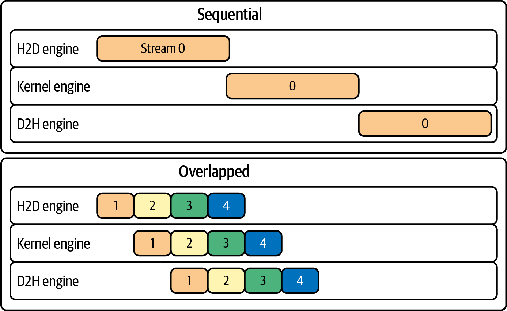
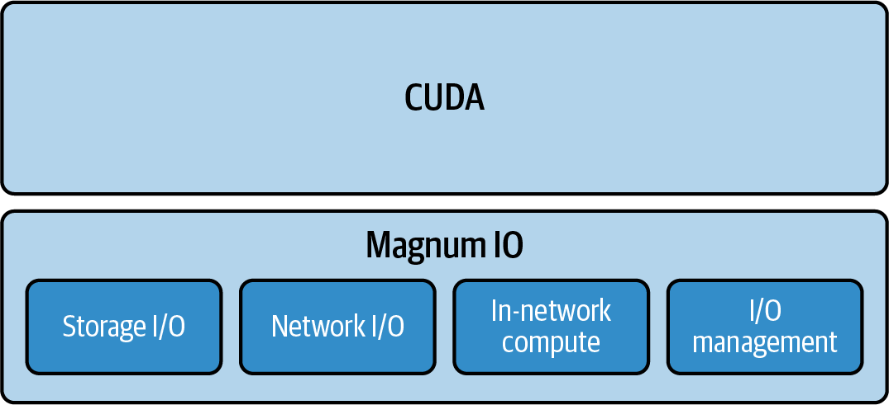
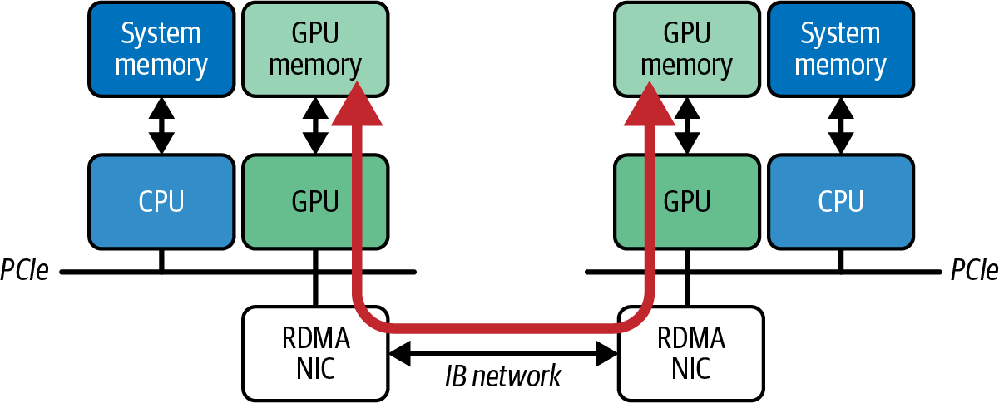
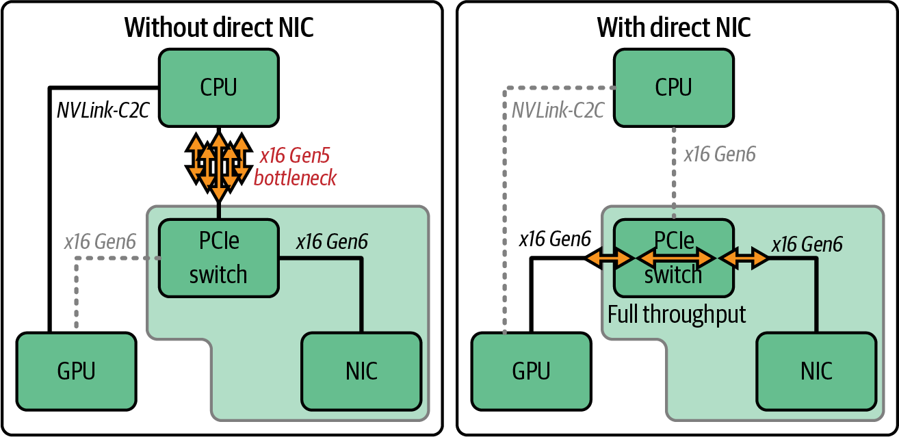
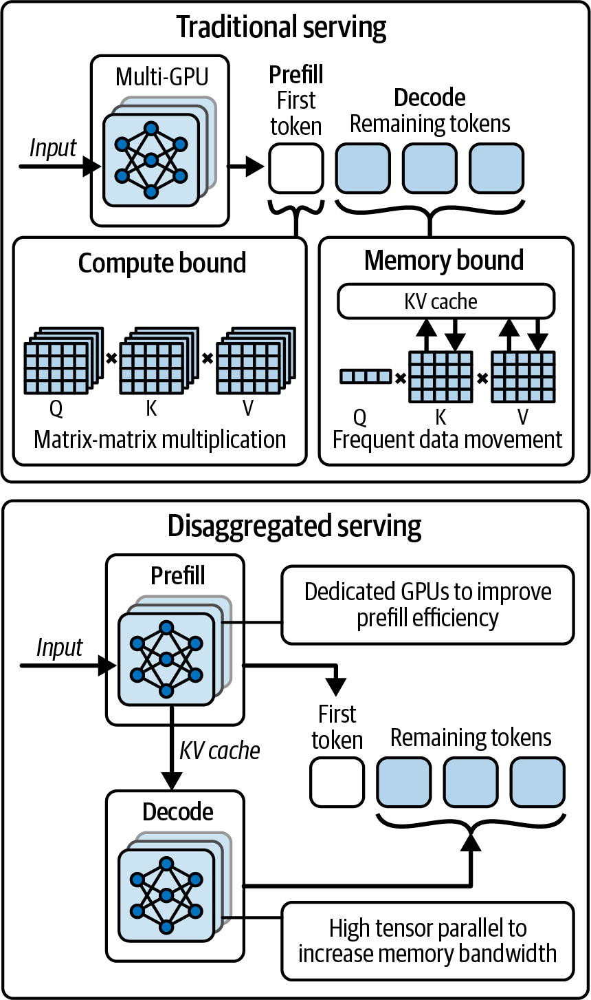
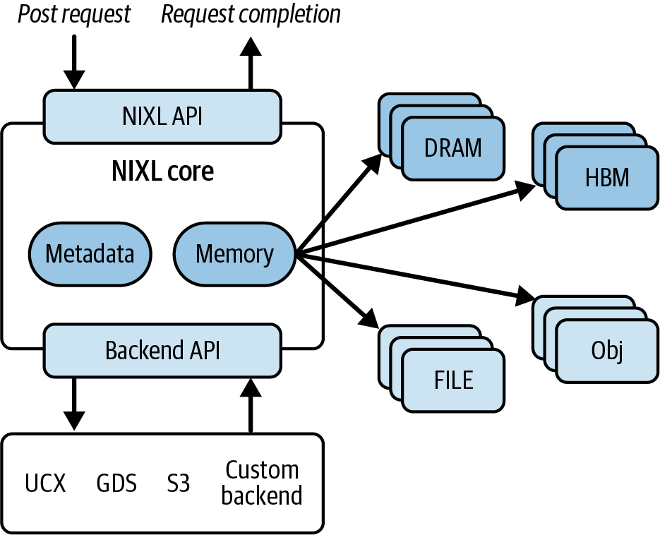
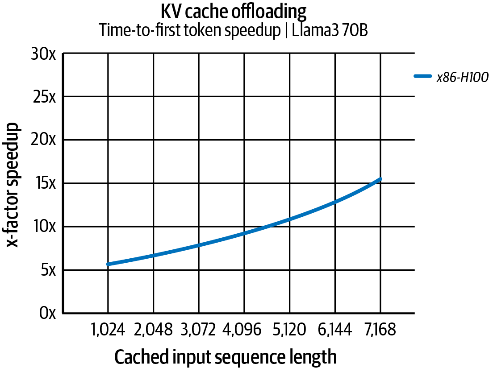

# 第4章 调优分布式网络通信

> Chapter 4. Tuning Distributed Networking Communication

在当今的AI领域，GPU、存储和网络接口之间无缝、低延迟的数据移动是必不可少的。本章介绍用于训练的NVIDIA Magnum IO（如NCCL、GPUDirect RDMA、GDS）和用于分解推理的NIXL。我们将在现代GPU和NVL72等集群的背景下讨论这些技术。您将学习这些库及其底层支持的硬件如何构成超大规模AI系统所需的关键架构。

> In today's AI landscape, the need for seamless and low-latency data movement between GPUs, storage, and network interfaces is a must. In this chapter, we cover NVIDIA Magnum IO (e.g., NCCL, GPUDirect RDMA, GDS) for training and NIXL for disaggregated inference. We'll discuss these in the context of modern GPUs and clusters like the NVL72. You'll learn how these libraries-and their underlying supported hardware-form the critical fabric needed for ultrascale AI systems.

在大规模系统中，即使是最快的GPU也可能因内存和磁盘的低效通信和数据传输而受阻。我们讨论加速数据传输的策略、正确的数据分片技术、如何直接使用快速存储子系统，以及在GPU上重叠通信和计算的高级模式。重叠通信和计算是我们在AI系统性能工程之旅中经常重温的常见模式。

> In large-scale systems, even the fastest GPUs can be hindered by inefficient communication and data transfer from memory and disk. We discuss strategies for speeding up data transfers, proper data sharding techniques, how to work directly with fast storage subsystems, and advanced patterns for overlapping communication and computation on GPUs. Overlapping communication and computation is a common pattern that we revisit frequently throughout our journey on AI systems performance engineering.

我们使用NVIDIA的I/O加速平台Magnum IO的组件来探索重叠通信和计算的重要性，其中包括NCCL、GPUDirect RDMA和GPUDirect Storage（GDS）。我们演示如何使用这些库来降低通信延迟、减少CPU开销，并最大化多节点、多GPU AI系统各层的吞吐量。

> We explore the importance of overlapping communication and computation using components of NVIDIA's IO acceleration platform called Magnum IO, which includes NCCL, GPUDirect RDMA, and GPUDirect Storage (GDS). We demonstrate how to use these libraries to lower communication latency, reduce CPU overhead, and maximize throughput across all layers of a multi-node, multi-GPU AI system.

PyTorch等高级AI框架可以使用这些底层库将计算与通信重叠。将这些技术集成到您的AI系统中代表了一种整体方法，用于加速通信和数据管道，既用于训练超大规模模型，也用于扩展分布式推理服务器以支持拥有数十亿用户的应用程序。

> High-level AI frameworks like PyTorch can use these low-level libraries to overlap computation with communication. Integrating these technologies into your AI system represents a holistic approach to accelerating communication and data pipelines for both training ultrascale models and scaling distributed inference servers to power applications with billions of users.

所有这些优化确保每个组件都经过调优以达到峰值性能。性能工程师需要仔细配置和调优网络和存储架构，以保持高水平的GPU利用率和"goodput"（有效吞吐量）。

> All of these optimizations ensure that every component is tuned for peak performance. Performance engineers need to carefully configure and tune the network and storage fabric to maintain a high level of GPU utilization and "goodput" (useful throughput).

## 4.1 重叠通信与计算（流水线）

> Overlapping Communication and Computation (Pipelining)

重叠通信和计算（或称流水线）在构建大规模高效训练和推理系统中起着关键作用。在这些环境中，保持GPU忙碌并减少等待数据的时间非常重要。

> Overlapping communication and computation, or pipelining, plays a key role in building efficient training and inference systems at scale. In these environments, it's important to keep GPUs busy and spend less time waiting for data.

主要思想是确保数据传输与正在进行的计算并发发生，这样当一个任务完成时，下一阶段所需的结果已经在进行中或已经交付。PyTorch等现代框架支持异步操作，使得集合通信（如梯度all-reduce）可以与计算任务并行运行。这减少了GPU空闲时间（见图4-1）--并提高了整体系统吞吐量。

> The main idea is to ensure that data transfers occur concurrently with ongoing computations so that when one task finishes, the results needed for the next stage are already in progress or have been delivered. Modern frameworks such as PyTorch support asynchronous operations so that collective communication (e.g., all-reduce of gradients) can run alongside compute tasks. This reduces idle GPU time (see Figure 4-1)-and improves overall system throughput.



> Figure 4-1. Overlapping host-to-device (H2D) and device-to-host (D2H) communication with computation on multiple CUDA streams 0-3

基于CUDA的库利用多个CUDA流的能力。当一个流执行计算密集的矩阵乘法时，另一个流处理聚合梯度等通信任务。当神经网络的一层完成计算时，前一层的输出已经在进行聚合或进一步处理的传输中。这种重叠确保系统产生结果时没有不必要的等待时间，并保持稳定的数据流。

> CUDA-based libraries exploit the power of multiple CUDA streams. While one stream executes compute-heavy matrix multiplications, another handles communication tasks such as aggregating gradients. As each layer of a neural network finishes its computation, the previous layer's outputs are already on their way for aggregation or further processing. This overlapping ensures that the system produces results without unnecessary waiting periods and maintains a steady flow of data.

增加通信事件之间执行的计算量可以进一步最小化通信的相对开销。当系统处理更大的数据批次时，它在需要停止和交换信息之前执行更多计算。

> Increasing the amount of compute performed between communication events can further minimize the relative overhead of communication. When the system processes larger batches of data, it performs more computation before needing to stop and exchange information.

例如，在分布式训练中，这表现为梯度累积，即多个小批次的更新合并到单个同步步骤中。通过减少通信事件的频率，系统降低了每次交换的开销并提高了整体吞吐量。

> In distributed training, for instance, this appears as gradient accumulation, where updates from several minibatches are combined into a single synchronization step. By reducing the frequency of communication events, the system lowers the overhead of each exchange and boosts overall throughput.

另一种支持计算和通信无缝重叠的技术是压缩。压缩减少了需要传输的数据量。例如，如果模型在发送梯度之前对其进行压缩，网络移动的数据量就会减少。这减少了传输时间并缓解了拥塞。

> Another technique that supports seamless overlap between computation and communication is compression. Compression reduces the volume of data that needs to be transferred. For example, if a model compresses its gradients before sending them, the network moves a smaller amount of data. This reduces transfer time and eases congestion.

较短的传输时间意味着通信阶段对计算阶段的干扰较小。虽然压缩本身不会直接导致重叠，但它缩短了数据在网络中移动的时间窗口，使计算工作能够更有效地并行继续。

> The shorter transfer time means that the communication phase is less disruptive to the computation phase. Although compression does not directly cause overlap, it shortens the window during which data moves across the network and allows computational work to continue in parallel more effectively.

现代深度学习框架还将大型张量通信拆分成较小的桶以促进重叠。PyTorch等框架自动将大型梯度或激活张量分成多个桶，这些桶在可用时立即传输。例如，不需要等待整层的梯度准备好，部分梯度可以立即开始all-reduce。

> Modern deep learning frameworks also split large tensor communications into smaller buckets to facilitate overlap. Frameworks like PyTorch automatically divide large gradients or activation tensors into several buckets that are transmitted as soon as they become available. Rather than waiting for an entire layer's gradients to be ready, for instance, portions of them can begin their all-reduce immediately.

通过调整桶大小和适当调度这些传输，可以实现更高程度的重叠，并防止通信延迟阻塞计算管道。PyTorch分析器和NVIDIA Nsight Systems等工具可以洞察您的计算和通信是否正在重叠，使工程师能够调整这些参数以获得最大效率。

> By tuning bucket sizes and scheduling these transfers appropriately, one can achieve a higher degree of overlap and prevent communication delays from stalling the compute pipeline. Tools such as the PyTorch profiler and NVIDIA Nsight Systems offer insight into whether your computation and communication are overlapping, allowing engineers to adjust these parameters for maximal efficiency.

通过将更大的批次大小、梯度累积、异步传输、压缩和分桶结合成一个统一的策略，大型分布式AI模型可以克服网络限制并减少空闲时间。这种设计最小化了同步事件，同时实现了高吞吐量和最佳GPU利用率。

> By combining larger batch sizes, gradient accumulation, asynchronous transfers, compression, and bucketing into one cohesive strategy, large, distributed AI models can overcome network limitations and reduce idle time. This design minimizes synchronization events while achieving high throughput and optimal GPU utilization.

这些优化的结果是训练系统减少了整体训练和推理时间，并更有效地利用可用硬件资源。工程师无需重新发明底层网络例程，可以专注于创新模型架构和调优高级参数，而不是编写复杂的数据传输机制。

> The outcome of these optimizations is a training system that reduces overall training and inference time and makes more efficient use of available hardware resources. Engineers are freed from reinventing low-level networking routines and can focus on innovating model architectures and tuning higher-level parameters, rather than coding intricate data transfer mechanisms.

### 4.1.1 使用流进行异步执行 (Asynchronous Execution with Streams)

实现重叠从根本上依赖于异步执行。GPU支持多个流（即操作队列），如果它们针对不同的资源，可以并发执行或重叠。一个流可以处理计算内核（如矩阵乘法），而另一个流处理通信（如数据复制和all-reduce调用）。

> Achieving overlap fundamentally relies on asynchronous execution. GPUs support multiple streams, or queues of operations, that can execute concurrently or overlap if they target different resources. One stream can handle compute kernels such as matrix multiplies, while another stream handles communication such as data copies and all-reduce calls.

通过将工作分配给不同的流并使用非阻塞操作，通信可以在后台发生。例如，可以将all-reduce操作启动到单独的流，而无需等待完成。

> By assigning work to different streams and using nonblocking operations, communication can happen in the background. For example, an all-reduce operation can be launched to a separate stream without waiting for completion.

同时，默认流继续对独立数据进行进一步计算。这要求NCCL等通信库使用立即返回控制的非阻塞调用。通过这样做，程序员在需要时确保正确的同步。

> Meanwhile, the default stream proceeds with further computations on independent data. This requires that communication libraries such as NCCL use nonblocking calls that return control immediately. By doing this, the programmer ensures proper synchronization when needed.

在实践中，AI框架隐藏了大部分复杂性。PyTorch的DistributedDataParallel自动在反向传播中安装钩子，以便每个梯度桶在专用的通信CUDA流上触发异步NCCL all-reduce，而默认CUDA流继续计算后续层的梯度。

> In practice, AI frameworks hide most of this complexity. PyTorch's DistributedDataParallel automatically installs hooks on the backward pass so that each gradient bucket triggers an asynchronous NCCL all-reduce on a dedicated communication CUDA stream, while the default CUDA stream continues computing gradients for subsequent layers.

我们将在后面的章节中更深入地探讨CUDA流，但要知道它们对于重叠通信和计算以及避免代码中不必要的同步点非常有用。

> We will dive deeper into CUDA streams in a later chapter, but just know that they are useful for overlapping communication and computation-and avoiding unnecessary synchronization points in your code.

这种使用CUDA流的计算和通信交错创建了一个稳定的工作波或级联流水线，隐藏了通信延迟并使GPU始终保持忙碌。要保持正确的重叠，请避免使用`torch.cuda.synchronize()`进行不必要的同步点，或通过使用`torch.Tensor.item()`将张量移动到CPU而不小心触发全设备同步。如果您确实需要测量整体迭代时间，请在迭代的最末尾放置单个同步，以等待所有未完成的GPU工作完成，而不会中断正在进行的流水线。

> This interleaving of computation and communication with CUDA streams creates a steady wave, or cascading pipeline, of work that hides communication latency and keeps the GPU busy at all times. To maintain proper overlapping, avoid unnecessary synchronization points with torch.cuda.synchronize() or inadvertently triggering a full device sync by moving tensors to the CPU with torch.Tensor.item(). If you do need to measure the overall iteration time, place a single synchronization at the very end of the iteration to wait for all outstanding GPU work to finish without disrupting the ongoing pipeline.

### 4.1.2 减少通信频率和数据量 (Reducing Communication Frequency and Volume)

如前所述，每个通信步骤执行更多工作可以增加重叠和效率。模型训练期间的梯度累积就是这样一种技术。不是对每个小批次都进行梯度all-reduce，而是在几个小批次上累积梯度，在本地求和，然后执行一次all-reduce。这实际上是用内存换取存储未归约梯度，以获得更少的同步点。

> As noted, performing more work per communication step can increase overlap and efficiency. Gradient accumulation during model training is one such technique. Instead of all-reducing gradients for every single minibatch, you accumulate gradients over a few minibatches, sum them locally, and then do one all-reduce. This effectively trades off memory to store the unreduced gradients for fewer synchronization points.

考虑累积四个小批次；您将all-reduce频率减少了4倍。这允许在同步之间发生更多计算。缺点是您的有效批次大小增加了。这可能会影响模型收敛和内存使用。您通常可以找到一个最佳平衡点，在通信频率、内存使用和收敛之间取得良好的平衡。

> Consider accumulating four minibatches; you cut the all-reduce frequency by 4x. This allows more computations to happen in between synchronizations. The downside is that your effective batch size increases. This can affect model convergence and memory usage. You can often find a sweet spot that creates a good balance between communication frequency, memory usage, and convergence.

减少通信量的另一种方法是压缩或量化交换的数据。梯度压缩等技术可以减少每次通信中发送的数据量，而不会显著影响模型质量。发送的数据越少意味着传输越快，有更多机会将这些传输隐藏在计算之后。这种方法的极端是稀疏化。使用稀疏性时，您只发送一部分梯度。然而，这通常需要算法更改以保持准确性。

> Another approach to reduce communication volume is compressing or quantizing the data exchanged. Techniques like gradient compression can reduce the amount of data sent in each communication without significantly impacting model quality. Less data to send means faster transfers and more opportunity to hide those transfers behind computation. The extreme of this is sparsification. When using sparsity, you send only a fraction of the gradients. This typically requires algorithmic changes to preserve accuracy, however.

PyTorch的分布式数据并行（DDP）通信机制中实现的分桶也通过将许多小张量分组为更大的消息来减少每次调用的开销。但是，桶大小是一个权衡。非常大的桶可以最大化带宽利用率，但会延迟通信的开始，因为您需要等待更多梯度累积后才能启动all-reduce。非常小的桶会更早开始传输，但由于许多小的NCCL调用而产生更多开销。

> Bucketing, as implemented in PyTorch's Distributed Data Parallel (DDP) communication mechanism, also reduces per-call overhead by grouping many small tensors into larger messages. However, bucket sizing is a trade-off. Very large buckets maximize bandwidth utilization but delay the start of communication since you wait for more gradients to accumulate before kicking off the all-reduce. Very small buckets start transfers earlier but incur more overhead due to many small NCCL calls.

截至本文撰写时，PyTorch DDP中的默认桶大小为25 MB。这是在大多数情况下重叠良好的平衡。但是，如果您的模型具有非常大的层，您可能会增加此值以减少开销。如果您的模型有许多小层，您实际上可能会从较小的桶中受益，以便更早开始通信。最终，实现最大重叠可能需要分析不同的桶大小，以查看哪个产生最佳迭代时间。

> As of this writing, the default bucket size in PyTorch DDP is 25 MB. This is a balance that overlaps well in most cases. However, if you have a model with very large layers, you might increase this to reduce overhead. If you have a model with many small layers, you might actually benefit from smaller buckets to start communication sooner. Ultimately, achieving maximal overlap may require profiling different bucket sizes to see which yields the best iteration time.

### 4.1.3 在实践中实现最大重叠 (Achieving Maximal Overlap in Practice)

为了看到重叠通信与计算的好处，让我们通过一个示例来比较两种场景：一种是在所有计算完成后同步进行梯度通信（无重叠），另一种是通信与计算重叠（如DDP）。我们将用两个GPU模拟一个简单的分布式训练步骤来说明差异。

> To see the benefit of overlapping communication with computation, let's run through an example that compares two scenarios in which one performs gradient communication synchronously after all computation with no overlap, and one where communication is overlapped with computation such as DDP. We'll simulate a simple distributed training step with two GPUs to illustrate the difference.

#### 4.1.3.1 无重叠场景 (No Overlap Scenario)

假设我们不使用DDP的内置重叠功能，而是手动实现分布式训练，使得每个进程在本地计算所有梯度，然后在反向传播结束时对这些梯度执行all-reduce。这将模拟未优化、非重叠的场景，因为通信仅在所有计算完成后发生。

> Suppose we don't use DDP's built-in overlap and instead implement distributed training manually such that each process computes all gradients locally, then performs an all-reduce on those gradients at the end of the backward pass. This will mimic the unoptimized, nonoverlapping scenario since communication happens only after all computation is done.

在以下代码中，我们在单个节点上的gpu/rank 0和gpu/rank 1上启动两个进程，使用一个简单模型。我们运行前向和反向传播，然后手动在两个进程之间平均梯度：

```python
import torch
import torch.nn as nn
import torch.optim as optim
import torch.distributed as dist
import torch.multiprocessing as mp

class MultiLayerNet(nn.Module):
    def __init__(self, size):
        super().__init__()
        self.fc1 = nn.Linear(size, size)
        self.fc2 = nn.Linear(size, size)
        self.fc3 = nn.Linear(size, 1)
    def forward(self, x):
        x = torch.relu(self.fc1(x))
        x = torch.relu(self.fc2(x))
        return self.fc3(x)

def train_no_overlap(rank, world_size):
    dist.init_process_group("nccl", init_method="env://",
                            world_size=world_size, rank=rank)
    torch.cuda.set_device(rank)

    # 每个rank合成自己的数据（避免通过spawn发送大张量）
    batch_size = 256
    data = torch.randn(batch_size, 1024, device=rank)
    target = torch.randn(batch_size, 1, device=rank)

    model = MultiLayerNet(data.size(1)).to(rank)
    optimizer = optim.SGD(model.parameters(), lr=0.01)

    output = model(data)
    loss = nn.functional.mse_loss(output, target)
    loss.backward()

    for p in model.parameters():
        dist.all_reduce(p.grad, op=dist.ReduceOp.SUM)
        p.grad /= world_size

    optimizer.step()
    dist.destroy_process_group()

if __name__ == "__main__":
    import torch.multiprocessing as mp
    mp.set_start_method("spawn", force=True)
    world_size = min(2, torch.cuda.device_count() or 1)
    if world_size > 1:
        mp.spawn(train_no_overlap, args=(world_size,), nprocs=world_size, join=True)
    else:
        train_no_overlap(0, 1)
```

> We launch two processes on gpu/rank 0 and gpu/rank 1 on a single node, in this case, with a simple model. We'll run a forward and backward pass, then manually average gradients across the two processes:

在这段代码中，每个进程独立计算MultiLayerNet的梯度。在`loss.backward()`之后，我们显式地对每个参数的梯度执行all-reduce以平均它们。这实际上是DDP内部所做的，但这里我们在整个反向传播完成后才执行--而不是在反向传播期间并发执行all-reduce。

> In this code, each process computes gradients for MultiLayerNet independently. After loss.backward(), we explicitly perform an all-reduce for each parameter's gradient to average them. This is effectively what DDP does internally, but here we wait and do it after the entire backward pass has finished-rather than doing the all-reduce concurrently during the backward pass.

如果我们对这个迭代进行计时，all-reduce操作将直接增加迭代时间，因为它没有与任何其他步骤重叠。例如，假设前向和反向计算总共需要10毫秒，梯度all-reduce需要12毫秒。在这种方法中，总迭代时间大约是22毫秒。相比之下，完全重叠的实现可能实现接近这些值中最大值的总时间，在我们的例子中是12毫秒。这是可能的，因为all-reduce通信几乎可以完全隐藏在计算之下。

> If we were to time this iteration, the all-reduce operations would add directly to the iteration time since it's not overlapping with any other steps. For example, say the forward and backward computations together take 10 ms and the gradient all-reduces take 12 ms. The total iteration time would be roughly 22 ms in this approach. In contrast, a fully overlapped implementation might achieve a total time closer to the max of these values, or 12 ms in our case. This is possible since the all-reduce communication can be almost completely hidden under the computation.

#### 4.1.3.2 使用DDP重叠 (Overlap with DDP)

现在让我们使用PyTorch的DDP来执行相同的操作并实现重叠。DDP将挂钩到反向传播中，并将梯度归约与反向计算重叠。代码类似，但我们只需用DistributedDataParallel包装模型，让它处理同步：

```python
import torch
import torch.nn as nn
import torch.optim as optim
import torch.distributed as dist
import torch.multiprocessing as mp

class MultiLayerNet(nn.Module):
    def __init__(self, size):
        super().__init__()
        self.fc1 = nn.Linear(size, size)
        self.fc2 = nn.Linear(size, size)
        self.fc3 = nn.Linear(size, 1)
    def forward(self, x):
        x = torch.relu(self.fc1(x))
        x = torch.relu(self.fc2(x))
        return self.fc3(x)

def train_ddp(rank, world_size):
    rank = int(os.environ.get("LOCAL_RANK", rank))
    torch.cuda.set_device(rank)
    dist.init_process_group("nccl", init_method="env://",
                            world_size=world_size, rank=rank)
    torch.cuda.set_device(rank)

    model = MultiLayerNet(1024).to(rank)
    ddp_model = nn.parallel.DistributedDataParallel(model, device_ids=[rank])
    optimizer = optim.SGD(ddp_model.parameters(), lr=0.01)

    # 每个进程获取自己的数据部分
    batch_size = 256
    data = torch.randn(batch_size, 1024).cuda(rank)
    target = torch.randn(batch_size, 1).cuda(rank)

    # 运行一次训练迭代
    output = ddp_model(data)
    loss = nn.functional.mse_loss(output, target)
    loss.backward()
    optimizer.step()
    dist.destroy_process_group()

def main():
    world_size = min(2, torch.cuda.device_count() or 1)
    mp.set_start_method("spawn", force=True)
    if world_size > 1:
        mp.spawn(train_ddp, args=(world_size,), nprocs=world_size, join=True)
    else:
        print("Only one GPU present; running DDP demo with world_size=1")
        train_ddp(0, 1)

if __name__ == "__main__":
    main()
```

> Now let's use PyTorch's DDP to perform the same operation with overlap. DDP will hook into the backward pass and overlap gradient reduction with backward computation. The code is similar, but we simply wrap the model with DistributedDataParallel and let it handle synchronization:

使用DDP重叠方法，代码更简单，因为我们依赖DistributedDataParallel来处理梯度同步，而不是自己编写。当调用`loss.backward()`时，DDP的内部reducer将梯度分成桶，并在每个桶准备好时在单独的CUDA流上启动NCCL all-reduce操作。例如，它可能会在fc3.weight和fc3.bias梯度计算完成后立即对它们进行all-reduce，因为这些来自最后一层，在反向传播中最后计算，而来自较早层的fc1和fc2梯度在我们到达反向传播结束时已经完成all-reduce。

> With the DDP overlapping approach, the code is simpler since we rely on DistributedDataParallel to handle gradient synchronization rather than writing it ourselves. When loss.backward() is called, DDP's internal reducer splits the gradients into buckets and launches NCCL all-reduce operations as soon as each bucket is ready on a separate CUDA stream. For instance, it might all-reduce the fc3.weight and fc3.bias gradients immediately after they are computed since those are from the last layer and are computed last in the backward pass, while the fc1 and fc2 gradients from earlier layers will have already been all-reduced by the time we reach the end of the backward pass.

如果模型非常小，所有梯度都适合放入一个桶，DDP可能只在最后执行一次all-reduce，这不会有太多重叠。但对于较大的模型和较大的批量大小，将有多个桶和显著的重叠--展示出这项技术更令人印象深刻的性能提升。

> If the model is very small such that all gradients fit into one bucket, DDP might do only one all-reduce at the end, which wouldn't overlap much. But with larger models and bigger batch sizes, there will be multiple buckets and significant overlap-showing even more impressive performance gains from this technique.

表4-1显示了重叠的好处：

> Table 4-1. The benefit of overlap

| 指标 | 无重叠（手动同步） | 重叠（DDP） | 说明 |
|------|-------------------|-------------|------|
| 总反向+通信时间 | 100%（基准） | ~70%基准 | 例如，由于重叠每次迭代快30% |
| 通信开始时间 | 反向完成后 | 反向期间 | DDP中，通信在反向中途开始 |
| 通信期间GPU空闲 | 是--反向后，GPU在all-reduce期间等待 | 最小--通信在其他层仍在计算时运行 | DDP隐藏了大部分延迟 |
| SM（GPU）利用率 | 较低（通信期间SM有些周期空闲） | 较高（持续活动） | 重叠使GPU更持续地忙碌 |
| 实现的重叠（计算覆盖的通信百分比） | 0%（串行执行） | ~50%（或更多） | 粗略估计：较大的模型或批量可以重叠更多 |

> | Metric | No overlap (manual sync) | Overlap (DDP) | Notes |
> |--------|--------------------------|---------------|-------|
> | Total backward + comm time | 100% (baseline) | ~70% of baseline | e.g., 30% faster per iteration due to overlap (illustrative) |
> | Comm start time | After backward complete | During backward | In DDP, comm begins midway through backward |
> | GPU idle during comm phase | Yes-after backward, GPUs wait during all-reduce | Minimal-comm runs while other layers still computing | DDP hides most of the latency |
> | SM (GPU) utilization | Lower (some cycles where SMs idle during comm) | Higher (continuous activity) | Overlap keeps GPU busy more consistently |
> | Overlap achieved (% of comm covered by compute) | 0% (serial execution) | ~50% (or more) | Rough estimate: larger models or batches can overlap more |

> Note: The numeric values in all metrics tables are illustrative to explain the concepts. For actual benchmark results on different GPU architectures, see the GitHub repository.

在这个例子中，将通信与计算重叠在我们的示例工作负载中产生了大约30%的迭代时间改进。在较大的训练作业中，收益会更显著，因为较大的模型会产生更多通信瓶颈的可能性。PyTorch DistributedDataParallel默认使用25 MiB桶。这样，它在每个桶准备好时启动all-reduce。调整`bucket_cap_mb`可以帮助增加特定模型拓扑的重叠，但较大的桶会增加最后一个桶的延迟。

> In this example, overlapping communication with computation yields roughly a 30% iteration time improvement in our example workload. In larger training jobs, the gains would be more substantial since larger models create more potential for communication bottlenecks. PyTorch DistributedDataParallel uses 25 MiB buckets by default. This way, it launches an all-reduce for each bucket as soon as it is ready. Tuning bucket_cap_mb can help increase overlap for your specific model topology, but larger buckets increase latency for the last bucket.

关键要点是，调优良好的DDP应该将大部分梯度通信与计算重叠。通常唯一无法重叠的通信部分是尾部，或最后一个梯度桶，如果它恰好在最后一次计算后完成。研究工作正在进行中，以将优化器步骤与通信重叠，或使用张量分区等技术实现进一步的重叠，但PyTorch DDP的默认重叠策略通常被描述为无等待反向传播（WFBP），它将梯度分桶并在每个桶准备好时立即启动归约。

> The takeaway is that a well-tuned DDP should overlap most of the gradient communication with computation. Often the only portion of communication that cannot be overlapped is the tail end, or the last gradient bucket, if it happens to finish after the last compute. Research efforts are ongoing to even overlap the optimizer step with communication or to use techniques like tensor partitioning to achieve further overlap, but PyTorch's DDP's default overlap strategy is often described as wait-free backpropagation (WFBP), which bucketizes gradients and launches reductions as soon as each bucket is ready.

值得注意的是，某些编码模式可能会无意中消除重叠。例如，如果您执行任何强制在反向传播和下一次迭代之间同步的操作，您将停止计算直到所有通信完成。

> It's worth noting that certain coding patterns can inadvertently eliminate overlap. For instance, if you perform any operation that forces a synchronization between backward and the next iteration, you will stall the computation until all communications are done.

避免无意中将张量从GPU移动到CPU的操作（例如，在张量上调用`.item()`），直到您确定所有异步GPU工作已完成。否则，您将强制同步，停止计算，并减慢您的训练或推理工作负载。这通常发生在添加`print()`或`log()`语句进行调试时。这些可能对性能造成灾难性影响。

> Avoid operations that inadvertently move tensors from the GPU to the CPU (e.g., calling .item() on a tensor) until you're sure that all asynchronous GPU work is finished. Otherwise, you will force a synchronization, stall the computation, and slow down your training or inference workload. This typically happens when adding print() or log() statements for debugging. These can be disastrous for performance.

如果可能，您应该将此类操作移到单独的流中。此外，应尽量减少对`torch.cuda.synchronize()`的手动调用，仅用于精确的基准测试--或在正确性需要时使用。否则，它们将序列化GPU工作并对性能产生负面影响。DDP的设计和PyTorch的操作已经是异步的，并正确处理依赖关系。在用户代码中很少需要显式同步。

> You should move such operations to a separate stream if possible. Also, manual calls to torch.cuda.synchronize() should be minimized and used only for accurate benchmarking-or when required for correctness. Otherwise, they will serialize GPU work and negatively impact performance. DDP's design and PyTorch's operations are already asynchronous and handle dependencies correctly. Explicit synchronization is rarely needed in user code.

总之，重叠计算和通信是分布式性能工程最有效的技术之一。正确利用它，可以通过将通信延迟隐藏在有用于工作之后来显著减少训练时间。

> In summary, overlapping computation and communication is one of the most effective techniques for distributed performance engineering. Properly utilized, it can significantly reduce training time by hiding communication latencies behind useful work.

在以下部分中，我们将探索使这成为可能的软件和硬件基础设施，以及如何确保在现代系统上获得最大重叠。接下来，我们将概述NVIDIA的Magnum IO栈，其中包括使计算和通信重叠成为可能的技术。

> In the following sections, we'll explore the software and hardware infrastructure that makes this possible and how to ensure you're getting the maximum overlap on modern systems. Next, we will overview NVIDIA's Magnum IO stack, which includes technologies that make overlapping of compute and communication possible.

## 4.2 NVIDIA Magnum IO优化栈 (NVIDIA Magnum IO Optimization Stack)

Magnum IO是NVIDIA的总体I/O加速平台，汇集了一系列技术来加速GPU、CPU、存储和网络接口之间的数据移动、访问和管理。Magnum IO架构有四个关键组件，涵盖存储、网络、网络内计算和I/O管理，如图4-2所示。

> Magnum IO, NVIDIA's overarching I/O acceleration platform, brings together a range of technologies to speed up data movement, access, and management across GPUs, CPUs, storage, and network interfaces. There are four key components of the Magnum IO architecture spanning storage, network, in-network computing, and I/O management, as shown in Figure 4-2.



> Figure 4-2. Four components of NVIDIA's Magnum IO acceleration platform

以下是图4-2中四个组件的描述：

> Here is a description of the four components in Figure 4-2:

**存储I/O**：由NVIDIA GPUDirect Storage（GDS）和BlueField SNAP等技术实现。这些技术让GPU直接访问存储（包括NVMe SSD），而无需通过主机CPU内存进行不必要的复制。我们将在第5章深入探讨GDS。

> **Storage I/O**: This is implemented by technologies such as NVIDIA GPUDirect Storage (GDS) and BlueField SNAP. These let GPUs access storage including NVMe SSDs directly without unnecessary copies through host CPU memory. We'll dive deeper into GDS in Chapter 5.

**网络I/O**：包括GPUDirect RDMA、NCCL、NVSHMEM、UCX和HPC-X（MPI/SHMEM软件包）等技术，用于在节点间的GPU之间实现直接、高速的数据传输，绕过CPU进行节点间通信。

> **Network I/O**: This includes technologies like GPUDirect RDMA, NCCL, NVSHMEM, UCX, and HPC-X (MPI/SHMEM software bundle) to enable direct, high-speed data transfers between GPUs across nodes, bypassing the CPU for internode communication.

**网络内计算**：SHARP在Quantum级InfiniBand交换机内执行网络内归约。归约算术在交换机硅片中发生。BlueField DPU卸载网络，并可以托管控制服务，如子网管理器和SHARP聚合管理器。当启用NCCL RDMA SHARP插件且架构具有SHARP固件和活动的聚合管理器时，符合条件的集合可以卸载到IB交换机，减少主机和GPU开销。

> **In-network compute**: SHARP performs in-network reductions inside Quantum-class InfiniBand switches. The reduction arithmetic happens in the switch silicon. BlueField DPUs offload networking and can host control services such as the Subnet Manager and the SHARP Aggregation Manager. When the NCCL RDMA SHARP plugin is enabled and the fabric has SHARP firmware and an active Aggregation Manager, eligible collectives can be offloaded to the IB switches, reducing host and GPU overhead.

基于以太网的GPU集群依赖RoCEv2等技术实现RDMA，但通常缺乏SHARP等功能。这是许多超大规模AI系统使用InfiniBand或类似高性能互连而不是以太网的原因之一。SHARP提供显著的性能提升，应在可用时加以利用。

> Ethernet-based GPU clusters rely on technologies like RoCEv2 for RDMA but generally lack features like SHARP. This is one of the reasons that many ultrascale AI systems use InfiniBand or similar high-performance interconnects instead of Ethernet. SHARP provides a significant performance boost and should be utilized when available.

**I/O管理**：NVIDIA NetQ和统一架构管理器（UFM）等工具属于此类，为数据中心的I/O架构提供实时遥测、诊断和生命周期管理。

> **I/O management**: Tools like NVIDIA NetQ and Unified Fabric Manager (UFM) fall in this category, providing real-time telemetry, diagnostics, and lifecycle management for the data center's I/O fabric.

## 4.3 使用RDMA实现高速、低开销数据传输 (High-Speed, Low-Overhead Data Transfers with RDMA)

RDMA是一种针对低延迟、高吞吐量数据传输优化的技术。RDMA通过允许设备之间直接的内存到内存通信来工作，而不会给CPU带来不必要的数据复制操作负担。简而言之，RDMA绕过了传统内核网络栈的大部分内容，允许NIC直接读/写应用程序内存。这避免了CPU参与每个数据包，并减少了上下文切换和缓冲区复制。

> RDMA is a technology optimized for low-latency, high-throughput data transfers. RDMA works by allowing direct memory-to-memory communication between devices without burdening the CPU with unnecessary data-copy operations. In a nutshell, RDMA bypasses much of the traditional kernel network stack and allows a NIC to directly read/write application memory. This avoids CPU involvement in each packet and reduces context switches and buffer copies.

在Docker和Kubernetes等容器环境中，确保容器可以直接访问主机的InfiniBand设备（例如，/dev/infiniband）。否则，NCCL可能会静默回退到TCP套接字而不是GPUDirect RDMA--而且没有任何明显的错误来突出这种降级。这导致吞吐量从数十GB/s下降到仅几Gb/s，没有明显的错误消息。

> In container environments like Docker and Kubernetes, ensure the container has direct access to the host's InfiniBand devices (e.g., /dev/infiniband). Otherwise, NCCL may silently fall back to TCP sockets instead of GPUDirect RDMA-and without any obvious errors to highlight the degradation. This results in throughput dropping from tens of GB/s to only a few Gb/s, with no obvious error messages.

始终验证是否为真正的GPUDirect RDMA。使用`lsmod | grep nvidia_peermem`确认内核模块已加载，并检查dmesg以确认初始化。要进行端到端检查，请使用`NCCL_DEBUG=INFO`运行NCCL以确认NET/IB路径，并使用带有`--use_cuda`的RDMA性能测试来验证GPU到GPU传输。验证将有助于防止隐蔽的性能下降。

> Always verify that it is true GPUDirect RDMA. Confirm that the kernel module is loaded with `lsmod | grep nvidia_peermem`, and check dmesg for initialization. For an end-to-end check, run NCCL with NCCL_DEBUG=INFO to confirm NET/IB paths and use RDMA perftests with --use_cuda to validate GPU-to-GPU transfers. Verifying will help prevent stealthy performance degradations.

NVIDIA的GPU RDMA实现称为GPUDirect RDMA。GPUDirect RDMA让RDMA capable NIC（如InfiniBand和RDMA over Converged Ethernet（RoCE））在两台服务器之间直接对GPU设备内存执行直接内存访问（DMA）--完全绕过主机CPU和系统RAM。图4-3显示了使用RoCE的数据传输。

> NVIDIA's RDMA implementation for GPUs is called GPUDirect RDMA. GPUDirect RDMA lets an RDMA-capable NIC such as InfiniBand and RDMA over Converged Ethernet (RoCE) perform direct memory access (DMA) to and from the GPU's device memory across two servers-bypassing host CPU and system RAM entirely. A data transfer with RoCE is shown in Figure 4-3.



> Figure 4-3. GPU-to-GPU direct data transfer with RoCE

通过向NIC注册GPU缓冲区，GPUDirect RDMA在远程GPU之间启用单边RDMA读取和写入。这最小化了多节点训练中的延迟和CPU开销。

> By registering GPU buffers with the NIC, GPUDirect RDMA enables one-sided RDMA reads and writes between remote GPUs. This minimizes both latency and CPU overhead in multinode training.

RDMA本身由InfiniBand支持，也由一些高速以太网网络通过RoCE支持。使用RoCE，假设网络设备支持RDMA并正确配置，你可以在以太网上获得类似RDMA的零拷贝传输。使用RoCE的RDMA通常需要正确配置的系统，包括必要的驱动程序，如用于InfiniBand/RoCE的NVIDIA OFED。

> RDMA is supported inherently by InfiniBand and also by some high-speed Ethernet networks through RoCE. With RoCE, you get RDMA-like zero-copy transfers over Ethernet, assuming the network gear supports RDMA and is properly configured for it. Using RDMA with RoCE usually requires a properly configured system with the necessary drivers, including NVIDIA OFED for InfiniBand/RoCE.

使用RDMA与标准TCP/IP网络之间的性能差异可能很大。例如，现代InfiniBand链路可能为小消息提供几微秒量级的延迟，而标准以太网上的TCP可能产生5-10倍更高的延迟。

> The performance difference between using RDMA versus standard TCP/IP networking can be huge. For example, a modern InfiniBand link might provide latency on the order of a few microseconds for a small message, whereas standard TCP over Ethernet might incur 5-10x higher latency.

对于网络带宽绑定的大传输，InfiniBand上的RDMA可以维持数百Gbps量级的极高吞吐量。相比之下，典型的TCP/IP网络可能受限于内核开销和NIC速度--通常为100 Gbps或更低，除非使用具有RDMA功能的200-400 Gbps以太网。TCP/IP网络也会产生更多开销。

> For large transfers that are network-bandwidth-bound, RDMA on InfiniBand can sustain very high throughput on the order of hundreds of Gbps. In contrast, a typical TCP/IP network might be limited by kernel overhead and NIC speed-often 100 Gbps or less unless using 200-400 Gbps Ethernet with RDMA capabilities. TCP/IP networks also incur more overhead.

在分布式深度学习中，大消息吞吐量往往比小消息延迟更重要，因为梯度很大。高带宽和低延迟都能保持协议高效--并让GPU保持忙碌。

> In distributed deep learning, large-message throughput tends to matter more than tiny message latency since gradients are large, for instance. Both high bandwidth and low latency keep the protocol efficient-and the GPUs busy.

如果您只有以太网可用，您应该使用尽可能高的带宽和最低延迟的配置。例如，带有RDMA（RoCE）的200+ Gbps以太网在all-reduce流量方面的性能将远好于基本的10-25 Gbps TCP网络。至少，确保您使用巨型帧，如MTU 9000。为集群网络启用此配置后，数据传输将发送较少的大数据包而不是许多小数据包。这减少了CPU开销并提高了效率，类似于更大的磁盘块大小如何提高顺序磁盘吞吐量。

> If you only have Ethernet available, you should use the highest bandwidth and lowest-latency configuration possible. For instance, 200+ Gbps Ethernet with RDMA (RoCE) will perform much better for all-reduce traffic than a basic 10-25 Gbps TCP network. At a minimum, ensure you are using jumbo frames such as MTU 9000. Enabling this configuration for your cluster network, data transfers will send fewer large packets instead of many small ones. This reduces CPU overhead and improves efficiency similarly to how larger disk block sizes improve sequential disk throughput.

此外，调整TCP栈也很重要。您应该验证Linux sysctl参数（如`net.core.rmem_max/wmem_max`和自动调整范围`net.ipv4.tcp_rmem/tcp_wmem`）设置得足够高，以充分利用高带宽链路。

> Also, it's important to tune the TCP stack for a similar reason. You should verify that Linux sysctl parameters like net.core.rmem_max/wmem_max and the autotuning ranges net.ipv4.tcp_rmem/tcp_wmem are set high enough to fully utilize a high-bandwidth link.

当然，使用现代TCP拥塞控制算法来改善高延迟链路上的吞吐量很重要。在精心设计的、没有外部互联网流量的专用集群网络上，默认的CUBIC拥塞控制通常表现良好，因为它是为避免拥塞而设计的。

> And, of course, it's important to use a modern TCP congestion control algorithm to improve throughput on high-latency links. On a well-engineered, dedicated cluster network with no external internet traffic, the default CUBIC congestion control typically performs adequately since it's engineered to avoid congestion.

对于任何高延迟-带宽链路，考虑使用现代TCP拥塞算法，如瓶颈带宽和往返传播时间（BBR），并调整缓冲区大小以确保充分利用。始终验证默认设置没有限制吞吐量。使用`sysctl net.ipv4.tcp_congestion_control`等工具检查和调优设置。在云或混合环境中，要谨慎判断你是否真正拥有受控的高速连接。例如，如果你使用带有Elastic Fabric Adapter（EFA）的AWS EC2实例，你会获得类似于部署在同一"放置组"中的实例之间InfiniBand级别的RDMA。但如果你尝试运行跨越本地数据中心和云且没有直接连接的多节点训练或推理作业，你的流量可能会通过公共互联网。这将引入不可预测的延迟和拥塞。始终确保你的多节点设置位于正确配置的高性能、低拥塞网络上。直接与你的云提供商合作，了解网络架构中的每一跳。即使使用RDMA，CPU也没有完全退出。主机仍然设置RDMA传输并处理通信完成事件。因此，正确的CPU亲和性很重要。记得将网络中断处理或轮询线程绑定到与NIC相同NUMA节点上的CPU核心，理想情况下也与GPU相同。例如，如果InfiniBand主机通道适配器位于NUMA节点0，则将其中断CPU亲和性核心绑定到节点0。这减少了控制操作的跨NUMA流量和延迟。

> For any high latency-bandwidth links, consider using a modern TCP congestion algorithm like Bottleneck Bandwidth and Round-trip propagation time (BBR) and adjust buffer sizes to ensure full utilization. Always validate that the default settings are not limiting throughput. Use tools like sysctl net.ipv4.tcp_congestion_control to inspect and tune the setting. In cloud or hybrid environments, be cautious of whether you truly have a controlled high-speed connection. For example, if you use AWS EC2 instances with Elastic Fabric Adapter (EFA), you get something similar to InfiniBand-level RDMA between instances deployed in the same "placement group." But if you try to run a multinode training or inference job that spans both an on-premises data center and the cloud without direct connectivity, your traffic will likely traverse the public internet. This will introduce unpredictable latency and congestion. Always ensure your multinode setup is on a properly configured, high-performance, low-congestion network. Work directly with your cloud provider to understand every hop in the network architecture. Even when using RDMA, the CPU is not completely out of the picture. The host still sets up RDMA transfers and handles communication-completion events. Therefore, proper CPU affinity is important. Remember to pin the network interrupt handling-or polling threads-to a CPU core on the same NUMA node as the NIC and, ideally, the GPU as well. For example, if an InfiniBand host channel adapter is on NUMA node 0, bind its interrupt CPU affinity cores to node 0. This reduces cross-NUMA traffic and latency for control operations.

## 4.4 调优多节点连接性 (Tuning Multinode Connectivity)

对于使用GPU的分布式、多节点训练，确保网络不是瓶颈至关重要。这涉及使用正确的通信和网络技术，以及正确配置这些技术。以下是一些采用的建议和需要避免的陷阱：

> For distributed, multinode training with GPUs, it is crucial to ensure that the network is not a bottleneck. This involves using the right communication and networking technologies as previously described-as well as configuring these technologies properly. Here are some tips to adopt and pitfalls to avoid:

**了解拓扑**：使用`nvidia-smi topo -m`获取基本的GPU互连视图，但对于基于NVSwitch和NVLink的系统，还建议使用`nvidia-smi nvlink`或Nsight Systems来了解多跳交换架构连接性。

> **Understand the topology**: Use nvidia-smi topo -m to get a basic GPU interconnect view, but for NVSwitch- and NVLink-based systems, it's recommended to also use nvidia-smi nvlink or Nsight Systems to understand multihop switch fabric connectivity.

**利用NVLink Switch域（如果可用）**：多节点NVIDIA的GB200和GB300 NVL72机柜解决方案使用NVLink Switch在单个NVLink域中连接多达72个GPU，提供极低的每跳延迟--几百纳秒量级。GB200 NVL72架构在机柜内所有GPU之间提供高达约130 TB/s的全对全带宽和亚微秒延迟。如果你的集群包括此类基础设施，请确保你的作业放置在同一NVLink域内，以充分利用这种超快互连。这可以显著减少对节点间较慢的InfiniBand和以太网通信的需求。

> **Leverage NVLink Switch domains if available**: The multinode NVIDIA's GB200 and GB300 NVL72 rack solutions connect up to 72 GPUs in a single NVLink domain using NVLink Switch, which provides extremely low per-hop latency-on the order of a few hundred nanoseconds. The GB200 NVL72 architecture provides up to ~130 TB/s of all-to-all bandwidth with submicrosecond latencies across all GPUs in the rack. If your cluster includes such infrastructure, make sure your jobs are placed within the same NVLink domain to fully utilize this ultrafast interconnect. This can significantly reduce the need for slower InfiniBand and Ethernet communication between nodes.

**尽可能使用RDMA**：如果在InfiniBand或支持RoCE的硬件上运行，请确保你的通信库（如NCCL）实际使用RDMA。如果可用，NCCL将自动使用GPUDirect RDMA。但如果RDMA配置错误或不支持，NCCL可能会静默回退到TCP。一个警示信号是，如果你注意到在all-reduce操作期间，GPU利用率下降而CPU利用率飙升。这表明CPU正在为通信复制数据。

> **Use RDMA whenever possible**: If running on InfiniBand or RoCE-capable hardware, make sure your communication library, such as NCCL, is actually using RDMA. NCCL will automatically use GPUDirect RDMA if available. But if RDMA is misconfigured or unsupported, NCCL may silently fall back to TCP. One red flag for this is if you notice that during all-reduce operations, GPU utilization drops and CPU utilization spikes. This indicates that the CPU is copying data for communications.

**如果可用，利用优化的"直接NIC"模式**：倾向于为每个GPU或小组GPU提供足够专用网络带宽的高带宽、多轨NIC配置。物理上，NIC使用PCIe连接到主机CPU或DPU。现代GPU系统支持GPU发起的网络，使用InfiniBand GPUDirect Async（IBGDA）和直接NIC路径，如图4-4所示。这让GPU可以在没有CPU干预的情况下驱动全带宽RDMA。

> **Utilize optimized "direct NIC" mode when available**: Favor high-bandwidth, multirail NIC configurations that give each GPU or small groups of GPUs sufficient dedicated network bandwidth. Physically, NICs attach using PCIe to the host CPU or to a DPU. With modern GPU systems, NCCL supports GPU-initiated networking with InfiniBand GPUDirect Async (IBGDA) and the direct NIC path, as shown in Figure 4-4. This lets the GPU drive full-bandwidth RDMA without CPU intervention.



> Figure 4-4. Bypassing CPU bottlenecks with direct connectivity between GPUs and NICs

**检查配置错误**：一个常见的陷阱是网络配置不匹配导致回退到较慢的路径。例如，如果RDMA由于配置错误而不工作，NCCL可能正在100 Gbps以太网上使用TCP，但由于内核开销只能获得其中的一小部分。更糟糕的是，如果集群的高速网络被错误识别，流量可能通过仅运行10 Gbps以太网的较慢管理网络，而用户没有意识到。NCCL的调试输出和网络接口计数器（ibstat、ifstat）等工具可以帮助验证哪个接口使用更频繁。

> **Check for misconfigurations**: A common pitfall is a mismatch in network configuration that causes a fallback to a slower path. If RDMA is not working due to a misconfiguration, for instance, NCCL might be using TCP on a 100 Gbps Ethernet network but getting only a fraction of that due to kernel overhead. Even worse, if the cluster's high-speed network is misidentified, traffic might go over a slower management network running only 10 Gbps Ethernet without the user realizing. Tools like NCCL's debugging output and network interface counters (ibstat, ifstat) can help verify which interface is being used more heavily.

## 4.5 多节点通信陷阱 (Multinode Communication Pitfalls)

跨集群中的多个节点扩展训练引入了一类新的陷阱。这里我们强调一些常见问题，并演示如何用具体示例修复它们。

> Scaling training across multiple nodes in a cluster introduces a new class of pitfalls. Here we highlight a few common issues and demonstrate how to fix them with concrete examples.

### 4.5.1 陷阱#1：使用CPU绑定的Gloo后端而不是NCCL (Pitfall #1: Using a CPU-bound Gloo Backend Instead of NCCL)

PyTorch的分布式框架支持多种通信后端。对于多GPU训练，NCCL是NVIDIA GPU的首选后端，但也有一个名为Gloo的回退后端，它使用CPU和TCP套接字。如果错误地使用Gloo初始化GPU训练的ProcessGroup--或者如果NCCL初始化失败并回退到Gloo，训练仍然可以正常工作，但所有跨GPU通信都将通过CPU和以太网栈。这导致极慢的性能。

> PyTorch's distributed framework supports multiple backends for communication. For multi-GPU training, NCCL is the preferred backend for NVIDIA GPUs, but there is also a fallback backend called Gloo, which uses CPUs and TCP sockets. If one mistakenly initializes ProcessGroup with Gloo for GPU training-or if NCCL fails to initialize and it falls back to Gloo, the training will still function correctly but all cross-GPU communication will go through the CPU and Ethernet stack. This results in extremely slow performance.

不幸的是，意外使用这种错误配置相当常见，因为代码看起来正常工作且不会崩溃。它只是运行慢一个数量级，需要分析器或仔细的日志分析才能检测到。总之，始终为多GPU训练指定NCCL以利用RDMA通信。幸运的是，这是PyTorch的默认设置。否则，回退到Gloo将静默限制你的性能（甚至完全出错）。

> Unfortunately, it's fairly common to accidentally use this misconfiguration since the code appears to work normally and not crash. It just runs an order of magnitude slower and requires either a profiler or careful log analysis to detect. In summary, always specify NCCL for multi-GPU training to utilize RDMA communication. Fortunately, this is PyTorch's default. Otherwise, falling back to Gloo will silently limit your performance (or even error out completely.)

让我们用代码来说明这一点。我们将模拟两个进程在gpu/rank 0和gpu/rank 1上运行，这两个进程位于两个不同的"节点"上，通过800 Gb/s（100 GB/s）InfiniBand互连连接，并对张量执行大型all-reduce。首先，我们故意使用Gloo后端（CPU绑定）进行PyTorch分布式通信，如下所示：

> Let's illustrate this with code. We'll simulate two processes running on gpu/rank 0 and gpu/rank 1 on two different "nodes" connected with an 800 Gb/s (100 GB/s) InfiniBand interconnect and perform a large all-reduce of a tensor. First, we intentionally use the Gloo backend (CPU bound) for PyTorch distributed communication as shown here:

```python
# dist_allreduce.py

#!/usr/bin/env python

import os
import argparse
import torch
import torch.distributed as dist

def main():
    parser = argparse.ArgumentParser(description="Multi-node Gloo all-reduce")
    parser.add_argument(
        "--data-size",
        type=int,
        default=1024 * 1024 * 100,  # 100M floats ≈ 400 MB
        help="Number of elements in the tensor",
    )
    args = parser.parse_args()

    # Initialize the default ProcessGroup over env:// 
    # (uses MASTER_ADDR, MASTER_PORT, etc.)
    dist.init_process_group(backend="gloo", init_method="env://")

    rank = dist.get_rank()
    world_size = dist.get_world_size()

    # Allocate a large CPU tensor (Gloo is CPU-bound)
    tensor = torch.ones(args.data_size, dtype=torch.float32, device="cpu")

    # Warm up and barrier
    dist.barrier()

    # All-reduce (sum) across all ranks
    dist.all_reduce(tensor, op=dist.ReduceOp.SUM)

    # Barrier 
    dist.barrier()

    dist.destroy_process_group()

if __name__ == "__main__":
    main()
```

在这段代码中，我们故意选择了`backend="gloo"`。张量（400 MB）在每个rank的CPU上分配（`device="cpu"`），因为Gloo是CPU绑定的。当您使用Gloo时，集合操作在CPU内存上执行并通过TCP通信。如果您尝试在Gloo中使用GPU张量，PyTorch会通过CPU进行中转，并受限于该路径。无论哪种方式，结果都比GPU上的NCCL慢得多。与让GPU使用RDMA直接通信相比，这是低效的。

> In this code, we intentionally chose backend="gloo". The tensor (400 MB) is allocated on the CPU for each rank (device="cpu") because Gloo is CPU-bound. When you use Gloo, collectives operate on CPU memory and communicate over TCP. If you instead attempt GPU tensors with Gloo, PyTorch will stage through the CPU and be limited by that path. Either way, the result is far slower than NCCL on GPUs. This is inefficient compared to letting GPUs talk directly using RDMA.

使用正确的计时运行此代码将产生以下结果：

> Running this code with proper timing would yield the following:

```
Rank0: All-reduce of 400.0 MB took 200.00 ms (2 GB/s)
```

对于400 MB的数据，200毫秒相当慢，因为这是2 GB/s的聚合吞吐量--远低于我们在本例中使用的800 Gb/s InfiniBand硬件的预期或100 GB/s。这表明CPU路径上产生了大量额外开销。我们通过分析CPU利用率来确认这一点，在这种情况下，CPU利用率接近100%。

> For 400 MB of data, 200 ms is quite slow since this is 2 GB/s aggregated throughput-far below expectations or 100 GB/s for our 800 Gb/s InfiniBand hardware that we're using in this example. This indicates a lot of extra overhead incurred on the CPU path. We confirm this by profiling the CPU utilization, which, in this case, is near 100%.

让我们将后端更改为NCCL，看看差异。我们只需设置`backend='nccl'`并确保环境配置为允许GPU直接通信。假设NCCL配置正确，此代码将使用直接的GPU到GPU通信。改进是显著的。使用计时运行更新后的代码将显示类似以下内容：

> Let's change the backend to NCCL and see the difference. We simply set backend='nccl' and ensure the environment is configured to allow GPU-direct communication. Assuming NCCL is properly configured, this code will use direct GPU-to-GPU communication. The improvement is dramatic. Running the updated code with timing would show something like the following:

```
Rank0: All-reduce of 400.0 MB took 4.00 ms (100 GB/s)
```

在这里，我们看到400 MB需要4毫秒，即100 GB/s。这比之前快了两个数量级--并且运行在我们800 Gb/s InfiniBand硬件的线速率极限。这比我们之前用Gloo看到的2 GB/s好得多。这演示了使用NCCL进行GPU多节点通信是多么重要。使用错误的后端会显著降低性能。简而言之，使用`backend="nccl"`以便集合操作在GPU上运行，并在可用时使用GPUDirect RDMA。

> Here, we see 4 ms for 400 MB, which is 100 GB/s. This is two orders of magnitude faster-and running at the line rate limit of our 800 Gb/s InfiniBand hardware. This is far better than the 2 GB/s we saw earlier with Gloo. This demonstrates how crucial it is to use NCCL for GPU multinode communication. Using the wrong backend can degrade performance significantly. In short, use backend="nccl" so that collectives run on the GPU with GPUDirect RDMA when available.

您可以通过调用`torch.distributed.get_backend()`在PyTorch中验证后端。

> You can verify the backend in PyTorch by calling torch.distributed.get_backend().

从GPU的角度来看，NCCL的all-reduce集合是由GPU使用直接内存访问到另一个GPU的内存来完成的。因此，GPU在通信期间保持忙碌。要么SM正在执行一些网络复制内核，要么GPU的DMA引擎处于活动状态。相反，使用Gloo时，GPU在通信期间基本上是空闲的，因为CPU参与其中，GPU必须等待数据通过TCP而不是InfiniBand穿过CPU的内存缓冲区。

> From a GPU's perspective, NCCL's all-reduce collective is done by the GPU using direct memory access to the other GPU's memory. As such, the GPU stays busy doing communication. Either the SMs will be executing some network-copy kernels or the GPU's DMA engines will be active. In contrast, with Gloo, the GPU was essentially idle during the communication since the CPU was involved and the GPU had to wait for data to travel through the CPU's memory buffers over TCP instead of InfiniBand.

在生产集群环境中，如果有多个NIC，您应该显式设置`NCCL_SOCKET_IFNAME=ib0`，以便NCCL的初始TCP握手通过InfiniBand主机通道适配器（HCA）运行。这确保它正确引导，然后切换到最快路径上的GPUDirect RDMA。否则，您可能会看到连接失败，或者更糟，静默回退到更慢的接口。确保所有节点可以通过所选互连相互访问。

> In a production cluster environment with multiple NICs, you should explicitly set NCCL_SOCKET_IFNAME=ib0 so that NCCL's initial TCP handshake runs over the InfiniBand host channel adapter (HCA). This ensures it bootstraps correctly and then hands off to GPUDirect RDMA on the fastest path. Otherwise, you may see failed connections or, worse, silently fall back to a much slower interface. Be sure that all nodes can reach one another over the selected interconnect.

### 4.5.2 陷阱#2：NCCL版本不匹配 (Pitfall #2: Mismatched NCCL Versions)

如果你运行PyTorch捆绑的NCCL（例如，`torch.cuda.nccl.version() == ()`）与系统安装的不同版本的libnccl，系统将挂起。或者更糟，你将静默回退到较慢的实现。这可能很难检测。确保通过对齐nvidia-nccl-cu*包或针对系统NCCL重新构建PyTorch来避免这些兼容性陷阱。

> If you run PyTorch's bundled NCCL (e.g., torch.cuda.nccl.version() == ()) against a different version of the system-installed libnccl, you will hang the system. Or worse, you will silently fall back to a slower implementation. This can be difficult to detect. Make sure you have alignment by matching nvidia-nccl-cu* packages or rebuilding PyTorch against the system NCCL and avoid these compatibility pitfalls.

### 4.5.3 陷阱#3：NCCL引导期间TCP端口耗尽 (Pitfall #3: TCP Port Exhaustion During NCCL Bootstrap)

NCCL使用临时TCP端口进行其带外设置，如果你的OS的`net.ipv4.ip_local_port_range`太窄，你可能会耗尽可用端口，导致握手失败或停滞。建议在`/proc/sys/net/ipv4/ip_local_port_range`中扩大端口范围（例如，50000 51000）以避免隐藏的引导失败。请注意，现代NCCL版本已改进引导处理，但在大型集群上主动设置宽端口范围仍然是最佳做法。

> NCCL uses ephemeral TCP ports for its out-of-band setup, and if your OS's net.ipv4.ip_local_port_range is too narrow, you can exhaust available ports, causing failed or stalled handshakes. It's recommended that you widen your port range in /proc/sys/net/ipv4/ip_local_port_range (e.g., 50000 51000) to avoid hidden bootstrap failures. Note that modern NCCL versions have improved bootstrap handling, but it's still best to proactively set a broad port range on large clusters.

### 4.5.4 陷阱#4：网络带宽不足或NIC配置错误 (Pitfall #4: Insufficient Network Bandwidth or Misconfigured NICs)

另一个多节点陷阱是根本没有足够的网络带宽用于同步的数据量--或者没有使用所有可用接口。随着GPU集群扩展，这个陷阱变得更加常见。例如，使用Blackwell GPU很容易使每个节点单个400 Gbps链路饱和。

> Another multinode pitfall is simply not having enough network bandwidth for the amount of data being synced-or not using all of the available interfaces. This pitfall becomes more common as GPU clusters scale. For example, saturating a single 400 Gbps link per node is easy with Blackwell GPUs.

在这些不幸条件下分析工作负载时，你会观察到扩展到多个节点显著减慢训练。换句话说，"每GPU吞吐量"将下降。在这种情况下，检查网络链路。

> When profiling your workload under these unfortunate conditions, you will observe that scaling to multiple nodes significantly slows down training. In other words, the "per-GPU throughput" will drop. In this case, check the network links.

通常有用的是使用`nvidia-smi dmon`等工具监控网络吞吐量，以收集NVLink/PCIe/网络统计信息。您还可以使用内置工具如`ethtool -S <iface>`或`ip -s link show <iface>`获取字节/数据包计数器，或启动交互式监控器如`iftop`或`nload`来实时查看NIC吞吐量。

> It's often useful to monitor the network throughput using nvidia-smi dmon, for instance, to collect NVLink/PCIe/Network statistics. You can also use built-in tools like ethtool -S <iface> or ip -s link show <iface> for byte/packet counters, or launch interactive monitors such as iftop or nload to watch live NIC throughput.

如果可用，您也可以尝试利用多个接口。例如，如果您正在使800 Gbps（100 GB/s）InfiniBand链路饱和，而您的作业需要更多网络吞吐量，请考虑启用NCCL的多NIC支持--假设您有多个NIC。确保`NCCL_NSOCKS_PERTHREAD`和`NCCL_SOCKET_NTHREADS`已调优，因为这些控制NCCL用于网络传输的并行连接和线程数量。在有多个NIC的情况下，从平台相关的默认值增加这些环境变量值可以帮助利用两个NIC。

> You can also try to utilize multiple interfaces, if available. If you're saturating an 800 Gbps (100 GB/s) InfiniBand link, for instance, and your job needs more network throughput, consider enabling NCCL's multi-NIC support-assuming that you have multiple NICs. Make sure that NCCL_NSOCKS_PERTHREAD and NCCL_SOCKET_NTHREADS are tuned, as these control how many parallel connections and threads NCCL uses for network transfers. In cases with multiple NICs, increasing these environment variable values from their platform-dependent defaults can help utilize both NICs.

例如，如果您有两个NIC，您可能会设置`NCCL_NSOCKS_PERTHREAD=2`并保持`NCCL_SOCKET_NTHREADS=2`（因为2个线程 x 2个套接字 = 每个进程总共4个连接）。但是，不要随意增加这些值。请记住，根据NVIDIA指导，线程和套接字的乘积不应超过64，因为更多线程意味着更多CPU使用。

> For example, if you have two NICs, you might set NCCL_NSOCKS_PERTHREAD=2 and keep NCCL_SOCKET_NTHREADS=2 (since 2 threads x 2 sockets = 4 total connections per process). However, do not arbitrarily increase these values. Remember that the product of threads and sockets should not exceed 64 per NVIDIA guidance since more threads mean more CPU usage.

逐步增加这些线程相关设置（例如，2 → 4 → 8），并持续测量吞吐量。太多线程将争用资源并可能减少收益。

> Increase these thread-related settings stepwise (e.g., 2 → 4 → 8), and continuously measure the throughput. Too many threads will contend for resources and potentially diminish returns.

### 4.5.5 陷阱#5：落后节点或进程 (Pitfall #5: Straggler Nodes or Processes)

在多节点训练中，最慢的节点或GPU将决定整体速度，因为同步需要等待每个节点和GPU响应。如果一台机器的网络链路较慢，或过载其他任务，它将拖慢整个作业。

> In multinode training, the slowest node, or GPU, will determine the overall pace because synchronization needs to wait for every node and GPU to respond. If one machine has a slower network link, or is overloaded with other tasks, it will slow down the entire job.

为避免落后者，重要的是尽可能使用同构硬件并为每个训练作业使用专用集群资源。这样，你的环境是可预测的。例如，如果你在云环境中运行，混合不同实例类型或使用不同的交换架构可能会引入变异性。

> To avoid stragglers, it's important to use homogeneous hardware and dedicated cluster resources for each training job, if possible. This way, your environment is predictable. If you're running in a cloud environment, for instance, mixing different instance types or using different switch fabrics can introduce variability.

使用NVIDIA的DCGM或每个节点上的InfiniBand计数器等监控工具可以帮助发现某个节点是否因NIC链路抖动或GPU热节流而导致性能下降。使用PyTorch的`torch.distributed.monitored_barrier`等集合分析工具也很有用，可以识别特定rank是否持续滞后，如下所示：

> Using monitoring tools like NVIDIA's DCGM or InfiniBand counters on each node can help spot if one node has degraded performance due to NIC link flapping or GPU thermal throttling. It's also useful to use collective profiling tools such as PyTorch's torch.distributed.monitored_barrier to identify if a particular rank is consistently lagging, as shown here:

```python
# barrier_straggler

import torch
import torch.distributed as dist
import os
import datetime

def run(rank, world_size):
    dist.init_process_group(backend="nccl", init_method="env://")
    local_rank = int(os.environ["LOCAL_RANK"])
    torch.cuda.set_device(local_rank)

    # ... your forward/backward work here ...

    # Before syncing at end of iteration, use a monitored barrier:
    try:
        # Wait up to 30 seconds for all ranks
        # if one lags, you'll get a timeout on that rank
        dist.monitored_barrier(timeout=datetime.timedelta(seconds=30))
    except RuntimeError as e:
        print(f"Rank {rank} timed out at barrier: {e}")

    # Now proceed knowing all ranks are roughly in sync
    dist.destroy_process_group()
```

这里，`dist.monitored_barrier(timeout=datetime.timedelta(seconds=30))`将在任何GPU在30秒内未到达时引发错误。这将帮助您精确定位落后者。将此与`NCCL_DEBUG=INFO`和`NCCL_ASYNC_ERROR_HANDLING=1`结合使用，可以获得PyTorch和NCCL关于哪个rank或链路较慢的日志。

> Here, dist.monitored_barrier(timeout=datetime.timedelta(seconds=30)) will raise an error on any GPU that doesn't arrive within 30s. This will help you pinpoint stragglers. Combine this with NCCL_DEBUG=INFO and NCCL_ASYNC_ERROR_HANDLING=1 to get both PyTorch and NCCL logs around which rank or link is slow.

应该使用PyTorch的`torch.distributed.monitored_barrier`和NCCL的异步错误处理等现代监控工具来快速检测这些类型的问题。

> Modern monitoring tools like PyTorch's torch.distributed.monitored_barrier and NCCL's asynchronous error handling should be used to detect these types of issues quickly.

### 4.5.6 陷阱#6：UCX/RDMA下的GPU内存碎片化 (Pitfall #6: GPU Memory Fragmentation Under UCX/RDMA)

> Pitfall #6: GPU memory fragmentation under UCX/RDMA

PyTorch的缓存分配器在迭代之间保留GPU内存。在使用UCX/RDMA的分布式设置中，这些长期存在的分配可能会耗尽注册池或使内存碎片化，导致零星的分配失败或性能悬崖。监控`torch.cuda.memory_reserved()`与`memory_allocated()`有助于发现这些边缘情况：

```python
import torch
import torch.distributed as dist
import os
import time

def log_mem(iteration):
    reserved = torch.cuda.memory_reserved()
    allocated = torch.cuda.memory_allocated()
    print(f"[Iter {iteration:02d}] Reserved: {reserved/1e9:.3f} GB, "
          f"Allocated: {allocated/1e9:.3f} GB")

def run(rank, world_size):
    # 标准DDP/UCX初始化
    dist.init_process_group(backend="nccl", init_method="env://")
    rank = int(os.environ["LOCAL_RANK"])
    torch.cuda.set_device(rank)

    # 预分配一个大缓冲区，UCX将注册一次并保持
    big_buffer = torch.empty(int(2e8), device=rank)  # ~0.8 GB
    log_mem(0)

    for i in range(1, 11):
        # 模拟每次迭代分配不同大小的张量
        small = torch.randn(int(1e7), device=rank)  # ~40 MB
        medium = torch.randn(int(5e7), device=rank) # ~200 MB

        del small, medium
        torch.cuda.synchronize()

        log_mem(i)

        dist.barrier()
        time.sleep(0.1)

    dist.destroy_process_group()

if __name__ == "__main__":
    run(0, 1)
```

> PyTorch's caching allocator holds onto GPU memory across iterations. In distributed settings using UCX/RDMA, these long-lived allocations can exhaust registration pools or fragment memory, causing sporadic allocation failures or performance cliffs. Monitoring torch.cuda.memory_reserved() versus memory_allocated() helps surface these edge cases:

## 4.6 用于分布式多GPU通信的NCCL (NCCL for Distributed Multi-GPU Communication)

NVIDIA NCCL是一个多对多通信库，用于称为集合的操作，由GPU组用于共享数据。NCCL支撑着NVIDIA生态系统中大多数多GPU训练工作负载。

> NVIDIA NCCL is a many-to-many communication library for operations, called collectives, used by groups of GPUs to share data. NCCL underpins most multi-GPU training workloads in NVIDIA's ecosystem.

NCCL提供集合通信操作的优化实现，如all-reduce、all-gather、broadcast和reduce-scatter，可以从几个GPU扩展到数千个，甚至有一天数百万个。当跨多个GPU执行模型训练和推理时，必须快速交换模型权重、梯度和激活等数据，以保持GPU忙碌。NCCL是高效协调这些交换的库。

> NCCL provides optimized implementations of collective communication operations like all-reduce, all-gather, broadcast, and reduce-scatter that scale from a few GPUs to many thousands and, someday, millions. When performing model training and inference across multiple GPUs, data such as model weights, gradients, and activations must be exchanged quickly to keep the GPUs busy. NCCL is the library that orchestrates these exchanges efficiently.

在分布式训练期间，每个GPU在其数据部分上计算梯度。然后使用NCCL在所有GPU之间执行这些梯度的all-reduce，以便每个GPU用平均梯度更新模型权重。

> During distributed training, each GPU computes gradients on its portion of data. NCCL is then used to perform an all-reduce of these gradients across all GPUs such that each GPU updates the model weights with the averaged gradients.

在分布式推理期间，GPU需要交换激活和其他中间结果。

> During distributed inference, GPUs need to exchange activations and other intermediate results.

在推理情况下，一些框架使用NCCL的`send()`和`recv()`，但许多部署更喜欢使用UCX公开的传输或专门的库如NIXL，以获得更低的尾部延迟和更好的重叠。

> In the inference case, some frameworks use NCCL's send() and recv(), but many deployments prefer transports exposed using UCX or specialized libraries like NIXL for lower tail latency and better overlap.

NCCL针对NVIDIA GPU进行了优化，支持通过各种互连进行通信，如PCIe、NVLink、NVSwitch、InfiniBand和TCP套接字。它将自动选择任意两个GPU之间可用的最快路径。

> NCCL is optimized for NVIDIA GPUs and supports communication over various interconnects such as PCIe, NVLink, NVSwitch, InfiniBand, and TCP sockets. It will automatically choose the fastest path available between any two GPUs.

补充NCCL的是较新的NVIDIA推理传输库（NIXL），它针对推理和点对点传输（如KV缓存移动）进行了优化。

> Complementing NCCL is the newer NVIDIA Inference Xfer Library (NIXL), which is optimized for inference and point-to-point transfers like KV cache movement.

NIXL提供可插拔的存储后端，包括POSIX文件和GPUDirect Storage（GDS）。对象存储支持（如Amazon S3）通过其对象存储插件提供，并取决于部署。这些插件在适当的时候在内存层次结构和存储后端之间移动KV缓存片段。我们将在稍后深入介绍NIXL--以及在专注于调优推理工作负载的未来章节中。

> NIXL provides pluggable storage backends, including POSIX files and GPUDirect Storage (GDS). Object-store support such as Amazon S3 is provided through its object-store plugin and is deployment-dependent. These plugins move KV cache fragments between the memory hierarchy and the storage backends when appropriate. We'll cover NIXL in depth in a bit-as well as in future chapters focused on tuning inference workloads.

许多推理部署现在倾向于使用NIXL进行这些点对点传输，因为它的延迟更低，如后所述。但是，NCCL的`send()`和`recv()`仍然可用。然而，它们不像NIXL那样针对最小延迟进行了优化。在实践中，大规模推理工作负载更喜欢NIXL进行一对一传输，因为它的开销和延迟更低，而NCCL send/recv在需要自定义集成时使用较少。

> Many inference deployments now favor NIXL for these point-to-point transfers due to its lower latency, as described later. However, NCCL send() and recv() are still available, as well. However, they are not as optimized as NIXL for minimal latency. In practice, large-scale inference workloads prefer NIXL for one-to-one transfers due to its lower overhead and latency, whereas NCCL send/recv is used more rarely when custom integration is needed.

### 4.6.1 NCCL中的拓扑感知 (Topology Awareness in NCCL)

拓扑感知在NCCL性能中起着重要作用。NCCL检测GPU如何物理连接，并相应地优化其通信模式。例如，在完全连接的NVLink和NVSwitch系统中，每个GPU将使用这些高速互连与每个其他GPU通信。

> Topology awareness plays a major role in NCCL's performance. NCCL detects how GPUs are physically connected and optimizes its communication pattern accordingly. For example, in a system of fully connected NVLink and NVSwitches, every GPU will communicate with every other GPU using these high-speed interconnects.

虽然NCCL可以使用简单的模式通信（如环all-reduce）与每个链路平等通信，但它会自动使用拓扑感知的层次通信模式来最大化通信性能。例如，对于具有多个NUMA节点域的系统，NCCL可能首先执行节点内归约，然后执行跨节点归约，然后执行节点内广播，这实际上是层次all-reduce。目标是在最快的互连上最大化流量。

> While NCCL can use a simple pattern communication like ring all-reduce to communicate with each link equally, it will automatically use a topology-aware hierarchical communication pattern to maximize communication performance. For systems with multiple NUMA node domains, for instance, NCCL might first do an intranode reduce, then a cross-node reduce, then an intranode broadcast, which is effectively a hierarchical all-reduce. The goal is to maximize traffic over the fastest interconnects.

具体来说，考虑一个拓扑，其中GPU 0-1共享NVLink连接，GPU 2-3共享另一个NVLink连接。但是，0-1对和2-3对之间的任何通信都必须通过较慢的PCIe互连。在这种情况下，NCCL的层次算法将首先在每个NVLink连接的对上执行归约集合，然后通过PCIe链路与每对中的一个GPU进行归约交换，然后再次在每对内分发数据。这样，慢速PCIe链路只处理一小部分数据。

> Concretely, consider a topology in which GPUs 0-1 share an NVLink connection and GPUs 2-3 share another NVLink connection. However, any communication between the 0-1 pair and the 2-3 pair must go over a lower PCIe interconnect. In this case, NCCL's hierarchy algorithm will perform the reduce collective on each NVLink-connected pair first, then do a reduce exchange across the PCIe link with one GPU from each pair, then distribute the data within each pair again. This way, the slow PCIe link handles only a fraction of the data.

NCCL在检测到此类拓扑时通常会选择最高性能的方法。但是，在某些情况下，自动检测可能不会激活，例如，如果拓扑选择相当--或者如果消息大小较小等。可以使用环境变量`NCCL_ALGO`覆盖NCCL的算法选择（例如，`NCCL_ALGO=NVLS,NVLSTree,Tree,Ring,PAT`等），但通常NCCL在根据拓扑自动选择最佳路径方面做得很好。手动覆盖通常仅用于故障排除、研究实验等特定情况。

> NCCL will usually choose the most performant approach when it detects such topologies. However, in some cases, the automatic detection might not activate, for instance, if the topology choices are comparable-or if the message sizes are small, etc. It is possible to override NCCL's algorithm selection with the environment variable NCCL_ALGO (e.g., NCCL_ALGO=NVLS,NVLSTree,Tree,Ring,PAT, etc.), but generally NCCL does a good job of automatically choosing the best path based on the topology. Manual override is usually only for specific situations like troubleshooting, research experiments, and more.

为了说明拓扑对NCCL的影响，考虑一个场景，系统上有四个GPU，带有两个PCIe交换机（GPU 0-1在一个交换机上，2-3在另一个上）。在所有四个GPU上使用单个环的朴素all-reduce最终会通过PCIe交换机间链路传递大量数据。这将是一个主要的通信瓶颈。相比之下，层次方法使用两个独立的环（0-1和2-3）并结合每对中一个GPU之间的交换，将减少通信压力。在实践中，如果NCCL检测到拓扑中的较慢链路，它会在底层选择这种通信模式。

> To illustrate topology effects on NCCL, consider a scenario with four GPUs on a system with two PCIe switches (GPUs 0-1 on one switch, 2-3 on another). A naive all-reduce using a single ring over all four GPUs would end up passing a lot of data over the PCIe interswitch link. This would be a major communication bottleneck. In contrast, a hierarchical approach with two separate rings of 0-1 and 2-3 combined with an exchange between one GPU from each ring/pair would reduce the communication pressure. In practice, NCCL would choose this communication pattern under the hood if it detects the slower link in the topology.

使用分析工具进行快速实验可以揭示NCCL是否经过拓扑优化。使用Nsight Systems或NCCL跟踪，当使用层次结构时，您将看到多个NCCL CUDA内核。例如，您会看到一些组内all-reduce内核和一些组间内核。我们还将看到性能差异。例如，非优化、拓扑不感知的算法在每个GPU上只能达到数十GB/s的量级，因为all-reduce的一个阶段通过较慢的PCIe链路，而拓扑感知算法可以通过充分利用NVLink并最小化PCIe使用，在每个GPU上达到数百GB/s。

> A quick experiment with profiling tools can reveal if NCCL is topology-optimized. Using Nsight Systems or NCCL traces, you will see multiple NCCL CUDA kernels when hierarchy is used. For instance, you would see some intragroup all-reduce kernels and some intergroup kernels. We will also see performance differences. For example, the nonoptimized, topology-unaware algorithm will achieve on the order of tens of GB/s per GPU because one stage of the all-reduce goes over the slower PCIe link, whereas the topology-aware algorithm can achieve hundreds of GB/s per GPU by utilizing NVLink fully and minimizing PCIe usage.

考虑一个朴素方法：GPU在PCIe互连上等待，测量到只有60%的SM利用率和100毫秒的总迭代时间（无重叠）。在这种情况下，许多warp在内存访问上停滞，因为它们正在等待通过慢速PCIe互连运行的数据传输。然而，在拓扑感知方法中，SM利用率跃升至90%，总迭代时间从100毫秒下降30%至70毫秒--显示出更少的内存停顿周期。这表明GPU被更充分地利用，更少等待数据，因为传输通过NVLink而不是PCIe进行，如表4-2所示。

> Consider a naive approach: GPUs waiting on the PCIe interconnect measuring only 60% SM utilization and a total iteration time of 100 ms without overlap. In this case, many warps are stalled on memory access since they are waiting for data transfers running over the slow PCIe interconnect. In the topology-aware approach, however, SM utilization jumps to 90%, and total iteration time drops by 30% from 100 ms down to 70 ms-showing far fewer memory stall cycles. This indicates that the GPUs were much more fully utilized with less waiting for data since transfers were happening over NVLink instead of PCIe, as shown in Table 4-2.

**表4-2 应用拓扑感知NCCL和计算-通信重叠优化前后的关键GPU性能指标**

| 指标 | 优化前（无重叠） | 优化后（有重叠） |
|------|-----------------|-----------------|
| SM忙碌率 | 60% | 90% |
| 内存停顿warp | 高 | 低得多 |
| 迭代时间 | 100毫秒（无重叠） | 70毫秒（有重叠） |

> **Table 4-2. Key GPU performance metrics before and after applying topology-aware NCCL and compute-communication overlap optimizations**
> 
> | Metric | Before (no overlap) | After (with overlap) |
> |--------|---------------------|----------------------|
> | SM busy | 60% | 90% |
> | Memory stall warps | High | Much lower |
> | Iteration time | 100 ms (no overlap) | 70 ms (with overlap) |

总之，拓扑感知可以决定多GPU系统扩展性能的成败。一个经验法则是尽可能在可用的最快互连上保持通信--可能是节点内通信的NVLink/NVSwitch--并最小化通过慢速路径（如PCIe和跨NUMA节点链路）的传输。

> In summary, topology awareness can make or break the performance of scaling multi-GPU systems. A rule of thumb is to keep as much communication as possible on the fastest interconnect available-likely NVLink/NVSwitch for intranode communication-and minimize transfers over slow paths such as PCIe and inter-NUMA node links.

如果您的多GPU作业在单个节点上没有扩展，首先验证流量是否没有被强制通过慢速路径。请记住，GPU只有固定数量的直接NVLink通道。例如，GB200/GB300 NVL72系统中的每个Blackwell GPU支持18个NVLink 5链路，每个约100 GB/s，总共约1.8 TB/s的GPU到GPU双向聚合。这是上一代900 GB/s的两倍。

> If your multi-GPU job isn't scaling on one node, first verify that traffic isn't being forced over slow paths. And remember that GPUs have only a fixed number of direct NVLink lanes. For instance, each Blackwell GPU in a GB200/GB300 NVL72 system supports 18 NVLink 5 links at ~100 GB/s each for a total of ~1.8 TB/s of GPU-to-GPU bidirectional aggregate. This is double the previous generation's 900 GB/s.

在不直接配对的设备之间通信可能会使您退回到更少的通道--甚至PCIe。如果数据需要跨越NUMA域，您的吞吐量将显著下降。在NVL72机架中，所有72个Blackwell GPU都是单个NVLink Switch域的一部分。在NVL72机架内，任何GPU都可以在单个NVSwitch阶段以完全双分带宽到达任何其他GPU。GPU域提供具有NVLS支持的统一全对全连接。

> Communicating between devices that aren't directly paired can drop you back to fewer lanes-or even PCIe. If data needs to cross NUMA domains, your throughput will drop significantly. In an NVL72 rack, all 72 Blackwell GPUs are part of a single NVLink Switch domain. Within an NVL72 rack, any GPU can reach any other GPU in a single NVSwitch stage at full bisection bandwidth. The GPU domain provides uniform all-to-all connectivity with NVLS support.

NCCL的层次算法应该自动选择最高带宽的路由，但您应该在分析中确认这一点。

> NCCL's hierarchy algorithm should automatically pick the highest-bandwidth routes, but you should confirm this in your profiling.

如果您遇到带宽墙，请将作业限制在紧密连接的GPU子集。例如，同一NUMA节点上的四个GPU或单个NVSwitch岛内的GPU比跨越较慢链路的八个GPU要好得多。在那些有限或间接链路上的额外同步开销通常会超过使用额外设备的好处。

> If you hit a bandwidth wall, constrain your job to a tightly connected subset of GPUs. For instance, four GPUs on the same NUMA node or within a single NVSwitch island is much better than spanning all eight GPUs across slower links. The extra synchronization overhead over those limited or indirect links will often outweigh the benefit of using the additional devices.

值得一提的是，NVIDIA superchips模糊了CPU和GPU内存之间的界限。它们提供极快的CPU-GPU互连，例如Grace Blackwell Superchip中CPU和GPU之间约900 GB/s的NVLink-C2C。这允许CPU内存充当GPU内存的高速扩展。这意味着即使all-reduce的某些部分涉及CPU或系统内存，它可能仍然与旧的GPU-GPU链路一样快。关键要点是通过使用可用的最快路径优化节点内通信--并最小化慢速路径的使用。

> It's also worth mentioning that the NVIDIA superchips blur the line between CPU and GPU memory. They offer extremely fast CPU-GPU interconnects on the order of 900 GB/s NVLink-C2C between CPU and GPU in a Grace Blackwell Superchip, for instance. This allows the CPU memory to act as a high-speed extension of GPU memory. This means that even if some part of the all-reduce involves the CPU or system memory, it may still be as fast as older GPU-GPU links. The key takeaway is to optimize your intranode communication by using the fastest paths available-and minimize usage of slow paths.

NVIDIA Nsight Systems等工具--或NCCL自己的跟踪（使用NCCL_DEBUG=INFO和NCCL_TOPO_DUMP_FILE=<path>）--将显示NVLink路径是否被充分利用。

> Tools like NVIDIA Nsight Systems-or NCCL's own traces with NCCL_DEBUG=INFO and NCCL_TOPO_DUMP_FILE=<path>-will show if NVLink paths are being utilized fully.

### 4.6.2 NCCL通信算法 (NCCL Communication Algorithms)

在内部，NCCL可以根据数据大小、GPU数量和拓扑采用不同的通信算法。NCCL用于集合的主要算法包括Ring、Tree、CollTree、CollNet和并行聚合树（PAT）等：

> Internally, NCCL can employ different communication algorithms depending on the size of data, number of GPUs, and topology. The primary algorithms NCCL uses for collectives are Ring, Tree, CollTree, CollNet, and Parallel Aggregated Tree (PAT), among others:

**Ring（环）**：在环all-reduce中，GPU在逻辑上排列成环。每个GPU以流水线方式向其邻居发送数据并从其另一个邻居接收数据。对于all-reduce，数据的每个块将在环中循环，累积部分和。环算法具有良好的属性，即完美平衡网络负载，使每个GPU发送和接收完全相同的数据量。它是带宽最优的，因为每个链路在all-reduce集合中传输2 x (data_size / num_gpus)字节。缺点是延迟。总时间随GPU数量扩展，因为数据必须遍历所有跳。环通常对大消息很有利，因为当你发送非常大的消息时，实际移动字节所花费的时间远远超过实际开始传输的成本。这被称为带宽主导的工作负载。

> **Ring**: In the ring all-reduce, GPUs are logically arranged in a ring. Each GPU sends data to its neighbor and receives data from its other neighbor in a pipelined fashion. For an all-reduce, each chunk of the data will circulate around the ring, accumulating partial sums. The ring algorithm has the nice property that it perfectly balances network load such that each GPU sends and receives exactly the same amount of data. It is bandwidth-optimal, as each link transmits 2 x (data_size / num_gpus) bytes in an all-reduce collective. The downside is latency. The total time scales with the number of GPUs since the data has to traverse all hops. Ring is often great for large messages because, when you send very large messages, the time spent actually moving bytes far outweighs the cost of actually starting the transfer. This is known as a bandwidth-dominated workload.

**Tree和NVLSTree（树）**：在树算法中，归约和广播使用生成树算法在树结构中完成。all-reduce实际上是reduce-scatter后跟广播。树可以在N个GPU的O(log N)步中完成all-reduce--而不是环的O(N)。因此，树算法为较小的消息提供更低的延迟。但是，它可能无法为大数据充分利用所有链路，因为并非所有GPU都一直在传输。一些GPU是树的叶子，只向树发送一次。NCCL的树算法经过优化，通常用于总时间由传输启动延迟主导的较小消息大小。这被称为延迟主导的工作负载--与环算法的大消息带宽主导用例形成对比。使用NVLSTree将启用NVLink SHARP卸载。

> **Tree and NVLSTree**: In the tree algorithm, reductions and broadcasts are done in a tree structure using the spanning tree algorithm. An all-reduce is actually a reduce-scatter followed by a broadcast. A tree can complete an all-reduce in O(log N) steps for N GPUs-as opposed to O(N) for the ring. As such, a tree algorithm provides lower latency for smaller messages. However, it may not fully utilize all links for large messages because not all GPUs transmit all the time. Some GPUs are leaves of the tree and send only one time up the tree, for instance. NCCL's tree algorithm is optimized and often used for smaller message sizes in which the total time is dominated by the transfer-startup latency. This is known as a latency-dominated workload-in contrast to the ring algorithm's bandwidth-dominated use case for large messages. Using NVLSTree will enable NVLink SHARP offload.

**CollTree（层次树集合）**：CollTree构建两级树以减少延迟同时保持高本地带宽。在每个快速本地域内（例如，节点上的所有GPU或一个NVSwitch岛内），它形成本地树并执行reduce-scatter后跟广播。然后每个本地组的单个领导者通过RDMA参与跨组的二级树。两级是流水线的，以便完成本地阶段的张量块可以立即进入跨组阶段。与平面环相比，这将跨节点步骤数减少到O(log N)并缩短了中小消息的延迟。同时，它仍在节点内使用全带宽。在NVLink域上，本地树通过NVSwitch路由，并可以在可用时使用NVLink SHARP进行交换机内聚合。在InfiniBand架构上，当启用NCCL SHARP插件时，跨组树可以卸载到SHARP。对于非常大的消息，Ring或并行聚合树（PAT，稍后讨论）可能实现更高的峰值吞吐量，而当跨节点延迟占主导时，CollTree更受青睐。

> **CollTree (hierarchical tree collectives)**: CollTree builds a two level tree to reduce latency while preserving high local bandwidth. Within each fast local domain (e.g., all GPUs on a node or within one NVSwitch island), it forms a local tree and performs a reduce scatter followed by a broadcast. A single leader from each local group then participates in a second-level tree across groups over RDMA. The two levels are pipelined so that tensor chunks that finish the local phase can immediately enter the cross group phase. Compared with a flat ring, this reduces the number of cross node steps to O(log N) and shortens latency for small and medium messages. At the same time, it still uses full bandwidth inside the node. On NVLink domains, the local tree is routed over NVSwitch and can use NVLink SHARP for in-switch aggregation when available. On InfiniBand fabrics, the cross group tree can be offloaded to SHARP when the NCCL SHARP plugin is enabled. For very large messages, Ring or parallel aggregated tree (or PAT, discussed later in this list) may achieve higher peak throughput while CollTree is preferred when cross node latency dominates.

**CollNet（跨节点层次集合）**：CollNet，也称为树并行性，结合两种集合策略以在不同规模优化通信。首先，它将共享快速本地互连的GPU分组，例如单个节点中的所有GPU或NVSwitch岛内。然后CollNet应用高吞吐量算法（如环或本地树）来聚合每组GPU内的数据。每组的一个指定领导者GPU参与跨组的二级树归约。这最小化了跨组通信轮数。通过在全局树交换之上分层本地归约，CollNet既提供跨节点传输的低延迟，又提供节点内流量的高带宽。这使其在减少非常大、多节点GPU集群中的网络负载方面特别有效。

> **CollNet (hierarchical collectives across nodes)**: CollNet, also known as tree parallelism, combines two collective strategies to optimize communication at different scales. First, it groups GPUs that share a fast local interconnect, such as all GPUs in a single node or within an NVSwitch island. CollNet then applies a high-throughput algorithm such as a ring or local tree to aggregate the data within each group of GPUs. One designated leader GPU from each group participates in the second-level tree reduction across groups. This minimizes the number of cross-group communication rounds. By layering a local reduction on top of a global tree exchange, CollNet delivers both low latency for internode transfers and high bandwidth for intranode traffic. This makes it especially effective at reducing network load in very large, multinode GPU clusters.

**并行聚合树（PAT）**：PAT是NCCL的环和树算法的流水线混合。一旦张量的一个段在其GPU树上完成归约，下一个段就以交错、轮询方式同时开始自己的树归约。这种连续归约阶段的重叠让PAT保持链路饱和，并实现接近纯环all-reduce的带宽。同时，它将传输启动延迟限制为每段O(log N)，类似于树算法。在实践中，PAT将大消息分成多个块，在块1上启动基于树的reduce-scatter，然后立即在块2上发出相同操作，依此类推。这交错进行，以便始终有工作进行中。结果是大数据传输的接近环级吞吐量加上较小段的树级延迟优势。这是两全其美的方法。

> **Parallel aggregated tree (PAT)**: PAT is NCCL's pipelined hybrid of ring and tree algorithms. As soon as one segment of the tensor has been reduced across its tree of GPUs, the next segment simultaneously begins its own tree reduction in a staggered, round-robin manner. This overlap of successive reduction phases lets PAT keep links saturated and achieve bandwidth close to a pure ring all-reduce. At the same time, it bounds transfer-startup latency to O(log N) per segment, similar to the tree algorithm. In practice, PAT splits a large message into multiple chunks, launches a tree-based reduce-scatter on chunk 1, then immediately issues the same on chunk 2, and so on. This interleaves so that there is always work in flight. The result is near-ring-level throughput for large data transfers plus tree-level latency advantages for smaller segments. It's a best-of-both-worlds approach.

与选择任何通信算法一样，NCCL算法的选择通常取决于消息大小和拓扑。小消息（数十兆字节量级）倾向于树算法，因为步骤更少。大消息倾向于环算法，因为它们提供更好的带宽利用率。

> As when choosing any communication algorithm, the choice of NCCL algorithm typically comes down to message size and topology. Small messages (on the order of 10s of megabytes) favor tree algorithms since there are fewer steps. Large messages favor ring algorithms because they provide better bandwidth utilization.

默认情况下，NCCL将自动为给定的集合操作、消息大小和拓扑选择最佳算法。NCCL支持对称内存优化和低延迟内核，可减少NVLink连接系统上中小消息的all-reduce延迟。在某些情况下，这种减少在NVLink连接的系统上针对中小消息测量高达约7.6倍。这些改进以及PAT等算法进一步减少了NVL72等系统上的通信开销。

> By default, NCCL will automatically choose the best algorithm for a given collective operation, message size, and topology. NCCL supports symmetric memory optimizations and low-latency kernels that reduce all-reduce latency for small and medium messages on NVLink-connected systems. In some cases, this reduction has been measured up to ~7.6x for small and medium messages on NVLink-connected systems. These improvements, alongside algorithms like PAT, further decrease communication overhead on systems like the NVL72.

NCCL持续发展其通信策略以具有拓扑感知能力。例如，NCCL可以利用NVSwitch的硬件多播在NVLink域内进行单跳广播。这对于需要向所有GPU一次发送相同数据（如更新的模型权重）的情况非常理想。

> NCCL continues to evolve its communication strategies to be topology aware. For instance, NCCL can utilize NVSwitch's hardware multicast for one-hop broadcasts within an NVLink domain. This is ideal for situations in which you need to send identical data, such as updated model weights, to all GPUs at once.

NCCL还利用最新的硬件进步。例如，它可以在InfiniBand上利用SHARP，在基于NVSwitch的架构上利用NVLink SHARP（NVLS）。当配置NCCL-SHARP插件时，这将加速支持系统上的all-gather和reduce-scatter等集合。

> NCCL also utilizes the latest hardware advancements. For instance, it can leverage SHARP on InfiniBand and NVLink SHARP (NVLS) on NVSwitch-based fabrics. This will accelerate collectives such as all-gather and reduce-scatter on supported systems when the NCCL-SHARP plugin is configured.

此外，NCCL实现了PAT算法，如前所述，它结合了类似环的吞吐量和类似树的延迟。该算法将大消息分成块，检查物理GPU和交换机拓扑布局，并使用此信息适当地跨不同CUDA流交错reduce-scatter和all-gather阶段。这充分利用网络拓扑来平衡两全其美：当硬件和网络支持时，类似树的延迟和类似环的带宽。

> Additionally, NCCL implements the PAT algorithm, which combines ringlike throughput with treelike latency, as mentioned earlier. This algorithm divides large messages into chunks, inspects the physical GPU and switch topology layout, and uses this information to interleave reduce-scatter and all-gather phases across different CUDA streams appropriately. This takes full advantage of the network topology to balance the best of both worlds: treelike latency and ringlike bandwidth when the hardware and network support it.

默认情况下，NCCL的通信器初始化会自动检查消息大小、互连拓扑和GPU代，以自动为每个集合和拓扑选择最快的算法和协议组合。但是，如果分析您的工作负载发现通信次优，例如意外的跨节点高延迟，您可以通过设置`NCCL_ALGO`环境变量（例如，`NCCL_ALGO=NVLSTree,PAT`）逐案覆盖通信算法。这将强制NCCL在该通信器上使用特定算法。如果在代码中设置此变量，请确保在调用`ncclCommInitRank()`之前进行。

> By default, NCCL's communicator initialization automatically inspects the message size, interconnect topology, and GPU generation to automatically pick the fastest algorithm and protocol combination for each collective and topology. However, if profiling your workload reveals suboptimal communication, such as unexpectedly high cross-node latency, you can override the communication algorithm on a case-by-case basis by setting the NCCL_ALGO environment variable (e.g., NCCL_ALGO=NVLSTree,PAT). This will force NCCL to use a particular algorithm on that communicator. If setting this variable in code, make sure to do it before calling ncclCommInitRank().

## 4.7 分布式数据并行策略 (Distributed Data Parallel Strategies)

在实践中，大规模训练和推理数十亿和数万亿参数模型需要结合并行策略，包括数据并行、张量模型并行、流水线并行、专家并行、上下文并行等。这些是线性扩展训练集群所必需的，不会因过多开销而浪费GPU资源。

> In practice, large-scale training and inferencing of multi-billion- and multi-trillion-parameter models requires a combination of parallelism strategies, including data parallel, tensor model parallel, pipeline parallel, expert parallel, context parallel, etc. These are required to scale your training clusters linearly and not waste GPU resources with excessive overhead.

关键是在每个层次上将通信与计算重叠。这包括使用NCCL进行all-reduce和使用NIXL进行一对一传输。使用这些机制，你可以高效地扩展到数千甚至数百万个GPU。

> The key is to overlap communication with computation at every level. This includes using NCCL for all-reduce and NIXL for one-to-one transfers. Using these mechanisms, you can scale to thousands and millions of GPUs with high efficiency.

梯度累积和激活检查点等其他技术在超大规模下对于管理内存占用而不牺牲吞吐量也至关重要。

> Other techniques like gradient accumulation and activation checkpointing are also critical at ultrascale to manage the memory footprint without sacrificing throughput.

### 4.7.1 数据并行（DP）与分布式数据并行（DDP） (Data Parallelism vs. Distributed Data Parallelism)

当在单个节点上扩展到多个GPU时，PyTorch在框架级别提供数据并行（拆分数据）和模型并行（拆分模型）方法。我们将在后面的章节中更详细地介绍这些，但现在，让我们从系统性能角度比较两种最基本的数据并行策略：`nn.DataParallel`（DP）和`torch.distributed.DistributedDataParallel`（DDP）。了解它们的差异很重要，因为选择错误的策略会严重影响性能：

> When scaling to multiple GPUs on a single node, PyTorch offers both data-parallel (split the data) and model-parallel (split the model) approaches at the framework level. We'll cover these in more detail in a later chapter, but for now, let's compare two of the most basic data-parallel strategies from a systems performance standpoint: nn.DataParallel (DP) and torch.distributed.DistributedDataParallel (DDP). It's important to understand their differences as choosing the wrong one can severely impact performance:

**数据并行（DP）**：DP是一个易于使用的API，涉及单个进程或单个Python线程控制多个GPU。该模块自动将每个输入批次拆分到可用GPU上。然后它在每个拆分上执行前向传播，将输出收集回主GPU，并计算聚合损失。最后，在反向传播期间，它将梯度收集回主GPU，平均它们，并广播回其他GPU。

> **Data parallelism (DP)**: DP is an easy-to-use API that involves a single process, or single Python thread, controlling multiple GPUs. The module automatically splits each input batch across the available GPUs. It then performs forward passes on each split, gathers the outputs back to the main GPU, and computes the aggregated loss. Finally, during the backward pass, it gathers gradients back to the main GPU, averages them, and broadcasts back to the others.

在DataParallel中，整个训练循环是单进程的。这使得集成更简单，因为不需要启动多个进程。尽管DP使用多线程，但它受Python的GIL（全局解释器锁）限制，用于在不同设备上启动操作。因此，DP不能很好地扩展超过2-4个GPU，因为单个Python线程成为瓶颈，GPU利用率受到影响。此外，DP中的梯度收集步骤是同步的，不与计算重叠。这意味着它的行为类似于我们之前描述的"无重叠"场景。

> In DataParallel, the entire training loop is single-process. This makes it simpler to integrate since there is no need to launch multiple processes. Even though DP uses multithreading, it is limited by Python's GIL (Global Interpreter Lock) for launching operations on different devices. As such, DP does not scale well beyond 2-4 GPUs because the single Python thread becomes a bottleneck and the GPU utilization suffers. Additionally, the gradient gathering step in DP is synchronous and does not overlap with computation. This means it behaves similarly to our "no overlap" scenario described earlier.

**分布式数据并行（DDP）**：DDP每个GPU设备使用一个进程，并依赖NCCL来通信梯度。像大多数简单的数据并行策略（FSDP是例外）一样，每个进程都有自己的模型副本。

> **Distributed Data Parallel (DDP)**: DDP uses one process per GPU device and relies on NCCL to communicate gradients. Like most simple data parallel strategies (FSDP being the exception), each process has its own copy of the model.

**完全分片数据并行（FSDP）**：FSDP通过在GPU之间分片激活、梯度和参数来避免完整的模型副本，大大减少了内存开销。对于超大规模模型，FSDP通常与其他并行策略（如张量并行和流水线并行）结合使用。我们将在第13章讨论FSDP和其他超大规模训练技术（如专家并行）。本节将重点介绍DP和DDP，为后面章节讨论的额外复杂性奠定基础。

> **Fully sharded data parallelism (FSDP)**: FSDP avoids full model replicas by sharding activations, gradients, and parameters across GPUs, greatly reducing memory overhead. For ultrascale models, FSDP is often combined with other parallelism strategies like tensor parallel and pipeline parallel. We'll talk about FSDP-and other ultrascale training techniques like expert parallelism-in Chapter 13. This section will focus on DP and DDP to establish the foundation for the additional complexity discussed in later chapters.

在反向传播期间，梯度在GPU之间直接交换或all-reduce。这种all-reduce通信通常与反向计算重叠，这是理想的，正如我们之前讨论的。

> During the backward pass, gradients are exchanged, or all-reduced, directly among GPUs. This all-reduce communication is typically overlapped with the backward computation, which is ideal, as we discussed earlier.

DDP通过使用单独的进程完全避免了GIL问题。NCCL的高效C++内核处理通信。结果是DDP几乎总是比DP在多GPU训练中表现更好。

> DDP avoids the GIL issue entirely by using separate processes. And NCCL's efficient C++ kernels handle communication. The result is that DDP nearly always outperforms DP for multi-GPU training.

事实上，PyTorch开发者建议在任何严肃的多GPU工作中使用DistributedDataParallel而不是DataParallel，因为DP的Python线程受可怕的GIL限制，经常成为瓶颈。

> In fact, PyTorch developers recommend using DistributedDataParallel over DataParallel for any serious multi-GPU work because DP's Python threading, limited by the dreaded GIL, often becomes a bottleneck.

让我们重新审视前面的例子，但在单个节点上比较DP和DDP的上下文中。我们将使用一个简单的模型，并测量DP和DDP的单个训练步骤。

> Let's revisit the example from earlier, but in the context of comparing DP and DDP on a single node. We will use a simple model and measure a single training step with DP and DDP.

在这个场景中，我们使用DataParallel包装模型，以便PyTorch拆分每个输入批次并使用两个GPU。我们将对一个训练迭代进行计时：

> In this scenario, we use DataParallel to wrap a model so that PyTorch splits each input batch and uses two GPUs. We'll time a single training iteration:

```python
# before_dataparallel.py

import torch
import torch.nn as nn
import torch.optim as optim

# Dummy model and dataset
class SimpleNet(nn.Module):
    def __init__(self, input_size, hidden_size):
        super(SimpleNet, self).__init__()
        self.linear1 = nn.Linear(input_size, hidden_size)
        self.relu = nn.ReLU()
        self.linear2 = nn.Linear(hidden_size, 1)
    def forward(self, x):
        return self.linear2(self.relu(self.linear1(x)))

# Setup model and data
input_size = 1024
hidden_size = 256

model = SimpleNet(input_size, hidden_size)

model.cuda()  # move model to GPU 0, it will also replicate to GPU 1

model = nn.DataParallel(model)    # utilize 2 GPUs (0 and 1 by default)

optimizer = optim.SGD(model.parameters(), lr=0.01)
data = torch.randn(512, input_size).cuda()   # batch of 512 on GPU0
target = torch.randn(512, 1).cuda()          # target on GPU0

# Run a single training step
output = model(data)                      # forward (DP splits data internally)
loss = nn.functional.mse_loss(output, target)
loss.backward()                           # backward (DP gathers grads to GPU0)
optimizer.step()
```

在这里，`nn.DataParallel`的前向传播将形状为[512,1024]的输入张量（矩阵）拆分为两个大小为[256,1024]的张量。一个张量发送到GPU 0，一个发送到GPU 1。GPU 0和GPU 1都包含使用前面代码中的`model.cuda()`的相同模型副本。技术上，模型最初只在GPU 0上，但当第一次调用forward时，DP会在执行计算之前自动将模型复制到GPU 1和任何其他涉及的GPU。

> Here, the forward pass of nn.DataParallel splits the input tensor (matrix) of shape [512,1024] into two tensors of size [256,1024]. One tensor is sent to GPU 0 and one is sent to GPU 1. Both GPU 0 and GPU 1 contain replicas of the same model using model.cuda() in the preceding code. Technically, the model was initially only on GPU 0, but when forward is called for the first time, DP automatically copies the model to GPU 1-and any other GPUs involved-before executing the computation.

然后DataParallel使用每个GPU一个线程在GPU 0和GPU 1上并行启动前向传播，以排队每个副本的计算。然而，因为这些线程共享单个Python进程并争夺我们的宿敌GIL，内核启动调用在Python中按顺序发生。幸运的是，排队的GPU工作在设备上并发运行。

> Then DataParallel launches the forward pass on GPU 0 and GPU 1 in parallel using one thread per GPU to enqueue each replica's computation. However, because these threads share the single Python process and contend for our nemesis, GIL, the kernel-launch calls occur sequentially in Python. Fortunately, the enqueued GPU work runs on the device concurrently.

在前向传播之后，DataParallel将所有每个GPU的输出收集到主设备（GPU 0）上进行损失计算。在反向传播期间，它类似地将所有副本的梯度收集并求和到GPU 0，将聚合的梯度从GPU 0广播回其余GPU（在本例中为GPU 1），然后运行优化器步骤。

> After the forward pass, DataParallel gathers all per-GPU outputs onto the primary device (GPU 0) for loss calculation. During the backward pass, it similarly collects and sums gradients from all replicas onto GPU 0, broadcasts the aggregated gradients from GPU 0 back to the remaining GPUs (GPU 1 in this case), then runs the optimizer step.

在这个DataParallel示例中有几点需要强调。GPU 0承担收集和求和所有梯度的额外负担。此外，每个梯度归约（GPU 1 → GPU 0并返回）都是同步执行的--阻塞反向传播的进一步工作。这种设计会产生两个关键惩罚。首先，Python控制器线程必须在每个设备上序列化内核启动，这增加了CPU端的开销。其次，因为梯度聚合不与正在进行的计算重叠，GPU 0可能成为性能瓶颈。现在让我们比较DistributedDataParallel如何解决这些问题。

> A couple things to highlight in this example with DataParallel. GPU 0 bears the extra burden of gathering and summing all gradients. Moreover, each gradient reduction (GPU 1 → GPU 0 and back) is performed synchronously-blocking further work on the backward pass. This design incurs two key penalties. First, the Python controller thread must serialize kernel launches on each device, which adds CPU-side overhead. Second, because gradient aggregation isn't overlapped with ongoing computation, GPU 0 can become a performance bottleneck. Let's now compare how DistributedDataParallel addresses these issues.

切换到DistributedDataParallel后，我们使用`torch.multiprocessing.spawn`为每个GPU启动一个进程。每个进程持有自己完整的模型副本，并处理批次的单独切片。在下一个示例中，批次大小为256。运行两个进程，有效总批次大小保持为512，这与DataParallel设置匹配，以便公平比较：

> After switching to DistributedDataParallel, we start one process per GPU using torch.multiprocessing.spawn, for example. Each process holds its own complete model replica and works on a separate slice of the batch. In the next example, the batch size is 256. With two processes running, the effective total batch size remains at 512, which matches the DataParallel setup for a fair comparison:

```python
# after_ddp.py

import os, time
import torch
import torch.nn as nn
import torch.optim as optim
import torch.distributed as dist
import torch.multiprocessing as mp

class SimpleNet(nn.Module):
    def __init__(self, input_size, hidden_size):
        super(SimpleNet, self).__init__()
        self.linear1 = nn.Linear(input_size, hidden_size)
        self.relu = nn.ReLU()
        self.linear2 = nn.Linear(hidden_size, 1)
    def forward(self, x):
        return self.linear2(self.relu(self.linear1(x)))

def train_ddp(rank, world_size):
    rank = int(os.environ.get("LOCAL_RANK", rank))
    torch.cuda.set_device(rank)
    dist.init_process_group("nccl", init_method="env://",
       world_size=world_size, rank=rank)
    model = SimpleNet(input_size=1024, hidden_size=256)

    model.cuda(rank)

    ddp_model = nn.parallel.DistributedDataParallel(model, device_ids=[rank])

    optimizer = optim.SGD(ddp_model.parameters(), lr=0.01)

    # Each process gets its own portion of data
    batch_size = 256
    data = torch.randn(batch_size, 1024).cuda(rank)
    target = torch.randn(batch_size, 1).cuda(rank)

    # Run one training iteration 
    output = ddp_model(data)
    loss = nn.functional.mse_loss(output, target)
    loss.backward()
    optimizer.step()

    dist.destroy_process_group()

if __name__ == "__main__":
    main()
```

您可以使用`torchrun`启动器（或集群的MPI/SLURM/Kubernetes集成）运行此代码，并设置`MASTER_ADDR`和`MASTER_PORT`环境变量。运行以下脚本，您将看到类似以下的输出（注意：这些结果是工作负载和硬件特定的，不一定与您的结果匹配）：

> You can run this using the torchrun launcher (or your cluster's MPI/SLURM/Kubernetes integration) and setting the MASTER_ADDR and MASTER_PORT environment variables. Running the following script, you will see output like the following (note: these results are workload and hardware specific and will not necessarily match your results):

```bash
# Environment (common gotchas)
export NCCL_DEBUG=INFO
export NCCL_ASYNC_ERROR_HANDLING=1
export NCCL_SOCKET_IFNAME=ib0      # use your HCA (e.g., ib0, ib1)
# Optional: for multi-rail IB, set NIC ordering 
# so ranks use distinct rails.

# Local bring-up, 2 GPUs
torchrun --standalone --nproc-per-node=2 after_ddp.py

# SLURM (example)
srun --ntasks=$WORLD_SIZE --gpus-per-task=1 --nodes=$NNODES \
     --cpus-per-task=8 python after_ddp.py

### Output: ###

DDP step took 30.00 ms
```

虽然您的确切数字会有所不同，但DDP迭代明显比DP快。在这种情况下，即使两者都处理相同数量的总体数据，DDP也比DP快33%。

> While your exact number will vary, the DDP iteration is significantly faster than DP. In this case, DDP is 33% faster than DP even though they're both processing the same amount of overall data.

改进来自多个因素。首先，每个进程处理一半的批次而没有Python GIL争用，因此它们真正并行运行。其次，梯度使用NCCL进行all-reduce，这会将通信与反向计算重叠。此外，没有额外的梯度复制到单个聚合GPU（例如GPU 0）并返回。而且，每个GPU的梯度直接交换并就地平均。最后，通信工作分布在参与此all-reduce集合的所有GPU上，而不是由负责聚合数据的单个GPU承担负担--以及许多其他事情。

> The improvement comes from multiple factors. First, each process handles half the batch without Python GIL contention, so they truly run in parallel. Next, the gradients are all-reduced using NCCL, which overlaps communication with the backward computation. Additionally, there is no extra copying of gradients to a single aggregation GPU (e.g., GPU 0) and back. Also, each GPU's gradients are directly exchanged and averaged in place. Last, the communication work is spread across all GPUs that participate in this all-reduce collective rather than burdening a single GPU responsible for aggregating data-among many other things.

在我们的示例中，DDP需要30毫秒完成，而DP需要45毫秒。在更大的模型中，差距会更大--尤其是当您扩展到数千个GPU时。当扩展到2-4个GPU以上时，DP实际上可能会超线性降级，因为主线程变得不堪重负。另一方面，DDP倾向于很好地扩展到GPU数量，主要受通信带宽限制，而不受CPU或单GPU开销限制。

> In our example, DDP required 30 ms to complete versus DP's 45 ms. In larger models, the gap will be even bigger-especially as you scale to thousands of GPUs. DP might actually degrade superlinearly when scaling beyond 2-4 GPUs because the main thread becomes overwhelmed. DDP, on the other hand, tends to scale well to the number of GPUs, limited mostly by communication bandwidth and not by CPU or single-GPU overhead.

总之，对于多GPU训练，应该始终优先选择DistributedDataParallel而不是DataParallel--简单明了。PyTorch团队明确建议这样做，因为性能和可扩展性优势。DP可能可接受的唯一情况是在2个GPU上进行快速原型设计，其中易用性被重视，性能是次要的。

> To sum up, one should always prefer DistributedDataParallel over DataParallel for multi-GPU training-plain and simple. The PyTorch team explicitly recommends this because of the performance and scalability benefits. The only situation where DP might be acceptable is for quick prototyping on 2 GPUs where ease of use is valued and performance is secondary.

如果您关心训练吞吐量，从DataParallel切换到DistributedDataParallel只需要几行代码。即使在一个有多个GPU的节点上，您也可以这样做。通过为每个GPU生成一个进程（例如，`torch.multiprocessing.spawn`），每个进程持有自己的模型副本和数据分区。

> If you care about training throughput, it takes only a few lines to switch from DataParallel to DistributedDataParallel. You can do this even on one node with multiple GPUs. By spawning one process per GPU (e.g., torch.multiprocessing.spawn), each process holds its own model replica and data partition.

在底层，DDP使用异步NCCL all-reduce将梯度通信与计算重叠，并完全避免Python GIL争用。这导致更好的GPU利用率和更快的端到端迭代时间。出于这些原因，注重性能的工程师应该始终为多GPU训练选择DDP而不是DP。

> Under the hood, DDP uses asynchronous NCCL all-reduces to overlap gradient communication with computation and avoids Python GIL contention entirely. This results in much better GPU utilization and faster end-to-end iteration times. For these reasons, performance-minded engineers should always choose DDP over DP for multi-GPU training.

## 4.8 NCCL通信器生命周期和环境陷阱 (NCCL Communicator Lifecycle and Environment Gotchas)

虽然NCCL抽象了大多数低级细节，但我们在代码中使用NCCL的方式仍然会影响性能。此外，NCCL有许多环境变量来控制其行为。错误配置这些变量可能会降低性能甚至导致挂起。

> While NCCL abstracts most low-level details, how we use NCCL in our code can still affect performance. Additionally, NCCL has many environment variables to control its behavior. Misconfiguring these variables can degrade performance or even cause hangs.

### 4.8.1 陷阱#1：过于频繁创建NCCL通信器 (Pitfall #1: Creating NCCL Communicators Too Often)

NCCL通信器代表一组可以集体通信的GPU或rank。使用C++的`ncclCommInitRank`或PyTorch的`torch.distributed.init_process_group`创建通信器是一个昂贵的操作。初始化器要求所有rank相互交换信息，包括唯一ID、网络地址等。它们还设置环/树并分配缓冲区。

> An NCCL communicator represents a group of GPUs, or ranks, that can communicate collectively. Creating a communicator with either C++'s ncclCommInitRank in C++ or PyTorch's torch.distributed.init_process_group is an expensive operation. Initializers require that all ranks exchange information with one another, including unique IDs, network addresses, etc. They also set up rings/trees and allocate buffers.

如果你的代码重复初始化NCCL通信器，你每次都要付出沉重的代价。考虑一个有32个GPU的系统。如果你创建32个单独的NCCL通信器，每个rank一个，这可能需要2-3分钟，而不是2-3秒（或更快）。

> If your code repeatedly initializes NCCL communicators, you'll pay a heavy cost each time. Consider a system with 32 GPUs. If you create 32 separate NCCL communicators, one per rank, this could require 2-3 minutes as opposed to 2-3 seconds (or quicker).

通信器初始化可能具有比rank数量更差的线性扩展性，因为它通常需要所有GPU之间的全对全握手和协调。

> Communicator initialization can have worse-than-linear scaling with number of ranks because it often requires all-to-all handshakes and coordination among the many GPUs.

在PyTorch的DDP中，这会为您处理。您只需在程序开始时调用一次`init_process_group`，DDP将为所有进程创建一个通信器。随后在每次迭代中用于所有集合。

> In PyTorch's DDP, this is handled for you. You simply call init_process_group once at the start of your program and DDP will create one communicator for all processes. This is subsequently used for all collectives at each iteration.

为了说明在每次迭代中创建NCCL通信器的成本，这里有一个PyTorch示例，其中有人天真地在每次训练迭代中初始化和销毁NCCL进程组：

> To illustrate the cost of creating NCCL communicators on every iteration, here is a PyTorch example where someone naively initializes and destroys a NCCL process group every iteration of training:

```python
import torch
import torch.distributed as dist
import torch.multiprocessing as mp

def run(rank, world_size):
    rank = int(os.environ.get("LOCAL_RANK", rank))
    device = torch.cuda.device(rank)
    for i in range(5):  # simulate 5 iterations
        # This naive approach re-initializes NCCL each iteration.
        # THIS IS EXTREMELY SLOW AND NOT RECOMMENDED!!!
        dist.init_process_group("nccl", init_method="env://",
                                 world_size=world_size, rank=rank)
        # do a tiny all-reduce to simulate some work
        tensor = torch.ones(1).cuda(rank)
        dist.all_reduce(tensor)
        if rank == 0:
            print(f"Iter {i} done")
        dist.destroy_process_group()
```

如果你运行这个，你会注意到它非常慢，即使all-reduce是微不足道的，因为大部分时间都花在`init_process_group`和`destroy_process_group`上。在有更多rank的真实场景中，成本会成倍增加。

> If you run this, you will notice it's extremely slow even though the all-reduce is trivial because most of the time is spent in init_process_group and destroy_process_group. In a real scenario with more ranks, the cost multiplies.

由于`init_process_group`调用被设计为在启动时调用一次，您应该避免任何在每次迭代中重新初始化它的设计。修复方法是在循环外初始化一次，如下所示：

> Since the init_process_group call is designed to be called once at startup, you should avoid any design that reinitializes it on every iteration. The fix is to initialize once outside the loop, as shown here:

```python
import torch
import torch.distributed as dist
import torch.multiprocessing as mp
import os

def run(rank, world_size):
    # Pin GPU
    rank = int(os.environ.get("LOCAL_RANK", rank))
    device = torch.cuda.device(rank)

    # Initialize NCCL communicator once
    dist.init_process_group(
        backend="nccl",
        init_method="tcp://127.0.0.1:45678",
        world_size=world_size,
        rank=rank
    )

    # Simulate 5 training iterations
    for i in range(5):
        tensor = torch.ones(1, device=rank)
        dist.all_reduce(tensor)

    # Cleanup once at the end
    dist.destroy_process_group()

if __name__ == "__main__":
    world_size = 2
    mp.spawn(run, args=(world_size,), nprocs=world_size)
```

通过将通信器设置和拆卸移出循环，您可以消除每次迭代产生的48毫秒初始化开销。这将总迭代时间减少了超过98%，如表4-3所示。

> By moving the communicator setup and teardown out of the loop, you eliminate the 48 ms initialization overhead incurred each iteration. This reduces total iteration time by over 98%, as shown in Table 4-3.

**表4-3 避免重复通信器初始化/销毁对每次迭代时间的影响**

| 指标 | 优化前（每次迭代） | 优化后（每次迭代） |
|------|-------------------|-------------------|
| init_process_group + destroy | 48.0毫秒 | 0毫秒 |
| dist.all_reduce（1元素张量） | 0.5毫秒 | 0.5毫秒 |
| 总迭代时间 | 48.5毫秒 | 0.5毫秒 |

> **Table 4-3. Impact of avoiding repeated communicator init/destroy on per-iteration time**
> 
> | Metric | Before (per iter) | After (per iter) |
> |--------|-------------------|------------------|
> | init_process_group + destroy | 48.0 ms | 0 ms |
> | dist.all_reduce (1-element tensor) | 0.5 ms | 0.5 ms |
> | Total iteration time | 48.5 ms | 0.5 ms |

微小的all-reduce本身保持在0.5毫秒，但之前它完全被频繁的初始化成本所掩盖。在有更多rank的真实多节点场景中，节省的时间会成倍增加。初始化一次是一个明确的性能最佳实践。

> The tiny all-reduce itself remains at 0.5 ms, but previously it was completely dominated by the frequent initialization cost. In real multinode scenarios with more ranks, the savings will multiply. Initializing once is a clear performance best practice.

### 4.8.2 陷阱#2：不要在每次迭代中创建和销毁NCCL通信器 (Pitfall #2: Do Not Create and Destroy NCCL Communicators on Every Iteration)

> Pitfall #2: Do not create and destroy NCCL communicators on every iteration

因为NCCL通信器初始化如此昂贵，所以在为模型并行和流水线并行定义进程子组时要小心不要意外创建新的NCCL通信器。相反，在开始时使用PyTorch的`torch.distributed.new_group()`创建子通信器并重用这些通信器。永远不要在每次迭代中创建和销毁通信器。

> Because NCCL communicator initialization is so expensive, be careful not to accidentally create new NCCL communicators when defining subgroups of processes for model parallelism and pipeline parallelism. Instead, create the subcommunicators once at the beginning using PyTorch's torch.distributed.new_group() and reuse these communicators. Never create and destroy communicators on every iteration.

如果您需要创建多个通信器，例如，因为您有动态运行时成员资格场景或分阶段初始化，NCCL提供了C++ API，可以使用`ncclGroupStart()`、`ncclCommInitRank(...)`和`ncclGroupEnd()`一起初始化多个通信器。这将大大减少开销。

> If you need to create multiple communicators because, for instance, you have a dynamic runtime membership scenario or a staged initialization, NCCL provides a C++ API to initialize multiple communicators together using ncclGroupStart(), ncclCommInitRank(...), and ncclGroupEnd(). This will greatly reduce overhead.

截至本文撰写时，PyTorch不支持在运行时进行完全动态的成员资格更改而不完全拆除通信器。所有rank必须同步调用创建和销毁调用以防止挂起。

> As of this writing, PyTorch does not support fully dynamic membership changes at runtime without a full communicator teardown. All ranks must invoke creation and destruction calls in lockstep to prevent hangs.

### 4.8.3 陷阱#3：避免使用环境变量过度调优或禁用NCCL功能 (Pitfall #3: Avoid Overtuning or Disabling NCCL Features with Environment Variables)

> Pitfall #3: Avoid overtuning or disabling NCCL features with environment variables

NCCL有许多环境变量，如`NCCL_BUFFSIZE`、`NCCL_NSOCKS_PERTHREAD`、`NCCL_P2P_LEVEL`、`NCCL_SHM_DISABLE`等。通常最好将它们保留为默认值，除非你有特定原因。更好的是，将它们的值设置为当前默认值以明确并不依赖默认值！务必查看发行说明并相应调整值。

> NCCL has many environment variables such as NCCL_BUFFSIZE, NCCL_NSOCKS_PERTHREAD, NCCL_P2P_LEVEL, NCCL_SHM_DISABLE, etc. It's usually best to leave them at their defaults unless you have a specific reason. Better yet, set their values to their current defaults to be explicit and not rely on defaults! Be sure to review the release notes and adjust the values accordingly.

虽然可以增加`NCCL_BUFFSIZE`以提高大型all-reduce操作的带宽，但必须仔细调整大小。设置得太高可能会导致GPU内存压力或强制较小的模型驱逐其工作集。从4 MB开始并逐步增加。在增加此值时监控GPU内存使用情况。

> While NCCL_BUFFSIZE can be increased to improve bandwidth for large all-reduce operations, it must be sized carefully. Setting it too high can cause GPU memory pressure or force smaller models to evict their working sets. Start at 4 MB and increase stepwise. Monitor GPU memory usage as you increase this value.

一个常见的错误是在调试时禁用功能，然后忘记在生产中重新启用它们。例如，永远不要在生产中关闭点对点（P2P）或共享内存传输。

> A common mistake is to disable features while debugging and forget to reenable them in production. For example, never leave peer-to-peer (P2P) or shared-memory transports turned off in production.

使用`NCCL_P2P_DISABLE=1`禁用直接P2P GPU复制可能有助于在故障排除期间隔离问题，但如果保持启用，它将大大降低节点内性能。这是因为它强制所有节点内流量通过CPU主机中转的中间缓冲区，而不是GPU直接的NVLink链路。这增加了额外的跳数和CPU工作，可能将延迟从几微秒增加到几十微秒，并将带宽从数百GB/s降低到数十GB/s。

> Disabling direct P2P GPU copies with NCCL_P2P_DISABLE=1 might help isolate a problem during troubleshooting, but it will drastically reduce intranode performance if left enabled. This is because it forces all intranode traffic to go through CPU host-staged intermediate buffers instead of GPU-direct NVLink links. This adds extra hops and CPU work that can increase latency from a few microseconds to tens of microseconds and cut bandwidth from hundreds of GB/s down to tens of GB/s.

仅在诊断问题时使用`NCCL_P2P_DISABLE=1`。完成调试后，记得使用`NCCL_P2P_DISABLE=0`重新启用P2P（或完全删除该环境变量）。

> Use NCCL_P2P_DISABLE=1 only when diagnosing an issue. Remember to reenable P2P with NCCL_P2P_DISABLE=0 (or remove the environment variable altogether) when you're done debugging.

同样，保持共享内存交换禁用（`NCCL_SHM_DISABLE=1`）将强制NCCL不使用共享内存进行节点内通信。这会导致回退到网络或主机中介的复制，这会产生额外的内核驱动程序开销和上下文切换，进一步增加延迟并限制吞吐量。

> Likewise, leaving shared-memory exchanges disabled (NCCL_SHM_DISABLE=1) would force NCCL to not use shared memory for intranode communication. This causes a fallback to network or host-mediated copies, which incurs additional kernel-driver overhead and context switches that further increase latency and throttle throughput.

仅在调试期间短暂更改性能关键的环境变量。在恢复正常操作之前，不要忘记将它们设置回生产设置。

> Change performance-critical environment variables only briefly during debugging. And don't forget to set them back to production settings before returning to normal operations.

另一个变量是`NCCL_DEBUG`。设置`NCCL_DEBUG=INFO`或`DEBUG`对于记录NCCL操作很有用，因为日志可以提示问题，例如回退到以太网等。但额外的日志记录确实会产生开销。不要在生产中以DEBUG级别运行；在需要时使用。但是，出于性能原因，您可能希望将设置降低到WARN（默认）甚至只是VERSION。这将使除NCCL版本之外的所有内容静音，但在时机到来时会使调试变得困难--而且它会的！为了调优性能，一些有用的变量包括以下内容：

> Another variable is NCCL_DEBUG. Setting NCCL_DEBUG=INFO or DEBUG is useful to log NCCL operations, as logs can hint at issues like falling back to Ethernet, for instance. But additional logging does incur overhead. Don't run at DEBUG level in production; use it when needed. For performance reasons, however, you may want to lower the setting to WARN (default) or even just VERSION. This would silence everything except the NCCL version but will make things difficult to debug when the time comes-and it will! To tune performance, some of the useful variables include the following:

**NCCL_NSOCKS_PERTHREAD和NCCL_SOCKET_NTHREADS**

如前所述，如果您有多个NIC或非常高的网络带宽，增加这些可能会有所帮助。例如，如果您有两个NIC，您可能会设置`NCCL_NSOCKS_PERTHREAD=2`，以便每个线程处理两个套接字，总共允许四个连接。默认值因平台和构建而异，但重要的是`NCCL_NSOCKS_PERTHREAD`和`NCCL_SOCKET_NTHREADS`的乘积根据NVIDIA指导不得超过64。这个64限制是NCCL对每个通信器允许的TCP套接字连接总数的内置最大值。它定义为`NCCL_SOCKET_NTHREADS * NCCL_NSOCKS_PERTHREAD`。它旨在限制CPU和网络资源使用--并避免超过操作系统和硬件限制。

> **NCCL_NSOCKS_PERTHREAD and NCCL_SOCKET_NTHREADS**: As mentioned, if you have multiple NICs or very high network bandwidth, increasing these might help. If you have, say, two NICs, you might set NCCL_NSOCKS_PERTHREAD=2 so that each thread handles two sockets for a total of four connections allowed. Defaults vary by platform and build, but what matters is that the product of NCCL_NSOCKS_PERTHREAD and NCCL_SOCKET_NTHREADS must not exceed 64 per NVIDIA guidance. This 64 limit is NCCL's built-in maximum for the total number of TCP socket connections allowed per communicator. It's defined as the product of NCCL_SOCKET_NTHREADS * NCCL_NSOCKS_PERTHREAD. It's designed to bound CPU and network resource usage-and avoid exceeding operating-system and hardware limits.

**NCCL_MIN_NCHANNELS和NCCL_MAX_NCHANNELS**

这些控制NCCL可能使用多少个子环，因为如果可能，NCCL会将数据拆分到多个环上以并行使用多个NVLink。建议将这些值保留为默认值。在具有NVSwitch的GPU系统上，NCCL将根据拓扑和消息大小自动调整通道数量。此外，NCCL创建与通道相同数量的子环以匹配并发硬件链路的数量。每个通道对应一个用于通信的CUDA块。因此，更多的通道将需要更多的GPU资源。

> **NCCL_MIN_NCHANNELS and NCCL_MAX_NCHANNELS**: These control how many subrings NCCL may use since NCCL splits data across multiple rings to use multiple NVLinks in parallel, if possible. It's recommended to leave these values as default. On GPU systems with NVSwitch, NCCL will auto-tune the number of channels based on topology and message size. Additionally, NCCL creates the same number of subrings as channels to match the number of concurrent hardware links. Each channel corresponds to one CUDA block used for communication. As such, a higher number of channels will require more GPU resources.

**NCCL_TOPO_FILE**

您可以使用系统的拓扑文件设置此变量，以指导NCCL做出明智的决策。这在NCCL可能无法正确检测拓扑的复杂网络或云环境中很有用。要捕获NCCL在运行时检测到的内容，请将`NCCL_TOPO_DUMP_FILE`设置为输出路径并检查生成的文件。

> **NCCL_TOPO_FILE**: You can set this variable with a topology file for the system to guide NCCL to make wise decisions. This is useful in complex networks or cloud environments where NCCL might not detect the topology correctly. To capture what NCCL detects at runtime, set NCCL_TOPO_DUMP_FILE to an output path and inspect the generated file.

**NCCL_MNNVL_ENABLE**

启用NVIDIA多节点NVLink（MNNVL）。这是为支持多节点NVLink交换机（例如NVL72 GB200/GB300）的系统中的高速通信而设计的。

> **NCCL_MNNVL_ENABLE**: Enable NVIDIA multi-node NVLink (MNNVL). This is designed for high-speed communication in systems with support for multi-node NVLink switches (e.g., NVL72 GB200/GB300).

**NCCL_SHARP_DISABLE**

此设置控制使用SHARP进行网络内聚合。我们稍后将讨论SHARP。默认情况下，如果SHARP可用且作业配置为使用它，NCCL将启用它。您可以通过设置`NCCL_SHARP_DISABLE=1`显式禁用SHARP以进行A/B测试和故障排除。

> **NCCL_SHARP_DISABLE**: This setting controls the usage of SHARP for in-network aggregation. We will discuss SHARP in a bit. By default, if SHARP is available and the job is configured to use it, NCCL will enable it. You can disable SHARP explicitly by setting NCCL_SHARP_DISABLE=1 for A/B testing and troubleshooting.

总之，除非您有证据表明特定的可调参数会有所帮助，否则请使用环境默认值。如果您确实更改了这些值，请确保记录它们，并在升级到更新的硬件和NCCL版本时持续监控它们的效果是否仍然有益。

> In summary, use environment defaults unless you have evidence that a specific tunable will help. And if you do change these values, make sure to document them and continuously monitor that their effects are still beneficial when upgrading to newer hardware and NCCL versions.

### 4.8.4 陷阱#4：验证NCCL线程的CPU-GPU NUMA节点亲和性 (Pitfall #4: Verify CPU-GPU NUMA-Node Affinity for NCCL Threads)

> Pitfall #4: Verify CPU-GPU NUMA-node affinity for NCCL threads

NCCL为网络轮询和内核调度启动后台CPU线程。当你使用`torch.multiprocessing`或消息传递接口（MPI）启动多个进程时，每个进程继承一个CPU亲和性掩码，该掩码可能针对所有核心或仅针对使用taskset或numactl等工具绑定的子集。

> NCCL launches background CPU threads for network polling and kernel dispatch. When you start multiple processes with torch.multiprocessing or Message Passing Interface (MPI), each process inherits a CPU affinity mask that may target all cores or only a subset if bound with tools such as taskset or numactl.

NCCL通常将其线程分配给离它们服务的GPU最近的核心，但如果进程被绑定到一组狭窄的核心，它可能会将所有NCCL线程折叠到单个核心上，并遭受调度不良和吞吐量低的问题。为防止这种情况，设置环境变量`NCCL_IGNORE_CPU_AFFINITY=1`，以便NCCL忽略继承的CPU亲和性掩码，并自由地将其工作线程分布在本地NUMA域中的核心上。

> NCCL normally assigns its threads to the cores nearest the GPUs they serve, but if the process is pinned to a narrow set of cores, it may collapse all NCCL threads onto a single core and suffer from poor scheduling and low throughput. To prevent this, set the environment variable NCCL_IGNORE_CPU_AFFINITY=1 so that NCCL ignores the inherited CPU affinity mask and freely spreads its worker threads across the cores in the local NUMA domain.

推荐的方法是将每个GPU进程绑定到其NUMA域的CPU核心，然后设置`NCCL_IGNORE_CPU_AFFINITY=1`，以便NCCL可以在这些核心内微调线程放置。

> The recommended approach is to bind each GPU process to the CPU cores for its NUMA domain and then set NCCL_IGNORE_CPU_AFFINITY=1 so that NCCL can fine-tune thread placement within those cores.

考虑一个具有两个NUMA节点域和八个GPU的计算节点。如果GPU 0-3连接到第一个CPU，设备4-7连接到第二个CPU，则应将rank 0-3绑定到第一组CPU核心，将rank 4-7绑定到第二组CPU核心。接下来，您将设置NCCL_IGNORE_CPU_AFFINITY=1以忽略继承的CPU亲和性掩码。

> Consider a compute node with two NUMA node domains and eight GPUs. If the GPUs 0-3 are attached to the first CPU and devices 4-7 are attached to the second CPU, you would bind ranks 0-3 to the first set of CPU cores and ranks 4-7 to the second set of CPU cores. Next, you would set NCCL_IGNORE_CPU_AFFINITY=1 to ignore the inherited CPU affinity mask.

在实践中，使用numactl或设置CUDA_DEVICE_ORDER和CUDA_VISIBLE_DEVICES可以帮助强制执行此绑定。PyTorch的启动实用程序会自动处理大部分这些工作，但最好进行验证。您还可以指定显式拓扑文件以进一步减少延迟并提高吞吐量。如果您不想手动固定进程，可以依赖MPI运行时绑定或作业调度程序选项（如SLURM --cpu-bind）来确保每个rank落在正确的核心上。

> In practice, using numactl or setting CUDA_DEVICE_ORDER and CUDA_VISIBLE_DEVICES can help enforce this binding. PyTorch's launch utilities handle much of this automatically, but it's good to verify. You can also specify an explicit topology file to further reduce latency and improve throughput. If you prefer not to pin processes manually, you can rely on MPI runtime binding or job scheduler options such as SLURM --cpu-bind to ensure each rank lands on the correct cores.

### 4.8.5 陷阱#5：抵制忽略NCCL警告和错误的诱惑 (Pitfall #5: Resist the Temptation to Ignore NCCL Warnings and Errors)

> Pitfall #5: Resist the temptation to ignore NCCL warnings and errors

如果谨慎启用日志记录，NCCL会打印许多日志。在这些日志中，可能会有关于回退到较慢PCIe带宽等警告。这些是需要解决的重要警告。

> NCCL prints many logs if logging is judiciously enabled. In those logs, there could be warnings about falling back to slower PCIe bandwidth, for instance. These are important warnings to address.

如果你看到类似"unable to enable P2P, falling back to copy"的日志，不要忽略这些！它们通常表示次优条件。如果你看到此警告，这意味着NCCL无法在两个GPU之间建立直接GPU P2P。可能是因为它们在不同的PCIe根复合体上且不支持。这意味着数据传输将慢得多，因为它们必须通过主机CPU内存缓冲区传输。

> If you see logs like "unable to enable P2P, falling back to copy," don't ignore these! They often indicate suboptimal conditions. If you see this warning, it means that NCCL was unable to establish direct GPU P2P between two GPUs. Perhaps because they're on different PCIe root complexes with no support. This means that data transfers will be much slower, as they must travel through host CPU memory buffers.

警告可能会提示您重新安排进程中使用的GPU。解决方案是确保需要相互通信的GPU在同一NUMA节点上或使用不同的配对模式。另一个例子是NCCL INFO NET/Socket: using Ethernet interface eth0警告，它告诉您选择了哪个接口。如果那不是性能最高的互连，您可能需要显式设置NCCL_SOCKET_IFNAME。例如，您可以设置NCCL_SOCKET_IFNAME=ib0，以便引导握手使用预期的架构。您应该追踪为什么这没有自动设置为最快的接口。这可能是一个更大的问题。

> Warnings could prompt you to rearrange which GPUs are used in a process. The solution would be to ensure that GPUs that need to talk to one another are on the same NUMA node or using a different pairing schema. Another example is the NCCL INFO NET/Socket: using Ethernet interface eth0 warning, which tells you which interface was picked. If that's not the highest-performing interconnect, you might need to set NCCL_SOCKET_IFNAME explicitly. For instance, you can set NCCL_SOCKET_IFNAME=ib0 so the bootstrap handshake uses the intended fabric. You should track down why this is not being automatically set to the fastest interface. This is likely a larger issue.

### 4.8.6 陷阱#6：NCCL通信器挂起、错误或完全关闭 (Pitfall #6: NCCL Communicator Hangs, Errors, or Shuts Down Completely)

> Pitfall #6: NCCL communicator hangs, errors, or shuts down completely

偶尔，如果一个进程崩溃或一个GPU rank遇到错误，NCCL通信器可能会挂起其他rank，因为集合无法完成。不幸的是，这在大型集群中相当常见，因为如Meta在表4-4中描述的那样，规模上GPU故障的频率相对较高。

表4-4显示了Llama 3 405B预训练54天期间意外中断的根本原因分类：

> Table 4-4. Root-cause categorization of unexpected interruptions during a 54-day period of Llama 3 405B pretraining (source: https://oreil.ly/z8QKu)

| 组件 | 类别 | 中断次数 | 中断百分比 |
|------|------|----------|------------|
| GPU故障 | GPU | 148 | 30.1% |
| GPU HBM3内存 | GPU | 72 | 17.2% |
| 软件bug | 依赖 | 54 | 12.9% |
| 网络交换机/电缆 | 网络 | 35 | 8.4% |
| 主机维护 | 非计划维护 | 32 | 7.6% |
| GPU SRAM内存 | GPU | 19 | 4.5% |
| GPU系统处理器 | GPU | 17 | 4.1% |
| NIC | 主机 | 7 | 1.7% |
| NCCL看门狗超时 | 未知 | 7 | 1.7% |
| 静默数据损坏 | GPU | 6 | 1.4% |
| GPU热接口和传感器 | GPU | 6 | 1.4% |
| SSD | 主机 | 3 | 0.7% |
| 电源 | 主机 | 3 | 0.7% |
| 服务器机箱 | 主机 | 2 | 0.5% |
| IO扩展板 | 主机 | 2 | 0.5% |
| 依赖 | 依赖 | 2 | 0.5% |
| CPU | 主机 | 2 | 0.5% |
| 系统内存 | 主机 | 2 | 0.5% |

> Occasionally, if a process crashes or one GPU rank hits an error, NCCL communicators might hang the other ranks since the collectives won't complete. Unfortunately this is quite common in large-scale clusters given the relatively high frequency of GPU failures at scale, as described by Meta in Table 4-4.

启用`NCCL_ASYNC_ERROR_HANDLING=1`可以通过允许NCCL异步中止错误来提高弹性，但这可能会产生轻微的开销。PyTorch在最近版本中当你使用`init_process_group`时默认设置此值。但是，为了清晰和可重复性，最好显式设置此值。

> Enabling NCCL_ASYNC_ERROR_HANDLING=1 can improve resiliency by allowing NCCL to abort on errors asynchronously, but this may incur a slight overhead. PyTorch sets this by default in recent versions when you use init_process_group. However, it's a good idea to keep explicitly setting this value for clarity and reproducibility.

永远不要依赖默认值。始终要明确！默认值有时会随版本变化--当它们变化时极难调试。在初始化期间显式设置这些值可以避免依赖于版本的行为。

> Never rely on default values. Always be explicit! Default values can sometimes change from version to version-and they are extremely hard to debug when they change. Setting these values explicitly during initialization avoids version-dependent behavior.

重要的是将NCCL视为一个"开箱即用"的高性能引擎。但要注意如何初始化和使用NCCL。初始化一次，适当固定CPU，如果需要使用环境变量调整亲和性，并对环境变量及其默认值保持谨慎。此外，升级时应始终查看NCCL发行说明。新版本通常带来优化--尤其是当新网络硬件出现时。升级NCCL后始终进行测试，因为默认设置和性能可能会改变。通常，NCCL性能随每个新版本提高。但默认值有时可能会改变，如果您没有显式固定NCCL环境变量，则需要重新调优系统。

> It's important to treat NCCL as a high-performance engine that just works. But be mindful of how you initialize and use NCCL. Initialize once, pin CPUs appropriately, use the environment variable to adjust affinity if needed, and be cautious with environment variables and their defaults. Also, one should always review NCCL release notes when upgrading. New versions often bring optimizations-especially when new networking hardware emerges. And always test after upgrading NCCL as default settings and performance might change. Typically, NCCL performance improves with each new version. But default values may sometimes change, which would require retuning your system if you have not explicitly pinned the NCCL environment variables.

## 4.9 NCCL分析和调试 (Profiling and Debugging NCCL)

NCCL支持网络错误等情况的异步错误处理和故障转移。要启用异步错误处理，请设置环境变量`NCCL_ASYNC_ERROR_HANDLING=1`。在调试NCCL时，确保还要启用`NCCL_DEBUG=WARN`或`INFO`。这样，您可以检查常见问题，如不匹配的rank或套接字配置错误。

> NCCL supports asynchronous error handling and failover for cases like network errors. To enable asynchronous error handling, set the environment variable NCCL_ASYNC_ERROR_HANDLING=1. And when debugging NCCL, make sure to also enable NCCL_DEBUG=WARN or INFO. This way, you can check for common issues like unmatched ranks or socket misconfigurations.

NCCL分析器插件API也可用于调试NCCL。此API让您监控GPU通信的内部时间线，并精确定位系统中任何滞后设备或瓶颈。NCCL分析器插件API旨在解决随着GPU集群规模扩大而越来越难以诊断的性能问题。

> Also available to debug NCCL is the NCCL profiler plugin API. This API lets you monitor the internal timeline of GPU communications and pinpoint any lagging device or bottleneck in the system. The NCCL profiler plugin API is designed to address performance issues that become increasingly difficult to diagnose as GPU clusters scale up.

NCCL分析器插件可以通过`NCCL_PROFILER_PLUGIN`接口动态加载，并由支持它的工具集成。`NCCL_PROFILER_PLUGIN`环境变量以类似于其他NCCL插件的方式控制此插件的加载和初始化。

> The NCCL profiler plugin can be dynamically loaded via the NCCL_PROFILER_PLUGIN interface and integrated by tools that support it. The NCCL_PROFILER_PLUGIN environment variable governs the loading and initialization of this plugin in a manner similar to other NCCL plugins.

NVIDIA创建了这个灵活的API，以简化第三方分析工具（例如PyTorch Kineto）与NCCL的集成，并确保在运行时执行期间以清晰、层次化和低开销的方式监控和捕获复杂的通信活动。如果未启用NCCL插件，PyTorch的Kineto也可以使用CUPTI和NVTX收集NCCL活动。

> NVIDIA created this flexible API to simplify the integration of third-party profiling tools (e.g., PyTorch Kineto) with NCCL and ensure that complex communication activities are monitored and captured in a clear, hierarchical, and low-overhead manner during runtime execution. PyTorch's Kineto can also gather NCCL activity using CUPTI and NVTX if the NCCL plugin is not enabled.

NCCL分析器插件与NVIDIA的工具和第三方分析器（如PyTorch/Kineto分析器）捆绑在一起。使用它来提供all-reduce操作的时间线视图。

> The NCCL profiler plugin is bundled with NVIDIA's tools and third-party profilers like the PyTorch/Kineto profiler. Use it to give timeline views of all-reduce operations.

加载后，NCCL分析器插件配置一个事件激活掩码，这是一个32位整数，其中每个位对应一个不同的NCCL事件，如组事件、集合事件、点对点事件和各种代理相关操作。此结构创建了自然的事件层次结构，有助于以有意义的方式表示详细的性能信息并快速定位问题。

> Once loaded, the NCCL profiler plugin configures an event activation mask, which is a 32-bit integer where each bit corresponds to a distinct NCCL event like group events, collective events, point-to-point events, and various proxy-related operations. This structure creates a natural hierarchy of events to help represent detailed performance information in a meaningful way and pinpoint issues quickly.

NCCL分析插件API定义了五个函数回调。`init`回调通过提供不透明上下文并确定应该分析哪些事件来设置插件。`startEvent`回调从NCCL接收事件描述符并分配新的事件对象，返回NCCL用于进一步操作的不透明句柄。`stopEvent`回调标记事件的完成，以便其资源可以被回收。`recordEventState`回调允许插件在事件通过不同状态转换时更新事件。`finalize`回调在分析完成后释放与分析器上下文关联的所有资源。

> The NCCL profile plugin API defines five function callbacks. The init callback sets up the plugin by providing an opaque context and establishing which events should be profiled. The startEvent callback receives an event descriptor from NCCL and allocates a new event object, returning an opaque handle that NCCL uses for further operations. The stopEvent callback marks the completion of an event so that its resources can be recycled. The recordEventState callback allows the plugin to update events as they transition through different states. The finalize callback releases all resources associated with the profiler context once profiling is complete.

## 4.10 网络内SHARP聚合 (In-Network SHARP Aggregation)

当使用支持网络内计算的先进网络硬件（如NVIDIA的可扩展层次聚合和归约协议（SHARP））时，可以通过将集合操作的部分卸载到网络本身来实现额外的性能提升。

> When using advanced network hardware that supports in-network computing, such as NVIDIA's Scalable Hierarchical Aggregation and Reduction Protocol (SHARP), additional performance gains can be realized by offloading parts of collective operations to the network itself.

SHARP是一种InfiniBand网络内归约技术，与使用NCCL-SHARP插件的Quantum级InfiniBand交换机一起使用。在NVLink域中，类似的功能是NVLink SHARP（NVLS），它在NVSwitch架构内卸载集合。

> SHARP is an InfiniBand in-network reduction technology used with Quantum-class InfiniBand switches using the NCCL-SHARP plugin. In NVLink domains, the analogous capability is NVLink SHARP (NVLS), which offloads collectives within the NVSwitch fabric.

在现代NVLink Switch域（例如，NVL72）中，NVLS加速集合，并在域内（例如，72-GPU NVL72域）实现高效的全对全和广播。

> In modern NVLink Switch domains (e.g., NVL72), NVLS accelerates collectives and enables efficient all-to-all and broadcast across the domain (e.g., 72-GPU NVL72 domain).

实际上，SHARP使all-reduce等集合可以由网络架构部分计算。当来自多个GPU的数据流入交换机时，它将归约/聚合（例如，求和）数据并共享部分归约的结果。这节省了每个GPU必须冗余传输许多中间结果到其他GPU。这减少了每个GPU必须处理的总体数据量，从而减少了大型MPI和NCCL集合的延迟。

> In practical terms, SHARP enables collectives such as all-reduce to be partially computed by the network fabric. As data from multiple GPUs flows into the switch, it will reduce/aggregate (e.g., sum) the data and share the partially reduced result. This saves each GPU from having to redundantly transfer many intermediate results between other GPUs. This reduces the overall amount of data that each GPU must handle, which reduces latency for large MPI and NCCL collectives.

具体来说，对于环reduce-scatter操作，每个GPU通常在(n-1)跳中接收B(n-1)/n字节。使用网络内归约，交换机聚合并只向每个GPU返回B/n。这导致每个端点的接收量是全环的1/(n-1)。

> Specifically, for a ring reduce-scatter operation, each GPU normally receives B (n-1)/n bytes across (n-1) hops. With in-network reduction, the switch aggregates and returns only B/n to each GPU. this results in a 1/(n-1) per-endpoint receive versus full-ring.

对于all-gather操作，使用NVLS的硬件多播让每个GPU发送其B/n段一次，而网络复制它。这将发送方的数据量比全环减少了1/(n-1)。当您将多播all-gather与网络内reduce-scatter重叠时，带宽受限阶段的端到端时间可以减少约1/2，因为网络执行聚合和复制工作而不是端点。在这种情况下，分片交换的有效墙上时间是两个操作的最大值而不是总和。

> For an all-gather operation, hardware multicast with NVLS lets each GPU send its B/n segment once while the network replicates it. This reduces the sender's volume by 1/(n-1) versus the full ring. And when you overlap a multicast all-gather with an in-network reduce-scatter, the end-to-end phase time can drop by ~1/2 for bandwidth-bound phases since the network performs the aggregation and replication work instead of the endpoints. In this case, the effective wall time for a shard exchange is the max of the two operations instead of the sum.

总之，NVLS导致每个端点的数据更少，序列化跳数更少。这产生更高的有效带宽和分片训练/推理阶段更短的停顿。

> In short, NVLS results in less data per endpoint and fewer serialized hops. This produces higher effective bandwidth and shorter stalls during sharded training/inference phases.

All-gather没有算术归约，所以NVLS主要通过执行多播复制来帮助。加速取决于拓扑和消息大小，但它比NVLS对all-reduce和reduce-scatter的性能增益要小。

> All-gather has no arithmetic reduction, so NVLS mainly helps by performing multicast replication. The speedup depends on topology and message size, but it's smaller than the performance gains for NVLS with all-reduce and reduce-scatter.

NCCL可以通过使用NCCL RDMA SHARP插件将all-reduce等集合操作卸载到支持SHARP的InfiniBand架构，该插件使用交换机上的SHARP固件和管理服务器上与子网管理器一起运行的SHARP聚合管理器。此外，每个主机必须加载GPUDirect RDMA内核模块。一旦架构和主机配置完成并选择了NCCL RDMA SHARP插件，NCCL就可以将符合条件的集合卸载到SHARP。

> NCCL can offload collective operations such as all-reduce to SHARP-enabled InfiniBand fabrics by using the NCCL RDMA SHARP plugin with SHARP firmware on the switches and a SHARP Aggregation Manager running on a management server alongside the Subnet Manager. Additionally, each host must load the GPUDirect RDMA kernel module. Once the fabric and hosts are configured and the NCCL RDMA SHARP plugin is selected, NCCL can offload eligible collectives to SHARP.

SHARP的性能影响可能是巨大的。在某些情况下，NVIDIA报告使用SHARP的大型AI系统上all-reduce有2倍到5倍的加速。

> SHARP's performance impact can be substantial. In some cases, NVIDIA reports 2x to 5x speedups for all-reduce on large-scale AI systems using SHARP.

SHARP的增益在规模上更加明显，在许多GPU和计算节点的集群中，网络通常是瓶颈。在较小的集群中，比如两到四个GPU计算节点，您可能不会注意到太大的性能改进。但在32个节点上，SHARP可以通过减少总体通信步骤数显著减少集合延迟。

> The gains from SHARP are more pronounced at scale with many GPUs and compute nodes in which the network is usually the bottleneck. On a smaller cluster, say two to four GPU compute nodes, you might not notice as much of a performance improvement. But on 32 nodes, SHARP can reduce collective latency significantly by cutting down the number of overall communication steps.

SHARP默认不启用。必须通过插件选择或策略进行配置。您可以使用`NCCL_SHARP_DISABLE=1`禁用它进行A/B测试以验证性能影响。但是，建议保持启用以在规模上改善all-reduce延迟。

> SHARP is not enabled by default. It must be configured with a plugin selection or policy. You can disable it with NCCL_SHARP_DISABLE=1 for A/B testing to verify the performance impact. However, it's recommended to keep it enabled to improve all-reduce latency at scale.

使用SHARP通常不需要代码更改。可以通过查看NCCL日志（`NCCL_DEBUG=INFO`）来验证是否正在使用SHARP。如果正在使用，日志会提到SHARP。还有诊断工具（`ibv_devinfo`等）可以检查设备是否支持SHARP。

> Using SHARP doesn't typically require code changes. One can verify if SHARP is in use by looking at the NCCL logs (NCCL_DEBUG=INFO). The logs will mention SHARP if it's being used. There are also diagnostic tools (ibv_devinfo etc.) to check if a device supports SHARP.

总之，SHARP将归约计算移入网络。这进一步展示了现代系统设计如何模糊计算和通信之间的界限。对于性能工程师，如果您的集群运行在高端InfiniBand网络上，值得检查SHARP是否已启用并得到利用。它可以为大规模all-reduce操作提供一个"加速按钮"，实现更快的扩展和更高的效率。SHARP以网络为中心的优化补充了NCCL以GPU为中心的优化。

> In summary, SHARP moves reduction computation into the network. This further demonstrates how modern system design blurs the boundaries between computing and communication. For the performance engineer, if your cluster is running on a high-end InfiniBand network, it's worth checking that SHARP is enabled and utilized. It can provide a "turbo button" to provide faster scaling and improved efficiency for massive all-reduce operations. SHARP complements NCCL's GPU-centric optimizations with network-centric optimizations.

值得注意的是，截至本文撰写时，SHARP主要是一种InfiniBand技术。虽然NVIDIA的Spectrum-X以太网平台通过拥塞控制和自适应路由改善了all-reduce性能，但截至本文撰写时，它仍然没有暴露类似于InfiniBand的SHARP的交换机驻留归约引擎。公开材料强调了端到端遥测和拥塞控制，以改善大型域上的NCCL性能；它没有暴露类似于SHARP的交换机驻留归约引擎。

> It's worth noting that as of this writing, SHARP is primarily an InfiniBand technology. While NVIDIA's Spectrum-X Ethernet platform improves all-reduce performance with congestion control and adaptive routing, as of this writing, it still does not expose switch-resident reduction engines similar to SHARP with InfiniBand. Public material highlights end-to-end telemetry and congestion control for improved NCCL performance across large domains; it does not expose switch-resident reduction engines analogous to SHARP.

SHARP有时可能会在交换机上产生额外的内存开销。由于交换机上用于执行归约的缓冲区数量有限，具有许多MB或GB消息的非常大的集合如果超过硬件限制，可能会回退到常规方法。建议持续监控NCCL日志，如果由于内存压力随时间开始回退到非SHARP聚合，则设置警报。

> SHARP can sometimes incur extra memory overhead on the switches. And since there's a finite amount of buffer for performing reductions on the switch, very large collectives with many MB or GB messages might fall back to regular methods if they exceed hardware limits. It's recommended to continuously monitor the NCCL logs and set up an alert if it starts falling back to non-SHARP aggregations due to memory pressure over time.

### 4.10.1 持久化NCCL用户缓冲区和零拷贝注册 (Persistent NCCL User Buffers and Zero-Copy Registration)

NCCL支持用户缓冲区注册，这使得集合可以直接在您的张量缓冲区上操作，而无需内部暂存。这减少了复制和内部通道压力。

> NCCL supports user buffer registration, which lets collectives operate directly on your tensor buffers without requiring internal staging. This reduces copies and internal channel pressure.

持久化NCCL用户缓冲区对于使用SHARP为节点内（NVLS）和节点外（InfiniBand）场景实现最佳路径至关重要。零拷贝注册可以加速集合并减少SM/通道使用。

> Persistent NCCL user buffers are essential to achieving the best paths using SHARP for both on-node (NVLS) and off-node (InfiniBand) scenarios. Zero-copy registration can accelerate collectives and reduce SM/channel usage.

您可以使用显式的`ncclCommRegister()`和`ncclCommDeregister()`注册和注销持久化NCCL用户缓冲区。如果通信中的任何rank使用注册缓冲区，则所有rank都必须使用它们。此外，对于某些算法，缓冲区头部的偏移量必须在所有rank之间匹配。

> You can register and deregister persistent NCCL user buffers using explicit ncclCommRegister() and ncclCommDeregister(). If any rank in a communication uses registered buffers, all rank must use them. Furthermore, for some algorithms the offset from the buffer head must match across the ranks.

## 4.11 NVIDIA的NIXL和分解推理 (NVIDIA's NIXL and Disaggregated Inference)

虽然NCCL擅长训练期间常用的多对多组通信模式，但现代大规模AI推理引入了新的通信需求。NVIDIA的NIXL是一个开源、高吞吐量、低延迟的点对点通信库，于2025年初发布。

> While NCCL excels at many-to-many group communication patterns often used during model training, modern AI inference at scale has introduced new communication needs. NVIDIA's NIXL is an open source, high-throughput, low-latency, point-to-point communication library released in early 2025.

NIXL专门设计用于加速大规模LLM分布式和分解推理。我们将介绍分解推理如何将推理的不同阶段分离到单独的工作器中。分解推理使用NIXL在这些阶段之间跨GPU进行快速数据交换，延迟和开销最小。

> NIXL was designed specifically to accelerate large-scale LLM distributed and disaggregated inference. We'll cover how disaggregated inference separates different stages of inference into separate workers. Disaggregating inference uses NIXL for fast data exchange between these stages across GPUs with minimal latency and overhead.

分解推理和NIXL是在GPU节点集群上高效服务巨型模型的最佳实践。

> Disaggregated inference and NIXL are best practices for serving giant models efficiently across a cluster of nodes.

NIXL是NVIDIA开源Dynamo推理引擎的核心组件。NIXL简化了一对一和一对少数据传输，例如以最小延迟和开销移动键值（KV）缓存（由分解阶段共享）。它补充了主要用于多对多集合的NCCL。

> NIXL is a core component of NVIDIA's open source Dynamo inference engine. NIXL streamlines one-to-one and one-to-few data transfers such as moving a key-value (KV) cache (shared by the disaggregated stages) with minimal latency and overhead. It complements NCCL, which is mainly used for many-to-many collectives.

NIXL具有一致的异步API，用于在GPU、CPU、SSD和共享网络存储之间移动数据。它始终为每个缓存数据块的放置选择最快的路径。这个层次结构如图4-5所示，在NVIDIA Dynamo的KV缓存管理器上下文中，该管理器使用NIXL为每个KV缓存传输选择可用的最快路径。

> NIXL has a consistent asynchronous API for moving data across GPUs, CPUs, SSDs, and shared network storage. It always picks the fastest path for the placement of each cache chunk of data being moved. This hierarchy is shown in Figure 4-5 in the context of NVIDIA Dynamo's KV Cache Manager, which uses NIXL to choose the fastest path available for each KV cache transfer.


> Figure 4-5. NVIDIA Dynamo Distributed KV Cache Manager offloads less frequently accessed KV cache to more economical memory hierarchies (source: https://oreil.ly/nsxdl)

在扩展LLM推理时，在GPU、CPU、计算节点和机架集群中的对等节点之间高效传输大型数据缓存（例如，transformer的注意力KV缓存）非常重要。例如，使用NIXL，推理引擎可以使用NVLink/InfiniBand以最小开销将大型（例如，100 GB）KV缓存从GPU卸载到对等节点。这释放了GPU来处理新请求。这在服务具有大上下文窗口的LLM时至关重要。

> When scaling LLM inference, it's important to efficiently transfer large data caches (e.g., transformer's attention KV cache) between peers in a cluster of GPUs, CPUs, compute nodes, and racks. For example, with NIXL, an inference engine can offload a large (e.g., 100 GB) KV cache from a GPU to a peer using NVLink/InfiniBand with minimal overhead. This frees up the GPU to handle new requests. This is critical when serving LLMs with large context windows.

NIXL利用GPUDirect RDMA在节点之间直接在GPU之间移动数据，完全绕过主机内存。在实践中，支持RDMA的NIC（或DPU）直接在GPU内存之间执行传输。这就是延迟如此低的原因。CPU不参与数据路径。

> NIXL leverages GPUDirect RDMA to move data directly between GPUs across nodes, entirely bypassing host memory. In practice, the RDMA-capable NIC (or DPU) performs the transfer directly between GPU memories. This is why latency is so low. The CPU is not involved in the data path.

NCCL仍用于同步集合操作，但NIXL专注于LLM推理系统中常见的高效一对一或一对多数据传输场景。NVIDIA Dynamo广泛使用NIXL进行预填充和解码的分解推理阶段，我们将在下面介绍。

> NCCL is still used for synchronized collective operations, but NIXL is focused on efficient one-to-one or one-to-many data transfer scenarios common in LLM inference systems. NVIDIA Dynamo uses NIXL extensively for its disaggregated inference stages of prefill and decode, as we'll cover next.

NCCL仍然是大规模训练中常见的多对多集合操作的标准，例如all-reduce。然而，NIXL针对大规模推理中常见的一对一或一对少数据传输，例如移动KV缓存数据。

> NCCL remains the standard for many-to-many collective operations common in large-scale training such as all-reduce. NIXL, however, targets one-to-one or one-to-few data transfers that are common in large-scale inference such as moving KV cache data.

NIXL在NVIDIA的Dynamo推理框架中的使用展示了NIXL在多节点LLM服务场景中的吞吐量提升。NIXL补充--而非替代--NCCL用于高性能推理管道。

> NIXL's use in NVIDIA's Dynamo inference framework demonstrates NIXL's throughput boost in multinode LLM serving scenarios. NIXL complements-not replaces-NCCL for high-performance inference pipelines.

### 4.11.1 分离的预填充和解码推理阶段 (Separate Prefill and Decode Inference Stages)

我们将在后面的章节中更深入地探讨高度调优的推理系统的性能细节，但在继续讨论NIXL之前了解一些背景很重要。

> We will dive deeper into the performance details of a highly tuned inference system in a later chapter, but it's important to understand a bit of context before going further with NIXL.

基于transformer的模型的推理路径实际上分为两个不同的阶段：预填充和解码。

> The inference path of a transformer-based model is actually split into two different stages: prefill and decode.

第一阶段，预填充，通常是计算绑定的，因为它使用许多矩阵乘法从传入请求数据（即提示）构建KV缓存。

> The first stage, prefill, is often compute bound as it uses many matrix multiplications to build the KV cache from the incoming request data (aka prompt).

第二阶段，解码，通常是内存吞吐量绑定的，因为它需要从GPU HBM内存收集模型权重来计算下一组token（即完成或响应）。

> The second stage, decode, is often memory-throughput bound, as it needs to gather the model weights from GPU HBM memory to calculate the next set of tokens (aka completion or response).

这种预填充/解码拆分在常见推理引擎vLLM、SGLang和NVIDIA的Dynamo和TensorRT-LLM中实现。预填充（提示摄入）创建KV缓存，解码（生成）使用此缓存。NIXL专门加速此工作流中节点之间KV缓存的传输。图4-6比较了传统的"单体"服务模型与"分解"服务模型，其中两个阶段在不同的基于GPU的计算节点上运行以增加规模并最大化吞吐量。

> This prefill/decode split is implemented in common inference engines vLLM, SGLang, and NVIDIA's Dynamo and TensorRT-LLM. The prefill (prompt ingestion) creates the KV cache, and the decode (generation) uses this cache. NIXL specifically accelerates the transfer of the KV cache between nodes in this workflow. Figure 4-6 compares the traditional "monolithic" serving model to the "disaggregated" serving model in which two stages run on different GPU-based compute nodes to increase scale and maximize throughput.



> Figure 4-6. Disaggregated serving separates prefill and decode stages onto different GPU clusters (source: https://oreil.ly/nsxdl)

这里显示了传统设置，其中每个GPU节点同时处理预填充（计算绑定）和解码（内存绑定、I/O绑定）阶段。在底部，分解服务配置将预填充工作器放置在GPU集群中，将解码工作器放置在另一个GPU集群中。

> Here, the traditional setup is shown on the top, in which each GPU node handles both the prefill (compute-bound) and decode (memory-bound, I/O-bound) phases. On the bottom, the disaggregated serving configuration places the prefill workers in the GPU cluster and the decode workers in another GPU cluster.

预填充集群中的GPU为输入序列生成KV缓存，并使用NIXL将其传输到解码集群中的GPU。这种专业化产生更高的整体吞吐量和高级扩展配置。

> A GPU in the prefill cluster generates the KV cache for the input sequence and uses NIXL to transfer it to a GPU in the decode cluster. This specialization produces higher overall throughput and advanced scaling configurations.

在这种情况下，KV缓存（在长提示中可能达到数十GB）必须在近实时内从一个处理单元无缝移动到另一个处理单元。这样，文本生成以对最终用户不可察觉的速度发生。

> In such cases, the KV cache, which can run into tens of gigabytes in a long prompt, must move seamlessly from one processing unit to another in near-real time. This way, the text generation happens at speeds that are unnoticeable to end users.

通过CPU内存甚至存储传递数据的传统方法无法满足所需的节奏和低延迟体验。NVIDIA创建NIXL正是为了解决这个场景。NIXL允许多节点推理扩展而不受互连延迟的瓶颈限制。

> Traditional methods that pass the data through CPU memory or even storage fall short in meeting the required pace and low-latency experience. NVIDIA created NIXL to tackle this exact scenario. NIXL allows multinode inference to scale without being bottlenecked by interconnect latency.

我们真正想要的是组件之间的高带宽GPU到GPU直接传输。我们希望这种通信与计算重叠。这样，目标GPU可以在接收下一组输入token的KV缓存时开始计算下一个token，同时从源GPU接收。

> What we really want is a high-bandwidth GPU-to-GPU direct transfer between components. And we want this communication to overlap with computation. This way, the destination GPUs can start computing the next token while they're receiving the KV cache for the next set of input tokens from the source GPUs.

NIXL提供了跨计算节点甚至跨机架从一个GPU或一小组GPU传输数据的直接通道。系统查看可用的路径，并始终选择最快将数据传输到目的地的路径。

> NIXL provides a direct channel for transferring data from one GPU to another or a small group of GPUs across compute nodes and even across racks. The system looks at the available pathways and always selects the one that gets the data there the quickest.

### 4.11.2 KV缓存传输的智能互连路由 (Intelligent Interconnect Routing for KV Cache Transfers)

传统上，人们可能通过CPU将此数据从GPU传输到GPU，但这会太慢，正如我们已经讨论的那样。另一个提高性能的选择是要求源和目标GPU在同一计算节点上，但这限制了我们的扩展灵活性。

> Traditionally, one might transfer this data from GPU to GPU through a CPU, but this would be too slow, as we've already discussed. Another option to improve performance is to require that the source and destination GPUs are on the same compute node, but this limits our scaling flexibility.

NIXL是为解决此问题而创建的。它专为跨GPU、计算节点和机架（如有必要）的大型有效载荷（如KV缓存）的直接GPU到GPU传输而设计。

> NIXL was created to address this issue. It was designed for direct GPU-to-GPU transfers of large payloads like the KV cache across GPUs, compute nodes, and racks, if necessary.

NIXL以高带宽运行，并尽可能将通信与计算重叠。这允许目标GPU在从源GPU接收KV缓存时开始生成下一组token。

> NIXL operates at high bandwidth and overlaps communication with computation as much as possible. This allows the destination GPUs to start generating the next set of tokens while they are receiving the KV cache from the source GPU.

此外，NIXL是互连无关的。如果GPU在同一计算节点中，它将使用NVLink；如果在同一计算节点中，使用NVSwitch；跨节点使用带RDMA的InfiniBand或以太网，甚至需要时使用PCIe或NVMe。与NCCL类似，NIXL将始终选择最快的互连来路由数据传输。它还支持以统一方式在不同内存层之间传输，跨GPU HBM、CPU DRAM，甚至NVMe SSD！

> Additionally, NIXL is interconnect-agnostic. It will use NVLink if GPUs are in the same compute node, NVSwitch if in the same compute node, InfiniBand or Ethernet with RDMA across nodes, or even PCIe or NVMe if needed. Similar to NCCL, NIXL will always select the fastest interconnects to route the data transfer. It also supports transferring to and from different memory tiers in a unified way across GPU HBM, CPU DRAM, and even NVMe SSD!

这种智能路由类似于NCCL的路径选择，但针对推理模式进行了优化，包括一对一、大消息传输。例如，在GB200/GB300 NVL72机架中，NIXL首先利用NVSwitch网络，而跨NVL72机架，它将根据支持情况自动切换到InfiniBand或以太网RDMA。

> This intelligent routing is analogous to NCCL's path selection but optimized for inference patterns, including one-to-one, large-message transfers. For example, in a GB200/GB300 NVL72 rack, NIXL leverages the NVSwitch network first, whereas across NVL72 racks, it will automatically switch to InfiniBand or Ethernet RDMA, depending on what is supported.

简而言之，NIXL自动选择最快的通道，无论是同一板上的NVLink/NVLink-C2C、跨机架域的NVSwitch、跨机架的InfiniBand/RoCE，还是直接NVMe存储访问。

> In short, NIXL automatically picks the fastest lane, whether it's NVLink/NVLink-C2C on the same board, NVSwitch across a rack domain, InfiniBand/RoCE between racks, or even direct NVMe storage access.

### 4.11.3 带回调的NIXL异步API (NIXL Asynchronous API with Callbacks)

从开发者的角度来看，NIXL提供了一个简单的API。你使用指向数据的指针和目标（GPU、CPU或Amazon S3等存储目标）发布传输请求。NIXL将尽可能快地传输该数据。

> From a developer's perspective, NIXL offers a straightforward API. You post a transfer request with a pointer to the data and a destination-either GPUs, CPUs, or storage targets like Amazon S3. NIXL will transfer that data as fast as possible.

例如，NIXL传输请求可以将KV缓存段发送到另一个GPU、CPU主机内存缓冲区，甚至对象存储服务。它可以在同一API中完成所有这些，如图4-7所示。

> For instance, a NIXL transfer request could send a KV cache segment to another GPU, a CPU host memory buffer, or even an object storage service. And it can do this all within the same API, as shown in Figure 4-7.



> Figure 4-7. NIXL architecture (source: https://oreil.ly/nsxdl)

这种模块化设计意味着NIXL也可以采用未来的传输协议。例如，它可以在不更改面向用户的API的情况下整合即将推出的协议或更快的存储级内存。在底层，NIXL使用适当的任何后端协调数据移动。

> This modular design means that NIXL can adopt future transports as well. For example, it can incorporate upcoming protocols or faster storage-class memory without changing the user-facing API. Under the hood, NIXL coordinates the data movement using whatever backend is appropriate.

NIXL高效地在不同层之间移动数据，如GPU HBM、CPU内存（DRAM）、文件存储（NVMe SSD）和对象存储。它提供单一、统一的API，自动选择最快的传输方式（例如，GPU → GPU通过NVLink，GPU → NVMe SSD使用GDS，或NVSwitch架构）。这样，在卸载KV缓存段时，您始终可以获得接近线速的性能。

> NIXL efficiently moves data between different tiers such as GPU HBM, CPU memory (DRAM), file storage (NVMe SSD), and object storage. It provides a single, unified API that automatically selects the fastest transport (e.g., GPU → GPU over NVLink, GPU → NVMe SSD with GDS, or NVSwitch fabric.) This way, you always get near line-rate performance when offloading KV cache segments.

在底层，NIXL隐藏了所有这些复杂性。您使用`registerMem`注册内存，使用`trim`获取传输描述符，使用`prepXfer`准备非阻塞请求，并使用`postXfer`提交它。NIXL选择是执行直接PCIe或NVLink复制、RDMA传输，还是存储路径（如GPUDirect Storage）。

> Under the hood, NIXL hides all of this complexity. You register memory with registerMem, obtain transfer descriptors with trim, prepare a nonblocking request with prepXfer, and submit it with postXfer. NIXL chooses whether to perform a direct PCIe or NVLink copy, an RDMA transfer, or a storage path such as GPUDirect Storage.

NIXL库是非阻塞的，并返回一个请求句柄，您可以使用`checkXfer`轮询以检测完成。此模式以最小的CPU开销重叠通信和计算。NIXL非阻塞API允许下游内核使用传入数据而不阻塞传输本身。例如，目标GPU可以在接收到的KV缓存块到达时立即开始使用它们--即使剩余块仍在传输中。

> The NIXL library is nonblocking and returns a request handle that you poll with checkXfer to detect completion. This pattern overlaps communication and computation with minimal CPU overhead. The NIXL nonblocking API allows downstream kernels to consume incoming data without blocking on the transfer itself. For example, the destination GPU can begin consuming received KV cache chunks as soon as they arrive-even while the remaining chunks are still in flight.

`nixlAgent`是NIXL的核心传输对象。它封装了端点配置、内存注册和后端选择。它还管理元数据、连接信息以及与其他代理之间的异步传输请求。

> A nixlAgent is NIXL's core transfer object. It encapsulates the endpoint configuration, memory registrations, and backend selection. It also manages metadata, connection information, and asynchronous transfer requests to and from other agents.

传输需要两个代理，因为每个`nixlAgent`实例代表传输中的一个端点。源代理（`agentSrc`）封装数据来源的上下文、内存注册和后端。目标代理（`agentDst`）为接收端执行相同的操作。

> You need two agents for a transfer because each nixlAgent instance represents one endpoint in the transfer. The source agent (agentSrc) encapsulates the context, memory registrations, and backends for the origin of the data. The destination agent (agentDst) does the same for the receiver side.

每个端点一个代理，`agentSrc`和`agentDst`，NIXL协商这些端点之间的最佳路径，并管理它们独立的资源和请求生命周期。以下代码显示了这些NIXL代理在源和目标GPU之间传输数据：

> With one agent per endpoint, agentSrc and agentDst, NIXL negotiates the optimal path between these endpoints and manages their independent resources and request lifecycles. These NIXL agents are shown in the following code to transfer data between a source and destination GPU:

```cpp
// NIXL 0.5.x style example: nonblocking VRAM->VRAM transfer between two agents
#include <nixl.h>
#include <nixl_types.h>

#include <cuda_runtime.h>
#include <iostream>
#include <thread>
#include <vector>
#include <cassert>
#include <cstdint>

int main() {
    // 1) Configure agents. Prefer UCX for GPU<->GPU, 
    // allow GDS if you later target storage.
    nixl_agent_config cfg{};
    cfg.backends = {"UCX"};  // {"UCX","GDS"} if you also plan storage transfers
    cfg.thread_safe = true;  // thread-safe mode added in early 0.2.x

    // 2) Create source and destination agents
    nixlAgent agentSrc("srcAgent", cfg);
    nixlAgent agentDst("dstAgent", cfg);

    // 3) 在同一GPU上分配简单测试缓冲区用于说明
    int deviceId = 0;
    cudaSetDevice(deviceId);
    const size_t bytes = 1 << 20; // 1 MiB

    void* d_src = nullptr;
    void* d_dst = nullptr;
    cudaMalloc(&d_src, bytes);
    cudaMalloc(&d_dst, bytes);

    // 4) Build registration descriptors for VRAM
    //    Each descriptor uses an address, length, and associated device
    nixl_desc_t srcDesc{};
    srcDesc.addr      = reinterpret_cast<uintptr_t>(d_src);
    srcDesc.len       = bytes;
    srcDesc.devId     = deviceId;
    srcDesc.seg       = VRAM_SEG;

    nixl_desc_t dstDesc{};
    dstDesc.addr      = reinterpret_cast<uintptr_t>(d_dst);
    dstDesc.len       = bytes;
    dstDesc.devId     = deviceId;
    dstDesc.seg       = VRAM_SEG;

    std::vector<nixl_desc_t> srcList{srcDesc};
    std::vector<nixl_desc_t> dstList{dstDesc};

    // 5) Register memory with each agent and trim to xfer descriptors
    auto srcRegs = agentSrc.registerMem(srcList);
    auto dstRegs = agentDst.registerMem(dstList);

    auto srcXfer = srcRegs.trim();  // metadata-free descriptors used for xfer
    auto dstXfer = dstRegs.trim();

    // 6) Prepare a WRITE from srcAgent->dstAgent, then post it (nonblocking)
    nixlReqH reqHandle = nullptr;

    // prepare + post 
    if (agentSrc.prepXfer(NIXL_WRITE, srcXfer, dstXfer, "dstAgent", reqHandle) 
      != NIXL_SUCCESS) {
        std::cerr << "prepXfer failed\n";
        return 1;
    }
    if (agentSrc.postXfer(NIXL_WRITE, srcXfer, dstXfer, "dstAgent", reqHandle) 
      != NIXL_SUCCESS) {
        std::cerr << "postXfer failed\n";
        return 1;
    }

    std::cout << "Transfer posted - doing other work...\n";

    // 7) Poll for completion (replaces deprecated getNotifs/poll map)
    nixl_status_t st;
    do {
        st = agentSrc.checkXfer(reqHandle);
        if (st == NIXL_INPROGRESS) std::this_thread::yield();
    } while (st == NIXL_INPROGRESS);

    if (st != NIXL_SUCCESS) {
        std::cerr << "Transfer completed with error: " << st << "\n";
        agentSrc.releaseReqH(reqHandle);
        agentSrc.deregisterMem(srcRegs);
        agentDst.deregisterMem(dstRegs);
        cudaFree(d_src);
        cudaFree(d_dst);
        return 1;
    }

    std::cout << "Transfer completed!\n";

    // 8) Cleanup
    agentSrc.releaseReqH(reqHandle);
    agentSrc.deregisterMem(srcRegs);
    agentDst.deregisterMem(dstRegs);

    cudaFree(d_src);
    cudaFree(d_dst);
    return 0;
}
```

在这里，NIXL代理使用名称和配置初始化。内存使用`registerMem`注册，并使用`trim`修剪为传输描述符。使用`prepXfer`准备从`srcAgent`到`dstAgent`的非阻塞写入，并使用`postXfer`提交。程序在传输进行时继续执行其他工作。通过使用`checkXfer`轮询请求句柄来检测完成，如果请求正在进行则让出线程。成功后，使用`releaseReqH`释放句柄，并注销注册。

> Here, the NIXL agents are initialized with names and a configuration. Memory is registered with registerMem and trimmed to transfer descriptors with trim. A nonblocking write from srcAgent to dstAgent is prepared with prepXfer and submitted with postXfer. The program continues doing other work while the transfer is in flight. Completion is detected by polling the request handle with checkXfer while yielding the thread if the request is in progress. After success, the handle is released with releaseReqH and the registrations are deregistered.

在内部，NIXL使用统一通信X（UCX），这是一个HPC库，提供NIXL用于底层传输的各种互连的统一API，包括InfiniBand、TCP、共享内存等。NIXL还使用GPUDirect RDMA和InfiniBand GPUDirect Async（IBGDA）允许GPU在不涉及CPU的情况下启动传输。这是一个重要的优化，因为在旧系统中，CPU可能需要启动传输--即使数据路径纯粹是RDMA。IBGDA将该启动卸载到GPU/NIC，这进一步减少了延迟。

> Internally, NIXL uses Unified Communication X (UCX), an HPC library that provides a unified API over various interconnects that NIXL leverages for low-level transport, including InfiniBand, TCP, shared memory, etc. NIXL also uses GPUDirect RDMA and InfiniBand GPUDirect Async (IBGDA) to allow the GPU to initiate transfers without CPU involvement. This is an important optimization, as in older systems, the CPU might need to kick off the transfer-even if the data path is purely RDMA. IBGDA offloads that initiation to the GPU/NIC, which further reduces latency.

NIXL的另一个有趣特性是它避免了不必要的复制，如暂存缓冲区。例如，如果数据在可分页CPU内存中，它会选择固定数据以防止被换出。但如果数据在GPU内存中，它只会直接发送数据。换句话说，NIXL尽量避免在将数据传输到目标之前复制到中间主机缓冲区的暂存缓冲区。

> Another interesting feature of NIXL is that it avoids unnecessary copies such as staging buffers. For example, if data is in pageable CPU memory, it would choose to pin the data to prevent it from being paged out. But if the data is in GPU memory, it would just send the data directly. In other words, NIXL tries to avoid staging buffers that copy to an intermediate host buffer before transferring the data to the destination.

### 4.11.4 使用NIXL进行KV缓存卸载 (KV Cache Offloading with NIXL)

NIXL的设计动机与LLM推理处理大内存的最佳实践密切相关。如果GPU没有足够的内存来容纳长序列或多轮对话的整个KV缓存，NIXL允许推理服务器（例如，NVIDIA Dynamo）将KV缓存卸载到CPU内存--甚至NVMe SSD--并根据需要带回。

> The design motivation for NIXL is closely related to best practices for handling large memory for LLM inference. If GPUs don't have enough memory to hold the entire KV cache for a long sequence or multiturn conversation, NIXL allows the inference server (e.g., NVIDIA Dynamo) to offload the KV cache to CPU memory-or even NVMe SSD-and bring it back as needed.

NIXL与Dynamo中的KV缓存管理器一起，可以高效管理此传输层次结构。考虑NVIDIA的Grace Hopper和Grace Blackwell Superchips，它们具有大量统一的CPU和GPU内存，通过快速NVLink互连共享（见图4-8）。

> NIXL, in conjunction with the KV Cache Manager in Dynamo, for instance, can manage this transfer hierarchy efficiently. Consider NVIDIA's Grace Hopper and Grace Blackwell Superchips with a huge amount of unified CPU and GPU memory shared over the fast NVLink interconnect (see Figure 4-8).


> Figure 4-8. ARM-based Grace Hopper Superchip architecture leverages the 900 GB/s NVLink-C2C and overcomes traditional PCIe bottlenecks (source: https://oreil.ly/zf6rF)

推理服务器可以快速将大型KV缓存卸载到大CPU内存以释放有限的GPU HBM。这产生了推理性能的巨大提升。具体来说，与重新计算缓存相比，基于PCIe的x86 + H100系统可以将长输入序列的首token时间（TTFT）延迟提高多达14倍。图4-9显示了这种加速。

> The inference server can quickly offload a large KV cache to the large CPU memory to free up the limited GPU HBM. This yields a huge boost in inference performance. Specifically, a PCIe-based x86 + H100 system can improve time-to-first-token (TTFT) latency by as much as 14x for long input sequences compared to recomputing the cache. This speedup is shown in Figure 4-9.



> Figure 4-9. Measure 14x TTFT speedup with KV cache offloading for an x86-based NVIDIA H100 GPU system on large input sequence lengths compared to recalculating it from scratch (source: https://oreil.ly/zf6rF)

此外，凭借其900 GB/s NVLink-C2C互连，基于ARM的Grace Hopper Superchip比前面描述的基于非superchip、x86的H100版本提供2倍更快的TTFT延迟。图4-10显示了这种加速。

> Furthermore, with its 900 GB/s NVLink-C2C interconnect, the ARM-based Grace Hopper Superchip delivers 2x faster TTFT latency compared to the non-superchip, x86-based H100 version described previously. This speedup is shown in Figure 4-10.


> Figure 4-10. 2x speedup in TTFT for the ARM-based Grace Hopper Superchip compared to the x86-based H100 GPU system due to KV cache offloading with the 900 GB/s NVLink-C2C interconnect (source: https://oreil.ly/zf6rF)

这些是通过将NIXL软件与NVIDIA superchip硬件协同设计实现的令人印象深刻的增益。NIXL正是考虑到这些数字而设计的，通过保持传输成本低使KV缓存卸载成为可行选项。KV缓存卸载是大规模推理部署的关键部分，正如我们将在即将到来的章节中看到的--尤其是对于内存容量是限制因素的大规模LLM。

> These are impressive gains enabled by codesigning NIXL software with NVIDIA superchip hardware. And NIXL, designed exactly with those numbers in mind, makes offloading the KV cache a viable option by keeping transfer costs low. KV cache offloading is a key part of large-scale inference deployments, as we'll see in an upcoming chapter-especially for massive LLMs where memory capacity is a limiting factor.

随着模型变大和工作负载变得更复杂，拥有像NIXL这样的库来高效异步移动大型数据块变得至关重要。对于性能工程师，如果您的用例涉及在阶段之间（例如，流水线并行）和系统中的其他组件（例如，GPU或存储）之间移动大量数据，请考虑NCCL是否足够，或者像NIXL这样的专业解决方案是否是优化该数据流的选项。

> As models get bigger and workloads get more complex, having a library like NIXL to efficiently move large blobs of data asynchronously is critical. For performance engineers, if your use case involves moving large amounts of data between stages (e.g., pipeline parallelism) and other components (e.g., GPUs or storage) in a system, consider whether NCCL is sufficient or whether a specialized solution like NIXL is an option to optimize that flow of data.

## 4.12 NCCL与NIXL对比 (NCCL Versus NIXL)

重要的是要注意，NIXL不是NCCL的替代品，而是补充。NCCL仍然处理并行处理单个任务/阶段的GPU的同步集合，例如跨多个GPU拆分的all-reduce。另一方面，NIXL在分布式系统中的任务/阶段之间--或不同组件（例如，GPU、CPU、存储）之间执行异步数据传输。表4-5显示了NCCL与NIXL的比较。

> It's important to note that NIXL is not a replacement for NCCL but a complement. NCCL still handles synchronized collectives for GPUs working on a single task/stage in parallel, such as an all-reduce split across multiple GPUs. NIXL, on the other hand, performs asynchronous data transfers between tasks/stages-or between distinct components (e.g., GPUs, CPUs, storage) in a distributed system. Table 4-5 shows a comparison of NCCL versus NIXL.

**表4-5 NCCL与NIXL对比**

> **Table 4-5. Comparison of NCCL and NIXL**

| 方面 | NCCL（集合通信） | NIXL（点对点通信） |
|------|------------------|-------------------|
| 主要用例 | 多对多集合（例如，all-reduce、all-gather），用于训练中紧密耦合的GPU组。 | 一对一或一对少传输（例如，发送大型张量或缓存），用于分布式推理或流水线。 |
| 通信模式 | 同步集合操作--所有参与者必须到达调用（屏障语义）。 | 异步发送/接收--一个发起者，一个或多个目标（支持单向数据移动）。 |
| 与计算重叠 | 可以在某种程度上重叠（例如，在DDP中使用单独的CUDA流将反向计算与all-reduce重叠）。 | 设计用于最大重叠--传输与计算完全并行运行，通过轮询通知检测完成。 |
| 拓扑感知 | 是--自动检测拓扑，为集合最优使用环/树和NVLink/NVSwitch。 | 是--互连无关；根据源-目标位置自动使用NVLink、NVSwitch、PCIe、InfiniBand/RDMA或GDS。 |
| 数据范围 | 通常是需要跨所有GPU聚合的小到中等张量（例如，梯度）。 | 为需要快速点对点传输的大型数据块（例如，数百MB或更多，如LLM KV缓存或模型分片）优化。 |
| 集成 | 集成在训练框架中（PyTorch DDP、Horovod等在底层调用NCCL）。 | 作为NVIDIA Dynamo使用的开源库提供。它在Dynamo项目中开发。开发者调用NIXL API在推理服务器或自定义代码中根据需要发送/接收。 |
| 示例 | 跨8个GPU并行进行100 MB梯度的all-reduce。 | 在推理流水线期间将1 GB KV缓存从GPU 0发送到GPU 1（或发送到CPU内存或NVMe SSD）。 |

### 4.12.1 NIXL与NVIDIA Dynamo等高性能推理系统 (NIXL and High-Performance Inference Systems Like NVIDIA Dynamo)

NIXL对NVIDIA Dynamo等分布式推理系统的性能影响巨大，该系统也于2025年初发布。根据NVIDIA的内部测试，开源NVIDIA Dynamo框架在使用72-GPU Blackwell NVL72机架处理约680B参数的LLM时，使用NIXL实现了高达30倍的推理吞吐量提升。

> The impact of NIXL on performance is huge for distributed inference systems like NVIDIA Dynamo, also released in early 2025. According to NVIDIA's internal testing, the open source NVIDIA Dynamo framework used NIXL to achieve up to 30x higher inference throughput on a ~680B-parameter LLM when using a 72-GPU Blackwell NVL72 rack.

曾经是主要延迟障碍--在节点之间移动许多GB的上下文数据--现在在NIXL下成为相对快速的异步操作。我们将在后面的章节中深入介绍NVIDIA Dynamo、TensorRT、vLLM和各自的模型推理优化。

> What was once a major latency barrier-shifting many gigabytes of context data between nodes-is now a relatively quick, asynchronous operation under NIXL. We will cover NVIDIA Dynamo, TensorRT, vLLM, and respective model inference optimizations in depth in a later chapter.

总之，NCCL旨在最大化单个主机内和跨节点的多个GPU的集合吞吐量。它自动选择硬件拓扑感知的环和树通信算法，充分饱和给定的PCIe、NVLink、InfiniBand和以太网链路。NCCL通常与超大规模模型训练工作负载相关联。NIXL建立在NCCL的高性能原则之上，协调跨GPU、CPU和存储设备的异步、硬件无关的点对点传输。NIXL专为大规模分布式推理工作负载设计，包括超快KV缓存数据传输。

> In summary, NCCL is designed to maximize collective throughput across multiple GPUs both within a single host and across nodes. It automatically selects hardware topology-aware ring and tree communication algorithms that fully saturate the given PCIe, NVLink, InfiniBand, and Ethernet links. NCCL is typically associated with ultrascale model training workloads. NIXL builds on NCCL's high-performance principles and orchestrates asynchronous, hardware-agnostic point-to-point transfers across GPUs, CPUs, and storage devices. NIXL was designed for large-scale distributed inference workloads, including super fast KV cache data transfers.

## 4.13 关键要点 (Key Takeaways)

通过精心的工程--以及使用本章描述的技术--你通常可以达到或接近物理"光速"硬件限制的性能。

> With careful engineering-and using the techniques described in this chapter-you can approach or even reach the physical "speed of light" hardware limits for performance.

以下是调优网络层时需要记住的一些关键教训：

**拓扑很重要**：节点间（internode，InfiniBand）和节点内（intranode，NVLink/NVSwitch）的互连影响最佳通信策略。考虑多节点和多GPU配置的层次方法。始终确保你使用最快的可用互连--而不是由于配置错误或意外默认值而意外通过慢速路径发送数据！在实践中，检查NCCL的行为，并在可用时利用SHARP等功能进行大规模网络内聚合/归约。

> **Topology matters**: The interconnects between nodes (internode, InfiniBand) and within nodes (intranode, NVLink/NVSwitch) influence the optimal communication strategy. Consider hierarchical approaches for multinode and multi-GPU configurations. Always ensure that you're using the fastest interconnect available-and not accidentally sending data over slow paths due to a misconfiguration or unexpected default value! In practice, check NCCL's behavior and utilize features like SHARP for large-scale, in-network aggregations/reductions if available.

**调优环境和系统**：有时单个环境变量或OS设置可以提高吞吐量。例如，可以增加NIC缓冲区、启用/禁用NCCL功能和日志记录，以及正确绑定CPU。在OS和驱动程序级别执行系统优化（例如，IRQ亲和性）可以帮助消除瓶颈，如第3章所述。

> **Tune the environment and system**: Sometimes a single environment variable or OS setting can boost throughput. For instance, one can increase NIC buffers, enable/disable NCCL features and logging, and pin CPUs correctly. Performing system optimizations at the OS and driver levels (e.g., IRQ affinity) can help remove bottlenecks, as described in Chapter 3.

**利用最新的硬件创新**：NVIDIA Grace Hopper和Grace Blackwell Superchips等新硬件提供大量CPU内存和快速CPU-GPU互连。将它们用于托管大型数据集、拆分数据、分区模型以及将大型KV缓存卸载到CPU等事情。SHARP等网络内计算可以将集合操作加速2倍-5倍--尤其是在规模上。随时了解这些新的计算和网络硬件创新，因为它们将在每一代改变最佳配置。

> **Utilize the latest hardware innovations**: New hardware like NVIDIA Grace Hopper and Grace Blackwell Superchips provide massive CPU memory and fast CPU-GPU interconnects. Use them for things like hosting large datasets, splitting your data, partitioning your model, and offloading large KV caches to the CPU. In-network computing like SHARP can accelerate collective operations by 2x-5x-especially at scale. Stay informed on these new compute and networking hardware innovations because they will change the optimal configuration with each new generation.

你希望将GPU饱和到它们100%的时间都在计算，同时后台在通信的程度。你还希望用有用的数据饱和你的网络链路。你希望让你的磁盘全速流式传输数据。所有这些应该完美和谐地一起发生。

> You want to saturate your GPUs to the point where they're computing 100% of the time while simultaneously communicating in the background. You also want to saturate your network links with useful data. And you want to keep your disks streaming data at full throttle. All of this should happen together in perfect harmony.

实现所有这些需要迭代调优和验证，以及一些权衡，如更多内存使用和更多代码复杂性。但这种调优以更快的模型训练和推理以及昂贵基础设施的更好整体利用率为回报。

> Achieving all of this requires iterative tuning and validation, as well as some trade-offs like more memory usage and more code complexity. But this kind of tuning pays off with faster model training and inference-as well as better overall utilization of expensive infrastructure.

通过精心的工程--以及使用本章描述的技术--你可以达到或接近物理"光速"硬件限制的性能。

> With careful engineering-and using the techniques described in this chapter-you can approach or even reach the physical "speed of light" hardware limits for performance.

## 4.14 结论 (Conclusion)

高性能、分布式和多GPU通信及存储系统的演进代表了调优大型复杂AI系统的基础。

> The evolution of high-performance, distributed, and multi-GPU communication and storage systems represents the foundation for tuning large, complex AI systems.

通过使用专门的库，如用于集合操作的NCCL、用于高效推理数据传输的NIXL以及用于超低延迟通信的RDMA，AI系统可以显著减少瓶颈并提高性能。

> By utilizing specialized libraries such as NCCL for collective operations, NIXL for efficient inference data transfers, and RDMA for ultra-low-latency communication, AI systems can significantly reduce bottlenecks and increase performance.

智能网络硬件（如NVSwitch和启用SHARP的InfiniBand交换机）的集成直接转化为更高的训练和推理性能。同样，保持软件最新是关键，因为较新版本的CUDA和PyTorch为最新的GPU和网络技术（例如，SHARP）内置了这些优化。使用NVIDIA Dynamo、vLLM和类似服务框架可以帮助轻松为推理工作负载部署这些改进。

> The integration of smart networking hardware like NVSwitch and SHARP-enabled InfiniBand switches translates directly into higher training and inference performance. Likewise, keeping software up-to-date is key, as newer versions of CUDA and PyTorch come with these optimizations built in for the latest GPUs and networking technology (e.g., SHARP). Utilizing NVIDIA Dynamo, vLLM, and similar serving frameworks can help deploy these improvements easily for inference workloads.

最终，本章强调没有单个组件可以单独提供峰值性能。正是高速通信、高效数据处理和系统级调优的仔细协调和协同设计，才能带来可扩展和健壮的AI系统。

> Ultimately, this chapter highlights that no single component can provide peak performance alone. It is the careful coordination and codesign of high-speed communication, efficient data handling, and system-wide tuning that leads to scalable and robust AI systems.

对于性能工程师来说，教训是快速数据移动与原始计算能力同样关键。世界上最快的GPU如果不断等待来自CPU或另一个GPU的数据，几乎没有什么好处。

> For performance engineers, the lesson is that fast data movement is as critical as raw compute power. The fastest GPU in the world provides little benefit if it's constantly waiting for data from a CPU or another GPU.

在下一章中，我们将探讨基于GPU的存储策略和优化。补充RDMA、NCCL和NIXL等网络协议和库，GDS和高效输入管道是让GPU持续有工作可做的整体方法的一部分。

> In the next chapter, we will explore GPU-based storage strategies and optimizations. Complementing networking protocols and libraries like RDMA, NCCL, and NIXL, GDS, and highly efficient input pipelines are part of the holistic approach to keeping the GPUs fed with continuous work.
