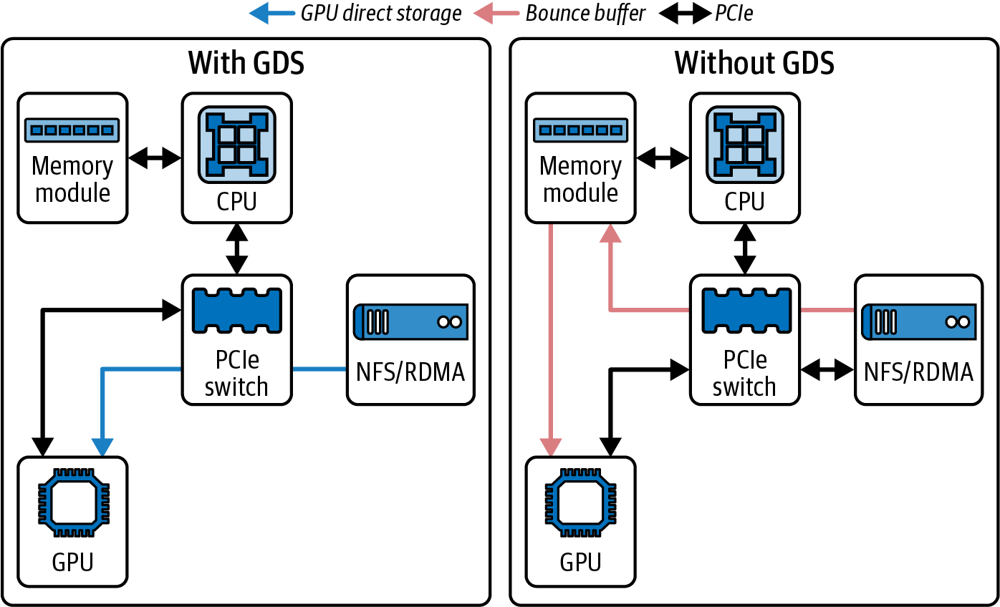
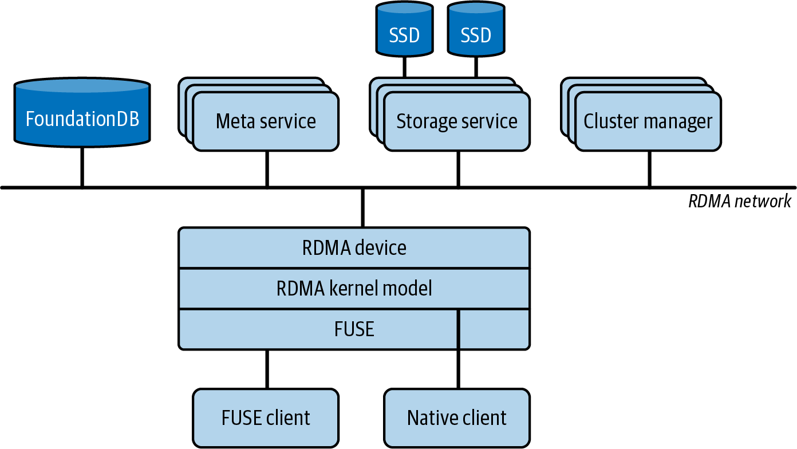

# 第5章 基于GPU的存储I/O优化

对于AI工作负载来说，向GPU提供数据与计算本身同样重要。考虑一个在数千个GPU上训练100万亿参数模型的场景。这样的模型可能处理数十亿个训练样本，包括token、图像、音频、视频等。

这意味着必须从存储中读取海量数据并尽可能快地提供给GPU。如果存储管道缓慢，GPU将饥饿并闲置。尽管我们讨论了复杂的通信优化，但这仍会导致低利用率。

本章讨论存储和输入管道优化。具体来说，它演示了如何高效地从磁盘或远程存储读取数据、如何预处理数据，以及如何将I/O与GPU计算重叠。

> Feeding data to the GPUs is as important as the compute itself for AI workloads. Consider a scenario with a 100-trillion-parameter model training on thousands of GPUs. Such a model might process billions of training samples, including tokens, images, audio, video, etc. This means that an enormous amount of data must be read from storage and fed to the GPUs as quickly as possible. If the storage pipeline is slow, the GPUs will starve and sit idle. This results in low utilization despite the sophisticated communication optimizations that we've discussed. This chapter addresses storage and input pipeline optimizations. Specifically, it demonstrates how to read data efficiently from disk or remote storage, how to preprocess it, and how to overlap its I/O with GPU compute.

## 5.1 快速存储和数据局部性 (Fast Storage and Data Locality)

大型模型训练作业通常需要读取海量数据集。对于大型语言模型，通常有数十亿甚至数万亿个训练样本。对于语言模型，这是TB级别的文本数据；对于视觉模型，则是PB级别的图像数据。

在超大规模下，你的存储系统必须持续提供巨大的吞吐量，以跟上可能连续运行数月的数千甚至数百万个GPU。将NVMe SSD放置在机柜内——或使用NVMe over Fabrics（NVMe-oF）配合机柜本地交换拓扑——可以最小化网络跳数并提高性能一致性。

如果你的数据存储在网络附加存储（如NFS服务器或云对象存储，如Amazon S3）中，你需要确保所有计算节点的聚合读取带宽是足够的。考虑一个场景，每个GPU需要200 MB/s的训练数据才能保持忙碌（基于模型和批量大小）。如果你总共有8个GPU，那就需要约1.6 GB/s的聚合带宽。现代高端GPU如Blackwell和Rubin需要更多带宽才能使其饱和。

一个配备72个Blackwell GPU的NVIDIA Grace Blackwell GB200/GB300 NVL72机柜，在一个NVLink域中连接。如果每个GPU需要200 MB/s的训练数据才能保持忙碌，这可能需要14-20 GB/s的聚合存储吞吐量来保持所有72个GPU忙碌。对于这类超大规模工作负载，你的存储解决方案需要相应扩展。

> Large model training jobs usually need to read huge datasets. It's common to have on the order of billions or even trillions of training samples for large language models. This is in the range of terabytes of text data for language models and petabytes of images for vision models. At ultra scale, your storage system must consistently provide massive throughput to keep up with the thousands and millions of GPUs potentially running for months at a time. Colocating NVMe SSDs within racks—or using NVMe over Fabrics (NVMe-oF) with rack-local switch topologies—minimizes network hops and improves performance consistency. If your data lives in network-attached storage like an NFS server or cloud object storage (e.g., Amazon S3), you need to ensure that the aggregate read bandwidth from all of your compute nodes is sufficient. Consider a scenario in which each GPU needs 200 MB/s of training data to stay busy based on the model and batch size. If you have 8 GPUs total, that's about 1.6 GB/s aggregate bandwidth needed. Modern high-end GPUs like Blackwell and Rubin demand even more bandwidth to keep them saturated. An NVIDIA Grace Blackwell GB200/GB300 NVL72 rack with 72 Blackwell GPUs connected in one NVLink domain. If each GPU needs 200 MB/s of training data to stay busy, this can require 14–20 GB/s of aggregate storage throughput to keep all 72 GPUs busy. For these types of ultrascale workloads, your storage solution needs to scale accordingly.

如果你的工作负载流式传输更重的媒体或多模态样本，请使用你测量的每样本字节数和每秒样本数进行校准。在这种情况下，聚合需求可能高得多。

> If your workload streams heavier media or multimodal samples, calibrate using your measured bytes-per-sample and samples-per-second. In such cases, aggregate demand can be much higher.

一种解决方案是使用同一机柜中更快的本地存储，如NVMe SSD——或NVMe-oF网络拓扑。另一种解决方案是使用并行文件系统（如Lustre或通用并行文件系统GPFS等）将数据缓存在本地SSD上。假设存储系统能够跟上，重要的是配置多个数据加载线程来保持管道饱和。注意Python GIL！

> One solution is to use faster local storage such as NVMe SSDs in the same rack—or NVMe-oF network topology. Another solution is to use a parallel filesystem like Lustre or General Parallel File System (GPFS), etc., to cache the data on local SSDs. Assuming the storage system can keep up, it's important to provision multiple data loading threads to keep the pipe saturated. Watch out for the Python GIL!

只要可能，将数据尽可能物理靠近计算节点放置。"靠近"可能意味着在同一物理节点上，如本地NVMe SSD驱动器，或至少在同一机柜中，通过高速互连（如NVMe over Fabric（NVME-oF）或高级存储加速器）连接。

> Whenever possible, place data as physically close to the compute nodes as possible. "Close" could mean on the same physical node, such as a local NVMe SSD drive, or at least in the same rack with a high-speed interconnect with something like NVMe over Fabric (NVME-oF) or an advanced storage accelerator.

对于分布式、多节点模型训练，一种常见的方法是将数据集分片到各节点，以便每个节点主要从其本地磁盘读取数据子集。例如，如果你有100 TB数据和10个节点，你可能会预先将10 TB分配到每个节点的本地存储。然后每个节点的数据加载器只从其本地10 TB读取。这避免了用冗余读取使网络饱和——特别是当数据集大小不容易放入RAM时。

> For distributed, multinode model training, a common approach is to shard the dataset across nodes so that each node primarily reads a subset of data from its local disk. For example, if you have 100 TB of data and 10 nodes, you might presplit 10 TB to each node's local storage. Then each node's data loader reads only from its local 10 TB. This avoids saturating the network with redundant reads—especially if the dataset size does not easily fit in RAM.

像PyTorch的DistributedSampler这样的框架将协调工作进程，使每个进程在每个epoch获得唯一的数据切片。这与在多个集群节点上分片数据的目标非常一致。

> Frameworks like PyTorch's DistributedSampler will coordinate workers such that each process gets a unique slice of data per epoch. This aligns well with the goal of sharding the data over multiple cluster nodes.

## 5.2 顺序与随机读取模式 (Sequential Versus Random Read Patterns)

GPU在处理数据方面非常快，但它们更喜欢以大块连续方式读取数据以提高效率。同样，存储对于大型顺序读取的吞吐量测量值远高于小型随机读取。因此，在准备数据集或存储布局时，尽量尽可能安排顺序访问。

例如，在使用图像训练时，避免存储数百万个单独的图像文件，因为这会导致磁盘上大量的随机寻道。相反，考虑将它们存储在几个大型二进制文件（如Arrow、TFRecord或Parquet）、数据库文件、WebDataset tar文件或等效格式中。在这些情况下，每个文件包含许多连接的样本，这是理想的。

> GPUs are extremely fast at crunching data, but they prefer that the data be read in large contiguous chunks for efficiency. Similarly, storage measures much higher throughput for large, sequential reads than for small, random reads. As such, when preparing your datasets or storage layout, try to arrange for sequential access as much as possible. For instance, when training with images, avoid storing millions of individual image files since this will lead to lots of random seeks all over the disk. Consider, instead, storing them in a few large binary (e.g., Arrow, TFRecord, or Parquet) files, database files, WebDataset tar files, or equivalents. In these cases, each file contains many concatenated samples, which is ideal.

随着当今GPU速度更快，将小文件合并为大分片变得更加重要，因为过多的小随机读取会更快成为瓶颈。虽然大多数现代并行文件系统和对象存储可以处理一定程度的小随机读取，但最好明确验证性能。

> Combining small files into large shards is even more important with today's faster GPUs, since excessive small random reads will more quickly become a bottleneck. And while most modern parallel filesystems and object stores can handle a degree of small random reads, it's best to verify the performance explicitly.

从较大文件中读取数据块自然会在一次传递中获得许多样本。如果使用像Amazon S3这样的对象存储，通常会提前将较小的对象合并为较大的对象，正是出于这个原因。

> Reading a chunk of data from the larger files will naturally get many samples in one pass. If using an object store like Amazon S3, it's common to combine smaller objects into larger ones ahead of time for this exact reason.

此外，调整读取大小很重要，因为由于每次读取的开销较低，以1 MB块读取将比4 KB块产生更好的吞吐量。许多数据加载器库允许调整缓冲区大小和预取块大小。例如，Python的open()使用操作系统的预读缓冲区来加速顺序扫描，但随机读取不会从较大缓冲区或缓冲I/O库中受益太多。

> Also, it's important to tune the read size since reading in 1 MB chunks will yield better throughput than 4 KB chunks due to the lower per-read overhead. Many data loader libraries allow adjusting buffer size and prefetch chunk size. For example, Python's open() uses the OS's read-ahead buffer to accelerate sequential scans, but random reads won't benefit much from larger buffers or buffered I/O libraries.

相反，你应该将读取批处理为较大的连续块，或使用高级数据集API（例如TFRecordDataset或PyTorch的IterableDataset和DataLoader，具有可配置的预取大小）。虽然这些框架和库中有许多在内部针对大型顺序读取进行了优化，但调整其缓冲区和预取参数仍然很重要。

> Instead, you should batch your reads into larger contiguous chunks or use a high-level dataset API (e.g., TFRecordDataset or PyTorch's IterableDataset and DataLoader with configurable prefetch sizes). And while many of these frameworks and libraries are internally optimized for large sequential reads, tuning their buffer and prefetch parameters is still important.

如果你的访问模式仍然必须是随机的，请使用调用pread()的线程或Linux的异步I/O接口（如io_uring）并行发出多个读取。通过预注册缓冲区和轮询等功能，io_uring允许以最小的内核开销提交批量I/O请求。它可以通过减少每次系统调用的开销来进一步提高随机读取吞吐量。这有助于隐藏延迟并实现高IOPS。

> If your access pattern still must be random, issue multiple reads in parallel using either threads calling pread() or Linux's asynchronous I/O interfaces like io_uring. With features like preregistered buffers and polling, io_uring allows submitting batches of I/O requests with minimal kernel overhead. It can further improve random read throughput by reducing per-syscall overhead. This helps hide latency and achieve high IOPS.

应该使用针对大型并发I/O优化的文件系统。XFS在Linux NVMe服务器上很常见。你应该使用noatime挂载它以消除每次读取时昂贵的访问时间更新。对于像Amazon EFS这样的网络存储服务，确保你的EFS文件系统处于Max I/O性能模式以获得最高聚合吞吐量。如果你需要一致的带宽，可以从默认的Bursting吞吐量模式切换到Provisioned吞吐量。这些设置确保你的I/O层能够跟上大规模并行AI工作负载。

> One should use a filesystem optimized for large, concurrent I/O. XFS is common on Linux NVMe servers. You should mount it with noatime to eliminate costly access-time updates on each read. For networked storage services like Amazon EFS, make sure your EFS filesystem is in Max I/O performance mode for the highest aggregate throughput. If you need consistent bandwidth, you can switch from the default Bursting throughput mode to Provisioned throughput. These settings ensure your I/O layer can keep up with massive, parallel AI workloads.

## 5.3 调优NVMe和文件系统以获得吞吐量 (Tuning NVMe and Filesystem for Throughput)

现代Linux使用多队列块I/O调度器blk-mq，将I/O分散到CPU核心。对于快速NVMe SSD，你可能需要调整队列深度和提交队列数量。通常默认值就可以了，但如果你知道你的工作负载是重度顺序的，你可能会使用"none"I/O调度器。

> Modern Linux uses a multiqueue block I/O scheduler, blk-mq, that spreads I/O across the CPU cores. For fast NVMe SSDs, you might need to tune the queue depths and number of submission queues. Usually the defaults are fine, but if you know that your workload is heavily sequential, you might use the "none" I/O scheduler.

传统的完全公平排队（CFQ）调度器已过时。现代内核默认为NVMe使用none或mq-deadline多队列调度器。可以使用/sys/block/<device>/queue/scheduler检查此设置。"none"调度器是低延迟工作负载的标准。在某些存储设备上，你可能会遇到预算公平排队（BFQ）调度器。

> The legacy completely fair queueing (CFQ) scheduler is obsolete. Modern kernels use the none or mq-deadline multiqueue scheduler by default for NVMe. This setting can be checked using /sys/block/<device>/queue/scheduler. The "none" scheduler is standard for low latency workloads. On some storage devices, you might encounter the budget fair queueing (BFQ) scheduler.

对于高性能NVMe，建议仍然使用none或mq-deadline多队列调度器以最大化吞吐量。你可以使用/sys/block/nvme*/queue/scheduler验证和设置调度器。它几乎总是开箱即用配置正确，但值得快速检查验证。

> For high-performance NVMe, it's recommended to still use the none or mq-deadline multiqueue scheduler to maximize throughput. You can verify and set the scheduler using /sys/block/nvme*/queue/scheduler. It's almost always configured properly out of the box, but it's worth verifying with a quick check.

另一个调优方面是预读。当内核检测到顺序读取时，它会自动预读额外数据。你可以在/sys/block/<device>/queue/read_ahead_kb中看到预读设置。例如，默认情况下它可能设置为128 KB。如果你正在流式传输大文件，请将其增加到几MB。这将通过减少系统调用开销和流水线读取来提高吞吐量。可以使用blockdev --setra在设备上完成此操作。

> Another tuning aspect is read ahead. The kernel will automatically read ahead extra data when it detects sequential reads. You can see the read ahead setting in /sys/block/<device>/queue/read_ahead_kb. For example, by default it is likely set to 128 KB. If you are streaming large files, increase this to a few MB. This will improve your throughput by reducing syscall overhead and pipelining reads. This can be done using blockdev --setra on the device.

如果使用NVMe SSD磁盘，请确保它们设置在系统上可用的最快接口上。并确保你有足够的通道（例如PCIe），这样它们就不会成为瓶颈。有时，多个SSD可以使用RAID 0进行条带化，例如，以充分利用这些设备并最大化吞吐量——特别是如果单个磁盘无法使你的GPU饱和。

> If using NVMe SSD disks, ensure that they are set up on the fastest interface available on your system. And make sure you have enough lanes (e.g., PCIe) so they're not bottlenecked. Sometimes, multiple SSDs can be striped using RAID 0, for instance, to fully utilize these devices and maximize throughput—especially if a single disk cannot saturate your GPUs.

Linux页面缓存会自动将最近读取的数据从磁盘缓存到RAM中。对于大型数据集，你可能会超出可用RAM并导致缓存颠簸。但对于中等大小的数据集，热缓存可以大大加速训练。

> The Linux page cache will automatically cache recently read data into RAM from disk. For large datasets, you might exceed the available RAM and thrash the cache. But for moderately large datasets, warm caches can greatly speed up training.

如果你的数据——或其很大一部分——可以放入RAM（例如Grace Blackwell Superchip上的CPU + GPU统一内存），你应该考虑在启动时将其完全预加载到内存中。这有效地为GPU创建了一个超快的内存缓存。这可以大大减少训练期间的磁盘I/O。但是，对于PB级的大型数据集，这通常不可行。在这些情况下，使用优化的I/O流式传输数据是正确的方法。

> If your data—or a large portion of it—can fit into RAM (including CPU + GPU unified memory on a Grace Blackwell Superchip, for example), you should consider preloading it completely into memory at startup. This effectively creates an ultrafast in-memory cache for the GPU. This can greatly reduce disk I/O during training. However, for massive petabyte-scale datasets, that's usually not feasible. In these cases, streaming the data with optimized I/O is the way to go.

确保在数据加载中使用多个工作进程（例如PyTorch的DataLoader(num_workers=N)）。这些独立的CPU线程/进程将并行获取和预处理数据，以供你训练作业中的许多GPU使用。找到正确的工作进程数量是经验性的。

> Be sure to use multiple workers in data loading (e.g., PyTorch's DataLoader(num_workers=N)). These separate CPU threads/processes will fetch and preprocess data in parallel to feed the many GPUs in your training job. Finding the right number of workers is empirical.

我们将在第13和14章深入探讨PyTorch性能调优，但在这里值得注意的是，你应该启用pin_memory=True并使用non_blocking=True来启用主机到设备副本的重叠。通过设置persistent_workers=True，你可以避免跨epoch的工作进程重生开销。调整每个工作负载的prefetch_factor也很有用。当num_workers大于0时，默认prefetch_factor为2。

> We will dive into PyTorch performance tuning in Chapters 13 and 14, but it's worth noting here that you should enable pin_memory=True and use non_blocking=True to enable overlapping host-to-device copies. And by setting persistent_workers=True, you avoid worker respawn overhead across epochs. It's also useful to tune prefetch_factor per workload. The default prefetch_factor is 2 for num_workers greater than 0.

工作进程太少，GPU将空闲。工作进程太多，它们的线程将开始争夺可用的CPU核心和I/O带宽。监控CPU使用率和磁盘吞吐量。理想情况下，你希望磁盘吞吐量接近100%利用率，CPU有一些余量。

> Too few workers and the GPU will be idle. Too many workers and their threads will start contending for available CPU cores and I/O bandwidth. Monitor CPU usage and disk throughput. Ideally, you want near 100% utilization of disk throughput and some headroom on CPU.

对于具有非常高核心数的CPU，如GB200/GB300 Superchip中使用的72核NVIDIA Grace CPU，你通常可以利用更多数据加载器工作进程。只需注意过度I/O争用导致的收益递减。

> For CPUs with a very high core count, such as the 72-core NVIDIA Grace CPU used in the GB200/GB300 Superchips, you can often utilize more data loader workers. Just be mindful of diminishing returns caused by excessive I/O contention.

## 5.4 使用NVIDIA GDS (Using NVIDIA GDS)

GDS是一项允许GPU直接从存储设备或通过网络存储栈读取数据的功能，而无需在CPU内存中创建额外副本。通常，当GPU想要从NVMe SSD读取数据时，数据首先从SSD传输到CPU内存。然后CUDA调用将数据从CPU内存复制到GPU内存。

> GDS is a feature that allows GPUs to read data directly from storage devices, or through the network storage stack, without creating extra copies in CPU memory. Normally, when a GPU wants to read data from an NVMe SSD, the data first goes from SSD to CPU memory. Then a CUDA call copies the data from CPU memory to GPU memory.

GDS补充了GPUDirect RDMA，因为GDS加速存储到GPU的DMA，而GPUDirect RDMA加速网络到GPU的DMA。两者都没有消除CPU编排。两者都移除了主机内存弹跳缓冲区。

> GDS complements GPUDirect RDMA since GDS accelerates storage-to-GPU DMA, while GPUDirect RDMA accelerates network-to-GPU DMA. Neither eliminates CPU orchestration. Both remove the host memory bounce buffer.

使用GDS，GPU可以对SSD或NIC发起直接内存访问（DMA），将数据移动到其自己的HBM内存中。这绕过了通过CPU路径的额外复制。GDS支持本地NVMe设备和使用NVMe-oF的远程存储。

> With GDS, the GPU can initiate a direct memory access (DMA) against the SSD or NIC to move the data into its own HBM memory. This bypasses the extra copy through the CPU's path. GDS supports local NVMe devices and remote storage using NVMe-oF.

在实践中，GDS创建了一条直接DMA路径，绕过存储和GPU内存之间的主机内存弹跳缓冲区。这扩大了GDS对集群文件系统甚至某些对象存储系统的适用性。（注意：CPU仍然配置和编排I/O。）

> In practice, GDS creates a direct DMA path that bypasses host memory bounce buffers between storage and GPU memory. This broadens the applicability of GDS to cluster filesystems and even some object storage systems. (Note: the CPU still configures and orchestrates the I/O.)

启用GDS需要现代NVIDIA GPU和支持直接内存访问的存储栈，以及正确的NVIDIA驱动程序和CUDA工具包。通常使用本地NVMe SSD或RAID卷。

> Enabling GDS requires a modern NVIDIA GPU and a storage stack that supports direct memory access—as well as the correct NVIDIA drivers and CUDA toolkit. Typically, local NVMe SSDs or RAID volumes are used.

GDS支持取决于文件系统和支持RDMA的栈。截至本文撰写时，支持的栈包括XFS/EXT4上使用O_DIRECT的本地NVMe和NVMe-oF、RDMA上的NFS，以及与nvidia-fs集成的BeeGFS、WekaFS、VAST、IBM Storage Scale等选定的并行文件系统。

> GDS support depends on the filesystem and RDMA-capable stack. As of this writing, supported stacks include local NVMe and NVMe-oF on XFS/EXT4 with O_DIRECT, NFS over RDMA, and select parallel filesystems such as BeeGFS, WekaFS, VAST, IBM Storage Scale, and others that integrate with nvidia-fs.

应用程序需要使用正确的API。你可以使用CUDA的cuFile库通过GDS读取文件。cuFile支持自动缓冲区对齐和与常见文件系统集成等功能。

> The application needs to use the correct APIs. You can use CUDA's cuFile library to read files through GDS. cuFile supports features like automatic buffer alignment and integration with common filesystems.

实际上，如果你设置了GDS并且你的读取路径使用cuFileRead，数据可以直接从磁盘流入GPU内存。这减少了CPU利用率（允许CPU执行其他预处理）并可以提高吞吐量，特别是当CPU成为瓶颈时。

> In practical terms, if you have GDS set up and your read path uses cuFileRead, the data can flow from disk to GPU memory directly. This reduces CPU utilization (allowing CPUs to do other preprocessing) and can improve throughput, especially when the CPU is a bottleneck.

cuFileRead直接与Linux文件系统集成。你还可以使用cuFile的异步API，如cuFileReadAsync和cuFileWriteAsync，在CUDA流上集成存储I/O（在第11章讨论），以实现重叠和流水线。

> cuFileRead integrates directly with the Linux filesystem. You can also use cuFile's asynchronous APIs, such as cuFileReadAsync and cuFileWriteAsync to integrate storage I/O on CUDA streams (discussed in Chapter 11) for overlap and pipelining.

尽可能使用O_DIRECT以启用直接DMA并绕过OS页面缓存。对于现代GDS版本，cuFile也可以在非O_DIRECT文件描述符上操作，但未对齐可能会导致额外复制或性能下降。

> Use O_DIRECT when possible to enable direct DMA and bypass the OS page cache. With modern GDS releases, cuFile can also operate on non-O_DIRECT file descriptors, but misalignment may incur extra copies or reduced performance.

许多存储供应商如WekaIO、DDN、VAST、Cloudian等已发布支持GDS的解决方案或插件，使其系统可以使用RDMA直接将数据传送到GPU内存。这种生态系统支持意味着GDS可以开箱即用于企业网络附加存储（NAS）和并行文件系统。

> Many storage vendors like WekaIO, DDN, VAST, Cloudian, etc., have released GDS-aware solutions or plugins so their systems can deliver data using RDMA directly into GPU memory. This ecosystem support means GDS can be used by enterprise network-attached storage (NAS) and parallel filesystems out of the box.

VAST Data的报告显示，在某些AI工作负载上使用GDS可获得20%的读取吞吐量提升。在他们的情况下，在单个A100 GPU上使用GDS对顺序读取实现了20%更高的读取吞吐量，在适用时显著接近每个NIC 100 Gb/s链路容量。图5-1显示了使用和不使用GDS的架构。

> Reports from VAST Data show a 20% boost in read throughput using GDS on certain AI workloads. In their case, using GDS on a single A100 GPU achieved 20% higher read throughput for sequential reads, which pushed significantly closer to the 100 Gb/s link capacity per NIC when applicable. Figure 5-1 shows the architecture with and without GDS.



> Figure 5-1. VAST Data's network architecture with GDS versus without GDS

在左侧，我们看到通过主机内存复制的传统分阶段DMA。右侧是使用GDS的直接GPU拉取，绕过主机内存复制并减少CPU利用率。VAST的报告测量了在NVIDIA Ampere A100 GPU上20%的读取吞吐量提升，在Hopper H100 GPU上由于更高的NIC带宽和更大的CPU负担，提升了30%以上。

> Here on the left, we see traditional staged DMA that copies through host memory. On the right is a direct GPU pull using GDS that bypasses host memory copies and reduces CPU utilization. A report by VAST measured a 20% read-throughput boost on an NVIDIA Ampere A100 GPU and a 30%+ increase on a Hopper H100 GPU due to its higher NIC bandwidth and greater CPU burden.

在你的工作负载和架构上验证，因为提升因IO大小、队列深度、NIC代、文件系统实现等而异。

> Validate on your workload and fabric, as uplifts vary by IO size, queue depth, NIC generation, filesystem implementation, etc.

然而，GDS可能需要调优，并非所有工作负载都能看到巨大提升。如果你的CPU轻松处理数据传输，GDS可能不会大幅改变吞吐量。但是，它会降低CPU使用率，从而释放CPU执行数据处理和其他任务。另一方面，如果CPU因许多memcpy操作而饱和，那么GDS将大有帮助。

> However, GDS may need tuning, and not all workloads see a huge boost. If your CPU was easily handling the data transfers, GDS might not change throughput much. However, it will lower CPU usage, which frees up the CPU to perform data processing and other tasks. On the other hand, if the CPU is saturated with many memcpy operations, then GDS will help a lot.

必须确保在使用GDS时正确应用O_DIRECT语义和对齐。主机固定内存不用于存储到GPU的数据路径。cuFile注册GPU设备缓冲区，nvidia-fs内核驱动程序在存储设备或RDMA NIC与GPU内存之间直接编排DMA。它直接与POSIX文件描述符集成，因此你可以将cuFile与常规文件一起使用——包括支持RDMA的网络文件系统。

> One has to make sure that O_DIRECT semantics and alignment are applied correctly when using GDS. Host pinned memory is not used in the storage-to-GPU data path. cuFile registers GPU device buffers, and the nvidia-fs kernel driver orchestrates DMA directly between the storage device or RDMA NIC and GPU memory. It integrates directly with the POSIX file descriptors, so you can use cuFile with regular files—including network filesystems if they support RDMA.

考虑一个训练批量大小仅为1 MB的小型场景，希望每秒向GPU提供1,000个批次。这大约是1,000 MB/s。用CPU进行复制很容易消耗几个核心。使用GDS，GPU将直接从磁盘拉取1,000 MB/s并释放CPU。在更高速率下——或使用数千个GPU——这变得更加明显。

> Consider having a tiny training batch size of 1 MB and wanting to feed 1,000 batches each second to the GPUs. This is roughly 1,000 MB/s. Doing that copy with the CPU would easily consume a few cores. With GDS, the GPU would pull that 1,000 MB/s directly from disk and free up the CPU. At higher rates—or with thousands of GPUs—this becomes even more pronounced.

由于训练工作负载绝大多数是读取密集型的，大多数GDS性能提升是在从存储读取数据时评估的。但是，快速检查点写入也很重要。对于RDMA加速写入，文件系统必须支持GDS的RDMA写入。

> Since training workloads are overwhelmingly read-heavy, most GDS performance gains are evaluated when reading data from storage. However, it's important to have fast checkpoint writes as well. For RDMA-accelerated writes, the filesystem must support RDMA writes for GDS.

WekaFS是超大规模AI训练工作负载的知名存储提供商。他们提供并行文件系统，附带支持RDMA读写工作负载的支持GDS的插件。

> WekaFS is a well-known storage provider for ultrascale AI training workloads. They offer a parallel filesystem that ships with GDS-aware plugins for both read and write workloads over RDMA.

### 5.4.1 使用cuda-checkpoint检查点GPU状态 (Checkpointing GPU State with cuda-checkpoint)

你可以在Linux上使用NVIDIA的cuda-checkpoint实用程序和CPU进程检查点工具（如Checkpoint/Restore in Userspace（CRIU））来检查点GPU状态。cuda-checkpoint在运行进程内暂停CUDA，等待已提交的工作完成，将设备内存复制到驱动程序管理的主机分配，并释放GPU资源。这样，CPU端检查点器可以快照进程。

> You can checkpoint GPU state on Linux using NVIDIA's cuda-checkpoint utility together with a CPU process checkpoint tool such as Checkpoint/Restore in Userspace (CRIU). cuda-checkpoint suspends CUDA inside a running process, waits for submitted work to complete, copies device memory to host allocations managed by the driver, and releases GPU resources. This way, a CPU-side checkpointer can snapshot the process.

暂停路径锁定CUDA驱动程序入口点，排空未完成的工作，将设备内存复制到主机，并释放GPU资源。在估计暂停时间时，请考虑使用的设备内存量以及暂停期间可用的主机链路带宽。

> The suspend path locks CUDA driver entry points, drains outstanding work, copies device memory to host, and releases GPU resources. When estimating suspend time, consider the amount of device memory in use—as well as the host-link bandwidth available during suspend.

由于驱动程序在暂停阶段将设备内存复制到主机分配，有效暂停时间受内存映像大小和平台互连的限制。你应该使用Nsight Systems标记围绕锁定和检查点调用来验证暂停阶段实际花费的时间。

> Since the driver copies device memory into host allocations during the suspend phase, the effective suspend time is bounded by the memory image size and your platform interconnect. You should profile with Nsight Systems markers around the lock and checkpoint calls to verify actual time spent during the suspend phase.

当你希望进程恢复时，驱动程序重新获取GPU，将设备内存映射到其原始地址，恢复CUDA对象（如流和上下文），然后解锁驱动程序和进程以允许CUDA调用继续。

> When you want the process to resume, the driver reacquires the GPUs, maps device memory to their original addresses, restores CUDA objects such as streams and contexts, and then unlocks the driver and process to allow CUDA calls to proceed.

具体来说，CUDA驱动程序API暴露了cuCheckpointProcessLock、cuCheckpointProcessCheckpoint、cuCheckpointProcessRestore和cuCheckpointProcessUnlock。恢复需要启用持久模式（或调用cuInit），并且可以重新映射到相同芯片类型的不同物理GPU。

> Specifically, the CUDA Driver API exposes cuCheckpointProcessLock, cuCheckpointProcessCheckpoint, cuCheckpointProcessRestore, and cuCheckpointProcessUnlock. Restore requires persistence mode enabled (or a call to cuInit) and it can remap to different physical GPUs of the same chip type.

重要的是要注意，此路径与框架级模型检查点（例如PyTorch检查点）正交。CUDA检查点对于长时间运行的训练和推理作业的容错、抢占和迁移很有用。

> It's important to note that this path is orthogonal to framework-level model checkpoints (e.g., PyTorch checkpoints). CUDA checkpoints are useful for fault tolerance, preemption, and migration of long-running training and inference jobs.

与使用GDS的数据摄取不同，检查点路径不会直接从GPU内存DMA到存储。相反，设备内存映像在暂停期间首先由驱动程序带入主机内存。然后CRIU将该进程内存持久化到检查点映像。使用此功能来补充，而不是替换框架的state-dict或分片检查点文件。

> Unlike data ingestion with GDS, the checkpoint path does not DMA directly from GPU memory to storage. Instead, the device memory image is first brought into host memory by the driver during suspend. CRIU then persists that process memory to the checkpoint image. Use this to complement, not replace, your framework's state-dict or sharded checkpoint files.

### 5.4.2 使用gdsio测量GDS (Measuring GDS with gdsio)

NVIDIA提供了一个名为gdsio的工具，默认安装在/usr/local/cuda/gds/tools下，用于基准测试磁盘和GPU之间的GDS吞吐量。这非常有用。

> NVIDIA provides a tool called gdsio, installed under /usr/local/cuda/gds/tools by default, to benchmark GDS throughput between disk and GPU. This is super useful.

使用GDS时，看到10%-20%或更高的吞吐量提升并不罕见——特别是在CPU受限的场景中。让我们看一个例子，使用NVIDIA的gdsio工具比较纯CPU中介读取（"之前"）与直接GDS读取（"之后"）。以下是CLI命令和吞吐量/延迟结果：

> When using GDS, it's not uncommon to see improvements on the order of 10%–20% in throughput or more—especially in CPU-constrained scenarios. Let's take a look at an example and compare a pure CPU-mediated read ("before") versus a direct GDS read ("after") using NVIDIA's gdsio tool. Here are the CLI command and throughput/latency results:

```bash
# Before (Storage → CPU Memory only)
# CPU path, host memory, async copies (-x 2)
$ /usr/local/cuda/gds/tools/gdsio \
    -f /mnt/data/large_file \
    -d 0 -w 4 -s 10G -i 1M -I 0 -x 2

Total Throughput: 8.0 GB/s
Average Latency: 1.25 ms
```

> # Before (Storage → CPU Memory only) # CPU path, host memory, async copies (-x 2) $ /usr/local/cuda/gds/tools/gdsio \ -f /mnt/data/large_file \ -d 0 -w 4 -s 10G -i 1M -I 0 -x 2 Total Throughput: 8.0 GB/s Average Latency: 1.25 ms

这里显示的第一个调用使用CPU路径，通过固定主机内存和异步复制（-x 2）在读取模式（-I 0）下收集基线。下面的第二个调用在读取模式（-I 0）下为相同配置启用GDS路径（-x 0）。比较路径时请确保一致使用传输选择器。对于gdsio，-x 2测量CPU中介传输，-x 0测量GDS路径：

> The first call shown here uses the CPU path with pinned host memory and async copies (-x 2) in read mode (-I 0) to gather a baseline. The second call below enables the GDS path (-x 0) in read mode (-I 0) for the same configuration. Make sure to use the transfer selector consistently when comparing paths. For gdsio, -x 2 measures CPU-mediated transfers, and -x 0 measures the GDS path:

```bash
# After (Storage → GPU Memory using GPUDirect Storage)
#   - same config, GDS path (-x 0) 
$ /usr/local/cuda/gds/tools/gdsio \
    -f /mnt/data/large_file \
    -d 0 -w 4 -s 10G -i 1M -I 0 -x 0

Total Throughput: 9.6 GB/s
Average Latency: 1.00 ms
```

> # After (Storage → GPU Memory using GPUDirect Storage) # - same config, GDS path (-x 0) $ /usr/local/cuda/gds/tools/gdsio \ -f /mnt/data/large_file \ -d 0 -w 4 -s 10G -i 1M -I 0 -x 0 Total Throughput: 9.6 GB/s Average Latency: 1.00 ms

我们看到使用GDS创建从磁盘到GPU内存的直接数据路径可将吞吐量提高20%，同时平均I/O延迟相应降低，如表5-1所示。它在释放以前用于通过主机缓冲区移动数据的CPU周期的同时做到这一点。这个简单的基准测试展示了如何在你的系统中验证GDS的好处。

> We see that using GDS to create a direct data path from disk into GPU memory increases throughput by 20% with a corresponding decrease in average I/O latency, as shown in Table 5-1. It does this while freeing up CPU cycles previously spent moving data through host buffers. This simple benchmark shows how to verify GDS's benefits in your system.

表5-1 GDS前后的吞吐量和延迟对比

| 路径 | 吞吐量 | 延迟 |
|------|--------|------|
| 存储 → CPU（无GDS） | 8.0 GB/s | 1.25 ms |
| 存储 → GPU（有GDS） | 9.6 GB/s (+20%) | 1.00 ms (–20%) |

> Table 5-1. Throughput and latency before GDS versus after GDS

在这个例子中，使用GDS（存储 → GPU）将读取吞吐量从8.0 GB/s提高到9.6 GB/s，并将延迟从1.25 ms降低到1.00 ms。这转化为吞吐量（更高）和延迟（更低）约20%的改进。

> In this example, using GDS (Storage → GPU) increased read throughput from 8.0 GB/s to 9.6 GB/s and reduced latency from 1.25 ms to 1.00 ms. This translates to ~20% improvement in both throughput (higher) and latency (lower).

## 5.5 DeepSeek的Fire-Flyer文件系统 (DeepSeek's Fire-Flyer File System)

DeepSeek从头创建了一个名为Fire-Flyer文件系统（3FS）的自定义开源文件系统。这源于他们观察到AI工作负载执行大量随机读取。

这些随机读取使得传统的读取数据缓存对LLM训练和推理工作负载无效——甚至适得其反。通过消除缓存并采用直接文件I/O，3FS确保每个请求直接到达NVMe SSD设备，避免浪费的缓存管理。这种方法类似于优先考虑直接存储访问的现代HPC文件系统。因此，3FS最小化了读取期间的内核页面缓存参与和主机内存复制。

> DeepSeek created a custom, open source filesystem called Fire-Flyer File System (3FS) from the ground up. It was born out of their observation that AI workloads perform massive numbers of random reads. These random reads make conventional read data caching ineffective—and even counterproductive—for LLM training and inference workloads. By eliminating caching and employing direct file I/O, 3FS ensures that every request goes straight to the NVMe SSD device and avoids wasteful cache management. This approach is similar to modern HPC filesystems that prioritize direct storage access. As such, 3FS minimizes kernel page-cache involvement and host memory copies during reads.

3FS反映了专门为AI协同设计存储的趋势。这类似于NVIDIA的GDS，后者旨在与高性能并行文件系统配合工作，以实现类似的直接GPU吞吐量。

> 3FS mirrors the trend of codesigning storage specifically for AI. This is similar to NVIDIA's GDS, which is designed to work with high-performance parallel filesystems to achieve similar direct-GPU throughput.

3FS由四个关键组件组成：集群管理器、元数据服务、存储服务和客户端。这些通过支持RDMA的架构（如InfiniBand或RoCE）互连，以最小化CPU参与和主机端复制。这些组件和连接如图5-2所示。



> 3FS consists of four key components: cluster manager, metadata service, storage service, and client. These are interconnected over an RDMA-capable fabric like InfiniBand or RoCE to minimize CPU involvement and host-side copies. These components and connections are shown in Figure 5-2.

> Figure 5-2. Components of DeepSeek's Fire-Flyer File System (3FS) (source: https://oreil.ly/xD3id)

3FS是基于Linux的文件系统，允许与现有应用程序兼容，同时利用RDMA读取进行直接GPU可访问的数据传输。元数据在多个节点之间分片和复制，以实现横向扩展性能。数据路径完全绕过OS页面缓存以保持最佳吞吐量。

> 3FS is a Linux-based filesystem, which allows compatibility with existing applications while leveraging RDMA reads for direct GPU-accessible data transfers. Metadata is sharded and replicated across multiple nodes for scale-out performance. Data paths bypass the OS page cache entirely to maintain optimal throughput.

如果文件系统使用FUSE在用户空间实现，它将无法提供GDS路径，因为GDS需要内核级文件系统与O_DIRECT语义集成。只有启用GDS的内核客户端或专门集成的并行文件系统才能提供直接传输到GPU内存的功能。

> If a file system is implemented using FUSE in user space, it will not be able to deliver a GDS path because GDS requires kernel-level filesystem integration with O_DIRECT semantics. Only GDS-enabled kernel clients or specifically integrated parallel file systems can provide direct transfers into GPU memory.

为了将数据直接馈送到GPU管道，DeepSeek在3FS中集成了基于RDMA的传输。如果你需要真正的GDS路径，请使用启用GDS的内核文件系统客户端，如NVMe、NVMe-oF、BeeGFS、WekaFS、IBM Storage Scale或VAST。这允许以最小开销直接异步零拷贝数据移动到GPU设备内存。

> To feed data directly into GPU pipelines, DeepSeek integrates RDMA-based transfers in 3FS. If you require a true GDS path, use a GDS-enabled kernel filesystem client such as NVMe, NVMe-oF, BeeGFS, WekaFS, IBM Storage Scale, or VAST. This allows asynchronous, zero-copy data movement directly into GPU device memory with minimal overheads.

3FS通过使数据预取和传输与GPU内核并发运行，补充了本章关于将I/O与计算重叠的技术。3FS有效地将级联管道/波概念（在第4章讨论）扩展到存储层。

> 3FS complements this chapter's techniques for overlapping I/O with computation by enabling data prefetch and transfer to run concurrently with GPU kernels. 3FS effectively extends the cascading pipeline/wave concept (discussed in Chapter 4) to storage layers.

DeepSeek公开报告了3FS在大型集群上的多TB每秒聚合读取吞吐量，在其环境中结果高达7.3 TB/s。在另一个基准测试中，一个大型3FS集群在使用68节点AI-HPC集群（配备10 × 16 TB NVMe SSD和双100 Gb/s）时实现了约6.6 TB/s的聚合读取吞吐量。它在同时以额外1.4 TB/s服务后台工作负载的同时做到了这一点。这个报告的3FS吞吐量6.6 TB/s远超Ceph在类似硬件上的约1.1 TB/s。

> DeepSeek has publicly reported multi-terabyte-per-second aggregate read throughput for 3FS on large clusters, with results up to 7.3 TB/s in their environment. In another benchmark, a large 3FS cluster achieved aggregated read throughput on the order of 6.6 TB/s using a 68-node AI-HPC cluster with 10 × 16 TB NVMe SSDs and dual 100 Gb/s. It did this while concurrently serving background workloads at an additional 1.4 TB/s. This reported 3FS throughput, 6.6 TB/s, far exceeds Ceph's ~1.1 TB/s on similar hardware.

3FS通过跨节点协调I/O实现这种性能。这种持续的带宽水平有助于防止数据暂存阶段成为瓶颈——并有助于在训练和推理工作负载中保持高GPU利用率。

> 3FS achieves this performance by coordinating I/O across nodes. This level of sustained bandwidth helps prevent the data-staging phase from becoming the bottleneck—and helps keep GPU utilization high across both training and inference workloads.

通过创建自己针对随机读取优化的文件系统并将其与RDMA优先的数据路径集成，DeepSeek展示了端到端、全栈性能工程——包括存储设计——对于利用大规模AI系统的全部性能潜力是多么重要。

> By creating their own filesystem optimized for random reads and integrating it with RDMA-first data paths, DeepSeek demonstrates how end-to-end, full-stack performance engineering—including storage design—is essential for utilizing the full performance potential of large-scale AI systems.

3FS展示了重新思考存储层如何消除I/O瓶颈的最后一点。构建自己的文件系统是一项高级技术，需要大量前期投资和持续维护。相反，你更可能从现有的分布式文件系统或对象存储开始。让我们接下来讨论这些。

> 3FS shows how rethinking the storage layer can remove the last bits of I/O bottlenecks. Building your own filesystem is an advanced technique that requires a lot of upfront investment and ongoing maintenance. Instead, it's more likely that you will start with an existing distributed filesystem or object store. Let's discuss these next.

## 5.6 分布式、并行文件系统和对象存储 (Distributed, Parallel Filesystems and Object Stores)

在多节点上训练时，常见的设置是使用共享文件系统（如NFS服务器）或并行文件系统（如Lustre、GPFS、Ceph等）。使用这些系统，所有节点都可以访问相同的数据集。虽然方便，但如果配置不当，这些文件系统可能成为瓶颈。

> When training on multiple nodes, a common setup is to use a shared filesystem like an NFS server, or a parallel filesystem like Lustre, GPFS, Ceph, etc. With these systems, all nodes can access the same dataset. While convenient, these filesystems can become a bottleneck if not configured properly.

虽然设置简单，但如果许多节点同时读取，单个NFS服务器很容易成为吞吐量瓶颈。如果必须使用NFS，请确保服务器有多个快速NIC。你还应该考虑使用多个NFS服务器来拆分数据集，以便每个服务器处理一部分数据。

> Though it's simple to set up, a single NFS server can easily become a throughput bottleneck if many nodes are reading at once. If you must use NFS, ensure the server has multiple fast NICs. You should also consider using multiple NFS servers to split up the dataset so that each server handles a partition of data.

对于多GPU集群，你应该只将NFS用于适度规模，如几个节点。对于较大的训练集群，单个NFS服务器——即使是高端实现——也可能成为瓶颈。这就是为什么像Amazon FSx for Lustre这样的并行文件系统和云存储缓存是现代AI训练集群的首选。

> For multi-GPU clusters, you should consider NFS only for modest scales such as a few nodes. For larger training clusters, a single NFS server—even a high-end implementation—is likely to become a bottleneck. This is why parallel filesystems and cloud storage caches like Amazon FSx for Lustre are preferred for modern AI training clusters.

对于像Amazon FSx for Lustre这样的云存储缓存，重要的是验证性能改进并证明缓存的额外成本是合理的。如果你没有看到预期的性能，请直接与云提供商合作验证你的架构并确认你的配置设置。

> For cloud storage caches like Amazon FSx for Lustre, it's important to verify the performance improvement and justify the additional cost of the cache. If you're not seeing the performance that you expect, work directly with the cloud provider to validate your architecture and confirm your configuration settings.

NFS还有调优参数，如rsize/wsize（读/写请求大小）。建议使用最大值（例如1 MB）来提高吞吐量。确保底层NFS存储使用NVMe SSD足够快——并且可能采用RAID 0配置。不要忘记检查NFS客户端挂载选项。它们也需要调优。

> NFS also has tuning parameters like rsize/wsize (read/write request sizes). It's recommended to use the max value (e.g., 1 MB) to improve throughput. Make sure the underlying NFS storage is fast enough using NVMe SSD—and potentially in a RAID 0 configuration. And don't forget to check the NFS client mount options. They should be tuned as well.

你可以使用rsize=1048576,wsize=1048576,noatime,async挂载NFS客户端，例如，使用1 MiB块并消除访问时间更新（noatime）。你还可以添加actimeo=60,lookupcache=pos来缓存文件属性和目录条目60秒。这些简单的调整可以大大减少每次请求的开销并提高大型共享数据集上的并行读取吞吐量。

> You can mount your NFS client with rsize=1048576,wsize=1048576,noatime,async, for instance, to use 1 MiB blocks and eliminate access‐time updates (noatime). You can also add actimeo=60,lookupcache=pos to cache file attributes and directory entries for 60 seconds. These simple tweaks can vastly reduce per‐request overhead and boost parallel read throughput on large, shared datasets.

像Amazon S3这样的对象存储不是典型的文件系统，但在AI工作负载中非常常见。在训练期间访问对象存储如果操作不当可能会很慢。解决方案通常涉及在本地NVMe SSD存储上暂存数据——或在对象存储之上使用缓存层（例如，S3之上的Amazon FSx for Lustre）。像s5cmd和aws s3 cp这样的工具让你在训练开始前下载数据。

> Object storage like Amazon S3 is not a typical filesystem, but it is very common in AI workloads. Accessing object storage during training can be slow if done naively. The solution often involves staging data on local NVMe SSD storage—or using a caching layer on top of object storage (e.g., Amazon FSx for Lustre on top of S3). Tools like s5cmd and aws s3 cp let you download data before training starts.

确保你使用高度并行、优化的数据传输工具，如AWS S3 C++ SDK和像s5cmd这样的多线程实用程序，以获得最佳性能。

> Make sure you use highly parallel, optimized data-transfer tools such as the AWS S3 C++ SDK and multithreaded utilities like s5cmd to get the best performance.

你还可以使用流式库，通过范围请求从Amazon S3读取对象并执行缓存。如果直接从Amazon S3读取，请使用尽可能大的请求——并使用多线程范围Get操作。

> You can also use a streaming library that reads objects from Amazon S3 with range requests and performs caching. If directly reading from Amazon S3, use as large requests as possible—and use multithreaded range Get operations.

像Lustre和GPFS这样的并行文件系统专为高并发和吞吐量而设计。例如，Lustre设置有多个对象存储目标（OST）来服务数据。通过在OST之间条带化文件，你可以倍增吞吐量。如果你有这样的并行文件系统，请确保你的大型数据文件在许多OST上条带化。

> Parallel filesystems like Lustre and GPFS are designed for high concurrency and throughput. A Lustre setup, for instance, has multiple Object Storage Targets (OSTs) that serve data. By striping files across OSTs, you can multiply your throughput. If you have such a parallel filesystem, ensure your large data files are striped across many OSTs.

文件条带化意味着文件的块存在于不同的服务器上。这允许并行读取。例如，你可能将Arrow、TFRecord或Parquet文件在4个OST上条带化。如果每个OST提供500 MB/s，你可以实现2 GB/s的理论峰值读取吞吐量。

> Striping files across implies that chunks of the file live on different servers. This allows parallel reads. For instance, you might stripe your Arrow, TFRecord, or Parquet files across 4 OSTs. If each OST gives 500 MB/s, you can achieve a theoretical peak read throughput of 2 GB/s.

### 5.6.1 调优、复制和压缩数据 (Tuning, Replicating, and Compressing Data)

要调优这些文件系统，请务必查看文档。例如，在Lustre上使用lfs setstripe将大型数据集在4或8个OST上设置条带化以聚合OST带宽。

> To tune these filesystems, make sure to check the documentation. For instance, lfs setstripe is used on Lustre to set striping for a large dataset across 4 or 8 OSTs to aggregate OST bandwidth.

在训练期间监控文件系统的I/O，使用像lmt for Lustre这样的工具——或特定供应商的监控工具。你将查看存储集群中的各个节点是否热点。如果是，你需要确定原因。原因最可能是分片问题，即更多的读/写最终落在较少数量的节点上。

> Monitor the filesystem's I/O during training, using tools like lmt for Lustre—or vendor-specific monitoring tools. You'll be looking to see if individual nodes in the storage cluster are hot. If so, you need to identify why. The cause is most likely a sharding issue in which many more reads/writes are ending up on a smaller number of nodes.

在某些情况下，要完全消除网络读取，你可以选择将数据集复制到计算集群中的每个节点上。这假设每个节点上有足够的存储。这确实是一种蛮力方法，但相对常见且非常有效，可以完全消除网络读取。你会立即看到性能提升——代价是额外存储。

> To eliminate network reads entirely, you can, in some cases, choose to replicate the dataset onto each node in the compute cluster. This assumes you have enough storage on each node. This is an admittedly brute-force but relatively common and very effective solution to eliminate network reads entirely. You will see an immediate performance win—at the cost of extra storage.

另一个提高性能的选择是在文件系统或对象存储上存储压缩数据——并即时解压缩。示例包括图像（JPEG）和压缩文本（Arrow和Parquet）。这可以节省I/O带宽，代价是一些额外的CPU或GPU周期。但是，如果I/O是瓶颈而CPU和GPU空闲，这是一个合理的权衡。

> Another option to improve performance is to store data compressed on the filesystem or object store—and decompress them on the fly. Examples include images (JPEGs) and compressed text (Arrow and Parquet). This can save I/O bandwidth at the cost of some extra CPU or GPU cycles. However, if I/O is the bottleneck and the CPUs and GPUs are idle, this is a reasonable trade-off.

许多数据管道已经在这样做了，所以你只需要验证压缩比并确保在管道的每一步都使用它。关键是找到平衡，使解压缩步骤不会成为瓶颈。

> Many data pipelines are already doing this, so you'll just want to verify the compression ratio and make sure you're using it at every step in the pipeline. The key is to find a balance such that the decompression step doesn't become the bottleneck.

像nvJPEG这样的库可以在GPU上解码图像。现代GPU添加了片上解压缩引擎，支持LZ4、Snappy和Deflate等格式，以加速将数据移动和解包到GPU内存。如果你在磁盘上存储压缩批次，Blackwell GPU可以使用解压缩引擎在管道内解压缩。这释放SM运行更高价值的任务，如计算内核。你应该为I/O绑定工作负载优先选择这些压缩格式。

> Libraries like nvJPEG can decode images on GPU. Modern GPUs add an on-die Decompression Engine supporting formats such as LZ4, Snappy, and Deflate to accelerate moving and unpacking data into GPU memory. If you store compressed batches on disk, Blackwell GPUs can decompress them in-pipeline using the Decompression Engine. This frees SMs to run higher-value tasks such as compute kernels. You should favor these compression formats for I/O bound workloads.

这是将算术操作从CPU卸载到GPU的另一种方式——并可能将数据解码与梯度计算重叠，例如在训练期间。由于高带宽CPU到GPU NVLink-C2C互连（高达900 GB/s双向带宽），你可以防止CPU辅助阶段成为瓶颈。

> This is another way to offload arithmetic operations from the CPU to the GPU—and possibly overlap data decoding with gradient computations during training, for instance. And because of the high-bandwidth CPU-to-GPU NVLink-C2C interconnect (up to 900 GB/s bidirectional bandwidth), you can prevent CPU-assisted stages from becoming bottlenecks.

利用这些巧妙的软硬件GPU卸载功能可以进一步将工作负载从CPU转移，并保持输入数据管道平衡。关键仍然是确保解压缩时间不会取代I/O成为瓶颈，否则可能不值得额外的压缩计算。

> Utilizing these clever software and hardware GPU offload features can further shift workloads off the CPU and keep the input data pipeline balanced. The key is still to make sure that the decompression time does not replace I/O as the bottleneck, otherwise it likely isn't worth the extra compression computations.

## 5.7 监控存储I/O (Monitoring Storage I/O)

与任何性能工程任务一样，测量是关键。与监控网络通信类似，使用所有可用工具监控存储管道通信很重要。

这些工具包括Linux iostat、iotop、nvme-cli、perf和eBPF。此外，你可以使用特定供应商的实用程序和仪表板来监控队列、延迟、预读效果和缓存命中率。这些将有助于显示本地NVMe设备使用情况，并确定在从NAS或对象存储读取数据时是否使网络链路饱和。

> As with any performance engineering task, measurement is key. Similar to monitoring network communication, it's important to use all of your available tools to monitor your storage pipeline communication. These tools include Linux iostat, iotop, nvme-cli, perf, and eBPF. In addition, you can use vendor-specific utilities and dashboards to monitor queues, latencies, read-ahead effects, and cache hit ratios. These will help to show local NVMe device usage and determine if you're saturating network links when reading data from a NAS or object store.

还可以考虑使用Nsight Systems等工具来跟踪I/O等待时间并可视化与GPU内核的重叠。使用Nsight Systems选项--trace=gds。这将捕获cuFile API活动并在时间线上跟踪。你还可以使用/etc/cufile.json启用GDS cuFile静态跟踪点，以便在Nsight Systems中查看cuFile事件。NVMe点对点DMA路径的内核模式计数器不会在Nsight Systems中暴露，并且可能并非所有GDS栈都可用。

> Also consider tools like Nsight Systems to trace I/O wait times and visualize overlap with GPU kernels. Use the Nsight Systems option --trace=gds. This will capture cuFile API activity and tracing on the timeline. You can also enable GDS cuFile static tracepoints using /etc/cufile.json to see cuFile events in Nsight Systems. Kernel-mode counters for NVMe peer-to-peer DMA paths are not exposed in Nsight Systems and may not be available for all GDS stacks.

另一个工具是NVIDIA的数据中心GPU管理器（DCGM），它报告有用的GPU I/O统计信息。这些GPU特定工具与主机OS工具一起，可以更完整地了解因I/O导致的GPU饥饿。

> Another tool is NVIDIA's Data Center GPU Manager (DCGM), which reports useful GPU I/O statistics. Together, these GPU-specific tools complement host OS tools and give a more complete picture of GPU starvation due to I/O.

在PyTorch中，调用next(data_iterator)测量GPU等待下一批数据的总空闲时间。此时间包括任何后台预取和主机→设备复制——而不仅仅是Python数据加载逻辑。

> In PyTorch, calling next(data_iterator) measures the total time your GPU sits idle waiting for the next batch. This time includes any background prefetching and the host → device copy—and not just the Python data‐loading logic.

如果你想隔离纯数据加载成本，可以临时设置num_workers=0，这样就没有预取。然后你可以只计算迭代器拉取时间。你可以单独将.to("cuda")或固定内存暂存包装在自己的计时器中（或使用CUDA事件）来捕获主机→设备复制开销。

> If you want to isolate pure data‐loading cost, you can temporarily set num_workers=0 so there's no prefetch. Then you can time only the iterator pull. You can separately wrap your .to("cuda") or pinned-memory staging in its own timer (or use CUDA events) to capture the host → device copy overhead.

因为你的瓶颈可能在Python管道或GPU内存的memcpy中，你可以通过执行以下操作并比较时间与整体"GPU空闲"时间来区分它们：

> Because your bottleneck might be in the Python pipeline or in the memcpy into GPU memory, you can distinguish them by doing the following and comparing the timings with the overall "GPU idle" time:

**DataLoader与Python成本**：使用num_workers=0进行分析，查看Python循环和转换本身需要多长时间。这消除了任何后台线程调度。

> **DataLoader versus Python cost**: Profile with num_workers=0 to see how long the Python loop and transforms themselves take. This removes any background thread scheduling.

**主机→设备复制成本**：通过检查Nsight Systems中的"Copy"通道来仅测量设备传输时间，量化将数据暂存到GPU缓冲区实际使GPU停滞多长时间。你还可以在.to("cuda")调用周围包装torch.cuda.Event。

> **Host → Device copy cost**: Measure only the device‐transfer time by inspecting the "Copy" lanes in Nsight Systems to quantify how long staging data into GPU buffers actually stalls the GPU. You can also wrap torch.cuda.Event around your .to("cuda") calls.

通过将这两个时间与整体"GPU空闲"时间进行比较，你将知道是加速Python管道（例如添加工作进程、简化转换）还是优化H2D传输路径（例如使用固定内存、增加互连带宽或切换到GDS）。

> By comparing these two timings to your overall "GPU idle" time, you'll know whether to speed up your Python pipeline (e.g., add workers, simplify transforms) or optimize the H2D transfer path (e.g., use pinned memory, increase interconnect bandwidth, or switch to GDS).

通过监控存储管道，你可能会发现，例如，你的GPU有30%的时间在等待数据。在这种情况下，GPU的整体吞吐量受I/O限制，因此你需要实施这里提到的一些策略来减少I/O停滞并提高计算吞吐量。调优后，例如，也许你的GPU只有5%的时间在等待数据。你还会看到整体训练步数每秒成比例增加——在这种情况下是6倍。

> By monitoring your storage pipeline, you might find, for instance, that your GPUs are spending 30% of their time waiting for data. In this case, the GPU's overall throughput is limited by I/O, so you'll want to implement some of the strategies mentioned here to reduce the I/O stalls and increase compute throughput. After tuning, for instance, maybe your GPUs are waiting only 5% of the time for data. You'd also see overall training steps per second increase proportionally—6× in this case.

存储和I/O优化通常是消除累积的小低效问题；例如，这里5 ms延迟，那里10 MB缓冲区太小。但在规模上，修复这些低效问题会产生巨大影响。底线与前面的章节类似：保持管道满载。在这种情况下，不仅是计算管道，还有数据管道。从磁盘到GPU内存的每个组件都应该被监控、分析、分析和改进，以确保数据尽可能持续地流入这些GPU。

> Storage and I/O optimization is often about eliminating small inefficiencies that add up; for instance, a 5 ms latency here and a 10 MB too-small buffer there. But at scale, fixing these inefficiencies makes a huge difference. The bottom line is similar to earlier sections: keep the pipeline full. In this case, not just the compute pipeline but the data pipeline as well. Every component from disk to GPU memory should be monitored, profiled, analyzed, and improved to ensure that data is streaming into those GPUs as continuously as possible.

## 5.8 调优数据管道 (Tuning the Data Pipeline)

除了原始存储I/O外，CPU（或GPU）上的预处理和数据加载管道是整体AI工作负载性能的关键部分。调优良好的数据管道确保GPU永远不会因等待新数据而空闲。此外，重要的是并行执行适量的CPU工作来为GPU巨兽提供数据。

现代深度学习框架提供高级API来加载和预处理数据。这些可以——也应该——针对性能进行调优。我们将讨论通用策略和NVIDIA的DALI和NeMo等工具来进行高级数据管道管理。

> In addition to raw storage I/O, the preprocessing and data loading pipeline on the CPU (or GPU) is a critical part of overall AI workload performance. A well-tuned data pipeline ensures that GPUs are never idle waiting for new data. Additionally, it's important that the right amount of CPU work is being done in parallel to feed the GPU beast. Modern deep learning frameworks provide high-level APIs to load and preprocess data. These can—and should—be tuned for performance. We will discuss general strategies and NVIDIA's tools like DALI and NeMo for advanced data pipeline management.

### 5.8.1 高效数据加载和预处理 (Efficient Data Loading and Preprocessing)

训练中典型的数据加载过程涉及从存储读取数据、解码或反序列化数据（如解析JSON和解码JPEG）、应用一些转换（如分词文本和裁剪图像）以及将数据整理成批次。这些步骤可能是CPU密集型的，但如果它们是计算密集型的，也可以卸载到GPU。

为了保持高吞吐量，你可以采用这里描述的多种技术：

> The typical data loading process in training involves reading data from storage, decoding or deserializing the data like parsing JSON and decoding JPEGs, applying some transformations like tokenizing text and cropping images, and collating the data into batches. These steps can be CPU-intensive but can also be offloaded to the GPU if they are compute-heavy. To maintain high throughput, you can employ a number of techniques described here:

**使用多个工作进程/线程**：如前所述，像PyTorch DataLoader这样的框架让你指定num_workers。每个工作进程并行运行以获取和预处理数据。通常这些是独立进程以避免Python GIL问题。主进程通过队列异步从工作进程获取批次。

> **Use multiple worker processes/threads**: As mentioned, frameworks like PyTorch DataLoader let you specify num_workers. Each worker runs in parallel to fetch and preprocess data. Usually these are separate processes to avoid Python GIL issues. The main process asynchronously fetches batches from the worker processes using a queue.

**避免Python瓶颈**：如果你的数据加载逻辑在Python中，请警惕重度Python级处理。如果你看到纯Python代码用于在循环中分词单行文本，这是一个危险信号。在这些情况下，如果可能，更改为向量化操作。或使用C++/C绑定以提高性能。许多库存在用于这些类型的常见任务，包括Hugging Face Tokenizers库和TorchText。虽然它们有Python绑定，但它们在底层用快速的Rust/C++编写。此时，Python只是C/C++代码之上易于使用的接口。

> **Avoid Python bottlenecks**: If your data loading logic is in Python, be wary of heavy Python-level processing. If you see pure Python code being used to tokenize individual lines of text in a loop, this is a red flag. In these cases, change to vectorize the operations, if possible. Or use C++/C bindings for improved performance. Many libraries exist for these types of common tasks, including the Hugging Face Tokenizers library and TorchText. While they have Python bindings, they are written in fast Rust/C++ under the hood for speed. At this point, Python is just an easy-to-use interface on top of the C/C++ code.

**重叠CPU-GPU**：这个想法是将数据准备与GPU处理重叠。在完美场景中，当GPU处理批次N时，CPU已经加载并预处理了批次N+1并将其放入固定内存中。当GPU完成处理批次N时，它只是DMA复制批次N+1并立即开始计算。同时，CPU继续处理批次N+2。这种流水线对性能至关重要。大多数框架在使用多个工作进程时默认这样做，但你应该监控以确保它正在发生。如果没有，你可能会看到GPU在每次迭代开始时空闲，同时等待更多数据。

> **Overlap CPU-GPU**: The idea is to overlap data preparation with GPU processing. In a perfect scenario, while the GPU is processing batch N, the CPU has already loaded and preprocessed batch N+1 and made it available in pinned memory. When the GPU is done processing batch N, it just DMA copies batch N+1 and starts computing immediately. Meanwhile, the CPU moves on to process batch N+2. This pipelining is crucial for performance. Most frameworks do this by default when using multiple workers, but you should monitor to ensure that it's happening. If not, you might see the GPU go idle at the start of every iteration while it waits for more data.

**通过整理张量批量执行操作**：如果可能，你希望加载器批量执行操作而不是逐样本执行。例如，你希望使用向量化操作一次对整批张量应用转换。你通过使用自定义collate_fn()整理批次来做到这一点——或者可能在GPU上的训练循环本身中。这比在每行输入数据上单独执行这些操作要好得多。但是，某些转换需要逐样本执行，因此有时你需要了解工作负载才能有效地批量和整理。

> **Perform operations in batches by collating tensors**: If possible, you want your loader to perform operations in batches instead of per sample. For example, you want to apply transformations to a whole batch of tensors at once using vectorized operations. You do this by collating the batch with a custom collate_fn()—or perhaps in the training loop itself on the GPU. This is much better than performing these operations on each row of input data separately. However, some transformations need to be performed per sample, so you sometimes need to understand the workload before you can batch and collate effectively.

**在数据加载中使用内存固定**：在PyTorch DataLoader中启用pin_memory=True使主机→GPU（H2D）传输更快，并允许当源固定时真正的异步.to(..., non_blocking=True)复制。来自固定内存的DMA避免额外复制和页面错误，因为数据锁定在RAM中并准备好直接传输。这在将数据传输到GPU时几乎总是有益的。确保设置高ulimit -l（或容器--ulimit memlock）以避免大型固定缓冲区的分配失败。

> **Use memory pinning with data loading**: Enabling pin_memory=True in PyTorch DataLoader makes the host → GPU (H2D) transfer faster and allows truly asynchronous .to(..., non_blocking=True) copies when the source is pinned. DMA from pinned memory avoids extra copies and page faults because the data is locked in RAM and ready for direct transfer. This is almost always beneficial when transferring data to the GPU. Make sure you set a high ulimit -l (or container --ulimit memlock) to avoid allocation failures for large pinned buffers.

**预取批次**：某些框架让你指定预取队列长度。这是它应该提前加载多少批次。默认情况下，PyTorch的DataLoader使用保守值，如prefetch_factor=2。在这种情况下，PyTorch每个工作进程预取两个批次。在底层，它保持最多num_workers * prefetch_factor批次排队。因此，在阻塞之前，每个工作进程加载两个批次的数据。如果你的工作负载有突发I/O——或者你看到工作进程偶尔使GPU饥饿——你可以将prefetch_factor增加到4或8，例如。以下是一个PyTorch代码片段，演示PyTorch DataLoader同时使用pin_memory和prefetch_factor=4：

> **Prefetch batches**: Some frameworks let you specify a prefetch queue length. This is how many batches it should load ahead. By default, PyTorch's DataLoader uses a conservative value such as prefetch_factor=2. In this case, PyTorch prefetches two batches per worker. Under the hood it keeps up to num_workers * prefetch_factor batches queued. As such, before blocking, each worker loads two batches of data. If your workload has bursty I/O—or you see workers starving the GPU occasionally—you can increase prefetch_factor to 4 or 8, for example. Here is a PyTorch snippet that demonstrates the PyTorch DataLoader using both pin_memory and prefetch_factor=4:

```python
import torch
from torch.utils.data import Dataset, DataLoader

class Synthetic(Dataset):
    def __init__(self, n, shape): self.n, self.shape = n, shape
    def __len__(self): return self.n
    def __getitem__(self, i):
        return torch.ones(self.shape,  dtype=torch.float32)

B, C, H, W = 32, 3, 224, 224
dataset = Synthetic(n=100_000, shape=(B, C, H, W))

loader = DataLoader(
    dataset,
    batch_size=B,
    num_workers=8,
    pin_memory=True,
    persistent_workers=True,
    prefetch_factor=4,
  )

copy_stream = torch.cuda.Stream()
compute_stream = torch.cuda.current_stream()

for batch in loader:
    with torch.cuda.stream(copy_stream):
        batch_gpu = batch.to(device, non_blocking=True)
    with torch.cuda.stream(compute_stream):
        torch.cuda.current_stream().wait_stream(copy_stream)
        outputs = model(batch_gpu)
```

> import torch from torch.utils.data import Dataset, DataLoader # Create a Dataset and DataLoader that prefetches 4 batches # per worker into pinned CPU memory. class Synthetic(Dataset): def __init__(self, n, shape): self.n, self.shape = n, shape def __len__(self): return self.n def __getitem__(self, i): # Cheap CPU-side work; replace with real parse/decode return torch.ones(self.shape, dtype=torch.float32) B, C, H, W = 32, 3, 224, 224 dataset = Synthetic(n=100_000, shape=(B, C, H, W)) loader = DataLoader( dataset, batch_size=B, num_workers=8, pin_memory=True, persistent_workers=True, prefetch_factor=4, ) copy_stream = torch.cuda.Stream() compute_stream = torch.cuda.current_stream() for batch in loader: with torch.cuda.stream(copy_stream): batch_gpu = batch.to(device, non_blocking=True) # ensure pending H2D completes before compute uses it with torch.cuda.stream(compute_stream): torch.cuda.current_stream().wait_stream(copy_stream) outputs = model(batch_gpu)

在这个例子中，8个工作进程中的每一个都将大小为4的批次预加载到固定内存中。因为主机内存是固定的，异步.to(device, non_blocking=True)传输可以使用DMA进行高速数据复制。

> In this example, each of the 8 worker processes preloads batches of size 4 into pinned memory. Because the host memory is pinned, the asynchronous .to(device, non_blocking=True) transfer can use DMA for high-speed data copying.

因此，当GPU处理当前批次（批次N）时，DataLoader已经在并行准备和传输下一批次（批次N+1）。这种重叠至关重要。没有固定内存，系统需要为每次传输即时固定内存，这将引入不必要的延迟。本质上，固定内存确保从CPU到GPU的数据传输更快，并与GPU计算并发进行，最大化整体吞吐量。

> Consequently, while the GPU processes the current batch (batch N), the DataLoader is already preparing and transferring the next batch (batch N+1) in parallel. This overlap is critical. Without pinned memory, the system would need to pin the memory on the fly for each transfer, which would introduce unwanted latency. In essence, pinned memory ensures that data transfers from CPU to GPU happen more rapidly and concurrently with GPU computation, maximizing overall throughput.

另一个选择是启用persistent_workers=True，以便工作进程保持活跃并在跨epoch继续填充队列。当你多次循环同一数据集时，这最有效——特别是如果这些迭代（即epoch）非常短。当工作进程启动因导入模块、打开文件等而产生显著开销时，持久工作进程也有帮助。使用持久工作进程，你可以避免在每个epoch边界生成和拆除进程的成本。你的工作进程保持活跃，因此它们可以立即开始为下一个epoch预取，开销最小。

> Another option is to enable persistent_workers=True so workers stay alive and keep filling the queue across epochs. This is most effective when you loop over the same dataset many times—especially if these iterations (aka epochs) are very short. Persistent workers can also help when worker startup incurs significant overhead due to importing modules, opening files, etc. With persistent workers, you avoid the cost of spawning and tearing down processes at each epoch boundary. Your workers stay alive so they can immediately begin prefetching for the next epoch with minimal overhead.

管道中引入隐藏瓶颈是一个常见陷阱。通过添加调试日志或昂贵的CPU转换相对容易做到这一点。延迟可能只在负载下出现。要捕获这些，首先通过计时在禁用所有下游GPU工作的情况下生成100个批次需要多长时间来单独分析DataLoader。一旦你测量了该基线，将其与目标迭代时间以及正常训练期间测量的总GPU空闲时间进行比较。

> A common pitfall is introducing a hidden bottleneck in your pipeline. This is relatively easy to do by adding debug logging or expensive CPU transforms. Delays may only show up under load. To catch these, first profile the DataLoader in isolation by timing how long it takes to produce 100 batches with all downstream GPU work disabled. Once you've measured that baseline, compare it to your target iteration time and to the total GPU-idle time measured during normal training.

如果DataLoader本身太慢，通过删除每元素日志、简化转换或添加更多工作进程来优化Python管道。如果隔离加载器速度与实际运行加载器速度之间的差距很大，你可能受主机→设备传输或内核启动开销限制。

> If the DataLoader alone is too slow, optimize your Python pipeline by removing per-element logging, simplifying transforms, or adding more workers. If the gap between isolated loader speed and real-run loader speed is large, you're likely bound by host → device transfers or kernel-launch overhead.

如果你禁用GPU内核来隔离DataLoader进行分析，你也在减少CPU端内核启动开销。因此，你的"纯"数据加载吞吐量通常会低于在实际训练运行中看到的值。这仍然是一个有用的技术；只需记住这一点。

> If you disable GPU kernels to isolate the DataLoader for profiling, you are also reducing CPU-side kernel-launch overhead. As such, your "pure" data-loading throughput will often appear lower than what you'll see in a real training run. This is still a useful technique; just keep this in mind.

### 5.8.2 随着GPU数量扩展而扩展工作进程 (Scaling Out Workers as You Scale Out Number of GPUs)

随着添加更多GPU，你还应该扩展数据管道，否则你会使设备饥饿。在实践中，这意味着增加DataLoader的工作进程数或I/O带宽，以便你可以为每个GPU提供数据。这是提高总批量大小所必需的，以便每次迭代在更多设备上移动更多样本。

> As you add more GPUs, you should also expand your data pipeline, or you will starve the devices. In practice this means increasing your DataLoader's worker count or I/O bandwidth so you can feed every GPU. This is required to raise the total batch size so that each iteration moves more samples across your larger number of devices.

扩展计算而不扩展摄取管道资源将进一步将瓶颈转移到数据加载管道。在多节点、数据并行配置中，每个rank读取一个不同的分片。聚合数据加载工作负载随集群大小扩展。

> Scaling out compute without scaling out the ingestion pipeline resources will shift the bottleneck even further toward the data loading pipeline. In a multinode, data-parallel configuration, each rank reads a distinct shard. Together, the aggregate data loading workload scales with cluster size.

始终测量CPU利用率，因为随着GPU训练加速，数据输入管道将成为瓶颈。

> Always measure CPU utilization, as the data input pipeline will become the bottleneck as GPU training accelerates.

为了维持必要的吞吐量，你需要并行、高带宽和分布式存储后端（如前所述）来支持集群中许多节点上的超大规模数据分片。并回顾我们之前关于每个节点分片数据集的讨论。具体来说，随着添加更多节点，确保每个节点的本地存储能够处理其数据集份额。

> To sustain the necessary throughput, you will need parallel, high-bandwidth, and distributed storage backends, as discussed earlier, to support ultrascale data sharding across the many nodes in your cluster. And recall from our discussion earlier on sharding the dataset per node. Specifically, as you add more nodes, make sure that each node's local storage can handle its share of the dataset.

## 5.9 使用NVIDIA DALI进行多模态数据处理 (Multimodal Data Processing with NVIDIA DALI)

对于复杂或重度数据预处理，NVIDIA提供了其数据加载库（DALI）。DALI通过将数据处理移动到GPU或使用优化的C++ CPU代码来加速数据处理。它对于图像和视频数据特别有用，其中解码和增强可以从GPU加速中受益。

例如，DALI可以在GPU上解码JPEG图像并应用随机裁剪、调整大小和归一化等增强，全部在GPU上完成。这通常比在CPU上更快——假设GPU有可用周期。这从CPU卸载处理并减少所需的CPU工作进程数量。

> For complex or heavy data preprocessing, NVIDIA provides their Data Loading Library (DALI). DALI accelerates data processing by either moving it to the GPU or using optimized CPU code written in C++. It's especially useful for image and video data where decoding and augmentation can benefit from GPU acceleration. For example, DALI can decode JPEG images on the GPU and apply augmentations like random crop, resize, and normalization, all on the GPU. This is often faster than on a CPU—assuming the GPU has available cycles. This offloads processing from the CPU and reduces the number of CPU workers needed.

DALI管道以操作符的静态图形式声明式定义。你子类化nvidia.dali.pipeline.Pipeline并在define_graph()中声明数据源和CPU/GPU操作。然后DALI使用自己的线程池和队列在内部处理执行、预取和线程。

> DALI pipelines are defined declaratively as a static graph of operators. You subclass nvidia.dali.pipeline.Pipeline and declare your data sources and CPU/GPU ops in define_graph(). DALI then handles the execution, prefetching, and threading internally using its own thread pools and queues.

如果你的工作负载是输入绑定的（例如模型训练），集成DALI可能会显著提高吞吐量。但是，必须将其集成到训练循环本身中，这增加了一些复杂性并且有一点学习曲线。

> If your workload is input-bound (e.g., model training), integrating DALI might significantly boost throughput. However, one must integrate it into the training loop itself, which adds some complexity and has a bit of a learning curve.

对于许多常见工作负载，如分类、目标检测和分割，NVIDIA DALI提供预构建的管道，在GPU上解码图像和视频。这充分利用了GPU的媒体加速硬件。

> For many common workloads like classification, object detection, and segmentation, NVIDIA DALI provides prebuilt pipelines that decode images and videos on the GPU. This fully utilizes the GPU's media‐acceleration hardware.

考虑一个读取图像和视频、执行增强并训练目标检测模型的数据管道。你可能会观察到CPU使用率为800%，即八个核心以100%利用率运行。但GPU仍然偶尔停顿。

> Consider a data pipeline that reads images and videos, performs augmentations, and trains an object detection model. You might observe CPU usage at 800%, which is eight cores running at 100% utilization. But the GPU is still stalling occasionally.

通过使用DALI，你可能会将CPU利用率降至200%，即只有两个核心，执行文件读取，而GPU执行实际的图像和视频解码。GPU可以与计算并发执行读取。

> By using DALI, you might drop CPU utilization to 200%, or just two cores, to perform the file reads while the GPU does the actual image and video decoding. And the GPU can perform the reads concurrently with computations.

在实践中，实际加速完全取决于你将DALI放置在流程中的位置。如果你仅使用DALI解压缩JPEG，然后立即将原始像素交还给CPU进行增强和整理，你将招致额外的主机-设备-主机复制，这可能会抵消使用DALI的性能收益。

> In practice, the real speedup depends entirely on where you place DALI in your flow. If you use DALI merely to decompress JPEGs and then immediately hand the raw pixels back to the CPU for augmentations and collation, you will incur extra host-device-host copies that can negate the performance gains of using DALI.

更好的DALI方法可能是识别GPU友好的预处理操作，并直接将它们融合到基于GPU的预处理计算图中。大多数预处理可以使用现有的基于CUDA的库（如TorchVision和TensorRT）或使用自定义CUDA内核来完成。这样，你可以避免过度在CPU和GPU之间来回移动数据。这可能比在管道中使用DALI产生更高的端到端性能，因此值得探索。

> A better approach to DALI might be to identify GPU-friendly preprocessing operations and fuse them directly into your GPU-based preprocessing computation graph. Most preprocessing can be done using existing CUDA-based libraries like TorchVision and TensorRT—or using custom CUDA kernels. This way, you avoid excessively moving data back and forth between the CPU and GPU. This could produce higher end-to-end performance than using DALI in your pipeline, so it's worth exploring.

一如既往，在现实条件下对端到端系统进行基准测试。比较仅CPU管道、启用DALI的管道和完全融合的GPU图实现，以确定哪个为你的模型和数据集提供CPU节省和GPU利用率的最佳平衡。

> As always, benchmark the end-to-end system under realistic conditions. Compare a CPU‐only pipeline, a DALI‐enabled pipeline, and a fully fused GPU‐graph implementation to determine which delivers the best balance of CPU savings and GPU utilization for your model and dataset.

## 5.10 使用NVIDIA NeMo Curator创建高质量LLM数据集 (Creating High-Quality LLM Datasets with NVIDIA NeMo Curator)

NVIDIA NeMo是一个用于开发和训练语言模型的工具包。在NeMo工具包中是NeMo库和框架套件，包括开源NeMo Curator框架。

Curator帮助为LLM训练准备大型多模态数据集。在处理来自不同来源的TB级数据时很有帮助。Curator支持数据处理步骤，如清洗、分词和洗牌。

> NVIDIA NeMo is a toolkit for developing and training language models. Within the NeMo toolkit is the NeMo suite of libraries and frameworks, including the open source NeMo Curator framework. Curator helps prepare large multimodal datasets for LLM training. It's helpful when dealing with terabytes of data from different sources. Curator supports data processing steps such as cleansing, tokenizing, and shuffling.

NeMo Curator可以将数据集预处理分布到多个GPU或节点上。这利用多个加速器更快地准备数据——在组装多TB训练数据集时是一个重要考虑因素。

> NeMo Curator can distribute the dataset preprocessing across multiple GPUs or nodes. This makes use of multiple accelerators to prepare data faster—an important consideration when assembling multiterabyte training datasets.

此外，Curator可以压缩和打包数据到少量大型文件中——或将数据转换为二进制格式以便机器更容易消费。它还可以创建新的合成训练数据集来增强人类数据集，后者相对有限且越来越稀缺。

> In addition, Curator can compress and pack data into a small number of large files—or transform the data into a binary format for easier consumption by machines. It can also create new, synthetic training datasets to augment human datasets, which are relatively limited and becoming more and more scarce.

通过Curator在训练过程之前和离线进行重度预处理，在线训练数据管道变得更加简单，因为它只是读取准备好的数据，可能执行一些轻量级的"最后一公里"洗牌等。

> With Curator doing the heavy preprocessing offline and ahead of the training process, the online training data pipeline becomes much simpler since it's just reading the prepared data and maybe performing some lightweight, "last mile" shuffling, for instance.

NeMo Curator还可以通过去重数据和删除有问题内容来强制执行数据质量过滤器。这对LLM训练质量和性能都很重要。预先拥有结构良好、预处理和清洗的数据集意味着训练管道有一致的结构良好且大小均匀的数据流（例如，填充到固定长度），不必即时分词文本，并可以避免棘手的字符串处理。

> NeMo Curator can also enforce data quality filters by deduplicating data and removing problematic content. This is important for both LLM training quality and for performance. Having a well-structured, preprocessed, and cleansed dataset upfront means the training pipeline has a consistent flow of well-structured and evenly sized data (e.g., padded to a fixed length), doesn't have to tokenize text on the fly, and can avoid gnarly string processing.

如果你有像NeMo Curator这样的工具，明智的做法是利用它们，使你的训练作业主要是GPU前向和反向传播——而不是处理文本和读取数百万个随机大小的小文件。对于基于NeMo的训练，预处理数据集通常存储为内存可映射的.bin数据文件和.idx索引文件。NeMo Curator的DocumentDataset然后读取和写入分片JSONL或Parquet。构建索引数据集时处理到.bin/.idx的下游转换。

> If you have access to tools such as NeMo Curator, it's wise to leverage them so that your training job is mostly GPU forward and backward passes—and not processing text and reading millions of randomly sized small files. For NeMo-based training, preprocessed datasets are typically stored as memory-mappable .bin data files with .idx index files. NeMo Curator's DocumentDataset then reads and writes sharded JSONL or Parquet. Downstream conversion to .bin/.idx is handled when you build the indexed dataset.

你可能需要考虑存储N份数据副本，以N种不同方式洗牌，以避免N个epoch训练期间的运行时洗牌成本。明显的权衡是磁盘空间和内存，但这是一个值得考虑的权衡。

> You may want to consider storing N copies of the data shuffled in N number of different ways to avoid runtime shuffling cost over N epochs of training. The obvious trade-off is disk space and memory, but this it's a trade-off worth considering.

一般来说，在训练前准备数据。你应该几乎从不使用原始文本进行训练。离线预处理数据可能需要一些时间，但从长远来看，通过更快的训练运行、更快的迭代和更可预测的扩展，这是值得的。

> In general, prepare your data before training. You should almost never be training with raw text. It might take some time to preprocess the data offline, but it pays off in the long run with faster training runs, quicker iterations, and more predictable scaling.

这里描述的所有技术都旨在永远不让数据加载管道导致你昂贵的GPU集群空闲。如果数据管道无法足够快地提供输入，性能最高的GPU也是无用的。因此，需要在所有层（包括存储、网络、CPU和GPU）采用整体、全栈优化方法。

> All the techniques described here are designed to never let the data loading pipeline cause your expensive GPU cluster to sit idle. The highest-performing GPU is useless if the data pipeline cannot supply inputs fast enough. Therefore, a holistic, full-stack optimization approach is required at all layers, including storage, network, CPU, and GPU.

NeMo的数据加载仍在CPU上运行。要绕过CPU I/O，你需要将其与GDS等工具集成。

> NeMo's data loading still runs on CPUs. To bypass CPU I/O, you need to integrate it with tools like GDS.

在许多情况下，优化数据管道比任何算法调整产生更多改进。调优不当的输入管道可能浪费50%的GPU时间，而算法优化可能只提供几个百分点。

> In many cases, optimizing the data pipeline yields more improvement than any algorithmic tweak. A poorly tuned input pipeline could waste 50% of your GPU time, whereas algorithmic optimizations might give only a few percent.

## 5.11 持续分析和调优工作流 (Continuous Profiling and Tuning Workflow)

性能工程是一个迭代过程。为确保分布式训练或推理应用在扩展或修改时保持高效，你应该采用持续分析和调优工作流。这意味着定期收集性能数据、识别瓶颈、应用优化，然后再次测量。

> Performance engineering is an iterative process. To ensure that your distributed training or inference application stays efficient as you scale or modify it, you should adopt a continuous profiling and tuning workflow. This means regularly collecting performance data, identifying bottlenecks, applying optimizations, and then measuring again.

随着时间的推移，硬件和软件更新将改变最佳设置，因此你需要持续分析和调优。为了领先于此，专注于性能的工程团队通常维护性能仪表板来跟踪样本/秒等指标随时间的变化。

> Over time, hardware and software updates will change the optimal settings, so you need to continuously profile and tune. To stay ahead of this, performance-focused engineering teams often maintain performance dashboards to track metrics like samples/sec over time.

考虑设置自动夜间运行来分析你的训练和推理工作负载。这样，你可以捕获回归或改进并将其追溯到代码更改。

> Consider setting up automated nightly runs that profile your training and inference workloads. This way, you can catch regressions or improvements and trace them to code changes.

让我们看一个典型的工作流程和一组最佳实践，可以广泛适用于所有分析和调试情况——不仅限于本章描述的主题：

> Let's look at a typical workflow and set of best practices that can be applied broadly for all profiling and debugging situations—not just specific to the topics described in this chapter:

**建立基线**：从单个GPU或最小设置开始，测量性能，如以样本/秒测量的训练吞吐量或以毫秒测量的推理延迟（希望如此！）。然后扩展到单节点上的多个GPU，然后是多个节点——每次使用整体吞吐量等高级指标分析性能如何扩展。理想情况下，N个GPU为简单数据并行工作负载提供N倍吞吐量。如果你看到远低于此，这是系统产生过多开销的迹象。下一步是量化瓶颈。例如，8个GPU只提供5倍吞吐量增加，显示系统效率仅为62.5%。这不理想。

> **Establish a baseline**: Start with a single GPU or a minimal setup and measure performance such as training throughput measured in samples/sec or inference latency measured in milliseconds (hopefully!). Then scale up to multiple GPUs on a single node, then multiple nodes—each time analyzing how performance is scaling using a high-level metric like overall throughput. Ideally, N GPUs give Nx more throughput for a simple data-parallel workload. If you see much less than this, it's a sign that your system is incurring too much overhead. The next step is to quantify the bottleneck. For instance, 8 GPUs giving only a 5× increase in throughput reveals a system that is only 62.5% efficient. This is not ideal.

**分析多GPU运行的瓶颈**：要诊断瓶颈的确切原因，我们深入分析并使用系统分析工具（如Nsight Systems（nsys））对整个多GPU作业进行概览，了解时间花在哪里。第一步是查看GPU利用率时间线。GPU是否频繁停顿？如果是，它们在等待什么？还要检查CPU时间线。主进程是否落后于其他工作进程？是否存在每个线程都在等待的同步点？例如，如果GPU在模型训练期间的梯度all-reduce期间空闲，你知道通信是瓶颈。如果它们在每次迭代开始时空闲，可能是数据加载或特定内核是瓶颈。

> **Profile the multi-GPU run for bottlenecks**: To diagnose the exact cause of the bottleneck, we dive deeper and use a system-profiling tool like Nsight Systems (nsys) on the multi-GPU job as a whole to get an overview of where time is spent. The first step is to look at the GPU utilization timeline. Are the GPUs stalling frequently? If so, what are they waiting for? Also check CPU timelines. Is the main process lagging behind the other worker processes? Are there synchronization points where every thread is waiting? For example, if GPUs are idle during model training in a gradient all-reduce, you know communication is a bottleneck. If they are idle at the start of each iteration, perhaps data loading or a specific kernel is the bottleneck.

**如需要放大特定内核**：如果你识别出某个GPU操作（网络或计算）运行比预期慢，你可以使用Nsight Compute（ncu）深入分析该内核以检查其效率。例如，在我们之前的讨论中，我们查看了NCCL内核，当通信通过PCIe而不是NVLink时，只看到60%的SM利用率和高内存停顿计数器。在优化通信使用NVLink后，SM利用率升至90% SM忙碌——并测量到更少的内存停顿。这种深入分析可以确认内核是网络带宽绑定、内存带宽绑定还是计算绑定的。它将是其中之一。

> **Zoom into specific kernels if needed**: If you identify that a certain GPU operation (network or compute) is running slower than expected, you can dive deeper into the kernel using Nsight Compute (ncu) on that kernel to check its efficiency. For instance, in our earlier discussion, we looked at a NCCL kernel and saw only 60% SM utilization and high memory-stall counters when communication was traveling over PCIe instead of NVLink. After optimizing the communication to use NVLink, SM utilization rose to 90% SM busy—and measured fewer memory stalls. This kind of deep dive can confirm whether a kernel is network-bandwidth bound, memory-bandwidth bound, or compute bound. It will be one of these.

**识别原因**：一旦发现瓶颈，将其映射到一组假设原因并逐一验证（或否定）。例如，如果瓶颈是网络绑定的，可能你没有使用RDMA或消息大小太小或需要更好的重叠等。如果GPU在等待其他GPU时空闲，你可能有落后者情况，即一个GPU因数据不平衡而比其他GPU做更多工作。如果你的工作负载是CPU绑定的，可能是数据加载器配置不正确或有更适合GPU的CPU聚合操作等。如果瓶颈是GPU上的内存绑定的，可能是某些内核在寄存器和HBM内存之间传输太多数据，所以你可能尝试减少批量大小或引入内核融合等。

> **Identify the cause**: Once you spot a bottleneck, map it to a set of hypothetical causes and validate (or invalidate) them one by one. For example, if the bottleneck is network bound, maybe you're not using RDMA or your message sizes are too small or you need better overlapping, etc. If the GPU is idle waiting for other GPUs, you might have a straggler situation in which one GPU is doing more work than others due to a data imbalance. If your workload is CPU bound, perhaps the data loader is not configured correctly or there is a CPU aggregation operation that is better suited for the GPU, etc. If the bottleneck is memory bound on the GPU, maybe some kernels are transferring too much data between registers and HBM memory, so you might try reducing the batch size or introducing kernel fusion, etc.

**应用修复或优化**：在运行假设并找到实际原因后，现在是采取行动的时候了。对于网络和通信瓶颈修复，确保启用GPUDirect RDMA，如果你有多个NIC且仍然受网络带宽限制，增加NCCL_NSOCKS_PERTHREAD，并考虑使用梯度压缩等技术压缩数据，我们将在后面的章节中介绍。如果你跨越NUMA节点，尝试层次化方法或配置NCCL拓扑以每个NUMA节点使用更少的GPU等。

> **Apply fixes or optimizations**: After running through your hypotheses and finding the actual cause, it's now time to take action. For network and communication bottleneck fixes, ensure GPUDirect RDMA is enabled, increase NCCL_NSOCKS_PERTHREAD if you have multiple NICs and are still network-bandwidth limited, and consider compressing data using techniques like gradient compression, which we cover in a later chapter. If you are crossing NUMA nodes, try a hierarchical approach or configure the NCCL topology to use fewer GPUs per NUMA node, etc.

对于节点内拓扑问题，如果你的GPU分布在PCIe交换机上，如果可能，尝试将作业绑定到单个NUMA节点的GPU以避免慢速互连——或使用更多拓扑感知算法。对于CPU和数据问题，检查数据加载器是否太慢。在这种情况下，添加更多工作进程/线程或使用DALI将一些预处理移动到GPU。或提前做更多离线预处理。如果一个GPU较慢，可能在做额外验证或日志记录，尝试减少工作或使用异步操作将其移出关键路径。

> For intranode topology issues, if your GPUs are spread across PCIe switches, try binding your job to a single NUMA node's GPUs if possible to avoid slow interconnects—or use more topology-aware algorithms. For CPU and data issues, check if the data loader is too slow. In this case, add more worker processes/threads or move some preprocessing to the GPU using DALI, for instance. Or do more offline preprocessing ahead of time. If one GPU is slower, maybe doing extra validation or logging, try reducing the work or moving it off the critical path using asynchronous operations.

如果同步是问题，删除代码中可能无意中序列化执行的不必要的torch.cuda.synchronize()调用或屏障（第13章将详细介绍）。如果环境需要调优，可能设置NCCL_IGNORE_CPU_AFFINITY=1。或将CPU线程固定到不同的拓扑配置等。只需相对较少的努力，有时只需几个小改动就可以将非常差的资源利用率转变为最大利用率（说起来容易做起来难，当然，但保持积极态度是好的！）：

> If synchronizations are an issue, remove unnecessary torch.cuda.synchronize() calls or barriers in your code that might be inadvertently serializing execution (more on this in Chapter 13). If the environment needs tuning, maybe set NCCL_IGNORE_CPU_AFFINITY=1 if needed. Or pin CPU threads to a different topology configuration, etc. With relatively little effort, one can sometimes turn very poor resource utilization into maximum utilization with just a few small changes (easier said than done, of course, but it's good to stay positive!):

**每次更改后重新测量**：与任何调试工作一样，重要的是一次只更改一两个东西——然后测量。否则，你不会知道哪个更改有帮助。当你在当前配置上实现良好扩展时，记下好的指标值，并在扩展时以保持这些良好值为目标。

> **Remeasure after every change**: As with any debugging effort, it's important to change only one or two things at a time—and then measure. Otherwise, you won't know which change helped. When you achieve good scaling on the current configuration, note the good metric values and aim toward maintaining those good values as you scale.

**保持软件更新，但始终验证**：新版本的NCCL或CUDA通常带来可以提高性能的改进。例如，较新的NCCL可能会自动层次化地做某事或使用通信/计算重叠机制。或者PyTorch更新可以减少DDP开销或引入更高效的分布式优化器。但是，每次更新都可能通过转移最佳设置带来不稳定性。再次运行分析工作流，确保你保持上次已知良好系统配置的那些良好指标值。

> **Keep software updated, but always verify**: New versions of NCCL or CUDA often bring improvements that can boost performance. For instance, a newer NCCL might automatically do something hierarchically or use a communication/computation overlap mechanism. Or a PyTorch update can reduce DDP overhead or introduce a more efficient distributed optimizer. However, each update can bring instability by shifting the optimal settings. Run your profiling workflow again and make sure you are maintaining those good metric values from your last-known-good system configuration.

**利用现代硬件功能**：假设你突然获得具有更多统一内存、更多内存带宽和更快互连的最新硬件。第一步是了解新改进并加以利用。你现在可以使用更大的输入数据批量大小并将更大的模型放入内存。只需确保缓慢增加并监控资源利用率。如果你扩展得太激进，你将使新的改进资源饱和——并不得不重新开始分析和调优工作流！

> **Leverage modern hardware features**: Let's say you are suddenly given the latest hardware with more unified memory, more memory bandwidth, and faster interconnects. The first step is to understand the new improvements and use them to your advantage. You can now use larger batch sizes of input data and fit larger models into memory. Just be sure to ramp up slowly and monitor resource utilization. If you scale up too aggressively, you will saturate the new and improved resources—and have to restart the profiling and tuning workflow all over again!

**在生产中自动化监控**：如果你定期运行大型训练和推理工作负载，在生产中设置一致的监控总是好的，以持续分析GPU利用率、网络吞吐量和内存吞吐量随时间的变化。这样，如果作业或推理请求因环境问题、内核更新或数据管道回归而运行比预期慢，你可以快速捕获。Kubernetes和其他作业调度器与监控工具集成良好。设置警报，例如，如果利用率降至某个阈值以下。

> **Automate monitoring in production**: If you regularly run large training and inference workloads, it's always good to have consistent monitoring setup in production to continuously profile GPU utilization, network throughput, and memory throughput over time. That way, if a job or inference request is running slower than expected due to an environment issue, kernel update, or data pipeline regression, you catch it quickly. Kubernetes and other job schedulers integrate well with monitoring tools. Set up alerts if utilization drops below some threshold, for example.

**文档和教育**：性能调优通常涉及团队中的隐性知识，例如哪些环境变量被覆盖、哪些库版本有问题等。直接在代码或配置文件中记录这些发现，以便其他人或未来的你每次打开这些文件时都会被提醒。例如，注明"在此集群配置中，我们发现设置NCCL_SOCKET_NTHREADS=2将多节点吞吐量提高了10%"。希望这是标准做法。

> **Document and educate**: Performance tuning often involves tacit knowledge among the team for things like which environment variables are overridden and which library versions are buggy, etc. Document these findings directly in the code or configuration file so that others, or a future you, are reminded of them every time you open up those files. For instance, note that "in this cluster configuration, we found that setting NCCL_SOCKET_NTHREADS=2 improved multinode throughput by 10%." Hopefully, this is a standard practice.

通过持续遵循此工作流，你本质上创建了一个反馈循环：运行 → 测量 → 调优 → 运行 → 测量 → 调优 → ……此反馈循环确保，随着你扩展到更多GPU并转向更好的模型，你继续维护系统的性能和效率。维护良好性能比在性能随时间下降后重新获得它要容易得多。保持如此多移动部件以最高水平运行是一场持续的战斗。

> By continuously following this workflow, you essentially create a feedback loop: Run → Measure → Tune → Run → Measure → Tune →… This feedback loop ensures that, as you scale to more GPUs and move to better models, you continue to maintain your system's performance and efficiency. It's much easier to maintain good performance than to regain it after performance degrades over a period of time. It's a constant battle to keep so many moving parts performing at the highest levels.

总之，将性能视为需要持续测试和验证的功能。就像你为代码正确性编写测试一样，你应该为性能编写测试。例如，GPU数量翻倍是否大致使吞吐量翻倍？如果没有，使用分析器深入分析并开始分析和调优工作流。建议结合Nsight Systems进行高级系统视图、Nsight Compute进行低级GPU内核分析，以及NCCL和PyTorch的日志记录。这些将为你提供全面的工具包，在问题出现时精确定位。

> In summary, treat performance just like a feature that needs constant testing and validation. Just like you write tests for code correctness, you should instrument tests for performance. For instance, does doubling GPUs roughly double throughput? If it doesn't, dive in with the profiler and start the profiling and tuning workflow. It's recommended to combine Nsight Systems for a high-level system view, Nsight Compute for low-level GPU kernel profiles, and logging for NCCL and PyTorch. Together, these will give you a comprehensive toolkit to pinpoint issues when they arise.

在此过程结束时，你将拥有一个精细调优的AI系统。随着你更新代码或硬件，再次迭代。在像AI这样动态、快速发展的环境中，性能调优永远不会完成。但当你知道要寻找什么时，它会变得更容易。这正是你阅读本书的原因！

> By the end of this process, you will have a finely tuned AI system. And as you update either code or hardware, iterate again. Performance tuning is never done in a dynamic, fast-moving environment like AI. But it gets easier when you know what to look for. This is exactly why you're reading this book!

## 5.12 诊断通信与计算绑定工作负载 (Diagnosing Communication- Versus Compute-Bound Workloads)

要了解计算或通信是否是模型训练工作负载中的限制因素，例如，你可以更改计算与通信的比例，看看这如何影响在NIC上测量的以GB/s为单位的实现网络吞吐量。考虑分析训练作业的反向传播。它目前显示你的梯度all-reduce在100 GB/s NIC上只利用60 GB/s。

> To understand if computation or communication is the limiting factor in a model training workload, for example, you can change the ratio of computation to communication and see how this affects the achieved network throughput measured in GB/s on the NIC. Consider profiling the backward pass of a training job. It currently shows your gradient all-reduce is utilizing only 60 GB/s across a 100 GB/s NIC.

要确定在此场景中网络是堵塞还是GPU太慢，你可以固定通信量并通过增加/减少批量大小来增加/减少计算量。这很完美，因为增加批量大小不影响反向传播梯度all-reduce期间传输的数据量。这是因为梯度数量随模型参数数量扩展——而不是批量大小。

> To figure out if the network is clogged or if the GPUs are too slow in this scenario, you can fix the amount of communication and increase/decrease the amount of compute by increasing/decreasing the batch size. This is perfect because increasing the batch size does not affect the amount of data transferred during the backward pass's gradient all-reduce. This is because the number of gradients scales with the number of model parameters—and not the batch size.

在通信量固定的情况下，将批量大小减半，看看这如何影响实现网络吞吐量。如果它保持在60 GB/s，那么GPU本可以做更多工作，但网络不让它们做更多工作。因此，网络是限制因素。

> With the amount of communication fixed, reduce the batch size by half and see how this affects the achieved network throughput. If it remains at 60 GB/s, then the GPUs could have done more work, but the network isn't letting them do more work. As such, the network is the limiting factor.

但是，如果实现网络利用率降至60 GB/s以下，比如40 GB/s，GPU没有足够快地完成计算以保持NIC忙碌，从而使网络饥饿。在这种情况下，网络空闲，等待来自GPU的更多数据。因此，计算是限制因素，而不是网络。

> However, if the achieved network utilization drops below 60 GB/s to, say, 40 GB/s, the GPUs are starving the network by not finishing computations fast enough to keep the NIC busy. In this case, the network is idle, waiting for more data from the GPUs. As such, compute is the limiting factor and not the network.

你可以通过反转实验并将批量大小翻倍来进一步验证此假设。同样，all-reduce梯度通信量保持不变。因此，如果通信是真正的限制因素，随着批量大小和计算工作负载增加，你将看到NIC保持在60 GB/s。但如果计算是限制因素，相对于不断增长的计算时间，all-reduce通信占总迭代时间的百分比将缩小。

> You can further validate this hypothesis by reversing the experiment and doubling the batch size. Again, the amount of all-reduce gradient communication stays the same. So if communication is the true limiter, you will see the NIC stay at 60 GB/s as the batch size and compute workload increase. But if compute was the limiter, the percentage of total iteration time spent in all‐reduce communication will shrink relative to the growing compute time.

观察这两个实验的NIC上的绝对GB/s和相对于计算的通信时间百分比，将准确指出要调优哪个子系统。更具体地说，你可以绘制增加/减少批量大小时的GB/s与通信百分比图。这将准确显示roofline在哪里，并确定工作负载是通信绑定（网络）还是计算绑定（GPU SM）。

> Watching both the absolute GB/s on the NIC and the relative time spent in communication relative to computation for these two experiments will pinpoint exactly which subsystem to tune. More concretely, you can plot the GB/s versus communication percentage as you increase/decrease the batch size. This will show you exactly where the roofline is and determine if the workload is communication bound (network) or compute bound (GPU SMs).

使用Nsight Systems获取端到端时间线。如果你看到GPU空闲，以NCCL等待对应的计算内核之间长间隙形式等待数据，那么你很可能是通信绑定的。如果GPU忙碌但未达到预期FLOPS，你可能是内存绑定或计算绑定的。Nsight Compute和PyTorch分析器可以帮助确定内核的内存和计算效率。

> Use Nsight Systems to get an end-to-end timeline. If you see GPUs idle, waiting on data in the form of long gaps between compute kernels corresponding to NCCL wait, then you're most likely communication bound. If the GPUs are busy but not reaching expected FLOPS, you are likely memory bound or compute bound. Nsight Compute and the PyTorch profiler can help determine the kernel's memory and compute efficiency.

## 5.13 关键要点 (Key Takeaways)

分布式AI的峰值性能来自跨全栈的协同优化，从GPU内核和网络传输到CPU线程和存储。其中任何一个的弱点都可能成为整个系统的瓶颈。以下是调优存储层时要记住的关键教训：

> Peak performance in distributed AI comes from co-optimizing across the full stack from GPU kernels and network transfers to CPU threads and storage. A weakness in any one of these can bottleneck the whole system. Here are the key lessons to remember when tuning your storage layer:

**随着扩展计算扩展输入数据管道**：扩展GPU时不要忽视存储和数据加载。确保你的存储系统提供足够带宽——并且你充分利用此带宽。随着GPU数量增加，相应增加数据加载器并行度。否则，你将达到添加GPU不提供加速的点，因为你的输入管道跟不上。

> **Scale the input data pipeline along with scaling your compute**: Don't neglect storage and data loading when scaling up GPUs. Ensure that your storage system offers enough bandwidth—and that you are fully utilizing this bandwidth. Increase data loader parallelism inline with the increasing number of GPUs. Otherwise, you will hit a point where adding GPUs gives no speedup because your input pipeline can't keep up.

**使用正确的工具**：NCCL专为模型训练中常用的可扩展集合（all-reduce等）通信而设计。NIXL针对模型推理中常见的高吞吐量点对点和流式传输而设计。在token流式传输主导工作负载的地方使用NIXL。相反，对于批量集合和对称内存模式，首选NCCL/NVSHMEM。GPUDirect RDMA和GDS分别移除网络和存储I/O的主机内存弹跳缓冲区，而CPU仍然调度和控制传输。对于多GPU训练，始终使用DistributedDataParallel而不是DataParallel。这些专用库和框架存在——并经过重度调优——以从硬件中挤出性能。利用它们而不是重新发明轮子。

> **Use the right tools for the job**: NCCL is designed for scalable collective (all-reduce, etc.) communication often used in model training. NIXL is targeted at high-throughput point-to-point and streaming transfers common in model inference. Use NIXL where token streaming dominates the workload. In contrast, prefer NCCL/NVSHMEM for bulk collective and symmetric-memory patterns. GPUDirect RDMA and GDS remove the host memory bounce buffer for network and storage I/O, respectively, while the CPU still schedules and controls transfers. Always use DistributedDataParallel over DataParallel for multi-GPU training. These purpose-built libraries and frameworks exist—and are heavily tuned—to squeeze performance out of hardware. Leverage them instead of reinventing the wheel.

**端到端分析**：瓶颈在哪里并不总是显而易见的。使用Nsight Systems、Nsight Compute和PyTorch分析器等分析器查看时间花在哪里。GPU要么是计算绑定的、通信绑定的，要么是I/O绑定的。遵循我们之前讨论的分析示例可以帮助指导你找到问题的根源。例如，你可以验证NCCL内核是否与计算正确交织，并在Nsight Systems中检查GPU空闲时间。

> **Profile end-to-end**: It's not always obvious where the bottleneck is. Use profilers like Nsight Systems, Nsight Compute, and PyTorch profiler to see where time is spent. GPUs are either compute bound, communication bound, or I/O bound. Following the profiling examples that we discussed earlier can help guide you to the source of the problem. For instance, you can verify that NCCL kernels are interwoven properly with compute and check GPU idle times in Nsight Systems.

## 5.14 结论 (Conclusion)

高性能、分布式存储系统是调优大型复杂AI系统的基础组件。通过集成NVMe SSD和GDS等先进存储技术，你可以提高数据加载管道性能、减少训练时间，并提高实验和迭代速度。

> High-performance and distributed storage systems are a foundational component to tuning large, complex AI systems. By integrating advanced storage technologies like NVMe SSD and GDS, you can improve your data loading pipeline performance, reduce your training time, and increase the rate of experimentation and iteration.

通过离线预处理数据管道、高效数据缓存和异步通信等技术解决存储和I/O挑战，使现代AI部署即使在模型复杂性和数据集规模扩大时也能维持高吞吐量。

> Addressing challenges in storage and I/O through techniques like offline preprocessing data pipelines, efficient data caching, and asynchronous communication allows modern AI deployments to sustain high throughput even as model complexity and dataset sizes scale up.

对于从业者来说，要点是你不需要从头发明自定义I/O解决方案。NVIDIA和开源社区提供高度调优、专用库和工具，以便你可以专注于模型、数据和应用逻辑，而不是低级管道。

> For practitioners, the takeaway is that you don't need to invent custom I/O solutions from scratch. NVIDIA and the open source community provide highly tuned, purpose-built libraries and tools so that you can focus on your model, data, and application logic rather than the low-level plumbing.

对于性能工程师来说，教训是快速数据移动与原始计算能力同样关键。世界上最快的GPU如果不断等待来自存储的数据，几乎没有什么好处。

> For performance engineers, the lesson is that fast data movement is as critical as raw compute power. The fastest GPU in the world provides little benefit if it's constantly waiting for data from storage.

GDS和先进输入管道等技术是全栈方法的一部分，用于保持数据流畅流动和GPU有工作可做。通过利用这些并持续分析和调优，你可以将分布式AI系统推向规模上的理论峰值极限。

> Technologies like GDS and advanced input pipelines are part of the full-stack approach to keep the data flowing smoothly and the GPUs fed with work. By leveraging these and continuously profiling and tuning, you can push a distributed AI system closer to its theoretical peak limits at scale.

在接下来的章节中，我们将在此基础之上深入探讨CUDA和PyTorch优化策略以及一些高级系统调优主题。这里学到的原则将继续应用于栈的每一层，我们继续重叠通信/计算、利用尽可能快的链路，并接近理论最大硬件性能。最终，这一切都将导致更快的洞察时间、更好的资源利用率和成本节约。

> In the next chapters, we will build upon this foundation and dive into CUDA and PyTorch optimization strategies as well as some advanced system-tuning topics. The principles learned here will continue to apply at every layer of the stack as we continue to overlap communication/computation, utilize the fastest links possible, and get closer to the theoretical maximum hardware performance. Ultimately, this will all lead to faster time-to-insight, better utilization of resources, and cost savings.
