# 第6章 GPU架构、CUDA编程与最大化占用率

在本章中，我们将首先回顾单指令多线程（SIMT）执行模型，以及线程束（warp）、线程块（thread block）和网格（grid）如何将基于GPU的算法映射到流式多处理器（SM）上。我们将回顾现代NVIDIA GPU上的SIMT执行模型，包括线程束、线程块和网格如何映射到SM。然后我们将深入探讨CUDA编程模式，讨论片上内存层次结构（寄存器文件、共享内存/L1、L2、HBM3e），并演示GPU的异步数据传输能力，包括张量内存加速器（TMA）和作为张量核心操作累加器的张量内存（TMEM）。

我们还将介绍roofline分析，以识别计算密集型与内存密集型内核。这将为推动现代GPU系统达到其理论峰值吞吐量上限提供基础。

> In this chapter, we'll start by reviewing the single instruction, multiple-threads (SIMT) execution model and how warps, thread blocks, and grids map your GPU-based algorithms onto streaming multiprocessors (SMs). We'll review the SIMT execution model on modern NVIDIA GPUs, including how warps, thread blocks, and grids map to SMs. We'll then dive into CUDA programming patterns, discuss the on-chip memory hierarchy (register file, shared/L1, L2, HBM3e), and demonstrate the GPUs asynchronous data transfer capabilities, including the Tensor Memory Accelerator (TMA) and the Tensor Memory (TMEM) that serves as the accumulator for Tensor Core operations. We'll also introduce roofline analysis to identify compute-bound versus memory-bound kernels. This will provide the fundamentals to push modern GPU systems toward their theoretical peak throughput ceilings.

## 6.1 理解GPU架构 (Understanding GPU Architecture)

与优化低延迟单线程性能的CPU不同，GPU是为吞吐量优化的处理器，旨在并行运行数千个线程。图6-1展示了CPU和GPU之间简单的CUDA编程流程。


> Figure 6-1. Simple CUDA programming flow

最初，主机将数据加载到CPU内存中。然后将数据从CPU复制到GPU内存。在GPU内存中调用GPU内核处理数据后，CPU将结果从GPU内存复制回CPU内存。现在结果回到CPU上进行进一步处理。

GPU依靠大规模并行来隐藏数据传输延迟，如图6-1中描述的CPU-GPU数据传输。每个GPU包含许多SM，它们大致类似于CPU核心，但针对并行性进行了精简。每个SM在Blackwell上最多可以跟踪64个线程束（32线程组）。

> Unlike CPUs, which optimize for low-latency single-thread performance, GPUs are throughput‐optimized processors built to run thousands of threads in parallel. A simple CUDA programming flow between the CPU and GPU is shown in Figure 6-1. Initially, the host loads data into CPU memory. It then copies the data from the CPU to the GPU memory. After calling the GPU kernel with the data in GPU memory, the CPU copies the results back from GPU memory to CPU memory. Now the results live back on the CPU for further processing. GPUs rely on massive parallelism to hide data-transfer latency such as the CPU-GPU data transfer described in Figure 6-1. Each GPU comprises many SMs, which are roughly analogous to CPU cores but streamlined for parallelism. Each SM can track up to 64 warps (32‐thread groups) on Blackwell.

每个GPU包含许多SM--类似于CPU核心，但针对吞吐量进行了优化。在现代GPU上，每个SM最多可以同时跟踪64个线程束（2,048个线程）。Blackwell GPU每个SM具有64K个32位寄存器（共256 KB）和每个SM共256 KB的L1缓存/共享内存。其中最多228 KB（227 KB可用）可以配置为每个SM的用户管理共享内存。任何单个线程块最多可以请求227 KB的动态共享内存（CUDA保留了228 KB中的1 KB）。这些帮助SM支持GPU的大量线程级并行性。

> Each GPU includes many SMs-similar to CPU cores but optimized for throughput. On modern GPUs, each SM tracks up to 64 warps (2,048 threads) concurrently. Blackwell GPUs feature 64K 32-bit registers per SM (256 KB total) and a combined 256 KB L1 cache/shared memory per SM. Up to 228 KB (227 KB usable) of that SRAM can be configured as user-managed shared memory per SM. Any single thread block can request up to 227 KB of dynamic shared memory (1 KB is of the 228 KB is reserved by CUDA). These help the SMs support the GPU's high amount of thread-level parallelism.

在Blackwell SM内部，多个线程束调度器向可用流水线发送指令；四个独立的线程束调度器允许每个周期最多四个线程束向可用流水线发送指令。此外，每个调度器支持双发射，能够每个线程束发射两条独立指令（例如，一条算术指令和一条内存操作）。请注意，双发射必须来自同一线程束--而不是跨线程束。

> Within a Blackwell SM, multiple warp schedulers issue instructions to the available pipelines; four independent warp schedulers allow up to four warps to issue instructions to the available pipelines on every cycle. Furthermore, each scheduler supports dual-issue capable of issuing two independent instructions (e.g., one arithmetic and one memory operation) per warp. Note that the dual-issue must come from the same warp-and not across warps.

在最佳情况下，每个调度器的一个线程束可以每个周期并发发射一条指令，允许每个周期并行执行四个线程束。当使用指令混合时，这进一步提高了吞吐量，如图6-2所示。


> Figure 6-2. Blackwell SMs contain four independent warp schedulers, each capable of issuing one warp instruction per cycle with dual-issue of one math and one memory operation per scheduler

在这里，每个SM被细分为四个独立的调度分区--每个都有自己的线程束调度器和分发逻辑。您可以将SM视为共享片上资源的四个"迷你SM"。这让硬件能够选择就绪的线程束，并每个时钟周期从最多四个不同的线程束发射指令。

在每个"迷你SM"分区内，调度器可以每个周期从同一线程束发射两条指令：一条算术指令（例如INT32、FP32或张量核心）和一条内存指令（加载或存储）。这就是调度器被称为双发射的原因。表6-1总结了这些数值。

**表6-1 关键SM调度器和指令发射限制（每时钟周期）**

| 指标 | 数值 |
|------|------|
| 调度器数量 | 四个 |
| 最大发射线程束数 | 四个（每个调度器一个） |
| 最大数学操作数 | 四个（每个调度器的算术发射一个） |
| 最大内存操作数 | 四个（每个调度器的加载/存储发射一个） |

> Table 6-1. Key SM scheduler and instruction-issue limits (per clock cycle)

> Note: The numeric values in all metrics tables are illustrative to explain the concepts. For actual benchmark results on different GPU architectures, see the GitHub repository.

因此，在最佳情况下，您可以在每个周期跨四个线程束双发射四条数学指令和四条内存指令。这将同时最大化计算和内存吞吐量。这些数值是SM四路分区以及其能够每个周期选择每个分区一个线程束并发射两条正交指令的结果。

> So in the best case you could dual-issue four math and four memory instructions across four warps every cycle. This would maximize both compute and memory throughput simultaneously. These numbers are a result of the SM's four-way partitioning-as well as its ability to pick one warp per partition and issue two orthogonal instructions each cycle.

特殊功能单元（SFU）位于INT32、FP32和张量核心流水线旁边。它们处理超越函数操作（例如正弦、余弦、倒数、平方根）。但是，它们不是双发射数学和内存对的一部分。SFU使用专用的SFU流水线，独立于主INT32/FP32和加载/存储（LD/ST）流水线运行。由于SFU占用单独的流水线，并且可以在需要时并行执行，SM可以继续发射数学和内存指令，而无需等待较慢的函数完成。这种分离进一步增加了混合操作内核的指令级并行性和整体吞吐量。它们防止复杂的数学操作阻塞核心计算和内存流水线。

> The Special Function Unit (SFU) sits alongside the INT32, FP32, and Tensor Core pipelines. They handle transcendental operations (e.g., sine, cosine, reciprocal, square root). However, they are not part of the dual-issue math and memory pair. SFUs use a dedicated SFU pipeline that runs independently of the main INT32/FP32 and load/store (LD/ST) pipelines. Because SFUs occupy a separate pipeline and can execute in parallel when needed, the SM can continue issuing math and memory instructions without waiting for the slower functions to complete. This separation increases instruction‐level parallelism and overall throughput even further for mixed‐operation kernels. They keep complex math operations from stalling the core compute and memory pipelines.

因为有四个调度器--每个通常可以每周期发射一条线程束指令--当有足够的独立工作和发射配对时，每个周期最多四个线程束可以取得进展。例如，内存操作可以通过SM共16个加载/存储（LD/ST）流水线流动（每个调度器四个LD/ST流水线）。这些将读取或写入数据到L1/共享内存、L2缓存或全局内存（将在下一节中介绍）。

> Because there are four schedulers-and each can typically issue one warp instruction per cycle-up to four warps can make forward progress each cycle when there is sufficient independent work and issue-pairing. For instance, the memory operations can flow through the SM's combined 16 load/store (LD/ST) pipelines (four LD/ST pipelines per scheduler). These will read or write data to L1/shared memory, L2 cache, or global memory (covered in an upcoming section).

> Exact LD/ST pipeline counts and pairings are not guaranteed. Rely on profiling counters to determine whether your kernel is limited by memory issue or compute issue. And consult the NVIDIA documentation for specifics of your architecture. The Blackwell tuning guide is a good place to start.

简而言之，GPU擅长数据并行工作负载，包括大型矩阵乘法、卷积以及其他相同指令应用于许多元素的操作。开发人员直接用CUDA C++编写内核，或通过PyTorch等高级框架和OpenAI的Triton等特定领域的Python GPU语言间接编写。

> In short, GPUs excel at data-parallel workloads, including large matrix multiplies, convolutions, and other operations where the same instruction applies to many elements. Developers write kernels directly in CUDA C++ or indirectly through high-level frameworks like PyTorch and domain-specific, Python-based GPU languages like OpenAI's Triton.

在深入内核开发和内存访问优化之前，让我们回顾一下CUDA线程层次结构和支撑所有这些实践的关键术语。

> Before diving into kernel development and memory-access optimizations, let's review the CUDA thread hierarchy and key terminology that underpins all of these practices.

## 6.2 线程、线程束、线程块和网格 (Threads, Warps, Blocks, and Grids)

CUDA将并行工作组织成三级层次结构--线程、线程块（也称为协作线程数组[CTA]）和网格--以平衡可编程性与大规模吞吐量。在最底层，每个线程执行您的内核代码。您将线程组织成每个最多1,024个线程的线程块。当您启动内核时，线程块形成一个网格，如图6-3所示。


> Figure 6-3. Threads, thread blocks (aka CTAs), and grids

通过适当调整网格大小，您可以扩展到数百万个线程而无需更改内核逻辑。CUDA运行时（以及PyTorch等框架）处理所有SM之间的调度和分发。图6-4展示了线程层次结构的另一个视图，包括调用在GPU设备上运行的CUDA内核的基于CPU的主机。

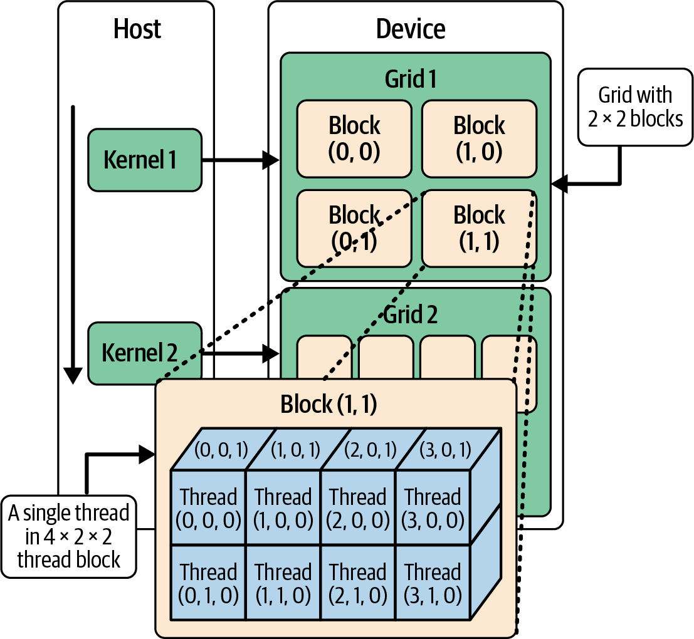

> Figure 6-4. View of thread hierarchy, including the CPU-based host, which launches a kernel running on the GPU device

传统上，来自不同线程块的线程无法直接相互协作。但是，现代GPU架构和CUDA版本支持线程块集群。线程块集群是一组可以跨SM相互通信的线程块。

具体来说，在线程块集群内，不同线程块中的线程可以访问彼此的共享内存，并使用硬件支持的集群范围屏障。这允许更大的计算操作，包括矩阵乘法，这在当今大规模LLM工作负载中非常常见。线程块集群在参与线程块集群的SM之间共享分布式共享内存（DSMEM）地址空间，如图6-5所示。


> Figure 6-5. Hardware-supported DSMEM used in thread block clusters containing multiple thread blocks

DSMEM是一种硬件功能，通过快速片上互连将线程块集群中所有SM的共享内存库连接起来。有了DSMEM，SM共享一个组合的多SM分布式共享内存池。这种统一允许不同块中的线程以片上速度读取、写入和原子更新彼此的共享缓冲区--而无需使用全局内存带宽。

> Traditionally, threads from different thread blocks could not work with one another directly. However, modern GPU architectures and CUDA versions support thread block clusters. Threadblock clusters are groups of thread blocks that can communicate with one another across SMs. Specifically, within a thread block cluster, threads in different thread blocks can access one another's shared memory and use hardware-supported, cluster-scoped barriers. These allow for much larger compute operations, including matrix multiplies, which are very common in today's massive LLM workloads. Thread block clusters share a distributed shared-memory (DSMEM) address space between SMs that participate in the thread block cluster, as shown in Figure 6-5. DSMEM is a hardware feature that links the shared-memory banks of all SMs into a thread block cluster over a fast on-chip interconnect. With DSMEM, the SMs share a combined multi-SM distributed shared-memory pool. This unification allows threads in different blocks to read, write, and atomically update one another's shared buffers at on-chip speeds-and without using global memory bandwidth.

> We'll cover advanced topics like thread block clusters and DSMEM in Chapter 10. These are an extremely important addition to modern GPU processing-and very important for an AI systems performance engineer to understand. For this chapter, our focus remains on intrablock shared-memory optimizations.

在每个线程块内，线程使用低延迟片上共享内存共享数据，并使用`__syncthreads()`进行同步。因为每个屏障都会产生开销，所以应该尽量减少同步点，如图6-6所示。


> Figure 6-6. Synchronizing all threads within a thread block between two sections of code

目标是尽量减少同步点。但是，GPU硬件会尝试通过在线程束之间快速切换来隐藏长延迟事件，如全局内存加载、缓存填充和流水线停顿。线程块被细分为32个线程的线程束，在SIMT模型下使用线程束调度器以锁步方式执行。如图6-7所示。

> The goal is to minimize synchronization points. However, the GPU hardware will attempt to hide long-latency events such as global-memory loads, cache fills, and pipeline stalls by rapidly switching among warps. Thread blocks are subdivided into warps of 32 threads that execute in lockstep under the SIMT model using a warp scheduler. This is shown in Figure 6-7.


> Figure 6-7. Warps (32 threads) advance as a whole with instructions managed by the warp scheduler

在SM上保持更多线程束在运行称为高占用率。当您的CUDA代码允许高占用率时，这意味着当一个线程束停顿时，另一个线程束已准备好运行。这使GPU的计算单元保持忙碌。

但是，高占用率必须与每线程资源限制（如寄存器和共享内存）相平衡。将寄存器溢出到较慢的内存可能会产生新的停顿。分析占用率以及寄存器和共享内存使用情况有助于您选择最大化吞吐量而不触发资源争用的块大小。

> We will cover occupancy tuning in Chapter 8, but it's a key concept to understand in the context of SMs, warps, threads, etc.

线程块独立执行，且没有保证的顺序。这允许GPU调度器将它们分发到所有SM，并充分利用硬件并行性。这种网格-块-线程束层次结构保证您的CUDA内核将在具有更多SM和线程的未来GPU架构上无需修改即可运行。

吞吐量还取决于线程束执行效率。线程束中的线程必须遵循相同的控制流路径并执行合并内存访问。如果某些线程发生分支，使得一些线程走if路径，另一些走else路径，线程束将序列化执行，依次处理每个分支路径。这称为线程束分支发散，如图6-8所示。

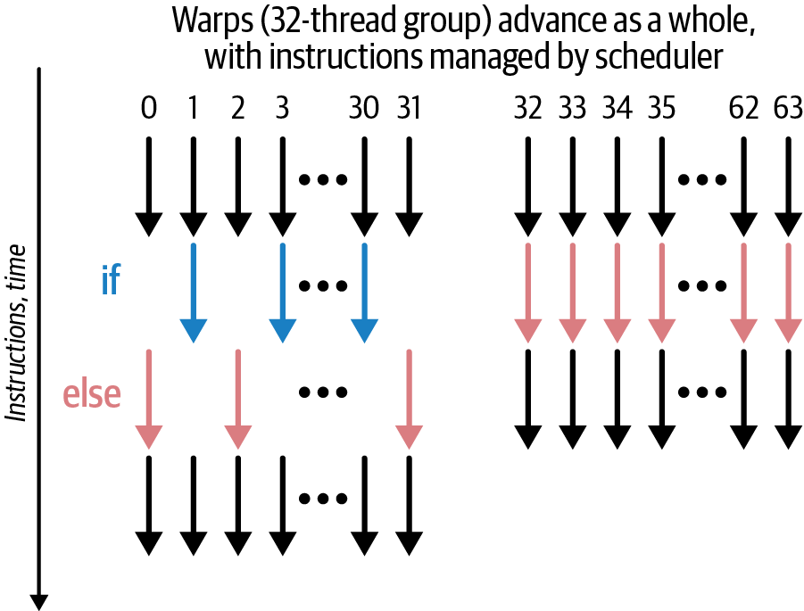

> Figure 6-8. SIMT warp divergence (left) versus uniformity (right)

通过屏蔽非活动通道并运行额外的遍历来覆盖每个分支，线程束分支发散将总体执行时间乘以分支数量。我们将在第8章深入探讨线程束分支发散--以及检测、分析和缓解它的方法。

> Divergence is an issue only for threads within a single warp. Different warps can follow different branches with no performance penalty.

## 6.3 选择每块线程数和每网格块数 (Choosing Threads-per-Block and Blocks-per-Grid Sizes)

GPU性能的一个关键方面是选择与硬件32线程线程束大小对齐的线程块大小。因此，您通常选择32的精确倍数的线程块大小。例如，一个256线程的块（8个线程束 = 256 / 32）完全占用每个线程束，而一个33线程的块将需要两个线程束槽位，并且只使用第二个线程束通道的1/32。这浪费了并行性机会，因为每个线程束都占用一个调度器槽位，无论它实际运行32个线程还是仅1个线程。

此外，不同的GPU代有不同的硬件限制，包括每个SM的最大线程数和每个SM的寄存器数量。如果我们想保持良好性能，这自然限制了块的大小。例如，太大的块可能需要太多寄存器，这将导致寄存器溢出并降低内核性能。

大的块也可能需要太多共享内存，这在GPU硬件中是有限的。具体来说，Blackwell每个SM仅提供228 KB（227 KB可用）的共享内存，可由运行在该SM上的所有驻留线程块寻址。

> A large block might also require too much shared memory, which is finite in GPU hardware. Specifically, Blackwell provides only 228 KB (227 KB usable) per SM of shared memory addressable by all resident thread blocks running on the SM.

这些硬件限制影响一次可以在SM上激活多少个块/线程束。这是我们之前介绍的占用率的度量。较小的块可能实现更高的占用率，如果它们允许更多并发线程束同时在SM上运行。

> These hardware limits affect how many blocks/warps can be active on an SM at once. This is a measurement of occupancy, as we introduced earlier. Smaller blocks might enable higher occupancy if they allow more concurrent warps to run concurrently on the SM.

了解GPU代的相关规模和硬件线程限制很重要，包括线程数、线程块数、线程束数和SM数。图6-9展示了这些资源的相对规模，包括它们的限制。

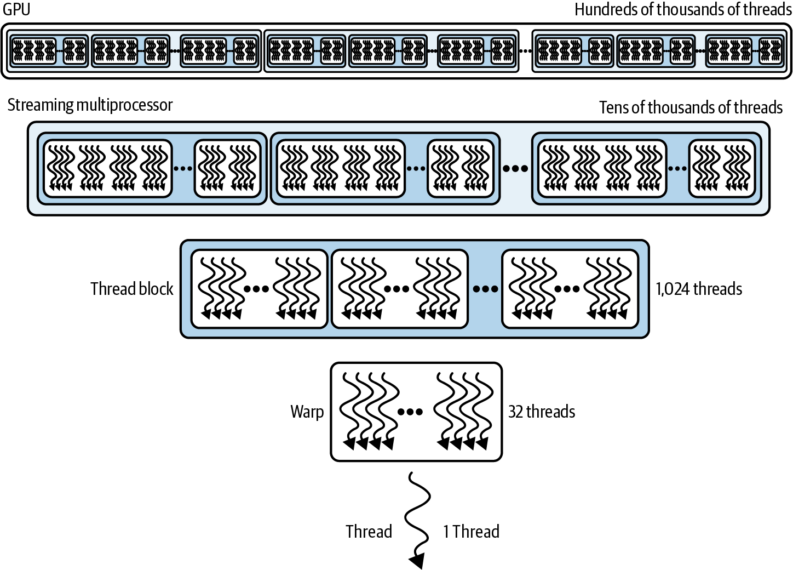

> Figure 6-9. Relative scale and hardware limits for threads on a Blackwell GPU

表6-2总结了Blackwell B200 GPU的这些GPU限制。其余限制可在NVIDIA网站上找到。（其他GPU代将有不同的限制，因此请务必检查您系统的确切规格。）

**表6-2 线程级和块级限制（Blackwell B200）**

| 资源 | 硬件限制 | 说明 |
|------|----------|------|
| 线程束大小 | 32个线程 | 基本SIMT执行单元是32个线程（一个线程束）。始终使用32的倍数以避免浪费。 |
| 每个线程块的最大线程数 | 1,024个线程 | blockDim.x * blockDim.y * blockDim.z ≤ 1024。 |
| 每个线程块的最大线程束数 | 32个线程束 | (1,024个线程 / 32个线程每线程束) = 每个块最多32个线程束。 |

> Table 6-2. Thread-level and block-level limits (Blackwell B200)

我们已经讨论了32个线程的线程束大小限制，这鼓励我们选择32线程倍数的块维度来创建"完整线程束"并避免未充分利用的线程束。请注意，每个块最多可以有1,024个线程，相应地，一个块最多只能包含32个线程束。这些限制会影响您的占用率，因为一旦调度了一个块，每个SM可以同时容纳有限数量的线程束和块。

此外，不同的GPU代还有每SM限制，或通常称为SM驻留限制。这些Blackwell SM驻留限制总结在表6-3中。

**表6-3 SM驻留资源限制（Blackwell B200）**

| 资源（每SM） | 硬件限制 | 说明 |
|--------------|----------|------|
| 每SM最大驻留线程束数 | 64个线程束 | 硬件可以保持最多64个线程束在运行（64 x 32个线程 = 2,048个线程）。注意：此限制已保持多代，对Blackwell仍然成立。 |
| 每SM最大驻留线程数 | 2,048个线程 | 等于64个线程束 x 32个线程/线程束。如果每个块使用1,024个线程，则最多2个这样的块（64个线程束）可以同时驻留在一个SM上。使用较小的块（例如256个线程）允许更多块驻留在SM上（最多8个块 x 256 = 2,048个线程），这可以增加占用率并帮助隐藏延迟--尽管太多的小块可能增加调度开销。 |
| 每SM最大活动块数 | 32个块 | 最多32个线程块可以同时驻留在一个SM上（如果块较小，更多块可以适应此限制）。 |

> Table 6-3. SM-resident resource limits (Blackwell B200)

在这里，我们看到Blackwell上每个SM的最大并发线程束数是64。这在最近的GPU代中没有改变，因此占用率考虑可以延续。SM上最大活动块数是32，相应地，每SM最大驻留线程数是2,048个线程。CUDA网格也有最大维度，如表6-4所示。

**表6-4 CUDA网格限制**

| 网格维度 | 限制 | 说明 |
|----------|------|------|
| X、Y或Z中的最大块数 | X: 2,147,483,647个块<br>Y: 65,535个块<br>Z: 65,535个块 | 3D网格可以大到2,147,483,647 x 65,535 x 65,535个块。 |
| 最大并发网格（内核） | 128个网格 | 最多128个内核可以在一个设备上并发执行（即一次驻留128个网格）。 |

> Table 6-4. CUDA grid limits

虽然了解理论网格限制很好，但您通常会受到前面显示的线程/块/每SM限制的约束。如果您确实需要在一个维度中超过65,535个块，您可以启动2D或3D网格将工作分配到多个内核启动（多启动）。我们在后面的章节中展示了一个示例。在实践中，在达到其他资源限制之前，很少会达到网格大小限制。

### 6.3.1 CUDA GPU向后和向前兼容模型 (CUDA GPU Backward and Forward Compatibility Model)

CUDA的核心优势之一是其向前和向后兼容模型。今天编译的内核通常可以在未来的GPU代上无需修改运行--只要您在二进制文件中包含PTX以实现向前兼容。如果您仅为单个架构发布SASS（例如Hopper的sm_90或Blackwell的sm_100）而没有PTX，该二进制文件将无法在更新的架构上向前运行。特定于系列的目标如sm_100f或compute_100f将可移植性限制在同一特性系列的设备。最好发布包含通用cubin/PTX和所需的特定系列cubin（例如优化等）的fatbin。

您可以通过在加载时设置CUDA_FORCE_PTX_JIT=1来强制PTX JIT编译来验证兼容性，以JIT编译PTX并缓存结果。如果您的二进制文件缺少PTX，内核启动将失败。这迫使您使用PTX支持重新构建。此兼容模型是大型CUDA生态系统的基础。它允许您从单个代码库同时针对传统和尖端硬件。

> To truly maintain both backward and forward compatibility across current and future GPU generations, you should compile with generic targets-or explicitly include the PTX. When you need specific optimizations from newer hardware features, you can use generation-specific targets. When doing this, be sure to provide fallback paths for other architectures.

## 6.4 CUDA编程回顾 (CUDA Programming Refresher)

在CUDA C++中，您通过编写内核来定义并行工作。这些是用`__global__`注释的特殊函数，在GPU设备上执行。当您从CPU（主机）代码调用内核时，您使用`<<< >>>`"尖括号"语法指定应该运行多少线程--以及它们如何组织--使用两个配置参数：`blocksPerGrid`表示线程块数量，`threadsPerBlock`表示每个块内的线程数量。

以下是一个简单示例，演示了CUDA内核和内核启动的关键组件。此内核只是将输入数组中的每个元素原地加倍，因此不会创建额外内存--只有输入数组。在幕后，CUDA将`__global__`函数编译成GPU设备代码，可以由数千或数百万个轻量级线程并行执行：

```cpp
//-------------------------------------------------------
// Kernel: myKernel running on the device (GPU)
//   - input : device pointer to float array of length N
//   - N   : total number of elements in the input
//-------------------------------------------------------

__global__ void myKernel(float* input, int N) {
    // Compute a unique global thread index
    int idx = blockIdx.x * blockDim.x + threadIdx.x;

    // Only process valid elements
    if (idx < N) {
        input[idx] *= 2.0f;
    }
}

// This code runs on the host (CPU)
int main() {
    // 1) Problem size: one million floats
    const int N = 1'000'000;
    float *h_input = nullptr;
    float *d_input = nullptr;

    // 1) Allocate input float array of size N on host
    cudaMallocHost(&h_input, N * sizeof(float));

    // 2) Initialize host data (for example, all ones)
    for (int i = 0; i < N; ++i) {
        h_input[i] = 1.0f;
    }

    // 3) Allocate device memory for input on the device
    cudaMalloc(&d_input, N * sizeof(float));

    // 4) Copy data from the host to the device
    cudaMemcpy(d_input, h_input, N * sizeof(float),
      cudaMemcpyHostToDevice);

    // 5) Choose kernel launch parameters
    
    // Number of threads per block (multiple of 32)
    const int threadsPerBlock = 256; 

    // Number of blocks per grid (3,907 for N = 1000000)
    const int blocksPerGrid = (N + threadsPerBlock - 1) /
      threadsPerBlock; 

    // 6) Launch myKernel across blocksPerGrid blocks
    // Each block has threadsPerBlock number of threads
    // Pass a reference to the d_input device array
    myKernel<<<blocksPerGrid, threadsPerBlock>>>(d_input,
      N);
    // 7) Wait for the kernel to finish running on device
    cudaDeviceSynchronize();

    // 8) When finished, copy the results 
    //    (stored in d_input) from the device back to
    //     host (stored in h_input)
    cudaMemcpy(h_input, d_input, N * sizeof(float), 
               cudaMemcpyDeviceToHost);

    // Cleanup: Free memory on the device and host
    cudaFree(d_input);
    cudaFreeHost(h_input);

    // return 0 for success!
    return 0; 
}
```

> This code is not fully optimized. We will optimize performance as we continue through the book. But this gives you a simple, complete template to start building your own CUDA kernels.

在这里，我们传递内核输入参数`d_input`和`N`，它们可以在内核函数内部访问以进行处理。处理是在许多线程之间并行共享的。这是设计使然。

完整的数据流程如下：

1. 在主机上分配内存（`h_input`）。
2. 使用`cudaMemcpy`和`cudaMemcpyHostToDevice`将数据从主机（`h_input`）复制到设备（`d_input`）。
3. 在设备上使用`d_input`运行内核。
4. 同步以确保内核已在设备上完成执行。
5. 使用`cudaMemcpy`和`cudaMemcpyDeviceToHost`将结果（`d_input`）从设备传输到主机（`h_input`）。
6. 使用`cudaFree`和`cudaFreeHost`清理设备和主机上的内存。

您可以在启动时使用`<<< >>>`向内核传递额外的、高级的CUDA特定参数，包括共享内存大小（以及许多其他参数），但两个核心启动参数`blocksPerGrid`和`threadsPerBlock`是任何CUDA内核调用的基础。

> You can pass additional, advanced, CUDA-specific parameters to your kernel at launch time with <<< >>>, including shared-memory size (and many others), but the two core launch parameters, blocksPerGrid and threadsPerBlock, are the foundation of any CUDA kernel invocation.

在下一节中，我们将讨论如何最好地选择这些启动参数值。

您可能想知道为什么我们必须传递`N`，即输入数组的大小。这似乎是多余的，因为内核应该能够检查数组的大小。但是，这是GPU CUDA内核函数与典型CPU函数之间的核心区别：CUDA内核函数设计为在单个线程内工作，与数千个其他线程一起，处理输入数据的分区。因此，`N`定义了此特定内核将处理的分区大小。

结合内置的内核变量`blockDim`（在本例中为1，因为我们传递的是一维输入数组）、`blockIdx`和`threadIdx`，内核计算输入数组中的特定`idx`。

这个唯一的`idx`让内核干净且唯一地处理输入数组的每个元素，并行地，在跨许多不同SM同时运行的许多线程中。

注意边界检查`if (idx < N)`。这是避免越界访问（边界检查）所必需的，因为`N`可能不是块大小的精确倍数。例如，考虑输入数组大小为63的场景，所以`N = 63`。线程束调度器可能会分配两个线程束（每个32个线程）来处理输入数组中的63个元素。

第一个线程束将同时运行32个内核实例来处理元素0-31，永远不会超过`N = 63`。这很直接。与第一个线程束并行运行的第二个线程束将期望处理元素32-64。但是，它将在达到`N = 63`时停止。

如果没有`if (idx < N)`边界检查，第二个线程束将尝试处理`idx = 64`，它将抛出非法内存访问错误（例如`cudaErrorIllegalAddress`）。边界检查确保每个线程要么处理有效的输入元素，要么在其`idx`超出范围时立即退出。

CUDA内核在设备上异步执行，没有每线程异常；相反，任何非法操作（越界访问、未对齐访问等）都会为整个启动设置全局故障标志。主机驱动程序仅在您下次调用同步或另一个CUDA API函数时检查该标志，因此错误会延迟出现（例如，作为`cudaErrorIllegalAddress`或通用启动失败）。

这种设计使GPU的流水线和互连保持完全占用，但要求您在主机上显式同步和轮询错误--通常在内核启动后立即使用`cudaGetLastError()`和`cudaDeviceSynchronize()`。这样，您可以尽快捕获故障。

您会在很多CUDA内核中看到边界检查。如果您没看到它，您应该理解为什么它不在那里。它可能以某种形式存在--或者CUDA内核开发人员可以以某种方式保证非法内存访问错误永远不会发生。

最后，我们来看实际的内核逻辑。在计算其到输入数组的唯一索引`idx`后，此内核（在跨许多SM的数千个线程中并行运行）将输入数组中索引`idx`处的值乘以2。然后它原地更新输入数组中的值。

在这个特定内核中，除了类型为`int`的临时`idx`变量外，不需要额外内存。

## 6.5 配置启动参数：每网格块数和每块线程数 (Configuring Launch Parameters: Blocks per Grid and Threads per Block)

如前所述，使用线程束大小（32）倍数的块大小至关重要。`threadsPerBlock`大小为256（8个线程束）是一个常见的起点，可以平衡占用率和资源使用。这将帮助我们在内核执行期间避免部分填充的线程束，隐藏延迟，并平衡SM和其他硬件资源：

- **32线程的倍数**：选择32线程倍数的块大小有助于避免空的线程束槽位。否则，那些未填满的线程束会占用稀缺的调度器资源--而不贡献有用的工作。

- **延迟隐藏**：每个SM需要数百个线程来隐藏DRAM和指令延迟停顿。如果您在一个容量为2,048个线程的SM上启动8个256线程的块，您可以使流水线保持忙碌而不会过度订阅。

- **占用率**：例如，使用`threadsPerBlock = 256`，每个块只需要8个线程束。这往往能提供良好的占用率，而不会耗尽每个块的寄存器或共享内存。

> For modern GPUs like Blackwell, consider 256-512 threads per block to maximize occupancy while respecting register and shared-memory limits.

- **资源平衡**：256足够小，您很少会超过每块1,024线程的限制。它也足够大，当其他线程束中的线程停顿时，您不会让太多线程束空闲。

从`threadsPerBlock = 256`开始，您可以根据内核的寄存器和共享内存需求以及占用率特性向上或向下调整（128、512等）。

对于`blocksPerGrid`，您可以基于`N`个输入元素和`threadsPerBlock`的值来确定。例如，`blocksPerGrid`通常设置为`(N + threadsPerBlock - 1) / threadsPerBlock`来向上取整，以便在`N`不是`threadsPerBlock`的精确倍数时覆盖所有元素。这是一个常见的选择，保证每个输入元素都由一个线程覆盖。以下是显示计算的代码：

```cpp
//-------------------------------------------------------
// Kernel: myKernel running on the device (GPU)
//   - input : device pointer to float array of length N
//   - N   : total number of elements in the input
//-------------------------------------------------------
__global__ void myKernel(float* input, int N) {
    // Compute a unique global thread index
    int idx = blockIdx.x * blockDim.x + threadIdx.x;

    // Only process valid elements
    if (idx < N) {
        input[idx] *= 2.0f;
    }
}

// This code runs on the host (CPU)
int main() {
    // 1) Problem size: one million floats
    const int N = 1'000'000;

    float* h_input = nullptr;
    cudaMallocHost(&h_input, N * sizeof(float));

    // Initialize host data (for example, all ones)
    for (int i = 0; i < N; ++i) {
        h_input[i] = 1.0f;
    }

    // Allocate device memory for input on the device (d_)
    float* d_input = nullptr;
    cudaMalloc(&d_input, N * sizeof(float));

    // Copy data from the host to the device using 
    // cudaMemcpyHostToDevice 
    cudaMemcpy(d_input, h_input, N * sizeof(float), 
      cudaMemcpyHostToDevice);

    // 2) Tune launch parameters
    const int threadsPerBlock = 256; // multiple of 32
    const int blocksPerGrid = (N + threadsPerBlock - 1) / 
      threadsPerBlock; // 3,907, in this case

    // Launch myKernel across blocksPerGrid number of blocks
    // Each block has threadsPerBlock number of threads
    // Pass a reference to the d_input device array
    myKernel<<<blocksPerGrid, threadsPerBlock>>>(d_input, N);

    // Wait for the kernel to finish running on the device
    cudaDeviceSynchronize();

    // When finished, copy results (stored in d_input) from 
    // device to host 
    // (stored in h_input) using cudaMemcpyDeviceToHost
    cudaMemcpy(h_input, d_input, N * sizeof(float), 
      cudaMemcpyDeviceToHost);

    // Cleanup: Free memory on the device and host
    cudaFree(d_input);
    cudaFreeHost(h_input);

    return 0; // return 0 for success!
}
```

这与之前的内核相同，但根据`N`的大小动态计算`blocksPerGrid`和`threadsPerBlock`。注意熟悉的`if (idx < N)`边界检查。这确保最后一个块中任何落在`N`之外的"额外"线程将什么都不做--而不会导致非法内存地址错误。接下来，让我们探讨多维输入，如2D图像和3D体积。

## 6.6 2D和3D内核输入 (2D and 3D Kernel Inputs)

当您的输入数据自然存在于二维中（例如图像）时，您可以启动2D块的2D网格。例如，以下内核使用16 x 16维度的线程块处理一个1,024 x 1,024的二维矩阵，总共256个线程：

```cpp
// 2d_kernel.cu

#include <cuda_runtime.h>
#include <iostream>

//-------------------------------------------------------
// Kernel: my2DKernel running on the device (GPU)
//   - input  : device pointer to float array of size 
//              widthxheight
//   - width  : number of columns
//   - height : number of rows
//-------------------------------------------------------
__global__ void my2DKernel(float* input, int width, int height) {
    // Compute 2D thread coordinates
    int x = blockIdx.x * blockDim.x + threadIdx.x;
    int y = blockIdx.y * blockDim.y + threadIdx.y;

    // Only process valid pixels
    if (x < width && y < height) {
        int idx = y * width + x;
        input[idx] *= 2.0f;
    }
}

int main() {
    // Image dimensions
    const int width  = 1024;
    const int height = 1024;
    const int N      = width * height;

    // 1) Allocate and initialize host image
    float* h_image = nullptr;
    cudaMallocHost(&h_image, N * sizeof(float));

    for (int i = 0; i < N; ++i) {
        h_image[i] = 1.0f;  // e.g., initialize all pixels to 
                            // 1.0f 
    }

    // 2) Allocate device image and copy data to device
    cudaStream_t s; cudaStreamCreateWithFlags(&s, 
        cudaStreamNonBlocking);
    float* d_image = nullptr;

    cudaMallocAsync(&d_image, N * sizeof(float), s);
    cudaMemcpyAsync(d_image, h_image, N * sizeof(float), 
                    cudaMemcpyHostToDevice, s);

    my2DKernel<<<blocksPerGrid2D, threadsPerBlock2D,  
                 0, s>>>(d_image, width, height);

    cudaMemcpyAsync(h_image, d_image, N * sizeof(float), 
                    cudaMemcpyDeviceToHost, s);
    cudaStreamSynchronize(s);

    cudaFreeAsync(d_image, s);
    cudaStreamDestroy(s);
}
```

这里再次展示了完整的内核（设备）和调用（主机）代码。这种模式通过使用`dim3(x, y, z)`作为`blocksPerGrid`和`threadsPerBlock`可以推广到3D，让您可以将体积数据直接映射到GPU的线程层次结构。

> For the most part, this book uses 1D or 2D (tiled) values for blocksPerGrid and threadsPerBlock. In the 1D case, you can define blocksPerGrid and threadsPerBlock as simple constants instead of dim3.

## 6.7 异步内存分配和内存池 (Asynchronous Memory Allocation and Memory Pools)

如前面示例所示，标准的`cudaMalloc`/`cudaFree`调用是同步的且相对昂贵。它们需要完整的设备同步（相对较慢），并涉及OS级别的调用如`mmap`/`ioctl`来管理GPU内存。

这种OS级别的交互会产生内核空间上下文切换和驱动程序开销，这使得它们相对于纯设备端操作来说相对较慢。因此，建议使用异步版本`cudaMallocAsync`和`cudaFreeAsync`来在GPU上进行更高效的内存分配。

默认情况下，CUDA运行时维护一个GPU内存的全局池。当您异步释放内存时，它会返回到池中供后续分配潜在重用。`cudaMallocAsync`和`cudaFreeAsync`在底层使用CUDA内存池。

> By default, the CUDA runtime maintains a global pool of GPU memory. When you free memory asynchronously, it goes back into the pool for potential reuse in subsequent allocations. cudaMallocAsync and cudaFreeAsync use the CUDA memory pool under the hood.

内存池回收已释放的内存缓冲区，避免重复的OS调用来分配新内存。这有助于通过重用先前释放的块而不是为长时间运行的训练循环中的每次迭代创建新块来随时间减少内存碎片。内存池在许多高性能库和运行时（如PyTorch）中默认启用。

> A memory pool recycles freed memory buffers and avoids repeated OS calls to allocate new memory. This helps to reduce memory fragmentation over time by reusing previously freed blocks instead of creating new ones for each iteration in a long-running training loop, for instance. Memory pools are enabled by default in many high-performance libraries and runtimes such as PyTorch.

事实上，PyTorch使用自定义内存缓存分配器，可通过`PYTORCH_ALLOC_CONF`（以前是`PYTORCH_CUDA_ALLOC_CONF`）配置。PyTorch内存缓存分配器在精神上类似于CUDA的内存池：它重用GPU内存，避免了为长时间运行的训练循环中每次迭代创建的每个新PyTorch张量调用同步`cudaMalloc`操作的成本。

在执行频繁、细粒度分配的CUDA应用程序中，使用异步基于池的例程--`cudaMallocAsync`和`cudaFreeAsync`--远比传统的同步`cudaMalloc`/`cudaFree`高效，后者会产生完整的设备同步甚至OS级别的调用。要使用流有序分配，创建一个非阻塞流：

```cpp
cudaStream_t stream1;
cudaStreamCreateWithFlags(&stream1, cudaStreamNonBlocking);
```

> Using explicit CUDA streams is a best practice for overlapping transfers, kernels, and memory operations. Think of each stream as an isolated channel that enforces ordering among its own operations. Also, it's recommended to create nonblocking streams with cudaStreamCreateWithFlags(..., cudaStreamNonBlocking) to avoid legacy default-stream barriers. We'll explore multistream overlap techniques and best practices in more detail in Chapter 11.

然后，每当您需要一个N个浮点数的缓冲区时，您可以使用`cudaMallocAsync`和`cudaFreeAsync`在该流上分配和释放它，如下所示：

```cpp
float* d_buf = nullptr;
cudaMallocAsync(&d_buf, N * sizeof(float), stream1);

// ... launch kernels into stream1 that use d_buf ...
myKernel<<<blocksPerGrid, threadsPerBlock, 0, stream1>>>(d_buf, 
    N);

// Free is deferred until all work in stream1 completes-
cudaFreeAsync(d_buf, stream1);
```

这些API从每设备内存池分配，但尊重您传递的流的顺序，因此释放会延迟直到该流的工作完成。而且因为`cudaFreeAsync`只等待stream1完成，所以没有昂贵的全局`cudaDeviceSynchronize`，也没有与其他流的隐式同步。结果是当您的代码发出数千--甚至数百万--次分配/释放周期时，分配开销大大降低，减少了碎片并平滑了延迟峰值。总体而言，这种模式相对于传统的`cudaMalloc`和`cudaFree`减少了全局同步和碎片。

您还可以进一步调整流有序分配从设备内存池的行为--例如，通过设置`cudaMemPoolAttrReleaseThreshold`来提示池在尝试释放之前应该保留多少保留内存。您还可以使用`cudaMemPoolTrimTo`主动返回内存。这些将有助于平衡总GPU内存占用与碎片。

对于简单的一次性缓冲区，阻塞的`cudaMalloc`和`cudaFree`可能就足够了。但在更复杂的、长时间运行的循环中，您反复分配和释放内存，切换到专用流上的`cudaMallocAsync`和`cudaFreeAsync`并利用它们的池将产生更一致的性能和更高的吞吐量。

> For simple, one-time buffers, a blocking cudaMalloc and cudaFree may suffice. In more complex, long-running loops where you repeatedly allocate and free memory, however, switching to cudaMallocAsync and cudaFreeAsync on dedicated streams and leveraging their pools will yield more consistent performance and higher throughput.

切换到专用流上的`cudaMallocAsync`和`cudaFreeAsync`并利用它们的池将产生更一致的性能和更高的吞吐量。您还可以使用`cudaMemPoolSetAttribute`进一步调整池行为（例如，调整`cudaMemPoolAttrReleaseThreshold`）来调整释放阈值，并在最小内存占用和低碎片之间取得正确的权衡。

## 6.8 理解GPU内存层次结构 (Understanding GPU Memory Hierarchy)

到目前为止，我们一直在广泛地讨论内存分配，通常是从全局内存。这些分配来自流的内存池--包括默认流0的内存池。

但实际上，GPU提供了多级内存层次结构，帮助平衡容量和速度。该层次结构包括寄存器、共享内存、缓存、全局内存，以及Blackwell GPU及更高版本上的专用TMEM。TMEM稍后详细讨论，是每个SM专用的~256 KB片上内存，由Blackwell第5代张量核心指令（`tcgen05.*`）使用。它不是CUDA C++中可直接指针寻址的。相反，数据移动由TMA硬件编排（全局内存 ↔ SMEM）和`tcgen05`张量核心数据移动指令（SMEM ↔ TMEM，隐式使用张量描述符）。

全局内存（HBM或DRAM）容量大、片外且相对较慢。寄存器容量小、片上且极快。L1缓存、L2缓存和共享内存介于两者之间。缓存和共享内存的好处是它们隐藏了访问大型片外内存存储的相对较长延迟。图6-10展示了GPU内存层次结构的高级视图（包括CPU）。

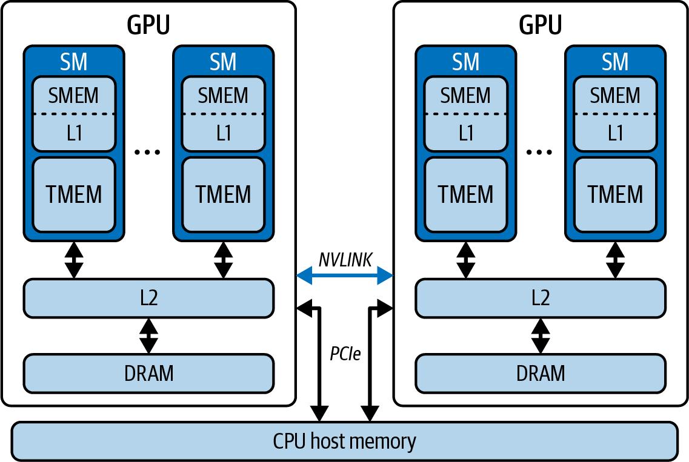

> Figure 6-10. GPU memory hierarchy, including the CPU

TMEM是一个专用的每SM 256 KB缓冲区，以每秒数十TB的带宽与张量核心透明通信。这减少了张量核心对全局内存的依赖。图6-11展示了TMEM与SMEM一起为张量核心服务，计算C = A x B矩阵乘法。

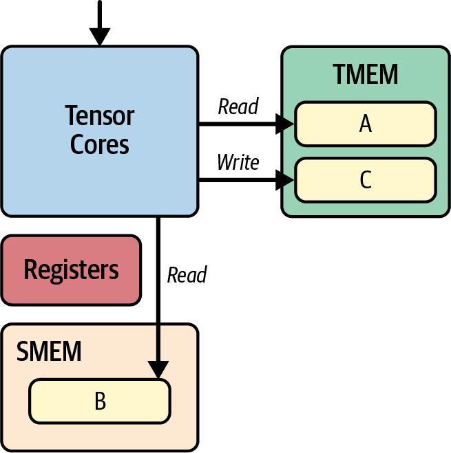

> Figure 6-11. TMEM and SMEM servicing the Tensor Cores for C = A x B matrix multiply

在这里，操作数B来自SMEM。操作数A在TMEM中（尽管它也可能在SMEM中）。累加器也在TMEM中。数据块通过L2缓存使用TMA（例如`cuda::memcpy_async`）从全局内存流式传输到SMEM。操作数通过张量核心指令（如统一矩阵乘累加（UMMA）和`tcgen05.mma`）在SMEM和TMEM之间隐式移动。

表6-5展示了Blackwell GPU不同级别内存及其特性。随后是对内存层次结构每个级别的描述。

**表6-5 Blackwell内存层次结构和特性**

| 级别 | 范围 | 容量 | 延迟 | 带宽（近似） |
|------|------|------|------|--------------|
| 寄存器 | 每线程（在SM上） | 每SM 64K个32位寄存器（每线程最多255个） | 接近寄存器延迟（寄存器读/写是单周期的，基本上免费） | 每SM数十TB/s（寄存器端口） |
| 共享内存和L1缓存 | 每SM | 228 KB（227 KB可用）共享 + 剩余作为L1/数据缓存 | ~20-30周期（L1/共享内存基准测试） | TB/s（无bank冲突） |
| TMEM | 每SM | 每SM 256 KB SRAM专用于张量核心 | ~10周期（SM上的专用SRAM） | TB/s级与张量核心通信 |
| 常量内存缓存 | 每SM | ~8 KB缓存用于64 KB `__constant__`空间 | ~1周期（线程束广播） | 当缓存且线程束中所有线程访问同一地址时，由于常量缓存和广播行为，速度与寄存器一样快。分支或未命中情况会序列化或产生更高延迟 | TB/s级（广播吞吐量） |
| L2缓存 | GPU范围（所有SM） | 总共126 MB | ~200周期 | 多TB/s聚合 |
| 本地内存 | 每线程（溢出到DRAM） | 接近无限（由全局内存支持） | 数百→1,000周期（类似DRAM） | ~8 TB/s（HBM带宽） |
| 全局内存（HBM或DRAM） | 设备范围（片外DRAM） | 每个Blackwell B200 GPU最多180 GB（每个Blackwell B300 GPU最多~288 GB） | 数百→1,000周期（全局内存延迟） | ~8 TB/s |

> Table 6-5. Blackwell memory hierarchy and characteristics

在这里，您可以看到为什么最大化寄存器、共享内存和L1/L2缓存中的数据重用--并最小化对全局内存和本地内存（由全局内存支持）的依赖--对于高吞吐量GPU内核至关重要。接下来是层次结构每个级别的更多细节：

**寄存器**：在Blackwell上，每个线程从寄存器文件开始其旅程，这是一个小型片上SM SRAM阵列，保存每个线程的局部变量，基本上没有额外延迟。每个SM容纳64K个32位寄存器（共256 KB），但硬件最多暴露每线程255个寄存器。因为读写在单周期内完成，几乎不与其他任何东西竞争，寄存器带宽可以达到每SM每秒数十TB。但是，如果您的内核需要更多寄存器--无论是通过许多线程局部变量还是编译器临时变量--溢出会进入本地内存，映射到片外DRAM，并产生数百到超过一千周期的延迟。此本地内存如图6-12所示。

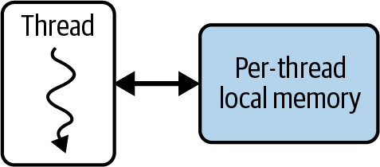

> Figure 6-12. Local memory per thread

**共享内存和L1数据缓存**：再往上一级是统一的L1/数据缓存和共享内存块。这是每个SM 256 KB的片上SRAM，您可以使用`cudaFuncSetAttribute()`配合`cudaFuncAttributePreferredSharedMemoryCarveout`在像Blackwell这样具有统一L1/纹理/共享内存的架构上动态分割用户管理的共享内存（每块最多228 KB）。每个块的最大动态共享内存为227 KB（CUDA每块保留1KB），每SM可分配的共享内存总量也受此限制约束。这里的访问成本大约20-30周期，但如果您设计线程块避免bank冲突，可以实现每秒TB级的吞吐量。线程块共享内存如图6-13所示。

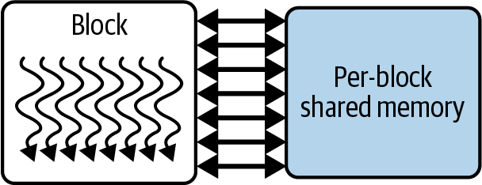

> Figure 6-13. Thread-block shared memory

**TMEM**：TMEM是每个SM专用的片上内存（Blackwell上为256 KB），由张量核心特定操作和指令使用，包括统一矩阵乘累加和`tcgen05`，在第10章讨论。它不是CUDA C++中正常的指针可寻址空间。相反，传输由张量内存加速器（TMA）使用描述符编排。这使开发人员免于手动管理与张量核心的数据流。例如，某些算术操作数驻留在共享内存中，而累加器驻留在TMEM中。然后TMA负责在全局内存、共享内存和TMEM内存之间移动数据以执行计算。

**常量内存缓存**：对于小型、只读表，Blackwell为每个SM提供约8 KB的常量内存缓存，支持64 KB的`__constant__`空间。当线程束中所有32个线程加载同一地址时，此缓存在单周期内广播该值。分支读取会在线程间序列化。它非常适合共享小型查找表，如旋转位置编码、带线性偏置的注意力（ALiBi）斜率、LayerNorm γ/β向量和嵌入量化比例。这些在每个线程之间共享，无需全局内存流量。

> Constant memory cache For tiny, read-only tables, Blackwell provides a per-SM constant memory cache of about 8 KB fronting the 64 KB __constant__ space. When all 32 threads in a warp load the same address, this cache broadcasts the value in a single cycle. Divergent reads serialize across lanes. It's perfect for sharing small lookup tables for rotary positional encodings, Attention with Linear Biases (ALiBi) slopes, LayerNorm γ/β vectors, and embedding quantization scales. These are shared across every thread without global-memory traffic.

**L2缓存**：在片上SRAM之外是L2缓存，一个126 MB的GPU范围缓冲区，将所有SM连接到片外HBM3e。延迟接近200周期，聚合带宽为每秒数十TB，L2吸收来自L1的溢出。使用L2，数据由一个线程块获取，并由其他线程块重用，而无需重新访问DRAM。要最大化L2的好处，将全局加载结构化为128字节、合并的事务，干净地映射到缓存行。我们稍后将展示如何做到这一点。

> Structure your global loads into 128-byte aligned, coalesced segments that map cleanly to cache lines. This avoids split transactions and maximizes use of the L2 and DRAM bandwidth.

**全局内存（HBM或DRAM）**：全局内存层、本地溢出空间和HBM位于片外。任何溢出的寄存器或过大的自动数组驻留在本地内存中，支付完整的DRAM延迟（数百到超过1,000周期），尽管HBM3e的带宽约为~8 TB/s。对于Blackwell，HBM3e层提供最多180 GB的设备范围存储，总带宽约为~8 TB/s。但是，其高延迟使其成为链路中最慢的一环。每设备全局内存如图6-14所示。

> Global memory (HBM or DRAM) The global memory tier, local spill space and HBM, live off-chip. Any spilled registers or oversized automatic arrays reside in local memory, paying full DRAM latency (hundreds to more than 1,000 cycles) despite HBM3e's ~8 TB/s bandwidth. For Blackwell, the HBM3e tier provides up to 180 GB of device-wide storage at ~8 TB/s total. However, its high latency makes it the slowest link in the chain. Per-device global memory is shown in Figure 6-14.

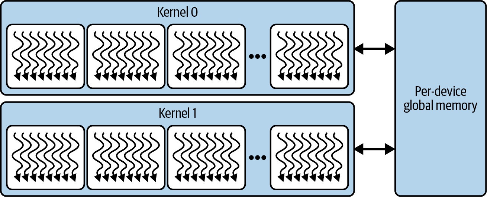

> Figure 6-14. Per-device global memory, or HBM

使用Nsight Compute等工具跟踪溢出和缓存命中率，您可以使内核尽可能接近此内存层次结构的片上峰值运行。这些工具可以帮助您有效地编排数据通过寄存器、共享/L1、常量缓存和L2缓存。像Blackwell这样的现代GPU允许内核开发人员通过使用L2缓存和统一的L1/共享内存来缓冲和合并对HBM的访问，利用内存层次结构，我们很快就会看到。

> Using tools like Nsight Compute to track spills and cache hit rates, you can keep your kernels operating as close as possible to the on-chip peaks of this memory hierarchy. These tools can help you orchestrate data effectively through registers, shared/L1, constant cache, and L2 cache. Modern GPUs like Blackwell allow kernel developers to exploit the memory hierarchy by using L2 caches and unified L1/shared memory to buffer and coalesce accesses to HBM, as we'll soon see.

> The Blackwell B200 presents as a single GPU built with a unified, global address space. However, it's made up of two reticle-limited dies connected by a 10 TB/s chip-to-chip interconnect. Each die is connected to four HBM3e stacks for a total of eight HBM3e stacks. From a developer's perspective, however, HBM memory access is uniform across this combined address space, but it's worth understanding the low-level details of this architecture.

内存层次结构中不同级别的一致性点（PoC）取决于您的需求以及线程通信的级别。它通常发生在以下级别：线程、线程块（也称为CTA）、线程块集群（也称为CTA集群）、设备或系统，如图6-15所示。

> The point of coherency (PoC) for the different levels in the memory hierarchy depends on your needs and the level at which the threads are communicating. It typically happens at the following levels: thread, thread-block (aka CTA), thread block cluster (aka CTA cluster), device, or system, as shown in Figure 6-15.

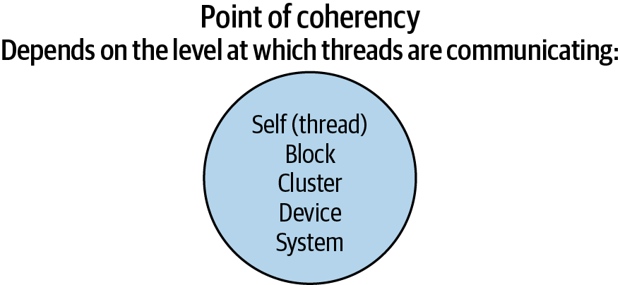

> Figure 6-15. Point-of-memory coherency for your GPU threads

总之，理解GPU的内存层次结构并适当地定位每个级别很重要。通过这样做，您可以构建CUDA内核以最大化数据局部性、隐藏内存访问延迟、增加占用率，并充分利用Blackwell的大规模并行计算能力，我们稍后将探讨。首先，让我们讨论NVIDIA的统一内存，鉴于Grace Hopper和Grace Blackwell的统一CPU-GPU超级芯片设计，理解这一点很重要。

> In summary, it's important to understand the GPU's memory hierarchy and target each level appropriately. By doing so, you can structure your CUDA kernels to maximize data locality, hide memory-access latency, increase occupancy, and fully leverage Blackwell's massive parallel compute capabilities, as we'll explore in a bit. First, let's discuss NVIDIA's unified memory, which is important to understand given the unified CPU-GPU superchip designs of Grace Hopper and Grace Blackwell.

## 6.9 统一内存 (Unified Memory)

统一内存（也称为CUDA托管内存）为您提供一个跨越CPU和GPU的单一、一致的地址空间，因此您不再需要处理单独的主机和设备缓冲区或发出显式的`cudaMemcpy`调用。在底层，CUDA运行时用可以按需通过连接CPU和GPU的任何互连链路迁移的页面来支持每个`cudaMallocManaged()`分配，如图6-16所示。

> Unified Memory (also known as CUDA Managed Memory) gives you a single, coherent address space that spans both CPU and GPU, so you no longer have to juggle separate host and device buffers or issue explicit cudaMemcpy calls. Under the hood, the CUDA runtime backs every cudaMallocManaged() allocation with pages that can migrate on-demand over whatever interconnect links your CPU and GPU, as shown in Figure 6-16.

虽然访问统一内存对开发人员非常友好，但它可能导致CPU和GPU之间不需要的按需页面迁移。这将引入隐藏的延迟和执行停顿。例如，如果GPU线程访问当前驻留在CPU内存中的数据，GPU将发生页面错误并等待该数据通过NVLink-C2C互连传输。统一内存性能很大程度上取决于底层硬件。

在传统的PCIe或早期NVLink系统上，这些迁移以相对较低的带宽进行--通常使按需传输比手动`cudaMemcpy`更慢。但在Grace Hopper和Grace Blackwell超级芯片上，NVLink-C2C结构在CPU的HBM和GPU的HBM3e之间提供高达~900 GB/s的带宽。因此，页面错误驱动的迁移更接近设备原生速度--尽管它们仍然带有非零延迟。

也就是说，内核启动期间的任何意外页面错误都会在运行时将所需页面移动到位时停顿GPU。为了避免这些"意外"停顿，您可以使用`cudaMemPrefetchAsync()`提前预取内存，如图6-17所示。

这提示驱动程序在启动内核之前将指定范围移动到目标GPU（或CPU），将昂贵的首次接触迁移转化为可重叠的异步传输。您还可以提供内存建议，如下代码所示：

```cpp
cudaMemAdvise(ptr, size, cudaMemAdviseSetPreferredLocation, 
    gpuId);
cudaMemAdvise(ptr, size, cudaMemAdviseSetReadMostly, gpuId);
```

在这里，您可以使用`PreferredLocation`告诉驱动程序您将主要在哪里使用数据，以及`ReadMostly`当它主要是只读时，如图6-18所示。


> Figure 6-16. Automatic page migrations with CPU-GPU Unified Memory


> Figure 6-17. Streaming data from CPU to GPU over NVLink-C2C with cudaMemPrefetchAsync()


> Figure 6-18. Specifying "preferred location" to tell the CUDA driver how the data is mostly used (e.g., ReadMostly for largely read-only workloads)

您还可以调用以下代码让第二个GPU映射这些页面而不在启动时触发迁移：

```cpp
cudaMemAdvise(ptr, size, cudaMemAdviseSetAccessedBy, 
   otherGpuId);
```

> You can also call the following to let a second GPU map those pages without triggering migrations at launch: cudaMemAdvise(ptr, size, cudaMemAdviseSetAccessedBy, otherGpuId); By default, any CUDA stream or device kernel can trigger a page fault on a managed allocation. This can cause unexpected migrations and implicit synchronizations. If you know a certain buffer will be used only in one stream/GPU at a time, attaching it to that stream allows migrations to overlap with operations in other streams.

默认情况下，任何CUDA流或设备内核都可以在托管分配上触发页面错误。这可能导致意外的迁移和隐式同步。如果您知道某个缓冲区一次只会在一个流/GPU中使用，将其附加到该流允许迁移与其他流中的操作重叠。调用以下代码将该内存范围绑定到指定流：

```cpp
cudaStreamAttachMemAsync(stream, ptr, 0, 
    cudaMemAttachSingle);
```

在这种情况下，只有该流中的操作会触发错误并迁移其页面。这防止其他流意外地在上面停顿。因此，将范围附加到特定流会延迟其迁移，使其仅与该流的工作重叠。这避免了跨流同步。

> In multi-GPU systems without NVLink-C2C, you can also use cudaMemcpyPeerAsync() or a prefetch to a specific device to pin data in the nearest NUMA-local GPU memory, preventing slow remote accesses.

简而言之，显式预取托管内存并提供内存建议可以消除统一内存的大部分"意外"停顿。GPU不再暂停按需获取数据，而是在内核运行时数据已经到位。

> In short, explicitly prefetching managed memory and providing memory advice can eliminate most of the "surprise" stalls from Unified Memory. Instead of the GPU pausing to fetch data on demand, the data is already where it needs to be when the kernel runs.

通过主动预取、有针对性的内存建议和流附加等技术，统一内存可以提供非常接近手动`cudaMemcpy`的性能，同时保持统一地址空间的简单性。

## 6.10 保持高占用率和GPU利用率 (Maintaining High Occupancy and GPU Utilization)

GPU通过并发运行许多线程束来维持性能，这样当一个线程束等待数据时，另一个线程束可以运行。这种在线程束之间快速切换的能力使GPU能够隐藏内存延迟。正如我们之前描述的，SM容量实际被活动线程束占用的比例称为占用率。

> GPUs sustain performance by running many warps concurrently so that when one warp stalls waiting for data, another warp can run. This ability to rapidly switch between warps allows a GPU to hide memory latency. As we described earlier, the fraction of an SM's capacity actually occupied by active warps is called occupancy.

如果占用率低（只有少数活动线程束），当一个线程束等待内存时，SM可能会空闲。这会导致SM利用率低。在Blackwell上，由于其大型寄存器文件（每SM 64K寄存器），实现高占用率稍微容易一些，可以支持许多线程束而不溢出。

> As you saw earlier, each thread in a warp can use up to 255 registers. Make sure to use your profiling tools to check achieved occupancy-and adjust your kernel's block size and register usage accordingly.

相反，高占用率（每SM许多活动线程束）将使GPU计算单元保持忙碌，因为当一个线程束等待内存访问时，其他线程束会切换到SM并执行。这掩盖了长内存访问延迟。这通常被称为隐藏延迟。

> Conversely, high occupancy (many active warps per SM) will keep the GPU compute units busy since, while one warp waits on memory access, others will swap in to the SM and execute. This masks the long memory access delays. This is often referred to as hiding latency.

让我们展示一个提高占用率并最终提高GPU利用率、吞吐量和整体内核性能的示例。这是CUDA性能优化的最基本规则之一：启动足够的并行工作来充分利用GPU。

如果您实现的占用率（正在使用的硬件线程槽的比例）远低于GPU的限制且性能很差，第一个补救措施是增加并行性--使用更多块或线程，使占用率接近现代GPU上80%-100%的范围。

相反，如果占用率已经中等到高，但内核受内存吞吐量瓶颈限制，将其推到100%可能没有帮助。您通常只需要足够的线程束来隐藏延迟，超过这一点，瓶颈可能在其他地方（例如内存带宽）。

为了说明占用率的影响，考虑一个非常简单的操作：添加两个长度为N的向量（计算C = A + B）。我们将检查两个内核实现：`addSequential`和`addParallel`。

`addSequential`使用单个线程（或单个线程束）在循环中添加所有N个元素。`addParallel`使用许多线程，使加法在数组中并发完成。

在顺序版本中，一个GPU线程串行处理整个工作负载，如下所示：

```cpp
#include <cuda_runtime.h>

const int N = 1'000'000;

// Single thread does all N additions
__global__ void addSequential(const float* A,
                              const float* B,
                                    float* C,
                              int N)
{
    if (blockIdx.x == 0 && threadIdx.x == 0) {
        for (int i = 0; i < N; ++i) {
            C[i] = A[i] + B[i];
        }
    }
}

int main()
{
    // Allocate and initialize host
    float* h_A = nullptr;
    float* h_B = nullptr;
    float* h_C = nullptr;
    cudaMallocHost(&h_A, N * sizeof(float));
    cudaMallocHost(&h_B, N * sizeof(float));
    cudaMallocHost(&h_C, N * sizeof(float));

    for (int i = 0; i < N; ++i) {
        h_A[i] = float(i);
        h_B[i] = float(i * 2);
    }

    // Allocate device
    float *d_A, *d_B, *d_C;
    cudaMalloc(&d_A, N * sizeof(float));
    cudaMalloc(&d_B, N * sizeof(float));
    cudaMalloc(&d_C, N * sizeof(float));

    // Copy inputs to device
    cudaMemcpy(d_A, h_A, N * sizeof(float), 
        cudaMemcpyHostToDevice);
    cudaMemcpy(d_B, h_B, N * sizeof(float), 
        cudaMemcpyHostToDevice);

    // Launch: one thread
    // Note: This kernel assumes <<<1,1>>> 
    // (one block, one thread). 
    // Do not change the launch config when running this example.
    addSequential<<<1,1>>>(d_A, d_B, d_C, N);

    // Ensure completion before exit
    cudaDeviceSynchronize();

    // Copy d_C => h_C (back to host)
    cudaMemcpy(h_C, d_C, N * sizeof(float), 
        cudaMemcpyDeviceToHost);

    // Cleanup
    cudaFree(d_A);
    cudaFree(d_B);
    cudaFree(d_C);
    cudaFreeHost(h_A);
    cudaFreeHost(h_B);
    cudaFreeHost(h_C);

    return 0;
}
```

在这个单线程版本中，GPU的庞大资源大部分空闲。只有一个线程束，甚至线程束中只有一个线程在工作，而所有其他线程都空闲。结果是占用率非常低，最终性能很差。

还必须小心避免在PyTorch等高级库和框架中间接执行低效的GPU代码。例如，以下简单的PyTorch代码错误地使用Python for循环执行逐元素操作，逐个在GPU上发出N个单独的加法操作：

```python
import torch

N = 1_000_000
A = torch.arange(N, dtype=torch.float32, device='cuda')
B = 2 * A
C = torch.empty_like(A)

# Ensure all previous work is done
torch.cuda.synchronize()

# Naive, Sequential GPU operations - DO NOT DO THIS
with torch.inference_mode(): # avoids unnecessary autograd graph 
                             # construction
    # This launches N tiny GPU operations serially
    for i in range(N):
        C[i] = A[i] + B[i]

torch.cuda.synchronize()
```

这段代码实际上将GPU当作标量、非并行处理器使用。它实现了非常低的占用率，类似于之前的原生`addSequential` CUDA C++代码。

让我们优化CUDA内核和PyTorch代码来实现向量加法操作的并行版本。图6-19展示了向量化加法操作如何工作。

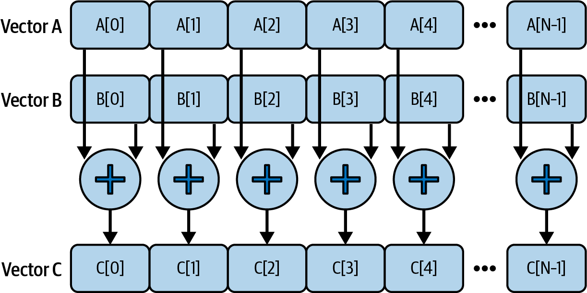

> Figure 6-19. Vectorized addition operating happening in parallel across elements in the vectors

在以下CUDA C++代码中，我们启动足够的线程来覆盖所有元素（`<<< (N+255)/256, 256 >>>`），以便每个块256个线程在需要的尽可能多的块中并行处理N个元素：

> In the following CUDA C++ code, we launch enough threads to cover all elements (<<< (N+255)/256, 256 >>>) so that 256 threads per block process N elements in parallel across however many blocks are needed:

```cpp
#include <cuda_runtime.h>

const int N = 1'000'000;

// One thread per element
__global__ void addParallel(const float* __restrict__ A,
                            const float* __restrict__ B,
                                  float* __restrict__ C,
                            int N)
{
    int idx = blockIdx.x * blockDim.x + threadIdx.x;
    if (idx < N) {
        C[idx] = A[idx] + B[idx];
    }
}

int main()
{
  // Allocate and initialize host (pinned for faster DMA)
  float* h_A = nullptr;
  float* h_B = nullptr;
  float* h_C = nullptr;
  cudaMallocHost(&h_A, N * sizeof(float));
  cudaMallocHost(&h_B, N * sizeof(float));
  cudaMallocHost(&h_C, N * sizeof(float));
  for (int i = 0; i *lt; N; ++i) { h_A[i] = float(i); h_B[i] = 
  float(2*i); }

  // Create a non-blocking stream and allocate device buffers
  cudaStream_t s; cudaStreamCreateWithFlags(&s, 
      cudaStreamNonBlocking);
  float *d_A = nullptr, *d_B = nullptr, *d_C = nullptr;
  cudaMallocAsync(&d_A, N * sizeof(float), s);
  cudaMallocAsync(&d_B, N * sizeof(float), s);
  cudaMallocAsync(&d_C, N * sizeof(float), s);

  // Async HtoD copies on the same stream
  cudaMemcpyAsync(d_A, h_A, N*sizeof(float), 
      cudaMemcpyHostToDevice, s);
  cudaMemcpyAsync(d_B, h_B, N*sizeof(float), 
      cudaMemcpyHostToDevice, s);

  // Launch (same stream)
  int threads = 256;
  int blocks  = (N + threads - 1) / threads;
  addParallel<<<blocks, threads, 0, s>>>(d_A, d_B, d_C, N);

  // Async DtoH copy and stream sync
  cudaMemcpyAsync(h_C, d_C, N*sizeof(float), 
      cudaMemcpyDeviceToHost, s);
  cudaStreamSynchronize(s);

  // Cleanup (stream-ordered free)
  cudaFreeAsync(d_A, s); cudaFreeAsync(d_B, s); 
  cudaFreeAsync(d_C, s);
  cudaStreamDestroy(s);
  cudaFreeHost(h_A); cudaFreeHost(h_B); cudaFreeHost(h_C);
  return 0;
}
```

对于足够大的N，GPU利用率的差异是显著的。现在让我们优化PyTorch代码，它启动单个向量化内核（A + B），像之前优化的`addParallel` CUDA C++示例一样并发地在GPU上启动许多线程。以下是PyTorch代码的并行版本：

```python
# add_parallel.py
import torch

N = 1_000_000
A = torch.arange(N, dtype=torch.float32, device='cuda')
B = 2 * A

torch.cuda.synchronize()

# Proper parallel approach using vectorized operation
# Launches a single GPU kernel that adds all elements in parallel
C = A + B 

torch.cuda.synchronize()
```

> In practice, high-level frameworks like PyTorch will do the right thing when you use vectorized tensor operations. Just be aware that introducing Python-level loops around GPU operations will serialize work and negatively impact performance. Avoid them if possible. Unless you are writing something novel, there is almost always an optimized PyTorch-native implementation available-including code emitted by the PyTorch compiler.

要量化使用并行与顺序实现的性能影响，我们可以使用Nsight Systems和Nsight Compute来测量两种方法的总内核执行时间、GPU利用率、占用率和线程束执行效率指标。以下是Nsight Systems（nsys）和Nsight Compute（ncu）命令：

> To quantify the performance impact of using a parallel versus sequential implementation, we can use Nsight Systems and Nsight Compute to measure the total kernel execution time, GPU utilization, occupancy, and warp execution efficiency metrics for the two approaches. Here are the Nsight Systems (nsys) and Nsight Compute (ncu) commands:

```bash
# Sequential add
nsys profile \
  --stats=true \
  -t cuda,nvtx \
  -o sequential_nsys_report \
  ./add_sequential.py

ncu \
 --section SpeedOfLight \
 --metrics \
     
sm__warps_active.avg.pct_of_peak_sustained_active,gpu__time_durat
ion.avg \
 --target-processes all \
 --print-summary per-gpu \
 -o sequential_ncu_report \
 ./add_sequential.py
 
# Parallel add
nsys profile \
  --stats=true \
  -t cuda,nvtx \
  -o parallel_nsys_report \
  ./add_parallel.py

ncu \
 --section SpeedOfLight \
 --metrics sm__warps_active.avg.pct_of_peak_sustained_active \
 --target-processes all \
 --print-summary per-gpu \
 -o parallel_ncu_report \
 ./add_parallel.py
```

我们使用nsys来揭示时间花在哪里以及GPU是否饥饿或阻塞。然后我们使用ncu来解释为什么内核以这种方式执行--可能是由于占用率差等。

如果您只运行nsys，可能会错过细粒度的内核低效问题。如果您只运行ncu，您不会知道您的内核是否被足够快地馈送数据，例如。表6-6展示了统一的结果。

**表6-6 比较顺序与并行CUDA内核**

| 指标 | add_sequential | add_parallel |
|------|----------------|--------------|
| 内核执行时间（ms） | 48.21 | 2.17 |
| GPU利用率 | 1.5% | 95% |
| 实现的占用率 | 1.3% | 38.7% |
| 线程束执行效率 | 3.1% | 100% |

> Table 6-6. Comparing a sequential versus parallel CUDA kernel

> Other profiling tools may label these metrics differently. For example, Nsight Systems reports overall "GPU Utilization," while Nsight Compute provides a per-kernel "SM Active %" metric-but both reflect how fully the GPU's SMs were occupied by active warps.

正如预期，从单线程、单线程束实现转向完全并行、多线程束实现将占用率从1.3%提高到平均~38.7%。这将运行时间减少了约22倍，从48.21 ms降至2.17 ms。

> As expected, moving from a single-thread, single-warp implementation to a fully parallel, multiwarp implementation improves occupancy from 1.3% to ~38.7% on average. This reduces the runtime by about 22x from 48.21 ms down to 2.17 ms.

在顺序情况下，只有一个线程束，只有一个线程在单个SM上工作。这就是为什么我们看到1.5%的低GPU利用率，而在并行情况下，许多SM正在运行多个活动线程束。这将线程束执行效率从3.1%提高到100%，因为线程束中所有32个线程在每条指令期间都在做有用的工作。这将GPU利用率从1.5%提高到95%。

这个示例说明了为什么在GPU上足够的并行性至关重要。无论每个线程有多快，您都需要大量线程来利用GPU的吞吐量潜力。

请记住，GPU是为吞吐量优化的处理器，与CPU交互以启动CUDA内核--以及内存子系统--从缓存、共享内存和全局内存加载数据。因此，GPU性能大大受益于隐藏这些延迟。

如果编写得当，内核将指示GPU并行地交织来自不同线程束的内存加载和计算（例如加法）。这有助于在线程束之间隐藏内存延迟。

特别是，在多个线程束内运行的并行内核受益于线程束级别的延迟隐藏。当一个线程束等待内存加载时，另一个线程束可以执行加法计算，而另一个可能正在获取下一个数据等。我们将在接下来的章节中探讨许多隐藏内存延迟的技术。

在顺序内核中，没有其他线程束可以在一个等待时运行，因此硬件流水线经常空闲。时间线是一系列带有内存等待期间空闲间隙的长操作。在并行版本中，这些间隙被其他线程束的工作填充，因此GPU持续忙碌。比较如图6-20所示。

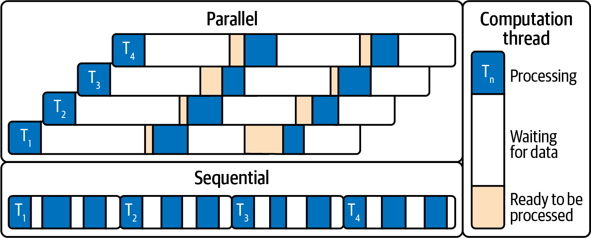

> Figure 6-20. Parallel versus sequential timeline comparison

在这里，顺序时间线是一系列带有内存等待期间空闲间隙的长操作。在并行版本中，这些间隙被其他线程束的工作填充，因此GPU持续忙碌。

> Here, the sequential timeline is one long series of operations with idle gaps during memory waits. In the parallel version, those gaps are filled by other warps' work, so the GPU is busy continuously.

关键要点是首先确保足够的并行工作来充分利用GPU。高占用率--足够的线程束来覆盖延迟--最大化吞吐量并最小化空闲停顿--在我们的示例中，并行化将GPU利用率提高到~95%。

一旦启动了足够的线程，下一步就是优化每个线程束执行的效率，通过指令级并行和其他每线程改进。但请注意：即使在100%占用率下，如果工作负载受内存限制--即受慢速内存访问而非计算限制--性能仍可能受损。

内存限制工作负载的一个著名示例是LLM的"解码"阶段。在解码期间，LLM需要将大量数据（模型权重或参数）从全局HBM内存移动到GPU寄存器和共享内存。

由于现代LLM包含数千亿个参数（乘以，比如说，每个参数8位，或1字节），模型可能有数百GB的大小。在GPU内外移动这么多数据很容易使内存带宽饱和。

> GPU FLOPS are outpacing memory bandwidth. For instance, Blackwell's HBM3e delivers ~8 TB/s, but compute capability and model sizes are growing even faster. As such, optimizing memory movement is absolutely critical to avoid memory‐bound bottlenecks in modern AI workloads.

## 6.11 使用启动边界调整占用率 (Tuning Occupancy with Launch Bounds)

在某些情况下，仅仅使用更多线程是不够的--特别是如果每个线程使用大量资源如寄存器和共享内存。我们可以通过使用CUDA的`__launch_bounds__`内核注释来指导编译器优化占用率。

> In some cases, simply using more threads isn't enough-especially if each thread uses a lot of resources such as registers and shared memory. We can guide the compiler to optimize for occupancy by using CUDA's __launch_bounds__ kernel annotation.

此注释允许我们在编译时为内核指定两个参数：我们将启动的每块最大线程数和希望在每个SM上保持驻留的最小线程块数。这些提示影响编译器的寄存器分配和内联决策。示例如下：

```cpp
__global__ __launch_bounds__(256, 16)
void myKernel(...) { /* ... */ }
```

在这里，`__launch_bounds__(256, 16)`承诺CUDA内核永远不会以块中超过256个线程启动。它还请求编译器分配足够的寄存器并内联函数，以便至少16个256线程的块，或4,096个线程（16个块 x 每块256个线程），可以同时驻留在SM上。

> Remember that we can have only 1,024 threads per block and at most 2,048 resident threads per SM on modern GPUs (e.g., Blackwell).

在实践中，由于当前NVIDIA GPU限制每个SM最多2,048个总线程和每个块最多1,024个线程，编译器会将您的请求减少到硬件最大值--在这种情况下，每SM 2,048个线程（8个块 x 每块256个线程）。它会发出警告，因为4,096请求（16个块 x 每块256个线程）超过了SM的容量。

> In practice, since current NVIDIA GPUs limit each SM to 2,048 total threads and each block to 1,024 threads, the compiler will reduce your request to the hardware maximum-in this case, 2,048 threads (8 blocks x 256 threads per block) per SM. And it will emit a warning since the 4,096 request (16 blocks x 256 threads per block) exceeds the SM's capacity.

> The warning will be something like "ptxas warning: Value of threads per SM...is out of range. .minnctapersm will be ignored."

在实践中，使用`__launch_bounds__`通常会导致编译器限制每线程寄存器使用（有时限制展开或内联）以避免溢出并允许更高的占用率。我们本质上是在牺牲一些每线程性能，不使用每个最后的寄存器或最大程度展开。这是为了通过保持更多线程束在运行来获得更一致的线程束吞吐量。

> In practice, using __launch_bounds__ often causes the compiler to cap per-thread register usage (and to sometimes restrict unrolling or inlining) to avoid spilling and to allow higher occupancy. We are essentially trading a bit of per-thread performance and not using every last register or unrolling to the max. This is in exchange for more consistent warp throughput by keeping more warps in flight.

增加占用率必须与每线程资源限制相平衡。您希望避免寄存器溢出（如果您强制太多线程导致它们用完寄存器并溢出到本地内存，导致慢速内存访问）。

您还可以使用CUDA占用率API在运行时确定最佳启动配置。例如，`cudaOccupancyMaxPotentialBlockSize()`将计算为给定内核产生最高占用率的块大小，考虑其寄存器和共享内存使用情况。本质上，`cudaOccupancyMaxPotentialBlockSize`可以自动调整您的块大小以获得最佳占用率，如下所示：

```cpp
int minGridSize = 0, bestBlockSize = 0;

// If your kernel uses dynamic shared memory (extern __shared__), 
// set this correctly:
size_t dynSmemBytes = /* bytes per block (e.g., tiles * 
sizeof(T)) */ 0;

cudaOccupancyMaxPotentialBlockSize(
  &minGridSize, &bestBlockSize,
  myKernel,
  dynSmemBytes,      // must match your kernel's dynamic shared 
                     // memory use
  /* blockSizeLimit = */ 0);

// Compute a grid that covers N, but don't go below the min grid 
// that saturates occupancy
int gridSize = std::max(minGridSize, (N + bestBlockSize - 1) / 
    bestBlockSize);

myKernel<<<gridSize, bestBlockSize, dynSmemBytes>>>(...);
```

此API计算考虑到内核资源使用情况，每块多少线程可能优化占用率。然后我们可以使用`bestBlockSize`（和建议的网格大小）进行内核启动。重要的是要注意，`minGridSize`是使此内核在此设备上的占用率饱和的最小网格大小。它不一定是覆盖长度为N的输入的正确网格大小。计算`gridSize = max(minGridSize, ceil_div(N, bestBlockSize))`，如果内核使用`extern __shared__`，则传递内核的实际动态共享内存字节数。

> Validate Occupancy API suggestions by timing kernels at ±1-2 candidate block sizes. Register pressure and L2 behavior on modern GPUs can actually make a slightly sub-maximal occupancy configuration faster in practice.

当应用时，编译器的启发式方法通常很好，但`__launch_bounds__`和占用率计算器在需要时为您提供显式控制。当您知道您的内核可以牺牲一些每线程资源使用来换取更多活动线程束时使用它们。这有助于防止由于重型线程导致SM占用不足。

> When applied, the compiler's heuristics are usually good, but __launch_bounds__ and occupancy calculators give you explicit control when needed. Use them when you know your kernel can trade some per-thread resource usage for more active warps. This helps prevent underoccupying SMs due to heavy threads.

> The trade-off between registers and occupancy is important. Using fewer registers per thread-or capping them using launch bounds-allows more warps to be resident, which improves latency hiding. However, using too few registers can force the compiler to spill data to local memory, hurting performance. Finding the sweet spot often requires experimentation. Nsight Compute's "Registers Per Thread" and "Occupancy" metrics can guide you here.

## 6.12 使用NVIDIA Compute Sanitizer调试功能正确性 (Debugging Functional Correctness with NVIDIA Compute Sanitizer)

由于CUDA应用程序每个内核可以生成数千个线程，传统调试可能无法捕获细微的内存错误和竞争条件。NVIDIA Compute Sanitizer是CUDA工具包附带的功能正确性套件，通过在运行时检测代码来在开发早期发现错误，从而解决这些挑战。这减少了调试交互--并提高了整体代码可靠性。

> Since CUDA applications can spawn thousands of threads per kernel, traditional debugging may fail to catch subtle memory bugs and race conditions. NVIDIA Compute Sanitizer, a functional-correctness suite included with the CUDA Toolkit, addresses these challenges by instrumenting code at runtime to find errors early in development. This reduces debugging interactions-and improves overall code reliability.

Sanitizer使用`compute-sanitizer` CLI调用，并支持NVIDIA工具扩展（NVTX）注释以进行更细粒度的分析。NVTX应该广泛用于正确性和性能分析。要使用CLI，您可以使用`--option value`指定选项，并包含`--error-exitcode`等标志以在错误时失败。您还可以应用过滤器仅清理特定内核，例如使用`--kernel-name`和`--kernel-name-exclude`。您可以使用`--nvtx yes`启用NVTX，以帮助缩小分析范围并最小化内存泄漏报告中的误报：

```bash
compute-sanitizer [--tool toolname] [options] <application> 
[app_args]
```

> It's recommended to integrate Compute Sanitizer into your continuous integration (CI) pipelines with --error-exitcode to catch correctness regressions using kernel filters and NVTX region annotations.

Compute Sanitizer由四个主要工具组成：memcheck、racecheck、initcheck和synccheck。这些帮助检测CUDA代码中的越界内存访问、数据竞争、未初始化内存读取和同步问题：

> Compute Sanitizer consists of four primary tools: memcheck, racecheck, initcheck, and synccheck. These help detect out-of-bounds memory accesses, data races, uninitialized memory reads, and synchronization issues in your CUDA code:

- **Memcheck**：memcheck工具精确检测和归属全局、本地和共享内存中的越界或未对齐访问；报告GPU硬件异常；并可以识别设备端内存泄漏。它支持额外的检查，如`--check-device-heap`用于使用命令行开关的堆分配。

- **Racecheck**：racecheck报告共享内存数据冒险，包括写后写、写后读和读后写，这可能导致不确定性行为。racecheck帮助开发人员验证线程束和线程块内正确的线程间通信。

- **Initcheck**：initcheck标记任何对未初始化设备全局内存的访问。这可能是由于缺少主机到设备复制或跳过的设备端写入。此工具帮助避免由于陈旧或垃圾数据引起的细微错误。

- **Synccheck**：synccheck检测同步原语的无效使用，如不匹配的屏障。它识别可能导致死锁和线程间不一致状态的线程排序危险。

简而言之，NVIDIA Compute Sanitizer提供了一套工具来发现和解决CUDA应用程序中的内存、竞争、初始化和同步错误。这些工具与CI系统集成时，可以帮助开发人员早期发现正确性问题。这样，他们可以自信地发布可靠、高性能的代码。

## 6.13 Roofline模型：计算密集型或内存密集型工作负载 (Roofline Model: Compute-Bound or Memory-Bound Workloads)

roofline模型是一个有用的可视化，绘制了两个硬件施加的性能上限：处理器峰值浮点速率的水平线和峰值内存带宽设置的对角线。这些一起形成一个"roofline"包络，揭示给定内核是受计算限制（计算密集型）还是受数据移动限制（内存密集型）。

> A roofline model is a useful visualization that charts two hardware-imposed performance ceilings: one horizontal line at the processor's peak floating-point rate and one diagonal line set by the peak memory bandwidth. Together, these form a "roofline" envelope that reveals whether a given kernel is limited by computation (compute bound) or data movement (memory bound).

这些线相交的地方称为脊点。这对应于"算术强度"阈值，在该阈值内核从内存密集型（脊点左侧）过渡到计算密集型（脊点右侧）。算术强度测量为在片外全局内存和GPU之间传输的每字节数执行的FLOPS数量。

让我们考虑一个简单示例来说明为什么算术强度很重要。假设一个内核加载两个32位浮数（共8字节），将它们相加（1 FLOP），并写回一个32位浮数结果（4字节）。在这种情况下，算法对12字节的内存流量执行1 FLOP，产生的算术强度为0.083 FLOPs/byte（1 FLOP/12字节 ≈ 每字节0.083 FLOPs）。

将此与GPU的脊点10 FLOPs每字节比较（10 FLOPs = ~80 TFLOPs / 8 TB/s）。这个浮点加内核的脊点0.083比roofline左侧（内存密集型侧）低几个数量级。这比该阈值低100倍以上，因此它无法使算术逻辑单元（ALU）保持忙碌。此内核处于内存密集型状态，性能由内存停顿而非计算主导。图6-21展示了Blackwell的代表性roofline模型，包括峰值计算性能（~80 FLOPs/sec处的水平线）和峰值内存带宽（对应8 TB/s的对角线）。


> Figure 6-21. Roofline model for a Blackwell-class GPU (~80 TFLOPs/sec FP32, ~8 TB/s HBM3e) showing our kernel's point and the ~10 FLOPs/byte arithmetic intensity ridge

在这里，我们看到Blackwell GPU的脊点是持续FLOPs/sec除以持续HBM带宽。这里是图中显示的交点，在10 FLOPs/byte。我们示例内核的算术强度在0.083 FLOPs/byte的倾斜、内存带宽对角线左侧。因此，此内核位于roofline的倾斜、内存带宽上限上。这确认它是内存密集型的。

要使此内核减少内存密集型（从而更计算密集型），您可以通过每字节数据做更多工作来增加其算术强度。这将把内核向右移动，将性能推向计算roofline。

使内核减少内存密集型的一个简单方法是使用更低精度的数据。例如，如果您使用16位浮点（FP16）而不是32位（FP32），您将使每次传输的字节数减半，并立即使FLOPs/byte强度翻倍。

> One simple way to make the kernel less memory bound is to use lower-precision data. For instance, if you used 16-bit floats (FP16) instead of 32-bit (FP32), you'd halve the bytes transferred per operation and instantly double the FLOPs/byte intensity.

现代GPU还支持专用的8位浮点（FP8）张量核心。Blackwell还为某些AI工作负载引入了对4位浮点（FP4）张量核心的原生支持。这进一步减少了每次操作的字节数，并更多地增加了FLOPs/byte强度。

例如，Blackwell支持FP8张量核心（每个值1字节），相对于FP16，吞吐量翻倍，内存使用减半。它还支持某些工作负载（如模型推理）的FP4（每个值半字节）。

单个128字节内存事务可以承载32个FP32、64个FP16、128个FP8或256个FP4值。Blackwell引入硬件解压缩来加速压缩模型权重。例如，模型可以压缩存储在HBM中，甚至超过FP4压缩，硬件可以在加载时即时解压缩权重。这在读取这些权重时有效地进一步增加了可用内存带宽。

因此，Blackwell对于基于transformer的token生成等内存密集型工作负载具有架构优势。权重以压缩的4位或2位方案存储，并在加载时由硬件解压缩并转换为FP16/FP32以进行更高精度的聚合和计算。这展示了更低精度如何减少传输的数据量、增加内核的算术强度，并提高工作负载的整体内存吞吐量。

对于内存密集型工作负载，目标是将内核的操作点在roofline上向右推，以增加其算术强度并更接近成为计算密集型。通过更接近计算密集型状态，您的内核可以更好地利用GPU的全部浮点算力。

> Transformer-based models (e.g., LLMs) can be both compute bound and memory bound in different phases. For example, attention layers (prefill phase) are typically compute bound, while matrix multiplications (decode phase) are often memory bound. We will discuss this more in Chapters 15-18 when we dive deep into inference.

当内核内存密集型时，Nsight Compute将报告非常高的DRAM带宽利用率以及低实现的计算指标，如低ALU利用率。这表明线程束大部分时间在内存访问上停顿。

> When a kernel is memory bound, Nsight Compute will report very high DRAM bandwidth utilization alongside low achieved compute metrics such as low ALU utilization. This indicates that warps spend most of their time stalled on memory accesses.

要深入了解正在发生什么，最好使用Nsight Compute获取每内核计数器，包括延迟、缓存命中率和线程束发射停顿。此外，现代版本的Nsight Compute具有范围重放（带有指令级源指标）、改进的源关联导航和启动栈大小指标。这些功能有助于更快地诊断依赖停顿、寄存器压力和启动配置影响。

然后您可以使用Nsight Systems获取整体时间线视图，显示GPU空闲间隙、与CPU工作的重叠以及PCIe/NVLink传输。它们一起为您提供原因（哪些停顿和哪些资源）和时间（这些停顿如何适应应用程序的整体执行）。

关键是使用Nsight Compute和Nsight Systems的指标迭代分析并识别内存热点。您应该在可疑代码周围添加NVTX范围，放大时间线行为，并使用反馈进行优化。

例如，您可以使用NVTX将区域标记为"内存复制"或"内核执行"，并在Nsight Systems时间线中看到它们。这对于确认主机-设备传输与计算的重叠非常有用，如前所述。

例如，要验证重叠，您可以使用NVTX标记标记数据传输和内核调用的开始/结束。Nsight Systems将在时间线上显示这些NVTX范围，使查看重叠变得容易。使用异步内存复制（`cudaMemcpyAsync`），数据传输与GPU上的内核执行重叠（见图6-22），比较同步和异步内存传输。

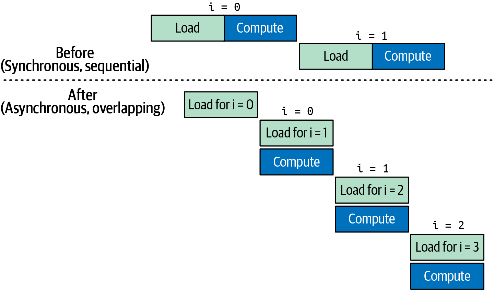

> Figure 6-22. Synchronous (sequential) and asynchronous (overlapping) data transfers with kernel computations

如果您期望重叠但看到复制和内核顺序运行而非并行，那么可能是某种不需要的默认流同步。否则，可能是缺少固定内存缓冲区阻止了真正的重叠。

> If you expect overlap but see the copies and kernels running sequentially versus parallel, then it's something like an unwanted default-stream synchronization. Otherwise, a missing pinned-memory buffer is likely preventing true overlap.

> Without using pinned (page-locked) memory, the cudaMemcpyAsync transfer cannot overlap with kernel execution. This is a common performance issue.

当您怀疑内核数据饥饿时，首先在Nsight Compute和Nsight Systems下运行它。在Nsight Compute中，您将看到全局加载效率指标下降。这表明您的DRAM请求没有得到足够快的满足。同时，Nsight Systems时间线将揭示内核启动之间的空闲段，因为GPU等待数据传输。

一旦您应用了本章的内存层次结构优化，那些空闲间隙将几乎消失，Nsight Compute将显示内存管道利用率百分比向峰值攀升。您还将看到端到端内核吞吐量的相应跳跃。

> Always measure after each change. Profiling tools will confirm if an optimization actually reduces memory stalls or not.

## 6.14 关键要点 (Key Takeaways)

在本章中，您学习了如何选择优化占用率的启动参数、异步管理GPU内存，以及应用roofline分析来区分计算密集型和内存密集型内核。以下是一些值得回顾的关键要点：

> In this chapter, you learned how to choose launch parameters that optimize occupancy, manage GPU memory asynchronously, and apply roofline analysis to distinguish compute-bound from memory-bound kernels. Here are some key takeaways worth reviewing:

- **SIMT执行模型**：GPU在线程束（32个线程）中以单指令多线程（SIMT）模型执行线程，每个线程束以锁步方式发射指令。高占用率--保持许多线程束在运行--隐藏内存和流水线延迟。

- **线程层次结构：线程 → 块 → 网格**：线程被组织成线程块（最多1,024个线程），线程块形成网格以在不更改代码的情况下扩展到数百万个线程。同步（`__syncthreads()`或协作组）启用共享内存中的数据重用，但会产生开销，因此尽量减少屏障。

- **占用率与资源限制**：选择32倍数的块大小以避免未填满的线程束并最大化调度器利用率。注意每SM限制。对于Blackwell，每线程最大寄存器数为255，每SM最大共享内存为228 KB，最大驻留线程束为64，最大驻留线程块为32。

- **CUDA内核启动参数**：从`threadsPerBlock = 256`（8个线程束）开始，平衡占用率和资源使用；计算`blocksPerGrid = (N + threadsPerBlock - 1) / threadsPerBlock`以覆盖所有元素。根据分析反馈（寄存器/寄存器溢出、共享内存使用、实现的占用率）调整这些值。

- **异步内存管理**：优先在专用流上使用`cudaMallocAsync`/`cudaFreeAsync`并利用CUDA内存池，避免全局同步和OS级开销。PyTorch的缓存分配器遵循类似模式进行高效的张量分配，避免昂贵的`cudaMalloc()`和`cudaFree()`调用。

- **GPU内存层次结构**：寄存器 → L1/共享 → L2 → 全局（HBM3e）→ 主机：每级在延迟/带宽方面权衡容量。最大化寄存器和共享/L1缓存中的数据重用。

- **统一内存考虑**：CUDA托管内存（统一内存）简化了编程，但可能导致隐式页面迁移；使用`cudaMemPrefetchAsync`和内存建议避免意外停顿。

- **Roofline模型分析**：算术强度（每字节FLOPS）决定内核是内存密集型还是计算密集型。使用更低精度（FP16/FP8/FP4和硬件解压缩）提高FLOPS/byte比率，将内核推向计算roofline。使用Nsight Compute（每内核指标）和Nsight Systems（时间线）进行分析，识别并消除内存停顿。在Blackwell上使用TMEM与统一矩阵乘累加（UMMA）结合FP8和FP4可以将内核从内存密集型转变为计算密集型。我们将在第10章更详细地介绍UMMA。

## 6.15 结论 (Conclusion)

本章通过阐明GPU的SIMT模型、线程层次结构和多级内存系统，为高性能CUDA开发奠定了基础。请记住，占用率（活动线程束与GPU理论最大值的比率）对于延迟隐藏很重要。

但是，最大化占用率并不保证每种情况下的最佳性能。如果线程有足够的指令级并行性（ILP）--或其他资源是瓶颈--GPU通常可以在中等甚至低占用率下实现非常高的吞吐量。

虽然更高的占用率有助于隐藏延迟，但在某些情况下，减少活动线程数量将为其他线程释放寄存器。这允许每个线程进行更多计算--最终提高吞吐量。始终对不同占用率级别进行基准测试，为您的工作负载和硬件找到最佳设置。

掌握了这些基础知识和分析技术，您现在可以深入探讨针对性优化，如避免线程束分支发散、利用GPU内存层次结构以及异步预取内存。我们还将深入探讨TMA，它处理批量内存传输并释放GPU专注于有用的工作并增加计算吞吐量。
