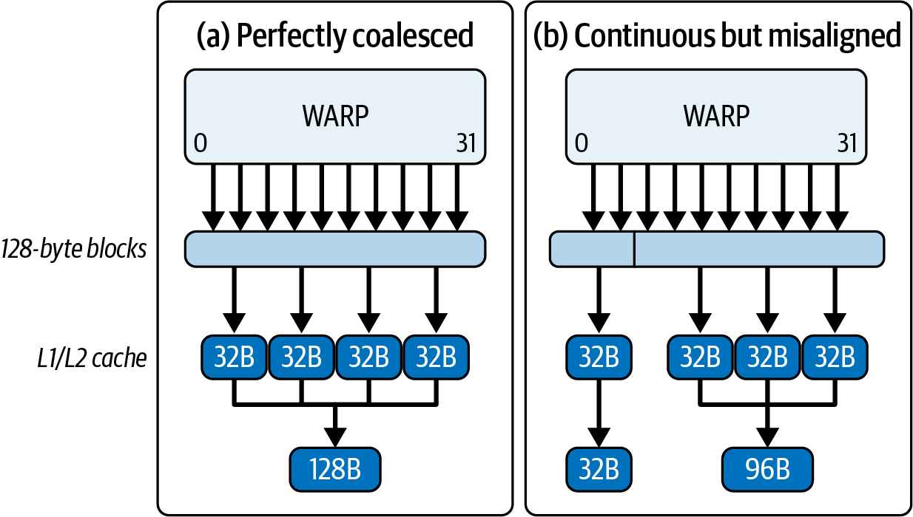
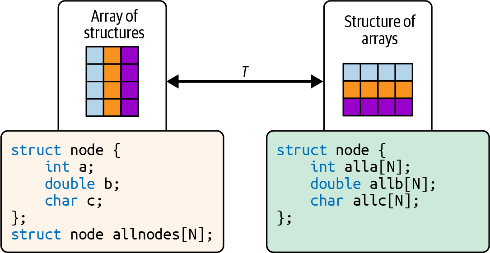
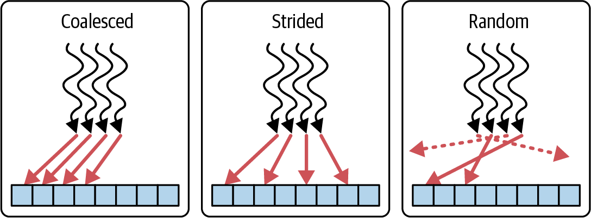
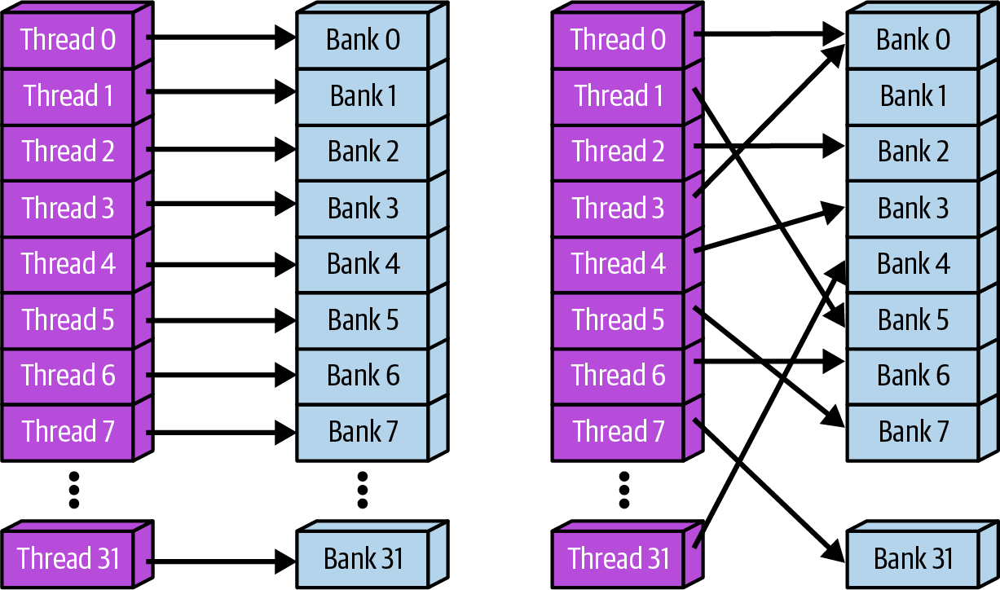
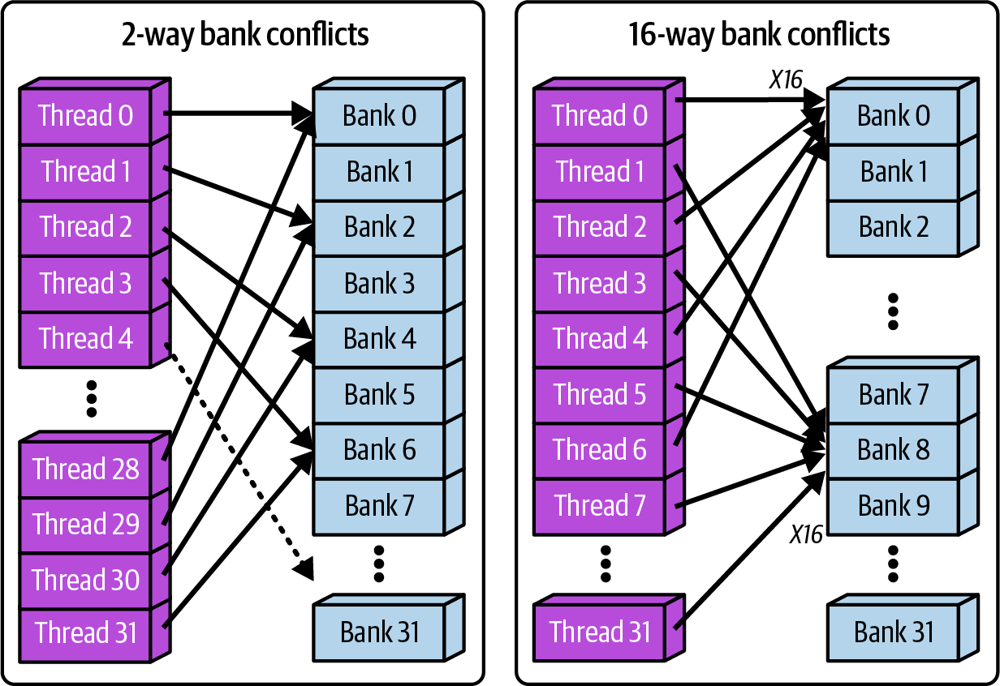

# 第7章 GPU内存访问模式的分析与调优

> Chapter 7. Profiling and Tuning GPU Memory Access Patterns

随着AI模型规模和复杂度的增长，GPU的内存系统往往成为理论计算能力与实际性能之间的瓶颈。正如您在第6章中所见，现代NVIDIA GPU将数千个简单、针对吞吐量优化的核心与专用张量核心相结合。它们还包括高带宽内存（HBM）、一致的CPU-GPU统一内存地址空间（例如Grace Blackwell超级芯片）、片上共享内存、缓存以及专用的直接内存访问（DMA）引擎，如张量内存加速器（TMA）。

在本章中，您将看到各种CUDA C++和PyTorch优化技术，用于对齐数据结构以实现高效内存访问、消除冗余数据加载，以及使用硬件重叠数据传输与计算。

通过矩阵乘法、张量操作等具体的优化前后示例，您将看到内存访问模式、分块策略和异步数据传输的微小变化如何减少带宽浪费、提高算术效率，并将内核从内存密集型转变为计算密集型。

在本章结束时，您将知道如何编写能够更好地利用GPU内存层次结构和硬件优化数据传输引擎的CUDA内核。

> As AI models grow in size and complexity, a GPU's memory system often becomes the bottleneck that stands between theoretical compute capability and real-world performance. As you saw in Chapter 6, modern NVIDIA GPUs combine thousands of simple, throughput-optimized cores with specialized Tensor Cores. They also include high-bandwidth memory (HBM), coherent CPU-GPU unified memory address space (e.g., Grace Blackwell Superchip), on-chip shared memory, caches, and specialized direct memory access (DMA) engines like the Tensor Memory Accelerator (TMA). In this chapter, you'll see various CUDA C++ and PyTorch optimization techniques to align data structures for efficient memory access, eliminate redundant data loads, and overlap data transfers with computation using hardware. Through concrete before-and-after examples of matrix multiplies, tensor operations, and more, you'll see how small changes in memory access patterns, tiling strategies, and asynchronous data transfers can reduce wasted bandwidth, boost arithmetic efficiency, and transform kernels from memory bound to compute bound. By the end of this chapter, you'll know how to write CUDA kernels that can better utilize the GPU's memory hierarchy and hardware-optimized data transfer engines.

## 7.1 合并与非合并的全局内存访问 (Coalesced Versus Uncoalesced Global Memory Access)

代码的内存访问模式会极大地影响性能。当线程束中的线程访问连续的内存地址时，全局内存访问最快，硬件可以将这些访问合并为更少、更大的事务。如果线程访问分散或未对齐的地址，设备就无法将请求合并为最少数量的缓存行事务，现代GPU上的缓存行是128字节，由四个32字节扇区组成。这会导致更多的内存事务获取未使用的数据，从而迅速消耗内存带宽。

> The memory access pattern of your code can greatly impact performance. Global memory accesses are fastest when threads in a warp access contiguous memory addresses that the hardware can combine into fewer, larger transactions. If threads access scattered or misaligned addresses, the device cannot coalesce requests into the minimal number of cache line transactions, which on modern GPUs are 128-byte lines composed of four 32-byte sectors. This results in many more memory transactions retrieving unused data, which quickly eats up memory bandwidth.

在Blackwell GPU上，每设备HBM3e带宽高达8 TB/s。在Grace Blackwell GB200和GB300（双GPU超级芯片）中，跨两个GPU的带宽增加到16 TB/s。使用非合并内存访问将由于过多的内存事务和停顿而使大部分带宽未被利用。

> On a Blackwell GPU, per-device HBM3e bandwidth is up to 8 TB/s. Within the Grace Blackwell GB200 and GB300 (two GPU superchips), this increases 16 TB/s across both GPUs. Using uncoalesced memory accesses will leave most of this bandwidth unused due to excess memory transactions and stalls.

在非合并情况下，线程束中的每个线程从分散的地址加载。这导致许多独立的内存事务。即使线程束中的线程访问连续地址，如果第一个地址不是128字节对齐的，线程束的请求也将跨越两个128字节缓存行。

> In the uncoalesced case, each thread in a warp loads from scattered addresses. This results in many separate memory transactions. Even if threads in a warp access consecutive addresses, if the first address isn't 128-byte aligned, the warp's request will span two 128-byte cache lines.

例如，如果线程束的第一个线程从一个非128字节对齐的地址开始，线程束的内存请求将跨越缓存行边界，通常导致两个128字节事务而不是一个。在这种情况下，线程束可能会获取比最佳四个扇区多一个扇区，总共跨两行五个扇区。这是带宽的浪费。未对齐的连续128字节线程束加载是触及5x32 B扇区还是8x32 B扇区取决于起始偏移量。对齐访问保持为4x32 B扇区。

> For example, if a warp's first thread starts at an address that isn't 128-byte aligned, the warp's memory request will cross a cache-line boundary, often resulting in two 128-byte transactions instead of one. In that case the warp may fetch an extra sector beyond the optimal four sectors, for a total of five sectors across the two lines. This is a waste of bandwidth. Whether a misaligned, contiguous 128-byte warp load touches 5x 32 B sectors or 8x 32 B sectors depends on the start offset. Aligned accesses keep it to 4x 32 B sectors.

在合并情况下，线程从连续地址加载，这些地址被合并为单个宽事务。图7-1比较了合并和非合并内存访问。

> In the coalesced case, however, threads load from consecutive addresses combined into a single wide transaction. Figure 7-1 compares coalesced and uncoalesced memory access.



> Figure 7-1. Comparing coalesced versus uncoalesced memory access pattern

在内核代码中，这个问题通常表现为跨步或不规则索引，使得每个线程访问不同的缓存行。当内核的线程使用跨步或不规则索引获取数据时，GPU会发出许多小型非合并全局内存事务，而不是少量全宽加载。

> In kernel code, this problem typically appears as strided or irregular indexing such that each thread reaches into different cache lines. When a kernel's threads fetch data with strided or irregular indices, the GPU issues many small, uncoalesced global‐memory transactions rather than a handful of full‐width loads.

在Nsight Compute中，当存在非合并模式时，内存工作负载分析部分将显示较低的"全局内存加载效率"、较高的DRAM扇区读取计数以及平均每请求扇区数超过4.0。这是因为获取的扇区比正确合并的内存访问模式更多，这表明您正在通过获取大部分未使用的字节来浪费带宽。DRAM吞吐量百分比将远低于峰值。这确认了您的线程束在内存上停顿，而不是驱动ALU。

> In Nsight Compute, the Memory Workload Analysis section will show lower Global Memory Load Efficiency, higher DRAM sector read counts, and average sectors per request above 4.0 when uncoalesced patterns are present. This is because more sectors are being fetched than a properly coalesced memory access pattern, and it indicates that you're wasting bandwidth by fetching mostly unused bytes. And DRAM throughput percentage will remain well below peak. This confirms that your warp is spending cycles stalled on memory rather than driving the ALUs.

要摆脱这种内存密集型状态，您可以重新组织数据，使每个线程束的32个线程加载连续元素。要么使用`input[idx]`索引数组，其中`idx = blockIdx.x * blockDim.x + threadIdx.x`，要么切换到数组结构（SoA）布局，使线程i始终访问元素i。结构数组（AoS）与SoA的区别如图7-2所示。

> To break out of this memory‐bound regime, you can reorganize your data so that each warp's 32 threads load contiguous elements. Either index the array with input[idx] where idx = blockIdx.x * blockDim.x + threadIdx.x or switch to a structure‐of‐arrays (SoA) layout so that thread i always touches element i. The difference between an array of structures (AoS) and an SoA is shown in Figure 7-2.



> Figure 7-2. Array of structures (AoS) versus structure of arrays (SoA)

一旦您进行了更改，硬件将自动将线程束的全局内存加载合并为更少、更宽的事务，返回更多可用（更少浪费）的数据。Nsight Compute计数器将立即显示改进。

> Once you make the change, the hardware will automatically combine the warp's global memory loads into fewer, wider transactions with more usable (less wasted) data being returned. The Nsight Compute counters will immediately show improvement.

让我们用一个示例来演示这一点。以下优化前后的代码演示了将全局内存访问从跨步模式重构为连续模式如何产生显著的性能提升。

> Let's demonstrate this with an example. The following before-and-after code demonstrates how restructuring global memory accesses from a strided pattern to a contiguous pattern produces a significant performance gain.

**优化前示例（C++）：非合并跨步访问**。在此示例中，每个线程以跨步2从输入数组复制，导致未对齐的内存访问：

```cpp
#include <cuda_runtime.h>
#include <iostream>

__global__ void uncoalescedCopy(const float* __restrict__ in, 
float* __restrict__ out, 
int N, int stride) {
    // n = 1048576, stride = 2
    int idx = blockIdx.x * blockDim.x + threadIdx.x;
    if (idx < N) {
        // Loads from in[] with a stride, causing 
        // multiple memory segments to be fetched
        out[idx] = in[idx * stride];
    }
}

int main() {
    const int N = 1 << 20;
    const int stride = 2;

    float* h_in = nullptr;
    float* h_out = nullptr;
    cudaMallocHost(&h_in, N * stride * sizeof(float));
    cudaMallocHost(&h_out, N * sizeof(float));

    for (int i = 0; i < N * stride; ++i) {
        h_in[i] = static_cast<float>(i);
    }

    float *d_in, *d_out;
    cudaMalloc(&d_in,  N * stride * sizeof(float));
    cudaMalloc(&d_out, N * sizeof(float));
    cudaMemcpy(d_in, h_in, N * stride * sizeof(float), 
      cudaMemcpyHostToDevice);

    // Number of threads per block (multiple of 32)
    const int threadsPerBlock = 256; 

    // Number of blocks per grid
    const int blocksPerGrid = (N + threadsPerBlock - 1) /
      threadsPerBlock;

    uncoalescedCopy<<<blocksPerGrid, 
      threadsPerBlock>>>(d_in, d_out, N, stride);
    cudaDeviceSynchronize();

    cudaFree(d_in);
    cudaFree(d_out);
    cudaFreeHost(h_in);
    cudaFreeHost(h_out);
    return 0;
}
```

CUDA C++内核以跨步>1的地址发出全局内存加载，根据定义，这是非连续的。这导致每个线程束生成多个小事务，而不是单个宽事务。

> The CUDA C++ kernel issues global memory loads at addresses separated by a stride > 1, which is, by definition, noncontiguous. This causes each warp to generate multiple small transactions instead of a single wide transaction.

**优化前示例（PyTorch）**。在PyTorch中，可以使用跨步索引为gather操作创建类似情况：

```python
import torch

def uncoalesced_copy(input_tensor, stride):
    # Flatten to 1D so we know exactly
    #   which dimension we're indexing
    flat_tensor = input_tensor.contiguous().view(-1)

    # Generate indices with a fixed stride to gather
    assert flat_tensor.numel() % stride == 0,"stride must divide 
tensor length"
    idx = torch.arange(0, flat_tensor.numel(), stride, 
        device=flat_tensor.device, dtype=torch.long)
    # index_select uses a gather kernel that issues uncoalesced 
loads
    return torch.index_select(flat_tensor, 0, idx)

# Usage
n, stride = 1 << 20, 2
inp = torch.arange(n * stride, device='cuda', 
                   dtype=torch.float32)
out = uncoalesced_copy(inp, stride)
```

这个PyTorch代码片段使用带有跨步索引模式的`torch.index_select`，这导致底层GPU gather内核执行非合并加载。具体来说，32个线程的线程束将访问相隔`stride * 4`字节的地址。

这不允许单个宽事务，而是生成32个独立的加载。每个线程从`inp`加载一个值，该值在内存中与下一个线程加载的值相距很远，这阻止了合并。图7-3显示了合并与跨步访问模式--以及随机访问。

> This does not allow a single wide transaction and instead generates 32 separate loads. Each thread loads a value from inp that is far apart in memory from the value loaded by the next thread, which prevents coalescing. Figure 7-3 shows the coalesced versus strided access pattern-as well as random access.



> Figure 7-3. Coalesced, strided, and random memory access patterns

在GPU上运行C++和PyTorch代码后，我们测量性能指标。在非合并版本中，每个线程束的内存请求平均被分解为8个独立的32字节扇区。由于每个128字节缓存行获取被分成4个独立的32字节扇区（稍后详细介绍这个数字4），访问模式跨越每个线程束两行以检索8个独立的32字节扇区。

> After running the C++ and PyTorch codes on a GPU, we measure performance metrics. In the uncoalesced version, each warp's memory request is broken into 8 separate 32-byte sectors on average. Since each 128-byte cache line fetch is split into 4 separate 32-byte sectors (more on this number 4 in a bit), the access pattern spans two lines per warp to retrieve the 8 separate 32-byte sectors.

在未优化版本中，每个线程束的非合并加载将单个逻辑请求分解为多达八个独立的32字节扇区，使事务计数膨胀并使内存管道饥饿。因此，Nsight Compute仅报告约25%的持续峰值动态随机访问内存（DRAM）吞吐量。

> In the unoptimized version, each warp's uncoalesced loads break a single logical request into up to eight separate 32-byte sectors, ballooning transaction counts and starving the memory pipeline. As a result, Nsight Compute reports only about 25% of sustained peak dynamic random-access memory (DRAM) throughput.

现在，让我们通过合并内存访问并使线程读取连续元素来优化这一点，以便每个线程束发出更少、更大的事务。

> Now, let's optimize this by coalescing the memory accesses and making threads read contiguous elements so each warp issues fewer, larger transactions.

**优化后示例（C++）：合并访问**。通过简单地移除跨步（或将其设置为1），每个线程复制一个连续元素。这种线程访问的对齐允许硬件将内存请求合并为完整的128字节事务：

```cpp
#include <cuda_runtime.h>
#include <iostream>

__global__ void coalescedCopy(const float* __restrict__ in,
                             float* __restrict__ out,
                             int n) {
    int idx = blockIdx.x * blockDim.x + threadIdx.x;
    if (idx < n) {
        // Contiguous load
        // Threads copy neighboring elements
        out[idx] = in[idx];
    }
}

int main() {
    const int n = 1 << 20;
    const size_t bytes = n * sizeof(float);

    // 1) Allocate pinned host memory
    float *h_in = nullptr, *h_out = nullptr;
    cudaMallocHost(&h_in,  bytes);  // page-locked host alloc
    cudaMallocHost(&h_out, bytes);

    // 2) Initialize input
    for (int i = 0; i < n; ++i) {
        h_in[i] = static_cast<float>(i);
    }

    // 3) Allocate device memory
    float *d_in = nullptr, *d_out = nullptr;
    cudaMalloc(&d_in,  bytes);
    cudaMalloc(&d_out, bytes);

    // 4) Copy to device
    cudaMemcpy(d_in, h_in, bytes, 
      cudaMemcpyHostToDevice);

    // 5) Launch kernel
    dim3 block(256);
    dim3 grid((n + block.x - 1) / block.x);
    coalescedCopy<<<grid, block>>>(d_in, d_out, n);
    cudaDeviceSynchronize();

    // 6) Copy back to host
    cudaMemcpy(h_out, d_out, bytes, 
      cudaMemcpyDeviceToHost);

    // 7) Clean up
    cudaFree(d_in);
    cudaFree(d_out);
    cudaFreeHost(h_in);
    cudaFreeHost(h_out);

    return 0;
}
```

为了简洁起见，我们省略了合并的PyTorch实现，因为它已经内置在PyTorch中。PyTorch中的合并版本只需执行类似`out = inp.clone()`的操作。这会高效地复制连续元素。事实上，连续张量上的`clone()`在底层使用向量化内存复制，类似于我们的合并内核。

> You can also use torch.compile with the default TorchInductor backend to reduce redundant copies and to fuse adjacent operations when safe. clone() is already a device-to-device copy, so it's typically not fused into a separate custom kernel. Enable autotuning (e.g., mode="max-autotune") to help TorchInductor pick coalesced and vectorized schedules when shapes are stable. We'll cover the PyTorch compiler in depth in Chapters 13 and 14.

通过合并访问或无跨步，每个线程束的线程访问相邻地址。在这种情况下，硬件将每个线程束的加载合并为最少数量的128字节事务--当第一个地址是128字节对齐时，通常每个线程束一个128字节事务，如果访问跨越边界则为两个。表7-1显示了此优化带来的显著改进。

> With coalesced access, or no stride, each warp's threads access adjacent addresses. In this case, the hardware coalesces each warp's loads into the minimum number of 128-byte transactions-often one 128-byte transaction per warp when the first address is 128-byte aligned, or two if the access straddles a boundary. Table 7-1 shows the dramatic improvements resulting from this optimization.

**表7-1 合并与非合并内存访问性能**

| 指标 | 优化前（非合并） | 优化后（合并） |
|------|------------------|----------------|
| DRAM吞吐量（峰值百分比） | 25% | 90%（3.6倍） |
| 全局内存加载效率 | 23% | 99% |
| 平均每请求扇区数 | 8.0 | 4.0（最佳） |
| SM活跃百分比 | 62% | 99% |
| 内核执行时间（ms） | 4.8 ms | 1.3 ms（3.7倍） |

> Table 7-1. Coalesced versus uncoalesced memory access performance

> Note: The numeric values in all metrics tables are illustrative to explain the concepts. For actual benchmark results on different GPU architectures, see the GitHub repository.

修复数据布局并合并全局内存访问后，DRAM吞吐量从峰值的25%上升到90%，提高了约3.6倍。内核执行时间改善了约3.7倍，从4.8 ms降至1.3 ms，因为更少的停顿使SM能够取得进展。

> After fixing the data layout and coalescing global memory accesses, DRAM throughput rises from 25% to 90% of peak, about 3.6x higher. Kernel execution time improves by about 3.7x, from 4.8 ms to 1.3 ms, as fewer stalls free the SMs to make forward progress.

全局内存加载效率从23%上升到99%，这意味着几乎每个获取的字节都是有用的。同时，平均每请求扇区数下降到约4.0。

接近4.0的值意味着线程束的加载已完全合并。当第一个地址128字节对齐时，所有32个线程映射到一个128字节行。该行有四个32字节扇区，因此该指标报告平均每请求4.0个扇区。

> A value near 4.0 means the warp's loads are fully coalesced. With the first address 128-byte aligned, all 32 threads map to one 128-byte line. This line has four 32-byte sectors, so the metric reports an average of 4.0 sectors per request.

在最坏情况下，使用跨步或分散访问，该值可能接近32，因为活动是以L2处的32字节扇区报告的。高于4.0的值表示非合并或未对齐访问。在未优化版本中，非合并加载可以将单个逻辑访问分解为每请求许多扇区，接近最坏情况。

> In the worst case with strided or scattered access, the value can approach 32 because activity is reported in 32-byte sectors at L2. Values above 4.0 indicate uncoalesced or misaligned access. In an unoptimized version, uncoalesced loads can break a single logical access into many sectors per request, approaching the worst case.

这里我们处于约4.0扇区/请求，这表明请求干净地映射到128字节行，没有未使用的扇区。由于内存停顿减少，SM活跃百分比从62%提高到99%。

> Here we are at about 4.0 sectors per request, which indicates that requests map cleanly to 128-byte lines with no unused sectors. With fewer memory stalls, SM Active percent improves from 62% to 99%.

总之，通过对齐每个线程束的线程在连续地址上，GPU的内存控制器可以用几个大事务而不是数十个小事务为每个线程束服务。这将全局内存加载效率（每个事务返回有用数据的比例）提升到接近100%，并通过保持线程束忙碌而非空闲来提高SM活跃百分比。

> In summary, by aligning each warp's threads on successive addresses, the GPU's memory controller can service each warp with a few large transactions instead of dozens of tiny ones. This boosts the Global Memory Load Efficiency (fraction of each transaction that returns useful data) to near 100% and raises SM Active % by keeping warps busy instead of idle. 

至此，您已经看到合并如何重塑您的线程到地址映射，使整个线程束的加载与GPU的128字节段对齐。然而，即使是完全合并的线程束，在底层仍然发出32个独立的4字节读取，每个线程一个，迫使硬件将它们重新拼接成每个128字节事务。

> And with that, you've seen how coalescing reshapes your thread-to-address mapping so an entire warp's loads line up on the GPU's 128-byte segments. However, even a fully coalesced warp still issues 32 individual 4-byte reads under the hood, one per thread, forcing the hardware to stitch them back together into each 128-byte transaction.

为了消除最后一层低效，我们转向向量化内存访问：让每个线程在单条指令中获取更宽、对齐的块（例如16字节的float4），以便合并的线程束精确发出四个128字节事务，而不是32个。让我们深入了解如何将每线程加载打包到CUDA的内置向量类型中。

> To eliminate that last layer of inefficiency, we turn to vectorized memory access: having each thread fetch a wider, aligned chunk (e.g., a 16-byte float4) in a single instruction so that a coalesced warp issues exactly four 128-byte transactions, not 32. Let's dive into how to pack your per-thread loads into CUDA's built-in vector types.

## 7.2 向量化内存访问 (Vectorized Memory Access)

虽然内存合并是NVIDIA GPU上的运行时硬件优化，但向量化内存访问是一种编译时策略，其中每条加载或存储指令显式获取多个连续元素（例如float4或16字节）每线程。这减少了指令数量并消除了拼接开销。

> While memory coalescing is a runtime hardware optimization on NVIDIA GPUs, vectorized memory access is a compile-time strategy in which each load or store instruction explicitly fetches multiple contiguous elements (e.g., float4, or 16 bytes) per thread. This reduces instruction count and eliminates stitching overhead.

Blackwell上高效的全局内存访问依赖于将您的加载与GPU的原生128字节事务大小匹配。当每个线程只读取一个4字节float时，32线程线程束仍然需要拼接32个4字节请求来填充一个128字节行。

> Efficient global‐memory access on Blackwell relies on matching your loads to the GPU's native 128-byte transaction size. When each thread reads only a 4-byte float, a 32-thread warp still has to stitch together 32 4-byte requests to fill one 128-byte line.

在理想的合并情况下，读取32个4字节字并对齐到128字节边界的线程束精确映射到四个32字节扇区。Nsight Compute在平均每请求扇区数指标中捕获这种浪费，当您的访问未对齐、跨步或分散时，该值可能远高于4.0。因此，当带宽未被充分利用时，您会看到全局内存加载效率下降。

> In ideal coalesced cases, a warp that reads 32 4-byte words aligned to a 128-byte boundary maps to exactly four 32-byte sectors. Nsight Compute captures this waste in the average sectors per request metric, which can climb well above 4.0 when your accesses are misaligned, strided, or scattered. As such, you'll see Global Memory Load Efficiency drop as bandwidth goes underutilized.

解决方案是将每个线程的工作打包成更大的、自然对齐的向量，干净地映射到那些128字节事务。CUDA的内置float4类型正是这样做的：它将四个4字节float打包成一个16字节结构，由编译器保证16字节对齐。出于说明目的，它看起来类似于以下代码：

> The fix is to bundle each thread's work into a larger, naturally aligned vector that maps cleanly onto those 128-byte transactions. CUDA's built-in float4 type does exactly that: it packs four 4-byte floats into a 16-byte struct guaranteed by the compiler to be 16-byte aligned. For illustration purposes, it looks something like the following code:

```cpp
// Example of a custom float4 for illustration purposes.
// Note: it's recommended to use the built-in CUDA float4 type.
// Note: if N is not divisible by 4, handle the last N % 4 
// elements 
// (e.g., a short scalar cleanup) or assert divisibility in host 
// code. The 
// input and output pointers must be 16-byte aligned for float4 
// loads/stores.
struct my_float4 {
    float x;  // 4 bytes
    float y;  // 4 bytes
    float z;  // 4 bytes
    float w;  // 4 bytes
};
```

当线程束中的所有32个线程发出float4加载时，它们一起获取32 x 16字节 = 512字节的连续数据，Blackwell内存控制器随后将其精确分成四个128字节事务（512字节 / 128字节每事务 = 4个事务）。这保持了理想的4.0扇区每128字节事务（之前讨论的合并内存访问），因为线程束请求512字节，硬件用四个对齐的128字节事务服务该请求，总共16个扇区，每个都完全利用。

与可能膨胀扇区计数的未对齐或跨步情况相比，向量化float4加载将每线程加载指令减少4倍。这有助于在满足对齐时保持理想的4.0扇区每请求。

> High-level GPU compilers like the PyTorch compiler can often generate vectorized memory operations when alignment and contiguity requirements are met. You can encourage this behavior by using per-thread tiles that match vector widths. As such, frameworks can usually achieve a similar reduction in memory transactions under the hood. However, it's still beneficial to align data properly from the start.

由于这种向量化内存访问优化，全局内存加载效率向100%增加。当每个128字节事务完全利用时，每事务扇区数保持为4.0，而线程束发出多个对齐事务来服务更宽的请求。

> As a result of this vectorized memory access optimization, global memory load efficiency increases toward 100%. Sectors per transaction remain at 4.0 when each 128-byte transaction is fully utilized, while the warp issues multiple aligned transactions to serve a wider request.

向量化加载减少了每移动字节的内存指令数量，通常增加有效带宽。要从向量化加载中受益，数据指针必须对齐到向量宽度。CUDA运行时和驱动程序分配函数（如cudaMalloc）返回至少256字节对齐的设备指针。

基础对齐在分配边界处足以满足16字节和32字节向量对齐。如果偏移不是向量宽度的倍数，添加元素偏移可能会破坏对齐。以下转换向编译器断言预期类型，并假设指针已正确对齐：

```cpp
auto ptr4 = reinterpret_cast<const float4*>(ptr);
```

在转换之前，请确保指针值是16字节（4个float）的倍数。这是因为`cudaMalloc()`返回至少256字节对齐。如果偏移不是4个float的倍数，添加元素偏移可能会破坏对齐。正确的对齐是向量化加载的前提条件。

当基础地址对齐到32字节时，每个线程每次迭代读取32字节，通常编译为每个线程两条16字节向量加载指令（Hopper）或一条32字节加载指令（Blackwell）。32线程线程束因此请求1,024字节。每个128字节缓存行由四个32字节扇区组成。因此，当访问正确对齐时，线程束生成八个对齐的128字节事务，总共32个扇区。这样，每次访问都落在自然边界上，避免分裂事务。

值得注意的是，截至本文撰写时，CUDA在其`<vector_types.h>`中不提供内置的8-float聚合CUDA向量类型（例如八个组合的float32）。您可以定义自己的8个float值的结构体，然后每个线程将其作为两个float4值加载。您可以在类型上使用`alignas(32)`进行32字节对齐。这样，指针值是32字节的倍数。现代GPU上的全局内存向量指令通常每个线程加载16字节（Hopper）或32字节（Blackwell）。在Hopper每线程16字节的情况下，8-float聚合加载将编译为每个线程两条16字节加载以包含所有32字节。另一方面，Blackwell在使用正确的32字节对齐数据时，将编译为每个线程单条32字节加载。

使用每线程32字节加载（例如8个float x 每float 4字节），线程束移动1,024字节（1,024字节 = 每线程束32个线程 x 每线程32字节）。这通常映射到8 x 128字节行，因为每行由四个32字节扇区组成。使用每线程16字节加载（例如四个float4），线程束移动512字节（512字节 = 每线程束32个线程 x 每线程16字节）或4 x 128字节行。当基础指针和每线程跨步自然对齐时，硬件合并器将通道访问组合成完整的行，避免分裂扇区。这种对硬件特性的理解对于实现峰值吞吐量至关重要。因此，对于Blackwell上的256位加载，您应该强制执行32字节对齐以保持峰值性能。

让我们看一个简单向量复制内核中标量与向量化内存访问的示例。

> Let's see an example of scalar versus vectorized memory access in a simple vector copy kernel.

**优化前示例（C++）：标量复制**。每个线程复制一个float：

```cpp
#include <cuda_runtime.h>

__global__ void copyScalar(
const float* __restrict__ in, 
float* __restrict__ out, int N) {
    int idx = blockIdx.x * blockDim.x + threadIdx.x;
    if (idx < N) {
        // Scalar load: 4-byte copy per thread
        out[idx] = in[idx];
    }
}

int main() {
    const int N = 1 << 20;

    float* h_in = nullptr;
    float* h_out = nullptr;
    cudaMallocHost(&h_in, N * sizeof(float));
    cudaMallocHost(&h_out, N * sizeof(float));

    for (int i = 0; i < N; ++i) h_in[i] = float(i);

    float *d_in, *d_out;
    cudaMalloc(&d_in, N * sizeof(float));
    cudaMalloc(&d_out, N * sizeof(float));
    cudaMemcpy(d_in, h_in, N * sizeof(float), 
cudaMemcpyHostToDevice);

    dim3 block(256), grid((N + 255) / 256);
    copyScalar<<<grid, block>>>(d_in, d_out, N);
    cudaDeviceSynchronize();

    cudaFree(d_in); cudaFree(d_out);
    cudaFreeHost(h_in); 
    cudaFreeHost(h_out);

    return 0;
}
```

**优化前示例（PyTorch）**。PyTorch中的标量逐元素复制可以用Python循环进行说明：

```python
import torch

def copy_scalar(inp: torch.Tensor) -> torch.Tensor:
    out = torch.empty_like(inp)
    flat_in = inp.view(-1)
    flat_out = out.view(-1)
    for i in range(flat_in.numel()):
        # Each iteration issues a 4-byte load on the GPU
        # This is extremely slow. DO NOT DO THIS!
        # Use vectorized operations to avoid Python loops
        # on GPU tensors as shown in optimized version
        flat_out[i] = flat_in[i]
    return out

# Usage
N = 1 << 20
inp = torch.arange(N, device='cuda', dtype=torch.float32)
out = copy_scalar(inp)
```

使用标量4字节加载，当对齐时，线程束通常发出一个128字节事务用于128字节。否则，如果访问跨越128字节边界，则使用两个事务。使用float4（每线程16字节）意味着每个线程束每条内存指令发出4倍更多的数据--每线程束512字节--分成四个128字节事务。这允许传输在更少的指令中完成。接下来，让我们使用向量加载进行优化。

> With scalar 4-byte loads, a warp often issues one 128-byte transaction for 128 bytes when aligned. Otherwise, it uses two transactions if the access straddles a 128-byte boundary. Using float4 (16 bytes per thread) means each warp issues 4x more data per memory instruction-512 bytes per warp -split into four 128-byte transactions. This allows the transfer to complete in fewer instructions. Next, let's optimize by using vector loads.

**优化后示例（C++）：向量化复制**。每个线程复制一个float4（16字节）：

```cpp
#include <cuda_runtime.h>

// 16-byte (128-bit) vector copy: one float4 per thread
static_assert(alignof(float4) == 16, "float4 alignment must be 16 
bytes");
__global__ void copyVector16B(const float4* __restrict__ in,
                              float4* __restrict__ out,
                              int N4)  // number of float4 
elements
{
    int idx = blockIdx.x * blockDim.x + threadIdx.x;
    if (idx < N4) {
        // Per-thread 16B load+store.
        // On sm_90, NVCC emits ld.global.v4.f32 / 
st.global.v4.f32.
        // for 16-byte vector loads and stores
        // On sm_90 (Hopper) (Blackwell), NVCC emits
        // ld.global.v8.f32 and st.global.v8.f32 for 32-byte 
aligned data
        out[idx] = in[idx];
    }
}

int main() {
    const int N  = 1 << 20;   // total number of floats
    const int N4 = N / 4;     // total number of float4s (16B 
chunks)

    float4 *d_in = nullptr, *d_out = nullptr;
    cudaMalloc(&d_in,  N4 * sizeof(float4));   // >=256B aligned
    cudaMalloc(&d_out, N4 * sizeof(float4));

    dim3 block(256);
    dim3 grid((N4 + block.x - 1) / block.x);
    copyVector16B<<<grid, block>>>(d_in, d_out, N4);
    cudaDeviceSynchronize();

    cudaFree(d_in);
    cudaFree(d_out);
    return 0;
}
```

这里我们使用CUDA的内置float4类型（来自`<cuda_runtime.h>`）。我们启动N/4个线程以保持16字节对齐并发出真正的向量加载/存储，每个线程复制一个float4（16字节）。这意味着每个线程处理四个float，每个线程束总共处理128个float，分成四个事务。`cudaMalloc`返回至少256字节对齐的指针，这满足float4（16字节）要求，并在您为数据起始地址使用32字节对齐时有助于32字节对齐向量。重要的是要注意，未对齐的转换可能会丧失向量化。

> Here we use CUDA's built-in float4 type from <cuda_runtime.h>. We launch N/4 threads to maintain 16-byte alignment and issue true vector loads/stores, and each thread copies one float4 (16 bytes). This means each thread handles four floats, and each warp handles 128 floats total in four transactions. cudaMalloc returns pointers aligned to at least 256 bytes which satisfies the float4 (16-byte) requirement and helps with 32-byte aligned vectors when you use 32-byte alignment for the data's starting address. It's important to note that misaligned casts can forfeit vectorization. Following is an example that takes advantage of Blackwell's support for 32-byte vectorized loads:

以下是一个利用Blackwell对32字节向量化加载支持的示例：

```cpp
// --- Blackwell-only variant: 32-byte per-thread vector copy 
// (PTX: ld.global.v8.f32)
// Requires 32B alignment.
#include <cuda_runtime.h>

// Proof of 32-byte alignment
static_assert(alignof(float8) == 32, "float8 alignment must be 32 
bytes");
struct alignas(32) float8 { float v[8]; };

__global__ void copyVector32B(const float8* __restrict__ in,
                              float8* __restrict__ out, int N8) {
    int idx = blockIdx.x * blockDim.x + threadIdx.x;
    if (idx < N8) {
        // Per-thread 32B load+store
        // NVCC emits ld.global.v8.f32/st.global.v8.f32 on sm_100
        out[idx] = in[idx];
    }
}

int main() {
    const int N = 1 << 20;
    const int N8 = N / 8;

    float8 *d_in, *d_out;
    // cudaMalloc returns pointers aligned to ≥256 bytes
    // This will allow the compiler to emit
    // optimized ld.global.v8.f32 and st.global.v8.f32 
instructions
    cudaMalloc(&d_in,  N8 * sizeof(float8));  
    cudaMalloc(&d_out, N8 * sizeof(float8));

    dim3 block(256), grid((N8 + block.x - 1) / block.x);
    copyVector32B<<<grid, block>>>(d_in, d_out, N8);
    cudaDeviceSynchronize();

    cudaFree(d_in); cudaFree(d_out);
    return 0;
}
```

**优化后示例（PyTorch）**。我们可以通过使用张量视图和clone来模拟向量化复制：

```python
import torch

def copy_vectorized(inp: torch.Tensor) -> torch.Tensor:
    # Reshape into groups of 4 floats for bulk copy
    vec = inp.view(-1, 4)
    # clone() on a contiguous CUDA tensor performs a device-to-
device copy
    # using optimized runtime paths such as cudaMemcpyAsync(). 

    out_vec = vec.clone()
    return out_vec.view(-1)

# Usage
N = 1 << 20
inp = torch.arange(N, device='cuda', dtype=torch.float32)
out = copy_vectorized(inp)
```

在重塑后的张量上调用`clone()`会使PyTorch执行连续复制。这与逐元素复制形成对比。通过使用float4向量加载，每个线程每条指令移动16字节，这对Hopper进行了优化。（Blackwell支持每线程32字节向量加载。）线程束为该加载发出512字节，当对齐时通常分成四个128字节事务。好处来自每移动字节的指令更少、更好的扇区利用率以及正确的对齐以最大化现代GPU上的内存吞吐量。这显示了更好的内存带宽利用率，如表7-2所示。

> Calling clone() on the reshaped tensor causes PyTorch to perform contiguous copies. This is in contrast to copying element by element. By using float4 vector loads, each thread moves 16 bytes per instruction, which is optimized for Hopper. (Blackwell supports 32-byte vector loads per thread.) A warp issues 512 bytes for that load, typically split into four 128-byte transactions when aligned. The benefit comes from fewer instructions per byte moved, better sector utilization, and proper alignment to maximize memory throughput on modern GPUs. This shows far better utilization of memory bandwidth, as shown in Table 7-2.

> Blackwell doubles the number of bytes for vector loads/stores per thread relative to Hopper. With CUDA 13, Blackwell can perform 32-byte vector loads and stores instead of 16 bytes on Hopper. This requires that the compiler can prove 32-byte alignment. Otherwise, it may split the per-thread load/store into two 16-byte instructions. This will increase the number of instructions required to load/store the same amount of data which will negatively impact performance.

通过使用正确对齐的float4向量加载，每个线程每条指令移动16字节。这显示了更好的内存带宽利用率，如表7-2中的结果所示。

**表7-2 标量与向量化内存访问的Nsight Compute指标**

| 指标 | 优化前（标量） | 优化后（向量化） |
|------|----------------|------------------|
| 全局内存加载效率 | 28% | 97% |
| 平均每请求扇区数 | 31.8 | 4.0 |
| DRAM吞吐量（峰值百分比） | 25% | 90%（3.6倍） |
| 内核执行时间 | 4.2 ms | 1.2 ms（3.5倍改进） |

> Table 7-2. Nsight Compute metrics for scalar versus vectorizing memory access

这些指标确认了改进。全局内存加载效率从28%跃升至97%（约3.5倍），峰值DRAM吞吐量百分比从25%增加到90%（约3.6倍），将整体内核运行时间缩短了约3.5倍。

> These metrics confirm the improvement. Global Memory Load Efficiency jumped from 28% to 97% (~3.5x), and percentage of peak DRAM throughput increased from 25% to 90% (~3.6x), trimming the overall kernel runtime by ~3.5x.

此优化将内核执行运行时间从4.2 ms缩短到约1.2 ms，减少了约3.5倍。全局内存加载效率从28%（标量）跃升至97%（向量化），这意味着几乎每个获取的128字节事务现在都被使用。

> This optimization trimmed the kernel execution runtime by roughly 3.5x from 4.2 ms down to 1.2 ms. Global Memory Load Efficiency jumps from 28% (scalar) to 97% (vectorized), meaning that almost every fetched 128-byte transaction is now used.

平均每请求扇区数下降到接近4.0扇区每行的理想值。这表明每个128字节行被完全利用。每个线程束范围的float4指令发出四个对齐的128字节事务来移动512字节。因此，每个事务都被完全利用。

> The average sectors per request drops toward the 4.0 sector-per-line ideal value. This indicates that each 128-byte line is fully utilized. Each warp-wide float4 instruction issues four aligned 128-byte transactions to move 512 bytes. As such, every transaction is fully utilized.

内存请求的减少以及用一次向量加载替换四次标量加载，将全局内存加载效率从28%提高到97%，并将持续DRAM吞吐量从约25%提高到约峰值的90%。在这种情况下，线程束执行的内存操作少得多，每次操作获取更多数据，因此它们在等待内存上花费的时间少得多，在执行有用工作上花费的时间多得多。最终结果是显著更快的内核。

> The reduction in memory requests and the replacement of four scalar loads with one vector load increase global memory load efficiency from 28% to 97% and raise sustained DRAM throughput from about 25% to about 90% of peak. In this case, warps are doing far fewer memory operations and get more data with each operation, so they spend much less time waiting on memory and more time executing useful work. The end result is a significantly faster kernel.

> Vectorization reduces instruction count. Coalescing and alignment improve the number of sectors per request.

让我们快速比较上一节的合并全局内存访问与本节讨论的向量化内存访问。合并确保线程束中的线程都命中一个大的连续块。向量化确保每个线程获取一个精确映射到那些大块的宽块。差异总结在表7-3中。

> Let's quickly compare coalesced global memory access from the previous section to vectorized memory access discussed here. Coalescing makes sure threads in a warp all hit one big contiguous block. Vectorizing makes sure each thread fetches a wide chunk that exactly maps onto those big blocks. The differences are summarized in Table 7-3.

**表7-3 合并内存访问（上一节）与向量化内存访问的比较**

| 方面 | 合并线程束加载（线程间） | 向量化（线程内） |
|------|--------------------------|------------------|
| 粒度 | 线程 ↔ 连续内存地址 | 每线程 ↔ 向量加载 |
| 典型修复 | 连续索引（跨步 = 1） | 使用float4、自定义32字节结构（显式32字节对齐）或32字节对齐向量类型（例如Blackwell和CUDA 13+） |
| 每线程束事务数 | 32线程 x 4字节 → 128字节，等于4个32字节扇区（如果对齐，4个扇区） | 32线程 x 16字节 → 512字节，等于4个128字节事务，对应16个32字节扇区（16个扇区） |
| 指令数量变化 | 相同数量的加载 | 1次向量加载代替4次标量加载 |
| 好处 | 更少的分散扇区 | 完美大小、更少的扇区 |

> Table 7-3. Comparing coalesced memory access (previous section) and vectorized memory access

通过结合这两种策略，您确保线程束命中连续块，使每个线程获取宽、对齐的向量。这有助于将内核的内存带宽利用率推向峰值，并释放GPU的全部能力。

> By combining both strategies, you ensure that warps hit contiguous blocks such that each thread fetches a wide, aligned vector. This helps you push your kernel's memory bandwidth utilization to its peak and unlock the full power of your GPU.

值得注意的是，在Blackwell和CUDA 13之前，全局内存向量加载仅限于每线程16字节（128位）。然而，Blackwell和CUDA 13为具有32字节对齐的特定向量类型添加了32字节（256位）加载/存储指令和数据类型。

> It's worth noting that, prior to Blackwell and CUDA 13, global memory vector loads were limited to 16 bytes (128 bits) per thread. However, Blackwell and CUDA 13 added 32-byte (256-bit) load/store instructions and data types for specific vector types with 32-byte alignment.

当可用时，对于用户定义的8-float聚合，优先使用这些更宽的32字节类型和指令。这将减少加载和存储更宽的32字节对齐数据所需的指令数量。

> When available, prefer these wider 32-byte types and instructions for user-defined 8-float aggregates. This will reduce the number of instructions needed to load and store wider 32-byte aligned data.

自定义8-float聚合仍将编译为两条16字节加载，除非您显式使用映射到单条32字节指令的32字节对齐类型。

> Custom 8-float aggregates will still compile into two 16-byte loads unless you explicitly use the 32-byte-aligned types that map to a single 32-byte instruction.

> Even though a Blackwell thread can load a full 32-byte vector type, the memory coalescer can still only service requests in 128-byte chunks, or four 32-byte sectors. On Blackwell, a 32-thread warp moving 32 B per thread transfers 1024 B (8 x 128 B lines). Hopper's 16 B/thread variant moves 512 B (4 x 128 B). Note that the transaction count scales with bytes moved. Both are fully efficient when properly aligned: 16-byte (Hopper) or 32-byte (Blackwell and beyond).

## 7.3 使用共享内存进行分块和数据重用 (Tiling and Data Reuse Using Shared Memory)

一个常见的性能陷阱是从全局内存重复读取相同数据。分块是一种避免这种情况的技术，通过将数据块加载到更快的片上共享内存--并在多个线程之间重用这些块。

> A common performance pitfall is repeatedly reading the same data from global memory. Tiling is a technique to avoid this by loading chunks of data into faster on-chip shared memory-and reusing those chunks across many threads.

例如，N x N大小的朴素矩阵乘法可能会从HBM加载矩阵A的每个元素N次，每次与B的一行相乘。这导致每个元素有N-1次冗余加载。在Blackwell上，它可以轻松执行数十万亿次浮点运算（TFLOPS），冗余加载会浪费内存带宽，而这些带宽本可以为GPU SM提供更多数学运算。

> For example, a naive matrix multiplication of size N x N might load each element of matrix A from HBM N times, once for each row of B it multiplies with. This results in N-1 redundant loads per element. And on Blackwell, which can easily execute tens of teraFLOPS (TFLOPS), redundant loads can waste memory bandwidth, which could otherwise be feeding more math operations to the GPU SMs.

分块通过让每个线程块精确一次将A和B的小子矩阵（一个分块）拉入共享内存来消除这种浪费。然后，它在多个乘累加操作中跨所有线程重用缓存的值。在我们的下一个示例中，我们将使用32 x 32的分块，这是一个常见的选择，非常适合共享内存。

> Tiling eliminates this waste by having each thread block pull a small submatrix (a tile) of A and B into shared memory exactly once. It then reuses the cached values across all threads for multiple multiply-accumulate operations. In our next example, we'll use a 32 x 32 tile, which is a common choice that fits well in shared memory.

线程块内的线程可以协作将分块加载到共享内存，然后调用`__syncthreads()`同步数据。然后线程使用共享内存中的数据执行并行矩阵乘法计算。这分摊了全局内存访问成本到多个线程和计算。值得注意的是，这些分块加载也被安排为合并的。具体来说，每个线程束从全局内存加载一个完整的128字节段到共享内存--与之前的合并示例一致。

> Threads within a block can cooperatively load the tile into shared memory, then call __syncthreads() to synchronize the data. Then the threads perform parallel matrix-multiply computations using the data in shared memory. This amortizes the global memory access cost over many threads and computations. It's worth noting that these tile loads are also arranged to be coalesced. Specifically, each warp loads a full 128-byte segment from global memory into shared memory-consistent with the coalescing example from earlier.

通过从DRAM只读取每个元素一次（到共享内存）并在多次计算中重用它，我们减少了全局内存流量。让我们用N x N矩阵乘法示例来说明这一点。首先，考虑一个朴素实现。

> By reading each element from DRAM only once (into shared memory) and reusing it for many calculations, we reduce global memory traffic. Let's illustrate this with an N x N matrix multiplication example. First, consider a naive implementation.

**优化前示例（CUDA C++）：朴素矩阵乘法**。每个线程计算结果矩阵C的一个元素，从全局内存读取A的整行和B的列用于每个输出：

```cpp
#include <cuda_runtime.h>
#include <iostream>

__global__ void naiveMatMul(const float* A, const float* B, 
float* C, int N) {
    int row = blockIdx.y * blockDim.y + threadIdx.y;
    int col = blockIdx.x * blockDim.x + threadIdx.x;
    if (row < N && col < N) {
        float sum = 0.0f;
        for (int k = 0; k < N; ++k) {
            // Each thread loads A[row, k] and B[k, col] 
            // from global memory for every k.
            // This is very memory heavy.
            sum += A[row * N + k] * B[k * N + col];
        }
        C[row * N + col] = sum;
    }
}

int main() {
    const int N = 1024;
    size_t bytes = N * N * sizeof(float);

    float* h_A = nullptr;
    float* h_B = nullptr;
    float* h_C = nullptr;
    cudaMallocHost(&h_A, N*N * sizeof(float));
    cudaMallocHost(&h_B, N*N * sizeof(float));
    cudaMallocHost(&h_C, N*N * sizeof(float));

    for (int i = 0; i < N*N; ++i) { h_A[i] = 1.0f; h_B[i] = 1.0f; 
}

    float *d_A, *d_B, *d_C;
    cudaMalloc(&d_A, bytes);
    cudaMalloc(&d_B, bytes);
    cudaMalloc(&d_C, bytes);
    cudaMemcpy(d_A, h_A, bytes, cudaMemcpyHostToDevice);
    cudaMemcpy(d_B, h_B, bytes, cudaMemcpyHostToDevice);

    dim3 block(32, 32);
    dim3 grid((N + 31) / 32, (N + 31) / 32);
    naiveMatMul<<<grid, block>>>(d_A, d_B, d_C, N);
    cudaDeviceSynchronize();

    cudaFree(d_A); 
    cudaFree(d_B); 
    cudaFree(d_C);
    cudaFreeHost(h_A); 
    cudaFreeHost(h_B); 
    cudaFreeHost(h_C);
    return 0;
}
```

这个CUDA C++内核在内循环中为每次乘法发出全局内存加载。每个线程为每个k从DRAM读取`A[row, k]`和`B[k, col]`，导致大量冗余流量。

> This CUDA C++ kernel issues global memory loads for every multiplication inside the inner loop. Each thread reads A[row, k] and B[k, col] from DRAM for every k, causing massive redundant traffic.

结果是一个严重内存密集型的内核，SM利用率低，频繁在全局内存上停顿等待。以下是朴素矩阵乘法的PyTorch版本：

```python
import torch

def naive_matmul(A, B):
    N = A.size(0)
    C = torch.zeros((N, N), device='cuda')
    for i in range(N):
        for j in range(N):
            # Each dot product loads A[i,:] B[:,j] from global 
memory repeatedly
            C[i, j] = (A[i, :] * B[:, j]).sum()
    return C

# Usage
N = 1024
A = torch.ones((N, N), device='cuda', dtype=torch.float32)
B = torch.ones((N, N), device='cuda', dtype=torch.float32)
C = naive_matmul(A, B)
```

这个PyTorch实现使用嵌套Python循环。虽然最内层操作作为逐元素乘法和求和操作被卸载到GPU，但它仍然在底层为每个点积触发重复的全局内存加载。这模仿了朴素CUDA内核的内存密集型行为，因为GPU大部分周期在等待内存而不是计算乘法。

> This PyTorch implementation uses nested Python loops. While the innermost operations are offloaded to GPU as elementwise multiply and sum operations, it still triggers repeated global memory loads under the hood for each dot product. This mimics the memory-bound behavior of the naive CUDA kernel since the GPU spends most cycles waiting on memory rather than computing multiplications.

> This PyTorch code is extremely slow on purpose to illustrate the extreme case of performing redundant global memory access loads inside of a loop. In practice, frameworks like PyTorch use optimized kernels for this type of operation.

现在，让我们应用分块来改进这一点。我们将矩阵分成32 x 32的分块。32 x 32是一个方便的分块大小，因为它与32的线程束大小对齐，它很适合共享内存，并且它映射到一个完整的32线程线程束读取每一行。这允许每个线程束协作加载和处理一次一行（每个分块）。

> Now, let's apply tiling to improve this. We divide the matrices into 32 x 32 tiles. 32 x 32 is a convenient tile size since it aligns with a warp size of 32, it fits well in shared memory, and it maps to a full warp of 32 threads reading each row. This allows each warp to collaboratively load and process one single row (per tile) at a time.

因此，每个线程块加载一个32 x 32的A分块和一个32 x 32的B分块到共享内存，执行32 x 32矩阵乘法，并累加结果。这样，A和B的每个元素每个分块只从HBM加载一次，而不是朴素版本中的32次。

> As such, each thread block loads one 32 x 32 tile of A and one 32 x 32 tile of B into shared memory, performs the 32 x 32 matrix multiplies, and accumulates the results. This way, each element of A and B is loaded from HBM only once per tile instead of 32 times in the naive version.

使用共享内存缓存分块进行矩阵乘法的优化版本如下所示：

```cpp
#include <cuda_runtime.h>
#include <iostream>
#define TILE_SIZE 32

__global__ void tiledMatMul(const float* A, const float* B, 
float* C, int N) {
    __shared__ float sA[TILE_SIZE][TILE_SIZE];
    __shared__ float sB[TILE_SIZE][TILE_SIZE];

    int row = blockIdx.y * TILE_SIZE + threadIdx.y;
    int col = blockIdx.x * TILE_SIZE + threadIdx.x;
    float sum = 0.0f;

    // compute partial results using the tile
    // in shared memory
    for (int t = 0; t < N; t += TILE_SIZE) {
        // Cooperative load of a tile of A and B into shared 
memory
        // Load tile A with boundary check
        if (row < N && (t + threadIdx.x) < N) {
            sA[threadIdx.y][threadIdx.x] = A[row * N + t + 
threadIdx.x];
        } else {
            sA[threadIdx.y][threadIdx.x] = 0.0f;
        }

        // Load tile B with boundary check
        if ((t + threadIdx.y) < N && col < N) {
            sB[threadIdx.y][threadIdx.x] = B[(t + threadIdx.y) * 
N + col];
        } else {
            sB[threadIdx.y][threadIdx.x] = 0.0f;
        }

        // We will optimize this later to use a 
        // thread-block-scoped cooperative-groups barrier
        __syncthreads();

        // Compute using the tile loaded in shared memory
        for (int k = 0; k < TILE_SIZE; ++k) {
            sum += sA[threadIdx.y][k] * sB[k][threadIdx.x];
        }
        // We will optimize this later to use a 
        // thread-block-scoped cooperative-groups barrier
        __syncthreads();
    }

    if (row < N && col < N) {
        C[row * N + col] = sum;
    }
}

int main() {
    const int N = 1024;
    size_t bytes = N * N * sizeof(float);

    float* h_A = nullptr;
    float* h_B = nullptr;
    float* h_C = nullptr;
    cudaMallocHost(&h_A, N*N * sizeof(float));
    cudaMallocHost(&h_B, N*N * sizeof(float));
    cudaMallocHost(&h_C, N*N * sizeof(float));

    for (int i = 0; i < N*N; ++i) { h_A[i] = 1.0f; h_B[i] = 1.0f; 
}

    float *d_A, *d_B, *d_C;
    cudaMalloc(&d_A, bytes);
    cudaMalloc(&d_B, bytes);
    cudaMalloc(&d_C, bytes);
    cudaMemcpy(d_A, h_A, bytes, cudaMemcpyHostToDevice);
    cudaMemcpy(d_B, h_B, bytes, cudaMemcpyHostToDevice);

    dim3 block(TILE_SIZE, TILE_SIZE);
    dim3 grid((N + TILE_SIZE - 1) / TILE_SIZE, (N + TILE_SIZE - 
1) / TILE_SIZE);
    tiledMatMul<<<grid, block>>>(d_A, d_B, d_C, N);

    // synchronize the kernel with the device 
    // for timing accuracy
    cudaDeviceSynchronize();

    cudaFree(d_A); 
    cudaFree(d_B); 
    cudaFree(d_C);
    cudaFreeHost(h_A); 
    cudaFreeHost(h_B); 
    cudaFreeHost(h_C);

    return 0;
}
```

在这个分块内核中，每个块协作从全局内存加载一个32 x 32的A分块（到sA）和一个32 x 32的B分块（到sB）。这些加载发生在循环内的前两行，随后是`__syncthreads()`以确保分块在使用前完全加载。

> In this tiled kernel, each block cooperatively loads a 32 x 32 tile of A (into sA) and a 32 x 32 tile of B (into sB) from global memory. These loads happen in the first two lines inside the loop and are followed by __syncthreads() to ensure the tile is fully loaded before use.

然后块使用共享内存分块执行32 x 32乘累加操作。这个内循环，以32为步长在k上运行，重用每个加载值32次，为这些元素产生32倍的全局内存读取减少。

> Then the block performs 32 x 32 multiply-accumulate operations using the shared memory tiles. This inner loop, running over k in steps of 32, reuses each loaded value 32x, yielding a 32x reduction in global memory reads for those elements.

完成所有分块迭代后，每个线程将其结果写入C。结果是全局内存访问每线程大幅减少8倍，您很快就会看到。

> After finishing all tile iterations, each thread writes its result to C. The result is a dramatic 8x reduction in global memory accesses per thread, as you'll see in a bit.

> These examples are focused on memory access patterns and are using FP32 CUDA cores-not the reduced-precision Tensor Cores. Chapter 9 demonstrates the use of reduced-precision computations (e.g., 16-bit, 8-bit, 4-bit) to improve performance even further.

这个PyTorch版本手动将矩阵分块并在每个分块上调用`torch.mm`。PyTorch的`torch.mm`利用NVIDIA的cuBLAS和CUTLASS，它们在C++级别内部实现了共享内存分块和重用。以下是分块矩阵乘法的PyTorch版本：

```python
import torch

def tiled_matmul(A, B, tile_size=32):
    N = A.size(0)
    C = torch.zeros((N, N), device='cuda')
    for i in range(0, N, tile_size):
        for j in range(0, N, tile_size):
            C_block = torch.zeros((tile_size, tile_size), 
device='cuda')
            for k in range(0, N, tile_size):
                A_block = A[i:i+tile_size, k:k+tile_size]
                B_block = B[k:k+tile_size, j:j+tile_size]
                # torch.mm uses an optimized kernel (likely 
tiling internally)
                C_block += torch.mm(A_block, B_block)

            C[i:i+tile_size, j:j+tile_size] = C_block
    return C

# Usage
N = 1024
A = torch.ones((N, N), device='cuda', dtype=torch.float32)
B = torch.ones((N, N), device='cuda', dtype=torch.float32)
C = tiled_matmul(A, B)
```

> With a 32 x 32 tile, threads in a warp will contend for the same shared-memory bank when they all access the same column. In practice, you can avoid this by padding the tile to 33 columns-or using techniques like swizzling-so that each access falls in a different bank. We will apply this optimization in the next section. For now, let's focus on tiling as an optimization on its own.

分块的性能影响是显著的。通过以分块形式组织计算并在共享内存中重用数据，我们减少了DRAM流量并提高了算术强度，因为从内存检索的每个字节用于更多的浮点运算。除了更少的全局内存事务，我们还观察到更高的实现占用率。表7-4比较了应用共享内存分块前后的关键指标。

> The performance impact of tiling is significant. By structuring the computation in tiles and reusing data in shared memory, we reduce DRAM traffic and raise arithmetic intensity because each byte retrieved from memory is used for many more floating-point operations. Along with fewer global memory transactions, we also observe higher achieved occupancy. Table 7-4 compares key metrics before and after applying shared memory tiling.

**表7-4 使用共享内存分块的性能改进**

| 指标 | 优化前（朴素内核） | 优化后（分块内核） | 说明 |
|------|-------------------|-------------------|------|
| DRAM吞吐量（峰值百分比） | 90% | 25%（减少3.6倍） | 朴素使用更多带宽，但是浪费的。分块实现较低是因为分块后由于冗余加载减少而更高效。 |
| 实现的占用率（%） | 42% | 89% | 更多驻留线程束以更少停顿取得进展。 |
| 浮点吞吐量（GFLOPS） | 15 GFLOPS | 170 GFLOPS | 小矩阵大小限制了绝对值。重用增加了持续计算。（绝对GFLOPS数值较低是因为矩阵大小（N = 1,024）较小且内核受内存限制。） |
| 全局内存加载扇区数 | 9800 | 1200 | 每个元素每个分块获取一次而不是32次（每线程一次）。内核发出的32字节扇区读取总数。减少反映了由于共享内存分块而消除的冗余加载。 |
| 共享内存吞吐量（峰值百分比） | 52% | 99% | 分块内核访问模式避免了sA和sB上的内存bank冲突。 |

> Table 7-4. Performance improvement with shared memory tiling

在共享内存中暂存32 x 32分块确保每个元素从DRAM获取一次并在块中的所有线程间重用。DRAM吞吐量从90%下降到25%，减少约3.6倍，这是移除冗余流量时的预期结果。

> Staging 32 x 32 tiles in shared memory makes sure that each element is fetched once from DRAM and reused across all threads in a block. DRAM throughput falls from 90% to 25%, a reduction of about 3.6x, which is expected when redundant traffic is removed.

DRAM吞吐量的下降是理想的，因为内核现在每移动字节执行更多工作。算术强度增加，持续浮点吞吐量从15 GFLOPS上升到170 GFLOPS，增长近11倍。

> The drop in DRAM throughput is desirable because the kernel now performs more work per byte moved. Arithmetic intensity increases, and sustained floating-point throughput rises from 15 GFLOPS to 170 GFLOPS, a gain of nearly 11x.

> The optimized 170 GFLOPS is far below Blackwell's theoretical FP32 peak near 80 TFLOPS. This is expected for small tiles and frequent memory access. The important result is the 11x improvement after removing the memory bottleneck. Larger problems or more compute work per byte would move performance closer to peak.

这种算术强度的转变将内核从内存密集型移向计算密集型，这是理想的，因为性能变得受丰富的浮点吞吐量限制，而不是相对稀缺的芯片带宽。全局内存加载扇区从9,800大幅下降到1,200，因为每个元素获取一次到共享内存并跨线程重用。这消除了冗余加载。分块内核还以避免共享内存bank冲突的方式访问sA和sB，这就是为什么共享内存吞吐量接近100%。

> This shift in arithmetic intensity moves the kernel from memory bound toward compute bound, which is ideal because performance becomes limited by abundant floating-point throughput rather than comparatively scarce chip bandwidth. Global memory load sectors drop substantially from 9,800 down to 1,200 because each element is fetched once into shared memory and reused across threads. This eliminates redundant loads. The tiled kernel also accesses sA and sB in a way that avoids shared-memory bank conflicts, which is why shared memory throughput approaches 100%.

总的来说，我们将此内核从内存密集型转变为计算密集型，这是目标。我们成功缓解了内存压力，为其他有用工作释放了内存总线，并实现了更高的计算吞吐量。

> Overall, we shifted this kernel from memory bound to compute bound, which was the goal. We successfully relieved memory pressure, freed up the memory bus for other useful work, and achieved higher compute throughput.

我们还看到实现的占用率百分比从42%大幅增加到89%。这个指标几乎翻倍，因为分块内核允许更多驻留线程束以更少停顿取得进展。因此，SM保持更一致的忙碌。

> We also see a large increase in achieved occupancy percentage from 42% to 89%. This metric nearly doubles because the tiled kernel keeps allowing more resident warps to make progress with fewer stalls. As such, the SMs remain busy more consistently.

通过引入共享内存分块，我们增加了每线程工作，而没有将每线程资源使用增加到超出可用寄存器和共享内存的范围。这帮助我们的内核实现了更高的占用率和利用率，这在像Blackwell这样的GPU上很重要，它们提供非常大的寄存器文件（每SM 65,536个32位寄存器），线程可以利用这些寄存器直到每线程255寄存器的限制而不溢出。

> By introducing shared memory tiling, we increased per-thread work without increasing per-thread resource usage beyond available registers and shared memory. This helped our kernel achieve higher occupancy and utilization, which is important on GPUs like Blackwell, which offer a very large register file (65,536 32-bit registers per SM) that threads can exploit up to the 255-register per-thread limit without spilling.

> Recall that each thread can use up to 255 registers. Our tiling kernel implementation stays within this limit, avoids register spilling, and preserves high performance.

我们可以通过检查朴素和分块内核的持续FLOP速率和平均DRAM带宽来比较它们的算术强度。朴素版本以15 GFLOPS运行，同时平均移动10 GB/s的数据，即每字节1.5 FLOPS。分块实现相比之下以170 GFLOPS持续运行，同时平均移动21 GB/s，即8 FLOPS/byte。

> We can compare the arithmetic intensity of the naive and tiled kernels by examining their sustained FLOP rates and average DRAM bandwidth. The naive version ran at 15 GFLOPS while moving 10 GB/s of data on average, or 1.5 FLOPS per byte. The tiled implementation, by contrast, sustained 170 GFLOPS while moving 21 GB/s on average, or 8 FLOPS/byte.

可能会想进一步将分块大小增加到64 x 64或128 x 128，以进一步减少内存流量并增加数据重用。只需记住，更大的分块消耗更多片上资源，包括寄存器和共享内存。这留给每个SM更少的容量用于额外的线程块。

> It might be tempting to increase the tile size further to 64 x 64 or 128 x 128 in order to reduce memory traffic even more and increase data reuse. Just remember that larger tiles consume more on-chip resources, including both registers and shared memory. This leaves less capacity for additional thread blocks on each SM.

例如，Blackwell GPU提供每SM最多228 KB的可分配共享内存。这可以轻松容纳64 x 64的4字节float分块，其中每个A和B分块需要16 KB（16,384字节 = 64 x 64个float x 每float 4字节）。然而，除了共享内存使用外，您还需要预算额外的每线程寄存器。

> For instance, Blackwell GPUs provide up to 228 KB of allocatable shared memory per SM. This can easily accommodate a 64 x 64 tile of 4-byte floats in which each A and B tile requires 16 KB (16,384 bytes = 64 x 64 floats x 4 bytes per float). However, in addition to shared-memory usage, you need to budget for the additional registers per thread.

每个Blackwell SM总共提供最多64K寄存器（每个32位），每线程最多255个寄存器。当您启动一个32 x 32线程块（1,024个线程）来计算64 x 64分块时，每个线程处理一个2 x 2子分块，产生4个输出。

> Each Blackwell SM provides up to 64K registers (32-bit each) in total with a per-thread maximum of 255 registers. When you launch a 32 x 32 thread block (1,024 threads) to compute a 64 x 64 tile, each thread handles a 2 x 2 subtile, which produces 4 outputs.

对于64 x 64分块大小，您需要以下：四个累加器寄存器（每个输出一个），两个寄存器用于A分块元素（跨两个输出重用），两个寄存器用于B分块元素（相同重用），以及约4个寄存器用于循环计数器、线程索引和地址算术。总共，这是每线程约12个寄存器。

> For a 64 x 64 tile size, you need the following: four accumulator registers (one per output), two registers for A-tile elements (reused across two outputs), two registers for B-tile elements (same reuse), and ~4 registers for loop counters, thread indices, and address arithmetic. In total, this is ~12 registers per thread.

每线程12个寄存器 x 每块1,024个线程 = 每线程块需要12,288个寄存器。由于每个Blackwell SM有65,536个32位寄存器（每线程最多255个寄存器），理论上，最多可以容纳5个块的寄存器（≈61,440个寄存器）。然而，SM只能支持2,048个并发线程（64个线程束）。因此，在实践中，占用率受寄存器、共享内存、线程束和线程的较小限制约束。对于此配置，每个SM两个块将饱和2,048线程限制。

> 12 registers per thread x 1,024 threads per block = 12,288 registers needed per thread block. And since each Blackwell SM has 65,536 32-bit registers (maximum 255 registers per thread), in theory, up to 5 blocks' worth of registers can fit (≈61,440 registers). However, the SM can support only 2,048 concurrent threads (64 warps). So, in practice, occupancy is limited by the smaller limits of registers, shared memory, warps, and threads. For this configuration, two blocks per SM will saturate the 2,048-thread limit.

> If your kernel uses additional registers for double-buffering registers, vectorized loads, etc., you can recalculate the occupancy with cudaOccupancyMaxPotentialBlockSize or Nsight Compute's occupancy report.

对于64 x 64分块大小，需要每线程22个寄存器，总共22,528个寄存器用于32 x 32线程块（1,024个线程）。在这种情况下，每个Blackwell SM只能容纳最多两个线程块。这意味着最大占用率仅为2,048个线程--仅用两个块就达到了SM的线程限制（每SM最多16个并发块中的两个）。

> For a 64 x 64 tile size, 22 registers per thread are needed for a total of 22,528 registers for a 32 x 32 thread block (1,024 threads). In this case, you can only fit up to two thread blocks per Blackwell SM. This translates to a maximum occupancy of only 2,048 threads-hitting the SM's thread limit with only two blocks (out of the 16 maximum concurrent blocks per SM).

使用更大分块大小导致的并发线程块减少将降低占用率，如果您超过硬件限制则会损害性能。在实践中，您的分块维度必须适合GPU的共享内存和寄存器预算，以保持高占用率和吞吐量。

> A reduction in concurrent thread blocks caused by using a larger tile size will lower occupancy and hurt performance if you exceed the hardware's limits. In practice, your tile dimensions must fit within the GPU's shared-memory and register budgets to maintain high occupancy and throughput.

对于具有每SM约228 KB可分配共享内存的Blackwell GPU，64 x 64分块（每个输入矩阵分块约16 KB）可能仍然适合，但将分块维度加倍会使重用因子平方化，同时使共享内存使用量增加四倍。存在收益递减和可能的权衡。

> For a Blackwell GPU with ~228 KB of allocatable shared memory per SM, a 64 x 64 tile (~16 KB per input matrix tile) might still fit, but doubling the tile dimensions squares the reuse factor while quadrupling shared memory usage. There are diminishing returns and possible trade-offs.

建议尝试不同的分块维度来平衡片上重用与资源限制。32 x 32分块是现代NVIDIA GPU上的一个坚实起点，但根据您的共享内存和寄存器使用情况，您可能会发现稍小或稍大的分块提供更好的吞吐量。

> It is recommended to experiment with different tile dimensions to balance on-chip reuse against resource limits. A 32 x 32 tile is a solid starting point on modern NVIDIA GPUs, but depending on your shared-memory and register usage, you may find that a slightly smaller or larger tile delivers better throughput.

> Libraries like CUTLASS also include profilers that automate this exploration, letting you find the optimal tile size for your kernel and hardware.

简而言之，我们将一个朴素的、仅使用全局内存的矩阵乘法转变为一个使用共享内存的分块实现。这实现了协作数据重用、减少了DRAM事务数量并提高了算术强度。CUDA C++和PyTorch实现都受益于这种分块技术。

> In short, we transformed a naive, global-memory-only matrix multiplication into a tiled implementation that uses shared memory. This enabled cooperative data reuse, reduced the number of DRAM transactions, and boosted arithmetic intensity. Both the CUDA C++ and PyTorch implementations benefited from this tiling technique.

值得注意的是，我们手动应用的分块技术正是高性能GPU库在底层所做的事情。例如，NVIDIA的CUTLASS库提供模板化组件来实现通用矩阵乘法（GEMM），具有多层分块。这些CUTLASS组件将矩阵片段加载到寄存器和共享内存中--然后计算部分结果，就像我们之前的32 x 32分块示例一样。

> It's worth noting that the tiling techniques we applied manually are exactly what high-performance GPU libraries do under the hood. NVIDIA's CUTLASS library, for instance, provides templated components to implement general matrix multiplies (GEMMs) with multiple layers of tiling. These CUTLASS components load fragments of matrices into registers and shared memory-and then compute partial results much like our previous 32 x 32 tile example.

事实上，NVIDIA优化的cuBLAS和cuDNN库在线程、线程束和块级别使用类似的分块策略来实现接近峰值的吞吐量。NVIDIA甚至在2025年初宣布了一个名为cuTile的Python优先API，让程序员以更方便的Python方式描述这些分块形状。事实上，NVIDIA开发了一种基于分块的中间表示（IR）称为TileIR来支持cuTile并促进自动编译和调优。

> In fact, NVIDIA's optimized cuBLAS and cuDNN libraries use similar blocking strategies at the thread, warp, and block levels to achieve near-peak throughput. NVIDIA even announced a Python-first API in early 2025 called cuTile that lets programmers describe these tile shapes in a more convenient Pythonic way. In fact, NVIDIA has developed a Tile-based intermediate representation (IR) called TileIR to support cuTile and facilitate automatic compilation and tuning.

其他高性能库也封装了这些分块模式。例如，NVIDIA的CUTLASS C++和Python库暴露了模板化分块迭代器和性能分析器。基于PyTorch的编译器如TorchInductor（使用OpenAI Triton库）在形状和对齐允许时自动生成分块内核。这些库降低了使用这些分块优化的门槛--并减少了样板代码量。

> Other high-performance libraries encapsulate these tiling patterns as well. For instance, NVIDIA's CUTLASS C++ and Python libraries expose templated tile iterators and profilers. And PyTorch-based compilers like TorchInductor (using the OpenAI Triton library) generate tiled kernels automatically when shapes and alignment permit. These libraries lower the barrier to using these tiling optimizations-and reduce the amount of boilerplate code.

关键思想是尽可能在返回DRAM之前在寄存器/共享内存中重用数据是基础，库封装了这一点。因此，只要可能，利用这些高度优化的库（或参考它们）来获得高性能分块模式。

> The key idea is that reusing data in registers/shared memory as much as possible before going back to DRAM is fundamental, and libraries encapsulate this. So whenever possible, leverage these highly optimized libraries (or refer to them) for performant tiling patterns.

例如，如果您在PyTorch中使用`torch.mm`或在代码中使用`cublasSgemm`，在底层它正在执行这种分块和内存合并。这就是为什么我们的PyTorch示例自动获得了相同的好处。

> For instance, if you use torch.mm in PyTorch or cublasSgemm in your code, under the covers it's doing exactly this kind of tiling and memory coalescing. This is why our PyTorch example saw the same benefits automatically.

> In practice, you would use high-performance libraries like cuBLAS and PyTorch's torch.matmul, which already implement tiling and other optimizations in C++. In production code, directly using torch.mm or torch.matmul would produce the same benefits-and possibly more, thanks to highly tuned kernels.

> While you can definitely reuse existing tiling libraries and frameworks, understanding how they work, as we've done here, is invaluable for when you need to diagnose performance issues and possibly write your own custom kernels for specialized situations that these libraries and frameworks don't cover. Just don't forget to give back to the community as they've given you a lot!

如本节前面所述，当使用32 x 32分块时，线程束中的线程在访问同一列时会争用同一个共享内存bank。让我们在下一节解释这个问题--以及一些优化。

## 7.4 避免共享内存bank冲突 (Avoid Shared-Memory Bank Conflicts)

在现代NVIDIA GPU（包括Blackwell）上，共享内存有32个bank，每个bank宽度为4字节（即地址映射mod 32）。因此，一个以128 B（32个float x 4 B）为跨步的线程束将所有线程映射到同一个bank。如果线程束中的多个线程访问同一个bank，就会发生bank冲突。这会强制内存访问串行化，从而抵消共享内存的速度优势。

在代码中，当线程以导致它们落入同一个bank的跨步访问共享内存数组时，通常会发生bank冲突。图7-4显示了两个无bank冲突内存访问的示例。



> Figure 7-4. No bank conflicts

这里，没有两个线程同时访问同一个内存bank。这是理想的。图7-5显示了2路和16路bank冲突的示例。



> Figure 7-5. 2-way and 16-way bank conflicts

这里，多个线程正在访问同一个内存bank，这将导致冲突并影响性能。bank冲突的一个典型示例是使用32 x 32共享内存分块的朴素矩阵转置。如果32个线程每个读取`tile[i][threadIdx.x]`，使得同一列索引（`threadIdx.x`）跨不同行（i）被读取，线程束中的所有32个线程将每个访问位于同一共享内存bank中的内存地址，导致32路bank冲突。

具体来说，在矩阵转置期间，您通过保持列索引不变（`threadIdx.x`）并跨线程变化行索引（i）来读取行主序分块的同一列。由于每行在内存中相隔128字节（32列 x 每列4字节 = 128字节），访问的内存地址将相差精确的128字节倍数。

记住，地址到bank的映射每128字节重复一次，因为有32个bank，每个bank宽度为4字节（每次访问）。因此，访问偏移128字节的内存地址将总是落回bank 0--因此产生完整的32路bank冲突。

> There is one exception worth noting: If all 32 threads in a warp access the exact same address in the same memory bank, the hardware will broadcast the value to all threads in a single cycle. This avoids the bank conflict. Any other scenario in which two or more different memory addresses are accessing the same bank will cause a bank conflict and serialize the memory accesses.

另一个常见的陷阱是使用等于内存bank数量的跨步，在这种情况下是32。例如，如果您的索引跨步正好是32个float，每个4字节，那么每个线程的地址最终相差128字节的倍数。在这种情况下，所有线程映射到bank 0，如下代码所示：

```cpp
// Allocate a shared buffer big enough for several warps 
(warpCount)
__shared__ float arr[32 * warpCount]; 

// Each thread reads from arr[threadIdx.x * 32]
float x = arr[threadIdx.x * 32];
```

这里，float中的`threadIdx.x * 32`变为`(threadIdx.x * 32 * 4)`字节。因为32 * 4 = 128，每个线程的内存加载地址是`threadIdx.x * 128`字节。而`threadIdx.x * 128 mod 128 = 0`对于所有线程。它们都同时命中bank 0，创建32路bank冲突。

当这种情况发生时，硬件必须将本应是32个并行读取的操作串行化为一系列单bank访问。在Nsight Compute（共享内存部分）中，您会看到bank冲突计数增加，共享内存效率降低。同时，共享内存吞吐量只是其预期带宽的一小部分。在Nsight Systems中，您会看到线程束在等待长时间的bank冲突停顿，而不是做有用的工作。

Bank冲突强制本应并行的片上共享内存访问一个接一个地重放，消除了您期望从缓冲获得的任何加速，并往往产生令人失望的、低于预期的性能。如果您的内核没有按预期加速，bank冲突是一个可能的原因。

> Always choose your stride and data layout so that threads in the same warp hit different banks and avoid that serializing bottleneck.

解决方案是调整共享内存中的数据布局以避免冲突。一种常见的技术是填充共享数组，使每行或每个内存访问模式映射到不同的bank。例如，如果您有一个32 x 32的共享分块，您可以通过添加一个额外的填充列将其声明为`[32][33]`，使每行现在占用33个float。这个额外的1元素偏移意味着当线程束的线程k访问`tile[i][k]`时，连续行从跨共享内存bank偏移的地址开始。这使所有线程不会命中同一个bank，如图7-6所示。

> A common technique is padding shared arrays so that each row, or each memory-access pattern, maps to different banks. For instance, if you have a 32 x 32 shared tile, you can declare it as [32][33] by adding one extra padding column so that each row now occupies 33 floats. This extra 1-element offset means that when thread k of a warp accesses tile[i][k], successive rows start at addresses that shift across shared-memory banks. This keeps all threads from hitting the same bank, as shown in Figure 7-6.


> Figure 7-6. Avoiding bank conflicts with padding

通过将跨步更改为33，线程束中没有两个线程在访问给定列时会争用同一个bank。这消除了本应是32路bank冲突的情况。

填充增加了可忽略的开销，对于32宽的分块约3%的内存增加，但它完全消除了冲突，这极大地提高了性能。记住Blackwell每SM有> 200 KB共享内存。3%的内存开销对于32 x 32分块只有1 KB。这值得性能提升。

让我们展示一个为简单转置内核移除共享内存bank冲突的示例。在这个示例中，每个线程访问与其他线程落入同一共享内存bank的共享内存地址。这导致内存访问串行化，阻止并行性，并显示缓慢的性能。以下是产生bank冲突的转置内核的朴素实现。

**优化前示例（C++）：有bank冲突的朴素转置**：

```cpp
#include <cuda_runtime.h>
#define TILE_DIM 32

__global__ void transposeNaive(const float *idata, float *odata, 
int width) {
    __shared__ float tile[TILE_DIM][TILE_DIM];
    int x = blockIdx.x * TILE_DIM + threadIdx.x;
    int y = blockIdx.y * TILE_DIM + threadIdx.y;

    // threads in a warp write a row
    tile[threadIdx.y][threadIdx.x] = idata[y * width + x];
    __syncthreads();

    // Read from shared memory with transposed indices
    // This is a classic case of all threads in a warp 
    // hitting the same bank causing a bank conflict
    // Read transposed from shared memory and write out
    odata[x * width + y] = tile[threadIdx.x][threadIdx.y];
}
 
int main() {
    const int N = 1024;
    size_t size = N * N * sizeof(float);
    float *h_idata = (float*)malloc(size);
    float *h_odata = (float*)malloc(size);
    // Initialize input h_idata...
    float *d_idata, *d_odata;
    cudaMalloc(&d_idata, size);
    cudaMalloc(&d_odata, size);
    cudaMemcpy(d_idata, h_idata, size, cudaMemcpyHostToDevice);

    dim3 block(TILE_DIM, TILE_DIM);
    dim3 grid(N / TILE_DIM, N / TILE_DIM);
    transposeNaive<<<grid, block>>>(d_idata, d_odata, N);
    cudaDeviceSynchronize();

    cudaFree(d_idata);
    cudaFree(d_odata);
    free(h_idata);
    free(h_odata);
    return 0;
}
```

在这个内核中，分块写入共享内存是行主序的（`tile[ty][tx]`），因此是合并的，使每个线程束以连续方式将完整的32个float行写入共享内存。（注意：使用列主序`tile[tx][ty]`将分块写入共享内存会使线程束跨步128字节并触发32路bank冲突。）相比之下，分块读取是转置的，因为每个线程读取一个值，其中`threadIdx.y`是行索引，`threadIdx.x`是列索引。

> In this kernel, the tile write into shared memory is row-major (tile[ty][tx]) and therefore coalesced such that each warp writes a full row of 32 floats to shared memory in a contiguous manner. (Note: Writing the tile to shared memory with column-major tile[tx][ty] would make the warp stride by 128 bytes and trigger a 32-way bank conflict.) In contrast, the tile read is transposed since each thread reads a value where threadIdx.y is the row index and threadIdx.x is the column index.

因此，对于给定的线程束，固定的`threadIdx.y`跨线程0-31，所有线程访问`tile[constant_row][varying_col]`，意味着同一行索引跨不同列使用。这意味着所有32个地址都在分块数组的同一行中，该行占用单个内存bank段并导致32路bank冲突。因此，这些读取被串行化32倍。

> As such, for a given warp, fixed threadIdx.y across threads 0-31, all threads access tile[constant_row][varying_col], meaning the same row index is used across different columns. This means all 32 addresses are in the same row of the tile array, which occupies a single memory bank segment and causes a 32-way bank conflict. As a result, those reads are serialized by a factor of 32.

> Remember that Blackwell's shared memory has 32 banks. This number exactly matches the number of threads in a warp, 32. So if all threads index into the same bank, as happens when you fix the row and vary the column, you will always get a full 32-way conflict. This one-to-one correspondence means any misaligned access pattern at warp granularity will force every thread to serialize through the same bank-regardless of the GPU's architectural advancements.

在这种情况下，32个线程尝试从32个不同的地址读取，全部在bank 0中。这导致内存访问的严重串行化和糟糕的性能。让我们应用填充来消除冲突。

> In this case, 32 threads attempt to read from 32 different addresses, all in bank 0. This results in heavy serialization of memory accesses and poor performance. Let's apply padding to remove the conflicts.

**优化后示例（C++）：填充转置（避免bank冲突）**。这里，我们添加一个小填充，一个额外的未使用列，使共享内存的每行以不同的bank模数开始。这样，bank索引冲突被偏移消除：

```cpp
#include <cuda_runtime.h>
#define TILE_DIM 32
#define PAD 1  // padding columns to avoid bank conflicts

__global__ void transposePadded(const float *idata, float *odata, 
int width) {
    // Each row is TILE_DIM+1 elements to shift bank mapping
    __shared__ float tile[TILE_DIM][TILE_DIM + PAD];
    int x = blockIdx.x * TILE_DIM + threadIdx.x;
    int y = blockIdx.y * TILE_DIM + threadIdx.y;

    tile[threadIdx.y][threadIdx.x] = idata[y * width + x];
    // We will optimize this later to use a thread-block-scoped 
    // cooperative-groups barrier
    __syncthreads();

    odata[x * width + y] = tile[threadIdx.x][threadIdx.y];
}
```

（主机代码和设置与朴素版本相同，为简洁起见省略。）

> (The host code and setup are the same as in the naive version and omitted for brevity.)

> PyTorch itself doesn't expose any high-level APIs for shared-memory padding, so you would have to implement those manually in CUDA kernels and load them with torch.utils.cpp_extension). However, in practice, PyTorch relies on optimized libraries like cuDNN and cuBLAS, which implement techniques under the hood to avoid bank conflicts and maximize throughput.

填充每个共享内存行为一个额外元素使每行长度为33个float。填充1改变了索引数学，使`tile[row][col]`地址在每个线程的低5位不同，而不是所有线程共享相同的5位bank索引。这确保每个线程索引映射到不同的bank。

> Padding each shared-memory row with an extra element makes each row 33 floats long. Padding by 1 changes the indexing math so that tile[row][col] addresses differ in the lower 5 bits for each thread, rather than all threads sharing the same 5-bit bank index. This ensures each thread index maps to a different bank.

在填充内核中，当线程束读取`tile[threadIdx.y][threadIdx.x]`时，线程0-31的地址跨越多个bank，而不是全部命中bank 0。现在线程束中的每个线程在读取时访问不同的bank，bank冲突完全消除，如表7-5所示。

> In the padded kernel, when a warp reads tile[threadIdx.y][threadIdx.x], the addresses for threads 0-31 span multiple banks rather than all hitting bank 0. Now that each thread in the warp accesses distinct banks on reads, bank conflicts are eliminated entirely, as shown in Table 7-5.

**表7-5 消除共享内存bank冲突的效果**

| 指标 | 优化前（无填充） | 优化后（填充） |
|------|------------------|----------------|
| 共享内存加载bank冲突 | 480万 | 0 |
| 共享内存利用率（峰值百分比） | 52% | 100% |
| 线程束停顿比例（内存） | 38% | 0.5% |
| 内核执行时间（ms） | 4 ms | 1.3 ms（3倍改进） |

> Table 7-5. Effect of eliminating shared-memory bank conflicts

表7-5中的Nsight Compute指标确认了影响：共享内存加载bank冲突降至0。根据Nsight Compute，共享内存吞吐量在消除冲突后从52%上升到100%。线程束停顿比例（线程束在共享内存读取上停顿的周期百分比）从约38%下降到接近0%。

> The Nsight Compute metrics in Table 7-5 confirm the impact: shared-memory load bank conflicts dropped to 0. Shared memory throughput, according to Nsight Compute, rose from 52% to 100% after eliminating conflicts. The warp stall fraction, the percentage of cycles warps spend stalled on shared-memory reads, dropped from ~38% to near 0%.

这里，我们成功消除了bank冲突并解锁了片上共享内存的全部性能。此更改将内核执行时间从4 ms提高到1.3 ms约3倍，因为共享内存访问从串行化变为完全并行。

> Here, we have successfully eliminated bank conflicts and unlocked the full performance of the on-chip shared memory. This change improved the kernel's execution time by about 3x from 4 ms to 1.3 ms since shared-memory accesses went from serialized to fully parallel.

这恢复了共享内存访问的完全并行性。填充的成本，每32个float额外1个，与性能增益相比是微不足道的（约3%内存开销）。

> This restores full parallelism for the shared-memory accesses. The cost of padding, 1 extra float per 32, is trivial (~3% memory overhead) compared to the performance gain.

填充的一个有效替代方案是swizzling。Swizzling是一种编译时索引转换，"打乱"用于共享内存的线性索引，使连续线程映射到不同的bank。例如，可以将索引与位掩码进行XOR运算或使用模偏移来实现无冲突模式。

> An effective alternative to padding is swizzling. Swizzling is a compile-time index transformation that "scrambles" the linear index used for shared memory so that sequential threads map to different banks. For example, one can XOR the index with a bit mask or use a modulo offset to achieve a conflict-free pattern.

Swizzling避免了填充的轻微内存开销，同时仍然确保完美的bank并行性。填充实现起来更简单，但swizzling可以在零内存开销的情况下实现相同的目标--而且说起来很有趣！

> Swizzling avoids the slight memory overhead of padding while still ensuring perfect bank parallelism. Padding is simpler to implement, but swizzling can achieve the same goal with zero memory overhead-and it's fun to say!

> NVIDIA's CUTLASS library and other high-performance CUDA-based libraries use index swizzling in their tile iterators to ensure threads map to separate banks, avoid bank conflicts, and optimize shared-memory usage.

总之，当使用共享内存时，重要的是让线程束中的线程并行访问不同的内存bank，而不是在同一个bank上排队。填充和swizzling等技术提高了共享内存加载/存储效率，每当使用共享内存时都能产生更高的吞吐量和更好的性能。

> In summary, when using shared memory, it's important that threads in a warp access different memory banks in parallel rather than queueing up on the same bank. Techniques like padding and swizzling improve shared-memory load/store efficiency, yielding higher throughput and better performance whenever shared memory is used.

接下来，让我们探索一种完全避免共享内存并在线程之间直接通信的技术。

## 7.5 线程束洗牌内建函数：避免共享内存和显式同步 (Warp Shuffle Intrinsics: Avoid Shared Memory and Explicit Synchronization)

前面避免bank冲突的技术假设我们使用共享内存进行线程间通信。但如果我们能完全避免共享内存--及其bank冲突问题呢？

> The preceding avoiding-bank-conflicts technique assumes that we use shared memory for communication between threads. But what if we could avoid shared memory altogether-and its bank conflict issues?

NVIDIA GPU支持线程束同步原语，允许同一线程束中的线程通过寄存器而不是共享内存交换数据。事实上，这些原语只在单个线程束内工作，使线程与其31个兄弟线程交换数据。因此，此线程束内通信不涉及内存bank--因此不可能发生bank冲突。

> NVIDIA GPUs support warp-synchronous primitives that allow threads in the same warp to exchange data through registers instead of shared memory. In fact, these primitives work only within a single warp such that threads exchange data with their 31 siblings. So no memory banks are involved for this intrawarp communication-and therefore no bank conflicts are possible.

最常见的是`__shfl_sync`内建函数（shuffle）。`__shfl_sync`让您将一个值从一个线程广播到线程束中的所有其他线程。您还可以执行线程束级别的归约，而无需将数据写入共享内存。记住，这些内建函数让线程通过寄存器（而不是共享内存）交换值，这完全消除了共享内存bank冲突。

> The most common are the __shfl_sync intrinsics (shuffle). __shfl_sync lets you broadcast a value from one thread to all other threads in a warp. You can also perform warp-level reductions without ever writing to shared memory. And remember that these intrinsics let threads exchange values through registers (instead of shared memory), which completely eliminates shared-memory bank conflicts.

> Modern GPUs will automatically broadcast a single shared-memory value if all threads access the exact same memory address. This will avoid a bank conflict in this special, single-address case. Warp shuffles, on the other hand, use broadcasting to avoid bank issues for the more general, arbitrary, multivalue pattern of data access.

想象您需要在单个线程束内对32个每线程部分结果求和。朴素的共享内存方法会让每个线程将其值写入共享数组，调用同步屏障，然后读取并累加所有32个条目。这有bank冲突的风险并增加额外的同步开销。

> Imagine you need to sum the 32 per-thread partial results within a single warp. The naive shared-memory approach would have each thread write its value into a shared array, call a synchronization barrier, and then read and accumulate all 32 entries. This risks bank conflicts and adds additional synchronization overhead.

使用`__shfl_sync`，您可以完全在寄存器中执行树形归约。例如，让我们使用一个名为`__shfl_down_sync`的便捷变体来执行蝴蝶式归约，使每个线程读取由偏移一定通道数的另一个线程持有的值，如下所示：

```cpp
unsigned mask = __activemask();
float val = threadVal;  // each thread's partial sum

// Perform butterfly reduction: exchange values with increasingly 
distant lanes
for (int offset = 16; offset > 0; offset >>= 1) {
    float other = __shfl_down_sync(mask, val, offset);
    val += other;
}

// After the loop, lane 0 holds the warp's total sum
```

这里，每个`__shfl_down_sync`直接读取另一个通道的寄存器，每步将活动线程减半，直到通道0累加完整的总和。因为所有通信都停留在寄存器中，没有共享内存流量，因此零bank冲突或额外同步。

> Here, each __shfl_down_sync directly reads another lane's register, halving the active threads each step, until lane 0 accumulates the full sum. Because all communication stays in registers, there's no shared-memory traffic and thus zero bank conflicts or extra synchronizations.

总之，`__shfl_sync`及其变体完全在线程束的执行通道内执行操作。这避免了bank冲突，因为没有使用共享内存。而且它通常更快，因为它使用寄存器并减少了共享内存指令的数量。

> In short, __shfl_sync and its variants perform operations entirely within the warp's execution lanes. This avoids bank conflicts because no shared memory is used. And it's often faster since it uses registers and cuts down on the number of shared-memory instructions.

许多高性能线程束级别归约通过使用shuffle内建函数完全绕过共享内存，这些内建函数只需几条指令就通过寄存器直接交换值，并且不会产生bank冲突。CUDA的协作组API构建在这些原语之上。此API提供类似`thread_group.shuffle()`的调用来简化线程束内通信。辅助内建函数如`__reduce_sync()`最终编译为这些shuffle模式，用于现代NVIDIA GPU上的线程束内数据交换。

> Many high-performance warp-level reductions bypass shared memory entirely by using shuffle intrinsics, which exchange values directly through registers in just a few instructions and incur no bank conflicts. CUDA's Cooperative Groups API builds on these primitives. This API provides calls like thread_group.shuffle() to simplify intrawarp communication. Helper intrinsics like __reduce_sync() ultimately compile down to these shuffle patterns for intra-warp data exchange on modern NVIDIA GPUs.

> Shuffles work within a single warp only. For interwarp exchange on modern GPU architectures, also consider thread-block-wide reductions using cooperative groups or thread-block-cluster-level communication when supported. We will discuss these concepts in Chapter 10.

然而，请记住，shuffle仅限于单个线程束内的32个线程。每当您需要跨线程束传递数据时，您仍然必须回退到共享或全局内存并进行适当的同步。

> Remember, however, that shuffles are limited to the 32 threads within a single warp. Whenever you need to pass data across warps, you must still fall back on shared or global memory with proper synchronization.

在第10章中，我们将探讨线程束间模式，如协作组（CG）同步原语、多线程束shuffle方法和线程块集群（CTA集群）。所有这些最终在底层使用相同的硬件内建函数。掌握线程束内和线程束间技术都很重要，因为与内存相关的瓶颈仍然是GPU性能问题最常见的原因之一。

> In Chapter 10, we'll explore interwarp patterns like cooperative group (CG) synchronization primitives, multiwarp shuffle methods, and thread block clusters (CTA clusters). All of these ultimately use the same hardware intrinsics under the hood. Mastering both intrawarp and interwarp techniques is essential because memory-related bottlenecks remain one of the most common causes of GPU performance issues.

## 7.6 只读数据缓存 (Read-Only Data Caches)

当所有线程读取相同的值或线程重复读取不会改变的数据时，未能使用GPU的缓存机制可能会成为性能瓶颈。例如，考虑一个大型查找表，例如在自然语言处理（NLP）模型中的嵌入向量，在推理期间是只读的。许多线程可能需要并行访问此向量。朴素的实现可能每次都从全局内存获取，即使数据是不可变的并且可以缓存在芯片上。

> When all threads read the same values or a thread rereads data that does not change, failing to use the GPU's caching mechanisms can bottleneck performance. For example, consider a large lookup table such as an embedding vector in a natural language processing (NLP) model that is read-only during inference. Many threads might need to access this vector in parallel. A naive implementation might fetch from global memory each time, even though the data is immutable and could be cached on-chip.

> Note that the read-only cache we refer to here is different from the 64 KB constant memory cache discussed previously in the GPU memory hierarchy section. It's a large cache for immutable data. The constant memory cache, on the other hand, is too small for big arrays. Modern architectures rely on the larger L1/read-only cache for these types of embedding-vector lookups-rather than trying to squeeze this data into the small 64 KB constant memory cache.

在现代GPU上，全局内存加载会自动缓存在L2中，通常也在L1中。您可以使用`const __restrict__`限定指针将函数参数定义为非一致性和以读取为主（而不是只读）。对于只读数据，当编译器能够证明不可变性、非别名性和安全性时，可能会通过此只读路径路由加载。这使编译器/硬件将不变的数据通过只读L1缓存路由，该缓存具有更低的延迟--特别是对于广播访问--并且不会驱逐其他缓存数据。

> On modern GPUs, global memory loads are automatically cached in L2 and often L1. You can use const __restrict__ qualified pointers to define your function arguments as non-coherent and read-mostly (versus read-only). For read-only data, the compiler may route loads through this read-only path when it can prove immutability, nonaliasing, and safety. This lets the compiler/hardware route unchanging data through the read-only L1 cache, which has lower latency-especially for broadcast accesses-and doesn't evict other cached data.

> In modern CUDA, you usually don't need to call `__ldg()` explicitly. If a pointer is `const __restrict__`, the compiler may use the read-only data cache for global memory loads when it can provide safety. The older `__ldg()` intrinsic is still available for explicit control, but it's generally not needed with modern compilers.

一个常见的性能陷阱是忘记告诉编译器缓冲区是真正只读的，这意味着它不会使用只读（非一致性）数据路径，也不会通过专门的只读缓存路由这些加载。相反，每次访问都变成普通的全局内存加载，导致冗余的DRAM流量和虚假的缓存未命中。

> A common performance pitfall is forgetting to tell the compiler that a buffer is truly read-only, which means it won't use the read-only (non-coherent) data path and won't route those loads through the specialized read-only cache. Instead, every access becomes a plain global memory load, resulting in redundant DRAM traffic and spurious cache misses.

当您分析这样的内核时，您会发现相同的地址从片外内存重复获取，在指令流中看不到`__ldg()`操作，观察到该数组惊人的低L2命中率，并测量到类似于未缓存工作负载的DRAM吞吐量升高。

> When you profile such a kernel, you'll spot the same addresses fetched repeatedly from off-chip memory, see no __ldg() operations in the instruction stream, observe a surprisingly low L2 hit rate for that array, and measure elevated DRAM throughput reminiscent of an uncached workload.

解决方案是通过将数据标记为`const __restrict__`来利用只读路径，或者显式使用`__ldg()`内建函数来加载它。这告诉硬件数据不会被修改，允许它缓存在专门的只读缓存中，该缓存与L1并存，对广播加载具有更低的延迟。

> The solution is to leverage the read-only path by marking data as const __restrict__ , or by explicitly using the __ldg() intrinsic to load it. This tells the hardware that the data will not be modified, allowing it to be cached in the specialized read-only cache, which sits alongside L1 and has lower latency for broadcast loads.

当一个线程束发出常量缓存加载（旧GPU中的`__constant__`或统一的`__ldg()`）时，如果它们命中相同的地址，硬件可以用单个事务为所有32个通道服务。通过将该值广播到每个线程，它只使用一个周期，而不是执行32次单独的加载。这种线程束范围的广播减少了统一数据（如查找表、系数等）的延迟和内存带宽使用。这使您基本上可以免费获取一个共享常量，每个线程束一次，而不是每个线程束32次（每个线程一次）。

> When a warp issues a constant-cache load (__constant__ or uniform __ldg() in older GPUs), the hardware can service all 32 lanes with a single transaction if they hit the same address. By broadcasting that value to every thread, it uses only one cycle instead of doing 32 separate loads. This warp-wide broadcast reduces both latency and memory bandwidth usage for uniform data like lookup tables, coefficients, etc. This lets you fetch a shared constant, for free essentially, once per warp rather than 32 times per warp (1 per thread).

作为使用标准只读缓存的缓存优势示例，假设我们有一个内核，对于每个线程，从大小为T = 1,024的表中查找一个值并将其写入输出。这模拟了嵌入查找模式，以下是在CUDA C++和PyTorch中的实现：

```cpp
#include <cuda_runtime.h>
#define T 1024

__global__ void naiveLookup(const float* table, float* out, int N) {
    int idx = blockIdx.x * blockDim.x + threadIdx.x;
    if (idx < N) {
        // __ldg not used here, each access goes to 
        // global memory without using read-only cache
        int t = idx % T;
        out[idx] = table[t];
    }
}

int main() {
    const int N = 1 << 20;
    float* h_table = nullptr;
    float* h_out = nullptr;
    cudaMallocHost(&h_table, T * sizeof(float));
    cudaMallocHost(&h_out, N * sizeof(float));

    for (int i = 0; i < T; ++i) h_table[i] = float(i);

    float *d_table, *d_out;
    cudaMalloc(&d_table, T * sizeof(float));
    cudaMalloc(&d_out, N * sizeof(float));
    cudaMemcpy(d_table, h_table, T * sizeof(float),
        cudaMemcpyHostToDevice);

    dim3 block(256), grid((N + 255) / 256);
    naiveLookup<<<grid, block>>>(d_table, d_out, N);
    cudaDeviceSynchronize();
    cudaMemcpy(h_out, d_out, N * sizeof(float), 
cudaMemcpyDeviceToHost);
    cudaFree(d_table);
    cudaFree(d_out);
    cudaFreeHost(h_table);
    cudaFreeHost(h_out);

    return 0;
}
```

以下是PyTorch中与CUDA C++朴素版本大致等效的实现：

> Here is a roughly equivalent implementation in PyTorch to the CUDA C++ naive version:

```python
import torch

def vectorized_lookup(table, N):
    flat = table.view(-1)
    T = flat.size(0)
    # build indices [0,1,2,...,N-1] % T all on GPU
    idx = torch.arange(N, device=flat.device) % T
    # one gather kernel does all N loads in parallel
    return flat.index_select(0, idx)

# Usage
T = 1024
N = 1 << 20
table = torch.arange(T, dtype=torch.float32, 
                     device='cuda')
out = vectorized_lookup(table, N)
```

在这些朴素版本中，每次查找在首次使用后可能会在L2中命中（因为L2会缓存它），但没有使用专门的只读缓存。硬件可能仍将其视为普通全局数据，这可能会驱逐其他有用的数据，或者如果多个线程在线程束中读取相同的`table[t]`，则无法充分利用广播缓存。

> In these naive versions, each lookup may hit in L2 after first use (since L2 caches it), but there's no use of the specialized read-only cache. The hardware may still treat it as ordinary global data, which could evict other useful data or fail to take full advantage of broadcast caching if multiple threads read the same table[t] in a warp.

现在我们通过将表标记为`const __restrict__`来优化内核。这将提示硬件应该使用只读缓存路径，如下所示：

> Now we optimize the kernel by marking the table as const __restrict__. This hints to the hardware that the read-only cache path should be used, as shown below:

```cpp
#include <cuda_runtime.h>
#define T 1024

__global__ void lookup(const float* __restrict__ table, 
        float* out, int N) {
    int idx = blockIdx.x * blockDim.x + threadIdx.x;
    if (idx < N) {
        int t = idx % T;
        // Compiler can turn this into a load from the
        // read-only cache for faster loads
        out[idx] = table[t];
    }
}

int main() {
    const int N = 1 << 20;
    float* h_table = nullptr;
    float* h_out = nullptr;
    cudaMallocHost(&h_table, T * sizeof(float));
    cudaMallocHost(&h_out, N * sizeof(float));

    for (int i = 0; i < T; ++i) h_table[i] = float(i);

    float *d_table, *d_out;
    cudaMalloc(&d_table, T * sizeof(float));
    cudaMalloc(&d_out, N * sizeof(float));
    cudaMemcpy(d_table, h_table, T * sizeof(float), 
cudaMemcpyHostToDevice);

    dim3 block(256), grid((N + 255) / 256);
    lookup<<<grid, block>>>(d_table, d_out, N);
    cudaDeviceSynchronize();
    cudaMemcpy(h_out, d_out, N * sizeof(float), 
cudaMemcpyDeviceToHost);
    cudaFree(d_table);
    cudaFree(d_out);
    cudaFreeHost(h_table);
    cudaFreeHost(h_out);

    return 0;
}
```

> In a PyTorch setting, you could implement the same trick by writing a small CUDA extension with `torch.utils.cpp_extension` that declares your embedding table pointer as `const __restrict__`. You could also use the PyTorch compiler to optimize this code. We'll cover the PyTorch compiler in depth in Chapters 13 and 14.

简而言之，将表标记为`const __restrict__`告诉编译器这些值是不可变的且非别名的，这允许在安全时使用只读数据路径。这增加了缓存命中率并减少了片外流量。表7-6显示了此更改前后的Nsight Compute测量结果。

> In short, marking the table as const __restrict__ tells the compiler that the values are immutable and non-aliased, which allows the read-only data path to be used when safe. This increases cache hit rates and reduces off-chip traffic. Table 7-6 shows the Nsight Compute measurements before and after this change.

**表7-6. 只读缓存的优势**

| 指标 | 之前（无__restrict__） | 之后（使用__restrict__） |
|------|------------------------|--------------------------|
| 全局内存加载效率 | 52% | 97% |
| DRAM吞吐量(GB/s) | 600 GB/s | 200 GB/s |
| L2读取吞吐量(GB/s) | 1,500 GB/s | 1,800 GB/s |
| SM活跃度% | 45% | 93% |
| 内核执行时间(ms) | 2.5 ms | 1.0 ms |

> Nsight Systems presents a timeline view of overall GPU activity, while Nsight Compute reports per-kernel metrics such as SM Active %. Use Nsight Compute when you need quantitative per-kernel analysis.

添加`const __restrict__`后，内核时间提高了约2.5倍，从2.5毫秒降至1.0毫秒，因为线程束在DRAM上的停顿时间减少。SM活跃度%从45%上升到93%，表明几乎每个周期都有活跃工作而不是空闲的内存等待。DRAM吞吐量从600 GB/s降至200 GB/s，而L2读取吞吐量从1,500 GB/s增加到1,800 GB/s，因为更多请求在缓存中满足。全局内存加载效率从52%增加到97%，确认大多数获取的缓存行携带有用数据。

> After adding const __restrict__, the kernel time improves by about 2.5x, from 2.5 milliseconds to 1.0 millisecond, because warps spend less time stalled on DRAM. SM Active % rises from 45% to 93%, indicating that nearly every cycle has active work rather than idle memory waits. DRAM throughput falls from 600 GB/s to 200 GB/s, while L2 read throughput increases from 1,500 GB/s to 1,800 GB/s as more requests are satisfied in cache. Global Memory Load Efficiency increases from 52% to 97%, confirming that most fetched cache lines carry useful data.

因为更多流量由片上缓存服务而不是传输到DRAM，计算单元保持供给，算术强度增加。这种平衡是将内核从内存受限状态移向计算受限状态的关键。纹理对象和表面对象也可用于具有强二维或三维局部性的只读和读/写访问模式。通过将数组绑定到`cudaTextureObject_t`并使用`tex1Dfetch`或`tex2D`获取，硬件可以利用空间局部性实现高缓存命中率，以及包装和插值等功能。表面对象允许在类似访问模式上进行写入。

> Because more traffic is served by on-chip caches instead of going to DRAM, the compute units stay fed, and arithmetic intensity increases. This balance is key to moving a kernel from memory-bound toward compute-bound. Texture objects and surface objects are also available for read-only and read/write access patterns with strong 2D or 3D locality. By binding arrays to a cudaTextureObject_t and fetching with tex1Dfetch or tex2D, the hardware can exploit spatial locality for high cache hit rates, as well as features like wrapping and interpolation. Surface objects allow writes on similar access patterns.

> While texture reference and surface reference APIs are deprecated, texture object and surface object APIs remain supported and are appropriate for access patterns with two- or three-dimensional locality. However, for most AI workloads involving 1D data, using the read-only data cache with constant memory is much simpler and preferred.

总之，将只读数据标记为`const __restrict__`以利用低延迟只读缓存，减少DRAM流量并提高SM活跃度。当您的访问模式具有常规缓存可能无法最佳处理的2D/3D局部性时，考虑纹理或表面内存。这些技术共同消除内存停顿、提高缓存利用率，并为内存受限的内核释放显著的性能提升。

> In summary, mark read-only data as const __restrict__ to leverage the low-latency read-only cache, reduce DRAM traffic, and boost SM active percentages. Consider texture or surface memory when your access pattern has 2D/3D locality that regular caching may not handle optimally. Together, these techniques eliminate memory stalls, improve cache utilization, and unlock significant performance gains for memory-bound kernels.

## 7.7 异步内存预取和张量内存加速器 (Asynchronous Memory Prefetching and Tensor Memory Accelerator)

在前面的章节中，我们看到了将数十个4字节加载合并为单个128字节事务如何显著提高全局加载效率并减少每个请求的浪费扇区。然而，即使是完美合并的加载仍然会使线程束停顿完整的DRAM往返时间。

> In the preceding sections, we saw how coalescing dozens of 4-byte loads into a single 128-byte transaction dramatically improves global load efficiency and reduces wasted sectors per request. However, even perfectly coalesced loads still stall warps for the full DRAM round-trip time.

例如，在Blackwell上，完整的DRAM往返时间约为数百个周期，在任何计算开始之前。为了隐藏该延迟，我们需要将数据传输与计算重叠。这种重叠隐藏了大部分DRAM延迟。

> For example, on Blackwell, the full DRAM round-trip time is on the order of hundreds of cycles before any computation even begins. To hide that latency, we need to overlap data transfers with computation. This overlap hides much of the DRAM latency.

CUDA的Pipeline API与张量内存加速器（TMA）硬件引擎将此理念提升到线程块级别。您可以让TMA引擎异步地将整个tile从全局内存获取到共享内存，而不是让每个线程束使用SM的加载和存储（LD/ST）单元从全局内存获取数据，如图7-7所示。

> CUDA's Pipeline API with the Tensor Memory Accelerator (TMA) hardware engine takes this concept to the thread-block level. Instead of having each warp use the SM's load and store (LD/ST) units to fetch data from global memory, you can have the TMA engine asynchronously fetch entire tiles from global memory into shared memory, as shown in Figure 7-7.


要启动TMA传输，您可以调用`cuda::memcpy_async()`。在现代GPU架构上，`cuda::memcpy_async()`与`cuda::pipeline`暴露了用于全局到共享异步传输的硬件引擎。这包括可用时的TMA。这将使用TMA的片上DMA引擎执行异步批量数据传输。这在CUDA中实现如下：

> To initiate a TMA transfer, you can call cuda::memcpy_async(). On modern GPU architectures, cuda::memcpy_async() with cuda::pipeline exposes the hardware engine for global-to-shared asynchronous transfers. This includes TMA when available. This performs asynchronous bulk data transfers using TMA's on-chip DMA engine. This is implemented in CUDA as follows:

```cpp
cuda::memcpy_async(sharedBuf,
               globalPtr + offset,
               cuda::aligned_size_t<16>(bytes),
               pipe);
pipe.producer_commit();
```

当TMA处理批量复制（包括合并、跨步传输甚至多维传输）时，内核计算上一个tile。这称为双缓冲或乒乓。

> While TMA handles the bulk copy-including coalescing, strided transfers, or even multidimensional transfers-the kernel computes on the previous tile. This is called double-buffering or ping-pong.

通过使用TMA实现双缓冲，SM的加载/存储单元现在可以自由地进行实际工作，因为TMA的DMA引擎在后台为我们移动数据。实际上，数据移动变得异步，当TMA流入下一块数据时，SM的线程束计算上一个tile。这种重叠隐藏了800周期的DRAM延迟。

> By using TMA to implement double-buffering, the SM's load/store units are now free to do real work since TMA's DMA engine moves data for us in the background. Effectively, data movement becomes asynchronous, and the SM's warps compute on the previous tile while TMA streams in the next chunk of data. This overlap hides the 800-cycle DRAM latency.

具体来说，TMA能够在全局内存和共享内存之间执行1D-5D批量复制和任意跨步，而不会阻塞SM指令流水线。通过将这些传输从SM卸载到TMA，您的内核发出的LD/ST指令大大减少，消除了额外的同步，并让线程束调度器几乎每个周期都用于有用的计算而不是等待内存。

> Specifically, TMA is capable of performing 1D-5D bulk copies and arbitrary strides between global memory and shared memory without blocking the SM instruction pipeline. By offloading these transfers from the SM to TMA, your kernel issues far fewer LD/ST instructions, eliminates extra synchronization, and lets the warp scheduler use almost every cycle for useful computation instead of waiting on memory.

以下代码片段展示了如何使用CUDA C++ Pipeline API和TMA硬件引擎启动从全局内存到共享内存的异步复制：

> The following code snippet shows how to use the CUDA C++ Pipeline API and TMA hardware engine to initiate an asynchronous copy from global memory to shared memory:

```cpp
#include <cuda/pipeline>
#include <cuda_runtime.h>
#include <cstdint>
#include <cassert>

#define TILE_SIZE 1024  // example tile size
// User-provided compute function operating on a shared-memory tile
__device__ void processTile(const float* tile);

__global__ void kernelWithTMA(const float* __restrict__ global_ptr,
                              int nTiles) {
    // Two ping-pong buffers in shared memory
    // On Blackwell (CUDA 13+), prefer 32B alignment for 256-bit vectors 
    // (v8.f32 / double4).
    __shared__ __align__(VEC_BYTES) float tile0[TILE_SIZE];
    __shared__ __align__(VEC_BYTES) float tile1[TILE_SIZE];

    float* tiles[2] = { tile0, tile1 };
    
    // Alignment / size guards for vectorized copies
    // --- choose vector width ----------------------------------
    #ifndef VEC_BYTES
      // Prefer 32B vectors on CUDA 13+/Blackwell. 
      // Define -DUSE_256B_VEC to force.
      #if defined(USE_256B_VEC) || (defined(CUDA_VERSION)&&CUDA_VERSION >= 13000)
        #define VEC_BYTES 32      // 256-bit: v8.f32, double4
      #else
        #define VEC_BYTES 16      // 128-bit: v4.f32, float4
      #endif
    #endif
    constexpr int VEC_ELEMS = VEC_BYTES / sizeof(float); // 4 (128b) or 8 (256b)
    constexpr int WARP      = 32;

    // Alignment / size guards for vectorized copies/compute
    static_assert((TILE_SIZE % (WARP * VEC_ELEMS)) == 0,
                  "TILE_SIZE must be a multiple of WARP_SIZE * VEC_ELEMS");
    // Also guarantee the tile byte count is a multiple of the vector width
    static_assert(((TILE_SIZE * sizeof(float)) % VEC_BYTES) == 0,
                  "Tile byte size must be a multiple of VEC_BYTES");

    // On Blackwell (CUDA 13+), prefer 32B alignment 
    // for 256-bit vectors (v8.f32 / double4).
    assert((reinterpret_cast<std::uintptr_t>(global_ptr) % VEC_BYTES) == 0);

    size_t bytes = TILE_SIZE * sizeof(float);
    // Block-scoped pipeline for TMA
    __shared__ cuda::pipeline_shared_state<
        cuda::thread_scope_block, 2> state;

    auto pipe = 
        cuda::make_pipeline(cuda::this_thread_block(),
            &state);

    // Prime pipeline with the first async copy into tile0
    pipe.producer_acquire();
    cuda::memcpy_async(tiles[0],
                       global_ptr + 0 * TILE_SIZE,
                       cuda::aligned_size_t<32>{bytes},
                       pipe);
    pipe.producer_commit();

    // Loop over the remaining tiles
    for (int t = 1; t < nTiles; ++t) {
        // Wait for the previous copy to finish, then compute on it
        pipe.consumer_wait();
        processTile(tiles[(t - 1) & 1]);
        pipe.consumer_release();

        // Enqueue the next async copy into the alternate buffer
        pipe.producer_acquire();
        cuda::memcpy_async(tiles[t & 1],
                           global_ptr + t * TILE_SIZE,
                           cuda::aligned_size_t<32>{bytes},
                           pipe);
        pipe.producer_commit();
    }

    // Final wait and compute on the last tile
    pipe.consumer_wait();
    processTile(tiles[(nTiles - 1) & 1]);
    pipe.consumer_release();
}
```

内核启动后，每个块分配两个共享内存tile（tile0、tile1）并构造一个块范围的流水线，以便线程块中的所有线程协调其异步DMA，如下所示：

> After the kernel launches, each block allocates two shared-memory tiles (tile0, tile1) and constructs a block-scoped pipeline so that all threads in the thread block coordinate their asynchronous DMA, as shown below:

```cpp
__shared__ cuda::pipeline_shared_state<
    cuda::thread_scope_block, 2> state;

auto pipe = 
    cuda::make_pipeline(cuda::this_thread_block(),
        &state);
```

为了启动流水线，我们使用TMA提交异步复制，它甚至合并跨步或多维传输，并在后台将字节从全局内存流式传输到`tiles[0]`，如下所示：

> To prime the pipeline, we commit an async copy using TMA, which even coalesces strided or multidimensional transfers and streams bytes from global memory into tiles[0] in the background, as shown below:

```cpp
pipe.producer_acquire();
cuda::memcpy_async(tiles[0],
                   global_ptr + 0 * TILE_SIZE,
                   cuda::aligned_size_t<32>{bytes},
                   pipe);
pipe.producer_commit();
```

在使用该数据之前，我们执行以下操作以确保我们阻塞足够长的时间让TMA完成复制：

> Before using that data, we do the following to ensure we block long enough for TMA to finish copying:

```cpp
pipe.consumer_wait();
processTile(tiles[0]);
pipe.consumer_release();
```

在主循环内部，我们使用`pipe.consumer_wait();` + `processTile()`处理上一个tile，`pipe.consumer_release()`，`pipe.producer_acquire()` + 新的`cuda::memcpy_async()`到另一个tile，以及`pipe.producer_commit()`。然后我们重复！

> Inside the main loop, we use pipe.consumer_wait(); + processTile() to process the previous tile, pipe.consumer_release(), pipe.producer_acquire() + a new cuda::memcpy_async() into the other tile, and pipe.producer_commit(). Then we repeat!

通过在tile0和tile1之间乒乓，每个新的`memcpy_async`与上一个缓冲区上的`processTile`重叠。SM上的加载和存储单元承受较低的压力，有更多指令发射槽可用于计算。同时，TMA并行移动数据。这消除了冗余的全局内存加载，减少了同步开销，并使线程束保持忙碌而不是在内存上停顿。

> By ping-ponging between tile0 and tile1, each new memcpy_async overlaps with processTile on the previous buffer. The load and store units on the SM see lower pressure, and there are more instruction-issue slots available for computation. Meanwhile, TMA moves data in parallel. This eliminates redundant global memory loads, reduces synchronization overhead, and keeps warps busy instead of stalling on memory.

从全局内存到共享内存的异步预取将延迟隐藏在计算之后。线程在计算先前加载的数据时，将即将到来的数据预加载到共享内存中。

> Asynchronous prefetch from global memory to shared memory hides latency behind computation. Threads preload upcoming data into shared memory while computing on previously loaded data.

这种模式在内存受限的循环和张量计算中特别有效。在现代GPU上，TMA可以在处理当前tile时为矩阵乘法流入下一个tile。

> This pattern is particularly effective in memory-bound loops and tensor computations. On modern GPUs, TMA can stream in the next tile for a matrix multiplication while processing the current tile.

> TMA is the preferred path for tiled bulk copies when moving 2D and N-dimensional tiles between global memory and SMEM/TMEM. Prefer `cuda::memcpy_async` with `cuda::pipeline` at block scope; on Hopper/Blackwell the implementation will leverage TMA (`cp.async.bulk.*` family) when alignment and direction permit (e.g., global memory ↔ shared memory).

我们将许多分散的全局读取交换为一个合并的全局复制加上许多快速的共享内存加载。考虑到DRAM和片上SRAM之间的差距，这是有利的。表7-7总结了基于TMA的双缓冲实现前后的Nsight Compute指标。

> We swap many scattered global reads for one coalesced global copy plus many fast shared-memory loads. Given the disparity between DRAM and on-chip SRAM, this is advantageous. Table 7-7 summarizes the Nsight Compute metrics before and after a TMA-based double-buffering implementation.

**表7-7. 比较朴素内核（无预取）与TMA加速的双缓冲**

| 指标 | 之前（无预取） | 之后（异步预取） |
|------|----------------|------------------|
| 全局内存加载效率 | 23% | 99% |
| 每请求平均扇区数 | 6.4 | 4.0 |
| DRAM吞吐量（峰值百分比） | 25% | 90% |
| SM活跃度% | 62% | 100% |
| 内核执行时间 | 18 ms | 7 ms |

在这里，我们看到SM活跃度%接近100%，这表明SM在几乎所有周期都有活跃的线程束。全局内存加载效率从23%增加到99%，意味着几乎每个获取的字节都是有用的。每请求平均扇区数从6.4降至约4.0，这表明请求干净地映射到缓存中的128字节行。DRAM吞吐量从峰值的25%上升到90%，总体时间从18毫秒改善到7毫秒，快约2.6倍。这些结果证实，将批量复制卸载到TMA并乒乓共享内存缓冲区使GPU保持忙碌，并将大部分DRAM延迟隐藏在有功工作之后。

> Here, we see SM Active % approach 100%, which indicates that the SM has active warps in nearly every cycle. Global Memory Load Efficiency increases from 23% to 99%, meaning nearly every byte fetched is useful. Average sectors per request drops from 6.4 to about 4.0, which indicates that requests map cleanly to 128-byte lines in cache. DRAM throughput rises from 25% to 90% of peak, and overall time improves from 18 milliseconds to 7 milliseconds, about 2.6x faster. These results confirm that offloading bulk copies to TMA and ping-ponging shared-memory buffers keeps the GPU busy and hides most of the DRAM latency behind useful work.

NVIDIA的CUDA流水线API加上TMA是硬件-软件协同设计的教科书示例。流水线API专门暴露了TMA的能力--而TMA硬件恰好支持`cuda::memcpy_async`所需的异步、合并、多维复制。API和TMA DMA引擎是协同开发的，因此您可以表达紧密映射到硬件传输能力的高级流水线操作。这允许内存移动与计算的有效重叠以提高性能。

> NVIDIA's CUDA pipeline API plus TMA is a textbook example of hardware-software co-design. The pipeline API specifically exposes TMA's capabilities-and the TMA hardware happens to support exactly the asynchronous, coalesced, multidimensional copies that cuda::memcpy_async needs. The API and TMA DMA engine were co-developed, so you can express high-level pipeline operations that map tightly to the hardware's transfer capabilities. This allows effective overlapping of memory movement with computation for improved performance.

> For almost all cases, you should write your CUDA kernels with the highest-level and most-recent APIs available for global-to-shared tiling. This includes the CUDA Pipeline API (`cuda::memcpy_async`). These APIs and libraries are constantly improving and will transparently leverage the latest hardware features like TMA for bulk, strided, and 2D/3D transfers. In addition, they enable advanced performance optimization features like multicast with thread block clusters. When using these APIs, you get all of this "for free"-without requiring code changes.

总之，当内存访问限制内核性能时，通过结合仔细的tiling、双缓冲和TMA驱动的异步预取来卸载和重叠数据移动。通过在共享内存中暂存tile并使用`cuda::memcpy_async`配合`pipe.producer_commit`和`pipe.consumer_wait`，您将合并的多维DMA传输移交给TMA，卸载全局到共享内存的传输。

> In summary, when memory access limits kernel performance, offload and overlap data movement by combining careful tiling, double-buffering, and TMA-driven asynchronous prefetch. By staging tiles in shared memory and using cuda::memcpy_async with pipe.producer_commit and pipe.consumer_wait, you hand off coalesced, multidimensional DMA transfers to TMA, offloading global-to-shared-memory transfers.

使用TMA卸载内存传输有助于减轻SM加载/存储单元的压力，有助于保持计算流水线满载。因此，SM专注于计算，而共享内存流量使用片上TMA路径。在Blackwell的大带宽HBM3e结构上，这些技术对于隐藏DRAM延迟、维持峰值吞吐量以及将内存受限的内核转变为接近计算受限的主力至关重要。

> Offloading memory transfers using TMA helps relieve pressure on the SM load/store units and helps keep the compute pipeline full. As a result, the SM focuses on computation while shared-memory traffic uses the on-chip TMA path. On Blackwell's massive-bandwidth HBM3e fabric, these techniques are essential for hiding DRAM latency, sustaining peak throughput, and transforming memory-bound kernels into near-compute-bound workhorses.

## 关键要点 (Key Takeaways)

优化GPU上的内存访问模式--通过合并、数据重用和异步传输--可以将内核从内存受限转变为接近硬件峰值能力。对代码进行小的更改以更好地与GPU架构对齐（例如正确的线程分组、使用共享内存、避免bank冲突）可以产生巨大的性能提升。以下是本章的关键要点：

> Optimizing memory access patterns on the GPU-through coalescing, data reuse, and asynchronous transfers-can transform a kernel from memory-bound to near-peak hardware capability. Small changes to code to better align with GPU architecture (e.g., correct thread grouping, using shared memory, avoiding bank conflicts) can yield massive performance gains. Here are the key takeaways from this chapter:

**全局内存合并**
当每个线程束的访问落在尽可能少的128字节缓存行中时，就实现了合并。安排您的数据和线程索引，使每个线程束的线程读取连续的4字节字，让硬件将它们融合为几个128字节事务。合并的内存加载最大化有效的DRAM带宽或全局内存加载效率，并将每请求平均扇区数降至最佳的4.0值。使用现代版本的Nsight Compute时，您还可以使用`sm__sass_data_bytes_mem_*`计数器和`gpu__dram_throughput.avg.pct_of_peak_sustained_elapsed`来分析和优化内存合并。

> Coalescing is achieved when each warp's accesses land in as few 128-byte cache lines as possible. Arrange your data and thread indices so that threads in each warp read contiguous 4-byte words, letting the hardware fuse them into a few 128-byte transactions. Coalesced memory loads maximize effective DRAM bandwidth or global memory load efficiency and bring average sectors per request down to the optimal 4.0 value. With modern versions of Nsight Compute, you can also use sm__sass_data_bytes_mem_* counters and gpu__dram_throughput.avg.pct_of_peak_sustained_elapsed to analyze and optimize memory coalescing.

**向量化加载/存储**
使用内置向量类型如`float4`进行16字节向量。在Blackwell上使用CUDA 13+时，当32字节对齐可证明时，优先使用每线程32字节向量。这包括`double4`或自定义结构`alignas(32) { float v[8]; }`。这减少了每字节的指令数，并在正确对齐时将扇区/请求保持在理想的4.0。这样，每个线程在一条指令中移动尽可能多的元素。每个线程束的128字节事务数与请求的总字节数成比例。注意对齐：确保您的数组至少使用16字节对齐分配给`float4`，`cudaMalloc`默认使用256字节对齐。未对齐的向量访问将失去这些好处。

> Use built-in vector types like float4 for 16-byte vectors. On Blackwell with CUDA 13+, prefer 32-byte vectors per thread when 32-byte alignment is provable. This includes double4 or a custom struct alignas(32) { float v[8]; }. This reduces instructions per byte and keeps sectors/request at the ideal 4.0 when properly aligned. This way, each thread moves as many elements as possible in one instruction. The number of 128-byte transactions per warp is proportional to the total bytes requested. Watch alignment: ensure your arrays are allocated with at least 16-byte alignment for float4, and cudaMalloc defaults to 256-byte alignment. Misaligned vector accesses will forfeit these benefits.

**避免bank冲突**
填充您的共享内存数组（例如，使行为33个float宽以适应32线程的线程束），以便没有两个线程在同一周期命中同一个bank。消除bank冲突可恢复完整的共享内存吞吐量。尝试swizzling以获得比填充更节省内存的实现。

> Pad your shared-memory arrays (e.g., make rows 33 floats wide to accommodate a warp of 32 threads) so that no two threads hit the same bank in the same cycle. Eliminating bank conflicts restores full shared-memory throughput. Experiment with swizzling for a more memory-efficient implementation than padding.

**共享内存tiling和数据重用**
在片上共享内存中暂存工作集（例如，以32x32块tiling矩阵），以便每个元素从DRAM获取一次但在SM上使用多次。这提高了算术强度并将内核推向计算受限。

> Stage working sets in on-chip shared memory (e.g., tiling matrices in 32x32 blocks) so that each element is fetched once from DRAM but used many times on the SM. This raises arithmetic intensity and pushes the kernel toward compute-bound.

**只读数据缓存**
将小型静态查找表或系数标记为`const __restrict__`，以便编译器在适用时通过只读数据路径路由加载。统一广播比DRAM延迟更低，避免冗余事务，并且可以从片上缓存服务。

> Mark small static lookup tables or coefficients as const __restrict__ so the compiler routes loads through the read-only data path when applicable. Uniform broadcasts are lower latency than DRAM, avoid redundant transactions, and can be served from on-chip cache.

**使用流重叠主机-GPU复制**
将主机缓冲区分配为页锁定（"pinned"）内存，并在多个流上使用`cudaMemcpyAsync`以重叠H2D/D2H传输与内核执行。页锁定内存启用异步DMA传输，多个流允许复制与内核执行重叠以隐藏PCIe或NVLink传输延迟。优先使用带有显式流和事件的`cudaMemcpyAsync`来重叠H2D/D2H和内核。请记住，可分页（非页锁定）内存将禁用DMA重叠。您应该验证是使用可分页还是页锁定内存，因为观察到的传输速率将根据此配置而大不相同。

> Allocate host buffers as page-locked ("pinned") memory and use cudaMemcpyAsync over multiple streams to overlap H2D/D2H transfers with kernel execution. Pinned memory enables asynchronous DMA transfers, and multiple streams allow copies to overlap kernel execution to hide PCIe or NVLink transfer latency. Prefer cudaMemcpyAsync with explicit streams and events to overlap H2D/D2H and kernels. Remember that pageable (non-pinned) memory will disable DMA overlap. You should verify whether pageable or pinned memory is used, as observed transfer rates will vary widely depending on this configuration.

**使用TMA + Pipeline API进行异步预取**

> Asynchronous prefetch with TMA + Pipeline API

当满足对齐和范围要求时，使用C++ libcu++屏障和流水线API（`cuda::barrier`和`cuda::pipeline`）配合`cuda::memcpy_async`驱动TMA（`cp.async.bulk.tensor`）进行全局内存→共享内存批量复制。这将合并的、跨步的（甚至多维的）复制卸载到共享内存，并通过双缓冲与计算重叠。这将减少SM的LD/ST单元的压力，让SM专注于计算。

> Use the C++ libcu++ barrier and pipeline APIs (cuda::barrier and cuda::pipeline) with cuda::memcpy_async to drive TMA (cp.async.bulk.tensor) for global memory → shared memory bulk copies when alignment and scope requirements are met. This offloads coalesced, strided (even multidimensional) copies into shared memory and overlaps them with computation with double buffering. This will reduce pressure on the SM's LD/ST units and let the SM focus on compute.

值得注意的是，libcu++流水线API和TMA继续发展。优先使用分阶段形式（例如`producer_acquire()`、`producer_commit()`、`consumer_wait()`、`consumer_release()`）进行两阶段乒乓缓冲。使用块范围流水线（例如`cuda::thread_scope_block`）或块范围屏障（例如`cuda::barrier<cuda::thread_scope_block>`），除非您特别需要集群范围或网格范围的复制。

> It's important to note that the libcu++ pipeline APIs and TMA continue to evolve. Prefer the staged forms (e.g., producer_acquire(), producer_commit(), consumer_wait(), consumer_release()) for two-stage ping-pong buffers. Use a block-scoped pipeline (e.g., cuda::thread_scope_block) or block-scoped barrier (e.g., cuda::barrier<cuda::thread_scope_block>) unless you specifically need cluster-scoped or grid-scoped copies.

**以分析为指导**

依赖Nsight Compute指标，如全局内存加载效率、每请求平均扇区数、共享内存bank冲突、SM活跃度%、线程束停顿原因等。此外，查看Nsight Systems时间线以可视化重叠和停顿，精确定位瓶颈，并验证每个优化。

> Rely on Nsight Compute metrics such as global memory load efficiency, average sectors per request, shared-memory bank conflicts, SM active %, warp stall reasons, and more. Also, look at Nsight Systems timelines to visualize overlap and stalls, pinpoint bottlenecks, and verify each optimization.

## 结论 (Conclusion)

现在您的内存访问流水线已经通过合并的全局内存加载、无冲突的tiling、向量化获取、只读缓存和TMA驱动的预取全面运转，您已经消除了最大的数据移动瓶颈，释放了SM以全速运行。

> Now that your memory access pipeline is fully primed with coalesced global memory loads, conflict-free tiling, vectorized fetches, read-only caching, and TMA-driven prefetching, you've eliminated the biggest data-movement bottlenecks and unleashed the SM to run at full speed.

在本章中，我们依靠Nsight Compute和Nsight Systems来准确揭示线程束在何处因数据而饥饿。我们还使用它们逐步确认每个优化确实减少了停顿、消除了浪费的事务并提高了持续带宽。每当您调整新内核时，这些工具仍然是您的指路明灯。

> In this chapter, we relied on Nsight Compute and Nsight Systems to reveal exactly where warps were starving for data. We also used them to confirm step-by-step that each optimization actually reduced stalls, eliminated wasted transactions, and increased sustained bandwidth. These tools remain your guiding light whenever you tune a new kernel.

在下一章中，我们将介绍CUDA和GPU编程中的一些基本延迟隐藏技术。这些技术包括调整占用率、提高线程束效率、避免线程束分歧以及暴露指令级并行性。

> In the next chapter, we'll introduce some fundamental latency-hiding techniques in CUDA and GPU programming. These techniques include tuning occupancy, improving warp efficiency, avoiding warp divergence, and exposing instruction-level parallelity.
