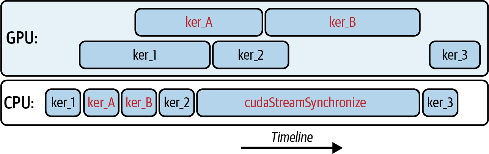
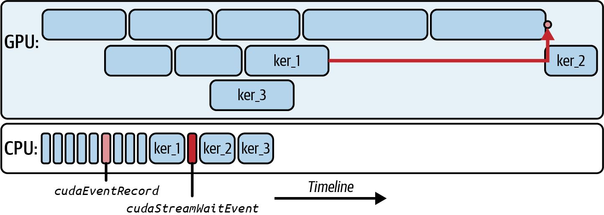
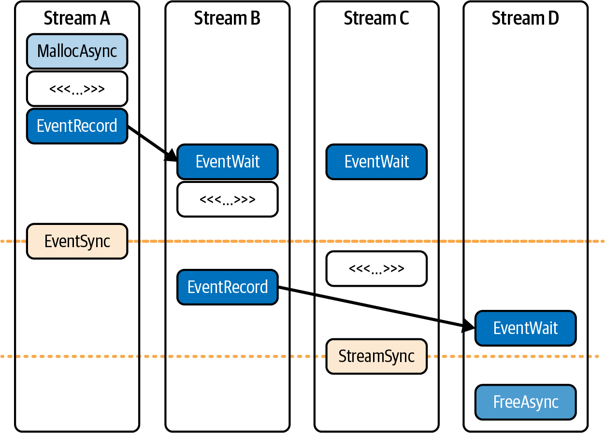
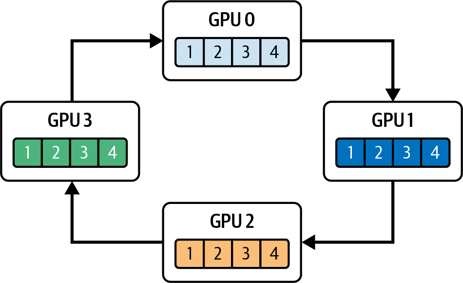
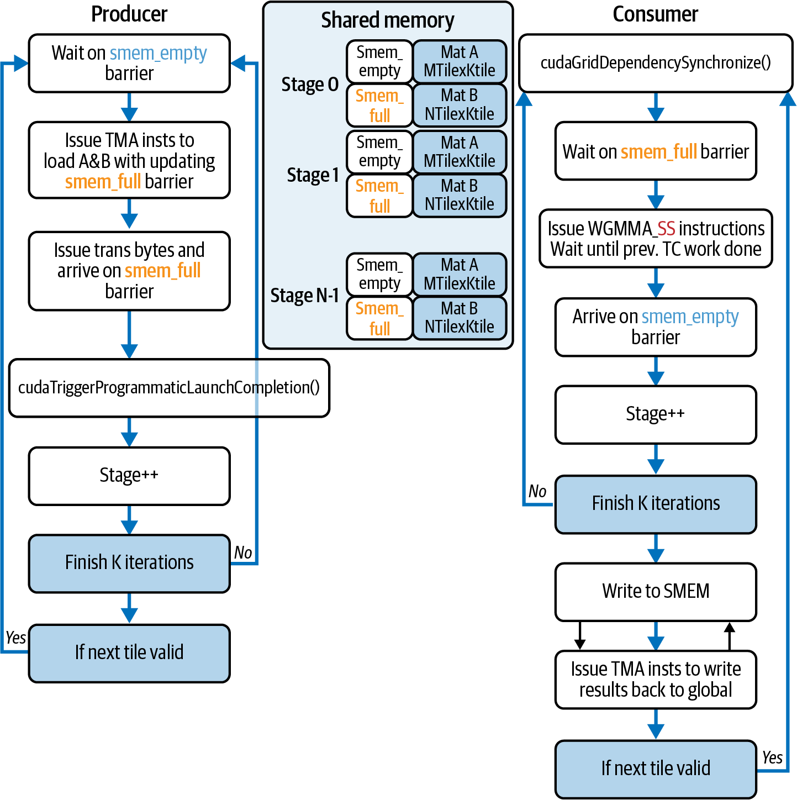
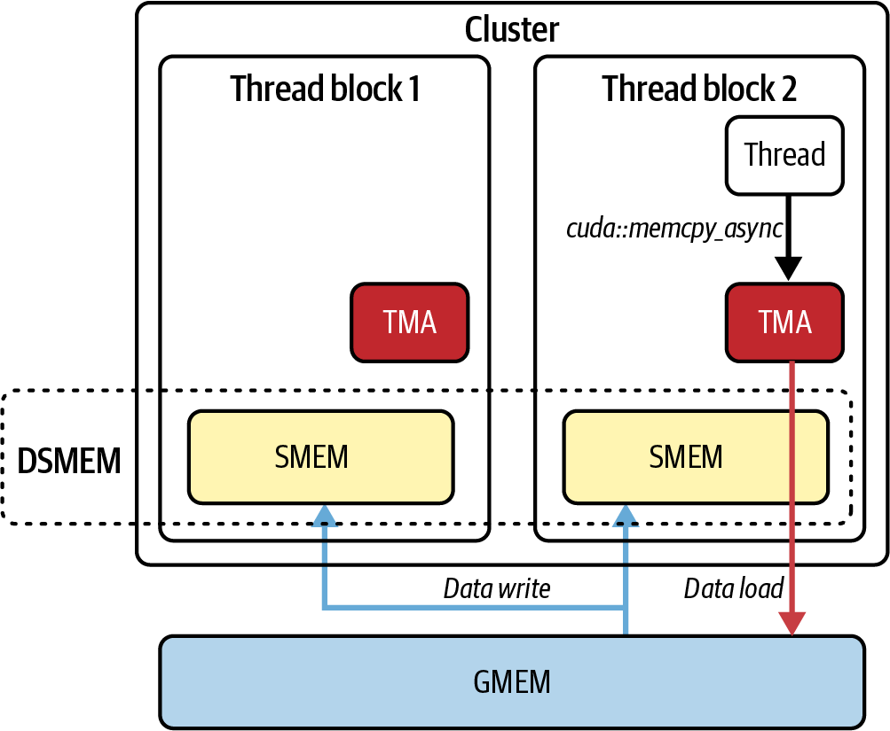

# 第11章 内核间流水线、同步和CUDA流有序内存分配 (Inter-Kernel Pipelining, Synchronization, and CUDA Stream-Ordered Memory Allocations)

到目前为止，我们专注于内核内工具——cuda::pipeline双缓冲、线程束专用化（加载器/计算器/存储器线程束）、持久内核以及带有DSMEM/TMA的线程块集群——以保持单个内核的SM忙碌。在本章中，我们保留这些内核，并展示如何使用CUDA流、事件和流有序内存分配器在内核和批次之间进行流水线处理。简而言之，第10章专注于隐藏内核内的延迟。本章展示如何隐藏内核之间以及GPU与主机之间的延迟。

这种内核间并发对于在实际工作负载中保持所有GPU引擎忙碌至关重要。为了在现代GPU上实现峰值GPU利用率，我们需要让GPU的计算引擎和直接内存访问（DMA）引擎保持忙碌并并行运行。CUDA流为这种内核间并发提供了基础。通过结合异步内存操作、细粒度同步和CUDA图（本章简要介绍，下一章详细介绍），您可以构建高效避免主机端停顿的流水线。

> So far, we have focused on the intra-kernel tools—cuda::pipeline double-buffering, warp specialization (loader/compute/storer warps), persistent kernels, and thread-block clusters with DSMEM/TMA—to keep the SMs busy for a single kernel. In this chapter we keep those kernels and show how to pipeline across kernels and batches with CUDA streams, events, and the stream-ordered memory allocator. In short, Chapter 10 focused on hiding latency within a kernel. This chapter shows how to hide latency between kernels and between the GPU and the host. This kind of inter-kernel concurrency is essential for keeping all of the GPU's engines busy in real-world workloads. To achieve peak GPU utilization with modern GPUs, we need to keep the GPU's compute engines and direct memory access (DMA) engines busy and running in parallel. CUDA streams provide the foundation for this inter-kernel concurrency. By combining asynchronous memory operations, fine-grained synchronization, and CUDA Graphs (briefly introduced in this chapter and covered in more detail in the next chapter), you can construct highly efficient pipelines that avoid host-side stalls.

## 使用CUDA流重叠内核执行 (Overlapping Kernel Execution with CUDA Streams)

CUDA流是一系列操作——内核启动、内存复制和内存分配——按照它们发出的顺序执行。考虑使用2个流从CPU向GPU启动5个内核，如图11-1所示。


> Figure 11-1. Launching five kernels from the CPU onto the two streams running on the GPU

在这里，我们看到ker_A和ker_B在流2上运行，而ker_1、ker_2和ker_3在流1上运行。只要硬件资源允许，所有内核都可以相互重叠——并且可以跨CUDA流重叠。

CPU能够继续执行工作（cpu_code_1和cpu_code_2），而流异步执行内核操作。在这两个CUDA流上启动这五个内核的代码如下所示：

```cpp
#include <cstdio>
#include <cuda_runtime.h>

__global__ void ker_A()  { /* ... do some work ... */ }
__global__ void ker_B()  { /* ... do some work ... */ }

__global__ void ker_1()  { /* ... do some work ... */ }
__global__ void ker_2()  { /* ... do some work ... */ }
__global__ void ker_3()  { /* ... do some work ... */ }

int main() {
    // 1) 创建两个CUDA流
    cudaStream_t stream1, stream2;
    cudaStreamCreateWithFlags(&stream1, cudaStreamNonBlocking);
    cudaStreamCreateWithFlags(&stream2, cudaStreamNonBlocking);

    // 2) 定义您的网格/块大小
    dim3 grid(128);
    dim3 block(256);

    // 3) 在stream1上启动ker_1
    ker_1<<<grid, block, 0, stream1>>>();

    // 4) CPU代码1立即运行（相对于GPU异步）
    printf("CPU code 1 executing\n");

    // ... 在这里做一些主机端工作 ...
    cpu_code_1();

    // 5) 在stream2上启动ker_A
    ker_A<<<grid, block, 0, stream2>>>();

    // 6) 在stream1上启动ker_B
    ker_B<<<grid, block, 0, stream1>>>();

    // 7) 在stream2上启动ker_2
    ker_2<<<grid, block, 0, stream2>>>();

    // 8) CPU代码2立即运行
    printf("CPU code 2 executing\n");

    // ... 在这里做一些其他主机端工作 ...
    cpu_code_2();

    // 9) 在stream1上启动ker_3
    ker_3<<<grid, block, 0, stream1>>>();

    // 10) 等待每个流上的工作完成
    cudaStreamSynchronize(stream1);
    cudaStreamSynchronize(stream2);

    // 11) 清理
    cudaStreamDestroy(stream1);
    cudaStreamDestroy(stream2);

    return 0;
}
```

ker_1被加入stream1的队列，然后控制权立即返回给CPU。cpu_code_1()在主机上运行，而ker_1在GPU上执行。同时，我们将ker_A加入stream2的队列，将ker_B加入stream1的队列。然后我们将ker_2加入stream2的队列，交错执行cpu_code_2，并将ker_3加入stream1的队列。最后，我们在每个流上同步以等待所有工作完成，然后销毁流以清理资源。

> ker_1 is enqueued on stream1, then control returns immediately to the CPU. cpu_code_1() runs on the host while ker_1 executes on the GPU. Meanwhile, we enqueue ker_A on stream2 and ker_B on stream1. We then enqueue ker_2 on stream2, interleave cpu_code_2, and enqueue ker_3 on stream1. Finally, we synchronize on each stream to wait for all of the work to complete and then destroy the streams to clean up the resources.

这个示例突出了五个不同的内核执行在两个不同的流之间重叠。稍微增加一点复杂性，并在第10章的基础上构建，以下是使用CUDA流的相同线程束专用化流水线示例：

```cpp
// 在多个CUDA流中运行线程束专用化内核。

#include <cuda_runtime.h>
#include <cuda/pipeline>
#include <cooperative_groups.h>
namespace cg = cooperative_groups;

#define TILE_SIZE 128
#define TILE_ELEMS (TILE_SIZE * TILE_SIZE)

// 从第10章重用
__global__ void warp_specialized_pipeline(const float* __restrict__ A_global,
                                          const float* __restrict__ B_global,
                                          float*       __restrict__ C_global,
                                          int numTiles);

int main() {
    const int NUM_STREAMS = 2;                   // 保持较小；根据需要调整
    const int batches     = 8;                   // 正在处理的批次

    const size_t elems    = TILE_ELEMS;          // 每批次的元素数
    const size_t bytes    = elems * sizeof(float);

    // 创建不同步于传统默认流的流
    cudaStream_t s[NUM_STREAMS];
    for (int i = 0; i < NUM_STREAMS; ++i)
        cudaStreamCreateWithFlags(&s[i], cudaStreamNonBlocking);

    // 分配固定主机缓冲区，以便H2D/D2H可以真正重叠
    float *hA = nullptr, *hB = nullptr, *hC = nullptr;
    cudaMallocHost(&hA, batches * bytes);
    cudaMallocHost(&hB, batches * bytes);
    cudaMallocHost(&hC, batches * bytes);

    // ... 初始化hA/hB ...

    for (int b = 0; b < batches; ++b) {
        const int sid = b % NUM_STREAMS;

        float *dA = nullptr, *dB = nullptr, *dC = nullptr;
        cudaMallocAsync(&dA, bytes, s[sid]);
        cudaMallocAsync(&dB, bytes, s[sid]);
        cudaMallocAsync(&dC, bytes, s[sid]);

        cudaMemcpyAsync(dA, hA + b * elems, bytes, 
                        cudaMemcpyHostToDevice, s[sid]);
        cudaMemcpyAsync(dB, hB + b * elems, bytes, 
                        cudaMemcpyHostToDevice, s[sid]);

        const dim3 block(96);    // 三个线程束：加载器(0)、计算器(1)、存储器(2)
        const dim3 grid(1);
        const size_t shmem = 3 * elems * sizeof(float); // 每个块[A|B|C]

        // 完全按原样重用第10章的内核
        warp_specialized_pipeline<<<grid, block, shmem, s[sid]>>>(
            dA, dB, dC, 
            /*numTiles=*/1);

        cudaMemcpyAsync(hC+b*elems, dC, bytes, 
                        cudaMemcpyDeviceToHost, s[sid]);

        cudaFreeAsync(dA, s[sid]);
        cudaFreeAsync(dB, s[sid]);
        cudaFreeAsync(dC, s[sid]);
    }

    for (int i = 0; i < NUM_STREAMS; ++i) {
        cudaStreamSynchronize(s[i]);
        cudaStreamDestroy(s[i]);
    }

    cudaFreeHost(hA); cudaFreeHost(hB); cudaFreeHost(hC);
    return 0;
}
```

在这里，我们重用线程束专用化流水线，并展示流如何添加第二层重叠，使得当流1计算批次n时，流2正在对批次b+1执行DMA加载。同时，它可以复制回批次b-1。内核内部的cuda::pipeline重叠保持不变。

> Here, we are re-using the warp-specialized pipeline and showing how streams add a second layer of overlap such that while stream 1 computes on batch n, stream 2 is performing DMA-loads on batch b+1. At the same time, it can copy back batch b−1. The kernel's internal cuda::pipeline overlap remains unchanged.

我们将在本章后面继续增加复杂性，通过加入线程块集群，但首先让我们深入了解流如何帮助重叠计算和数据传输。这将有助于巩固CUDA流的基础知识及其在基于GPU的性能工程中的作用。

> We'll continue to build out the complexity later in the chapter by layering in thread block clusters, but let's first dive into how streams help to overlap compute with data transfers. This will help solidify the fundamentals of CUDA streams and their role in GPU-based performance engineering.

### 使用流重叠计算和数据传输 (Using Streams to Overlap Compute with Data Transfers)

例如，您可以将每个内核启动和内存复制加入其自己的流中。这允许SM执行内核，而两个专用DMA引擎（一个用于主机→设备传输，一个用于设备→主机传输）并发移动数据。

由于SM计算流水线独立于两个DMA引擎运行，您可以使用CUDA流完全重叠内核的计算与两个数据传输。但是，如果计算被使用所有SM吞吐量的内核完全最大化——或者复制流水线因过多的额外重叠而使内存带宽饱和——则不会提高性能。

> For instance, you can enqueue each kernel launch and memory copy into its own stream. This allows the SMs to execute kernels while the two dedicated DMA engines (one for Host → Device transfers and one for Device → Host transfers) move data concurrently. Since the SM compute pipeline runs independently of the two DMA engines, you can fully overlap the kernel's computation with the two data transfers using CUDA streams. However, if the compute is fully maxed out by a kernel using all SM throughput—or a copy pipeline is saturating the memory bandwidth with excessive, additional overlapping—it will not improve performance.

当计算和内存吞吐量饱和时，您将开始看到两个并发操作各自以50%运行，例如，因为它们都在争用同一资源。您可以分析GPU利用率以识别这些饱和阈值。

> When compute and memory throughput are saturated, you'll start seeing two concurrent operations each running at 50%, for instance, since they are both contending for the same resource. You can profile GPU utilization to identify these saturation thresholds.

例如，考虑一个将工作分成批次的AI模型训练或推理工作负载。在这里，您将在流0中启动批次0的内核，同时流1调用cudaMemcpyAsync()将批次1从主机复制到设备，如图11-2所示。


> Figure 11-2. Timeline of three-way overlap

在具有至少两个复制引擎的现代GPU上（deviceProp.asyncEngineCount()），您可以将其扩展为三重重叠，使得流0运行批次0的内核，流1将批次1从主机复制到设备，流2将前一批次的结果写回主机。这可以扩展到更多流。这种模式将数据传输延迟隐藏在计算之后，反之亦然，使所有GPU引擎保持忙碌并最小化空闲时间。

> On modern GPUs with at least two copy engines (deviceProp.asyncEngineCount()), you can extend this to a three-way overlap such that stream 0 runs the kernel for batch 0, stream 1 copies batch 1 host to device, and stream 2 writes the results of the previous batch back to the host. This extends to additional streams. This pattern hides data‐transfer latency behind computation, and vice versa, keeping all of the GPU's engines busy and minimizing idle time.

在实践中，您的内核必须满足几个要求才能实现这种并发行为。首先，异步传输中使用的任何主机指针必须是页锁定的，或称为固定的。如果您在可分页内存上调用cudaMemcpyAsync()，运行时将执行主机端暂存复制到固定内存，这会阻塞调用主机线程和入队流，直到暂存完成。

> In practice, your kernel must meet several requirements to achieve this concurrent behavior. First, any host pointer used in an asynchronous transfer must be page-locked, or pinned. If you call cudaMemcpyAsync() on pageable memory, the runtime performs a host-side staging copy into pinned memory that blocks the calling host thread and the enqueuing stream until staging completes.

这会阻止该传输成为异步的。虽然这会阻塞调用主机线程，但GPU仍然可以在其他流中重叠计算和复制。但该特定传输将无法正确重叠。要在流中实现完全异步传输，您必须使用固定主机内存。

> This prevents that transfer from being asynchronous. While this blocks the calling host thread, the GPU can still overlap compute and copies in other streams. But that specific transfer will not overlap correctly. To achieve fully asynchronous transfers in your stream, you must use pinned host memory.

> 通过在PyTorch的DataLoader中设置pin_memory=True，您正在页锁定主机缓冲区，以便数据可以使用DMA直接传输到GPU内存。这允许复制与计算重叠并立即将控制权返回给主机。DMA引擎可以将传输与计算重叠。可分页内存会强制进行隐藏的暂存复制，并使该传输无法重叠。

其次，您应该使用异步分配和释放例程cudaMallocAsync()和cudaFreeAsync()，而不是同步和阻塞的cudaMalloc()或cudaFree()调用。像PyTorch这样的框架提供了使用CUDA异步、流有序内存分配器的选项。其目的是在分配内存时不停止所有活动流。这对性能非常不利。

> Second, you should use the asynchronous allocation and deallocation routines, cudaMallocAsync() and cudaFreeAsync(), instead of the synchronous and blocking cudaMalloc() or cudaFree() calls. Frameworks like PyTorch provide the option to use CUDA's asynchronous, stream-ordered memory allocator. The idea is to not stall all active streams when you allocate memory. This would be very bad for performance.

异步流有序分配器允许每个流请求或返回设备内存，而无需等待其他流。使用异步分配器可确保一个流中的内存操作不会停止其他流中的操作。这将避免不必要的全局同步。让我们在下一节中探讨流有序内存分配器。

> The asynchronous stream-ordered allocator allows each stream to request or return device memory without waiting on other streams. Using the asynchronous allocator ensures memory operations in one stream don't stall operations in other streams. This will avoid unnecessary global synchronization. Let's explore the stream-ordered memory allocator in the next section.

> PyTorch的默认CUDA缓存分配器是流感知的，在正常操作中（例如，从其缓存服务分配请求），它避免设备范围的同步。只有当它必须使用cudaMalloc从操作系统请求更多内存时，才会发生同步。在实践中，这意味着大多数张量分配和释放不会阻塞其他流。启用cudaMallocAsync后端可以进一步减少碎片化并在许多工作负载中提高重用率，如下所示。

## 流有序内存分配器 (Stream-Ordered Memory Allocator)

在PyTorch中，您可以通过在启动PyTorch脚本之前设置环境变量PYTORCH_ALLOC_CONF=backend:cudaMallocAsync来启用CUDA的流有序分配器。如果设置了此变量，PyTorch张量内存分配（cudaMallocAsync()）和释放（cudaFreeAsync()）操作将按照它们被调用的顺序加入单独的CUDA流中。当未设置此环境变量时，PyTorch使用其自己的缓存分配器。

> In PyTorch, you can enable CUDA's stream‐ordered allocator by setting the environment variable PYTORCH_ALLOC_CONF=backend:cudaMallocAsync before launching your PyTorch script. If this variable is set, PyTorch tensor memory allocation (cudaMallocAsync()) and free (cudaFreeAsync()) operations are enqueued in separate CUDA streams in the order in which they are invoked. When this environment variant is not set, PyTorch uses its own caching allocator.

如果您使用传统的cudaMalloc(...)，请记住它是一个阻塞的、设备范围的操作，在返回之前会同步设备。这可能会停止其他流中的工作，因为每次分配都会强制整个GPU停止，直到内存被保留。这会暂停所有流，限制并行性，并破坏工作负载的性能。

> If you use the legacy cudaMalloc(...), remember that it's a blocking, device-wide operation that synchronizes the device before returning. This can stall work in other streams since every allocation forces the entire GPU to stall until the memory is reserved. This pauses all streams, limits parallelism, and destroys your workload's performance.

相比之下，使用流有序分配器和cudaMallocAsync(...)只是将分配请求记录在将使用它的同一个CUDA流中——无论该流是执行内核还是内存操作。它不会阻塞其他流。这样，内存管理永远不会序列化那些向内核提供数据的流。

> In contrast, using the stream‐ordered allocator with cudaMallocAsync(...) simply records the allocation request in the same CUDA stream that will use it—whether the stream is performing a kernel or memory operation. It will not block the other streams. This way, memory management never serializes streams that are feeding those kernels.

> CUDA的流有序分配器在PyTorch中使用，避免了全局设备锁并减少了分配开销。

在实践中，流0可能正在批次N上执行注意力内核，流1将批次N+1从主机复制到设备，流2为批次N+2加入cudaMallocAsync(...)请求。因为cudaMallocAsync(...)只是将其工作追加到流2的队列中，流0和流1继续执行而不中断。

> In practice, stream 0 might be executing an attention kernel on batch N, stream 1 copies batch N+1 from host to device, and stream 2 enqueues a cudaMallocAsync(...) for batch N+2. Because cudaMallocAsync(...) simply appends its work into stream 2's queue, streams 0 and 1 continue without interruption.

使用流感知分配器，每个小批次的GPU内存在不阻塞其他流的情况下分配。这对于为每个批次分配临时空间的LLM流水线很重要。异步分配器可以防止停顿——即使在严重的内存变动下。

> With the stream-aware allocator, GPU memory for each mini-batch is allocated without blocking other streams. This is important for LLM pipelines that allocate per-batch scratch space. The asynchronous allocator prevents stalls—even under heavy memory churn.

> 使用流有序内存分配器对于您的流水线为每个小批次分配临时缓冲区的情况特别重要——这在LLM训练和推理中很常见。例如，LLM流水线中的每个小批次需要自己的临时工作空间来保存注意力键/值或中间激活缓冲区。在这种情况下，您经常调用分配器在GPU上保留该"临时缓冲区"。

分配是从每个设备的内存池中满足的。您可以使用cudaMemPoolSetAttribute()调整池的释放阈值，以权衡将内存返回给操作系统还是重用以提高性能。较高的阈值意味着池将保持内存分配更长时间。这将减少内存返回给操作系统的次数。这导致更少的操作系统调用和更好的性能，避免重复的内存分配和释放。

> Allocations are satisfied from a per-device memory pool. You can tune the pool's release threshold using cudaMemPoolSetAttribute() to trade off returning memory to the OS versus reusing it for performance. A higher threshold means the pool will keep memory allocated longer. This will reduce the number of times the memory is returned back to the OS. This leads to fewer OS calls and better performance by avoiding repetitive memory allocations and de-allocations.

以下示例展示了如何使用流有序内存分配器（cudaMallocAsync和cudaFreeAsync）实现基于流的重叠，并演示了cudaMemPoolSetAttribute()的使用。这突出了如何使用CUDA流完全流水线化内存分配、数据传输和内核执行：

```cpp
// 初始化异步内存分配器
cudaMemPool_t pool;
int device = -1;
cudaGetDevice(&device); // 当前设备
cudaDeviceGetDefaultMemPool(&pool, device);

// 在释放回操作系统之前保留在池中的所需字节数
// （根据需要调整）
uint64_t threshold =/* 例如，prop.totalGlobalMem / 2 */; // 字节

cudaMemPoolSetAttribute(pool, 
  cudaMemPoolAttrReleaseThreshold, &threshold);

cudaStream_t stream1, stream2;
cudaStreamCreateWithFlags(&stream1, cudaStreamNonBlocking);
cudaStreamCreateWithFlags(&stream2, cudaStreamNonBlocking);

// 使用流有序异步分配分配内存
void *d_data1, *d_result1;
void *d_data2, *d_result2;

size_t dataSizeBytes = N * sizeof(float);

// 在现代多流应用中使用cudaMallocAsync作为最佳实践
cudaMallocAsync(&d_data1, dataSizeBytes, stream1);
cudaMallocAsync(&d_result1, dataSizeBytes, stream1);
cudaMallocAsync(&d_data2, dataSizeBytes, stream2);
cudaMallocAsync(&d_result2, dataSizeBytes, stream2);

// 在stream1中异步复制第一个数据块并启动其内核
cudaMemcpyAsync(d_data1, h_data1, dataSizeBytes, 
  cudaMemcpyHostToDevice, stream1);
computeKernel<<<gridDim, blockDim, 0, 
  stream1>>>((float*)d_data1, (float*)d_result1);
cudaMemcpyAsync(h_result1, d_result1, dataSizeBytes,
  cudaMemcpyDeviceToHost, stream1);

// 同时，在stream2上执行相同操作
cudaMemcpyAsync(d_data2, h_data2, dataSizeBytes, 
                cudaMemcpyHostToDevice, stream2);
computeKernel<<<gridDim, blockDim, 0, 
  stream2>>>((float*)d_data2, (float*)d_result2);
cudaMemcpyAsync(h_result2, d_result2, dataSizeBytes,
   cudaMemcpyDeviceToHost, stream2);

// 等待两个流完成
cudaStreamSynchronize(stream1);
cudaStreamSynchronize(stream2);

// 清理
cudaFreeAsync(d_data1, stream1);
cudaFreeAsync(d_result1, stream1);
cudaFreeAsync(d_data2, stream2);
cudaFreeAsync(d_result2, stream2);

cudaStreamDestroy(stream1);
cudaStreamDestroy(stream2);
```

在这里，我们创建两个CUDA流（stream1和stream2），并使用cudaMallocAsync分配设备内存，确保每个流都有自己的流有序内存缓冲区。然后我们为两个独立的数据块发出工作。

> Here, we create two CUDA streams (stream1 and stream2) and allocate device memory using cudaMallocAsync, ensuring that each stream has its own stream-ordered memory buffers. We then issue work for two independent data chunks.

在stream1上，我们执行从主机到设备的异步复制（H2D），启动计算内核，然后异步将结果从设备复制回主机（D2H）。同时，我们在stream2上对第二块数据执行相同操作。

> On stream1, we perform an asynchronous copy from host to device (H2D), launch a compute kernel, and then asynchronously copy the results back from device to host (D2H). Simultaneously, we do the same for a second chunk of data on stream2.

因为这些操作是在单独的流中发出的，GPU设备可以在它们之间重叠工作。stream1与stream2上的H2D复制并发执行内核。一旦stream1的内核完成，它可以与stream2的内核执行重叠将数据复制回主机（D2H）。

> Because these operations are issued on separate streams, the GPU device overlaps work between them. stream1 executes the kernel concurrently with the H2D copy on stream2. Once the stream1 kernel completes, it can copy the data back to the host (D2H) overlapping with stream2's kernel execution.

在这里，由于CUDA流和流有序内存分配，内存分配与内核计算重叠。此示例中显示的交错调度减少了空闲时间并最大化了吞吐量。如果没有流有序分配，您要么必须预先分配所有内存——增加内存占用——要么承受严重的同步惩罚。

> Here, the memory allocations overlap with kernel computations thanks to CUDA streams and stream-ordered memory allocations. The staggered scheduling shown in this example reduces idle time and maximizes throughput. Without stream-ordered allocation, you'd either have to allocate all the memory upfront—increasing memory footprint—or incur heavy synchronization penalties.

使用cudaMallocAsync，内存管理无缝集成到CUDA流中。这允许每个流的分配和释放，而不会触发全局设备同步。

> With cudaMallocAsync, memory management is seamlessly integrated into CUDA streams. This allows per-stream allocations and deallocations without triggering a global device synchronization.

此外，流有序分配器允许您为可变长度缓冲区（如令牌缓存或中间激活）发出细粒度内存请求。然后您可以立即启动依赖于这些缓冲区的内核。这一切都在同一个流中发生。

> In addition, the stream‐ordered allocator lets you issue fine‐grained memory requests for variable‐length buffers—such as token caches or intermediate activations. You can then immediately launch kernels that depend on those buffers. This happens all within the same stream.

> 在实践中，实现峰值吞吐量需要仔细调整数据块大小并保持在GPU的并发限制内。现代GPU设备提供多个复制引擎，可以重叠主机到设备（H2D）和设备到主机（D2H）传输。查询deviceProp.asyncEngineCount以确定您的设备支持多少个复制引擎，以便相应地规划重叠。

现代GPU对设备上所有SM可以并发运行的内核数量有硬性限制（最高128个驻留网格限制）。如第5章所述，现代GPU限制是每个设备128个并发执行的内核。一旦超过活动内核的限制，额外的内核启动将排队，直到SM上的一个槽位释放。

> Modern GPUs have a hard limit for the number of concurrent kernels that can run across all SMs on a device (up to the 128 resident-grid limit.) As discussed in Chapter 5, the modern GPU limit is 128 concurrently executing kernels per device. Once you exceed the limit of active kernels, additional kernel launches will queue until a slot frees up on one of the SMs.

请记住，共享SM的内核只有在它们的组合寄存器、共享内存和线程块需求适合SM的资源限制时才会一起执行。平衡块（瓦片）大小、启动顺序和每个内核的资源使用是至关重要的。

> And remember that kernels that share an SM will only execute together if their combined registers, shared memory, and thread block requirements fit within the SM's resource limits. Balancing chunk (tile) sizes, launch order, and per‐kernel resource usage is essential.

如果块太小，您将无法充分利用复制引擎和SM资源。如果块太大或同时加入队列的内核太多，您将超过内核槽位或耗尽每SM资源。这将导致停顿。

> If chunks are too small, you will underutilize the copy engines and SM resources. If chunks are too large or too many kernels are enqueued simultaneously, you will exceed kernel slots or exhaust per‐SM resources. This will lead to stalls.

简而言之，当正确调整时，CUDA流结合流有序内存分配器（cudaMallocAsync）将确保数据传输、内核执行和内存管理无缝重叠。这使多个DMA引擎和SM保持忙碌，而无需不必要的排队。

> In short, when tuned correctly, however, CUDA streams, combined with the stream-ordered memory allocator (cudaMallocAsync), will ensure that data transfers, kernel execution, and memory management will overlap seamlessly. This keeps the multiple DMA engines and SMs busy without unnecessary queuing.

### 在LLM中使用CUDA流和流有序内存分配器 (Using CUDA Streams and Stream-Ordered Memory Allocator with LLMs)

CUDA流的非阻塞行为结合流有序内存分配器对于LLM训练和推理工作负载至关重要。这些工作负载在多个流之间重叠计算和数据移动，以增加GPU利用率并减少端到端延迟。

> The nonblocking behavior of CUDA streams combined with the stream-ordered memory allocator is crucial for LLM training and inference workloads. These workloads overlap computation and data movement across multiple streams to increase GPU utilization and reduce end‐to‐end latency.

此外，LLM利用即时"临时内存"分配，这由上一节讨论的流有序内存分配器促进。例如，在运行transformer层时，您经常需要额外的共享内存或设备内存，称为临时内存，用于在将矩阵乘法结果输入softmax操作之前存储它们。

> In addition, LLMs utilize on-the-fly "scratch memory" allocations, which are facilitated by the stream-ordered memory allocator discussed in the previous section. For instance, when running a transformer layer, you often need extra shared memory or device memory, called scratch memory, to store the results of a matrix multiply before feeding it into the softmax operation.

由于LLM工作负载中的不同小批次可能具有不同的长度（令牌计数），您将希望使用流有序内存分配器为每个输入批次专门在GPU上提供新的临时缓冲区。这样，您为该批次的中间计算分配了恰好足够的空间——不多一个字节。

> Because different mini‐batches in LLM workloads can vary in length (token count), you will want to use the stream-ordered memory allocator to provide a fresh scratch buffer on the GPU specifically for each input batch. This way, you have exactly enough space allocated for that batch's intermediate computations—and not a single byte more.

如果您使用旧的、阻塞的分配API（cudaMalloc(...)和cudaFree(...)）即时分配这些临时缓冲区，每次分配或释放都会与整个GPU同步，因为调用cudaMalloc(...)会强制进行全局设备同步。因此，在所有待处理的内核和复制完成之前，无法进行重叠。

> If you use the old, blocking allocation API (cudaMalloc(...) and cudaFree(...)) to allocate these scratch buffers on the fly, every single allocation or deallocation would synchronize with the entire GPU since calling cudaMalloc(...) forces a global device synchronization. As such, no overlap is possible until all pending kernels and copies finish.

> 全局设备同步对性能绝对是灾难性的。避免在CUDA流中使用阻塞调用如cudaMalloc()和cudaFree()。优先使用事件和流等待。并且绝对避免使用cudaStreamSynchronize(0)在默认流0上同步！

在一个流水线中，当一个流正忙于为批次N运行注意力内核，而另一个流正在为注意力内核准备批次N+1时，在第二个流上调用阻塞的cudaMalloc(...)将停止所有流。直到分配器完成，每个SM实际上都被暂停。这可能会消除您希望在数据传输、计算和内存管理之间实现的任何重叠。

> In a pipeline where one stream is busy running an attention kernel for batch N and another stream is preparing batch N+1 for the attention kernel, calling a blocking cudaMalloc(...) on the second stream will stall all streams. Until the allocator finishes, every SM is effectively paused. This can wipe out any overlap you hoped to achieve between data transfers, computation, and memory management.

解决方案是使用流有序分配器和cudaMallocAsync()和cudaFreeAsync()。这些API在流级别加入分配和释放设备内存区域的工作。因此，它们仅在流级别同步——而不是设备级别。

> The solution is to use the stream‐ordered allocator with cudaMallocAsync() and cudaFreeAsync(). These APIs enqueue the work of allocating and freeing regions of device memory at the stream level. As such, they synchronize only at the stream level—and not the device level.

例如，考虑一个需要为一批输入数据的注意力分配16 MB临时缓冲区的流。它将调用cudaMallocAsync(&scratchPtr, scratchBytes, stream1)，这会将其分配请求记录在其操作队列中，但不会强制任何其他流等待，如图11-3所示。


> Figure 11-3. Stream-ordered memory allocation

其他流继续启动内核、复制数据或执行它们正在做的任何操作——即使流1的分配正在进行中。一旦CUDA运行时在幕后保留了内存，流1可以再次取得进展并将注意力内核启动到新分配的区域——所有这些都不会停止任何其他流。

> The other streams continue launching kernels, copying data, or doing whatever they were doing—even while stream 1's allocation is in flight. And once the CUDA runtime has reserved the memory behind the scenes, stream 1 can make progress again and launch the attention kernel into that newly allocated region—all without halting any other streams.

> 与传统的cudaMalloc不同，cudaMallocAsync不会停止其他流。每个分配仅在其自己的流内同步。

在LLM训练和推理的上下文中，这特别有价值，因为可变长度序列通常会产生临时缓冲区大小波动。如果批次N每个序列有512个令牌，而批次N+1有1,024个令牌，您的注意力模块将需要比批次N更多的空间用于批次N+1，因此重用批次N的分配是不够的。使用cudaMallocAsync()，您可以为较大的缓冲区加入单个非阻塞分配，而不会使所有其他流停止。

> In the context of LLM training and inference, this is particularly valuable because variable‐length sequences often produce scratch‐buffer size fluctuations. If batch N has 512 tokens per sequence and batch N+1 has 1,024 tokens, your attention module will need more space for batch N+1 than batch N, so reusing batch N's allocation is not sufficient. With cudaMallocAsync(), you can enqueue a single, nonblocking allocation for the larger buffer without dragging all other streams to a stop.

此外，典型LLM的自回归逐令牌生成（又称解码）阶段使用不断增长的键/值缓存。每个生成的令牌需要将新的KV对追加到每个序列的缓冲区。随着缓冲区的增长，您需要重新分配或扩展临时区域。

> Additionally, a typical LLM's autoregressive token‐by‐token generation (aka decoding) phase uses a growing key/value cache. Each generated token requires appending new KV pairs to a per‐sequence buffer. As the buffer grows, you need to reallocate or extend the scratch region.

cudaMallocAsync(...)允许您在运行注意力内核的同一个流中执行此操作。同时，上游数据加载和下游结果复制操作继续在其自己的流中并行进行。

> cudaMallocAsync(...) lets you do this in the same stream that runs the attention kernel. Meanwhile, upstream data‐loading and downstream result‐copying operations continue making progress in parallel, running in their own streams.

CUDA流在LLM上下文中的另一个用途是大型LLM中的逐层流水线。假设您将一个大型基于transformer的LLM模型分成两半，在不同的CUDA流上运行——流0运行层0-5，流1运行层6-11。在这两半之间，您需要用于激活的中间缓冲区。

> Another use of CUDA streams in an LLM context is layerwise pipelining in large LLMs. Suppose that you divide a large, transformer-based LLM model into two halves that run on different CUDA streams—stream 0 runs layers 0–5 and stream 1 runs layers 6–11. Between these halves, you need intermediate buffers for activations.

每次流0完成一个小批次的工作时，它可能会调用cudaMallocAsync(...)为下一批次的激活获取新缓冲区。因为该调用不会同步设备，流1可以继续计算前一批次结果的层6-11，而流0为下一批次的输入分配内存。

> Each time stream 0 finishes its work on a mini‐batch, it might call cudaMallocAsync(...) to grab a new buffer for the next batch's activations. Because that call does not synchronize the device, stream 1 can continue computing layers 6–11 on the previous batch's results while stream 0 allocates memory for the next batch's inputs.

相比之下，如果您在该流水线中使用传统的cudaMalloc(...)，每次为下一个小批次或扩展的KV缓存分配新的临时区域时，整个GPU都会暂停，直到分配完成。这将破坏跨流重叠计算和数据移动的任何机会。

> By contrast, if you had used the legacy cudaMalloc(...) inside that pipeline, every time you allocated a new scratch region for the next mini‐batch or an expanded KV cache, the entire GPU would pause until the allocation completed. That would break any chance of overlapping computation and data movement across streams.

总之，在LLM上下文中，您经常需要用于注意力、层归一化、softmax、KV缓存或中间激活的临时缓冲区。这些统称为临时缓冲区。

> To summarize, in an LLM context, you frequently need temporary buffers for attention, layer normalization, softmax, KV cache, or intermediate activations. These are collectively referred to as a scratch buffer.

使用cudaMallocAsync(...)和cudaFreeAsync(...)在单独的流中管理这些临时缓冲区，可确保内存管理永远不会强制进行全局的跨流停顿。相反，分配加入与您的内核或复制操作相同的流中。

> Using cudaMallocAsync(...) and cudaFreeAsync(...) to manage these scratch buffers within separate streams ensures that memory management never forces a global, cross‐stream stall. Instead, the allocation enqueues into the same stream as your kernel or copy operation.

这允许所有其他流继续运行，并使您的注意力内核、数据传输和任何主机端工作尽可能重叠。这最大化了大规模实时LLM工作负载中的GPU利用率。

> This allows all other streams to continue running and keeps your attention kernels, data transfers, and any host‐side work overlapping as much as possible. This maximizes GPU utilization in large‐scale, real‐time LLM workloads.

## 传统默认流 (Legacy Default Stream)

当您没有显式创建或指定流时，操作会进入传统默认流，通常称为流0。默认情况下，流0有两个值得强调的重要行为：

> When you do not explicitly create or specify a stream, the operations go into the legacy default stream, often called stream 0. By default, stream 0 has two important behaviors that are worth highlighting:

**与自身的隐式同步**
加入流0的任何两个操作严格地一个接一个执行。您无法在流0中重叠两个内核或一个复制和一个内核，因为流0序列化其所有自己的命令。

> **Implicit synchronization with itself** - Any two operations enqueued into stream 0 execute strictly one after the other. You cannot overlap two kernels or a copy and a kernel in stream 0, because stream 0 serializes all of its own commands.

**与其他流的隐式同步**
在传统默认流模型中，任何启动到流0的操作都会在开始之前等待每个其他流中所有先前加入的工作完成。相反，任何启动到非默认流的操作也会阻塞，直到流0中的所有先前工作完成。实际上，流0充当整个GPU的全局"屏障"。即使您将命令发出到不同的流中，一旦您向流0提交某些内容，它就会强制每个其他流停止，直到流0赶上，反之亦然。这对性能非常不利，应尽可能避免。

> **Implicit synchronization with other streams** - In the legacy default stream model, any operation launched into stream 0 will wait for all previously enqueued work in every other stream to finish before it begins. Conversely, any operation launched into a nondefault stream will also block until all prior work in stream 0 has completed. In effect, stream 0 acts as a global "barrier" across the entire GPU. Even if you issue commands into different streams, once you submit something into stream 0, it forces every other stream to stall until stream 0 is caught up, and vice versa. This is very bad for performance and should be avoided when possible.

由于这些隐式依赖关系，将所有工作放入流0会阻止任何形式的并发。例如，内核和复制引擎无法重叠。因此，您的GPU会花费周期空闲等待默认流屏障清除。

> Because of these implicit dependencies, putting all work into stream 0 prevents any form of concurrency. For instance, kernels and copy engines cannot overlap. As such, your GPU spends cycles idle waiting for the default‐stream barrier to clear.

要解锁真正的并行性，您应该避免将流0用于任何不需要与每个其他流序列化的操作，这种情况相对较少。

> To unlock true parallelism, you should avoid using stream 0 for anything but operations that truly need to serialize with every other stream, which is relatively rare.

### 现代每线程默认流 (Modern Per-Thread Default Stream)

为了缓解传统默认流的"全局屏障"行为，CUDA引入了每线程默认流，有时缩写为PTDS（以区别于多年来传统流给我们带来的创伤后应激障碍（PTSD））。

> To mitigate the "global barrier" behavior of the legacy default stream, CUDA introduced per‐thread default streams, sometimes abbreviated PTDS (as opposed to the posttraumatic stress disorder (PTSD) that the legacy stream has given us throughout the years).

在每线程默认流语义下，每个CPU线程的默认流是独立的。换句话说，当启用每线程默认流时，每个主机线程都有自己的隐式"流0"。

> Under per-thread default stream semantics, each CPU thread's default stream is independent. In other words, when per-thread default streams are enabled, each host thread has its own implicit "stream 0."

加入线程A的默认流的操作不会等待线程B的默认流中的工作。只要硬件资源允许，它们就会并发运行。同样，线程B的默认流中的操作不会等待线程A的默认流，依此类推。

> Operations enqueued into thread A's default stream do not wait for work in thread B's default stream. They run concurrently whenever hardware resources allow. Likewise, operations in thread B's default stream do not wait for thread A's default stream, and so on.

PTDS广泛用于多线程CUDA应用程序中，以避免"主机范围屏障"问题。要启用PTDS，您可以使用nvcc --default-stream per-thread编译代码，或设置CUDA_API_PER_THREAD_DEFAULT_STREAM=1环境变量（在包含任何CUDA头文件之前）。

> PTDS is widely used in multithreaded CUDA applications to avoid the "host-wide barrier" issue. To enable PTDS, you can compile your code using nvcc --default-stream per-thread or set the CUDA_API_PER_THREAD_DEFAULT_STREAM=1 environment variable (before including any CUDA headers).

> 一旦PTDS激活，每个主机CPU线程的默认流的行为就像用户创建的流，不会与其他线程的默认流隐式同步。如果在同一进程中混合PTDS和传统默认流，PTDS流仍然会与传统默认流同步。

使用PTDS，任何没有显式流参数的内核启动、复制或分配都会进入线程本地队列。只有同一主机线程默认流内的命令会序列化，它们永远不会对属于其他线程的流施加隐式全局屏障。

> With PTDS, any kernel launch, copy, or allocation without an explicit stream parameter goes into a thread‐local queue. Only commands within the same host thread's default stream serialize, and they never impose an implicit global barrier on streams belonging to other threads.

简而言之，通过启用每线程默认流，消除了传统默认流同步屏障。每个主机线程的默认流永远不会等待其他线程的流。这允许跨线程完全重叠多个内核启动。如果您从不同的CPU线程发出内核启动（或内存复制）而不指定显式流，只要资源允许，操作就会在GPU上重叠。如图11-4所示。


> Figure 11-4. Timeline showing multiple GPU kernels running concurrently across separate CUDA streams issued from different threads on their respective default streams with PTDS enabled

### 默认流与显式（非默认）流 (Default Versus Explicit (Nondefault) Streams)

依赖默认流行为最终会导致问题。它总是如此。任何加入传统默认流（流0）的工作都会隐式等待——并阻塞——每个其他流，反之亦然。

> Relying on default‐stream behavior will eventually cause problems. It always does. Any work enqueued into the legacy default stream (stream 0) implicitly waits for—and blocks—every other stream, and vice versa.

在性能关键代码中，最好创建和使用您自己的非默认、显式和命名流，这样就不会有任何内容意外进入流0。如果您意外地在流0上使用一个内核——或将数据复制到其中——您可以停止每个其他活动流。许多库（如cuBLAS、Thrust等）接受显式流参数。建议您始终创建显式流并使用它们。

> In performance‐critical code, it's best to create and use your own nondefault, explicit, and named streams so that nothing accidentally goes into stream 0. If you accidentally use one kernel on stream 0—or copy data into it—you can stall every other active stream. Many libraries, such as cuBLAS, Thrust, etc., accept an explicit stream parameter. It's recommended that you always create explicit streams and use those.

> 在PyTorch中，操作在底层被调度到非默认流上，以避免意外的同步。例如，PyTorch对cuDNN、cuBLAS等的内部调用使用自己的流，以避免阻塞默认流0。此外，PyTorch的分布式后端在单独的CUDA流上启动NCCL通信操作，而不是默认流。这使其能够将梯度通信与计算重叠。此外，NCCL的通信操作通常在高优先级流中运行，我们稍后将介绍。

通过管理您自己的流——或使用每线程默认流——您可以保持对并发的控制。以下是在CUDA C++中创建显式、非默认流的示例（我们将在第13章和第14章中展示如何在PyTorch中使用流）：

```cpp
cudaStream_t streamA, streamB;
cudaStreamCreateWithFlags(&streamA, cudaStreamNonBlocking);
cudaStreamCreateWithFlags(&streamB, cudaStreamNonBlocking);

myKernel<<<grid, block, 0, streamA>>>(...);                 // streamA
cudaMemcpyAsync(dest, src, size, cudaMemcpyHostToDevice, 
                streamB); // streamB
```

在这里，streamA和streamB可以自由重叠。然而，在传统默认流模型下（PTDS禁用），任何后续对流0的调用都会强制streamA和streamB等待，直到流0为空。同样，如果流0仍有待处理的任务，streamA或streamB中加入的任何工作都会阻塞。为了避免这些隐藏的全局屏障，保持流0空闲，仅将其用于一次性操作，如初始设置、最终清理等。

> Here, streamA and streamB can overlap freely. Under the legacy default‐stream model (PTDS disabled), however, any later call into stream 0 forces both streamA and streamB to wait until stream 0 is empty. Similarly, any work enqueued in streamA or streamB will block if stream 0 still has pending tasks. To avoid these hidden global barriers, keep stream 0 idle and use it only for one‐time operations for initial setup, final cleanup, etc.

简而言之，启用每线程默认流，这样每个CPU线程的默认流就不再与任何其他线程的默认流同步。然后创建并使用显式流（如streamA和streamB）用于所有性能关键的内核和复制。

> In short, enable per‐thread default streams so that each CPU thread's default stream no longer synchronizes with any other thread's default stream. Then create and use explicit streams (like streamA and streamB) for all performance-critical kernels and copies.

通过这样做，您加入显式流的任何内容都不会意外地与另一个显式流、另一个线程的默认流或传统默认流0中的工作冲突。这确保了安全、可预测的重叠，而没有隐式同步。使用cudaStreamNonBlocking创建流可确保它们不会与传统默认流同步。这是避免隐藏屏障所必需的。

> By doing both, nothing you enqueue into your explicit streams can accidentally collide with work in another explicit stream, another thread's default stream, or the legacy default stream 0. This ensures safe, predictable overlap without implicit synchronization. Creating streams with cudaStreamNonBlocking ensures that they do not synchronize with the legacy default stream. This is required to avoid hidden barriers.

### 默认流使用的最佳实践 (Best Practices for Default Stream Usage)

由于默认流可能对性能造成问题，让我们强调每种类型的流的同步特性——传统默认流、每线程默认流和显式（非默认）流：

> Because default streams can be problematic for performance, let's highlight the synchronization characteristics of each type of stream—legacy default, per-thread default, and explicit (nondefault):

**传统默认流 (cudaStreamLegacy)**
这会阻塞并被每个其他流阻塞。如果您需要任何形式的并发，不要在这里发出工作。

> **Legacy default stream (cudaStreamLegacy)** - This blocks and is blocked by every other stream. Do not issue work here if you need any form of concurrency.

**每线程默认流 (cudaStreamPerThread)**
每个主机线程的默认流是私有的。它仍然序列化自己的命令，但不会等待或阻塞任何其他线程的默认流或显式流。

> **Per-thread default stream (cudaStreamPerThread)** - Each host thread's default stream is private. It still serializes its own commands but does not wait on or block any other thread's default stream or explicit streams.

**显式流（使用cudaStreamCreateWithFlags()创建）**
显式流是独立的队列，只有当您使用cudaStreamWaitEvent()显式插入依赖关系时才会同步。

> **Explicit streams (created with cudaStreamCreateWithFlags())** - Explicit streams are independent queues that only synchronize when you explicitly insert dependencies using cudaStreamWaitEvent(), for instance.

以下是一些最佳实践，可帮助指导您使用默认流和显式（非默认）流：

> Here are some best practices to help guide your use of default and explicit (nondefault) streams:

**除非您打算序列化所有GPU工作，否则不要将性能关键内核启动到流0（传统默认流）中**
即使一个偶然的内核或复制进入流0也会停止每个其他活动流。例如，较旧的CUDA API可能隐式使用流0。例如，在没有显式流的情况下调用CUDA驱动程序API时，您可能会使用传统流。这是迁移到较新API或始终指定流的另一个原因。

> **Never launch performance‐critical kernels into stream 0 (legacy default) unless you intend to serialize all GPU work** - Even one stray kernel or copy into stream 0 will stall every other active stream. Older CUDA APIs, for example, might implicitly use stream 0. For example, when calling CUDA driver APIs without an explicit stream, you will likely use the legacy stream. This is another reason to migrate to newer APIs or always specify streams.

**启用每线程默认流**
如果您的应用程序使用多个CPU线程，每个线程都加入GPU工作，请使用PTDS。这可以避免这些线程的默认流之间的隐藏主机端屏障。在现代系统上，您还可以使用cudaStreamCreateWithFlags(&stream, cudaStreamNonBlocking)创建一个不会与流0同步的流。

> **Enable per‐thread default streams** - Use PTDS if your application uses multiple CPU threads that each enqueue GPU work. This avoids hidden host‐side barriers between those threads' default streams. On modern systems, you can also use cudaStreamCreateWithFlags(&stream, cudaStreamNonBlocking) to create a stream that does not synchronize with stream 0.

**创建和管理显式、非默认流**
显式流是最佳实践，因为它们允许重叠内核和内存复制。始终将非默认cudaStream_t传递给<<<...>>>()、cudaMemcpyAsync()或cudaMallocAsync()。这保证了没有隐式默认流同步会干扰您的流水线工作流。

> **Create and manage explicit, nondefault streams** - Explicit streams are a best practice since they allow overlapping kernels and memory copies. Always pass a nondefault cudaStream_t to <<<...>>>(), cudaMemcpyAsync(), or cudaMallocAsync(). This guarantees that no implicit default‐stream synchronization will interfere with your pipelined workflow.

**使用cudaStreamWaitEvent()协调细粒度依赖关系，而不是cudaStreamSynchronize()**
您应该使用流事件而不是在默认流上使用cudaStreamSynchronize()。仅在明确定义的全局点（例如，模型训练epoch的结束）调用cudaStreamSynchronize()，以避免停止不相关的流。

> **Use cudaStreamWaitEvent() to coordinate fine‐grained dependencies instead of cudaStreamSynchronize()** - You should use stream events rather than cudaStreamSynchronize() on the default stream. Call cudaStreamSynchronize() only at well‐defined global points (e.g., the end of a model-training epoch) to avoid stalling unrelated streams.

**明确您的流标志**
如果您启用PTDS，请在任何CUDA调用之前设置设备标志。否则，您仍处于传统默认流模式。任何对流0的提及都会创建一个全局屏障。

> **Be explicit about your stream flags** - If you enable PTDS, set the device flags before any CUDA call. Otherwise, you remain in the legacy default‐stream mode. Any mention of stream 0 will create a global barrier.

简而言之，传统默认流（流0）始终充当全局屏障。您在那里加入的任何工作都会等待并强制每个其他流完成，如果流0有待处理的工作，每个其他流都会等待。

> Put simply, the legacy default stream (stream 0) always acts as a global barrier. Any work you enqueue there waits for, and forces, every other stream to finish, and every other stream will wait if stream 0 has pending work.

为了避免这些不可见的停顿，不要将性能关键内核或复制放入流0。相反，使用cudaStreamCreateWithFlags创建您自己的命名流，并将所有内容启动到这些流中，以便它们可以独立运行。

> To avoid these invisible stalls, don't put performance-critical kernels or copies into stream 0. Instead, create your own named streams using cudaStreamCreateWithFlags and launch everything into those streams so they can run independently.

如果您的程序有多个CPU线程——每个线程发出自己的GPU工作——您还应该启用每线程默认流。启用PTDS后，每个线程的"默认"流不再与其他线程的默认流同步——或与流0同步。

> If your program has multiple CPU threads—each issuing their own GPU work—you should also enable per-thread default streams. With PTDS turned on, each thread's "default" stream no longer synchronizes with other threads' defaults—or with stream 0.

这样，即使没有显式创建新流的代码也不会意外阻塞任何其他线程的工作。在所有情况下，每当您希望两个操作重叠（例如，一个复制和一个内核）时，您应该给它们各自的显式、非默认流。然后您将避免流0的隐藏全局同步规则，让GPU以最大并行度运行。

> This way, even code that doesn't explicitly create new streams won't accidentally block any other threads' work. In all cases, whenever you want two operations to overlap (e.g., a copy and a kernel), you should give them their own explicit, nondefault streams. Then you'll avoid the hidden global synchronization rules of stream 0 and let the GPU run with maximum parallelism.

## 使用事件和回调进行细粒度同步 (Fine-Grained Synchronization with Events and Callbacks)

即使多个流和DMA引擎重叠，有时一个流的操作必须等待另一个流。考虑一对生产者-消费者流。生产者流0正在加载和准备数据供消费者流1处理。

> Even when multiple streams and DMA engines overlap, there are times when one stream's operation must wait for another. Consider a pair of producer-consumer streams. The producer stream 0 is loading and preparing data for the consumer stream 1 to process.

在这种情况下，很容易在主机端同步这些流并使用完整的cudaDeviceSynchronize()阻塞CPU。但是，这将阻塞CPU，直到GPU上的所有流和所有操作完成。这对性能非常不利。您也可以使用cudaStreamSynchronize()，如图11-5所示，但这将阻塞直到流队列中的所有操作完成。



> Figure 11-5. Using cudaStreamSynchronize() will block the CPU until all operations in the stream have synchronized

相反，您可以使用CUDA事件为流提供更细粒度的同步机制。使用CUDA事件，您可以在产生数据的流中记录cudaEvent_t，然后让消费者流等待该事件。

> Instead, you can use CUDA events to provide a much finer-grained synchronization mechanism for streams. With CUDA events, you record a cudaEvent_t in the stream that produces data and then have the consumer stream wait for that event.

例如，您将在流0上启动生产者内核，并在数据准备好被消费时调用cudaEventRecord(doneEvent, stream0)。然后在流1中，您将在启动消费者内核之前调用cudaStreamWaitEvent(stream1, doneEvent, 0)。这样，只有流1在等待事件被记录时停顿——主机线程和所有其他流将继续执行，如图11-6所示。



> Figure 11-6. Using CUDA events to synchronize in a fine-grained manner

除了使用CUDA事件进行流间协调外，您还可以使用它们在GPU设备和CPU主机之间进行通信。为此，您将从主机使用cudaLaunchHostFunc()注册主机回调。

> In addition to using CUDA events for interstream coordination, you can also use them to communicate between the GPU device and the CPU host. To do this, you would register a host callback with cudaLaunchHostFunc() from the host.

假设您需要在流0中的GPU内核完成后立即在主机上回收自定义内存池。在这种情况下，您将使用cudaLaunchHostFunc()从主机注册回调，并指定您感兴趣的事件。然后您将在流0上启动内核。

> Suppose you need to recycle a custom memory pool back on the host as soon as a GPU kernel finishes in stream 0. In this case, you would register a callback from the host with cudaLaunchHostFunc() and specify the event that you are interested in. You would then launch the kernel on stream 0.

当内核完成时，它将记录事件，主机将运行回调函数并更新CPU上的内存池。所有这些都在没有轮询循环或完整的cudaDeviceSynchronize()的情况下发生。

> When the kernel is complete, it will record the event, and the host will run the callback function and update the memory pool on the CPU. All of this happens without a polling loop or a full cudaDeviceSynchronize().

CUDA运行时在GPU工作完成后在主机线程上执行回调函数。这使CPU保持空闲，直到您需要它的精确时刻——并避免浪费主机周期和阻塞不相关的GPU工作。

> The CUDA runtime executes the callback function on a host thread once the GPU work is completed. This keeps the CPU free until the precise moment that you need it—and avoids wasting host cycles and blocking unrelated GPU work.

您不应从使用cudaLaunchHostFunc()启动的主机回调中调用任何设备端GPU API。例如，如果您从回调内部调用cudaMemcpy()，它可能会死锁，因为回调运行在由CUDA运行时管理的主机线程上。从中调用CUDA API可能会死锁，因为设备可能正在等待回调完成。

> You should not call any device-side GPU APIs from within the host callback launched with cudaLaunchHostFunc(). If you call cudaMemcpy(), for instance, from inside the callback, it can deadlock because the callback runs on a host thread managed by the CUDA runtime. Calling CUDA APIs from within it can deadlock because the device may be waiting for the callback to finish.

> 回调应仅限于CPU端任务，如释放或回收主机内存。此建议可防止在回调尝试在GPU上启动新工作而GPU正在等待回调完成的循环情况下发生死锁。

### 使用CUDA事件进行跨流同步 (Using CUDA Events for Cross-Stream Synchronization)

当多个流并行运行时，我们经常需要在它们之间进行协调和同步。CUDA事件是在不停止CPU或整个设备的情况下进行跨流同步的主要机制。

> With multiple streams running in parallel, we often need to coordinate and synchronize between them. CUDA events are the primary mechanism for cross-stream synchronization without stalling the CPU or the entire device.

事件就像流在特定点记录的标记。其他流，甚至主机，可以等待该标记并知道某个事件何时发生（例如，内核已完成）。与阻塞直到所有流完成的完整cudaDeviceSynchronize()不同，事件允许流之间进行细粒度排序。

> An event is like a marker that a stream records at a specific point. Other streams, or even the host, can wait on that marker and know when a certain event has happened (e.g., a kernel has finished). Unlike a full cudaDeviceSynchronize(), which blocks until all streams finish, events allow fine-grained ordering between streams.

流可用于确保每个transformer层的数据在计算之前存在。它们还可以通过确保GPU 0在GPU 1消费张量之前完成产生张量来改善流水线并行性。所有这些都在不使其他独立工作空闲的情况下发生。

> Streams can be used to make sure that each transformer layer's data is present before computing. They can also improve pipeline parallelism by ensuring GPU 0 has finished producing a tensor before GPU 1 consumes it. And all of this happens without idling other independent work.

例如，考虑一组四个流（流A-D），它们流水线化操作并在某些情况下相互依赖。我们可以使用CUDA事件强制执行这些依赖关系（见图11-7）。

> For example, consider a set of four streams (Streams A–D) that pipeline operations and depend on one another in some cases. We can enforce these dependencies using CUDA events (see Figure 11-7).

为确保流B在流A产生数据之前不开始处理，我们可以在流A中记录一个事件，并让流B在继续之前等待该事件。类似地，流D可以等待流B，如下所示。通过以这种方式链接事件，我们在保持不同批次并发运行的同时维护流之间的正确顺序。



> Figure 11-7. Synchronizing CUDA streams with events (source: https://oreil.ly/MynOA)

这种基于事件的同步在深度学习框架中被大量使用，以将梯度计算与all-reduce通信重叠。计算流在梯度准备好时记录一个事件，通信流等待该事件以启动NCCL操作，从而将通信与剩余计算重叠。

> This event-based synchronization is heavily used in deep learning frameworks to overlap gradient computations with all-reduce communications. The compute stream records an event when gradients are ready, and a communication stream waits on that event to start an NCCL operation, thereby overlapping communication with remaining computation.

简而言之，CUDA事件是轻量级的，并针对设备信号进行了优化。流在到达其命令队列中的特定点时记录事件。其他流可以高效地轮询/等待它。它们使我们能够跨流编排复杂的依赖图，而无需强制全局等待。它们提供了必要的控制来在多流LLM工作负载中实现流水线执行。

> In short, CUDA events are lightweight and optimized for device signaling. A stream records an event when it reaches a specific point in its command queue. And other streams can efficiently poll/wait for it. They let us orchestrate complex dependency graphs across streams without forcing global waits. And they provide the necessary control to implement pipelined execution in multistream LLM workloads.

> NVIDIA继续改进事件时间粒度并减少事件记录开销。因此，事件是性能分析的好选择，因为它们在GPU时间线中记录事件时间戳，并可以测量执行时间等。

## 使用线程束专用化（内核内）和CUDA流（内核间）进行流水线处理 (Pipelining with Warp Specialization (Intra-Kernel) and CUDA Streams (Inter-Kernel))

第10章演示了如何使用线程束专用化和CUDA Pipeline API在单个内核中隐藏内存延迟。在该节中，我们启动了一个单一的、持久的、线程束专用化的内核，其中每个线程块被分成三种不同类型的线程束：加载器、计算器和存储器线程束。这些线程束共享一块连续的共享内存和一个两阶段（双缓冲）CUDA Pipeline（<cuda::pipeline>）对象来协调它们的工作。

> Chapter 10 demonstrated how to use warp specialization and the CUDA Pipeline API to hide memory latency within a single kernel. In that section, we launched a single, persistent, and warp-specialized kernel in which each thread block is split into three different types of warps: loader, compute, and storer warps. These warps shared a contiguous chunk of shared memory and a two‐stage (double-buffered) CUDA Pipeline (<cuda::pipeline>) object to coordinate their work.

让我们保持相同的线程束专用化设备内核，现在使用单独的CUDA流将多个批次通过它。结果是一个两级流水线，如下所示：

> Let's keep that same warp-specialized device kernel and now drive multiple batches through it using separate CUDA streams. The result is a two-level pipeline as follows:

**内核内重叠（每个块内）**
加载器 ↔ 计算器 ↔ 存储器使用单独的流水线并发运行。

> **Intra-kernel overlap (within each block)** - The loader ↔ compute ↔ storer run concurrently using separate pipelines.

**内核间重叠（跨批次）**
当流0计算批次t时，流1 DMA加载批次t+1，流2返回批次t-1的结果。这使用非阻塞流、固定主机内存和流有序分配器，以便分配/复制不会序列化其他工作。

> **Inter-kernel overlap (across batches)** - While stream 0 computes on batch t, stream 1 DMA-loads batch t+1, and stream 2 returns results of batch t–1. This uses nonblocking streams, pinned host memory, and the stream-ordered allocator so allocations/copies don't serialize other work.

> 如果多个块需要相同的瓦片，第10章中描述的线程块集群 + DSMEM路径可以消除跨块的冗余全局加载。但是，协作/集群启动会与其他协作内核序列化。这里使用的流模式针对主机 ↔ 设备重叠，并与非协作内核一起工作。

> 如果您的瓶颈是设备上的瓦片重用，请使用线程块集群。如果瓶颈是主机 ↔ 设备通信和批处理，请使用CUDA流。我们稍后将展示如何组合这些，但这是初始决策的良好起点。

下一个内核每个块使用三个线程束（0 = 加载器，1 = 计算器，2 = 存储器）和两个流水线来乒乓阶段。因此，它需要 6 * TILE_SIZE * sizeof(float) 的动态共享内存（[A0|B0|C0|A1|B1|C1]）。值得注意的是，我们正在切换使用两个独立的块范围流水线，每个深度为2。一个用于加载器 → 计算器（pipe_lc）交接，另一个用于计算器 → 存储器（pipe_cs）。

> The next kernel uses three warps per block (0 = loader, 1 = compute, 2 = storer) and two pipelines to ping-pong stages. Therefore, it requires 6 * TILE_SIZE * sizeof(float) dynamic shared memory ([A0|B0|C0|A1|B1|C1]). It's worth noting that we are switching to use two independent block-scoped pipelines, each with depth 2. One is for the loader → compute (pipe_lc) handoff, and another is for compute → storer (pipe_cs).

此外，我们使用双缓冲共享内存，以便内核可以在计算瓦片i的同时加载瓦片i+1并存储瓦片i-1。这就是为什么您在下面的代码中看到两个cuda::pipeline对象和共享内存中的"[A|B|C] × 2 stages"。这两个流水线是内核内的选择，用于加深每个内核内的重叠。（注意：您可以将流与任一内核风格一起使用。）以下是代码：

```cpp
#include <cooperative_groups.h>     // thread_block, etc.
#include <cuda/pipeline>            // CUDA Pipeline API
namespace cg = cooperative_groups;

// shmem bytes = 2(stages)×3(buffers)×TILE_SIZE×sizeof(float)=6×TILE_SIZE×4
//             = 6 * 1024 * 4 = 24,576 B (24 KB) << 227 KB SMEM
// 我们保持1024（而不是更高）作为安全的起点
// （良好的占用平衡）
#define TILE_SIZE 1024  // 一个瓦片 = 每个缓冲区1,024个浮点数（一维）

    // 向量化复制的对齐/大小保护
    static_assert((TILE_SIZE % (32 * 4)) == 0,
                  "TILE_SIZE must be multiple of 128 for float4 vectorization");
    // 如果您无法保证16B对齐或大小，
    // 使用回退4B循环处理尾部/不规则边缘。

// 每个块三个线程束：0加载，1计算，2存储。
// 两个块范围流水线（每个深度=2）实现跨瓦片的乒乓。
__global__ void warp_specialized_two_pipelines(
    const float* __restrict__ A_global,
    const float* __restrict__ B_global,
    float*       __restrict__ C_global,
    int          numTiles)
{
    thread_block cta = this_thread_block();

    // 阶段 s∈{0,1}: [A_s | B_s | C_s]，每个长度为TILE_SIZE
    extern __shared__ float shared_mem[];

    // 加载器 -> 计算器流水线（2个飞行中阶段）
    __shared__ 
cuda::pipeline_shared_state<cuda::thread_scope_block, 2> 
state_lc;
    auto pipe_lc = cuda::make_pipeline(cta, &state_lc);

    // 计算器 -> 存储器流水线（2个飞行中阶段）
    __shared__ 
cuda::pipeline_shared_state<cuda::thread_scope_block, 2> 
state_cs;
    auto pipe_cs = cuda::make_pipeline(cta, &state_cs);

    const int warp_id = threadIdx.x >> 5;   // 0,1,2
    const int lane_id = threadIdx.x & 31;

    // 预取此块处理的第一个瓦片
    const int first = blockIdx.x;
    if (warp_id == 0 && first < numTiles) {
        const int stage0 = first & 1;
        float* A0 = shared_mem + stage0 * 3 * TILE_SIZE;
        float* B0 = A0 + TILE_SIZE;

pipe_lc.producer_acquire();
#pragma unroll
for (int chunk = 0; chunk < TILE_SIZE; chunk += 32 * 4) {
    cuda::memcpy_async(
        cta,
        reinterpret_cast<float4*>(A0 + chunk) + lane_id,
        reinterpret_cast<const float4*>(A_global + size_t(first) * 
          TILE_SIZE + chunk) + lane_id,
        sizeof(float4),
        pipe_lc);
    cuda::memcpy_async(
        cta,
        reinterpret_cast<float4*>(B0 + chunk) + lane_id,
        reinterpret_cast<const float4*>(B_global + size_t(first) * 
          TILE_SIZE + chunk) + lane_id,
        sizeof(float4),
        pipe_lc);
}
pipe_lc.producer_commit();
    }

    // 遍历跨步瓦片集；按瓦片奇偶性乒乓阶段。
    for (int tile = blockIdx.x; tile < numTiles; tile += gridDim.x) {
        const size_t offset = size_t(tile) * TILE_SIZE;
        const int    stage  = tile & 1;

        float* A_buf = shared_mem + stage * 3 * TILE_SIZE;
        float* B_buf = A_buf      + TILE_SIZE;
        float* C_buf = B_buf      + TILE_SIZE;

        // 加载器预取下一个瓦片，同时计算/存储处理当前瓦片。
        if (warp_id == 0) {
            const int next = tile + gridDim.x;
            if (next < numTiles) {
                const int next_stage = next & 1;
                float* A_next = shared_mem + next_stage * 3 * TILE_SIZE;
                float* B_next = A_next + TILE_SIZE;
                pipe_lc.producer_acquire();
                #pragma unroll
                for (int chunk = 0; chunk < TILE_SIZE; chunk += 32 * 4) {
                    cuda::memcpy_async(
                        cta,
                        reinterpret_cast<float4*>(A_next + chunk) + lane_id,
                        reinterpret_cast<const float4*>(A_global + size_t(next) * 
                          TILE_SIZE + chunk) + lane_id,
                        sizeof(float4),
                        pipe_lc);
                    cuda::memcpy_async(
                        cta,
                        reinterpret_cast<float4*>(B_next + chunk) + lane_id,
                        reinterpret_cast<const float4*>(B_global + size_t(next) * 
                          TILE_SIZE + chunk) + lane_id,
                        sizeof(float4),
                        pipe_lc);
                }
                pipe_lc.producer_commit();
            }
        }

        // 计算器消费加载器输出并通知存储器
        if (warp_id == 1) {
            pipe_lc.consumer_wait();
            #pragma unroll
            for (int chunk = 0; chunk < TILE_SIZE; chunk += 32) {
                C_buf[chunk+lane_id] = A_buf[chunk+lane_id]+B_buf[chunk+lane_id];
            }
            pipe_lc.consumer_release();

            pipe_cs.producer_acquire();
            pipe_cs.producer_commit();
        }

        // 存储器等待计算器并写回
        if (warp_id == 2) {
            pipe_cs.consumer_wait();
            #pragma unroll
            for (int chunk = 0; chunk < TILE_SIZE; chunk += 32) {
                C_global[offset + chunk + lane_id] = C_buf[chunk + lane_id];
            }
            pipe_cs.consumer_release();
        }
    }
    // 启动要求：blockDim.x = 96（3个线程束），gridDim根据需要，
    // 动态共享内存 = 6 * TILE_SIZE * sizeof(float)。
}
```

在这里，我们包括一些值得注意的性能亮点。首先，我们要求A0、B0、A_global + base和B_global + base的16字节对齐。如果路径不是16字节对齐的，我们会回退到4字节循环处理未对齐的序言/尾声。

> Here, we are including some performance highlights worth noting. First, we are requiring 16-byte alignment of A0, B0, A_global + base, and B_global + base. If a path isn't 16-byte aligned, we fall back to the 4-byte loop for the misaligned prologue/epilogue.

> 每通道16字节（float4/int4）符合现代GPU最佳实践，以在线程束级别实现128字节合并访问。这有助于减少流水线开销。

其次，我们假设TILE_SIZE是128的倍数（32通道 × 4浮点数）。如果不是，请使用标量循环处理尾部。此外，我们使用带float4的cuda::memcpy_async。这保留了流水线的异步语义，并将每个瓦片的复制计数从每通道4×降低到1×。

> Next, we are assuming the TILE_SIZE is a multiple of 128 (32 lanes × 4 floats). If not, handle the tail with a scalar loop. In addition, we use cuda::memcpy_async with float4. This preserves the pipeline's asynchronous semantics and lowers the per-tile copy count from 4× down to 1× per lane.

以下是主机驱动程序，它在非阻塞流之间循环批次，并使用固定主机内存和流有序分配器（cudaMallocAsync / cudaFreeAsync）。它启动前面内核中的warp_specialized_two_pipelines：

```cpp
#include <cstdio>
#include <cuda_runtime.h>

#define TILE_SIZE   1024
#define NUM_STREAMS 2
#define BATCHES     8

// 设备内核
__global__ void warp_specialized_two_pipelines(
    const float* __restrict__ A_global,
    const float* __restrict__ B_global,
    float*       __restrict__ C_global,
    int          numTiles);

int main() {
    // 创建非阻塞流（不要使用传统默认流）
    cudaStream_t s[NUM_STREAMS];
    for (int i = 0; i < NUM_STREAMS; ++i)
        cudaStreamCreateWithFlags(&s[i], cudaStreamNonBlocking);

    // 固定主机缓冲区，以便cudaMemcpyAsync真正重叠
    float *hA = nullptr, *hB = nullptr, *hC = nullptr;
    const size_t bytesPerBatch = TILE_SIZE * sizeof(float);
    cudaMallocHost(&hA, BATCHES * bytesPerBatch);
    cudaMallocHost(&hB, BATCHES * bytesPerBatch);
    cudaMallocHost(&hC, BATCHES * bytesPerBatch);

    // 初始化输入
    for (int b = 0; b < BATCHES; ++b) {
        for (int i = 0; i < TILE_SIZE; ++i) {
            hA[b * TILE_SIZE + i] = float(i);
            hB[b * TILE_SIZE + i] = 1.0f;
        }
    }

    // 在流之间以轮询方式加入批次
    for (int b = 0; b < BATCHES; ++b) {
        cudaStream_t st = s[b % NUM_STREAMS];

        float *dA = nullptr, *dB = nullptr, *dC = nullptr;
        cudaMallocAsync(&dA, bytesPerBatch, st);   // 流有序分配器
        cudaMallocAsync(&dB, bytesPerBatch, st);
        cudaMallocAsync(&dC, bytesPerBatch, st);

        cudaMemcpyAsync(dA, hA + size_t(b) * TILE_SIZE, bytesPerBatch,
                        cudaMemcpyHostToDevice, st);
        cudaMemcpyAsync(dB, hB + size_t(b) * TILE_SIZE, bytesPerBatch,
                        cudaMemcpyHostToDevice, st);

        const dim3 block(96);         // 3个线程束：加载器/计算器/存储器
        const dim3 grid(1);
        const size_t shmem = 6 * TILE_SIZE * sizeof(float); //[A0|B0|C0|A1|B1|C1]

        // 在这个一维示例中，每个批次是一个瓦片
        warp_specialized_two_pipelines<<<grid, block, shmem, st>>>(
            dA, dB, dC, /*numTiles=*/1);

        cudaMemcpyAsync(hC + size_t(b) * TILE_SIZE, dC, bytesPerBatch,
                        cudaMemcpyDeviceToHost, st);

        cudaFreeAsync(dA, st);        // 流有序释放
        cudaFreeAsync(dB, st);
        cudaFreeAsync(dC, st);
    }

    // 清理
    for (int i = 0; i < NUM_STREAMS; ++i) {
        cudaStreamSynchronize(s[i]);
        cudaStreamDestroy(s[i]);
    }
    cudaFreeHost(hA); cudaFreeHost(hB); cudaFreeHost(hC);
    return 0;
}
```

在这里，每个流携带自己的序列：分配 → H2D → 内核 → D2H → 释放。由于分配和复制按流顺序加入队列，并且主机缓冲区是固定的，GPU的复制引擎可以将H2D/D2H与来自另一个流的SM计算重叠。这是补充第10章介绍的线程束专用化创建的内核内重叠的内核间层。

> Here, each stream carries its own sequence: allocate → H2D → kernel → D2H → free. Because allocations and copies are enqueued in stream order and the host buffers are pinned, the GPU's copy engines can overlap H2D/D2H with the SM compute from another stream. This is the inter-kernel layer that complements the intra-kernel overlap created by warp specialization and introduced in Chapter 10.

具体来说，此示例显示共享内存保存两组三个缓冲区，每个长度为TILE_SIZE，以便可以在准备下一个瓦片时使用一组。具有两个阶段的<cuda::pipeline>提供跨瓦片的双缓冲，并强制执行正确的顺序，以便加载器、计算器和存储器线程束可以在不同的瓦片上重叠。内核在循环之前预取第一个瓦片，然后在计算瓦片i的同时预取瓦片i + gridDim.x。

> Specifically, this example shows shared memory holding two sets of three buffers of length TILE_SIZE each so that one set can be used while the next tile is prepared. A <cuda::pipeline> with two stages provides double buffering across tiles and enforces the correct ordering so the loader, compute, and storer warps can overlap on different tiles. The kernel primes the first tile before the loop and then prefetches tile i plus gridDim.x while computing tile i.

孤立地看，这个线程束专用化内核通过在每个瓦片内重叠三个角色来隐藏内存延迟。但是，单个线程束专用化内核一次只能处理一批瓦片。

> In isolation, this warp‐specialized kernel hides memory latency by overlapping three roles within each tile. However, a single warp‐specialized kernel can process only one batch of tiles at a time.

为了使GPU在多个批次上保持忙碌——并在这些批次之间重叠H2D传输、内核计算和D2H传输——我们在单独的CUDA流中启动此相同线程束专用化内核的多个实例。这将为每个批次使用流有序分配器。

> To keep the GPU busy with multiple batches—and overlap H2D transfers, kernel computation, and D2H transfers across those batches, we launch multiple instances of this same warp‐specialized kernel in separate CUDA streams. This will use the stream‐ordered allocator for each batch.

这第二层流水线——内核间并发——让我们将连续的小批次波动式通过GPU。这样，当一个批次的内核在流0中计算时，另一个批次的数据仍在流1中到达。同时，前一批次的结果可能正在流2中流回主机。

> This second layer of pipelining, inter-kernel concurrency, lets us wave successive mini-batches through the GPU. This way, while one batch's kernel is computing in stream 0, another batch's data is still arriving in stream 1. And, concurrently, a previous batch's results might be streaming back to the host in stream 2.

在实践中，我们选择少量的流，两个或三个，并在它们之间循环。每个流使用cudaMallocAsync分配自己的设备缓冲区，使用cudaMemcpyAsync异步复制输入数据，启动线程束专用化内核处理这些缓冲区，异步将结果复制回主机，然后使用cudaFreeAsync释放缓冲区。

> In practice, we pick a small number of streams, two or three, and cycle through them. Each stream allocates its own device buffers using cudaMallocAsync, copies input data asynchronously with cudaMemcpyAsync, launches the warp‐specialized kernel to process those buffers, copies the results back to the host asynchronously, and then frees the buffers with cudaFreeAsync.

由于这些操作中的每一个都加入特定流的队列，它们都可以与其他流中的等效操作重叠。在具有多个复制引擎和流有序分配器的现代GPU上，这种模式可以通过同时使芯片的每个部分饱和来显著提高利用率。实际重叠受复制引擎计数（查询cudaDeviceProp::asyncEngineCount）、带宽和内核占用率限制。

> Because each of these operations is enqueued in a specific stream, they can all overlap with equivalent operations in other streams. On modern GPUs with multiple copy engines and stream-ordered allocators, this pattern can substantially increase utilization by saturating every part of the chip simultaneously. The actual overlap is bounded by copy-engine counts (query cudaDeviceProp::asyncEngineCount), bandwidth, and kernel occupancy.

一旦一个内核中的加载器线程束在等待全局内存获取，下一批次的H2D复制就在复制引擎上进行。一旦前一批次的存储器线程束正在写回全局内存，另一个流中的分配器就可以为下一批次获取内存，而无需强制全局同步。

> As soon as the loader warp in one kernel is waiting on a global-memory fetch, the H2D copy for the next batch is in flight on the copy engine. As soon as the storer warp in a previous batch is writing back to global memory, the allocator in another stream can grab memory for the next batch without forcing a global sync.

本质上，第10章中的线程束专用化示例教会了我们如何通过在线程块内重叠加载/计算/存储来使一个内核隐藏其内存延迟。本章中的多流示例在此基础上，展示了如何通过在整个流水线中跨主机 ↔ 设备传输、计算和设备 ↔ 主机传输重叠来将许多这样的内核——每个处理不同的批次——同时输入GPU。

> In essence, the warp‐specialization example from Chapter 10 taught us how to make one kernel hide its memory latency by overlapping load/compute/store inside a thread block. The multistream example in this chapter builds on that by showing how to feed many of those kernels—each processing a different batch—into the GPU simultaneously by overlapping host ↔ device transfers, compute, and device ↔ host transfers across the entire pipeline.

现代GPU具有多个复制引擎并执行异步内存分配。与Tensor Core一起，它们并行工作，创建具有内核内线程束专用化和内核间流的两级流水线策略。这些机制使我们的内核能够为LLM工作负载接近峰值硬件利用率。

> Modern GPUs have multiple copy engines and perform asynchronous memory allocations. Together with Tensor Cores, they work in parallel to create a two‐level pipelining strategy with intra‐kernel warp specialization and inter‐kernel streams. These mechanisms allow our kernels to approach peak hardware utilization for LLM workloads.

### 使用线程块集群和CUDA流进行线程束专用化 (Warp Specialization with Thread Block Clusters and CUDA Streams)

现在我们将本章和前几章的所有内容整合在一起，通过多个流驱动多个飞行中的小批次，每个流启动一个协作线程块集群、线程束专用化的内核。这代表了最新GPU硬件上CUDA性能优化的巅峰。

> We will now put everything together from this chapter—and previous chapters—to drive multiple in‐flight mini‐batches through multiple streams, each of which launches a cooperative thread-block‐clustered, warp‐specialized kernel. This represents the pinnacle of CUDA performance optimizations on the latest GPU hardware.

> 虽然我们为了完整性涵盖了这一主题，但值得注意的是，由于复杂性，这种技术组合很少出现在非常专业的研究项目和超延迟敏感的推理引擎之外。然而，它仍然值得涵盖，因为它将我们迄今为止学到的许多概念结合到一个代码示例中。

第10章展示了单个线程块内的线程束专用化，以及使用DSMEM将线程束专用化与线程块集群结合。这样，一个领导者线程块加载一次瓦片——线程块集群中的每个块都从该共享的片上副本进行计算。这消除了重复的全局加载。

> Chapter 10 showed warp specialization inside a single thread block as well as combining warp specialization with thread-block clusters using DSMEM. This way, one leader thread block loads a tile once—and every block in the thread block cluster computes from that shared on-chip copy. This removes duplicate global loads.

此示例重用该确切模式，其中领导者使用块范围流水线来暂存复制。所有块使用cluster.map_shared_rank读取，因此它继承了数据重用的优势。

> This example reuses that exact pattern in which the leader uses a block-scoped pipeline to stage the copies. All blocks are read using cluster.map_shared_rank, so it inherits the data-reuse win.

在之前使用CUDA流的线程束专用化示例中，每个线程块负责其自己的共享内存区域内的所有三个流水线阶段——加载器、计算器和存储器。现在，让我们扩展该早期实现以使用线程块集群流水线。这样，加载器、计算器和存储器线程束分布在线程块集群中。

> In the previous warp‐specialized example with CUDA streams, each thread block was responsible for all three pipeline stages—loader, compute, and storer—within its own shared‐memory region. Now, let's extend that earlier implementation to use a thread block cluster pipeline. This way, the loader, compute, and storer warps are distributed across the thread block cluster.

这与之前的实现形成对比，后者仅限于单个线程块。

> This is in contrast to the previous implementation, which is confined to a single thread block.

以下是线程块集群加上使用CUDA流的线程束专用化示例的代码。在此示例中，我们选择NUM_STREAMS = 2，以便主机可以在单独的CUDA流中排队两个独立的启动。我们重用第10章关于使用线程块集群进行线程束专用化部分中的相同warp_specialized_cluster_pipeline实现，并添加CUDA流：

```cpp
// 使用DSMEM在线程块集群之间进行线程束专用化
// 和块范围流水线，从多个CUDA流启动

#include <cuda_runtime.h>
#include <cuda/pipeline>
#include <cooperative_groups.h>
#include <algorithm>
namespace cg = cooperative_groups;

#define TILE_SIZE   128   // 3×TILE_ELEMS×4 bytes=196,608 bytes < 227 KB SMEM
#define TILE_ELEMS  (TILE_SIZE * TILE_SIZE)
#define NUM_STREAMS 2
#define CLUSTER_BLOCKS 4  // 沿x轴每个集群的块数（根据设备调整）

// ---- 设备辅助函数 ----

__device__ void compute_rows_from_ds(const float* __restrict__ A_src,
                                     const float* __restrict__ B_src,
                                     float*       __restrict__ C_dst,
                                     int row_begin, int row_end, int lane_id)
{
    for (int row = row_begin + lane_id; row < row_end; row += warpSize) {
        for (int col = 0; col < TILE_SIZE; ++col) {
            float acc = 0.0f;
            #pragma unroll
            for (int k = 0; k < TILE_SIZE; ++k) {
                acc += A_src[row * TILE_SIZE + k] * B_src[k * TILE_SIZE + col];
            }
            C_dst[row * TILE_SIZE + col] = acc;
        }
    }
}

// 集群化、线程束专用化内核（领导者加载一次，其他从DSMEM消费）
extern "C"
__global__ void warp_specialized_cluster_pipeline(
    const float* __restrict__ A_global,
    const float* __restrict__ B_global,
    float*       __restrict__ C_global,
    int numTiles)
{
    thread_block cta      = this_thread_block();
    cluster_group cluster = this_cluster();

    extern __shared__ float smem[];
    float* A_tile_local = smem;
    float* B_tile_local = A_tile_local + TILE_ELEMS;
    float* C_tile_local = B_tile_local + TILE_ELEMS;

    // 领导者使用块范围流水线为每个瓦片暂存一次A/B
    __shared__ 
cuda::pipeline_shared_state<cuda::thread_scope_block, 2> 
        pipe_state;
    auto pipe = cuda::make_pipeline(cta, &pipe_state);

    const int lane_id = threadIdx.x & 31;
    const int warp_id = threadIdx.x >> 5;

    const int cluster_rank       = cluster.block_rank();
    const dim3 cluster_dims      = cluster.dim_blocks();
    const int blocks_in_cluster  = cluster_dims.x*cluster_dims.y*cluster_dims.z;

    // 每次迭代处理集群的一个瓦片（沿x的一维集群）
    auto loader = cg::tiled_partition<32>(cta); 
    for (int tile = blockIdx.x / cluster_dims.x; tile < numTiles;
         tile += gridDim.x / cluster_dims.x) {
        const size_t offset = static_cast<size_t>(tile) * TILE_ELEMS;

        // 领导者块的加载器线程束为整个集群暂存一次A和B
        if (cluster_rank == 0 && warp_id == 0) {
            pipe.producer_acquire();
            cuda::memcpy_async(loader, A_tile_local, A_global + offset,
                               cuda::aligned_size_t<32>{TILE_ELEMS 
                               * sizeof(float)}, pipe);
            cuda::memcpy_async(loader, B_tile_local, B_global + offset,
                               cuda::aligned_size_t<32>{TILE_ELEMS 
                               * sizeof(float)} pipe);
            pipe.producer_commit();
            // 在发布之前在领导者内部使其可见
            pipe.consumer_wait();
            pipe.consumer_release();
        }

        // 发布到集群中的所有块
        cluster.sync();

        const float* A_src = cluster.map_shared_rank(A_tile_local, 0);
        const float* B_src = cluster.map_shared_rank(B_tile_local, 0);

        // 在集群中的块之间分配行
        const int rows_per_block = (TILE_SIZE + blocks_in_cluster - 1) 
                                    / blocks_in_cluster;
        const int row_begin = std::min(cluster_rank * rows_per_block, TILE_SIZE);
        const int row_end   = std::min(row_begin + rows_per_block, TILE_SIZE);

        // 计算线程束将此块的带区产生到本地SMEM中
        if (warp_id == 1) {
            compute_rows_from_ds(A_src, B_src, C_tile_local,
                                 row_begin, row_end, lane_id);
        }

        // 确保存储器看到计算的行
        cta.sync();

        // 存储器线程束将带区写回全局内存
        if (warp_id == 2) {
            for (int row = row_begin + lane_id; row < row_end; row += warpSize){
                for (int col = 0; col < TILE_SIZE; ++col) {
                    C_global[offset + row * TILE_SIZE + col] =
                        C_tile_local[row * TILE_SIZE + col];
                }
            }
        }

        // 此瓦片完成；允许领导者重用缓冲区
        cluster.sync();
    }
    // 动态共享内存大小：3 * TILE_ELEMS * sizeof(float)
}

// ---- 主机驱动程序：流暂存批次 + 集群内核启动 ----

void launch_warp_specialized_cluster_pipeline_multistream(
    const float* h_A,        // 主机输入A：长度 = numBatches * batchLength
    const float* h_B,        // 主机输入B：长度 = numBatches * batchLength
    float*       h_C,        // 主机输出C：长度 = numBatches * batchLength
    int          batchLength,// 每批次的元素数；必须是TILE_ELEMS的倍数
    int          numBatches)
{
    // 基本验证
    if (batchLength % TILE_ELEMS != 0) {
        fprintf(stderr, "batchLength must be a multiple of TILE_ELEMS (%d)\n", 
                TILE_ELEMS);
        return;
    }
    const int numTiles = batchLength / TILE_ELEMS;

    // 非阻塞流避免传统默认流屏障
    cudaStream_t streams[NUM_STREAMS];
    for (int i = 0; i < NUM_STREAMS; ++i)
        cudaStreamCreateWithFlags(&streams[i], cudaStreamNonBlocking);

    // 大小和启动几何
    int device = 0;
    cudaGetDevice(&device);
    cudaDeviceProp prop{};
    cudaGetDeviceProperties(&prop, device);

    // grid.x必须是CLUSTER_BLOCKS的倍数
    const int blocksPerGrid = prop.multiProcessorCount * CLUSTER_BLOCKS;
    const dim3 blockDim(96);  // 3个线程束：加载器/计算器/存储器
    const size_t shmemBytes = 3ull * TILE_ELEMS * sizeof(float);

    // 集群属性
    cudaLaunchAttribute attr[2]{};
    attr[0].id = cudaLaunchAttributeClusterDimension;
    attr[0].val.clusterDim = dim3(CLUSTER_BLOCKS, 1, 1);
    attr[1].id = cudaLaunchAttributeNonPortableClusterSizeAllowed;
    attr[1].val.nonPortableClusterSizeAllowed = 1;

    // 在流之间以轮询方式加入批次
    for (int b = 0; b < numBatches; ++b) {
        cudaStream_t st = streams[b % NUM_STREAMS];

        float *dA = nullptr, *dB = nullptr, *dC = nullptr;
        const size_t bytes = static_cast<size_t>(batchLength) * sizeof(float);

        // 流有序分配器避免全局同步
        cudaMallocAsync(&dA, bytes, st);
        cudaMallocAsync(&dB, bytes, st);
        cudaMallocAsync(&dC, bytes, st);

        // H2D（主机指针应固定以实现真正重叠）
        cudaMemcpyAsync(dA, h_A + static_cast<size_t>(b) * batchLength, bytes,
                        cudaMemcpyHostToDevice, st);
        cudaMemcpyAsync(dB, h_B + static_cast<size_t>(b) * batchLength, bytes,
                        cudaMemcpyHostToDevice, st);

        // 集群启动配置
        void* args[] = { &dA, &dB, &dC, (void*)&numTiles };
        cudaLaunchConfig_t cfg{};
        cfg.gridDim  = dim3(blocksPerGrid);
        cfg.blockDim = blockDim;
        cfg.dynamicSmemBytes = shmemBytes;
        cfg.stream = st;
        cfg.attrs = attr;
        cfg.numAttrs = 2;

        // 启动集群内核（协作/集群启动）
        cudaKernel_t k;
        cudaGetKernel(&k, warp_specialized_cluster_pipeline);
        void* fptr = reinterpret_cast<void*>(k);
        cudaLaunchKernelExC(&cfg, fptr, args);

        // D2H和清理
        cudaMemcpyAsync(h_C + static_cast<size_t>(b) * batchLength, dC, bytes,
                        cudaMemcpyDeviceToHost, st);
        cudaFreeAsync(dA, st);
        cudaFreeAsync(dB, st);
        cudaFreeAsync(dC, st);
    }

    for (int i = 0; i < NUM_STREAMS; ++i) {
        cudaStreamSynchronize(streams[i]);
        cudaStreamDestroy(streams[i]);
    }
}
```

> 此示例使用通过cudaLaunchKernelExC配置的集群启动。协作启动（包括集群启动）需要足够的资源来根据启动约束保持其块驻留。这通常限制并发，但当资源允许时，协作内核仍可与其他工作交错。并发不保证，因为它取决于拓扑和启动。（注意：其他流中的数据传输和内核仍可根据资源限制和启动约束重叠。）

如第10章所述，我们使用集群维度启动内核，以便块加入cluster_group并可以访问彼此的分布式共享内存。领导者块通过块范围cuda::thread_scope_block暂存其复制，而所有块使用cluster.map_shared_rank读取领导者的瓦片。

> As in Chapter 10, we launch the kernel with a cluster dimension so that blocks join a cluster_group and can access each other's distributed shared memory. The leader block stages its copies through a block-scoped cuda::thread_scope_block, while all blocks read the leader's tiles using cluster.map_shared_rank.

使用集群范围和分布式共享内存，加载阶段在领导者中每个集群运行一次，而计算和存储在集群的块之间并发运行。如前所述，每个线程束的warp_id确定其角色，线程束在所有瓦片上持久循环，以同步轮转方式获取、计算和存储。

> Using cluster scope and distributed shared memory, the load stage runs once per cluster in the leader, while compute and store run concurrently across the cluster's blocks. As before, each warp's warp_id determines its role, and warps loop persistently over all tiles, fetching, computing, and storing in a synchronized rotation.

通过添加CUDA流并在单独的CUDA流中启动此内核的独立副本（NUM_STREAMS = 2），我们使GPU在多批输入数据上保持忙碌。在每个流中，我们执行以下步骤：

> By adding CUDA streams and launching independent copies of this kernel in separate CUDA streams (NUM_STREAMS = 2), we keep the GPU busy on multiple batches of input data. In each stream, we perform the following steps:

1. 使用cudaMallocAsync为每个线程块分配每批次设备缓冲区。
2. 使用cudaMemcpyAsync将输入从主机暂存到设备。
3. 使用cudaLaunchKernelExC启动集群线程束专用化内核。
4. 使用cudaMemcpyAsync将输出复制回主机。
5. 使用cudaFreeAsync释放设备缓冲区。

> 1. Allocate per-batch device buffers for each thread block to use with cudaMallocAsync. 2. Stage inputs from host to device with cudaMemcpyAsync. 3. Launch the clustered warp‐specialized kernel using cudaLaunchKernelExC. 4. Copy the outputs back to the host with cudaMemcpyAsync. 5. Free device buffers with cudaFreeAsync.

由于每个流将其自己的协作启动与其异步复制和释放一起加入队列，主机可以保持多个小批次在飞行中，即使一次只能运行一个协作内核。请记住，GPU序列化协作内核启动，因为每个协作内核同时固定每个线程块（此限制将在代码示例后再次强调）。

> Because each stream enqueues its own cooperative launch along with its asynchronous copies and frees, the host can keep several mini‐batches in flight even though only one cooperative kernel runs at a time. Remember that the GPU serializes cooperative kernel launches because each cooperative kernel pins every thread block simultaneously (this limitation will be reemphasized after the code example).

使用多个流（NUM_STREAMS = 2）仍然允许我们将主机端分配和复制与前一个内核的执行重叠。例如，当流0的线程块集群处理瓦片n时，流1可以异步分配缓冲区（cudaMallocAsync）并将瓦片n+1复制到设备内存中，流2可以将瓦片n-1的结果写回主机。

> Using multiple streams (NUM_STREAMS = 2) still lets us overlap host‐side allocations and copies with the previous kernel's execution. For instance, while stream 0's thread block cluster works on tile n, stream 1 can asynchronously allocate buffers (cudaMallocAsync) and copy tile n+1 into device memory, and stream 2 could be writing tile n–1's results back to the host.

> 协作内核必须占用它在GPU上需要的每个线程块槽位（CTA）。这阻止任何其他协作启动同时运行，因为所有这些CTA资源都已被使用。

在实践中，流0发出其协作启动并开始执行，而流1可以立即加入其自己的启动。但第二个启动保持待处理状态，直到流0的内核完成。

> In practice, stream 0 issues its cooperative launch and begins executing, while stream 1 can immediately enqueue its own launch. But the second launch remains pending until stream 0's kernel finishes.

然而，一旦流0完成，流1的启动立即开始。这是因为其输入已由cudaMemcpyAsync暂存——其缓冲区已由cudaMallocAsync分配。

> However, as soon as stream 0 completes, stream 1's launch starts instantly. This is because its inputs were already staged by cudaMemcpyAsync—and its buffers were already allocated by cudaMallocAsync.

结合线程块集群、内核内线程束专用化（三级cuda::thread_scope_cluster）和内核间CUDA流，我们创建了跨越多个线程块的两层流水线。这些两层流水线将硬件推向峰值。

> Combining thread block clusters, intra‐kernel warp specialization (the three‐stage cuda::thread_scope_cluster), and inter-kernel CUDA streams, we create two layers of pipelining that span multiple thread blocks. These two-layer pipelines push the hardware to its peak.

在第一层，线程块集群流水线让加载器、计算器和存储器线程束跨所有线程块协作。线程块集群可以使用TMA多播将全局内存瓦片传输复制到集群内每个块的共享内存中。多播是线程块集群本地的。本质上，线程块集群只获取每个瓦片一次。在第二层，多个流将主机端分配、复制和内核启动隐藏在彼此之后。

> In the first layer, the thread block cluster pipeline lets loader, compute, and storer warps cooperate across all thread blocks. Thread block clusters can use TMA multicast to replicate a global memory tile transfer into the shared memory of each block within the cluster. Multicast is local to the thread block cluster. In essence, the thread block cluster fetches each tile exactly once. In the second layer, multiple streams hide host‐side allocations, copies, and kernel launches behind one another.

简而言之，这些组合技术确保内存延迟在网格级别和主机到设备级别都被隐藏。这使现代GPU上的硬件利用率接近峰值——并最大化LLM工作负载的吞吐量。

> In short, these combined techniques make sure that memory latency is hidden at both the grid level and the host‐to‐device level. This drives hardware utilization close to peak on modern GPUs—and maximizes throughput for LLM workloads.

> 在许多情况下，内存层次结构瓶颈如DRAM带宽和模型并行通信如NCCL all-reduce将主导工作负载。因此，一旦您的内核接近饱和HBM带宽，并且您的流已经隐藏了CPU → GPU延迟，通过在其上添加线程束专用化——然后再在其上添加线程块集群——获得的额外百分之几的SM利用率很少能证明高昂的工程成本是合理的。在实践中，大多数现实世界的LLM训练和推理工作负载从前面介绍的更简单设计中受益匪浅，例如双缓冲内核或使用CUDA流的两阶段流水线。

## 使用CUDA流进行多GPU计算和数据传输重叠 (Multi-GPU Compute and Data Transfer Overlap with CUDA Streams)

在跨多个GPU训练或服务LLM时，CUDA流允许您重叠本地计算、点对点传输、集合通信、数据准备和内存管理，以便没有设备空闲。例如，假设您将transformer模型分成两部分，使得GPU 0处理层0-3，GPU B处理层4-7。

> When training or serving LLMs across multiple GPUs, CUDA streams let you overlap local compute, peer-to-peer transfers, collective communication, data preparation, and memory management so that no device idles. For instance, suppose you split a transformer model across two GPUs such that GPU 0 handles layers 0–3 and GPU B handles layers 4–7.

在GPU A上，您可能会写：

```cpp
// GPU A上的流0：计算层0-3
myTransformerLayers0to3<<<gridA, blockA, 0, stream0_A>>>(
    inputActivationsA, outputActivationsA);
cudaEvent_t eventA, eventFromA;
cudaEventCreateWithFlags(eventA, 
    cudaEventDisableTiming); // 降低仅同步事件的开销
cudaEventCreateWithFlags(eventFromA, 
    cudaEventDisableTiming);  // 降低仅同步事件的开销
cudaEventRecord(eventA, stream0_A);
```

> On GPU A, you might write:

同时，在CPU上，您已经解码或准备了下一个微批次（N+1）并向固定主机缓冲区发出了cudaMemcpyAsync。这样，当GPU A的流0完成批次N的前向传递时，批次N+1的CPU到GPU复制可以立即开始，无需等待。

> Meanwhile, on the CPU, you have already decoded or prepared the next microbatch (N+1) and issued a cudaMemcpyAsync into a pinned host buffer. This way, by the time GPU A's stream 0 finishes the forward pass for batch N, the CPU-to-GPU copy for batch N+1 can begin immediately without waiting.

同时，您调用cudaStreamWaitEvent(stream1_A, eventA, 0)以确保stream1_A在启动直接NVLink/PCIe复制到GPU B内存之前等待outputActivationsA准备好，如下所示：

```cpp
// GPU A上的流1：等待层计算完成，然后复制到GPU B
cudaStreamWaitEvent(stream1_A, eventA, 0);
cudaMemcpyPeerAsync(
    destActivationsB, /*dstGPU=*/1,
    outputActivationsA, /*srcGPU=*/0,
    bytes, stream1_A);
```

> At the same time, you call cudaStreamWaitEvent(stream1_A, eventA, 0) to ensure that stream1_A waits until outputActivationsA is ready before launching the direct NVLink/PCIe copy into GPU B's memory, as shown here:

一旦您记录eventA，GPU A的stream0可以立即启动批次N+1的下一个前向内核，使用cudaMemcpyAsync将其输入从固定主机缓冲区复制到设备内存，而不会阻塞。在GPU B上，您在复制开始或结束时记录一个匹配的事件：

```cpp
// GPU A上的流1：对等复制开始后，记录eventFromA
cudaEventRecord(eventFromA, stream1_A);
```

> As soon as you record eventA, GPU A's stream0 can immediately launch the next forward kernel for batch N+1, using cudaMemcpyAsync to copy its inputs from the pinned host buffer into device memory without blocking. On GPU B, you record a matching event when the copy begins or ends:

然后在GPU B上，您等待数据到达并运行层4-7，如下所示：

```cpp
// GPU B上的流1：等待数据到达，然后运行层4-7
cudaStreamWaitEvent(stream1_B, eventFromA, 0);
myTransformerLayers4to7<<<gridB, blockB, 0, stream1_B>>>(
    destActivationsB, nextActivationsB);
```

> Then on GPU B, you wait for data to arrive and run layers 4–7, as shown here:

这种显式的事件等待模式保证GPU B的层4-7计算仅在对等复制完成后才开始。同时，GPU B的stream0_B可以同时预取权重或执行其他准备工作。

> This explicit event-and-wait pattern guarantees that GPU B's layers 4–7 compute only begins after the peer copy has completed. Meanwhile, GPU B's stream0_B can simultaneously prefetch weights or perform other preparatory work.

这里使用的P2P传输在GPU A的DMA复制引擎上运行，不使用GPU A的任何SM。这样，GPU A的计算流可以立即继续到批次N+1，而无需管理数据传输。

> The P2P transfer used here runs on GPU A's DMA copy engine and doesn't use any of GPU A's SMs. This way, GPU A's compute stream can immediately proceed to batch N+1 without having to manage the data transfer.

结果是三重重叠：GPU A的SM可以在stream0_A中立即启动批次N+1，GPU A的对等DMA引擎可以在stream1_A中将批次N激活传输到GPU B，GPU B的SM可以在stream0_B中运行批次N或在其stream1_B中开始批次N。通过将工作分区到单独的流中并在主机上使用固定内存，我们将P2P和H2D延迟隐藏在正在进行的计算和数据准备之后。

> The result is a three-way overlap: GPU A's SMs can immediately start batch N+1 in stream0_A, GPU A's peer DMA engine can shuttle batch N activations to GPU B in stream1_A, and GPU B's SMs can run batch N in stream0_B or begin batch N in its stream1_B. By partitioning work into separate streams and using pinned memory on the host, we hide P2P and H2D latency behind ongoing computation and data preparation.

当需要在许多GPU之间同步梯度或广播参数时，NCCL使用低占用设备内核处理大规模通信，这些内核通过NVLink、PCIe或InfiniBand驱动GPUDirect P2P或RDMA。在底层，NCCL将张量分成多个连续块。

> When it's time to synchronize gradients or broadcast parameters across many GPUs, NCCL handles the communication at scale using low-occupancy device kernels that drive GPUDirect P2P or RDMA over NVLink, PCIe, or InfiniBand. Under the hood, NCCL breaks the tensors into multiple contiguous chunks.

这种设计表明每个GPU可以有多个流，包括用于其主要工作的计算流、用于传入数据的接收流和用于归约的通信流。使用每个角色的专用流——并给通信流更高的优先级——允许最佳重叠。事实上，像PyTorch这样的框架通常在这些专用流上以更高的网络传输优先级运行NCCL集合。

> This design shows that each GPU can have multiple streams, including a compute stream for its primary work, a receive stream for incoming data, and a communication stream for reductions. Using dedicated streams per role—and giving communication streams higher priority—allows for optimal overlap. In fact, frameworks like PyTorch typically run NCCL collectives on these dedicated streams with higher priority for network transfers.

> PyTorch和NCCL都使用专用的、高优先级流来将通信与计算密集型操作交错。这样，它们不会被大型计算内核延迟。

NCCL将根据NVLink或PCIe拓扑选择环形或树形算法。考虑一个四GPU环形，如图11-8所示，有四个块（1-4）。



> Figure 11-8. Chunked all-reduce with four GPUs in a ring

在这个环形all-reduce中，每个GPU将块i发送给其邻居（k → k+1），同时从其另一个邻居（k-1 → k）接收块i-1，使用设备内核通过NVLink或PCIe移动和归约块。

> In this ring all-reduce, each GPU sends chunk i to its neighbor (k → k+1) while receiving chunk i−1 from its other neighbor (k−1 → k), using device kernels to move and reduce chunks over NVLink or PCIe.

通过对这些分块的发送和接收进行流水线处理，NCCL使NVLink完全饱和。当块i从GPU 0 → GPU 1遍历时，块i-1从GPU 1 → GPU 2移动，依此类推。这最小化了空闲间隙。在代码中，您会看到类似以下内容：

```cpp
// 在每个GPU上的高优先级通信流中：
cudaEventRecord(eventK, computeStream);
cudaStreamWaitEvent(commStream, eventK, 0);
ncclAllReduce( // 这是异步的
    gradBuffer, gradBuffer, numElements,
    ncclFloat, ncclSum, comm, commStream);
```

> By pipelining these chunked sends and receives, NCCL keeps NVLink fully saturated. While chunk i traverses from GPU 0 → GPU 1, chunk i−1 moves GPU 1 → GPU 2, and so on. This minimizes idle gaps. In code, you would see something like the following:

由于NCCL仅使用少量SM线程块，它以低占用方式在SM上编排通过NVLink或NVSwitch的分块发送/接收 + 归约。同时，您运行层k+1反向传递的主计算流可以继续运行。

> Because NCCL uses only a few SM thread blocks, it orchestrates the chunked send/recv + reduce across NVLink or NVSwitch in a low-occupancy manner on the SMs. Meanwhile, your main compute stream running a backward pass for layer k+1, for instance, can continue running.

当all-reduce完成时，事件被记录如下：

```cpp
cudaEventRecord(eventAllReduceDone, commStream); // 发出集合完成信号
cudaStreamWaitEvent(computeStream, eventAllReduceDone, 0);
// 现在在computeStream上应用优化器更新...
```

> When the all-reduce completes, the event is recorded as shown here:

请记住，NCCL集合（如all-reduce）是异步的。它们立即返回控制权。通过在调用后记录事件并在计算流中等待它，您确保计算流在归约实际完成之前不会恢复。

> Remember that NCCL collectives like all-reduce are asynchronous. They return control immediately. By recording an event after the call and waiting on it in the compute stream, you ensure that the compute stream doesn't resume until the reduction is actually completed.

> NCCL的内核经过专门优化，以低占用实现最大带宽，每个GPU使用少量SM资源。在实践中，NCCL可以用每个GPU少量线程块使NVLink或PCIe带宽饱和，这归功于为互连调整的低占用内核。此外，如果您的网络硬件支持，您可以将其中一些集合聚合操作卸载到NVIDIA SHARP。这将释放更多SM资源来执行更有用的计算工作。

NIXL提供了统一的、高吞吐量的API，用于跨NVLink、RDMA和存储后端的点对点和分解传输，因此您通常使用NIXL API而不是自己调用cudaMemcpyPeerAsync。NIXL在不同层级的内存和互连之间快速异步地移动数据。当您使用nixlCommStream调用NIXL操作时，数据被分块并通过可用的最快传输机制（如GPUDirect RDMA或NVLink）在网络上流水线传输。

> NIXL provides a unified, high-throughput API for point-to-point and disaggregated transfers across NVLink, RDMA, and storage backends, so you typically use NIXL APIs instead of calling cudaMemcpyPeerAsync yourself. NIXL moves data quickly and asynchronously across different tiers of memory and interconnects. When you invoke a NIXL operation with nixlCommStream, the data is chunked and pipelined over the network using the fastest transport mechanism available, such as GPUDirect RDMA or NVLink.

与NCCL一样，NIXL可以使用专用的高优先级流进行分块点对点和集合数据传输。这可以减少排队延迟，使它们的复制命令在发出后不久就能到达GPU的DMA引擎——可能会抢占低优先级工作。

> And like NCCL, NIXL can use dedicated high‐priority streams for chunked peer‐to‐peer and collective data transfers. This can reduce queuing delays so their copy commands hit the GPU's DMA engines soon after they are issued—likely preempting lower‐priority work.

将这些传输流标记为高优先级并不意味着它们预先消耗SM资源。它只是保证当复制命令准备好时，它们将在其他低优先级操作之前发出。

> Marking these transfer streams as high priority doesn't mean they consume SM resources upfront. It simply guarantees that when the copy commands are ready, they'll be issued ahead of other low-priority operations.

在实践中，复制引擎然后利用您的计算内核尚未使用的任何DRAM到DRAM带宽。因此，它们有效地仅使用空闲内存-结构带宽在互连之间移动数据。

> In practice, the copy engines then take advantage of whatever DRAM‐to‐DRAM bandwidth isn't already being used by your compute kernels. As such, they effectively use only idle memory‐fabric bandwidth to move data across the interconnects.

这种设计最大化了重叠，使得当一个流在复制引擎上驱动cudaMemcpyPeerAsync传输或NCCL归约内核时，另一个流的SM内核可以继续处理前向/反向工作。第三个流可以执行异步分配或事件等待。这使所有硬件单元保持忙碌且无争用。

> This design maximizes overlap such that while one stream drives cudaMemcpyPeerAsync transfers or NCCL reduction kernels on the copy engine, another stream's SM kernels can continue processing forward/backward work. And a third stream can perform asynchronous allocations or event waits. This keeps all of the hardware units busy and without contention.

使用cudaMemcpyPeerAsync启动的点对点传输完全在GPU的复制引擎上运行，因此它们仅消耗DRAM到DRAM带宽，不消耗SM周期。另一方面，集合操作（如all-reduce）实现为设备内核，在驱动互连带宽达到峰值的同时使用少量SM。

> Peer‐to‐peer transfers launched using cudaMemcpyPeerAsync run entirely on the GPU's copy engines, so they consume only DRAM‐to‐DRAM bandwidth and no SM cycles. Collective operations such as all-reduce, on the other hand, are implemented as device kernels that use a small number of SMs while driving interconnect bandwidth toward the peak.

同时，用于激活或混合精度梯度的临时缓冲区被异步分配和释放，以避免全局停顿。例如，在每个GPU的计算流内，您将调用以下代码：

```cpp
cudaMallocAsync(&tempBuffer, tempBytes, computeStream);
// ...在内核中使用tempBuffer...
cudaFreeAsync(tempBuffer, computeStream);
```

> At the same time, temporary buffers for activations or mixed-precision gradients are allocated and freed asynchronously to avoid global stalls. For example, inside each GPU's compute stream, you would call the following code:

由于流有序内存分配器记录这些操作而不强制设备范围同步，CUDA在分配或释放内存时不会暂停其他流（如P2P、NCCL和NIXL流）。这确保缓冲区管理永远不会中断重叠的计算和通信流水线。

> Because the stream-ordered memory allocator records these operations without forcing a device-wide synchronization, CUDA does not pause the other streams such as P2P, NCCL, and NIXL streams when allocating or freeing memory. This makes sure that buffer management never interrupts the overlapped compute and communication pipeline.

> 这正是我们之前讨论的流有序内存分配器——但现在应用于多个GPU。使用它将有助于防止内存管理成为分布式工作负载的瓶颈。

在为单次迭代加入前向传递、反向传递、P2P复制、NCCL all-reduce、内存释放和事件等待操作后，您可以将执行链（例如，训练或推理迭代）捕获到单个CUDA图中。

> After you enqueue the forward pass, backward pass, P2P copies, NCCL all-reduce, memory free, and event-wait operations for a single iteration, you can capture an execution chain (e.g., training or inference iteration) into a single CUDA Graph.

具体来说，当您调用cudaStreamBeginCapture时，您加入流的每个操作（例如，内核启动、计算、通信、数据传输、事件等）都作为节点插入图中。这可以包括ncclAllReduce()、cudaMemcpyAsync、cudaMemcpyPeerAsync、cudaMallocAsync、cudaFreeAsync、cudaEventRecord、cudaStreamWaitEvent——以及它们的依赖关系。您使用cudaStreamEndCapture(stream, &graph)结束捕获。代码如下所示：

```cpp
cudaStreamBeginCapture(streamA, cudaStreamCaptureModeGlobal);

computeGradientsLayer1<<<... , 0, streamA>>>(...);
ncclAllReduce(..., comm, streamB);
computeGradientsLayer2<<<... , 0, streamA>>>(...);
ncclAllReduce(..., comm, streamB);
cudaStreamEndCapture(streamA, &graph);
```

> Specifically, when you call cudaStreamBeginCapture, every operation you enqueue into the stream (e.g., kernel launches, computations, communications, data transfers, events, etc.) are inserted as nodes in the graph. This can include ncclAllReduce(), cudaMemcpyAsync, cudaMemcpyPeerAsync, cudaMallocAsync, cudaFreeAsync, cudaEventRecord, cudaStreamWaitEvent—as well as their dependencies. You end the capture with cudaStreamEndCapture(stream, &graph). The code looks something like this:

当捕获提交到多个流的工作时，使用cudaStreamCaptureModeGlobal，以便同一线程中任何参与流上加入的操作都记录到同一捕获会话中——并保留跨流依赖关系。否则，仅捕获传递给cudaStreamBeginCapture的流上加入的操作。

> When capturing work submitted to multiple streams, use cudaStreamCaptureModeGlobal so operations enqueued on any participating stream in the same thread are recorded into the same capture session—and cross-stream dependencies are preserved. Otherwise, only the operations enqueued on the stream passed to cudaStreamBeginCapture are captured.

然后您可以使用cudaGraphLaunch()实例化并启动图。这将以接近零的CPU开销重放整个DAG。通过一次捕获整个多GPU迭代，您消除了每次操作的入队和启动开销。

> You can then instantiate and launch the graph with cudaGraphLaunch(). This will replay the entire DAG with near-zero CPU overhead. By capturing the whole multi-GPU iteration once, you eliminate per-operation enqueue and launch overhead.

此外，CUDA图支持条件节点（例如，梯度裁剪），因此不频繁的分支保留在图的逻辑内。我们将在下一章更详细地介绍CUDA图，但了解它们与CUDA流的关系很重要，包括cudaStreamBeginCapture和cudaStreamEndCapture。

> Moreover, CUDA Graphs support conditional nodes (e.g., gradient clipping), so infrequent branches stay inside the graph's logic. We'll cover CUDA Graphs in more detail in the next chapter, but it's important to understand their relationship to CUDA streams, including cudaStreamBeginCapture and cudaStreamEndCapture.

> 现代框架如PyTorch隐藏了大部分复杂性。例如，PyTorch的DistributedDataParallel自动在单独的流中调度数据传输、计算和通信。它还使用CUDA图来减少每次迭代的开销。虽然它可以使用CUDA图来减少开销，但您必须通过使用捕获安全代码和API显式启用它，因为它不是自动启用的。

虽然您不需要显式使用这些CUDA流开始和结束API来构建CUDA图，但当您想在将操作加入流的同时捕获图时，它们很方便（我们将在下一章更详细地介绍CUDA图）。

> While you don't need to explicitly use these CUDA stream begin and end APIs to build a CUDA Graph, they are convenient when you want to capture the graph at the same time you are enqueuing operations into your stream (we'll cover CUDA Graphs in more detail in the next chapter).

CUDA流通过在CPU、DMA引擎和SM之间重叠工作，在多GPU系统中实现精细调整的流水线。在CPU端，cudaMemcpyAsync到固定主机缓冲区在GPU执行当前工作负载的同时为下一批数据暂存数据，确保批次N+1的输入在批次N完成之前就准备好。同时，GPU之间的点对点传输（使用cudaMemcpyPeerAsync）可以在专用流上调度，使用cudaStreamWaitEvent同步以在不停止正在进行的计算的情况下交接激活或梯度。

> CUDA streams enable finely tuned pipelines in multi-GPU systems by overlapping work across CPUs, DMA engines, and SMs. On the CPU side, cudaMemcpyAsync into pinned host buffers stages data for the next batch while the GPU executes the current workload, ensuring that inputs for batch N+1 are ready before batch N completes. At the same time, peer-to-peer transfers between GPUs (using cudaMemcpyPeerAsync) can be scheduled on dedicated streams, synchronized with cudaStreamWaitEvent to hand off activations or gradients without stalling ongoing compute.

如前所述，像NCCL或NIXL这样的集合通信库是使用单独流的低占用通信内核。这样，当一个GPU正在归约梯度或广播参数时，同一GPU上的其他流可以继续执行本地计算内核（例如，后续层的前向或反向传递）。此外，在流顺序中使用cudaMallocAsync和cudaFreeAsync可以防止临时缓冲区的全局同步，让分配和释放与计算和通信并发进行。

> As mentioned, collective communication libraries like NCCL or NIXL are low-occupancy communication kernels that use separate streams. This way, while one GPU is reducing gradients or broadcasting parameters, other streams on that same GPU can continue executing local compute kernels (e.g., forward or backward passes for subsequent layers). In addition, using cudaMallocAsync and cudaFreeAsync in stream order prevents global synchronization for temporary buffers, letting allocation and deallocation proceed concurrently with compute and communication.

将整个迭代（例如，CPU暂存、P2P传输、计算内核、NCCL调用、分配、释放和事件/等待）捕获到CUDA图中可以进一步减少CPU开销。一旦图被实例化，调用cudaGraphLaunch()一次性重放记录的DAG。这消除了每次调用的入队开销并自动保留所有依赖关系。

> Capturing the entire iteration (e.g., CPU staging, P2P transfers, compute kernels, NCCL calls, allocations, frees, and events/waits) into a CUDA Graph can further reduce CPU overhead. Once the graph is instantiated, invoking cudaGraphLaunch() replays the recorded DAG in one go. This eliminates per-call enqueue overhead and preserves all dependencies automatically.

总之，这些技术确保每个GPU的SM流水线、复制引擎和互连链路保持忙碌。当一个流运行矩阵乘法内核时，另一个执行点对点复制，第三个执行集合通信，CPU为下一个微批次暂存数据。

> Together, these techniques ensure that each GPU's SM pipelines, copy engines, and interconnect links remain busy. While one stream runs matrix-multiply kernels, another performs peer-to-peer copies, a third executes collective communication, and the CPU stages data for the next microbatch.

简而言之，您可以使用CUDA流跨多层编排工作，并重叠计算、内存操作和数据传输。这种方法通过将点对点和集合通信延迟隐藏在活动计算之后，将每个硬件单元推向极限。总的来说，CUDA流最大化了许多AI工作负载的吞吐量、利用率和效率，包括LLM训练和推理。

> In short, you can use CUDA streams to orchestrate work across multiple layers and overlap computation, memory operations, and data transfers. This approach drives every hardware unit to its limits by hiding peer-to-peer and collective communication latencies behind active compute. Overall, CUDA streams maximize throughput, utilization, and efficiency for many AI workloads, including LLM training and inference.

## 程序化依赖启动 (Programmatic Dependent Launch)

另一种类型的内核间流水线和通信称为程序化依赖启动（PDL）。PDL允许内核使用相同的CUDA流直接在设备上触发另一个内核的执行——而无需涉及CPU。例如，内核A（主内核）可以触发内核B（次级内核），后者正在等待来自内核A的信号。

> Another type of inter-kernel pipelining and communication is called Programmatic Dependent Launch (PDL). PDL lets a kernel trigger another kernel's execution directly on the device using the same CUDA stream—and without involving the CPU. For instance, Kernel A, the primary kernel, can trigger Kernel B, the secondary kernel, which is waiting on a signal from Kernel A.

这种触发甚至可以在内核A完成执行之前发生。为此，它使用cudaTriggerProgrammaticLaunchCompletion()，如图11-9所示。在这里，内核B通过调用cudaGridDependencySynchronize()等待内核A。


> Figure 11-9. Using PDL to launch Kernel B from Kernel A—partially overlapping Kernel B's execution with Kernel A's epilogue (in the same CUDA stream)

使用PDL提供的构造，内核A可以在其收尾（wrap-up）阶段期间发信号通知内核B执行。这样，内核A可以与内核B一起执行一段时间。重要的是要注意，内核A不应触发内核B执行，直到内核A已产生并同步内核B所需的所有数据（例如，L2/共享内存/全局内存）。

> Using the constructs provided by PDL, Kernel A can signal Kernel B to execute during Kernel A's epilogue (e.g., wrap-up) phase. This way, Kernel A can execute alongside Kernel B for a bit of time. It's important to note that Kernel A should not trigger Kernel B to execute until Kernel A has produced and synchronized all data (e.g., L2/shared memory/global memory) needed by Kernel B.

> 依赖内核的数据依赖关系应该在L2、共享内存、全局内存等中可见，然后才能继续处理。

以下代码显示内核A使用cudaTriggerProgrammaticLaunchCompletion()向内核B发出信号，表明其主要工作已完成。这还通知内核B所有必要的全局内存刷新已发生——并且可以安全地继续：

```cpp
#include <cuda_runtime.h>           
#include <cuda_runtime_api.h>       

// Kernel A must trigger the PDL flag when it's
//    safe to launch Kernel B
__global__ void kernel_A(int *d_ptr) {
    // Perform work that produces data used by 
    //   Kernel B
    
    // Signals that Kernel A's global-memory
    //   flushes are complete
    // This enables dependent Kernel B's launch

    cudaTriggerProgrammaticLaunchCompletion();  

    // ... any further work that can overlap with  ...
    ...
}

// Kernel B must wait for Kernel A to write its memory 
//    to global memory and become visible to Kernel B
__global__ void kernel_B(int *d_ptr) {

    // Wait on Kernel A to complete.
    // This ensures the Kernel B waits for the 
    //   memory flush before accessing shared data
    cudaGridDependencySynchronize();            

    // ... dependent work on d_ptr ...
    ...
}

int main() {
    // 1) Allocate device buffer
    int *d_ptr = nullptr;
    // Allocate an int (example)
    cudaMalloc((void**)&d_ptr, sizeof(int));     

    // 2) Create a nonblocking stream for maximum overlap
    cudaStream_t stream;
    cudaStreamCreateWithFlags(&stream, 
        cudaStreamNonBlocking);  // Nonblocking 

    // 3) Define grid/block sizes
    dim3 gridDim(128), blockDim(256);

    // 4) Launch Kernel A asynchronously
    kernel_A<<<gridDim, blockDim, 0, 
        stream>>>(d_ptr);    // Async launch 

    // 5) Configure PDL for Kernel B
    cudaLaunchConfig_t launch_cfg{};
    launch_cfg.gridDim           = gridDim;
    launch_cfg.blockDim          = blockDim;
    launch_cfg.dynamicSmemBytes  = 0;
    launch_cfg.stream            = stream;

    // Sets the PDL flag so cudaLaunchKernelExC overlaps 
    //   with Kernel A's epilogue
    static cudaLaunchAttribute attrs[1];
    attrs[0].id  = 
cudaLaunchAttributeProgrammaticStreamSerialization;
    attrs[0].val.programmaticStreamSerializationAllowed = 
        1;
    launch_cfg.attrs    = attrs;
    launch_cfg.numAttrs = 1;

    // 6) Pack the pointer argument
    void* kernelArgs[] = { &d_ptr };

    // 7) Launch Kernel B kernel early using PDL
    // Lookup device pointer for secondary_kernel
    cudaKernel_t kB;
    cudaGetKernel(&kB, kernel_B);

    void* funcPtr_kernel_B = reinterpret_cast<void*>(kB);
    cudaLaunchKernelExC(&launch_cfg, funcPtr_kernel_B, 
kernelArgs);

    // 8) Wait until all work in the stream completes
    cudaStreamSynchronize(stream);

    // 9) Cleanup
    cudaStreamDestroy(stream);
    cudaFree(d_ptr);

    return 0;
}
```

在这里，内核B在cudaGridDependencySynchronize()上等待，直到它收到来自内核A的程序化启动完成信号。一旦交接发生，两个内核就可以重叠执行。通过配对内核A中的触发器、内核B中的同步和主机上的启动属性，此代码实现了内核A和B之间尽可能多的重叠。

> Here, Kernel B is waiting on cudaGridDependencySynchronize() until it receives this programmatic-launch completion signal from Kernel A. Once the handoff occurs, the two kernels can overlap their execution. By pairing the trigger in Kernel A, the synchronize in Kernel B, and the launch attribute on the host, this code achieves as much overlap as possible between kernels A and B.

如本例所示，使用PDL时，您需要创建cudaLaunchConfig_t并在cudaLaunchKernelExC() CUDA调用中使用特殊属性。具体来说，在主机端，PDL通过为内核B的启动配置cudaLaunchConfig_t来启用，并启用cudaLaunchAttributeProgrammaticStreamSerialization属性以允许早期、重叠的调度。

> As seen in this example, you need to create a cudaLaunchConfig_t and use special attributes with the cudaLaunchKernelExC() CUDA call when using PDL. Specifically, on the host side, PDL is enabled by configuring a cudaLaunchConfig_t for Kernel B's launch with the cudaLaunchAttributeProgrammaticStreamSerialization attribute enabled to allow early, overlapped dispatch.

使用cudaLaunchAttributeProgrammaticStreamSerialization调用cudaLaunchKernelExC()告诉CUDA运行时，即使内核A尚未完全完成，也可以安全地将内核B加入队列。然后使用cudaLaunchKernelExC()执行带有这些扩展属性的实际启动，这依赖于触发机制来执行交接。

> Calling cudaLaunchKernelExC() with cudaLaunchAttributeProgrammaticStreamSerialization tells the CUDA runtime that it's safe to enqueue Kernel B—even if Kernel A isn't fully complete. cudaLaunchKernelExC() is then used to perform the actual launch with these extended attributes, which relies on the trigger mechanism to perform the handoff.

### 将PDL和线程块集群与线程束专用化结合 (Combining PDL and Thread Block Clusters with Warp Specialization)

让我们将三种正交技术——PDL、线程束专用化流水线和线程块集群——整合到一个执行模型中。

> Let's bring together three orthogonal techniques—PDL, warp-specialized pipelining, and thread block clusters—into one execution model.

PDL提供了一种机制，使一个内核能够发出其序言完成的信号并触发依赖内核执行。然后它将在依赖内核加速启动并执行时逐渐减少。

> PDL provides the mechanism for one kernel to signal completion of its prologue and trigger a dependent kernel to execute. It will then ramp down while the dependent kernel ramps up and executes.

线程束专用化将每个线程块细分为生产者和消费者线程束。具体来说，生产者线程束使用TMA异步传输瓦片，而计算线程束执行矩阵乘累加（MMA）操作。

> Warp specialization subdivides each thread block into producer and consumer warps. Specifically, the producer warp asynchronously transfers tiles using TMA, while the compute warp executes matrix-multiply-accumulate (MMA) operations.

线程块集群保证多个线程块在附近的SM组上运行。这促进了大规模工作负载的多SM协作和共享内存多播。

> And thread block clusters guarantee that multiple thread blocks run on nearby groups of SMs. This facilitates multi-SM cooperation and shared-memory multicast for large-scale workloads.

总之，这种内核间和内核内技术的组合隐藏了DRAM延迟，减少了内核边界开销，并最大化了Tensor Core利用率。它们创建了一个具有以下特征的流水线：

> Together, this combination of inter-kernel and intra-kernel techniques hides DRAM latency, reduces kernel-boundary overheads, and maximizes Tensor Core utilization. They create a pipeline with the following characteristics:

**内核内流水线**
线程束专用化确保在每个线程块内，数据传输（生产者线程束）和计算（消费者线程束）使用多级流水线完全重叠。

> **Intra-kernel pipelining** - Warp specialization makes sure that within each thread block, data transfers (producer warps) and compute (consumer warps) are fully overlapped using a multistage pipeline.

**内核间重叠**
PDL允许依赖GEMM内核的序言——可能操作神经网络中的下一层——在主内核完成预取数据（权重）后立即开始——而无需等待整个线程块拆除。

> **Inter-kernel overlap** - PDL allows the prologue of a dependent GEMM kernel, potentially operating on the next layer in a neural network, to begin as soon as the primary kernel finishes prefetching data (weights)—without waiting for the full thread block to tear down.

**块间协作**
线程块集群使线程块组能够协调预取（例如，多播）并在SM之间执行动态负载均衡。这样，生产者和消费者任务在集群范围内均匀分布。

> **Interblock cooperation** - Thread block clusters enable groups of thread blocks to coordinate prefetch (e.g., multicast) and perform dynamic load balancing across SMs. This way, both producer and consumer tasks are evenly distributed cluster-wide.

例如，您可以在同一内核内重叠模型权重移动（数据传输）与GEMM（计算），使得一个瓦片正在计算而下一个瓦片正在传输中。线程束专用化的多级软件流水线（阶段0…N）可以使用PDL和mbarrier原语协调这些角色，如图11-10所示。



> Figure 11-10. Warp-specialized, multistage pipeline with PDL and thread block clusters and TMA multicast for a high-performance, inter-kernel and intra-kernel GEMM implementation

以下是一个CUDA C++示例，展示了如何将PDL、线程块集群和线程束专用化与简单的TMA风格异步复制+计算流水线结合。具体来说，主内核primary_gemm使用cudaTriggerProgrammaticLaunchCompletion()向次级内核发出信号，表明所有内存刷新已完成，数据已准备好被消费。因此，次级内核secondary_gemm现在可以安全地从cudaGridDependencySynchronize()继续，如下所示：

```cpp
#include <cstdio>
#include <cuda_runtime.h>
// Cooperative Groups for clusters/barriers
#include <cooperative_groups.h>          
// C++ barrier for TMA-like sync
#include <cuda/barrier>                  
// Async copy API
#include <cuda/pipeline>           

namespace cg = cooperative_groups;

// Tile size for our toy GEMM
constexpr int TILE_M = 128;
constexpr int TILE_K = 128;
constexpr int TILE_N = 128;

// A very simple "producer/consumer" pipeline within each CTA
__global__ __cluster_dims__(2,1,1)    // Compile-time cluster of 2 CTAs 
void primary_gemm(const float* __restrict__ A,
                  const float* __restrict__ B,
                        float* __restrict__ C,
                  int M, int N, int K)
{
    // Identify thread-block cluster & within-block group
    cg::thread_block_cluster cluster = 
cg::this_thread_block_cluster();
    cg::thread_block       cta     = cg::this_thread_block();
    int tid = threadIdx.x + threadIdx.y * blockDim.x;
    int warpId = tid / warpSize;
    const int numProducerWarps = 1;

    // Shared-memory tile buffers
    __shared__ float tileA[TILE_M * TILE_K];
    __shared__ float tileB[TILE_K * TILE_N];

    __shared__ 
    cuda::pipeline_shared_state<cuda::thread_scope_block, 1> 
pipe_state;
    auto pipe = cuda::make_pipeline(cta, &pipe_state);
    if (warpId < numProducerWarps) {
    pipe.producer_acquire();
    cuda::memcpy_async(cta, tileA, A, cuda::aligned_size_t<32>
{TILE_M
                       * TILE_K * sizeof(float)}, pipe);
    cuda::memcpy_async(cta, tileB, B, cuda::aligned_size_t<32>
{TILE_K
                       * TILE_N * sizeof(float)}, pipe);
    pipe.producer_commit();
    }
    cta.sync();
    pipe.consumer_wait();
    pipe.consumer_release();
// ... perform "compute" on the tile ...
// (e.g., a few fused multiply-adds)
do_compute();

    // Inter-CTA cluster-scope sync for load balancing 
    cluster.sync();

    // Signal to dependent kernel that prologue is done 
    cudaTriggerProgrammaticLaunchCompletion();

    // ... perform remaining epilogue work ...
    // ...
}

__global__ __cluster_dims__(2,1,1)
void secondary_gemm(const float* __restrict__ A,
                    const float* __restrict__ B,
                          float* __restrict__ C,
                    int M, int N, int K)
{
    // Wait for primary's PDL signal before starting 
    cudaGridDependencySynchronize();

    // Similar warp-specialized pipeline as above...
    //  (Omitted for brevity. Duplicate of primary logic,
    //  but reading from different offsets to compute 
    //  next GEMM tile.)
}

// cudaLaunchKernelExC, cudaGetKernel
#include <cuda_runtime_api.h>    
// cudaLaunchConfig_t
#include <cuda/launch_config.h>  

int main()
{
    // Problem dimensions (must be multiples of TILE_)
    int M = TILE_M, N = TILE_N, K = TILE_K;

    // Allocate and initialize matrices A, B, C on device
    float *d_A, *d_B, *d_C;
    cudaMalloc(&d_A, M*K*sizeof(float));
    cudaMalloc(&d_B, K*N*sizeof(float));
    cudaMalloc(&d_C, M*N*sizeof(float));
    // (Initialize d_A, d_B via cudaMemcpy or kernels...)

    // Create a nonblocking stream for overlap
    cudaStream_t stream;
    cudaStreamCreateWithFlags(&stream, 
        cudaStreamNonBlocking);

    // Launch primary GEMM
    dim3 gridDim(M/TILE_M, N/TILE_N), blockDim(256);
    primary_gemm<<<gridDim, blockDim, 0, stream>>>(d_A,
d_B, d_C, M, N, K);

    // Configure PDL attributes for secondary launch
    cudaLaunchConfig_t launch_cfg = {};
    launch_cfg.gridDim          = gridDim;
    launch_cfg.blockDim         = blockDim;
    launch_cfg.dynamicSmemBytes = 0;
    launch_cfg.stream           = stream;
    static cudaLaunchAttribute attrs[1];
    attrs[0].id  = 
cudaLaunchAttributeProgrammaticStreamSerialization;
    attrs[0].val.programmaticStreamSerializationAllowed = 1;
    launch_cfg.attrs    = attrs;
    launch_cfg.numAttrs = 1;

    // Prepare arguments and get function pointer 
    //    for secondary_gemm
    void* kernelArgs[] = {&d_A, &d_B, &d_C, &M, &N, &K};

    cudaKernel_t k;
    cudaGetKernel(&k, secondary_gemm);
    void* funcPtr = reinterpret_cast<void*>(k);

    // Early enqueue of secondary GEMM via PDL
    cudaLaunchKernelExC(&launch_cfg, funcPtr, kernelArgs);

    // Wait for everything to finish
    cudaStreamSynchronize(stream);

    // Cleanup
    cudaFree(d_A);
    cudaFree(d_B);
    cudaFree(d_C);
    cudaStreamDestroy(stream);
    return 0;
}
```

在主机上，您将主内核（primary_gemm）启动到非阻塞流中，并创建一个带有ProgrammaticStreamSerialization属性的cudaLaunchConfig_t。您使用它为次级内核（secondary_gemm）调用cudaLaunchKernelExC。

> On the host, you launch the primary kernel (primary_gemm) into a nonblocking stream and create a cudaLaunchConfig_t with the ProgrammaticStreamSerialization attribute. You use this to call cudaLaunchKernelExC for the secondary kernel (secondary_gemm).

在primary_gemm内部，调用cudaTriggerProgrammaticLaunchCompletion()标记内存刷新的完成，并允许依赖内核的处理开始——甚至在主内核完全拆除之前。

> Inside primary_gemm, a call to cudaTriggerProgrammaticLaunchCompletion() marks the completion of the memory flush and allows the dependent kernel's processing to begin—even before the primary has fully torn down.

依赖内核然后调用cudaGridDependencySynchronize()。这等待来自主内核的信号和必要的内存刷新，以便它可以开始与主内核的收尾阶段并行执行。

> The dependent kernel then calls cudaGridDependencySynchronize(). This waits for the signal and the necessary memory flush from the primary kernel so that it can start executing in parallel with the primary kernel's epilogue.

在每个线程块内，我们使用线程束专用化来重叠数据移动和计算。通过将每个块分为单个"生产者"线程束和多个"消费者"线程束，生产者向共享内存发出cuda::memcpy_async调用。这使用TMA多播将单个DMA传输广播到集群中的所有线程块，如图11-11所示。



> Figure 11-11. TMA multicast: a leader CTA issues cp.async.bulk.tensor into DSMEM (cluster shared memory); the follower CTAs consume tiles using cluster.map_shared_rank; cuda::memcpy_async drives TMA

当生产者线程束使用TMA多播加载数据时，消费者在C++块范围屏障（cuda::barrier<cuda::thread_scope_block>）上轮询，然后执行其矩阵乘步骤（do_compute()）。这让每个瓦片的加载与其融合乘加（FMA）操作以细粒度、多级软件流水线交错，在内核内隐藏全局内存延迟。

> While the producer warp is loading data with TMA multicast, the consumers spin on a C++ block-scope barrier (cuda::barrier<cuda::thread_scope_block>) before executing their matrix-multiply steps (do_compute()). This lets each tile's load and its fused-multiply-add (FMA) operations interleave in a fine-grained, multistage software pipeline that hides global-memory latency inside the kernel.

为了协调跨SM的工作，我们使用__cluster_dims__(2,1,1)注释两个内核。这在线程块附近SM上分组。调用cluster.sync()（协作组对PTX的mbarrier指令的包装）作为集群范围屏障和共享内存栅栏。这样，集群中的所有线程块都能看到相同的TMA加载数据，并可以动态重新平衡剩余瓦片。这种块间协作防止SM空闲并增加线程束专用化流水线的收益。

> To coordinate work across SMs, we annotate both kernels with __cluster_dims__(2,1,1). This groups pairs of thread blocks on nearby SMs. A call to cluster.sync() (the cooperative-group's wrapper over PTX's mbarrier instructions) serves as a cluster-wide barrier and shared-memory fence. This way, all of the thread blocks in the cluster see the same TMA-loaded data and can dynamically rebalance remaining tiles. This interblock cooperation prevents idle SMs and increases the benefit of the warp-specialized pipeline.

> 生产内核通常使用Tensor Memory Accelerator (TMA) cp.async.bulk.tensor进行2D瓦片操作，并在多个线程块需要相同瓦片时在线程块集群间多播。
> 
> 考虑在Blackwell上使用基于描述符的TMA归约操作（例如，cp.reduce.async.bulk(.tensor)）在分块复制期间进行即时归约。在将小型归约融合到数据移动流水线时，优先使用基于描述符的加载/存储加上TMA归约操作。这将减少寄存器压力并改善重叠。

让我们通过回顾这个高性能GEMM流水线的三个特征来总结：

**内核内流水线**
在每个线程块内使用线程束专用化实现，将工作细分以便生产者线程束发出cuda::memcpy_async瓦片，而消费者线程束在块范围屏障上轮询。这让数据传输和计算操作完全重叠。

> **Intra-kernel pipelining** - Achieved within each thread block using warp specialization to subdivide work so that producer warps issue cuda::memcpy_async tiles while consumer warps spin on a block-scope barrier. This lets data transfer and compute operations fully overlap.

**内核间流水线**
使用PDL，允许下一个GEMM内核的处理（使用cudaTriggerProgrammaticLaunchCompletion() → cudaGridDependencySynchronize()机制）在主内核完全拆除之前开始。这掩盖了内核启动开销。

> **Inter-kernel pipelining** - Uses PDL, which lets the next GEMM kernel's processing begin (using the cudaTriggerProgrammaticLaunchCompletion() → cudaGridDependencySynchronize() mechanism) before the primary kernel is completely torn down. This masks kernel-launch overhead.

**块间协作**
通过使用__cluster_dims__注释内核，此代码创建在线程块附近SM上共调度。连同调用cluster.sync()（基于mbarrier的集群屏障），这些线程块共享TMA多播数据并在网格间动态负载均衡工作。

> **Interblock cooperation** - By annotating kernels with __cluster_dims__, this code creates thread block pairs that are coscheduled on nearby SMs. Along with calling cluster.sync() (the mbarrier-based cluster barrier), these thread blocks share TMA-multicast data and dynamically load balance work across the grid.

简而言之，通过将线程束级流水线与TMA、集群级同步和多播以及使用PDL的内核间重叠分层，您形成了一个高度重叠的流水线，隐藏DRAM延迟、掩盖内核启动开销并最大化Tensor Core利用率。结果是每个阶段的高性能GEMM：在线程束复制内、跨线程块屏障期间以及内核交接期间。这些协同工作以保持硬件忙碌并避免停顿。

> In short, by layering warp-level pipelining with TMA, cluster-level synchronization and multicast, and inter-kernel overlap using PDL, you form a highly overlapping pipeline that hides DRAM latency, masks kernel-launch overheads, and maximizes Tensor Core utilization. The result is a high-performance GEMM in every stage: within warp copies, cross-thread-block barriers, and during kernel handoffs. These operate together to keep the hardware busy and avoid stalls.

## 关键要点 (Key Takeaways)

本章涵盖了与CUDA流、流有序内存分配器、基于事件的同步、内核间流水线、线程块集群和PDL相关的一些高级主题。这些有助于为推理和训练工作负载创建高效的流水线。以下是一些关键要点：

> This chapter covered some advanced topics related to CUDA streams, stream-ordered memory allocators, event-based synchronization, inter-kernel pipelining, thread block clusters, and PDLs. These help to create highly efficient pipelines for inference and training workloads. The following are some key takeaways:

**显式流与默认流**
避免传统默认流（流0），它会序列化所有工作并充当全局屏障。相反，创建显式非阻塞流（cudaStreamCreateWithFlags(..., cudaStreamNonBlocking)），以便内核和复制可以在没有隐藏同步的情况下并发运行。

> **Explicit versus default streams** - Avoid the legacy default stream (stream 0), which serializes all work and acts as a global barrier. Instead, create explicit non-blocking streams (cudaStreamCreateWithFlags(..., cudaStreamNonBlocking)) so kernels and copies can run concurrently without hidden synchronizations.

**流有序内存分配器**
使用cudaMallocAsync和cudaFreeAsync在特定流内分配/释放设备内存。这种非阻塞分配器在流的队列中记录请求，避免全局设备同步，并实现分配与飞行中内核和复制的重叠。

> **Stream-ordered memory allocator** - Use cudaMallocAsync and cudaFreeAsync to allocate/free device memory within a specific stream. This nonblocking allocator records requests in the stream's queue, avoids global device synchronizations, and enables allocation overlap with in-flight kernels and copies.

**重叠H2D、计算和D2H**
通过在不同流上加入异步主机到设备（cudaMemcpyAsync）、内核启动和设备到主机复制，您可以实现三重重叠。当一个流运行内核时，另一个可以将下一批H2D复制，第三个可以将结果D2H复制。这隐藏了延迟并减少了空闲期。

> **Overlapping H2D, compute, and D2H** - By enqueuing asynchronous host-to-device (cudaMemcpyAsync), kernel launches, and device-to-host copies on different streams, you can achieve three-way overlap. While one stream runs a kernel, another can copy the next batch H2D, and a third can copy results D2H. This hides latency and reduces idle periods.

**CUDA事件用于细粒度同步**
使用cudaEventRecord和cudaStreamWaitEvent在流之间协调生产者-消费者依赖关系，而不会停止整个GPU或CPU。事件使消费者流能够精确等待直到生产者流完成复制或内核，保持最大并发性。

> **CUDA events for fine-grained synchronization** - Use cudaEventRecord and cudaStreamWaitEvent to coordinate producer-consumer dependencies across streams without stalling the entire GPU or CPU. Events enable a consumer stream to wait precisely until a producer stream finishes a copy or kernel, preserving maximum concurrency.

**内核间流水线**
将内核内的线程束专用化（多角色）、两阶段（双缓冲）流水线与多流启动结合。在单独的流中启动线程束专用化内核（加载器→计算器→存储器）的多个实例，将连续的小批次输入GPU。这结合了内核内内存/计算重叠与内核间并发。

> **Inter-kernel pipelining** - Combine warp-specialized (multirole), two-stage (double-buffered) pipeline within a kernel with multistream launches. Launching multiple instances of a warp-specialized kernel (loader → compute → storer) in separate streams feeds successive mini-batches into the GPU. This combines intra-kernel memory/compute overlap with inter-kernel concurrency.

**线程块集群与流**
将内核内线程束专用化流水线扩展到网格范围的线程块集群（协作启动），允许跨块的加载器/计算器/存储器线程束。在多个流中启动这些协作内核，可以让后续批次的分配和复制在协作内核执行时发生。

> **Thread block clusters with streams** - Extending intra-kernel warp-specialized pipelines to a grid-wide thread block cluster (cooperative launch) allows loader/compute/storer warps across blocks. Launching these cooperative kernels in multiple streams lets host-side allocations and copies for subsequent batches occur while a cooperative kernel is executing.

**内核内信号与PDL重叠**
内核A在其数据写入刷新后调用cudaTriggerProgrammaticLaunchCompletion()，内核B使用cudaGridDependencySynchronize()等待该信号。这允许内核B的序言开始并与A的收尾阶段重叠——无需CPU干预。

> **In-kernel signaling and overlap with PDL** - Kernel A calls cudaTriggerProgrammaticLaunchCompletion() once its data writes are flushed, and Kernel B uses cudaGridDependencySynchronize() to wait on that signal. This allows Kernel B's prologue to begin and overlap with A's epilogue—without CPU intervention.

**主机端PDL设置**
主机通过cudaLaunchKernelExC()配置内核B的启动，使用cudaLaunchConfig_t设置cudaLaunchAttributeProgrammaticStreamSerialization。这允许驱动程序提前将B加入队列并最大化内核间重叠。PDL在主内核中使用cudaTriggerProgrammaticLaunchCompletion，在依赖内核中使用cudaGridDependencySynchronize，在主机上使用cudaLaunchAttributeProgrammaticStreamSerialization启动属性。

> **Host-side PDL setup** - The host configures Kernel B's launch via cudaLaunchKernelExC() with a cudaLaunchConfig_t that sets cudaLaunchAttributeProgrammaticStreamSerialization on. This allows the driver to enqueue B early and maximize inter-kernel overlap. PDL uses cudaTriggerProgrammaticLaunchCompletion in the primary kernel, cudaGridDependencySynchronize in the dependent kernel, and the cudaLaunchAttributeProgrammaticStreamSerialization launch attribute on the host.

## 结论 (Conclusion)

总之，使用CUDA流的内核间并发已从手动优化演变为现代AI框架和GPU运行时使用的自动功能。通过理解核心原则，如流、资源占用率和同步点，开发人员可以最大化GPU利用率。

> In conclusion, inter-kernel concurrency with CUDA streams has evolved from a manual optimization to an automatic feature used by modern AI frameworks and GPU runtimes. By understanding the core principles such as streams, resource occupancy, and synchronization points, developers can maximize GPU utilization.

内核间并发对于在现代工作负载中最大化GPU利用率至关重要，它通过在单个GPU内和跨多个GPU重叠内核执行和数据传输来实现。随着硬件继续增加更多并行性——软件抽象更多调度复杂性——理解如何最大化并发是从高性能AI系统硬件中获得最大收益的关键部分。

> Inter-kernel concurrency is critical for maximizing GPU utilization in modern workloads by overlapping kernel execution and data transfers both within a single GPU and across multiple GPUs. As hardware continues to add more parallelism—and software abstracts more of the scheduling complexity—understanding how to maximize concurrency is a critical part of getting the most from your high-performance AI system hardware.

本章演示了如何在多个CUDA流之间编排内核、内存操作和分配，以保持所有GPU硬件单元活跃运行。这些硬件单元包括计算流水线、DMA引擎和互连。CUDA流作为在独立队列中加入内核、内存操作和分配的基础机制，允许GPU的计算引擎和DMA引擎同时运行。

> This chapter demonstrated how to orchestrate kernels, memory operations, and allocations across multiple CUDA streams to keep all GPU hardware units actively running. These hardware units include compute pipelines, DMA engines, and interconnects. CUDA streams serve as the foundational mechanism to enqueue kernels, memory operations, and allocations in independent queues, allowing the GPU's compute engines and DMA engines to run simultaneously.

通过避免默认流的隐藏屏障、利用流有序分配器、使用事件进行精确同步，以及将内核内线程束专用化与内核间多流流水线结合（扩展到第10章的线程块集群），即使对于复杂的LLM工作负载，您也可以实现接近峰值的利用率。

> By avoiding the default stream's hidden barriers, leveraging the stream-ordered allocator, employing events for precise synchronization, and combining intra-kernel warp specialization with inter-kernel multistream pipelines (extending to thread block clusters from Chapter 10), you can achieve near-peak utilization even for complex LLM workloads.

在多GPU上下文中，跨不同流重叠点对点传输、集合通信和计算进一步最小化了空闲时间。我们回顾了第10章，展示了如何使用CUDA图捕获这些流工作流，以减少重复迭代的CPU开销。

> In multi-GPU contexts, overlapping peer-to-peer transfers, collective communications, and computations across distinct streams further minimize idle time. We looked back at Chapter 10 by showing how to capture these stream workflows using CUDA Graphs to reduce CPU overhead for repeated iterations.

在下一章中，我们将更深入地探讨，通过引入动态并行性和CUDA图的动态内核编排和元调度，在这些原则的基础上继续构建。我们将在运行时协调整个内核和数据移动流水线——以适应不断变化的工作负载。这种动态资源平衡和设备端编排将把我们推向大规模AI系统性能优化的下一个层次。

> In the next chapter, we will dive even deeper and build upon these principles by introducing dynamic kernel orchestration and meta-scheduling with dynamic parallelism and CUDA Graphs. We'll coordinate entire pipelines of kernels and data movements—at runtime—to adapt to changing workloads. This dynamic resource balancing and device-side orchestration will push us to the next level of performance optimizations for large-scale AI systems.

