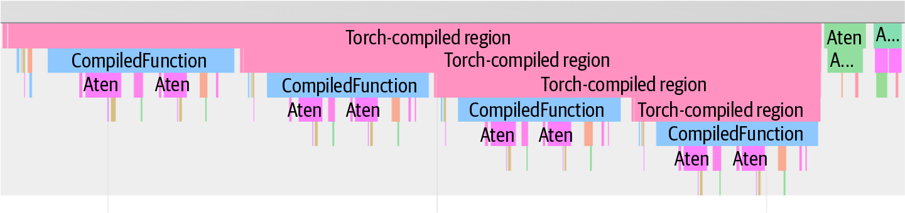
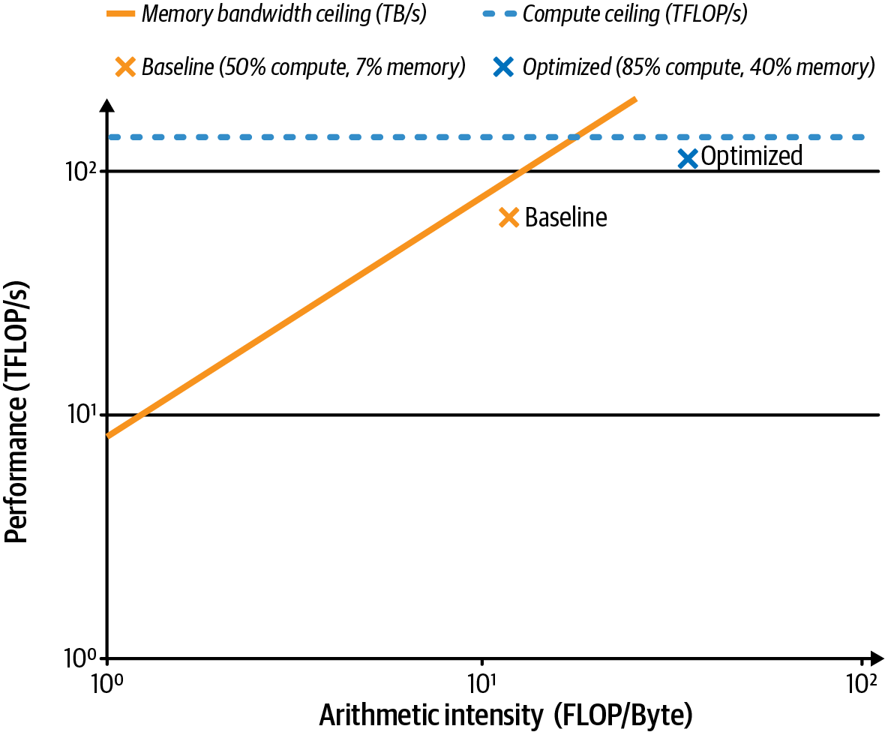
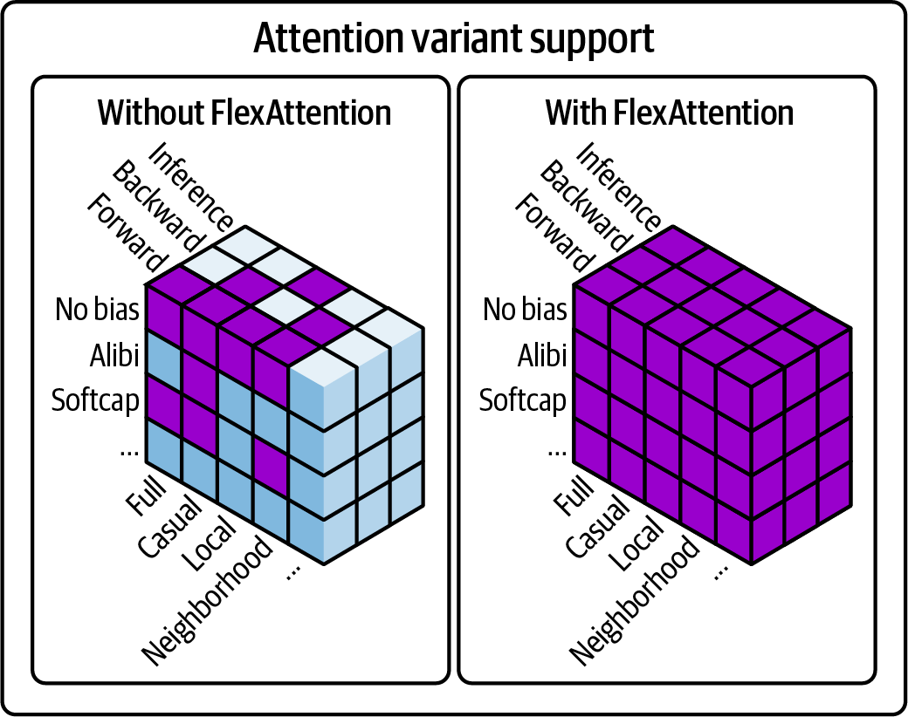
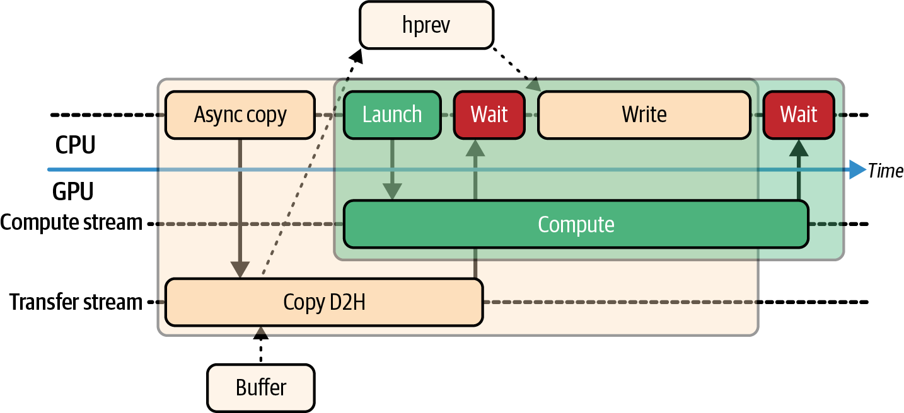
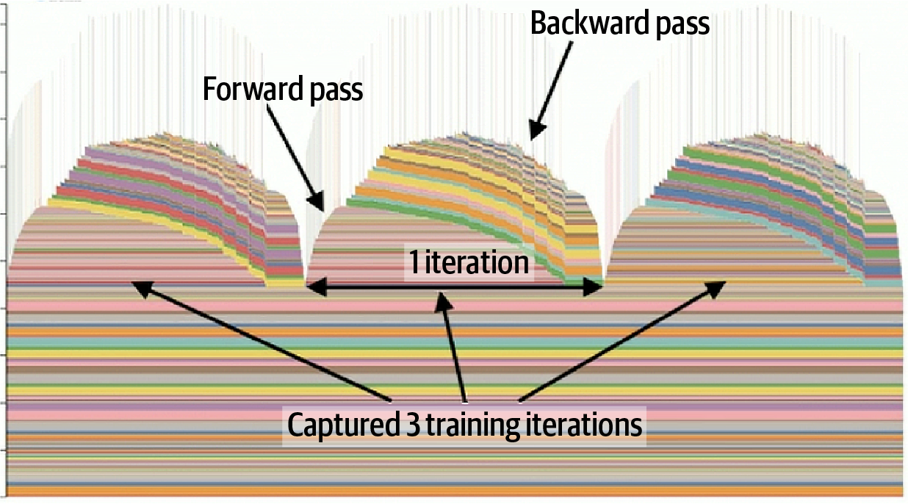
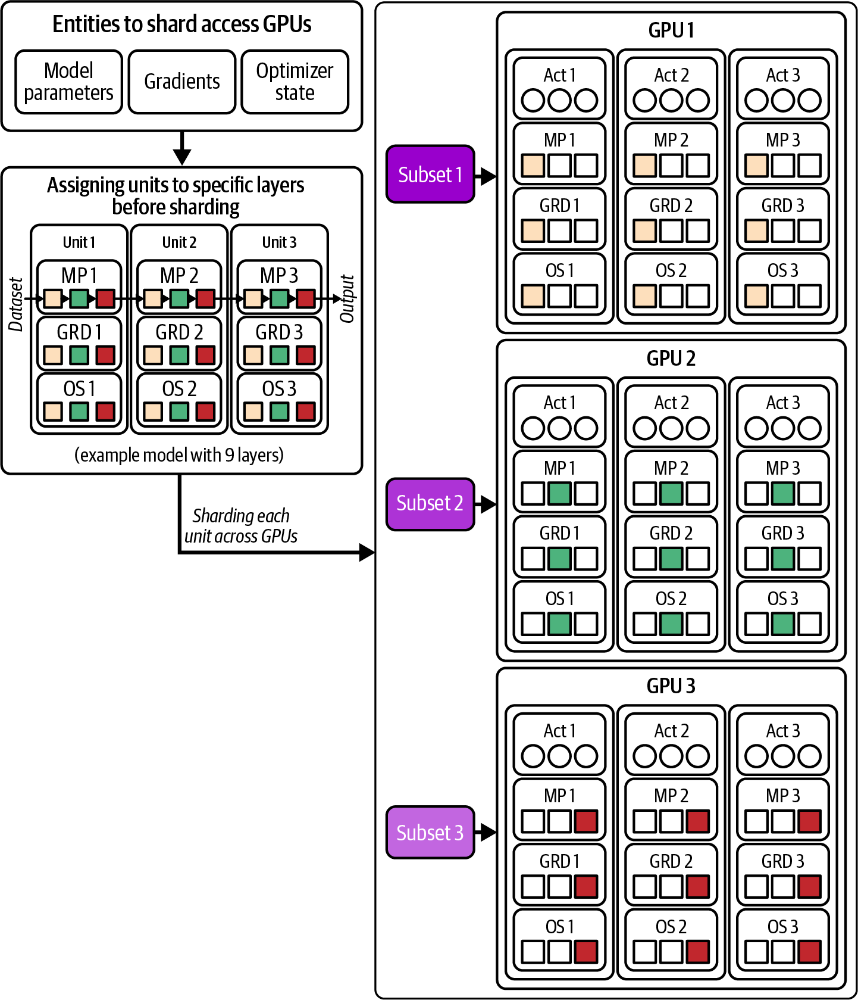
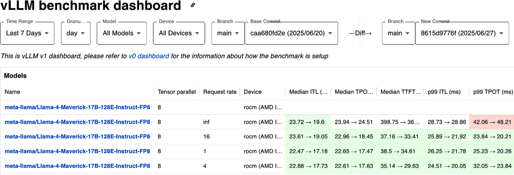

# 第13章 PyTorch性能分析、调优和扩展 (Profiling, Tuning, and Scaling PyTorch)

AI训练和推理流水线可能在每一层都遭受性能瓶颈的影响，包括Python解释器开销、CPU主机端数据加载停顿、CUDA内核利用率不足以及GPU设备内存争用。为了有效地优化，您需要使用覆盖整个系统的多种工具在堆栈的多个层次进行性能分析。

本章重点介绍在现代NVIDIA GPU上运行的PyTorch工作负载的性能分析、调试和系统级调优。我们将探讨如何使用PyTorch内置分析器、NVIDIA的Nsight工具以及使用Linux perf进行CPU性能分析来识别和修复瓶颈--以及PyTorch内存分析和内存分配器调优。我们还将讨论PyTorch如何使用CUDA流实现并发，以及使用CUDA图来减少内核启动开销。

接下来，我们将展示如何优化数据流水线，并使用PyTorch分布式数据并行（DDP）、完全分片数据并行（FSDP）和其他模型并行策略扩展到多个GPU。然后，我们将演示如何分析多GPU和多节点环境，包括整体追踪分析（HTA）和Perfetto。

在本章中，我们强调性能权衡和定量示例，重点关注内核执行时间、硬件利用率指标、内存占用、数据加载效率和扩展的整体成本效益。在本章结束时，您应该了解如何在整个堆栈中实施有效的、整体的PyTorch工作负载性能分析和调优方法。

> AI training and inference pipelines can suffer from performance bottlenecks at every layer, including Python interpreter overhead, CPU host-side data-loading stalls, CUDA kernel underutilization, and GPU device-memory contention. To optimize effectively, you need to profile at multiple levels of the stack using multiple tools that cover the entire system. This chapter focuses on profiling, debugging, and system-level tuning of PyTorch workloads running on modern NVIDIA GPUs. We will explore how to identify and fix bottlenecks using PyTorch's built-in profiler, NVIDIA's Nsight tools, and CPU profiling with Linux perf-as well as PyTorch memory profiling and memory allocator tuning. We'll also discuss how PyTorch uses CUDA streams for concurrency and CUDA Graphs to reduce kernel launch overhead. Next, we'll show how to optimize data pipelines and scale out to multiple GPUs with PyTorch Distributed Data Parallel (DDP), Fully Sharded Data Parallel (FSDP), and other model parallelism strategies. We'll then demonstrate how to profile multi-GPU and multinode environments, including Holistic Trace Analysis (HTA) and Perfetto. Throughout the chapter, we emphasize performance trade-offs and quantitative examples that focus on kernel execution times, hardware utilization metrics, memory footprint, data loading efficiency, and overall cost-efficiency of scaling. By the end of this chapter, you should have an understanding of how to implement an effective, holistic approach to profiling and tuning PyTorch workloads across the entire stack.

## NVTX标记和性能分析工具 (NVTX Markers and Profiling Tools)

要捕获性能的整体视图，在多个层次进行分析并使用覆盖整个系统的工具非常重要。从业者和性能工程师使用一套通用工具和最佳实践来执行系统堆栈所有层次的整体性能分析。

在介绍工具之前，有必要强调NVIDIA工具扩展（NVTX）和NVTX标记。这些标记在分析器的时间线视图中表示时间范围，并允许不同的分析器跨相同阶段关联事件。

例如，"forward"的NVTX范围将同时出现在PyTorch分析器追踪和Nsight Systems的时间线中。这使得在堆栈的不同层次进行跨工具分析变得更加容易。大多数现代AI框架和库都支持NVTX标记，包括PyTorch和CUDA生态系统相关的任何内容。

NVTX标记使用CUDA C++、PyTorch或任何支持NVIDIA GPU的C++或Python库（如OpenAI Triton、PyCUDA、CuPy、cuTile、cuTe、CUTLASS等）注入代码。大多数库已经为您在代码的关键区域注入了NVTX标记，如"train_step"、"forward"、"backward"、"optimizer_step"等。

但您也可以自己注入它们，例如在PyTorch中使用`torch.profiler.record_function()`和`torch.cuda.nvtx.range_push()`。

既然我们已经描述了如何使用NVTX标记注释代码中有趣的部分，让我们讨论可以摄取、对齐和可视化这些标记的工具。表13-1总结了常见的性能分析工具及其范围、关键特性和典型用例。此表可以帮助您在优化旅程的每个阶段选择正确的工具。

> To capture a holistic view of performance, it's important to profile at multiple levels and use tools that cover the entire system. There exists a set of common tools and best practices used by practitioners and performance engineers to perform holistic profiling across all the layers in the system stack. Before we get to the tools, it's important to highlight the NVIDIA Tools Extension (NVTX) and NVTX markers. These markers denote time ranges in a profiler's timeline view and allow different profilers to correlate events across the same phases. For example, an NVTX range for "forward" will appear in both PyTorch profiler traces and Nsight Systems' timelines. This makes cross-tool analysis much easier at different layers of the stack. NVTX markers are supported by most modern AI frameworks and libraries, including PyTorch and anything related to the CUDA ecosystem. NVTX markers are injected into code using either CUDA C++, PyTorch, or any C++ or Python library that supports NVIDIA GPUs (e.g., OpenAI Triton, PyCUDA, CuPy, cuTile, cuTe, CUTLASS, etc.). Most libraries already inject NVTX markers on your behalf for critical regions of code, such as "train_step", "forward", "backward", "optimizer_step", etc. But you can also inject them yourself using torch.profiler.record_function() and torch.cuda.nvtx.range_push() in PyTorch, for instance. Now that we've described how to annotate interesting sections of your code using NVTX markers, let's discuss the tools that can ingest, align, and visualize these markers. Common profiling tools are summarized in Table 13-1 along with their scope, key features, and typical use cases. This table can help you choose the right tool for each stage of your optimization journey.

**表13-1. 性能分析和可视化工具摘要**

| 工具 | 范围 | 特性 | 典型用例 |
|------|------|------|----------|
| PyTorch profiler (Kineto) | PyTorch内部操作级分析（CPU/GPU） | NVTX标记支持、形状记录、内存统计、追踪导出、编译图断点识别 | 模型代码的细粒度分解；识别慢速操作、GPU内核启动开销或前向/反向时间不平衡 |
| Nsight Systems (nsys) | 系统级时间线（CPU、GPU、OS、I/O） | CPU线程和GPU流的统一时间线、NVTX集成、多进程支持 | 训练/推理流水线的端到端视图；检测数据加载器停顿、CPU-GPU重叠问题或GPU间同步延迟 |
| Nsight Compute (ncu) | GPU内核分析（每个内核） | 每个内核的硬件指标、源代码关联、roofline分析、占用率和吞吐量报告 | 在识别热点内核后深入分析内核效率；确定内核是内存受限还是计算受限，以及原因 |
| PyTorch memory profiler | 按操作的GPU内存使用情况 | 内存快照时间线、每个操作的峰值内存、torch.cuda.memory_stats()和torch.cuda.mem_get_info()集成 | 诊断内存碎片或意外的高内存使用。查看哪些操作分配最多内存以及何时分配，以优化内存占用 |
| Linux perf | CPU性能分析和系统事件 | CPU周期/指令/缓存采样、火焰图、off-CPU（睡眠）分析 | 识别Python开销（解释器时间、GIL争用）、CPU端数据加载瓶颈或主机OS调度问题 |
| Holistic Trace Analysis (HTA) | 分布式训练追踪可视化 | 基于浏览器的Kineto追踪浏览器、多工作进程追踪聚合；集成Perfetto后端 | 整体分析多GPU/多节点执行。发现不平衡或空闲时间，验证通信与计算的重叠 |
| Chrome trace/Perfetto | 离线追踪查看（基于Web） | 标准追踪格式的Web UI、高级过滤（Perfetto SQL引擎）、易于追踪共享 | 无需专用软件检查追踪。适用于性能仪表板或性能分析数据的远程协作 |
| TorchEval (metrics) | 模型指标和性能日志记录 | 标准化指标API（吞吐量、准确率等）、易于集成 | 在训练和评估期间记录和监控模型吞吐量/延迟以及准确率，以关联性能与模型质量 |
| ExecuTorch | 移动、嵌入式和边缘设备的部署运行时，具有轻量级性能分析钩子和导出工具 | 模型导出、性能分析、调试、内存分析、可视化 | 用于在受限平台上运行PyTorch模型并收集运行时指标，如移动、嵌入式和边缘设备，包括Meta眼镜等 |

> Table 13-1. Summary of profiling and visualization tools

以下是表13-1中每个性能分析工具的详细描述：

**PyTorch profiler (Kineto)**

在PyTorch内部，基于Kineto开源项目的`torch.profiler`提供CPU和CUDA/GPU运行时的操作级分解。此外，它可以使用简单的Python上下文管理器记录输入形状并获取内存快照。PyTorch分析器可以使用NVTX范围对齐事件，捕获训练和推理工作负载的详细时间线追踪和硬件计数器。它提供从Python代码到CUDA内核的端到端可观测性--甚至为常见问题（如数据加载停顿和低效CUDA代码）提供性能提示。

**Nsight Systems (nsys)**

对于系统级关联，包括CPU线程、GPU内核、OS事件、I/O和互连流量，NVIDIA Nsight Systems生成统一的时间线视图。其GUI和CLI报告可以跨多进程和多节点运行合并NVTX区域、Python调用栈和CUDA流。这使得很容易发现I/O和同步停顿可能影响计算性能的地方。

**Nsight Compute (ncu)**

与Nsight Systems互补的是NVIDIA Nsight Compute，用于每个内核的分析。Nsight Compute收集详细的硬件指标，如占用率、内存带宽和SM利用率。它甚至可以生成映射到源代码的roofline图表。在其他高级工具识别出哪些内核是热点之后，Nsight Compute帮助回答为什么特定内核很慢（例如，内存受限、低占用率）。

**PyTorch memory profiler**

PyTorch还包括一个内存分析器，您可以在`torch.profiler`中启用`profile_memory=True`。PyTorch内存分析器按操作分解峰值和累积GPU内存分配。这揭示了可能被忽视的内存使用热点。

**Linux perf**

在主机端，Linux的perf工具可以采样CPU硬件计数器，包括周期、指令和缓存未命中--并展开完整的C/C++和Python调用图。从`perf sched`开始，您可以看到CPU线程何时因I/O或线程调度/同步而空闲。这揭示了数据预处理循环、Python的GIL或可能使GPU饥饿的同步中的瓶颈。

**Holistic Trace Analysis**

Meta开源的整体追踪分析（HTA）工具摄取PyTorch分析器追踪，帮助诊断多GPU瓶颈。使用HTA，可以在CUDA内核追踪旁边可视化带有NVTX范围的分布式训练时间线。通过深入分析随时间变化的内存分配模式，您可以识别GPU空闲期间--包括GPU相互等待的时间。

> TensorBoard的PyTorch追踪可视化插件已弃用。请改用Perfetto进行时间线查看，使用Meta的HTA进行分布式追踪分析。

**Chrome trace和Perfetto查看器**

对于大型PyTorch分析器追踪文件的基于Web的探索，您可以使用Chrome追踪（例如，浏览器中的`chrome://tracing`）和Perfetto UI。这些将加载JSON追踪文件，让您交互式地探索时间线视图和火焰图。它们甚至允许您对追踪数据进行细粒度过滤和SQL查询--精确到事件追踪和关联的亚毫秒级别。Chrome追踪和Perfetto UI非常适合在组织成员之间共享性能分析结果，进行跨团队分析。（注意：Chrome的旧版追踪查看器已弃用，因此您应该优先使用Perfetto Web UI和SQL引擎来查看和分析追踪。）

**TorchEval（PyTorch的指标库）**

另一个项目TorchEval让您在统一的界面中记录和监控模型吞吐量、延迟和质量指标以及训练和评估指标。TorchEval是PyTorch的官方指标库，为端到端性能和质量指标提供简单的API。该库使插入训练循环和在分布式环境中集成变得容易。

**ExecuTorch**

对于嵌入式、移动和边缘设备，ExecuTorch项目允许在轻量级运行时环境（如Meta眼镜）中分析、可视化和调试PyTorch模型。ExecuTorch具有小型、动态的内存占用，支持Linux、iOS、Android和嵌入式系统。Hugging Face通过其Optimum ExecuTorch项目支持ExecuTorch，如果您已经在使用Hugging Face生态系统（如Hugging Face Transformers），这使得该环境易于集成。

接下来，让我们深入了解使用这些分析器识别性能瓶颈的示例。然后我们将应用有针对性的优化并验证性能改进。

> Here is a detailed description of each profiling tool in Table 13-1: PyTorch profiler (Kineto): Within PyTorch, the torch.profiler, based on the Kineto open source project, provides operator-level breakdowns of CPU and CUDA/GPU runtimes. In addition, it can record input shapes and take memory snapshots using simple Python context managers. The PyTorch profiler can capture detailed timeline traces and hardware counters across training and inference workloads using NVTX ranges to align the events. It provides end-to-end observability from Python code down to the CUDA kernels-and even provides performance tips for common issues like data-loading stalls and inefficient CUDA code. Nsight Systems (nsys): For system-wide correlation, including CPU threads, GPU kernels, OS events, I/O, and interconnect traffic, NVIDIA Nsight Systems produces a unified timeline view. Its GUI and CLI reports can merge NVTX zones, Python call stacks, and CUDA streams across multiprocess and multinode runs. This makes it easy to spot where I/O and synchronization stalls might be impacting compute performance. Nsight Compute (ncu): Complementing Nsight Systems is NVIDIA Nsight Compute for per-kernel analysis. Nsight Compute collects detailed hardware metrics such as occupancy, memory bandwidth, and SM utilization. It can even generate roofline charts mapped to source code. Nsight Compute helps answer why a particular kernel is slow (e.g., memory bound, low occupancy) after other higher-level tools identify which kernels are the hotspots. PyTorch memory profiler: PyTorch also includes a memory profiler, which you can enable with profile_memory=True in torch.profiler. The PyTorch memory profiler breaks down peak and cumulative GPU memory allocations per operation. This reveals memory usage hotspots that might otherwise go unnoticed. Linux perf: On the host side, Linux's perf tool can sample CPU hardware counters, including cycles, instructions, and cache misses-and unwind full C/C++ and Python call graphs. Starting with perf sched, you can see when CPU threads sit idle due to I/O or thread scheduling/synchronizing. This uncovers bottlenecks in data preprocessing loops, Python's GIL, or synchronization that can starve the GPU. Holistic Trace Analysis: Meta's open source Holistic Trace Analysis (HTA) tool ingests PyTorch profiler traces to help diagnose multi-GPU bottlenecks. With HTA, one can visualize distributed training timelines with NVTX ranges alongside CUDA kernel traces. By drilling into memory allocation patterns over time, you can identify periods of idle GPU-including when GPUs are waiting on each other. TensorBoard's PyTorch trace visualization plugin is deprecated. Instead, use Perfetto for timeline viewing and Meta's HTA for distributed trace analysis. Chrome trace and Perfetto viewer: For web-based exploration of large PyTorch profiler trace files, you can use Chrome tracing (e.g., chrome://tracing in the browser) and Perfetto UIs. These will load the JSON traces and let you interactively explore timeline views and flame charts. They even let you perform fine-grained filtering and SQL queries on the trace data-down to the submillisecond level for event tracing and correlation. Chrome traces and the Perfetto UI are ideal for sharing profile results between members of your organization for cross-team analysis. (Note: Chrome's legacy trace viewer is deprecated, so you should prefer the Perfetto web UI and SQL engine for viewing and analyzing traces.) TorchEval (PyTorch's metrics library): Another project, TorchEval, lets you log and monitor model throughput, latency, and quality metrics alongside training and evaluation metrics-all within a unified interface. TorchEval is PyTorch's official metrics library and provides a simple API for end-to-end performance and quality metrics. This library makes it easy to plug into training loops and integrate across distributed environments. ExecuTorch: For embedded, mobile, and edge devices, the ExecuTorch project allows profiling, visualizing, and debugging PyTorch models in lightweight runtime environments like Meta glasses. ExecuTorch has a small, dynamic memory footprint and supports Linux, iOS, Android, and embedded systems. Hugging Face supports ExecuTorch through its Optimum ExecuTorch project, which makes this environment easy to integrate if you're already using the Hugging Face ecosystem, like Hugging Face Transformers. Next, let's dive into an example of using these profilers to identify performance bottlenecks. We'll then apply targeted optimizations and verify the performance improvements.

## 使用PyTorch分析器识别瓶颈 (Profiling PyTorch to Identify Bottlenecks)

让我们分析一个混合专家（MoE）transformer模型示例，看看这些工具的实际应用。MoE是具有多个专家层的LLM--每个专家是一个前馈网络。将token路由到专家由专家门控系统管理。我们将运行单次训练迭代，捕获详细的性能追踪，并分析输出以指导我们的优化。

### 使用PyTorch分析器 (Using PyTorch Profiler)

首先，我们设置模型和输入。我们使用Hugging Face Transformers加载模型和分词器，将模型移动到GPU，并准备一小批输入，如下所示：

> First, we set up the model and input. We use Hugging Face Transformers to load the model and tokenizer, move the model to GPU, and prepare a small batch of inputs, as shown here:

```python
# train.py

# Set up model and data
model_name = "..."

tokenizer = AutoTokenizer.from_pretrained(model_name)
device = torch.device("cuda")
model = AutoModelForCausalLM.from_pretrained(model_name).to(device)
optimizer = torch.optim.AdamW(model.parameters(), lr=1e-4, 
fused=True)

batch_size = 4
input_texts = ["MoEs are great."] * batch_size
enc = tokenizer(input_texts, return_tensors="pt", padding=True, 
truncation=True)
input_ids = enc.input_ids.to(device)
attention_mask = enc.attention_mask.to(device)
labels = input_ids.clone()  # For LM training, labels are the inputs
                            # (next-token prediction)
```

为了避免捕获一次性设置成本，我们在分析之前运行几次预热迭代。这将通过编译JIT内核、填充缓存等为模型分析和基准测试做准备。这样，我们的测量迭代代表稳态性能。以下是准备模型的代码：

```python
# Warm-up (not profiled)
for _ in range(5):
    with torch.autocast(device_type="cuda", dtype=torch.bfloat16):
        outputs = model(input_ids, attention_mask=attention_mask, 
labels=labels)
    loss = outputs.loss
    loss.backward()
    optimizer.step()
    optimizer.zero_grad(set_to_none=True)
```

现在我们使用PyTorch的分析器和NVTX分析一次训练迭代。我们将迭代包装在`torch.profiler.profile()`中，并使用`record_function`和NVTX范围标记高级区域，包括"forward"、"backward"和"optimizer_step"，如下所示：

```python
from torch import profiler

with profiler.profile(
    activities=[profiler.ProfilerActivity.CPU, 
                profiler.ProfilerActivity.CUDA],
    record_shapes=True,  # record tensor shapes
    profile_memory=True, # track GPU memory usage per op
    with_stack=True,     # enable stack tracing
    with_flops=True      # capture FLOPs counters
) as prof:    
    with profiler.record_function("train_step"):
        # Forward pass
        torch.cuda.nvtx.range_push("forward")
        with torch.autocast(device_type="cuda", 
dtype=torch.bfloat16):
            outputs = model(input_ids, attention_mask=attention_mask,
                            labels=labels)
        loss = outputs.loss

        # end of forward
        torch.cuda.nvtx.range_pop()            

        # Backward pass and optimization
        torch.cuda.nvtx.range_push("backward")
        loss.backward()
        torch.cuda.nvtx.range_push("optimizer_step")
        optimizer.step()
        
        # end of optimizer_step
        torch.cuda.nvtx.range_pop()            
        optimizer.zero_grad()
        
        # end of backward
        torch.cuda.nvtx.range_pop()            
```

在这段代码中，PyTorch分析器在`train_step`期间记录所有CPU和GPU活动。我们使用`record_function("train_step")`定义顶级区域。我们还为子阶段（"forward"、"backward"、"optimizer_step"）插入NVTX标记。这些标记将出现在分析器时间线中以划分迭代的阶段。

分析器还可以突出显示模型的编译与非编译区域。我们将在本章后面介绍PyTorch编译器、图断点以及缓解图断点的机制--以及下一章。

例如，当使用`torch.compile`时，追踪将显示`CompiledFunction`等事件并指示任何图断点（见图13-1）。这有助于精确定位模型回退到eager执行的位置，这将指导进一步的优化。



> Figure 13-1. Compiled (left and middle, pink) versus noncompiled (right, green) regions (source: https://oreil.ly/Z_fJG)

执行后，我们可以通过调用`prof.key_averages().table()`打印按运行时排序的前几个操作的简洁表格来检查操作级结果。在下一个代码块中，我们请求按其self CUDA时间排序的前10个操作，这是每个操作自己的CUDA内核所花费的时间，不包括内核产生的子操作。表13-2总结了按CUDA执行时间排序的前10个操作：

```python
with profiler.profile(
    activities=[ProfilerActivity.CPU, 
                ProfilerActivity.CUDA],
    record_shapes=True,
    profile_memory=True,
) as prof:
    train_step(...)

...

print(
    prof.key_averages()
        .table(
            sort_by="self_cuda_time_total",
            row_limit=10,
            fields=["self_cuda_time_total", 
                    "calls"]
        )
)
```

**表13-2. 一次训练迭代中分析器按CUDA执行时间排序的前10个操作**

| 操作 | Self CUDA总时间 | 调用次数 |
|------|----------------|----------|
| aten::matmul | 43.00 ms | 128 |
| aten::linear | 35.50 ms | 64 |
| dispatch | 18.70 ms | 2 |
| combine | 12.10 ms | 2 |
| aten::layer_norm | 10.20 ms | 16 |
| aten::softmax | 5.70 ms | 4 |
| aten::scatter | 4.10 ms | 16 |
| aten::gather | 3.60 ms | 16 |
| aten::to | 2.90 ms | 8 |
| aten::add_ | 2.20 ms | 64 |

在这里，我们看到矩阵乘法操作（`aten::matmul`及其在`aten::linear`中的使用）主导了CUDA时间并消耗了迭代的大部分时间。这些操作对应于专家前馈网络（FFN）GEMM。具体来说，每次迭代有128次matmul调用。这是有道理的，因为我们有64个专家--每个专家在前向和反向传递中都进行一次matmul。

在表13-2中，我们看到接下来的最大成本来自dispatch和combine操作。这些是自定义C++/CUDA内核，将token重新分配给专家--然后收集专家的输出。dispatch操作运行两次--前向传递一次，反向传递一次--总共18.7 ms。combine运行两次，总共12.1 ms。这两个操作总共占用了另外30.8 ms的GPU时间。剩余时间分散在其他较小的操作上，如layer norm、激活等。

这个分析示例的关键结论是，专家FFN matmul是首要瓶颈，其次是dispatch和combine内核。它们共同主导了训练迭代的运行时间。为了进一步提高性能，我们应该针对这些操作进行优化，要么直接优化它们，要么减少它们被调用的次数。

> Here, we see that the matrix multiplication operations (aten::matmul, and its use in aten::linear) dominate the CUDA time and consume the majority of the iteration. These operations correspond to the expert feed-forward network (FFN) GEMMs. Specifically, there are 128 calls to matmul per iteration. This makes sense since we have 64 experts-and each expert does a matmul in both the forward and backward passes. In Table 13-2, we see the next largest costs are from the dispatch and combine operations. These are custom C++/CUDA kernels that redistribute tokens to experts-and then gather the outputs of the expert. The dispatch operation runs twice-once in the forward pass and once in the backward pass-for a total of 18.7 ms. The combine ran twice for 12.1 ms total. Together, these two operations account for another 30.8 ms of GPU time. The remaining time is spread across other smaller ops like layer norms, activations, etc. The key takeaway from this profiling example is that the expert FFN matmul is the top bottleneck, followed by the dispatch and combine kernels. Together, these dominate a training iteration's runtime. To improve performance further, we should target those operations either by optimizing them directly or by reducing the number of times they're called.

### 使用Nsight Systems和NVTX时间线进行系统分析 (System Profiling with Nsight Systems and NVTX Timelines)

我们插入的NVTX标记使得使用Nsight Systems分析时间线变得简单。要按阶段聚合指标，我们可以使用nsys和基于NVTX的摘要来分析代码，如下面的CLI命令所示：

```bash
nsys profile \
   --output=profile \
   --stats=true \
   -t cuda,nvtx \
   python train.py
```

在这里，`-t cuda,nvtx`选项指示Nsight Systems追踪CUDA API调用和NVTX范围。分析后，我们可以在Nsight Systems GUI中打开`profile.nsys-rep`文件（`--output=profile`）或使用CLI将NVTX摘要打印到终端。然后我们可以使用CLI在`profile.nsys-rep`文件上生成NVTX GPU投影摘要，使用以下命令之一，如下所示，用Nsight Systems验证范围与投影GPU工作：

```bash
nsys stats --report=nvtx_gpu_proj_sum \
  profile.nsys-rep

# or

nsys recipe nvtx_gpu_proj_sum \
  profile.nsys-rep
```

您可以在持续构建和集成流水线中使用这些命令之一来监控和检测任何性能回归。此CLI命令的结果总结在表13-3中。

**表13-3. 使用Nsight Systems进行一次train_step迭代的NVTX GPU投影摘要**

| NVTX范围 | GPU时间（ms） | Self GPU时间（ms） | 子GPU时间（ms） | 实例（调用次数） |
|----------|---------------|-------------------|-----------------|------------------|
| train_step | 138.0 | 0.0 | 138.0 | 1 |
| forward | 60.5 | 60.5 | 0.0 | 130 |
| backward | 58.3 | 58.3 | 0.0 | 130 |
| optimizer_step | 19.2 | 19.2 | 0.0 | 1 |

在这里，我们看到`train_step`范围包括forward、backward和optimizer子范围。此NVTX GPU投影摘要确认`train_step`下的总GPU时间为138 ms。此时间与表13-2中PyTorch分析器输出的forward、backward和`optimizer_step`时间之和匹配。这显示了工具之间的一致性。

尽管表13-3显示单个`optimizer_step`调用，但其NVTX范围实际上将所有64个`aten::add_` CUDA内核启动（如表13-2所示，每个专家一个`add_`）括在单个`optimizer_step`标记下。

请注意，Nsight Systems将64个`aten::add_`调用（例如，64路专家并行策略）分组到单个`optimizer_step`标记中，因为它使用CUDA性能分析工具接口（CUPTI）捕获主机上的NVTX push/pop事件。然后它将异步GPU内核执行时间"投影"到这些CPU定义的间隔上。因此，它对GPU开始/结束时间戳落在相应push和pop调用之间的每个内核的持续时间求和。这产生了一个累积GPU时间，与各个`aten::add_`内核的总和完全匹配。

> 因为NVTX标记在没有分析器附加时开销非常低，这种投影机制是理想的，因为它增加了可忽略的开销，同时仍然提供GPU工作与高级代码区域的端到端关联。

forward和backward范围各自的self GPU时间等于其总时间，因为我们没有选择在其中嵌套更深的范围。因此，子GPU时间为0 ms。然而，`train_step`几乎所有时间都是子GPU时间，因为它只是嵌套阶段的包装器。

NVTX GPU投影摘要还显示，在每次迭代中，我们在`train_step`内观察到130个GPU活动。这些包括内核启动和其他设备操作（如内存拷贝），因此它们与内核不是严格的一对一关系。

如表13-3所示，backward和forward传递都发生了130个GPU内核调用。操作和NVTX实例之间的这种一对一对应意味着我们的插桩捕获了每个重要操作。

> 表13-3中显示的NVTX摘要是一个方便的文本概述。对于视觉分析，时间线GUI可以显示重叠的内核执行、CPU线程状态，甚至CUDA API开销事件。在实践中，您希望在视觉时间线中验证主机端数据加载和预处理与GPU计算重叠。任何大的间隙或"气泡"都表示问题。小的同步间隙是预期且适当的。

在多GPU运行中，Nsight Systems或HTA时间线视图可以揭示NVLink或InfiniBand/以太网是否被有效利用--或者节点是否在等待通信或网络延迟时处于饥饿状态。这将暗示次优的同步或负载不平衡。

使用Nsight Systems和HTA提供追踪来追踪GPU通信事件（包括NCCL all-reduce调用和NVLink/NVSwitch活动）非常重要。这些有助于验证GPU在大型GPU域（如基于NVL72的系统）中保持忙碌。

仔细的分析确保系统在这些大型NVLink集群中使用正确的GPU间同步并平衡工作负载。

现在让我们放大系统中开销最大的内核之一：矩阵乘法或matmul。

> The NVTX markers that we inserted make it straightforward to analyze the timeline with Nsight Systems. To aggregate metrics per phase, we can profile the code using nsys with an NVTX-based summary, as shown in the CLI command here: ... Here, the -t cuda,nvtx option instructs Nsight Systems to trace both CUDA API calls and NVTX ranges. After profiling, we can open the profile.nsys-rep file (--output=profile) in the Nsight Systems GUI or use the CLI to print the NVTX summary to the terminal. We can then use the CLI to generate the NVTX GPU Projection Summary using one of the following commands on the profile.nsys-rep file, as shown here to validate ranges against projected GPU work with Nsight Systems: ... You can use one of these commands in your continuous build and integration pipelines to monitor and detect any performance regressions. The results of this CLI command are summarized in Table 13-3. ... Here, we see the train_step range includes the forward, backward, and optimizer subranges. This NVTX GPU Projection Summary confirms that the total GPU time under train_step is 138 ms. This time matches the sum of the forward, backward, and optimizer_step times from the PyTorch profiler output in Table 13-2. This shows consistency between tools. And although Table 13-3 shows a single optimizer_step call, its NVTX range actually brackets all 64 aten::add_ CUDA kernel launches (one add_ per expert as shown in Table 13-2) under the single optimizer_step marker. Note that Nsight Systems groups the 64 aten::add_ calls (e.g., 64-way expert parallelism strategy) into a single optimizer_step marker because it uses the CUDA Profiling Tools Interface (CUPTI) to capture NVTX push/pop events on the host. It then "projects" asynchronous GPU kernel execution times onto these CPU-defined intervals. As such, it sums the durations of every kernel with GPU start/end timestamps that fall between the corresponding push and pop calls. This produces one cumulative GPU time that exactly matches the total of the individual aten::add_ kernels. Because NVTX markers have very low overhead when no profiler is attached, this projection mechanism is ideal because it adds negligible overhead while still providing end-to-end correlation of GPU work with high-level code regions. The forward and backward ranges each have self GPU time equal to their total time since we didn't choose to nest deeper ranges inside of them. As such, child GPU time is 0 ms. However, train_step has nearly all of its time as child GPU time since it's just a wrapper around the nested phases. The NVTX GPU projection summary also shows that, in each iteration, we observed 130 GPU activities inside train_step. These include kernel launches and other device operations such as memory copies, so they are not strictly one-to-one with kernels. As you can see in Table 13-3, the 130 GPU kernel calls happen for both the backward and forward passes as well. This one-to-one correspondence between operations and NVTX instances means that our instrumentation captures every important operation. The NVTX summary we show in Table 13-3 is a convenient text overview. For visual analysis, the timeline GUI can show overlapping kernel execution, CPU thread states, and even CUDA API overhead events. In practice, you want to verify that host-side data loading and preprocessing are overlapping with GPU compute in the visual timeline. Any large gaps, or "bubbles," indicate a problem. Small gaps for synchronization are expected and appropriate. On a multi-GPU run, the Nsight Systems or HTA timeline view can reveal if NVLink or InfiniBand/Ethernet is being utilized effectively-or if a node is starved for work while waiting for communication or network delays. This would hint at suboptimal synchronization or load imbalance. It's important to trace GPU communication events, including NCCL all-reduce calls and NVLink/NVSwitch activity using Nsight Systems and HTA to provide traces. These help verify that the GPUs stay busy in massive GPU domains such as an NVL72-based system. Careful profiling makes sure the system is using proper inter-GPU synchronization and balancing the workload in these large NVLink clusters. Let's now zoom in on one of the most expensive kernels in the system: the matrix multiply, or matmul.

### 通用矩阵乘法（GEMM）的内核Roofline分析 (Kernel Roofline Analysis for General Matrix Multiply (GEMM))

为了更深入地分析专家matmul，我们调用CLI分析器Nsight Compute（ncu）按名称定位特定的GEMM内核。我们将收集roofline相关指标以确定它是计算受限还是内存受限，如下所示：

```bash
ncu \
  --target-processes all \
  --kernel-name-regex "matmul" \
  --metrics \
    gpu__time_duration.avg, \
    gpu__dram_throughput.avg.pct_of_peak_sustained_elapsed, \
    lts__throughput.avg.pct_of_peak_sustained_elapsed, \
    sm__sass_thread_inst_executed_op_fp32_pred_on.sum, \
    sm__warps_active.avg.pct_of_peak_sustained_active \
  --csv full \
  -o matmul_roofline_report \
  python train.py
```

在这里，我们为名称匹配"matmul"的任何内核收集硬件计数器。具体来说，我们收集一些关键指标，包括GPU DRAM带宽和L2带宽作为峰值百分比（`gpu__dram_throughput.avg.pct_of_peak_sustained_elapsed`、`lts__throughput.avg.pct_of_peak_sustained_elapsed`）、FP32指令计数作为计算代理（`sm__sass_thread_inst_executed_op_fp32_pred_on.sum`）、内核时间（`gpu__time_duration.avg`）和实现的占用率（`sm__warps_active.avg.pct_of_peak_sustained_active`）。

> 指标标识符在Nsight Compute版本之间可能略有不同。如果找不到某个指标，请使用UI定位当前名称并进行相应替换。在这里，我们正在分析SM和DRAM的峰值持续百分比以及实现的占用率。

在应用迄今为止讨论的优化（如降低精度、融合内核和增加算术强度）之后，我们可以重新运行`ncu`命令来验证我们的优化产生了积极影响。表13-4显示了应用这些优化以提高算术强度之前和之后的比较。

**表13-4. 专家matmul内核在算术强度优化前后的Roofline分析**

| 内核配置 | 峰值FLOPS百分比（SM计算吞吐量） | 峰值内存带宽百分比（内存吞吐量） | 实现的SM占用率 | 特征 |
|----------|--------------------------------|--------------------------------|---------------|------|
| 基线 | 50% | 70% | 60% | 内存受限（内存传输停顿） |
| 优化后 | 85% | 40% | 80% | 计算受限（接近硬件roofline） |

在这里，我们看到在基线运行中，主要GEMM内核仅达到约50%的峰值计算FLOPS、70%的峰值内存带宽和中等60%的SM占用率（每个SM的平均活跃线程束）。这个占用率不足以完全隐藏内存延迟。

> 没有通用的占用率目标。许多高性能内核在25-50%的实现占用率下实现完全延迟隐藏。使用Nsight Compute的占用率指标以及停顿原因分解和每个活跃周期的合格线程束来判断更多占用率是否会减少内核的停顿。如果内核无法调度足够的线程束来覆盖停顿期，这将导致空闲周期，因为内存请求没有得到足够快的服务。

基线指标表明内核是内存受限的，因为其执行被内存传输停顿。结果是大量未使用的计算能力，这进一步强化了该工作负载目前不是计算受限的。目标是使该内核更加计算受限，以利用该GPU可用的大量FLOPS。

在优化版本（例如，融合内核、增加算术强度和减少内存移动）中，峰值FLOPS增加到85%，峰值内存带宽下降到40%，占用率增加到80%。我们有效地将内核从内存受限转变为计算受限--更接近硬件的roofline限制，如图13-2所示。



> Up to this point, our profiling has focused on GPU performance. It's also important to not waste time on the CPU or performing I/O. In the next section, we continue our profiling journey on the host side.

到目前为止，我们的分析集中在GPU性能上。同样重要的是不要在CPU上浪费时间或执行I/O。在下一节中，我们继续在主机端进行分析。

## 使用Linux perf进行CPU和GPU分析 (CPU and GPU Profiling with Linux perf)

为了获得跨主机和设备时间花费位置的整体视图，我们可以使用Linux perf分析CPU周期、缓存未命中、分支未命中等。然后我们可以使用这些见解来驱动一系列优化，逐一应用它们并测量改进。

首先，让我们运行一个轻量级的`perf stat`来收集在配备Blackwell GPU的ARM架构Grace CPU节点上进行MoE训练运行期间的CPU端统计信息。以下是CLI命令和示例输出：

```bash
perf stat -e \
  cycles,instructions,cache-misses,branch-misses \
  python train.py
```

```
  Performance counter stats for 'python train.py':

# 0.600 CPUs utilized
1,200.345 msec task-clock
# Approximately 2.0 GHz
2,400,567,890      cycles                  
# 1.58 insn per cycle
3,800,123,456      instructions            
# 0.32% of all cache refs
12,345,678      cache-misses            
# 0.12% of all branches
4,567,890      branch-misses           

 1.234567890 seconds time elapsed
```

这份来自`perf stat`的报告显示了CPU利用率、周期、每周期指令数（IPC）以及缓存/分支未命中。在我们的运行中，任务时钟显示约1.2秒，在测量间隔内仅使用了单个CPU核心的约60%（0.600）。这是预期的，因为GPU正在承担大部分繁重工作。较低的缓存未命中和分支未命中率暗示该工作负载在CPU端的内存访问模式和分支预测相对高效。

然而，每周期指令数（IPC）测量值仅为1.58，表明CPU的发射速度远低于单个Grace CPU核心（ARM Neoverse V2）的理论最大值--每周期8条指令。这表明该特定工作负载存在潜在的低效性，如内存延迟、I/O停顿或主机计算问题。

我们可以进一步使用`perf record`和`perf report`来精确定位训练期间哪些Python和C++函数主导CPU执行时间。这些CLI命令如下所示：

```bash
perf record -F 2000 -g --call-graph dwarf -o perf.data \
    python train.py
```

在这里，我们使用`perf record`以2000 Hz（`-F 2000`）收集样本，并通过指定`-g --call-graph dwarf`捕获完整的C/C++和Python调用栈。DWARF代表"Debugging With Attributed Record Formats"，它是嵌入在编译二进制文件（如ELF文件）中的标准调试数据格式。DWARF输出追踪保存到`perf.data`（`-o perf.data`）。然后我们使用`perf report`生成最热调用栈及其样本百分比的摘要报告：

```bash
perf report --stdio -n -g -i perf.data

# Samples  Command   Shared Object        Symbol
# ........ ........  ...................  
.................................
     45.0%  python    python               py::forward <...> 
/src/train.py
     20.5%  python    python               aten::matmul
     10.2%  python    python               dataloader_iter_next
      8.7%  python    libnccl.so           ncclAllReduce
      5.3%  python    libc.so.6            read
      ...   ...       ...                  ...
```

在这里，我们看到Python解释器的forward函数--我们训练循环的Python端--占CPU样本的45.0%。PyTorch的C++ `aten::matmul`操作占20.5%，DataLoader的迭代器next函数占10.2%，NCCL all-reduce调用占8.7%，I/O读取占5.3%。

这些百分比告诉我们在哪里投入优化精力。基于此性能分析，我们用具体的缓解计划解决每个瓶颈以提高系统性能：

**过多的Python开销（py::forward中占45%）**

使用PyTorch的JIT编译器`torch.compile`（将在下一节讨论）来消除解释器开销，并将Python端操作融合为优化的CUDA代码。

**大型matmul热点（aten::matmul中占20.5%）**

要么使用PyTorch编译器优化此代码，要么将此关键矩阵乘法移至自定义CUDA C++内核（例如，融合内核）以绕过Python并直接使用优化的CUDA代码。

**数据加载停顿（dataloader_iter_next中占10.2%）**

增加PyTorch DataLoader的`num_workers`。一个常见的指导原则是每个CPU一个工作进程，但您可以尝试更多以找到正确的I/O并行化级别。只需确保不要过度订阅CPU核心。您还应该启用`persistent_workers=True`，以便工作进程在各个epoch之间保持活跃，避免每个epoch的启动开销。融合或并行化多个`torch.utils.data.DataPipe`。这可以减少复杂数据流水线中的Python开销。

**梯度同步开销（ncclAllReduce中占8.7%）**

优化多GPU通信。例如，您可以增加`DistributedDataParallel`中的梯度桶大小。通常将`bucket_cap_mb`从25 MB增加到50 MB，以便NCCL可以更快启动all-reduce操作并将其与反向计算重叠。您还可以考虑梯度压缩技术或NVIDIA的NCCL压缩（用于8位梯度）以减少带宽使用。这些可能会对准确率造成轻微损失。

**主机I/O瓶颈（read系统调用中占5.3%）**

在DataLoader中使用固定内存（`pin_memory=True`）和非阻塞GPU拷贝（`.to(device, non_blocking=True)`）来重叠CPU到GPU的数据传输。此外，您可以批量读取文件或将许多小文件捆绑到优化的数据集格式中，如Arrow、WebDataset（tar分片）、TFRecord或Parquet块，以便于大型顺序读取。最好优先使用连续的分片格式而不是每样本文件。在使用较大预取深度（例如，`prefetch_factor=4`或8）时，优先使用固定的主机缓冲区。结合`persistent_workers=True`，您的系统将保持加载器线程忙碌，因为计算-通信正在高效重叠。这将消除在大型语料库中读取许多小文件时的每文件开销。

这些方法结合大型OS预读和NVMe SSD将提高I/O吞吐量。此外，较新的文件系统和存储库（如NVIDIA Magnum IO）可以帮助将数据高效地流水线传输到GPU。

在制定此计划后，您应该系统地应用每个优化并测量效果。请记住逐一实施和测试这些优化，以验证每个优化确实提高了性能。这有助于避免多个更改以意外方式交互的情况。通过隔离每个更改，您可以知道哪些调整产生了积极效果，哪些没有。

在存在NVIDIA性能监控单元（PMU）驱动程序的系统上，您可以使用perf采样NVIDIA芯片互连和结构计数器以及CPU计数器，包括在`/sys/bus/event_source/devices`下作为`nvidia_nvlink_c2c*`暴露的NVLink-C2C设备。使用`perf list`验证可用性，并检查sysfs中的`nvidia_pmu`条目。

> NVIDIA PMU的Linux perf仅限于设备级链路和结构事件，如Grace-Blackwell上的NVLink-C2C。SM流水线、线程束停顿和内存吞吐量计数器仍然仅限于CUPTI和Nsight工具。这些PMU不暴露SM级内核指标。对于SM利用率、占用率和内存吞吐量，请使用Nsight Compute或基于CUPTI的分析器。确保设置`NVreg_RestrictProfilingToAdminUsers=0`以允许非root用户分析SM级硬件计数器。

一旦PMU设备存在，您可以一起收集CPU和NVIDIA事件。使用`perf list`报告的符号事件名称：

```bash
perf list | grep -i nvidia

perf stat -a \
  -e nvidia_nvlink_c2c0_pmu_0/cycles/ \
  -e cycles,cache-misses \
  python train.py
```

在这里，NVLink-C2C PMU上的cycles事件让您可以将GPU互连活动与主机CPU行为关联起来。以下是从上述`perf stat`命令输出的示例，显示在运行期间NVLink C2C PMU记录了活动，而CPU产生了周期和缓存未命中：

```
Performance counter stats for 'python train_deepseek_v3.py':

       3,567,890,123  nvidia_nvlink_c2c0_pmu_0/cycles
          45,678,901  cycles
           7,890,123  cache-misses

       2.345678901 seconds time elapsed
```

我们最初的分析表明，基于PyTorch分析器和Nsight工具，GPU计算（如专家矩阵乘法）和GPU通信（如dispatch和combine操作）是主要瓶颈。然而，CPU、数据加载和GPU集合通信操作也会影响性能，正如perf通过显示慢速区域期间哪些CPU线程和互连PMU处于活跃状态所证明的那样。

> 要深入分析其他链路和结构请求计数器，请从`perf list`中选择系统中出现的其他NVIDIA PMU事件，并将它们添加到`perf stat`命令中，如前所示。

简而言之，通过将perf的高级CPU吞吐量指标和调用图热点与Nsight Systems和Nsight Compute的设备指标和时间线相结合，您可以构建跨主机和设备的整体性能故事。首先解决最大的CPU端瓶颈和数据停顿。然后优化GPU通信并调整GPU内核。

## PyTorch编译器（torch.compile） (PyTorch Compiler (torch.compile))

PyTorch中最快的优化之一是使用PyTorch编译器`torch.compile()`。编译器栈包括TorchDynamo、AOT Autograd和TorchInductor，它们捕获图、融合操作，并为目标后端（如NVIDIA GPU）生成高性能代码。

PyTorch编译器可以通过将许多小操作融合为更大的内核来消除大量Python解释器开销和GPU内核启动延迟。在完成基线分析后，我们在模型上启用了`torch.compile`，看看是否能轻松获得加速。接下来，让我们描述这个过程--以及结果。

### 使用PyTorch编译器 (Using the PyTorch Compiler)

使用默认设置的PyTorch编译器非常简单，除了包装模型外不需要代码更改：`model = torch.compile(model)`。在底层，TorchDynamo追踪Python代码，AOT Autograd捕获反向传递，而TorchInductor（利用OpenAI的Triton进行GPU内核代码生成，如下一章所述）自动生成高效的融合内核。

编译器观察模型的前向传递，识别许多融合连续操作的机会，如逐元素激活、layer norm等。它为这些操作生成融合内核--也为反向传递的部分生成。结果是每次迭代的内核启动显著减少，CPU开销降低。

编译步骤确实会引入一些开销--对于非常大的模型可能需要几秒甚至几分钟--但这个成本在长时间训练作业或重复推理运行中会被摊销。幸运的是，TorchInductor缓存编译的内核，因此后续运行不需要再次支付编译成本。PyTorch社区也在不断努力改进编译/启动性能，允许您保存和重用跨运行的编译产物。

使用`torch.compiler.save_cache_artifacts()`和`torch.compiler.load_cache_artifacts()`在跨运行或节点间持久化TorchInductor输出。这减少了长时间运行训练或服务的启动时间。

一个例子是PyTorch Mega-Cache功能。这是一个端到端的编译缓存，让您可以将编译的内核保存到磁盘并在未来的运行中重新加载。使用PyTorch Mega-Cache，您可以编译一次（例如，离线）并在多个训练会话中重用优化的内核。这有助于减少启动时间。您仍然可以从TorchInductor的内核优化（如线程束特化）中受益，但避免了每次重新编译图。

> 您甚至可以在其他计算节点上使用此编译缓存。如果这样做，请确保CUDA、PyTorch和Triton版本在节点之间兼容。

值得注意的是，PyTorch编译器在内部应用了复杂的优化技术。例如，我们在第10章中提到了线程束特化。TorchInductor的自动调优器跨tile大小、内存访问模式等生成多个内核变体。它会在后台应用内存线程束与计算线程束特化等技术。然后它会自动为您的硬件选择最快的变体。

TorchInductor支持GEMM内核周围的prologue和epilogue融合。例如，bias-add在matmul之前。而在matmul之后，epilogue由逐元素操作组成，如激活、dropout和残差。

通过将这些内核prologue和epilogue操作合并到单个优化的内核中，TorchInductor减少了内存流量，最小化了内核启动开销，并增加了占用率。您可以使用分析器验证这一点，它将显示更高的SM利用率。

这种优化复杂性对开发者完全透明，因为PyTorch呈现了一个干净的、以张量为中心的接口，而不暴露CUDA级的线程束细节。因此，虽然您不会在PyTorch API中看到"内存线程束"或"计算线程束"标志，但要知道这些技术正在后台使用。一旦代码被编译，您将在分析器指标中注意到线程束特化的好处，包括更高的占用率、更少的内存延迟停顿和更高的SM利用率。

为了说明编译模式的好处，让我们比较PyTorch的eager模式与MoE模型上的编译执行。我们将对模型进行单次训练迭代计时--一次在常规eager模式下，一次在"max-autotune"编译模式下。代码如下，随后是示例输出：

```python
import torch
from transformers import AutoModelForCausalLM, AutoTokenizer

# ---- Setup Model ----
device = 'cuda'
model_name = "..."
tokenizer = AutoTokenizer.from_pretrained(model_name)
model = AutoModelForCausalLM.from_pretrained(model_name).to(device)
optimizer = torch.optim.AdamW(model.parameters(), lr=1e-4, 
fused=True)

# ---- Create a dummy batch of token IDs ----
batch_size = 4
input_texts = ["MoE's are awesome!"] * batch_size
enc = tokenizer(input_texts, return_tensors="pt", padding=True, 
truncation=True)
input_ids = enc.input_ids.to(device)
attention_mask = enc.attention_mask.to(device)
labels = input_ids.clone()  # for causal LM, labels = input_ids

# ---- Make runs deterministic ----
torch.backends.cudnn.benchmark = False
torch.backends.cudnn.deterministic = True

# --- Eager timing ---
torch.cuda.synchronize()
start = torch.cuda.Event(enable_timing=True)
end = torch.cuda.Event(enable_timing=True)

for _ in range(iters_warmup):
    out = model(input_ids, attention_mask=attention_mask, 
labels=labels)
    loss = out.loss if hasattr(out, "loss") else out
    loss.backward()
    optimizer.step()
    optimizer.zero_grad(set_to_none=True)

torch.cuda.synchronize()
start.record()
for _ in range(iters_meas):
    out = model(input_ids, attention_mask=attention_mask, 
labels=labels)
    loss = out.loss if hasattr(out, "loss") else out
    loss.backward()
    optimizer.step()
    optimizer.zero_grad(set_to_none=True)
end.record()
torch.cuda.synchronize()
print(f"Eager mode step time: 
{start.elapsed_time(end)/iters_meas:.3f} ms")

# --- Compile the model (choose one mode)
# enables graph trees
compiled_model = torch.compile(model, mode="reduce-overhead")  
# Alternatives:
# more tuning, longer compile
# compiled_model = torch.compile(model, mode="max-autotune") 
# balanced
# compiled_model = torch.compile(model, mode="default")       

# Warm-up compiled
for _ in range(iters_warmup):
    out = compiled_model(input_ids, attention_mask=attention_mask, 
labels=labels)
    loss = out.loss if hasattr(out, "loss") else out
    loss.backward()
    optimizer.step()
    optimizer.zero_grad(set_to_none=True)

torch.cuda.synchronize()
start.record()
for _ in range(iters_meas):
    out = compiled_model(input_ids, attention_mask=attention_mask, 
labels=labels)
    loss = out.loss if hasattr(out, "loss") else out

    loss.backward()
    optimizer.step()
    optimizer.zero_grad(set_to_none=True)
end.record()
torch.cuda.synchronize()
print(f"Compiled mode step time: 
{start.elapsed_time(end)/iters_meas:.3f} ms")
```

在这种情况下，PyTorch eager模式每次迭代大约需要248 ms。在预热并让编译器执行优化后，编译模式运行时间约为173 ms。我们使用"max-autotune"的编译版本比eager执行快约30%。实际加速因模型结构、批次大小和动态形状而异。由单个大型GEMM主导的密集模型可能只能看到<10%的加速。

这些节省主要来自合并许多小型GPU内核。小型GPU内核在MoE架构中很常见，用于token dispatch/combine和每token激活模式。通过将这些小操作融合为更少、更大的内核，我们将中间数据保持在更快的片上内存中--如寄存器和共享内存--而不是反复将数据移入移出全局设备内存（HBM）。

> 对于MoE架构使用的高度动态token路由，建议使用default或max-autotune-no-cudagraphs。然后在输入形状稳定后切换到max-autotune--或者在使用有限离散形状的CUDA Graph Trees时。

在这种情况下，许多小操作（如dispatch/combine、激活函数等）被TorchInductor融合掉。如果您检查编译运行的追踪，您会在时间线上看到更少的GPU内核。相反，会有更少但运行时间稍长的内核，它们对应于一次执行多个步骤的合并操作。

在许多迭代中，随着一次性编译开销被摊销，好处更加明显。分析编译模型的执行显示GPU内核启动大大减少，因为eager模式中分开的许多操作现在被融合在一起。

值得注意的是，如果密集模型由一个大型GEMM主导（例如，由于大型线性层），它可能只能从`torch.compile`获得适度的收益（例如，< 10%）。这是因为模型可能已经高效地使用了Tensor Cores--而且几乎没有内核融合和Python开销消除的机会。

然而，像MoE这样的稀疏架构，具有数百个中等大小的matmul操作，将看到巨大的收益，因为编译减少了Python开销、降低了内核启动延迟，并将多个步骤融合为优化的内核。因此，PyTorch编译器为MoE带来的性能提升比密集模型大得多。

除了自动操作符融合，您还可以将用户定义的自定义内核直接集成到`torch.compile`工作流中。这种方法结合了两个世界的优点，因为它使用编译器管理的图级优化来处理通用模式，同时在需要时给您完全的控制。

例如，您可以为性能关键操作编写专门的Triton或CUDA内核，并将其注册为自定义操作符。当模型被追踪和编译时，TorchInductor将其视为更大执行图中的单个融合操作。结果是在完全优化的、编译器管理的执行图中嵌入自定义手工调整的代码。

TorchInductor的灵活性让您的自定义内核受益于编译器优化周围操作（例如，与相邻层的融合等）。在实践中，这意味着您可以使用自己的高性能内核，而不会失去PyTorch编译器优化模型其余部分的能力。

简而言之，通过在训练循环中使用PyTorch编译（包括其"max-autotune"模式），您可以在现代GPU上以相对较低的努力获得不错的加速。这可以使用`torch.profiler`、Linux perf、Nsight Systems、Nsight Compute和其他有用的分析器进行整体验证。

### 编译与编写自定义内核 (Compiling Versus Writing Custom Kernels)

使用像TorchInductor这样的编译器后端，许多操作将自动融合为高效的内核。正如我们所见，简单地使用`torch.compile`就能以最小的努力获得相当大的提升。然而，有时自动生成的代码可能不如手工制作的内核优化--或者某个操作根本不被编译器捕获。这提出了一个问题：何时应该依赖编译器的融合，何时应该自己编写自定义CUDA内核？

对于大多数情况，使用高级的`torch.compile`和图捕获--以及底层的TorchInductor--是首选。这比编写自定义CUDA内核工作量少得多--而且通常在没有专门编码的情况下产生足够好的性能改进。

TorchInductor已经在内部应用了许多高级优化，如逐元素操作融合、层操作合并、布局优化等。手工编写融合内核将非常耗时且脆弱，而编译器在大多数情况下可以自动完成这些。

如果您的模型使用了编译器不能很好处理的新颖操作或模式，您可能需要编写自定义内核并将其作为自定义操作符与PyTorch集成。在下一章中，您将看到如何更详细地做到这一点。

简而言之，将`torch.compile`作为性能调优的首选，因为它简单、充分且相对"免费"。创建自定义内核是下一个优化级别，用于内置自动化不足时。只有在之后，您才应该考虑为剩余的热点编写自定义内核，以融合某些不受支持的操作器操作或专门的注意力模式。然而，即使对于专门的注意力模式，PyTorch也提供了FlexAttention API（预填充）和FlexDecoding API（解码），这是在PyTorch中为训练和推理实现自定义注意力内核的首选方式，我们将在接下来的部分中看到。

> With a compiler backend like TorchInductor, many operations will be fused into efficient kernels automatically. As we saw, simply using torch.compile gives a decent-sized boost with minimal effort. However, there may be times when the automatically generated code is not as optimal as a custom-crafted kernel-or when an operation isn't captured by the compiler at all. This raises the question: when should you rely on the compiler's fusion versus writing a custom CUDA kernel yourself? For most cases, using high-level torch.compile with graph capture-and TorchInductor under the hood-is preferred. This is much less effort than writing custom CUDA kernels-and often produces good enough performance improvement without specialized coding. TorchInductor already applies many advanced optimizations internally, such as fusion of elementwise operations, merging of layer operations, layout optimization, etc. Writing fused kernels by hand would be time-consuming and brittle, whereas the compiler can do these automatically in most cases. If your model uses a novel operation or pattern that the compiler doesn't handle well, you may need to write a custom kernel and integrate a custom operator with PyTorch. In the next chapter, you'll see how to do this in more detail. In short, use torch.compile as the first resort for performance tuning since it's easy, sufficient, and relatively "free." Creating custom kernels is the next level of optimization and is used when built-in automation isn't enough. Only after that should you consider writing custom kernels for the remaining hotspots to fuse certain unsupported optimizer operations or specialized attention patterns. However, even for specialized attention patterns, PyTorch provides the FlexAttention API (prefill) and FlexDecoding API (decode), which are the preferred ways to implement custom attention kernels in PyTorch for training and inference, as we'll see in an upcoming section.

### 编译模式及其在速度、内存和编译时间上的权衡 (Compilation Modes and Trade-Offs in Speed, Memory, and Compile Time)

PyTorch为`torch.compile`提供了几种模式，用于调整编译器针对不同场景的激进程度和能力。您可以使用`torch.compile(model, mode="...")`显式选择模式。选择包括"default"、"reduce-overhead"、"max-autotune"和"max-autotune-no-cudagraphs"。每种模式提供了关于CUDA图、自动调优和优化级别的选项组合。这些模式总结在表13-5中。

**表13-5. 编译模式及其关键特性摘要**

| 模式 | 描述 | 编译时间 | 额外内存 | 显著特性 |
|------|------|----------|----------|----------|
| default | 平衡优化（良好的速度，无需长时间编译或额外内存）；包括次要自动调优；可能对稳定段使用CUDA图 | 低-中 | 否 | 通用融合，基本自动调优 |
| reduce-overhead | 减少每次迭代开销（适合小批次）；理想用于推理或小批次；如果检测到动态形状会自动跳过CUDA图以保持正确性 | 中 | 是（工作区缓存） | 使用CUDA图（如果可能）以消除启动开销 |
| max-autotune | 最大化运行时性能（最适合长时间运行）；编译时间较长；最适合对大量SM和GPU内存进行激进调优 | 高（编译慢） | 可能（如果使用图） | 激进的Triton自动调优，在GPU上启用CUDA图 |
| max-autotune-no-cudagraphs | 执行max-autotune的所有操作但不进行CUDA图捕获。最适合动态形状或调试被CUDA图掩盖的问题 | 高 | 否 | 与max-autotune相同但禁用图以获得灵活性 |

以下是表13-5中模式的详细描述：

**default**

如果未显式指定模式，这是默认模式。此模式提供合理快速的编译代码平衡，没有过多的编译时间或内存使用。它将执行标准优化并使用默认的TorchInductor后端。此模式通常最适合需要适度编译时间的大型模型--或者当内存紧张时。此模式包括次要自动调优，可能对稳定段使用CUDA图。但它试图平衡速度和编译时间成本。

**reduce-overhead**

此模式专注于最小化Python和运行时开销。这对于小模型特别有用--或者每次迭代执行少量执行的模型。在这些情况下，即使是很小的开销也会损害性能。此模式积极利用CUDA图来消除每次迭代的启动开销。它还可能分配一些额外的内存用于持久使用，如重用的工作区内存。例如，它可能缓存一个大型工作张量而不是每次迭代分配它。如果检测到动态形状，此模式将自动跳过CUDA图并回退到eager。这样做是为了保持正确性。

此模式可以加速低延迟场景中的推理和训练--代价是一些额外的内存。请注意，CUDA图要求图的内存地址保持恒定，因此此模式只能在输入大小不改变且不存在某些操作（如动态形状操作）时使用。否则，图将中断或需要重新编译。如果无法在给定段中应用CUDA图，编译器将自动回退。

**max-autotune**

此模式生成尽可能快的代码，不考虑编译时间。它将通过尝试许多矩阵乘法的分块配置等方式对内核进行广泛的自动调优，并利用TorchInductor中任何已知的性能优化。在现代GPU上，max-autotune默认也为稳定执行启用CUDA图。

此模式的编译过程可能明显更长--对于大型模型可能需要几分钟。它适用于编译一次并多次运行模型的场景，如运行长时间训练作业或部署将随时间处理大量请求的模型。作为长时间前期编译时间的交换，您通常获得最佳运行时性能。例如，自动调优后，您的matmul可能以针对特定GPU和张量形状的最佳块大小运行。这使此模式比默认启发式方法具有优势。

**max-autotune-no-cudagraphs**

顾名思义，此模式与max-autotune相同，但禁用了CUDA图捕获。这对于CUDA图干扰所需运行时行为且与CUDA图不兼容的情况很重要。例如，由于CUDA图需要静态形状和内存地址，您不能使用变化的输入形状或依赖每次迭代分配新内存。

此外，在测量性能时，使用CUDA图可能掩盖启动内核的开销，这在某些基准测试中可能不是期望的。因此，此模式允许在没有CUDA图的情况下进行最大内核优化。这有助于保持灵活性，并允许您调试CUDA图可能引入（或掩盖）的任何问题，如形状依赖的控制流或图捕获期间偶尔的分配器重新寻址。当输入大小每次迭代变化时使用此模式--或者用于调试可能被CUDA图使用掩盖的问题。

对于大多数用例，default模式是一个好的开始。它旨在以最小的麻烦提供可观的加速。如果您发现模型仍然不够快，并且可以容忍更长的编译，请尝试reduce-overhead和max-autotune以获得可能更好的融合内核--特别是如果您的模型由可以进行自动调优的大型matmul操作主导。max-autotune有时可能会在某些模型上回归延迟。请务必为您的特定工作负载和硬件分析不同模式。

另一方面，如果您正在优化一个非常小的模型或Python开销是瓶颈的代码部分（如具有大量小张量操作的紧凑训练循环），使用reduce-overhead可以通过使用CUDA图捕获消除几乎所有内核启动运行时开销来产生最佳收益。只需注意reduce-overhead的约束。当每次迭代的工作负载一致并符合图捕获要求（包括无动态形状变化、无新内存分配等）时效果最佳。

max-autotune-no-cudagraphs模式更多是一个专门选项。如果您想要最大内核优化但由于输入大小变化而无法使用图，或者想要在没有图摊销的情况下测量原始内核性能，它很有用。

在所有情况下，更改PyTorch编译器模式后进行分析和测量是明智的。存在不同的模式是因为在性能工程中没有一刀切的方案。此外，选择模式时应监控内存使用。使用CUDA图的模式将分配大型静态缓冲区，增加内存占用。

对于极端内存受限的情况，您可能更喜欢这种无图模式，以避免CUDA图的额外内存开销。接下来，让我们讨论如何检查编译器正在做什么，包括它是创建了一个图还是多个图--或者是否使用了CUDA图等。

> PyTorch provides several modes for torch.compile that tune the compiler's aggressiveness and capabilities for different scenarios. You can explicitly select a mode using torch.compile(model, mode="..."). The choices are "default", "reduce-overhead", "max-autotune", and "max-autotune-no-cudagraphs". Each mode provides a combination of options regarding CUDA Graphs, autotuning, and optimization level. The modes are summarized in Table 13-5. ... Here's a detailed description of the modes in Table 13-5: default: This is the default mode if no mode is explicitly specified. This mode provides a balance of reasonably fast compiled code without excessive compile time or memory usage. It will do standard optimizations and use the default TorchInductor backend. This mode is often best for large models where compile time needs to be moderate-or when memory is tight. This mode includes minor autotuning and may use CUDA Graphs for stable segments. But it tries to balance speed and compile-time cost. reduce-overhead: This mode focuses on minimizing Python and runtime overhead. This is especially useful for small models-or models that perform a short number of executions per iteration. In these cases, even a little bit of overhead hurts performance. This mode leverages CUDA Graphs aggressively to eliminate per-iteration launch overhead. It may also allocate some extra memory for persistent use, such as workspace memory that is reused. This avoids frequent CUDA malloc and free calls. For example, it might cache a large working tensor instead of allocating it each iteration. This mode will automatically skip CUDA Graphs and fall back to eager if it detects dynamic shapes. It does this to preserve correctness. This mode can speed up inference and training in low-latency scenarios-at the cost of some additional memory. Note that CUDA Graphs require that the graph's memory addresses stay constant, so this mode can be used only when input sizes do not change and certain operations, such as dynamic-shape operations, are not present. Otherwise, graphs would break or be recompiled. The compiler will automatically fall back if it can't apply a CUDA Graph in a given segment. max-autotune: This mode generates the fastest possible code without regard for compile time. It will run extensive autotuning of kernels by trying many tiling configurations for matrix multiplications, for instance, and utilize any known performance optimizations in TorchInductor. On modern GPUs, max-autotune also enables CUDA Graphs by default for stable execution. The compilation process in this mode can be significantly longer-on the order of minutes for a large model. It's intended for scenarios in which you compile once and run the model many times, such as running long training jobs or deploying a model that will handle a lot of requests over time. In exchange for long upfront compile times, you often get the best runtime performance. For instance, after automatic tuning, your matmuls might run with an optimal block size for your specific GPU and tensor shapes. This gives this mode an edge over default heuristics. max-autotune-no-cudagraphs: As the name suggests, this mode is the same as max-autotune but with CUDA Graph capture disabled. This is important for cases in which CUDA Graphs interfere with desired runtime behaviors that are not compatible with CUDA Graphs. For instance, since CUDA Graphs require static shapes and memory addresses, you can't use varying input shapes or rely on allocating new memory for each iteration. Also, when measuring performance, using CUDA Graphs can mask the overhead of launching kernels, which might not be desired in some benchmarks. So this mode allows maximal kernel optimization without CUDA Graphs. This will help maintain flexibility and allow you to debug any issues that CUDA Graphs might introduce (or mask), such as shape-dependent control flow or occasional allocator readdressing during graph capture. Use this mode when input sizes vary each iteration-or for debugging issues that might be masked by the use of CUDA Graphs. For most use cases, the default mode is a good start. It's meant to give sizable speedups with minimal hassle. If you find that your model still isn't fast enough and you can tolerate longer compilation, try reduce-overhead and max-autotune for potentially better fused kernels-especially if your model is dominated by large matmul operations that can be autotuned. max-autotune can sometimes regress latency on some models. Be sure to profile the different modes for your specific workload and hardware. On the other hand, if you are optimizing a very small model or a portion of code where Python overhead is the bottleneck, such as a tight training loop with lots of small tensor operations, using reduce-overhead can produce the best gains by removing virtually all kernel-launch runtime overhead using CUDA Graph capture. Just be mindful of the constraints of reduce-overhead. It works best when the workload per iteration is consistent and fits the graph-capture requirements, including no dynamic shape changes, no new memory allocations, etc. The max-autotune-no-cudagraphs mode is more of a specialized option. It's useful if you want maximum kernel optimization but either cannot use graphs due to varying input sizes or want to measure raw kernel performance without graph amortization. In all cases, it's wise to profile and measure after changing the PyTorch compiler mode. The different modes exist because one size doesn't fit all in performance engineering. Furthermore, you should monitor memory usage when choosing a mode. Modes that use CUDA Graphs will allocate large, static buffers that increase memory footprint. For extremely memory-constrained cases, you might prefer this no-graphs mode to avoid the extra memory overhead of CUDA Graphs. Next, let's discuss how to inspect what the compiler is doing, including whether it created one graph or many-or whether it used CUDA Graphs, etc.


## 区域编译 (Regional Compilation)

对于具有许多相同块的模型（如Transformer和MoE），您可以使用区域编译来减少冷启动执行时间。此外，它有助于减少重新编译的开销--所有这些都不牺牲内核融合的能力。

具体来说，区域编译通过只编译重复块（例如Transformer块）一次并在所有出现的地方重用该代码来减少编译时间。PyTorch通过`torch.compiler.nested_compile_region()`支持区域编译。此API将块标记为嵌套编译区域。该区域在第一次被编译，然后在后续运行中重用。

此外，区域编译保持正确性。如果编译器检测到新的输入条件（形状、dtype、设备、步幅、全局变量），它将透明地重新编译该区域。

区域编译有利于推理引擎和启动延迟重要的短作业--或者当图失效频繁发生时。区域编译的代码性能与完全编译的代码吞吐量相似。

> For models with many identical blocks, such as Transformers and MoEs, you can use regional compilation to decrease cold-start execution time. Additionally, it's useful to reduce recompilation churn-all without sacrificing the power of kernel fusion. Specifically, regional compilation reduces compile time by compiling the repeated block (e.g., a Transformer block) once and reusing that code across all occurrences. PyTorch supports regional compilation with torch.compiler.nested_compile_region(). This API marks a block as a nested compile region. This region is compiled the first time and then reused for subsequent runs. In addition, regional compilation preserves correctness. If the compiler detects new input conditions (shape, dtype, device, stride, globals), it will transparently recompile the region. Regional compilation benefits inference engines and short jobs in which startup latency matters-or when graph invalidations occur frequently. The performance of code compiled regionally is similar to the throughput of code compiled in full.

## 分析和调试编译器性能问题 (Profiling and Debugging Compiler Performance Issues)

在使用`torch.compile`时，了解如何调试编译器无法优化模型某些部分的情况很有用--例如，如果某些操作没有被融合，您怀疑"图中断"导致回退到eager执行。PyTorch提供了检查这些情况的工具。

> 现代PyTorch版本使用形状保护实现了对动态形状的部分支持。这可以消除一些不必要的图中断。但是，真正动态的工作负载可能仍需要回退到eager执行（或使用max-autotune-no-cudagraphs）以确保正确性。

`torch._dynamo.explain(model)`打印任何图中断的报告（例如TorchDynamo未捕获的模型部分）、图中断发生的原因以及TorchDynamo未捕获的模型部分。它还将列出TorchDynamo未捕获的操作或数据依赖的控制流，这些需要在较慢的Python eager模式下执行。

图中断的一个常见原因是模型中有不支持的操作。Dynamo的`explain()`输出将提供如何获取更多详细信息并帮助诊断问题的建议。利用这些提示可以帮助精确定位导致中断的确切操作或控制流。

另一个有用的技术是在运行脚本之前设置环境变量`TORCH_LOGS="+dynamo"`或`TORCH_LOGS="+dynamo,+inductor"`。`+`前缀为`torch.compile`流水线中的TorchDynamo和TorchInductor等组件启用详细（DEBUG级别）日志记录。详细日志包括有关图中断、回退到eager模式和编译阶段的详细信息。如果模型使用`torch.compile`出乎意料地慢，这些日志可以帮助识别执行何时何地退出编译图。

如果模型具有真正无法在编译时解析的动态形状或动态控制流，您可能需要引导编译器。例如，您可以将模型分成可编译的部分，让真正动态的部分在Python中运行。

要分析和基准测试TorchInductor生成的内核，您可以指定`TORCHINDUCTOR_UNIQUE_KERNEL_NAMES=1`和`TORCHINDUCTOR_BENCHMARK_KERNEL=1`环境变量。设置这些后，Inductor将为生成的内核模块生成基准测试工具代码。此工具代码生成的日志可以帮助查明意外的图中断和性能问题。

您还可以使用`torch._dynamo.mark_dynamic(tensor, dim)`将代码的一部分标记为让编译器知道要预期动态形状。这可以消除由于形状不匹配导致的不必要图中断。我们将在下一章深入探讨PyTorch编译器时更详细地介绍这些技术。

简而言之，当`torch.compile`没有产生预期的加速时，您可以使用`torch._dynamo.explain()`--以及编译器日志--来识别哪些操作或代码区域导致了回退。从那里，您需要应用变通方法，例如替换操作、以不同方式重塑张量、接受较少的动态行为，或简单地禁用模型特定部分的编译。结果是您可以为模型的大部分保持性能优势，同时仍然处理边缘情况。

> When using torch.compile, it's useful to know how to debug cases in which the compiler is unable to optimize part of your model-for instance, if certain operations are not being fused and you suspect a "graph break" is causing fallback to eager execution. PyTorch provides tools to inspect these situations. Modern PyTorch versions implement partial support for dynamic shapes using shape guards. These can eliminate some unnecessary graph breaks. However, truly dynamic workloads may still require falling back to eager execution (or use max-autotune-no-cudagraphs) to ensure correctness. torch._dynamo.explain(model) prints a report of any graph breaks (e.g., parts of the model not captured by TorchDynamo), the reason the graph break occurred, and which parts of the model were not captured by TorchDynamo. It will also list the operations or data-dependent control flows that were not captured by TorchDynamo and needed to be executed in the slower Python eager mode. A common cause of graph breaks is unsupported operations in the model. The Dynamo explain() output will make suggestions on how to get more details and help diagnose the issue. Taking advantage of these hints can help pinpoint the exact operation or control flow that caused the break. Another useful technique is to set the environment variable TORCH_LOGS="+dynamo" or TORCH_LOGS="+dynamo,+inductor" before running your script. The + prefix enables verbose (DEBUG-level) logging for components like TorchDynamo and TorchInductor in the torch.compile pipeline. The verbose logs include details about graph breaks, fallbacks to eager mode, and compilation phases. If a model is unexpectedly slow with torch.compile, these logs can help identify when and where the execution is exiting the compiled graph. If the model has truly dynamic shapes or dynamic control flow that can't be resolved at compile time, you might need to guide the compiler. For example, you can break the model into sections that are compilable and leave the truly dynamic parts to run in Python. To profile and benchmark the kernels generated by TorchInductor, you can specify the TORCHINDUCTOR_UNIQUE_KERNEL_NAMES=1 and TORCHINDUCTOR_BENCHMARK_KERNEL=1 environment variables. When these are set, Inductor will generate benchmark harness code for the generated kernel modules. The logs generated by this harness code can help pinpoint unexpected graph breaks and performance issues. You can also mark part of the code as torch._dynamo.mark_dynamic(tensor, dim) to let the compiler know to expect dynamic shapes. This can eliminate unnecessary graph breaks due to shape mismatches. We'll cover these techniques in more detail in the next chapter's deep dive into the PyTorch compiler. In short, when torch.compile doesn't produce the expected speedup, you can use torch._dynamo.explain()-along with compiler logging-to identify which operations or code regions caused the fallback. From there, you will need to apply a workaround such as replacing an operation, reshaping a tensor differently, accepting less dynamic behavior, or simply disabling compilation for that specific part of the model. The result is that you keep the performance benefits for the majority of the model while still handling edge cases.


## PyTorch优化注意力机制 (PyTorch Optimized Attention Mechanisms)

Transformer模型在其注意力机制中花费大量时间。您可以应用几种PyTorch注意力优化技术来确保它不会成为瓶颈。以下是一些技术的快速摘要以及何时使用它们：

**缩放点积注意力（SDPA）**

PyTorch的高级API `torch.nn.functional.scaled_dot_product_attention`（或SDPA）会自动为给定硬件使用最快的可用注意力内核（例如FlashAttention）。当您的模型的注意力模式和dtype被所选后端（Flash、memory-efficient或math）支持时，使用此API可以轻松获得加速。如果不支持，它将回退到标准注意力实现。

**FlexAttention**

这是一种基于编译器的方法，用于注意力中的自定义稀疏模式。FlexAttention可以为特定的稀疏注意力模式（例如块稀疏或滑动窗口注意力）生成优化的内核，从而显著提高速度，如图13-3所示。对于`scaled_dot_product_attention`不支持的特殊情况，请使用FlexAttention。



> Figure 13-3. FlexAttention provides support for custom attention variants

**FlexDecoding**

这是FlexAttention的对应部分，用于优化解码或文本生成阶段。FlexDecoding与`torch.compile`和动态缓存布局集成。它对序列生成的解码器端使用编译时优化，包括跨时间步的高效KV缓存。FlexDecoding可以通过减少解码期间的冗余计算来加速自回归生成。FlexDecoding专为LLM推理工作负载设计，包括具有长生成序列的工作负载。它不会改变训练时的注意力语义。

**上下文并行（Context parallel）**

上下文并行沿序列长度维度在参与设备或rank之间分片注意力，以扩展上下文长度。使用`context_parallel()` API来限定用上下文并行感知的内核替换`scaled_dot_product_attention`。该机制按序列跨rank分割查询-键-值（QKV），并在注意力期间同步，而不是在单个GPU内跨线程并行化注意力。

### PyTorch架构优化（torchao）、量化、稀疏性和剪枝

PyTorch架构优化（torchao）将量化、稀疏性、剪枝和相关的数值调试工具整合到单个命名空间中。其量化子包（`torchao.quantization`）提供常见的FX图模式工作流，包括训练后量化（PTQ）、量化感知训练（QAT）和QConfigMapping API，用于转换和优化INT8、FP8和新兴格式的模型。

除量化外，torchao还支持剪枝（`torchao.pruning`）和稀疏技术，如2:4和块稀疏（`torchao.sparsity`）。这些技术以最小的精度损失提供显著的加速。

> Beyond quantization, torchao also supports pruning (torchao.pruning) and sparsity techniques like 2:4 and block sparsity (torchao.sparsity). These techniques provide significant speedups with minimal accuracy loss.

`torch.compile()`与torchao框架集成用于量化。在底层，TorchDynamo将每个子模块的计算捕获为优化图，然后TorchInductor发出利用torchao的硬件感知内核。这为模型训练和推理产生一致的端到端性能改进。同时，它保持对数值格式和内存布局的精确控制。这使其成为生产级性能优化（如量化）的优秀库。

> torch.compile() integrates with the torchao framework for quantization. Under the hood, TorchDynamo captures each submodule's computation as an optimization graph, then TorchInductor emits hardware-aware kernels that leverage torchao. This produces consistent end-to-end performance improvements for model training and inference. At the same time, it maintains precise control over numeric formats and memory layouts. This makes it an excellent library for production-grade performance optimizations like quantization.

## 使用CUDA流实现并发 (Concurrency with CUDA Streams)

CUDA流是CUDA编程中的一个基本概念，允许您在GPU上并发执行操作。通过将操作分发到不同的流中，您可以重叠执行并提高整体GPU利用率。这对于需要同时执行计算和数据传输的工作负载尤其重要。

> CUDA streams are a fundamental concept in CUDA programming that allow you to execute operations concurrently on the GPU. By dispatching operations to different streams, you can overlap execution and improve overall GPU utilization. This is particularly important for workloads that need to perform computation and data transfers simultaneously.

### 重叠通信和计算 (Overlapping Communication and Computation)

在多GPU训练中，通信（如梯度同步）和计算（如前向和反向传递）可以重叠以隐藏通信延迟。PyTorch的DistributedDataParallel（DDP）自动执行此操作，将梯度分成桶并在计算仍在进行时启动all-reduce操作。

> In multi-GPU training, communication (such as gradient synchronization) and computation (such as forward and backward passes) can be overlapped to hide communication latency. PyTorch's DistributedDataParallel (DDP) does this automatically by splitting gradients into buckets and launching all-reduce operations while computation is still in progress.

图13-4展示了计算与数据传输的重叠。当GPU执行计算时，数据传输可以在后台进行，从而最大化硬件利用率。

> Figure 13-4 shows the overlap of computation and data transfer. While the GPU executes computation, data transfers can happen in the background, maximizing hardware utilization.



> Figure 13-4. Overlapping computation and data transfer

### 使用事件进行流同步 (Stream Synchronization with Events)

CUDA事件是同步流的轻量级机制。您可以在一个流中记录事件，然后让另一个流等待该事件。这允许精确控制不同流之间的依赖关系，而不会阻塞整个GPU。

> CUDA events are a lightweight mechanism for synchronizing streams. You can record an event in one stream and then have another stream wait for that event. This allows precise control over dependencies between different streams without blocking the entire GPU.

```python
import torch

# 创建两个流
stream1 = torch.cuda.Stream()
stream2 = torch.cuda.Stream()

# 创建一个事件
event = torch.cuda.Event()

# 在stream1中执行操作并记录事件
with torch.cuda.stream(stream1):
    # 执行一些计算
    result1 = model_part1(input)
    event.record()

# 在stream2中等待事件并执行更多计算
with torch.cuda.stream(stream2):
    event.wait()
    result2 = model_part2(result1)
```

使用CUDA事件进行流同步可以实现细粒度的并发控制，确保操作按正确的顺序执行，同时最大化GPU利用率。

> Using CUDA events for stream synchronization enables fine-grained concurrency control, ensuring operations execute in the correct order while maximizing GPU utilization.

### 在MoE模型中使用CUDA流 (Using CUDA Streams with MoE Models)

在混合专家（MoE）模型中，CUDA流可用于并行化专家计算。不同的专家可以在不同的流上执行，从而提高GPU利用率。这对于具有大量专家的模型特别有用，因为它允许在等待某些专家完成计算的同时执行其他专家的计算。

> In Mixture of Experts (MoE) models, CUDA streams can be used to parallelize expert computation. Different experts can execute on different streams, increasing GPU utilization. This is particularly useful for models with many experts, as it allows computation of other experts to proceed while waiting for some experts to complete.

## 使用CUDA图减少内核启动开销 (Reducing Kernel Launch Overhead with CUDA Graphs)

CUDA图是一种强大的优化技术，可以显著减少CPU启动GPU内核的开销。通过捕获一系列内核启动并将其存储为单个图，您可以在后续执行中重放整个序列，而无需CPU干预每个内核。

### 捕获图 (Capturing the Graph)

要使用CUDA图，首先需要预热GPU以确保所有内存分配和内核编译已完成。然后，您可以使用`torch.cuda.graph()`捕获操作序列。

```python
import torch

# 预热
static_input = torch.randn(batch_size, input_size, device='cuda')
static_output = torch.empty(batch_size, output_size, device='cuda')

for _ in range(3):
    temp_output = model(static_input)

# 捕获图
g = torch.cuda.CUDAGraph()
with torch.cuda.graph(g):
    static_output = model(static_input)
```

### 重放图 (Replaying the Graph)

一旦图被捕获，您可以通过将新数据复制到预分配的输入张量并调用`g.replay()`来重放它。

> Once the graph is captured, you can replay it by copying new data into the preallocated input tensor and calling g.replay().

```python
# 加载新数据到预分配的输入张量
static_input.copy_(new_batch)

# 执行捕获的图
g.replay()

# 获取输出（如果需要修改则克隆）
result = static_output.clone()
```

### CUDA图最佳实践 (Best Practices for CUDA Graphs)

使用CUDA图时，请记住以下几点：

**避免在图捕获期间分配内存**

> **Avoid memory allocation during graph capture**

您不能在图捕获期间动态分配GPU内存。所有需要的张量都应在预热步骤期间预先分配。如果您的图需要临时缓冲区，请使用PyTorch的图感知缓存分配器。

> You cannot dynamically allocate GPU memory during graph capture. All needed tensors should be preallocated during a warm-up step. If your graph needs temporary buffers, use PyTorch's graph-aware caching allocator.

**保持图结构固定**

> **Keep the graph structure fixed**

捕获的图不能更改操作序列、张量形状或内存大小。如果您的工作负载有偶尔的形状变化，一种策略是为每个预期的输入大小捕获多个图，然后在运行时选择适当的图。

> Captured graphs cannot change the sequence of operations, tensor shapes, or memory sizes. If your workload has occasional shape changes, one strategy is to capture multiple graphs for each expected input size, then select the appropriate graph at runtime.

**尽可能多地捕获**

> **Capture as much as possible**

尽可能将训练循环的更多部分包含在图中--理想情况下是整个迭代（前向传递、反向传递、优化器步骤和任何all-reduce通信）。捕获的越多，消除的CPU开销和启动延迟就越多。

> Include as much of the training loop in the graph as possible-ideally the entire iteration (forward pass, backward pass, optimizer step, and any all-reduce communication). The more you capture, the more CPU overhead and launch latency you eliminate.

**计划内存重用**

> **Plan for memory reuse**

图被捕获后，您不能释放或重新分配该图使用的任何张量--或更改它们的任何大小。最好通过使用您预期的最大批次大小进行捕获来预留比需要更多的容量。

> Once a graph is captured, you can't free or reallocate any tensors used by that graph-or change any of their sizes. It's best to reserve more capacity than you need by capturing with your anticipated maximum batch size.

## PyTorch内存分析和调优 (Profiling and Tuning Memory in PyTorch)

大型模型可能受到GPU内存容量和内存带宽的限制。此外，即使HBM容量充足，低效的内存使用（如内存碎片）也会损害性能。您可以在多个方面解决内存问题，包括内存分配器调优、激活检查点、内存卸载和输入流水线优化。

> Large models can be limited by GPU memory capacity and memory bandwidth. In addition, inefficient memory usage, such as memory fragmentation, can hurt performance even when HBM capacity is sufficient. You can address memory issues on multiple fronts, including memory allocator tuning, activation checkpointing, memory offloading, and input pipeline optimization.

PyTorch还在`torch.profiler`中内置了内存分析器，通过启用`profile_memory=True`来使用。您可以使用它来找出哪些操作分配了大量内存--并尝试首先解决这些操作，如图13-5中的PyTorch内存可视化工具生成的可视化所示。

> PyTorch also includes a built-in memory profiler in torch.profiler, enabled with profile_memory=True. You can use it to find out which operations are allocating a lot of memory-and try to address those operations first, as visualized in the visualization generated by PyTorch's memory visualizer in Figure 13-5.



> Figure 13-5. PyTorch memory profile visualization for three iterations of a forward and backward pass

**调优CUDA内存分配器 (Tuning the CUDA Memory Allocator)**

PyTorch使用缓存内存分配器来管理CUDA内存。默认情况下，它通过按需分割和回收GPU内存块来适应分配模式。但是，某些使用可变大小内存分配的工作负载模式可能导致内存碎片。

> PyTorch uses a caching memory allocator to manage CUDA memory. By default, it adapts to allocation patterns by splitting and reclaiming GPU memory blocks on demand. However, certain workload patterns with variable-size memory allocations can lead to memory fragmentation.

当GPU内存随时间被分割成许多不连续的空闲块时，就会发生内存碎片。这使得即使有足够的总内存保持空闲，也很难分配大型张量。在MoE模型中，这尤其成问题，因为路由到每个专家的token数量可能随每个批次变化。因此，每个专家的输出激活张量可能在每次迭代中大小不同。

> Memory fragmentation occurs when GPU memory gets split into many noncontiguous free blocks over time. This makes it hard to allocate large tensors even when enough total memory remains free. In MoE models, this is especially problematic since the number of tokens routed to each expert can vary with each batch. Consequently, each expert's output activation tensors may be different sizes from iteration to iteration.

您可以使用环境变量调整PyTorch的分配器配置来调整其行为：

```bash
export PYTORCH_ALLOC_CONF=\
max_split_size_mb:256,\
roundup_power2_divisions:[256:1,512:2,1024:4,>:8],\
backend:cudaMallocAsync
```

**激活检查点以节省内存 (Activation Checkpointing for Memory Savings)**

对于极大型模型，激活检查点（也称为梯度检查点）是管理内存的关键。对于大型LLM，如果不耗尽内存，有时无法存储所有中间激活以进行反向传播。

> For extremely large models, activation checkpointing (also called gradient checkpointing) is key to managing memory. For large LLMs, it's sometimes impossible to store all intermediate activations for the backward pass without running out of memory.

使用激活检查点，您可以在反向传递期间按需重新计算中间激活，而不是在前向传递期间存储它们。PyTorch提供`torch.utils.checkpoint`来自动执行此操作。您只需包装模型层--或层序列--它们的前向激活将不会被存储。

> With activation checkpointing, you recompute intermediate activations on demand during the backward pass instead of storing them during the forward pass. PyTorch provides torch.utils.checkpoint to do this automatically. You just wrap model layers-or sequences of layers-and their forward activations won't be stored.

**将参数卸载到CPU和NVMe (Offloading Parameters to CPU and NVMe)**

> Offloading Parameters to CPU and NVMe

除了检查点之外，您还可以卸载一些不需要主动存储在GPU上的模型参数。例如，MoE模型有一些较少访问的专家层可以卸载到CPU内存--并仅在需要时将它们传输到GPU。

> Beyond checkpointing, you can also offload some model parameters that don't need to be actively stored on the GPU. For instance, MoE models have some less-accessed expert layers that can be offloaded to CPU memory-and transferred to the GPU only when needed.

重要的是将传输与计算重叠，使得当一个层在GPU上运行时，它正在异步预取下一层的权重从CPU或SSD。在实践中，像DeepSpeed的ZeRO-Infinity（用于训练）和ZeRO-Inference（用于推理）这样的框架可以自动化这种预取。

> It's important to overlap transfers with computation so that while one layer is running on the GPU, it's asynchronously prefetching the next layer's weights from CPU or SSD. In practice, frameworks like DeepSpeed's ZeRO-Infinity (for training) and ZeRO-Inference (for inference) can automate this prefetching.

**SuperOffload：优化的CPU-GPU超级芯片卸载**

> SuperOffload: Optimized CPU-GPU Superchip Offloading

SuperOffload是专门设计用于利用CPU-GPU超级芯片硬件效率的卸载系统。超级芯片（如Grace Hopper、Grace Blackwell、Vera Rubin等）在CPU和GPU之间提供高带宽NVLink-C2C互连。结合共享的、一致的内存地址空间，超级芯片优化的卸载策略可以产生比传统卸载技术更大的加速和利用率提升。

> SuperOffload is an offloading system specifically designed to leverage the CPU-GPU superchip hardware efficiency. Superchips like Grace Hopper, Grace Blackwell, Vera Rubin, and others provide high-bandwidth NVLink-C2C interconnects between the CPU and GPU. Combined with a shared, coherent memory address space, superchip-optimized offloading strategies can yield significantly larger speedups and utilization improvements than traditional offloading techniques.

**FSDP自动检查点和卸载**

> FSDP Automatic Checkpointing and Offloading

PyTorch的FSDP是一种分布式并行策略，在模型训练期间跨GPU分片模型参数、梯度和激活。这减少了训练期间的内存开销--并让您训练比不分片时更大的模型。从技术上讲，FSDP实现了ZeRO Stage-3策略来跨GPU分片模型状态，如图13-6所示。

> PyTorch's FSDP is a distributed parallelism strategy that shards model parameters, gradients, and activations across GPUs during model training. This reduces the memory overhead during training-and lets you train larger models than you could without sharding. Technically, FSDP implements the ZeRO Stage-3 strategy to shard model states across GPUs, as shown in Figure 13-6.



> Figure 13-6. FSDP shards model parameters, gradients, and optimizer states across the GPUs (ZeRO Stage-3)

**可插拔内存分配器和跨GPU数据传输**

> Pluggable Memory Allocators and Cross-GPU Data Transfers

PyTorch支持可插拔内存分配器，允许您使用自定义内存分配策略。这对于需要特定内存管理模式的专用工作负载非常有用。

> PyTorch supports pluggable memory allocators, allowing you to use custom memory allocation strategies. This is useful for specialized workloads that require specific memory management patterns.

使用`torch.cuda.MemPool`，您还可以通过注册自定义库（共享对象或.so）来创建自己的内存分配器。此外，您可以在同一个PyTorch应用程序中混合使用不同的CUDA内存分配器。

> Using torch.cuda.MemPool, you can also create your own memory allocator by registering custom libraries (shared objects or .sos). Furthermore, you can mix different CUDA memory allocators within the same PyTorch application.

**启用点对点DMA和UCX**

> Enabling Peer-to-Peer DMA and UCX

在多GPU系统中使用流水线并行时，您通常希望使用最快的点对点（P2P）连接将激活直接从一个GPU移动到下一个GPU--并避免往返和主机CPU资源。PyTorch会在进程中的张量跨设备移动时自动探测并启用对等访问。

> When using pipeline parallelism in multi-GPU systems, you often want to use the fastest peer-to-peer (P2P) connections to move activations directly from one GPU to the next-and avoid round trips and host CPU resources. PyTorch automatically probes and enables peer access when tensors are moved across devices within a process.

启用P2P DMA提供高效的直接传输，而不涉及GPU的SM或CPU内存。一旦启用，跨GPU的`copy_()`和`.to()`将使用更快的对等内存路径，而无需额外的代码开销。

> Enabling P2P DMA provides efficient direct transfers without involving the GPU's SMs or CPU memory. Once enabled, copy_() and .to() across GPUs will use the faster peer memory path without additional code overhead.

### PyTorch对称内存 (PyTorch Symmetric Memory)

对称内存是一种编程模型，它跨GPU暴露分区全局地址空间，以便内核可以执行单边放置和获取操作。这使它们能够调用超低延迟、跨GPU、直接访问集合，而无需CPU握手或干预。本质上，对称内存分配可直接从组中任何GPU寻址的缓冲区--而不需要显式的点对点副本。

> Symmetric memory is a programming model that exposes a partitioned global address space across GPUs so that kernels can perform one-sided put and get operations. This enables them to invoke ultra-low-latency, cross-GPU, direct-access collectives without CPU handshakes or intervention. Essentially, symmetric memory allocates buffers that are directly addressable from any GPU in the group-without requiring explicit point-to-point copies.

## 优化数据输入流水线 (Optimizing the Data Input Pipeline)

在模型的内存和计算得到处理后，让我们转向数据输入流水线。效率低下的常见原因是GPU空闲等待数据。PyTorch的DataLoader支持生成多个工作线程或进程，在训练模型时并行加载和预处理数据（例如，文本分词）。确保指定`pin_memory=True`，以便主机CPU内存到GPU设备传输使用页锁定（固定）内存。

> With the model's memory and compute taken care of, let's turn to the data input pipeline. A common source of inefficiency is the GPU sitting idle waiting for data. PyTorch's DataLoader supports spawning multiple worker threads or processes that load and preprocess data (e.g., text tokenization) in parallel while the model trains. Make sure to specify pin_memory=True so that host CPU memory to GPU device transfers use page-locked (pinned) memory.

如果您不固定内存，您可能会看到数据加载器进程中的CPU利用率高，而训练进程中的GPU利用率低。这是双重糟糕的。这些非理想的利用率可以通过htop和Nsight Systems等工具观察到。您会看到CPU线程忙于执行数据加载，而GPU处于空闲状态。

> If you don't pin memory, you may see high CPU utilization in the data loader process and low GPU utilization in the training process. This is doubly bad. These nonideal utilizations can be observed with tools like htop and Nsight Systems. You'll see CPU threads busy doing data loading while the GPU sits idle.

## 使用PyTorch分布式扩展 (Scaling with PyTorch Distributed)

使用多个GPU和计算节点扩展和分析PyTorch通常使用PyTorch的分布式库，如PyTorch DDP和FSDP。好消息是PyTorch的编译器可以与这些并行方法一起工作，但有一些细微差别，如下所述。

> Scaling and profiling PyTorch across multiple GPUs and compute nodes typically uses PyTorch's distributed libraries, such as PyTorch DDP and FSDP. The good news is that PyTorch's compiler can work with these parallelism methods, but with some nuances, as described next.

**使用torch.compile的DDP**

> DDP with torch.compile

使用DistributedDataParallel时，它使用all-reduce集合在GPU之间同步梯度，PyTorch会在同步点自动创建图断点。在实践中，DDP将梯度分成桶，并将通信与计算重叠。PyTorch的设计是将每个桶的反向计算编译为单独的图，以便在这些图之间执行all-reduce。

> When using DistributedDataParallel, which uses all-reduce collectives to synchronize gradients across GPUs, PyTorch automatically creates graph breaks at the synchronization points. In practice, DDP splits gradients into buckets and overlaps communication with computation. PyTorch is designed to compile the backward computation for each bucket as a separate graph so that all-reduce can be performed between these graphs.

**使用torch.compile的FSDP**

> FSDP with torch.compile

PyTorch的FSDP并行策略跨GPU分片模型参数、梯度和优化器状态。它在前向传递期间执行all-gather集合，在反向传递期间执行reduce-scatter。这允许更大的模型相对于使用DDP适应GPU内存。

> PyTorch's FSDP parallelism strategy shards model parameters, gradients, and optimizer states across GPUs. It performs all-gather collectives during the forward pass and reduce-scatter during the backward pass. This allows larger models to fit in GPU memory relative to using DDP.

使用`torch.compile`，FSDP可以更高效，但需要仔细包装以最大化计算-通信重叠。建议使用`use_orig_params=True`将每个transformer块--而不仅仅是单个低级层--包装在其自己的FSDP模块中。

> With torch.compile, FSDP can be more efficient, but requires careful wrapping to maximize compute-communication overlap. It's recommended to use use_orig_params=True and wrap each transformer block-rather than individual low-level layers-in its own FSDP module.

**使用torch.compile的张量和流水线并行**

> Tensor and pipeline parallelism with torch.compile

张量并行和流水线并行与`torch.compile`正交。只要跨GPU通信操作被TorchDynamo识别为集合调用，Dynamo将相应地追踪或中断它们。

> Tensor parallelism and pipeline parallelism are orthogonal to torch.compile. As long as the cross-GPU communication operations are recognized by TorchDynamo as collective calls, Dynamo will either trace them or break on them accordingly.

PyTorch编译器主要专注于优化每个段内的计算。它（目前）不融合通信操作或更改其调度--除了自然重叠。具体来说，TorchInductor为计算选择cublasLt/cuDNN/Triton内核，但将NCCL集合（及其排序）留给分布式策略。

> The PyTorch compiler primarily focuses on optimizing the computation within each segment. It does not (currently) fuse communication operations or change their scheduling-beyond natural overlap. Specifically, TorchInductor picks cublasLt/cuDNN/Triton kernels for computation, but leaves NCCL collectives (and their ordering) to the distributed strategy.

**TorchTitan、AsyncTP、AutoParallel和SimpleFSDP**

> TorchTitan, AsyncTP, AutoParallel, and SimpleFSDP

TorchTitan是一个流行的基于PyTorch的大规模模型训练参考实现集。它提供了一组可扩展的配方，组合了多种分布式训练策略，包括FSDP、张量并行和异步张量并行（AsyncTP）。

> TorchTitan is a popular PyTorch-based reference implementation collection for large-scale model training. It provides a set of scalable recipes that combine multiple distributed training strategies, including FSDP, tensor parallelism, and asynchronous tensor parallelism (AsyncTP).

具体来说，AsyncTP使用双流和SM波感知调度来交错TP集合，并将延迟到达的TP all-gather与下一波的matmul重叠。这种重叠有助于隐藏传统TP中发生的通信和调度间隙。

> Specifically, AsyncTP uses dual-stream and SM-wave-aware scheduling to interleave TP collectives and overlap late-arriving TP all-gathers with the next wave of matmuls. This overlap helps hide the communication and scheduling gaps that would otherwise occur in traditional TP.

**使用HTA进行多GPU分析**

> Multi-GPU Profiling with HTA

当您扩展到数百万个GPU时，管理数百万个单独的追踪和分析可能会变得难以处理。Meta的HTA帮助合并和可视化多工作进程追踪。HTA由Meta AI开源，摄取每个GPU/rank的`torch.profiler`生成的JSON追踪，并呈现统一的时间线。

> As you scale to millions of GPUs, wrangling millions of separate traces and profiles can become unwieldy. Meta's HTA helps to merge and visualize multiworker traces. HTA, open sourced by Meta AI, ingests the JSON traces produced by torch.profiler from each GPU/rank and presents a unified timeline.

## 持续集成和性能基准测试 (Continuous Integration and Performance Benchmarking)

应用所有优化后，关键是要保持它们并持续检查性能回归。当代码和配置演变时（例如，新的PyTorch版本、新的模型功能、代码重构等），如果不跟踪，性能很容易回归。

> After applying all your optimizations, it's critical to sustain them and continuously check for performance regressions. As code and configurations evolve (e.g., new PyTorch releases, new model features, code refactorings, etc.), it's easy for performance to regress if not tracked.

您应该使用TorchBench和GitHub Actions设置简单的性能回归持续集成（CI）来自动捕获减速。TorchBench是一个开源的PyTorch模型基准测试套件。TorchBench还包括流行的模型和基准测试，它们使用`torch.compile`运行，以跟踪编译器性能。

> You should set up a simple performance regression continuous integration (CI) using TorchBench and GitHub Actions to automatically catch slowdowns. TorchBench is an open source suite of PyTorch model benchmarks. TorchBench also includes popular models and benchmarks that run with torch.compile to also track compiler performance.

**PyTorch HUD性能仪表板**

> **PyTorch HUD Performance Dashboard**

在优化时，对更广泛框架中随时间变化的性能变化有可见性很有用。PyTorch的开源性能HUD提供来自每夜基准测试运行的实时反馈。此Web UI显示多个硬件后端的PyTorch存储库的构建状态、测试结果和性能指标，包括NVIDIA GPU、AMD GPU和CPU--以及许多常见模型。

> While optimizing, it's useful to have visibility into performance changes over time in the broader framework. PyTorch's open source performance HUD provides real-time feedback from nightly benchmark runs. This web UI shows build statuses, test results, and performance metrics for the PyTorch repository across multiple hardware backends, including NVIDIA GPUs, AMD GPUs, and CPUs-as well as many common models.

图13-7展示了PyTorch HUD仪表板。

> Figure 13-7 shows the PyTorch HUD dashboard.



> Figure 13-7. PyTorch HUD dashboard (source: https://oreil.ly/JxLKJ)

**性能基准测试和MLPerf日志记录**

> Performance Benchmarks and MLPerf Logging

除了临时基准测试和CI之外，MLPerf等行业标准基准测试提供有价值的反馈并鼓励良好的实践。MLPerf训练和推理基准测试通过严格的日志记录推动最先进的性能，以确保结果可信并经得起同类比较。即使您不参加比赛，MLPerf日志记录方法对于您自己系统的性能分析也很有用。

> Beyond ad hoc benchmarks and CI, industry-standard benchmarks like MLPerf provide valuable feedback and encourage good practices. MLPerf Training and Inference benchmarks push state-of-the-art performance with rigorous logging to make sure the results are trustworthy and hold up to apples-to-apples comparisons. Even if you're not entering the competition, the MLPerf logging methodology is useful for your own system's performance analysis.

MLPerf日志记录标准化训练运行期间关键事件和指标的输出。每个日志条目是一个带有`:::MLL`前缀打印的JSON对象。条目包括键值对以及元数据。在PyTorch中，您可以使用GitHub上的开源MLPerf日志记录库将输出格式化为MLPerf标准。

> MLPerf logging standardizes the output of key events and metrics during a training run. Each log entry is a JSON object printed with a prefix like :::MLL. Entries include key-value pairs along with metadata. In PyTorch, you can use the open source MLPerf Logging library on GitHub to format your output to MLPerf standards.

**表13-6. 每次训练迭代的MLPerf日志记录时间分解示例**

| 步骤组件 | 每次迭代时间（ms） | 步骤百分比 |
|----------|-------------------|-----------|
| 前向传递 | 10.5 ms | 43.8% |
| 反向传递 | 9.0 ms | 37.5% |
| All-reduce（梯度同步） | 4.0 ms | 16.7% |
| 其他开销 | 0.5 ms | 2.1% |
| 总步骤时间 | 24.0 ms | 100% |

在这个24 ms训练步骤示例中，计算（前向和反向）花费19.5 ms（10.5 ms + 9.0 ms），或步骤时间的81.3%（43.8% + 37.5%）。通信（梯度all-reduce）花费4.0 ms（16.7%），其他开销（例如，数据加载）花费0.5 ms（2.1%）的步骤时间。

> In this example 24 ms training step, the computation (forward and backward) takes 19.5 ms (10.5 ms + 9.0 ms), or 81.3% (43.8% + 37.5%) of the step time. The communication (gradient all-reduce) takes 4.0 ms (16.7%), and other overhead (e.g., data loading) takes 0.5 ms (2.1%) of the step time.

这种分解非常有用，因为它告诉我们大约六分之一的时间花在梯度同步上。如果我们想进一步加速训练，我们可以专注于重叠或减少all-reduce时间。

> Such a breakdown is extremely useful, as it tells us that roughly one-sixth of the time is spent in gradient synchronization. If we wanted to speed up training further, we could focus on overlapping or reducing the all-reduce time.

## 关键要点 (Key Takeaways)

PyTorch的相对简单性和高级抽象有时会导致对性能安全的错误认识。因此，在开发过程中引入微妙的性能错误出人意料地容易。以下是常见PyTorch性能陷阱的总结--以及如何解决它们：

> PyTorch's relative simplicity and high level of abstraction can sometimes lead to a false sense of performance safety. As such, it's surprisingly easy to introduce subtle performance bugs during development. Here is a summary of common PyTorch performance pitfalls-and how to address them:

**保持性能分析优先的方法**：在超大规模下，瓶颈可能隐藏在任何层--Python开销、PyTorch框架调度、CPU数据加载停顿、GPU内核效率低下、内存问题等。仅依靠直觉往往会错过真正的热点。使用多种工具的整体性能分析策略来捕获每个级别的性能。

> **Maintain a profiling-first approach**：At ultrascale, bottlenecks can hide at any layer-Python overhead, PyTorch framework scheduling, CPU data-loading stalls, GPU kernel inefficiencies, memory issues, etc. Relying on intuition alone often misses the true hotspots. Use a holistic profiling strategy with multiple tools (as we did in this chapter) to capture performance at every level.

**优先使用编译模式而非eager模式**> Prefer compiled mode over eager mode在eager模式下，每个小操作都作为自己的内核启动。这每次都会产生Python调度和GPU启动开销。相反，使用PyTorch的JIT编译和`torch.compile`。通过基本上单行更改（`model = torch.compile(model)`），PyTorch可以捕获模型图并生成融合的、优化的代码。

> **Prefer compiled mode over eager mode**：In eager mode, every tiny operation is launched as its own kernel. This incurs Python dispatch and GPU launch overhead each time. Instead, use PyTorch's JIT compilation with torch.compile. With essentially a one-line change (model = torch.compile(model)), PyTorch can capture the model graph and generate fused, optimized code.

**使用工作负载允许的最高优化编译器模式**：对于长时间运行的作业，max-autotune通常在稳态速度上获胜，但reduce-overhead对于小批次或动态形状可能更好。在工作负载上验证模式。max-autotune中的CUDA图可以掩盖启动开销，并且与频繁变化的形状不兼容。

> **Use the highest optimized compiler mode your workload allows**：For long-running jobs, max-autotune often wins on steady-state speed, but reduce-overhead can be better for small batches or dynamic shapes. Validate modes on your workload. CUDA Graphs in max-autotune can mask launch overhead and are incompatible with frequently changing shapes.

**保存编译产物以重用**：如果启动时间是一个问题，最好缓存编译产物以供以后重用。为此，您可以使用`torch.compiler.save_cache_artifacts()`和`load_cache_artifacts()`。对于多节点集群上的长时间运行作业，建议将编译产物作为"mega-cache"持久化在共享路径中。

> **Save compiled artifacts for reuse**：If startup time is a concern, it's best to cache the compiled artifacts for reuse later. To do this, you can use torch.compiler.save_cache_artifacts() and load_cache_artifacts(). For long-running jobs on multinode fleets, it's recommended to persist compiler artifacts as a "mega-cache" in a shared path (e.g., TORCHINDUCTOR_CACHE_DIR environment variable) mounted at identical locations across nodes. This will help avoid cold starts when new nodes are started.

**避免同步陷阱**：PyTorch设计用于可用性，这意味着很容易无意中编写强制CPU和GPU之间同步的代码。例如，在CUDA张量上调用`tensor.item()`以检索Python值将同步GPU。使用`torch.cuda.Stream.wait_stream()`和流事件来协调流之间的同步，而不是强制同步。

> **Avoid synchronization pitfalls**：PyTorch is designed for usability, which means it's easy to inadvertently write code that forces synchronization between CPU and GPU. For example, calling tensor.item() on a CUDA tensor to retrieve a Python value will synchronize the GPU. Use torch.cuda.Stream.wait_stream() with stream events instead of forcing synchronizations when coordinating between streams. Similarly, transferring data from GPU to CPU without using non_blocking=True will cause a synchronization. Use asynchronous transfers and let the profilers guide you to any hidden synchronizations.

**避免使用time.time()进行Python端性能分析，因为这会隐式同步**：使用`time.time()`对GPU代码块计时包括同步。最好使用`torch.cuda.Event(enable_timing=True)`对GPU代码计时，而不会产生额外的同步。

> **Avoid using time.time() for Python-side profiling since this implicitly synchronizes**：Timing GPU code blocks with time.time() as this includes a synchronization. It's better to use torch.cuda.Event(enable_timing=True) for timing GPU code without extraneous synchronizations.

**利用Tensor Cores**：出人意料地容易回退到完整的FP32--而不使用Tensor Cores--而没有意识到。为确保您正在使用Tensor Cores，将前向传递和损失计算包装在`torch.autocast`中，并选择较低精度的dtype，以便GEMM可以使用Tensor Cores。

> **Leverage Tensor Cores**：It's surprisingly easy, and not ideal, to fall back to full FP32-and not use the Tensor Cores-without realizing it. To ensure you are using the Tensor Cores, wrap the forward pass and loss computation in torch.autocast and choose a lower-precision dtype so that GEMMs can use the Tensor Cores. (Note that autocast does not change the storage dtype of model weights unless you explicitly cast the model. Instead, it selects compute dtypes for eligible operations and leaves numerically sensitive operations in float32.)

**使用TF32而非FP32来激活Tensor Cores**：对于可以容忍TF32精度的FP32工作负载，使用`torch.set_float32_matmul_precision()`并设置为"high"或"medium"以启用TF32。此设置映射到CUDA设备上的`torch.backends.cuda.matmul.fp32_precision`。在现代GPU上，TF32使用Tensor Cores，这是理想的。

> **Use TF32 instead of FP32 to activate Tensor Cores**：For FP32 workloads that can tolerate TF32 precision, use torch.set_float32_matmul_precision() with either "high" or "medium" to enable TF32. This setting maps to torch.backends.cuda.matmul.fp32_precision under the hood on CUDA devices. On modern GPUs, TF32 uses Tensor Cores, which is ideal. Be sure to verify that your kernel uses Tensor Cores with Nsight Compute's SpeedOfLight view or the sm__inst_executed_pipe_tensor metric. (Note: using "highest" will enforce true FP32 and disable TF32, so be careful. This can be useful for debugging but is discouraged if your goal is to improve performance.)

**验证Tensor Cores实际被使用**：要验证内核正在使用Tensor Cores和预期的dtype，您应该使用分析器。在PyTorch中，使用`torch.profiler`检查操作符计时，然后使用Nsight Compute确认Tensor流水线活动。

> **Verify that Tensor Cores are actually being used**：To verify that kernels are using the Tensor Cores and the intended dtype, you should use your profilers. In PyTorch, inspect operator timing with torch.profiler, then use Nsight Compute to confirm Tensor pipeline activity. The SpeedOfLight and Compute Workload Analysis sections in Nsight Compute will report Tensor pipeline utilization and a kernel-execution timeline using performance monitor (PM) sampling.

**优先使用BF16而非FP16（如果可能）**：在现代GPU上优先使用`dtype=torch.bfloat16`，因为BF16保持FP32指数范围，通常不需要梯度缩放。如果您必须在FP16中训练，启用`torch.cuda.amp.GradScaler`并验证日志中没有溢出/下溢。BF16通常避免现代GPU Tensor Cores上的缩放。

> Prefer dtype=torch.bfloat16 on modern GPUs because BF16 keeps the FP32 exponent range and normally does not require gradient scaling. If you must train in FP16, enable torch.cuda.amp.GradScaler and verify no overflow/underflow in logs. BF16 generally avoids scaling on modern GPU Tensor Cores.

**融合小操作**：许多模型计算涉及长序列的小型逐元素或矩阵操作。这些小操作每个都会产生额外的内存读/写和启动开销。使用`torch.profiler`发现连续许多小（例如，< 1 ms）操作。如果您看到像linear → gelu → dropout这样的模式，考虑用融合模块替换它或依赖`torch.compile`来融合它。

> **Fuse small operations**：Many model computations involve long sequences of small elementwise or matrix operations. These small operations each incur extra memory reads/writes and launch overhead. Use torch.profiler to spot many small (e.g., < 1 ms) operations in a row. If you see a pattern like linear → gelu → dropout, consider replacing it with a fused module or relying on torch.compile to fuse it. And, for any operations that it misses, consider writing custom fused kernels. Each custom fusion can save a few percent. Together, these small "last mile" gains will add up.

**减少内存碎片**：如果您的训练作业或推理流水线运行数天/数周/数月，内存碎片可能成为问题--特别是因为在大多数LLM应用中，张量大小随迭代变化。考虑使用内存池库，如PyTorch的缓存分配器，可以预先分配所有大型张量。

> **Reduce memory fragmentation**：If your training job or inference pipeline runs for days/weeks/months, memory fragmentation can become an issue-especially since tensor sizes vary from iteration to iteration in most LLM applications. Consider using memory pooling libraries like PyTorch's caching allocator that can allocate all large tensors up-front. The fewer distinct allocation sizes you have, the better. So reuse and stick to constant shapes when possible. Proactively manage memory by tuning the CUDA allocator with environment variables (e.g., max_split_size_mb). And avoid breaking large chunks into many small pieces, preallocate frequently used buffers at a fixed maximum size, and reuse buffers to keep allocation sizes consistent. These practices will keep memory usage stable over time and prevent fragmentation-related slowdowns and crashes.

**使用激活检查点**：默认情况下，PyTorch保存反向传递所需的所有激活，这对于大型模型消耗大量内存。考虑使用激活检查点以计算换取内存。`torch.utils.checkpoint`使通过包装前向传递的段来应用变得容易，以便它们的激活不被保存。

> **Use activation checkpointing**：By default, PyTorch saves all activations needed for the backward pass, which consumes enormous memory for large models. Consider using activation checkpointing to trade compute for memory. torch.utils.checkpoint makes it easy to apply by wrapping segments of your forward pass so their activations aren't saved. They'll just be recomputed in the backward pass. This will reduce memory usage at the cost of extra compute. However, this is usually worthwhile since GPU memory is at more of a premium than compute for modern GPUs. This is almost mandatory for models above tens of billions of parameters on modern GPU hardware. Also remember that you can mix precision. For instance, you might keep a few critical activations in higher precision to preserve accuracy and recompute others in lower precision to save memory and time.

**将内存卸载到CPU或NVMe存储**：模型参数、梯度、优化器状态和激活都竞争有限的GPU VRAM。即使有大型HBM，数千亿参数的模型也会超过它--即使以降低的精度。利用系统的内存层次结构，将较少使用的数据卸载到CPU RAM或NVMe磁盘--并仅在需要时将它们带回。

> **Offload memory to CPU or NVMe storage**：Model parameters, gradients, optimizer states, and activations all compete for limited GPU VRAM. Even with large HBM, a multi-hundred-billion-parameter model will exceed it-even at reduced precision. Leverage the system's memory hierarchy and offload less frequently used data to CPU RAM or NVMe disk-and bring them back in only when needed. These data transfers can be streamed and overlapped with computations using asynchronous copies. Monitor interconnect throughput when you do this to make sure you're not saturating the link.

**减少输入流水线停顿**：即使完美优化的训练循环，如果输入流水线无法足够快地提供数据，也可能成为瓶颈。这通常表现为GPU空闲等待下一批次的气泡。这在性能分析中通常很明显，因为大多数工具在迭代之前显示间隙--或者CPU线程忙于数据加载代码而GPU处于空闲状态。

> **Reduce input pipeline stalls**：Even a perfectly optimized training loop can be bottlenecked if the input pipeline can't feed data fast enough. This typically manifests as bubbles of idle GPU time waiting for the next batch. This is often obvious in profiling since most tools show gaps before iterations-or CPU threads busy in data loading code while the GPU sits idle. Maximize data throughput using a sufficient number of DataLoader workers and prefetch_factor size.

**优化多GPU和多节点通信**：如果管理不当，分布式训练通常由于通信开销而达到上限。使用优化的PyTorch分布式实现，如DDP，默认将通信与计算重叠。调整梯度`bucket_cap_mb`以找到重叠的最佳桶大小。

> **Optimize multi-GPU and multinode communication**：Distributed training often hits a ceiling due to communication overhead if not managed properly. Use optimized PyTorch distributed implementations like DDP, which overlaps communication with computation by default. Tune the gradient bucket_cap_mb to find the optimal bucket size for overlap. Larger buckets (e.g., 50 MB instead of the default 25 MB) can reduce per-message overhead and better overlap if your network can handle it.

**监控网络带宽**：如果已达到最大值，您可以探索激活压缩技术以减少带宽使用。确保将all-reduce集合与反向计算重叠，以便隐藏通信时间。对于多节点，考虑拓扑并将频繁通信的进程放在同一节点或交换机上以减少延迟。

> **Monitor network bandwidth**：If it's maxed out, you can explore activation compression techniques to reduce bandwidth usage. Be sure to overlap the all-reduce collective with backward computation so you can hide the communication time. For multinode, consider the topology and place processes that frequently communicate on the same node or switch to reduce latency.

**避免随时间"位腐烂"**：由于持续的代码更改、框架更新和新的应用程序功能，性能很容易回归。例如，小的重构可能会引入意外的同步，或者PyTorch升级可能会更改操作的实现。将性能视为一等指标，并设置持续集成测试、仪表板和警报来监控性能。

> **Avoid "bit rot" over time**：It's easy for performance to regress due to ongoing code changes, framework updates, and new application features. For instance, a minor refactoring might introduce an unexpected synchronization, or a PyTorch upgrade might change an operation's implementation. Treat performance as a first-class metric and set up continuous integration tests, dashboards, and alerts to monitor performance. Every code commit (or daily/weekly run) should include a quick performance benchmark to catch performance regressions.

**每当硬件更改时更新基线**：如果您从B200移动到GB300，例如，确保重新建立性能基线和阈值。新硬件将更好地或更差地处理某些模式。重新校准并相应调整警报。

> **Update your baselines whenever hardware changes**：If you move from the B200 to the GB300, for example, make sure to reestablish your performance baseline and thresholds. New hardware will handle certain patterns better or worse. Recalibrate and adjust your alerts accordingly.

**使用TorchBench或自定义计时脚本等工具在自动化工作流中**：关注来自PyTorch每夜性能基准测试的外部信号（在公共HUD回归仪表板中报告）--特别是对于与您类似的模型。如果PyTorch中发生一般回归，您将在升级之前知道。每当检测到减速时，立即调查，确定根本原因（例如，您的代码或上游更改），缓解它（例如，恢复或调整代码），并向上游报告（例如，PyTorch、Triton、NVIDIA等），以便各自的社区可以解决问题并从修复中受益。

> **Use tools like TorchBench or custom timing scripts in automated workflows**：Keep an eye on external signals from PyTorch's nightly performance benchmarks (reported in the public HUD regressions dashboard)-especially for models similar to yours. If a general regression happens in PyTorch, you'll know before upgrading. Whenever a slowdown is detected, investigate immediately, identify the root cause (e.g., your code or an upstream change), mitigate it (e.g., revert or adapt the code), and report it upstream (e.g., PyTorch, Triton, NVIDIA, etc.) so the respective community can address the issue and benefit from the fix. Also, maintain correctness tests for your optimizations so you don't silently break accuracy. By making performance-regression testing part of your workflow, your speedup will last the test of time.

## 结论 (Conclusion)

将微级别性能分析（例如，每个操作符和每个内核）与宏级别基准测试（例如，端到端吞吐量和延迟）相结合非常重要。这样，您就可以全面了解系统性能。优化单个内核与调整完整的端到端训练和推理流水线并随时间保持调整同样重要。随着硬件的发展，这种整体方法至关重要。

> It's important to combine microlevel profiling (e.g., per-operator and per-kernel) with macrolevel benchmarking (e.g., end-to-end throughput and latency). This way, you have a comprehensive view of system performance. It's as important to optimize individual kernels as it is to tune your complete, end-to-end training and inference pipeline-and keep it tuned over time. This holistic approach is critical as hardware evolves.

本章中的基础知识将帮助您适应新平台。始终进行性能分析，识别瓶颈，并在堆栈的每个级别应用适当的优化。通过系统地应用编译器和内存优化，您可以显著提高工作负载的性能，使其更接近硬件限制--同时仍保持可接受的准确率。

> The fundamentals in this chapter will help you adapt to new platforms. Always profile, identify bottlenecks, and apply the appropriate optimizations at each level of the stack. By systematically applying compiler and memory optimizations, you can significantly boost your workload's performance closer to the hardware limits-while still maintaining acceptable accuracy.

正如我们所展示的，仔细的性能分析将识别真正的瓶颈。有针对性的优化可以在训练和推理性能中产生大幅加速。设置自动化以防止随时间推移的性能回归也很重要。

> As we showed, careful profiling will identify the true bottlenecks. And targeted optimizations can produce large speedups in training and inference performance. It's also important to set up automation to protect these gains against performance regressions over time.

这种端到端的优化之旅需要在堆栈的每个级别付出努力。最终结果是一个优化的、高效的和抗回归的系统，它从现代GPU硬件产生最大性能，扩展到多节点集群和机架级拓扑，并适应硬件、软件和算法的未来进步。

> This end-to-end optimization journey required effort at every level of the stack. The end result is an optimized, efficient, and regression-resistant system that produces maximum performance from modern GPU hardware, scales to multinode cluster and rack-level topologies, and adapts to future advancements in hardware, software, and algorithms.
