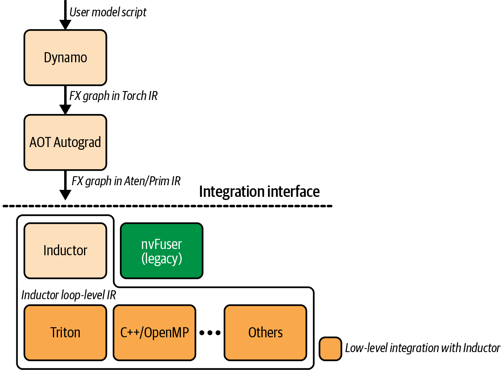
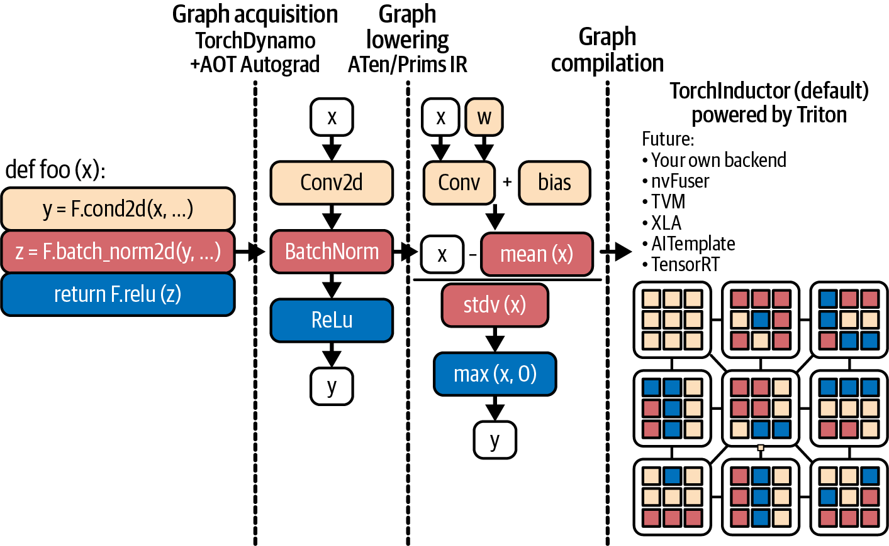
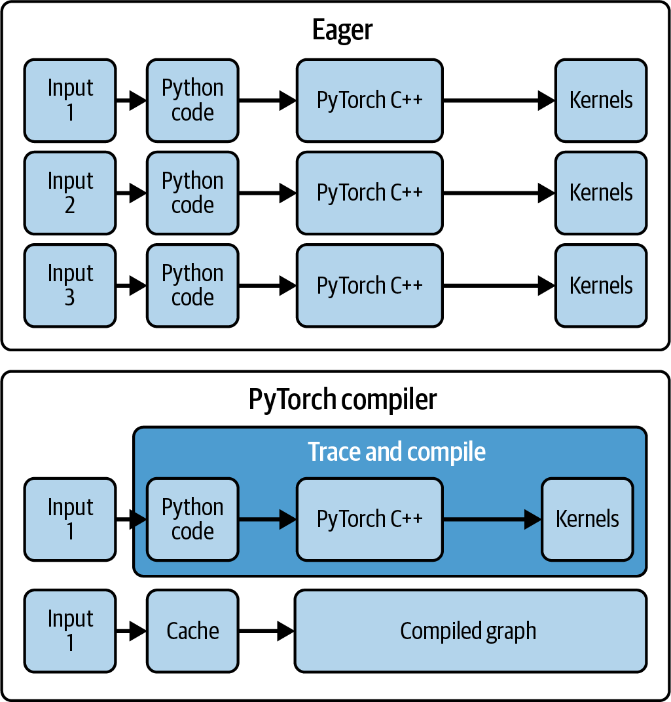
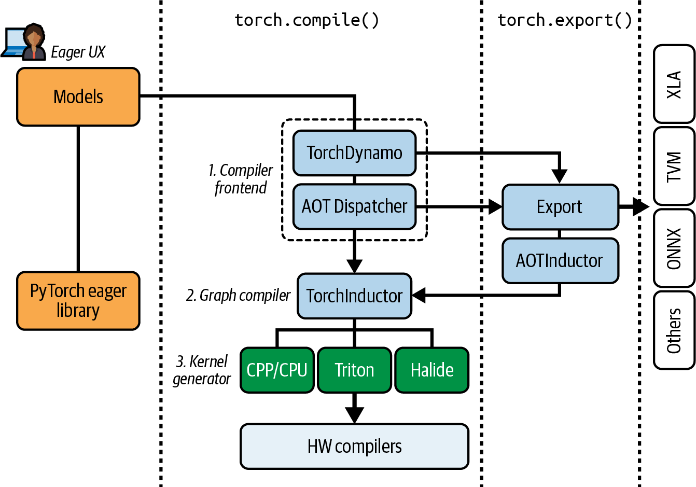
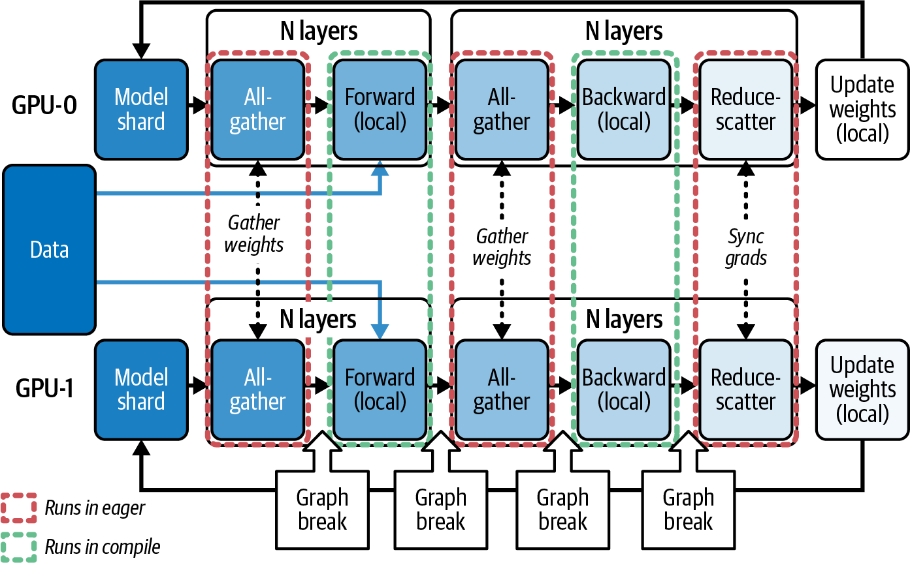
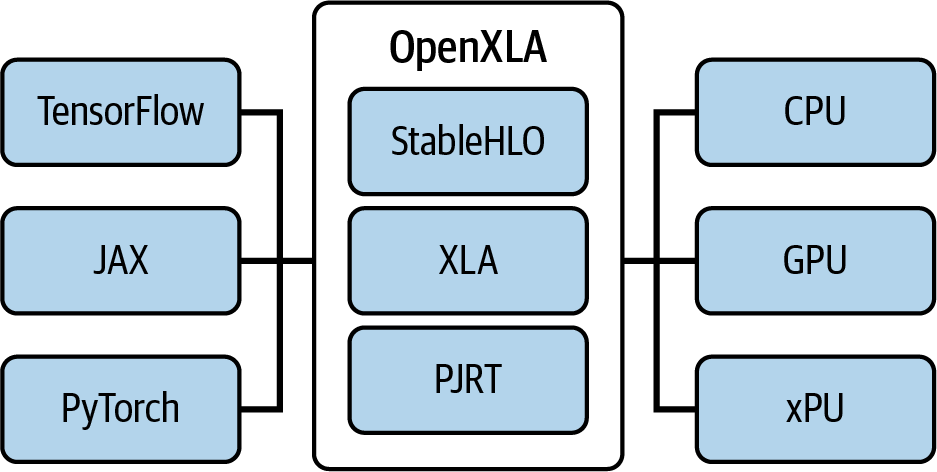

# 第14章 PyTorch编译器、OpenAI Triton和XLA后端 (PyTorch Compiler, OpenAI Triton, and XLA Backends)

在第13章中，我们讨论了多种优化和调优基于PyTorch的训练和推理工作负载的方法。我们介绍了PyTorch编译器以及它如何自动化内核融合和其他内核级技术，只需对代码进行很少的更改即可提高性能。在本章中，我们将深入研究动态PyTorch编译栈，包括TorchDynamo、Ahead-of-Time Autograd（AOT Autograd）和PrimTorch中间表示（IR）（也称为Prims或Prims IR）等组件，以及TorchInductor、加速线性代数（XLA）和OpenAI的Triton生态系统等编译器后端。PyTorch编译器栈如图14-1所示。



> Figure 14-1. Overview of PyTorch compiler stack

我们还将介绍用于调试编译流水线的工具，以及用于在多GPU和多节点集群上扩展PyTorch的库。然后，我们将探索torch.compile的底层工作原理，以及如何高效处理动态形状和可变序列长度。

> We also cover tools for debugging the compilation pipeline as well as libraries for scaling PyTorch across multi-GPU and multinode clusters. We will then explore how torch.compile works under the hood and how to handle dynamic shapes and variable sequence lengths efficiently.

我们还将研究PyTorch编译器与OpenAI Triton生态系统的集成。我们的目标是加速和扩展PyTorch模型和应用程序，同时不牺牲PyTorch灵活的即时执行开发体验。

> We will also examine the PyTorch compiler's integration with the OpenAI Triton ecosystem. Our goal is to accelerate and scale our PyTorch models and applications without sacrificing the flexible, eager-execution development experience of PyTorch.

## PyTorch编译器深入剖析 (PyTorch Compiler Deep Dive)

如第13章所述，PyTorch的torch.compile将编译您的PyTorch代码（和模型）以产生显著的加速。在大多数情况下，您只需一行代码即可完成，如下所示。我们将逐步讨论不同的选项：

```python
compiled_model = torch.compile(model, 
  mode="max-autotune",
  #  ...
) 
```

本节分解PyTorch编译流水线的步骤，包括TorchDynamo的图捕获、AOT Autograd的组合前向/后向图优化、PrimTorch IR和TorchInductor的代码生成。该流水线负责为目标GPU硬件生成优化的内核，如图14-2所示。



> Figure 14-2. PyTorch compiler pipeline (source: https://oreil.ly/55JDn)

### TorchDynamo用于字节码捕获和图提取 (TorchDynamo for Bytecode Capture and Graph Extraction)

TorchDynamo，或简称Dynamo，是torch.compile的第一阶段。它挂钩到Python的帧评估机制，在字节码级别拦截模型执行。

Dynamo挂钩到CPython的帧评估，以识别产生张量的字节码区域，并为这些区域构建执行图。然后，它使用选定的后端执行编译后的图。不支持的代码则以即时模式运行。

这种拦截和重写机制使TorchDynamo能够将PyTorch操作序列捕获到图表示中，然后由后续步骤（AOT Autograd和PrimTorch IR）进行优化，这些将在接下来的章节中介绍。

TorchDynamo利用CPython帧评估API（PEP 523）安全地捕获操作--并且开销极低。通常，Python解释器逐个执行每个操作。然而，启用Dynamo后，解释器将其执行重定向到Dynamo，后者在执行张量操作之前将其聚合到图中。这实现了全图优化，如内核融合，从而减少了每次操作的Python和主机端开销。

与为每个操作启动新的GPU内核并支付每次操作的Python开销不同，编译后的图可以将许多操作融合到一个或几个内核中。这减少了调度开销并改善了内存访问模式。

在第13章中，我们看到Python开销和许多小操作如何成为模型的瓶颈。我们还看到TorchDynamo通过在可能的情况下将小操作批处理为更大的单元来解决此问题--假设操作链是图友好的，并且不会导致太多的图断点。

> TorchDynamo, or just Dynamo, is the first stage of torch.compile. It hooks into Python's frame-evaluation mechanism to intercept model execution at the bytecode level. Dynamo hooks into CPython's frame evaluation to identify tensor-producing bytecode regions and constructs an execution graph for those regions. It then executes the compiled graph using the chosen backend. Unsupported code is left to run eagerly. This interception and rewriting mechanism is what lets TorchDynamo capture sequences of PyTorch operations into a graph representation that can be optimized by the next steps, AOT Autograd and PrimTorch IR, covered in the next sections. TorchDynamo leverages the CPython Frame Evaluation API (PEP 523) to capture the operations safely-and with minimal overhead. Normally, the Python interpreter executes each operation one by one. With Dynamo enabled, however, the interpreter redirects its execution to Dynamo, which aggregates the tensor operations into a graph before executing them. This enables whole-graph optimizations like kernel fusion, which reduces per-operation Python and host-side overhead. Instead of launching a new GPU kernel for each operation and paying per-operation Python overhead, the compiled graph can fuse many operations into one or a few kernels. This reduces dispatch overhead and improves memory access patterns. In Chapter 13, we saw how Python overhead and many small operations can bottleneck models. We also saw that TorchDynamo addresses this issue by batching small operations into larger units when possible-assuming the chain of operations is graph-friendly and doesn't cause too many graph breaks.

当通过torch.compile启用TorchDynamo时，它会检查每个Python操作码。每当遇到PyTorch张量操作（如算术运算或神经网络层）时，它不会立即执行。相反，Dynamo将操作作为节点追加到FX图中，并将执行延迟到捕获区域的编译后端。TorchDynamo继续此过程，直到遇到无法处理的代码。此时，会发生图断点（稍后会详细介绍），不支持的代码以常规的非编译即时模式运行。

TorchDynamo尝试将程序中尽可能大的部分编译为单个图，但当由于不支持的构造（如复杂的控制流或非PyTorch库调用）而无法继续时，它会回退到Python即时执行。这样做是为了确保正确性。在不支持的操作块通过后，Dynamo将在该点之后恢复将后续操作捕获到新图中。这种编译和非编译执行的混合为您提供了两全其美：您在需要的地方保持PyTorch的灵活性，但编译其他所有内容以提高速度。

您应该尽可能避免图断点，因为它们会中断全图优化并限制编译器的性能优势。

> You want to avoid graph breaks whenever possible, as they interrupt whole-graph optimizations and limit the performance benefits of the compiler.

您可以使用`torch.compiler.set_stance("fail_on_recompile")`强制Dynamo引发错误以捕获不安全的重新编译。它将记录重新编译的原因并帮助您调试图断点。这使您完全了解图为何分裂。代码如下所示：

```python
# 在图断点、重新编译时失败
torch.compiler.set_stance("fail_on_recompile")
compiled_model = torch.compile(model, 
  mode="max-autotune",
  ...
) 
```

> You can use torch.compiler.set_stance("fail_on_recompile") to force Dynamo to raise an error to catch unsafe recompilations. It will log the reason for recompile and help you debug the graph break. This gives you full visibility into why your graph is splitting. The code is shown here:

这样，您可以重构导致断点的代码路径--或者使用`torch._dynamo.allow_in_graph()`将它们标记为预期的图边界，如您稍后将看到的。一旦您的图干净了，您可以切换回`torch.compiler.set_stance("eager_on_recompile")`。请记住，将其设置回来将导致TorchDynamo在后续发生图断点时静默回退到即时模式。

TorchDynamo捕获的输出称为代码的FX图。FX是一种中间表示（IR），其中每个节点都是对PyTorch aten运算符或内置Python函数的调用。例如，考虑一个简单的Python函数，如下所示：

```python
def f(x, y):
    z = x.sin() + y
    return z.sum()
```

在这里，TorchDynamo将生成一个大致等效于以下伪代码的FX图：

```python
graph():  # FX IR的伪代码
    %x : Tensor = Placeholder[target=x]
    %y : Tensor = Placeholder[target=y]
    %sin : Tensor = torch.sin(%x)
    %add : Tensor = torch.add(%sin, %y)
    %sum : Tensor = torch.sum(%add)
    return %sum
```

FX图节点对应于占位符输入和对原始ATen操作的调用，如`aten::sin`、`aten::add`、`aten::sum`，清楚地表示计算图结构。一旦构建完成，这个FX图将被传递给AOT Autograd，用于组合前向传递和后向传递跟踪。

AOT Autograd生成的前向和后向组合跟踪随后被发送到编译器后端（如TorchInductor或XLA），以执行内核融合并生成优化的设备代码。TorchDynamo本身保持框架无关，专注于准确、低开销的图捕获。

> This way, you can refactor the code paths that are causing the break-or mark them as expected graph boundaries with torch._dynamo.allow_in_graph(), as you'll see in a bit. Once your graph is clean, you can switch back to torch.compiler.set_stance("eager_on_recompile"). Remember, setting this back will cause TorchDynamo to silently fall back to eager mode if a subsequent graph break occurs.

TorchDynamo捕获的输出称为代码的FX图。FX是一种中间表示（IR），其中每个节点都是对PyTorch aten运算符或内置Python函数的调用。例如，考虑一个简单的Python函数，如下所示：

```python
def f(x, y):
    z = x.sin() + y
    return z.sum()
```

> The output of TorchDynamo's capture is called an FX Graph of your code. FX is an intermediate representation (IR) in which each node is a call to a PyTorch aten operator or built-in Python function. For example, consider a simple Python function, as shown here:

在这里，TorchDynamo将生成一个大致等效于以下伪代码的FX图：

```python
graph():  # FX IR的伪代码
    %x : Tensor = Placeholder[target=x]
    %y : Tensor = Placeholder[target=y]
    %sin : Tensor = torch.sin(%x)
    %add : Tensor = torch.add(%sin, %y)
    %sum : Tensor = torch.sum(%add)
    return %sum
```

> Here, TorchDynamo will produce an FX Graph roughly equivalent to the following pseudocode:

FX图节点对应于占位符输入和对原始ATen操作的调用，如`aten::sin`、`aten::add`、`aten::sum`，清楚地表示计算图结构。一旦构建完成，这个FX图将被传递给AOT Autograd，用于组合前向传递和后向传递跟踪。

> The FX Graph nodes correspond to Placeholder inputs and calls to primitive ATen operations like aten::sin, aten::add, aten::sum, clearly representing the computation graph structure. Once constructed, this FX Graph is handed off to AOT Autograd for combined forward-pass and backward-pass tracing.

AOT Autograd生成的前向和后向组合跟踪随后被发送到编译器后端（如TorchInductor或XLA），以执行内核融合并生成优化的设备代码。TorchDynamo本身保持框架无关，专注于准确、低开销的图捕获。

> AOT Autograd's generated forward and backward combined trace is then sent to a backend compiler such as TorchInductor or XLA to perform kernel fusion and generate optimized device code. TorchDynamo itself remains framework-agnostic and focuses on accurate, low-overhead graph capture.

TorchDynamo将所有繁重的优化委托给下游编译器阶段。

TorchDynamo在Python值上插入保护--如张量形状、数据类型，甚至影响图跟踪的全局变量。这些保护确保如果某些被假定为常量的东西发生变化（例如，张量形状或数据类型），编译后的图将失效并在需要时重新编译。这允许稳健处理动态形状和模型修改--代价是当假设被违反时会进行额外的重新编译。

建议在使用PyTorch编译器时监控图重新编译的次数。

使用默认的`dynamic=None`，编译器将使用观察到的形状进行特化。当遇到动态形状时，它将重新编译一个更动态的内核。如果后来检测到额外的动态性来源，它可能会再次重新编译。

在实践中，这意味着您将在第一个变化形状的输入上看到一次额外的编译--而且只有一次额外的编译。如果您已经知道哪些输入维度会变化，可以在运行模型之前使用`torch._dynamo.mark_dynamic(tensor, dim)`。这将抢先进行初始编译。

您还可以使用`torch.compiler.set_stance()`进一步调整编译器的"立场"，以更改TorchDynamo何时以及如何回退到即时模式或重新编译。立场控制编译器在面对错误或回退时的容忍度或严格程度。这使您可以更多地控制开发人员反馈和不间断执行之间的权衡。以下是截至撰写时的立场：

**default**

编译器尝试编译它可以编译的内容，在遇到不支持的代码时静默回退到即时执行。这是标准的默认设置，会导致正常的编译行为和回退。

**fail_on_recompile**

如果遇到图断点或不支持的操作，编译器会引发错误。这在开发过程中很有用，当您想捕获意外的断点或未编译的路径时。

**eager_on_recompile**

当需要重新编译时，以即时模式运行代码。如果编译后的代码已经缓存（并且对输入有效），它仍应被使用。

**force_eager**

使用即时模式并忽略所有torch.compile指令。

> TorchDynamo delegates all heavy optimizations to downstream compiler stages. TorchDynamo inserts guards on Python values-such as tensor shapes, dtypes, and even global variables-that affect the graph trace. These guards ensure that if something changes that was assumed to be constant (e.g., tensor shape or dtype), the compiled graph is invalidated and recompiled if needed. This allows robust handling of dynamic shapes and model modifications-at the cost of additional recompilations when assumptions are violated. It's recommended to monitor the number of graph recompilations when using the PyTorch compiler. Using the default dynamic=None, the compiler will specialize using the observed shapes. When it encounters dynamic shapes, it will recompile a more dynamic kernel. It may recompile again if it later detects additional sources of dynamism. In practice, this means you'll see one extra compilation on the first varying-shape input-and only one extra compile. If you already know which input dimensions will vary, you can use torch._dynamo.mark_dynamic(tensor, dim) before running your model. This will preempt the initial compile. You can further tune the compiler's "stance" with torch.compiler.set_stance() to change how and when TorchDynamo falls back to eager or recompiles. A stance governs the compiler's tolerance or strictness in the face of errors or fallbacks. This gives you more control of the trade-off between developer feedback and uninterrupted execution. The following are the stances as of this writing: ...

通过捕获整个操作序列，TorchDynamo可以执行全图优化，如内核融合，以减少启动开销并最小化内存移动。它还消除了这些融合操作的Python层开销。图14-3比较了即时模式与编译模式，包括编译器缓存。

与分别执行每个小操作和内核启动不同，编译器可以将许多操作融合到单个内核中。这减少了CPU-GPU同步点并改善了内存局部性。否则，GPU将受到大量细粒度操作、繁重的同步和过多的全局内存访问的瓶颈限制。



> Figure 14-3. PyTorch eager versus compiled modes

TorchDynamo继续捕获，直到需要图断点。图断点可能由不支持的Python构造（如某些控制流，例如，使用Python布尔值而不是张量操作的if语句）或不支持的操作触发。当发生图断点时，当前图段结束，Dynamo对无法捕获的代码回退到即时模式。之后，一旦返回到可跟踪的代码，TorchDynamo将开始新的图跟踪。

您可以通过将逻辑表示为纯PyTorch张量操作（包括带有掩码的`torch.where()`）在PyTorch中成功实现编译器图友好的条件语句。以下是一个示例，将非图友好的Python if语句替换为纯张量操作掩码方法：

```python
# 从数据相关的张量条件计算布尔掩码
# mask形状为(batch_size,1)，可广播到x的形状
mask = x.sum(dim=1, keepdim=True) > 0

# 使用torch.where在两个张量表达式之间逐元素选择
# 在mask为True的地方选择f(x)，否则选择g(x)
out = torch.where(mask, f(x), g(x)) 
```

这避免了Python `if x.sum() > 0:`语句，该语句会导致图断点。它通过完全保持在PyTorch的图友好张量操作中来做到这一点。在这种情况下，TorchDynamo捕获整个序列，包括掩码和`torch.where()`，而不会断开图。

随着每个新版本，PyTorch扩展了可以在不导致图断点的情况下捕获的操作。例如，像`torch.cond`这样的高级条件原语可以在图中捕获某些if/else逻辑。具体来说，两个分支都被跟踪和编译。`torch.cond`需要一个布尔标量谓词。两个分支必须返回相同的结构和数据类型。形状在运行时必须一致。数据相关的分支通常会导致图断点。

建议通过使用像torch.where()这样的张量操作重构代码来最小化图断点，以最大化TorchDynamo可以捕获的连续区域。

> TorchDynamo continues capturing until a graph break is needed. A graph break can be triggered by unsupported Python constructs (like certain control flows, e.g., an if statement using a Python bool instead of tensor operations) or by unsupported operations. When a graph break occurs, the current graph segment ends, and Dynamo falls back to eager mode for the code that can't be captured. After that, TorchDynamo will start a new graph trace once it returns to traceable code.

您可以通过将逻辑表示为纯PyTorch张量操作（包括带有掩码的`torch.where()`）在PyTorch中成功实现编译器图友好的条件语句。以下是一个示例，将非图友好的Python if语句替换为纯张量操作掩码方法：

```python
# 从数据相关的张量条件计算布尔掩码
# mask形状为(batch_size,1)，可广播到x的形状
mask = x.sum(dim=1, keepdim=True) > 0

# 使用torch.where在两个张量表达式之间逐元素选择
# 在mask为True的地方选择f(x)，否则选择g(x)
out = torch.where(mask, f(x), g(x)) 
```

> You can successfully implement compiler-graph-friendly conditionals in PyTorch by expressing the logic as pure PyTorch tensor operations, including torch.where() with a mask. Here is an example that replaces a non-graph-friendly Python if statement with a pure-tensor operation masking approach:

这避免了Python `if x.sum() > 0:`语句，该语句会导致图断点。它通过完全保持在PyTorch的图友好张量操作中来做到这一点。在这种情况下，TorchDynamo捕获整个序列，包括掩码和`torch.where()`，而不会断开图。

> This avoids a Python if x.sum() > 0: statement, which causes a graph break. It does this by staying entirely within PyTorch's graph-friendly tensor operations. In this case, TorchDynamo captures the whole sequence, including the mask and torch.where() without breaking the graph.

随着每个新版本，PyTorch扩展了可以在不导致图断点的情况下捕获的操作。例如，像`torch.cond`这样的高级条件原语可以在图中捕获某些if/else逻辑。具体来说，两个分支都被跟踪和编译。`torch.cond`需要一个布尔标量谓词。两个分支必须返回相同的结构和数据类型。形状在运行时必须一致。数据相关的分支通常会导致图断点。

> With each new release, PyTorch expands which operations can be captured without causing a graph break. For instance, high-level conditional primitives like torch.cond can capture certain if/else logic in graphs. Specifically, both branches are traced and compiled. torch.cond requires a boolean scalar predicate. Both branches must return the same structure and dtypes. And shapes must be consistent at runtime. Data-dependent branches will often lead to graph breaks.

建议通过使用像torch.where()这样的张量操作重构代码来最小化图断点，以最大化TorchDynamo可以捕获的连续区域。

> It's recommended to minimize graph breaks by refactoring your code using tensor operations like torch.where() to maximize the continuous regions that TorchDynamo can capture.

### AOT Autograd融合前向和后向传递 (AOT Autograd Fusion for Forward and Backward Passes)

一旦TorchDynamo为尽可能多的前向传递捕获了FX图，下一个编译器阶段就是AOT Autograd。AOT Autograd以"函数式"模式通过PyTorch的autograd引擎运行Dynamo捕获的前向图，以记录后向操作。这就是静态后向图的生成方式（这与依赖PyTorch的默认autograd引擎逐个执行后向传递操作形成对比）。

本质上，AOT Autograd生成一个联合的前向-后向图，然后可以作为一个整体进行优化和融合。它保证与即时模式相同的前向和后向结果。

AOT Autograd通过autograd引擎跟踪前向图来捕获梯度计算。它有效地使用`torch.autograd.forward_ad`（或类似技术）运行前向图，以记录后向计算所需的操作。结果是一个组合的前向和后向图。然后可以使用公共子表达式消除等技术优化组合图。之后，由TorchInductor或XLA等后端编译。

通过提前规划前向和后向，PyTorch编译器可以跨前向和后向传递的边界进行整体融合。这导致跨越两个阶段的操作的前瞻融合。例如，如果可能，它可以将前向传递中的逐元素操作与后向传递中相应的逐元素梯度计算融合到一个内核中。

编译器还可以在安全的情况下通过重用前向和后向计算之间的中间结果来消除开销。这可以大大提高模型训练工作负载的性能，其中后向操作可能主导整体运行时间。

如果没有AOT Autograd，PyTorch需要使用默认的PyTorch autograd引擎分别执行每个后向操作--与前向传递无关。有了AOT Autograd，执行图被整体优化。

AOT Autograd产生的联合图保证计算相同的结果（这就是为什么当图无法保证正确性时需要图断点）。这个联合图可以进一步优化，因为整个操作序列（前向和后向）是已知的。

通过在前向和后向传递之间融合操作和内存使用，我们减少了内存访问和内核启动开销。当您为涉及梯度的操作和工作负载（如模型训练）调用`torch.compile`时，PyTorch的编译模式会在底层自动使用AOT Autograd。

简而言之，`torch.compile`使用AOT Autograd在模型训练期间提前计算梯度。它无缝处理大多数autograd操作，并保证与即时模式相同的结果。它在前向和后向传递之间重用缓冲区，以减少峰值内存使用。虽然这个阶段对最终用户来说几乎是不可见的，但它是实现现代AI模型训练工作负载大幅加速的关键组件。

> Once TorchDynamo has captured an FX Graph for as much of the forward pass as possible, the next compiler phase is AOT Autograd. AOT Autograd runs the Dynamo-captured forward graph through PyTorch's autograd engine in "functional" mode to record the backward operations. This is how the static backward graph is produced (this is in contrast to relying on PyTorch's default autograd engine to execute the backward-pass operations one by one). In essence, AOT Autograd generates a joint forward-backward graph that can then be optimized and fused as a whole. And it guarantees the same forward and backward results as eager mode.

AOT Autograd通过autograd引擎跟踪前向图来捕获梯度计算。它有效地使用`torch.autograd.forward_ad`（或类似技术）运行前向图，以记录后向计算所需的操作。结果是一个组合的前向和后向图。然后可以使用公共子表达式消除等技术优化组合图。之后，由TorchInductor或XLA等后端编译。

> AOT Autograd works by tracing the forward graph through the autograd engine to capture the gradient computations. It effectively runs the forward graph with torch.autograd.forward_ad (or a similar technique) to record which operations are needed for the backward computations. The result is a combined forward and backward graph. The combined graph can then be optimized using common-subexpression elimination, etc. Later, it's compiled by a backend like TorchInductor or XLA.

通过提前规划前向和后向，PyTorch编译器可以跨前向和后向传递的边界进行整体融合。这导致跨越两个阶段的操作的前瞻融合。例如，如果可能，它可以将前向传递中的逐元素操作与后向传递中相应的逐元素梯度计算融合到一个内核中。

> By planning both the forward and backward ahead of time, the PyTorch compiler can holistically fuse across the boundary of the forward and backward passes together. This results in ahead-of-time fusion of operations that span the two phases. For example, it can fuse an elementwise operation in the forward pass with the corresponding elementwise gradient computation in the backward pass, if possible, into one kernel.

编译器还可以在安全的情况下通过重用前向和后向计算之间的中间结果来消除开销。这可以大大提高模型训练工作负载的性能，其中后向操作可能主导整体运行时间。

> The compiler can also eliminate overhead by reusing intermediate results between forward and backward computations when safe to do so. This can improve performance greatly for model training workloads in which backward operations can dominate the overall runtime.

如果没有AOT Autograd，PyTorch需要使用默认的PyTorch autograd引擎分别执行每个后向操作--与前向传递无关。有了AOT Autograd，执行图被整体优化。

> Without AOT Autograd, PyTorch would need to execute each backward operation separately using the default PyTorch autograd engine-independently of the forward pass. With AOT Autograd, the graph of execution is optimized holistically.

AOT Autograd产生的联合图保证计算相同的结果（这就是为什么当图无法保证正确性时需要图断点）。这个联合图可以进一步优化，因为整个操作序列（前向和后向）是已知的。

> The resulting joint graph produced by AOT Autograd is guaranteed to compute the same results (this is why graph breaks are needed when the graph can't guarantee correctness). This joint graph can be further optimized because the whole sequence of operations, forward and backward, is known.

通过在前向和后向传递之间融合操作和内存使用，我们减少了内存访问和内核启动开销。当您为涉及梯度的操作和工作负载（如模型训练）调用`torch.compile`时，PyTorch的编译模式会在底层自动使用AOT Autograd。

> By fusing operations and memory usage across the forward and backward passes, we reduce memory accesses and kernel-launch overhead. PyTorch's compiled mode automatically uses AOT Autograd under the hood when you call torch.compile for operations and workloads that involve gradients, such as model training.

简而言之，`torch.compile`使用AOT Autograd在模型训练期间提前计算梯度。它无缝处理大多数autograd操作，并保证与即时模式相同的结果。它在前向和后向传递之间重用缓冲区，以减少峰值内存使用。虽然这个阶段对最终用户来说几乎是不可见的，但它是实现现代AI模型训练工作负载大幅加速的关键组件。

> In short, AOT Autograd is used by torch.compile to compute gradients ahead of time during model training. It handles most autograd operations seamlessly and guarantees the same results as eager mode. It reuses buffers across the forward and backward passes to reduce peak memory usage. And while this phase is mostly invisible to the end user, it's a key component to enabling large speedups in modern AI model training workloads.

### PrimTorch IR (Prims)简化运算符集 (PrimTorch IR (Prims) Simplified Operator Set)

在将图传递给低级代码生成器之前，PyTorch执行一种称为PrimTorch IR（在某些文档和源代码中称为Prims）的中间表示（IR）转换。PrimTorch IR是一种IR，将图中的各种操作减少为更小的"原始"操作核心集，因此得名PrimTorch。

作为背景，PyTorch在其完整API中有数千（> 2,000）个操作。PrimTorch IR将其减少为编译器可以专注的更小的原语集。在实践中，PrimTorch IR定义了大约250个原始操作，如基本算术、归约、复制、重塑等。

许多复杂或高级的PyTorch aten操作可以通过PrimTorch IR分解为这些原语。例如，像`x.add_(y)`这样的"就地"PyTorch操作被降低为函数式add，然后是显式复制回x的存储，如下所示：

```
%z    = aten::add(x, y)  
%copy = aten::copy_(x, %z)    # 将z的数据写入x
```

在这里，IR包含一个单独的`aten::copy_`节点，而不是特殊的就地变异。这使得所有张量更新显式化，并通过将变异视为普通复制操作来简化下游编译器内核。

具体来说，通过将就地变异转换为函数式操作加上不同的复制节点，编译器不再需要推理别名或隐藏的副作用。因此，融合传递和内存规划算法可以在纯函数式数据流上操作。这允许更激进的内核融合和可预测的高性能代码生成。

PrimTorch IR还有助于消除图中的别名和变异。它尝试在可能的情况下将操作转换为不执行就地更新的形式，因为这些可能会使优化复杂化。

PrimTorch IR传递的输出是一个仅包含aten IR和PrimTorch IR操作的FX图。然后FX图准备好由后端进行降低。

通过这种IR标准化，PrimTorch IR为编译器后端提供了一个稳定的、简化的接口。后端（如TorchInductor）不需要实现数千个PyTorch操作，只需要支持250个原语--其他更高级的操作从原语派生。这大大降低了复杂性。

由于大多数高级操作（例如，2,000+个PyTorch操作）可以分解为现有原语，即使PyTorch添加新操作以适应新算法、模型和技术，PrimTorch IR原语集的演变也相对缓慢。

稳定的PrimTorch IR接口意味着，例如，要支持新的加速器，开发人员只需要实现250个原语，而不是数千个ATen操作。

总结到目前为止的流水线：TorchDynamo捕获图，AOT Autograd添加后向传递并形成联合的前向-后向图，然后PrimTorch IR将操作规范化为更精简、更原始的集合。此时，我们有了整个计算的相当标准的、与设备无关的表示--包括前向和后向传递--以核心操作表示。现在让我们转向编译器后端执行的实际代码生成阶段。

> Before handing the graph over to a low-level code generator, PyTorch performs an intermediate representation (IR) transformation known as PrimTorch IR (Prims) in some documentation and source code. PrimTorch IR is an IR that reduces the variety of operations in the graph down to a smaller core set of "primitive" operations, hence the name PrimTorch. For context, PyTorch has thousands (> 2,000) of operations in its full API. PrimTorch IR reduces this to a much smaller set of primitives on which the compiler can focus. In practice, PrimTorch IR defines around 250 primitive operations, such as basic arithmetic, reductions, copy, reshape, etc.

许多复杂或高级的PyTorch aten操作可以通过PrimTorch IR分解为这些原语。例如，像`x.add_(y)`这样的"就地"PyTorch操作被降低为函数式add，然后是显式复制回x的存储，如下所示：

```
%z    = aten::add(x, y)  
%copy = aten::copy_(x, %z)    # 将z的数据写入x
```

> Many complex or high-level PyTorch aten operations can be decomposed into these primitives with PrimTorch IR. For instance, an "in-place" PyTorch operation like x.add_(y) is lowered into a functional add followed by an explicit copy back into x's storage, as shown here:

在这里，IR包含一个单独的`aten::copy_`节点，而不是特殊的就地变异。这使得所有张量更新显式化，并通过将变异视为普通复制操作来简化下游编译器内核。

> Here, the IR contains a separate aten::copy_ node instead of a special in-place mutation. This makes all tensor updates explicit and simplifies downstream compiler kernels by treating mutations as ordinary copy operations.

具体来说，通过将就地变异转换为函数式操作加上不同的复制节点，编译器不再需要推理别名或隐藏的副作用。因此，融合传递和内存规划算法可以在纯函数式数据流上操作。这允许更激进的内核融合和可预测的高性能代码生成。

> Specifically, by converting in-place mutations into functional operations plus distinct copy nodes, the compiler no longer has to reason about aliasing or hidden side effects. As a result, fusion passes and memory-planning algorithms can operate on a purely functional dataflow. This allows more aggressive kernel fusion and predictable, high-performance code generation.

PrimTorch IR还有助于消除图中的别名和变异。它尝试在可能的情况下将操作转换为不执行就地更新的形式，因为这些可能会使优化复杂化。

> PrimTorch IR also helps with things like eliminating aliasing and mutation in the graph. It tries to convert operations into a form that does not perform in-place updates when possible since these can complicate optimization.

PrimTorch IR传递的输出是一个仅包含aten IR和PrimTorch IR操作的FX图。然后FX图准备好由后端进行降低。

> The output of the PrimTorch IR pass is an FX Graph that contains only aten IR and PrimTorch IR operations. The FX Graph is then ready for lowering by the backend.

通过这种IR标准化，PrimTorch IR为编译器后端提供了一个稳定的、简化的接口。后端（如TorchInductor）不需要实现数千个PyTorch操作，只需要支持250个原语--其他更高级的操作从原语派生。这大大降低了复杂性。

> By doing this IR standardization, PrimTorch IR provides a stable, simplified interface for compiler backends to target. Instead of having to implement thousands of PyTorch operations, a backend like TorchInductor only needs to support the 250 primitives-other higher-level operations are derived from the primitives. This greatly reduces complexity.

由于大多数高级操作（例如，2,000+个PyTorch操作）可以分解为现有原语，即使PyTorch添加新操作以适应新算法、模型和技术，PrimTorch IR原语集的演变也相对缓慢。

> And since most high-level operations (e.g., 2,000+ PyTorch ops) can be decomposed into the existing primitives, the set of PrimTorch IR primitives evolves relatively slowly-even as PyTorch adds new operations to adapt to new algorithms, models, and techniques.

稳定的PrimTorch IR接口意味着，例如，要支持新的加速器，开发人员只需要实现250个原语，而不是数千个ATen操作。

> The stable PrimTorch IR interface means that to support a new accelerator, for example, developers need only implement the 250 primitives rather than thousands of ATen operations.

总结到目前为止的流水线：TorchDynamo捕获图，AOT Autograd添加后向传递并形成联合的前向-后向图，然后PrimTorch IR将操作规范化为更精简、更原始的集合。此时，我们有了整个计算的相当标准的、与设备无关的表示--包括前向和后向传递--以核心操作表示。现在让我们转向编译器后端执行的实际代码生成阶段。

> To summarize the pipeline so far: TorchDynamo captures a graph, AOT Autograd adds a backward pass and forms a joint forward-backward graph, and then PrimTorch IR canonicalizes the operations to a leaner, more primitive set. At this point, we have a fairly standard, device-agnostic representation of the whole computation-including the forward and backward passes-in terms of core operations. Now let's turn to the actual code-generation stage performed by the compiler backend.

### TorchInductor后端代码生成 (TorchInductor Backend Code Generation)

`torch.compile`栈的最后阶段是编译器后端。TorchInductor（或简称Inductor）是PyTorch的默认编译器后端。Inductor获取优化的、联合的前向和后向FX图（由aten + PrimTorch IR操作组成），并为目标硬件（包括NVIDIA GPU、AMD GPU、CPU等）生成高性能代码。

> XLA是一个针对非CUDA硬件的替代后端。它主要通过OpenXLA项目用于Google Cloud TPU。但它也可以支持采用XLA IR的其他加速器。例如，Meta的内部推理ASIC，Meta Training & Inference Accelerator（MTIA），使用XLA。此外，AWS的自定义Inferentia和Trainium加速器芯片在其开源AWS Neuron SDK中使用XLA编译器运行PyTorch。然而，NVIDIA GPU通常使用TorchInductor。

TorchInductor通过将图降低为循环级、定义即运行的IR来工作，然后将其编译为高效代码。在内部，Inductor将操作表示为多维数据上的循环。它在可能的情况下自动将FX图中的节点分组为融合循环块。每个组在代码生成期间成为一个内核。

Inductor还支持符号形状，允许动态维度。IR比原始CUDA更高级，因为它将逐元素计算等表示为张量索引上的循环。IR是用户可检查的，这有助于调试甚至扩展。

TorchInductor的IR也可用于`torch.export()`和AOTInductor的前瞻编译流程。AOTInductor编译`torch.export`产生的工件，用于AOT用例，如打包和部署。这允许跨运行保存和重用编译后的代码。导出在图14-4中在`torch.compile()`的上下文中突出显示。



> Figure 14-4. PyTorch compile and export (TorchDynamo → AOT Autograd → PrimTorch IR → TorchInductor → Triton/LLVM NVPTX); export via torch.export/AOTInductor; CUDA Graphs are used when shapes are static

对于NVIDIA GPU后端，TorchInductor使用OpenAI的Triton JIT编译器生成实际的GPU内核。Triton是用Python编写的类CUDA领域特定语言（DSL）。Triton还包括其DSL的编译器（我们稍后会详细介绍Triton）。

TorchInductor将其循环级IR转换为Triton代码，然后使用Triton编译器通过LLVM将Triton代码直接转换为NVIDIA PTX。请记住，PTX是NVIDIA为其NVIDIA GPU提供的低级指令集架构（ISA）。

重要的是，Triton使用LLVM NVPTX降低到NVIDIA PTX。它不会调用NVCC进行内核编译。这种方法让TorchInductor能够即时生成针对您的特定模型或算法定制的自定义内核。

循环级IR在Python中实现，这使得它易于检查和扩展。例如，假设图有一个操作`z = x.permute(1,0) + x[2,:]`。Inductor可能用以下IR表示此操作：

```python
def inner_fn(index: List[sympy.Expr]):
    i1, i0 = index  # 维度的索引变量
    tmp0 = ops.load("x", i1 + i0*size1)         # x[i1, i0]
    tmp1 = ops.load("x", 2*size1 + i0)          # x[2, i0]
    return ops.add(tmp0, tmp1)                 # 逐元素加法

torchinductor.ir.Pointwise(
    device=torch.device("cuda"), dtype=torch.float32,
    inner_fn=inner_fn, ranges=[size0, size1]
)
```

在这里，`size0`和`size1`是输入x的维度。`inner_fn`描述如何计算输出的一个元素。`Pointwise`节点表示对这些范围的循环嵌套，将`inner_fn`逐元素应用以产生输出。

这是一种定义即运行风格的IR。通过运行此IR，它执行迭代并调用`ops.load + ops.add`的Python。然后Inductor使用Triton JIT编译器和LLVM生成相应的NVIDIA PTX代码。

使用torch.library.wrap_triton和triton_op将Triton内核注册为具有autograd和假张量支持的一等PyTorch操作。这意味着您可以编写Triton内核，并让TorchInductor将其作为模型图的一部分进行优化。

> Use torch.library.wrap_triton with triton_op to register a Triton kernel as a first-class PyTorch op with autograd and fake-tensor support. This means you can write a Triton kernel and have TorchInductor optimize it as part of your model graph.

#### 使用TorchInductor进行自动调优 (Autotuning with TorchInductor)

TorchInductor包含一个基于Triton自动调优功能构建的自动调优器，我们将在接下来的章节中介绍。自动调优器为每个生成的GPU内核找到最佳启动配置。自动调优的配置按内核缓存，以便后续运行不需要重做调优步骤。

第一次使用TorchInductor后端编译代码时，它会花费额外的时间使用不同的块大小、瓦片大小等对不同的内核变体进行基准测试。Inductor选择最快的变体并在后续使用。内核自动调优增加了初始编译时间延迟，但生成的内核在运行时高度优化。

如果您回想起上一章，这种激进的自动调优被描述为max-autotune编译器模式。这是最耗时的编译器模式--这就是底层发生的事情。

除了内核融合和自动调优，TorchInductor还应用了许多低级优化。这些包括索引简化以减少循环中的复杂索引算术、生成代码中的公共子表达式消除，以及高效的内存规划以重用缓冲区并减少分配。

TorchInductor还使用CUDA图在运行时捕获内核序列，以便以最小的CPU开销进行更快的图重放。默认情况下，Inductor将尝试将其生成的内核包装到CUDA图中，以减少每次迭代的启动开销。这对于推理或运行任何具有许多内核的代码或模型特别有益。

第13章中描述的reduce-overhead和max-autotune编译器模式会触发CUDA图的使用。但是，CUDA图需要静态形状，因此启用动态形状编译时不会使用它们。换句话说，如果使用dynamic=True启用动态形状，TorchInductor将不会使用CUDA图。此外，当您需要自动调优但不进行CUDA图捕获时，可以使用max-autotune-no-cudagraphs。

通常，从默认模式开始，对大型/关键工作负载使用max-autotune以提供额外的加速，代价是显著的编译时间。对于较小的模型，您可能看不到太多好处。

TorchInductor的最终结果是为您的工作负载生成高度优化的、特定于设备的代码。在许多情况下，Inductor实现的性能接近甚至超过手工调优的库。例如，Inductor可以将整个逐元素操作序列（包括激活函数和逐点变换）融合到单个内核中。它甚至可以将某些矩阵乘法后跟逐元素操作（如偏置加法 + 激活函数）的模式融合到一次启动中。这手工做相对困难--并且需要持续的维护。

PyTorch编译器使用启发式方法和后端，可能会将某些操作（例如，大型GEMM）路由到高性能库，如cuBLAS/cuBLASLt或CUTLASS。它甚至可以为可融合模式发出Triton内核。在实践中，TorchInductor选择并缓存执行最佳的路径--或者已知对于给定形状最优的路径。

对于Transformer模型，TorchInductor将融合大型GEMM周围的层归一化和残差连接逐元素操作--同时仍使用cuBLAS进行实际的GEMM计算本身。或者，对于具有不规则内存访问的模型，Inductor的自定义Triton内核可以通过只做所需的工作来超越现有库的内核--而不受益于像cuBLAS或CUTLASS这样的通用库。

在现代GPU上，PyTorch的编译器可以与NVIDIA的Transformer Engine（TE）配合使用，用于某些Transformer块和层。但是，当您调用`torch.compile`时，PyTorch不会自动替换NVIDIA TE内核。TE是一个单独的库，您必须通过其模块或融合操作显式使用。但是当您调用TE API时，`torch.compile`可以围绕它们进行编译和融合。这与生成的Triton内核相辅相成，提供最大性能。

确保仅在计划直接在模型中调用TE模块时才安装NVIDIA Transformer Engine--例如，transformer_engine.pytorch.layers。torch.compile不会自动将TE内核交换到普通PyTorch模型中。

本质上，TorchInductor完成了将代码和模型转换为高性能GPU内核的繁重工作。随着每个PyTorch版本的发布，硬件覆盖范围正在扩大，新的优化技术正在涌现。例如，PyTorch提供了FlexAttention，这是一个新的注意力运算符，TorchInductor可以将其编译为接近FlashAttention性能的融合内核。具体来说，FlexAttention的融合内核已被测量为在前向和后向传递中达到现代FlashAttention性能的约85-90%，同时允许更多灵活性，包括块稀疏性和自定义掩码。要启用快速路径，请将以下`torch.backend.cuda`属性设置为True：

```python
# 确保启用SDPA快速路径
torch.backends.cuda.enable_flash_sdp(True)
torch.backends.cuda.enable_math_sdp(True)
torch.backends.cuda.enable_mem_efficient_sdp(True)
```

当使用`torch.nn.attention.flex_attention`时，确保您的输入满足快速路径约束。这样，TorchInductor可以发出融合的Triton内核。

TorchInductor和Triton支持现代GPU上的自动warp特化。编译器会在被认为有益时有选择地启用它。可以使用Triton元参数（如`num_consumer_groups`和`num_buffers_warp_spec`）调整warp特化。这些优化进一步提高了GEMM吞吐量。Triton的自动warp特化支持现代GPU目标（包括Blackwell（例如，tcgen05））上的TMA和张量描述符API。

建议使用基于描述符的分块加载/存储来映射到TMA并减少寄存器压力。这种方法优于手动tl.load循环。

简而言之，许多模型使用`torch.compile`运行得明显更快，尽管确切的增益取决于您模型的特征。第一次运行`torch.compile`时，您需要支付编译和自动调优成本，但后续运行使用缓存的图和内核进行闪电般的快速执行。

> In short, many models run significantly faster with torch.compile, though the exact gains depend on your models' characteristics. The first time you run torch.compile, you pay a compile and autotune cost, but subsequent runs use the cached graph and kernels for lightning-fast execution.

### 动态形状和可变序列长度 (Dynamic Shapes and Variable Sequence Lengths)

LLM训练和推理的一个主要挑战是可变大小的序列输入。在传统编译器和加速器中，变化的形状通常会导致重新编译，或者需要将输入填充到固定的公共大小。本节讨论动态形状跟踪在`torch.compile`中如何工作以处理可变长度序列。

幸运的是，PyTorch编译器栈设计为优雅地处理动态形状。具体来说，它允许模型接受不同的输入大小而无需每次重新编译，方法是使用SymPy库符号化表示未知维度，我们稍后会介绍。

PyTorch编译器会在观察到维度大小变化时自动将其标记为动态。TorchInductor从静态假设开始，然后在检测到形状变化时进行泛化重新编译。您通常会看到第一个新形状有一次额外的编译。通过预先设置`dynamic=True`标志，您将强制编译器从一开始就将所有维度视为动态。但是，请记住，设置`dynamic=True`将禁用CUDA图。最好只使用`torch._dynamo.mark_dynamic()`标记已知变化的维度。

TorchDynamo和TorchInductor在跟踪期间在动态维度上插入类似保护的条件（如`sequence_length <= 256`或您指定的任何范围），以生成适用于各种大小和范围的代码。例如，如果输出大小是`x.size(0) + y.size(0)`，Inductor可以将其表示为符号表达式，并确保生成的代码适用于满足保护条件的任何值。

当Dynamo遇到`sequence_length`的新形状时，它会设置一个新的保护条件（如`sequence_length <= 1024`）并在此新假设下编译内核--从那时起将该维度视为动态。后来，如果看到违反保护的更长序列，编译器将重新编译处理更大范围的新版本图。随着时间的推移，它会为每个不同的形状范围建立编译内核的缓存。

您还可以使用`torch._dynamo.mark_dynamic(tensor, dim)`手动在张量上标记预期的动态维度，以抢先进行重新编译。您也可以使用`torch.compiler.set_stance()`，它允许您调整重新编译的处理方式。例如，您可以使用`eager-on-recompile`立场在一定次数的重新编译后回退到即时模式。我们稍后会讨论避免重新编译的最佳实践。

TorchInductor尝试在第一次重新编译后泛化形状，而不是针对每个新形状重复特化。例如，它会在生成的内核内部使用if语句发出条件代码，以便一个内核适用于一系列`sequence_lengths`而不会出错。这减少了对每个大小单独编译的需要。

具有数据相关输出秩或极其复杂索引的某些操作可能仍会触发形状特化。在这些情况下，编译器会插入更多保护--如果这些保护经常被违反，您可能会看到频繁的重新编译，使用mark_dynamic()或set_stance()。

作为背景，在不支持动态形状的情况下处理可变长度序列的一种简单但低效的方法是将所有输入序列填充到批次中的最大长度。这样，您可以对所有输入使用一个静态计算。虽然填充简化了实现，但当输入长度变化很大时，它是低效的，因为大量计算浪费在无意义的填充标记上。

如果最大长度远大于所有输入的平均长度，填充可能会损害GPU利用率。然而，使用动态形状编译，我们可以让编译器生成只迭代到每个输入实际序列长度的代码。动态形状让您避免对可变长度进行过度填充。

让我们看一个典型的基于文本的生成AI场景，其中序列长度随着生成的进行而持续增长。使用动态形状编译可以持续优于即时执行--即使序列长度增加。

> Let's look at a typical text-based generative AI scenario in which sequence lengths continue to grow as the generation progresses. Compiling with dynamic shapes can consistently outperform eager execution-even as sequence length increases.

相比之下，如果将所有内容填充到2的幂次长度以使用静态形状，将引入大量浪费的计算，并由于更大的张量大小而增加编译时间。换句话说，使用动态形状提供了更好的编译时性能和运行时性能，以及更简单的使用方式，因为您不必手动填充输入。

> In contrast, if one were to pad everything to a power-of-two length to use static shapes, it would introduce a lot of wasted computation and increase compile time due to larger tensor sizes. In other words, using dynamic shapes provides better compile-time performance and runtime performance and easier usage since you don't have to manually pad the inputs.

建议按大小对输入进行分桶，以限制不同形状的数量。这将为剩余的变化启用动态形状。这种混合方法避免了过多的重新编译，同时仍减少了填充浪费。
> It's recommended to bucket inputs by size in order to limit the number of distinct shapes. This will enable dynamic shapes for the remaining variability. This hybrid approach avoids excessive recompilations while still reducing padding waste.

使用动态形状，您可以编译一次，并在不同形状的输入上使用相同的编译模型。如果变化在支持的范围内，一个编译模型可以处理多种配置。

> With dynamic shapes, you can compile once and use the same compiled model on inputs of different shapes. If the variations are within the supported range, one compiled model can handle multiple configurations.

在内部，TorchInductor使用SymPy库符号化表示动态维度。它将通过IR传播这些符号，以便像`z.size(0) = x.size(0) + y.size(0)`这样的表达式可以符号化处理。Inductor将条件简化为保护表达式。

> Internally, TorchInductor uses the SymPy library to represent dynamic dimensions symbolically. It will propagate these symbols through the IR so that an expression like z.size(0) = x.size(0) + y.size(0) can be handled symbolically. Inductor will reduce conditions to guard expressions.

如果保护失败，因为维度超出了预期范围--或者数据相关条件发生了变化，Inductor将触发重新编译。本质上，TorchInductor尝试为一系列大小编译通用内核，而不是单个固定大小。

> If a guard fails because the dimension fell outside an expected range-or a data-dependent condition changed, Inductor will trigger a recompile. In essence, TorchInductor attempts to compile a general kernel for a range of sizes instead of a single fixed size.

动态形状在最近的版本中已显著改进。但是，如果编译器无法符号化处理某些操作，可能会强制进行形状特化。在这种情况下，编译器可能会插入更多保护，如果经常被违反，可能导致频繁的重新编译并抵消编译的好处。

> Dynamic shape has significantly improved in recent releases. However, certain operations may force shape specialization if the compiler can't handle them symbolically. In this case, the compiler might insert more guards, which, if violated often, could lead to frequent recompilations and negate the benefits of compiling.

数据相关的控制流仍会触发特化。将动态形状用于可变序列长度，但不用于真正的数据相关分支。

> Data-dependent control flow still triggers specialization. Use dynamic shapes for varying sequence lengths but not for truly data-dependent branches.

值得注意的是，截至撰写本文时，CUDA图重放需要静态形状（和固定的内存地址）。并且实例化的图只支持有限的参数更新。内存地址和内核启动拓扑必须与捕获保持兼容。因此，启用动态形状通常会禁用这些区域的图捕获。这阻止了编译器获得CUDA图的性能优势，包括减少内核启动开销。

> It's worth noting that as of this writing, CUDA Graph replay requires static shapes (and fixed memory addresses). And only limited parameter updates are supported on instantiated graphs. Memory addresses and kernel-launch topology must remain compatible with capture. As such, enabling dynamic shapes will typically disable graph capture for those regions. This prevents the compiler from gaining the performance benefits of CUDA Graphs, including reduced kernel-launch overhead.

如果您指定reduce-overhead编译器模式但也设置dynamic=True，来自reduce-overhead的CUDA图优化将不会应用，因为您指定形状可以变化。启用动态形状将更改保护和内存规划，这将禁用图捕获。在实践中，仅对稳定形状使用mode="reduce-overhead"来获取CUDA图。对于可变序列长度，首选mode="default"或mode="max-autotune-no-cudagraphs"并在±10-20%范围内分桶/填充以限制重新编译。

> If you specify the reduce-overhead compiler mode but also set dynamic=True, the CUDA Graph optimization from reduce-overhead won't apply since you are specifying that the shapes can vary. Enabling dynamic shapes will change guards and memory planning, which will disable graph capture. In practice, use mode="reduce-overhead" only with stable shapes to get CUDA Graphs. For variable sequence lengths, prefer mode="default" or mode="max-autotune-no-cudagraphs" and bucket/pad within ±10-20% to limit recompiles.

建议对您的系统进行性能分析，看看动态形状是否值得用于您的用例。在某些情况下，填充到固定大小、使用静态形状和CUDA图可能更好，通过不必为每个唯一长度重新编译来实现更高的吞吐量。在其他情况下，动态形状会更好。

> It's recommended to profile your system to see if dynamic shapes are worth using for your use case. In certain cases, it might be better to pad to a fixed size, use static shapes with CUDA Graphs, and achieve higher throughput by not having to recompile for each unique length. In other cases, dynamic shapes will be better.

您应该对不同的方法进行性能分析，以找到最适合您的方法。这样做时，请务必监控内存使用。支持动态形状的代码会由于最大范围所需的额外保护和通用代码而产生略高的内存占用。

> You should profile different approaches to find what works best for you. When you do this, be sure to monitor memory usage. Code that supports dynamic shapes will incur a slightly higher memory footprint due to the additional guards and generalized code needed for the maximum range.

一个经验法则是，如果您的序列长度仅变化10%-20%，您可能会从固定长度填充中受益。
> A rule of thumb is that if your sequence lengths vary by only 10%-20%, you will likely benefit from fixed-length padding.

简而言之，动态形状支持意味着您不必为LLM模型中常见的可变长度输入禁用`torch.compile`。通过支持动态形状，PyTorch编译器可以跨不同输入大小执行内核融合和其他优化。

> In short, dynamic shape support means you don't have to disable torch.compile for variable-length inputs common in LLM models. By supporting dynamic shapes, the PyTorch compiler can perform kernel fusion and other optimizations across different input sizes.

LLM训练和推理的一个主要挑战是可变大小的序列输入。在传统编译器和加速器中，变化的形状通常会导致重新编译，或者需要将输入填充到固定的公共大小。本节讨论动态形状跟踪如何在`torch.compile`中工作以处理可变长度序列。

> A major challenge with LLM training and inference is the variable-sized sequence inputs. In traditional compilers and accelerators, varying shapes often cause recompilation or otherwise require padding inputs to a fixed, common size. This section discusses how dynamic shape tracing works in torch.compile to handle variable-length sequences.

### 禁用PyTorch编译器并回退到即时模式 (Disabling the PyTorch Compiler and Reverting Back to Eager Mode)

如果您想完全禁用`torch.compile`而不更改代码--对于A/B测试性能和隔离问题很有用--您可以使用`@torch.compiler.disable`装饰器禁用该函数的编译。 

> Specifically, it allows models to accept different input sizes without recompiling every time by using the SymPy library to represent unknown dimensions symbolically, as we'll cover in a bit. The PyTorch compiler will automatically mark dimensions as dynamic if it observes changes in their size. TorchInductor starts with static assumptions and then generalizes on recompile if it detects shape variability. You typically see one extra compile for the first new shape. By setting the dynamic=True flag upfront, you will force the compiler to consider all dimensions as dynamic from the start. However, remember that setting dynamic=True will disable CUDA Graphs. Prefer marking the code with only known varying dimensions using torch._dynamo.mark_dynamic(). TorchDynamo and TorchInductor insert a guard-like sequence_length <= 256 (or whatever range you specify) during tracing on dynamic dimensions to generate code that works for a variety and range of sizes. For instance, if an output size is x.size(0) + y.size(0), Inductor can represent that as a symbolic expression and ensure the generated code works for any values that satisfy the guard conditions. When Dynamo encounters a new shape for sequence_length, it sets a new guard such as sequence_length <= 1024 and compiles the kernels under this new assumption-treating the dimension as dynamic from that point on. Later, if a longer sequence is seen that violates the guard, the compiler will recompile a new version of the graph that handles the larger range. Over time, it builds up a cache of compiled kernels for each different shape range. You can also manually mark expected dynamic dimensions on a tensor with torch._dynamo.mark_dynamic(tensor, dim) to preempt a recompile. You can also use torch.compiler.set_stance(), which lets you adjust how recompilations are handled. For instance, you can use an eager-on-recompile stance to fall back to eager mode after a certain number of recompiles. We'll discuss best practices for avoiding recompiles in a bit. TorchInductor attempts to generalize shapes after the first recompilation instead of repeatedly specializing on each new shape. For instance, it will emit conditional code inside the generated kernel using an if statement so that one kernel works for a range of sequence_lengths without erroring out. This reduces the need for separate compilation for every single size. Certain operations with data-dependent output ranks-or extremely complex indexing-may still trigger shape specialization. In these cases, the compiler will insert more guards-and if those are frequently violated, you might see frequent recompilations with mark_dynamic() or set_stance(). For context, a simple but inefficient way to handle variable-length sequences without supporting dynamic shapes is to pad all input sequences to the max length in the batch. This way, you can use one static computation for all inputs. While padding simplifies the implementation, it is inefficient when input lengths vary widely since a lot of compute is wasted on the meaningless padding tokens. Padding can hurt GPU utilization if the maximum length is much bigger than the average length of all the inputs. With dynamic shape-compilation, however, we can let the compiler generate code that only iterates up to the actual sequence length of each input. Dynamic shapes let you avoid excessive padding for variable lengths. Let's look at a typical text-based generative AI scenario in which sequence lengths continue to grow as the generation progresses. Compiling with dynamic shapes can consistently outperform eager execution-even as sequence length increases. In contrast, if one were to pad everything to a power-of-two length to use static shapes, it would introduce a lot of wasted computation and increase compile time due to larger tensor sizes. In other words, using dynamic shapes provides better compile-time performance and runtime performance and easier usage since you don't have to manually pad the inputs. It's recommended to bucket inputs by size in order to limit the number of distinct shapes. This will enable dynamic shapes for the remaining variability. This hybrid approach avoids excessive recompilations while still reducing padding waste. With dynamic shapes, you can compile once and use the same compiled model on inputs of different shapes. If the variations are within the supported range, one compiled model can handle multiple configurations. Internally, TorchInductor uses the SymPy library to represent dynamic dimensions symbolically. It will propagate these symbols through the IR so that an expression like z.size(0) = x.size(0) + y.size(0) can be handled symbolically. Inductor will reduce conditions to guard expressions. If a guard fails because the dimension fell outside an expected range-or a data-dependent condition changed, Inductor will trigger a recompile. In essence, TorchInductor attempts to compile a general kernel for a range of sizes instead of a single fixed size. Dynamic shape has significantly improved in recent releases. However, certain operations may force shape specialization if the compiler can't handle them symbolically. In this case, the compiler might insert more guards, which, if violated often, could lead to frequent recompilations and negate the benefits of compiling. Data-dependent control flow still triggers specialization. Use dynamic shapes for varying sequence lengths but not for truly data-dependent branches. It's worth noting that as of this writing, CUDA Graph replay requires static shapes (and fixed memory addresses). And only limited parameter updates are supported on instantiated graphs. Memory addresses and kernel-launch topology must remain compatible with capture. As such, enabling dynamic shapes will typically disable graph capture for those regions. This prevents the compiler from gaining the performance benefits of CUDA Graphs, including reduced kernel-launch overhead. If you specify the reduce-overhead compiler mode but also set dynamic=True, the CUDA Graph optimization from reduce-overhead won't apply since you are specifying that the shapes can vary. Enabling dynamic shapes will change guards and memory planning, which will disable graph capture. In practice, use mode="reduce-overhead" only with stable shapes to get CUDA Graphs. For variable sequence lengths, prefer mode="default" or mode="max-autotune-no-cudagraphs" and bucket/pad within ±10-20% to limit recompiles. It's recommended to profile your system to see if dynamic shapes are worth using for your use case. In certain cases, it might be better to pad to a fixed size, use static shapes with CUDA Graphs, and achieve higher throughput by not having to recompile for each unique length. In other cases, dynamic shapes will be better. You should profile different approaches to find what works best for you. When you do this, be sure to monitor memory usage. Code that supports dynamic shapes will incur a slightly higher memory footprint due to the additional guards and generalized code needed for the maximum range. A rule of thumb is that if your sequence lengths vary by only 10%-20%, you will likely benefit from fixed-length padding. In short, dynamic shape support means you don't have to disable torch.compile for variable-length inputs common in LLM models. By supporting dynamic shapes, the PyTorch compiler can perform kernel fusion and other optimizations across different input sizes.

### 禁用PyTorch编译器并回退到即时模式 (Disabling the PyTorch Compiler and Reverting Back to Eager Mode)

如果您想完全禁用`torch.compile`而不更改代码--对于A/B测试性能和隔离问题很有用--您可以使用`@torch.compiler.disable`装饰器禁用该函数的编译。对于区域范围的控制，使用`torch.compiler.set_stance()`作为上下文管理器。这将强制代码以即时模式运行。例如，您可能希望禁用复杂数据加载或一次性初始化逻辑的编译，以保持编译图专注于计算。这对于不适合跟踪的代码也很有用，我们稍后会介绍。

或者，您可以简单地更改为使用即时后端，如下所示：`torch.compile(model, backend="eager")`。这将使您的代码恢复为以即时模式运行。这使您可以轻松调试和比较编译模式和即时模式之间的正确性/性能结果。

`torch.compiler.disable()`和`torch.compiler.set_stance()`是当某些操作不适用于PyTorch编译时的宝贵逃生舱--或者您只是出于性能原因不希望它们在图中。说到性能，让我们探索使用PyTorch编译器日志提高编译图和代码性能的方法。

> If you want to completely disable torch.compile without changing your code-useful for A/B testing performance and isolating issues-you can use the @torch.compiler.disable decorator to disable compilation for that function. For region-scoped control, use torch.compiler.set_stance() as a context manager. This will force the code to run in eager mode. For example, you might want to disable compilation for complex data loading or one-time initialization logic to keep the compiled graph focused on computations. This is also useful around code that does not work well with tracing, as we'll cover in a bit. Or, you can simply change to use the eager backend as follows: torch.compile(model, backend="eager"). This will revert your code to run in eager mode. This lets you easily debug and compare correctness/performance results between compiled and eager modes. torch.compiler.disable() and torch.compiler.set_stance() are a valuable escape hatches when certain operations don't work with PyTorch compile-or you simply don't want them in the graph for performance reasons. Speaking of performance, let's explore ways to improve the performance of our compiled graphs and code using the PyTorch compiler logs.

### 性能提示和调试生成的代码 (Performance Hints and Debugging Generated Code)

另一个非常有用的日志选项是启用`TORCH_LOGS="perf_hints"`。这些日志将向您显示错过的性能优化机会。例如，如果某个模式无法融合--或者无法使用CUDA图--它将记录一个提示，如"PerfHint: CUDA Graph not used because input is mutated"或"PerfHint: fell back to eager for random op"等。这些提示指导您了解可能限制代码或模型性能的因素。

> Another extremely useful logging option to enable is TORCH_LOGS="perf_hints". These logs will show you missed performance-optimization opportunities. For example, if a certain pattern could not be fused-or if a CUDA Graph could not be used-it will log a hint like "PerfHint: CUDA Graph not used because input is mutated" or "PerfHint: fell back to eager for random op," etc. These hints guide you on what might be limiting the performance of your code or model.

对于更深层次的性能调试和调优，您可能希望看到TorchInductor生成的确切代码。有几种方法可以检查代码。首先，您可以设置`TORCH_LOGS="output_code"`来打印每个编译图的生成代码。这将显示生成内核的原始源代码。如果需要，您甚至可以修改源代码并进一步优化。

> For deeper performance debugging and tuning, you likely want to see the exact code that TorchInductor generates. There are a couple of ways to inspect the code. First, you can set TORCH_LOGS="output_code" to print the generated code for each compiled graph. This will show the raw source code for the generated kernels. You can even modify the source code and further optimize, if needed.

您还可以通过设置`TORCH_COMPILE_DEBUG=1`启用TorchInductor的调试模式。当您在启用调试模式的情况下运行程序时，Inductor将创建一个调试目录（例如，`/tmp/torchinductor_<pid>/...`），其中包含FX图（.fx）、Inductor工件（如outputcode.py、fx_graph_runnable.py、IR转储和生成的Triton源代码）。

> You can also enable TorchInductor's debug mode by setting TORCH_COMPILE_DEBUG=1. When you run your program with debug mode enabled, Inductor will create a debug directory (e.g., /tmp/torchinductor_<pid>/...) that contains the FX Graph (.fx), Inductor artifacts such as outputcode.py, fx_graph_runnable.py, IR dumps, and generated Triton sources.

在阅读生成的.triton代码时，您可能会注意到Triton特定的构造--甚至在高级情况下的原始PTX。如果您还检查调试工件中编译的PTX，您可能会看到`mma.sync`指令，其中`tl.dot`被降低为Tensor Core操作。这些日志、工具和工件对于性能调优非常有用，因为它们让您确切地看到编译器在做什么。理解这些可以帮助您验证编译器是否正在应用内核融合、warp特化或双缓冲等优化。如果您发现效率低下，可以为您的特定用例手动创建自定义Triton内核。

> When reading the generated .triton code, you may notice Triton-specific constructs-or even raw PTX in advanced cases. If you also inspect the compiled PTX in the debug artifacts, you may see mma.sync instructions where tl.dot is lowered to Tensor Core operations. These logs, tools, and artifacts are incredibly useful for performance tuning because they let you see exactly what the compiler is doing. Understanding these can help you verify that the compiler is applying optimizations like kernel fusion, warp specialization, or double buffering. If you spot an inefficiency, you can manually create a custom Triton kernel for your specific use case.

如果您有善意，您甚至可以将自定义内核贡献回PyTorch和Triton生态系统，因为其他人可能会受益于您的优化。

> If you're feeling benevolent, you can even contribute your custom kernel back to the PyTorch and Triton ecosystems since it's likely that somebody else can benefit from your optimization.

### 调试数值正确性和精度 (Debugging Numerical Correctness and Accuracy)

虽然非常罕见，但`torch.compile`可能产生与即时模式相比数值不同的结果。如果您怀疑编译器中存在错误，在通知社区并创建GitHub问题之前，有一些策略可以验证和收集数据。

> While very rare, it's possible that torch.compile produces a result that is numerically different compared to eager mode. If you suspect a bug in the compiler, there are a few strategies to verify and collect data before notifying the community and creating a GitHub issue.

首先，您可以使用PyTorch的minifier工具创建可重现的脚本。PyTorch有TorchDynamo minifier工具和TorchInductor minifier工具，它们将尝试将您的程序减少到仍然重现错误的最小版本。这对于创建一个小型的、可重现的脚本供PyTorch团队使用非常有帮助。如果到了这一步，您会将此文件附加到您的GitHub问题中。

> First, you can use PyTorch's minifier tools to create reproducible scripts. PyTorch has a TorchDynamo minifier tool and TorchInductor minifier tool, which will try to reduce your program to the smallest version that still reproduces the error. It's very helpful to create a small, reproducible script for the PyTorch team to use if needed. You would attach this file to your GitHub issue if it gets to this point.

此外，您可以配置TorchDynamo在编译器栈的每一层调试数值精度。为了帮助确定数值差异是在哪里引入的，您可以在编译期间设置以下环境变量，将即时模式与不同的编译器阶段进行比较，并隔离问题是在TorchDynamo、AOT Autograd还是TorchInductor中：

> Additionally, you can configure TorchDynamo to debug numerical accuracy at each layer of the compiler stack. To help determine where a numerical discrepancy is introduced, you can set the following environment variables during compilation to compare eager mode to the different compiler stages and isolate if the issue is in TorchDynamo, AOT Autograd, or TorchInductor:

```bash
# 在每个编译阶段后转储输出
TORCHDYNAMO_REPRO_AFTER="aot"
TORCHDYNAMO_REPRO_LEVEL=4
```

这些设置将导致TorchDynamo在每个阶段后转储图--并以即时模式运行每个图进行比较。这可以帮助精确定位哪个阶段引入了错误。

> These settings will cause TorchDynamo to dump the graph after each stage-and run each graph in eager mode for comparison. This can help pinpoint which stage introduced the error.

具体来说，设置`TORCHDYNAMO_REPRO_AFTER="aot"`告诉TorchDynamo在AOT Autograd阶段后转储FX图并触发生成重现错误的脚本的逻辑。这与在初始Dynamo捕获后生成重现脚本形成对比。

> Specifically, setting TORCHDYNAMO_REPRO_AFTER="aot" tells TorchDynamo to dump the FX Graph and trigger the logic to generate a script to reproduce the error after the AOT Autograd stage. This is in contrast to generating the reproduction script after the initial Dynamo capture.

使用`TORCHDYNAMO_REPRO_LEVEL=4`，TorchDynamo将以即时模式运行每个转储的图，并将其输出与编译版本进行比较。如果检测到任何数值不匹配，这将停止并保存最小重现脚本。

> Using TORCHDYNAMO_REPRO_LEVEL=4, TorchDynamo will run each dumped graph in eager mode and compare its outputs to the compiled version. This halts and saves a minimal reproduction script if any numeric mismatch is detected.

PyTorch编译器团队喜欢修复正确性错误，所以如果您确实发现了真正的错误，请在GitHub上报告问题。确保通过设置`TORCHDYNAMO_REPRO_AFTER="aot"`和`TORCHDYNAMO_REPRO_LEVEL=4`来包含最小化的可重现工件集。

> The PyTorch compiler team loves fixing correctness bugs, so if you do find a true error, report the issue on GitHub. Make sure to include the minified reproducible set of artifacts by setting TORCHDYNAMO_REPRO_AFTER="aot" and TORCHDYNAMO_REPRO_LEVEL=4.

如果使用随机数（种子）或序列，您应该确保它们被一致地生成。默认情况下，TorchInductor可能不会产生与即时模式完全相同的随机种子或序列。一个原因是融合或重新排序的内核可能不会以与即时模式相同的预期顺序生成数字。

> If using random numbers (seeds) or sequences, you should make sure they are being generated consistently. By default, TorchInductor might not produce the exact same random seed or sequence as with eager mode. One reason is that fused or reordered kernels may not generate numbers in the same, expected order as eager mode.

如果需要，您可以设置`torch._inductor.config.fallback_random=True`来强制TorchInductor像即时模式一样生成随机数。这会导致轻微的性能损失，但在使用PyTorch编译器时可能是数值正确性所需的。

> If needed, you can set torch._inductor.config.fallback_random=True to force TorchInductor to generate random numbers exactly like it would with eager mode. This will incur a slight performance hit, but it may be required for numerical correctness when using the PyTorch compiler.

数值差异也可能源于浮点精度。例如，如果您使用PyTorch自动混合精度（AMP）或BF16，融合内核中的操作顺序可能会引入与即时模式未融合序列相比的轻微数值差异。

> Numerical differences can also stem from floating-point precision. For example, if you use PyTorch automatic mixed precision (AMP) or BF16, the order of operations in a fused kernel might introduce slight numerical differences versus eager's unfused sequence.

虽然这种差异很少影响收敛，但在某些情况下可能会。如果您怀疑与精度相关的不稳定性，尝试禁用`torch.compile`并以完整FP32运行模型以隔离问题。您还可以使用`torch.set_float32_matmul_precision('highest')`来控制TF32的使用以及完整FP32矩阵乘法的精度-性能权衡和最大数值精度。

> While such differences rarely affect convergence, they can in some cases. If you suspect precision-related instability, try disabling torch.compile and run the model in full FP32 to isolate the issue. You can also use torch.set_float32_matmul_precision('highest') to control TF32 usage and the accuracy-performance trade-off for full FP32 matmuls and maximum numerical accuracy.

同样重要的是要理解，使用混合精度（例如，FP16/BF16）可能会产生小差异。您可以通过设置`torch.use_deterministic_algorithms(True)`来强制执行确定性行为。这会导致PyTorch在使用非确定性操作时抛出错误。虽然`torch.compile`通过设计减少了一些非确定性来源，但在调试期间启用此标志仍然是良好的实践。

> It's also important to understand that small discrepancies may arise from using mixed precision (e.g., FP16/BF16). You can enforce deterministic behavior by setting torch.use_deterministic_algorithms(True). This causes PyTorch to throw an error if a nondeterministic operation is used. While torch.compile does reduce some sources of nondeterminism by design, it's still good practice to enable this flag during debugging.

但是，请记住，并非所有操作都有确定性实现。例如，依赖cuBLAS的默认`torch.matmul()`操作没有确定性实现。具体来说，cuBLAS实现依赖于像split-K这样的并行优化，可以以不同顺序减少操作。这导致浮点结果在运行之间不是逐位可重现的。

> Keep in mind, however, that not all operations have deterministic implementations. For example, the default torch.matmul() operation that relies on cuBLAS does not have a deterministic implementation. Specifically, the cuBLAS implementation relies on parallel optimizations like split-K, which can reduce operations in varying orders. This results in floating-point results that aren't bitwise reproducible across runs.

因此，启用此设置可能会导致代码失败，除非有可用的回退替代方案。要为依赖cuBLAS的操作（如`torch.matmul()`）强制执行完全确定性，您需要调用`torch.use_deterministic_algorithms(True)`并将`CUBLAS_WORKSPACE_CONFIG`设置为固定大小，如下所示：

> As such, enabling this setting may cause your code to fail unless there is a fallback alternative available. To enforce full determinism for cuBLAS-dependent operations like torch.matmul(), you need to call torch.use_deterministic_algorithms(True) and set the CUBLAS_WORKSPACE_CONFIG to a fixed size, as shown here:

```bash
# 在启动Python/PyTorch进程之前设置此环境变量
export CUBLAS_WORKSPACE_CONFIG=:4096:8   # 或 :16:8

# 在PyTorch进程中使用此设置
torch.use_deterministic_algorithms(True)
```

在这里，第一个值（例如，4096或16）选择cuBLAS工作区缓冲区的大小（以字节为单位，四舍五入到内部存储桶）。第二个值（例如，8）选择保留多少个这样的缓冲区。按照文档设置`:4096:8`或`:16:8`以强制执行确定性算法。

> Here, the first value (e.g., 4096 or 16) selects the size of the cuBLAS workspace buffer in bytes rounded to an internal bucket. The second value (e.g., 8) selects how many such buffers are reserved. Set either :4096:8 or :16:8 as documented to enforce deterministic algorithms.

要强制cuBLAS在`torch.use_deterministic_algorithms(True)`下使用确定性算法，请将`CUBLAS_WORKSPACE_CONFIG`设置为支持的值，如`:4096:8`或`:16:8`，如文档所述。如果您在不设置此项的情况下强制执行确定性，PyTorch将在运行时为否则会选择非确定性cuBLAS算法的操作引发错误。

> To force cuBLAS to use deterministic algorithms under torch.use_deterministic_algorithms(True), set CUBLAS_WORKSPACE_CONFIG to a supported value like :4096:8 or :16:8, as documented. If you enforce determinism without setting this, PyTorch will raise at runtime for operations that would otherwise select nondeterministic cuBLAS algorithms.

始终在您的实际硬件和模型配置上测试确定性，以确认可重现性。

> Always test determinism on your actual hardware and model configuration to confirm reproducibility.

此外，对于关键工作负载，您可能会通过设置像`torch._inductor.config.triton.cudagraphs=False`这样的标志来临时禁用某些编译器优化，以更好地隔离差异的原因。这会禁用TorchInductor生成的Triton内核的CUDA图捕获。

> Also, for critical workloads, you might temporarily disable certain compiler optimizations by setting flags like torch._inductor.config.triton.cudagraphs=False to better isolate the cause of a discrepancy. This disables CUDA Graph capture for TorchInductor-generated Triton kernels.

调试PyTorch编译器优化需要稍微不同的思维方式，因为您正在查看通过日志和图可视化的元级执行步骤--以及低级生成的代码。像`torch._dynamo.explain()`这样的工具提供了代码如何转换为图、图断点和子图的高级概述，而各种`TORCH_LOGS`选项让您窥视编译器做出的决策以及它生成的确切代码。

> Debugging PyTorch compiler optimizations requires a slightly different mindset since you're looking at the meta-level execution steps through logs and graph visualizations-in addition to the low-level generated code. Tools like torch._dynamo.explain() give a high-level overview of how your code is converted into graphs, graph breaks, and subgraphs, while the various TORCH_LOGS options let you peek into the decisions that the compiler makes-as well as the exact code that it generates.

简而言之，有了这些组合的工具和调试机制，您可以迭代地消除图断点，并确保您的模型和代码被完全捕获和优化。回报是值得的，因为一个良好编译的模型可以显著优于其即时执行对应物--特别是对于大型LLM架构，每一点性能改进都会累积起来。

> In short, with these combined tools and debugging mechanisms, you can iteratively eliminate graph breaks and make sure your model and code are fully captured and optimized. The payoff is worth it, as a well-compiled model can significantly outperform its eager-execution counterpart-especially for large LLM architectures in which every bit of performance improvement will add up.

虽然非常罕见，但`torch.compile`可能产生与即时模式相比数值不同的结果。如果您怀疑编译器中存在错误，在通知社区并创建GitHub问题之前，有一些策略可以验证和收集数据。

> While very rare, it's possible that torch.compile produces a result that is numerically different compared to eager mode. If you suspect a bug in the compiler, there are a few strategies to verify and collect data before notifying the community and creating a GitHub issue.

## 解释和最小化图断点 (Explaining and Minimizing Graph Breaks)

在使用`torch.compile`时，诊断性能和正确性需要专门的工具。在本节中，我们将向您展示如何使用各种工具和最佳实践来调试和精确定位过多的图断点。这些包括`torch._dynamo.explain()`、用于记录编译器决策的环境变量，以及调试捕获图和生成内核的最佳实践。

> When using torch.compile, diagnosing performance and correctness requires specialized tools. In this section, we'll show you how to use various tools and best practices to debug and pinpoint excessive graph breaks. These include torch._dynamo.explain(), environment variables to log compiler decisions, and best practices for debugging both the captured graphs and the kernels that they generate.

### 图断点和TorchDynamo explain() (Graph Breaks and TorchDynamo explain())

当TorchDynamo无法继续将连续的操作序列捕获到单个图中时，就会发生图断点。发生这种情况时，它会回退到即时模式执行这部分代码。

> A graph break occurs when TorchDynamo cannot continue capturing a continuous sequence of operations into a single graph. When this happens, it falls back to eager execution for this part of the code.

图断点是性能的敌人。每次断点意味着优化的图被缩短--并引入更多的Python开销。如果您编译一个模型并只看到适度的加速，可能是频繁的图断点阻止了大型融合图的形成。理想情况下，我们希望尽可能少的断点--理想情况下整个模型或整个训练步骤只有一个大图。

> Graph breaks are the enemy of performance. Each break means an optimized graph is cut short-and more Python overhead is introduced. If you compile a model and see only modest speedups, it may be caused by frequent graph breaks that are preventing large, fused graphs. Ideally, we want as few breaks as possible-ideally one large graph for the whole model or whole training step.

涉及集合通信（例如，all-gather、reduce-scatter等）的复杂图通常需要图断点。图14-5显示了PyTorch FSDP策略中由于集合通信导致的图断点。

> Complex graphs that involve collective communications (e.g., all-gather, reduce-scatter, etc.) often require graph breaks. Figure 14-5 shows the graph breaks in PyTorch's FSDP strategy due to collective communication.



> Figure 14-5. Graph breaks in PyTorch FSDP caused by communication layers (source: https://oreil.ly/TJW42)

PyTorch提供`torch._dynamo.explain()`来帮助分析和调试图断点。当使用您的模型和示例输入调用此调试函数时，它将在TorchDynamo中运行模型并返回生成了多少图、断点发生在哪里以及为什么发生的报告，如下所示，随后是详细的图断点分析和解释：

> PyTorch provides torch._dynamo.explain() to help analyze and debug graph breaks. When invoking this debugging function with your model and example inputs, it will run the model within TorchDynamo and return a report of how many graphs were generated, where the breaks occurred, and why they happened, as shown here, followed by the detailed graph-break analysis and explanation:

```python
import torch._dynamo as dynamo

def toy_example(a, b):
    x = a / (torch.abs(a) + 1)
    print("woo")         # 模型中的print语句
    if b.sum() < 0:      # 依赖于数据的动态控制流
        b = -b
    return x * b

explanation = dynamo.explain(toy_example)(torch.randn(10), 
torch.randn(10))
print(explanation)
```

输出：

> Output:

```
Graph Count: 3  
Graph Break Count: 2  
Op Count: 5  

Break Reasons:

  Break Reason 1:
    Reason: builtin: print [...ConstantVariable] False
    User Stack:
      <frame at toy_example: line 3, in toy_example>

  Break Reason 2:
    Reason: generic_jump TensorVariable()
    User Stack:
      <frame at toy_example: line 5, in toy_example>

Ops per Graph:
  ... 
```

在这里，解释显示TorchDynamo将代码分成三个图段，跨越两个图断点。注意输出的"User Stack"部分，它们指向问题发生的具体代码行。这对于精确定位导致图断点的代码非常有用。

> Here, the explanation shows that TorchDynamo splits the code into three graph segments across two graph breaks. Note the "User Stack" portions of the output that point to the specific line of code where the issue happens. This is very useful for pinpointing the code causing the graph break.

第一个断点是由第3行附近的`print("woo")`引起的。因为`print()`具有写入stdio的"副作用"，它无法被捕获。因此，Dynamo将图分成两个图：在print之前和之后。

> The first break is caused by the print("woo") near line 3. Because print() has a "side effect" of writing text to stdio, it isn't capturable. As such, Dynamo breaks the graph into two graphs: before and after the print().

第二个图断点是由第5行附近的动态控制流逻辑`if b.sum() < 0:`引起的，Dynamo无法在单个图中处理，因为在这个特定场景中使用了数据相关的动态控制流逻辑--这在前面章节中作为限制提到过。

> The second graph break is caused by the dynamic control flow logic if b.sum() < 0: near line 5, which Dynamo couldn't handle in a single graph because of the data-dependent dynamic control flow logic used in this specific scenario-and mentioned as a limitation in a previous section.

在您的模型上使用`dynamo.explain()`--使用代表性输入--是如果您没有从PyTorch编译器获得预期性能时首先要做的事情之一。它让您快速了解生成了多少图--以及为什么它不能只生成一个大图。

> Using dynamo.explain() on your model-with representative inputs-is one of the first things to do if you're not getting the performance you expect from the PyTorch compiler. It gives you a quick overview of how many graphs were made-and why it couldn't make just one large graph.

一旦您了解了原因，您可以逐个重构代码以解决图断点。在前面的示例中，您可以删除`print()`或将其包装在像`if not torch._dynamo.is_compiling()`这样的保护中，以避免在跟踪期间执行，如下所示：

> Once you understand the causes, you can refactor the code to address the graph breaks one by one. In the preceding example, you can remove the print() or wrap it in a guard such as if not torch._dynamo.is_compiling() to avoid executing during tracing, as shown here:

```python
import torch

def model(a, b):
    x = a / (torch.abs(a) + 1)

    # 在编译/跟踪期间避免
    if not torch._dynamo.is_compiling(): 
        print("do not print during tracing/compiling")

    if b.sum() < 0:      
        b = -b
    return x * b

explanation = dynamo.explain(model)(torch.randn(10), 
  torch.randn(10))
print(explanation)
```

在使用`torch.compile`时，诊断性能和正确性需要专门的工具。在本节中，我们将向您展示如何使用各种工具和最佳实践来调试和精确定位过多的图断点。这些包括`torch._dynamo.explain()`、用于记录编译器决策的环境变量，以及调试捕获图和生成内核的最佳实践。

> When using torch.compile, diagnosing performance and correctness requires specialized tools. In this section, we'll show you how to use various tools and best practices to debug and pinpoint excessive graph breaks. These include torch._dynamo.explain(), environment variables to log compiler decisions, and best practices for debugging both the captured graphs and the kernels that they generate.

图断点发生在TorchDynamo无法继续将连续的操作序列捕获到单个图中时。当这种情况发生时，它会回退到这部分代码的即时执行。图断点是性能的大敌。每个断点意味着一个优化的图被缩短——并且引入了更多的Python开销。如果您编译一个模型并看到只有适度的加速，这可能是由于频繁的图断点阻止了大型融合图的形成。理想情况下，我们希望尽可能少的断点——理想情况下整个模型或整个训练步骤只有一个大图。涉及集合通信（例如all-gather、reduce-scatter等）的复杂图通常需要图断点。图14-5显示了PyTorch的FSDP策略中由于集合通信而产生的图断点。

> A graph break occurs when TorchDynamo cannot continue capturing a continuous sequence of operations into a single graph. When this happens, it falls back to eager execution for this part of the code. Graph breaks are the enemy of performance. Each break means an optimized graph is cut short-and more Python overhead is introduced. If you compile a model and see only modest speedups, it may be caused by frequent graph breaks that are preventing large, fused graphs. Ideally, we want as few breaks as possible-ideally one large graph for the whole model or whole training step. Complex graphs that involve collective communications (e.g., all-gather, reduce-scatter, etc.) often require graph breaks. Figure 14-5 shows the graph breaks in PyTorch's FSDP strategy due to collective communication.

PyTorch提供了`torch._dynamo.explain()`来帮助分析和调试图断点。当使用您的模型和示例输入调用此调试函数时，它将在TorchDynamo中运行模型，并返回一个报告，说明生成了多少个图、断点发生在哪里以及为什么会发生。

> PyTorch provides torch._dynamo.explain() to help analyze and debug graph breaks. When invoking this debugging function with your model and example inputs, it will run the model within TorchDynamo and return a report of how many graphs were generated, where the breaks occurred, and why they happened.

如前所述，如果您的模型真正需要数据相关的分支，您可以将它们包装在`torch.cond()`中。这将捕获"true"和"false"分支作为图子程序，如下所示：

> As mentioned earlier, if your model truly needs data-dependent branches, you can wrap them in torch.cond(). This will capture both the "true" and "false" branches as graph subroutines, as shown here:

```python
import torch

def model_cond(a: torch.Tensor, b: torch.Tensor) -> torch.Tensor:
    # 像以前一样计算x
    x = a / (torch.abs(a) + 1)

    # 将编译时检查保留为Python级别的保护
    # 在跟踪/编译期间避免副作用
    if not torch._dynamo.is_compiling():
        print("do not print during tracing/compiling")

    # 处理b上的数据相关符号翻转
    b = torch.cond(
        b.sum() < 0,  # 谓词（0维布尔张量）
        lambda b: -b, # true_fn: 翻转符号
        lambda b: b,  # false_fn: 保持不变
        (b,)          # 操作数元组
    )

    return x * b

# 像以前一样生成并打印Dynamo解释
explanation = dynamo.explain(model_cond)(torch.randn(10), 
torch.randn(10))
print(explanation)
```

在这里，谓词`b.sum() < 0`必须是Python布尔值或单元素`torch.bool`张量。`true_fn`和`false_fn`是接受相同操作数（这里只是`(b,)`）并返回相同形状和数据类型张量的可调用对象。

> Here, the predicate b.sum() < 0 must be either a Python bool or a one-element torch.bool tensor. The true_fn and false_fn are callables taking the same operands (here, just (b,)) and returning tensors of the same shape and dtype.

此代码将Dynamo编译时检查（`dynamo.is_compiling()`）保留为Python if，因为它在运行时不是数据相关的，我们希望在跟踪期间避免副作用（例如，print）。

> This code keeps the Dynamo compile-time check (dynamo.is_compiling()) as a Python if since it's not data-dependent at runtime and we want to avoid side-effects (e.g., print) during tracing.

注意，`torch.cond()`目前只接受张量谓词，要求两个分支具有相同的输入并返回相同形状和数据类型的单个张量，并且不允许就地变异或任意副作用。

> Note that torch.cond() currently only accepts a tensor predicate, requires both branches to have the same inputs and return a single tensor of identical shape and dtype, and does not allow in-place mutations or arbitrary side-effects.

相比之下，您可以使用带有`torch.where()`的纯张量掩码方法，如前所述。这将不施加此类限制并避免图断点，使其成为当您不需要torch.cond()的完全表达力时的更简单、更可靠的选择。此代码如下所示：

> In contrast, you can use a pure-tensor masking approach with torch.where(), as described earlier. This will impose no such restrictions and avoids graph breaks, making it the simpler, more reliable choice when you don't need the full expressivity of torch.cond(). This code is shown here:

```python
import torch
import torch._dynamo as dynamo

def model_where(a: torch.Tensor, b: torch.Tensor) -> torch.Tensor:
    # 像以前一样计算x
    x = a / (torch.abs(a) + 1)

    # 保留编译时保护以在跟踪期间避免副作用
    if not torch._dynamo.is_compiling():
        print("do not print during tracing/compiling")

    # 使用torch.where表达数据相关分支
    b = torch.where(
        b.sum() < 0,  # 谓词：0维布尔张量
        -b,           # true分支：翻转符号
        b             # false分支：不变
    )

    return x * b

# 像以前一样显示Dynamo解释
explanation = dynamo.explain(model_where)(torch.randn(10), 
torch.randn(10))
print(explanation)
```

在这里，`torch.where(condition, input, other)`返回一个张量，在condition为True的地方从input选择元素，在condition为False的地方从other选择元素。因为`b.sum() < 0`产生一个0维布尔张量，它可以广播到b的所有元素。这允许单个向量化符号翻转，而不是逐元素的Python if。

> Here, torch.where(condition, input, other) returns a tensor selecting elements from input where condition is True and from other where condition is False. Because b.sum() < 0 produces a 0-dimensional Boolean tensor, it can be broadcast across all elements of b. This allows a single, vectorized sign flip instead of an elementwise Python if.

使用torch.where()可以避免编译和跟踪流水线中的图断点。这允许TorchDynamo内联优化操作。

> Using torch.where() can avoid graph breaks in compiled and traced pipelines. This allows TorchDynamo to optimize operations inline.

使用`torch.compiler.set_stance("fail_on_recompile")`也很有帮助，可以强制出错并拒绝运行如果代码不能干净地捕获到完整图中。这在开发过程中很有用，因为它让您在编译时提前捕获图断点，而不是静默回退到较慢的PyTorch即时执行。

> It's also helpful to use torch.compiler.set_stance("fail_on_recompile") to force an error and refuse to run if the code is not cleanly capturable into a full graph. This is useful during development since it lets you catch graph breaks upfront at compile time instead of silently falling back to slower PyTorch eager execution.

torch.compiler.set_stance("fail_on_recompile")也很有用，可以添加到您的CI构建中，以捕获开发过程中稍后引入的任何图断点。在整个项目生命周期中拥有稳健且持续的性能回归测试非常重要。

> torch.compiler.set_stance("fail_on_recompile") is also useful to add in your CI build to catch any graph breaks introduced later in the development process. Having robust and continuous performance-regression tests is extremely important throughout the life of a project.


### 最小化图重新编译 (Minimize Graph Recompilations)

除了图断点，您还应该监控重新编译的次数。如果TorchDynamo的保护不断使输入张量形状等失效，它可能会多次编译图。如果张量的形状在运行时发生变化，保护将失败并触发重新编译。如果您看到比预期更多的重新编译，请调查哪个保护（形状、数据类型等）导致了它--并解决问题。

> Besides graph breaks, you should also monitor the number of recompilations. TorchDynamo might be compiling the graph many times if its guards keep invalidating input tensor shapes, etc. If a tensor's shape changes at runtime, the guard fails and triggers a recompile. If you see more recompiles than expected, investigate which guard (shape, dtype, etc.) is causing it-and address the issue.

通常，您会注意到重新编译的发生，因为迭代将继续很慢--即使在初始预热/编译迭代之后。

> Typically, you'll notice recompilations happening because iterations will continue to be slow-even after the initial warm-up/compile iterations.

幸运的是，您可以让PyTorch使用`TORCH_LOGS="graph_breaks,recompiles,guards"`记录每个保护评估和任何触发重新编译。

> Fortunately, you can have PyTorch log each guard evaluation and any trigger recompilation using TORCH_LOGS="graph_breaks,recompiles,guards".

如果您观察到频繁的保护失败，这通常意味着Python端的常量，如随机数种子、时间戳或循环变化的值，在每次迭代中都在变化--并持续使保护失效并触发重新编译。在这种情况下，您需要确保这些值要么变成静态的，要么使用前面介绍的动态形状API处理（例如，`torch._dynamo.mark_dynamic`）。这将有助于避免不必要和过多的重新编译。

> If you observe frequent guard failures, it often means a Python-side constant, such as a random number seed, timestamp, or loop-varying value, is changing on every iteration-and continuously invalidating the guard and triggering a recompile. In this case, you'll need to ensure those values are either made static or handled with the dynamic-shape APIs presented earlier (e.g., torch._dynamo.mark_dynamic). This will help avoid needless and excessive recompiles.

根据情况，有几种常见的机制可以最小化图重新编译。首先，对于刚才提到的常量场景，您可以将常量作为张量传递到代码块中，以防止编译器保护该值并反复失败。

> There are a few common mechanisms to minimize graph recompilations depending on the situation. First, for the constant scenario just mentioned, you can pass the constant into the code block as a tensor to prevent the compiler from guarding on the value and repeatedly failing.

接下来，如前所述，您可以使用`torch._dynamo.mark_dynamic(tensor, dim)`标记您知道会变化的动态维度，以抢先进行重新编译。另一个选择是使用`torch.compiler.set_stance("eager_on_recompile")`在N次重新编译后回退到即时模式来避免重复重新编译。这实际上限制了重新编译的上限。

> Next, as mentioned earlier, you can mark dynamic dimensions that you know will change using torch._dynamo.mark_dynamic(tensor, dim) to preempt a recompile. Another option is to use torch.compiler.set_stance("eager_on_recompile") to avoid repeated recompiles by falling back to eager mode after N number of recompiles. This effectively caps the limit of recompilations.

另一个选择是使用`torch._dynamo.allow_in_graph`显式标记图的某些部分为安全。让我们在下一节更深入地探讨这种技术。

> Another option is to explicitly mark that part of the graph as safe using torch._dynamo.allow_in_graph. Let's dive into this technique a bit more in the next section.


### 使用allow_in_graph将函数和代码块标记为安全 (Mark Functions and Code Blocks as Safe with allow_in_graph)

当TorchDynamo不知道如何处理函数或代码块时（例如，因为它使用了不支持的操作），您可以使用`torch._dynamo.allow_in_graph`装饰函数或包装代码--作为Python装饰器或上下文管理器--来告诉Dynamo它没有副作用。当您这样做时，Dynamo将使用更宽松的分析和接受策略将代码包含在跟踪中。`allow_in_graph`绕过了一些Dynamo安全检查。因此，首选先修复图断点的根本原因。

> When TorchDynamo doesn't know how to handle a function or code block because it's using unsupported operations, for example, you can decorate the function or wrap the code with torch._dynamo.allow_in_graph-as either a Python decorator or context manager-to tell Dynamo that it has no side effects. When you do this, Dynamo will then include the code in the trace using a more lenient analysis and acceptance policy. allow_in_graph bypasses some Dynamo safety checks. As such, prefer fixing the root cause of graph breaks first.

这是一个高级功能，应该谨慎使用。您本质上是在承诺函数是纯的，对于相同的输入张量总是返回相同的输出张量，只依赖于其张量输入，并且没有副作用。如果使用不当，您可能会静默地得到错误的结果。但是，当正确使用时，如果特定函数或代码块尽管可以安全跟踪但导致图断点，它可能是性能救星。

> This is an advanced feature and should be used carefully. You are essentially promising that the function is pure, always returns the same output tensor for the same input tensor, depends only on its tensor inputs, and has no side effects. If used incorrectly, you may silently get the wrong results. However, when used correctly, it can be a performance lifesaver if a specific function or code block is causing a graph break even though it's safe to be traced.

一般来说，您应该谨慎使用`allow_in_graph`。它是高级用户覆盖Dynamo保守性质的工具--但只有在您绝对确定函数没有可能影响代码正确性的副作用或隐藏状态时才使用。

> In general, you should use allow_in_graph sparingly. It's a tool for power users to override Dynamo's conservative nature-but only when you're absolutely sure that the function does not have side effects or hidden state that could impact the code's correctness.

### 处理图断点的技巧 (Tips for Handling Graph Breaks)

图断点限制了编译器执行大型优化的能力，例如将许多内核融合为更少数量的高效内核。这迫使PyTorch对图的某些部分回退到较慢的即时执行。

> Graph breaks limit the compiler's ability to perform large optimizations such as fusing many kernels into a smaller number of efficient kernels. This forces PyTorch to fall back to slower eager execution for certain parts of the graph.

理解什么触发图断点以及如何防止它们至关重要。以下是一些常见的图断点原因和最小化它们的技巧：

> It's critical to understand what triggers graph breaks-and how to prevent them. Here are some common causes of graph breaks and tips on how to minimize them:

**避免就地操作和意外变异**

> Avoid in-place operations and unexpected mutations

TorchDynamo可以使用称为函数化的机制处理一些变异，该机制将就地操作转换为非就地操作以进行跟踪。但某些就地操作可能仍会导致图断点。如果您看到关于变异的断点原因，如"mutation on data"或"modifying a global"，请尝试重写该部分以避免就地操作。通常，您可以简单地将就地`x.relu_()`重写为非就地`x = x.relu()`以避免图断点，如果就地操作是导致问题的原因。

> TorchDynamo can handle some mutations using a mechanism called functionalization, which converts in-place operations to out-of-place for tracing. But certain in-place operations might still cause a graph break. If you see a break reason about mutation, such as "mutation on data" or "modifying a global," try to rewrite that part to avoid in-place operations. Often, you can simply rewrite in-place x.relu_() to out-of-place x = x.relu() to avoid a graph break if being in-place was causing the issue.

**优先使用PyTorch数据结构、集合和张量操作而不是等效的Python实现**

> Prefer PyTorch data structures, collections, and tensor operations over equivalent Python implementations

在函数内向Python张量列表追加会混淆TorchDynamo，因为它不能很好地跟踪增长的列表。尝试预分配张量或使用像`torch.stack()`这样的张量操作，而不是动态构建Python（非PyTorch）列表。对许多Python库的调用，包括I/O操作、print、logging和`math.*`函数，很可能会导致图断点。建议从性能关键代码路径中删除这些。

> Appending to a Python list of tensors inside a function will confuse TorchDynamo since it doesn't trace growing lists very well. Try to preallocate tensors or use tensor operations like torch.stack() instead of building Python (non-PyTorch) lists dynamically. Calls to many Python libraries, including I/O operations, print, logging, and math.* functions will most likely cause a graph break. It's recommended to remove these from the performance-critical code paths.

始终建议尽可能使用Python数据结构、集合和张量操作的PyTorch等效项。这些针对PyTorch编译、GPU处理和分布式数据传输进行了大量优化，这在基于PyTorch的AI应用程序和模型中很常见。

> It's always recommended to use the PyTorch equivalent of Python data structures, collections, and tensor operations whenever possible. These are heavily optimized for PyTorch compilation, GPU processing, and distributed data transfers, which are common in PyTorch-based AI applications and models.

**尽可能避免数据相关的控制流**

> Avoid data-dependent control flow, if possible

如果您有`if tensor.sum() > 0:`风格的逻辑，TorchDynamo无法轻松跟踪它，因为条件在编译时未知。它需要根据第一次运行选择一个分支或另一个，保护该条件，并为后续调用强制执行此保护。由于这是不正确的，Dynamo将创建一个图断点。

> If you have if tensor.sum() > 0: style logic, TorchDynamo cannot easily trace through this because the condition is unknown at compile time. It would need to choose one branch or the other based on the first run, guard on that condition, and enforce this guard for subsequent invocations. Since this is incorrect, Dynamo will create a graph break.

PyTorch支持称为`torch.cond()`的高级操作来捕获图中的某些动态流。这可以封装if/else语句，使得两个分支都被编译。但是，它要求条件是张量，通常最适合参数相关的开关而不是任意Python逻辑。

> PyTorch supports a high-level operation called torch.cond() to capture certain dynamic flows in graphs. This can encapsulate if/else statements such that both branches are compiled. However, it requires the condition to be a tensor and typically works best for things like parameter-dependent switches rather than arbitrary Python logic.

除此之外，大多数数据相关的控制流仍然会断开图。继续尽可能优先使用张量操作（`torch.where()`、掩码等）。如果`torch.cond()`和重构都不可行，您可能不得不接受图断点及其性能影响。

> Apart from this, most data-dependent control flow still breaks graphs. Continue to prefer tensor operations (torch.where(), masks, etc.) when possible. If neither torch.cond() nor refactoring is feasible, you may have to accept the graph break and its performance impact.

**了解PyTorch DDP的重叠和同步子图的性能特征**

> Understand performance characteristics of overlapping and synchronizing subgraphs with PyTorch DDP

PyTorch的DDP通过在同步点（包括all-reduce桶）显式断开图来与TorchDynamo配合工作。您可能会在explain输出中看到与allreduce或`torch.distributed`操作相关的断点。这是预期的，因为PyTorch可能会单独编译每个梯度桶的归约，以便它可以删除反向计算的重叠通信。

> PyTorch's DDP works with TorchDynamo by explicitly breaking graphs at synchronization points, including the all-reduce buckets. You might see breaks in the explain output related to allreduce or torch.distributed ops. This is expected, as PyTorch may compile each gradient bucket's reduction separately so that it can remove overlap communication with backward computation.

如果您想保留计算-通信重叠，您无法避免DDP通信边界的图断点。PyTorch的编译器和DDP故意在每个all-reduce桶处插入断点，以便梯度同步在子图之间发生。这让一个桶的通信与下一个桶的反向计算重叠。

> You can't avoid graph breaks at DDP communication boundaries if you want to preserve compute-communication overlap. PyTorch's compiler and DDP intentionally insert breaks at each all-reduce bucket so that gradient synchronization happens between subgraphs. This lets one bucket's communication overlap with the backward computation of the next bucket.

虽然这确实阻止了单个整体图，但它保留了性能。TorchDynamo + DDP的运行性能与即时模式DDP相似。它甚至可以在大规模上优于即时DDP。因此，虽然您不能消除这些通信图断点，但它们对于实现正确和高效的分布式训练以及适当的重叠是必要的。

> While this does prevent a single monolithic graph, it preserves performance. TorchDynamo + DDP runs with similar performance to eager-mode DDP. And it can even outperform eager DDP at scale. So, although you can't eliminate these communication graph breaks, they are necessary to achieve correct and efficient distributed training with the proper overlap.

**使用PyTorch FSDP包装图子模块**

> Wrap graph submodules with PyTorch FSDP

PyTorch通过使用`use_original_params=True`支持编译模式下的FSDP。最佳实践是将子模块（如每个Transformer块）包装到它们自己的FSDP子模块中。Dynamo将在每个FSDP子模块边界创建显式的图断点。这允许每个分片的通信与计算重叠，类似于DDP描述的分桶策略。

> PyTorch supports FSDP in compiled mode by using use_original_params=True. A best practice is to wrap submodules, like each transformer block, into their own FSDP submodule. Dynamo will then create explicit graph breaks at each FSDP submodule boundary. This allows each shard's communication to overlap with computation, similar to the bucketization strategy described for DDP.

编译的FSDP使用AOT Autograd和Inductor的内存规划器融合前向和后向传递，并在模型分片之间重用缓冲区。因此，每个GPU上只驻留活跃的参数切片和最小的中间内存缓冲区。与DDP或即时模式相比，这减少了峰值内存使用。

> Compiled FSDP fuses forward and backward passes and reuses buffers across model shards using AOT Autograd and Inductor's memory planner. As such, only the active parameter slices and minimal intermediate memory buffers are resident on each GPU. This reduces peak memory usage compared to DDP or eager mode.

内存节省来自避免冗余梯度存储、重用中间分配以及跨分片重叠通信与计算。这些允许更大的模型适应每个GPU。如果您不单独包装子模块，FSDP将回退到将所有参数视为一个大桶。这仍然有效，但限制了内存优势和重叠潜力。因此，建议将`torch.compile`与每个模块的FSDP包装器结合使用，以获得最大的速度和内存效率--特别是在大规模训练作业上。

> The memory savings comes from avoiding redundant gradient storage, reusing intermediate allocations, and overlapping communication with computation across shards. And these allow larger models to fit into each GPU. If you don't wrap submodules individually, FSDP falls back to treating all parameters as one big bucket. This still works, but it limits memory benefits and overlap potential. As such, combining torch.compile with per-module FSDP wrappers is recommended for maximum speed and memory efficiency-especially on large-scale training jobs.

如果出现问题，调试可能非常复杂--在更大的集群/配置中更加复杂。在使用FSDP和torch.compile时，始终在较小的配置上测试。

> Debugging can be very complex if issues arise-and even more complex in a larger cluster/configuration. Always test on a smaller configuration when using FSDP with torch.compile.

**监控使用自定义和第三方CUDA C++和Triton操作时的性能权衡**

> Monitor performance tradeoffs when using custom and third-party CUDA C++ and Triton operations

如果您依赖PyTorch不知道的自定义或第三方CUDA扩展，Dynamo将创建一个图断点，因为它无法推理该操作做什么--或者它是否安全。如果它对性能至关重要，请考虑使用Triton在Python中重写自定义操作。

> If you rely on a custom or third-party CUDA extension that PyTorch doesn't know about, Dynamo will create a graph break because it can't reason about what that operation does-or whether it's safe. If it's performance-critical, consider rewriting the custom operation in Python using Triton.

PyTorch支持`torch.library.triton_op()` API，让您可以将Triton内核作为自定义操作无缝集成到PyTorch中。这让编译器窥视Triton代码内部以执行优化。在深入Triton之前，让我们快速总结如何调试各种编译器阶段、图断点和编译器性能。

> PyTorch supports torch.library.triton_op() API that lets you integrate Triton kernels as custom operations into PyTorch seamlessly. This lets the compiler peek inside the Triton code to perform optimizations. Before diving into Triton, let's quickly summarize how to debug various compiler phases, graph breaks, and compiler performance.

许多流行的第三方库现在为其操作提供Triton实现或Dynamo/FX包装器。在编写自己的之前检查这些是否存在。

> Many popular third-party libraries now provide either a Triton implementation or Dynamo/FX wrappers for their operations. Check if these exist before writing your own.


### 调试编译器阶段、图断点和性能 (Debugging Compiler Phases, Graph Breaks, and Performance)

您可以通过设置各种环境变量（如`TORCH_LOGS`、`TORCH_COMPILE_DEBUG`和`TORCHDYNAMO_REPRO_*`）在运行时记录和调试不同类型的编译器事件。这些包括图断点、重新编译、保护和其他编译器决策。设置`TORCH_LOGS`的示例如下所示（常见值见表14-1）：

> You can log and debug different types of compiler events at runtime by setting various environment variables such as TORCH_LOGS, TORCH_COMPILE_DEBUG, and TORCHDYNAMO_REPRO_*. These include graph breaks, recompiles, guards, and other compiler decisions. An example of setting TORCH_LOGS is shown next (see Table 14-1 for common values):

```bash
# "graph_breaks", "dynamo", "aot_graphs", "inductor", 
# "graph_outputs", "graph_code", "dynamic", "perf_hints", 
# "output_code", "recompiles", "guards", etc.
TORCH_LOGS="graph_breaks" python train.py
```

这将导致PyTorch在发生图断点时打印出来。为了总结不同的日志选项，您可以将`TORCH_LOGS`设置为以下值来调试`torch.compile`，包括不同阶段（TorchDynamo、AOT Autograd和TorchInductor）、图、图断点、生成代码、性能、重新编译和保护--以及编译器决策和性能，如表14-1所示。

> This will cause PyTorch to print out whenever a graph break occurs. To summarize the different logging options, you can set TORCH_LOGS to the following to debug torch.compile, including the different phases (TorchDynamo, AOT Autograd, and TorchInductor), graphs, graph breaks, generated code, performance, recompiles, and guards-as well as compiler decisions and performance, as shown in Table 14-1.

**表14-1. torch.compile的日志选项**

| TORCH_LOGS值 | 描述 |
|-------------|------|
| graph_breaks | 记录图断点事件 |
| dynamo | 来自TorchDynamo的详细日志 |
| aot_graphs | 来自AOT Autograd的详细日志 |
| inductor | 来自TorchInductor的详细日志 |
| graph_outputs | 显示编译的FX图 |
| graph_code | 为TorchDynamo生成的每个FX图转储Python代码 |
| dynamic | 跟踪有关动态形状的决策以及何时将维度标记为动态 |
| perf_hints | 显示您错过的性能优化机会 |
| output_code | 打印每个编译图的生成代码 |
| recompiles | 记录重新编译触发 |
| guards | 记录保护和保护评估 |


如果您怀疑子图分段方式存在问题以及编译了哪些形状，这些设置可能很有用。使用这些设置，您将获得大量内部调试信息而无需更改代码。

准备好非常详细的输出。建议在只调试图断点时从"graph_breaks"开始。

在底层，设置`TORCH_LOGS`类似于使用`torch._logging.set_logs()` API。但是，将`TORCH_LOGS`设置为环境变量有时更容易在外部配置。

> Under the hood, setting TORCH_LOGS is analogous to using the torch._logging.set_logs() API. However, setting TORCH_LOGS is sometimes easier to configure externally as an environment variable.

请记住，您还可以设置`TORCH_COMPILE_DEBUG=1`来启用TorchInductor的调试模式。这将记录FX图、TorchInductor IR、生成的Triton代码，以及如果安装了Graphviz的HTML报告和可视化。

> And remember that you can also set TORCH_COMPILE_DEBUG=1 to enable TorchInductor's debug mode. This will log the FX Graph, the TorchInductor IR, the generated Triton code, and an HTML report with visualizations if Graphviz is installed.

您还可以设置`TORCHDYNAMO_REPRO_AFTER`和`TORCHDYNAMO_REPRO_LEVEL`来强制TorchDynamo在每个阶段后转储其图。它还将与非编译的即时模式版本的代码进行运行时比较。

> You can also set TORCHDYNAMO_REPRO_AFTER and TORCHDYNAMO_REPRO_LEVEL to force TorchDynamo to dump its graphs after each stage. It will also do a runtime comparison with the noncompiled eager version of your code.

还可以使用名为`tlparse`的工具跟踪编译日志。跟踪日志对于调试编译事件（例如，重新编译）以及生成错误报告很有用。

> There is also a tool called tlparse for tracing compilation logs. Tracing logs are useful for debugging compilation events (e.g., recompilations) as well as generating bug reports.

要启用跟踪日志，请使用`TORCH_TRACE`环境变量指定跟踪日志目录。然后在跟踪日志目录上运行`tlparse`以生成堆栈帧的树表示，如下所示：

> To enable trace logs, use the TORCH_TRACE environment variable to specify the trace log directory. Then run tlparse on the trace log directory to generate a tree representation of stack frames, as shown here:

```
- /workspace/networks/layers/transformer.py:634 in forward
  .../torch/nn/modules/module.py in _wrapped_call_impl
 .../torch/nn/modules/module.py in _call_impl
  - [2/2] [2/3] ../torch/_dynamo/convert_frame.py in __call__
  - /workspace/networks/layers/transformer.py:753 in forward
    - [8/2] [8/3] .../torch/_dynamo/convert_frame.py in __call__
...
```

此外，您可以使用Perfetto UI显示跟踪时间线可视化。由于跟踪产生的开销最小，甚至可以在生产中启用`TORCH_TRACE`。

> In addition, you can use the Perfetto UI to display a trace timeline visualization. And since tracing incurs minimal overhead, it's even possible to enable TORCH_TRACE in production.

现在让我们更深入地研究OpenAI的Triton语言和编译器，它们被TorchInductor使用。我们将编写一些基本和高级的Triton内核，然后将它们注册到PyTorch。

> In addition, you can use the Perfetto UI to display a trace timeline visualization. And since tracing incurs minimal overhead, it's even possible to enable TORCH_TRACE in production. Let's now dive deeper into OpenAI's Triton language and compiler used by TorchInductor. We'll write some basic and advanced Triton kernels and then register them with PyTorch.

## 使用OpenAI Triton编写自定义内核 (Writing Custom Kernels with OpenAI Triton)

到目前为止，我们只是简要提到了OpenAI的开源Triton语言和编译器。现在是时候深入研究了，因为TorchInductor使用Triton作为其后端代码生成实现--而且Triton在OpenAI等大公司的支持下越来越受欢迎。

> Up until now, we've only briefly mentioned OpenAI's open source Triton language and compiler. Now it's time to dive deeper since TorchInductor uses Triton as its backend code-generation implementation-and because Triton is growing in popularity with backing from large companies like OpenAI.

如前所述，Inductor在底层使用Triton生成优化的GPU内核。通过检查、理解和定制这些内核，您可以进一步提高TorchInductor所能产生的性能。学习Triton对于PyTorch和NVIDIA GPU环境中的性能优化至关重要。

> As mentioned, Inductor uses Triton to generate optimized GPU kernels under the hood. By examining, understanding, and customizing these kernels, you can further improve performance beyond what TorchInductor could produce. Learning Triton is critical to performance optimizations in a PyTorch and NVIDIA GPU environment.

从高层次来看，OpenAI Triton是一个开源的、Python原生的领域特定语言（DSL），用于以熟悉的Python编写GPU内核。Triton还包括一个JIT编译器，可将Triton代码直接转换为NVIDIA PTX代码。换句话说，Triton让您可以在Python中创建高性能的自定义GPU操作--而无需手动编写CUDA C++。

> At a high level, OpenAI Triton is an open source, Python-native domain-specific language (DSL) for writing GPU kernels in familiar Python. Triton also includes a JIT compiler that converts Triton code into NVIDIA PTX code directly. In other words, Triton lets you create high-performance custom GPU operations in Python-without writing CUDA C++ by hand.

Triton与PyTorch保持紧密集成，使其成为该生态系统中自定义GPU内核的首选。

> Triton remains tightly integrated with PyTorch, making it the go-to choice for custom GPU kernels in this ecosystem.

用Triton编写GPU内核比CUDA C++更加熟悉和简单。这对于喜欢留在Python中、快速迭代、不想担心复杂C++模板或详细内存管理的研究人员尤其如此。在存在PyTorch和Triton等专注于GPU性能的编译器的时代，他们根本不需要使用C++。

> Writing a GPU kernel in Triton is much more familiar and simpler than CUDA C++. This is especially true for researchers who prefer to stay in Python, iterate quickly, and not worry about complex C++ templates or detailed memory management. They simply don't need to use C++ in an era when GPU-performance-focused compilers like PyTorch and Triton exist.

NVIDIA已经认识到了这一趋势。2025年，他们宣布了以Python为中心的CUDA库（例如，cuTile、CuTe Python DSL、CUTLASS Python DSL和cuPyNumeric numpy替代品）。这些本质上是与Triton竞争的库。与torch.compile的集成继续发展，截至撰写本文时，TorchInductor仍使用Triton作为其主要GPU代码生成路径。

> NVIDIA has recognized this trend. In 2025, they announced Python-centric CUDA libraries (e.g., cuTile, CuTe Python DSL, CUTLASS Python DSL, and cuPyNumeric numpy replacement). These are essentially competing libraries to Triton. Integration with torch.compile continues to evolve, and as of this writing, TorchInductor still uses Triton as its primary GPU code generation path.

虽然PyTorch的torch.compile自动化了大量内核生成，但自定义Triton内核可以榨取最后一点性能--特别是对于TorchInductor当前范围之外的操作，如复杂稀疏模式和新型层类型。有时可以超越TorchInductor生成代码的性能--特别是如果您有领域特定的知识。但是，这非常高级，需要持续的维护和可能为新硬件支持进行重写。

> While PyTorch's torch.compile automates a lot of kernel generation, custom Triton kernels can squeeze out the last drops of performance-especially for operations outside of TorchInductor's current scope like complex sparse patterns and novel layer types. It's sometimes possible to beat the performance of TorchInductor's generated code-especially if you have domain-specific knowledge. However, this is very advanced and will require ongoing maintenance and potential rewrites for new hardware support.

现在让我们从快速的Triton编程入门开始。然后我们将深入研究一些有趣的Triton主题，包括访问共享内存、向PyTorch注册Triton内核、自动调优内核启动参数和性能分析。然后我们将介绍高级Triton主题，如warp特化和软件流水线（例如，双缓冲）。

> Let's now start with a quick Triton programming primer. Then we'll dive into some interesting Triton topics, including accessing shared-memory, registering a Triton kernel with PyTorch, autotuning kernel-launch parameters, and profiling. Then we'll progress to cover advanced Triton topics such as warp specialization and software pipelining (e.g., double buffering).


### Triton编程模型 (Triton Programming Model)

Triton使用单程序多数据（SPMD）模型，而不是CUDA的SIMT模型。这很重要，因为Triton有意抽象掉了CUDA指令和线程的低级细节。

> Triton uses a single-program, multiple-data (SPMD) model, as opposed to CUDA's SIMT model. This is significant because Triton intentionally abstracts away the low-level details of CUDA instructions and threads.

Triton内核（又称程序）在更高级别上运行，方法是在单独的线程块（又称协作线程数组，或CTA）上运行程序实例作为计算的基本单元。这与CUDA内核形成对比，后者在线程块中的单个线程上运行。

> Triton kernels (aka programs) operate at a higher level by running instances of the program on separate thread blocks (aka cooperative thread arrays, or CTAs) as the fundamental unit of compute. This is in contrast to CUDA kernels, which run on individual threads in a thread block.

社区倾向于互换使用Triton内核和Triton程序--通常更喜欢Triton内核，因此本书大部分情况下使用Triton内核。

> The community tends to use Triton kernel and Triton program interchangeably-typically preferring Triton kernel, so this book uses Triton kernel for the most part.

您使用Triton Python DSL编写Triton内核。然后Triton JIT编译器将内核编译为GPU代码，运行该内核的许多并行实例。每个程序实例映射到一个CUDA线程块。

> You write a Triton kernel with the Triton Python DSL. Then the Triton JIT compiler compiles the kernel into GPU code that runs many parallel instances of this kernel. Each program instance maps to a CUDA thread block.

Triton内核（又称程序）通过用@triton.jit装饰Python函数来定义。在内核内部，您使用triton.language模块中的特殊原语（通常别名为tl）来处理内存指针、执行向量化加载/存储，并使用tl.program_id和块偏移算术计算每个程序的索引。

> Triton kernels (aka programs) are defined by decorating a Python function with @triton.jit. Within the kernel, you use special primitives from the triton.language module, commonly aliased as tl, to work with memory pointers, perform vectorized loads/stores, and compute per-program indices using tl.program_id and block offset arithmetic.

Triton的SPMD模型意味着您通常使用向量化操作，例如添加两个tl.arange向量。Triton编译器将向量化SPMD代码映射到CUDA块中的线程。不保证一对一的元素到线程映射。

> Triton's SPMD model means you typically work with vectorized operations such as adding two tl.arange vectors. The Triton compiler maps vectorized SPMD code across the threads in a CUDA block. There is no guaranteed one-element-to-one-thread mapping.

您不需要显式管理单个线程或warp，因为Triton的编译器会为您完成这项工作。这是一个简单的Triton内核，在这种情况下添加两个大小相等的向量n_elements：

> You don't explicitly need to manage individual threads or warps with Triton since its compiler does this for you. Here is a simple Triton kernel that adds two vectors of equal size, n_elements, in this case:

```python
import triton
import triton.language as tl

BLOCK_SIZE = 1024

@triton.jit
def vector_add_kernel(x_ptr,y_ptr,out_ptr,n_elements,BLOCK_SIZE: 
tl.constexpr):
    pid = tl.program_id(axis=0)              # 每个块的唯一程序ID
    block_start = pid * BLOCK_SIZE
    # 每个程序处理BLOCK_SIZE个元素
    offsets = block_start + tl.arange(0, BLOCK_SIZE)  
    # 创建掩码以防止越界
    # （如果n不能被BLOCK_SIZE整除）
    mask = offsets < n_elements

    x = tl.load(x_ptr + offsets, mask=mask)        # 掩码加载
    y = tl.load(y_ptr + offsets, mask=mask)
    result = x + y
    tl.store(out_ptr + offsets, result, mask=mask) # 掩码存储
```

在这里，您可以看到Triton抽象掉了线程和warp。注意BLOCK_SIZE是一个编译时常量，定义每个程序实例处理多少元素。每个CUDA块的线程数由内核的配置使用num_warps控制，不等于BLOCK_SIZE。

> Here, you see that Triton abstracts away threads and warps. Note that BLOCK_SIZE is a compile-time constant that defines how many elements each program instance processes. The number of threads per CUDA block is controlled by the kernel's configuration using num_warps and is not equal to BLOCK_SIZE.

具体来说，在前面的代码中，tl.arange(0, BLOCK_SIZE)返回大小为BLOCK_SIZE的索引向量（[0, 1, ..., BLOCK_SIZE-1]）。我们将pid * BLOCK_SIZE或block_start添加到索引向量，以推导出实际索引x_ptr + offsets和y_ptr + offsets，用于在线程块上运行的内核实例的每个向量。

> Specifically, in the preceding code, tl.arange(0, BLOCK_SIZE) returns a vector of indices of size BLOCK_SIZE ([0, 1, ..., BLOCK_SIZE-1]). We add pid * BLOCK_SIZE, or block_start, to the vector of indices in order to derive the actual indices, x_ptr + offsets and y_ptr + offsets, into each vector for this instance of the kernel running on a thread block.

假设我们启动足够的Triton内核实例来覆盖每个向量中的元素总数n_elements，该内核将把两个向量x_ptr和y_ptr的每个元素相加，并将结果存储在out_ptr中。本质上，Triton让您以张量化的方式编写内核逻辑。

> Assuming we launch enough Triton kernel instances to cover the total number of elements, n_elements, in each of the vectors, this kernel will add together every element of the two vectors, x_ptr and y_ptr, and store the result in out_ptr. In essence, Triton lets you write kernel logic in a tensorized manner.

在这里，例如，我们一次操作整个索引块（offsets）。Triton编译器负责将此工作分配给实际的GPU线程，并确保在可能的情况下合并内存访问（tl.load和tl.store）。

> Here, for example, we operate on a whole block of indices (offsets) at once. The Triton compiler takes care of splitting this work among actual GPU threads and makes sure that memory accesses (tl.load and tl.store) are coalesced when possible.

要启动此Triton内核的实例，传递一个从meta['BLOCK_SIZE']计算程序实例数量的网格函数：

> To launch instances of this Triton kernel, pass a grid function that computes the number of program instances from meta['BLOCK_SIZE']:

```python
import triton

def grid(meta):
    return (triton.cdiv(n_elements, meta['BLOCK_SIZE']),)

vector_add_kernel[grid](x_ptr, y_ptr, out_ptr, n_elements, 
BLOCK_SIZE=1024)
```

在这里，代码使用掩码来避免在n_elements不是BLOCK_SIZE的倍数时发生越界内存访问。这与前面关于CUDA的章节类似，我们在内核中使用if (idx < N)来避免越界索引错误。

在加载/存储中使用掩码是一种巧妙而方便的方法，可以在不需要显式检查或if/else分支的情况下处理边界条件。

在底层，Triton将此程序转换为NVIDIA PTX，使得每个程序使用单个CUDA线程块。每个程序映射到一个CUDA线程块。tl.arange在程序内产生每通道索引，编译器将此向量化索引空间映射到块中的线程。您还可以以简单的方式管理矩阵操作的多维索引。Triton将自动为您处理算术和内存操作的向量化。

> Under the hood, Triton converts this program to NVIDIA PTX such that each program uses a single CUDA thread block. Each program maps to a CUDA thread block. tl.arange produces per-lane indices within the program, and the compiler maps this vectorized index space across the thread in the block. You can also manage multidimensional indices for matrix operations in a straightforward way. Triton will automatically handle vectorizing your arithmetic and memory operations for you.

简而言之，Triton为您提供Python的生产力和优化CUDA C++内核的性能。它还让您深入低级优化来操作和利用完整的内存层次结构（例如，共享内存分块等），如下一节所示。

> Triton uses a single-program, multiple-data (SPMD) model, as opposed to CUDA's SIMT model. This is significant because Triton intentionally abstracts away the low-level details of CUDA instructions and threads. Triton kernels (aka programs) operate at a higher level by running instances of the program on separate thread blocks (aka cooperative thread arrays, or CTAs) as the fundamental unit of compute. This is in contrast to CUDA kernels, which run on individual threads in a thread block. The community tends to use Triton kernel and Triton program interchangeably-typically preferring Triton kernel, so this book uses Triton kernel for the most part. You write a Triton kernel with the Triton Python DSL. Then the Triton JIT compiler compiles the kernel into GPU code that runs many parallel instances of this kernel. Each program instance maps to a CUDA thread block. Triton kernels (aka programs) are defined by decorating a Python function with @triton.jit. Within the kernel, you use special primitives from the triton.language module, commonly aliased as tl, to work with memory pointers, perform vectorized loads/stores, and compute per-program indices using tl.program_id and block offset arithmetic. Triton's SPMD model means you typically work with vectorized operations such as adding two tl.arange vectors. The Triton compiler maps vectorized SPMD code across the threads in a CUDA block. There is no guaranteed one-element-to-one-thread mapping. You don't explicitly need to manage individual threads or warps with Triton since its compiler does this for you. Here is a simple Triton kernel that adds two vectors of equal size, n_elements, in this case: ... Here, you see that Triton abstracts away threads and warps. Note that BLOCK_SIZE is a compile-time constant that defines how many elements each program instance processes. The number of threads per CUDA block is controlled by the kernel's configuration using num_warps and is not equal to BLOCK_SIZE. Specifically, in the preceding code, tl.arange(0, BLOCK_SIZE) returns a vector of indices of size BLOCK_SIZE ([0, 1, ..., BLOCK_SIZE-1]). We add pid * BLOCK_SIZE, or block_start, to the vector of indices in order to derive the actual indices, x_ptr + offsets and y_ptr + offsets, into each vector for this instance of the kernel running on a thread block. Assuming we launch enough Triton kernel instances to cover the total number of elements, n_elements, in each of the vectors, this kernel will add together every element of the two vectors, x_ptr and y_ptr, and store the result in out_ptr. In essence, Triton lets you write kernel logic in a tensorized manner. Here, for example, we operate on a whole block of indices (offsets) at once. The Triton compiler takes care of splitting this work among actual GPU threads and makes sure that memory accesses (tl.load and tl.store) are coalesced when possible. To launch instances of this Triton kernel, pass a grid function that computes the number of program instances from meta['BLOCK_SIZE']: ... Here, the code uses a mask to avoid out-of-bounds memory access when n_elements isn't a multiple of BLOCK_SIZE. This is similar to earlier chapters on CUDA in which we used if (idx < N) within our kernel to avoid out-of-bounds index errors. The use of a mask in loads/stores is a clever and convenient way to handle boundary conditions without requiring explicit checks or if/else branches. Under the hood, Triton converts this program to NVIDIA PTX such that each program uses a single CUDA thread block. Each program maps to a CUDA thread block. tl.arange produces per-lane indices within the program, and the compiler maps this vectorized index space across the thread in the block. You can also manage multidimensional indices for matrix operations in a straightforward way. Triton will automatically handle vectorizing your arithmetic and memory operations for you. In short, Triton gives you the productivity of Python with the performance of optimized CUDA C++ kernels. It also lets you drop down into low-level optimizations to manipulate and utilize the full memory hierarchy (e.g., shared-memory tiling, etc.), as we demonstrate in the next section.

### 在Triton中访问共享内存 (Accessing Shared Memory in Triton)

高效的Triton内核利用每个SM上的L2缓存和软件管理的共享内存。使用共享内存时，每个线程块从矩阵A和B加载一个瓦片到共享内存。这与每个线程重复从全局内存加载相同值形成对比。

> Efficient Triton kernels take advantage of the L2 cache and software-managed shared memory on each SM. When using shared memory, each thread block loads a tile from both matrix A and B into shared memory. This is in contrast to each thread repeatedly loading the same values from global memory.

然后内核重用这些瓦片进行多次计算。这更好地利用了片上内存缓存，减少了全局HBM和寄存器之间传输的数据量。

> The kernel then reuses those tiles for multiple computations. This better utilizes the on-chip memory caches and reduces the amount of data traveling between global HBM and the registers.

Triton不暴露显式的共享内存分配器。相反，它使用张量描述符（tl.make_tensor_descriptor(...)）和异步流水线将瓦片暂存在片上共享内存中，使用预期的形状和步幅。这样，您可以在流水线化的tl.range(..., num_stages=...)内通过这些描述符发出加载和存储。此循环降低为cp.async、TMA和屏障。

> Efficient Triton kernels take advantage of the L2 cache and software-managed shared memory on each SM. When using shared memory, each thread block loads a tile from both matrix A and B into shared memory. This is in contrast to each thread repeatedly loading the same values from global memory. The kernel then reuses those tiles for multiple computations. This better utilizes the on-chip memory caches and reduces the amount of data traveling between global HBM and the registers. Triton does not expose an explicit shared-memory allocator. Instead, it stages tiles in on-chip shared memory using tensor descriptors (tl.make_tensor_descriptor(...)) and an asynchronous pipeline using the intended shapes and strides. This way, you can issue loads and stores through those descriptors inside a pipelined tl.range(..., num_stages=...). This loop lowers to cp.async, TMA, and barriers.

### 向PyTorch注册自定义内核 (Registering Custom Kernels with PyTorch)

编写Triton内核后，您可以使用torch.library.triton_op将其注册为PyTorch中的自定义操作。这使得Triton内核对torch.compile可见，而不会将其视为可能回退到即时执行模式的不透明黑盒操作。这样，编译器知道Triton内核，在图捕获期间包含它，并与图的其余部分一起优化它。这允许额外的优化，如融合。

> After writing a Triton kernel, you can register it as a custom operation in PyTorch using torch.library.triton_op. This makes the Triton kernel visible to torch.compile without treating it as an opaque, black-box operation that could fall back to eager execution mode. This way, the compiler knows about the Triton kernel, includes it during graph capture, and optimizes it along with the rest of the graph. This allows additional optimizations such as fusion.

注册Triton内核有助于在使用自定义Triton内核/程序与PyTorch编译器时避免图断点。以下是从PyTorch注册和调用Triton内核vector_add_kernel的示例：

> Registering the Triton kernel helps avoid graph breaks when using custom Triton kernels/programs with the PyTorch compiler. Here is an example of registering and calling the Triton kernel vector_add_kernel from PyTorch:

```python
import torch
import triton
import triton.language as tl
from torch.library import triton_op, wrap_triton
from torch import Tensor

# Triton计算内核
@triton.jit
def vector_add_kernel(
    x_ptr, y_ptr, out_ptr, n_elements,
    BLOCK_SIZE: tl.constexpr
):
    pid = tl.program_id(0)
    start = pid * BLOCK_SIZE
    offsets = start + tl.arange(0, BLOCK_SIZE)
    mask = offsets < n_elements
    x = tl.load(x_ptr + offsets, mask=mask)
    y = tl.load(y_ptr + offsets, mask=mask)
    tl.store(out_ptr + offsets, x + y, mask=mask)

# 注册为Triton支持的PyTorch操作
@triton_op("my_triton_lib::vector_add", mutates_args=())
def vector_add(x: Tensor, y: Tensor) -> Tensor:
    assert x.device.type == "cuda" and y.device.type == "cuda"
    n = x.numel()
    out = torch.empty_like(x)
    # 计算网格大小
    def grid_fn(meta):
        return (triton.cdiv(n, meta["BLOCK_SIZE"]),)
    # 包装并启动Triton内核
    wrap_triton(vector_add_kernel)[grid_fn](x, y, out, n, 
BLOCK_SIZE=1024)
    return out

# 使用
a = torch.randn(10_000, device="cuda")
b = torch.randn(10_000, device="cuda")
c = torch.ops.my_triton_lib.vector_add(a, b)
```

在这里，triton_op("my_triton_lib::vector_add", mutates_args=())向PyTorch注册操作符名称和变异元数据（空）。然后wrap_triton(vector_add_kernel)将原始Triton内核包装成编译器可以在torch.compile图内内联和优化的可调用对象。编译器然后将融合、重排序并内联此内核与torch.compile图的其余部分。

> Here, triton_op("my_triton_lib::vector_add", mutates_args=()) registers the operator name and mutation metadata (empty) with PyTorch. Then wrap_triton(vector_add_kernel) wraps the raw Triton kernel into a callable that the compiler can inline and optimize within the torch.compile graph. The compiler will then fuse, reorder, and inline this kernel within the rest of the torch.compile graph.

注册仅前向操作很简单。但是，要利用PyTorch的自动微分进行完整训练支持，通常需要实现并注册自定义后向计算。否则，您需要从现有的可微分原语组合它。

> Registering forward-only operations is straightforward. However, to leverage PyTorch's automatic differentiation for full training support, you typically need to implement and register a custom backward computation. Otherwise, you need to compose it from existing differentiable primitives.

对于训练支持，使用vector_add.register_autograd(backward, setup_context=setup_context)注册autograd公式。如果您愿意，可以将逻辑包装在torch.autograd.Function中并注册前向和后向参数。但是，register_autograd是torch.compile可组合性的推荐路径。

> For training support, register an autograd formula using vector_add.register_autograd(backward, setup_context=setup_context). If you prefer, you can wrap the logic in a torch.autograd.Function and register both the forward and backward arguments. However, register_autograd is the recommended path for torch.compile composability.

如果OpenAI Triton不支持您需要的东西--或者没有提供您期望的性能--您可以使用像CUTLASS这样的库用CUDA C++重写内核以提高效率。然后我们将以类似的方式向PyTorch注册CUDA C++扩展，包括为后向传递注册autograd梯度计算。

> If OpenAI Triton doesn't support something that you need-or doesn't provide the performance that you expected-you can rewrite the kernel using CUDA C++ with a library like CUTLASS for efficiency. We would then register the CUDA C++ extension with PyTorch in a similar manner, including registering the autograd gradient computation for the backward pass.

### 调优内核启动参数 (Tuning Kernel-Launch Parameters)

Triton程序通常每个块使用4个warp或128个线程用于许多内核。但是，随着现代GPU硬件每个SM的共享内存和寄存器文件大小更大，通常可以将num_warps推高到每个块8或16个warp。例如，当BLOCK_SIZE >= 2048时可以将num_warps增加到8，当BLOCK_SIZE >= 4096时增加到16。

> Triton programs typically use 4 warps, or 128 threads, per block for many kernels. However, with modern GPU hardware's larger shared memory and register file sizes per SM, you can typically push num_warps higher to 8 or 16 warps per block. For instance, you can increase num_warps to 8 when BLOCK_SIZE >= 2048 and to 16 when BLOCK_SIZE >= 4096.

warp数量取决于您的内核是否可以利用并行性而不引起过多争用。最佳设置取决于内核的算术强度和内存访问模式。

> The number of warps is dependent on whether your kernel can make use of the parallelism without causing excessive contention. The optimal setting depends on the kernel's arithmetic intensity and memory access pattern.

考虑如下启动内核：my_kernel[grid](..., num_warps=8)。在这种情况下，我们为每个Triton内核指定8个warp（256个线程）。此配置通常对计算密集型内核有效。但是，内存受限的内核由于内存吞吐量限制可能仍限制在4个warp左右。

> Consider launching a kernel as follows: my_kernel[grid](..., num_warps=8). In this case, we are specifying 8 warps (256 threads) per Triton kernel. This configuration is typically effective for compute-heavy kernels. However, memory-bound kernels might still top out around 4 warps due to memory throughput limits.

对于内存受限的内核，每个线程块使用更多warp可以通过并行执行更多工作来帮助隐藏内存延迟。但每个线程块太多warp可能导致争用或缓存抖动。

> For memory-bound kernels, using more warps per thread block can help hide memory latency by doing more in parallel. But too many warps per thread block can cause contention or cache thrashing.

新一代GPU正在获得更多SM和更宽的内存总线。这让我们可以将每个块的warp数量从默认的4个warp增加到8或16个warp。这有助于增加占用率、覆盖更多内存访问延迟并饱和可用内存和计算。

> New GPU generations are gaining more SMs and wider memory buses. This lets us increase the number of warps per block from the default 4 warps to 8 or 16 warps. This helps to increase occupancy, cover more memory-access latency, and saturate the available memory and compute.

手动探索每个内核的BLOCK_SIZE和num_warps组合可能很繁琐。因此，通常最好使用Triton内置的自动调优器。它将进行基准测试并自动为您选择最佳的BLOCK_SIZE、num_warps、瓦片大小和其他参数。让我们在下一节探讨自动调优器。

> Triton programs typically use 4 warps, or 128 threads, per block for many kernels. However, with modern GPU hardware's larger shared memory and register file sizes per SM, you can typically push num_warps higher to 8 or 16 warps per block. For instance, you can increase num_warps to 8 when BLOCK_SIZE >= 2048 and to 16 when BLOCK_SIZE >= 4096. The number of warps is dependent on whether your kernel can make use of the parallelism without causing excessive contention. The optimal setting depends on the kernel's arithmetic intensity and memory access pattern. Consider launching a kernel as follows: my_kernel[grid](..., num_warps=8). In this case, we are specifying 8 warps (256 threads) per Triton kernel. This configuration is typically effective for compute-heavy kernels. However, memory-bound kernels might still top out around 4 warps due to memory throughput limits. For memory-bound kernels, using more warps per thread block can help hide memory latency by doing more in parallel. But too many warps per thread block can cause contention or cache thrashing. New GPU generations are gaining more SMs and wider memory buses. This lets us increase the number of warps per block from the default 4 warps to 8 or 16 warps. This helps to increase occupancy, cover more memory-access latency, and saturate the available memory and compute. Manually exploring combinations of BLOCK_SIZE and num_warps for each kernel can be tedious. As such, it's usually best to use Triton's built-in autotuner. This will benchmark and automatically pick the optimal BLOCK_SIZE, num_warps, tile size, and other parameters for you. Let's explore the autotuner in the next section.

### 自动调优Triton内核 (Autotuning Triton Kernels)

GPU内核性能对编译时参数高度敏感，如瓦片维度、warp计数、循环展开阶段以及寄存器和共享内存等片上资源的使用。Triton内置的自动调优器通过让您用@triton.autotune装饰triton.jit内核来自动搜索这些最佳设置。您可以传入描述BLOCK_SIZE、num_warps、num_stages、瓦片大小和其他内核元参数的不同候选组合的triton.Config对象列表。

> GPU kernel performance is highly sensitive to compile-time parameters such as tile dimensions, warp counts, loop unrolling stages, and the use of on-chip resources like registers and shared memory. Triton's built-in autotuner automates the search for these optimal settings by letting you decorate a triton.jit kernel with @triton.autotune. You can pass in a list of triton.Config objects that describe the different candidate combinations of BLOCK_SIZE, num_warps, num_stages, tile size, and other kernel meta-parameters.

在第一次内核调用期间，Triton JIT编译并对每个配置组合进行基准测试。请确保在此初始调用中使用代表性的输入工作负载，因为Triton将使用从其特征（如输入大小/形状）派生的键缓存该输入的最快配置。

> During the first kernel invocation, the Triton JIT-compiles and benchmarks each configuration combination. Be sure to use a representative input workload on this initial invocation, as Triton will cache the fastest configuration for that input using a key derived from its characteristics, such as input size/shape.

所有后续具有这些相同输入特征的调用将自动重用缓存的（最快的）配置。这样，您只需为每个输入大小/形状支付一次自动调优成本--并在后续内核调用中立即从最佳配置中受益。

> All subsequent calls that have these same input characteristics will automatically reuse the cached (fastest) configuration. This way, you only pay the autotuning cost once for each input size/shape-and immediately start benefiting from the optimal configuration in later kernel invocations.

如果Triton检测到新的输入形状，它将通过使用新输入特征迭代triton.Config对象来执行另一个自动调优过程。它将再次为此输入选择最佳配置并缓存以供后续内核调用使用。

> If Triton detects a new input shape, it will perform another autotune process by iterating through the triton.Config objects using the new input characteristics. It will again choose the best configuration for this input and cache it for subsequent kernel invocations.

为避免次优调优结果，建议您使用紧密匹配生产工作负载的现实和代表性输入预热自动调优器。这样，Triton用紧密反映您生产输入的最佳配置填充缓存。

您可以通过向@triton.autotune(key_fn=...)提供自定义key_fn来覆盖特定输入形状和工作负载的最佳设置，该函数将输入元数据（例如，张量形状）映射到自定义缓存键。这是一种高级技术，让您可以更好地控制不同类型输入工作负载的缓存配置。

在选择可能的内核配置时，值得记住的是，更大的瓦片和更多warp将以消耗每个线程块额外的寄存器和共享内存为代价增加算术强度。换句话说，通过增加计算与内存比率，您限制了占用率，因为由于增加的资源需求，每个SM可以执行更少的线程块。

> When choosing possible kernel configurations, it's worth remembering that larger tiles and more warps will increase arithmetic intensity at the expense of consuming additional registers and shared memory per thread block. In other words, by increasing the compute-to-memory ratio, you limit occupancy since fewer thread blocks can execute on each SM due to the increased resource needs.

相反，使用更小的瓦片和更少的warp将减少每个线程的工作和数据重用，但允许每个SM上同时激活更多的块和warp。这以较低的算术强度为代价提高了占用率。

> Conversely, using smaller tiles and fewer warps will reduce per-thread work and data reuse but allow more blocks and warps to be active on each SM concurrently. This improves occupancy at the expense of lower arithmetic intensity.

简而言之，最佳权衡取决于您的输入矩阵维度和GPU的特定资源限制。手动调优既耗时又容易出错。Triton的自动调优器使用数据驱动方法在现实工作负载上自动处理这种复杂性，以确定手动搜索可能错过的最佳配置。使用更高的num_warps（例如，8-16）和多阶段流水线通常会饱和Blackwell上的tcgen05.*路径。建议尽可能使用自动调优。

> GPU kernel performance is highly sensitive to compile-time parameters such as tile dimensions, warp counts, loop unrolling stages, and the use of on-chip resources like registers and shared memory. Triton's built-in autotuner automates the search for these optimal settings by letting you decorate a triton.jit kernel with @triton.autotune. You can pass in a list of triton.Config objects that describe the different candidate combinations of BLOCK_SIZE, num_warps, num_stages, tile size, and other kernel meta-parameters. During the first kernel invocation, the Triton JIT-compiles and benchmarks each configuration combination. Be sure to use a representative input workload on this initial invocation, as Triton will cache the fastest configuration for that input using a key derived from its characteristics, such as input size/shape. All subsequent calls that have these same input characteristics will automatically reuse the cached (fastest) configuration. This way, you only pay the autotuning cost once for each input size/shape-and immediately start benefiting from the optimal configuration in later kernel invocations. If Triton detects a new input shape, it will perform another autotune process by iterating through the triton.Config objects using the new input characteristics. It will again choose the best configuration for this input and cache it for subsequent kernel invocations. To avoid suboptimal tuning results, it's recommended that you warm up the autotuner with realistic and representative inputs that closely match your production workload. This way, Triton populates the cache with an optimal configuration that closely reflects your production inputs. You can override the optimal settings for specific input shapes and workloads by supplying a custom key_fn to @triton.autotune(key_fn=...) that maps the input metadata (e.g., tensor shapes) to a custom cache key. This is an advanced technique that gives you more control of the cache configurations for different types of input workloads. When choosing possible kernel configurations, it's worth remembering that larger tiles and more warps will increase arithmetic intensity at the expense of consuming additional registers and shared memory per thread block. In other words, by increasing the compute-to-memory ratio, you limit occupancy since fewer thread blocks can execute on each SM due to the increased resource needs. Conversely, using smaller tiles and fewer warps will reduce per-thread work and data reuse but allow more blocks and warps to be active on each SM concurrently. This improves occupancy at the expense of lower arithmetic intensity. In short, the optimal trade-off depends on both your input-matrix dimensions and your GPU's specific resource limits. Manually tuning is time-consuming and error-prone. Triton's autotuner handles this complexity automatically using a data-driven approach on realistic workloads to determine the optimal configuration that a manual search might miss. Using higher num_warps (e.g., 8-16) and multistage pipelining will often saturate tcgen05.* paths on Blackwell. It's recommended to use autotuning as much as possible.

### 高级Triton内核实现 (Advanced Triton Kernel Implementations)

为了巩固这些概念，接下来是一些用于warp特化和数据传输/计算异步双缓冲的自包含Triton内核示例。这些说明了如何实现Triton以将高级Python代码转换为高度优化的GPU内核。

> To solidify these concepts, next are some self-contained Triton kernel examples for warp specialization and asynchronous double buffering of data transfers/computations. These illustrate how you can implement Triton to transform high-level Python code into highly optimized GPU kernels.

#### 使用Triton进行Warp特化 (Warp Specialization with Triton)

TorchInductor可以针对其生成的许多GPU内核使用Triton的warp特化支持。它将尝试通过发出带有warp_specialize=True的tl.range()循环将每个线程块的warp分成"生产者"（内存）和"消费者"（计算）角色，类似于此处显示的示例：

> TorchInductor can target Triton's warp specialization support for many of its generated GPU kernels. It will try to split each thread block's warps into "producer" (memory) and "consumer" (compute) roles by emitting tl.range() loops with warp_specialize=True, similar to the example shown here:

```python
// warp_specialize=True在现代GPU上受支持
// 将其与num_stages > 1一起使用
// 以启用生产者/消费者warp分区
// 和重叠
for k in tl.range(0, K_tiles, _warn_unused=False, 
warp_specialize=True):
    # 循环体
    ...
```

内存warp预取下一个瓦片，而另一个warp计算当前瓦片。这将重叠内存延迟与计算以产生更高的吞吐量。Warp特化与基于描述符的TMA复制协同工作。您也可以通过将warp_specialize=True传递给tl.range()在自己的自定义Triton内核中使用此功能，如代码所示。

> The memory warp prefetches the next tile while another warp computes the current tile. This will overlap memory latency with computation to produce higher throughput. Warp specialization works hand-in-hand with descriptor-based TMA copies. You can also use this in your own custom Triton kernels by passing warp_specialize=True to tl.range(), as shown in the code.

您还可以通过在triton.Config中设置num_consumer_groups>0（例如，2）和num_buffers_warp_spec（例如，3）通过Triton自动调优配置驱动warp特化，如下面的代码片段所示。这将使生产者和消费者保持忙碌。如果提供，TorchInductor将在底层使用这些值：

> You can also drive warp specialization through Triton autotune configs by setting num_consumer_groups>0 (e.g., 2) and num_buffers_warp_spec (e.g., 3) in triton.Config as shown in the following code snippet. This will keep the producers and consumers busy with work. If provided, TorchInductor will use these values under the hood:

```python
triton.Config(
    { 'BLOCK_M': 128, 'BLOCK_N': 128, 'BLOCK_K': 64,
      'num_warps': 8, 'num_stages': 2,
      'num_consumer_groups': 2, '
      num_buffers_warp_spec': 3 }
)
```

这种特化方法对于迭代GEMM中大K维度的长时间运行循环特别有效。这种专用方法使内存子系统和ALU始终保持忙碌，并最大化硬件利用率。

> TorchInductor can target Triton's warp specialization support for many of its generated GPU kernels. It will try to split each thread block's warps into "producer" (memory) and "consumer" (compute) roles by emitting tl.range() loops with warp_specialize=True, similar to the example shown here: ... The memory warp prefetches the next tile while another warp computes the current tile. This will overlap memory latency with computation to produce higher throughput. Warp specialization works hand-in-hand with descriptor-based TMA copies. You can also use this in your own custom Triton kernels by passing warp_specialize=True to tl.range(), as shown in the code. You can also drive warp specialization through Triton autotune configs by setting num_consumer_groups>0 (e.g., 2) and num_buffers_warp_spec (e.g., 3) in triton.Config as shown in the following code snippet. This will keep the producers and consumers busy with work. If provided, TorchInductor will use these values under the hood: ... This specialization approach is especially effective for long-running loops that iterate over a large K dimension in a GEMM. This dedicated approach keeps both the memory subsystem and the ALUs busy at all times and maximizes hardware utilization.

#### 分块和持久GEMM内核 (Triton) (Tiled and Persistent GEMM Kernel (Triton))

此Triton内核高效计算矩阵乘法（C = A * B），因为每次内核启动通过在内部循环遍历K维度来完成所有工作，而不是为每个K块启动多个内核。这样，我们只需支付一次启动开销，warp保持忙碌直到每个瓦片完成。以下示例在单次启动内对K进行分块，但不会跨多个输出瓦片重用同一个线程块：

> This Triton kernel computes a matrix multiplication (C = A * B) efficiently since each kernel launch does all the work by looping over the K dimension internally, instead of launching multiple kernels for each K chunk. This way, we pay the launch overhead only once, and warps stay busy until every tile is done. The following example tiles over K inside one launch but does not reuse the same thread block across multiple output tiles:

```python
@triton.jit
def tiled_gemm_kernel(
    A_ptr, B_ptr, C_ptr,
    M, N, K,
    stride_am, stride_ak,
    stride_bk, stride_bn,
    stride_cm, stride_cn,
    BLOCK_M: tl.constexpr, BLOCK_N: tl.constexpr, BLOCK_K: tl.constexpr,
):
    """
    使用Triton张量描述符 + 自动调优的分块GEMM。
    
    这是基础生产示例，展示：
    1. 张量描述符（在Blackwell上映射到TMA）
    2. 跨块大小的自动调优
    3. 标准2D网格分解
    """
    pid_m = tl.program_id(0)
    pid_n = tl.program_id(1)

    m0 = pid_m * BLOCK_M
    n0 = pid_n * BLOCK_N

    offs_m = m0 + tl.arange(0, BLOCK_M)
    offs_n = n0 + tl.arange(0, BLOCK_N)
    offs_k = tl.arange(0, BLOCK_K)

    # 在Blackwell上，描述符.load/.store映射到TMA
    # tl.dot降低到UMMA (tcgen05)，累加器在TMEM中。
    A_desc = tl.make_tensor_descriptor(
        A_ptr,
        shape=[M, K],
        strides=[stride_am, stride_ak],
        block_shape=[BLOCK_M, BLOCK_K],
    )
    B_desc = tl.make_tensor_descriptor(
        B_ptr,
        shape=[K, N],
        strides=[stride_bk, stride_bn],
        block_shape=[BLOCK_K, BLOCK_N],
    )

    acc = tl.zeros((BLOCK_M, BLOCK_N), dtype=tl.float32)

    K_tiles = (K + BLOCK_K - 1) // BLOCK_K
    if K_tiles == 0:
        c_ptrs = C_ptr + (offs_m[:, None] * stride_cm 
                          + offs_n[None, :] * stride_cn)
        c_mask = (offs_m[:, None] < M) & (offs_n[None, :] < N)
        tl.store(c_ptrs, acc, mask=c_mask)
        return

    k0 = 0
    if (m0 + BLOCK_M <= M) and (k0 + BLOCK_K <= K):
        a_cur = A_desc.load([m0, k0])
    else:
        col_ids = k0 + offs_k
        row_offsets = offs_m[:, None] + tl.zeros((BLOCK_M, BLOCK_K), 
                                                  dtype=offs_m.dtype)
        col_offsets = col_ids[None, :] + tl.zeros((BLOCK_M, BLOCK_K), 
                                                   dtype=col_ids.dtype)
        a_cur = tl.load(
            A_desc,
            offsets=(row_offsets, col_offsets),
            boundary_check=(0, 1),
            padding_option="zero",
        )

    if (n0 + BLOCK_N <= N) and (k0 + BLOCK_K <= K):
        b_cur = B_desc.load([k0, n0])
    else:
        row_ids = k0 + offs_k
        row_offsets = row_ids[:, None] + tl.zeros((BLOCK_K, BLOCK_N), 
                                                   dtype=row_ids.dtype)
        col_offsets = offs_n[None, :] + tl.zeros((BLOCK_K, BLOCK_N), 
                                                  dtype=offs_n.dtype)
        b_cur = tl.load(
            B_desc,
            offsets=(row_offsets, col_offsets),
            boundary_check=(0, 1),
            padding_option="zero",
        )

    for kt in tl.range(0, K_tiles, num_stages=2):
        k0 = kt * BLOCK_K
        acc += tl.dot(a_cur, b_cur)

        next_k = k0 + BLOCK_K
        if next_k < K:
            if (m0 + BLOCK_M <= M) and (next_k + BLOCK_K <= K):
                a_cur = A_desc.load([m0, next_k])
            else:
                col_ids = next_k + offs_k
                row_offsets = offs_m[:, None] + tl.zeros((BLOCK_M, BLOCK_K), 
                                                          dtype=offs_m.dtype)
                col_offsets = col_ids[None, :] + tl.zeros((BLOCK_M, BLOCK_K), 
                                                           dtype=col_ids.dtype)
                a_cur = tl.load(
                    A_desc,
                    offsets=(row_offsets, col_offsets),
                    boundary_check=(0, 1),
                    padding_option="zero",
                )

            if (n0 + BLOCK_N <= N) and (next_k + BLOCK_K <= K):
                b_cur = B_desc.load([next_k, n0])
            else:
                row_ids = next_k + offs_k
                row_offsets = row_ids[:, None] + tl.zeros((BLOCK_K, BLOCK_N), 
                                                           dtype=row_ids.dtype)
                col_offsets = offs_n[None, :] + tl.zeros((BLOCK_K, BLOCK_N), 
                                                          dtype=offs_n.dtype)
                b_cur = tl.load(
                    B_desc,
                    offsets=(row_offsets, col_offsets),
                    boundary_check=(0, 1),
                    padding_option="zero",
                )

    # 带掩码存储结果
    c_ptrs = C_ptr + (offs_m[:, None] * stride_cm + offs_n[None, :] * stride_cn)
    c_mask = (offs_m[:, None] < M) & (offs_n[None, :] < N)
    tl.store(c_ptrs, acc, mask=c_mask)
 
def persistent_matmul(A: torch.Tensor, B: torch.Tensor) -> torch.Tensor:
    M, K = A.shape
    K2, N = B.shape
    assert K == K2
    C = torch.empty((M, N), device=A.device, dtype=torch.float32)

    MT = triton.cdiv(M, 128)  
    NT = triton.cdiv(N, 128)
    grid = lambda META: (min(65536, MT * NT),)  # 限制启动开销

    matmul_kernel_persistent[grid](
        A, B, C, M, N, K,
        A.stride(0), A.stride(1),
        B.stride(0), B.stride(1),
        C.stride(0), C.stride(1),
    )
    return C
```

在这里，内核通过MxN瓦片启动一个2-D网格，并在单次内核启动内执行完整的K循环。这减少了启动开销，并可以在K较大时提高利用率，但代价是在单次内核中占用资源更长时间。每个程序（线程块）将A和B的瓦片加载到共享内存中，并使用tl.dot计算瓦片的部分点积。Triton以FP32累加结果。而且，在Blackwell上，Triton将tl.dot降低到tcgen05和UMMA以使用Tensor Core。Tensor Core然后在专用的TMEM而不是通用寄存器中累加结果。

> Here, the kernel launches a 2-D grid over the MxN tiles and performs the full K-loop inside a single kernel launch. This reduces launch overhead and can increase utilization when K is large, but comes at the cost of holding resources longer in a single kernel. Each program (thread block) loads tiles of A and B into shared memory and computes a partial dot product of the tiles with tl.dot. Triton accumulates the results in FP32. And, on Blackwell, Triton lowers the tl.dot to tcgen05 and UMMA to engage the Tensor Cores. The Tensor Cores then accumulate results in specialized TMEM rather than general registers.

最好使用张量描述符在Triton中表达共享内存支持的瓦片移动。例如，desc=tl.make_tensor_descriptor(...)。在现代GPU上，这些张量描述符调用使用异步、合并传输映射到基于TMA的硬件操作。Triton将对这些循环和计算进行展开/向量化以提高效率。此外，当支持数据类型和瓦片形状（例如，FP16/BF16或FP32的TF32）时，Triton将tl.dot降低到Tensor Core指令。以下是启动此Triton内核的简单Python包装器：

> It's best to express shared-memory-backed tile movement in Triton using tensor descriptors. For instance, desc=tl.make_tensor_descriptor(...). On modern GPUs, these tensor-descriptor calls map to TMA-based hardware operations using asynchronous, coalesced transfers. Triton will unroll/vectorize these loops and computations for efficiency. In addition, when dtypes and tile shapes are supported (e.g., FP16/BF16, or TF32 for FP32), Triton lowers tl.dot to Tensor Core instructions. Here is a simple Python wrapper that launches this Triton kernel:

```python
def tiled_matmul(A: torch.Tensor, B: torch.Tensor) -> torch.Tensor:
    """
    使用自动调优的Triton内核进行分块矩阵乘法。
    
    内核将自动为给定的矩阵维度(M, N, K)选择最佳块大小配置。
    """
    M, K = A.shape
    K2, N = B.shape
    assert K == K2, f"内部维度必须匹配: {K} != {K2}"
    C = torch.empty((M, N), device=A.device, dtype=torch.float32)

    # 网格根据自动调优配置中的最大块大小计算
    # Triton的自动调优器将在运行时选择最佳块大小
    MAX_BLOCK_M = 128  # 来自最大配置
    MAX_BLOCK_N = 128
    grid = (triton.cdiv(M, MAX_BLOCK_M), triton.cdiv(N, MAX_BLOCK_N))

    # 使用自动调优启动 - Triton将选择最佳配置
    tiled_gemm_kernel[grid](
        A, B, C, M, N, K,
        A.stride(0), A.stride(1),
        B.stride(0), B.stride(1),
        C.stride(0), C.stride(1),
    )
    return C
```

在这里，我们看到通过在单次内核启动内执行整个K循环，我们避免了为每个输出瓦片启动多个内核。在现代GPU上，当K较大时，这种方法可以提高利用率--代价是在单次内核中占用资源更长时间。

> Here, we see that by doing the entire K-loop inside one kernel launch, we avoid launching multiple kernels per output tile. On modern GPUs, this approach can increase utilization when K is large-at the cost of holding resources for longer in a single kernel.

您可以将此分块方法与持久内核结合使用。这将跨多个输出瓦片重用同一个线程块。持久内核将使用1-D网格，并通过tl.num_programs(0)步进瓦片索引，如下面的代码块所示：

> You can combine this tiled approach with a persistent kernel. This would reuse the same thread block across multiple output tiles. The persistent kernel would use a 1-D grid and stride the tile index by tl.num_programs(0) as shown in this code block:

```python
@triton.jit
def matmul_kernel_persistent(
    A_ptr, B_ptr, C_ptr,
    M, N, K,
    stride_am, stride_ak,
    stride_bk, stride_bn,
    stride_cm, stride_cn,
    # 编译时常量
    BLOCK_M: tl.constexpr, BLOCK_N: tl.constexpr, BLOCK_K: tl.constexpr,
    NUM_STAGES: tl.constexpr,
):
    """
    使用Triton张量描述符 + 自动调优的持久线程GEMM。

    关键Blackwell优化：
      1) 张量描述符 -> TMA硬件加速
      2) 跨多种块大小配置的自动调优
      3) 持久线程以摊销启动开销
      4) TMEM累加（累加器位于Blackwell上约256 KB/SM的TMEM中）

    这是结合这些最佳实践的生产就绪版本。
    """

    # 1-D持久启动：每个程序处理多个瓦片
    pid   = tl.program_id(0)
    nprog = tl.num_programs(0)

    MT = tl.cdiv(M, BLOCK_M)
    NT = tl.cdiv(N, BLOCK_N)

    TILE_COUNT = MT * NT

    # --- 张量描述符（在NVIDIA上映射到TMA）。描述符规则：
    #     前导步幅必须是16字节的倍数；
    #     最后一个维度连续。
    A_desc = tl.make_tensor_descriptor(
        A_ptr, shape=[M, K], strides=[stride_am, stride_ak],
        block_shape=[BLOCK_M, BLOCK_K],
    )
    B_desc = tl.make_tensor_descriptor(
        B_ptr, shape=[K, N], strides=[stride_bk, stride_bn],
        block_shape=[BLOCK_K, BLOCK_N],
    )


    # 此程序处理的所有输出瓦片的持久步进。
    tile_idx = pid
    while tile_idx < TILE_COUNT:
        pid_m = tile_idx // NT
        pid_n = tile_idx %  NT

        m0 = pid_m * BLOCK_M
        n0 = pid_n * BLOCK_N

        offs_m = m0 + tl.arange(0, BLOCK_M)
        offs_n = n0 + tl.arange(0, BLOCK_N)
        offs_k = tl.arange(0, BLOCK_K)

        # FP32累加器（在Blackwell上，累加器位于TMEM中，
        # 而不是寄存器）
        acc = tl.zeros((BLOCK_M, BLOCK_N), dtype=tl.float32)

        # ---- K循环（使用描述符的双缓冲环形缓冲 -> TMA）----
        K_tiles = (K + BLOCK_K - 1) // BLOCK_K
        if K_tiles == 0:
            # 当K == 0时的掩码零存储
            c_ptrs = C_ptr + (offs_m[:, None] * stride_cm + offs_n[None, :] 
                              * stride_cn)
            c_mask = (offs_m[:, None] < M) & (offs_n[None, :] < N)
            tl.store(c_ptrs, acc, mask=c_mask)
            tile_idx += nprog
            continue


        # 预取第一个当前瓦片
        k0 = 0
        if (m0 + BLOCK_M <= M) and (k0 + BLOCK_K <= K):
            a_cur = A_desc.load([m0, k0])
        else:
            row_offsets = offs_m[:, None] + tl.zeros((BLOCK_M, BLOCK_K), 
                                                       dtype=offs_m.dtype)
            col_offsets = (k0 + offs_k)[None, :] + tl.zeros((BLOCK_M, BLOCK_K), 
                                                              dtype=offs_k.dtype)
            a_cur = tl.load(A_desc, offsets=(row_offsets, col_offsets),
                            boundary_check=(0, 1), padding_option="zero")

        if (n0 + BLOCK_N <= N) and (k0 + BLOCK_K <= K):
            b_cur = B_desc.load([k0, n0])
        else:
            row_offsets = (k0 + offs_k)[:, None] + tl.zeros((BLOCK_K, BLOCK_N), 
                                                              dtype=offs_k.dtype)
            col_offsets = offs_n[None, :] + tl.zeros((BLOCK_K, BLOCK_N), 
                                                       dtype=offs_n.dtype)
            b_cur = tl.load(B_desc, offsets=(row_offsets, col_offsets),
                            boundary_check=(0, 1), padding_option="zero")
                            
        # 流水线：预取下一个 -> 计算当前 -> 交换
        for kt in tl.range(0, K_tiles, num_stages=NUM_STAGES,
                           warp_specialize=True):
            next_k = (kt + 1) * BLOCK_K

            if kt + 1 < K_tiles:
                if (m0 + BLOCK_M <= M) and (next_k + BLOCK_K <= K):
                    a_next = A_desc.load([m0, next_k])
                else:
                    row_offsets = offs_m[:, None] + tl.zeros((BLOCK_M, BLOCK_K),
                                                               dtype=offs_m.dtype)
                    col_offsets = (next_k + offs_k)[None, :] \
                                   + tl.zeros((BLOCK_M, BLOCK_K),
                                   dtype=offs_k.dtype)
                    a_next = tl.load(A_desc, offsets=(row_offsets, col_offsets),
                                     boundary_check=(0, 1),
                                     padding_option="zero")

                if (n0 + BLOCK_N <= N) and (next_k + BLOCK_K <= K):
                    b_next = B_desc.load([next_k, n0])
                else:
                    row_offsets = (next_k + offs_k)[:, None] \
                                   + tl.zeros((BLOCK_K, BLOCK_N),
                                   dtype=offs_k.dtype)
                    col_offsets = offs_n[None, :] + tl.zeros((BLOCK_K, BLOCK_N),
                                                               dtype=offs_n.dtype)
                    b_next = tl.load(B_desc, offsets=(row_offsets, col_offsets),
                                     boundary_check=(0, 1),
                                     padding_option="zero")

            # 在当前瓦片上计算（Blackwell上的UMMA；累加器在TMEM中）
            acc += tl.dot(a_cur, b_cur)

            # 交换预取的下一个瓦片
            if kt + 1 < K_tiles:
                a_cur = a_next
                b_cur = b_next

        # ---- 带掩码存储C -----------------------------
        c_ptrs = C_ptr + (offs_m[:, None] * stride_cm 
                          + offs_n[None, :] * stride_cn)
        c_mask = (offs_m[:, None] < M) & (offs_n[None, :] < N)
        tl.store(c_ptrs, acc, mask=c_mask)

        # 推进到此程序处理的下一个瓦片（持久步进）
        tile_idx += nprog
```

这种持久方法与现代GPU非常契合，因为它们具有相对较大的寄存器文件、共享内存和L2缓存。这些可以容纳更大的瓦片大小（BLOCK_K）。这意味着每次迭代可以展开更多的K循环。

> This persistent approach aligns well with modern GPUs, which have relatively large register files, shared memory, and L2 cache. These can accommodate larger tile sizes (BLOCK_K). This means more of the K-loop can be unrolled per iteration.

像这样的持久内核通常优于一系列较小的matmul内核--特别是当K非常大时（例如，> 1,024）。权衡是一个SM被占用更长时间。但如果内核可以充分利用SM，这通常是理想的。

> A persistent kernel like this will usually outperform a sequence of smaller matmul kernels-especially when K is very large (e.g., > 1,024). The trade-off is that one SM is occupied longer. But if the kernel can fully utilize the SM, this is often ideal.

在前面的代码中，您可以在现代GPU上尝试增加BLOCK_K，因为它们增加了片上内存，每个瓦片可以处理更多数据。但是，超过某一点后，寄存器压力可能会增加并导致寄存器溢出。因此，始终重要的是进行性能分析，为您的工作负载和硬件找到正确的平衡。

> This Triton kernel computes a matrix multiplication (C = A * B) efficiently since each kernel launch does all the work by looping over the K dimension internally, instead of launching multiple kernels for each K chunk. This way, we pay the launch overhead only once, and warps stay busy until every tile is done. The following example tiles over K inside one launch but does not reuse the same thread block across multiple output tiles: ... Here, the kernel launches a 2-D grid over the MxN tiles and performs the full K-loop inside a single kernel launch. This reduces launch overhead and can increase utilization when K is large, but comes at the cost of holding resources longer in a single kernel. Each program (thread block) loads tiles of A and B into shared memory and computes a partial dot product of the tiles with tl.dot. Triton accumulates the results in FP32. And, on Blackwell, Triton lowers the tl.dot to tcgen05 and UMMA to engage the Tensor Cores. The Tensor Cores then accumulate results in specialized TMEM rather than general registers. It's best to express shared-memory-backed tile movement in Triton using tensor descriptors. For instance, desc=tl.make_tensor_descriptor(...). On modern GPUs, these tensor-descriptor calls map to TMA-based hardware operations using asynchronous, coalesced transfers. Triton will unroll/vectorize these loops and computations for efficiency. In addition, when dtypes and tile shapes are supported (e.g., FP16/BF16, or TF32 for FP32), Triton lowers tl.dot to Tensor Core instructions. Here is a simple Python wrapper that launches this Triton kernel: ... Here, we see that by doing the entire K-loop inside one kernel launch, we avoid launching multiple kernels per output tile. On modern GPUs, this approach can increase utilization when K is large-at the cost of holding resources for longer in a single kernel. You can combine this tiled approach with a persistent kernel. This would reuse the same thread block across multiple output tiles. The persistent kernel would use a 1-D grid and stride the tile index by tl.num_programs(0) as shown in this code block: ... This persistent approach aligns well with modern GPUs, which have relatively large register files, shared memory, and L2 cache. These can accommodate larger tile sizes (BLOCK_K). This means more of the K-loop can be unrolled per iteration. A persistent kernel like this will usually outperform a sequence of smaller matmul kernels-especially when K is very large (e.g., > 1,024). The trade-off is that one SM is occupied longer. But if the kernel can fully utilize the SM, this is often ideal. In the preceding code, you can experiment with increasing BLOCK_K on modern GPUs since they have increased on-chip memory and can handle more data per tile. However, beyond a certain point, register pressure may increase and lead to register spilling. As such, it's always important to profile and find the right balance for your workload and hardware.

#### 使用Triton进行软件流水线和双缓冲 (Software Pipelining and Double Buffering with Triton)

此示例展示如何使用Triton实现双缓冲。双缓冲是软件流水线的两阶段形式，在单个循环中重叠内存加载和计算。

> This example shows how to implement double buffering with Triton. Double buffering, a two-stage form of software pipelining, overlaps memory loads and computations in a single loop.

在现代NVIDIA GPU上，异步全局到共享复制允许多个进行中的预取阶段，将内存传输与计算重叠。这使双缓冲（和三缓冲等）成为有价值且重要的性能优化技术。

> On modern NVIDIA GPUs, asynchronous global-to-shared copies allow multiple in-flight stages of prefetch to overlap memory transfers with compute. This makes double buffering (and triple buffering, etc.) a valuable and important performance optimization technique.

Triton通过Triton循环迭代器使用的num_stages元参数实现流水线。此参数传递给tl.range()循环迭代器。当您传递num_stages>1时，迭代器通过为最多num_stages迭代发出异步复制操作来自动流水线化循环。

> Triton implements pipelining through a num_stages meta-parameter used by Triton loop iterators. This parameter is passed to the tl.range() loop iterators. When you pass num_stages>1, the iterators automatically pipeline the loop by issuing asynchronous copy operations for up to num_stages iterations in flight.

这将重叠内存加载与跨这些分阶段迭代的计算。此过程持续到所有瓦片处理完毕。以下是Triton中基于瓦片的双缓冲（num_stages=2）实现：

> This will overlap memory loads with computations across those staged iterations. This process continues until all tiles are processed. Here is an implementation of tile-based double buffering (num_stages=2) in Triton:

```python
@triton.jit
def pipelined_matmul(
    A_ptr, B_ptr, C_ptr,
    M, N, K,
    stride_am, stride_ak,
    stride_bk, stride_bn,
    stride_cm, stride_cn,
    # 编译时常量：
    BLOCK_M: tl.constexpr, BLOCK_N: tl.constexpr, BLOCK_K: 
tl.constexpr,
    NUM_STAGES: tl.constexpr,
):
    # MxN分块的程序(CTA) ID
    pid_m = tl.program_id(0)
    pid_n = tl.program_id(1)
    m0 = pid_m * BLOCK_M
    n0 = pid_n * BLOCK_N

    offs_m = m0 + tl.arange(0, BLOCK_M)
    offs_n = n0 + tl.arange(0, BLOCK_N)
    offs_k = tl.arange(0, BLOCK_K)

    # ---------------- 描述符创建（在Blackwell上映射到TMA）----------
    # NVIDIA GPU上描述符/TMA的要求：
    #  - 前导步幅是16字节的倍数
    #  - 最后一个维度连续
    #  - block_shape与您打算移动的瓦片匹配
    A_desc = tl.make_tensor_descriptor(
        A_ptr,
        shape=[M, K],
        strides=[stride_am, stride_ak],
        block_shape=[BLOCK_M, BLOCK_K],
    )
    B_desc = tl.make_tensor_descriptor(
        B_ptr,
        shape=[K, N],
        strides=[stride_bk, stride_bn],
        block_shape=[BLOCK_K, BLOCK_N],
    )

    # FP32累加器；在Blackwell上这位于TMEM，而不是寄存器。
    acc = tl.zeros((BLOCK_M, BLOCK_N), dtype=tl.float32)

    # K瓦片数量
    K_tiles = (K + BLOCK_K - 1) // BLOCK_K
    if K_tiles == 0:
        # 无事可做，存储零（带掩码）
        c_ptrs = C_ptr + (offs_m[:, None] 
                          * stride_cm + offs_n[None, :] * 
stride_cn)
        c_mask = (offs_m[:, None] < M) & (offs_n[None, :] < N)
        tl.store(c_ptrs, acc, mask=c_mask)
        return

    # --------- 预取第一个"当前"瓦片（如果完全在边界内则为快速路径）
    k0 = 0
    if (m0 + BLOCK_M <= M) and (k0 + BLOCK_K <= K):
        a_cur = A_desc.load([m0, k0])
    else:
        # 边界：计算行/列偏移并使用边界检查加载
        row_offsets = offs_m[:, None] + tl.zeros((BLOCK_M, 
BLOCK_K), dtype=offs_m.dtype)
        col_offsets = (k0 + offs_k)[None, :] + tl.zeros((BLOCK_M, 
BLOCK_K), dtype=offs_k.dtype)
        a_cur = tl.load(A_desc, offsets=(row_offsets, col_offsets),
                        boundary_check=(0, 1), padding_option="zero")

    if (n0 + BLOCK_N <= N) and (k0 + BLOCK_K <= K):
        b_cur = B_desc.load([k0, n0])
    else:
        row_offsets = (k0 + offs_k)[:, None] + tl.zeros((BLOCK_K, 
BLOCK_N), dtype=offs_k.dtype)
        col_offsets = offs_n[None, :] + tl.zeros((BLOCK_K, 
BLOCK_N), dtype=offs_n.dtype)
        b_cur = tl.load(B_desc, offsets=(row_offsets, col_offsets),
                        boundary_check=(0, 1), padding_option="zero")

    # ------------- 带软件流水线和TMA预取的K循环-----------
    # 尽早在循环体中放置预取；保持单独的"当前"
    # 瓦片，以便下一次迭代的加载可以与当前瓦片的点积重叠。
    # 使用warp_specialize分区生产者/消费者warp。
    for kt in tl.range(0, K_tiles, num_stages=NUM_STAGES, 
warp_specialize=True):
        next_k = (kt + 1) * BLOCK_K

        # 预取下一个瓦片（TMA），如果有下一个瓦片
        if kt + 1 < K_tiles:
            if (m0 + BLOCK_M <= M) and (next_k + BLOCK_K <= K):
                a_next = A_desc.load([m0, next_k])
            else:
                row_offsets = offs_m[:, None] + tl.zeros((BLOCK_M, BLOCK_K), 
dtype=offs_m.dtype)
                col_offsets = (next_k + offs_k)[None, :] + tl.zeros((BLOCK_M, BLOCK_K), 
dtype=offs_k.dtype)
                a_next = tl.load(A_desc, offsets=(row_offsets, col_offsets),
                                 boundary_check=(0, 1), padding_option="zero")

            if (n0 + BLOCK_N <= N) and (next_k + BLOCK_K <= K):
                b_next = B_desc.load([next_k, n0])
            else:
                row_offsets = (next_k + offs_k)[:, None] + tl.zeros((BLOCK_K, BLOCK_N), 
dtype=offs_k.dtype)
                col_offsets = offs_n[None, :] + tl.zeros((BLOCK_K, BLOCK_N), 
dtype=offs_n.dtype)
                b_next = tl.load(B_desc, offsets=(row_offsets, col_offsets),
                                 boundary_check=(0, 1), padding_option="zero")

        # 在当前瓦片上计算（UMMA；在Blackwell上累加器在TMEM中）
        acc += tl.dot(a_cur, b_cur)

        # 交换预取的下一个瓦片
        if kt + 1 < K_tiles:
            a_cur = a_next
            b_cur = b_next

    # ------------------------------- 存储C -------------------
    c_ptrs = C_ptr + (offs_m[:, None] * stride_cm + offs_n[None, 
:] * stride_cn)
    c_mask = (offs_m[:, None] < M) & (offs_n[None, :] < N)
    tl.store(c_ptrs, acc, mask=c_mask)
```

Triton的编译器看到num_stages，使用Triton张量描述符生成带有TMA和TMEM的异步加载/存储，并自动管理同步。使用TMA张量描述符和TMEM减少了寄存器压力并简化了多维传输的表达。前面的循环执行预取下一个 → 计算当前 → 交换。这保留了num_stages>1的重叠，并避免了当您过早覆盖当前瓦片时发生的静默重叠崩溃。具体来说，当一个瓦片被加载到共享内存时，正在执行前一个瓦片的计算。

> Triton's compiler sees num_stages, generates asynchronous loads/stores with TMA and TMEM using Triton tensor descriptors, and automatically manages the synchronization. The use of TMA tensor descriptors and TMEM reduces register pressure and simplifies expressing multidimensional transfers. The preceding loop performs prefetch-next → compute-current → swap. This preserves overlap with num_stages>1 and avoids silent overlap collapse when you overwrite the current tile too early. Specifically, while one tile is being loaded into shared memory, the previous tile's computation is being performed.

您还可以使用warp特化，其中Triton分区生产者和消费者warp以将全局到共享复制与计算重叠。当启发式选择它时会自动启用。

> You can also use warp specialization, in which Triton partitions producer and consumer warps to overlap global-to-shared copies with compute. This is automatically enabled when heuristics select it.

保持流水线的重叠完整很重要。当您设置num_stages > 1时，确保您当前正在计算的瓦片在循环迭代中保持存活。您不想覆盖或丢弃它的引用，直到消耗它的数学运算完成。

> It's important to keep the pipeline's overlap intact. When you set num_stages > 1, make sure the tile you are currently computing stays live across loop iterations. You don't want to overwrite or drop its reference until the math that consumes it is finished.

考虑一个2阶段环形缓冲区，您在其中计算当前缓冲区，同时异步获取下一个缓冲区。然后交换当前和下一个缓冲区。在这种情况下，您需要等待并消耗"当前"缓冲区，然后再释放它。同时，您需要使用commit/wait来保护"下一个"缓冲区（瓦片）直到交换。

> Consider a 2-stage ring buffer in which you compute the current buffer while asynchronously fetching the next buffer. You then swap the current and next buffers. In this scenario, you need to wait and consume the "current" buffer before releasing it. At the same time, you need to use commit/wait to guard the "next" buffer (tile) until the swap.

如果当前瓦片在迭代中不存活（例如，您覆盖其缓冲区或让引用消亡），编译器可以自由地重新排序、下沉或提升"下一次"迭代的复制超过"当前"使用。这将导致您的加载/计算重叠静默消失。

> If the current tile doesn't survive across iterations (e.g., you overwrite its buffer or let the reference die), the compiler is free to reorder, sink, or hoist the "next" iteration's copies past the "current" uses. This will cause your load/compute overlap to quietly disappear.

如果您自己管理共享内存块指针/TMA，请确保使用显式握手：入队异步复制 → tl.commit() →（稍后）tl.wait() → 消耗瓦片 → 推进指针。如果您在读取瓦片之前立即调用tl.wait()--并且仅在消耗后释放/交换--您将保留真正的重叠。

在现代GPU上，Triton使用Tensor Memory Accelerator (TMA)支持描述符加载和存储。当您流水线化循环（num_stages > 1）时，尽早预取下一个瓦片并为当前瓦片保留单独的变量。不要覆盖或丢弃"当前"引用，直到消耗它的操作完成。否则，编译器可能会合法地将下一次迭代的复制重新排序超过当前使用，您的重叠将崩溃。最简单的模式是预取下一个 → 计算当前 → 交换。

简而言之，软件流水线提高了内存带宽利用率并隐藏了延迟。如果内存带宽不是瓶颈，您可以将num_stages增加到3（例如，三缓冲）以预取两个进行中的瓦片，并以更多共享内存使用为代价进一步提高性能，用于额外的缓冲区。但是，在共享内存预算较紧的硬件上--或对于计算密集型内核--额外的阶段可能会导致收益递减、较低的占用率和降低的整体性能。

> This example shows how to implement double buffering with Triton. Double buffering, a two-stage form of software pipelining, overlaps memory loads and computations in a single loop. On modern NVIDIA GPUs, asynchronous global-to-shared copies allow multiple in-flight stages of prefetch to overlap memory transfers with compute. This makes double buffering (and triple buffering, etc.) a valuable and important performance optimization technique. Triton implements pipelining through a num_stages meta-parameter used by Triton loop iterators. This parameter is passed to the tl.range() loop iterators. When you pass num_stages>1, the iterators automatically pipeline the loop by issuing asynchronous copy operations for up to num_stages iterations in flight. This will overlap memory loads with computations across those staged iterations. This process continues until all tiles are processed. Here is an implementation of tile-based double buffering (num_stages=2) in Triton: ... Triton's compiler sees num_stages, generates asynchronous loads/stores with TMA and TMEM using Triton tensor descriptors, and automatically manages the synchronization. The use of TMA tensor descriptors and TMEM reduces register pressure and simplifies expressing multidimensional transfers. The preceding loop performs prefetch-next → compute-current → swap. This preserves overlap with num_stages>1 and avoids silent overlap collapse when you overwrite the current tile too early. Specifically, while one tile is being loaded into shared memory, the previous tile's computation is being performed. You can also use warp specialization, in which Triton partitions producer and consumer warps to overlap global-to-shared copies with compute. This is automatically enabled when heuristics select it. It's important to keep the pipeline's overlap intact. When you set num_stages > 1, make sure the tile you are currently computing stays live across loop iterations. You don't want to overwrite or drop its reference until the math that consumes it is finished. Consider a 2-stage ring buffer in which you compute the current buffer while asynchronously fetching the next buffer. You then swap the current and next buffers. In this scenario, you need to wait and consume the "current" buffer before releasing it. At the same time, you need to use commit/wait to guard the "next" buffer (tile) until the swap. If the current tile doesn't survive across iterations (e.g., you overwrite its buffer or let the reference die), the compiler is free to reorder, sink, or hoist the "next" iteration's copies past the "current" uses. This will cause your load/compute overlap to quietly disappear. And If you manage shared-memory block pointers/TMA yourself, make sure to use the explicit handshake: enqueue async copies → tl.commit() → (later) tl.wait() → consume the tile → advance pointers. If you call tl.wait() right before you read the tile-and only release/swap after consumption-you will preserve true overlap. On modern GPUs, Triton backs descriptor loads and stores with the Tensor Memory Accelerator (TMA). When you pipeline a loop (num_stages > 1), prefetch the next tile early and keep a separate variable for the current tile. Don't overwrite or drop the "current" reference until the operation that consumes it is finished. Otherwise, the compiler may legally reorder the next iteration's copies past current uses and your overlap will collapse. The simplest pattern is prefetch-next → compute-current → swap. In short, software pipelining improves memory bandwidth utilization and hides latency. And if memory bandwidth isn't the bottleneck, you can increase num_stages to 3 (e.g., triple buffering) to prefetch two tiles in flight and further improve performance at the cost of more shared memory usage for the additional buffers. However, on hardware with tighter shared-memory budgets-or for compute-heavy kernels-the extra stages might lead to a diminishing return, lower occupancy, and reduced overall performance.

### 使用Triton Proton分析器进行性能分析 (Profiling with Triton Proton Profiler)

要深入分析Triton内核性能，请使用Triton的Proton分析器。这是一个单独的分析包，与Triton集成并在Nsight Systems时间线中发出可见的NVTX范围。这些NVTX范围检测代码区域、收集计时并跟踪关键指标。然后NVTX标记出现在Nsight Systems时间线中。使用这些NVTX区域从Proton摘要跳转到Nsight Compute进行更集中的内核级分析。

> To deeply profile Triton kernel performance, use Triton's Proton profiler. This is a separate profiling package that integrates with Triton and emits NVTX ranges visible in Nsight Systems timelines. These NVTX ranges instrument code regions, collect timings, and track key metrics. The NVTX markers then appear in Nsight Systems timelines. Use these NVTX regions to jump from Proton summaries into Nsight Compute for more focused kernel-level analysis.

在实践中，您使用with proton.scope("name", metadata) Python上下文管理器包装Triton代码的关键部分。

> In practice, you wrap critical sections of Triton code using the with proton.scope("name", metadata) Python context manager.

在运行工作负载之前，使用proton.start("matmul", hook="triton")激活分析器。

> Before running the workload, you activate the profiler with proton.start("matmul", hook="triton").

Proton中的metadata是任何用户提供的注释或指标字典，例如总FLOPS、内存字节数、线程块索引、warp级别索引或记录槽数量。这些与计时数据一起记录，用于更丰富的性能分析。

> metadata in Proton is any user-provided dictionary of annotations or metrics, such as total FLOPS, memory byte counts, thread block indices, warp-level indices, or the number of recorded slots. These get recorded alongside timing data for richer performance analysis.

执行后，您完成并获取分析数据。输出可以打印为时机的层次结构表。以下是Proton分析结果摘录，比较了不同的矩阵乘法内核，用于乘以8,192 x 8,192矩阵：

> After execution, you finalize and fetch the profiling data. The output can be printed as a hierarchical table of timings. Here is an excerpt of a Proton profiling result that compares different matmul kernels for multiplying 8,192 x 8,192 matrices:

```
168.314 ms    16331.291  ROOT
├─ 174.920 ms   3928.623  cublas [M=8192,N=8192,K=512]
├─ 165.349 ms   4156.033  matmul_kernel [M=8192,N=8192,K=512]
├─ 159.352 ms   4312.421  matmul_kernel_persistent 
[M=8192,N=8192,K=512]
└─ 174.671 ms   3934.214  torch [M=8192,N=8192,K=512]
```

在前面的分析输出中，标签K表示归约维度，或矩阵乘法的共享内部大小（例如，M x K矩阵乘以K x N矩阵）。这表示驱动计算成本和内存流量的点积长度。

> In the preceding profiling output, the label K denotes the reduction dimension, or the shared inner size of the matrix multiply (e.g., an M x K matrix multiplied by a K x N matrix). This represents the length of the dot product that drives both compute cost and memory traffic.

在此性能报告中，我们看到Triton持久内核优于cuBLAS，159.352毫秒对比174.920毫秒。Proton使量化这种差异变得容易。它还计算派生指标，如有效TFLOPS和内存带宽。如果您提供额外的元数据，如总FLOPS计数，Proton将向您显示您是否接近您使用的精度的理论硬件TFLOPS限制（例如，BF16/FP16、FP8、FP4等）。对于许多矩阵形状和精度，PyTorch中的cuBLASLt或CUTLASS路径将匹配或超过自定义Triton内核。

> In this profile report, we see the Triton persistent kernel outperforms cuBLAS, 159.352 ms versus 174.920 ms. Proton makes it easy to quantify such differences. It also computes derived metrics like effective TFLOPS and memory bandwidth. If you supply additional metadata such as the total FLOPS count, Proton will show you if you're nearing the theoretical hardware TFLOPS limit for the precision you are using (e.g., BF16/FP16, FP8, FP4, etc.). For many matrix shapes and precisions, cuBLASLt or CUTLASS paths in PyTorch will match or exceed a custom Triton kernel.

NVIDIA的Nsight Systems和Nsight Compute工具也支持Triton内核。例如，Nsight Systems显示内核启动名称和PyTorch或Proton发出的任何NVTX范围。这些可用于将Proton作用域与Nsight时间线相关联。这样，您可以使用Proton的输出在Nsight Systems中查明有趣的内核，然后深入Nsight Compute进行低级分析。您将使用Nsight Compute分析寄存器使用、实现的占用率等。一起使用这些工具提供更完整的系统性能分析。

> To deeply profile Triton kernel performance, use Triton's Proton profiler. This is a separate profiling package that integrates with Triton and emits NVTX ranges visible in Nsight Systems timelines. These NVTX ranges instrument code regions, collect timings, and track key metrics. The NVTX markers then appear in Nsight Systems timelines. Use these NVTX regions to jump from Proton summaries into Nsight Compute for more focused kernel-level analysis. In practice, you wrap critical sections of Triton code using the with proton.scope("name", metadata) Python context manager. Before running the workload, you activate the profiler with proton.start("matmul", hook="triton"). metadata in Proton is any user-provided dictionary of annotations or metrics, such as total FLOPS, memory byte counts, thread block indices, warp-level indices, or the number of recorded slots. These get recorded alongside timing data for richer performance analysis. After execution, you finalize and fetch the profiling data. The output can be printed as a hierarchical table of timings. Here is an excerpt of a Proton profiling result that compares different matmul kernels for multiplying 8,192 x 8,192 matrices: ... In the preceding profiling output, the label K denotes the reduction dimension, or the shared inner size of the matrix multiply (e.g., an M x K matrix multiplied by a K x N matrix). This represents the length of the dot product that drives both compute cost and memory traffic. In this profile report, we see the Triton persistent kernel outperforms cuBLAS, 159.352 ms versus 174.920 ms. Proton makes it easy to quantify such differences. It also computes derived metrics like effective TFLOPS and memory bandwidth. If you supply additional metadata such as the total FLOPS count, Proton will show you if you're nearing the theoretical hardware TFLOPS limit for the precision you are using (e.g., BF16/FP16, FP8, FP4, etc.). For many matrix shapes and precisions, cuBLASLt or CUTLASS paths in PyTorch will match or exceed a custom Triton kernel. NVIDIA's Nsight Systems and Nsight Compute tools support Triton kernels as well. For instance, Nsight Systems shows kernel-launch names and any NVTX ranges emitted by PyTorch or Proton. These can be used to correlate Proton scopes with Nsight timelines. This way, you can use Proton's output to pinpoint interesting kernels in Nsight Systems and then dive deeper into Nsight Compute for low-level analysis. You would use Nsight Compute to analyze register usage, achieved occupancy, etc. Using these tools together provides a more complete system performance analysis.

## PyTorch XLA后端 (PyTorch XLA Backend)

虽然TorchInductor是PyTorch在GPU和CPU上的默认后端，但PyTorch XLA是一个单独的后端编译选项，针对Google Cloud TPU和其他加速器。PyTorch XLA允许PyTorch模型通过将PyTorch操作映射到XLA的图IR并使用目标硬件的运行时执行它们来在这些加速器上运行，如图14-6所示。

> While TorchInductor is the PyTorch default backend for GPUs and CPUs, PyTorch XLA is a separate backend-compilation option that targets Google Cloud TPUs and other accelerators. PyTorch XLA allows PyTorch models to run on these accelerators by mapping PyTorch operations into XLA's graph IR and executing them using the target hardware's runtime, as shown in Figure 14-6.



> Figure 14-6. OpenXLA, the basis of the PyTorch XLA compiler backend

要激活XLA后端，您可以使用torch.compile(..., backend="openxla")，这会激活基于OpenXLA的PyTorch XLA。此后端字符串由PyTorch XLA项目支持，并激活基于OpenXLA的编译。与TorchDynamo和TorchInductor类似，XLA捕获计算图。但是，它提前编译整个程序，因为XLA设计为生成静态图。

> To activate the XLA backend, you can use torch.compile(..., backend="openxla"), which activates PyTorch XLA based on OpenXLA. This backend string is supported by the PyTorch XLA project and activates OpenXLA-based compilation. Similar to TorchDynamo and TorchInductor, XLA captures the graph of computations. However, it compiles whole programs ahead of time because XLA is designed to generate static graphs.

XLA针对静态形状或有界动态形状进行了优化。因此，使用XLA时，动态形状支持更加有限。新形状会触发整个程序的重新编译，这对于延迟敏感的推理来说代价很高。但是，OpenXLA按形状签名缓存可执行文件，这可以提高性能。

> XLA is optimized for static shapes or bounded dynamic shapes. As such, when using XLA, dynamic shape support is a bit more limited. New shapes trigger whole-program recompilation, which is expensive for latency-sensitive inference. However, OpenXLA caches executables per shape signature, which can improve performance.

您可能需要为输入填充或使用固定大小的桶。这是因为XLA会为新形状重新编译，而不是符号化处理它们。

> You may need to pad or use fixed-size buckets for your inputs. This is because XLA will recompile for new shapes rather than handling them symbolically.

XLA编译器将按唯一输入形状和签名缓存每个编译的图。因此，与TorchInductor类似，在几次预热步骤后性能将提高。主要区别在于XLA不会在运行中间增量编译。图是提前静态构建的。如果遇到新形状，它将触发新的全图编译，这非常昂贵，会影响延迟敏感的工作负载，如推理。

> The XLA compiler will cache each compiled graph per unique input shape and signature. As such, performance will improve after a few warm-up steps similar to TorchInductor. The major difference is that XLA will not incrementally compile mid-run. The graph is built statically ahead of time. And if a new shape is encountered, it will trigger a new whole-graph compilation, which is very expensive and impacts latency-sensitive workloads like inference.

简而言之，如果您在TorchInductor后端当前不支持的硬件设备上运行，如果设备支持XLA，您可能可以使用XLA后端。许多相同的原则适用，例如最小化图断点。您还可以使用XLA的一些分布式策略，如数据和模型并行。虽然XLA不常用于NVIDIA GPU，但它是非NVIDIA硬件（例如，使用OpenXLA的Google TPU或其他支持XLA IR的加速器）的强大后端。XLA受益于本章讨论的许多类似编译技术。

> In short, if you're running on a hardware device not currently supported by the TorchInductor backend, you can potentially use the XLA backend if the device supports XLA. Many of the same principles apply, such as minimizing graph breaks. You can also use some distributed strategies with XLA, such as data and model parallelism. While XLA isn't commonly used with NVIDIA GPUs, it's a powerful backend for non-NVIDIA hardware (e.g., Google TPUs using OpenXLA or other accelerators that support XLA IR). XLA benefits from many similar compilation techniques discussed in this chapter.

## 关键要点 (Key Takeaways)

我们在本章中涵盖了很多内容，并且深入研究了PyTorch编译器栈和OpenAI的Triton语言和编译器。以下是一些关键要点：

> We covered quite a lot in this chapter, and we dove super deep into the PyTorch compiler stack and OpenAI's Triton language and compiler. The following are some key takeaways:

**利用torch.compile获得轻松的加速**：根据您的需求选择编译模式（例如，"default"用于更快的启动，"max-autotune"用于最大性能）。始终进行几次预热迭代以通过初始编译。对于短期运行的作业或小型模型，编译开销可能超过加速，因此当您有足够的工作来摊销一次性成本时使用它。

> **Leverage torch.compile for easy speedups**: Choose the compilation mode based on your needs (e.g., "default" for quicker startup, "max-autotune" for maximum performance). Always perform a few warm-up iterations to get past the initial compile. For short-running jobs or small models, the compile overhead might outweigh the speedup, so use it when you have enough work to amortize the one-time cost.

**尽早设置性能标志**：以下是您应该为快速FP32矩阵乘法和SDPA变体（包括Flash Attention）启用的标志。始终验证模型的准确性并保持这些启用以获得最佳性能：

> **Set performance flags early**: Following are the flags you should enable for fast FP32 matmuls and SDPA variants including Flash Attention. Always validate accuracy for your model and keep these enabled for the best performance:

```python
import torch
 # 映射到TF32/BF16快速路径
torch.set_float32_matmul_precision("high")  
torch.backends.cuda.matmul.allow_tf32 = True
# 影响卷积
torch.backends.cudnn.allow_tf32 = True       
torch.backends.cuda.enable_flash_sdp(True)
torch.backends.cuda.enable_mem_efficient_sdp(True)
```

**最小化图断点**：使用torch._dynamo.explain或TORCH_LOGS="graph_breaks"检查图断点。删除或重构导致断点的代码（例如，打印、数据相关的Python控制流、不支持的操作），以最大化可以编译的连续区域。更少、更大的图通常意味着更好的性能。如果需要，使用新的torch.cond API进行条件逻辑，或将非关键的Python端处理移出模型的前向函数。目标是为编译器呈现一个长的、纯张量输入和张量输出的代码路径。

> **Minimize graph breaks**: Inspect graph breaks using torch._dynamo.explain or TORCH_LOGS="graph_breaks". Remove or refactor code that causes breaks (e.g., prints, data-dependent Python control flow, unsupported ops) to maximize the contiguous regions that can be compiled. Fewer, larger graphs generally mean better performance. If needed, use the new torch.cond API for conditional logic or move noncritical Python-side processing out of the model's forward function. The goal is to present the compiler a long, purely tensor-in and tensor-out code path.

**谨慎使用动态形状**：虽然不是必需的，但预先设置torch.compile(dynamic=True)会强制编译器将所有维度视为动态。这样，一个编译的模型可以处理各种输入形状--减少填充的需要。编译器将动态执行此操作，但设置dynamic=True会强制编译器预先执行此操作。您还可以使用mark_dynamic()仅标记特定维度为动态，而不是所有维度。这样，您将灵活性定位到实际需要的地方。这对于可变序列长度很有用，但请确保衡量权衡。启用动态形状支持可能会禁用CUDA图并插入额外的保护。如果您的形状变化不大，混合方法效果最好。具体来说，您可以按大小对输入进行分桶--以限制不同形状的数量--然后为剩余的变化启用动态形状。这种混合方法避免了过多的重新编译，同时仍减少了填充浪费。

> **Use dynamic shapes carefully**: While not necessary, setting torch.compile(dynamic=True) upfront forces the compiler to consider all dimensions as dynamic. This way, one compiled model can handle a wide range of input shapes-reducing the need for padding. The compiler will do this dynamically, but setting dynamic=True forces the compiler to do this upfront. You can also mark only specific dimensions dynamic with mark_dynamic() instead of all dimensions. This way, you localize the flexibility to where it's actually needed. This is great for variable sequence lengths, but make sure to measure the trade-offs. Enabling dynamic-shape support can disable CUDA Graphs and insert additional guards. If your shapes don't vary too widely, a hybrid approach can work best. Specifically, you can bucket inputs by size-up to limit the number of distinct shapes and then enable dynamic shapes for the remaining variability. This hybrid approach avoids excessive recompilations while still reducing padding waste.

**分析重新编译保护**：使用TORCH_LOGS="graph_breaks,guards,recompiles"来查找如果您看到多次编译时触发哪个保护。常见的罪魁祸首是Python随机值、变化的张量秩或变化的设备/数据类型。将这些方面设为静态，或者在适当的情况下使用allow_in_graph标记为安全。

> **Profile for recompilation guards**: Use TORCH_LOGS="graph_breaks,guards,recompiles" to find which guard is triggering if you see multiple compilations. Common culprits are Python random values, changing tensor ranks, or varying device/dtype. Make those aspects static or mark them as safe with allow_in_graph if appropriate.

**尽可能避免重新编译**：在良好调优的训练循环中，您应该在初始几次迭代后看到零重新编译。如果您确实看到持续重新编译，请立即调查，因为这通常意味着每次迭代都在变化。这包括带有递增计数器等的调试打印语句。使用set_stance() API和保护日志来捕获这些。还要确保您不会无意中混合设备，例如一次迭代发送CPU张量，然后下一次发送GPU。这将触发重新编译。

> **Avoid recompilations if possible**: In a well-tuned training loop, you should see zero recompilations after the initial few iterations. If you do see continued recompiling, investigate immediately, as it usually means something is changing on every iteration. This includes debug print statements with an incrementing counter, etc. Use the set_stance() API and guard-logging to catch these. Also make sure that you're not unintentionally mixing devices by sending a CPU tensor on one iteration and then a GPU on the next. This will trigger a recompile.

**调优并监控内存使用**：编译模式可能为更大的融合内核和保护缓冲区使用更多内存。监控GPU内存。如果遇到内存问题，请考虑在Triton内核中使用较小的BLOCK_SIZE或禁用某些融合。还要确保及时释放任何大型中间结果，因为它们可能在编译图的生命周期中停留更长时间。如果在编译期间看到内存不足错误，可能需要拆分模型或使用较低的max_autotune设置。PyTorch支持大型图的自动检查点以减少内存压力，但这不是万无一失的。您还可以尝试单独编译子模块（例如，每层或块）而不是一次编译整个模型，以限制内核生成期间的内存使用。

> **Tune and monitor memory usage**: Compiled mode might use more memory for larger fused kernels and guard buffers. Monitor GPU memory. If you hit memory issues, consider using a smaller BLOCK_SIZE in Triton kernels or disabling certain fusions. Also ensure you free any large intermediate results promptly, as they might hang around longer in a compiled graph's lifecycle. If you see out-of-memory errors during compilation, you might need to split your model or use lower max_autotune settings. PyTorch supports automatic checkpointing for large graphs to reduce memory pressure, but it's not foolproof. You can also try compiling submodules (e.g., each layer or block) separately instead of compiling the entire model at once to limit memory usage during kernel generation.

**明智地将PyTorch编译器与分布式训练结合使用**：使用DDP或FSDP时，请注意通信点处的预期图断点。它们是预期的，并通过重叠通信与计算进行优化。将子模块包装在FSDP中以获得分片级编译和内存节省。密切关注dynamo.explain中任何与all-reduce相关的警告。PyTorch的设计试图最小化由于图断点导致的性能下降。当使用FSDP与torch.compile时，您可能会看到梯度预减和后减步骤的图断点。这些是预期的并已处理。专注于每个分片内编译的主要前向和后向传递。

> **Combine the PyTorch compiler with distributed training wisely**: When using DDP or FSDP, be aware of intentional graph breaks at communication points. They are expected and optimized by overlapping communication with computation. Wrap submodules in FSDP to get shard-wise compilation and memory savings. Keep an eye on any all-reduce-related warnings in dynamo.explain. PyTorch's design tries to minimize performance degradation due to graph breaks. When using FSDP with torch.compile, you may see graph breaks for gradient prereduction and postreduction steps. These are expected and handled. Focus on the main forward and backward passes within each shard being compiled.

**使用TORCH_LOGS="perf_hints"捕获错过的优化**：这将告诉您，例如，由于输入变异而未使用CUDA图--或者操作回退到即时模式。这些提示可以通过告诉您避免某些模式或等待未来支持来指导您进行潜在改进。通常，提示会直接建议解决方法。例如，"input is mutated"提示意味着您应该在编译之前避免对输入进行就地操作。

> **Use TORCH_LOGS="perf_hints" to catch missed optimizations**: This will tell you, for example, if CUDA Graphs weren't used due to input mutation-or if an operation fell back to eager mode. These hints can guide you to potential improvements by telling you to avoid certain patterns or wait for future support. Often, a hint will directly suggest the workaround. For instance, the "input is mutated" hint implies that you should avoid in-place operations on the input before compiling.

**首先使用小输入调试**：在开发自定义内核或测试编译模式时，使用小张量大小快速捕获正确性问题。一旦工作正常，就可以扩展。使用PyTorch的torch._dynamo.config.verbose甚至TORCH_LOGS="output_code"来检查小案例的生成代码。请注意，在微小输入上测量的性能可能无法反映真实大小的行为。但是，对于调试正确性和查看生成了哪些内核，这是一种有用的技术。

> **Debug with small inputs first**: When developing custom kernels or testing compiled mode, use small tensor sizes to quickly catch correctness issues. Once it's working, scale up. Use PyTorch's torch._dynamo.config.verbose or even TORCH_LOGS="output_code" to inspect generated code for small cases. Be aware that performance measured on tiny inputs may not reflect behavior on real sizes. But, for debugging correctness and seeing what kernels are generated, this is a useful technique.

**仅为真正的瓶颈编写自定义内核**：在开始Triton内核开发之前，使用和不使用编译来分析您的模型以识别热点。通常，TorchInductor已经融合了许多东西。将您的精力集中在Inductor不足的领域--可能是自定义操作或非典型融合。不要过早优化所有内容。使用编译器处理大部分--手动调优其余部分。例如，如果TorchInductor无法融合性能关键的特定操作序列，例如多步自定义激活，这可能证明需要单独的Triton内核。只需权衡维护成本，因为每个自定义内核都是代码，当您更换硬件时可能需要更新此代码--或者如果PyTorch最终添加原生支持。如果它使许多其他用户受益，为TorchInductor提交问题或功能请求以支持某种模式是值得的。

> **Write custom kernels only for the true bottlenecks**: Before embarking on Triton kernel development, profile your model with and without compiling to identify hotspots. Often, TorchInductor already fuses many things. Focus your efforts on areas where Inductor falls short-maybe a custom op or an atypical fusion. Do not prematurely optimize everything. Use the compiler for most-and hand-tune the rest. For example, if TorchInductor fails to fuse a particular sequence of operations that is performance-critical, such as a multistep custom activation, this might justify a separate Triton kernel. Just weigh the maintenance cost since each custom kernel is code, and you may need to update this code when you change hardware-or if PyTorch eventually adds native support. Often, filing an issue or feature request for TorchInductor to support a pattern is worthwhile if it benefits many other users.

**遵循Triton最佳实践**：编写Triton代码时，确保内存访问是合并的，避免共享内存中的bank冲突（如果需要则填充），在边界处掩码tl.load()和tl.store()，选择与warp大小对齐的块和瓦片大小（32个线程的倍数），选择适合L1/共享内存分配的瓦片大小，并使用@triton.autotune([... triton.Config(num_warps=..., num_stages=...) ...], key=[...])调优num_warps和num_stages设置。如果性能至关重要，使用Triton的自动调优器找到最佳配置。从num_warps ∈ {4,8}和num_stages ∈ {2,3,4}开始。记得检查Triton文档和示例，因为许多常见模式如FlashAttention已经被社区实现和优化。至少，这些现有示例是您自己实现的良好起点。

> **Follow Triton best practices**: When writing Triton code, ensure memory accesses are coalesced, avoid bank conflicts in shared memory (pad if needed), mask tl.load() and tl.store() at boundaries, choose block and tile sizes that align with warp sizes (multiples of 32 threads), select tile sizes that fit into the L1/shared carve-out, and tune num_warps and num_stages settings with @triton.autotune([... triton.Config(num_warps=..., num_stages=...) ...], key=[...]). Use Triton's autotuner to find the best configuration if performance is critical. Start with num_warps ∈ {4,8} and num_stages ∈ {2,3,4}. Remember to check the Triton documentation and examples since many common patterns like FlashAttention have already been implemented and optimized by the community. At a minimum, these existing examples are a good starting point for your own implementation.

**缓存提示注意事项**：某些形式的PTX加载（例如，DeepSeek风格的非一致性 + L1不分配 + 256B L2预取）是未记录的，可能在某些硬件上未定义。这可能会跨驱动程序版本和硬件代际中断。首选Triton的eviction_policy=（例如，evict_last）和cache_modifier=旋钮以提高可移植性。记得在迁移到不同的CUDA驱动程序和GPU代际时进行分析。避免引入冲突的缓存提示，因为这些极其难以调试。

> **Cache hint caution**: Some forms of PTX loads (e.g., DeepSeek-style non-coherent + L1 no-allocate + 256B L2 prefetch) are undocumented and potentially undefined on certain hardware. This may break across driver versions and hardware generations. Prefer Triton's eviction_policy= (e.g., evict_last) and cache_modifier= knobs to improve portability. Remember to profile when migrating to different CUDA drivers and GPU generations. Avoid introducing conflicting cache hints, as these are extremely difficult to debug.

**关注新的PyTorch版本**：PyTorch正在快速发展其编译器。每个版本都带来扩展的操作符支持、更好的性能和更少的图断点。升级通常可以提供免费的加速或修复问题。Triton也是如此。保持最新可确保您从最新的工作中受益。这对于快速发展的GPU硬件尤为重要。

> We covered quite a lot in this chapter, and we dove super deep into the PyTorch compiler stack and OpenAI's Triton language and compiler. The following are some key takeaways: Leverage torch.compile for easy speedups: Choose the compilation mode based on your needs (e.g., "default" for quicker startup, "max-autotune" for maximum performance). Always perform a few warm-up iterations to get past the initial compile. For short-running jobs or small models, the compile overhead might outweigh the speedup, so use it when you have enough work to amortize the one-time cost. Set performance flags early: Following are the flags you should enable for fast FP32 matmuls and SDPA variants including Flash Attention. Always validate accuracy for your model and keep these enabled for the best performance: ... Minimize graph breaks: Inspect graph breaks using torch._dynamo.explain or TORCH_LOGS="graph_breaks". Remove or refactor code that causes breaks (e.g., prints, data-dependent Python control flow, unsupported ops) to maximize the contiguous regions that can be compiled. Fewer, larger graphs generally mean better performance. If needed, use the new torch.cond API for conditional logic or move noncritical Python-side processing out of the model's forward function. The goal is to present the compiler a long, purely tensor-in and tensor-out code path. Use dynamic shapes carefully: While not necessary, setting torch.compile(dynamic=True) upfront forces the compiler to consider all dimensions as dynamic. This way, one compiled model can handle a wide range of input shapes-reducing the need for padding. The compiler will do this dynamically, but setting dynamic=True forces the compiler to do this upfront. You can also mark only specific dimensions dynamic with mark_dynamic() instead of all dimensions. This way, you localize the flexibility to where it's actually needed. This is great for variable sequence lengths, but make sure to measure the trade-offs. Enabling dynamic-shape support can disable CUDA Graphs and insert additional guards. If your shapes don't vary too widely, a hybrid approach can work best. Specifically, you can bucket inputs by size-up to limit the number of distinct shapes and then enable dynamic shapes for the remaining variability. This hybrid approach avoids excessive recompilations while still reducing padding waste. Profile for recompilation guards: Use TORCH_LOGS="graph_breaks,guards,recompiles" to find which guard is triggering if you see multiple compilations. Common culprits are Python random values, changing tensor ranks, or varying device/dtype. Make those aspects static or mark them as safe with allow_in_graph if appropriate. Avoid recompilations if possible: In a well-tuned training loop, you should see zero recompilations after the initial few iterations. If you do see continued recompiling, investigate immediately, as it usually means something is changing on every iteration. This includes debug print statements with an incrementing counter, etc. Use the set_stance() API and guard-logging to catch these. Also make sure that you're not unintentionally mixing devices by sending a CPU tensor on one iteration and then a GPU on the next. This will trigger a recompile. Tune and monitor memory usage: Compiled mode might use more memory for larger fused kernels and guard buffers. Monitor GPU memory. If you hit memory issues, consider using a smaller BLOCK_SIZE in Triton kernels or disabling certain fusions. Also ensure you free any large intermediate results promptly, as they might hang around longer in a compiled graph's lifecycle. If you see out-of-memory errors during compilation, you might need to split your model or use lower max_autotune settings. PyTorch supports automatic checkpointing for large graphs to reduce memory pressure, but it's not foolproof. You can also try compiling submodules (e.g., each layer or block) separately instead of compiling the entire model at once to limit memory usage during kernel generation. Combine the PyTorch compiler with distributed training wisely: When using DDP or FSDP, be aware of intentional graph breaks at communication points. They are expected and optimized by overlapping communication with computation. Wrap submodules in FSDP to get shard-wise compilation and memory savings. Keep an eye on any all-reduce-related warnings in dynamo.explain. PyTorch's design tries to minimize performance degradation due to graph breaks. When using FSDP with torch.compile, you may see graph breaks for gradient prereduction and postreduction steps. These are expected and handled. Focus on the main forward and backward passes within each shard being compiled. Use TORCH_LOGS="perf_hints" to catch missed optimizations: This will tell you, for example, if CUDA Graphs weren't used due to input mutation-or if an operation fell back to eager mode. These hints can guide you to potential improvements by telling you to avoid certain patterns or wait for future support. Often, a hint will directly suggest the workaround. For instance, the "input is mutated" hint implies that you should avoid in-place operations on the input before compiling. Debug with small inputs first: When developing custom kernels or testing compiled mode, use small tensor sizes to quickly catch correctness issues. Once it's working, scale up. Use PyTorch's torch._dynamo.config.verbose or even TORCH_LOGS="output_code" to inspect generated code for small cases. Be aware that performance measured on tiny inputs may not reflect behavior on real sizes. But, for debugging correctness and seeing what kernels are generated, this is a useful technique. Write custom kernels only for the true bottlenecks: Before embarking on Triton kernel development, profile your model with and without compiling to identify hotspots. Often, TorchInductor already fuses many things. Focus your efforts on areas where Inductor falls short-maybe a custom op or an atypical fusion. Do not prematurely optimize everything. Use the compiler for most-and hand-tune the rest. For example, if TorchInductor fails to fuse a particular sequence of operations that is performance-critical, such as a multistep custom activation, this might justify a separate Triton kernel. Just weigh the maintenance cost since each custom kernel is code, and you may need to update this code when you change hardware-or if PyTorch eventually adds native support. Often, filing an issue or feature request for TorchInductor to support a pattern is worthwhile if it benefits many other users. Follow Triton best practices: When writing Triton code, ensure memory accesses are coalesced, avoid bank conflicts in shared memory (pad if needed), mask tl.load() and tl.store() at boundaries, choose block and tile sizes that align with warp sizes (multiples of 32 threads), select tile sizes that fit into the L1/shared carve-out, and tune num_warps and num_stages settings with @triton.autotune([... triton.Config(num_warps=..., num_stages=...) ...], key=[...]). Use Triton's autotuner to find the best configuration if performance is critical. Start with num_warps ∈ {4,8} and num_stages ∈ {2,3,4}. Remember to check the Triton documentation and examples since many common patterns like FlashAttention have already been implemented and optimized by the community. At a minimum, these existing examples are a good starting point for your own implementation. Cache hint caution: Some forms of PTX loads (e.g., DeepSeek-style non-coherent + L1 no-allocate + 256B L2 prefetch) are undocumented and potentially undefined on certain hardware. This may break across driver versions and hardware generations. Prefer Triton's eviction_policy= (e.g., evict_last) and cache_modifier= knobs to improve portability. Remember to profile when migrating to different CUDA drivers and GPU generations. Avoid introducing conflicting cache hints, as these are extremely difficult to debug. Keep an eye on new PyTorch releases: PyTorch is rapidly evolving its compiler. Each version brings expanded operator support, better performance, and fewer graph breaks. Upgrading can often give free speedups or fix issues. The same goes for Triton. Staying up-to-date ensures you benefit from the latest work. This is especially important for rapidly evolving GPU hardware.

## 结论 (Conclusion)

随着复杂性的增加和PyTorch生态系统的持续扩展，拥抱性能分析和迭代优化非常重要。您应该使用Nsight Systems、Nsight Compute、PyTorch分析器或Triton分析器一起来验证您正在获得您期望的GPU利用率和性能。如果没有，请调整您的性能策略。并记住在迭代方法中保持整体视角。当一个瓶颈被消除时，下一个瓶颈就会出现。迭代性能调优可能会引导您从GPU内核占用率到CPU开销再到调优输入流水线。编译器帮助解决了这个难题的一大块，但您可能需要优化数据加载、I/O和算法选择以实现最佳性能。

> As complexity increases and the PyTorch ecosystem continues to expand, it's important that you embrace performance profiling and iterative optimizations. You should use Nsight Systems, Nsight Compute, PyTorch profiler, or Triton profiler together to verify that you're getting the GPU utilization and performance that you expect. If not, adjust your performance strategy. And remember to maintain a holistic view during your iterative approach. When one bottleneck is removed, the next one will emerge. Iterative performance tuning can lead you from GPU kernel occupancy to CPU overhead to tuning the input pipeline. The compiler helps with a big piece of this puzzle, but you likely need to optimize data loading, I/O, and algorithmic choices to achieve optimal performance.
