# 第15章 多节点推理、并行策略、解码和路由优化 (Multinode Inference, Parallelism, Decoding, and Routing Optimizations)

LLM的参数规模持续扩大。特别是混合专家（Mixture-of-Experts，MoE）LLM的出现--这类模型将多个专家子网络（"专家"）与内置的专家门控机制相结合--已将模型参数规模推向了数千亿甚至数万亿的量级。虽然对于给定输入，只有一小部分参数处于活跃状态，但在这些超大规模模型上运行推理需要将工作负载分布到多个GPU上。

本章重点介绍用于在现代NVIDIA GPU上执行高效、高性能多节点大规模LLM推理的高级优化技术。我们将讨论如何构建分布式推理系统，以最小化延迟并最大化吞吐量--同时利用硬件和算法创新。

我们首先讨论分离式预填充和解码（PD，disagg PD）架构，该架构将推理工作负载划分为可独立调优的不同阶段。接下来，我们探索面向推理的核心并行策略，包括数据并行、张量并行、流水线并行、专家并行和上下文并行--以及如何将它们组合使用，在多个GPU上服务大型模型。

然后，我们介绍推测解码方法，包括Medusa、EAGLE和草稿-验证方案等技术。这些方法允许在推理过程中生成和评估多个token，而非传统自回归LLM的标准单token生成。这有助于克服顺序解码瓶颈。我们还将讨论用于强制输出格式（如自定义JSON模式）的约束解码，以及用于MoE模型的动态路由策略，以提高系统的专家门控和负载均衡效率。

> LLMs continue to scale up to a massive number of parameters. In particular, the emergence of mixture-of-experts (MoE) LLMs, models that combine many specialist subnetworks ("experts") with a built-in, expert-gating mechanism, has pushed model parameter sizes into the hundreds of billions or multiple trillions. And while only a fraction of those parameters are active for a given input, running inference on these enormous model sizes requires distributing the workload across multiple GPUs. This chapter focuses on advanced optimization techniques used to perform efficient, high-performance multinode inference for these massive LLMs using modern NVIDIA GPUs. We will discuss how to architect distributed inference systems that minimize latency and maximize throughput-leveraging both hardware and algorithmic innovations. We start by discussing disaggregated prefill and decode (PD, disagg PD) architectures that split the inference workload into distinct stages, which can be tuned independently. Next, we explore core inference-focused parallelism strategies like data, tensor, pipeline, expert, and context-and how they can be used in combination to serve large models across many GPUs. We then cover speculative decoding methods, including techniques like Medusa, EAGLE, and draft-and-verify schemes. These allow multiple tokens to be generated and evaluated during inference instead of the standard single-token generation from traditional autoregressive LLMs. This helps overcome the sequential decoding bottleneck. We also discuss constrained decoding for enforcing output formats (e.g., custom JSON schemas) and dynamic routing strategies for MoE models to improve the system's expert gating and load-balancing efficiency.

## 分离式预填充和解码架构 (Disaggregated Prefill and Decode Architecture)

如前所述，现代LLM的推理工作流程包含两个不同的阶段：预填充（prefill）和解码（decode）。我们可以实现分离式预填充和解码，将这两个阶段分开。这使我们能够独立扩展预填充和解码集群--甚至可以在不同的硬件平台上--并显著提升大规模LLM服务的性能，本章稍后将详细介绍。

> 跨厂商或跨架构部署要求KV缓存的布局和数据类型在两端保持一致。在实践中，生产系统应将预填充和解码保持在兼容的GPU系列上。这样，它们使用相同的数值格式，便于实现KV缓存传输和数据复用。

在预填充阶段，模型在单次前向传播中处理整个输入提示--通常是数千、数万甚至数百万个token--以产生LLM计算的初始隐藏状态。然后，它为输入提示中的所有token填充注意力键值（KV）缓存。图15-1展示了分离式预填充和解码如何共享KV缓存，并将KV传输与计算重叠。

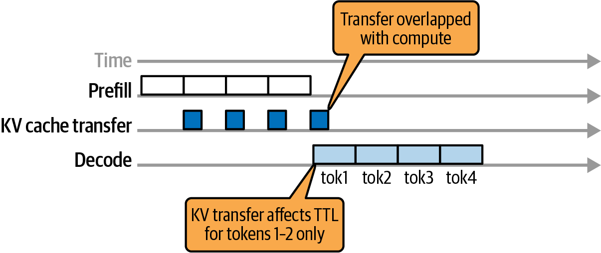

> Figure 15-1. Disaggregated prefill and decode sharing the KV cache and overlapping KV transfers with computations

在解码阶段，模型执行自回归生成，预测序列中的每个新token。它通过消费所有先前生成token的缓存注意力KV表示来完成这一过程。

> 推测解码通过在单个批次中预生成多个token来加速解码过程。同时，它会验证这些token是否正确。这减少了标准逐token自回归解码的顺序特性。我们稍后将介绍推测解码。

> As mentioned previously, the inference workflow for modern LLMs consists of two different phases: prefill and decode. We can implement disaggregated prefill and decode to separate the stages. This lets us scale the prefill and decode clusters independently-even on different hardware platforms-and significantly improve performance for large-scale LLM serving, as detailed later in this chapter. Cross-vendor or cross-architecture deployments require that the KV cache layout and dtypes match across both sides. In practice, production systems should keep prefill and decode on compatible GPU families. This way, they use the same numeric formats to easily enable KV cache transfer and data reuse. In the prefill stage, the model processes the entire input prompt-often thousands, tens of thousands, or even millions of tokens-in a single forward pass to produce initial hidden states as calculated by the LLM. It then populates the attention key-value (KV) cache for all tokens in the input prompt. Figure 15-1 shows how disaggregated prefill and decode share the KV cache and overlap KV transfers with computations. In the decode stage, the model performs an autoregressive generation to predict each new token in the sequence. It does this by consuming the cached attention KV representations of all previously generated tokens. Speculative decoding accelerates the decode process by pregenerating multiple tokens in a single batch. In parallel, it then verifies that the tokens are correct. This reduces the sequential nature of standard token-by-token autoregressive decoding. We'll cover speculative decoding in a bit.

### 预填充-解码干扰 (Prefill-Decode Interference)

传统上，LLM推理系统将这两个阶段放置在同一节点上，并简单地将所有计算批处理在一起。然而，这种简单的方法会导致所谓的预填充-解码干扰（prefill-decode interference）。例如，长提示预填充可能占用GPU，延迟其他请求的时间敏感解码工作--反之亦然。

将预填充和解码放置在同一节点上，会强制对这两个具有非常不同特性的阶段采用单一的调度和资源分配策略。预填充由大型并行计算组成。相比之下，解码需要许多小型顺序计算。因此，系统要么优先考虑某一阶段的性能而牺牲另一阶段，要么过度配置硬件以满足两种需求。

采用分离式预填充和解码架构，预填充和解码阶段被分配到不同的GPU池。这消除了两种工作负载之间的直接干扰。DistServe系统通过分离预填充和解码，报告称在TTFT和TPOT约束内服务的有效吞吐量请求增加了最多7.4倍（延迟SLO可收紧最多12.6倍）。

> Traditionally, LLM inference systems colocate these two stages on the same nodes and simply batch all computations together. However, this naive approach leads to what's commonly called prefill-decode interference. For instance, a long prompt prefill can occupy the GPU and delay time-sensitive decoding work for other requests-and vice versa. Colocating prefill and decode on the same nodes forces a single scheduling and resource allocation strategy for these two phases, which have very different characteristics. Prefill consists of large, parallel computations. In contrast, decode requires many small, sequential computations. As a result, systems have to either prioritize one phase's performance over the other or over-provision hardware to meet both demands. With a disaggregated prefill and decode architecture, the prefill and decode phases are assigned to different GPU pools. This eliminates direct interference between the two workloads. The DistServe system, by disaggregating prefill and decode, reported up to 7.4x more goodput requests served within both TTFT and TPOT constraints (up to 12.6x tighter latency SLOs).

### 独立扩展预填充和工作节点 (Scaling Prefill and Worker Nodes Independently)

如果我们可以消除跨阶段干扰，就可以减少解码任务在长预填充计算后停滞的资源"死时间"--反之亦然。这样，GPU花更多时间做有用的工作，减少空闲时间。这提高了给定延迟目标下的利用率和有效吞吐量（即goodput）。

我们可以通过专用一组节点处理预填充，另一组节点处理解码，来分别扩展预填充和解码。两个集群仅在将编码的提示状态（或注意力KV缓存）从预填充工作节点传输到解码工作节点时进行通信，如图15-2所示。

在这里，您可以看到独立的GPU工作节点处理预填充阶段以处理输入提示--以及解码阶段以迭代生成输出token。预填充阶段的输出包括提示的KV缓存。它被传输到解码工作节点以生成后续token。

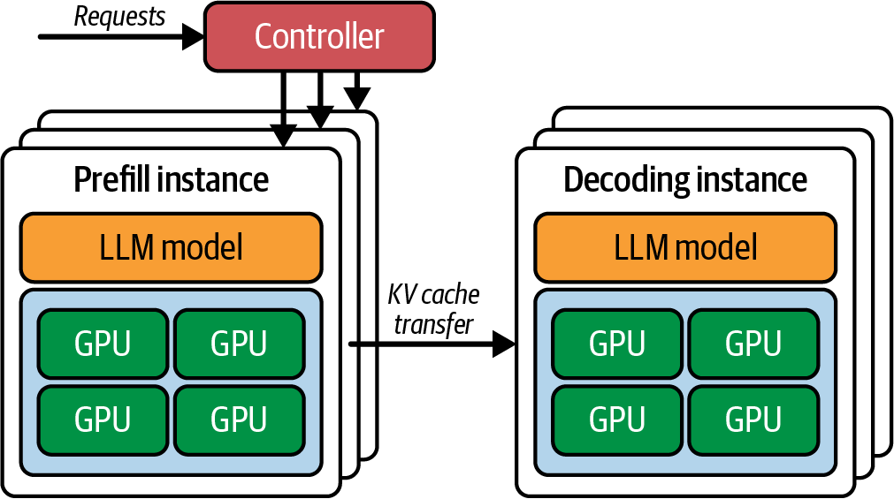

> Figure 15-2. Disaggregated inference: Prefill pool (hidden state + KV) → KV handoff using NVLink/NVSwitch (intranode) or GPUDirect RDMA (internode) → Decode pool

通过专用独立的GPU池，系统可以并行保持预填充和解码流水线的繁忙。在实践中，分离已被证明可以在严格的延迟约束下显著提高吞吐量。一些研究表明，一旦将预填充和解码阶段分离，可以获得巨大的收益，但结果范围从适度改进到数倍的有效吞吐量提升。结果在很大程度上取决于工作负载和网络结构。

这种分离允许每个阶段独立优化和扩展，以实现吞吐量或延迟。预填充可以在预填充GPU上积极批处理，以最大化吞吐量，而不会影响解码性能（例如，增加解码延迟）。此外，通过独立的集群，我们可以针对每个阶段调整并行设置、实例数量和调度策略。

> If we can eliminate cross-phase interference, we can reduce resource "dead time" in which decode tasks are stalled behind long prefill computations-and vice versa. This way, GPUs spend more time doing more useful work and less time idling. This increases utilization and useful throughput at a given latency target (aka goodput). We can scale prefill and decode separately by dedicating one set of nodes to handle the prefill and another set of nodes to handle the decode. The two clusters communicate only when transferring the encoded prompt state, or attention KV cache, from the prefill workers to the decode workers, as shown in Figure 15-2. Here, you see separate GPU workers handling the prefill stage to process the input prompt-along with the decode stage to generate output tokens iteratively. The output of the prefill stage includes the KV cache for the prompt. It is transferred to the decode workers to generate the next tokens. Figure 15-2. Disaggregated inference: Prefill pool (hidden state + KV) → KV handoff using NVLink/NVSwitch (intranode) or GPUDirect RDMA (internode) → Decode pool. By dedicating separate GPU pools, the system keeps both prefill and decode pipelines busy in parallel. In practice, disaggregation has been shown to significantly improve throughput under strict latency constraints. Some studies show that large gains are possible, but results range from moderate improvements to several times higher goodput once the prefill and decode stages are separated. The results greatly depend on the workload and network fabric. This separation allows each stage to be optimized and scaled independently for throughput or latency. Prefills can be batched aggressively on the prefill GPUs to maximize throughput without burdening the decode performance (e.g., increased decode latency). Also, with separate clusters we can tune parallelism settings, instance counts, and scheduling policies specific to each phase.

### 对延迟（TTFT）和吞吐量（TPOT）的影响 (Impact on Latency (TTFT) and Throughput (TPOT))

解码GPU可以以较低的批量大小运行--或使用专门的调度--以最小化流式生成的每输出token时间（TPOT）。例如，您可以使用优先处理紧急解码任务的调度器来避免排队延迟。

这种分离效果良好，因为每个阶段有不同的性能期望。预填充阶段的首token时间（TTFT）针对低延迟进行优化，而解码阶段优先考虑低每输出token时间（TPOT）和稳定的流式延迟。端到端吞吐量主要由并发和调度决定。在传统设置中，必须在TTFT和TPOT每token延迟之间做出妥协。分离允许同时满足两个SLO目标。

> 在KV传输和全对全阶段监控NVLink和NIC利用率。目标是使用独立的流和事件重叠通信和计算。

KV交接产生的额外延迟很小，因为通信使用高带宽互连进行多GPU和多节点传输。这些互连包括NVLink、NVSwitch、InfiniBand和使用GPUDirect RDMA的以太网（RoCE over Ethernet）。例如，配备ConnectX-8 SuperNIC（800 GbE级别）的多节点集群每个端口提供高达800 Gb/s的带宽，并支持GPUDirect RDMA。与主机中介的通信路径相比，这大大减少了KV传输时间。

此外，建议部署每GPU一个NIC，以优化预填充-解码分离并提高MoE全对全性能。

> Decode GPUs can run at lower batch sizes-or with specialized scheduling-to minimize time per output token (TPOT) for streaming generation. For example, you can use a scheduler that prioritizes urgent decode tasks to avoid queuing delays. This separation works well because each phase has different performance expectations. Time to first token (TTFT) for the prefill stage is optimized for low latency, while the decode stage prioritizes low time per output token (TPOT) and stable streaming latency. End-to-end throughput is largely determined by concurrency and scheduling. In traditional setups, one had to compromise between TTFT and TPOT per-token latency. Disaggregation allows both SLO targets to be met simultaneously. Monitor NVLink and NIC utilization during KV transfer and all-to-all phases. The goal is to overlap communication and compute using separate streams and events. The KV handoff incurs minimal additional latency because the communication uses high-bandwidth interconnects for multi-GPU and multinode transfers. These interconnects include NVLink, NVSwitch, InfiniBand, and Ethernet (RoCE on Ethernet) using GPUDirect RDMA. For instance, multinode clusters with ConnectX-8 SuperNICs (800 GbE-class) provides up to 800 Gb/s per port with GPUDirect RDMA. This greatly reduces KV transfer time compared to host-mediated communication paths. Additionally, it's recommended to deploy 1 NIC per GPU to optimize prefill-decode disaggregation and improve MoE all-to-all performance.

### KV缓存数据传输和NIXL (KV Cache Data Transfer and NIXL)

分离式系统使用连接器或调度器，在提示处理完成后，将提示的中间结果（最终隐藏状态和KV缓存）从预填充工作节点传输到解码工作节点。这种交接会产生一些通信开销，但如果集群的互连是高带宽的（如NVLink或InfiniBand），与消除资源争用带来的收益相比，这种开销很小。

在实践中，NVIDIA的NIXL库通过根据拓扑和策略自动选择NVLink/NVSwitch、RDMA或主机暂存路径来最小化传输开销。例如，第4章介绍的NVIDIA NIXL库将自动选择最快的可用路径来传输KV缓存。NIXL与框架和推理引擎集成，包括Dynamo和vLLM。图15-3展示了NIXL-vLLM集成。

具体而言，LMCache和NIXL集成在vLLM的分离式预填充中作为支持的路径。NIXL也被NVIDIA Dynamo和TensorRT-LLM使用，通过点对点GPU互连和RDMA传输KV缓存数据。

在节点内，NIXL通过NVLink和NVSwitch执行设备到设备的传输，无需主机暂存。在节点间，NIXL在InfiniBand或RoCEv2上使用GPUDirect RDMA来避免主机拷贝。这些路径即使在多GB负载下也能保持KV交接延迟较低。

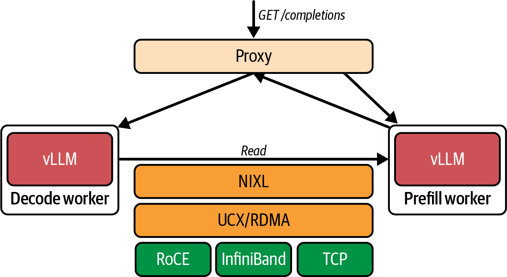

> Figure 15-3. KV cache data transfers with NIXL in the vLLM inference engine; Intranode: NVLink/NVSwitch (device-to-device); Internode: GPUDirect RDMA (InfiniBand/RoCEv2) using ConnectX-class NICs

预填充和解码工作节点的放置应遵循网络结构。同一节点放置通过CUDA对等访问将KV传输保持在NVLink和NVSwitch上，而跨节点放置应在InfiniBand或RoCEv2上使用GPUDirect RDMA。NVIDIA Dynamo与NIXL集成，在节点间的GPU、CPU内存和存储之间移动KV缓存，vLLM通过LMCache和NIXL集成实现分离式预填充。

> 当网络结构或虚拟化层阻止直接对等访问时，NIXL可以回退到主机暂存路径，这是非最优的。始终验证部署中的端到端KV传输时间。

> Disaggregated systems use a connector or scheduler to transfer the prompt's intermediate results (the final hidden state and the KV cache) from the prefill workers to the decode workers once the prompt processing is done. This handoff incurs some communication overhead, but if the cluster's interconnect is high-bandwidth (e.g., NVLink or InfiniBand), this overhead is small compared to the gains from eliminating resource contention. In practice, NVIDIA's NIXL library minimizes transfer overhead by selecting NVLink/NVSwitch, RDMA, or host-staged paths automatically based on topology and policy. For example, NVIDIA's NIXL library, introduced in Chapter 4, will automatically select the fastest available path to transmit the KV cache. NIXL integrates with frameworks and inference engines, including Dynamo and vLLM. The NIXL-vLLM integration is shown in Figure 15-3. Specifically, LMCache and NIXL are integrated in vLLM's disaggregated prefilling as the supported path. NIXL is also used by NVIDIA Dynamo and TensorRT-LLM to transport KV cache data using peer-to-peer GPU interconnects and RDMA. Within a node, NIXL performs device-to-device transfers over NVLink and NVSwitch without host staging. Across nodes, NIXL uses GPUDirect RDMA over InfiniBand or RoCEv2 to avoid host copies. These paths keep KV cache handoff latency low even for multigigabyte payloads. Placement of prefill and decode workers should follow the fabric. Same node placement keeps KV transfers on NVLink and NVSwitch via CUDA peer access, while cross-node placement should use GPUDirect RDMA over InfiniBand or RoCEv2. NVIDIA Dynamo integrates with NIXL to move KV cache between GPUs, CPU memory, and storage across nodes, and vLLM integrates through LMCache and NIXL for disaggregated prefilling. When the fabric or virtualization layer prevents direct peer access, NIXL can fall back to host-staged paths, which are nonoptimal. Always validate end-to-end KV transfer time on your deployment.

### 使用Kubernetes部署分离式预填充和解码 (Deploying Disaggregated Prefill and Decode with Kubernetes)

在高级部署中，像Kubernetes这样的集群编排系统可以根据负载和输入特性动态调整GPU池分配--或分别扩展池。例如，如果许多用户带着超长提示和相对较小的输出到达（如大文档摘要用例），Kubernetes可以临时调整分配，在预填充池中使用更多GPU。这将减少分配给解码阶段的GPU数量。

相反，如果许多用户请求超长输出（如长推理链、"逐步思考"等），可以将更多GPU转移到解码池。在这两种情况下，可以为每种工作节点类型扩展新实例。

图15-4展示了使用开源llm-d项目的独立预填充和解码工作节点的基于Kubernetes的分布式vLLM集群。vLLM通过运行两个实例并使用LMCache和NIXL交接KV来实现分离式预填充，但llm-d通过Kubernetes原生编排扩展了这一点，用于分离式服务和KV感知路由。此图显示了一个称为变体自动缩放器（variant autoscaler）的组件，负责更新池中预填充和解码工作节点的副本数量。

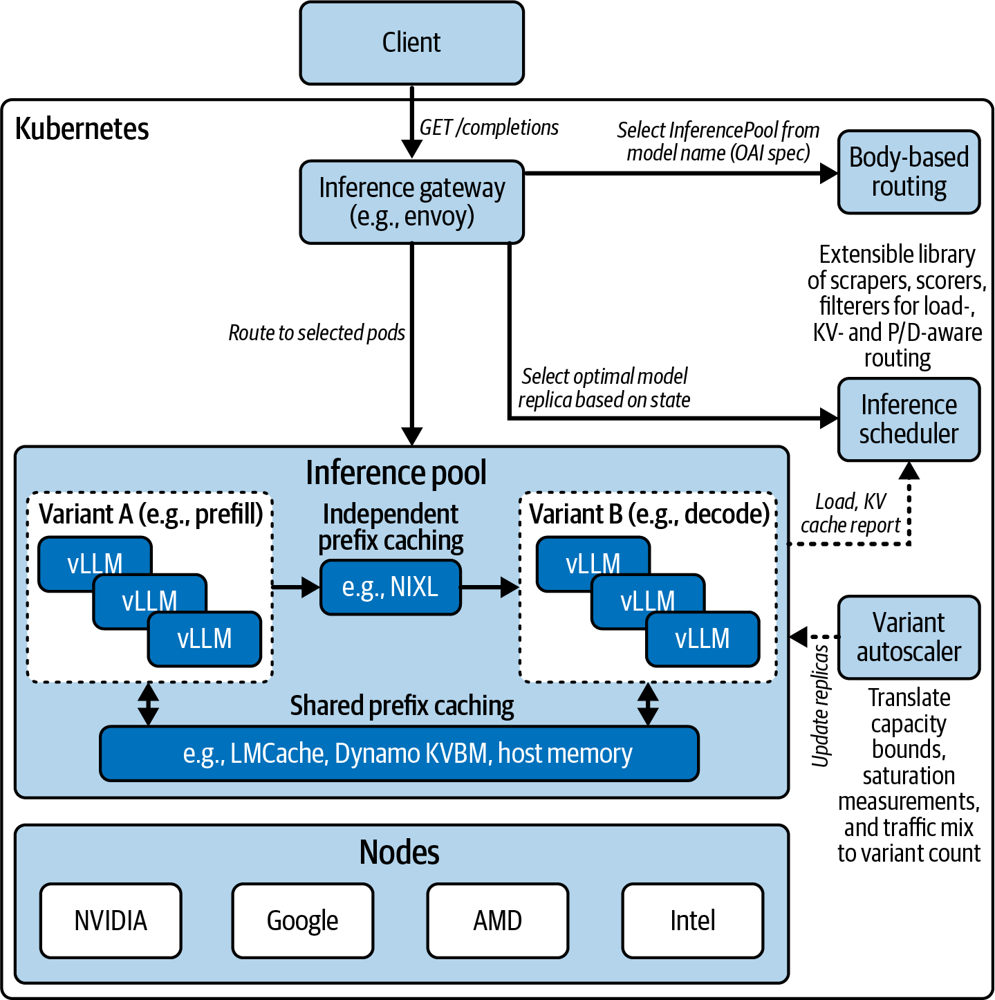

> Figure 15-4. Kubernetes-based vLLM cluster of separate prefill and decode workers using the open source llm-d project; variant autoscaler tunes prefill/decode replica counts based on the prompt-response mix; KV moved using LMCache and NIXL

> 在现代推理部署中，所有节点都可以执行预填充和解码功能，因为它们都共享相同的运行时和代码库（如vLLM、SGLang、NVIDIA Dynamo等）。由集群编排器在启动时静态分配特定角色--预填充或解码--并在工作节点的生命周期内动态调整。

总的来说，分离式预填充/解码架构为高吞吐量、低延迟LLM服务提供了基础。然而，它确实引入了复杂性，因为必须传输和管理中间数据--对于长提示的KV缓存，大约在几GB的量级。调度也更加复杂，但在超大规模下高效利用硬件的好处是显著的。

> 第17章和第18章将深入探讨分离式PD的额外技术，包括高级调度、路由和部署优化。

> In an advanced deployment, a cluster orchestration system like Kubernetes can dynamically shift the GPU pool allocations-or scale the pools out separately-based on load and input characteristics. For instance, if many users arrive with superlong prompts and relatively small outputs (e.g., large-document summarization use cases), Kubernetes can temporarily shift the allocation to use more GPUs in the prefill pool. This will decrease the number of GPUs allocated to the decode phase. In contrast, if many users arrive requesting superlong outputs (e.g., long reasoning chains, "think step-by-step," etc.), more GPUs can be shifted to the decode pool. In both cases, new instances can be scaled out for each worker type. Figure 15-4 shows a distributed, Kubernetes-based vLLM cluster of separate prefill and decode workers using the open source llm-d project. vLLM implements disaggregated prefilling by running two instances and handing off KV using LMCache and NIXL, but llm-d extends this with Kubernetes native orchestration for disaggregated serving and KV-aware routing. This diagram shows a component called the variant autoscaler, which is responsible for updating the number of replicas for the prefill and decode workers in the pool. In modern inference deployments, all nodes can perform both prefill and decode functionality since they all share the same runtime and code base (e.g., vLLM, SGLang, NVIDIA Dynamo, etc.). It's up to the cluster orchestrator to assign them a specific role, either prefill or decode, statically upon startup-and dynamically throughout the worker's lifecycle. Overall, a disaggregated prefill/decode architecture provides a foundation for high-throughput, low-latency LLM serving. It does introduce complexity, however, as intermediate data must be transferred and managed-on the order of a few gigabytes for the KV cache of a long prompt. And scheduling is more involved, but the benefits of utilizing hardware efficiently are significant at ultra scale. Chapters 17 and 18 dive deeper into additional techniques for disaggregated PD, including advanced scheduling, routing, and deployment optimizations.

## 服务大规模MoE模型的并行策略 (Parallelism Strategies for Serving Massive MoE Models)

由于GPU内存有限，高效服务大规模MoE模型需要多种形式的并行。我们将分解关键的并行策略，包括张量并行、流水线并行、专家并行、数据并行和上下文并行。我们还将讨论如何将它们组合使用，将LLM分布到多个GPU上。表15-1提供了这些策略的高级摘要、典型用途，以及每个策略与推理相关的详细描述。

**表15-1. LLM推理的并行策略**

| 并行策略 | 划分依据 | 使用场景 | 优点 | 缺点 |
|---------|---------|---------|------|------|
| 张量并行 (Tensor parallelism) | 在每层内部（将神经网络权重矩阵分割到多个GPU上） | 单个模型太大，或需要在多个GPU上加速层内繁重计算 | 在计算受限层上实现近线性加速；通过将全归约通信与计算重叠来减少开销 | 每层需要频繁通信和全归约；需要高带宽互连（NVLink）；跨节点时网络延迟增加（建议将TP组保持在单个NVLink域内） |
| 流水线并行 (Pipeline parallelism) | 不同层放在不同GPU上（模型按层序列切片） | 无法放入单个GPU的超深模型 | 跨层扩展内存；允许分布模型状态；使用微批处理同时处理来自不同用户/请求的多个token；对于长序列，可以并行处理多层（提高大批量或长输入的吞吐量） | 增加填充/刷新时间（气泡）；对逐token解码帮助较小；实现更复杂；高内存使用（必须在流水线中保持多个激活） |
| 专家并行 (Expert parallelism) | 不同MoE专家放在不同GPU上（每个token稀疏激活） | 拥有大量专家的大规模MoE模型；需要将模型参数分片到多个GPU | 实现几乎无限的模型大小--总参数随GPU数量扩展；每个GPU只计算一小部分token（稀疏计算）；高参数数量提升模型容量/质量 | 每个MoE层有高通信开销；如果负载不平衡可能出现潜在瓶颈；每个专家可能有不同负载（token数量），导致不均匀的计算时间 |
| 数据并行 (Data parallelism) | 在多个GPU上复制整个模型，每个GPU服务不同请求 | 模型部署固定后扩展吞吐量（更多并发请求）；多实例服务众多用户 | 近线性吞吐量扩展；实现简单（无需模型分区） | 不改善单个请求的延迟；多倍内存使用；必须保持状态一致或使用无状态模型 |
| 上下文并行 (Context parallelism) | 在每层将输入序列token分割到多个GPU | 超长序列（如100k+ token）以减少每个GPU的提示延迟和内存 | 对长上下文预填充实现近线性加速；通过分割KV缓存，能够处理超过单个GPU内存的上下文 | 需要注意力实现来处理跨分区；每层增加额外通信；对短序列收益有限（100k+ token才值得增加通信开销） |

> 对于Blackwell NVL72上的节点内TP，建议将TP组保持在单个NVSwitch域内；仅在拓扑允许时才扩展到跨机架，以避免额外跳数。

这些并行策略定义了模型权重和数据如何在GPU上分割。图15-5展示了不同并行策略的分割方式--以及策略的常见组合。

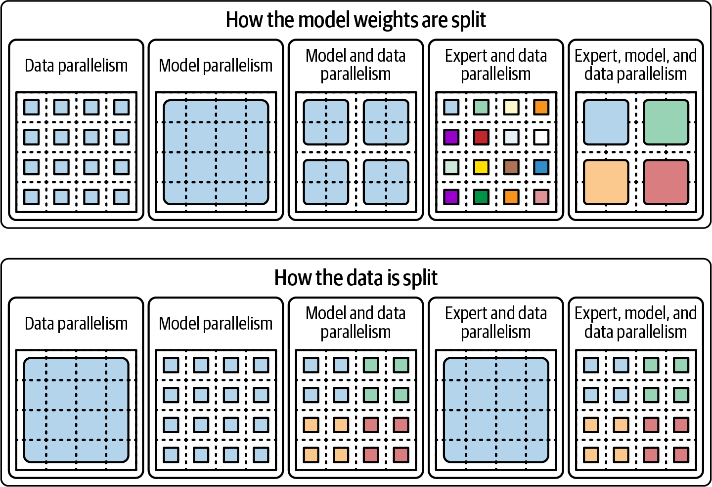

> Figure 15-5. Model weights and input data split over the GPUs

> Serving massive MoE models efficiently requires multiple forms of parallelism due to limited GPU memory. We break down the key parallelism strategies, including tensor, pipeline, expert, data, and context parallel. We'll also discuss how they can be combined to distribute an LLM across many GPUs. Table 15-1 provides a high-level summary of these strategies, their typical use, and a description of each strategy in more detail as they relate to inference. For intranode TP on Blackwell NVL72, prefer keeping TP groups within a single NVSwitch domain; extend inter-rack only when topology permits to avoid extra hops. These parallelism strategies define how the model weights and data are split over the GPUs. Figure 15-5 shows how they are split up for the different parallelism strategies-as well as common combinations of strategies.

### 张量并行 (Tensor Parallelism)

张量并行（Tensor Parallelism，TP）将神经网络每层的计算分割到多个GPU上。例如，transformer层中的大型矩阵乘法可以按列或行分区--并在两个或更多GPU上并行计算。然后，这些GPU通过执行全归约（all-reduce）来交换结果，聚合它们的部分输出。

TP通常用于模型的层（称为隐藏层）太大而无法放入单个GPU内存的情况--或者当我们希望通过利用多个GPU并行处理同一层来加速模型的单个实例时。它使所有GPU在每层计算中保持同步，这需要极高的GPU间带宽才能高效运行。

理想情况下，TP在通过高带宽NVLink和NVSwitch互连连接的GPU上运行。在使用第五代NVLink（高达1.8 TB/s聚合双向GPU到GPU带宽和先进网络拓扑）的多GPU Blackwell系统上，TP可以在8-16个GPU的节点上高效扩展--或者在NVL72机架的情况下甚至可以扩展到72个GPU。请记住，在GB200/GB300 NVL72机架内，NVLink Switch在72个GPU域内提供约130 TB/s的聚合GPU带宽。这是大量的机架内带宽。

只要集合通信（如激活的全归约）相对于计算足够快，TP就能为模型的计算受限部分提供近线性加速。在推理中，张量并行主要应用于注意力投影和前馈多层感知机（MLP）网络的大型矩阵乘法。

由于单个token的激活相对较小，这些全归约通信在NVLink上的代价并不高。因此，TP是在GPU上分割大型稠密模型而无需近似模型权重的常见策略。

我们主要使用TP来服务单个MoE专家或transformer层对单个GPU来说太大的模型。但是，当我们希望通过在多个GPU上并行化每层计算来减少延迟时，也会使用它。

需要注意的是，超过一定规模后，TP效率会下降--特别是在通过InfiniBand或以太网跨节点或跨机架使用时。在实践中，最好将TP用于节点内通信--或NVLink域内节点之间的通信。

像NVIDIA的GB200/GB300 NVL72这样的现代多GPU机架允许TP在更大规模上使用，而不会使互连带宽饱和。NVLink Switch将NVLink域扩展到每个NVL72机架的72个GPU。NVLink Switch系统可以将全对全、全连接的NVLink结构扩展到最多8个机架或576个GPU（576 GPU = 8机架 x 每机架72 GPU）。这使得大规模并行策略不仅可以在单个NVL72内部实现，还可以跨多个机架实现。例如，在8机架拓扑中，您可以使用跨8个机架的576个GPU实现576路张量并行（576 GPU = 8机架 x 每机架72 GPU）。

> 虽然可以跨机架扩展TP，但建议在选择TP组大小时考虑拓扑感知，并尽可能保持在单个NVLink/NVSwitch岛内。这将避免不必要的跨机架交换延迟，并有助于提高整体系统效率。

> Tensor parallelism (TP) splits the computations within each layer of the neural network across multiple GPUs. For instance, a large matrix multiply in a transformer layer can be partitioned by columns or rows-and computed in parallel on two or more GPUs. These GPUs then exchange their results by performing an all-reduce to aggregate their partial outputs. TP is commonly used when a model's layers, called hidden layers, are too large to fit into a single GPU's memory-or when we want to accelerate a single instance of a model by utilizing multiple GPUs for the same layer in parallel. It keeps all GPUs in lockstep for each layer's computation, which requires extremely high inter-GPU bandwidth to be efficient. Ideally, TP runs on GPUs that are connected with high-bandwidth NVLink and NVSwitch interconnects. On multi-GPU Blackwell systems that use fifth-generation NVLink (up to 1.8 TB/s aggregate bidirectional GPU-to-GPU bandwidth and advanced network topologies), TP can scale efficiently across a node of 8-16 GPUs-or even up to 72 GPUs in the case of an NVL72 rack. Remember, within the GB200/GB300 NVL72 racks, NVLink Switch provides about 130 TB/s of aggregate GPU bandwidth within the 72 GPU domain. This is a large amount of intra-rack bandwidth. TP provides near-linear speedups for compute-bound portions of the model as long as collective communications, such as the all-reduce of activations, are fast relative to computation. In inference, tensor parallelism is mainly applied to the large matrix multiplications of the attention projections and feed-forward multilayer perceptron (MLP) networks. Since the activations for one token are relatively small, those all-reduce communications are not too costly on NVLink. As such, TP is a common strategy for splitting giant dense models across GPUs without approximating model weights. We mainly use TP to serve models in which single MoE experts or transformer layers are too large for a single GPU. However, we also use it when we want to reduce latency by parallelizing each layer's computations across multiple GPUs. One must be mindful that beyond a certain scale, however, TP efficiency drops-especially when using it across nodes or racks running over InfiniBand or Ethernet. In practice, it's best to use TP for intranode communication-or between nodes in an NVLink domain. Modern multi-GPU racks like NVIDIA's GB200/GB300 NVL72 allow TP to be used at a much larger scale without saturating interconnect bandwidth. NVLink Switch extends the NVLink domain across the rack to 72 GPUs per NVL72. NVLink Switch Systems can scale an all-to-all, fully connected NVLink fabric across up to 8 racks, or 576 GPUs (576 GPUs = 8 racks * 72 GPUs per rack). This enables large-scale parallelism strategies, not just inside a single NVL72 but also across multiple racks. For instance, in an 8-rack topology, you can increase to 576-way tensor parallelism using the 576 GPUs across 8 racks (576 GPUs = 8 racks x 72 GPUs per rack.) While it's possible to extend TP across racks, it's recommended to choose your TP group sizes with topology-awareness in mind and within a single NVLink/NVSwitch island whenever possible. This will avoid unnecessary inter-rack switch latency and help to increase overall system efficiency.

### 流水线并行 (Pipeline Parallelism)

流水线并行（Pipeline Parallelism，PP）将模型按层分区到不同的GPU上。例如，在一个60层的基于transformer的模型中，GPU 0可能持有第1-20层，GPU 1持有第21-40层，GPU 2持有第41-60层。

在处理token序列时，数据按顺序流经GPU，GPU 0计算第1-20层，然后将其中间激活传递给GPU 1处理第21-40层，依此类推。这允许将太深而无法放入单个加速器的模型进行分布。

在推理中，PP可以通过跨多个批次分区模型来提高吞吐量--类似于装配线。在处理长序列输入token的预填充阶段，PP通过以交错方式将序列的不同部分流式传输到各层来实现高GPU利用率。

相比之下，在解码阶段，每次生成一个token，纯PP提供的收益较少，因为每个新token仍必须按顺序通过流水线阶段。这会产生流水线气泡（pipeline bubbles），即空闲期，早期阶段等待后期阶段为每个token完成处理。

为了减少流水线气泡，实现使用微批处理（microbatching），允许流水线同时处理来自不同请求的多个token。尽管如此，流水线并行主要通过使非常大的模型能够在GPU之间分割层来帮助内存扩展。它也有助于吞吐量--特别是在处理大批量或长输入时。

PP倾向于增加单个项目的端到端延迟，因为流水线阶段之间存在传输开销。因此，PP通常是为了模型容量原因而非延迟原因而选择的。这是因为它可以将模型放入内存中。当没有单个GPU能够容纳整个模型时，轻微的延迟损失是可以接受的。

此外，PP通常与其他并行策略（如TP）结合使用，以平衡内存和速度。在服务大型MoE模型时，可能会在2-4个GPU上使用流水线并行来分割深层堆栈--同时依靠TP处理宽的层内计算。

> PP跨层分割模型，TP在层内分割模型。TP主要用于层或专家对单个GPU来说太宽的模型，而PP主要用于太深而无法放入单个GPU的模型。注意TP和PP可以组合使用，我们稍后会看到。

> Pipeline parallelism (PP) partitions the model layer-wise across different GPUs. For example, in a 60-layer transformer-based model, GPU 0 might hold layers 1-20, GPU 1 holds layers 21-40, and GPU 2 holds layers 41-60. When processing a sequence of tokens, the data flows through the GPUs in sequence such that GPU 0 computes layers 1-20, then passes its intermediate activations to GPU 1 for layers 21-40, and so on. This allows models that are too deep to fit on one accelerator to be distributed. In inference, PP can improve throughput by partitioning the model across multiple batches-similar to an assembly line. During the prefill phase, which processes a long sequence of input tokens, PP achieves high GPU utilization by streaming different portions of the sequence into the layers in staggered fashion. In contrast, during the decode phase, generating one token at a time, pure PP offers less benefit since each new token must still pass through the pipeline stages sequentially. This creates pipeline bubbles, or idle periods, in which earlier stages wait for later ones to finish for each and every token. To reduce pipeline bubbles, implementations use microbatching, which allows the pipeline to process multiple tokens from different requests concurrently. Still, pipeline parallelism primarily helps with memory scaling by enabling very large models to split layers among GPUs. It also helps throughput-especially when handling large batch sizes or long inputs. PP tends to increase end-to-end latency for a single item due to transfer overhead between pipeline stages. As such, PP is usually chosen for model capacity reasons-rather than latency reasons. This is because it can fit the model into memory. The slight latency hit is acceptable when no single GPU can hold the whole model. Additionally, PP is often used in combination with other parallelism strategies like TP to balance memory and speed. When serving large MoE models, one might use pipeline parallelism across 2-4 GPUs to split the deep layer stack-while relying on TP to handle the wide, intralayer compute. PP splits the model across layers, and TP splits the model within layers. TP is mainly used for models with layers or experts that are too wide for a single GPU, while PP is primarily used for models that are too deep to fit into a single GPU. Note that TP and PP can be combined, which we'll see in a bit.

### 专家并行 (Expert Parallelism)

专家并行（Expert Parallelism，EP）是MoE架构特有的。在MoE层中，有许多专家网络或前馈子层。对于每个输入token，只有一个或少数几个专家被激活。这自然适合将不同的专家分布到不同的GPU上。

例如，如果MoE层有16个专家，我们有4个GPU，每个GPU可以托管4个专家。在推理过程中，当token到达该MoE层时，其内部门控网络将为该token选择前两个专家。然后，token的数据被发送到拥有这两个专家的GPU进行处理。然后，结果被组合回来以生成下一个token，如图15-6所示。

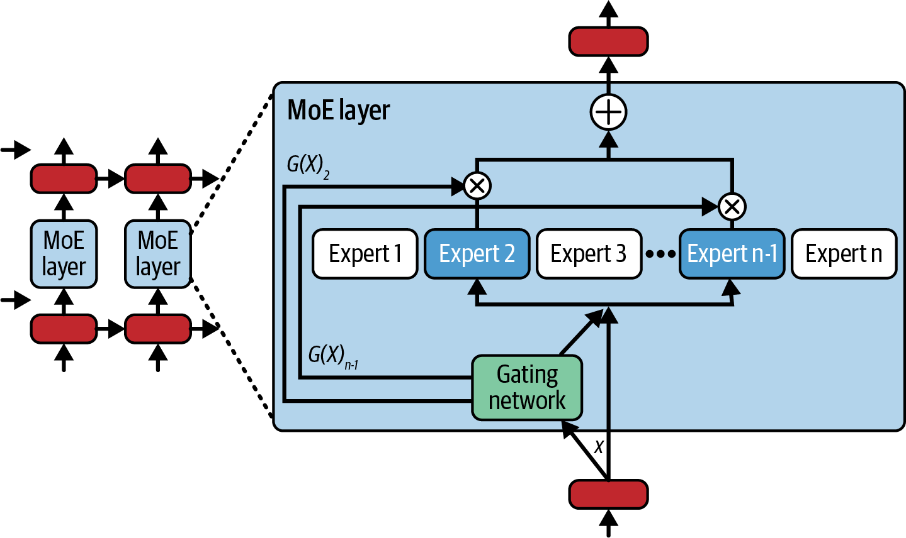

> Figure 15-6. Mixture-of-experts (MoE) communication (source: https://oreil.ly/pzn5t)

实现这一点需要全对全（all-to-all）通信模式，使得token（技术上，它们的激活向量）在GPU之间动态洗牌，以便每个token落在其分配专家的GPU上。在每个专家为其分配的token计算输出后，执行另一个全对全操作将token输出返回到其原始顺序。

这种动态路由在每个MoE层引入了一个通信密集的步骤。如果不仔细优化，这可能成为性能瓶颈--特别是随着专家/GPU数量的增加。好处是专家并行允许总模型容量几乎随GPU数量线性扩展。

考虑一个跨100个GPU分布的100个专家的MoE。如果每个token只激活两个专家，每个token的计算类似于较小的稠密模型。因此，专家并行是一些大规模MoE模型能够被服务的原因，因为模型权重被分片到许多GPU上--每个GPU在任何给定层只处理一小部分token。

> 在规模上，并且在MoE模型中具有适当平衡的专家集，所有专家可能同时处于活跃状态。因此，虽然单个token只激活少数专家，但在所有最终用户的所有token的聚合中，所有专家都将活跃，同时消耗和争用所有GPU资源。

高效的专家并行推理需要仔细的负载均衡--以及高带宽互连，如用于机架内通信的NVLink/NVSwitch和用于节点间通信的InfiniBand/RDMA。现代MoE推理框架使用快速的集合通信库如NCCL。将多个专家分组到每个GPU上通常有助于减少通信步骤。

现代MoE推理通常使用top-2门控，其中每个token被分配给两个专家。为了减少通信，您可以将经常配对的专家分组到同一GPU或计算节点上。例如，如果token使用两个专家，将这两个经常配对的专家放在同一GPU或节点上意味着许多token分配将保持在单个GPU或节点上，这将本地化通信流量并减少开销。

另一种技术是使用top-1门控，其中每个token只去一个专家。这将相对于前面描述的top-2门控减少通信量，后者使专家输出数量翻倍。虽然top-1门控更快，但它可能导致较低的模型质量和不均匀的负载。

> Google的GLaM引入了负载均衡损失（和门控噪声）来在MoE模型训练期间实现平衡的专家使用。在此基础上，研究人员正在探索真正的自适应推理时门控，使用实时负载指标在专家过载时重新路由token。这些在不降低质量的情况下提高了利用率。

> 然而，在大多数生产服务环境中，具有适度容量因子的top-2门控--以及偶尔的基于负载的专家交换或复制--仍然是平衡质量和性能的最常见折衷技术。

许多MoE LLM至少使用top-2门控以获得更好的质量、良好的速度和平衡的负载。此外，重要的是战略性地放置专家--甚至使用备份专家副本来避免专家过载。

当专家变得过载或"热"时，如果门控网络不成比例地将token路由到它们，它们可能成为吞吐量瓶颈。所谓的落后者效应（straggler effect）要求所有专家计算完成后才能继续进行。因此，接收到比其他专家更多工作（token）的过载专家将阻塞推理流水线。这将使一些专家及其GPU空闲，而其他专家追赶上来。

为了防止这种情况，高性能MoE服务系统公开了一个容量因子（capacity factor）参数，通常设置为平均token负载的1.2-1.5倍，用于限制每个专家每批可以处理多少token。超过该限制的token被路由到第二选择的溢出专家--或排队进行第二轮处理。这补充了训练期间使用的任何负载均衡损失或门控噪声，以鼓励MoE均匀地将token分配给专家。

一些功能齐全的推理服务器还可以在必要时将热专家复制到多个GPU上以分担负载。这以额外的GPU内存为代价。我们稍后将看到负载不平衡的一个例子。

推理时溢出（容量因子）、训练时惩罚（负载均衡损失和门控噪声）和热专家副本的组合应该在达到容量时平滑token-专家负载分布--最大化整体MoE推理吞吐量。

> Expert parallelism (EP) is specific to MoE architectures. In an MoE layer, there are many expert networks, or feed-forward sublayers. For each input token, only one or a few experts are activated. This naturally lends itself to distributing different experts on different GPUs. For instance, if an MoE layer has 16 experts and we have 4 GPUs, each GPU could host 4 experts. During inference, when a token arrives at that MoE layer, its internal gating network will choose the top two experts, for instance, for that token. The token's data is then sent to whichever GPUs own those two experts for processing. Then the results are combined back to generate the next token, as shown in Figure 15-6. Implementing this requires an all-to-all communication pattern such that tokens (technically, their activation vectors) are dynamically shuffled between GPUs so that each token lands on the GPU of its assigned expert. After each expert computes its output for its assigned tokens, another all-to-all is performed to return the token outputs back to their original order. This dynamic routing introduces a communication-heavy step at each MoE layer. This can become a performance bottleneck if not carefully optimized-especially as the number of experts/GPUs increases. The upside is that expert parallelism allows the total model capacity to scale almost linearly with the number of GPUs. Consider an MoE with 100 experts distributed across 100 GPUs. If each token activates only two experts, the compute per token is similar to a smaller dense model. As such, expert parallelism is what allows some massive MoE models to be served at all since the model weights are sharded across many GPUs-and each GPU handles only a fraction of the tokens at any given layer. At scale, and with a properly balanced set of experts in an MoE model, all of the experts will likely be active simultaneously. So, while an individual token activates only a small number of experts, in aggregate across all tokens across all end users, all experts will be active, consuming and contending for all GPU resources concurrently. Efficient expert parallel inference requires careful load balancing-as well as high-bandwidth interconnects, such as NVLink/NVSwitch for intra-rack communication and InfiniBand/RDMA for internode communication. Modern MoE inference frameworks use fast collective communication libraries like NCCL. It often helps to group multiple experts per GPU to reduce communication steps. Modern MoE inference often uses top-2 gating, in which each token is assigned to two experts. To reduce communication, you can group commonly paired experts onto the same GPU or compute node. For instance, if tokens use two experts, placing those two frequently paired experts on the same GPU or node means that many token assignments will stay on a single GPU or node, which will localize communication traffic and reduce overhead. Another technique is to use top-1 gating, in which each token goes to only one expert. This will reduce the communication volume relative to top-2 gating described previously, which doubles the number of expert outputs. While top-1 gating is faster, it can lead to a lower model quality and uneven load. Google's GLaM introduced load-balancing losses (and gating noise) to achieve balanced expert usage during MoE model training. Building on this, researchers are exploring truly adaptive, inference-time gating that uses real-time load metrics to reroute tokens when an expert is overloaded. These improve utilization without degrading quality. However, in most production serving environments, top-2 gating with a modest capacity factor-and occasional load-based expert swapping or replication-remains the most common compromise technique to balance both quality and performance. Many MoE LLMs use at least top-2 gating for better quality, good speed, and balanced load. Additionally, it's important to place experts strategically-or even use backup expert replicas to avoid overloading experts. When experts become overloaded, or hot, they can become throughput bottlenecks if the gating network is disproportionately routing tokens to them. The straggler effect, as it's called, requires that all expert computations be complete before they can progress. As such, an overloaded expert that receives more work (tokens) than other experts will stall the inference pipeline. This will leave some experts, and their GPUs, idle while the other experts catch up. To prevent this, high-performance MoE serving systems expose a capacity factor parameter, typically set at 1.2-1.5x the average token load, which caps how many tokens each expert can process per batch. Tokens beyond that are routed to a second-choice overflow expert-or queued for a second pass. This complements any load-balancing loss or gating noise used during training to encourage the MoE to assign tokens to experts uniformly. Some full-featured inference servers can also replicate hot experts onto multiple GPUs to split the load if necessary. This comes at a cost of additional GPU memory. We will see an example of load imbalance a bit later. The combination of inference-time spillover (capacity factor), training-time penalties (load-balancing loss and gating noise), and hot-expert replicas should smooth out the token-expert load distribution when capacity is reached-maximizing overall MoE inference throughput.

### 数据并行 (Data Parallelism)

在推理中，数据并行（Data Parallelism，DP）指的是在多个GPU上复制整个模型，并将不同的传入请求--或请求批次的分片--分配给每个GPU。与训练中的数据并行（通过梯度平均保持模型同步）不同，推理中的数据并行在每个副本上运行独立的前向传播。这是扩展吞吐量的最简单方法。

例如，使用DP，如果一个GPU每秒可以处理10个请求，使用8个GPU和8个副本理想情况下可以提供每秒80个请求的吞吐量--假设请求是独立的。在实践中，使用数据并行进行推理需要启动多个模型服务引擎并在它们之间进行负载均衡请求。

使用DP时，每个GPU或GPU组从头到尾处理一部分查询。优点是吞吐量的线性扩展，并且在推理期间没有GPU间通信，因为每个副本独立运行。然而，缺点也很明显。

DP使内存需求成倍增加，因为每个副本需要模型权重和缓存的完整副本。因此，与在单个GPU上托管模型相比，使用八个副本服务模型使用8倍的GPU内存--以及大约8倍的硬件成本。

在实践中，数据并行通常与每个GPU上的请求批处理和多流执行相结合，以最大化利用率。每个副本理想情况下应该是无状态的--或使用同步缓存以避免一致性问题。

重要的是要注意，DP不会减少任何单个请求的延迟。但是，它确实提高了吞吐量，因为有更多可用的副本来处理请求--假设内存和计算资源可用且相对无争用。

> 由于GPU内存相对稀缺且昂贵，DP通常只有在您的吞吐量需求非常高时才值得用于推理--或者如果您可以将DP与其他并行方法（如TP和PP）结合使用。

对于推理，DP通常与其他并行方法（如TP和PP）结合使用，因为DP有额外的内存和成本要求。例如，如果由于内存限制必须将模型分布在八个GPU上，它应该使用DP与TP、PP或EP--甚至所有这些一起--来创建四维（4D）并行（加上上下文并行（CP），您就在使用5D并行！）。

具体而言，您可以将DP与TP一起使用，使用两个8-GPU的DP组部署两个大型8-GPU模型副本。这将使吞吐量翻倍，并使用TP在每个大型模型副本的层内将副本分片到八个GPU上。

在大型推理集群中，您可以专用大量GPU和节点来服务大型模型的多个副本，以处理高请求量。当吞吐量需求扩展到单个模型实例所能提供的范围之外时，DP特别有用。在实践中，生产系统通常运行大型模型的许多DP副本以满足流量需求。

> 现代推理服务器将每个副本视为负载均衡器后面的单独模型实例。这需要仔细的请求路由，但与其他复杂的模型分片方法相比，它相对简单。

> In inference, data parallelism (DP) refers to replicating the entire model on multiple GPUs and assigning different incoming requests-or shards of a request batch-to each GPU. Unlike data parallelism in training, which keeps models in sync with gradient averaging, data parallelism in inference runs independent forward passes on each replica. This is the simplest way to scale out throughput. For instance, with DP, if one GPU can handle 10 requests per second, using 8 GPUs with 8 replicas ideally gives 80 requests per second of throughput-assuming the requests are independent. In practice, using data parallelism for inference requires spinning up multiple model-serving engines and load-balancing requests among them. When using DP, each GPU, or group of GPUs, handles a subset of queries from start to finish. The advantage is linear scaling of throughput and no inter-GPU communication during inference since each replica runs in isolation. The disadvantages are significant, however. DP multiplies the memory requirement since each replica needs a full copy of model weights and cache. As such, serving a model with eight replicas uses 8x the GPU memory-and roughly 8x the hardware cost-compared to hosting the model on a single GPU. In practice, data parallelism is often combined with request batching and multistream execution on each GPU to maximize utilization. Each replica should ideally be stateless-or use synchronized caches to avoid consistency issues. It's important to note that DP does not reduce latency for any single request. It does, however, improve throughput since there are more replicas available to handle requests-assuming the memory and compute resources are available and relatively free of contention. Because GPU memory is relatively scarce and expensive, DP is usually worthwhile for inference only when your throughput needs are very high-or if you can combine DP with other parallelism approaches, such as TP and PP. For inference, DP is often used in combination with other parallelism approaches, such as TP and PP, due to the additional memory and cost requirements of DP. For example, if a model must be spread across eight GPUs due to memory limitations, it should use DP with TP, PP, or EP-or even all of them together-to create four-dimensional (4D) parallelism (add in context parallelism (CP), and you're using 5D parallelism!). Specifically, you can use DP with TP to deploy two large, 8-GPU model replicas using two DP groups of eight GPUs. This will double the throughput and shard each of the large model replicas across eight GPUs within its layers using TP. In a massive inference cluster, you can dedicate a large number of GPUs and nodes to serve multiple copies of the large model to handle high request volumes. DP is particularly useful when throughput needs to scale beyond what a single model instance can provide. In practice, production systems often run many DP replicas of the large model to meet traffic demands. Modern inference servers treat each replica as a separate model instance behind a load balancer. This requires careful request routing, but it's relatively straightforward compared to other complex model-sharding methods.

### 上下文（序列）并行 (Context (Sequence) Parallelism)

上下文并行（Context Parallelism，CP）更像是一种专门的策略，将单个token序列分区到多个GPU上。这种技术有利于数万和数百万token级别的超长上下文输入。否则，这些输入会太慢、内存占用太大，或者根本无法放入单个GPU。

CP的思想是将序列分成块，让不同的GPU在每层并行处理序列的不同部分。GPU只在序列块之间的边界交换必要的信息。

CP通过在GPU之间分割KV缓存来处理大于单个GPU内存的上下文。它还大致按使用的GPU数量成比例减少提示处理延迟。因此，CP可以通过使用多个GPU并行执行长上下文的预填充，为非常长的上下文预填充运行实现近线性加速。

CP的挑战在于transformer具有全局自注意力，使得每个token关注每个之前的token。简单地分割序列需要在GPU之间进行大量信息交换来计算跨分区边界的注意力。

CP方法使用巧妙的方案，如环形并行（ring parallelism）和块状注意力（blocked attention），来减少二次自注意力通信时间复杂度--并将每个GPU限制为主要在其上下文分区内进行关注，以及少量的块边界数据。

实际上，每个GPU处理每层输入序列中的一部分位置。它们以流水线方式传递中间结果--通常排列成环形。CP类似于流水线并行，但沿着序列长度维度而非层维度。

上下文并行在非常长输入的预填充方面表现出色，通过将文档切片成段，将段分配到多个GPU，并并行处理每个段。这大约每增加一倍的GPU数量就能将提示处理时间减半--只有少量用于边界跨段注意力的开销。

简而言之，虽然CP不会加速顺序的逐token解码阶段，但它可以缩短超长提示的TTFT。它通过将注意力KV缓存分布到设备上来实现这一点，使每个GPU只存储其段的缓存。CP还允许您处理大于单个GPU内存容量的上下文。

> 上下文并行需要能够跨分区通信的注意力实现。这增加了额外的每层通信。因此，对于短提示，CP通常会增加不成比例的开销。但对于非常长的输入和严格的TTFT目标，CP可以减少每个GPU的预填充延迟和内存。测量最大上下文的预填充速度和准确性。

> Context (Sequence) Parallelism. Context parallelism (CP) is more of a specialized strategy that partitions a single sequence of tokens across multiple GPUs. This technique benefits extremely long context inputs on the order of tens of thousands and millions of tokens. These would otherwise be too slow or memory-heavy or simply not fit on a single GPU. The idea behind CP is to split the sequence into chunks and have different GPUs handle different parts of the sequence in parallel at each layer. The GPUs exchange only the necessary information at the boundary between chunks of the sequence. CP handles contexts larger than a single GPU's memory by splitting the KV cache across GPUs. It also reduces prompt-processing latency roughly in proportion to the number of GPUs used. As such, CP can achieve near-linear speedup for very long context prefill runs by using multiple GPUs to perform the prefill for a long context in parallel. The challenge with CP is that transformers have global self-attention such that every token attends to every earlier token. Naively splitting the sequence would require lots of information exchange between GPUs to compute attention across the partition boundary. CP methods use clever schemes like ring parallelism and blocked attention to reduce the quadratic self-attention communication time complexity-and limit each GPU to attending mostly within its partition of the context as well as a small amount of chunk-boundary data. In effect, each GPU handles a subset of positions in the input sequence for each layer. They pass intermediate results around in a pipelined fashion-often arranged in a ring. CP is analogous to pipeline parallelism but along the sequence-length dimension instead of the layer dimension. Context parallelism excels at prefill for very long inputs by slicing a document into segments, allocating segments across multiple GPUs, and processing each segment concurrently. This reduces prompt‐processing time roughly in half for every doubling of GPUs-with only a bit of overhead for cross‐segment attention at the boundaries. In short, while CP doesn't speed up the sequential, token‐by‐token decode phase, it can shorten TTFT for extremely long prompts. It does this by distributing the attention KV cache across devices such that each GPU stores only its segment's cache. CP also lets you handle contexts larger than what a single GPU can fit into memory. Context parallelism requires an attention implementation that communicates across partitions. This adds extra per-layer communication. As such, for short prompts, CP often adds outsized overhead. But for very long inputs and strict TTFT goals, CP can reduce prefill latency and memory per GPU. Measure both prefill speed and accuracy for your maximum context.

### 混合并行 (Hybrid Parallelism)

在实践中，服务大规模MoE LLM使用上述并行策略的组合。当今的LLM模型如此之大且复杂，没有单一的并行化方法是足够的。图15-7展示了使用四个GPU的混合并行配置。

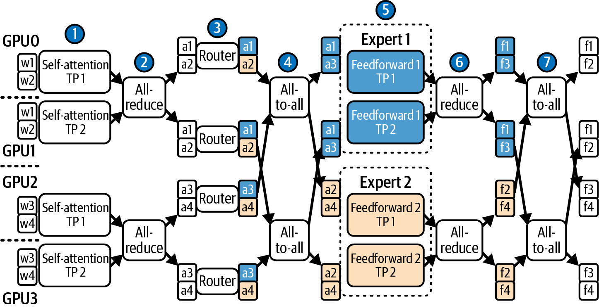

> Figure 15-7. High-level diagram of a 4 x 2 x EP hybrid parallel combination (source: https://oreil.ly/q1AEf)

在这里，我们使用四个流水线阶段（每个GPU一个）和两路张量并行。token使用专家并行跨两个专家路由。这被称为4 x 2 EP混合并行策略。

让我们更大一些，创建GPU的逻辑组。例如，考虑一个64个GPU的集群。我们可以将GPU分成16组，每组4个GPU。使用具有60层和64个专家的MoE，我们可以使用4路流水线并行，每个阶段15层。这分割了模型的深度。然后，在每个阶段（15层）内，我们可以使用2路TP来分割每层内的繁重矩阵乘法。这分割了模型的宽度。

对于MoE层，您可以使用EP使用top-2门控在每个组内分布16个专家。这将把token发送到组内最多两个GPU。最后，数据并行可以部署两个这样的64-GPU副本，使系统吞吐量翻倍。

这只是一个配置。在实践中，您需要尝试不同的并行策略组合。您的性能分析工具将帮助您找到正确的平衡。具体而言，您可以使用Nsight Systems进行端到端跟踪，使用Nsight Compute进行内核特定的GPU指标。

> 请记住，在每次更改前后始终验证互连流量、Tensor Core利用率和其他性能增强机制。

指导原则是使用TP直到收益递减点--通常在节点内或像NVL72机架这样的紧密耦合单元内。然后，您应该尽量少用流水线并行--刚好足够将模型放入内存。然后，您希望最大化EP以在专家和GPU之间分布MoE参数。最后，您添加数据并行副本以提高吞吐量，随着您扩展到越来越多的最终用户和并发推理请求（如果预期有超长输入，CP可以有选择地叠加在上面）。

我们还想使并行化与硬件拓扑保持一致。例如，如果使用NVL72系统，所有72个GPU通过NVLink和NVSwitch全连接。在这种情况下，您可以在72个GPU NVLink域内形成TP和EP组。然而，接近完整域的TP组通常会因全归约延迟而看到收益递减。因此，许多生产系统保持TP组较小且拓扑感知--即使在NVL72内部。

相比之下，由两个通过InfiniBand连接的8-GPU节点组成的较小集群仅在每个节点内具有完整的NVLink连接--跨节点流量沿InfiniBand结构传输。在这种环境中，最好将TP保持在每个8-GPU节点本地--如果可能的话避免节点间并行，以避免节点间通信的更高延迟和更低带宽。

在下一节中，我们将讨论可以与这些并行策略结合使用的更高级优化，以在多节点集群上实现更快的推理。正如我们将看到的，一个设计良好的服务系统将结合许多这些高级和低级技术。

> In practice, serving massive MoE LLMs uses a combination of the previous parallelism strategies. Today's LLM models are so large and complex that no single parallelization method is sufficient. Figure 15-7 shows a hybrid parallel configuration using four GPUs. Here, we are using four pipeline stages (one per GPU) and two-way tensor parallelism. The tokens are routed across two experts using expert parallelism. This is called a 4 x 2 EP hybrid parallel strategy. Let's go even larger and create logic groups of GPUs. For example, consider a cluster of 64 GPUs. We can group the GPUs into 16 groups of 4 GPUs each. Using an MoE with 60 layers and 64 experts, we can use 4-way pipeline parallelism with 15 layers per stage. This splits the depth of the model. Then, within each stage (15 layers), we can use 2-way TP to split the heavy matrix multiplies within each layer. This splits the width of the model. For the MoE layers, you can use EP to spread 16 experts per group using top-2 gating. This will send tokens to, at most, two GPUs in the group. Finally, data parallelism can deploy two such 64-GPU replicas to double your system's throughput. This is just one configuration. In practice, you'll need to experiment with different combinations of parallelism strategies. Your profiling tools will help you find the right balance. Specifically, you can use Nsight Systems for end-to-end traces and Nsight Compute for kernel-specific GPU metrics. Remember to always verify interconnect traffic, Tensor Core utilization, and other performance-enhancing mechanisms before and after making each change. The guiding principle is to use TP up to the point of diminishing returns-usually within a node or in a tightly coupled unit like an NVL72 chassis. You would then use pipeline parallelism minimally-just enough to fit the model in memory. Then, you want to maximize EP to distribute MoE parameters across experts and GPUs. Finally, you add data parallel replicas to improve throughput as you scale to more and more end users and concurrent inference requests (CP can be optionally layered on top if extremely long inputs are expected). We also want to align parallelization with our hardware topology. For instance, if using an NVL72 system, all 72 GPUs are fully connected using NVLink and NVSwitch. In this case, you can form TP and EP groups within the 72 GPU NVLink domain. However, TP groups that approach the full domain will often see diminishing returns from the all-reduce latency. As such, many production systems keep TP groups smaller and topology aware-even inside NVL72. In contrast, a smaller cluster of two 8-GPU nodes connected with InfiniBand has full NVLink connectivity only within each node-with cross-node traffic traveling along the InfiniBand fabric. In such environments, it's best to keep TP local to each 8-GPU node-and avoid internode parallelism if possible to avoid the higher latency and lower bandwidth of internode communications. In the next sections, we discuss higher-level optimizations that can be combined with these parallelism strategies to achieve even faster inference on multinode clusters. As we shall see, a well-designed serving system will combine many of these high-level and low-level techniques.

## 推测解码和并行Token生成技术 (Speculative Decoding and Parallel Token Generation Techniques)

LLM推理中的一个基本性能挑战是解码的顺序性质。请记住，在预填充期间处理完初始提示后，模型通常一次生成一个token。每个token的计算依赖于前一个token的结果，因此这很难并行化，因为它本质上是一个串行过程，这引入了延迟瓶颈--即使使用最新、最快的GPU也是如此。在现代GPU硬件上，顺序生成数百个token可能需要数秒的时间。

在本节中，我们将讨论几种加速解码阶段的技术。其中一些技术涉及在每个推理步骤中生成多个token，而其他技术则完全减少顺序推理步骤的数量。

推测解码传统上将一个小型、快速的"草稿"模型与一个较大的"目标"模型配对，前者在一个批次中提出多个token，后者验证每个候选token。这通过第二次推理传递换取并行生成，以实现更高的多token吞吐量。然而，运行两个独立的模型会增加部署复杂性，并且当验证传递成为瓶颈时仍可能阻塞推理。

Medusa通过将多个轻量级解码头直接附加到单个LLM上来简化这一点。在每个步骤中，这些头使用基于树的注意力机制在单次前向传递中同时生成和验证多个token候选。

Medusa的统一设计避免了跨模型token传输，在不牺牲token生成质量的情况下实现了大幅加速。通过将草稿-验证整合到单模型传递中，Medusa是对传统双模型推测解码技术的改进。让我们仔细看看其中一些技术。

> One of the fundamental performance challenges in LLM inference is the sequential nature of decoding. Remember that after the initial prompt is processed during prefill, the model typically generates one token at a time. Each token's computation depends on the result of the previous token, so this is difficult to parallelize as it's inherently a serial process, which introduces a latency bottleneck-even with the latest, fastest GPUs. Generating hundreds of tokens sequentially can take on the order of seconds for massive models on modern GPU hardware. In this section, we discuss several techniques to accelerate the decode stage. Some of these techniques involve generating multiple tokens per inference step, while others reduce the number of sequential inference steps altogether. Speculative decoding traditionally pairs a small, fast "draft" model that proposes several tokens in one batch with a larger "target" model that then validates each candidate. This trades a second inference pass for parallel generation to achieve higher, multitoken throughput. However, running two separate models adds deployment complexity and can still stall inference when the verification pass becomes a bottleneck. Medusa simplifies this by attaching multiple lightweight decoding heads directly to a single LLM. At each step, these heads use a tree-based attention mechanism to concurrently generate and verify several token candidates within a single forward pass. This unified design of Medusa avoids cross-model token transfers and achieves large speedups without sacrificing the quality of the token generation. By consolidating draft-and-verify into a single-model pass, Medusa is an improvement over conventional two-model speculative decoding techniques. Let's take a closer look at some of these techniques.

### 双模型、基于草稿的推测解码和EAGLE (Two-Model, Draft-Based Speculative Decoding and EAGLE)

推测解码是一种用小型模型的额外工作来换取大型模型时间节省的技术。其思想是在主LLM旁边运行一个轻量级的"草稿"LLM。草稿模型更快，并在当前上下文之外推测性地生成一批k个token。

然后，大模型（称为目标模型）通过在发送到GPU的单个批次中预测整个k-token序列的下一个token概率来验证草稿token。通过一次处理所有k个token，目标模型通过每传输字节数据执行更多计算来增加算术强度。这导致草稿序列token的高效快速验证。

如果目标模型的输出与草稿模型的k个提议token一致，那么我们实际上在大型模型生成单个token的相同时间内生成了k个token。如果大型模型的验证在草稿模型生成的k个token序列中的任何token处与草稿模型的预测产生分歧，则该点之后的推测token将被丢弃。在每个步骤中至少会保留一个生成的token，因为验证过程总是接受来自草稿模型或目标模型的第一个token。

一旦使用了目标模型的校正token并继续解码，就可以从该点开始新的推测解码周期。图15-8显示了一个小型草稿模型预测多个token的情况。然后，目标（大）模型逐个验证这些token。

随着时间的推移，推测解码减少了大型模型所需的逐个顺序调用的总数。理论上，它提供k倍的加速，其中k是草稿模型生成的token数量。在实践中，由于开销和偶尔的推测token拒绝，增益更像是2倍加速。

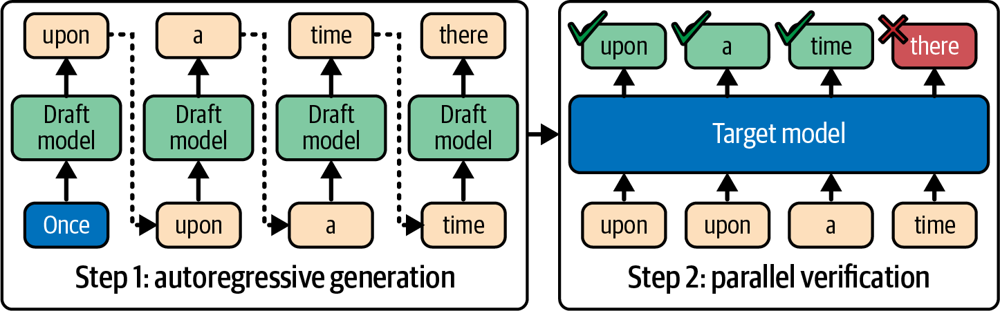

> Figure 15-8. Speculative decoding with a draft (small) for decoding and a target (large) model for multitoken verification

草稿模型必须被选择为与大型模型的分布具有相当高的保真度。这意味着草稿模型的预测应该与大型模型可能的输出高度重叠。如果草稿模型经常猜错，推测解码提供的收益很小并浪费计算。如果它经常预测大型目标模型不会预测的token，许多推测token将被拒绝。这将浪费计算时间。

草稿模型还必须比大型模型快得多--通常快4倍或更多--推测解码才能提供实际的性能改进。常见的策略是使用主模型的蒸馏版本--或者在相同数据上微调的较小模型，以便其输出良好相关。

> 草稿模型必须使用与大型模型相同的分词器和词汇表。这有时被忽视，会导致糟糕的结果。

草稿模型使用相同的提示生成token，可能使用更高的温度来增加匹配大型模型可能延续之一的机会。同时，目标模型跳过并在单个批次中处理所有草稿token。

在标准推测解码接受过程下，目标模型的输出分布得以保留。因此，当采样设置对齐时，最终样本与大型模型的分布匹配。如果草稿模型产生分歧，目标模型的验证会拒绝这些token并保持正确性。唯一的区别是，当小型模型正确猜测这些推测token时，可以避免多达k次目标模型调用。

推测解码可以以多种方式实现。大多数现代LLM推理引擎（如vLLM、SGLang和TensorRT-LLM）都内置支持来协调草稿和目标模型生成。

根据经验，约1.5-2.5倍的加速是常见的，通过仔细的批处理和草稿模型设计可以获得更高的收益。

> 在PyTorch中，操作torch.nn.functional.scaled_dot_product_attention根据设备代、形状、掩码和dtype自动选择最优后端（FlashAttention或cuDNN内核）。您可以使用带有显式SDPABackend类型的torch.nn.attention.sdpa_kernel()来固定后端。例如，在对LLM解码进行基准测试时，验证融合后端是否处于活动状态非常重要。

例如，EAGLE（Extrapolation Algorithm for Greater LLM Efficiency）算法通过在特征级别而非token级别操作来重新思考推测解码。EAGLE使用大型模型自身中间表示的一步外推来预测下一个token的特征。这解决了不确定性并实现了更高的接受率。

EAGLE报告称，对于4-token草稿，相比普通解码实现了高达约3.5倍的加速，同时保留了大型模型的输出分布。EAGLE在有利环境中接近其草稿深度的理论极限。它表明，通过创新技术，推测解码可以进一步减少解码时间--同时保持输出质量。

EAGLE-2通过引入上下文感知的动态草稿可能性树来扩展EAGLE。虽然EAGLE在某些评估中相比普通解码实现了高达3.5倍的加速，但EAGLE-2的方法报告称根据任务和模型的不同，比EAGLE快约20%-40%。使用EAGLE-2，草稿模型生成分支的token序列集，这进一步增加了验证步骤中的并行性。如图15-9所示。

EAGLE-3通过偏好直接token预测和融合多层特征，继续改进早期版本EAGLE-1和EAGLE-2。EAGLE-3报告称在某些任务中比EAGLE-2提高了高达1.4倍--相比非优化基线变体实现了高达6.5倍的加速。在EAGLE-1和EAGLE-2中，草稿模型预测内部特征向量，然后将其解码为token。这些早期的EAGLE方法本质上是通过猜测内部特征--然后将它们映射到token来工作的。

EAGLE-3跳过特征级预测步骤，更直接地预测草稿token。然而，它仍然使用内部特征，但融合到多层表示（下层、中层、上层）中以指导草稿预测。这与仅使用顶层形成对比。这使EAGLE-3更加精简且约束更少--允许更好的扩展。

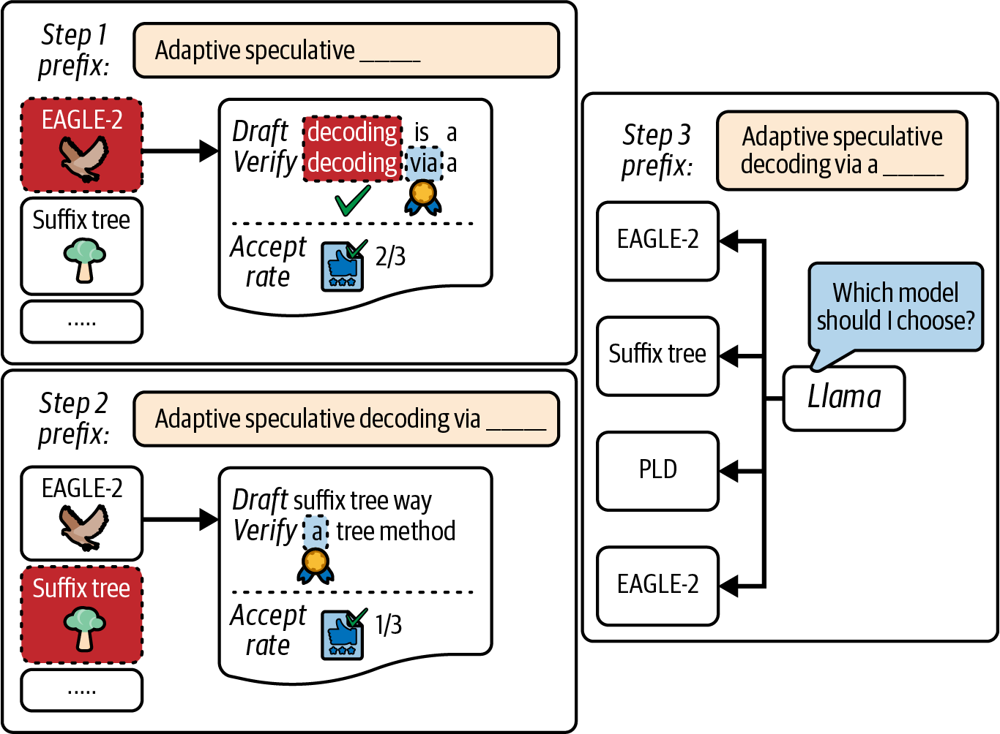

> Figure 15-9. Speculative decoding with EAGLE-2 (source: https://oreil.ly/uG07b)

另一种技术是动态深度解码，它可以自适应地跳过对输出质量影响最小的层。其他减少计算的技术包括跳过每第N个transformer层、对草稿模型使用较低精度（如FFP8和NVFP4），以及在草稿阶段临时使用较小的隐藏大小。

> 一些研究原型提供在解码期间跳过部分网络或降低精度以换取速度的模式。在撰写本文时，这些模式在生产模型中尚未普遍可用，因此在启用任何此类模式之前，请始终在目标任务上验证质量和速度。

未来的LLM可能包括优化的"快速生成"模式。例如，模型可能有替代的轻量级层或用于降低精度解码的配置。这种内置优化将允许模型跳过计算。

> Speculative decoding is a technique that trades extra work on a small model to save time on the expensive large model. The idea is to run a lightweight "draft" LLM alongside the main LLM. The draft model is faster and generates a batch of k tokens speculatively beyond the current context. The big model, called the target model, then validates the draft tokens by predicting next-token probabilities for the entire k-token sequence in a single batch sent to the GPU. By handling all k tokens at once, the target model increases arithmetic intensity by performing more computations per byte of data transferred. This results in efficient and fast verification of the draft sequence tokens. If the target model's output agrees with the draft model's k proposed tokens, then we have effectively generated k tokens in the same time that a large model would have generated a single token. If the large model's verification diverges from the draft model's prediction at any token in the sequence of k tokens generated by the draft model, the speculative tokens beyond that point are discarded. At least one generated token will be kept in each step because the verification procedure always accepts the first token from either the draft or the target model. Once the target model's corrected token is used and decoding continues, a new speculative decoding cycle can start from that point. Figure 15-8 shows a small draft model predicting multiple tokens ahead. Then the target (big) model verifies these tokens one by one. Over time, speculative decoding reduces the overall number of one-by-one, sequential invocations needed by the large model. In theory, it provides a theoretical kx speedup, where k is the number of tokens generated by the draft model. In practice, with overhead and occasional speculative-token rejections, the gain is more like a 2x speedup. The draft model must be chosen to have reasonably high fidelity to the large model's distribution. This means that the draft model's predictions should have high overlap with the large model's likely outputs. If the draft frequently guesses wrong, speculative decoding provides little benefit and wastes compute. If it often predicts tokens that the larger target model would not, many speculative tokens will be rejected. This will waste compute time. The draft model must also be much faster than the large model-typically by a factor of 4x or more-for speculative decoding to provide a practical performance improvement. A common strategy is to use a distilled version of the main model-or a smaller model fine-tuned on the same data so that its outputs correlate well. The draft model must use the same tokenizer and vocabulary as the large model. This is sometimes overlooked, and it will lead to poor results. The draft model generates tokens using the same prompt and perhaps a higher temperature to increase the chance of matching one of the large model's probable continuations. Meanwhile, the target model skips ahead and processes all of the draft tokens in one single batch. Under the standard speculative decoding acceptance procedure, the target model's output distribution is preserved. As such, the final samples match the large model's distribution when sampling settings are aligned. If the draft diverges, the target model's verification rejects those tokens and correctness is maintained. The only difference is that up to k number of target-model calls are avoided when the small model guesses correctly for these speculative tokens. Speculative decoding can be implemented in a variety of ways. Most modern LLM inference engines like vLLM, SGLang, and TensorRT-LLM have built-in support to coordinate draft and target model generation. Empirically, speedups around 1.5-2.5x are common, and higher gains are possible with careful batching and draft model design. In PyTorch, the operation torch.nn.functional.scaled_dot_product_attention auto-selects the optimal backend (FlashAttention or a cuDNN kernel) based on device generation, shapes, mask, and dtype. You can pin a backend using torch.nn.attention.sdpa_kernel() with an explicit SDPABackend type. It's important to verify that the fused backend is active when benchmarking LLM decoding, for instance. For instance, the Extrapolation Algorithm for Greater LLM Efficiency (EAGLE) algorithm rethinks speculative decoding by operating at the feature level rather than the token level. EAGLE uses a one-step extrapolation of the large model's own intermediate representation to predict the next token's features. This resolves uncertainty and achieves higher acceptance rates. EAGLE reported up to about 3.5x speedup over vanilla decoding for a 4-token draft while preserving the large model's output distribution. EAGLE approaches the theoretical limit of its draft depth in favorable environments. And it shows that, with innovative techniques, speculative decoding can reduce decoding time even further-and preserve output quality at the same time. EAGLE-2 extends EAGLE by introducing a context-aware dynamic draft tree of possibilities. While EAGLE achieved up to 3.5x speedup versus vanilla decoding in some evaluations, EAGLE-2's approach reported speedups of about 20%-40% faster than EAGLE depending on the task and model. With EAGLE-2, the draft model generates a branching set of token sequences, which further increases parallelism in the verification step. This is shown in Figure 15-9. EAGLE-3 continues to improve on earlier versions, EAGLE-1 and EAGLE-2, by preferring direct token prediction and fusing multi-layer features. EAGLE-3 reports up to 1.4x improvements over EAGLE-2 in certain tasks-and up to 6.5x speedups over non-optimized baseline variants. In EAGLE-1 and EAGLE-2, the draft model predicts internal feature vectors which are then decoded to tokens. These earlier EAGLE methods worked by guessing internal features, essentially-and then mapping them to tokens. EAGLE-3 skips the feature-level prediction step and predicts the draft tokens more directly. However, it still uses internal features but fused into multiple layer representations (lower, middle, upper) to guide the draft predictions. This is in contrast to using just the top layer. This makes EAGLE-3 more streamlined and less constrained-allowing better scaling. Another technique is dynamic depth decoding, which can adaptively skip layers that minimize the impact on output quality. Other techniques that reduce computations include skipping every Nth transformer layer, using lower precision (e.g., FFP8 and NVFP4) for the draft model, and using a smaller hidden size temporarily for the draft stage. Some research prototypes offer modes that skip portions of the network or reduce precision during decoding to trade accuracy for speed. As of this writing, these are not universally available in production models, so always validate quality and speed on your target tasks before enabling any such mode. Future LLMs might include an optimized "fast-generation" mode. For example, a model might have alternate lightweight layers or a configuration for reduced-precision decoding. This built-in optimization would allow the model to skip computations.

### 单模型自推测解码 (Single-Model Self-Speculative Decoding)

推测解码的另一种方法是完全避免使用外部草稿模型，而是使用较大的目标模型通过选择性跳过一些计算来同时草拟和验证其自己的输出。其中一种方法是自推测解码（self-speculative decoding），也称为草稿-验证方案（draft-and-verify scheme）。

使用自推测解码，大型目标模型使用快速、近似的传递生成k个token。例如，它可以选择只运行一半的层--并且可能以降低的精度--为每个新token。它会跳过每隔一层。这产生了类似于较小草稿模型会产生的草稿输出。当接受率和草稿深度有利时，它可以实现类似的加速。这产生了类似于较小草稿模型会产生的草稿输出--并实现类似的2倍加速。

然后，在自推测解码的第二阶段，目标模型执行完整的前向传递以一次性验证这k个token。如果它们全部匹配，那么我们节省了为这些token执行一半层的计算。如果不匹配，我们只需接受不匹配之前的token，并正常继续，回退到传统的推测方法。

因为自推测解码中是同一个模型进行草稿和验证，所以不需要在运行时训练、维护或将单独的模型加载到内存中。挑战是找到一种好的方法来减少草稿阶段所需的计算量（跳过层、降低精度等），而不会过多损害准确性。

一种相关技术是一致解码（consistent decoding），其中您训练一个LLM来同时生成和验证多个token。这种单模型方法在没有单独草稿模型的情况下产生了约3倍的加速。这显示了将推测解码融入模型自身权重的趋势。

这些方法代表了非常活跃的研究领域。它们特别令人兴奋和有前途，因为它们让模型利用其固有的内部冗余来加速自己。由于优化是模型本地的，推理引擎的实现可以简化。

> Another approach to speculative decoding is to avoid using an external draft model altogether and use the larger target model to both draft and verify its own outputs by selectively skipping some computations. One such method is self-speculative decoding, also called the draft-and-verify scheme. With self-speculative decoding, the large target model generates k tokens using a fast, approximate pass. For instance, it can choose to run only half of its layers-and possibly in reduced precision-for each new token. It would skip every other layer. This produces draft output much like the smaller draft model would. And it can approach similar speedups when acceptance rates and draft depth are favorable. This produces draft output much like the smaller draft model would-and achieves a similar 2x speedup as well. Then, in a second stage of self-speculative decoding, the target model performs a full forward pass to verify those k tokens in one go. If they all match, then we save executing half the layers for those tokens. If not, we simply fall back to the traditional speculative approach by accepting tokens up to the mismatch and proceeding normally. Because it's the same model doing both draft and verification in self-speculative decoding, no separate model needs to be trained, maintained, or loaded into memory at runtime. The challenge is finding a good way to reduce the amount of compute needed in the draft stage (dropping layers, reducing precision, etc.) without hurting accuracy too much. A related technique is consistent decoding, in which you train one LLM to both generate and validate multiple tokens. This single-model approach produces ~3x speedups without a separate draft model. This shows a trend of baking speculative decoding into the model's own weights. These methods represent very active areas of research. And they are particularly exciting and promising because they let the model accelerate itself using its inherent internal redundancy. And since the optimizations are local to the model, the inference engine's implementation can be simplified.

### 使用Medusa多头进行多Token解码 (Multitoken Decoding with Medusa's Multiple Heads)

推测解码仍然最终使用草稿模型逐个生成token--它只是更快，因为草稿模型更小。然而，Medusa框架采用了一种更激进的方法。它修改模型架构本身，为每个解码步骤并行预测多个新token。

与仍然逐个生成token（尽管更快）的双模型推测解码不同，Medusa的架构真正从单个模型每次迭代生成多个token。因此，Medusa的多头方法在Medusa-1和Medusa-2的已发表实验中报告了约2.2-3.6倍的加速。

然而，Medusa需要自定义模型训练，因为它修改了基于transformer的LLM，添加了在某些层分支的额外解码头--因此得名Medusa。这让模型能够同时提议多个下一个token。

不同Medusa头生成的多个token候选像树一样结构化。例如，Medusa可以在一次传递中生成深度为2的二叉树，以产生最多4个token。然后，它可以并行验证多token序列，如图15-10所示。

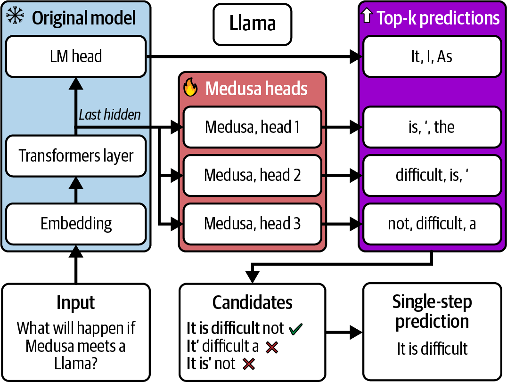

> Figure 15-10. Multitoken decoding with Medusa (source: https://oreil.ly/MJMOQ)

在内部，Medusa使用专门的基于树的注意力模式来提高并行token预测之间的一致性。模型学习同时扩展和验证多token序列。使用Medusa，LLM本质上学会了"提前思考"几个token--并一次性输出它们。

在推理过程中，Medusa可以按并行预测的因子减少顺序解码迭代次数。例如，如果Medusa在一次传递中预测4个token，它可以将深度为2的二叉树输出所需的前向传递次数减少多达4倍。

然而，在实践中，Medusa通常实现约2-3倍的加速，因为当预测分支验证失败并需要部分重做时，偶尔需要回溯的开销。这类似于推测解码验证和拒绝的开销。例如，如果Medusa LLM每次迭代生成4个token，那么100个token的回复只需要25次模型迭代，而不是100次。

Medusa需要修改和重新训练模型以添加这些额外的头。此外，由于额外的头参数，Medusa模型的尺寸略大。这稍微增加了开发复杂性和训练成本。然而，一旦训练完成，Medusa模型可以显著减少推理时间。

如果为您的用例进行了训练，启用Medusa的LLM可以提供出色的低延迟性能。然而，这种技术需要修改和微调模型架构以添加额外的头。

> Speculative decoding still ultimately generates tokens one by one using the draft model-it's just faster because the draft model is smaller. However, the Medusa framework takes a more radical approach. It modifies the model architecture itself to predict multiple new tokens in parallel for each decoding step. Unlike two-model speculative decoding, which still generates tokens one by one (albeit faster), Medusa's architecture truly generates multiple tokens per iteration from a single model. As such, Medusa's multiheaded approach has reported about 2.2-3.6x speedups in published experiments across both Medusa-1 and Medusa-2. However, Medusa requires custom model training since it modifies the transformer-based LLM with additional decoder heads that branch off at certain layers-hence, the name Medusa. This lets the model propose several next tokens simultaneously. The multiple token candidates generated by the different Medusa heads are structured like a tree. For instance, Medusa can generate a binary tree of depth 2 in one pass to produce up to 4 tokens. It can then verify the sequence of multiple tokens in parallel, as shown in Figure 15-10. Internally, Medusa uses a specialized, tree-based attention pattern to improve consistency among the parallel token predictions. The model learns to extend and verify the multiple-token sequences concurrently. With Medusa, the LLM essentially learns to "think ahead" by a few tokens-and output them all at once. During inference, Medusa can reduce the number of sequential decoding iterations by the factor of the parallel predictions. For instance, if Medusa predicts 4 tokens in one pass, it can reduce the required number of forward passes by up to 4x for depth-2 binary tree outputs. In practice, however, Medusa typically achieves about a 2-3x speedup due to the overhead of occasionally having to backtrack when a prediction branch fails validation and needs a partial redo. This is similar to the overhead of speculative decoding verification and rejection. For example, if a Medusa LLM generates 4 tokens per iteration, a reply of 100 tokens would take only 25 iterations of the model instead of 100. Medusa requires modifying and retraining the model to add these extra heads. In addition, Medusa models are slightly larger in size given the additional head parameters. This increases development complexity and training cost a bit. However, once trained, Medusa models can significantly reduce inference times. If trained for your use case, a Medusa-enabled LLM can provide excellent low-latency performance. However, this technique requires modifying and fine-tuning the model architecture to add the additional heads.

### 交错多个请求的解码步骤 (Interleaving Decode Steps from Multiple Requests)

另一种并行解码技术是在多个最终用户之间交错多个并发请求的解码步骤。这种并行性更像是一种推理引擎能力，而不是算法技巧或模型架构修改。但它有助于通过在token级别和跨最终用户请求进行批处理来保持GPU繁忙。

像vLLM这样的框架以请求路由、连续批处理和token调度的形式实现这一点。其思想是通过填充顺序步骤之间的间隙来保持GPU繁忙。具体而言，如果GPU由于序列等待I/O或数据依赖而停顿，调度器可以同时在同一GPU上运行另一个序列的下一个token预测。

> 将推理引擎的高级路由、批处理和调度能力与CUDA流结合。然后使用Nsight Systems验证token步骤内核与NIC/NVLink传输重叠，而不是在单个流上序列化。然后您可以在应用、系统和硬件级别实现大规模并行。

重要的是要注意，交错解码步骤不会加速单个序列的延迟。事实上，由于额外的上下文切换，它甚至可能为每个token增加一点开销。然而，在同时服务许多用户时，它可以大大提高整体吞吐量和GPU利用率。这将减少高负载下的平均最终用户请求延迟。

> Another parallel decoding technique is to interleave decode steps from multiple concurrent requests across multiple end users. This parallelism is more of an inference-engine capability than an algorithmic trick or model architecture modification. But it helps keep the GPUs busy by batching at the token level-and across end-user requests. Frameworks like vLLM implement this in the form of request routing, continuous batching, and token scheduling. The idea is to keep the GPUs busy by filling in the gaps between sequential steps. Specifically, if a GPU is stalled due to a sequence waiting on I/O or a data dependency, the scheduler can run another sequence's next token prediction on that same GPU in the meantime. Combining an inference engine's advanced routing, batching, and scheduling capabilities with CUDA streams. Then verify with Nsight Systems that token-step kernels overlap with NIC/NVLink transfers rather than serializing on a single stream. Then you can achieve massive parallelism at the application, system, and hardware levels. It's important to note that interleaving decode steps doesn't speed up a single sequence's latency. In fact, it can even add a tiny bit of overhead per token due to the additional context switching. However, it can greatly improve overall throughput and GPU utilization when serving many users concurrently. This will reduce the average end-user request latency under heavy load.

### 组合解码技术和评估复杂性 (Combining Decoding Techniques and Evaluating Complexity)

值得注意的是，这些解码优化可以组合使用。例如，可以将推测解码与启用Medusa的目标模型一起使用，其中大型目标模型一次验证小型模型预测的多个token。

这些技术也以额外的复杂性为代价。您要么必须维护额外的模型，修改主模型，要么管理更复杂的控制逻辑。在生产中，您应该根据性能收益评估这种复杂性。对于交互式应用程序，即使减少几毫秒的响应时间也是值得的--尤其是在规模上。

简而言之，像推测解码（有或没有草稿模型）和Medusa风格的多token预测这样的高级解码技术可以减少传统上一次生成一个token的现代自回归LLM的整体推理时间。通过一次生成更多token、增加整体算术强度并将解码步骤推向计算受限的领域，您可以利用GPU的极端计算能力。

> 解码优化领域正在不断发展和日益复杂；趋势很明确：让LLM解码更加并行和高效。

> It's worth noting that these decoding optimizations can be combined. For instance, one could use speculative decoding with a Medusa-enabled target model in which the big target model verifies multiple tokens at a time predicted by a small model. These techniques also come at the cost of additional complexity. Either you have to maintain an extra model, alter the main model, or manage more elaborate control logic. In production, you should evaluate this complexity against the performance gains. For interactive applications, reducing response time by even a few milliseconds is worth the complexity-especially at scale. In short, advanced decoding techniques like speculative decoding-with or without a draft model-and Medusa-style multitoken prediction can reduce overall inference times of modern autoregressive LLMs that traditionally generate one token at a time. By generating more tokens at a time, increasing overall arithmetic intensity, and pushing the decoding step toward the compute-bound regime, you can take advantage of the GPU's extreme compute capabilities. The decoding-optimization landscape is continuously evolving and growing in complexity; the trend is clear: make LLM decoding more parallel and efficient.

## 约束解码的性能影响 (Constrained Decoding Performance Implications)

LLM解码过程中一个独立但重要的方面是在某些约束下生成文本。例如，模型可以强制输出匹配预定义格式（JSON）、使用特定语法，或出于安全原因禁止某些序列。因此，约束解码（通常称为结构化输出）通常是生产用例所必需的。

例如，OpenAI的函数调用API依赖于格式良好的输出格式来确定调用哪个函数--以及函数的输入和输出。这些约束旨在匹配函数的API签名，在应用层面是不可协商的。

约束解码改变了模型的token选择过程，使得在每个步骤中只允许有效的token。这可能像提供允许的token列表一样简单--也可能像嵌入形式语法并使用状态机过滤无效token一样复杂。

约束解码的缺点是需要额外的延迟来强制执行这些约束--通常是每个token几毫秒。这是因为模型可能需要重复回溯、导航修剪后的词汇表，并最终生成有效的token。回溯发生在LLM的生成循环内部。因此，如果模型本身没有细粒度的遥测，调试、分析和调优约束解码可能会很困难。

另一个性能考虑因素是缓存效率。在每个解码步骤修剪完整的概率分布可能会破坏缓存并进一步降低吞吐量。当允许的token集受到严重限制时，这一点尤为明显。

为了减轻这些成本，许多框架编译JSON语法并为每个状态预计算有效token。这允许推理引擎在运行时屏蔽无效的softmax输出。这种方法减少了回溯、改善了缓存并提高了接受率。

对于中等约束（如简单的JSON模式），使用编译语法并将掩码计算与GPU执行重叠的现代引擎可以将开销推到规模上的低个位数百分比范围，但复杂语法或小批量仍可能产生两位数的开销。始终在您的确切模式下测量TTFT和每秒token数。

这些技术已在流行的库和推理引擎中实现，包括Hugging Face Transformers、NVIDIA NeMo和vLLM。例如，NVIDIA的TensorRT-LLM和Hugging Face Transformers都允许用户定义的词汇表掩码，以几乎可忽略的速度损失强制执行约束。具体而言，TensorRT-LLM通过XGrammar后端公开了具有JSON模式和上下文无关语法（CFG）支持的引导解码。而vLLM和Transformers提供结构化输出API。

> 使用TensorRT-LLM的引导解码时，XGrammar在GPU上提供JSON模式和CFG支持。XGrammar编译约束并避免大型Python端token掩码开销。但是，请注意某些配置可能会回退到较慢的后端并导致过多的首次请求停顿。因此，保持语法紧凑以保持缓存局部性和token掩码带宽很重要。

另一种流行的策略是将约束解码推入内核本身。在这种情况下，它会在最终的softmax步骤中注入token掩码以实现类似的性能增益。

当高效实现时，约束解码通常可以像无约束解码一样快地运行--特别是当约束规则集不太大或不太严格时。如果解码约束太严格，解码实际上变成了在小型token空间中的搜索。这会导致更多的回溯和更慢的token生成。

> 如果可能，避免大型或过于严格的约束，如语法、格式和词汇表。一种选择是让LLM正常解码，然后简单地后处理或过滤输出。但是，这并不总是一个高性能或可行的选择。分析不同的选项并选择最适合您用例的选项。

> A separate but important aspect of the LLM decoding process is generating text under certain constraints. For instance, the model can force the output to match a predefined format (JSON), use a particular grammar, or disallow certain sequences for safety. As such, constrained decoding, often called structured outputs, is often required for production use cases. OpenAI's function-calling API, for example, relies on well-structured output formats to determine which function to call-as well as the functions' inputs and outputs. These constraints are designed to match the function's API signature and are simply nonnegotiable at the application level. Constrained decoding alters the model's token-selection process so that, at each step, only valid tokens are allowed. This might be as simple as supplying a list of allowed tokens-or as sophisticated as embedding a formal grammar and using a state machine to filter out invalid tokens. The drawback of constrained decoding is that extra latency is needed to enforce these constraints-often a few milliseconds per token. This is because the model may need to backtrack repeatedly, navigate the pruned vocabulary, and ultimately generate a valid token. Backtracking happens inside the LLM's generation loop. As such, debugging, profiling, and tuning constrained decoding can be difficult without fine-grained telemetry in the model itself. Another performance consideration is cache efficiency. Pruning the full probability distribution at every decode step can blow caches and reduce throughput even further. This is particularly noticeable when the allowed token set is heavily limited. To mitigate these costs, many frameworks compile a JSON grammar and precompute valid tokens for each state. This allows the inference engine to mask out invalid softmax outputs at runtime. This approach reduces backtracking, improves caching, and raises acceptance rates. For moderate constraints such as simple JSON schemas, modern engines that use compiled grammars and overlap mask computation with GPU execution can push overhead into the low single-digit percent range at scale, but complex grammars or small batches can still incur double-digit overhead. Always measure TTFT and tokens per second under your exact schema. These techniques have been implemented in popular libraries and inference engines, including Hugging Face Transformers, NVIDIA NeMo, and vLLM. For instance, NVIDIA's TensorRT-LLM and Hugging Face Transformers both allow user-defined vocabulary masks to enforce constraints with negligible speed penalty. Specifically, TensorRT-LLM exposes guided decoding with JSON schema and context-free grammar (CFG) support through the XGrammar backend. And vLLM and Transformers provide structured output APIs. When using TensorRT-LLM's guided decoding, XGrammar supplies JSON-schema and CFG support on-GPU. XGrammar compiles constraints and avoids large Python-side token-mask overhead. However, be aware that certain configurations may fall back to slower backends and cause excessive first-request stalls. As such, it's important to keep grammars compact to preserve cache locality and token-mask bandwidth. Another popular strategy is to push constrained decoding into the kernel itself. In this case, it would inject token masks during the final softmax step to achieve similar performance gains. When implemented efficiently, constrained decoding can often run as fast as unconstrained decoding-especially if the constraint ruleset is not too large or too restrictive. If the decoding constraints are too restrictive, decoding effectively becomes a search through a small token space. This leads to more backtracking and slower token generation. When possible, avoid large or overly restrictive constraints, such as grammars, formats, and vocabularies. One option is to let the LLM decode as normal and simply postprocess or filter the outputs. However, this is not always a performant or viable option. Profile the different options and choose what's best for your use case.

## MoE模型的动态路由优化 (Dynamic Routing Optimizations for MoE Models)

混合专家（MoE）模型的性能高度依赖于其路由机制的效率。每个MoE层都有一个门控网络，决定将每个输入token发送到哪些专家。优化这个路由过程对于实现高吞吐量和低延迟至关重要。

### 通信开销优化 (Communication Overhead Optimization)

在分布式MoE推理中，全对全通信操作在每个MoE层都会发生。这个操作在GPU之间洗牌一批token。每个GPU只接收它为其托管的专家所需的token，如图15-11所示。这在MoE的每一层都会发生，是一个代价高昂的操作，如果处理不当，可能会主导推理时间。

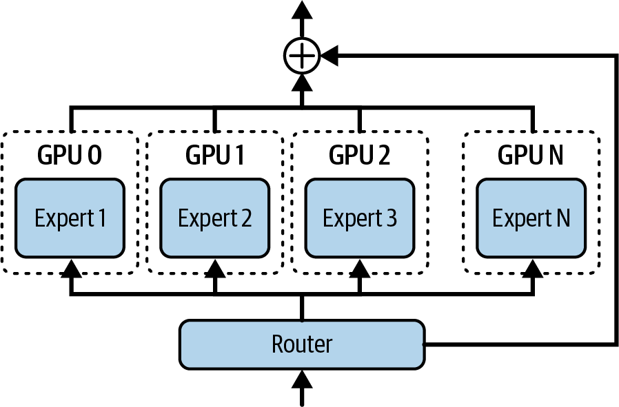

> Figure 15-11. Each GPU receives only the tokens it needs for the expert(s) that it hosts

减少通信开销的一种策略是为GPU集群使用分层路由策略，首先使用NVSwitch/NVLink在同一节点内的GPU之间路由token（快速），仅对需要非本地专家的剩余token进行跨节点路由。这种两阶段全对全可以减少节点间流量。

此外，您可以通过将通信与计算重叠来使用异步通信。高性能MoE推理服务器使用双缓冲通信，这样当一批token被发送时，上一批的专家计算并行进行。这种流水线隐藏了大部分通信延迟。

> 当节点间结构保持完全利用而节点内洗牌在后台运行时，可以实现接近最优的全对全完成时间。请务必测量节点间NIC和节点内NVLink路径的链路利用率。

朴素的全局全对全屏障实现可能会让GPU等待同步开销。如果没有最优地利用所有链路，这会浪费带宽。

蝴蝶调度（butterfly schedule，又称移位全对全调度）等技术可以将通信分解为分阶段轮次。这样，每个NVLink/NIC都忙于部分交换--而不是一次大型同步。这种交错方法提高了链路利用率并减少了空闲时间。

全对全交换可以使用内置的ncclAllToAll集合或分组的发送和接收调用。当交换被分块和流水线化或跨节点使用蝴蝶等分层调度时，吞吐量通常会提高。验证并选择与您的拓扑匹配的算法。

> 保持第一级全对全在机架内（NVLink），仅对剩余token溢出到跨机架。分析链路利用率以确认NIC饱和而NVLink洗牌在后台运行。此外，当节点间链路成为瓶颈时，建议对MoE全对全通信与专家计算进行双缓冲。您可以使用分块/流水线交换和蝴蝶/移位调度来避免全局屏障减速并优于浮点全局集合。

另一种减少通信流量的解决方案称为专家共置（expert collocation）。其思想是将某些专家共置在同一GPU或节点上以避免不必要的通信。考虑两个专家，专家5和专家7，它们经常被token路由器为同一token激活。将专家5和专家7放在同一GPU上可以消除额外的全对全跳。性能分析工具和门控频率分析可以帮助识别您工作负载的这种配对。

还有一种解决方案是压缩专家之间的通信，包括专家交换激活。例如，您可以在Tensor Cores上使用NVIDIA Transformer Engine在执行全对全通信之前转换为FP8或NVFP4。这将减少NIC负载，从而分摊压缩计算。这以极少量的数值精度换取GPU之间更快的激活传输。转换和打包/解包的开销通常相对于网络和内存传输成本很小。

简而言之，优化MoE通信涉及分析硬件和网络拓扑以优化专家在GPU上的放置。对于您的部署，重要的是配置集群的互连以实现高效的全对全通信。例如，使用NVL72机架中的NVLink Switch网格在单个域中的多达72个GPU之间获得全带宽通信。朴素的全对全选择可能主导层时间并实现非常低的SM效率。优先考虑专家流量并在可能的情况下重叠，并确保在进行不同的互连和通信算法选择时进行分析和验证。

> 对于MoE，配置您的集群以优化全对全通信。这意味着为您的拓扑选择适当的NCCL全对全算法或分组发送和接收实现，然后确认节点间路径启用了GPUDirect RDMA。此外，确保您的InfiniBand链路正确绑定，以便多个物理链路（端口）配置为单个逻辑通道。它们的带宽应该被合并--并且故障转移应该是无缝的。换句话说，确保您的网络拓扑针对MoE进行了调优。这包括堆栈中的硬件和软件层。

> In distributed MoE inference, an all-to-all communication operation occurs at every MoE layer. This operation shuffles a batch of tokens between the GPUs. Each GPU receives only the tokens it needs for the experts that it hosts, as shown in Figure 15-11. This happens for every layer in the MoE and is a costly operation, which can potentially dominate inference time if not handled efficiently. One strategy to reduce communication overhead is to use a hierarchical routing strategy for our GPU cluster by first routing tokens between GPUs within the same node using NVSwitch/NVLink (fast) and routing across nodes only for any remaining tokens that need nonlocal experts. This two-stage all-to-all can reduce the volume of internode traffic. Additionally, you can use asynchronous communication by overlapping the communication with computation. High-performance MoE inference servers use double-buffer communications so that while one batch of tokens is being sent around, the previous batch's expert computations occur in parallel. This pipelining hides much of the communication latency. It's possible to achieve near-optimal all-to-all completion times when the internode fabric is kept fully utilized while intranode shuffles run in the background. Be sure to measure link utilization on both the internode NIC and intranode NVLink paths. A naive implementation of expert routing that uses a single global all-to-all barrier can leave GPUs waiting on synchronization overhead. This wastes bandwidth if not all links are utilized optimally. Techniques such as a butterfly schedule (aka shifted all-to-all schedule) can break the communication into phased rounds. This way, every NVLink/NIC is busy with partial exchanges-as opposed to one big synchronization. This staggered approach improves link utilization and reduces idle time. All-to-all exchanges may use the built-in ncclAllToAll collective or grouped send and receive calls. Throughput often improves when the exchange is chunked and pipelined or when a hierarchical schedule such as butterfly is used across nodes. Validate and choose the algorithm that matches your topology. Keep first-stage all-to-all intra-rack (NVLink) and spill inter-rack only for residual tokens. Profile link utilization to confirm NICs are saturated while NVLink shuffles run in the background. Also, when internode links are the bottleneck, it's recommended to double-buffer MoE all-to-all communication with expert computation. You can use chunked/pipelined exchanges and butterfly/shifted schedules to avoid global barrier slowdowns and outperform float global collectives. Another solution to reduce communication traffic is called expert collocation. The idea is to collocate certain experts together on the same GPU or node to avoid unnecessary communication. Consider two experts, experts 5 and 7, that are often activated for the same token by the token router. Placing experts 5 and 7 on the same GPU can eliminate an extra all-to-all hop. Profiling tools and gating-frequency analysis can help identify such pairings for your workload. And yet another solution is to compress the communication between experts, including expert-exchange activations. For instance, you can cast to FP8 or NVFP4 on Tensor Cores with the NVIDIA Transformer Engine before performing an all-to-all communication. This will reduce NIC load which amortizes the compression computation. This trades a tiny bit of numerical precision for faster activation transfers between GPUs. The overhead to cast and pack/unpack is usually small relative to network and memory transfer costs. In short, optimizing MoE communication involves analyzing the hardware and network topology to optimize the placement of experts onto GPUs. For your deployments, it's important to configure the cluster's interconnects for efficient all-to-all communication. For instance, use the NVLink Switch mesh in an NVL72 rack to get the full bandwidth communication between up to 72 GPUs in a single domain. Naive all-to-all choices can dominate layer time and achieve very low SM efficiency. Prioritize expert traffic and overlap where possible, and make sure to profile and verify when making different interconnect and communication-algorithm choices. For MoEs, configure your cluster to optimize for all-to-all communication. This means selecting the appropriate NCCL all-to-all algorithm or grouped send and receive implementation for your topology, then confirming GPUDirect RDMA is enabled for the internode paths. Also, make sure your InfiniBand links are properly bonded such that multiple physical links (ports) are configured as a single logical channel. Their bandwidth should be combined-and failover should be seamless. In other words, make sure your network topology is tuned for MoEs. This includes both the hardware and software layers in the stack.

### 负载均衡、容量因子和专家复制 (Load Balancing, Capacity Factor, and Expert Replication)

建议每个专家和GPU获得平等的工作份额以避免"热点"。否则，如果MoE的门控网络将不成比例的token数量定向到特定专家，这些GPU将变得过载。这将增加延迟并降低整体系统吞吐量。

考虑单个专家GPU成为热点，利用率达到99%，而其他专家GPU平均利用率约为60%。如果处理不当，这可能会成为整个训练或推理集群的瓶颈。

在模型训练期间，可以通过添加负载均衡损失项来解决热点问题，如果门控过度使用某些专家而使用不足其他专家，则惩罚门控。结果是训练后的MoE模型倾向于在专家之间相当均匀地分布token。

然而，在推理时，特定的输入提示或主题可能仍会通过集中在少数"热"专家上而导致不平衡。避免推理热点的一种策略是使用触发溢出机制的容量因子。

通过指定容量因子，可以将模型配置为每个专家在给定时间只能处理最大数量的token（例如，32个token）。如果专家收到的token超过此容量，多余的token可以被转发到具有次高路由分数的后备专家，或者token将被序列化并在第二轮中处理。图15-12比较了容量因子1.0与1.5。

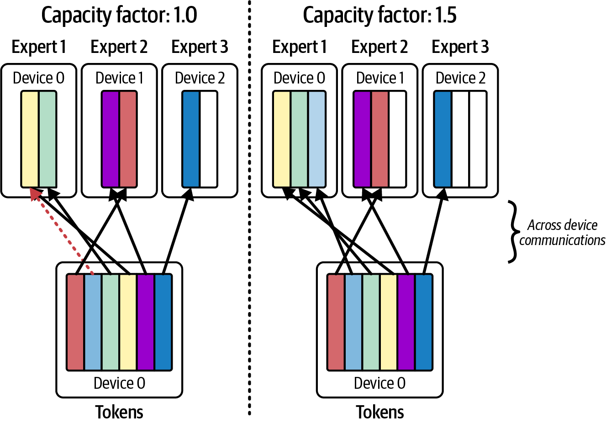

> Figure 15-12. Comparing expert capacity factors of 1.0 versus 1.5

在实践中，容量因子1.2（20%溢出允许）配合top-2门控是常见的。这意味着每个专家最多承担其平均负载的120%。之后，它将多余的token发送给下一个专家。这将有效地平滑系统中专家之间的负载。

避免热点的另一种策略是专家复制。如果一个专家持续成为热点，系统可以将该专家克隆到另一个GPU上。这样，门控函数可以将一部分token发送到在另一个GPU上运行的专家克隆。

副本是推理引擎实现的纯应用级优化。模型本身不知道副本。因为副本注册为具有自己索引的独立专家--通常在不同的GPU上--引擎可以根据它们的相对路由分数在原始专家及其克隆之间路由token。

> 复制专家将增加每个复制专家的内存和成本。但由于只有少数专家倾向于过载，复制少量热专家是一个有针对性的修复--不会通过复制完整模型及其所有专家使成本翻倍。

此外，复制需要仔细处理以在模型更新时保持副本同步。重要的是所有副本专家保持相同（例如，相同的权重），因为门控路由器只知道单个专家，实际上不知道副本。

通常，副本从与原始模型相同的检查点加载--而不是独立更新。这可以防止原始专家与其副本之间的分歧。

> It's recommended that each expert and GPU get an equal share of the work to avoid "hotspots." Otherwise, if the MoE's gating network directs a disproportionate number of tokens to a particular expert, those GPUs will become overloaded. This will increase latency and reduce overall system throughput. Consider a single expert GPU that becomes a hotspot with utilization hitting 99% while the other expert GPUs are averaging around 60% utilization. This can bottleneck an entire training or inference cluster if not properly handled. During model training, hotspots can be addressed by adding a load-balancing loss term that penalizes the gate if it overuses some experts and underuses others. The result is that the trained MoE model tends to distribute tokens fairly evenly across the experts. At inference time, however, specific input prompts or topics might still cause imbalance by concentrating on a subset of "hot" experts. One strategy to avoid inference hot spots is to use a capacity factor that triggers an overflow mechanism. By specifying a capacity factor, the model can be configured such that each expert can process only a maximum number of tokens (e.g., 32 tokens) at a given time. If an expert receives more than this capacity of tokens, the extra tokens can either be forwarded to a fallback expert with the next highest routing score or the tokens will be serialized and processed in a second pass. Figure 15-12 compares a capacity factor of 1.0 versus 1.5. In practice, a capacity factor of 1.2 (20% overflow allowance) with top-2 gating is common. This means that each expert will take up to 120% of its average load. After that, it will send excess tokens to the next expert. This will effectively smooth out the load across experts in the system. Another strategy to avoid hotspots is expert replication. If one expert is consistently a hotspot, the system can clone that expert onto another GPU. This way, the gating function can send some fraction of tokens to the expert clone running on the other GPU. The replicas are a pure application-level optimization implemented by the inference engine. The model itself is not aware of the replicas. Because replicas are registered as separate experts with their own indices-and often on different GPUs-the engine can route tokens across both the original experts and their clones according to their relative routing scores. Replicating experts will increase the memory-and cost-of each replicated expert. But since only a few experts tend to be overloaded, replicating a small number of hot experts is a targeted fix-and won't double the cost by replicating a full model and all of its experts. Also, replication requires careful handling to keep the replicas synchronized if the model is updated. It's important that all replica experts remain identical (e.g., same weights) since the gating router knows about only a single expert and does not actually know about the replicas. Typically, replicas are loaded from the same checkpoint as the original model-and not updated independently. This prevents divergence between the original expert and its replica.

### 自适应专家路由和实时监控 (Adaptive Expert Routing and Real-Time Monitoring)

与训练后固定的传统MoE专家门控不同，自适应路由可以在推理期间实时调整门控的决策，以对当前条件和专家负载做出反应。例如，如果系统检测到一个专家GPU落后，它可以指示门控函数将一些token转移到另一个专家。另一个专家可能具有稍低的路由分数，但它接收请求因为它有可用容量。

您应该实施对每个专家利用率和响应延迟指标的持续监控。现代MoE系统与遥测框架集成，使每个专家向Prometheus/Grafana发送利用率指标。这样，系统可以动态调整容量因子或门控算法。

大多数LLM专家门控函数只考虑在训练时确定的路由分数。然而，真正自适应的系统需要由推理引擎处理并在推理时动态执行。

要实现自适应路由，推理引擎需要将模型的前向传递包装在自定义逻辑中。例如，它可以拦截门控softmax并根据当前负载指标将一些token重新分配给不同的专家。

推理引擎依赖实时指标（如每个GPU的利用率和每个专家的token计数）来持续测量专家负载。如果系统看到一个专家的GPU利用率为99%，而其他专家的GPU为60%，系统可以通过将一些token路由到其专家副本或路由到具有稍低专家偏好分数的不同专家来临时降低其负载。

图15-13显示了使用偏置门控分数方法的自适应MoE路由策略。虽然这种方法最初是在训练环境中使用的，但更简单的方法适用于推理。在这种情况下，它将使用修改的专家偏置算法在主要专家负载过重时将token转移到替代专家。

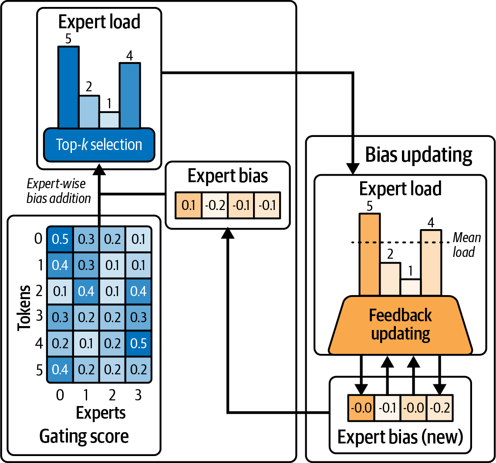

> Figure 15-13. Adaptive MoE routing in action

这种方法可以减少不必要的通信并更均匀地平衡负载。然而，它确实会产生一些额外成本，形式为额外的监控、决策、复杂性、配置管理和日志记录。收益可能超过成本，也可能不超过。每个场景和工作负载都是独特的，但这绝对是值得探索的东西。

当使用Nsight Systems等工具进行分析时，您需要监控专家GPU全对全通信的时间线跟踪。例如，如果一个GPU在时间线中的段要长得多，它可能正在处理更多token。

您的推理系统可以使用这些洞察来调整专家门控概率并动态将专家重新分配给不同的GPU。它还可以生成额外的专家副本实例等。这有助于通过调整专家门控算法、修改专家放置或创建/删除专家副本来重新平衡负载。

> 在推理时动态生成新的专家副本是非平凡的。这种方法需要预配置的容量或为这些专家快速加载模型。这是一种高级优化技术。

以不同方式跨GPU对某些专家进行分组可以导致更均匀的token路由，并由于更好的并行性而提高整体吞吐量。这是因为GPU可以更同步地完成每层的工作。

如果检测到持续不平衡，现代MoE调度器可以通过调整容量因子动态分发额外的专家副本。这可以缓解由不均匀门控引起的热点。

> 记住记录系统所做的任何动态更改。还建议设置警报，当特定专家的利用率超过阈值（如80%利用率）时触发。

动态路由策略针对两个核心目标：减少路由开销和在专家GPU之间均匀分配工作。实现低开销取决于利用高带宽互连、将数据传输与计算重叠，以及通过共置和智能调度最小化冗余数据移动。

负载均衡使用简单的top-1或top-2门控或更高级的容量感知门控来实现。它也可以使用动态复制和专家重新分配来实现。使用这些技术的组合是常见的，以保持GPU忙于最大计算和最小通信延迟。

只要路由开销最小化且负载均衡，自适应MoE推理系统可以实现接近线性的吞吐量扩展，随着您增加专家数量。例如，GPU数量翻倍几乎可以使推理吞吐量翻倍。

简而言之，这些自适应专家路由和负载均衡优化可以与前面介绍的并行性和解码技术集成。这样，您可以为超大规模调整MoE推理系统以实现高性能。持续分析和自适应算法可以让您的GPU忙于计算并避免通信延迟的空闲。

高级推理引擎可以动态绕过某些专家计算、关闭利用率低的专家，或使用缓存为某些token跳过专家。这进一步减少了延迟。这些技术建立在本章描述的概念之上。

> Advanced inference engines can dynamically bypass certain expert computations, turn off underutilized experts, or use caching to skip experts for certain tokens. This further reduces latency. These techniques build on the concepts described in this chapter.

> Unlike traditional MoE expert gating, which is fixed after training, adaptive routing can adjust the gate's decisions in real time during inference to react to current conditions and expert load. For instance, if the system detects that one expert GPU is lagging behind, it could instruct the gating function to divert some tokens to another expert. The other expert might have a slightly lower routing score, but it receives the request because it has available capacity. You should implement continuous monitoring of per-expert utilization and response latency metrics. Modern MoE systems integrate with telemetry frameworks such that each expert emits utilization metrics to Prometheus/Grafana. This way, the system can dynamically adjust the capacity factor or gating algorithm on the fly. Most LLM expert gating functions only consider routing scores determined at training time. However, a truly adaptive system needs to be handled by the inference engine and performed dynamically at inference time. To implement adaptive routing, the inference engine needs to wrap the model's forward pass in custom logic. For example, it can intercept the gating softmax and reallocate some tokens to different experts based on current load metrics. Inference engines rely on real-time metrics like per-GPU utilization and per-expert token counts to continuously measure expert load. If the system sees one expert's GPU at 99% utilization while other experts' GPUs are at 60%, the system could temporarily lower its load by routing some tokens to its expert replica-or to a different expert with a slightly lower expert-preference score. Figure 15-13 shows an adaptive MoE routing strategy that uses a biased gating score approach. While this approach was originally used in a training context, a simpler approach applies to inference. In this case, it would use a modified expert-bias algorithm to divert tokens to alternate experts when the primary experts are heavily loaded. This approach can reduce unnecessary communication and balance the load more uniformly. However, it does incur some additional cost in the form of extra monitoring, decision making, complexity, configuration management, and logging. The benefits may or may not outweigh the cost. Every scenario and workload is unique, but it's definitely something worth exploring. When profiling with tools like Nsight Systems, you want to monitor the timeline traces of the expert GPUs' all-to-all communications. If one GPU's segment in the timeline is much longer, for instance, it is likely processing more tokens. Your inference system can use these insights to adjust the expert gating probabilities and dynamically reassign experts to different GPUs. It can also spawn additional expert replica instances, etc. This helps to rebalance the load by adjusting the expert gating algorithm, modifying expert placement, or creating/removing expert replicas. Dynamically spawning new expert replicas at inference time is nontrivial. This approach requires pre-provisioned capacity or rapid model loading for those experts. This is an advanced optimization technique. Grouping certain experts differently across GPUs can lead to more uniform token routing and increased overall throughput due to better parallelism. This is because the GPUs can finish each layer's work more synchronously. If persistent imbalance is detected, modern MoE schedulers can dispatch additional expert replicas on the fly by adjusting the capacity factor. This can mitigate a hotspot caused by uneven gating. Remember to log any dynamic changes that the system makes. It's also recommended to set up alerts for when a particular expert's utilization goes above a threshold, such as 80% utilization. Dynamic routing strategies target two core objectives: reduce routing overhead and evenly distribute work across expert GPUs. Achieving low overhead depends on utilizing high-bandwidth interconnects, overlapping data transfers with computation, and minimizing redundant data movement with co-location and intelligent scheduling. Load balancing is achieved using simple top-1 or top-2 gating or more advanced capacity-aware gates. It can also be achieved using dynamic replication and expert reassignment. Using a combination of these techniques is common to keep the GPUs busy with maximum computations and minimal communication delays. As long as routing overhead is minimized and the load is balanced, adaptive MoE inference systems can achieve near-linear throughput scaling as you increase the number of experts. For example, doubling GPUs can nearly double your inference throughput. In short, these adaptive export routing and load-balancing optimizations can be integrated with the parallelism and decoding techniques covered earlier. This way, you can tune your MoE inference system for high performance at ultrascale. Continuous profiling and adaptive algorithms can keep your GPUs busy with computations and avoid idling on communication delays. Advanced inference engines can dynamically bypass certain expert computations, turn off underutilized experts, or use caching to skip experts for certain tokens. This further reduces latency. These techniques build on the concepts described in this chapter.

## 关键要点 (Key Takeaways)

为数十亿最终用户提供大规模LLM服务需要在推理流水线的每个阶段进行优化。以下是本章的一些关键要点：

**分离以优化延迟和吞吐量**：将提示预填充和解码阶段拆分到独立的GPU池上可以消除干扰。这使您能够同时实现低首token时间和高每秒token数，而不是在两者之间进行权衡。这是大规模LLM服务的基础技术。

**对大规模模型使用混合并行**：没有单一的并行策略足以应对万亿参数模型。根据需要组合张量、流水线、专家和数据并行。例如，跨GPU分片层（TP/PP）以将模型放入内存，对MoE层使用专家并行以扩展模型容量，并添加数据并行副本以满足吞吐量需求。最佳组合取决于硬件。始终为您的负载分析和调整配置。

**缓解顺序解码瓶颈**：高级解码方法可以大大加速生成。使用快速草稿模型的双模型推测解码在为任务调整接受率时通常提供约2-3倍的加速。EAGLE-2在某些任务上报告高达3.5倍的加速（比EAGLE-1快20%-40%），同时保留目标分布。Medusa实现在为目标负载训练和验证时报告比非推测解码高达3.6倍的加速。这些技术增加了token级并行性和算术强度，同时在标准验证下保留大型模型的输出分布。总体而言，结果是在不重新训练主模型输出的情况下获得更快的响应。这表明推测解码是一种保留质量的技术。

**使用约束维护输出质量和格式**：在生产中，您通常需要LLM遵循严格的格式或避免某些token。约束解码技术让您在生成期间强制执行规则--如JSON模式和禁用词。它们为每个token增加一些开销，但使用编译语法和优化掩码路径，约束解码通常可以在规模上以正常解码的低个位数百分比运行，尽管复杂语法或小批量可能会产生更高的开销。始终测试约束的性能影响。如果可能，避免极其严格的规则。它们可能通过导致过多的回溯来减慢生成。

**平衡MoE工作负载以有效扩展**：混合专家模型提供模型大小与GPU/专家数量几乎线性的扩展--但前提是您高效处理路由。使用高带宽互连和分层全对全通信来减少网络瓶颈。通过应用容量限制和top-2门控来确保每个专家获得类似的工作量，以避免落后者专家。复制任何持续热点的专家以分担其负载。调整良好的MoE推理系统可以在添加GPU时接近线性吞吐量扩展。

**利用硬件-软件协同设计**：现代GPU硬件旨在支持这些并行和分布式推理方法。使用充分利用硬件和拓扑的软件，包括vLLM、SGLang和NVIDIA Dynamo等推理引擎。这些可以以最小的开销编排多GPU和多节点推理。通过将节点内通信保持在NVSwitch上、仅在必要时使用InfiniBand以及将通信与计算重叠，使您的策略与硬件优势保持一致。这种一致性是实现最佳延迟和成本效益的关键。

**理解复杂性与投资回报率（ROI）**：每个优化都会增加系统复杂性。推测解码和自适应MoE路由等技术可以显著提高性能，但它们需要额外的模型或复杂的逻辑。始终权衡成本。对于交互式应用程序，2-3倍的延迟改进通常是值得的。对于更简单的用例，简单的方法可能就足够了。从最大的瓶颈开始，例如消除预填充/解码干扰。然后根据需要逐步增加复杂性。监控和分析以确定哪些优化提供最佳投资回报率。

> Serving massive LLMs to billions of end users requires optimizations at every stage of the inference pipeline. The following are some key takeaways from this chapter: Disaggregate to optimize both latency and throughput. Splitting the prompt prefill and decode stages onto separate GPU pools eliminates interference. This lets you achieve low time-to-first-token and high tokens-per-second simultaneously, instead of trading one for the other. It's a foundational technique for large-scale LLM serving. Use hybrid parallelism for massive models. No single parallelism strategy is sufficient for multi-trillion-parameter models. Combine tensor, pipeline, expert, and data parallelism as needed. For example, shard layers across GPUs (TP/PP) to fit the model in memory, use expert parallelism for MoE layers to scale model capacity, and add data-parallel replicas to meet throughput demands. The optimal mix is hardware-dependent. Always profile and tune your configuration for your workload. Mitigate sequential decoding bottlenecks. Advanced decoding methods can greatly accelerate generation. Two-model speculative decoding with a fast draft model often delivers about a 2-3x speedup when acceptance rates are tuned for the task. EAGLE-2 reports up to 3.5x speedup (20%-40% more than EAGLE-1) on some tasks while preserving the target distribution. Medusa implementations report up to 3.6x speedup over nonspeculative decoding when trained and validated for the target workload. These techniques increase token-level parallelism and arithmetic intensity while preserving the large model's output distribution under standard verification. Overall, the result is faster responses without retraining the main model's output. This shows that speculative decoding is a quality-preserving technique. Maintain output quality and format with constraints. In production, you often need the LLM to follow strict formats or avoid certain tokens. Constrained-decoding techniques let you enforce rules-like JSON schemas and banned words-during generation. They add some overhead per token, but with compiled grammars and optimized mask paths, constrained decoding can often run within a low single-digit percent of normal decoding at scale, though complex grammars or small batches may incur higher overhead. Always test the performance impact of your constraints. Avoid extremely strict rules, if possible. They can slow down generation by causing excessive backtracking. Balance MoE workloads to scale effectively. Mixture-of-experts models offer almost linear scaling of model size versus GPU/expert count-but only if you handle routing efficiently. Use high-bandwidth interconnects and hierarchical all-to-all communication to reduce network bottlenecks. Ensure each expert gets a similar amount of work by applying capacity limits and top-2 gating to avoid straggler experts. Replicate any consistently hot experts to split their load. A well-tuned MoE inference system can approach near-linear throughput scaling as you add GPUs. Leverage hardware-software codesign. Modern GPU hardware is built to support these parallel and distributed inference methods. Use software that takes full advantage of the hardware and topology, including inference engines like vLLM, SGLang, and NVIDIA Dynamo. These can orchestrate multi-GPU and multinode inference with minimal overhead. Align your strategy with your hardware's strengths by keeping intranode communication on NVSwitch, using InfiniBand only when necessary, and overlapping communications with computations. This alignment is key to achieving the best latency and cost-efficiency. Understand complexity versus return on investment (ROI). Each optimization adds system complexity. Techniques like speculative decoding and adaptive MoE routing can significantly improve performance, but they require extra models or intricate logic. Always weigh the cost. For interactive applications, a 2-3x latency improvement is usually worth it. For simpler use cases, a straightforward approach might suffice. Start with the biggest bottlenecks, such as eliminating prefill/decode interference. Then incrementally add complexity if needed. Monitor and profile to determine which optimizations give the best return on investment.

## 结论 (Conclusion)

通过将分离式预填充/解码流水线、多token推测解码、动态专家路由和自适应编排结合在一起，可以以最小的资源争用和超低延迟实时服务LLM。

vLLM、SGLang和NVIDIA Dynamo等现代推理服务平台采用了许多这些优化。它们高效分配集群资源、跨节点协调KV缓存、实现推测和约束解码、调度预填充/解码任务等。

关键是端到端、可适应的架构，将算法创新与高性能硬件能力相匹配。在接下来的几章中，我们将更深入地探讨模型推理性能优化，包括动态、自适应和多节点服务策略。

我们将涵盖从应用级前缀缓存、延迟感知请求路由和基于强化学习（RL）的集群调优到系统级自适应内存分配、精度切换和拥塞感知资源调度的一切。

> By bringing together disaggregated prefill/decode pipelines, multitoken speculative decoding, dynamic expert routing, and adaptive orchestration, it's possible to serve LLMs in real time with minimal resource contention and ultra-low latency. Modern inference-serving platforms like vLLM, SGLang, and NVIDIA Dynamo embrace many of these optimizations. They efficiently allocate cluster resources, coordinate the KV cache across nodes, implement speculative and constrained decoding, schedule prefill/decode tasks, and much more. The key is an end-to-end, adaptable architecture that matches algorithmic innovations with high-performance hardware capabilities. Over the next few chapters, we'll dive deeper into model inference performance optimizations, including dynamic, adaptive, and multinode serving strategies. We'll cover everything from application-level prefix caching, latency-aware request routing, and reinforcement-learning (RL)-based cluster tuning to systems-level adaptive memory allocation, precision switching, and congestion-aware resource scheduling.
