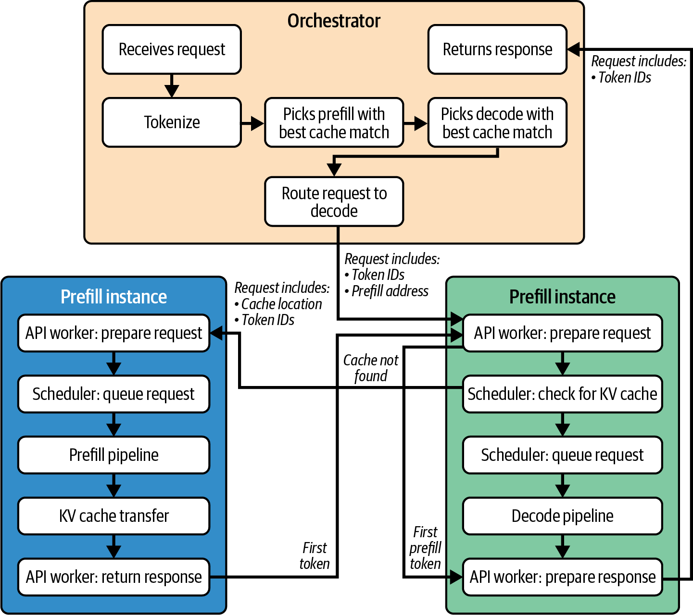
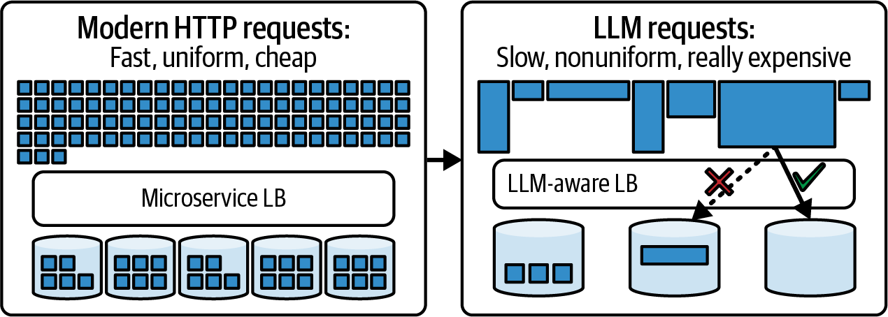
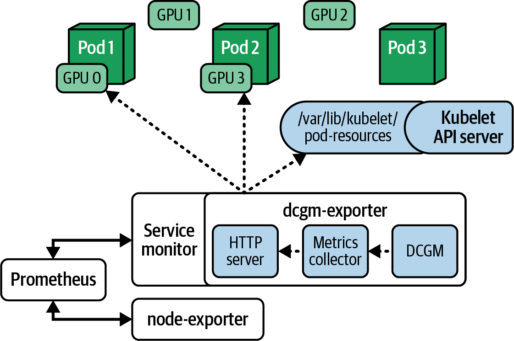
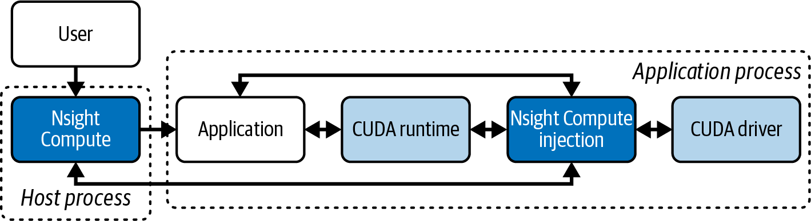
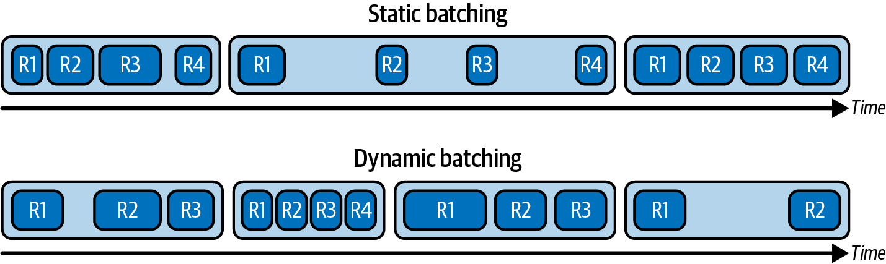
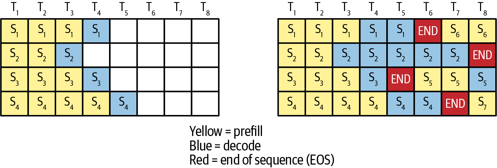
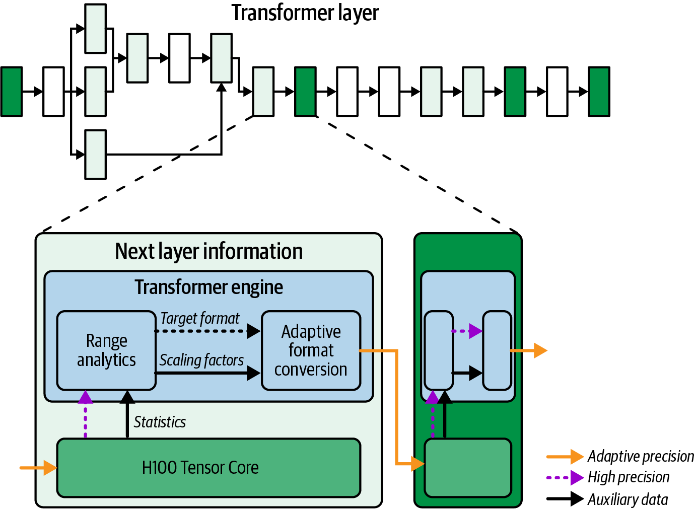
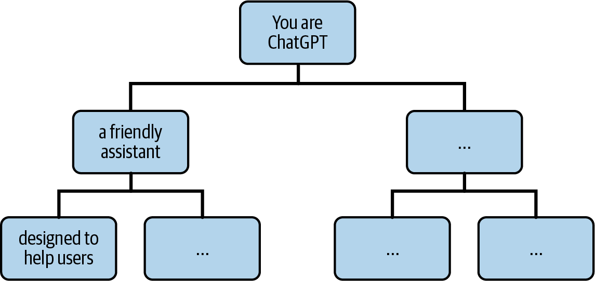
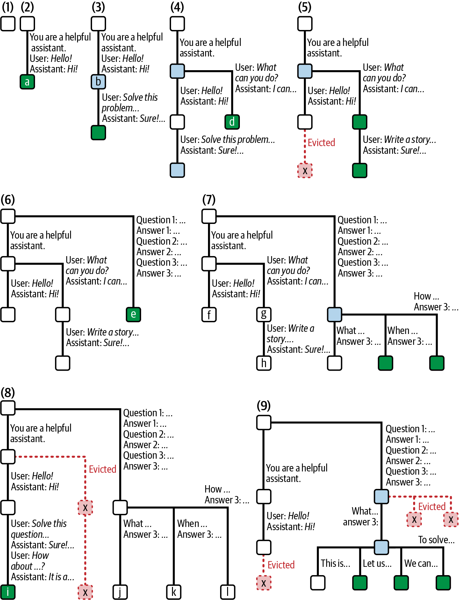
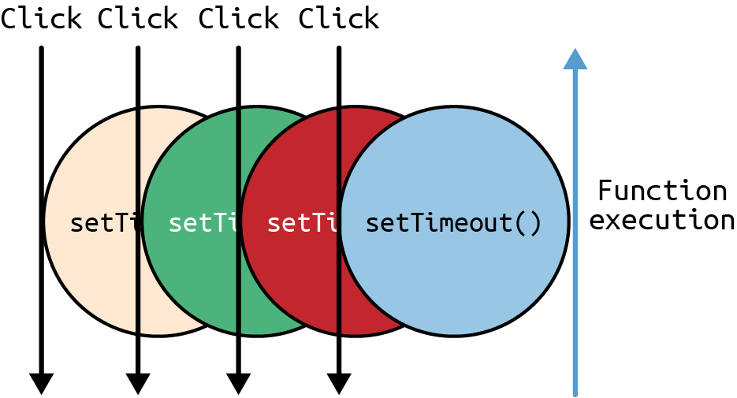

# 第16章 大规模推理的性能分析、调试和调优 (Profiling, Debugging, and Tuning Inference at Scale)

运营大型LLM推理集群需要监控和调试工具，以确保一切按预期运行。它们还可以帮助您在性能偏离目标时快速识别瓶颈。

在本章中，我们将演示如何使用NVIDIA Nsight Systems进行性能分析以及Prometheus/Grafana进行集群范围的遥测来监控和调试这些复杂系统。我们还将展示如何收集和解释关键指标，如GPU利用率、内存压力、尾延迟百分位数、缓存命中率、每token计时等。这些有助于指导我们的推理引擎性能优化。

接下来，我们将讨论运营性能调优，包括在生产中验证的方法，以优化GPU利用率、减少推理延迟并提高大型集群的吞吐量。这包括重叠计算和通信、调度和批处理请求，以及有效使用高速互连（如NVLink、NVSwitch和InfiniBand）的技术。

我们还将比较推理的实时量化技术，包括使用广义训练后量化（GPTQ）和激活感知权重量化（AWQ）等实现将模型压缩到8位和4位精度的方法。在此过程中，我们将讨论仅权重量化与同时量化权重和激活之间的权衡。我们提供在服务流水线中应用量化的实用指导，以减少内存使用并增加吞吐量——同时保持模型准确性。

最后，我们考虑补充低级性能调优的应用级优化。这些包括提示压缩、前缀缓存、去重、查询路由（例如，回退模型）和部分输出流式传输等策略。

> Operating a large LLM inference cluster requires monitoring and debugging tools that make sure everything is running as expected. They also help you quickly identify bottlenecks when performance strays from its target. In this chapter, we demonstrate how to monitor and debug these complex systems using tools such as NVIDIA Nsight Systems for profiling and Prometheus/Grafana for cluster-wide telemetry. We also show how to collect and interpret key metrics like GPU utilization, memory pressure, tail latency percentiles, cache hit rates, per-token timing, and more. These help guide our inference engine performance optimizations. Next, we discuss operational performance tuning, including production-proven methods to optimize GPU utilization, reduce inference latency, and increase throughput in large clusters. This includes techniques for overlapping computation and communication, scheduling and batching requests, and using high-speed interconnects like NVLink, NVSwitch, and InfiniBand effectively. We'll also compare techniques for real-time quantization for inference, including methods to compress models to 8-bit and 4-bit precision using implementations like Generalized Post-Training Quantization (GPTQ) and Activation-Aware Weight Quantization (AWQ). Along the way, we'll discuss the trade-offs between weight-only quantization versus quantizing both weights and activations. We provide practical guidance on applying quantization in serving pipelines to reduce memory usage and increase throughput—all while preserving model accuracy. Finally, we consider application-level optimizations that complement low-level performance tuning. These include strategies like prompt compression, prefix caching, deduplication, query routing (e.g., fallback models), and partial-output streaming.

## 性能分析、调试和调优推理性能 (Profiling, Debugging, and Tuning Inference Performance)

现代LLM推理引擎中有很多活动部件——特别是采用分离式预填充和解码架构时。典型请求的生命周期涉及许多组件，如图16-1所示。



> Figure 16-1. Lifecycle of a typical request in a disaggregated prefill and decode LLM inference system

鉴于这种复杂性，调优推理性能的工作流程是非常迭代的。它需要仔细的调优和持续的验证。

首先，您应该观察指标并识别当前的瓶颈，包括GPU未充分利用或延迟高于预期。接下来，形成改进假设，例如"增加批次大小"或"增加操作X的通信-计算重叠"。然后，实施修复并测试假设。

然后，您应该理想地在具有代表性工作负载的预发布环境中使用性能分析工具测试修复，以验证更改是否按预期运行。例如，您可以验证某个操作是否展示了正确的内存和计算重叠。

最后，您应该将修复部署到生产环境，并监控Grafana和日志，以验证修复在实际工作负载上是否提高了吞吐量和延迟。随着新瓶颈的出现，重复此工作流程。

这种观察-假设-调优循环应该是持续的。现代部署通常会自动化这些步骤。例如，您可以使用计划的负载测试——以及随后的关键指标异常检测——来触发调优工作流程。

> 在将优化部署到生产环境时，建议执行金丝雀发布，包括更新的推理运行时和模型变体。通过将优化部署到在少量服务器上运行的一小部分流量，您可以在全面部署到所有最终用户之前验证优化。这种增量方法有助于通过及早发现意外副作用来减少"影响范围"，而不会影响所有用户。

考虑一个场景，主机端CPU利用率由于过度的分词或推理数据预处理而飙升至100%。这将限制推理引擎可以处理的并发流数量。一种修复方法可能是使用GPU加速的分词器库或用CUDA或OpenAI的Triton语言编写的自定义GPU内核将预处理移至GPU。

部署新库或内核后，您应该监控之前和之后的CPU利用率。如果您看到CPU利用率下降，整体吞吐量增加，那么系统不再受基于CPU的输入预处理的瓶颈限制。

您还应该注意任何类型缓存的缓存命中率，包括前缀缓存、提示嵌入缓存和KV缓存。您应该有"缓存命中"与"缓存未命中"的指标。高缓存命中率意味着系统正在有效地重用数据。相反，如果您看到高缓存未命中率，那么您可能需要调整缓存大小、驱逐策略或缓存策略以最大化缓存命中。

vLLM的LMCache组件允许调整GPU与CPU缓存比率。如果由于GPU内存限制导致未命中率很高，您可以启用其分页缓存卸载功能，以便CPU可以提供帮助。始终确保您的缓存驱逐策略（最近最少使用[LRU]、最不经常使用[LFU]等）与访问模式一致。

另一种场景是使用KV缓存在批处理请求中重用相同输入序列前缀的数据，以避免重新计算前缀的KV。在这种情况下，您需要衡量请求共享前缀的频率。这会导致前缀合并事件，并增加vLLM中的前缀缓存命中指标，包括`vllm:gpu_prefix_cache_queries`和`vllm:gpu_prefix_cache_hits`。这些让您可以计算命中率，例如命中数除以查询数。

衡量前缀合并率有助于您与实际缓存命中率相关联，以评估缓存层的实际收益。这样，您可以调整批处理和调度策略以最大化共享前缀——并预测不同工作负载下的端到端吞吐量和延迟改进。

您可以在推理引擎上运行合成生成的数据来测试具有许多重复前缀的提示。希望您会看到由于前缀合并而减少的预填充计算。

> 现代LLM推理引擎如vLLM和SGLang原生暴露前缀合并指标。但是，如果您的前缀合并不是推理引擎导出的一等指标，您应该为"前缀去重token"设置自定义计数器来监控其有效性。

> 如果您发现前缀合并没有按预期执行，您应该检查前缀匹配逻辑是否失败。通过检查是否存在分词器差异来开始调试过程。这是大多数前缀匹配问题的可能原因。

除了性能之外，监控还有助于容量规划。通过跟踪利用率和延迟随负载增加的变化，您可以预测系统将在何时达到特定限制，例如p95（第95百分位）延迟开始呈指数上升。在这种情况下，动态批次大小可能正在增加到收益递减的点。

> 如果您使用分层缓存策略，包括基于NVMe的KV缓存扩展，请确保监控设备的I/O延迟。高I/O延迟将显著降低缓存性能。

当每个GPU的并发达到其限制，进一步增加批次大小不再增加吞吐量时，您可能需要通过添加更多GPU、部署额外的模型副本或增加专家数量来横向扩展，以便在更多计算单元之间分配工作。

您还应该考虑模型压缩——或切换到较低精度（FP8/FP4）——以便在横向扩展之前获得每个GPU的更多有效吞吐量。但是，一旦硬件饱和（例如，SM达到100%，内存带宽接近峰值利用率），添加更多GPU或使用张量/流水线并行可能是提高吞吐量的唯一途径。

请记住，始终权衡新硬件的成本与效率收益。有时升级到具有更多内存和FLOPS的新GPU比扩展旧GPU机群更具成本效益。

增加专家数量可以提高您的吞吐量上限——但前提是您还改进专家路由和调度以管理额外的全对全通信。否则，简单的扩展可能只是将瓶颈转移到网络上。

接下来，让我们讨论监控以及如何验证我们的优化努力确实产生了效果。

> Given such complexity, the workflow for tuning inference performance is very iterative. It requires careful tuning and continuous verification. First, you should observe metrics and identify the current bottleneck, including a GPU not fully utilized or higher-than-expected latency. Next, form a hypothesis for improvement, such as "increase the batch size" or "increase communication-computation overlap for operation X." Then, implement a fix and test the hypothesis. Then, you should ideally test the fix in a staging environment with a representative workload using profiling tools to validate that the change behaves as expected. For instance, you can verify that an operation is demonstrating proper memory and compute overlap. Last, you should deploy the fix into production and monitor Grafana and the logs to validate that the fix improved throughput and latency on a real workload. Repeat this workflow as new bottlenecks appear. This observe-hypothesize-tune loop should be continuous. Modern deployments often automate these steps. For instance, you can use scheduled load tests—and subsequent anomaly detection on key metrics—to trigger a tuning workflow. It's recommended to perform canary rollouts when deploying optimizations to production, including updated inference runtimes and model variants. By deploying the optimization to a small subset of traffic running on a small number of servers, you can validate the optimizations before full production deployment to all end users. This incremental approach helps reduce the "blast radius" of unexpected side effects by catching them early without impacting all users. Consider a scenario in which host-side CPU utilization is spiking to 100% due to excessive tokenization or inference data preprocessing. This will limit how many concurrent streams the inference engine can handle. One fix might be to move the preprocessing to the GPU using a GPU-accelerated tokenizer library or a custom GPU kernel written in CUDA or OpenAI's Triton language. After deploying the new library or kernel, you should monitor CPU utilization before and after. If you see the CPU utilization decrease and overall throughput increase, then the system is no longer bottlenecked by the CPU-based input preprocessing. You should also pay attention to cache hit rates for any type of cache, including prefix cache, prompt-embedding cache, and KV cache. You should have metrics for "cache hits" versus "cache misses." A high cache-hit rate means that the system is reusing data effectively. In contrast, if you see a high cache-miss rate, then you likely want to tune the cache size, eviction policy, or caching strategy to maximize cache hits. vLLM's LMCache component allows adjusting the GPU versus CPU cache ratio. If misses are high due to GPU memory limits, you can enable its paged cache offload capability so that the CPU can help out. Always make sure your cache eviction policy (Least Recently Used [LRU], Least Frequently Used [LFU], etc.) aligns with the access patterns. Another scenario is using a KV cache to reuse data for identical input-sequence prefixes among batched requests to avoid recomputing the KV for the prefix. In this case, you want to measure how often requests share a prefix. This leads to a prefix merge event and increments the prefix cache hit metrics in vLLM including vllm:gpu_prefix_cache_queries and vllm:gpu_prefix_cache_hits. These let you compute the hit rate as hits per queries, for example. Measuring prefix-merge rates helps you correlate with actual cache‐hit rates to gauge the real benefit of your caching layer. This way, you can adjust batching and scheduling policies to maximize shared prefixes—and predict end‐to‐end throughput and latency improvements under different workloads. You can run synthetically generated data on the inference engine to test prompts with many repeated prefixes. Hopefully, you will see a reduction in prefill compute due to the prefix merging. Modern LLM inference engines like vLLM and SGLang expose prefix-merge metrics natively. But if prefix-merging is not a first-class metric exported by your inference engine, you should instrument a custom counter for "prefix deduplicated tokens" to monitor its effectiveness. If you see that prefix merging is not performing as expected, you should check if the prefix-matching logic is failing. Start the debugging process by checking if there are tokenizer differences. This is the likely cause of most prefix-matching issues. In addition to performance, monitoring helps with capacity planning. By tracking how utilization and latency behave as load increases, you can project at what point the system will hit a particular limit, such as p95 (95th percentile) latency starting to rise exponentially. In this case, the dynamic batch size might be increasing to a point of diminishing return. If you are using a tiered caching strategy, including an NVMe-based KV cache extension, make sure to monitor the I/O latency of the device. High I/O latency will significantly decrease cache performance. When per-GPU concurrency reaches its limit and further batch-size increases no longer increase throughput, you may want to scale out by adding more GPUs, deploying additional model replicas, or increasing the number of experts to distribute work across more compute units. You should also consider model compression—or switching to lower precision (FP8/FP4)—to get more effective throughput per GPU before scaling out. However, once hardware is saturated (e.g., SMs at 100% and memory bandwidth near peak utilization), adding more GPUs or using tensor/pipeline parallelism is likely the only path to higher throughput. And remember to always weigh the cost of new hardware against the efficiency gains. There are times when upgrading to newer GPUs with more memory and FLOPS will be more cost-effective than scaling out a fleet of older GPUs. Increasing the expert count can raise your throughput ceiling—but only if you also improve expert routing and scheduling to manage the extra all-to-all communication. Otherwise, naive scaling may simply shift the bottleneck to the network. Next, let's discuss monitoring and how to verify that our optimization efforts are actually paying off.

## 监控系统指标和计数器 (Monitoring System Metrics and Counters)

与执行时间相对均匀和可预测的传统微服务调用不同，LLM请求在延迟方面是不均匀的，可能会有很大差异。这种差异如图16-2所示。



> Figure 16-2. Difference between traditional microservice invocations and LLM invocations

对于生产中的持续监控，通常使用Prometheus从每个GPU计算节点收集指标——以及Grafana仪表板来可视化它们。需要跟踪的关键GPU指标包括GPU利用率（SM忙碌的时间百分比）、GPU内存使用量、拷贝引擎利用率、PCIe和NVLink吞吐量，以及GPU温度和功率（例如，节流）。注意：L1和L2活动、占用率和指令吞吐量等低级计数器可以使用Nsight Compute或CUPTI收集，而不是DCGM和Prometheus。

> cudaMemPool指标和异步分配器统计信息在监控内存碎片时很有帮助。这些应该集成到您的监控中，因为这将大大有助于调试生产中的系统性能问题。

监控互连利用率也很重要，包括NVLink、NVSwitch带宽和NIC吞吐量。这样，您将捕获多GPU和多节点集群配置中的通信瓶颈。

NVIDIA的数据中心GPU管理器（DCGM）暴露了许多GPU指标，Prometheus可以抓取和收集这些指标。例如，DCGM提供`DCGM_FI_DEV_GPU_UTIL`用于SM利用率%，`DCGM_FI_DEV_MEM_COPY_UTIL`用于内存拷贝引擎利用率，`DCGM_FI_DEV_FB_USED`用于帧缓冲区内存使用量等。

DCGM暴露NVLink错误计数器，并且可以在某些平台和驱动程序版本上暴露吞吐量计数器。对于持续的链路利用率，也可以使用`nvidia-smi nvlink`和Nsight工具。您应该将这些指标集成到仪表板中，并设置警报以帮助识别网络何时因跨GPU和跨节点通信流量而饱和。

DCGM跟踪Xid计数器以及关键GPU错误。

> 虽然DCGM暴露NVLink计数器，但在撰写本文时，dcgm-exporter默认不在所有平台上暴露每链路带宽。因此，如果您需要链路级吞吐量，可能需要直接查询DCGM或扩展导出器。

还建议收集高级应用指标，如每秒查询/请求数、平均延迟和p95/p99延迟、活跃上下文数量以及以tokens/秒为单位的吞吐量。KV缓存利用率和大小（整体和每个节点）的指标也非常重要。

您可以设置Prometheus节点导出器从每个节点收集所有这些指标，将数据收集在一个地方，甚至为关键阈值设置警报。然后，Grafana可以绘制这些指标以进行实时仪表板，与您的团队共享。图16-3显示了如何从Kubernetes集群中的每个GPU收集指标并导出到Prometheus以便用Grafana可视化，例如。



> Figure 16-3. DCGM collects metrics from the Kubernetes GPU nodes and sends them to Prometheus

这样，当您部署新的优化以增加批处理时，例如，Grafana将立即显示每个GPU上的GPU利用率是否增加。您还可以监控以确保p95/p99延迟保持在目标范围内。

计数器对于衡量也非常有用——特别是对于动态和自适应系统。例如，如果您的推理引擎根据当前条件动态调整批次大小，您可能需要增加"批次大小更改"计数器。

另一个选择是将更改记录在日志文件中，但这需要缓慢的基于文本的搜索/聚合来离线分析日志文件，例如使用Apache Spark。然后，您需要手动将日志文件分析的结果与Prometheus指标相关联。

通过为有趣的应用级事件（包括错误）增加一个简单的计数器，数据被推送到Prometheus，并可以在Grafana仪表板中实时与所有其他指标一起查看。此外，考虑对关键事件使用结构化日志记录和分布式追踪。

现代应用性能管理（APM）工具以及OpenTelemetry可以摄取这些日志/追踪并将它们与指标相关联。这提供了整个系统事件的一致时间线视图。深入了解此时间线将有助于加快调试性能问题所需的时间。

如果您持续监控这些指标，您将深入了解下一步应该在哪里进行调优。例如，如果GPU利用率低于预期，您可以检查GPU内存是否已满。如果未充分利用，您可以尝试增加批次大小或最大并发请求数。但是，请确保关注延迟服务级别目标（SLO），您不希望超过这些目标。

> 现代推理服务器为动态批处理暴露"最大延迟"设置。调整此设置以满足您的SLO。增加它会提高批次大小（吞吐量）。增加太多会损害p99延迟。根据您的延迟目标持续调整此设置。

相反，如果GPU内存接近最大值，推理引擎可能会开始将不活跃的KV缓存数据换出到主机CPU内存或NVMe存储。这将降低GPU利用率，因为GPU需要等待来自慢速CPU内存或磁盘的额外数据传输。

> 如果您看到GPU内存拷贝引擎利用率飙升——或与低SM利用率一致的异常NVLink利用率——您的推理引擎可能正在将KV缓存数据换入和换出GPU内存。由于过度的数据传输延迟，这将成为您系统的瓶颈。

如果您正在交换，您可以调整推理引擎的分页参数以减少颠簸，应用FP8或FP4量化，增加缓存的GPU内存分配，并可能更改交换策略。这应该会降低拷贝利用率并提高计算利用率——这正是您想要看到的。

Grafana也用于延迟跟踪。您可以绘制端到端请求延迟的分布——通常还测量预填充延迟和每token延迟。如果p99延迟在某些时间飙升，您应该将其与GPU指标和其他日志相关联。

例如，p99延迟峰值可能与GPU利用率下降的时期相关。也许延迟峰值与触发更大动态批次大小的流量激增相关。这可能导致该时期的延迟更高。要验证，您可以在Grafana仪表板中将RPS（每秒请求数）叠加在延迟图表上，看看两个图表是否相关。

如果峰值是由于根据我们的假设动态增加批次大小而预期的，请确保它没有超过您的服务级别协议（SLA）。如果是，您可以尝试减少最大请求批次队列延迟或减少最大批次大小以限制延迟。

日志在诊断问题时也非常有价值。您应该检测代码以记录关键事件，例如批次何时形成、通信何时开始/结束等。最好使用DEBUG级别，以便您可以根据需要启用/禁用它——并且不影响请求-响应延迟。

当您启用调试日志时，您将以文本格式看到逐步的时间线。在一个调试会话中，您可能会同时使用日志时间线和Prometheus/Grafana指标。例如，您可以看到全对全通信超过5毫秒的频率。

通过日志时间线和指标的组合，您可以看到异常值，例如可能减慢全对全通信交换中一次迭代的网络问题。如果这种情况持续发生，您可以提高专家容量因子，以便任何多余的token自动溢出到次要专家副本——理想情况下托管在具有更稳定网络路径的GPU上。这将平衡负载并最小化延迟。

> 在实践中，将容量因子设置为1.2–1.5是常见的，因为这允许20%–50%的多余token在主要专家过载时重新分配。这可以显著平滑MoE推理中的尾延迟。溢出到第二个专家比在具有退化互连的GPU上稍微停滞的专家后面排队请求要好。如果您的网络因某种原因继续出现问题，这将减少对异常值的敏感性。

> Unlike traditional microservice invocations, which are relatively uniform and predictable in their execution time, LLM requests are nonuniform and can vary wildly in terms of latency. This difference is shown in Figure 16-2. For ongoing monitoring in production, it's common to use Prometheus to collect metrics from each GPU compute node—as well as Grafana dashboards to visualize them. Key GPU metrics to track include GPU utilization (percent of time the SMs are busy), GPU memory usage, copy engine utilization, PCIe and NVLink throughput, and GPU temperature and power (e.g., throttling). Note: Low-level counters such as L1 and L2 activity, occupancy, and instruction throughput can be collected with Nsight Compute or CUPTI rather than DCGM and Prometheus. The cudaMemPool metrics and asynchronous allocator statistics are helpful when monitoring memory fragmentation. These should be integrated into your monitoring, as this will greatly facilitate debugging system performance issues in production. It's also important to monitor interconnect utilization, including NVLink, NVSwitch bandwidth, and NIC throughput. This way, you will catch communication bottlenecks in multi-GPU and multinode cluster configurations. NVIDIA's Data Center GPU Manager (DCGM) exposes many GPU metrics, which Prometheus can scrape and collect. For instance, DCGM provides DCGM_FI_DEV_GPU_UTIL for SM utilization %, DCGM_FI_DEV_MEM_COPY_UTIL for memory copy engine utilization, and DCGM_FI_DEV_FB_USED for framebuffer memory used, among others. DCGM exposes NVLink error counters and can expose throughput counters on some platforms and driver versions. For sustained link utilization, also use nvidia-smi nvlink and Nsight tools. You should integrate these metrics into your dashboards and set up alerts to help identify when the network is saturated with cross-GPU and cross-node communication traffic. DCGM tracks Xid counters, as well as critical GPU errors. While DCGM exposes NVLink counters, as of this writing, dcgm-exporter does not expose per-link bandwidth on all platforms by default. So if you need link-level throughput, you may need to query DCGM directly or extend the exporter. It's also recommended to collect high-level application metrics like queries/requests per second, average latency and p95/p99 latency, number of active contexts, and throughput in tokens/sec. Metrics on KV cache utilization and size (overall and per node) are extremely important to monitor as well. You can set up Prometheus node exporters to gather all of these metrics from each node, collect the data in one place, and even set up alerts for critical thresholds. Grafana can then plot these metrics for real-time dashboards to share with your team. Figure 16-3 shows how the metrics are collected from each GPU in a Kubernetes cluster and exported to Prometheus to be visualized with Grafana, for example. This way, when you deploy a new optimization to increase batching, for instance, Grafana will immediately show if GPU utilization on each GPU increases. You can also monitor to make sure p95/p99 latencies stay within the target. Counters are extremely useful to measure as well—especially with dynamic and adaptive systems. For instance, if your inference engine dynamically adapts the batch size to current conditions, you may want to increment a "batch size change" counter. The other option is to log the change in a logfile, but this would require a slow, text-based search/aggregation to analyze the logfile offline using Apache Spark, for instance. You would then need to manually correlate the result of the logfile analysis with the Prometheus metrics. By incrementing a simple counter for interesting application-level events (including errors), the data is pushed to Prometheus and instantly viewable in the Grafana dashboard alongside all of the other metrics in real time. In addition, consider using structured logging and distributed tracing for critical events. Modern application performance management (APM) tools—as well as OpenTelemetry—can ingest these logs/traces and correlate them with metrics. This provides a consistent timeline view of events across the entire system. Having insight into this timeline will help speed up the time it takes to debug performance issues. If you continuously monitor these metrics, you gain insight into where to tune next. For instance, if GPU utilization is below expected, you can check if GPU memory is maxed out or not. If it's not fully utilized, you can try to increase the batch size or maximum number of concurrent requests. Make sure to keep an eye on latency service-level objectives (SLOs), however. You don't want to exceed these. Modern inference servers expose a "maximum latency" setting for dynamic batching. Tune this to meet your SLOs. Increasing it raises the batch size (throughput). Increasing it too much will hurt p99 latency. Continuously adjust this in light of your latency targets. In contrast, if GPU memory is near maximum, the inference engine might start swapping out inactive KV cache data to host CPU memory or NVMe storage. This will reduce GPU utilization, as the GPUs need to wait for the additional data transfers from slow CPU memory or disk. If you see a spike in GPU memory copy-engine utilization—or abnormal NVLink utilization that aligns with low SM utilization—your inference engine is likely swapping KV cache data in and out of GPU memory. This will bottleneck your system due to excessive data transfer latency. If you are swapping, you can adjust the inference engines' paging parameters to reduce thrashing, apply FP8 or FP4 quantization, increase GPU memory allocation for cache, and potentially change the swapping strategy. This should bring copy utilization down and compute utilization up—exactly what you want to see. Grafana is also used for latency tracking. You can plot the distribution of end-to-end request latency—often measuring both prefill latency and per-token latency as well. If the p99 latency spikes at certain times, you should correlate it with GPU metrics and other logs. For instance, a p99 latency spike might correlate with a period when GPU utilization drops. Perhaps the latency spike correlates with a traffic surge that triggered a larger dynamic batch size. This could lead to higher latency for that period of time. To verify, you can overlay RPS (requests per second) on the latency graph in the Grafana dashboard to see if the two charts correlate. If the spike was expected due to a dynamic increase in batch size per our hypothesis, make sure it isn't exceeding your service-level agreement (SLA). If it is, you can try decreasing the maximum request-batch queue delay or reducing the maximum batch size to put a limit on the latency. Logs are invaluable when diagnosing issues as well. You should instrument the code to log key events such as when a batch is formed, when a communication starts/ends, etc. It's best to use the DEBUG level so that you can enable/disable it as needed—and not impact request-response latency. When you enable debug logging, you'll see a step-by-step timeline in text format. In one debugging session, it's likely that you'll use both the logging timeline and Prometheus/Grafana metrics together. For instance, you can see how often an all-to-all communication takes longer than 5 ms. With the combination of log-based timeline and metrics, you can see outliers such as network issues that may have slowed down one iteration in the all-to-all communication exchange. If this continues to happen, you can raise the expert capacity factor so that any excess tokens automatically spill over to a secondary expert replica—ideally hosted on a GPU with a more stable network path. This will balance the load and minimize the latency. In practice, setting the capacity factor to 1.2–1.5 is common, as this allows 20%–50% extra tokens to be reassigned when a primary expert is overloaded. This can significantly smooth out tail latency in MoE inference. Spilling over to a second expert is better than queuing requests behind a slightly stalled expert on a GPU with a degraded interconnect. This will reduce sensitivity to outliers if your network continues to experience issues for whatever reason.

## 使用Nsight Systems和Nsight Compute进行性能分析 (Profiling with Nsight Systems and Nsight Compute)

在开发和调优推理代码时，您可以使用Nsight Systems捕获CPU和GPU上的工作负载跟踪。Nsight Systems提供时间线视图，使用微秒分辨率显示CPU线程、GPU内核、CUDA事件、NCCL通信等。

通过使用NVTX注释检测代码，我们可以在时间线上标记"预填充阶段"、"解码步骤"或"全对全通信"等区域以获得清晰度。以下代码展示了使用NVTX v3 C API和显式push和pop范围的示例预填充和解码步骤周围的NVTX范围标记：

```cpp
// 使用C API的NVTX注释的示例C++代码片段。

#include <nvtx3/nvToolsExt.h>   // 或 <nvToolsExt.h>
#include "my_model.hpp"         // 您的模型的C++接口
#include <vector>

// 保持调用点整洁的小辅助函数。
#define NVTX_PUSH(name, argb)                                      \
  do {                                                             \
    nvtxEventAttributes_t a{};                                     \
    a.version = NVTX_VERSION;                                      \
    a.size = NVTX_EVENT_ATTRIB_STRUCT_SIZE;                        \
    a.colorType = NVTX_COLOR_ARGB;                                 \
    a.color = (unsigned int)(argb);                                \
    a.messageType = NVTX_MESSAGE_TYPE_ASCII;                       \
    a.message.ascii = (name);                                      \
    nvtxRangePushEx(&a);                                           \
  } while (0)

#define NVTX_POP() do { nvtxRangePop(); } while (0)

struct Token { int id; };

void run_inference(
    const std::vector<Token>& prompt_tokens,
    Model& model,
    int num_generate_steps) {
  // 预填充
  NVTX_PUSH("Prefill", 0xFF4F86F7);
  model.encode(prompt_tokens);
  NVTX_POP();

  // 一次解码一个token
  for (int t = 0; t < num_generate_steps; ++t) {
    NVTX_PUSH("Decode", 0xFFFF8C00);
    Token next_token = model.decode_next();
    // ... (采样 / 流式传输到客户端)
    NVTX_POP();
  }
}
```

在这里，我们使用`nvtxRangePushEx`/`nvtxRangePop`显式标记区域。我们在`model.encode(...)`之前立即push一个"Prefill"范围，并在其后立即pop它。在解码循环内部，我们在每次迭代的顶部push"Decode"并在`model.decode_next()`之后pop它。小的`NVTX_PUSH`/`NVTX_POP`辅助函数还附加颜色（十六进制值）和文本。这有助于减少时间线可视化中的不匹配——同时保持调用点简洁。显式的push/pop配对在代码中清晰可见，这使得它们易于审计。

彩色块注释将出现在Nsight Systems GPU活动时间线中，标记为"Prefill"和"Decode"。这使得很容易看到每个阶段需要多长时间——以及这些阶段如何与通信操作重叠。这有助于识别GPU空闲间隙和意外同步等问题。

> 请注意，我们直接使用NVTX C API（nvToolsExt），而不是PyTorch的record_function()。这让我们可以在纯C++运行时中注释热路径，并在从Python或其他语言启动工作时保持标记一致。

通过将范围收紧到`model.encode(prompt_tokens)`周围所需的最小区域，性能分析标记恰好覆盖预填充工作而没有其他代码。这提高了跟踪清晰度和性能诊断。

当在多个CUDA流上排队工作时，您应该使用每流范围（例如，用于H2D/D2H拷贝的专用"transfer"流和用于内核的"compute"流）。为此，您可以使用不同的NVTX范围包装每个流的主机代码。

例如，您可以使用`nvtxNameCudaStreamA(transfer_stream, "transfer_stream")`和`nvtxNameCudaStreamA(compute_stream, "compute_stream")`命名流。然后，您将在内存拷贝/传输周围使用`nvtxRangePushA("transfer_stream")`和`nvtxRangePop()`，在内核启动周围使用`nvtxRangePushA("compute_stream")`和`nvtxRangePop()`。

使用NVTX命名的流使得Nsight Systems时间线中的重叠（或缺乏重叠）变得明显。以下是一些代码，展示了它们如何组合在一起：

```cpp
// 创建流后一次性执行
nvtxNameCudaStreamA(transfer_stream, "transfer_stream");
nvtxNameCudaStreamA(compute_stream,  "compute_stream");

// 在H2D/D2H拷贝周围（传输流）
nvtxRangePushA("transfer_stream");
cudaMemcpyAsync(h_logits, d_logits, bytes, 
                cudaMemcpyDeviceToHost, 
                transfer_stream);
nvtxRangePop();

// 在内核排队周围（计算流）
nvtxRangePushA("compute_stream");
my_kernel<<<grid, block, 0, compute_stream>>>(...);
nvtxRangePop();
```

在这里，我们命名流并在排队站点包装每流范围，以便Nsight时间线保持可读性。需要注意的是，NVTX范围注释主机线程时间线。GPU通道按流显示内核/memcpy。命名流有助于在分析期间将主机范围与正确的GPU通道相关联。

Nsight Compute让我们可以分析单个内核以查明低效之处。我们可以使用Nsight Compute的基于部分的分析功能来专注于内核的特定部分，例如内存事务。

另一个不太为人所知但非常有用的工具是Nsight Compute的CUDA程序计数器（PC）采样功能。它采样程序计数器并识别热点，而无需完整的重量级检测，如图16-4所示。



> Figure 16-4. Nsight Compute's CUDA Program Counter (PC) sampling feature helps identify hotspots in a low-overhead manner (source: https://oreil.ly/DyKWR)

具体来说，我们可以使用它来分析实时推理服务器，并精确定位哪些内核指令占用最多时间。我们可以以低开销的方式做到这一点。

现在我们已经介绍了使用Nsight Systems和Nsight Compute进行性能分析，让我们讨论一些常见的推理故障排除方案。

> 在对实时服务进行生产调查时，优先使用程序计数器采样，以最小的开销定位热点。只有在采样指向特定内核或阶段时才切换到完整跟踪。

> When developing and tuning your inference code, you can use Nsight Systems to capture traces of the workload across both the CPU and GPU. Nsight Systems provides a timeline view that shows CPU threads, GPU kernels, CUDA events, NCCL communications, and more using microsecond resolution. By instrumenting your code with NVTX annotations, we can label regions like "Prefill stage," "Decode step," or "All-to-all communication" on the timeline for clarity. The following code shows NVTX range markers around example prefill and decode steps using the NVTX v3 C API with explicit push and pop ranges: ... Here, we mark regions explicitly with nvtxRangePushEx/nvtxRangePop. We push a "Prefill" range immediately before model.encode(...) and pop it right after. Inside the decode loop, we push "Decode" at the top of each iteration and pop it after model.decode_next(). The small NVTX_PUSH/NVTX_POP helpers also attach color (hex values) and text. This helps to reduce mismatch in timeline visualizations—while keeping call sites concise. The explicit push/pop pairings are clearly visible in the code, which makes them easy to audit. The colored block annotations will appear in the Nsight Systems GPU activity timeline labeled "Prefill" and "Decode". This makes it easy to see how long each phase takes—and how the phases overlap with communication operations. This helps to identify issues such as GPU idle gaps and unexpected synchronizations. Note that we use the NVTX C API (nvToolsExt) directly rather than PyTorch's record_function(). This lets us annotate hot paths in a pure C++ runtime and keeps the markers consistent when work is launched from Python or other languages. By tightening the scope to the smallest region necessary around model.encode(prompt_tokens), the profiling marker covers exactly the prefill work and no other code. This improves trace clarity and performance diagnostics. You should use per-stream ranges when enqueuing work on multiple CUDA streams (e.g., dedicated "transfer" stream for H2D/D2H copies and "compute" stream for kernels). To do this, you can wrap the host code for each stream with distinct NVTX ranges. For instance, you can name streams using nvtxNameCudaStreamA(transfer_stream, "transfer_stream") and nvtxNameCudaStreamA(compute_stream, "compute_stream"), for instance. You would then use nvtxRangePushA("transfer_stream") and nvtxRangePop() around memory copies/transfers and nvtxRangePushA("compute_stream") and nvtxRangePop() around kernel launches. Using NVTX-named streams makes overlap (or lack thereof) obvious in the Nsight Systems timeline. Here is some code that demonstrates how these all fit together: ... Here, we name the streams and wrap the enqueue sites in per-stream ranges so the Nsight timeline stays readable. It's important to note that the NVTX ranges annotate the host-thread timeline. The GPU lanes show kernels/memcpys by stream. Naming the streams helps tie the host ranges to the right GPU lanes during analysis. Nsight Compute lets us profile individual kernels to pinpoint inefficiencies. We can use the Nsight Compute's section-based profiling feature to focus on specific parts of the kernel, such as memory transactions. Another super useful tool that isn't well known is Nsight Compute's CUDA Program Counter (PC) Sampling feature. This samples program counters and identifies hotspots without requiring full, heavyweight instrumentation, as shown in Figure 16-4. Specifically, we can use this to profile live inference servers and pinpoint exactly which kernel instructions are taking the most time. And we can do this in a low-overhead manner. Now that we've covered profiling with Nsight Systems and Nsight Compute, let's discuss some common troubleshooting recipes for inference. In production investigations on live services, prefer Program Counter Sampling first to localize hotspots with minimal overhead. Only switch to full tracing if the sample points to a specific kernel or phase.

## 推理故障排除方案 (Inference Troubleshooting Recipes)

在生产环境中，持续运行重型分析器是不切实际的。因此，您需要依赖轻量级的、基于指标的监控，如GPU SM利用率、KV缓存警告、尾延迟百分位数、缓存命中率和OOM警报来检测异常并指导有针对性的修复。当指标超过特定阈值时，您可以形成关于其根本原因的假设，例如批次大小小、KV缓存不足、路由热点、分片不均衡、内存过度承诺等。

然后您应用修复，如调整批次大小、提高内存利用率限制（如果可能）、调整路由器阈值或启用CPU卸载。一旦修复被推送，您应该验证影响并确认指标已稳定在其阈值以下。表16-1显示了一些关键指标、症状、可能原因和常见生产问题的推荐修复措施。

**表16-1. 常见故障排除症状、原因和推荐操作**

| 指标/症状 | 可能原因 | 推荐操作 |
|---------|---------|---------|
| SM利用率 < 50% | 批次大小小或缺乏融合内核 | 增加批次大小，启用融合内核（FlashAttention或PyTorch中的cuDNN融合scaled_dot_product_attention (SDPA)后端），或添加自定义融合内核（例如，使用Triton）；然后使用`nsys --trace=cuda`进行性能分析。 |
| KV缓存抢占警告 | KV缓存空间不足（vLLM） | 增加GPU内存利用率阈值，减少最大批处理token数量，考虑PagedAttention进行动态KV分配。 |
| 高尾延迟（p95 > 200 ms） | 解码节点热点或队头阻塞 | 检查路由器日志中的路由模式。调整预取阈值。启用推测解码路径。 |
| 负载下缓存命中率 < 60% | 分片放置不均衡或缺少前缀缓存 | 验证前缀缓存连接器配置（例如，vLLM的LMCache的NIXL和NVIDIA Dynamo的NIXL连接器），并在需要时增加前缀缓存TTL或副本数量。 |
| 多租户GPU上意外OOM | GPU内存过度承诺 | 降低每个实例的GPU内存利用率，启用CPU/NVMe卸载，将进程固定到CPU插槽以减少跨插槽流量。 |
| 不规则性能异常值 | 时钟不匹配或热节流 | 确保所有时钟同步，并监控热和功率节流。 |

> 注意：所有指标表中的数值都是说明性的，用于解释概念。有关不同GPU架构的实际基准测试结果，请参阅GitHub存储库。

您还可能在日志文件中找到一些此类信息。像AWS这样的云提供商支持对日志文件使用正则表达式（RegEx）过滤器，以从日志行中提取数值并直接将其作为指标导出。例如，AWS CloudWatch支持此有用功能。下一个代码块中有一些有用的日志行示例可供监控。

以下是一个示例vLLM日志片段，指示由于KV缓存空间不足而导致的KV缓存抢占。因此，触发了KV重新计算，这使用更多的GPU计算资源并增加延迟：

```
WARNING 2025-05-03 14:22:07 scheduler.py:1057 Sequence group 0 is 
preempted by 
PreemptionMode.RECOMPUTE because not enough KV cache space. 
total_cumulative_preemption_cnt=1
```

接下来是一个示例NVIDIA Dynamo路由日志。在这里，第一行显示本地解码工作器上90%的前缀缓存命中，这使预填充保持在本地运行。下一行显示本地缓存未命中。然后路由器将预填充分派到远程GPU-node-03工作节点：

```
[Router] 2025-05-03T14:23:11Z INFO KVRouter: prefix-cache hit 
(90%) for 
model=DeepSeek-R1; routing to local vLLM worker
[Router] 2025-05-03T14:23:12Z INFO KVRouter: cache miss; 
dispatching remote 
prefill to GPU-node-03
```

> In production environments, it's impractical to run heavy profilers continuously. As such, you need to rely on lightweight, metric-based monitoring such as GPU SM utilization, KV cache warnings, tail-latency percentiles, cache-hit rates, and OOM alerts to detect anomalies and guide targeted fixes. When a metric crosses a specific threshold, you can form a hypothesis about its root cause, such as a small batch size, insufficient KV cache, routing hotspot, unbalanced sharding, memory overcommitment, etc. Then you apply a fix such as tuning batch sizes, raising memory-utilization limits (if possible), adjusting router thresholds, or enabling CPU offload. Once the fix is pushed, you should verify the impact and confirm that the metrics have settled below their thresholds. Table 16-1 shows some key metrics, symptoms, probable causes, and recommended fixes for common production issues. ... You may also find some of this information buried in logfiles. Cloud providers like AWS support regular expression (RegEx) filters on logfiles to extract numeric values from loglines and export them directly as metrics. AWS CloudWatch, for instance, supports this useful feature. There are example log lines in the next code block that are useful to monitor. Here is a sample vLLM log snippet that indicates KV cache preemption due to not enough KV cache space. As such, a KV recomputation was triggered, which uses more GPU compute resources and increases latency: ... Next is a sample NVIDIA Dynamo routing log. Here, the first line shows a 90% prefix-cache hit on the local decode worker, which kept the prefill running locally. The next line shows a local cache miss. The router then dispatches the prefill to the remote GPU-node-03 worker node: ...

## 全栈推理优化 (Full-Stack Inference Optimizations)

高性能LLM推理需要在堆栈的每一层进行协调优化。这包括从模型架构和内核实现到运行时引擎、系统编排和部署基础设施的所有内容。

模型级技术，如剪枝、蒸馏、稀疏性、MoE路由、高效注意力（例如FlashAttention）和量化感知训练，可以减少计算和内存需求。在内核级别，融合操作、自定义注意力引擎（例如FlashInfer）、Tensor Core利用、块平铺和异步内存传输将有助于最大化GPU吞吐量。

运行时策略，如动态批处理、分页KV缓存、CUDA图以及计算和通信的重叠，将使GPU在可变负载下保持饱和。系统编排层可以使用预填充/解码分离、智能路由、多租户隔离和自动扩展（带有热备用）来平衡延迟并提高成本效率。

> 许多生产系统使用基于Kubernetes的编排来运行独立的预填充和解码部署。它们使用入口控制器根据负载或用户优先级路由请求。它们保持热备用GPU pod准备就绪，以便在流量激增时启动。

最后，您应该探索部署模式，如地理分布式边缘服务、智能API网关批处理、模型变体的CI/CD和实时性能分析。这将在生产中提供峰值可靠性和适应性。表16-2描述了堆栈中每一层的常见优化方法。

**表16-2. 堆栈中每一层的常见优化方法**

| 堆栈层 | 关键技术 |
|-------|---------|
| 模型 | 剪枝和知识蒸馏以在最小精度损失的情况下缩小模型大小；稀疏性（MoE）以跳过计算；高效注意力（FlashAttention）以减少内存占用和中间缓冲区；量化感知训练以FP16/BF16或INT4/FP8实现低精度下的鲁棒性 |
| 内核 | 融合算子内核（例如Linear + GELU + LayerNorm）以减少启动开销和内存流量；自定义注意力内核（FlashInfer）用于块稀疏KV和JIT编译内核；Tensor Core和专用指令利用（cp_async, TMA）用于矩阵操作 |
| 运行时 | 动态批处理配合延迟控制（如vLLM、SGLang和NVIDIA Dynamo中实现的连续批处理）以合并请求；分页KV缓存管理以灵活分配内存并合并批次（vLLM的PagedAttention）；CUDA图和缓冲池以减少每次推理的开销；使用多个CUDA流（一个流用于数据传输，另一个流用于计算）以重叠计算和通信。使用基于事件的同步——仅在需要时。 |
| 系统编排 | 预填充-解码分离以消除队头阻塞；智能路由和缓存亲和性以平衡负载和缓存命中；多租户隔离和每用户配额以防止嘈杂邻居；自动扩展配合热备用实例以隐藏模型加载时间，并在流量激增时接受略高的成本以获得显著更好的延迟 |
| 部署和基础设施 | 地理分布式和边缘部署以减少网络RTT；智能API网关配合跨服务器池的请求级批处理；CI/CD流水线以金丝雀模式推出新的量化或内核优化模型变体；高带宽互连（NVLink/NVSwitch和InfiniBand）以及GPU和CPU之间的NUMA亲和性以实现最佳内存访问 |
| QoS和扩展 | SLA感知的动态批处理和尾延迟控制；使用MIG或流优先级的GPU隔离以强制执行QoS；TTFT、TPOT、利用率和内存带宽利用率的实时性能分析仪表板；基于工作负载特征的动态并行性切换（TP、PP、DP） |

在优化时，考虑跨层协同效应很重要。例如，量化（模型）减少内存占用，从而在不发生OOM错误的情况下启用更大的批次大小（运行时），这反过来允许编排组件在每个GPU周期合并更多请求。

您还应该有性能分析驱动的重点。持续的性能分析应该指导下一步优化哪一层。例如，在融合和量化之后，如果CPU成为预处理和后处理的瓶颈，请投资更快的分词器或将一些任务卸载到GPU。

应用优化时始终需要考虑权衡。像层级CPU卸载和高级解码方法这样的技术会增加复杂性。例如，推测解码添加了一个草稿模型，Medusa添加了多头并行解码。这些通常保留用于极端情况，例如超长上下文或不规则的延迟变化。

较轻量级的方法，包括稀疏性、批处理和分离，在生产中提供了大部分收益。

建议采用全栈优化方法，协调模型架构、内核设计、运行时行为、系统编排和部署策略。这意味着保持软件堆栈最新，包括CUDA、cuDNN、NCCL等。新版本通常包含最新的优化和错误修复。

全栈方法降低了每个堆栈层成为瓶颈的可能性。这样，团队可以系统地消除瓶颈，实现一致的低延迟，并最大化大规模LLM推理的硬件利用率。

> High-performance LLM inference demands coordinated optimizations across every layer of the stack. This includes everything from model architecture and kernel implementations to runtime engines, system orchestration, and deployment infrastructure. Model-level techniques like pruning, distillation, sparsity, MoE routing, efficient attention (e.g., FlashAttention), and quantization-aware training can reduce compute and memory requirements. At the kernel level, fused operations, custom attention engines (e.g., FlashInfer), Tensor Core utilization, block tiling, and asynchronous memory transfers will help maximize GPU throughput. Runtime strategies like dynamic batching, paged KV caches, CUDA Graphs, and overlap of computation and communication will keep GPUs saturated under variable loads. System orchestration layers can use prefill/decode disaggregation, intelligent routing, multitenancy isolation, and autoscaling (with warm spares) to balance latency and improve cost efficiency. Many production systems use Kubernetes-based orchestration to run separate prefill versus decode deployments. They use ingress controllers to route requests based on load or user priority. And they keep warm standby GPU pods ready to spin up when traffic spikes. Finally, you should explore deployment patterns like geo-distributed edge serving, smart API gateway batching, CI/CD for model variants, and real-time profiling. This will provide peak reliability and adaptability in production. Table 16-2 describes some common optimization approaches for each layer in the stack. ... When optimizing, it's important to consider cross-layer synergies. For instance, quantization (model) reduces memory footprint, enabling larger batch sizes (runtime) without OOM errors, which in turn allows orchestration components to merge more requests per GPU cycle. You should also have a profiling-driven focus. Continuous profiling should guide which layer to optimize next. For instance, after fusion and quantization, if the CPU becomes the bottleneck for preprocessing and postprocessing, invest in faster tokenizers or offload some tasks to the GPU. There are always trade-offs to consider when applying optimizations. Techniques like layer-level CPU offload and advanced decoding methods add complexity. For example, speculative decoding adds a draft model, and Medusa adds multihead parallel decoding. These are typically reserved for extreme cases such as ultralong contexts or erratic latency variances. Lighter-weight methods, including sparsity, batching, and disaggregation, deliver the bulk of benefits in production. It's recommended to adopt a full-stack optimization approach by aligning model architecture, kernel design, runtime behavior, system orchestration, and deployment strategies. This means keeping your software stack up to date, including CUDA, cuDNN, NCCL, etc. Newer versions often include the latest optimizations and bug fixes. A full-stack approach reduces the likelihood that each stack layer becomes a bottleneck. This way, teams can systematically eliminate bottlenecks, achieve consistent low latency, and maximize hardware utilization for large-scale LLM inference.

## 调试正确性问题 (Debugging Correctness Issues)

监控还可以帮助捕获由错误引起的异常。例如，如果内存使用量随时间持续攀升，可能是由于CUDA内核中的内存泄漏。建议在测试期间使用Compute Sanitizer（compute-sanitizer）来捕获设备内存错误、竞争条件和越界访问。示例如下：

```
compute-sanitizer --tool memcheck your_binary
```

如果一个GPU的利用率比其他GPU低得多，可能是由于静默的NCCL通信失败或未捕获的错误导致它退出了NCCL通信组。您可以通过在日志中查找`WARN NCCL_COMM_FAILURE`来检查NCCL错误代码。它提供非常详细的错误日志。

> 通过设置环境变量`NCCL_DEBUG=WARN`来启用NCCL调试。这将帮助发现原本会静默的错误。但请注意，NCCL日志非常详细！

使用NCCL测试套件调试all-reduce和all-to-all性能和正确性问题。您还可以使用`ncclCommGetAsyncError`和`ncclCommAbort`来检测和处理异步通信错误。考虑启用NCCL的IB GID追踪并使用NVSwitch系统遥测来检测互连级别的问题。

您应该在Prometheus的警报管理器中设置警报，以检测异常模式，如"GPU利用率 < 10%持续至少60秒"、"内存使用超过W%阈值"、"NVLink错误率 > X"、"PCIe重播超过Y阈值"、"温度超过Z度"等。

在实践中，您可能会配置Prometheus Alertmanager规则，如表16-3所示。这样，您可以主动调查问题。

**表16-3. 基于GPU系统的常见Prometheus警报示例**

| 指标 | 条件 | 严重性 | 说明 |
|-----|-----|-------|-----|
| GPU利用率 | < 10%持续 > 60秒 | 空闲 | 利用不足 |
| GPU利用率 | > 90% | 瓶颈 | 可能饱和 |
| 内存使用 | > 80% | 警告 | 接近OOM |
| 内存使用 | > 95% | 严重 | 内存不足错误风险高 |
| 温度 | > 85°C | 警告 | 接近热节流 |
| 温度 | > 95°C | 严重 | 关机或硬件损坏风险 |
| NVLink重播/恢复错误 | ≥ 1 | 严重 | 表示链路重试或恢复 |
| NVLink CRC错误 | > 100错误/秒 | 严重 | 链路上的高CRC失败率 |
| PCIe重播错误 | ≥ 1 | 严重 | PCIe总线上的数据包重试 |
| 不可纠正的ECC错误 | ≥ 1 | 严重 | 需要重置的数据损坏 |

您还需要设置硬件错误计数器和警报。例如，如果报告ECC错误或NVLink重试，请立即警报，因为这些可能迅速降低性能或导致掉线。当GPU或其互连静默断开连接时，会发生掉线。例如，NVLink可能掉线——或者GPU可能在致命错误后"掉线"。

使用DCGM获取每链路NVLink吞吐量和总计，包括`DCGM_FI_DEV_NVLINK_TX_BANDWIDTH_L*`、`DCGM_FI_DEV_NVLINK_RX_BANDWIDTH_L*`和`*_TOTAL`。如果需要，回退到`nvidia-smi nvlink`、Nsight Systems/Compute或NVSwitch计数器。

考虑一个NCCL失败案例。您可能会收到一个警报，显示一个节点的GPU利用率接近0%，而其他节点为90%。您可以通过检查节点日志并找到哪个节点正在生成NCCL错误来开始调试问题。

这种主动监控和警报让您可以更快地捕获这些问题，找到失败的节点，并开始将其恢复正常。在这种情况下，您可能需要重新初始化NCCL通信器或执行完整的节点重启（只需确保节点在重启后重新加入NCCL组）。

您可以通过为NCCL错误增加一个"NCCL Error"计数器来更快地捕获这些问题。此外，您的推理服务器可以记录NCCL错误，这些错误将自动被Fluentd或AWS CloudWatch抓取并转换为计数器。

然后，您可以在Grafana中将错误计数器图表叠加在每个节点的GPU利用率图表上。这将把NCCL错误与GPU利用率下降相关联，以便您可以更快地识别和修复失败的节点。

> 应用级计数器在生产中非常有用——特别是与系统指标结合使用时。

在通过实际指标验证之前，优化不应被视为成功，这些指标应显示吞吐量增加、延迟减少、利用率提高等。考虑到现代AI推理系统的复杂性，严格的测量驱动的系统性能调优方法是必不可少的。

简而言之，您应该结合应用级计数器、从Fluentd或AWS CloudWatch自动抓取的日志计数器和低级系统指标。这种类型的全栈遥测提供了在峰值性能下运行和优化生产工作负载的多节点LLM推理系统所需的可见性。您应该将指标、计数器和日志视为系统行为的真实事实。

> 我们的直觉和直觉感受经常引导我们走错调试路径。但指标不会撒谎。预先正确检测您的代码——并在出现问题时信任指标。

## 动态批处理、调度和路由 (Dynamic Batching, Scheduling, and Routing)

即使在模型已经最优地分区和并行化到集群之后，多节点推理集群部署中仍然有更多的应用级优化机会。在本节中，我们专注于通过动态批处理请求和使用优化的调度和路由策略来最大化GPU利用率、最小化延迟并提高吞吐量的技术。

### 动态批处理 (Dynamic Batching)

推理服务系统中最强大的性能技术之一是批处理。通过将多个输入组合成一个批次供模型一起处理，批处理通过将固定成本（如内核启动和内存加载）分摊到多个输入上来提高吞吐量。但这会以单个请求的延迟为代价。一些单独的请求可能需要等待一段时间（例如2毫秒）才能加入批次并被处理。

动态批处理是请求批处理的一种专门化形式，它即时组装动态大小的传入推理请求批次。它可以配置为缓冲请求一段时间，或直到达到给定的批次大小。所有现代LLM推理引擎都支持动态批处理，包括vLLM、SGLang和NVIDIA Dynamo。

动态批处理与静态批处理形成对比，后者锁定固定的批次大小（或将所有序列填充到最长的一个），然后等待该批次中的每个请求完成后再返回结果。这可能会给早到的请求带来无限制的排队延迟——并在填充上浪费GPU周期。

使用动态批处理，系统累积传入的请求，并在达到目标批次大小或短暂超时（例如2毫秒）后立即调度"已到达的内容"。这将最大延迟限制为您指定的超时值。

凭借其即时大小调整，动态批处理让您可以将内核启动开销分摊到多个序列上——同时避免静态批处理的最坏情况延迟。这提高了可变负载下的GPU利用率和可预测的延迟。图16-5显示了静态批处理和动态批处理之间的差异。



> Figure 16-5. Difference between static and dynamic batching

动态批处理让系统根据实际请求到达模式和延迟目标（例如最大延迟）自动增长或缩减批次大小。关键是以智能方式批处理，在将延迟保持在可接受范围内的同时提高整体吞吐量。现代推理引擎实现微批处理，仅在几毫秒内累积请求，然后将批次调度到GPU。

通常，使用2-10毫秒的延迟，但这应该根据延迟SLO进行调整。

例如，您可以配置2毫秒的批次延迟，以确定服务器在调度批次之前等待额外请求的时间。如果在该时间间隔内到达三个请求，批处理器立即将它们分组并发送到GPU。在2毫秒计时器到期后到达的任何其他请求将被收集到下一个批次中。这种超时驱动的触发将每个请求的排队延迟限制在不超过2毫秒，同时通过将多个序列分组来提高吞吐量。

这些微批次减少了增加的延迟，并允许GPU同时处理多个请求——而不是一次一个。大型LLM模型在小批次大小时受内存带宽限制，因此增加批次大小将提高算术强度——以及整体硬件利用率。

在实践中，LLM服务系统选择一个平衡的批次大小，在不产生太多延迟的情况下提供良好的吞吐量。在高负载下，动态批处理可以提高吞吐量和延迟，因为它防止GPU在请求之间空闲。事实上，如果请求到达率很高，批处理可以减少整体队列等待时间，因为在相同时间内处理了更多工作。这有利于高负载流量模式的端到端延迟和尾延迟。

动态批处理在低RPS（每秒请求数）时会增加一点延迟，因为它等待其他请求加入批次。这会略微增加低RPS时的延迟。然而，在中等到高RPS时，延迟被分摊，与如果我们将所有请求一个接一个运行会发生的排队延迟相比变得可以忽略不计。因此，批处理降低了整体延迟，包括尾延迟。

> 您应该使用Grafana等工具绘制延迟百分位数与负载的关系图来验证改进。使用批处理时，您通常会看到整体p50延迟保持平稳——甚至下降——随着吞吐量的增加。这种情况会持续到一个拐点。记下这个拐点并保持在此值以下。

根据延迟SLO配置批处理很重要。例如，如果您承诺某个长度的请求的p99延迟为2秒，您就不能承受让一个请求在批次队列中等待500毫秒。默认情况下，您的动态批次延迟应该初始设置为远低于p99延迟要求（大约1-2毫秒），以避免过度的批次延迟。

使用自适应批次延迟，批次延迟值可以在低RPS时动态降至接近0毫秒，在峰值负载时根据需要增加到5-10毫秒。vLLM和其他系统使用这种自适应方法在不同流量模式下保持SLO合规性。

批处理主要有利于高流量场景。如果流量低，系统将只运行单个请求，延迟将非常低。然而，在高负载下，系统可以应用激进的批处理来实现高吞吐量，并提供更好的整体延迟，因为它避免了队列积累并将延迟分摊到许多请求上。

### 连续批处理 (Continuous Batching)

连续批处理，也称为进行中批处理或迭代级调度，通过在每个token生成迭代中重新填充批次而不是等待完整序列完成来保持高GPU利用率。它驱逐已完成的请求，并完全根据GPU就绪状态立即拉入新请求。这种技术对于聊天助手等低延迟用例特别重要。

与超时驱动的方法（如动态批处理）相比，事件驱动的连续批处理策略消除了空闲计算槽和其他方法的填充开销。通过从不依赖固定的"最大延迟"计时器，连续批处理允许新请求在生成过程中加入正在进行的批次——并且不会阻塞在最长的序列上，如图16-6所示。



> Figure 16-6. Continuous batching allows new sequences (requests) to join a batch mid-generation

在这里，连续批处理最小化了推理计算流水线中浪费的槽位。它消除了等待每个批次的最长响应完成所导致的空闲时间。连续批处理不是等待批次中的所有序列完成（由于可变的输出长度，这效率低下并导致GPU利用率不足），而是在每次迭代时用新序列替换已完成的序列。这种方法允许新请求立即填充GPU槽位——从而实现更高的吞吐量、更低的延迟和更高效的GPU利用率。

在大型模型上批处理4-8个请求通常可以使吞吐量比1-2个请求批次增加一倍或两倍。这是因为GPU的数学单元和内存流水线得到了更好的利用。而且每个请求的额外延迟只有几毫秒——使这种策略成为低延迟用例的理想选择。表16-4总结了迄今为止讨论的不同批处理策略，包括一种简单的静态批处理策略。

**表16-4. 比较静态、动态和连续批处理**

| 方面 | 静态批处理 | 动态批处理 | 连续批处理 |
|-----|---------|----------|----------|
| 触发器 | 固定批次大小或序列长度 | 批次大小目标或超时 | Token生成完成事件 |
| 延迟界限 | 无界限；等待完整批次 | 由max_batch_delay_ms限制 | 最小；批次中途驱逐和重新填充 |
| 填充开销 | 高开销：填充到最长序列 | 中等开销：在每个批次内填充 | 低：槽位重新填充无需等待填充 |
| GPU空闲缓解 | 差：特别是在可变大小负载下 | 较好：但如果计时器在小批次上触发可能导致GPU空闲 | 优秀：在每次迭代中保持GPU饱和 |
| 实现 | 简单 | 中等：需要计时器和队列管理 | 复杂：需要每token协调和状态跟踪 |

### 连续调度 (Continuous Scheduling)

请求调度的另一个维度涉及并发模型执行。vLLM社区称之为连续调度。其思想是，如果模型很小——或者批次大小受延迟目标限制——单个模型实例可能无法完全饱和GPU。

连续调度将GPU视为操作系统调度器对待CPU的方式。它在单独的CUDA流上启动独立的小内核。这让硬件warp调度器可以在任务之间交错warp，而无需显式的上下文切换。

例如，如果我们的推理引擎没有完全饱和GPU，它可以在同一个GPU上并发运行多个模型推理流。这样，当一个实例在等待数据传输或非GPU操作时，另一个实例可以执行。

具体来说，在解码阶段，一次生成一个token可能会使GPU利用率不足——特别是在单个文本序列上执行时。这是因为工作负载相对较小，相对于计算量需要大量的内存移动。

为了解决这种低效问题，推理引擎可以交错来自不同用户请求的多个解码任务。例如，如果10个用户同时解码不同的序列，您不能简单地将它们批处理成一个大型矩阵乘法。这是因为每个序列可能有不同的长度。这将阻止GPU执行高效的矩阵操作，而需要大量的填充。

相反，连续调度器可以在单独的CUDA流上快速连续地为每个序列的下一个token启动10个小解码内核。这允许通过利用GPU的细粒度warp调度器实现跨序列的真正并发。因此，内核在SM之间交错执行。这通过近似轮询处理模式防止空闲周期。

通过在自己的流上排队每个解码任务，GPU可以跨序列重叠内存传输和计算。这减少了每token延迟并提高了整体吞吐量。

GPU在warp级别切换内核。当一个解码内核由于CPU上的低效控制流或网络I/O等待而停顿时，其他活动内核可以立即继续。这使GPU保持充分利用。

连续调度通过维护一个准备运行的token任务队列，即使在token级别粒度下也能实现高利用率。最终结果类似于批处理。GPU始终在处理token生成，但它不需要将它们组合成一个巨大的矩阵乘法。它只是意味着我们不让GPU在token计算之间空闲。这种token级别粒度调度对于最大化数百万用户的吞吐量至关重要。

在固定间隔或每当GPU释放时，连续调度器将所有待处理的下一个token请求收集到可配置大小的批次中，然后将批次作为单个GPU调用调度。这有助于平衡吞吐量和延迟。

> 如果您正在设计自定义调度器，请考虑混合方法：使用短计时器和最大批次大小进行token调度。

最先进的系统如vLLM和SGLang将动态批处理与连续调度合并。它们的自定义连续调度器围绕挤出GPU时间"气泡"的思想构建。

vLLM的PagedAttention是这种混合方法的一个具体例子。PagedAttention将注意力键值（KV）缓存分成切片或页面，并跨活动序列动态分组特定于页面的计算。这通过交错大型预填充GEMM和快速、小型解码内核，在重负载下保持接近100%的GPU利用率。

vLLM高效使用块级KV缓存结构来单独跟踪每个请求的状态。这种细粒度的簿记通过持续实时打包和复用工作负载，提供快速流式响应和最佳硬件利用率。

另一个例子是SGLang的RadixAttention，它使用基于树的KV缓存分组。这实现了类似的接近100% GPU利用率，并为未使用的缓存页面引入了延迟驱逐。我们稍后将详细介绍vLLM的PagedAttention和SGLang的RadixAttention。这两种方法都是开源的，因此您可以直接在代码中查看它们的调度实现。

### 无停顿调度（分块预填充）(Stall-Free Scheduling (Chunked Prefill))

当提示非常长时，您可以将它们分成块并交错预填充和解码工作。这称为无停顿调度或分块预填充。

考虑一个20K token的提示。通过将提示分成5K token的块，您可以减少每次迭代的最大停顿，并将每次迭代的工作限制在固定数量的token。这提供了可预测的每次迭代延迟。表16-5显示了不同块大小的分块预填充的成本。

**表16-5. 使用不同块大小的分块预填充处理20K token提示的成本**

| 块大小 | 块数量 | 每块注意力操作 | 总MLP token数 |
|-------|-------|--------------|-------------|
| 20K | 1 | 20K × (20K + 1) ÷ 2 = 200M | 1 × 20K = 20K |
| 10K | 2 | 50M + 150M = 200M | 2 × 10K = 20K |
| 5K | 4 | 12.5M + 37.5M + 62.5M + 87.5M = 200M | 4 × 5K = 20K |

在这里，每块注意力成本由于KV缓存而随完整上下文增长。每个新块针对先前块的所有先前token计算其自己的token的注意力。

在自注意力中，长度为N的序列的QK点积数量是三角形的，大约为N(N + 1) ÷ 2。这是每层每头的Q × K点积操作数量。这个成本是N的二次方（O(N²)）。所以对于N = 20,000，这大约是2亿次操作。分块不会减少这个总数。分块只改变工作何时对解码器可用。分块预填充的好处是延迟平滑和改进的重叠，而不是更少的总注意力点积操作。

> 预填充自注意力每层每头执行N(N + 1) ÷ 2个Q × K点积。这个成本是N的二次方，O(N²)。请注意，分块和流水线预填充只改变重叠和延迟；它们不改变注意力工作的总量。减少总注意力成本的唯一方法是减少有效上下文或使用局部或稀疏注意力。例如，您可以使用固定注意力窗口W将成本降低到O(NW)。

简而言之，分块预填充技术以紧密交错的方式调度提示预填充处理和token生成。它统一了大批次预填充计算的高效率与流式解码的响应性。这可以在许多工作负载上降低尾延迟，同时保持高吞吐量。

### 延迟感知调度和动态路由 (Latency-Aware Scheduling and Dynamic Routing)

延迟感知调度可以分析传入请求，创建动态批次，并路由批次以最小化延迟。考虑六个提示同时到达双GPU推理系统的情况。提示长度依次为6K、2K、6K、2K、2K和2K。让我们比较简单的先进先出（FIFO）调度器和延迟感知调度器。

首先，FIFO调度器根据到达顺序创建两个批次。批次1是[6K, 2K, 6K]，发送到GPU 1。批次2是[2K, 2K, 2K]，发送到GPU 2。结果总结在表16-6中。

**表16-6. 对于长度为[6K, 2K, 6K, 2K, 2K, 2K]的传入提示序列的FIFO与延迟感知调度**

| GPU | 提示批次 | 自注意力QK操作 T(N) = N(N + 1) ÷ 2 | Token数 N |
|-----|---------|----------------------------------|----------|
| GPU 1 | 6K, 2K, 6K | T(6K) + T(2K) + T(6K) = 18,003,000 + 2,001,000 + 18,003,000 = 38,007,000 | 14K |
| GPU 2 | 2K, 2K, 2K | 3 × T(2K) = 3 × 2,001,000 = 6,003,000 | 6K |

在这里，您可以看到FIFO策略将前三个提示[6K, 2K, 6K]发送到GPU 1进行大约38,007,000次自注意力Q × K点积和14,000个token的MLP，而GPU 2看到大约6,003,000次自注意力Q × K计算和6,000个token的MLP。关键路径由GPU 1决定，约为38,007,000次自注意力Q × K点积。

相比之下，延迟感知调度器分析六个请求的预期延迟，并将它们重新排列成两个[2K, 2K, 6K]的批次。在这种策略下，每个GPU的自注意力成本是22,005,000次点积和10,000个token的MLP，如表16-7所示。

**表16-7. 对于长度为[6K, 2K, 6K, 2K, 2K, 2K]的提示的延迟感知调度**

| GPU | 提示批次 | 自注意力QK操作 T(N) = N(N + 1) ÷ 2 | Token数 N |
|-----|---------|----------------------------------|----------|
| GPU 1 | 2K, 2K, 6K | T(2K) + T(2K) + T(6K) = 2,001,000 + 2,001,000 + 18,003,000 = 22,005,000 | 10K |
| GPU 2 | 2K, 2K, 6K | T(2K) + T(2K) + T(6K) = 2,001,000 + 2,001,000 + 18,003,000 = 22,005,000 | 10K |

这将关键路径自注意力从38,007,000减少到22,005,000，减少了约42%。因此，延迟感知调度器可以显著减少TTFT。因为延迟感知调度器知道提示长度、自注意力中的三角形N(N + 1) ÷ 2成本以及MLP中的O(N)成本，它可以平衡计算权重并最小化整体延迟。例如，在这个例子中，延迟感知调度器将2K token请求提前移动。这允许这些较轻的请求更快完成预填充并开始解码，而无需等待较重的6K token预填充完成。

> 这些计数假设使用可变长度融合注意力内核，仅对有效token进行计算——例如FlashAttention或使用cuDNN后端的PyTorch scaled dot product attention (SDPA)。如果您的内核填充到批次中最长序列的最大长度，注意力算术成本接近批次大小乘以该批次中最长序列的T个token。在这种情况下，FIFO和延迟感知策略之间的差异将缩小。

简而言之，如果到达顺序在批次内不是全局最优的，简单的FIFO调度器可能会使其中一个GPU过载。延迟感知调度器可以分析传入请求并将它们重新排列成更平衡的批次以最小化延迟。

> 一些推理服务框架已经整合了强化学习来在线调整调度策略。这建立在本文描述的延迟感知策略基础上，通过自动适应变化的流量模式。

## 系统级优化 (Systems-Level Optimizations)

系统级优化技术包括重叠通信与计算、最大化GPU利用率、管理功耗和热量问题、处理错误以及优化内存访问。总的来说，我们要确保GPU硬件几乎100%的时间都在做有用的工作，或称有效吞吐量（goodput）。我们还将讨论吞吐量和延迟之间的权衡，以及如何找到适合生产SLO的平衡点。

### 重叠通信和计算 (Overlapping Communication and Computation)

正如我们在本书中反复看到的，重叠通信和计算对于在许多GPU上分布的大型模型的推理性能至关重要。GB200/GB300 NVL72等系统的大规模高带宽（机架内聚合GPU到GPU NVLink带宽高达约130 TB/s）意味着重叠更加有效，因为数据传输足够快，计算不太可能饥饿。然而，即使使用NVL72，使用多个CUDA流和非阻塞集合操作也至关重要。这将允许您执行通信-计算重叠以隐藏延迟，并保持所有72个GPU忙碌——即使在这些速度下。

> 在实践中，您希望启用NCCL的GPUDirect RDMA支持——并使用NCCL的组调用来重叠多个小all-reduce操作。此外，考虑使用SHARP（在具有合适交换机的InfiniBand上可用）将归约操作卸载到网络结构。这种优化可以提高某些结构和拓扑的吞吐量。在一些测试中，它显示大型all-to-all通信的吞吐量提高了约10%-20%。

考虑一个需要在GPU之间传输数据的推理步骤（例如MoE的all-to-all）——或者只是将提示数据从CPU发送到GPU，并将响应从GPU发送到CPU以返回给最终用户。在所有这些场景中，只要可能，我们希望在GPU做其他工作时异步执行这些传输。

一个基本的例子是使用单独的CUDA流来重叠计算和数据传输。例如，在专用传输流上启动cudaMemcpyAsync（使用锁页主机内存），而计算内核在默认流上运行。

> 记住对通过PCIe或NIC的传输使用页锁定主机缓冲区。这样，CUDA驱动程序可以直接DMA并与计算重叠。

然后，您只在需要数据时使用CUDA事件同步。这可以防止GPU在I/O上空闲。这样，数据传输将使用非阻塞CUDA调用（例如锁页内存）和CUDA流，使GPU不会在这些操作上停顿。在具有全双工NVLink带宽的现代GPU上，这种重叠可以很大程度上隐藏通信延迟。但是，您应该在特定工作负载上通过性能分析来验证这一点。

这种情况下的数据传输可以包括将新的提示嵌入从CPU发送到GPU——或将最后一个token的logits从GPU移动到CPU。例如，在GPU为一批新token计算logits后，我们可以立即启动这些logits到CPU的异步复制以进行后处理（例如采样）——或作为流式响应发送回客户端——并立即为仍在GPU上的另一批token启动下一个计算内核。

在多节点场景中，像all-to-all这样的通信集合可以通过将工作分成块来重叠。某些MoE运行时使用的一种技术是将token批次分成两半，当第一批token正在被专家处理时，可以开始发送第二批token。

当专家完成第一批时，第二批的数据已经到达目标GPU——它们可以继续而无需等待。这需要仔细调度NCCL调用相对于计算内核的位置。

例如，您可以使用CUDA事件来发出批次一半完成的信号。此时，您可以为该部分数据启动NCCL all-to-all——而下一部分完成计算。

您可以使用CUDA图来捕获这些异步模式并减少启动开销。结果是提高了GPU利用率，因为GPU花费更少的时间空闲等待通信。

另一个重叠领域是CPU和GPU之间。例如，当GPU忙于生成下一个token时，CPU可以并发准备下一个输入或对先前生成的token执行结果处理。高度优化的推理引擎将并行重叠任何CPU端预处理（例如输入文本分词）与其他请求的GPU计算。例如，引擎可以在与当前批次的GPU计算重叠的同时准备下一个批次。

这听起来很明显，但它需要多线程架构，使得一个线程处理网络和排队，而另一个线程启动GPU操作。还有另一个线程可能处理响应后处理等。Python或C++推理循环永远不应该因为等待一个可以并发完成的操作而阻塞GPU启动新工作。

在流水线并行场景中，系统应该重叠通信（流水线阶段之间）与每个阶段内部的计算。例如，GPU 0在完成token t的部分后，可以开始向GPU 1发送激活，同时开始处理另一个序列的token t+1。

现代互连和框架允许计算内核和数据传输重叠，只要它们使用不同的资源。您应该在推理流水线中使用多个CUDA流，使得每个流水线阶段都有一个独立的流。这样，激活的发送/接收可以与正在为不同微批次执行计算的其他流并行进行。效果是减少了流水线气泡。

在网络方面，NVIDIA GPUDirect RDMA等技术允许网络适配器（如InfiniBand NIC）直接读写GPU内存，而无需涉及CPU——也无需通过主机内存暂存。通过利用GPUDirect进行跨节点KV缓存或专家激活传输，推理引擎减少了延迟和CPU开销。

GPUDirect RDMA消除了通过主机内存的暂存，允许NIC DMA引擎直接访问GPU内存。CPU发布工作请求，但数据路径绕过CPU。这释放CPU核心用于其他任务。

考虑一个使用InfiniBand在两个NVL72机架之间进行MoE层all-to-all通信的实际例子。如果您通过首先执行all-to-all然后计算来同步执行此操作，GPU利用率可能在没有重叠的情况下保持较低。但是，通过将all-to-all通信批次与计算重叠，您可以显著提高GPU利用率。

在MoE层中重叠all-to-all通信涉及将token批次分成两半，并在第一批专家仍在计算时开始第二批的交换。这通过将通信与计算交错来隐藏通信延迟。

本质上，每个GPU开始计算它已经拥有的本地专家对token的输出——同时从其他节点接收剩余的token。当它完成第一批时，第二批已经到达并可以立即计算。

这种优化相当底层，涉及NCCL组和CUDA流之间的CUDA事件同步，但它产生值得的吞吐量改进和更平滑的延迟。在实践中，您首先将NCCL all-to-all作为NCCL组的一部分启动，而不等待完成。然后立即启动下一个计算内核。确保使用CUDA事件检查完成。

我们还可以将I/O与计算重叠以进行流式输出。例如，一旦生成了几个token，我们就通过套接字将它们发送给最终用户——而模型已经在处理下一个token。这将网络延迟（例如将响应发送回最终用户）隐藏在计算（例如后续token）之后。因此，最终用户看到稳定的流而没有暂停。

这种向客户端非阻塞流式传输的模式在所有现代LLM推理引擎中都被采用。它们使用单独的线程通过SSE/WebSockets向客户端发送token更新。

> 如果您自己实现流式输出，请确保使用线程安全队列或锁将生成的token移交给网络线程。您不希望在此移交中引入同步问题。这些问题可能非常难以识别和调试。

如果我们不重叠，我们会生成少量token，然后在将token发送回最终用户时让GPU空闲。相反，我们的网络发送由异步线程处理，它从响应缓冲区获取输出并将其流式传输回用户。这允许主推理线程（例如CUDA流）立即继续生成更多token。这有效地将token生成（计算）与输出传输（I/O）流水线化。

简而言之，重叠通信和计算需要以流水线的方式思考，并尽可能使用异步操作。现代GPU和网络硬件提供了实现这一点的原语，包括CUDA流、非阻塞集合操作和RDMA。CUDA设备端原语如cuda::memcpy_async与cuda::barrier（来自CUDA流水线头文件）配合使用，有助于将全局到共享内存移动与内核内的计算重叠。（注意：主机到设备和设备到主机传输仍然需要显式的CUDA流和锁页主机内存才能与计算重叠。）

高效的LLM推理系统充分利用这些功能。

简而言之，只要可能就重叠通信和计算。否则，扩展到许多GPU——即使使用NVLink/NVSwitch——也无法达到峰值硬件性能。这些优化对最终用户来说几乎是不可见的，因为模型输出没有变化。但是，这些对于从推理集群中挤出每一点性能并让用户回到您的应用程序至关重要。

### 最大化GPU利用率和吞吐量与延迟的权衡 (Maximizing GPU Utilization and Throughput Versus Latency Trade-Offs)

性能调优的最终目标是让GPU尽可能忙于做有用的工作，如矩阵乘法——同时最小化任何空闲和利用率不足的GPU资源。前面描述的许多技术，包括批处理、并行和重叠，旨在实现接近100%的GPU利用率。

GPU利用率百分比——特别是有效利用率或有效吞吐量（goodput）——是一个需要持续监控的重要性能指标。虽然您希望推动100%的有效利用率，但您需要确保没有违反SLO，如延迟。在某些时候，您可能会达到收益递减的点。

考虑一个当前显示60% GPU利用率的推理服务器，使用简单的实现。调查发现解码阶段是瓶颈，因为它在等待单个线程顺序处理所有序列。让我们使用多个流引入并发解码。

通过交错解码，如前所述，我们将GPU利用率提高到95%并使吞吐量翻倍。这确认并发解码正在工作。

我们可以尝试通过将更多请求放入大批次来达到100%，但这会减慢单个查询。绘制吞吐量与延迟曲线通常很有帮助，通过测试各种批次大小。在这个图表中，通常有一个尖锐的"拐点"，吞吐量收益开始花费太多延迟。

要找到吞吐量-延迟曲线的最佳点，首先开启完全并发和尽可能多的重叠，这样您知道硬件可以保持忙碌。然后逐渐增加批次大小，直到达到最大资源利用率。此时，测量单查询延迟并稍微缩减（例如从16减到8）以满足您的响应时间目标。

> 建议监控p95和p99尾延迟以及p50中位延迟。这是因为小的抖动和不均匀的批次填充可能会产生在p95/p99处明显的长尾异常值。在服务许多请求的大型集群中，即使0.1%的异常值也可能频繁发生。因此，p99——甚至p99.9——可能比p50对衡量用户体验更重要。此外，长尾延迟通常迫使过度配置以满足激进的SLO。因此，减少尾延迟有直接的成本效益。

一个好的经验法则是将批次大小上限设置为略低于提供峰值吞吐量的批次大小。团队通常以峰值吞吐量的90%为目标，称为余量缓冲。这是因为全速运行可能导致不可预测的延迟峰值。例如，如果将批次大小增加到16个请求开始给少数请求增加一点延迟，您应该将批次限制减少到8。这将提供更一致的延迟，并且只会略微减少吞吐量。

一些推理系统可以根据这些指标动态调整批次大小。我们将在第17-19章中介绍这种技术——以及更多自适应推理策略。

重要的是要记住，以恒定100%运行GPU可能会因达到功耗和热量限制而导致节流。有时以90%运行并使用高效内核可以胜过100%运行并节流。接下来，让我们讨论GPU功耗和热量约束——这是基于CPU的应用程序开发人员和系统工程师通常不考虑的特性。

### 功耗和热量约束 (Power and Thermal Constraints)

另一个需要考虑的维度是功耗和热量约束。持续以100%运行GPU如果冷却不足将导致热量节流。现代GPU系统采用液冷以减少热量节流并维持性能。如果您运行较旧的气冷系统，请注意降频。

您可以在GPU利用率高时使用nvidia-smi或DCGM监控降频。具体来说，DCGM通过DCGM_FI_DEV_CLOCK_THROTTLE_REASONS暴露XID节流原因。当GPU正在功耗节流时，nvidia-smi将显示"Pwr Throttle"标志。

您也可能达到板上的功耗限制——特别是在boost时钟下。现代GPU在boost下消耗显著更多的功率，因此您应该监控GPU是否因达到功耗限制而降频。如果发生这种情况，您将体验到不太理想的GPU性能。始终监控DCGM的DCGM_FI_DEV_POWER_USAGE指标，并在其超过正常范围时发出警报。

> 如果您的GPU持续达到功耗限制，考虑启用Dynamic Boost模式——或稍微降频——以避免可能导致延迟飙升的热量节流。

要在软件中解决这些约束，您可以通过添加微小的批次间延迟来稍微缓解利用率。您也可以限制并发。

现代GPU还支持时钟上限。因此，与其添加延迟，您可以使用nvidia-smi -lgc或类似命令略微限制GPU时钟，以防止达到热量限制。这只会略微减少吞吐量——并提供更一致的性能。

从硬件角度来看，如果冷却已经足够，您可以尝试改善冷却或提高功耗限制。要增加功耗上限，使用nvidia-smi -pl或调整GPU boost设置。

这些都是提醒，将现实世界系统推向极限可能会导致极大地影响性能的意外副作用。建议在推理引擎中包含"boost-off"标志，以便在系统检测到由于功耗或热量约束导致的节流引起的性能下降时动态应用软件变通方法。这将以略微利用不足和更冷的状态运行系统，直到完全恢复稳定性和性能。

### 错误处理 (Error Handling)

虽然通常不与性能相关联，但高效处理错误很重要。完全利用的推理系统处理过多错误峰值的空间更小——特别是因为错误处理可能不是您系统中最优的代码路径。

在失败场景中，快速失败是关键，因为如果请求会出错，最好立即返回错误，而不是用缓慢的失败浪费GPU时间。确保在推理调用周围实现适当的异常和超时，以捕获挂起或崩溃。

此外，建议实现背压。这意味着如果错误激增，您可以开始拒绝新请求——或减少批次大小——给系统一些恢复空间。

在大规模下，建议构建一些余量，添加一些主要空闲的额外副本。这些可以作为错误或其他意外情况激增的缓冲区。虽然自动扩展可能是您想到的降低成本的第一个选项，但请记住自动扩展需要时间来配置新资源。

虽然空闲容量需要花钱，但失去客户或违反SLA的成本通常更高。在稳定状态下建议至少10%-15%的缓冲容量。对于不能停机的更关键服务，建议配置100%的缓冲容量——或完整的集群副本。

没有什么可以替代预热、空闲的节点，它们可以立即按需处理额外负载。失去最终用户的成本可能高于保持几个副本空闲并准备处理任何额外、意外负载的成本。

### 内存 (Memory)

优化资源利用率也延伸到内存。虽然GPU内存和内存带宽在某种程度上逐步增长，但模型大小和上下文长度呈指数级增长。因此，内存仍然是需要优化的宝贵资源——并在不久的将来仍将宝贵。

因此，您希望有效利用GPU内存和内存带宽。内存通常由模型权重和KV缓存填充。在推理过程中，最好始终将模型权重保留在GPU HBM中。如果您将内存分页进出CPU DRAM或NVMe存储，您将产生额外的页面错误和传输延迟。

这种额外的传输延迟即使对于Grace Blackwell和Vera Rubin等现代CPU-GPU超级芯片也是如此。因此，高性能LLM推理引擎显式管理内存，而不是依赖按需分页。

压缩是减少推理系统内存使用的一种有效技术。特别是对于KV缓存，它由进入系统的每个查询的预填充阶段生成。

由于KV缓存的大小随查询数量和输入大小而扩展，您应该考虑KV缓存压缩和量化。KV缓存压缩/量化意味着如果模型可以容忍精度损失，则存储降低精度的键和值。而且，虽然不理想，KV缓存卸载是很少使用的KV缓存数据的一个选项。

#### KV缓存卸载和内存池分配 (KV Cache Offloading and Memory Pool Allocation)

通过卸载（分页出）很少使用的KV缓存条目到CPU内存或磁盘，推理引擎为更多活动数据腾出空间。这类似于处理虚拟内存。

例如，vLLM的PagedAttention使用KV缓存的托管内存池卸载到CPU内存和NVMe存储。同样，SGLang的RadixAttention使用可以延迟驱逐最少使用前缀的树结构缓存。NVIDIA Dynamo具有类似的KV缓存卸载和内存管理机制。

如果没有良好的KV缓存分配器，当不同长度的请求流经系统时，您可能会出现过度的内存碎片（例如约20%-30%）。这将限制您在遇到OOM错误之前可以处理多少请求。记得使用具有大池大小的分配器，如前面章节所讨论的。

采用适当的内存分页策略可以将碎片减少到可容忍的几个百分点。这意味着您可以将更多上下文打包到GPU中，并在不崩溃系统的情况下保持高利用率。

通过适当的KV缓存内存管理，现代推理引擎可以在不耗尽GPU内存的情况下服务更多并发用户。

它们通过管理自己的KV缓存内存池并将数据卸载到CPU和NVMe存储来实现这一点。因此，它们以最小的碎片实现接近完全的内存利用率。

权衡是如果上下文再次变为活动并需要分页进入，会有一些额外的数据传输延迟。但是，与总请求延迟相比，这种开销通常很小。

内存利用率和计算利用率密切相关。如果内存管理不善，您将浪费内存，并且无法用更多并发任务充分利用GPU。通过将尽可能多的相关数据保留在GPU上，系统可以服务大量并发请求。

内存管理不善可能导致峰值负载下重复的OOM崩溃。这将使GPU退出池并导致级联延迟问题。使用适当的内存管理避免OOM。这将最大化利用率并保持集群稳定性。

简而言之，高效的内存管理可以提高有效吞吐量、减少内存碎片、避免意外的OOM错误，并允许更多并发进行中的请求——特别是对于高吞吐量场景。

## 实时推理的量化方法 (Quantization Approaches for Real-Time Inference)

提高推理性能最有效的方法之一是降低精度。这将立即减少内存使用和内存带宽利用率——并提高计算速度。

量化用更少的位表示模型的权重——有时还有激活。现代NVIDIA GPU原生支持低精度算术，使用FP16、FP8和FP4等格式的精简精度Tensor Core。

在本节中，我们讨论专门用于推理的量化技术。这包括仅权重量化方法如GPTQ、AWQ、SpQR和其他结构化稀疏感知方法——以及权重和激活量化的完全精度降低。具体来说，GPTQ和AWQ在实践中已被证明非常有效。

对于许多大型模型，使用GPTQ的4位仅权重量化可以保持FP16模型99%以上的准确性。并且它提供约2倍的推理加速和约4倍的更小模型占用空间。AWQ进一步改进了3-4位量化的准确性。这些技术已集成到许多AI框架中，包括Hugging Face Transformers、PyTorch、vLLM等。它们支持直接加载GPTQ和AWQ量化模型。接下来，让我们介绍使用精简精度格式的准确性和性能权衡——以及如何有效且安全地将量化集成到服务工作流中。

### 从FP16降低精度到FP8和FP4 (Reducing Precision from FP16 to FP8 and FP4)

最初，LLM推理通过从FP32转移到TF32、FP16或BF16等精简精度格式获得了重大收益。例如，NVIDIA Tensor Core在使用FP16与FP32相比时执行2倍的吞吐量。它通过将半精度乘加操作融合到专门的Tensor Core硬件流水线中来实现这一点，该流水线将数学性能翻倍——并且没有明显的精度损失。

FP8将精度进一步降低到8位浮点。与FP16/BF16相比，这将内存占用减少了一半。并且它再次将Tensor Core数学吞吐量翻倍，因为GPU每周期执行两倍的8位乘加操作与16位操作相比。

虽然您可以通过使用torch.set_float32_matmul_precision("high")在PyTorch中获得适度的加速，但您希望充分利用NVIDIA Transformer Engine (TE)提供的8位和4位精度支持。TE作为库提供FP8和FP4内核，允许现有代码以最小的更改使用这些精简精度。

NVIDIA的TE在这些精简精度下自动管理每张量的缩放因子。在推理时，您的推理服务器可以以FP16加载模型但使用FP8矩阵乘法。

TE对每张量应用缩放以保持数值稳定性，使用的缩放因子通常通过以下两种方式之一选择：使用训练期间的代表性数据进行固定的提前校准步骤，称为静态校准——或动态计算的跟踪张量最大绝对值的值，称为基于amax的动态缩放。图16-7显示了TE使用范围分析、缩放因子和目标格式进行transformer层的精度转换。



> Figure 16-7. NVIDIA Transformer Engine (TE) using range analysis, scaling factor, and target format for the precision conversion on a transformer layer

为了获得更多压缩，FP4格式比FP8更好地减少模型权重存储和流量。考虑到缩放元数据和打包，与FP8相比，有效减少通常约为1.8倍，与FP16相比约为3.5倍。然而，由于FP4的动态范围非常有限，FP4的可靠推理需要每通道缩放——或其他校准，如GPU的TE支持的NVIDIA每块微缩放。这些技术通过最小化精度损失使FP4可用于大型网络。

### 仅权重量化（GPTQ、AWQ）(Weight-Only Quantization (GPTQ, AWQ))

现代LLM服务堆栈中的仅权重量化通常使用GPTQ或AWQ等方法将权重压缩为4位整数，同时将激活保持在较高精度如FP8、FP16或INT8。这将权重内存占用相对于FP16减少约四倍，并将权重带宽减半或更好，在正确校准时通常精度损失最小。

NVIDIA的FP4实现（正式称为NVFP4，但在本文中简称为FP4）在硬件中使用块级微缩放。NVIDIA TE为块粒度的NVFP4微缩放提供硬件支持。

> 根据内核使用每张量或每通道缩放。建议探索激活的每张量缩放和权重的每通道缩放。例如，当使用FP8 E4M3进行KV缓存量化时，通常使用每张量缩放。

每块微缩放意味着不是为整个张量使用单个缩放因子，而是为张量内的每个固定大小的块（通常为32个元素）维护单独的缩放。这些单独的缩放适应当地值分布，以保留范围并减少与单缩放量化相比的量化误差。

> 始终使用反映您推理工作负载的校准数据进行量化。在训练数据子集上进行一次性校准可能无法捕获运行时使用模式。

在实践中，GPTQ（训练后量化）和AWQ通常用于LLM上的4位权重——通常精度损失可忽略不计。Hugging Face等开源工具可以自动应用这些技术。

MoE专家结构使权重量化更具吸引力，因为我们可以使用精简精度权重在内存中容纳更多专家。因此，我们可以减少专家与CPU内存之间的交换。

此外，如果需要，我们可以使用具有更多活动专家的更大模型——以及更多专家副本。

训练后量化（PTQ）工具如GPTQ应用近似二阶算法逐层将权重量化为3-4位，在几个GPU小时内几乎没有精度下降。较新的GPTQ变体通过非对称校准和并行计算进一步改进了该算法。这减少了量化误差并将高效低位支持扩展到更大的模型。

AWQ识别一小部分"显著"权重通道。显著通道产生大的激活幅度，对模型输出有不成比例的大影响。

AWQ在将所有权重转换为4位精度（例如INT4）之前，使用通道特定的缩放保留这些通道。NVIDIA的TE知道如何在保留通道上使用通道特定的缩放因子来保持模型保真度。

> 大多数AI框架如PyTorch和推理引擎如vLLM和TensorRT-LLM原生支持加载GPTQ量化和AWQ量化的模型检查点。

### 激活量化 (Activation Quantization)

将激活与权重一起量化可以通过对GEMM输入使用精简精度——以及潜在的累加器——使用较低精度值来提高性能。这将减少基于注意力的KV缓存和MLP层中的中间激活的内存流量。

然而，激活分布可能随输入变化而大大变化。因此，激活量化在没有适当微调或校准的情况下有时可能具有挑战性。一个中间立场是带校准的INT8激活。这来自NVIDIA的INT8模式，它使用每张量校准，并在TensorRT中用于从代表性校准数据集生成的激活直方图中选择缩放因子。

SmoothQuant是一种无需训练/校准的8位激活量化PTQ方法，可以使用简单的行/列缩放算法将部分量化误差从激活转移到权重。这让我们可以对权重和激活都使用INT8，只需最少的微调——从而实现低（例如< 1%）精度损失的完全INT8推理。

> 在权重上应用GPTQ/AWQ之前使用SmoothQuant激活量化已被证明可以在低精度下更好地保持精度。

### 训练后量化工作流 (Post-Training Quantization Workflow)

前面描述的量化技术在训练后应用——与量化感知训练相反，后者在模型训练（即模型预训练）期间完成。典型的工作流是以FP16/FP32训练或微调模型，然后在代表性数据集上运行训练后校准脚本（如GPTQ或AWQ）以确定量化参数。然后将量化模型权重加载到推理引擎中进行服务。

如果需要，您还可以运行小型微调作业以恢复任何丢失的精度；但是，使用GPTQ和AWQ技术通常不需要这样做。如果您需要完全的QAT，您可以在模型图中运行几个时期的训练，使用"假量化"操作来模拟评估期间的低精度数学。这将帮助您评估此精度下的预期精度。

> 在实践中，LLM的量化感知微调计算成本高，并不总是可行。但是，可以使用较小的校准数据集（例如1,000个提示）配合百分位裁剪或LMS（损失感知量化）等技术来微调量化缩放，而无需完全重新训练。

值得注意的是，您应该格外小心地平衡压缩和模型鲁棒性之间的权衡。量化可能会放大某些错误。例如，如果模型刚刚达到某些事实知识的阈值，量化可能会使其出错。

始终在下游任务上验证，因为PTQ做出的假设可能会错过微妙的分布变化。因此，在使用精简精度量化模型时，您应该进行广泛的A/B测试响应，以确保您的评估显示质量或安全性没有回归。如果您看到回归，您应该将模型保持在较高精度——或尝试以量化形式进行轻微微调以恢复性能。

### 结合权重和激活量化 (Combining Weight and Activation Quantization)

激活量化到4位仍然具有挑战性。将低精度权重量化与较高精度激活量化结合通常产生内存节省、计算效率和准确性之间的最佳权衡。因此，许多生产系统使用仅权重4位（例如GPTQ/AWQ）量化结合8位激活量化。

具体来说，在一个W4A8（8位激活）变体中，运行时解包INT4权重，使用学习或校准缩放反量化为FP8，并在FP8 Tensor Core上执行矩阵乘法。这种混合路径由TensorRT-LLM等推理引擎提供，在正确校准时实现几乎无损的精度。这保留了激活的完全动态范围，同时与FP16相比将权重存储减少了4倍。

相比之下，传统的INT4和INT8 W4A8方案将4位整数（INT4）权重与8位整数（INT8）激活配对，并在INT8 Tensor Core上运行计算。这种方法依赖于基于直方图的校准将激活范围映射到INT8而不损失质量。

虽然INT4/INT8内核可以使用现代整数Tensor Core流水线提供略高的原始吞吐量，但它们需要仔细的激活校准，并且没有FP8那么大的动态范围。

混合INT4和FP8方法结合了两者的优点。在混合方法中，4位整数（INT4）权重被解包并重新解释为FP8输入。然后在FP8 Tensor Core上执行计算。这种INT4和FP8混合W4A8变体在现代GPU上提供几乎无损的精度、大规模内存带宽减少和出色的吞吐量。

对于现代GPU，生产中常见两种不同的低精度路径。首先，NVFP4工作流使用FP4块，微缩放由Transformer Engine或TensorRT管理。其次，W4A8工作流使用INT4权重和FP8或INT8激活，使用TensorRT-LLM中的融合反量化执行。根据您的模型校准和精度目标选择路径。

总之，量化是降低推理成本的最佳方法之一。通过将模型大小减少2倍或更多，您有效地将每个GPU的吞吐量翻倍。前面提到的技术，包括GPTQ、AWQ和SmoothQuant，帮助您以最小的精度损失（例如通常< 1%的下降）实现这些收益。

> 建议您从8位权重开始，然后评估4位仅权重量化以获得额外收益。然后只有在需要最大优化并且可以花时间进行校准时才转向W4A8。

下一步是消除任何转换开销。通过将量化-反量化操作直接融合到计算内核中，您可以保留使用量化的收益。

### 将量化-反量化步骤融合到执行图中 (Fusing Quantization-Dequantization Steps into the Execution Graph)

现代推理引擎使用TE执行权重打包，并提供高效混合精度数学计算，而无需使用INT8的显式校准开销。这些推理引擎通常实现CUDA/Triton内核，在需要时手动将"量化-反量化"步骤融合到执行图中。

当单独的量化/反量化内核会引入太多额外启动并抵消精简精度数学的延迟和带宽收益时，这些量化-反量化步骤应该融合到图中。这对于缺乏原生融合INT8支持的推理后端特别有用。

将量化-反量化融合到主计算内核对于高吞吐量推理流水线特别有价值，可以通过消除转换引起的瓶颈来恢复性能。接下来，让我们探索现代AI推理服务引擎支持的各种应用级优化。

## 应用级优化 (Application-Level Optimizations)

除了核心模型和系统优化之外，还有几种更高级的技术可以显著提高LLM服务的性能和用户体验。这些方法在应用或推理服务层运作，改进提示的构建和缓存方式、对话历史的保留方式、请求如何路由到不同模型等。

这些优化不涉及修改模型权重或部署新硬件。它们是应用层的算法和系统级改进。它们可以"免费"产生显著的效率和可用性收益，因为它们的成本非常低。

在本节中，我们讨论几种此类优化，包括提示压缩、前缀缓存和去重、回退模型路由和流式输出。这些策略通过减少输入大小、避免冗余计算、提供对不同请求类型的优雅处理以及改善最终用户的感知延迟来提高性能。

### 提示压缩 (Prompt Compression)

用户经常向LLM发送非常长的提示或对话历史。但是，并非所有这些上下文都可能对产生足够的响应是必要的。提示压缩指的是一组缩短或简化输入提示而不丢失相关信息的技术。

一些系统提示或系统注入的指令非常冗长（"你是ChatGPT，一个旨在帮助用户的友好助手……"）。大型系统提示将在输入上下文中占用大量空间——并且对于每个请求。

提示压缩减少了模型需要做的工作量。它直接转化为成本节省，因为更短的输入意味着更少的GPU计算。

> 请记住，基于transformer的LLM模型中的注意力机制是O(n²)时间复杂度，其中n是以token数衡量的输入大小。

提示压缩的一种简单形式是删除冗余或不相关的文本。考虑一个用户提示，其中包含一大段与回答其查询无关的文本。这可能包括复制粘贴的文章，其中问题只与文本的一段相关。在这种情况下，上游组件可以在将其提供给LLM之前总结或提取相关部分。

提示压缩的另一种形式是对话总结或截断。例如，对于长聊天历史，对话的早期部分可能不再相关。系统可以通过将较旧部分总结为压缩形式来智能地修剪对话。

> 许多生产聊天机器人如ChatGPT自动进行提示压缩，以保持在上下文长度限制内——并加快整体处理速度。这是长时间运行对话的必备功能。

为此，您可以运行小型LLM——或传统的基于规则的系统——将对话的最旧部分总结为简短摘要。通常的策略是：当对话超过最大上下文长度的75%时，总结最旧的25%消息。然后，此摘要将被添加到对话的较新部分之前。这成为继续进行的新提示。

在实现提示压缩时，请确保没有丢失关键事实。一种方法是让模型压缩提示（例如，生成摘要），然后通过向模型询问有关压缩提示的问题来验证压缩的提示。这样，您的算法检查压缩版本的提示中是否保留了关键信息。

这可以防止非常长的聊天产生过多延迟，并使模型专注于对话的最新部分。通过截断较早的轮次，您减少了有效提示长度N，这将预填充自注意力工作从N(N + 1) ÷ 2（大致O(N²)）减少到较短窗口的较小三角形成本。因此，虽然成本接近窗口大小的二次方，但较小的N对于非常长的对话产生显著差异。

好的摘要可以通过过滤掉不相关的细节来改善响应。但是，糟糕的摘要可能会遗漏用户真正关心的输入重要部分。总结最好在系统有信心时进行——或者当对话明显偏离主题时。

### 提示清洗 (Prompt Cleansing)

另一种技术是提示清洗。这用于改进输入格式和分词。它有助于减少发送给模型的不必要空白或标记数量。分词器处理每个字符，包括空格和换行符；我们发送的不必要token越少越好。

虽然OpenAI的tiktoken等分词器对空白非常高效，但包含大量markdown和HTML的大型提示可能会使token计数膨胀。简单的预处理，如删除HTML标签并将花式引号转换为纯文本，可以避免奇怪的分词并减少token数量。

例如，我们可以通过不发送不影响输入含义的空行和重复标点符号来潜在地减少推理引擎计算量。这可能只在这里或那里节省几个token，但它会在数千个请求中累积——特别是对于长输入提示。

在某些情况下，我们可以通过使用引用而不是完整内容来压缩提示。例如，如果用户的提示包含我们的系统之前见过的长文本——可能是因为他们引用的是我们之前存储的文档——我们可以用"file0"这样的引用替换它。

然后可以微调模型以检索该引用的实际内容——或者我们可以使用检索系统来处理它。这进入了检索增强生成（RAG）领域，我们不会在这里进一步介绍，但关键是我们并不总是需要将原始内容提供给模型，如果有其他替代方法。

> 一些推理引擎支持每个会话设置一次系统提示，而不是每次都发送它。这是比每个请求重新压缩系统提示更好的解决方案。

我们将在下一节中讨论如何通过前缀缓存提高大型系统提示的效率。但是，现在让我们使用提示压缩创建一个更短且功能等效的指令集。例如，可以训练模型使用特殊token或元数据来表示长系统提示。这样，它不必总是处理长自然语言版本。

考虑一个200 token的系统提示，充满了基于文本的规则，可以用10个特殊token替换，这些token触发与200 token自然语言表达的相同基于文本的规则。这需要训练模型解析元数据、推导规则并遵循它们。

正在进行关于"配置"token的研究，这些token告诉模型为给定配置token加载某些预配置的指令集。将此视为为给定提示前缀（例如系统提示）分配唯一ID。通常微调模型以识别像`<POLICY_A>`这样的token作为长500字策略的替代品。

> Hugging Face Transformers库实现了流行的CTRL方法。这是开始使用配置token进行提示修剪的好地方。

使用特殊token和元数据替换长系统提示更多是训练考虑。但如果它减少了提示大小并减少了预填充开销，它可以提供大规模推理加速。在大规模下，这直接转化为每个查询所需的更少计算——以及更多的成本节省。

### 前缀缓存 (Prefix Caching)

通常，对LLM的多个请求在其输入中共享公共前缀，因为许多查询可能以相同的系统提示开始。您可以计算一次模型对相同前缀的输出，并为后续请求重用相同的KV缓存，而不是每次都重新计算。

这种技术称为前缀缓存，有时称为前缀记忆化。使用前缀缓存，transformer的状态，包括注意力层中的键和值，在具有相同前缀的请求再次出现时被存储和重用。

> 前缀缓存可以将通常为O(N × L)的总工作量（N个长度为L的请求）转换为O(N + L)的工作量，通过重用重复部分的缓存前缀计算。

vLLM实现前缀缓存（enable_prefix_caching=True）以避免重新计算。它首先识别传入提示的前N个token是否与先前请求的缓存中的前缀匹配——或同一会话中较早的请求。如果是，vLLM避免对这些N个token进行昂贵的注意力重新计算——只需将数据从缓存KV复制到新上下文中。确保您已启用前缀缓存——并具有足够的内存分配。

像vLLM这样的推理引擎可以自动将传入查询分组为微批次，以实现高GPU利用率，将开销分摊到许多请求，并使用连续批处理等保持低延迟。确保如果您不直接使用vLLM等推理引擎，您会在堆栈中寻找使用前缀共享的方法。

前缀缓存可以加速具有重复前缀的工作负载。考虑一个场景，我们想从长文档中提出10个单独的问题。每个都将在提示中包含文档，后跟一个问题，例如"[长文档文本] 问题1：……"、"[长文档文本] 问题2：……"等。

文档文本在所有10个提示中是相同的。通常，模型需要为每个问题重新处理整个文档的KV条目。这将导致10倍的冗余工作，因为模型将重新编码长文档10次。使用前缀缓存，它只编码一次，每个后续问题只产生较小问题后缀的计算。

具体来说，使用前缀缓存，第一个查询将计算文档部分的transformer状态，对于后续查询，模型可以直接跳转到处理"问题1：……"、"问题2：……"部分，因为文档的内容与KV缓存中找到的前缀匹配。

使用前缀缓存，您的推理引擎可以产生接近线性的加速。例如，如果您在一个文档上提出10个单独的问题，这些将使用前缀缓存比不使用快大约10倍处理，因为长文档的注意力只计算一次而不是10次。

前缀缓存的另一个应用是聊天会话，因为对话历史是"多轮"聊天会话中每个新"轮次"的公共前缀。当最终用户发送新消息时，较早的消息形成一个不断增长的前缀。

优化的推理系统保留上一轮的KV缓存，并仅为新用户消息计算KV。这就是大多数聊天模型如ChatGPT所做的，如果您在轮次之间不重置对话。

> 前缀缓存的好处在最明显的交互式设置中——特别是如果用户在同一上下文/会话中快速跟进。在这种情况下，第二个答案将比第一个来得快得多，因为前缀（对话历史）已经被缓存。

除了在其ChatGPT消费者产品中支持状态外，OpenAI还在其API中支持有状态对话，这在幕后使用一种形式的前缀缓存——以及许多其他优化。对于无状态API调用，如果客户端传递对话历史，前缀缓存可以实现类似的效果。在这种情况下，服务器可以从前缀缓存中检索预计算的隐藏状态——直到上一轮。然后将从那里继续处理新用户消息。

要自己实现这一点，您可以哈希对话历史。这将给您一个一致的键来在缓存中查找。但是，您必须仔细管理内存，因为为许多对话存储整个KV缓存可能非常快地使用GPU内存。vLLM的分页通过将不活跃的缓存分页到CPU内存——或磁盘——并在缓存命中时将其分页回GPU内存来帮助。

您还可以跨多个请求去重提示的部分——甚至在单个请求内。在这里，去重指的是组合相同的子提示以仅计算一次它们的transformer状态。例如，如果两个用户几乎同时发送完全相同的提示前缀，系统可以合并两个提示并仅处理一次。

这也可能在单个请求内发生，如果输入有重复序列。这在训练中更常见，训练使用记忆化解码等技术去重重复文本。在推理中，在同一请求中获得长重复输入序列很少见，但也是可能的。

> 如果您的工作负载在同一前缀上有许多重复查询，您应该为缓存分配更多内存以最大化命中。相反，如果前缀很少重用，您应该使用较小的缓存——甚至完全禁用前缀缓存。始终在生产中测量前缀命中率并相应调整。

前缀缓存通常实现为token序列trie（发音为"try"）。Trie，通常称为前缀树，是一种基于树的数据结构，其中每条边代表单个token，每个节点编码从根到该点的token序列。

在token序列trie中，每个观察到的提示前缀都存储为自己的token路径。这实现了共享前缀的快速查找。当新请求到达时，推理引擎从根开始逐token遍历trie——直到无法再匹配下一个token。匹配token序列落在完成最长缓存前缀的节点上，如图16-8所示，示例系统提示"你是ChatGPT，一个旨在帮助用户的友好助手……"



> Figure 16-8. Prefix cache implemented as a trie data structure

此时，系统重用共享KV缓存数据（克隆指针）并恢复解码，但仅针对序列中剩余的token。这避免了已缓存前缀的冗余自注意力计算，因为此前缀的注意力分数已经计算过。

SGLang的RadixAttention在整个token序列上使用压缩trie或基数树。这种类型的前缀缓存将token序列折叠为树中的单条边以节省空间。树中的每个节点指向作为连续GPU页面存储的KV缓存张量，该页面保存前缀的KV缓存。

RadixTree数据结构空间高效，提供快速前缀搜索、高效插入和LRU风格的驱逐。以下伪代码显示了在token生成期间使用基数树进行KV缓存查找：

```python
# 简化的RadixAttention KV缓存示例
# radix_attention_example.py

radix: RadixTree = RadixTree()  # 保存边标签 + node.cache指针

def generate_with_radix(prompt_tokens: List[int]):
    # 1) 查找最长缓存前缀
    node, prefix_len = radix.longest_prefix(prompt_tokens)
    # 浅克隆该前缀的KV缓存
    model_state = ModelState.from_cache(node.cache)  # 引用计数增加

    # 2) 处理剩余的提示后缀
    for token in prompt_tokens[prefix_len:]:
        model_state = model.forward(token, state=model_state)

    # 3) 随着我们进行，在基数树中插入或分割边
        matched = prompt_tokens[:prefix_len + 1]
        # insert返回此前缀的节点
        node = radix.insert(matched, cache=model_state.kv_cache)

        prefix_len += 1

    # 4) 现在自回归生成新token
    output_tokens = []
    while not model_state.is_finished():
        token, model_state = model.generate_next(model_state)
        output_tokens.append(token)

        # 也缓存每个生成的前缀
        matched = prompt_tokens + output_tokens
        node = radix.insert(matched, cache=model_state.kv_cache)

    return output_tokens
```

当生成开始时，引擎调用radix.longest_prefix(prompt_tokens)沿多token边向下遍历基数树，直到到达匹配提示最长缓存前缀的最深节点。然后它使用ModelState.from_cache(node.cache)对该节点的KV缓存页面进行轻量级克隆。这为model_state设定种子，而无需重新计算缓存前缀的任何自注意力。

接下来，它仅处理提示的未见后缀——逐token——并即时更新基数树。对于每个新token，它调用radix.insert(...)，根据需要分割边或创建新边。然后它将中间model_state.kv_cache存储在每个新节点。

一旦整个提示被消费，循环切换到自回归解码阶段，使用model.generate_next(model_state)生成新token。同样，这将每个生成的前缀插入基数树。这种方法最小化冗余计算，使用空间高效的KV页面存储，并执行快速前缀查找——同时支持增量缓存更新。

SGLang的KV缓存设计自动捕获所有常见重用模式，包括多轮聊天、少样本示例和分支逻辑。同时，它确保共享前缀作为大型、合并的内存块获取，以进行高效的GPU访问。

知道何时使缓存失效总是一个挑战。如果缓存内存需要用于其他事情，您可能需要驱逐一些前缀。缓存系统支持不同的策略，如"最近最少使用"（LRU），其中最近最少使用的前缀首先被驱逐。例如，SGLang的RadixAttention将在GPU内存稀缺时延迟驱逐最近最少使用的基数树叶节点，如图16-9所示。

这是SGLang用于多个传入请求的前缀缓存树结构和LRU驱逐策略示例。此示例基于LMSys的一篇精彩的SGLang博客文章。



> Figure 16-9. Prefix cache evolution for multiple requests (source: https://oreil.ly/7LBoC)

在这里，有两个聊天会话和这些聊天会话中的多个查询。每个的标签是token序列（例如子字符串）。绿色节点代表树中的新节点。蓝色节点是当前正在访问的缓存节点。红色节点已被驱逐。以下是每个步骤的细分：

1. 初始空基数树为空。
2. 服务器处理传入提示"Hello!"并用LLM生成的"Hi!"响应。通过这个简单的响应，许多token作为单条边添加到树中。此边链接到绿色的新节点。具体来说，系统提示"你是一个有帮助的助手"；用户消息"Hello!"；和LLM响应"Hi!"被合并。
3. 服务器收到新提示。这是多轮对话的第一轮。服务器成功在树中查找提示前缀并重用其KV缓存数据。新轮次作为新的绿色节点添加到树中。
4. 新聊天会话开始，步骤3中的节点b被分割为两个单独的节点。这让两个聊天会话共享系统提示。
5. 步骤4中的第二个聊天会话继续。但是，内存有限，因此必须驱逐步骤4中的节点c，它以红色显示。新轮次在步骤4中的节点d之后追加。
6. 服务器收到新提示（查询）。处理后，服务器将提示插入树中。这需要分割根节点，因为此新提示不与现有提示/节点共享任何前缀。
7. 服务器收到一批更多提示（查询）。这些提示与步骤6中的提示共享前缀。因此，系统分割步骤6中的节点e并共享前缀。
8. 服务器从步骤3中的对话（第一个聊天会话）收到新消息。在这种情况下，它驱逐步骤5中第二个聊天会话的所有节点（例如节点g和h）。这是因为它们在当时是最近最少使用（LRU）的。
9. 服务器收到请求为步骤8中的节点j中的查询提供更多答案的消息。由于内存限制，系统需要驱逐步骤8中的节点i、k和l。

此示例演示了前缀如何在多个请求之间共享。此外，它显示了LRU缓存驱逐策略如何在前缀缓存的上下文中工作。接下来，让我们转向使用级联模型部署模式来更好地利用GPU资源。

### 模型级联和分层模型部署 (Model Cascading and Tiered Model Deployment)

并非所有查询都需要最大、最先进模型的强大功能（和成本）。一些用户请求足够简单，可以由更小、更快、更便宜的模型回答。选择正确的模型称为模型级联或回退模型路由。

要实现模型级联，您可以使用分层模型部署。这是一种维护不同大小和能力模型的方法。对于每个传入请求，我们根据查询复杂性、所需精度或当前系统负载动态选择使用哪个模型。

考虑一个问答（QA）推理部署，既有大型7000亿参数的最先进模型，又有更小、更快、更便宜的700亿参数模型，因为它需要更少的GPU资源。如果用户问一个非常简单和事实性的问题（由分类器或启发式确定），700亿参数模型可能处理得很好。

对于简单的问题，您可以将查询路由到较小的模型，它将在50毫秒内响应，而不是使用7000亿参数模型的500毫秒。如果小模型的答案由于响应中返回的logits确定的低置信度而被认为不令人满意，系统可以将问题路由到更大的模型。

这种两阶段方法可以减少整体平均延迟和计算使用量——尽管如果由于小模型初始响应中缺乏信心而被路由到两个模型，单个请求可能会经历更长的延迟。人们普遍认为，许多商业AI服务（如ChatGPT）使用这种将简单查询路由到更小、更快模型的方法来降低成本和延迟。

在实践中，将60%的查询路由到10倍更小的模型可以显著降低推理计算成本——如果设计和调整得当，可能实现5倍的整体成本降低。这是因为昂贵的模型仅在需要时使用。

> 维护多个模型和路由系统是工程开销，因为您需要监控的不仅仅是一个模型的性能，还有第二个模型、两个模型之间的相互作用以及路由系统。只有在您的流量量和成本结构使其值得时才追求这一点。

实现模型级联需要查询分类器或启发式机制来辅助模型路由决策。这是一个相对难以正确解决的问题，因为该机制通常需要持续适应、全面的启发式方法和持续的路由器调整。因此，许多组织仍然依赖启发式和基于规则的路由器，使用离线分析来更新决策标准。

一种方法是将此视为推测问题，类似于前面描述的推测解码。您可以首先以草稿模式运行较小的模型，并让它生成带有置信度分数的答案。如果置信度高，只需返回响应。如果不是，调用更大的模型。

确保如果需要大模型，小模型的额外延迟不会让用户等待太久。在实践中，当您怀疑问题很难时，您可能会并行运行小模型和大模型。这将小模型的延迟与大模型重叠。这似乎浪费且反直觉，但对于某些延迟敏感的用例，它可以有利于保持低延迟——以额外的计算为代价。

另一种方法是提前为众所周知的用户查询训练单独的分类器。例如，您可以分类复杂性并问"这个问题是否需要大模型的广泛知识或推理？"如果不需要，使用小模型。

重要的是要注意，此分类器本身需要定期重新训练，因为用户查询随时间演变。此外，它引入了另一个可能降级和失败的组件——因此需要监控。确保此模型轻量、快速且鲁棒——否则它将成为推理系统中的新瓶颈。

最初使用简单的启发式方法很常见。例如，如果用户的查询简短且事实性，如"今天天气如何？"或"谁是X的总统？"，您可以只使用较小的模型。对于较长的提示（例如> 50个token）或包含explain、analyze或elaborate等词的更具创造性的查询，您可以直接将其发送到大LLM并绕过较小的模型。

您应该记录并标记每个请求由哪个模型处理（例如"小"与"大"）——以及是否回退。这使您可以按模型分解延迟、准确性和回退计数。

此标记数据还让您监控调度器的决策。通过计算小模型答案被拒绝的次数，您可以识别可能导致重新训练较小模型或改进路由器启发式的模式。

相反，如果小模型处理许多查询良好，您可以使用此信息提高其置信度阈值。这将增加小模型的使用，减少响应延迟，并改善最终用户体验。

您还可以基于容量路由。如果大模型集群处于最大负载，与其排队请求并增加延迟，我们可能会暂时将不太关键的请求路由到较小的模型，这可能不那么好但仍能快速给出一些答案。这是重负载下的优雅降级形式。用户可能会注意到质量下降，但这比超时或过度等待要好。

许多AI服务有意这样做。例如，在峰值负载期间，免费层用户可能会静默地被路由到较小的模型，以便为高级层（付费）用户释放较大的模型。这是资源受限时的现实权衡。

> 我们将在第17-19章中介绍更高级的动态和自适应推理服务器功能。这些功能严重依赖于当前系统负载，包括可用GPU内存、内存带宽利用率、KV缓存利用率等。

模型级联的另一种形式基于内容本身。例如，如果用户询问LLM由于安全原因拒绝回答的内容，一些推理系统将回退到专门微调以处理不安全提示的特殊模型——甚至回退到检索系统。

这更多是关于内容策略而非性能，但它仍然是模型路由逻辑的重要考虑因素。而且通常回退模型要小得多，所以这实际上最终成为性能胜利，因为它快速处理不安全请求——并释放主模型处理安全查询。

从部署角度来看，多模型设置需要仔细扩展，因为每个模型需要足够的实例来处理其流量部分。有时一个模型可能成为瓶颈，例如，如果许多简单查询进来，小LLM饱和而大模型空闲。

您可以使用容器编排在一天中的某些时间自动扩展并运行更多或更少的小模型实例——甚至根据需要动态地将GPU从大模型池转移到小模型池。

### 流式响应 (Streaming Responses)

要提高推理系统的"感知"性能，您应该在生成输出token时流式传输它们。这比强制最终用户在看到响应之前等待完整完成要好得多。这样，用户可以在信息到达时开始阅读和处理。这可以使有效交互快得多——即使总时间相同。

人类每分钟可以阅读200到300个单词，这转化为大约每秒4-7个token——或对于更快的读者高达每秒13个token。保持这种流式响应节奏是理想的。鉴于每个性能决策都归结为权衡，这是在做出优化选择、规划容量等时要考虑的重要指标。

> 监控系统的token吞吐量与此人类阅读速率对比很重要。例如，如果您发现系统由于模型延迟仅以2个token/秒流式传输，那就是进一步优化的信号。

大多数现代推理引擎都支持流式传输，包括vLLM、SGLang和NVIDIA Dynamo。当您启用流式传输时，服务器使用WebSockets、服务器发送事件（SSE）、HTTP流协议等将token刷新到客户端。并且它应该在生成token时立即执行此操作，以满足前面提到的每秒4-13个token的人类阅读指标。

模型实际上一次生成一个token——除非使用推测或多token解码技术如EAGLE或Medusa。因此，系统需要将这些生成的token分组为2-5个token的批次，刷新流，并将批处理的token发送回最终用户。

重要的是不要在刷新前在批次中累积太多token，否则您就违背了流式传输的目的。另一方面，每个数据包发送一个token可能由于开销而效率低下。通常框架在每个换行符或句子结束token时刷新。

例如，如果答案为100个token并需要5秒完全生成，使用流式传输，如果批次为每个5个token，第一批token将在0.25秒后到达（5个token ÷ 每秒20个token = 0.25秒）。随后将是稳定的token批次流，直到响应完成。这样，用户可以在仅0.25秒后开始阅读。

如果不使用流式传输，用户将盯着空白屏幕5秒钟，然后突然看到整个答案一次性显示，这并不理想。这可能导致愤怒点击和其他形式的用户沮丧。

从性能角度来看，流式传输由于发送额外的、小型网络数据包而不是一条大消息而带来轻微的开销。但与模型的计算时间相比——以及与改善的最终用户体验相比——这种开销通常可以忽略不计。

使用HTTP/2和持久连接有助于通过将token作为连续流发送而无需重新建立连接来减少开销。

> 请注意Nagle算法和延迟确认。这种交互可能会增加数十毫秒的延迟，在某些堆栈上，在最坏情况设置下高达约200毫秒。使用TCP_NODELAY和（如果可用）快速确认或减少延迟确认计时器来最小化token刷新延迟。这些有助于减少token发送延迟，这对实时流式传输至关重要。缺点是更多的小数据包填充管道——带宽效率降低。但在为超低延迟调整时请记住这一点。

正确管理流量控制很重要，这样如果客户端由于网络问题而消费流较慢，您不希望阻塞模型的生成。理想情况下，推理引擎将继续生成整个响应——即使客户端在消费流方面落后。

系统应该使用单独的线程和CUDA流将数据发送回最终用户。这样，主token生成循环不会被发送响应时的问题中断。

推理引擎维护有界缓冲区来管理流量控制并防止无界内存增长。如果客户端停顿或断开连接，这可能发生。正确处理这些类型的边缘情况很重要，因为它们在生产场景中相当常见。在实践中，您可能允许累积多达50-100个token。

超过某个限制，推理引擎可以暂停生成或完全关闭连接。这样，如果客户端在生成过程中断开——或由于连接缓慢根本无法跟上——引擎可以停止生成token并释放这些资源来处理其他请求。

选择缓冲区限制涉及平衡内存使用和用户体验。这对于短响应很少是问题，但对于非常大的响应——特别是对于较慢的消费者连接——有些常见。

改进流量控制的另一个技巧是使用token池。如果模型生成token的速度超过流式传输所需的速度，系统可以有意添加延迟来平滑生成速率。例如，如果模型在0.5秒内突然输出20个token，因为它是响应的简单部分，例如，一次性发送它们可能会显示大块然后暂停下一部分。

您可能希望应用程序的UI使用更稳定的打字机效果。在这种情况下，您可以引入人工流延迟，如token发送之间50毫秒。这不会对实际延迟产生太大影响，并通过避免token的卡顿突发来改善UX。

您可以使token池延迟可配置，以适应不同类型用户的不同UX（例如付费用户、免费用户等）。付费用户可以更快流式传输，而免费用户将被稍微限制。这可以帮助在资源有限的情况下管理负载。

流式响应还允许最终用户开始评估中间结果并在响应完成之前采取行动。例如，如果用户看到答案的第一部分并意识到它不是他们想要的方向，他们可以使用停止或中断按钮停止生成。

这节省了不必要的计算并改善了UX，因为最终用户不必等待糟糕的完成完成后再提供反馈。您应该监控——或至少测量——早期停止。

太多显式停止可能表明模型相关性存在问题。如果您看到许多用户在某个点停止，这可能表明模型经常偏离轨道或在该长度之后过于冗长。这可能告诉您模型需要额外的微调以使其更简洁。或者您可以调整生成并发送给最终用户的最大token数。

或者早期停止可能是由沮丧的"愤怒点击"类型用户引起的，他们经常改变主意。无论哪种方式，最好允许用户中断token生成过程。这让推理集群回收资源来处理其他请求。

简而言之，流式传输是响应式LLM服务的必备功能。它不会增加原始吞吐量——如果有的话，它增加了轻微的开销，但它改善了系统的用户感知速度。应该仔细实现流式响应，以不干扰生成。不同的线程和CUDA流应该处理将响应发送回最终用户，以便主token生成循环不会在不可靠的最终用户网络连接上停顿。

> 建议您在测试环境中持续分析启用流式传输与禁用流式传输的端到端延迟。确保token发射均匀间隔——并且没有引入锁争用或I/O等待等显著瓶颈。Locust等工具对Python友好，可以模拟客户端。这让您可以大规模测试低延迟流式工作负载。

### 防抖和请求合并 (Debouncing and Request Coalescing)

许多生产系统还实现了称为防抖和请求合并的UX功能。通过防抖或暂停，在响应之前，系统可以识别用户是否快速连续发送多个请求——无论是意外还是由于愤怒点击，如图16-10所示。



> Figure 16-10. Debouncing pauses a bit before performing an action

在这种情况下，系统可以将多个查询合并为一个查询，或删除除最新查询之外的所有查询。这些类型的应用级保护措施有助于减少后端上过多、重复、浪费的负载。

例如，如果用户双击提交或在短时间内发送两个非常相似的查询，系统可以删除重复项。愤怒点击者在沮丧时不耐烦地重新提交多次——通常是因为应用程序的响应时间差。

具有讽刺意味的是，防抖和请求合并可能会产生更多延迟，让"愤怒"用户群体更加沮丧，并导致他们点击更多！在这种情况下，如果UI在请求进行中时禁用输入，这很有帮助。这可以在UI级别防止双击。但是，最好也有服务器端保护。

> 现代推理负载均衡器支持防抖间隔。使用适度的间隔（例如2-5毫秒），并在批处理效率和增加的延迟之间找到良好的权衡。下次您在ChatGPT中提交内容时，注意防抖延迟。既然您知道了它，是不是有点烦人？！

### Token输出限制和超时 (Token Output Limits and Timeouts)

由于响应token计数直接影响延迟，您可以实现输出长度限制或超时。这种应用层约束可以防止模型继续生成超过合理token数量的失控生成。

Token输出限制和超时有助于保持一致的延迟。它们还可以防止恶意和意外提示导致可能占用GPU资源的极长生成。许多公共API正是出于这个原因设置严格的输出限制。这既是滥用预防机制，也是性能保障。

> 始终设置服务器端超时。例如，如果生成超过30秒，返回部分结果或道歉。用户期望快速失败而不是挂起的响应。

还要监控您的模型是否倾向于唠叨。应用适度的token限制，例如聊天答案4,096个token，实际上可以通过保持模型在轨道上并避免长答案来提高质量。

根据用户需求选择这些限制和超时很重要。这些限制保持延迟可预测，并限制最坏情况的计算场景。这有助于容量规划等。

总之，输入优化（例如压缩和清洗）、缓存、智能路由和UX优化（例如流式数据）的组合可以减少工作负载、减少推理集群大小、节省成本并提高用户满意度。这些应用级策略补充了前面章节的低级优化——完善了提高LLM服务性能的整体方法。

## 关键要点 (Key Takeaways)

本章的技术表明，高效的LLM服务是一项结合现代GPU硬件、新颖软件优化和全面监控的整体工程工作。性能分析工具识别瓶颈。系统化的调试技术修复问题。以下是本章的一些关键要点：

**全面性能分析**
在整个推理堆栈中执行端到端性能分析。通过使用性能分析器测量每个阶段的延迟和资源使用，工程师可以查明减速和低效之处。这种数据驱动的方法指导有针对性的优化以消除瓶颈。

**监控和可观测性**
为部署的推理服务实施强大的监控。实时跟踪关键指标，如延迟百分位数、吞吐量、GPU利用率和内存使用，以早期检测回归或资源饱和。使用日志和追踪来了解每个请求的处理，并在大规模工作负载中识别热点或异常。

**调试和迭代调优**
通过采用系统化的调试工作流程，您可以快速解决性能和正确性问题——即使跨数万个节点。这样，当意外峰值发生时（例如吞吐量下降或延迟增加），您可以轻松地从高级症状深入到底层问题。

**使用指标验证优化**
GPU调试器、内存泄漏检测器和与性能相关的单元测试等工具有助于验证量化和内核融合等优化不会引入静默的性能和正确性错误。这种迭代调优-测试循环对于在每次新优化发布到生产时保持高性能和可靠性至关重要。

**效率和成本优化**
专注于使推理更具成本效益的改进。每项增加吞吐量和利用率的优化都将直接改善每个查询的成本。通过性能分析和改进系统，团队可以用更少的GPU服务更多请求。这可以显著节省基础设施成本和提高功率效率。

## 结论 (Conclusion)

性能分析、调试和全栈系统调优对于在大规模下保持高效、可靠和具有成本效益的LLM推理至关重要。随着模型规模向数万亿参数增长，生产集群正在向每个部署数十万甚至数百万GPU扩展。在这种规模下，软件和硬件的持续协同设计仍然至关重要。仅依靠硬件来提高性能已不再足够——特别是随着功率成为限制因素。软件和硬件需要在堆栈的每一层协同设计和持续调优。

优化的推理基础设施为最终用户提供快速响应时间、可预测和稳定的系统行为以及低运营成本。只有这样，您才能交付服务于世界上最大和最强大模型的推理系统。

在接下来的章节中，我们将深入理解并优化现代LLM推理系统中计算、内存和网络最密集的部分：计算（预填充）KV缓存、与集群中所有工作器共享它，以及使用它生成（解码）新token。

