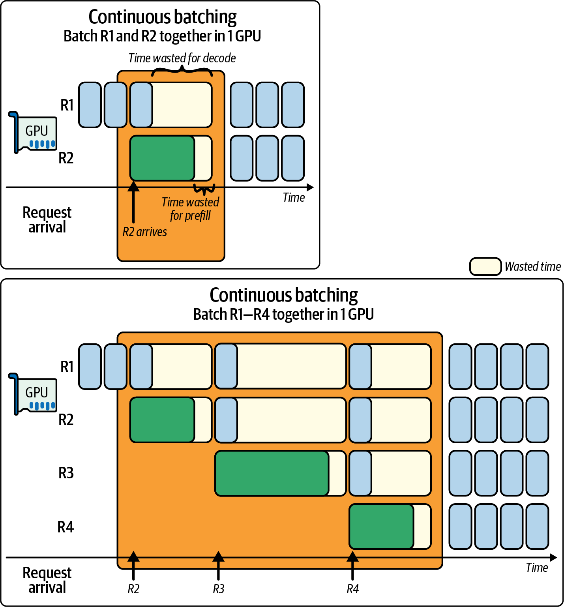
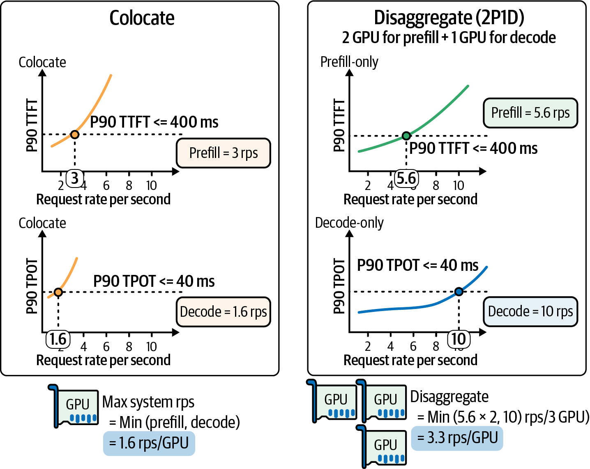
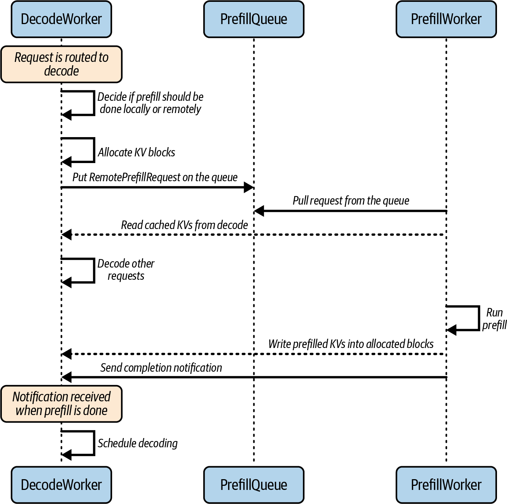
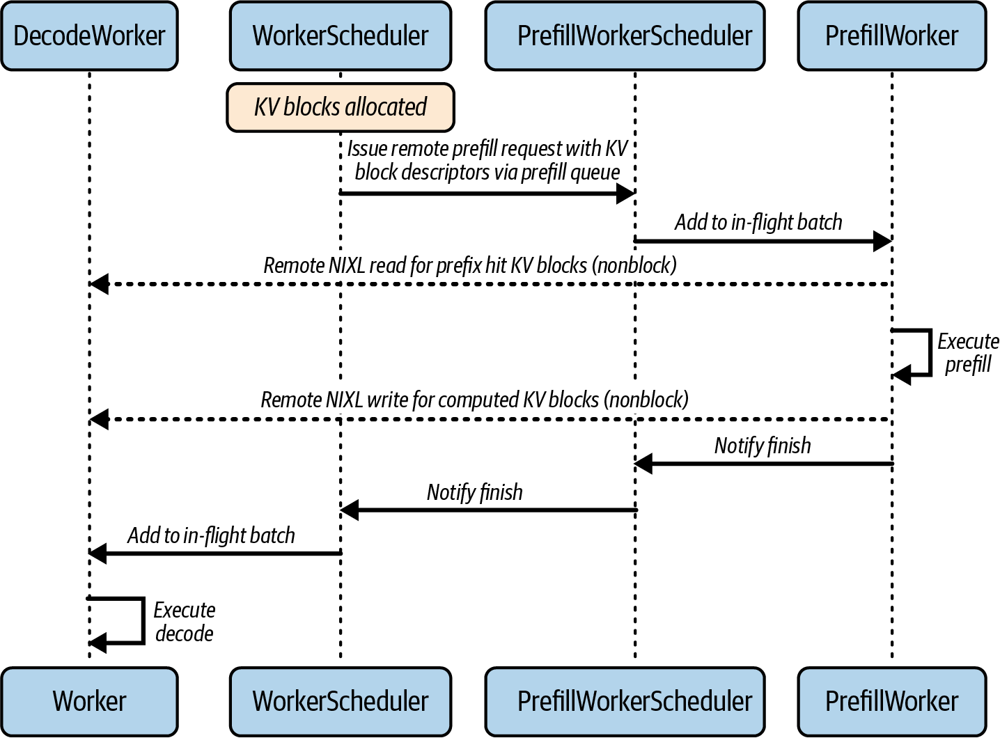
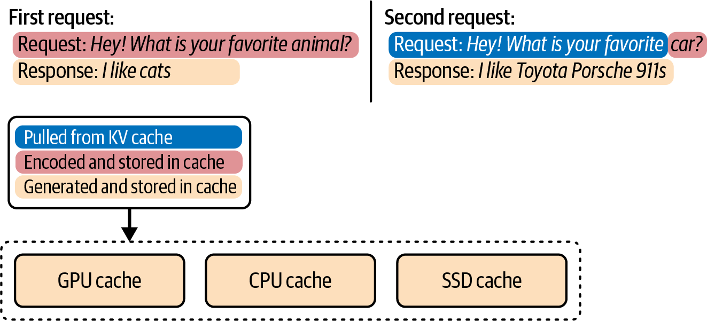
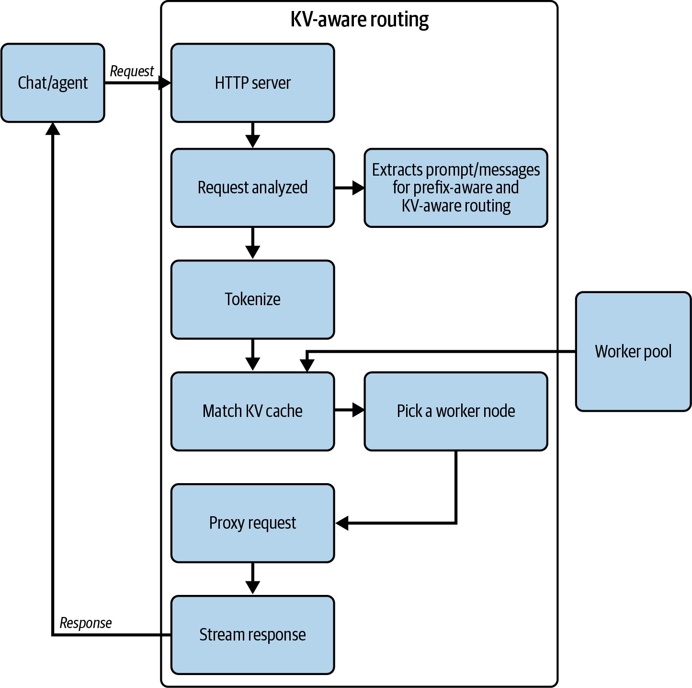
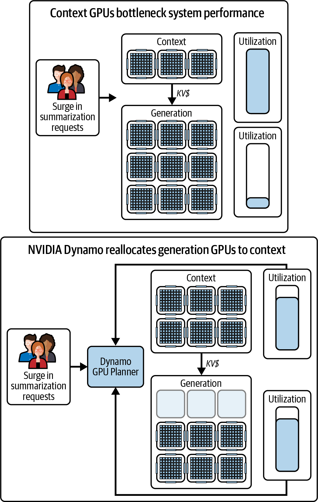

# 第17章 扩展分离式预填充和解码推理 (Scaling Disaggregated Prefill and Decode for Inference)

如前一章所述，LLM推理可以分为两个不同的阶段：预填充阶段和解码阶段。预填充阶段处理输入提示词，为该提示词生成模型的内部键值（KV）缓存，而解码阶段使用这些缓存值逐个生成输出token--或者在推测解码的情况下，一次生成几个token。

这两个阶段具有根本不同的性能特征。预填充阶段是计算密集型的，涉及对可能数千个token进行大规模并行矩阵乘法，消耗大量FLOPS。相比之下，解码阶段是内存I/O密集型的，每次token生成都需要读取大型KV缓存、写入新值，并对内存带宽造成压力。简单来说，预填充是高吞吐量、并行的工作负载，而解码是顺序的、延迟敏感的工作负载。

早期的LLM服务系统将这两个阶段视为同一硬件上的单一流水线。因此，它们通常通过使用请求批处理优先考虑吞吐量来偏向预填充阶段。然而，随着交互式应用的增长，首token时间（TTFT，或所有token的预填充延迟）和每输出token时间（TPOT，或每个token的解码延迟）等延迟指标变得与原始吞吐量同等重要。当同时服务两个阶段时，单个基于GPU的推理引擎很难同时优化TTFT和TPOT。

批处理许多请求将提高吞吐量，但会恶化TTFT，因为每个请求都要等待最慢的预填充。它还会影响TPOT，因为解码步骤会在新提示词预填充之后积压。

> As mentioned in an earlier chapter, LLM inference can be divided into two distinct phases: the prefill phase and the decode phase. The prefill phase processes the input prompt to produce the model's internal key-value (KV) cache for that prompt, while the decode phase generates output tokens one by one-or a few at a time, in the case of speculative decoding-using those cached values. These two phases have fundamentally different performance characteristics. The prefill phase is compute bound, involves heavy matrix multiplications over potentially thousands of tokens in parallel, and consumes a significant amount of FLOPS. In contrast, the decode phase is memory I/O bound, reads the large KV cache for each token generation, writes new values, and stresses memory bandwidth. In simpler terms, prefill is a high-throughput, parallel workload, whereas decode is a sequential, latency-sensitive workload. Early LLM serving systems treated the two phases as one monolithic pipeline on the same hardware. As such, they typically favored the prefill phase by prioritizing throughput using request batching. However, as interactive applications grew, latency metrics like time to first token (TTFT, or prefill latency for all tokens) and time per output token (TPOT, or decode latency per token) became as important as raw throughput. It's difficult for a single GPU-based inference engine to optimize both TTFT and TPOT simultaneously when serving both phases together. Batching many requests will improve throughput but will worsen TTFT since every request waits for the slowest prefill. It will also impact TPOT since the decode steps will get backlogged behind new-prompt prefills.

单一推理系统必须在以下两者之间做出选择：以较慢的后续token生成为代价改善（减少）首token时间，或者以新请求承受高初始延迟为代价改善（增加）每token吞吐量。在极端情况下，一个长提示词可能完全占用GPU，这会阻塞其他用户的所有其他提示词预填充工作。然后，一旦解码开始，一次一个token的处理会使GPU核心在每次token生成之间处于空闲状态。

为了解决这些问题，研究人员和工程师寻找将这两个阶段解耦的方法。关键见解是预填充和解码实际上不需要在同一硬件上运行--甚至不需要在同一类型的硬件上运行。

将预填充和解码阶段分离意味着将它们分配给不同的资源，每个资源都专门针对该特定阶段的需求进行优化。这个想法由DistServe论文中的系统开创，该论文证明通过消除阶段之间的干扰，可以同时满足TTFT和TPOT的严格延迟要求。DistServe的评估显示，与没有预填充/解码分离的最先进基线相比，在严格的延迟服务级别目标（SLO）内可以多服务7.4倍的请求。因此，行业框架开始尝试使用独立的预填充和解码服务器。

开源vLLM库结合LMCache和其他组件引入了分离式操作。NVIDIA的Dynamo实现了具有动态路由和自动扩展的分离式预填充和解码，并公开记录了操作细节。许多提供商和开源框架实现或评估了分离。例如，为了满足严格的延迟SLO，据报道OpenAI、Meta和xAI的行业规模服务系统已经采用了这种分离方法。因此，分离式预填充和解码是大规模LLM推理的标准做法。

在超大规模下，大型推理部署可能涉及数十万甚至数百万个GPU服务数十亿请求。在这些环境中，分离的成本和性能优势是巨大的。

通过拆分工作负载，您可以独立优化每个阶段，避免其中一个成为另一个的瓶颈。本章的其余部分探讨如何设计和运营超大规模的分离式预填充/解码推理系统。

在本章中，我们将探索在预填充和解码工作器之间路由请求的调度算法、在重负载下保持服务质量（QoS）的技术，以及使这种分离高效的机制。我们将探索从高速互连到专用解码内核的所有内容。我们还将讨论为每个阶段使用不同GPU类型的异构硬件策略。

> Monolithic inference systems must choose between improving (reducing) time to first token at the cost of slower subsequent token generation-or improving (increasing) per-token throughput while subjecting new requests to high initial latency. In extreme cases, one long prompt can completely tie up the GPU, which would block all other prompt prefill work for other users. And then, once decoding begins, the one-token-at-a-time processing would leave the GPU's cores idle between each token generation. To address these issues, researchers and engineers looked for ways to decouple the two phases. The key insight is that prefill and decode do not actually need to run on the same hardware-or even the same type of hardware. Disaggregating the prefill and decode phases means assigning them to different resources that are each specialized for the needs of that specific phase. This idea was pioneered by systems in a paper on DistServe, which demonstrated that by eliminating interference between the phases, one can meet strict latency requirements for both TTFT and TPOT simultaneously. DistServe's evaluation showed the potential for serving 7.4x more requests within strict latency service-level objectives (SLOs) compared to a state-of-the-art baseline without prefill/decode disaggregation. As such, industry frameworks began to experiment with separate prefill and decode servers. The open source vLLM library introduced disaggregated operation in conjunction with LMCache and other components. NVIDIA's Dynamo implements disaggregated prefill and decode with dynamic routing and autoscaling and publicly documents operational details. Many providers and open frameworks implement or evaluate disaggregation. For instance, to meet strict latency SLOs, industry-scale serving systems from OpenAI, Meta, and xAI have reportedly adopted this disaggregated approach. As such, disaggregated prefill and decode is standard practice for LLM inference at scale. At ultrascale, large inference deployments can involve hundreds of thousands or even millions of GPUs serving billions of requests. In these environments, the cost and performance benefits of disaggregation are massive. By splitting the workload, you can optimize each phase in isolation and avoid one of them becoming the bottleneck for the other. The remainder of this chapter explores how to design and operate a disaggregated prefill/decode inference system at extreme scale. In this chapter, we will explore scheduling algorithms to route requests between prefill and decode workers, techniques to maintain quality of service (QoS) under heavy load, and mechanisms that make this separation efficient. We'll explore everything from high-speed interconnects to specialized decoding kernels. We will also discuss heterogeneous hardware strategies that use different GPU types for each phase.

## 为什么要分离预填充和解码？(Why Prefill-Decode Disaggregation?)

现代交互式LLM服务通常针对p99（99%的请求）TTFT延迟< 200-300 ms。如果不分离预填充工作，这几乎不可能保证，因为一刀切的LLM服务方法会留下显著的性能提升空间。

作为参考，MLPerf v5.0（2025）的Llama2 70B（700亿参数）推理基准测试针对约450 ms TTFT和40 ms TPOT延迟的p99（第99百分位）SLO。对于Llama 3.1 405B（4050亿参数），基准测试针对约6秒TTFT和175 ms TPOT。具体来说，这些SLO反映了Llama 2 Chat 70B和Llama 3.1 405B Instruct的p99 TTFT和p99 TPOT目标。

考虑这样一个场景：一个用户的请求有一个极长的提示词（数千个token级别），而另一个用户的请求有一个非常短的提示词。如果没有分离式预填充和解码，如果这些请求大约同时到达，长提示词的预填充计算将长时间阻塞GPU。

没有分离，具有短提示词的第二个请求需要等待不必要长的时间才能开始解码。这被称为干扰，因为一个请求的预填充工作延迟了另一个请求的解码工作。在连续批处理的上下文中，预填充和解码之间的干扰如图17-1所示。

在简单的FIFO调度策略下，长提示词会放大所有人的尾延迟。通常，队列前面的长或计算密集型预填充会阻塞后面较短、较轻的请求。这被称为队头阻塞，它导致利用率低下、延迟异常值和不满的最终用户。

在灵活的分离架构中，可以将大型提示词预填充发送到专用的计算优化预填充工作器池，而轻量级提示词预填充可以直接发送到解码工作器--绕过预填充工作器。这种灵活性使较短的token不会遭受队头阻塞。这最大化了整体吞吐量并最小化了延迟尾效应。



> Figure 17-1. Interference caused by colocated prefill and decode running on the same GPU

> Modern interactive LLM services often target TTFT latency < 200-300 ms for p99 (99% of requests). This is nearly impossible to guarantee without separating the prefill work since a one-size-fits-all approach to LLM serving leaves significant performance on the table. For context, the MLPerf v5.0's (2025) inference benchmark for Llama2 70B (70 billion parameters) aimed for p99 (99th percentile) SLOs of ~450 ms TTFT and 40 ms TPOT latency. For Llama 3.1 405B (405 billion parameters), the benchmark aimed for ~6 seconds TTFT and 175 ms for TPOT. Specifically, these SLOs reflect p99 TTFT and p99 TPOT targets for Llama 2 Chat 70B and Llama 3.1 405B Instruct. Consider a scenario in which one user's request has an extremely long prompt on the order of many thousands of tokens-and another user's request has a very short prompt. Without disaggregated prefill and decode, if these requests arrive around the same time, the long prompt's prefill computation will block the GPU for an extended period. Without disaggregation, the second request with the short prompt needs to wait an unnecessarily long time before even starting their decode. This is called interference since the prefill work for one request delays the decode work of another. Interference between prefill and decode is shown in Figure 17-1 in the context of continuous batching. Under a simple FIFO scheduling strategy, long prompts can amplify tail latency for everyone. In general, long or compute-heavy prefills at the front of the queue will block shorter, lighter requests behind them. This is called head-of-line blocking, and it leads to poor utilization, latency outliers, and unhappy end users. In a flexible disaggregated architecture, it's possible to send a large prompt prefill to the dedicated pool of compute-optimized prefill workers, while a lightweight prompt prefill can be sent to the decode workers directly-bypassing the prefill workers. This type of flexibility allows shorter tokens to not suffer from head-of-line blocking. This maximizes overall throughput and minimizes latency tail effects.

### 分离的优势 (Advantages of Disaggregation)

分离有两个主要优势：减少干扰和阶段特定优化。让我们接下来讨论这些。

#### 减少干扰 (Reduced interference)

通过分离，预填充任务不再与同一设备上的解码任务竞争。一个忙碌的解码工作器正在生成许多token，不会阻止另一个用户的提示词被处理，反之亦然。

每个阶段的专用资源意味着长提示词的计算不会阻塞另一个用户的token生成。实际上，这产生了更可预测的延迟。图17-2显示了共置和分离式预填充和解码之间的比较。这个实验在DistServe论文和作者随后的博客文章中有更详细的描述。



> Figure 17-2. Comparison between colocated and disaggregated prefill and decode

> Disaggregation has two primary advantages: reduced interference and phase-specific optimizations. Let's discuss each of these next. With disaggregation, prefill tasks no longer contend with decode tasks on the same device. A busy decode worker, generating many tokens, won't prevent another user's prompt from being processed, and vice versa. Dedicated resources for each stage mean a long prompt's computation won't block another user's token generation. In practice, this produces more predictable latency. Figure 17-2 shows the comparison between colocated and disaggregated prefill and decode. This experiment is described in more detail in the DistServe paper and subsequent blog post by the authors.

在这里，SLO设置为P90 TTFT为0.4秒，P90 TPOT为0.04秒（例如，图17-2中的水平线）。共置系统在给定的TTFT延迟范围内只能支持约3个请求每秒（RPS）的有效吞吐量。在给定的TPOT延迟范围内，它只能维持1.6 RPS。因此，共置配置的有效吞吐量只有1.6 RPS，因为TTFT和TPOT延迟SLO都需要满足。

在分离这两个阶段并分配两个预填充工作器（两个GPU）和一个解码工作器（一个GPU），称为2P1D配置后，预填充和解码工作器都比具有单个GPU的共置配置实现了更好的整体RPS。具体来说，预填充工作器达到约5.6 RPS，解码工作器在三个GPU上实现约10 RPS。因此，2P1D配置的有效吞吐量为每GPU 3.3 RPS。

每GPU 3.3 RPS是通过取预填充工作器的RPS（5.6 RPS x 2 = 11.2 RPS）和解码工作器（10 RPS）的最小值来计算的。这是所有三个GPU上的总共10 RPS。因此，我们必须将RPS除以GPU数量，在这种情况下为3。在配置的SLO下，该系统的有效吞吐量结果为10 RPS / 3 GPU = 每GPU 3.3 RPS。

在这个比较中，解码端的改进主要影响每token延迟。同时，预填充隔离主要改善首token时间。两个SLO都必须满足才能算作有效吞吐量。

这种隔离也可以改善尾延迟。经验上，分离的系统显示出更紧密的延迟分布--并避免了单一系统中看到的长尾。通过消除跨阶段干扰，每个阶段更可靠地满足其SLO--并具有更可预测的一致性。

现在，您也应该问："3倍的成本值得2倍的改进吗？"您问这个问题是对的。需要额外的调优才能使此解决方案更具成本效益，但它显示了正确的方向来收紧延迟分布并改善有效吞吐量。您需要根据您的工作负载做出决定。分离是满足有效吞吐量RPS需求的流行选择。

> Here, the SLO is set to 0.4 seconds for P90 TTFT and 0.04 seconds for P90 TPOT (e.g., horizontal line in Figure 17-2). The colocated system can support only ~3 requests per second (RPS) of goodput within the given TTFT latency bounds. And it can sustain only 1.6 RPS within the given TPOT latency bounds. As such, the goodput of the colocated configuration is only 1.6 RPS since both the TTFT and TPOT latency SLOs need to be met. After disaggregating the two stages and assigning two prefill workers (two GPUs) and a single decode worker (one GPU), called a 2P1D configuration, both the prefill and decode workers achieve better overall RPS than the colocated configuration with a single GPU. Specifically, the prefill worker reaches ~5.6 RPS and the decode worker achieves ~10 RPS spread across the three GPUs. As such, the goodput for the 2P1D configuration is 3.3 RPS per GPU. The 3.3 RPS per GPU is calculated by taking the minimum of the RPS of the prefill workers (5.6 RPS x 2 = 11.2 RPS) and the decode worker (10 RPS). This is 10 RPS total across all three GPUs. As such, we have to divide the RPS by the number of GPUs, or 3 in this case. Under the configured SLOs, this system's goodput result is 10 RPS / 3 GPUs = 3.3 RPS per GPU. In this comparison, the decode side improvements primarily impact per-token latency. Meanwhile, prefill isolation primarily improves time to first token. Both SLOs must be satisfied to count as goodput. This isolation can also improve tail latencies as well. Empirically, systems that disaggregate show tighter latency distributions-and avoid the long tails seen in monolithic systems. By eliminating cross-phase interference, each phase meets its SLO more reliably-and with more predictable consistency. Now, you should also be asking, "Is the 3x cost worth the 2x improvement?" And you would be right to ask that. Additional tuning is required to make this solution more cost-effective, but it shows the right direction to tighten latency distributions and improve goodput. You need to decide based on your workload. Disaggregation is a popular option to meet goodput RPS needs.

#### 阶段特定优化 (Phase-specific optimizations)

阶段特定优化让每个阶段使用最适合它的硬件和并行性。例如，预填充阶段是计算密集型的。因此，您通常会增加张量并行性以在高FLOPS GPU上驱动峰值FLOPS。此外，现代GPU提供低精度模式（FP8和FP4），可以提高计算密集型预填充阶段的吞吐量。

> 您应该优先使用FP4存储权重，并在验证后也用于激活。许多技术栈使用FP4存储权重，FP8存储激活。这些降低的精度有助于最大化吞吐量并最小化HBM占用--精度损失极小。这些精度得到现代硬件和软件栈的支持，包括NVIDIA Tensor Cores和Transformer Engine。

相比之下，解码阶段是内存带宽密集型的，并遭受跨GPU同步开销。因此，它最有效的方式是使用很少或不使用张量并行性（通常TP=1），因为它更多地依赖融合内核来提高算术强度--以及高内存吞吐量GPU。

在单一系统中，您必须为两个阶段选择一种GPU类型和一种并行性策略，这对至少一个阶段来说是次优的。另一方面，分离让您可以独立调整每个阶段以实现最大效率。

拆分阶段还为异构集群打开了大门，其中不同类型的GPU被分配给预填充和解码角色以获得最佳成本性能。例如，使用计算优化的GPU进行提示词预填充，使用内存优化的GPU进行token生成，可以产生比同构部署更好的每美元吞吐量。

> 实际上，最新的GPU通常具有更高的FLOPS和更多的GPU内存。因此，只使用最新GPU代际进行预填充和解码是诱人的--也更常见。但要知道，异构性是降低成本的可行选择。

我们将在本章后面探讨异构集群的想法。我们将展示如何使用高端GPU处理提示词，使用更便宜的GPU生成，可以在规模上带来显著的成本节约。

总之，分离消除了跨干扰并实现了每个阶段的专门处理。预期结果包括更紧密的延迟分布，因为不再有不匹配提示词大小引起的长尾，在延迟约束下改善吞吐量（有效吞吐量），以及更好的整体资源利用率。

> 您应该使用性能分析工具（例如，NVIDIA Nsight Systems）来识别预填充和解码阶段的瓶颈。这些可以跨不同工作器节点跟踪GPU内核和RDMA传输。这将有助于验证解码内核完全重叠通信等。

接下来，让我们讨论如何实际实现分离式服务系统，包括系统架构、通信和决定如何充分利用分离集群的调度策略。

> Phase-specific optimizations let each phase use the hardware and parallelism that suits it best. The prefill phase, for instance, is compute bound. As such, you'd typically increase tensor parallelism to drive peak FLOPS on a high-FLOPS GPU. Additionally, modern GPUs provide lower precision modes (FP8 and FP4) that can increase throughput for the compute-heavy prefill phase. In contrast, the decode phase is memory-bandwidth-bound and suffers from cross-GPU synchronization overhead. So it's most efficient with little or no tensor parallelism (often TP=1) as it relies more on fused kernels to increase arithmetic intensity-as well as high memory throughput GPUs. In a monolith you'd have to pick one type of GPU and one parallelism strategy for both phases, which is suboptimal for at least one of the phases. Disaggregation, on the other hand, lets you independently tune each phase for maximum efficiency. Splitting phases also opens the door to heterogeneous clusters in which different GPU types are assigned to prefill and decode roles for optimal cost-performance. For example, using compute-optimized GPUs for prompt prefill and memory-optimized GPUs for token generation can produce better throughput per dollar than a homogeneous deployment. In practice, the latest GPUs typically have both higher FLOPS and more GPU memory. As such, it's tempting-and more common-to just use the latest GPU generation for both prefill and decode. But just know that heterogeneity is a viable option to reduce cost. We will explore the idea of heterogeneous clusters later in the chapter. We'll show how using high-end GPUs for prompts and cheaper GPUs for generation can lead to significant cost savings at scale. In summary, disaggregation removes cross-interference and enables specialized treatment of each phase. The expected results include tighter latency distributions since no more long tails are caused by mismatched prompt sizes, improved throughput under latency constraints (goodput), and better overall resource utilization. You should use profiling tools (e.g., NVIDIA Nsight Systems) to identify bottlenecks in the prefill and decode phases. These can trace GPU kernels and RDMA transfers across the different worker nodes. This will help validate that decode kernels are fully overlapping communication, etc. Next, let's discuss how to actually implement a disaggregated serving system, including the system architecture, communication, and scheduling policies that decide how to fully utilize the disaggregated cluster.

## 分离式预填充和解码集群池 (Disaggregated Prefill and Decode Cluster Pools)

在分离式部署中，我们维护两个（或更多）工作器池，使得一组GPU专门用于预填充提示词处理，另一组专门用于token生成。这些工作器可以位于数据中心的不同节点或机架上--如果互连足够快，甚至可以在不同的数据中心。（注意：将预填充和解码保持在同一数据中心是实现现实SLO的实际设计选择。）

工作器池通过网络通信，将预填充产生的模型KV缓存移交给执行解码的GPU。调度器或路由器协调此通信。

考虑一个配置，其中模型权重加载在两组GPU服务器上。一组，即预填充工作器，处理提示词并计算KV缓存。另一组，即解码工作器，使用预填充工作器生成的KV缓存处理token生成。

两组工作器通常使用高速互连（例如，NVLink/NVSwitch和InfiniBand）和零拷贝GPU到GPU传输与RDMA进行通信。实际上，这些传输使用GPUDirect RDMA或UCX，并可以在Nsight Systems中与CUDA内核、NVLink活动、存储指标和InfiniBand交换机指标相关联以进行端到端验证。

> 对于基于超级芯片的NVL结构（例如，Grace-Blackwell、Vera-Rubin等），使用NVIDIA多节点NVLink（MNNVL），保持启用NVLink优先集合通信用于TP解码，并在可用时启用SHARP用于AllGather和ReduceScatter集合通信。

当系统收到新请求时，通常在解码工作器上接收。这称为以解码为中心的设计。这是首选方案，因为预填充工作器已经因KV计算而计算密集。

通过让解码工作器处理客户端I/O、路由和会话状态管理，推理系统避免使预填充工作器过载。此外，将请求入口集中在解码节点上简化了网络管理、自动扩展和策略执行。

> 这只是预填充-解码系统架构的一种风格，其中解码工作器是所有请求的集中入口。这种架构用于NVIDIA Dynamo推理系统。另一种常见的架构是使用专用的集中式API路由器将请求路由到预填充或解码工作器。然而，这需要在系统中增加一个额外的移动部件，以及路由器和预填充/解码工作器之间的额外协调--以及额外的扩展和延迟考虑。

在解码工作器接收请求后，它决定是自己进行预填充还是将其"卸载"到预填充工作器池。如果它决定卸载到预填充工作器池，解码工作器稍后将接收KV结果，然后继续解码并生成下一个token。

接下来是简化的NVIDIA Dynamo集群配置片段，定义了两个角色，使用NVIDIA的推理传输库（NIXL）进行基于GPUDirect RDMA的KV缓存传输，让一个GPU直接通过网络写入另一个GPU的内存：

```yaml
roles:
  - name: prefill_worker     # 预填充工作器角色
    model_path: models/llm-70b
    instance_count: 4        # 4个预填充工作器
    gpu_type: B200           # B200 Blackwell计算密集型预填充

  - name: decode_worker      # 解码工作器角色
    model_path: models/llm-70b
    instance_count: 8        # 8个解码工作器
    gpu_type: B300           # B300 Blackwell Ultra高内存解码
```

> NVIDIA的Rubin CPX加速器是预填充工作器的另一个选择。Rubin CPX（CP代表"context processing"）专门为计算密集型工作负载（如预填充）设计。Rubin CPX标志着NVIDIA从"通用加速计算"GPU转向专门为更广泛AI工作负载（如推理）中的特定阶段（例如，预填充）优化的专用芯片。

> In a disaggregated deployment, we maintain two (or more) pools of workers such that one set of GPUs is dedicated to prefill prompt processing and another set is dedicated to token generation. These workers can be on separate nodes or racks in a data center-or even in separate data centers if the interconnect is fast enough. (Note: keeping prefill and decode within the same data center is the practical design choice to achieve realistic SLOs.) The worker pools communicate over a network to hand off the model's KV cache produced by the prefill to whichever GPU will perform the decode. A scheduler, or router, coordinates this communication. Consider a configuration in which the model weights are loaded on two groups of GPU servers. One group, the prefill workers, handles prompts and computes the KV cache. The other group, the decode workers, handles token generation using the KV caches generated from the prefill workers. The two worker groups typically communicate using a high-speed interconnect (e.g., NVLink/NVSwitch and InfiniBand) and zero-copy GPU-to-GPU transfers with RDMA. In practice, these transfers use GPUDirect RDMA or UCX and can be correlated in Nsight Systems alongside CUDA kernels, NVLink activity, storage metrics, and InfiniBand switch metrics for end-to-end validation. For superchip-based NVL fabrics (e.g., Grace-Blackwell, Vera-Rubin, etc.), use NVIDIA Multi-Node NVLink (MNNVL), keep NVLink-first collectives enabled for TP decode, and enable SHARP for AllGather and ReduceScatter collectives when available. When the system receives a new request, it typically receives it on the decode worker. This is called a decode-centric design. This is preferred because the prefill workers are already compute bound with the KV computations. By having the decode workers handle the client I/O, routing, and session state management, the inference system avoids overloading the prefill workers. Also, centralizing request ingress on the decode nodes simplifies network management, autoscaling, and policy enforcement. This is just one style of system architecture for prefill-decode in which the decode worker is the centralized ingress for all requests. This architecture is used in the NVIDIA Dynamo inference system. Another common architecture is to use a dedicated, centralized API router to route the request to either the prefill or decode worker. However, this requires an extra moving part in the system and additional coordination between the router and prefill/decode workers, -as well as additional scaling and latency considerations. After the decode worker receives the requests, it decides whether to do the prefill itself or "offload" it to the prefill worker pool. If it decides to offload to the prefill worker pool, the decode worker will later receive the KV results back and then continue with decoding and generating the next token. Next is a snippet from a simplified NVIDIA Dynamo cluster configuration that defines two roles that use NVIDIA's Inference Xfer Library (NIXL) for GPUDirect RDMA-based KV cache transfers to let one GPU write into another GPU's memory directly over the network: ... NVIDIA's Rubin CPX accelerator is another option for prefill workers. Rubin CPX (the CP stands for "context processing") is specifically designed for compute-bound workloads such as prefill. The Rubin CPX marks NVIDIA's departure from "general accelerated computing" GPUs into specialized chips that are optimized for a specific stage (e.g., prefill) within a broader AI workload such as inference.

在此配置中，我们有四个使用B200 GPU的预填充工作器（适合计算密集型预填充的足够计算能力）和八个使用B300 GPU的解码工作器（用于内存密集型解码的高HBM容量）。混合B200和B300有助于匹配其FLOPS和HBM容量特性，同时最小化成本。两个角色都将使用NIXL和GPUDirect RDMA传输KV缓存块。NIXL抽象了通过NVLink和RDMA NIC进行GPU到GPU数据移动的传输。它还为GPUDirect Storage提供连接器，以便可以从（或写入）不同存储层读取（或写入）KV缓存页面。

在底层，当此系统运行时，每个解码工作器注册其GPU内存的一个区域，以便预填充工作器可以使用RDMA直接写入其中。通常，内存注册元数据（如NIXL描述符）在启动时或首次接触时交换。这样，对于每个远程预填充任务，只需要发送一个小标识符，而不是完整的内存地址结构。

例如，Dynamo使用etcd进行工作器发现和租约。工作器向路由器或控制平面注册必要的内存句柄，以便对等方在需要时获取描述符。预填充工作器将在首次使用时检索它们。这样，预填充请求可以只包含目标KV缓冲区的ID，使控制消息轻量级。

此外，NVIDIA Dynamo的NIXL实现为推理数据移动提供了高吞吐量RDMA和存储抽象，并包括NVLink、基于UCX的结构和GPUDirect Storage的插件。因此，预填充工作器可以直接将KV块写入解码GPU内存。

> 在预填充和解码使用不同TP布局的混合并行部署中，需要在NIXL读取后立即在解码端执行布局转换。这样，KV页面与解码内核的预期布局匹配。此转换与网络传输相比延迟微不足道，并避免了重新预填充。

> In this configuration, we have four prefill workers using B200 GPUs (adequate compute for compute-heavy prefills) and eight decode workers using B300 GPUs (high HBM capacity for heavy memory-bound decodes). Mixing B200s and B300s helps to match their FLOPS and HBM capacity characteristics while minimizing cost. Both roles will use NIXL and GPUDirect RDMA to transfer the KV cache blocks. NIXL abstracts transport for GPU-to-GPU data movement over NVLink and RDMA NICs. It also provides connectors for GPUDirect Storage so that KV cache pages can be read from (or written to) different storage tiers. Under the hood, when this system runs, each decode worker registers a region of its GPU memory so that prefill workers can write directly into it using RDMA. Typically, memory-registration metadata such as NIXL descriptors are exchanged at startup or on first contact. This way, for each remote prefill task, only a small identifier needs to be sent rather than a full memory address structure. For instance, Dynamo uses etcd for worker discovery and leases. Workers register the necessary memory handles with the router or control plane so that peers can obtain the descriptors when needed. The prefill workers will retrieve them on first use. This way, a prefill request can include just an ID for the target KV buffer, making control messages lightweight. Furthermore, NVIDIA Dynamo's NIXL implementation provides a high throughput RDMA and storage abstraction for inference data movement and includes plugins for NVLink, UCX-based fabric, and GPUDirect Storage. As such, prefill workers can write KV blocks directly into decode GPU memory. In mixed parallelism deployments where prefill and decode use different TP layouts, you need to perform a layout transform on the decode side immediately after the NIXL read. This way, the KV pages match the decode kernel's expected layout. This transform is latency-insignificant compared to network transfer and avoids re-prefill.

此架构解耦了每个阶段的扩展。例如，如果您发现由于许多并发长提示词导致预填充成为吞吐量瓶颈，可以添加更多预填充工作器以增加提示词处理容量。

如果由于许多用户生成长输出导致解码成为瓶颈，您将扩展解码工作器。因为解码和预填充是分离的，扩展一个不会直接干扰另一个。

像NVIDIA Dynamo这样的系统支持动态、运行时可配置的分离，这样您可以在不停止集群的情况下动态添加或删除预填充工作器。新的预填充工作器只需注册并开始从队列中拉取任务。如果预填充工作器因任何原因离开集群（崩溃、重启、自动扩展事件、网络分区等），解码工作器将临时进行更多本地预填充以补偿。

NVIDIA Dynamo的分布式运行时使用etcd进行工作器发现和租约。其Planner组件可以通过撤销租约或启动自动发现的新工作器来扩展工作器。这种动态灵活性在超大规模时至关重要，因为负载经常会波动。发生这种情况时，您需要根据需要在角色之间交换工作器。

> This architecture decouples scaling for each phase. If you find that prefill is the throughput bottleneck due to many concurrent long prompts, for instance, you can add more prefill workers to increase prompt processing capacity. If decode becomes the bottleneck due to many users generating long outputs, for instance, you would scale out decode workers. Because decode and prefill are separated, scaling one doesn't directly interfere with the other. Systems like NVIDIA Dynamo support dynamic, runtime-configurable disaggregation such that you can add or remove prefill workers on the fly-without stopping the cluster. New prefill workers simply register and start pulling tasks from the queue. If a prefill worker leaves the cluster for whatever reason (crash, restart, autoscale event, network partition, etc.), the decode workers will temporarily do more local prefills to compensate. NVIDIA Dynamo's distributed runtime uses etcd for worker discovery and leases. Its Planner component can scale workers by revoking leases or launching new workers which are auto-discovered. This dynamic flexibility is crucial at ultrascale when load will often fluctuate. When this happens, you'll want to swap workers between roles as needed.

### 预填充工作器设计 (Prefill workers design)

预填充工作器，或提示词服务器，是专门执行请求初始提示词预填充处理阶段的计算节点。本节讨论预填充节点如何架构以高效处理繁重的计算--以及它们如何在负载下平衡延迟与KV缓存填充的吞吐量。

由于预填充工作负载计算密集，预填充节点应使用高FLOPS GPU，并针对大型矩阵乘法进行优化。每个预填充任务将n个输入token通过所有模型层。

预填充工作器将并行使用数千个GPU线程--如果可用，还会跨多个GPU节点。它们使用熟悉的并行技术，包括张量并行和流水线并行，以减少TTFT。

> Prefill workers, or prompt servers, are the compute nodes dedicated to executing the initial prompt prefill processing phase of requests. This section discusses how prefill nodes are architected to handle the heavy computation efficiently-and how they balance latency versus throughput for KV cache population under load. Because the prefill workload is computationally intensive, prefill nodes should use GPUs with high FLOPS and be optimized for large matrix multiplications. Each prefill task feeds n input tokens through all model layers. The prefill workers will use thousands of GPU threads in parallel-and across many GPU nodes, if available. They use familiar parallelism techniques, including tensor parallelism and pipeline parallelism, to reduce TTFT.

#### 内存管理 (Memory management)

在内存方面，预填充节点需要加载完整的模型权重，并为提示词分配KV缓存。然后，此KV缓存将传输到解码工作器，稍后我们会看到。

预填充用模型参数和模型前向传递的工作激活填充GPU内存，以及提示词输入。一旦创建KV缓存，它会立即发送到解码工作器。KV缓存不会在预填充节点的内存中长期存在。

如果模型非常大或提示词非常长，由于内存限制，预填充可能需要跨GPU进行张量或并行拆分。预填充服务器应灵活使用其并行策略（数据、张量、流水线、专家（MoE）和上下文）以满足延迟目标。

一些推理框架预分配一大块GPU内存供预填充用作工作空间。这减少了整体内存碎片和缓冲区分配时间。

> Memory-wise, prefill nodes need to load the full model weights and also allocate KV cache for the prompt. This KV cache is then transferred to the decode workers, as we'll see in a bit. Prefill populates GPU memory with model parameters and the working activations of the model's forward pass with the prompt inputs. Once the KV cache is created, it's immediately sent to the decode workers. The KV cache doesn't persist long in the prefill node's memory. If a model is extremely large or a prompt is extremely long, prefill may require tensor or parallel splits across GPUs due to memory limitations. Prefill servers should be flexible with their parallelism strategies (data, tensor, pipeline, expert (MoE), and context) to meet latency targets. Some inference frameworks preallocate a big chunk of GPU memory for prefills to use as working space. This reduces overall memory fragmentation and buffer allocation time.

#### 延迟与吞吐量的优化 (Optimizing for latency versus throughput)

在调整分离式预填充集群时，您面临一个基本权衡：最小化每个单独提示词的TTFT，还是在重负载下最大化整体每秒请求数（RPS），或减少TPOT。

分离式系统通过支持不同的调度策略来处理这种权衡，包括延迟优先方法和吞吐量优先方法。让我们接下来描述这些方法：

**延迟优先方法 (Latency-first approach)**

为了减少TTFT，预填充节点应在提示词到达时立即处理--几乎不进行批处理。在此模式下，您避免等待其他请求填充批次。因此，每个提示词立即开始执行并尽快完成--假设集群中有可用的GPU。

这种延迟优先方法的缺点是GPU利用率较低，因为您使用的是小型或不存在的批次。因此，GPU经常处于空闲状态，对于给定的集群大小，您的系统将服务较少的并发请求。在这种情况下，您可以过度配置预填充集群容量，或使用批处理大小为1来保证请求的严格延迟SLO。

**吞吐量优先方法 (Throughput-first approach)**

如果峰值吞吐量（RPS）和最小TPOT是您的优先事项，您应该将提示词批处理成更大的组以充分利用每个GPU。通过将8-32个提示词累积到单个批次中，您可以提高算术强度并保持GPU计算单元忙碌。这将增加整体吞吐量。

吞吐量优先方法的缺点是每个请求都会产生批处理延迟，等于收集批次所需的时间。批次大小越大，延迟越长。

对于极端吞吐量推理系统配置，您可以选择使用数据并行或流水线并行为每个请求分配多个GPU。

使用数据并行，整个模型在每个GPU上复制。批次被拆分为跨GPU的微批次。每个GPU通过其完整的模型副本对其数据子集执行前向传递。然后从所有GPU聚合输出以获得最终输出。

数据并行聚合所有GPU的内存带宽和计算能力以提高每批次性能。然而，它将最大并行度降低为GPU总数/每个请求的GPU数。这降低了您的整体并发请求容量。如果系统为单个请求使用过多GPU，这可能会使资源闲置。这将造成吞吐量和并发性之间的不平衡。

流水线并行将模型的层划分为不同GPU上的顺序阶段，例如GPU 0和GPU 1。一旦GPU 0完成微批次0的阶段，它将激活转发给GPU 1并开始微批次1的阶段1。这种流水线模式使所有GPU忙碌于不同的工作块。

流水线并行增加了每批次吞吐量，但如果微批次大小或阶段划分没有仔细平衡，它会增加GPU间通信开销和流水线"气泡"。

最终，您专用的每个额外GPU都会增加吞吐量，但会减少您一次可以处理的请求数量--假设集群大小固定。您始终可以扩展GPU集群，但假设集群大小固定，您应该根据延迟SLO还是吞吐量SLO对您的用例最重要来选择配置。

> When tuning a disaggregated prefill cluster, you face a fundamental trade-off between minimizing the TTFT for each individual prompt and maximizing overall requests per second (RPS), or reducing TPOT, under heavy load. Disaggregated systems handle this trade-off by supporting different scheduling policies for a latency-first approach versus a throughput-first approach. Let's describe each of these approaches next: To reduce TTFT, prefill nodes should process prompts as soon as they arrive-and with little to no batching. In this mode, you avoid waiting for other requests to fill a batch. As such, every prompt starts execution immediately and finishes as fast as possible-assuming available GPUs in the cluster. The downside of this latency-first approach is lower GPU utilization since you are using small or no batches. As such, GPUs often sit idle, and your system will serve fewer concurrent requests for a given cluster size. In this case, you can either over-provision your prefill cluster capacity or use a tiny batch size of 1 to guarantee strict latency SLOs for your requests. If peak throughput, or RPS, and minimal TPOT are your priorities, you should batch prompts into larger groups to fully load each GPU. By accumulating 8-32 prompts into a single batch, you raise arithmetic intensity and keep the GPU compute units busy. This will increase the overall throughput. The downside to the throughput-first approach is that each request incurs a batching delay equal to the time it takes to collect the batch. The larger the batch size, the longer the delay. For extreme throughput inference system configurations, you can choose to assign multiple GPUs per request using either data parallelism or pipeline parallelism. With data parallelism, the entire model is replicated on each GPU. The batch is split into minibatches across the GPUs. Each GPU performs a forward pass on its subset of data through its complete copy of the model. The output is then aggregated from all the GPUs for the final output. Data parallelism aggregates memory bandwidth and compute power across all of the GPUs to increase per-batch performance. However, it reduces maximum parallelism to the total # of GPUs / GPUs per request. This reduces your overall concurrent request capacity. This can leave resources idle if the system uses too many GPUs per single request. This will create an imbalance between throughput and concurrency. Pipeline parallelism divides the model's layers into sequential stages on different GPUs, such as GPU 0 and GPU 1. As soon as GPU 0 finishes its stage for microbatch 0, it forwards activations to GPU 1 and begins stage 1 for microbatch 1. This assembly-line pattern keeps all GPUs busy on different chunks of work. Pipeline parallelism increases per-batch throughput, but it adds inter-GPU communication overhead and pipeline "bubbles" if the microbatch size or stage splits are not carefully balanced. Ultimately, each additional GPU that you dedicate will increase throughput but decrease how many requests you can handle at once-given a fixed-size cluster. You can always scale out the GPU cluster, but assuming a fixed cluster size, you should choose your configuration based on whether latency SLOs or throughput SLOs are most important to your use case.

#### 延迟感知调度和批处理 (Latency-aware scheduling and batching)

分离式系统结合前面提到的延迟感知调度策略来平衡这些因素。例如，它们可能保证单请求执行--而不批处理请求--除非负载足够高，以至于合并少量请求不会违反TTFT目标。

许多集群设计在调度器中包含SLO约束。例如，如果p90 TTFT必须≤ X ms，系统将选择仍能满足典型提示词大小SLO的最大批次大小或并行策略。

另一种策略是自适应批处理窗口。例如，在低负载时，它可以使用批次大小为1立即运行请求。在较高负载时，系统可以允许在较小时间窗口（如2-10 ms）内到达的请求微批次。这样，轻微延迟可以产生大的GPU利用率提升--但仅在需要和可容忍时。

许多推理引擎为其预填充工作器优先考虑延迟。系统通常尽快执行提示词任务，甚至容忍一些GPU利用率不足，因为快速的首token显著改善用户体验。

通常会为平均负载配置比所需更多的预填充容量。这样，预填充集群可以吸收提示词突发而不会出现延迟峰值。在下一章中，我们将讨论自适应机制以动态重新平衡资源，以便预填充和解码工作器都不会随时间成为瓶颈。

像Kubernetes这样的现代编排器可以自动扩展每个层级。例如，如果预填充GPU利用率保持高位而解码利用率低，编排器可以触发自动扩展事件以添加预填充pod（或节点）--甚至可能删除一些解码pod/节点。

> 这种自适应扩展通常使用预填充队列长度等指标来帮助驱动决策。

另一种选择是实现优先级队列，使短提示词在具有较少批处理的单独快速通道上调度。长、可批处理的提示词进入吞吐量优化的队列。NVIDIA Dynamo在调度中支持延迟类别。您可以通过标记请求并为每个类别设置不同的批处理窗口来模拟这一点。

关键要点是预填充工作器优先考虑快速周转。分离让我们可以做到这一点而不会损害解码性能，因为解码在另一组工作器上运行。我们可能会在低流量期间"浪费"一些预填充GPU周期，但我们在高峰流量期间保持低TTFT。对于交互式服务来说，这是一个值得的权衡。

> Disaggregated systems incorporate the latency-aware scheduling policies mentioned earlier to balance these factors. For instance, they might guarantee single-request execution-and not batch requests-unless load is high enough that combining a small number of requests won't violate the TTFT target. Many cluster designs include an SLO constraint in the scheduler. For instance, if p90 TTFT must be ≤ X ms, the system will choose the largest batch size or parallelism strategy that still meets the SLO for a typical prompt size. Another strategy is adaptive batching windows. For instance, at low load, it can run requests immediately using a batch size of 1. And at higher loads, the system can allow microbatches of requests arriving within a small time window, such as 2-10 ms. This way, a slight delay can produce a big GPU utilization win-but only when it's needed and tolerable. Many inference engines favor latency for their prefill workers. Systems often execute prompt tasks as soon as possible and even tolerate some GPU underutilization, because a fast first token significantly improves user experience. It's common to provision more prefill capacity than needed for an average load. This way, the prefill cluster absorbs bursts of prompts without latency spikes. In the next chapter, we will discuss adaptive mechanisms to rebalance resources on the fly so that neither the prefill nor the decode workers become a bottleneck over time. Modern orchestrators like Kubernetes can automatically scale each tier. For example, if prefill GPU utilization stays high and decode is low, the orchestrator can trigger an autoscaling event to add prefill pods (or nodes)-and possibly even remove some decode pods/nodes. This kind of adaptive scaling is often implemented with metrics like prefill queue length to help drive the decisions. Another option is to implement priority queues such that short prompts are scheduled on a separate fast lane with less batching. Long, batchable prompts go to a throughput-optimized queue. NVIDIA Dynamo supports latency classes in scheduling. You can emulate this by tagging requests and having different batching windows per class. The key takeaway is that prefill workers prioritize quick turnaround. Disaggregation lets us do this without harming decode performance since decode is running on a different set of workers. We might "waste" some prefill GPU cycles during low-traffic periods, but we maintain low TTFT during peak traffic periods. It's a worthwhile trade-off for interactive services.

### 解码工作器设计 (Decode workers design)

解码工作器，或生成服务器，专门用于自回归解码阶段。一旦提示词的KV缓存准备就绪，它就会被发送到解码工作器，该工作器使用KV缓存尽快生成剩余的输出token，以保持低TPOT延迟。

如果请求最初被路由到解码工作器，如图17-3所示，它必须首先决定预填充是在本地进行还是使用分离路由器远程进行。如果它决定远程预填充，它将把预填充请求推送到预填充队列，由预填充工作器获取。

预填充工作器持续从预填充队列拉取，读取前缀缓存中缓存的任何KV块，并计算预填充操作。然后它将KV块写回解码工作器，完成解码。



> Figure 17-3. Prefill worker design: read prefix cache → compute prefill → write KV cache for decode

> Decode workers, or generation servers, are dedicated to the autoregressive decode phase. Once a prompt's KV cache is ready, it is sent to a decode worker, which uses the KV cache to produce the remaining output tokens as quickly as possible to maintain a low TPOT latency. If a request is initially routed to the decode worker, as in Figure 17-3, it must first decide if the prefill should be done locally or remotely using a disaggregated router. If it decides to prefill remotely, it will push the prefill request into a prefill queue to be picked up by the prefill worker. The prefill worker continuously pulls from the prefill queue, reads any KV blocks cached in the prefix cache, and computes the prefill operations. It then writes the KV blocks back to the decode worker, which completes the decoding.

解码工作器设计专注于高效处理许多并发序列生成--以及管理KV缓存的内存占用。在本节中，我们描述解码服务器如何使用连续批处理和巧妙的内存管理技巧等技术实现高吞吐量。这些有助于减少TPOT延迟并提高可扩展性--特别是对于长序列。让我们首先详细介绍两个阶段之间的KV缓存传输。

> The decode worker design is focused on handling many concurrent sequence generations efficiently-as well as managing the memory footprint of the KV cache. In this section, we describe how decode servers achieve high throughput using techniques like continuous batching and clever memory management tricks. These help to reduce TPOT latency and increase scalability-especially for long sequences. Let's start by detailing the KV cache transfer between the two stages.

#### 预填充和解码之间的KV缓存传输 (KV cache transfer between prefill and decode)

高性能分离需要尽可能高效地在预填充和解码工作器之间移动KV缓存数据。通过使用像NIXL（在第4章中描述）这样的库进行直接GPU到GPU传输，我们可以避免CPU参与并利用非阻塞操作。这样，当一个GPU传输KV数据时，它也可以服务其他前向传递请求，而无需等待传输完成。

考虑一个到达解码工作器的用户请求。在这种情况下，解码工作器的调度器分配必要的KV块，并将远程预填充请求添加到预填充队列。此预填充请求包含这些KV块的标识符。此交互如图17-4所示。



> Figure 17-4. Transfer of KV cache data between the prefill and decode workers using NIXL; coalesce multiple PagedAttention blocks into ~128-token payloads before RDMA (note: vLLM defaults to 16 tokens per block on CUDA)

预填充工作器使用NIXL通过选定的传输方式执行直接远程GPU内存读取和写入。这避免了CPU拷贝并实现了非阻塞进度。一旦预填充工作器完成预填充请求，解码工作器的调度器就会将相应的解码请求添加到自己的解码流水线中。这允许计算和数据移动无缝重叠。确保使用具有大固定窗口大小的预注册对等内存，以最小化重新注册开销。您可以使用Nsight Systems时间线验证零拷贝传输重叠。

在验证端到端数据移动和重叠时，建议使用跟踪标志对Nsight Systems进行性能分析。对于InfiniBand链路遥测，添加`--nic-metrics=true`获取HCA/NIC计数器，添加`--ib-switch-metrics-device=<GUIDs>`获取交换机计数器。这些将捕获交换机指标并采样主机/设备活动。总之，这将产生相关的CUDA内核、UCX活动、存储指标和网络行为。以下是启用CUDA/UCX跟踪并收集CPU活动、GPU指标、存储指标和InfiniBand交换机遥测的统一命令：

```bash
nsys profile --trace=cuda-hw,osrt,nvtx,ucx,gds \
  --trace-fork-before-exec=true \
  --cuda-event-trace=true \
  --cuda-graph-trace=node \
  --cuda-memory-usage=true \
  --sample=cpu \
  --gpu-metrics-device=all \
  --nic-metrics=true \
  --ib-switch-metrics-device=<GUIDs> \
  --storage-metrics --storage-devices=all \
  --gds-metrics=driver \
  -o nsys_reports/prefill_decode \
  <your_launch_here>
```

> 预填充和解码引擎可能使用不同的并行（例如，张量并行）布局。在这种情况下，系统可以在接收端插入布局转换内核--在NIXL读取之后（以及在使用数据之前）--以将每个KV块重新对齐到解码工作器预期的布局。

> High-performance disaggregation requires moving KV cache data as efficiently as possible between the prefill and decode workers. By using libraries like NIXL (described in Chapter 4) for direct GPU-to-GPU transfers, we can avoid CPU involvement and utilize nonblocking operations. This way, while one GPU is transferring KV data, it can also service other forward-pass requests without waiting for the transfer to complete. Consider a user request that arrives at a decode worker. In this case, the decode worker's scheduler allocates the necessary KV blocks and adds a remote prefill request to the prefill queue. This prefill request contains the identifiers for those KV blocks. This interaction is shown in Figure 17-4. The prefill worker uses NIXL to perform direct remote GPU memory reads and writes over the selected transport. This avoids CPU copies and enables nonblocking progress. As soon as the prefill worker completes the prefill request, the decode worker's scheduler adds a corresponding decode request to its own decode pipeline. This allows compute and data movement to overlap seamlessly. Make sure to use pre-registered peer memory with large pinned window sizes to minimize re-registration churn. You can verify zero-copy transfer overlap with the Nsight Systems timeline. When validating end-to-end data movement and overlap, it's recommended to profile with Nsight Systems using trace flags. For InfiniBand link telemetry, add --nic-metrics=true for HCA/NIC counters and --ib-switch-metrics-device=<GUIDs> for switch counters. These will capture switch metrics and sample host/device activity. Together, this will produce correlated CUDA kernels, UCX activity, storage metrics, and network behavior. Following is a unified command that enables CUDA/UCX tracing and collects CPU activity, GPU metrics, storage metrics, and InfiniBand switch telemetry: ... It's possible that the prefill and decode engines use different parallelism (e.g., tensor‐parallel) layouts. In this case, the system can insert a layout transform kernel on the receiver side-after the NIXL read (and before the data is used) to realign each KV block to the layout expected by the decode worker.

#### 连续批处理 (Continuous batching)

解码服务器严重依赖连续批处理，也称为迭代级批处理。与执行大型矩阵-矩阵计算的预填充阶段不同，解码阶段执行许多小型计算，因为每个新token生成是一个相对较小的向量-矩阵计算，因为单个token表示为向量。

为了避免小型、每token工作负载的低GPU利用率，解码工作器可以将多个输入序列批处理在一起，在每次迭代中创建更大的矩阵-矩阵计算（例如，多个token生成）。这增加了解码任务的算术强度。

例如，假设32个不同的文本生成请求正在进行中并准备生成下一个token。连续批处理调度器不会计算32个单独的单token前向传递，而是组合请求并执行一次前向传递，并行生成32个token（每个序列一个）。

这样，矩阵乘法看到有效的批次大小为32，这使GPU计算单元保持忙碌。挑战在于并非所有序列都在完全相同的时间请求token。有些可能提前完成，其他可能较晚开始。

> 请记住，您可以跨不同请求和用户进行批处理。如果序列在那一刻具有相同的上下文长度，大多数现代推理服务器将自动组合来自不同用户请求的解码步骤。这有效地即时执行批处理解码。考虑此类解决方案以最大化解码吞吐量。

> Decode servers rely heavily on continuous batching, also known as iteration-level batching. Unlike the prefill phase, which performs large matrix-matrix computations, the decoding phase performs many small computations since each new token generation is a relatively small vector-matrix computation since the individual token is represented as a vector. To avoid low GPU utilization for small, per-token workloads, decode workers can batch together multiple input sequences to create larger matrix-matrix computations (e.g., multiple token generations) at each iteration. This increases the arithmetic intensity for each decode task. For example, suppose 32 different text-generation requests are mid-stream and ready to generate their next token. Instead of computing 32 separate, single-token forward passes, a continuous batching scheduler will combine the requests and perform one forward pass that generates 32 tokens (one per sequence) in parallel. This way, matrix multiplications see an effective batch size of 32, which keeps the GPU compute units busy. The challenge is that not all sequences request a token at the exact same time. Some may finish early, and others may start late. Remember that you can batch across different requests and users. Most modern inference servers will automatically group decode steps from different users' requests if the sequences have the same context length at that moment. This effectively performs batched decoding on the fly. Consider such solutions for maximizing decode throughput.

> 在vLLM中，CUDA图捕获覆盖率由名为`--max-seq-len-to-capture`的标志控制。捕获大小通常与最大序列数对齐。当序列超过此长度时，vLLM会回退到急切模式。请注意，此标志不控制运行时批处理的序列数。并发解码槽的数量由`--max-num-seqs`（迭代中序列的上限）控制。显式设置此值以及`--max-num-batched-tokens`以实现可预测的内存使用。

连续批处理通过在每一步动态更新批次大小来解决序列在不同时间请求token的问题。具体来说，在每一步，连续批处理策略将收集当时准备好进行下一个token的所有序列，并将它们批处理到单个解码步骤中。

如果在解码进行时新请求完成预填充并准备好，它们将加入下一批次，而无需等待任意长的空闲期。这与静态批处理形成对比，后者会等待收集完整批次后再解码。

如果序列通过遇到文本结束token或序列长度限制而完成，它会立即从后续批次中移除。如果序列尚未准备好--可能它是一个仍在预填充中处理的长提示词--它不会被包含在内，直到它准备好。

实际上，使用连续批处理，每次迭代的批次大小可以波动。然而，服务器总是尝试最大化批次大小，以包括当时可用的任何序列--达到限制为止。这实现了高利用率，同时最小化每token等待时间。

连续批处理确保解码GPU工作器永远不会空闲。它们总是在处理可用的请求。这通过保持GPU忙碌来最大化其在延迟约束下的吞吐量--即使单个序列在等待新token。

同样，Microsoft的DeepSpeed和NVIDIA的TensorRT-LLM推理引擎实现了连续或飞行中批处理与分页KV缓存，以在解码期间保持高GPU利用率。具体来说，DeepSpeed组合多个生成请求，TensorRT-LLM使用调度器跨流分组解码任务。

在分离式解码集群中，连续批处理变得更加强大。由于解码GPU只处理生成，它们可以将100%的周期投入到这个连续循环中，而不会被大型、定制提示词任务中断。这导致更平滑的吞吐量指标--特别是在负载下。

在高负载下，解码节点可能有数十或数百个序列同时活跃。它可以在每次迭代中批处理大量序列。这将最大化硬件利用率。

在低负载下，即使只有一个序列活跃，解码工作器也可以立即生成token。它不必等待填充批次。在这种情况下，GPU在那一刻会利用率不足，但该单个序列的延迟仍然很低。因此，连续批处理处理两个极端：在高并发时高效，在低并发时响应快。这是高吞吐量和低延迟的良好平衡。

> Continuous batching addresses the issue of sequences requesting tokens at different times by dynamically updating the batch size at each step. Specifically, at each step, a continuous batching strategy will gather all sequences that are ready for a next token at that moment and batch them into a single decode step. If new requests finish prefill and become ready while the decode is in progress, they will join the next batch without waiting an arbitrary long idle period. This is in contrast to static batching, which will wait to gather a full batch before decoding. If a sequence finishes by hitting an end-of-text token or a sequence-length limit, it is removed from subsequent batches immediately. If a sequence is not yet ready-perhaps it's a long prompt still being processed in prefill-it won't be included until it becomes ready. Effectively, with continuous batching, the batch size on each iteration can fluctuate. However, the server is always trying to maximize the batch size to include whatever sequences are available at that time-up to a limit. This achieves high utilization while minimizing per-token waiting time. Continuous batching makes sure that decode GPU workers never sit idle. They are always working on available requests. This maximizes their throughput under latency constraints by keeping the GPU busy-even as individual sequences await new tokens. Similarly, Microsoft's DeepSpeed and NVIDIA's TensorRT-LLM inference engines implement continuous or in-flight batching with paged KV caches to keep GPU utilization high during decoding. Specifically, DeepSpeed combines multiple generation requests, and TensorRT-LLM uses a scheduler to group decoding tasks across streams. In a disaggregated decode cluster, continuous batching becomes even more powerful. Since decode GPUs handle only generation, they can devote 100% of their cycles to this continuous loop without ever being interrupted by a large, bespoke prompt task. This leads to smoother throughput metrics-especially under load. Under high load, a decode node might have tens or hundreds of sequences concurrently active. It can batch a large number of them at each iteration. This will maximize hardware utilization. And under low load, even if only one sequence is active, the decode worker can immediately generate the token. It doesn't have to wait to fill a batch. In this case, the GPU will be underutilized for that moment, but the latency for that single sequence remains low. As such, continuous batching handles both extremes: at high concurrency it's efficient, and at low concurrency it's responsive. This is a good balance of high throughput and low latency.

#### 分组可变长度序列 (Grouping variable-length sequences)

在LLM推理中处理可变长度序列需要仔细的调度和批处理，以避免浪费计算和内存。在一个批次中混合短和长提示词会导致填充开销--有时相对于token数量高达50%的填充。这浪费了稀缺的GPU和网络资源。

当您将不同长度的提示词批处理在一起时，每个较短的序列必须填充以匹配最长的序列。这种填充引入了"无操作"token，它们仍然消耗GPU周期、内存带宽和GPU间或网络传输。在某些情况下，填充可能占常见生成AI工作负载中所有token的一半。这显著降低了推理效率。

一个直接的解决方案是根据序列长度将请求分组到桶中。这样，每个批次包含相似大小的序列。使用静态长度桶（如0-512个token、513-1,024个token等）可以固定批次边界并最小化填充开销。

vLLM的解码调度器维护一个SequenceGroup实例的轮转池（每个提示词是一个SequenceGroup）。调度器在每个解码迭代的固定token预算后推进每个组。一旦SequenceGroup完成处理其块，它就离开池，新的SequenceGroup加入池。这使流水线持续充满工作--而不依赖静态填充桶或使GPU利用率不足。

这些批处理和调度技术与具有独立预填充和解码集群的分离式预填充-解码部署非常契合。使用此部署配置，独立的解码节点可以使用连续批处理等技术来最小化严格SLO下的TPOT方差。同时，专用预填充节点可以独立调整以实现最大输入处理吞吐量和最小TPOT。

NVIDIA的可编程依赖启动（PDL）和设备发起的CUDA图启动（在第12章中讨论）用于减少每token启动开销、重叠工作并消除解码迭代之间的气泡。这些功能通常通过框架启用，而不是在应用程序代码中手动启用。

> 使用设备启动的图时，使用`cudaGraphInstantiateFlagDeviceLaunch`实例化，并保持节点在单个设备上。使用PDL重叠步骤末尾的依赖内核（例如，解码迭代）。这进一步减少每token启动气泡。

通过结合长度分桶、连续批处理、分离、PDL和设备发起的CUDA图，像vLLM、SGLang和NVIDIA Dynamo这样的现代推理系统可以实现高吞吐量和低延迟--即使对于变化极大的提示词长度。而且它们在不影响资源效率或可扩展性的情况下做到这一点。

> 在vLLM中，`--max-seq-len-to-capture`控制CUDA图覆盖的最大序列长度。默认情况下，此值设置为8192。在连续批处理中，vLLM可能会填充到最近的捕获大小，因此对齐`--max-num-seqs`和`--max-num-batched-tokens`以最小化填充浪费。CUDA图有助于最小化常见序列长度的重复CUDA图重建。它不直接决定运行时批处理行为。vLLM中的运行时批处理由其解码调度器的动态SequenceGroup池管理，如前所述。在生产中，建议将`--max-num-seqs`和`--max-num-batched-tokens`与`--max-seq-len-to-capture`一起调整，以限制HBM（KV）使用并减少连续批处理下的填充。

> Handling variable-length sequences in LLM inference requires careful scheduling and batching to avoid wasted computation and memory. Mixing short and long prompts in one batch leads to padding overhead-sometimes up to 50% padding relative to the number of tokens. This wastes scarce GPU and network resources. When you batch prompts of differing lengths together, every shorter sequence must be padded to match the longest one. This padding introduces "no-op" tokens that still consume GPU cycles, memory bandwidth, and inter-GPU or network transfers. In some cases, padding can account for up to half of all tokens in common generative AI workloads. This significantly reduces inference efficiency. A straightforward solution is to group requests into buckets based on sequence length. This way, each batch contains sequences of similar sizes. Using static-length buckets like 0-512 tokens, 513-1,024 tokens, etc., fixes the batch boundaries and minimizes padding overhead. vLLM's decode scheduler maintains a rotating pool of SequenceGroup instances (each prompt is a SequenceGroup). The scheduler advances each group after a fixed token budget per decode iteration. As soon as a SequenceGroup is done processing its chunk, it leaves the pool, and a new SequenceGroup joins the pool. This keeps the pipeline continuously full of work-without relying on static padding buckets or underutilizing GPUs. These batching and scheduling techniques align well with disaggregated prefill-decode deployments with separate prefill and decode clusters. Using this deployment configuration, the separate decode nodes can use techniques like continuous batching to minimize TPOT variance under strict SLOs. Meanwhile, the dedicated prefill nodes can be tuned independently for maximum input-processing throughput and minimum TPOT. NVIDIA's Programmatic Dependent Launch (PDL) and device-initiated CUDA Graph Launch (discussed in Chapter 12) are used to reduce per-token launch overhead, overlap work, and eliminate bubbles between decode iterations. These features are generally enabled through the framework rather than manually in application code. When using device-launched graphs, instantiate with cudaGraphInstantiateFlagDeviceLaunch and keep nodes on a single device. Use PDL to overlap dependent kernels at the end of a step (e.g., decode iteration). This further trims per-token launch bubbles. By combining length-bucketing, continuous batching, disaggregation, PDL, and device-initiated CUDA Graphs, modern inference systems like vLLM, SGLang, and NVIDIA Dynamo can achieve both high throughput and low latency-even for wildly varying prompt lengths. And they do this without impacting resource efficiency or scalability. In vLLM, --max-seq-len-to-capture controls the maximum sequence length covered by CUDA Graphs. By default, this value is set to 8192. In continuous batching, vLLM may pad to the nearest captured size, so align --max-num-seqs and --max-num-batched-tokens to minimize padding waste. CUDA Graphs help to minimize repeated CUDA-graph rebuilds for common sequence lengths. It does not directly dictate runtime batching behavior. Runtime batching in vLLM is managed by its decode scheduler's dynamic SequenceGroup pool, as described previously. In production, it's recommended to tune --max-num-seqs and --max-num-batched-tokens alongside --max-seq-len-to-capture to bound HBM (KV) usage and reduce padding under continuous batching.

#### KV缓存的内存管理 (Memory management for the KV cache)

由于解码涉及关注到目前为止看到的整个序列--包括先前解码的token--KV缓存内存是解码工作器的关键资源。每个序列存储每个transformer层和每个过去token的键和值张量。图17-5显示了跨不同请求共享的示例KV缓存。



> Figure 17-5. Managing and reusing KV cache data between requests

对于大型模型和长序列，KV内存随token线性增长，并取决于注意力布局和数据类型。一个实用的估算是bytes_per_token = 2 x n_layers x n_kv_heads x head_dim x bytes_per_element。（注意：2x考虑了每层每token的键和值。）

考虑一个Llama级别的13B模型，有40层、40个注意力头（头维度为128）和FP16。对于4,096个token的上下文和标准多头注意力（MHA），KV大小约为每token 0.819 MB或总共约3.36 GB。使用FP8 KV，这变为约1.68 GB。

使用分组查询注意力（GQA）和8个查询组（n_kv_heads = 8），4,096个token的KV在FP16下约为0.671 GB，在FP8下约为0.336 GB。对于多查询注意力（MQA）和1个kv头，在FP16下约为0.084 GB。

> 务必使用模型的实际n_layers、n_kv_heads、head_dim和KV精度进行计算，因为FP8和FP4会改变bytes_per_element。

服务许多并发序列的GPU可能仅由于KV缓存存储而迅速接近其内存限制--除了模型权重之外。因此，确保您的解码工作器使用这种优化的内存分配器，以防止在许多长序列进行时GPU内存耗尽。以下是解码工作器用于高效管理KV内存的策略：

**分页GPU内存分配器 (Paged GPU memory allocator)**

vLLM的PagedAttention机制是一个主要示例--它将KV缓存划分为固定大小的页面，并可以将不活跃的页面交换到CPU内存。除了vLLM，分页KV内存管理器还在SGLang和NVIDIA TensorRT-LLM中实现。NVIDIA Dynamo建立在这些技术之上。这些系统还使用DRAM和NVMe分层外部KV层。它们可以调度重新计算与I/O以平衡带宽。这在LMCache和其他类似的库和运行时中很常见。

**高内存GPU和自定义分配器 (High-memory GPUs and custom allocators)**

解码服务器通常使用具有大HBM容量的GPU（例如，Blackwell B200的180 GB HBM和Blackwell B300的288 GB HBM）来存储KV缓存。此外，像vLLM和NVIDIA TensorRT-LLM这样的系统使用优化的内存管理器，以固定大小的页面分配KV内存，以减少碎片、实现跨请求的高效前缀重用，并管理数百个不同长度的序列。这高效地共享内存，而不会导致过多的碎片和浪费。

**KV缓存卸载（例如，换出）(KV cache offloading)**

当GPU内存填满时，解码工作器可以将较旧的KV块卸载到CPU RAM或较冷的存储（如NVMe）。例如，如果一个序列生成1,000个token，但并非所有token都立即需要，一些较早token的KV可以移动到主机CPU内存。

当需要它们时，可以按需将它们带回GPU内存。卸载会在需要token进行注意力时引入一点延迟惩罚，因此在使用卸载时应小心。解码服务器通常尝试预取或重叠数据传输，以便换入KV数据不会对生成产生太大影响。

**上下文限制和压缩 (Context limits and compression)**

一些部署对解码token数量或输出序列长度施加硬限制。这是一个应用级别的权衡，限制KV缓存大小并避免无限增长。KV压缩也可以减少每token所需的KV内存。例如，以较低精度（FP16、FP8、INT8）存储KV可以大大减少内存使用。

另一个例子是使用多查询注意力（MQA），其中头共享每token一个KV向量。这减少了与头数量成比例的KV大小。这是直接降低KV占用的模型架构变更。

分组查询注意力（GQA）和DeepSeek的多潜在注意力（MLA）也有助于减少KV缓存的大小。

**分离中的内存层次结构 (Memory hierarchy in disaggregation)**

分离设计的另一个优势是解码集群的GPU内存完全专用于存储模型权重+ KV缓存。它也不尝试处理大型提示词预填充计算，这在单一服务系统上会在预填充期间临时消耗大量额外内存。

每个解码GPU通常加载完整的模型权重--除非使用模型并行--然后使用剩余内存进行KV存储。例如，如果模型权重占用GPU内存的70 GB，而GPU总共有180 GB，则剩余约122 GB用于KV。

这直接影响该GPU上大约可以进行多少token x序列。分离不会消除KV内存问题，但通过分离角色，您可以选择针对内存容量和内存带宽优化的解码节点类型。

通过这样配置集群，您需要决定何时将预填充卸载到预填充工作器池--还是在解码工作器上本地进行。卸载有开销，包括排队延迟、网络传输等。因此，只有在确实有助于延迟时才应使用。该决定由路由策略做出，接下来将进行描述。

> Because decoding involves attending to the entire sequence seen so far-including previously decoded tokens-KV cache memory is a critical resource for decode workers. Each sequence stores key and value tensors for each transformer layer-and each past token. Figure 17-5 shows an example KV cache being shared across different requests. For large models and long sequences, KV memory grows linearly with tokens and depends on attention layout and dtype. A practical estimate is bytes_per_token = 2 x n_layers x n_kv_heads x head_dim x bytes_per_element. (Note: the 2 x accounts for keys and values per token per layer.) Consider a Llama-class 13B model with 40 layers, 40 attention heads (head dimension is 128), and FP16. For a 4,096-token context with standard multi-headed attention (MHA), the KV size is ~0.819 MB/token or ~3.36 GB total. With FP8 KV, that becomes ~1.68 GB. With grouped-query attention (GQA) with 8 query groups (n_kv_heads = 8), the 4,096-token KV is ~0.671 GB at FP16 and ~0.336 GB at FP8. And for multi-query attention (MQA) with 1 kv head, it is ~0.084 GB at FP16. Make sure to always compute using the model's actual n_layers, n_kv_heads, head_dim, and KV precision since FP8 and FP4 change the bytes_per_element. A GPU serving many concurrent sequences can quickly approach its memory limits purely due to KV cache storage-in addition to the model weights. As such, make sure your decode workers use such an optimized memory allocator to prevent GPU memory exhaustion when many long sequences are in flight. The following are strategies that decode workers use to manage KV memory efficiently: vLLM's PagedAttention mechanism is a prime example-it partitions the KV cache into fixed-size pages and can swap inactive pages to CPU memory. In addition to vLLM, paged KV memory managers are implemented in SGLang and NVIDIA TensorRT-LLM. NVIDIA Dynamo builds on these techniques. These systems also layer external KV tiers using DRAM and NVMe. And they can schedule recomputation versus I/O to balance bandwidth. This is common in projects like LMCache and other similar libraries and runtimes. Decode servers often use GPUs with large HBM capacity (e.g., Blackwell B200's 180 GB HBM and Blackwell B300's 288 GB HBM) to store the KV cache. Additionally, systems like vLLM and NVIDIA TensorRT-LLM use optimized memory managers that allocate KV memory in fixed-size pages to reduce fragmentation, enable efficient prefix reuse across requests, and manage hundreds of sequences of varying lengths. This efficiently shares memory without causing excessive fragmentation and waste. When GPU memory fills up, the decode workers can offload older KV blocks to CPU RAM or colder storage such as NVMe. For instance, if a sequence generates 1,000 tokens, but not all of them are currently needed right away, some earlier tokens' KV can be moved to host CPU memory. When they're needed, they can be brought back into GPU memory on demand. Offloading introduces a bit of a latency penalty when the tokens are needed for attention, so you should be careful when using offload. Decode servers often try to prefetch or overlap data transfer so that paging in KV data won't impact generation as much. Some deployments impose a hard limit on the number of decoded tokens, or output sequence length. This is an application-level trade-off that caps the KV cache size and avoids unbounded growth. KV compression can also reduce KV memory required per token. For instance, storing KV at lower precision (FP16, FP8, INT8) can greatly reduce the memory usage. Another example is using multiquery attention (MQA), in which heads share a KV vector per token. This reduces the KV size proportional to the number of heads. This is a model architecture change that directly lowers the KV footprint. Grouped query attention (GQA) and DeepSeek's Multi-Latent Attention (MLA) also help reduce the size of the KV cache. Another advantage of the disaggregated design is that the decode cluster's GPU memory is fully dedicated to storing model weights + KV cache. It's also not trying to handle large prompt prefill computations, which, on a monolithic serving system, would consume a lot of extra memory temporarily during prefill. Each decode GPU typically loads the full model weights-unless using model parallelism-and then uses the remaining memory for KV storage. For instance, if model weights take 70 GB of a GPU's memory and the GPU has 180 GB total, about 122 GB is left for KV. This directly impacts roughly how many tokens x sequences can be in-flight on that GPU. Disaggregation doesn't eliminate KV memory issues, but by separating roles, you can choose decode node types that optimize for memory capacity and memory bandwidth. With the cluster configured this way, you need to decide when to offload a prefill to the prefill worker pool-or when to do it locally on the decode worker. Offloading has overhead, including queueing delays, network transfers, etc. As such, it should be used only when it will actually help latency. The decision is made by a routing policy, described next.

## 分离式路由和调度策略 (Disaggregated Routing and Scheduling Policies)

并非每个请求都需要卸载到预填充工作器。实际上，不必要地这样做会增加开销而收益不多。因此，分离式推理系统使用路由策略有条件地分离，并仅在可能有帮助时才使用远程预填充路径。表17-1显示了高级路由策略摘要，包括KV感知和前缀感知路由。

**表17-1. 高级路由策略，包括前缀感知和KV感知路由**

| 路由策略 | 描述 |
|---------|------|
| 轮询 (Round robin) | 逐个路由到每个节点 |
| 最少请求 (Least requests) | 路由到活跃请求最少的工作器 |
| 前缀感知 (Prefix aware) | 使用请求的前缀选择工作器 |
| KV感知 (KV aware) | 路由到KV缓存最匹配请求的工作器 |

> Table 17-1. High-level routing strategies, including prefix-aware and KV-aware routing

分离路由器在最初接收请求的解码工作器上为每个新请求运行。它快速决定是在本地预填充还是在预填充工作器池上远程预填充。

> Not every request needs to be offloaded to a prefill worker. In fact, doing so when unnecessary would add overhead and not a lot of benefit. As such, a disaggregated inference system uses a routing policy to conditionally disaggregate and use the remote prefill path only when it is likely to help. Table 17-1 shows a high-level summary of routing strategies, including KV-aware and prefix-aware routing. The disaggregated router runs for each new request on the decode worker that initially receives the request. And it makes a quick decision to either prefill locally or prefill remotely on the prefill worker pool.

### 路由因素 (Routing factors)

卸载预填充到预填充工作器池的决定可以基于与请求和系统状态相关的几个因素。常见的路由因素包括当前队列长度、GPU内存可用性，甚至专业化，因为某些GPU更适合某些模型或提示词类型。

像vLLM的KV缓存感知路由器这样的高级路由器还考虑缓存局部性。它们会将请求路由到已经在缓存中持有部分前缀的解码工作器。图17-6显示了示例KV缓存感知路由器如何根据从工作器发出的KV缓存事件接收的数据在系统中移动请求。

目标是最大化缓存命中并平衡负载。表17-2总结了影响典型分离设计中路由决策的关键因素。

**表17-2. 影响路由器卸载预填充决策的因素**

| 因素 | 描述 | 对路由决策的影响 |
|------|------|-----------------|
| 提示词长度 (Prompt length) | 输入提示词中的token数量（在任何前缀缓存之后） | 长提示词⇒更多计算→如果长度超过阈值则卸载预填充。短提示词⇒本地进行。 |
| 前缀缓存命中 (Prefix cache hit) | 提示词已经在解码工作器KV缓存中的程度（来自先前请求） | 大前缀缓存命中（大部分提示词已缓存）⇒预填充实际上更短且更受内存限制→本地进行。如果无缓存命中（所有新token）⇒繁重计算→卸载可能有帮助。 |
| 预填充队列长度 (Prefill queue length) | 全局预填充队列中的待处理任务数（预填充工作器的繁忙程度） | 如果队列很长（预填充工作器滞后）⇒避免卸载新请求（本地进行）。如果队列为空或较轻⇒预填充工作器有容量→如果满足其他条件则卸载。 |
| 解码工作器负载 (Decode worker load) | 本地解码工作器上的当前负载（正在进行的解码任务等） | 如果解码GPU忙于许多解码流，卸载有助于并行性（使GPU免于繁重计算）。如果解码大多空闲且预填充队列积压，进行本地预填充以使用可用容量。 |
| 延迟SLO紧迫性 (Latency SLO urgency) | 请求延迟要求的优先级或紧迫程度 | 紧急的低延迟要求⇒可能卸载以确保提示词尽快计算（特别是如果本地解码繁忙）。宽松要求可能只在本地运行以节省资源（参见"QoS和早期拒绝策略"）。 |



> Figure 17-6. KV-cache-aware request routing based on data received from KV cache events emitted by the workers

> The decision to offload prefill to the prefill worker pool can be based on several factors related to the request and the system state. Common routing factors include current queue lengths, GPU memory availability, and even specialization since certain GPUs are better for certain models or prompt types. Advanced routers like vLLM's KV cache-aware router also consider cache locality. They will route a request to a decode worker that already holds some of its prefix in cache. Figure 17-6 shows how an example KV-cache-aware router moves a request through the system based on data received from KV cache events emitted by the workers. The goal is to route in a way that maximizes cache hits and balances load. Table 17-2 summarizes some key factors that influence the routing decision in a typical disaggregated design.

这些因素将倾向于只卸载将从远程执行中受益的请求。这些包括长和计算密集型提示词。同时，短和缓存命中的提示词在本地处理以最小化开销。阈值是可调的。表17-2中的每个因素都解决了特定的权衡，如下所述：

**提示词长度 (Prompt length)**

我们不希望浪费时间卸载微不足道的提示词。远程执行的开销（即使很小）对于五个token的提示词来说是不值得的，因为解码GPU可以自己快速处理。卸载保留给繁重的提示词，否则解码GPU会被长时间占用。

**前缀缓存 (Prefix cache)**

现代推理系统通常实现可以存储先前看到上下文的KV缓存，例如对话的早期轮次或重复的样板系统提示词。如果新请求的提示词有一个长前缀与已经处理过的提示词重叠，解码工作器可能已经在内存中拥有该前缀的KV数据。在这种情况下，它只需要为缓存未命中部分计算提示词的剩余部分。

如果剩余部分很短，卸载的好处就会减少。此外，如果整个提示词由于完全前缀命中而已经缓存，则根本不需要预填充计算。解码可以立即使用缓存状态继续进行。路由器通过有效考虑有效提示词长度 = (prompt_length - prefix_cached_length)来考虑这一点。

大的前缀命中不仅减少了所需的计算，还意味着大量KV数据必须传输到预填充工作器并返回，这是无意义的。因此，此类请求保持在本地并利用缓存。

**预填充队列长度 (Prefill queue length)**

这本质上衡量预填充工作器集群的负载。如果预填充工作器被许多等待的任务淹没，向它们发送另一个任务可能比帮助更有损TTFT，因为请求只会坐在队列中。在这些情况下，解码工作器被指示临时自己做更多工作。

这为预填充集群创建了自然的负载卸载机制，因为当专用预填充层达到容量时，系统优雅地降级回本地计算。当预填充队列再次变短且工作器赶上时，长提示词的卸载恢复。这种动态平衡是分离在各种条件下表现良好的原因之一。

**解码工作器负载 (Decode worker load)**

虽然并不总是明确编码为这样，但路由器本质上有助于分配工作负载。如果解码工作器已经忙于解码许多流，它仍然可以卸载新传入的提示词。这是好的，否则，该GPU将不得不同时处理繁重的计算和解码--可能会减慢两者。

相反，如果解码GPU空闲，因为系统负载很轻，它们可以在本地处理更长的预填充。实际上，空闲解码GPU也可能有空预填充队列，因为整体负载低。条件已经间接涵盖了这种情况。但一些实现可能包括对本地GPU利用率的直接检查，以决定是否需要预填充卸载。

**延迟SLO和优先级 (Latency SLO and priority)**

在具有混合SLA或优先级类的系统中，可以修改路由以改善QoS。对于必须具有最快TTFT的高优先级请求，可能会绕过队列检查并立即卸载，以便立即开始计算--即使解码GPU空闲。在这种情况下，系统可以为不同的高优先级解码任务保留该解码工作器。

或者，如果请求是低优先级的，系统可能选择根本不使用预填充集群资源。相反，它只让它在解码工作器上本地发生--甚至延迟它。我们在"QoS和早期拒绝策略"中重新讨论优先级请求处理，但要知道基本路由器可以用这些类型的考虑进行扩展。

> These factors will prefer to offload only requests that will benefit from the remote execution. These include long and compute-heavy prompts. Meanwhile, short and cache-hitting prompts are handled locally to minimize overhead. The thresholds are tunable. Each factor in Table 17-2 addresses a particular trade-off, as described next: We don't want to waste time offloading trivial prompts. The overhead of remote execution, even if small, isn't worth it for a five-token prompt, for instance, since the decode GPU can handle that quickly on its own. Offloading is reserved for heavy prompts in which the decode GPU would otherwise be tied up for a long time. Modern inference systems often implement a KV cache that can store the KV pairs for previously seen context, such as earlier turns of a conversation or repeated boilerplate system prompts. If a new request's prompt has a long prefix that overlaps with a prompt that has already been processed, the decode worker may already have that prefix's KV data in memory. In that case, it needs to compute only the remainder of the prompt for the cache-miss portion. If the remaining part is short, the benefit of offloading is reduced. Also, if the entire prompt is already cached due to a complete prefix hit, then no prefill computation is needed at all. The decode can proceed immediately using the cached state. The router takes this into account by effectively considering effective prompt length = (prompt_length - prefix_cached_length). A large prefix hit not only reduces compute needed but also means a lot of KV data would have to be transferred to a prefill worker and back, which is pointless. Hence, such requests are kept local and leverage the cache. This essentially measures the load of the prefill worker cluster. If the prefill workers are overwhelmed with many tasks waiting, sending yet another task their way could hurt TTFT more than it helps since the request would just sit in the queue. In those cases, decode workers are instructed to temporarily do more work themselves. This creates a natural load-shedding mechanism for the prefill cluster since the system gracefully degrades back toward local computation when the dedicated prefill tier is at capacity. When the prefill queue is short again and workers are caught up, offloading resumes for long prompts. This dynamic equilibrium is one reason disaggregation performs well across a variety of conditions. While not always explicitly coded as such, the router inherently helps distribute the workload. If a decode worker is already busy decoding many streams, it can still offload new incoming prompts. This is good, as, otherwise, that GPU would have to juggle heavy compute and decoding concurrently-possibly slowing down both. Conversely, if decode GPUs are free because the system is very lightly loaded, they could handle longer prefills locally. In practice, an idle decode GPU is also likely to have an empty prefill queue since the overall load is low. The conditions already cover this case indirectly. But some implementations might include a direct check on local GPU utilization to decide whether prefill-offload is needed or not. In systems with mixed SLAs or priority classes, the routing can be modified to improve QoS. For a high-priority request that must have the fastest TTFT, one might bypass queue checks and immediately offload so that it starts computing immediately-even if the decode GPU is free. In this case, the system can reserve that decode worker for a different high-priority decode task. Alternatively, if a request is low priority, the system might choose not to use prefill cluster resources at all. Instead, it will just let it happen locally on the decode worker-or even delay it. We revisit priority request handling in "QoS and early rejection policies", but just know that the basic router can be extended with these types of considerations.

路由策略中使用的具体阈值值和权重应根据经验确定。例如，您可能会发现在给定类型的GPU（例如，Blackwell B200）上，少于50个token的提示词在本地计算更快，而较大的提示词则受益于卸载。

随着新硬件的发布，阈值可能会改变，因为较新的GPU具有更高的FLOPS和更多的内存带宽。因此，卸载的盈亏平衡提示词长度可能会变得更高，因为单个B200可以在解码工作器上完全处理更多token。

> 您应该在升级硬件时根据计算FLOPS和内存带宽的改进来经验性地调整像PREFILL_LENGTH_THRESHOLD这样的阈值。

有效路由的结果是系统两全其美。短提示词由于本地运行而具有更快的TTFT--并且它们不会产生额外开销。较长的提示词获得并行性的好处，因为预填充和解码在不同GPU上并行发生。此外，预填充工作器池仅在需要时使用--并且当它无法跟上时避免被淹没。

这种条件策略在DistServe原型和像vLLM和Dynamo这样的现代推理服务器中至关重要。这使它们能够在延迟约束下改善有用吞吐量（有效吞吐量），而不仅仅是原始吞吐量。

> The specific threshold values and weights used in the routing policy should be determined empirically. For instance, you might find that prompts under 50 tokens are faster to compute locally on a given type of GPU (e.g., Blackwell B200), whereas larger prompts benefit from offload. As new hardware is released, the thresholds might change since newer GPUs have higher FLOPS and more memory bandwidth. As such, the break-even prompt length for offload might become a bit higher since a single B200 can handle more tokens fully on the decode worker, for instance. You should empirically adjust thresholds like PREFILL_LENGTH_THRESHOLD when upgrading hardware due to improvements in compute FLOPS and memory bandwidth. The outcome of effective routing is that the system achieves the best of both worlds. Short prompts are faster TTFT due to running locally-and they incur no extra overhead. Longer prompts get the benefits of parallelism since prefill and decode happen in parallel on different GPUs. Also, the prefill worker pool is utilized only when needed-and it avoids getting flooded when it can't keep up. This type of conditional strategy was crucial in the DistServe prototype and in modern inference servers like vLLM and Dynamo. This allows them to improve useful throughput under latency constraints (goodput) rather than just raw throughput.

### 代码中的动态路由策略示例 (Example dynamic routing policy in code)

实际上，路由策略可以实现为简单的条件检查。以下代码显示了此路由逻辑的简化版本：

```python
# 在解码工作器上运行的卸载预填充决策
# (B200/B300调优)
def should_offload_prefill(prompt_length: int,
                           prefix_cached_length: int,
                           prefill_queue_size: int,
                           decode_active_reqs: int,
                           ttft_slo_ms: int = 500) -> bool:
    # 前缀KV命中后的有效预填充
    eff_len = max(0, prompt_length - prefix_cached_length)

    # 可调参数（保存在配置中；此处显示以便清晰）
    PREFILL_LENGTH_THRESHOLD = 256  # 参见split_policy.prompt_length_threshold
    PREFILL_QUEUE_MAX        = 10   # 参见autoscale/prefill queue-length指导
    DECODE_LOAD_THRESHOLD    = 8    # 活跃解码流

    long_prefill = (eff_len >= PREFILL_LENGTH_THRESHOLD)
    prefill_available = (prefill_queue_size < PREFILL_QUEUE_MAX)

    # 当预填充计算繁重且池有容量时优先远程
    if long_prefill and prefill_available:
        return True

    # 如果本地解码繁忙且预填充中等长度，
    # 通过卸载释放解码
    if decode_active_reqs >= DECODE_LOAD_THRESHOLD and eff_len >= 64:
        return True

    # 否则在本地进行预填充
    # （较低开销/更好的缓存局部性）
    return False
```

在此伪代码中，`PREFILL_LENGTH_THRESHOLD`是一个系统调优参数，例如50或100个token，定义什么算作"长"提示词。`PREFILL_QUEUE_MAX`是一个阈值，超过该阈值预填充工作器池被认为已饱和，特别是如果有太多未完成的任务。

解码工作器在收到新请求后立即调用`should_offload_prefill()`。如果函数返回True，解码工作器将提示词打包成消息并将其推送到全局预填充任务队列。然后它在等待KV缓存结果返回时执行其他工作。

如果`should_offload_prefill()`返回False，解码工作器立即自己执行预填充计算。这样，如果预填充工作器开始滞后，新请求将回退到本地计算以避免排队延迟。这是一种自适应路由形式，平衡解码和预填充池之间的负载。

> In practice, the routing policy can be implemented as a simple conditional check. The code here shows a simplified version of this routing logic: ... In this pseudo-code, PREFILL_LENGTH_THRESHOLD is a system-tuned parameter, such as 50 or 100 tokens, that defines what counts as a "long" prompt. PREFILL_QUEUE_MAX is a threshold beyond which the prefill worker pool is considered saturated, specifically if there are too many outstanding tasks. The decode worker calls should_offload_prefill() as soon as it receives a new request. If the function returns True, the decode worker will package the prompt into a message and push it onto the global prefill task queue. It then performs other work while waiting for the KV cache result to return. If should_offload_prefill() returns False, the decode worker immediately performs the prefill computation itself. This way, if prefill workers start lagging behind, new requests will fall back to local computation to avoid queuing delays. It's a form of adaptive routing that balances the load between decode and prefill pools.

### 动态路由策略配置示例 (Example dynamic routing policy configuration)

在生产部署中，路由策略应通过文件或UI配置，而不是硬编码。例如，NVIDIA的Dynamo允许在JSON或YAML配置中指定复杂的路由和自动扩展规则。以下是封装一些策略逻辑的Dynamo Planner JSON简化示例：

```json
model: ...
split_policy:
  prompt_length_threshold: 256
  prefix_cache_weight: 10.0
  queue_length_weight: 1.5
  decode_load_weight: 0.5
  enable_hotspot_prevention: true
cache:
  reuse_prefix: true
  min_cache_hit_ratio: 0.75
autoscale:
  prefill:
    min_replicas: 4
    max_replicas: 12
    scale_up:   { queue_length: 8,  gpu_utilization: 80 }
    scale_down: { queue_length: 2,  gpu_utilization: 40 }
  decode:
    min_replicas: 8
    max_replicas: 24
    scale_up:   { queue_length: 16, kv_cache_usage: 75 }
    scale_down: { queue_length: 4,  kv_cache_usage: 30 }
qos:
  enable_early_rejection: true
  low_priority_threshold_ms: 500
  reject_on_slo_violation: true
```

在这里，配置定义了一个`split_policy`，其`prompt_length_threshold`为256个token。它还为缓存命中、队列长度、解码负载等因素指定了权重。它还配置了预填充和解码角色的自动扩展行为，包括如何根据队列长度、GPU利用率和KV缓存使用情况进行扩展或缩减。

此外，它可以应用一些QoS规则，如早期拒绝，并调整阈值以将请求视为"慢"。实际上，Dynamo的路由器在启动时读取此JSON--或动态获取--以决定整个集群中请求的每个路由决策。

> In a production deployment, the routing policy should be configured through a file or UI rather than hard-coded. For instance, NVIDIA's Dynamo allows specifying complex routing and autoscaling rules in a JSON or YAML config. Here is a simplified example of a Dynamo Planner JSON that encapsulates some of the policy logic: ... Here, the configuration defines a split_policy with a prompt_length_threshold of 256 tokens. It also specifies weights for factors like cache hit, queue length, decode load, and others. It also configures autoscale behavior for both prefill and decode roles, including how to scale up or down based on queue lengths, GPU utilization, and KV cache usage. In addition, it can apply some QoS rules like early rejection and tune what threshold to consider a request "slow." In practice, Dynamo's router reads this JSON at startup-or fetches it dynamically-to dictate each routing decision for requests spread across the entire cluster.

### 容量感知路由 (Capacity-aware routing)

如前一节所述，NVIDIA Dynamo支持动态路由策略。这种动态路由能力的实现是Dynamo GPU Planner。规划器使用TTFT、TPOT和KV缓存传输的估计成本等指标来决定修改路由--甚至重新分配/扩展阶段特定的GPU--以减少瓶颈并适应工作负载的变化。这使系统能够在需求激增时保持高性能，如图17-7所示。



> Figure 17-7. NVIDIA's Dynamo GPU Planner decides how to handle incoming requests and allocate GPU workers to prefill and decode based on GPU utilization metrics

在这里，Dynamo的Planner选择将更多GPU转移到预填充（上下文）阶段，因为大量摘要提示词的涌入需要大量的预填充（大输入）相对于解码（小摘要输出）。

相反，如果有推理请求的涌入，Planner可以选择将GPU重新分配给解码阶段，因为推理请求相对于输入token数量生成大量输出token。在其他情况下，Planner可能选择以传统单一方式处理请求，其中预填充和解码在同一GPU工作器节点上发生。

简而言之，像NVIDIA的Dynamo Planner这样的组件可以通过持续监控实时指标并将其与应用级SLO（如TTFT和TPOT延迟）进行比较来自动化此决策过程。使用此信息，Dynamo Planner可以动态确定是否以完全分离、无分离或介于两者之间的方式服务请求，并为每个预填充/解码阶段分配更多或更少的GPU资源。由此产生的自适应系统优化了预填充和解码工作负载之间的资源利用率--并满足积极的性能目标。

> As mentioned in the previous section, NVIDIA Dynamo supports dynamic routing policy. An implementation of this dynamic routing capability is Dynamo GPU Planner. The planner uses metrics like TTFT, TPOT, and the estimated cost of KV cache transfer to decide to modify routing-or even reallocate/scale phase-specific GPUs-to reduce bottlenecks and adapt to shifts in the workload. This allows the system to maintain high performance during heavy surges in demand, as shown in Figure 17-7. Here, Dynamo's Planner chooses to shift more GPUs to the prefill (context) phase because of an influx of large summarization prompts that require a heavy amount of prefill (large inputs) relative to decode (small summary outputs). In contrast, if there is an influx of reasoning requests, the Planner can choose to reallocate GPUs to the decode phase since reasoning requests generate a lot of output tokens relative to the number of input tokens. In other cases, the Planner might choose to handle the request in a traditional monolithic fashion in which the prefill and decode happen on the same GPU worker node. In short, a component like NVIDIA's Dynamo Planner can automate this decision process by constantly monitoring real-time metrics and comparing them to application-level SLOs like TTFT and TPOT latencies. Using this information, Dynamo Planner can dynamically determine whether to serve a request with full disaggregation, no disaggregation, or somewhere in between with more or fewer GPU resources allocated to each prefill/decode phase. The resulting adaptive system optimizes resource utilization across prefill and decode workloads-and meets aggressive performance targets.

### 延迟感知路由 (Latency-aware routing)

推理路由器可以超越简单的阈值规则，使用更复杂的延迟评分模型为每个请求选择最佳工作器。例如，它可能会根据实时指标（如繁忙程度、使用的内存量、是否有相关缓存等）持续计算每个潜在工作器的延迟成本。然后它将请求发送到延迟成本最低的工作器。

让我们假设延迟成本最低的工作器是最空闲和最优先的工作器。一个简单的延迟成本函数可能如下所示：

```python
# 较低成本更优先
latency_cost = 0.7 * (occupancy_percent) + 0.3 * (active_req_count)
```

这个特定的延迟成本函数更重地权衡GPU的占用率。这与GPU当前正在做多少工作相关。其次，它与该引擎上当前正在进行的请求数量相关。新请求将被发送到延迟成本最低的引擎。

权重（本例中为0.7和0.3）可以根据经验数据进行调整。如果发现KV内存使用是大量数据交换或更高内存带宽使用导致的减速的重要预测因素，您会希望更重地权衡它。

更高级的路由策略可能包括其他因素。例如，您可以将以下内容纳入延迟成本函数：

**精确缓存匹配可用性 (Exact cache match availability)**

如果工作器已经在缓存中拥有所需的前缀KV（前缀命中），则它可以更快地服务请求。在这种情况下，系统可以分配一个大的负权重来减少延迟成本并优先选择此工作器，因为在这种情况下越低越好。

**KV占用率 (KV occupancy)**

较高的内存使用意味着GPU更繁忙。在这种情况下，系统分配一个正权重来增加延迟成本并鼓励路由器避免此工作器，因为在这种情况下越低越好。

**活跃请求 (Active requests)**

更多的并行请求意味着潜在的上下文切换开销，因此这会增加延迟成本，从而避免此工作器。

**内存带宽利用率 (Memory bandwidth utilization)**

如果GPU当前正在使用大量内存带宽（例如，处理许多长序列），添加更多工作只会减慢速度。这会增加延迟成本并阻止系统选择此工作器。

**最近的KV使用 (Recent KV use)**

如果确切的前缀最近在工作器引擎上使用过--并且缓存是"热的"--这可能会提高性能，因为KV仍在L2缓存中或当前正在从预填充工作器传输过来。在这种情况下，您可能包含一个小的负权重来减少延迟成本并优先选择此工作器，因为它最近看到了前缀。

表17-3总结了这种高级路由策略配置。它列出了一些因素和示例成本。

**表17-3. 路由因素和相对成本**

| 因素 | 解释 | 对延迟成本的影响 |
|------|------|-----------------|
| KV占用率 (%) (occupancy_percent) | 较高 = 更多内存压力 | +3 |
| 活跃请求计数 (active_req_count) | 更多进行中 = 潜在排队 | +1 |
| KV缓存匹配 (cache_match_flag) | 引擎已有所需前缀KV | -10（大负值） |
| 内存带宽 % (mem_bw_percent) | 高 = 内存总线繁忙 | +0.5 |
| 最近KV使用 (recent_prefix_flag) | 前缀最近在此引擎上使用过 | -1 |

让我们用这些额外指标修改延迟成本计算。路由器现在计算复合延迟成本，如下所示：

```python
# 较低成本更优先
def latency_cost(occupancy_percent: float,
                 active_reqs: int,
                 cache_match_flag: bool,
                 mem_bw_percent: float,
                 recent_prefix_flag: bool) -> float:
    return (
        3.0 * occupancy_percent
      + 1.0 * active_reqs
      - 10.0 * int(cache_match_flag)
      + 0.5 * mem_bw_percent
      - 1.0 * int(recent_prefix_flag)
    )
```

预填充和解码集群甚至可能使用略有不同的公式。对于预填充，缓存命中（例如，前缀已计算）可能更有价值，而对于解码，内存带宽或可用KV空间可能主导决策。

路由器需要来自每个工作器的遥测数据。这包括其等待队列长度、KV缓存使用、内存利用率等指标，以便延迟成本可以持续更新。

结果是系统可以动态将流量路由到对延迟影响最小的地方。在低负载下，所有工作器的分数都很低，选择哪个可能并不重要，因为任何工作器都可以快速处理请求。

然而，在高负载下，路由器通过将新工作发送到最空闲的工作器来有效进行负载均衡。这还将利用数据局部性（缓存命中）来减少工作。这减少了平均和尾延迟，因为工作不太可能在繁忙引擎后面堆积，而其他引擎是空闲的。

之前，我们看到考虑缓存命中如何导致路由器选择一个稍微繁忙的服务器，如果它有相关数据缓存。这导致该请求更快的服务。评分函数定量地捕捉了这种权衡。

NVIDIA Dynamo执行类似但相反的计算，其中越高越好。具体来说，它计算远程预填充分数，如果分数超过阈值，它将卸载到预填充工作器池。以下是配置系统使用条件分离的示例YAML片段，如果计算分数高于可配置的`remote_prefill_min_score`值：

```yaml
disaggregated_router:
  enable: true
  policies:
    - metric: prefill_length   # 前缀缓存命中后的提示词长度
      threshold: 256
      action: prefer_remote    # 如果提示词 > 256个token，卸载预填充
      weight: 0.7
    - metric: prefill_queue_depth  # 预填充工作器排队的请求
      threshold: 10
      action: prefer_local     # 如果队列 > 10，倾向于本地预填充
      weight: 0.3
  remote_prefill_min_score: 0.5  # 决定远程预填充的整体阈值
```

在这里，路由器根据`prefill_length`和`prefill_queue_depth`计算分数。在这种情况下，如果提示词长于256个token，它会投票给`prefill_remote`并卸载预填充。这部分分数计算的权重为0.7，如此配置。

但如果预填充队列非常深，超过10个等待任务（如此配置），它将投票给`prefill_local`，权重为0.3。如果组合分数大于`remote_prefill_min_score`（本例中为0.5），Dynamo将卸载预填充。否则，它将保持预填充在本地而不卸载。

> The inference router can go beyond a simple threshold rule and use a more sophisticated latency score model to pick the best worker for each request. For instance, it might continuously compute a latency cost for each potential worker based on real-time metrics like how busy it is, how much memory is used, whether it has relevant cache, etc. It then sends the request to the worker with the lowest latency cost, for instance. Let's assume that the worker with the lowest latency cost is the freest and most preferable worker. A simple latency cost function might be as shown here: ... This particular latency cost function more heavily weighs the occupancy of the GPU. This correlates to how much work the GPU is currently doing. Secondarily, it correlates to how many requests are currently in flight on that engine. A new request would be sent to the engine with the lowest latency cost. The weights, 0.7 and 0.3 in this example, could be tuned based on empirical data. If KV memory usage is found to be a big predictor of slowdowns due to lots of data to swap or higher memory bandwidth usage, you would want to weigh it more heavily. A more advanced routing policy might include additional factors. For example, you can incorporate some of the following into your latency cost function: If a worker already has the needed prefix KV in its cache, a prefix hit, then it can serve the request much faster. In this case, the system can assign a large negative weight to reduce the latency cost and prefer this worker since lower is better in this scenario. Higher memory usage means the GPU is busier. In this case, the system assigns a positive weight to increase the latency cost and encourage the router to avoid this worker since lower is more preferable in this scenario. More parallel requests mean potential context-switching overhead, so this adds to the latency cost, which avoids this worker. If a GPU is currently using a lot of its memory bandwidth by handling many long sequences, for instance, adding more work will just slow things down. This would increase the latency cost and discourage the system from choosing this worker. If the exact prefix was used recently on a worker engine-and the cache is "warm"-this will likely improve performance since the KV is still in an L2 cache or currently on its way from a prefill worker. In this case, you might include a small negative weight to reduce the latency cost and prefer this worker since it recently saw the prefix. Table 17-3 summarizes this type of advanced routing policy configuration. It lists some factors and example costs. Let's modify the latency cost calculation with these additional metrics. The router now calculates a composite latency cost, as shown here: ... Prefill and decode clusters might even use slightly different formulas. For prefill, a cache hit (e.g., prefix already computed) might be even more valuable to factor in, whereas for decoding, memory bandwidth or available KV space might dominate the decision. The router needs telemetry from each worker. This includes metrics like its waiting queue length, KV cache usage, memory utilization, etc., so that the latency cost can be updated continuously. The outcome is that the system can dynamically route traffic to where it will have the least impact on latency. Under low load, all workers have low scores, and it may not matter which one is chosen, as any worker can handle the request quickly. Under high load, however, the router effectively load-balances by sending new work to the workers that are most free. This will also take advantage of data locality (cache hits) to reduce work. This reduces both average and tail latencies because work is less likely to pile up behind busy engines when others are free. Earlier, we saw how factoring in cache hits can cause the router to choose a slightly busier server if it has relevant data cached. This results in faster service for that request. The score function quantitatively captures this trade-off. NVIDIA Dynamo performs a similar but opposite calculation in which higher is better. Specifically, it computes a remote prefill score, and if the score exceeds a threshold, it will offload to the prefill worker pool. Here is an example YAML snippet that configures the system to use conditional disaggregation if the calculated score is above a configurable remote_prefill_min_score value: ... Here, the router computes a score based on prefill_length and prefill_queue_depth. In this case, if the prompt is longer than 256 tokens, it votes to prefill_remote and offload the prefill. This part of the score calculation carries a weight of 0.7, as configured here. But if the prefill queue is very deep with more than 10 waiting tasks, as configured here, it will vote to prefill_local with a weight of 0.3, as configured here. If the combined score is greater than remote_prefill_min_score, or 0.5 in this case, Dynamo will offload the prefill. Otherwise, it will keep the prefill local and not offload it.

### 多路径推理（竞速）(Multipath inference (racing))

多路径推理，或将同一请求发送到两个不同的模型大小或两个不同的路由，用于高可靠性。它本质上是竞速到最快的结果，通常称为竞速。Google和Meta的生产系统已知竞速模型以减少尾延迟。这是一种昂贵但有效的技术。

> 如果您自己实现多路径推理，请确保您的请求是幂等的，并且如果两条路径都执行不会导致问题。并确保及时取消较慢的路径以节省GPU周期。

#### 跨工作器的多分支并行推测解码 (Multibranch, parallel speculative decoding across workers)

如第15章所述，一些高级推理服务器支持推测解码。请记住，推测解码并行生成多个token分支，丢弃那些不是最理想的。

虽然不是分离的直接部分，但推测解码可以分层在路由器的决策过程之上。例如，系统可以检测不确定的推测解码分支，并将多个推测请求并行发送到不同的解码工作器。这将生成多个推测的下一个token分支，并掩盖token分支生成中的不可预测性。这以额外的计算为代价换取了具有不可预测分支的生成的较低延迟。如果实现，路由器将协调这些推测工作，然后合并结果。资源使用需要限制以避免使集群不堪重负，但多路径推理值得注意，作为超延迟感知推理的潜在优化，代价是额外的、可能浪费的计算和内存带宽集群资源。

总之，延迟感知路由器确保每个请求被发送到最佳位置，考虑当前负载和潜在加速（如缓存重用）。它充当分布式服务系统的"大脑"，与每个GPU上的低级调度协同工作。与全局扩展和KV缓存策略一起，它形成了最大化有效吞吐量和最小化延迟的综合方法。

> Multipath inference, or sending the same request to two different model sizes or two different routes, is used for high reliability. It's essentially racing to the fastest result and is often called racing. Google's and Meta's production systems are known to race models to reduce tail latency. It's a costly but effective technique. If implementing multipath inference yourself, make sure your requests are idempotent and won't cause issues if both paths execute. And make sure to cancel the slower path promptly to save GPU cycles. As discussed in Chapter 15, some advanced inference servers support speculative decoding. Remember that speculative decoding generates multiple token branches in parallel, discarding those that are not the most ideal. While not a direct part of disaggregation, speculative decoding can be layered on top of the router's decision-making process. For instance, the system could detect an uncertain speculative decoding branch and send multiple speculative requests to different decode workers in parallel. This would generate multiple speculative next-token branches and mask the unpredictability in token-branch generation. This trades extra compute for lower latency for generations with unpredictable branches. If implemented, the router would coordinate these speculative efforts and then merge results. Resource usage would need to be bound to avoid overwhelming the cluster, but multipath inference is worth noting as a potential optimization for ultra-latency-aware inference, at the expense of additional, potentially wasted compute and memory-bandwidth cluster resources. In summary, a latency-aware router ensures each request is sent to the optimal place, considering both current load and potential speedups like cache reuse. It acts as the "brain" of a distributed serving system, working in concert with the lower-level scheduling on each GPU. Together with global scaling and KV caching strategies, it forms a comprehensive approach to maximize goodput and minimize latency.

## QoS和早期拒绝策略 (QoS and early rejection policies)

QoS策略优先处理或限制某些请求以满足延迟目标。早期拒绝，也称为准入控制，可以在系统饱和时拒绝低优先级查询。这样，它保护资源和其他请求的SLO（如延迟）。

现代系统基于队列时间阈值执行此操作。例如，如果请求在队列中等待超过X毫秒，最好拒绝它或将其卸载到较低层级的服务，而不是让它严重违反SLO。这种QoS保护对于关键任务推理系统越来越常见。

在超大规模推理系统中，需要QoS机制来在重负载下保持尾延迟保证。即使有优化的分离集群配置，如果负载超过容量，请求将开始排队，延迟将上升。

与其允许所有请求的延迟SLO被违反，设计良好的系统将更愿意优雅地卸载负载。它可以通过拒绝或推迟某些请求来实现，特别是低优先级的请求，当很明显服务它们会破坏其他请求的延迟保证时。

这类似于Web服务器在极端负载下返回HTTP 503"过载"错误。对于LLM服务，如果我们无法保证及时服务，我们可能会主动拒绝或下采样请求。以下是预填充/解码分离上下文中QoS的几个组成部分：

**延迟SLO跟踪 (Latency SLO tracking)**

系统应该了解目标TTFT和TPOT目标。例如，首token必须在99%的时间内200毫秒内返回。使用内部遥测，每个解码工作器可以估计如果现在接受新请求的当前TTFT，基于当前队列长度等。它还可以类似地估计如果添加另一个解码流的TPOT。

**准入控制（早期拒绝）(Admission control (early rejection))**

在请求被完全接受和分配之前，系统可以执行检查以查看接受此请求是否会使系统过载或违反SLO。如果是，它可以立即拒绝请求并返回"服务器繁忙，稍后重试"类型的响应。这称为早期拒绝。实际上，您可以使用系统负载的全局视图或单个节点的启发式方法来触发早期拒绝。

例如，OpenAI的公共API在积压过高时返回错误。它这样做而不是违反延迟承诺。一些提供商在高峰负载期间动态降低最大生成长度。这有效地以延迟换取答案质量。

**优先级 (Prioritization)**

并非所有请求都是平等的。某些请求可能是高优先级的，如果它们来自付费客户或关键服务。其他可能是低优先级的，如果它们来自免费层用户或后台作业。系统可以将优先级纳入调度决策。例如，解码工作器的调度器可以先服务高优先级解码任务。或者预填充任务队列可以按优先级排序。如果事情变得繁忙，低优先级任务可能等待更长时间或被快速失败以支持高优先级任务。

**优雅降级 (Graceful degradation)**

如果系统开始过载，而不是直接拒绝请求，它可以降低不太重要请求的服务。例如，它可能对不太重要的请求使用较小的模型、截断其提示词或限制输出token数量。一种简单的方法是在负载高时临时降低较低层级请求的最大允许提示词长度或输出长度。

在分离的上下文中，一种有趣的优雅降级形式是当系统处于压力下时临时禁用低优先级请求的远程预填充。由于远程预填充使用额外的集群资源来优化延迟，可以决定低优先级查询应该只在本地进行预填充，只使用解码工作器资源。这将为这些请求产生较慢的响应，但它释放了预填充工作器用于高优先级查询。

例如，推理服务器可以为每个请求标记优先级，并在预填充工作器忙于高优先级任务时让路由器忽略低优先级请求的`should_offload_prefill`逻辑。

以下是早期拒绝策略的示例。这可以在每个解码工作器上运行，甚至在上游LLM网关上运行：

```python
# 基于估计延迟和优先级的早期拒绝
from dataclasses import dataclass

class QoSController:
    def __init__(self, ttft_slo_ms: int = 500):
        self.ttft_slo_ms = ttft_slo_ms

    def admit_request(self, priority: str) -> bool:
        # 队列长度和每请求平均值由指标系统提供
        est_ttft = (get_current_prefill_queue_length() 
                    * get_avg_prefill_time_per_req()
                    + get_current_decode_queue_length() 
                    * get_avg_decode_time_per_req())

        if est_ttft > self.ttft_slo_ms and priority.lower() == "low":
            # 拒绝低优先级请求以保护SLO
            return False
        return True
```

在这里，我们通过查看排队了多少预填充任务（每个都会增加一些延迟）以及前面有多少解码任务来估计TTFT。请注意，解码任务通常会重叠，因此这是一个粗略估计。

如果估计的TTFT超过允许的最大值（SLO），那么对于低优先级请求，我们拒绝它并从`should_offload_prefill`函数返回False。

对于高优先级请求，我们仍然接受它，并在必要时可能牺牲一些其他排队的工作。更复杂的方法是抢占已经排队的低优先级请求，为新高优先级请求腾出空间。这通常通过维护每个优先级级别的独立队列来实现。

深入一点，在前面的示例中，`avg_prefill_time_per_req()`和`avg_decode_time_per_req()`函数使用观察到的每请求预填充和解码持续时间的指数移动平均值即时计算值。它们按提示词token数（预填充）和生成的token数（解码）进行归一化。对于不同长度的输入，引擎通过将这些每token平均值乘以每个请求的实际token计数来推断。

`get_current_prefill_queue_length()`和`get_current_decode_queue_length()`函数检索调度器内部队列跟踪的待处理预填充和解码任务数量。这些值由调度器维护。

这些每token时间估计使用调度器循环实时刷新，默认情况下，每秒从`/metrics`端点更新。这捕获了动态工作负载变化。

早期拒绝和优先级确保当系统接近饱和时，它以受控方式失败而不是崩溃。具有最重要请求的用户继续在提供的SLO内得到服务。同时，不太重要的流量被卸载。

在许多生产部署中，实现这需要与LLM网关层协调。具体来说，网关可能返回特定的错误代码或向客户端返回指示服务器过载的代码。关键是系统使自己保持在可以为其接受的工作满足延迟承诺的状态，而不是过度订阅并为每个人错过SLO。

另一个QoS考虑是自适应生成限制。如果解码阶段威胁运行太长时间并导致TPOT SLO违规，系统可能会提前切断生成。例如，如果用户请求1,000个token但系统处于压力下，它可能只允许生成200个token然后停止。这为其他请求留下资源。QoS策略优先处理或限制某些请求以满足延迟目标；早期拒绝可以在系统饱和时拒绝低优先级查询以保护其他请求的SLA。

简而言之，分离减少了固有干扰，但负载峰值仍然可能使任何固定容量不堪重负。QoS机制补充了分离架构，确保它兑现其延迟承诺。早期拒绝将拒绝或降低某些工作的优先级以保护其余请求的延迟。

在构建超大规模系统时，这些策略与核心性能优化同样重要。没有它们，请求洪流可能会通过创建巨大的队列和减速来破坏所有提高性能的尝试。

> QoS policies prioritize or throttle certain requests to meet latency targets. Early rejection, also called admission control, can refuse low-priority queries when the system is saturated. This way, it preserves resources and SLOs, such as latency for other requests. Modern systems do this based on a queue time threshold. For example, if a request has sat in queue > X ms, it might be better to reject it or offload it to a lower-tier service rather than let it severely violate the SLO. This kind of QoS guard is increasingly common for mission-critical inference systems. In ultrascale inference systems, QoS mechanisms are needed to maintain tail latency guarantees under heavy load. Even with an optimized disaggregated cluster configuration, if load exceeds capacity, requests will start queuing and latencies will rise. Rather than allowing latency SLOs to be violated for all requests, a well-designed system will prefer to shed load gracefully. It can do this by rejecting or deferring some requests, especially lower-priority ones, when it is clear that serving them would break the latency guarantees for others. This is analogous to how web servers return HTTP 503 "overloaded" errors under extreme load. For LLM serving, we might proactively refuse or down-sample requests if we can't guarantee serving them in time. Here are a few components to QoS in the context of prefill/decode disaggregation: The system should be aware of target TTFT and TPOT goals. For instance, the first token must return within 200 ms 99% of the time. Using internal telemetry, each decode worker can estimate the current TTFT for a new request if it were to be accepted right now and based on current queue lengths, etc. It can similarly estimate TPOT if another decode stream is added. Before a request is fully accepted and assigned, the system can perform a check to see if admitting this request will overload the system or violate SLOs. If yes, it can reject the request immediately with a "server busy, try later" type of response. This is called early rejection. In practice, you can use a global view of system load or simply a single node's heuristic to trigger the early rejection. OpenAI's public API, for instance, returns an error if the backlog is too high. It does this rather than violate the latency commitment. Some providers dynamically lower the maximum generation length during peak load. This effectively trades off answer quality for latency. Not all requests are equal. Some requests might be high priority if they come from paying customers or critical services, for instance. Others might be lower if they're from free-tier users or background jobs. The system can incorporate priority into scheduling decisions. For instance, a decode worker's scheduler could serve high-priority decode tasks first. Or the prefill task queue could be ordered by priority. If things get busy, low-priority tasks may wait longer or be fast-failed in favor of high-priority ones. If the system starts to get overloaded, instead of outright rejecting requests, it could degrade service for less important ones. For instance, it might use smaller models for less important requests, truncate their prompts, or cap the number of output tokens. One simple approach is to temporarily reduce the maximum allowed prompt length or output length for lower-tier requests when load is high. In the context of disaggregation, one interesting form of graceful degradation is to temporarily disable remote prefilling for lower-priority requests when the system is under stress. Since remote prefill uses additional cluster resources to optimize latency, one could decide that low-priority queries should just do local prefill and use only the decode worker resources. This would produce a slower response for these requests, but it frees up the prefill workers for high-priority queries. For instance, an inference server could tag each request with a priority and have the router ignore the should_offload_prefill logic for low-priority requests when prefill workers are busy with high-priority tasks. Here is an example of an early rejection policy. This could run on each decode worker before processing a requestor even upstream on an LLM gateway: ... Here, we estimate TTFT by looking at how many prefill tasks are queued since each will add some delay, as well as how many decode tasks are ahead. Note that decode tasks typically overlap, so this is a rough estimate. If the estimated TTFT exceeds the allowed maximum, the SLO, then for a low-priority request we reject it and return False from the should_offload_prefill function. For a high-priority request, we still accept it and perhaps sacrifice some other queued work, if necessary. A more sophisticated approach is to preempt a low-priority request that's already queued to make room for the new high-priority one. This is often implemented by maintaining separate queues per priority level. Diving a bit deeper, in the preceding example, the avg_prefill_time_per_req() and avg_decode_time_per_req() functions compute the values on the fly using an exponential moving average of the observed per-request prefill and decode durations. They're normalized by the number of prompt tokens (prefill) and generated tokens (decode). And for inputs of varying length, the engine extrapolates by multiplying these per-token averages by the actual token count for each request. The get_current_prefill_queue_length() and get_current_decode_queue_length() functions retrieve the number of pending prefill and decode tasks tracked by the scheduler's internal queues. These values are maintained by the scheduler. These per-token timing estimates are refreshed in real time using the scheduler loop, which, by default, updates every second from using /metrics endpoint. This captures dynamic workload changes. Early rejection and prioritization make sure that when the system nears saturation, it fails in a controlled manner rather than collapsing. Users with the most important requests continue to get served within the provided SLO. Meanwhile, less important traffic is shed. In many production deployments, implementing this requires coordination with the LLM gateway layer. Specifically, the gateway might return a specific error code or return a code indicating server-overload back to the client. The key is that the system keeps itself in a state where it can meet the latency promises for the work it does accept, rather than oversubscribing and missing SLOs for everyone. Another QoS consideration is adaptive generation limits. If the decode phase threatens to run too long and cause a TPOT SLO violation, the system might cut off the generation early. For instance, if a user requested 1,000 tokens but the system is under pressure, it might only allow 200 tokens to be generated and then stop. This leaves resources for other requests. QoS policies prioritize or throttle certain requests to meet latency targets; early rejection can refuse low-priority queries when the system is saturated to preserve SLA for others. In short, disaggregation reduces inherent interference, but load spikes can still overwhelm any fixed capacity. QoS mechanisms complement the disaggregation architecture by making sure it delivers on its latency promises. Early rejection will reject or deprioritize some work to protect the latency of the rest of the requests. When building ultrascale systems, these policies are as important as core performance optimizations. Without them, a flood of requests could ruin all attempts to improve performance by creating huge queues and slowdowns.

## 分离式预填充和解码的可扩展性 (Scalability of Disaggregated Prefill and Decode)

可扩展性的另一个方面是随着添加更多节点，性能如何保持。分离方法在设计上在许多方面相对线性扩展。您可以添加更多预填充节点来处理更多提示词吞吐量。您可以添加更多解码节点来处理更多token生成吞吐量。

主要挑战是平衡它们。随着规模增加，自适应调度器变得更加重要。这是因为大型系统中出现不平衡（例如流量模式变化）的可能性要高得多。动态比率配置允许集群动态重新平衡预填充和解码的比率。

另一个考虑是多模型服务。分离允许您在模型之间共享解码容量，如果它们的解码特性相似。例如，如果模型A和模型B托管在同一集群上，您可以专用一些解码工作器来处理两种类型的模型。这在托管重用相同基础模型架构的不同LoRA适配器时特别有用。

这将为您提供超级灵活、多租户、多模型、预填充-解码-分离推理服务器系统。这超出了我们的范围，但要知道分离的模块化为您提供了这种类型的灵活性。您可以为多个模型设置公共解码池，每个模型都有自己的预填充前端。

最后，让我们分析超大规模系统中的尾延迟。当超大规模推理系统扩展到数千和数百万个GPU节点时，控制尾延迟变得越来越困难。这是因为服务器越多，一个失败的可能性就越高。

分离也可以在这里提供帮助。将预填充任务隔离在一个节点上，解码任务在另一个节点上，意味着一侧的慢节点不会显著影响另一侧的任务。

本章讨论的早期拒绝、两级调度和KV缓存重用等技术可以帮助缓解落后者。例如，缓存请求的大部分上下文意味着一个慢操作不会那么严重地减慢整个生成--因为很多计算已经完成。

总之，如果正确配置和调优，分离系统在规模上更加健壮。这些系统可以在并发请求增长到数百万和数十亿时保持一致的延迟。通过消除一个干扰因素并增加适应性，尾延迟分布改善--或者至少不会随负载快速退化。

> Another aspect of scalability is how performance holds as more nodes are added. The disaggregated approach, by design, scales relatively linearly in many respects. You can add more prefill nodes to handle more prompt throughput. And you can add more decode nodes to handle more token-generation throughput. The main challenge is balancing them. Adaptive schedulers become even more important as scale increases. This is because the chance of an imbalance, such as a shifting traffic pattern, is much higher in a large system. A dynamic ratio configuration allows clusters to rebalance the ratio of prefill and decode on the fly. Another consideration is multimodel serving. Disaggregation allows you to share decode capacity between models if their decoding characteristics are similar. For instance, if model A and model B are hosted on the same cluster, you can dedicate some decode workers to handle both types of models. This is particularly useful when hosting different LoRA adapters that reuse the same base model architecture. This would give you a super flexible, multitenant, multimodel, prefill-decode-disaggregated inference server system. This is beyond our scope, but just know that disaggregation's modularity gives you this type of flexibility. You can have a common decode pool for multiple models, each with its own prefill frontend. Finally, let's analyze tail latency in very large systems. As ultrascale inference systems scale out to thousands and millions of GPU nodes, it becomes harder and harder to control tail latency. This is because with more servers, the chance that one fails is much higher. Disaggregation can help here, too. Isolating prefill tasks on one node and decode tasks on another means a slow node on one side won't drastically impact tasks on the other side. Techniques like early rejection, two-level scheduling, and KV cache reuse, discussed in this chapter, can help to mitigate stragglers. For instance, caching large parts of a request's context means that one slow operation won't slow down the whole generation as much-because a lot of the computation was already done. In summary, disaggregated systems are more robust at scale when properly configured and tuned. These systems can maintain consistent latency even as concurrent requests grow into the millions and billions. By removing one interference factor and adding adaptability, the tail latency distribution improves -or, at least, won't degrade as fast with load.

## 关键要点 (Key Takeaways)

本章涵盖的技术，从高速RDMA KV缓存传输到动态路由算法和QoS策略，已被证明是大规模生产推理工作负载的重要组成部分。以下是关键要点：

**消除预填充-解码干扰以改善延迟 (Eliminate prefill-decode interference to improve latency)**

分离预填充和解码阶段可消除干扰和队头阻塞。这产生更紧密的延迟分布，因为长提示词不会延迟较短提示词。这也让每个阶段更可靠地满足其延迟SLO。

**独立优化每个阶段 (Optimize each phase independently)**

预填充（提示词处理）是计算密集型的，受益于最大并行性和高FLOPS。它偏好高计算GPU和FP8/FP4降低精度等技术以最小化TTFT。解码（token生成）是内存密集型的，受益于高内存带宽GPU和连续批处理等技术以最大化每token吞吐量。分离允许每个阶段使用不同的硬件和并行性设置。固定的一刀切配置不允许这样做。

**利用KV缓存 (Leverage the KV cache)**

使用KV缓存避免重新计算提示词预填充是常见的。智能路由器可以决定新请求是否应卸载到预填充工作器或直接在解码工作器上处理。路由策略应考虑提示词长度、缓存命中和集群负载。

**智能路由 (Route intelligently)**

像vLLM、SGLang和NVIDIA Dynamo这样的现代推理服务器使用多因素评分算法路由预填充和解码请求，以最大化吞吐量并保持足够的延迟。许多框架还在调度器和仪表板中将TPOT称为token间延迟（ITL）。建议分别跟踪预填充和解码节点的TTFT（p50/p95/p99）和ITL/TPOT（p50/p95/p99）。这样，性能回归在升级期间更容易调试。例如，如果预填充服务器饱和或提示词较短，它们将跳过远程预填充。

**使用QoS在规模上保持SLA (Use QoS to maintain SLAs at scale)**

在重负载下应用准入控制和优先级。最好快速失败多余或低优先级请求，而不是让系统的延迟为所有人爆炸。实际系统通过返回"繁忙"错误或降级的响应长度来实现早期拒绝--以保证第99百分位延迟保持在给定阈值以下。分离和QoS共同防止过载级联--即使在每日数十亿请求的场景中。

> The techniques covered in this chapter, from high-speed RDMA transfers of KV cache to dynamic routing algorithms and QoS policies, have proven to be essential components for large-scale production inference workloads. Here are the key takeaways: Separating prefill and decode phases removes interference and head-of-line blocking. This yields tighter latency distributions since long prompts won't delay shorter prompts. This also lets each phase meet its latency SLO reliably. Prefill (prompt processing) is compute bound and benefits from maximum parallelism and high FLOPS. It prefers high-compute GPUs and techniques like FP8/FP4 reduced precision to minimize TTFT. Decode (token generation) is memory bound and benefits from high-memory bandwidth GPUs and techniques like continuous batching to maximize throughput per token. Disaggregation allows different hardware and parallelism settings for each phase. A fixed, one-size-fits-all configuration does not allow this. It's common to use a KV cache to avoid recomputing prompt prefills. A smart router can decide if a new request should be offloaded to a prefill worker or handled directly on the decode worker. The routing policy should consider prompt length, cache hits, and cluster load. Modern inference servers like vLLM, SGLang, and NVIDIA Dynamo use a multifactor scoring algorithm to route prefill and decode requests to maximize throughput and maintain adequate latency. Many frameworks also refer to TPOT as inter-token latency (ITL) in schedulers and dashboards. It's recommended to track TTFT (p50/p95/p99) and ITL/TPOT (p50/p95/p99) separately for prefill versus decode nodes. This way, performance regressions are easier to debug during upgrades, for instance. For example, they will skip remote prefill if the prefill servers are saturated or if the prompt is short. Apply admission control and prioritization under heavy load. It's best to fast-fail excess or low-priority requests than to let the system's latency explode for everyone. Real-world systems implement early rejection by returning "busy" errors or a degraded response length-to guarantee that 99th-percentile latency stays under a given threshold. Disaggregation and QoS together prevent overload cascades-even in billion-request-per-day scenarios.

## 结论 (Conclusion)

分离式预填充和解码现在是现代大规模LLM推理中的常见做法。几乎所有主要AI提供商，如Meta、Amazon、NVIDIA、Google和OpenAI（或"MANGO"），都在其大规模LLM部署中采用了某种形式的分离架构。

虽然这些公司中的大多数不公开其完整的生产架构，但有许多开源实现（例如，vLLM、SGLang、NVIDIA的Dynamo）展示了这种方法及其好处。分离PD产生更高的有效吞吐量，或在延迟约束下的有用吞吐量，以及比单一设计更好的成本效率。

在下一章中，我们将继续结合现代GPU和网络硬件与更高级的调度和缓存优化，以便在不牺牲延迟或成本爆炸的情况下为数十亿用户提供万亿参数模型LLM服务。

> Disaggregated prefill and decode is now common in modern high-scale LLM inference. Virtually all major AI providers like Meta, Amazon, NVIDIA, Google, and OpenAI (or "MANGO") have embraced some form of disaggregated architecture in their large-scale LLM deployments. While most of these companies do not publish their complete production architecture, there are numerous open source implementations (e.g., vLLM, SGLang, NVIDIA's Dynamo) that demonstrate this approach and its benefits. Disaggregated PD produces higher goodput, or useful throughput under latency constraints, and better cost-efficiency than monolithic designs. In the next chapter, we'll continue combining modern GPU and networking hardware with more advanced scheduling and caching optimizations to serve multi-trillion-parameter model LLMs to billions of users without sacrificing latency or blowing up costs.


