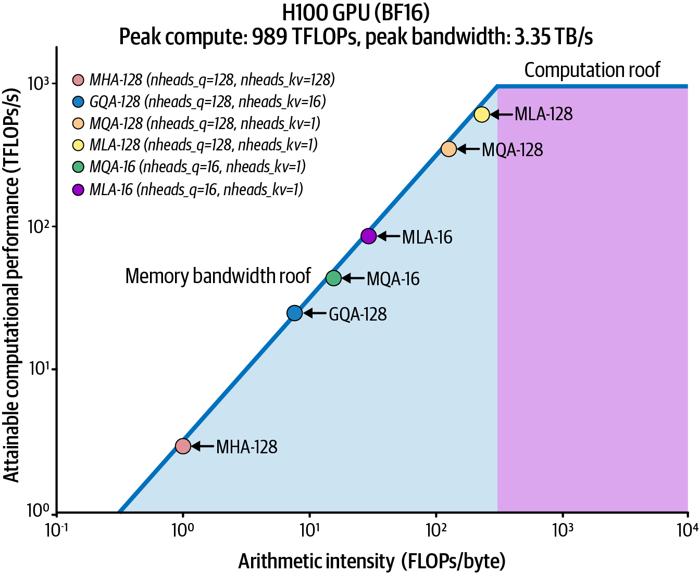
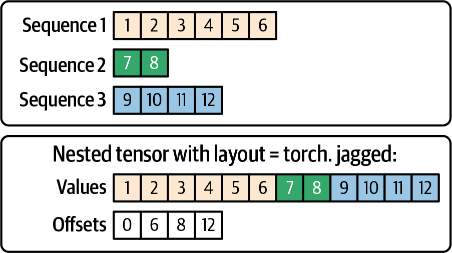
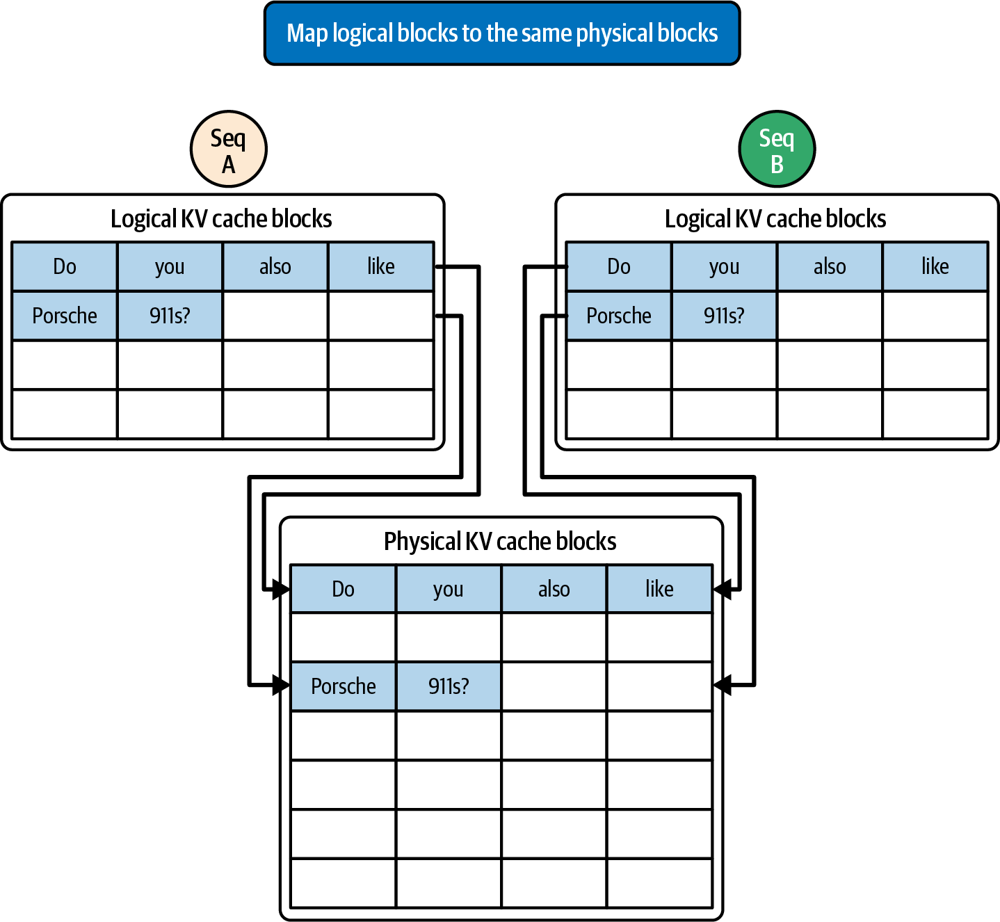
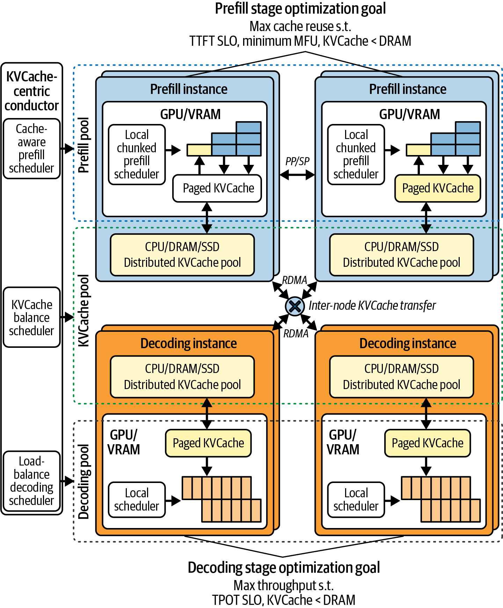
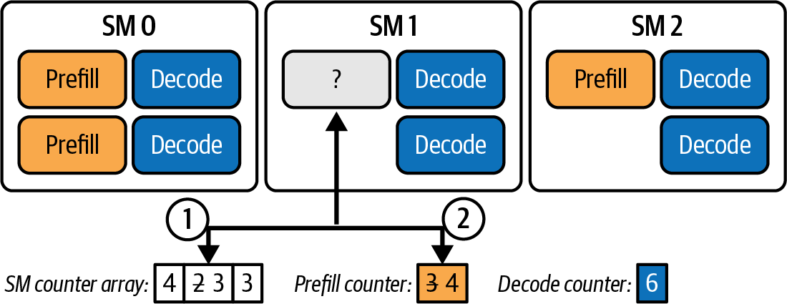
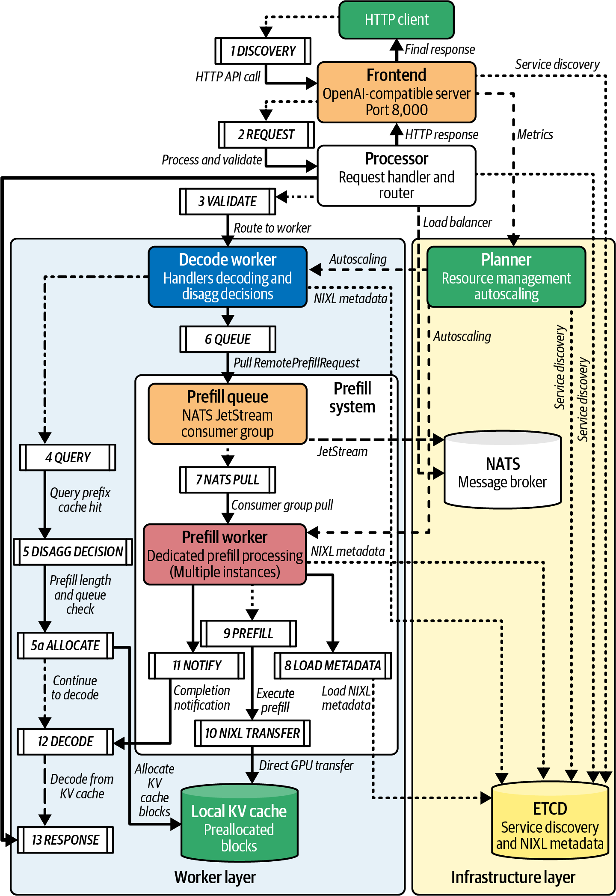
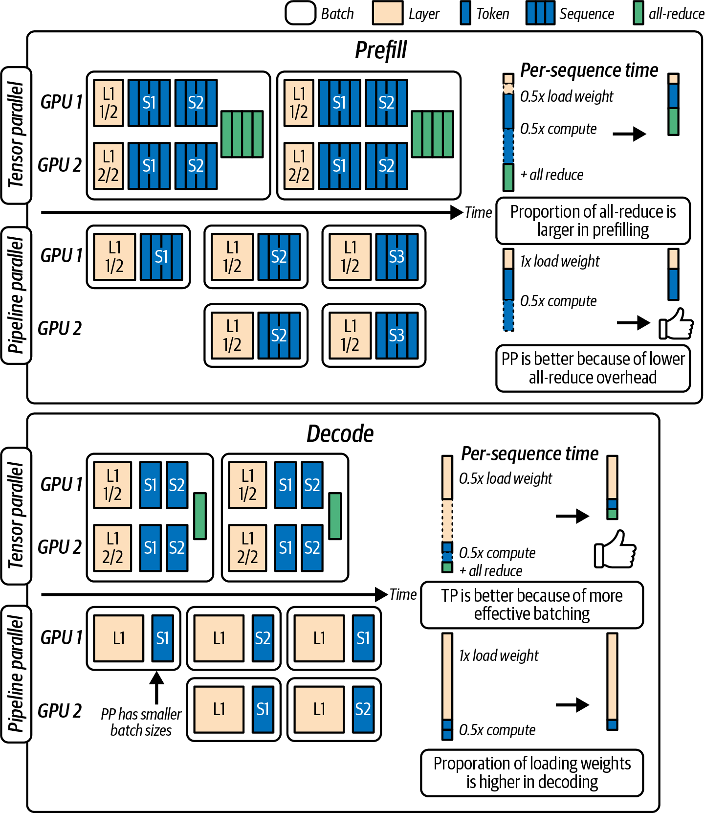
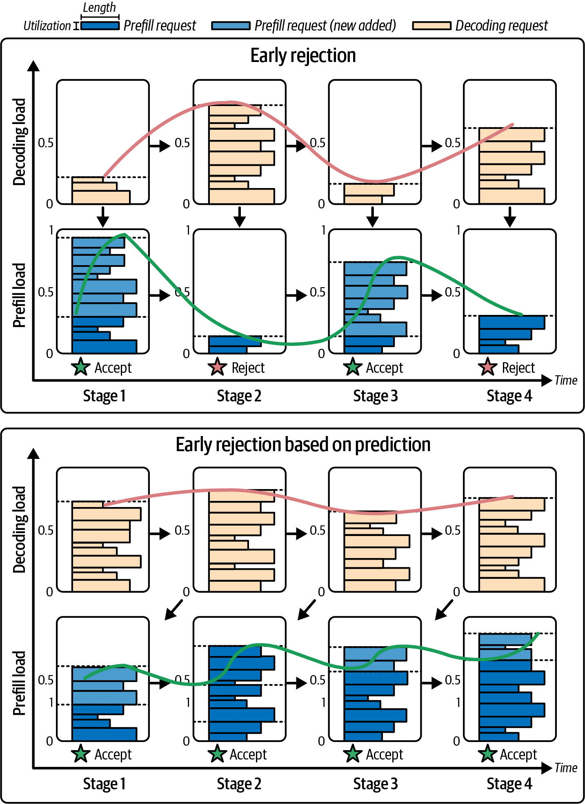
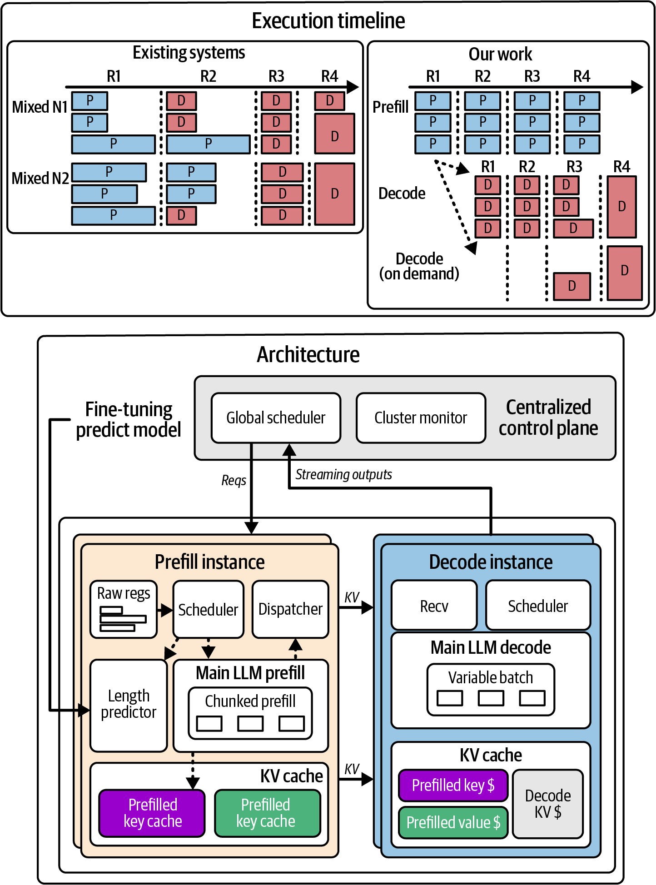
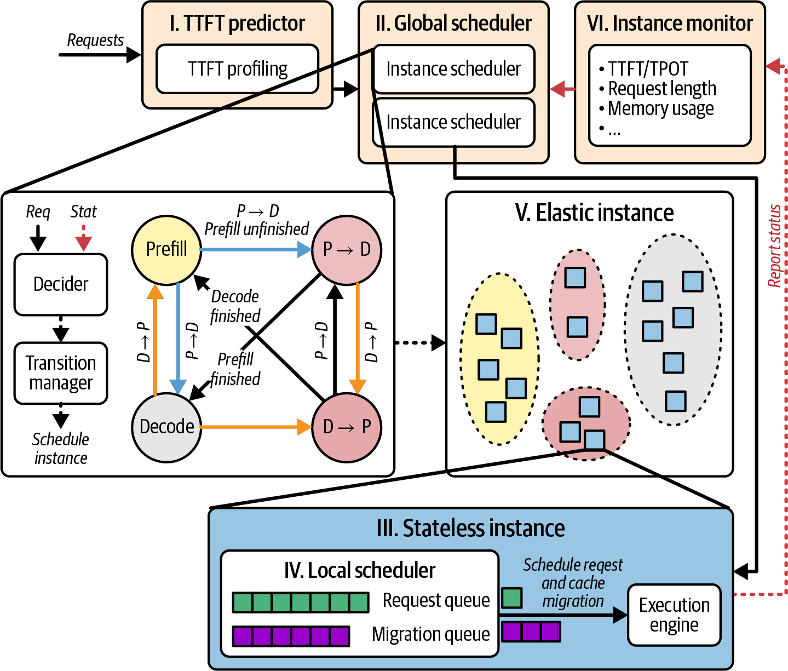

# 第18章 高级Prefill-Decode和KV缓存调优 (Advanced Prefill-Decode and KV Cache Tuning)

本章建立在第17章的基础上，深入探讨推理prefill和decode阶段的高级优化。我们将在高级扩展策略的基础上，介绍底层技术，包括单decode"超级内核"（mega kernels）、智能KV缓存调优和跨GPU共享、提示状态的快速GPU到GPU传输、自适应资源调度，以及prefill和decode工作节点之间的动态路由。

> This chapter builds upon Chapter 17 and dives deeper into advanced optimizations for the inference prefill and decode phases. We'll build upon the high-level scaling strategies and cover low-level techniques, including single decode "mega kernels," intelligent KV cache tuning and sharing across GPUs, fast GPU-to-GPU transfer of the prompt state, adaptive resource scheduling, and dynamic routing between prefill and decode workers.

我们还将重点介绍硬件和软件创新，它们提供了新的性能和效率水平。通过应用这些技术，您可以显著减少decode延迟，提高每GPU吞吐量，并在大规模场景下满足严格的延迟SLO。

> We will also highlight hardware and software innovations, which provide new levels of performance and efficiency. By applying these techniques, you can significantly reduce decode latency, improve throughput per GPU, and meet strict latency SLOs at scale.

## 优化的Decode内核 (Optimized Decode Kernels)

到目前为止，我们一直专注于高级系统和集群优化策略。在增加超大规模推理时需要考虑的另一组技术是底层内核和内存管理调优--特别是对于decode阶段。

decode阶段是分布式的，通常受内存限制。这促使研究人员和从业者尽可能快地优化decode阶段--并针对特定硬件进行调优。该领域的两个显著创新是FlashMLA（DeepSeek）、ThunderMLA（Stanford）和FlexDecoding（PyTorch）。这些技术专门针对LLM工作负载中常见的可变序列场景下transformer的多头注意力效率进行优化。接下来让我们逐一介绍。

> Until now, we have been focused on high-level system and cluster optimization strategies. Another set of techniques to consider when increasing ultrascale inference is low-level kernel and memory management tuning-especially for the decode phase. The decode phase is distributed and often memory bound. This has motivated researchers and practitioners to make the decode phase as fast as possible-and tuned for specific hardware. Two notable innovations in this space are FlashMLA (DeepSeek), ThunderMLA (Stanford), and FlexDecoding (PyTorch). These specifically target the transformer's multihead attention efficiency during decode in variable-sequence scenarios common in LLM workloads. Let's cover each of these next.

### FlashMLA (DeepSeek)

Flash Multi-Latent Attention，即FlashMLA，是DeepSeek推出的优化解码内核。它专门针对单token解码步骤，这本质上是用于生成下一个token的transformer层的前向传递。FlashMLA通过融合操作和更好地利用GPU内存层次结构来加速解码。

FlashMLA（decode）之于推理，就像FlashAttention（prefill）之于训练。它减少了内存访问开销和延迟。使用FlashMLA，与标准内核相比，您可以显著减少decode阶段的延迟。

FlashMLA通过将多个注意力操作融合为一个来提高算术强度。这样，它可以在一次融合内核启动中处理多个头和多个时间步。这通过让数学单元保持忙碌（尽管批次大小较小）来提高decode期间的GPU利用率。

图18-1显示了在Hopper H100 GPU上，MLA与其他注意力实现（如分组查询注意力（GQA）和多查询注意力（MQA））相比在算术强度方面的改进。（注：Blackwell通过更高的TFLOPs和HBM带宽将两条roofline都向上移动。）



> Figure 18-1. MLA approaches the compute-bound regime (measured on the NVIDIA Hopper H100 architecture)

FlashMLA的推出意义重大，因为它表明decode阶段的瓶颈--内存带宽和内核启动开销--可以被减少--即使是在次优的GPU硬件上。它减少了单独的GPU内核启动次数，并优化了内存访问模式--在受限硬件上为解码任务挤出尽可能多的性能。

> The introduction of FlashMLA was significant because it showed that the decode phase's bottlenecks, memory bandwidth, and kernel-launch overhead can be reduced-even on suboptimal GPU hardware. It reduced the number of separate GPU kernel launches and optimized memory access patterns-squeezing as much performance out of constrained hardware as possible for decoding tasks.

DeepSeek开源的FlashMLA实现已经可用，并正在被采用。SGLang和vLLM都为DeepSeek模型提供一流支持。因此，您应该评估FlashMLA以在不改变高级架构的情况下增加每token解码吞吐量。

> DeepSeek's open sourced FlashMLA implementation is available and seeing adoption. SGLang and vLLM both provide first-class support for DeepSeek models. As such, you should evaluate FlashMLA to increase per-token decode throughput without changing higher-level architecture.

由于DeepSeek开源的FlashMLA已集成到现代推理服务系统中，您应该探索它作为增加每个decode工作节点吞吐量的方式--或减少每token延迟--而无需任何高级架构更改。

> Since DeepSeek's open sourced FlashMLA is integrated into modern inference serving systems, you should explore it as a way to increase the throughput of each decode worker-or reduce latency per token-without any higher-level architectural change.

### ThunderMLA (Stanford)

在FlashMLA的基础上，斯坦福大学的研究人员推出了ThunderMLA，这是一个完全融合的注意力解码"超级内核"，专注于解码和调度（而不是融合完整的前馈块）。这个"超级内核"通过将多次内核启动合并为一次，以及合并中间内存写入，减少了启动开销和尾部效应。ThunderMLA报告称，在不同工作负载下，解码吞吐量比FlashMLA快20-35%。

> Building on FlashMLA, researchers at Stanford introduced ThunderMLA, a completely fused attention decode "megakernel" that focuses on decoding and scheduling (rather than fusing the full feed-forward block.) This "megakernel" reduces launch overhead and tail effects by combining multiple kernel launches into one-as well as consolidating intermediate memory writes. ThunderMLA reports 20-35% faster decode throughput compared to FlashMLA across different workloads.

ThunderMLA的关键思想是，当解码不同长度的序列时，使用细粒度调度和融合操作可以避免尾部效应，即一些序列较早完成，而其他序列让GPU部分空闲。ThunderMLA即使某些解码流较早完成，也能让GPU保持忙碌。它通过使用融合方法动态打包和处理剩余流来实现这一点。

> The key idea of ThunderMLA is that when decoding sequences of different lengths, using fine-grained scheduling and fused operations can avoid the tail effect in which some sequences finish earlier while others leave the GPU partially idle. ThunderMLA keeps the GPU busy even if some decode streams complete earlier. It does this by dynamically packing and processing the remaining streams using its fused approach.

这些优势在具有更大L2缓存和更快注意力原语的现代GPU上更加明显。值得注意的是，现代NVIDIA GPU还为FP8和FP4提供Transformer Engine支持（以及FP6，尽管我们在本文中主要关注FP8/FP4格式，因为FP6在现有AI框架和工具中未被广泛使用）。结合更高的内存带宽，Tensor Core让ThunderMLA等内核能够更接近硬件极限运行。在现代GPU上，由于这些架构进步，ThunderMLA实现了更低的每token延迟。

> These benefits are amplified on modern GPUs with larger L2 caches and faster attention primitives. Notably, modern NVIDIA GPUs also provide Transformer Engine support for FP8 and FP4 (and FP6, although we focus mostly on FP8/FP4 formats in this text since FP6 is not widely used in existing AI frameworks and tools). Combined with higher memory bandwidth, the Tensor Cores let kernels like ThunderMLA operate much closer to hardware limits. On modern GPUs, ThunderMLA achieves even lower latency per token due to these architectural advances.

### FlexDecoding (PyTorch)

在第14章中，我们讨论了PyTorch的FlexAttention，它让您为注意力中的任意稀疏模式JIT编译融合内核，包括局部窗口、块稀疏模式等--所有这些都无需编写自定义CUDA。在底层，TorchInductor + OpenAI的Triton生成一个融合内核，仅计算该模式允许的查询-键对。Triton在给定硬件上有利时自动应用性能优化技术，如warp特化和异步拷贝。但是，您也可以通过配置num_consumer_groups等参数来进一步调整triton.Config。

> In Chapter 14, we discussed PyTorch's FlexAttention, which lets you JIT-compile fused kernels for arbitrary sparsity patterns in attention, including local windows, block-sparse patterns, etc.-all without writing custom CUDA. Under the hood, TorchInductor + OpenAI's Triton generate a fused kernel that computes only the allowed query-key pairs for that pattern. Triton automatically applies performance optimization techniques like warp specialization and asynchronous copies when beneficial on the given hardware. However, you can also tune triton.Config to further customize by configuring num_consumer_groups for example.

FlexDecoding是`torch.nn.attention.flex_attention`的解码后端。FlexDecoding还让您就地管理KV，并像FlexAttention一样支持掩码和偏置。具体来说，FlexDecoding为decode阶段（Q_len=1）编译专门的内核，在增长的KV缓存上进行注意力计算。

> FlexDecoding is the decoding backend of torch.nn.attention.flex_attention. FlexDecoding also lets you manage KV in place and supports masks and biases just like FlexAttention. Specifically, FlexDecoding compiles a specialized kernel for the decode phase (Q_len=1) attending over a growing KV cache.

在运行时，FlexDecoding实现选择专门的解码内核，并在多个解码步骤中重用它。这有助于在形状和数据类型保持兼容时最小化开销--大大加速长序列LLM推理。

> At runtime, the FlexDecoding implementation picks the specialized decode kernel and reuses it across multiple decode steps. This helps to minimize overhead when shapes and dtypes remain compatible-greatly speeding up long-sequence LLM inference.

对于稳定、延迟关键的解码，一旦重编译得到控制，优先使用`torch.compile(mode="max-autotune")`。保持捕获边界狭窄（每层或注意力块），以减少由不规则批处理引起的图失效。prefill和decode优先使用Transformer Engine FP8（MXFP8）。当精度允许且性能提高时，考虑FP4（NVFP4）。截至本文撰写时，FP4支持仍在成熟中，短期内可能表现不如8位和16位格式。继续设置`torch.set_float32_matmul_precision("high")`以在剩余的FP32操作上启用TF32回退。FlexAttention的解码后端支持常见的性能增强，包括分组查询注意力（GQA）和PagedAttention。

> Prefer torch.compile(mode="max-autotune") for stable, latency-critical decode once recompilations are under control. Keep the capture boundary narrow (per-layer or attention block) to reduce graph invalidations from ragged batching. Prefer Transformer Engine FP8 (MXFP8) for prefill and decode. Consider FP4 (NVFP4) when accuracy permits and performance increases. As of this writing, FP4 support is still maturing and can underperform 8-bit and 16-bit formats in the near-term. Continue to set torch.set_float32_matmul_precision("high") to enable TF32 fallback on remaining FP32 ops. FlexAttention's decode backend supports common performance enhancements including grouped-query attention (GQA) and PagedAttention.

FlexAttention和FlexDecoding的一个关键特性是支持嵌套锯齿布局张量（NJT）。这些允许在解码期间对可变长度序列（LLM工作负载中常见）进行不规则批处理。图18-2显示了各种序列的锯齿张量表示。



> Figure 18-2. Ragged batch as a nested jagged tensor (offsets); three sequences (top) represented as a single nested jagged tensor representation with offsets (bottom); prefer PyTorch NJT for decode-time batching

此外，FlexDecoding支持偏置项，并通过使用块掩码转换接口将逻辑块映射到物理缓存布局来与PagedAttention集成。这将逻辑KV块分散到物理缓存布局中--无需创建额外副本，如图18-3所示。

> Additionally, FlexDecoding supports bias terms and integrates with PagedAttention by using a block mask conversion interface that maps logical blocks to the physical cache layout. This scatters logical KV blocks into the physical cache layout-without creating extra copies, as shown in Figure 18-3.

FlexDecoding利用捕获的张量在每次迭代期间改变某些掩码或偏置值--无需重新编译。它与PagedAttention集成。要使用全局KV缓存（如vLLM LMCache），将缓存的页表映射到FlexAttention的BlockMask。这将动态地将逻辑KV页转换为物理内存地址。

> FlexDecoding leverages captured tensors to vary certain mask or bias values during each iteration-without requiring a recompile. And it integrates with PagedAttention. To use a global KV cache such as vLLM LMCache, map the cache's page table to FlexAttention's BlockMask. This will translate logical KV pages into physical memory addresses on the fly.



> Figure 18-3. PagedAttention scatters logical KV blocks into physical KV blocks for optimal cache reuse between sequences; align block sizes with LMCache page size-larger pages (e.g., 64-128 tokens) reduce RDMA overhead in disaggregated setups

使用FlexDecoding，开发人员拥有完全的Python级灵活性来定义自定义注意力稀疏模式。这对于MoE模型推理特别有用。FlexDecoding允许您在无需编写任何自定义CUDA内核的情况下实现接近最优的性能。本质上，它允许任意注意力模式像密集注意力模式一样被优化。随着新推理技术的出现，这变得更加有价值。

> With FlexDecoding, developers have full Python-level flexibility for custom attention sparsity patterns. This is particularly useful for MoE model inference. FlexDecoding allows you to achieve near-optimal performance without requiring you to write any custom CUDA kernels. Essentially, it allows arbitrary attention patterns to be optimized similarly to dense attention patterns. This becomes even more valuable as new inference techniques emerge.

许多这些功能，如解码的融合注意力以及对PyTorch嵌套锯齿张量（NJT）批处理的支持，都可在核心PyTorch库中使用。这使得对于典型模式，自定义融合变得不那么必要。

> Many of these capabilities, such as fused attention for decoding and support for PyTorch's nested jagged tensors (NJT) batching, are available in the core PyTorch library. This makes custom fusion less necessary for typical patterns.

对于LLM工作负载中常见的不规则序列批处理，优先使用NJT布局。

> Prefer the NJT layout when batching ragged sequences common in LLM workloads.

这些内核级进步是高度技术性的，充分利用了GPU、网络和内存的全部能力。这些软件优化可以显著提高解码性能--即使在相同的硬件上。

> These kernel-level advancements are highly technical and leverage the full power of the GPU, network, and memory. These software optimizations can significantly improve decode performance-even on the same hardware.

在设计超大规模系统时，如果可能，您应该整合这些优化的内核。务必使用带有基于硬件的CUDA跟踪的Nsight Systems验证重叠和内核效率。此外，使用Nsight Compute获取特定的内存和链路指标。

> When designing an ultrascale system, you should incorporate these optimized kernels, if possible. Be sure to verify overlap and kernel efficiency using Nsight Systems with hardware-based CUDA traces. Additionally, use Nsight Compute for specific memory and link metrics.

启用某些高级内核可能需要安装自定义库或启用专门的CUDA内核--特别是对于较新的技术。但是，这些技术通常在发布后不久就得到PyTorch和流行推理引擎的支持。即使您确实需要安装自定义资源，这项工作也是值得的，因为它将直接转化为更低的延迟和更少的decode工作节点池中的GPU。

> Enabling some of these advanced kernels might require installing a custom library or enabling a specialized CUDA kernel-especially for newer techniques. However, these techniques are typically supported by PyTorch and the popular inference engines soon after they are released. Even if you do need to install custom resources, the effort is worthwhile since it will directly translate to lower latency and fewer GPUs in the decode worker pool.

## 调优KV缓存利用和管理 (Tuning KV Cache Utilization and Management)

分离要求您将KV缓存视为集群中的一等共享资源。由于KV缓存现在可以存在更长时间并在节点之间移动，高性能推理系统改进了KV缓存的存储和共享方式。

> Disaggregation requires that you treat the KV cache as a first-class shared resource across the cluster. Since KV caches can now live longer and move between nodes, high-performance inference systems have improved how the KV cache is stored and shared.

特别是，分布式KV缓存池和跨请求的前缀重用成为强大的技术。此外，关注新GPU和HBM代际带来的内存带宽改进也很重要。让我们在提高KV缓存性能的背景下逐一讨论。

> In particular, distributed KV cache pools and prefix reuse across requests become powerful techniques. Additionally, it's important to keep an eye on the memory bandwidth improvements with newer GPU and HBM generations. Let's discuss each of these in the context of improving KV cache performance.

### 分离式KV缓存池 (Disaggregated KV Cache Pool)

与其让每个GPU仅存储其当前正在服务的请求的KV，分离式KV缓存池将KV存储与单个GPU解耦。相反，它将数据分散到整个集群的GPU内存中。

> Instead of having each GPU store only the KV for the requests it's currently serving, a disaggregated KV cache pool decouples KV storage from individual GPUs. Instead, it spreads the data across GPU memory throughout the cluster.

该池还可以卸载到CPU内存，包括Grace Blackwell和Vera Rubin平台的统一CPU和GPU内存。它也可以卸载到持久存储，如NVMe SSD。

> The pool can also offload to CPU memory, including the unified CPU and GPU memory of Grace Blackwell and Vera Rubin platforms. It can also offload to persistent storage like NVMe SSDs.

使用分离式KV缓存池，当prefill计算提示的KV张量--或decode扩展KV张量时--KV块以分布式方式存储在许多计算节点上。这如图18-4所示，改编自分离式KV池的研究工作。

> With a disaggregated KV cache pool, when prefill calculates the prompt's KV tensors-or decode extends the KV tensors-the KV blocks are stored in a distributed manner across many compute nodes. This is shown in Figure 18-4, adapted from disaggregated KV pooling research efforts.



> Figure 18-4. Disaggregated (distributed) KV cache pool (source: https://oreil.ly/2xtK-)

考虑一个非常长的250,000 token上下文（例如，具有多轮对话的聊天会话），使用700亿参数的transformer模型，具有80层和32个头，每个头的维度为128。这会为每个token生成巨大的KV缓存占用空间。

> Consider a very long 250,000-token context (e.g., a chat session with many turns) using a 70 billion-parameter transformer model with 80 layers and 32 heads in which each head is dimension 128. This generates a huge KV cache footprint per token.

每个token生成一个长度等于模型隐藏维度（num_heads x head_dim）的键和值向量。让我们假设我们的模型为4,096。这导致每层8,192个浮点数。对80层求和，这会为每个token创建655,360个浮点数的KV数据。让我们假设16位精度，或每个浮点数2字节。这大约需要每token 1.31 MB。

> Each token generates a key and value vector of length equal to the model's hidden dimension (num_heads x head_dim). Let's assume this is 4,096 for our model. This results in 8,192 floats per layer. Summing across 80 layers, this creates 655,360 floats of KV data per token. Let's assume 16-bit precision, or 2 bytes per float. This is roughly 1.31 MB needed per token.

将其扩展到250,000个token会产生约328 GB--仅用于KV数据！

> Scaling this to 250,000 tokens produces about 328 GB-just for the KV data!

这些计算基于大型模型的每token KV大小。这解释了为什么FP8 KV缓存在vLLM等引擎中被广泛采用，以减少占用空间并增加批处理机会。

> These calculations are based on per-token KV sizes for large models. This shows why FP8 KV caches are widely adopted in engines such as vLLM to reduce footprint and increase batching opportunities.

假设我们将KV缓存量化到FP8并使用选择性层缓存等技术，我们可以将这个250,000 token提示的占用空间减少到大约100-150 GB范围。单个GPU可能没有容量容纳所有token的KV以及它需要保存的其他所有内容，例如模型权重等--特别是当多轮对话继续时。因此，系统需要截断上下文--或者导致对早期token进行昂贵的KV重新计算。

然而，使用分离式KV池，上下文的较旧部分的KV可以从GPU中驱逐并推送到分布在集群中的KV缓存池--以及CPU DRAM或NVMe存储中。然后在需要时将数据取回到GPU内存中。

分离式KV缓存池实现了一个多层内存层次结构，其中GPU设备内存保存活动KV缓存，而CPU主机RAM（或NVMe存储）作为溢出后备存储。

> Assuming we quantize the KV cache down to FP8 and use techniques like selective-layer caching, we can reduce this footprint down to maybe the 100-150 GB range for this 250,000-token prompt. A single GPU will likely not have capacity for all of the tokens' KV along with everything else it needs to hold, such as model weights, etc.-especially as the multiturn conversation continues. As such, the system would need to truncate context-or cause expensive KV recomputation on earlier tokens. With a disaggregated KV pool, however, older parts of the context's KV can be evicted from the GPU and pushed out to the KV cache pool spread across the cluster-and in CPU DRAM or NVMe storage. The data is then fetched back into GPU memory when it's needed. A disaggregated KV cache pool implements a multitier memory hierarchy in which GPU device memory holds the active KV cache while the CPU host RAM (or NVMe storage) serves as the overflow backing store.

现代推理引擎可以选择将KV缓存卸载到CPU内存或NVMe。这有效地虚拟化了GPU内存，就像操作系统的虚拟内存子系统一样。

这种设计通过在GPU内存和KV缓存池之间异步分页KV块来实现超长上下文--假设有良好的通信-计算重叠，正如本书所讨论的。

此外，通过将请求状态与单个GPU解耦，系统可以使用全局KV缓存池在集群中的多个节点之间动态分片KV数据，以自适应地平衡负载。这简化了扩展并改善了大型推理集群中的故障隔离。

由于任何decode节点都可以访问全局KV池，因此任何decode节点都可以参与解码任何请求（如果由于故障转移或负载均衡需要）。这为调度器增加了灵活性，因为它可以选择最接近相关KV缓存块位置的decode节点。

如果某个前缀的一些KV块缓存在服务器A的DRAM中，在服务器A上调度解码可能更快，因为它可以快速将它们拉入其GPU。这与服务器B形成对比，后者必须通过网络获取KV块。

这描述了分布式系统的经典最佳实践：选择最接近被计算数据的计算节点。这样，系统最小化了昂贵的数据移动。

> Modern inference engines can choose to offload KV cache to CPU memory or NVMe. This effectively virtualizes GPU memory much like an OS's virtual memory subsystem. This design allows for ultralong contexts by asynchronously paging KV blocks between GPU memory and the KV cache pool without stalling the compute pipelines-assuming good communication-computation overlap, as discussed throughout this book. Additionally, by decoupling request state from individual GPUs, the system can use the global KV cache pool to dynamically shard KV data across multiple nodes in the cluster to adaptively balance the load. This simplifies scaling and improves fault isolation in large inference clusters. And since any decode node can access the global KV pool, then any decode node can participate in decoding any request, if needed due to failover or load balancing. This adds flexibility for the scheduler since it can choose a decode node closest to where the relevant KV cache blocks are located. If some KV blocks of a prefix are cached in DRAM on server A, it might be faster to schedule the decode on server A since it can quickly pull them into its GPU. This is in contrast to server B, which would have to fetch the KV blocks over the network. This describes a classic distributed-systems best practice of choosing a compute node that is closest to the data being computed. This way, the system minimizes expensive data movement.

高效的KV缓存调度器可以查看池中KV块的分布--以及网络拓扑--并相应地分配prefill和decode任务。因此，prefill节点可以将KV数据放入实现为集群范围内可访问的分布式内存空间的池中。

当KV缓存位于集群端共享内存空间中时，任何decode节点都可以检索数据。这避免了每次都必须为直接的prefill到decode传输进行调度。

这增加了一些额外的开销，因为需要额外的一跳来从池中检索KV数据，但它提供了更多的灵活性，因为所有decode节点都可以访问所有KV缓存数据。这也意味着没有直接从特定prefill接收数据的decode节点仍然可以在需要时从池中访问KV数据。

如果decode节点崩溃--或者请求由于某种原因需要在中途移动--KV数据不会丢失。数据存在于池中，另一个节点可以使用保存的KV从中断的地方继续。这提高了容错性。

全局KV缓存池还提供跨请求的缓存持久性。这样，如果两个请求共享某个前缀，该前缀的KV可以计算一次并在集群中重用--即使请求最终在不同的decode服务器上。

简而言之，分离式KV缓存池用内存（或较冷的存储）换取计算。通过存储更大的KV缓存，系统可以在许多场景中避免重新计算KV数据。这种方法利用了一个事实：重用数据--即使从DRAM或SSD--通常比重复重新计算具有二次时间复杂度O(N²)的大型注意力矩阵乘法更便宜。

> An efficient KV cache scheduler can look at the distribution of KV blocks in the pool-in addition to the network topology-and assign prefill and decode tasks accordingly. As such, a prefill node can place KV data into a pool implemented as a distributed memory space accessible across the cluster. With the KV cache in a cluster-side shared-memory space, any decode node can retrieve the data. This avoids having to schedule for direct prefill-to-decode transfers every time. This adds a bit of extra overhead due to an extra hop to retrieve KV data from the pool, but it allows more flexibility because all decode nodes have access to all KV-cached data. It also means that a decode node that didn't directly receive data from a particular prefill can still access the KV data from the pool, if needed. If a decode node crashes-or a request needs to move mid-generation for whatever reason-the KV data isn't lost. The data lives in the pool, and another node can pick it up and continue where it left off using the saved KV. This improves fault tolerance. A global KV cache pool also provides cache persistence across requests. This way, if two requests share some prefix, the KV for that prefix can be computed once and reused across the cluster-even if the requests end up on different decode servers. In short, a disaggregated KV cache pool trades memory (or colder storage) for compute. By storing a larger KV cache, the system can avoid recomputing KV data in many scenarios. This approach leverages the fact that reusing data-even from DRAM or SSD-is often cheaper than repeatedly recomputing large attention matrix multiplications with quadratic time complexity, O(N2).

### KV缓存重用和前缀共享 (KV Cache Reuse and Prefix Sharing)

如前所述，对于共享公共前缀的提示，跨请求重用缓存的KV数据是有益的。这种情况在多轮对话、共享系统提示和附加文档等形式中相当常见。

系统可以为该前缀存储KV输出并直接重用它们，而不是为每个请求重新计算该前缀的transformer注意力输出。本质上，这跳过了输入那部分的prefill计算，节省了大量时间和GPU周期。

> As mentioned, it's beneficial to reuse cached KV data across requests for prompts that share a common prefix. This scenario arises fairly often in the form of multiturn conversations, shared system prompts, and attached documents. Instead of recomputing the transformer attention outputs for that prefix for every request, the system can store the KV outputs for the prefix and reuse them directly. Essentially, this skips the prefill computation for that portion of the input, which saves a lot of time and GPU cycles.

以KV缓存为中心的调度器在分配工作时，会通过查看"前缀缓存命中长度"（即此提示有多少token已存在于缓存池中）来考虑前缀缓存命中。在实践中，如果新请求到来，其前N个token与KV池中的某个缓存前缀匹配，系统可以决定重用该KV数据。

vLLM使用其PagedAttention机制通过KV"页"的全局哈希表实现自动前缀缓存。在这里，每个唯一的16 token上下文块都有一个哈希值。如果新请求需要与存储块（通过哈希）匹配的前缀，它可以直接复制这些KV张量而不是重新计算。

如果相同的上下文再次出现，系统从内存中提供它。本质上，它将上下文的KV视为可以通过哈希按内容查找的可重用数据。实现通常维护一个全局"提示树"来管理这些缓存上下文并在必要时驱逐它们。这优化了最频繁重用的前缀。

> A proper KV-cache-centric scheduler takes into account prefix cache hits by looking at the "prefix cache hit length," or how many tokens of this prompt are already present in the cache pool, when assigning work. In practice, if a new request comes and its first N tokens match some cached prefix in the KV pool, the system can decide to reuse that KV data. vLLM implements automatic prefix caching using a global hash table of KV "pages" using its PagedAttention mechanism. Here, each unique 16-token block of context has a hash. If a new request needs a prefix that matches a stored block (by hash), it can directly copy those KV tensors instead of recomputing. If the same context appears again, the system serves it from memory. In essence, it treats the KV of a context as reusable data that can be looked up by content using hashing. Implementations typically maintain a global "prompt tree" to manage these cached contexts and evict them when necessary. This optimizes for the most frequently reused prefixes.

有效KV重用的关键是识别相同或重叠的前缀。通常，系统为简单起见专注于精确匹配，使得如果前N个token完全匹配，它们重用该块。合并部分前缀重叠更复杂，因为您需要以某种方式合并缓存，这并不总是直截了当的。因此，典型的缓存使用精确前缀缓存。

然而，存在一个权衡。无限期存储许多用户的KV缓存会消耗大量内存。系统必须为KV块实现LRU等驱逐策略，以丢弃不太可能被重用的缓存。这为新缓存释放空间。调度器还可以根据重用可能性决定保留哪些缓存。目标是在内存约束内最大化缓存命中。

如果某个prefill节点已经在其本地GPU内存或本地DRAM缓存中持有所需KV的一部分，将请求路由到该节点以最小化数据传输可能是有益的。这是数据感知调度的一个例子，其中它将计算发送到数据所在的位置，而不是总是将数据拉到任何有计算可用的地方。

这类似于分布式系统中的位置感知调度。在我们之前的路由讨论中，我们触及了这一点。如果可能，您应该将请求路由到生成其前缀的服务器。这最大化了缓存命中的可能性。

> A key to effective KV reuse is identifying identical or overlapping prefixes. Usually, systems focus on exact matches for simplicity such that if the first N tokens match exactly, they reuse that chunk. Combining partial-prefix overlaps is more complex since you need to somehow merge caches, which isn't always straightforward. So typical caching uses exact prefix caching. There is a trade-off, however. Storing many users' KV caches indefinitely can consume a lot of memory. A system must implement eviction policies like LRU for KV blocks to drop caches that are unlikely to be reused. This frees space for new ones. The scheduler might also decide which caches to keep based on likelihood of reuse. The idea is to maximize cache hits within memory constraints. If a certain prefill node already holds a portion of the KV needed in its local GPU memory or local DRAM cache, it might be beneficial to route the request to that node to minimize data transfer. This is an example of data-aware scheduling in which it sends the compute to where the data is, rather than always pulling data to wherever compute is available. This is analogous to locality-aware scheduling in distributed systems. In our earlier routing discussion, we touched on this. If possible, you should route a request to the server that generated its prefix. This maximizes the likelihood of a cache hit.

在分离的更广泛背景下，前缀缓存通过跨许多请求拥有KV的统一视图来支持，并可能将其存储在可共享的地方，如全局池。这与孤立的每请求或每节点方法形成对比。

这也有助于减少分离可能产生的重新计算开销，如果相同的提示在不同时间到达不同的节点。使用全局KV存储或协调缓存，即使用户的请求到达不同的decode服务器，它们也可以从彼此的缓存工作中受益。

> In the broader context of disaggregation, prefix caching is supported by having a unified view of KV across many requests and possibly storing it in a shareable place like the global pool. This is in contrast to a siloed per-request or per-node approach. This also helps reduce the overhead of recomputation that disaggregation might otherwise incur if the same prompt goes to different nodes at different times. With a global KV store or coordinated caching, even if a user's requests hit different decode servers, they can benefit from each other's cached work.

### 优化的KV缓存内存布局 (Optimized KV Cache Memory Layout)

底层创新的另一个领域是优化KV缓存内存布局。KV缓存存储每个序列中所有过去token的键和值，对于许多并发解码流可能变得巨大，因为每个流使用的内存大致与`num_layers x 2 x sequence_length x d_head`成正比。

分层缓存等技术很有用，因为并非所有KV对都需要始终保持在GPU内存中。KV缓存的较旧部分可以交换到CPU--甚至压缩。

由于我们强调保持解码延迟低，大多数设计将活动KV缓存保持在GPU内存中以快速访问。在这种情况下，您可以调整内存的布局和访问方式。

DeepSeek的FlashMLA对KV缓存进行分页，并以固定大小的块（页）分配缓存，以便活动序列可以进行连续内存访问。这减少了缓存未命中和DRAM流量。

此外，如果提示的前缀将不再被关注，例如因为上下文窗口已移动，某些系统会实现前缀压缩。在这种情况下，KV缓存管理器可能会丢弃或压缩这些KV条目。这在长对话中更相关，因为上下文窗口会滑动。但它可以为极长的序列节省内存和带宽。

这种驱逐/压缩技术在模型使用滑动窗口或其他受限注意力模式时是安全的。但是，不应将其应用于在完整内容窗口（或检索钩子）上保留完整注意力的层，除非经过仔细评估。

> Another area of low-level innovation is optimizing the KV cache memory layouts. The KV cache, which stores keys and values for all past tokens in each sequence, can become huge for many concurrent decode streams since each stream uses memory roughly proportional to num_layers x 2 x sequence_length x d_head. Techniques like tiered caching are useful since not all KV pairs need to be kept in GPU memory at all times. Older parts of the KV cache can be swapped to CPU-or even compressed. Since we emphasize keeping decode latency low, most designs keep the active KV cache in GPU memory for quick access. In this case, you can tune how the memory is laid out and accessed. DeepSeek's FlashMLA pages KV cache and allocates the cache in fixed-size blocks (pages) so that contiguous memory accesses can happen for active sequences. This reduces cache misses and DRAM traffic. Additionally, some systems implement prefix compression if a prompt's prefix will no longer be attended to because the context window has moved, for instance. In this case, the KV cache manager might drop or compress these KV entries. This is more relevant in long conversations because the context window slides. But it can save memory and bandwidth for extremely long sequences. This eviction/compression technique is safe when the model uses a sliding-window or other restricted-attention pattern. However, it should not be applied to layers that retain full attention over the full content window (or retrieval hooks) without careful evaluation.

另一种称为POD-Attention的技术类似地重新组织注意力计算以减少HBM流量。具体来说，它使用SM感知线程块（或协作线程阵列[CTA]）调度。这实现了运行时操作绑定，动态将在SM上运行的每个CTA分配为执行prefill或decode任务。这如图18-5所示。



> Figure 18-5. SM-aware thread-block (CTA) scheduling to match prefill tasks with decode tasks on SMs to minimize memory movement

因此，不是为每个阶段静态启动单独的内核，而是启动一个足够CTA覆盖两个工作负载的内核。在运行时，每个CTA检查它所在的SM，并使用每SM计数器根据该SM上其他正在运行的内容决定应该运行哪个操作（prefill或decode）。

SM感知调度逻辑尝试在运行时将prefill与decode操作匹配。这避免了内存流量的隔离突发并平滑了资源需求。

具体来说，POD-Attention将prefill和decode工作共置在同一个SM上，以便融合内核可以提高局部性并减少冗余的HBM事务。这最小化了内存移动，最大化了带宽利用率，并平衡了每个SM上的计算受限和内存受限工作负载。通过在相同SM上共置prefill和decode工作并进行适当的SM感知CTA调度以解锁完全重叠，POD-Attention可以将注意力性能提高约29%。

> So rather than statically launching separate kernels for each phase, a single kernel launches enough CTAs to cover both workloads. At runtime, each CTA inspects which SM it's on and uses per-SM counters to decide which operation (prefill or decode) should be run based on what else is running on that SM. The SM-aware scheduling logic tries to match prefill with decode operations at runtime. This avoids isolated bursts of memory traffic and smooths out resource demands. Specifically, POD-Attention colocates prefill and decode work on the same SM so the fused kernel can improve locality and reduce redundant HBM transactions. This minimizes memory movement, maximizes bandwidth utilization, and balances compute-bound and memory-bound workloads on each SM. POD-Attention can improve attention performance by up to about 29% by colocating prefill and decode work on the same SMs with proper SM-aware CTA scheduling to unlock full overlap.

POD-Attention的动态绑定将硬件的CTA-SM分配与软件的CTA角色分配（prefill或decode）解耦。这种创新表明越来越关注硬件和软件协同设计，以最小化内存移动并充分利用系统性能。

> POD-Attention's dynamic binding decouples the hardware's CTA-SM assignment from the software's CTA-role assignment-either prefill or decode. This type of innovation shows a growing focus on hardware and software codesign to minimize memory movement and get the most out of your system's performance.

### GPU和CPU-GPU超级芯片改进 (GPU and CPU-GPU Superchip Improvements)

您还应该考虑新硬件中的内存带宽改进。更高的内存带宽和更大的L2缓存直接有利于内存受限的decode阶段的性能。

NVIDIA的Grace Blackwell GB200 NVL72系统是一个机架级平台，具有36个Grace CPU和72个Blackwell GPU，允许单个逻辑解码单元拥有数十TB的KV缓存内存。这种硬件具有约30 TB的统一内存，非常适合将非常大的上下文保持在内存中。这些上下文可以达到数百万token的规模。

在这样的平台上，统一内存占用空间很大。然而，对于延迟关键的解码，您仍然希望活动键和值驻留在GPU HBM中。因此，您应该将Grace CPU内存（LPDDR5X，而非HBM）用作较低层缓存或用于非常旧的token。当上下文超过可用HBM时--即使在NVL72这样的系统上--prefill和键值卸载仍然很重要。

简而言之，宏观层面的分离应该与微观层面的优化相结合，以充分实现最大的推理性能。高级解码内核如FlashMLA/ThunderMLA、高效的内存布局（分页缓存等）以及最新的GPU架构将产生高效且可扩展的解码。

> You should also consider memory bandwidth improvements in new hardware. Higher memory bandwidth and larger L2 caches directly benefit the performance of the memory-bound decode phase. NVIDIA's Grace Blackwell GB200 NVL72 system, a rack-scale platform with 36 Grace CPUs and 72 Blackwell GPUs, allows a single logical decode unit with tens of terabytes of memory for KV cache. This hardware, with its ~30 TB of unified memory, is ideal to keep very large contexts in memory. These contexts can be on the order of millions of tokens. With such a platform, the unified memory footprint is large. However, for latency-critical decode, you still want the active keys and values to live in GPU HBM. As such, you should use Grace CPU memory (LPDDR5X, not HBM) as a lower-tier cache or for very old tokens. Prefill and key-value offloading remain important when contexts exceed available HBM-even on a system like the NVL72. In short, disaggregation at a macro level should be paired with microlevel optimizations to fully achieve maximum inference performance. Advanced decode kernels like FlashMLA/ThunderMLA, efficient memory layouts (paged caches, etc.), and the latest GPU architectures will produce efficient and scalable decode.

## Prefill和Decode之间的快速KV缓存传输 (Fast KV Cache Transfer Between Prefill and Decode)

分离式推理的一个关键要求是快速高效地将KV缓存从prefill工作节点传输到decode工作节点。如果这种传输不够快，通过并行化prefill和decode节省的任何时间都可能因等待数据移动而损失。

在本节中，我们将讨论用于最小化传输开销的技术。然后我们将描述系统如何使用高速互连并避免额外的KV拷贝来实现交接。

### KV缓存大小 (KV Cache Size)

Prefill输出主要由所有提示token的KV缓存组成。这可能是大量数据。考虑一个具有L层、每层有h个维度为d的注意力头的模型，以及N个token的提示。KV缓存大小大致为`2 x L x N x (h x d)`，其中因子2用于键和值。

实际大小取决于精度（FP16与INT8等）和模型细节，但它很大。例如，一个40层模型，有16个大小为64的头和1,000个token的提示，会产生约40,000个KV向量。这可能是数百MB的数据。如果token数为5,000，则是5倍大。

如果处理不当，通过网络传输这么大量的数据可能会引入显著的延迟。例如，一种简单的方法可能是在prefill工作节点上将KV拷贝到CPU内存，然后通过TCP发送--甚至将其写入磁盘供decode进程加载。这可能非常慢，对于大型提示可能需要数百毫秒。目标是将传输时间减少到仅几毫秒。这允许prefill和decode真正并行重叠。

实现低延迟KV数据传输时间通常需要将小的PagedAttention块整理成较大的缓冲区，并使用基于GPUDirect RDMA的路径而不是CPU套接字移动它们。

> A key requirement of disaggregated inference is quickly and efficiently transferring the KV cache from the prefill worker to a decode worker. If this transfer isn't fast, any time saved by parallelizing prefill and decode could be lost waiting on data movement. In this section, we discuss the techniques used to minimize transfer overhead. We then describe how systems implement the handoff, using high-speed interconnects and avoiding extra KV copies. Prefill output consists primarily of the KV cache for all prompt tokens. This can be a lot of data. Consider a model with L layers, each with h attention heads of dimension d, and a prompt of N tokens. The KV cache size is roughly 2 x L x N x (h x d), where the factor, 2, is for both keys and values. The actual size depends on precision (FP16 versus INT8, etc.) and model specifics, but it's large. For instance, a 40-layer model with 16 heads of size 64 and a 1,000-token prompt produces on the order of 40,000 KV vectors. This could be hundreds of MB of data. If the number of tokens is 5,000, it's 5x larger. Transferring this amount of data over a network can introduce significant latency if done naively. For instance, a naive approach might be to copy the KV to CPU memory on the prefill worker, then send it over TCP-or even write it to disk for the decode process to load. This could be extremely slow, on the order of hundreds of milliseconds for large prompts. The goal is to reduce the transfer time down to only a few milliseconds. This allows prefill and decode to truly overlap in parallel. Achieving low-latency KV data transfer times typically requires collating small PagedAttention blocks into larger buffers and moving them with GPUDirect RDMA-based paths rather than CPU sockets.

### 零拷贝GPU到GPU传输 (Zero-Copy GPU-to-GPU Transfer)

现代分离式系统使用零拷贝GPU到GPU传输技术。在实践中，这涉及在高速结构上使用远程直接内存访问（RDMA）。例如，您可以使用InfiniBand在机架/节点之间传输--或在单个节点（多GPU）平台内使用NVLink/NVSwitch进行直接GPU内存写入。这些方法直接在GPU之间发送数据，无需通过CPU内存拷贝。

NVIDIA用于推理的高性能GPU到GPU传输库称为NVIDIA Inference Xfer Library（NIXL）。NIXL提供插件架构（例如NVLink、UCX结构、GPUDirect Storage）用于零拷贝GPU↔GPU和GPU↔存储数据移动。

NIXL简化了RDMA风格的传输，允许一个GPU通过可用的高速结构直接写入另一个GPU的内存--例如InfiniBand或基于NVLink的连接。换句话说，prefill GPU可以直接将KV张量注入decode工作节点GPU的内存中。

基于RDMA的协议绕过CPU，充分利用GPU互连带宽。像NVIDIA Dynamo和开源vLLM plus LMCache集成这样的系统依赖NIXL。具体来说，它们使用NIXL通过NVLink或RDMA直接将KV张量写入远程GPU内存。现代GPU互连提供非常高的带宽，1 GB传输可以在几毫秒到几十毫秒内完成，具体取决于链路类型和争用。

在实践中，实现通过将数据传输与计算重叠来实现低传输时间。例如，使用RDMA，decode GPU可以继续为其他序列生成token，而prefill工作节点正在异步将KV数据写入其内存缓冲区。prefill可以推送数据（RDMA写入推送模型），或者decode可以拉取数据（RDMA读取），具体取决于设计。无论哪种方式，数据路径中都不需要CPU参与。

快速KV传输的常见策略包括prefill端推送、decode端拉取、共享内存（CUDA IPC）缓冲区、连接器/队列抽象和非阻塞重叠。让我们逐一讨论：

**Prefill端推送**
prefill工作节点在完成提示后，直接将KV数据RDMA写入decode工作节点GPU上的预留缓冲区。这可以非阻塞进行；prefill可以启动传输，然后在DMA在后台发生时继续其他工作。

**Decode端拉取**
或者，decode工作节点在准备开始解码时可以直接从prefill GPU的内存进行RDMA读取。推送或拉取都能达到相同的最终结果（无CPU拷贝）。某些实现可能更喜欢推送以将协调卸载给发送方；其他实现可能更喜欢拉取以便接收方控制时序。

**共享内存（IPC）缓冲区**
如果prefill和decode恰好位于同一台机器上（一台服务器中的不同GPU），它们可能使用CUDA进程间通信来共享内存句柄，甚至PCIe栏，有效地使用同一主机上的NVLink或NVSwitch进行拷贝。这是零拷贝传输的本地变体，无需通过网络。

**连接器/队列抽象**
vLLM的实现将传输机制抽象在逻辑接口（Pipe或LookupBuffer）后面。prefill进程将KV放入此缓冲区或发出其可用性信号，decode端检索它。在底层，这可以使用RDMA甚至高性能发布-订阅消息（Dynamo情况下使用NATS用于控制信号）。关键是将逻辑交接与传输解耦，以便可以插入不同的传输方式（RDMA、共享内存等）。

**非阻塞重叠**
如前所述，优化的系统将KV传输与正在进行的解码计算重叠。例如，Dynamo的decode工作节点在prefill工作节点正在为新请求将KV数据写入其GPU内存时，继续为其他请求生成token。这隐藏了大部分传输延迟。因此，您可以将约5 ms的KV传输与解码计算重叠，并为请求的第一个生成token增加几乎为零的净延迟。

> Modern disaggregated systems use zero-copy GPU-to-GPU transfer techniques. In practice, this involves using remote direct memory access (RDMA) over high-speed fabrics. For example, you can use InfiniBand for transfer between racks/nodes-or use NVLink/NVSwitch for direct GPU memory writes within a single node (multi-GPU) platform. These methods send data directly between GPUs without copying through CPU memory. NVIDIA's high-performance GPU-to-GPU transfer library for inference is called NVIDIA Inference Xfer Library (NIXL). NIXL provides a plugin architecture (e.g., NVLink, UCX fabrics, GPUDirect Storage) for zero-copy GPU↔GPU and GPU↔storage data movement. NIXL streamlines RDMA-style transfers, allowing one GPU to write directly into another GPU's memory over the available high-speed fabric-for example, InfiniBand or NVLink-based connections. In other words, the prefill GPU can directly inject the KV tensors into the decode worker GPU's memory. RDMA-based protocols bypass the CPU and make full use of the GPU interconnect bandwidth. Systems like NVIDIA Dynamo and the open source vLLM plus LMCache integration rely on NIXL. Specifically, they use NIXL to write KV tensors directly into remote GPU memory over NVLink or RDMA. Modern GPU interconnects provide very high bandwidth, and a 1 GB transfer can complete in a few to tens of milliseconds depending on link type and contention. In practice, implementations achieve low transfer times by overlapping data transfer with computation. For instance, with RDMA, a decode GPU can continue generating tokens for other sequences while a prefill worker is writing KV data into its memory buffer asynchronously. The prefill can push the data (RDMA write push model), or the decode can pull it (RDMA read), depending on design. Either way, no CPU involvement is needed in the data path. Common strategies for fast KV transfer include prefill-side push, decode-side pull, shared-memory (CUDA IPC) buffer, connector/queue abstraction, and nonblocking overlap. Let's discuss each of these: ... With these methods, KV transfers can take on the order of a few milliseconds. This is much less than the hundreds of milliseconds required to actually compute that KV on the prefill worker. As such, the pipeline of prefill → transfer → decode achieves good parallelism since the decode can start almost immediately after prefill completes-without a long stall.

使用这些方法，KV传输可能只需要几毫秒。这比在prefill工作节点上实际计算该KV所需的数百毫秒要少得多。因此，prefill → 传输 → decode流水线实现了良好的并行性，因为decode可以在prefill完成后几乎立即开始--没有长时间的停顿。

发送KV缓存数据时要小心避免碎片化和开销。例如，vLLM的PagedAttention以固定大小的token块存储KV缓存，通常每块16个token。KV块相对较小（尽管每块的字节数随头数、头维度、层数和数据类型而变化）。天真地通过RDMA发送数千个小的KV页会产生过度的开销，因为每次传输都有固定的延迟和协议开销。这会导致带宽利用率差。

> Be careful to avoid fragmentation and overhead when sending KV cache data. For instance, vLLM's PagedAttention stores the KV cache in fixed-size token blocks, commonly 16 tokens per block. The KV blocks are relatively small (although the bytes per block scale with the number of heads, head dimension, number of layers, and dtype.) Naively sending thousands of small KV pages over RDMA would incur excessive overhead since each transfer has fixed latency and protocol overhead. This would lead to poor bandwidth utilization.

现代LLM引擎支持多种页大小，例如每块8、16、32、64或128个token。较大的页大小可以减少通过RDMA移动KV时的传输开销，因为持续的链路吞吐量随着较大的整理缓冲区和较少的工作队列元素（WQE）而提高。如果可能，每次RDMA写入整理≥ 128 token的页。确保在专用CUDA流上重叠传输。优先使用非阻塞流并使用事件围栏。始终使用Nsight Systems等工具进行分析以确认重叠。LMCache报告在RDMA上整理后，7.5k token KV的传输时间从约20 ms降至约8 ms。

> Modern LLM engines support multiple page sizes, such as 8, 16, 32, 64, or 128 tokens per block. Larger page sizes can reduce transfer overhead when moving KV over RDMA because sustained link throughput improves with larger collated buffers and fewer work queue elements (WQEs). When possible, collate ≥ 128-token pages per RDMA write. Make sure to overlap the transfer on a dedicated CUDA stream. Prefer nonblocking streams and use event fences. Always profile with tools like Nsight Systems to confirm overlap. LMCache reports ~20 ms → ~8 ms for a 7.5k-token KV after collation on RDMA.

LMCache扩展通过在传输前将KV页整理成大的连续缓冲区来解决这种低效问题。本质上，它将小块收集成GPU内存中的一个大连块，然后一次性发送该大缓冲区。

例如，如果将7,500 token的KV缓存作为470次小传输发送需要20 ms，将它们整理成较大的块（例如128 token页）可将传输时间减少到8 ms。这种简单的批处理优化使网络管道保持满载并减少每包开销。

让我们展示系统如何配置快速的GPU到GPU KV传输。以下是LMCache使用NIXL传输通道的prefill-decode模式的示例配置：

```yaml
# Prefill服务器配置 (lmcache-prefiller-config.yaml)
enable_pd: true
transfer_channel: "nixl"
pd_role: "sender"              # 此实例发送KV数据
pd_proxy_host: "decode-host"   # PD代理/解码协调器
pd_proxy_port: 7500            # 代理/解码器上的控制平面端口
# 根据您计划传输的KV调整缓冲区大小
# FP8/FP4 KV应该会显著缩小它
pd_buffer_size: 1073741824     # 1 GiB传输缓冲区大小
pd_buffer_device: "cuda"       # 缓冲区保持在GPU内存中
```

在这里，prefill服务器被配置为RDMA发送方。它以7500端口为目标decode主机，并分配了1 GB GPU缓冲区用于KV传输。

> Here, the prefill server is configured as the RDMA sender. It targets the decode host's port 7500 with a 1 GB GPU buffer allocated for KV transfers.

decode服务器被配置为该端口上的接收方，具有匹配的1 GB GPU缓冲区，如下所示：

> The decode server is configured as the receiver on that port with a matching 1 GB GPU buffer, as shown here:

```yaml
# Decode服务器配置 (lmcache-decoder-config.yaml)
enable_pd: true
transfer_channel: "nixl"
pd_role: "receiver"            # 此实例接收KV
pd_peer_host: "0.0.0.0"        # NIXL对等端的绑定地址
pd_peer_init_port: 7300        # NIXL握手/控制端口
pd_peer_alloc_port: 7400       # NIXL分配/数据端口
pd_buffer_size: 1073741824     # 1 GiB（与发送方匹配，除非您计划分片）
pd_buffer_device: "cuda"       # 将缓冲区保持在GPU内存中
nixl_backends: [UCX]           # UCX后端足以用于分离
```

此配置允许prefill直接将KV缓存写入decode GPU的内存--每次传输最多1 GB--无需CPU干预。双方都将传输缓冲区保持在GPU内存中以进行零拷贝操作。

在调整传输缓冲区大小时，从`pd_buffer_size = 1 GB`开始。这大约是FP16 KV缓存，估计对于具有700亿参数、80层、32个头和128维度头的模型约4-8k token。如果提示超过约7.5k token，请使用2 GB。您可以根据数据类型和头数进行扩展：`bytes ≈ 2 x L x N x (H x Dh) x bytes_per_val`。确保在传输前整理页面。这将避免小IO低效。

如果您将KV缓存量化为FP8或FP4，固定token数所需的传输缓冲区会减少，因为每token的字节数相应减少。因此，您可以传输更多token或相应减少缓冲区大小。1-2 GiB缓冲区适用于许多部署，但请根据上述KV公式调整大小并向上舍入到256 MB边界。如果使用FP8或FP4 KV，可以按比例缩小缓冲区。始终根据您将传输的最大整理页组进行验证。优先使用GPUDirect RDMA并整理到≥ 128 token页以获得最佳链路利用率。

> The LMCache extension addresses this inefficiency by collating KV pages into large contiguous buffers before transfer. Essentially, it gathers the small chunks into one big chunk in GPU memory, then sends that large buffer in one transfer. For instance, if sending a 7,500-token KV cache as 470 small transfers takes 20 ms, collating them into larger blocks (e.g., 128-token pages) reduces transfer time down to 8 ms. This simple batching optimization keeps the network pipe full and reduces per-packet overhead. Let's show how a system is configured for fast GPU-to-GPU KV transfer. Here is an example config for LMCache's prefill-decode mode using a NIXL transfer channel: ... Here, the prefill server is configured as the RDMA sender. It targets the decode host's port 7500 with a 1 GB GPU buffer allocated for KV transfers. The decode server is configured as the receiver on that port with a matching 1 GB GPU buffer, as shown here: ... This configuration allows the prefill to write the KV cache directly into the decode GPU's memory-up to 1 GB per transfer-with no CPU intervention. Both sides keep the transfer buffer in GPU memory for zero-copy operation. When sizing the transfer buffer, start at pd_buffer_size = 1 GB. This is roughly a FP16 KV cache estimated at ~4-8k tokens for a model with 70-billion parameters, 80 layers, 32 heads, and 128-dimension heads. Use 2 GB if prompts exceed ~7.5k tokens. You can scale with the dtype and head count: bytes ≈ 2 x L x N x (H x Dh) x bytes_per_val. Make sure to collate pages before transferring. This will avoid small-IO inefficiency. If you quantize the KV cache to FP8 or FP4, the required transfer buffer for a fixed token count decreases since the number of bytes per token decreases accordingly. As such, you can either transfer more tokens per buffer or reduce the buffer size accordingly. A 1-2 GiB buffer works for many deployments, but size it from the KV formula above and round up to a 256 MB boundary. If using FP8 or FP4 KV, you can shrink the buffer proportionally. Always validate against the largest collated page group you'll transfer. Prefer GPUDirect RDMA with collation to ≥ 128-token pages for best link utilization.

在实践中，可以使用以下shell脚本启动decode服务器。这将减少急切碎片化并鼓励在较大缓冲区上进行会合：

```bash
# 示例decode工作节点
# （按索引或UUID选择设备）

UCX_RNDV_THRESH=16384
UCX_MAX_EAGER_RAILS=1
UCX_TLS=cuda_ipc,rc,rdmacm,cuda_copy,cuda_ipc,tcp \
CUDA_VISIBLE_DEVICES=1 \
LMCACHE_CONFIG_FILE=lmcache-decoder-config.yaml \
python run_vllm_decoder.py --port 8200
```

您将在另一个GPU上使用其配置文件类似地启动prefill服务器。这些设置确保系统使用跨节点的InfiniBand RDMA或节点内的NVLink点对点进行KV传输，而不是标准TCP套接字。

> You would similarly start the prefill server on another GPU with its config file. These settings ensure the system uses InfiniBand RDMA across nodes or NVLink peer-to-peer within a node rather than standard TCP sockets for KV transfer.

对于单节点、多GPU运行，您应该启用CUDA IPC。跨节点运行时，优先使用RDMA。LMCache/vLLM工作节点的典型UCX配置是设置`UCX_TLS=rc,rdmacm,cuda_copy,cuda_ipc,tcp`并确保在结构上应用RoCE/IB无损设置（ECN/PFC）。对于节点间RDMA，考虑`UCX_RNDV_THRESH=16384`，以便大KV缓冲区使用会合，小KV缓冲区使用急切。始终使用`ucx_info -f`进行验证。

> For single-node, multi-GPU runs, you should enable CUDA IPC. When running across nodes, prefer RDMA. A typical UCX config for LMCache/vLLM workers is to set UCX_TLS=rc,rdmacm, cuda_copy,cuda_ipc,tcp and ensure RoCE/IB lossless settings (ECN/PFC) are applied on the fabric. For internode RDMA, consider UCX_RNDV_THRESH=16384 so that large KV buffers use rendezvous and small KV buffers use eager. Always validate with ucx_info -f.

有了RDMA和适当的缓冲，交接延迟可以达到个位数到几十毫秒，具体取决于互连和页大小。例如，对于7,500 token的上下文，LMCache测量到许多小传输约20毫秒，整理成较大块后约8毫秒。具体来说，建议在RDMA之前将16 token页整理成≥ 128 token的块。这将有助于减少每包开销。

> With RDMA and proper buffering in place, the handoff latency can be in the single-digit to tens of milliseconds depending on the interconnect and page size. For example, with a 7,500-token context, LMCache measured about 20 milliseconds with many small transfers and about 8 milliseconds after collating into larger blocks. Specifically, it's recommended to collate 16-token pages into ≥ 128-token slabs before RDMA. This will help reduce per-packet overhead.

简而言之，分离式系统应该使用高速互连和智能数据整理，使prefill → decode过渡无缝且快速。最小化交接时间至关重要，因为如果交接缓慢，它将抵消首先并行化阶段的好处。

> In short, disaggregated systems should use fast interconnects and smart data collation to make the prefill → decode transition seamless and fast. Minimizing handoff time is critical because if the handoff is slow, it negates the benefit of parallelizing the phases in the first place.

在多进程运行中，通过设置`export PYTHONHASHSEED=0`为KV块路由使用确定性哈希。

> Use a deterministic hash for KV-chunk routing in multiprocess runs by setting export PYTHONHASHSEED=0.

### 连接器和数据路径设计 (Connector and Data Path Design)

在零拷贝优化的基础上，让我们看看prefill和decode节点如何端到端协调传输--不仅仅是移动比特。prefill和decode工作节点通常使用调度器或路由器进行通信。

> Building on the zero-copy optimization, let's see how the prefill and decode nodes coordinate the transfer end to end-beyond just moving the bits. The prefill and decode workers often communicate using a scheduler or router.

在实践中，这个调度器通常实现为集中式组件，如NVIDIA Dynamo使用的，或去中心化协调方法，如SGLang使用的。

> In practice, this scheduler is often implemented as a centralized component, as used in NVIDIA Dynamo, or a decentralized coordination approach, as used by SGLang.

例如，NVIDIA Dynamo实现了一个全局调度队列，其中decode工作节点将新提示任务推送到prefill工作节点消费的队列中。在这种设计中，decode节点将请求排队以进行提示处理，如图18-6中的"Put RemovePrefillRequest"（步骤6）所示。

> For instance, NVIDIA Dynamo implements a global scheduling queue in which the decode workers push new prompt tasks into a queue that prefill workers consume. In this design, a decode node enqueues a request for prompt processing, as shown in the "Put RemovePrefillRequest" (step 6) in Figure 18-6.



> Figure 18-6. Request lifecycle in NVIDIA Dynamo; decode pulls prompts and prefill pushes KV using NIXL

prefill节点接收此请求，完成后确切知道将结果发送到哪个decode节点，因为请求携带decode节点的来源或回复ID。然后使用NIXL RDMA将KV直接传输到该decode工作节点的GPU。

> A prefill node picks up this request and, when done, knows exactly which decode node to send the results to since the request carries an origin or reply-to ID for the decode node. The KV is then transferred directly to that decode worker's GPU using NIXL RDMA.

在vLLM + LMCache实现中，使用更去中心化的方法。decode和prefill进程为每个请求的KV建立直接通道，使用管道或缓冲区。在底层，这可能使用在请求开始时协商的一对一TCP或RDMA连接。而不是全局队列，每个请求设置自己的传输通道。

> In the vLLM + LMCache implementation, a more decentralized approach is used. The decode and prefill processes establish a direct channel using a pipe or buffer for each request's KV. Under the hood, this might use a one-to-one TCP or RDMA connection negotiated at request start. Rather than a global queue, each request sets up its own transfer channel.

两种方法各有优缺点。全局队列对于负载均衡和故障处理更简单。直接通道可以最小化排队。

> Both approaches have pros and cons. The global queue is simpler for load balancing and failure handling. Direct channels can minimize queuing.

在选择使用哪种模式时，请考虑您的工作负载和基础设施约束。如果您需要稳健的多租户负载均衡和轻松的故障转移，并且您可以接受小的排队延迟，全局队列模型通常更适合。相反，如果您有严格的尾部延迟要求、相对稳定的decode-prefill对和高速互连，每请求直接通道方法可以最小化跳数和抖动。

> When deciding which pattern to use, consider your workload and infrastructure constraints. If you need robust multitenant load balancing and easy failover, and you're comfortable with a small queuing delay, the global-queue model is usually the better fit. Conversely, if you have stringent tail-latency requirements, a relatively stable set of decode-prefill pairs, and high-speed interconnects, the per-request direct-channel approach can minimize hop count and jitter.

在实践中，在您预期的请求组合下对两种设计进行基准测试。改变提示长度、并发级别和故障场景，看看哪种为您的SLO提供最佳的延迟-吞吐量权衡。

> In practice, benchmark both designs under your anticipated request mix. Vary the prompt lengths, concurrency levels, and failure scenarios to see which offers the best latency-throughput trade-off for your SLOs.

关键设计目标是使流水线非阻塞且高吞吐量，使得当一个请求正在解码时，另一个提示可以开始prefill--同时另一个的KV正在传输中。因此，如果有其他阶段有工作要做，没有阶段会空闲。这正是分离提高大规模整体吞吐量的确切原因--所有阶段都并行保持忙碌。

> The key design goal is to make the pipeline nonblocking and high-throughput such that while one request is being decoded, another prompt can start prefilling-meanwhile, another's KV can be in transit. As such, no stage sits idle if there is work to do in another stage. This is the exact reason that disaggregation improves overall throughput at scale-all stages are kept busy in parallel.

通常，来自prefill的第一个生成token的logits通常不会显式传输，因为decode工作节点可以直接从KV重新计算第一个token的概率。某些系统确实传输第一个token的输出以节省decode工作节点中几百微秒的额外计算。但其他系统保持简单，只传输KV并让decode工作节点重新计算最后那一层。

> Often, the first generated token's logits from the prefill are often not explicitly transferred because the decode worker can simply recompute the first token's probabilities from the KV directly. Some systems do transfer the first token's output to shave off a few hundred microseconds of extra compute in the decode worker. But other systems keep it simple and just transfer the KV and let the decode worker recompute that final layer.

确保此流水线对故障具有鲁棒性很重要。如果decode节点在生成中途失败，前面讨论的全局KV缓存池可以允许另一个节点使用保存的KV从中断的地方继续。类似地，如果prefill节点在提示中途失败，该提示可以在其他地方重试。连接器设计应该优雅地处理这些故障，以便一个节点的失败不会使整个请求出错。

> It's important to make sure that this pipeline is robust to failures. If a decode node fails mid-generation, a global KV cache pool, discussed earlier, can allow another node to pick up where it left off using the saved KV. Similarly, if a prefill node fails mid-prompt, that prompt can be retried elsewhere. The connector design should handle these failures gracefully so that one node's failure doesn't error out the whole request.

这些路由器通常使用心跳检查和超时，以便如果prefill到decode传输停顿，请求可以被重新分配或安全中止。

> Heartbeat checks and timeouts are commonly used by these routers so that if a prefill-to-decode transfer stalls, the request can be reassigned or safely aborted.

## Prefill和Decode的异构硬件和并行策略 (Heterogeneous Hardware and Parallelism Strategies for Prefill and Decode)

分离的一个强大优势是可以自由选择不同的硬件--甚至不同的模型并行配置--分别最适合prefill和decode集群的需求。在统一的单体部署中，通常只有一种硬件类型和配置用于两个阶段。通过分离，您可以按阶段混合和匹配硬件和策略，如下所述。

> One powerful advantage of disaggregation is the freedom to choose different hardware-and even a different model-parallel configuration-that best suits the needs of the prefill and decode clusters separately. In a unified, monolithic deployment, you typically have only one hardware type and configuration for both phases. With disaggregation, you can mix and match hardware and strategies per phase, as described next.

### 计算优化与内存优化硬件 (Compute-Optimized Versus Memory-Optimized Hardware)

prefill阶段受益于具有高计算吞吐量、大量TFLOPS、专用Tensor Core和高时钟频率的GPU。它还受益于大量的内存带宽，但不一定需要超出提示KV缓存所需的大量HBM容量。

> The prefill phase benefits from GPUs with high compute throughput, lots of TFLOPS, specialized Tensor Cores, and high clock rates. It also benefits from substantial memory bandwidth, but it doesn't necessarily require massive HBM capacity beyond what the prompt's KV cache requires.

另一方面，decode阶段受益于大内存容量和内存带宽，因为它处理许多token的KV。它不需要极端的计算能力，但越多越好。

> The decode phase, on the other hand, benefits from both large memory capacity and memory bandwidth since it handles many tokens' worth of KV. It doesn't need extreme compute power, but the more the better.

这开启了为每个阶段使用不同代GPU的可能性。例如，一种设计可以将最新的高计算GPU用于prefill集群，但坚持使用具有足够内存带宽的老一代或成本效益高的GPU用于decode集群。

> This opens up the possibility of using different generations of GPUs for each phase. For example, one design can use the latest high-compute GPUs for the prefill cluster but stick with older-generation or cost-efficient GPUs with sufficient memory bandwidth for the decode cluster.

这样，我们避免将最新的GPU（例如最新的Tensor Core）浪费在decode这样不能充分利用其潜力的任务上。prefill任务倾向于通过最大化GPU数学单元的使用来消耗更多功率，而decode任务在相同GPU上消耗的功率要少得多。

> This way, we avoid wasting the newest GPUs (e.g., the latest Tensor Cores) on a task like decode that doesn't use their full potential. The prefill tasks tend to draw more power by maxing out the GPU math units, whereas the decode tasks use far less power on the same GPU.

**吞吐量和成本效益 (Throughput and cost benefits)**

将阶段分配到异构硬件可以提高每成本吞吐量和每瓦特吞吐量。在Splitwise研究中，使用特定阶段硬件导致一种配置在成本降低20%的情况下实现1.4倍更高的吞吐量。

> Throughput and cost benefits: Splitting the phases among heterogeneous hardware can improve throughput per cost and throughput per watt. In the Splitwise study, using phase-specific hardware led to one configuration achieving 1.4x higher throughput at 20% lower cost over a homogeneous baseline.

在另一种旨在固定成本/功率预算下最大化性能的配置中，他们在相同成本和功率下实现了2.35倍的吞吐量。具体来说，这项研究使用4x H100（高计算）用于prefill和4x A100（高内存）用于decode。这种混合配置在相同成本/功率下实现了约2.35倍于8 GPU同构系统（全H100或全A100）的RPS。

> In another configuration aimed at max performance under a fixed cost/power budget, they achieved 2.35x more throughput for the same cost and power. Specifically, this study used 4x H100 (high-compute) for prefill and 4x A100 (high-memory) for decode. This mixed configuration achieved ~2.35x the RPS of an 8-GPU homogeneous system (either all H100s or all A100s) at the same cost/power.

或者，他们发现，要匹配基线吞吐量，异构系统实际上可以使用更少的GPU（例如五或六个而不是八个），通过将decode卸载到更便宜的GPU。这突出了成本节约机会，并展示了在每个类型的GPU最有效的地方使用它们的价值。具体来说，您可以在每美元最高计算的GPU（例如Blackwell或Rubin代）上执行计算受限的工作，并将内存受限的工作分配给具有适当内存带宽的更具成本效益的老一代GPU（例如Hopper或Ampere）。

> Alternatively, they found that, to match the baseline throughput, the heterogeneous system could actually use fewer GPUs overall (e.g., five or six instead of eight) by offloading decode to cheaper GPUs. This highlights the cost-savings opportunity and shows the value of using each type of GPU where it's most effective. Specifically, you can perform compute-bound work on the highest-compute-per-dollar GPUs (e.g., Blackwell or Rubin generation) and assign memory-bound work to more cost-efficient older-generation GPUs with suitable memory bandwidth (e.g., Hopper or Ampere).

Splitwise评估考虑了异构GPU之间状态传输的开销。此测试通过NVSwitch结构传输KV数据，产生的开销最小--即使在不同代的GPU之间。这表明像NVSwitch和NVLink这样的高带宽互连可以实现prefill/decode分离，对性能的影响可以忽略不计--即使在混合GPU设置中。

> The Splitwise evaluation accounted for the overhead of state transfer between heterogeneous GPUs. This test transferred KV data over an NVSwitch fabric and incurred minimal overhead-even between different generations of GPUs. This indicates that high-bandwidth interconnects like NVSwitch and NVLink can enable prefill/decode disaggregation with negligible impact on performance-even in mixed-GPU setups.

另一个系统是HexGen-2，这是一个分布式推理框架，将异构GPU上的分离推理分配视为优化问题。其调度器共同优化资源分配、每阶段并行策略和通信效率。

> Another system is HexGen-2, which is a distributed inference framework that treats the allocation of disaggregated inference on heterogeneous GPUs as an optimization problem. Its scheduler optimizes resource allocation, per-phase parallelism strategy, and communication efficiency together.

在Llama 2 70B等模型的实验中，HexGen-2显示在相同价格点下，服务吞吐量比最先进的系统提高高达2倍（平均约1.3倍）。此外，它在成本降低约30%的情况下实现了与高端基线相似的吞吐量。这些改进来自混合GPU类型和优化工作分配。这基本上是自动化Splitwise概念上所做的工作。

> In experiments on models like Llama 2 70B, HexGen-2 showed up to 2x higher serving throughput than state-of-the-art systems at the same price point (about 1.3x on average). Additionally, it achieved similar throughput to high-end baselines at about 30% lower cost. These improvements come from mixing GPU types and optimizing work allocation. This essentially automates what Splitwise conceptually demonstrated.

这些结果证实，分离不仅仅关乎速度。它还关乎效率和用更少的资源做更多的事情。在云环境中部署推理时，这可以为支持数百万或数十亿最终用户的大型推理服务节省数百万美元的GPU时间。

> These results confirm that disaggregation isn't just about speed. It's also about efficiency and doing more with less. When deploying inference in a cloud environment, this can save millions of dollars in GPU time for large inference services that support millions or billions of end users.

例如，您可以用6个GPU（prefill + decode混合）而不是8个顶级GPU来满足相同的流量；您可以为该服务节省约25%的硬件成本。因此，分离让您在相同硬件上服务更多用户。这至关重要，因为GPU供应通常有限--特别是对于最新的GPU。

> For instance, you could serve the same traffic with 6 GPUs (mixed prefill + decode) instead of 8 top-tier GPUs; you'd save about 25% hardware cost for that service. Thus, disaggregation lets you serve more users on the same hardware. This is crucial since GPU supply is often limited-especially for the latest GPUs.

能源效率在某些地区（包括美国）也很重要，因为功率限制。Splitwise通过在较低功率GPU上运行decode任务展示了更好的功率效率--速度略有下降。

> Energy efficiency is also important in some regions, including the United States, due to power limits. Splitwise demonstrated better power efficiency by running decode tasks on lower-power GPUs-with a slight speed reduction.

通过将prefill和decode任务分配到不同的硬件类型，您可以选择在何处以及如何运行每个阶段以提高性能并降低成本。分离允许这种灵活性，因为阶段是独立的。

> By assigning prefill and decode tasks to different hardware types, you can choose where and how to run each phase to improve performance and reduce cost. Disaggregation allows this flexibility since the phases are independent.

简而言之，Splitwise、HexGen-2和相关异构部署研究的评估表明，除了纯速度外，分离还可以用于成本优化。通过将硬件与工作负载匹配，您可以显著降低每查询成本，同时在固定预算内提高性能。

> In short, evaluations from Splitwise, HexGen-2, and related heterogeneous deployment studies show that disaggregation can be used for cost optimization beyond just raw speed. By matching hardware to the workload, you can significantly reduce per-query cost while improving performance within a fixed budget.

对于大型服务，这对于保持其经济可行性至关重要。权衡包括更多的系统复杂性，因为您必须管理多种GPU类型。并且您将在集群配置灵活性和跨prefill和decode任务动态重新分配GPU方面受到限制，因为GPU的能力不匹配。但在许多情况下，为每个阶段使用不同的硬件可能值得效率收益。

> For large services, this is crucial for keeping them economically viable. The trade-offs include more system complexity since you must manage multiple GPU types. And you'll be limited in cluster configuration flexibility and dynamically redistributing GPUs across prefill and decode tasks since GPU capabilities don't match. But in many cases, using different hardware for each phase can be worth the efficiency gains.

### 特定阶段模型并行 (Phase-specific model parallelism)

异构性和每阶段专业化的另一种形式是为每个阶段选择不同的模型并行（例如张量并行、流水线并行等）跨GPU。这适用于由于内存约束而在多个GPU上分片的大型模型。

> Another form of heterogeneity and per-phase specialization is choosing different model parallelism (e.g., tensor parallelism, pipeline parallelism, etc.) across GPUs for each phase. This applies to large models sharded across multiple GPUs due to memory constraints.

在传统设置中，您可能使用固定的并行策略运行模型，并使用张量并行或流水线并行将模型分割到多个GPU上，用于prefill和decode阶段。但prefill的最优并行策略可能与decode不同。

> In a traditional setup, you might run the model with a fixed parallelism strategy, splitting the model across multiple GPUs using tensor parallelism or pipeline parallelism for both prefill and decode phases. But the optimal parallelism strategy for prefill might differ from decode.

例如，prefill阶段是对N个提示token的大型前向传递，受益于高度的并行化。您可以跨多个GPU使用张量并行（TP）更快地执行计算并减少TTFT。

> For instance, the prefill phase is a big forward pass through N prompt tokens, and it benefits from a high degree of parallelization. You can use tensor parallelism (TP) across many GPUs to perform the computations faster and reduce TTFT.

同步GPU的开销被可以一次处理的大量token所分摊。这减少了此阶段的墙上时钟时间，这对TTFT至关重要。

> The overhead of synchronizing the GPUs is amortized over the large number of tokens that can be processed at once. This reduces the wall-clock time of this stage, which is critical for TTFT.

您甚至可以使用流水线并行（PP）进一步加速prefill并增加吞吐量。这将模型层分割到GPU上，并通过多个流水线阶段流式传输提示。

> You might even use pipeline parallelism (PP) to further speed up prefill and increase throughput. This would split the model layers across GPUs and stream the prompt through multiple pipeline stages.

另一方面，decode阶段是顺序的且每步对延迟敏感。为一次解码使用太多GPU实际上会损害每输出token时间（TPOT）延迟，也称为token间延迟（ITL）。这是因为每个token步骤需要额外的多GPU通信开销。因此，加速潜力有限，因为一次只有一个token的计算可以分割（或者几个token，如果使用推测解码）。

> The decode phase, on the other hand, is sequential and latency-sensitive per step. Using too many GPUs for one decode can actually hurt time-per-output-token (TPOT) latency, also called inter-token latency (ITL). This is because each token step would require additional multi-GPU communication overhead. As such, the potential for speedup is limited since there's only one token's worth of compute to split at a time (or a few tokens, if using speculative decoding).

分离使得可以混合这些方法，为一个阶段使用TP，为另一个阶段使用PP--或使用不同程度的技术。

> Disaggregation makes it possible to mix these approaches and use TP for one phase and PP for another-or use different degrees of each technique.

例如，您可以运行prefill时TP=8以跨越8个GPU并最小化提示延迟。然后您可以运行decode时TP=1，或单个GPU，以最大化每token吞吐量并最小化步骤延迟。这样，每个阶段的吞吐量和延迟可以单独调优，如图18-7所示。

> For instance, you can run prefill with TP=8 to span 8 GPUs and minimize prompt latency. You can then run decode with TP=1, or a single GPU, to maximize per-token throughput and minimize step latency. In this way, each phase's throughput and latency can be tuned separately, as shown in Figure 18-7.



> Figure 18-7. Using different parallelism strategies for prefill and decode (source: https://oreil.ly/1-Ti0)

在这里，张量并行的额外all-reduce通信开销在prefill阶段更为突出，因为大量token正在并行处理。因此，我们选择流水线并行，因为它对我们的prefill工作负载更有效。

> Here, tensor parallelism's additional all-reduce communication overhead is more prominent during the prefill stage since a large number of tokens are being processed in parallel. As such, we choose pipeline parallelism because it's more efficient for our prefill workload.

张量并行和流水线并行都可以对prefill有效。接下来的示例为prefill使用流水线并行。但是，大的张量并行度可以减少某些集群上的TTFT。最佳选择取决于网络带宽、集合延迟和模型形状。

> Both tensor parallelism and pipeline parallelism can be effective for prefill. The upcoming example uses pipeline parallelism for prefill. However, a large tensor parallel degree can reduce TTFT on certain clusters. The best choice depends on network bandwidth, collective latency, and model shape.

对于decode阶段，然而，流水线并行可能导致更多但更小的前向传递，因为token在GPU之间传递。这需要大量数据进出GPU，仅用于单个token生成。因此，我们选择张量并行，因为它更适合我们的解码工作负载。

> For the decode phase, however, pipeline parallelism can lead to more, albeit smaller, forward passes as the tokens are passed between GPUs. This requires a lot of data movement in and out of the GPUs for just a single token generation. As such, we choose tensor parallelism because it's better suited for our decoding workload.

这引入了一个复杂性。由于我们的模型并行方案在prefill和decode之间不同，KV缓存的格式也必须不同。例如，如果prefill阶段使用TP = 1（因为它使用PP）和四个GPU，四个GPU中的每一个都有完整大小的KV张量。假设decode阶段使用TP = 4。在这种情况下，每个GPU只期望1/4的KV张量，因为数据应该沿模型的隐藏大小分割。为了处理这个问题，像NVIDIA Dynamo这样的系统可以在传输期间执行KV转置或转换。本质上，它将KV缓存从[TP_p parts]转换并重新排列为[TP_d parts]所需的格式，其中TP_p是prefill的并行度，TP_d是decode的并行度。

> This introduces a complication, however. Since our model's parallelization scheme differs between the prefill and decode, the format of the KV cache must differ as well. For instance, if the prefill phase uses TP = 1 (since it's using PP) with four GPUs, each of the four GPUs has a full-size KV tensor. And let's say the decode phase uses TP = 4. In this case, each GPU expects only 1/4 of the KV tensors since the data should be split up along the model's hidden size. To handle this, systems like NVIDIA Dynamo can perform KV transposes, or conversions, during the transfer. Essentially, it converts and rearranges the KV cache from [TP_p parts] into the format needed by [TP_d parts], where TP_p is prefill's parallel degree and TP_d is decode's parallel degree.

Dynamo包含高性能内核，在从NIXL读取后动态执行此转置--在写入decode工作节点的内存之前。这样，接收decode获得其期望格式的KV缓存数据。

> Dynamo includes a high-performance kernel to do this transpose on the fly after reading from NIXL-and before writing into the decode worker's memory. This way, the receiving decode gets the KV cache data in the layout that it expects.

然而，这种转置的开销可能比网络传输小--特别是考虑到NVLink吞吐量，它可以快速处理这些数据重组。在这种情况下，通过使用针对每个阶段优化的不同并行策略节省的计算，可以轻松证明这是合理的。

> The overhead of this transpose can be small compared to the network transfer, however-especially given NVLink throughput, which can handle these data reorganizations quickly. In this case, it's easily justified by the compute savings of using different parallelism strategies optimized for each phase.

让我们探索一个特定阶段并行性的示例。考虑一个大型模型，我们可以应用各种并行方案：张量（TP）、流水线（PP）、数据（DP）、序列（SP，跨GPU分割序列）等。我们可能选择单独的并行配置。表18-1显示了prefill阶段的示例并行配置。

> Let's explore an example of phase-specific parallelism. Consider a large model where we can apply various parallelism schemes: tensor (TP), pipeline (PP), data (DP), sequence (SP, splitting sequences across GPUs), etc. We might choose separate parallelism configurations. Table 18-1 shows an example parallelism configuration for the prefill phase.

**表18-1. Prefill并行性示例**

| 并行策略 | 符号 | 值 | 描述 |
|---------|------|-----|------|
| 张量并行 | TP_p | 2 | 将模型权重张量分割到2个GPU上，以减半prefill延迟，同时具有可管理的通信开销。 |
| 流水线并行 | PP_p | 2 | 将模型层分成两个流水线阶段，流式传输微批次通过每个阶段，适用于深层模型。 |
| 序列并行 | SP_p | 1 | 不跨GPU分割输入序列（无序列分片），除非处理极大的上下文。 |
| 上下文并行 | CP | 1 | 将整个上下文保持在单个GPU上（无上下文级分区），当它适合内存时进行优化。 |
| 数据并行 | DP_p | 1（或2） | 每个GPU使用一个模型副本（或两个，通过权重复制使批处理提示吞吐量翻倍）。 |

> Table 18-1. Prefill parallelism example

这些数字最小化了GPU间开销，同时仍使用多个GPU加速大型提示。接下来，让我们看看decode的示例并行策略，如表18-2所示。

> These numbers minimize inter-GPU overhead while still using multiple GPUs to speed up big prompts. Next, let's look at an example parallelism strategy for decode, as shown in Table 18-2.

**表18-2. Decode并行策略示例**

| 并行策略 | 符号 | 值 | 描述 |
|---------|------|-----|------|
| 张量并行 | TP_d | 1（默认）... N（GPU数） | 默认TP_d = 1以简化并最小化同步开销。TP_d = N GPU数可以提高小批次上微小GEMM的效率，或当单个GPU无法容纳模型时。 |
| 流水线并行 | PP_d | 1 | 流水线并行为单token解码添加气泡，因此PP_d = 1避免空闲阶段。 |
| 序列并行 | SP_d | 1 | 跨GPU分割输出序列不常见。SP_d = 1保持每个解码流本地，除非处理极长的输出。 |
| 数据并行 | DP_d | 1 | 每个GPU每个解码流一个模型副本。使用单独的副本处理并行请求，而不是为单个流复制。 |

> Table 18-2. Decode parallelism strategy example

如果模型无法容纳在单个Blackwell B200上，例如，decode优先使用TP_d = 2或4而不是PP。这将有助于避免流水线气泡。

> If the model cannot fit on a single Blackwell B200, for instance, prefer TP_d = 2 or 4 for decode instead of using PP. This will help avoid pipeline bubbles.

理想情况下，每个解码流在单个GPU上运行，避免跨GPU开销。这只有在模型适合GPU内存时才可能。在这种情况下，TP_d = 1，这意味着它在decode期间不使用任何张量并行。如果模型无法容纳在内存中，您可以增加张量并行的程度（例如TP_d = N，其中N是GPU数）。

> Ideally, each decode stream runs on a single GPU and avoids cross-GPU overhead. This is possible only if the model fits into GPU memory. In this case, TP_d = 1, which means it's not using any tensor parallelism during decode. If the model can't fit into memory, you can increase the degree of tensor parallelism (e.g., TP_d = N, where N is the number of GPUs).

增加张量并行也很有用，如果系统正在发出微小GEMM来处理小批次。这是因为跨设备分配小矩阵乘法可以将通信延迟隐藏在计算后面，并可能产生更高的整体吞吐量。

> Increasing tensor parallelism is also useful if the system is issuing tiny GEMMs to process small batches. This is because distributing small matrix multiplications across devices can hide communication latency behind computation and potentially produce higher overall throughput.

这些是说明性值，但主要点是分离允许您在提示端单独配置资源以达到TTFT目标。同时，您可以独立调整decode端的资源以达到向最终用户流式传输token的吞吐量和延迟目标。

> These are illustrative values, but the main point is that disaggregation allows you to configure resources separately on the prompt side to reach a TTFT target. At the same time, you can independently adjust resources on the decode side to hit throughput and latency targets for streaming tokens back to the end user.

这样，两种并行策略不会相互干扰。在统一系统中，如果您尝试这样做，您必须选择一个对两个阶段都次优的折中策略。

> This way, the two parallelism strategies do not interfere with each other. In a unified system, if you tried to do this, you'd have to pick one compromise strategy that works suboptimally for both phases.

### Prefill和Decode的不同精度 (Different precision for prefill and decode)

某些推理引擎允许您在prefill和decode之间使用不同的精度。例如，您可以在较低精度（如FP8、INT8或FP4）下执行prefill以加速它。同时，如果需要更好的生成精度，您可以在较高精度下解码。

> Some inference engines let you use different precision between prefill and decode. For example, you could perform prefill in a lower precision, such as FP8, INT8, or FP4, to speed it up. At the same time, you could decode in a higher precision if needed for better generation accuracy.

通常，您让两者以相同精度运行，以便在prefill阶段计算的KV缓存可以在decode阶段使用。但是，您可以应用类似于上一节描述的并行性转换的转换。您可以选择在发送前量化KV并从FP16压缩到INT8/FP8/FP4。然后，如果需要，在接收端将其转换回来。

> Generally, you have both run in the same precision so that the KV cache computed in the prefill phase is usable in the decode phase. However, you can apply a conversion similar to the parallelism conversion described in the previous section. You would choose to quantize the KV and compress from FP16 to INT8/FP8/FP4 before sending. You would then convert it back on the receiving end, if needed.

例如，您可以选择通过网络发送较低精度以加速传输。或者您可以选择根据可用FLOPS等在发送方或接收方执行转换。

> For instance, you can choose to send the lower precision over the network to speed up the transfer. Or you could choose to perform the conversion on the sender or receiver based on available FLOPS, etc.

这些是高级想法。但它们强调，几乎每个方面--硬件类型、GPU数量和精度--都可以在分离设置中为每个阶段独立调优。

> These are advanced ideas. But they highlight that nearly every aspect-hardware type, number of GPUs, and precision-can be independently tuned for each phase in a disaggregated setup.

### 混合Prefill与GPU-CPU协作 (Hybrid Prefill with GPU-CPU Collaboration)

到目前为止，我们假设prefill和decode阶段都在GPU上运行--可能是不同类型的GPU。然而，在极端规模下--或对于极大的模型和提示--值得评估CPU是否可以从GPU卸载压力。

> So far, we have assumed that both the prefill and decode phases run on GPUs-and possibly different types of GPUs. However, at extreme scales-or with extremely large models and prompts-it's worth evaluating if CPUs can offload pressure from GPUs.

现代CPU在神经网络计算方面远慢于GPU，但它们具有其他优势，如充足的RAM、对GPU内存带宽无争用，以及处理GPU可能不太擅长处理的任务的灵活性，如极长的序列和非transformer操作（如tokenization、padding等）。

> Modern CPUs are far slower than GPUs for neural network computations, but they come with other advantages like ample RAM, no contention for GPU memory bandwidth, and flexibility to handle tasks that GPUs might not handle as well, like extremely long sequences and nontransformer operations like tokenization, padding, etc.

使用混合prefill策略，部分prefill计算在CPU上完成。一种场景是超长提示的CPU卸载。考虑一个来自大型文档附件的数万token的提示。即使是强大的GPU也可能由于内存限制而难以处理如此大的提示。

> With a hybrid prefill strategy, part of the prefill computation is done on CPUs. One scenario is CPU offloading for superlong prompts. Consider a prompt with tens of thousands of tokens from a large document attachment. Even a powerful GPU might struggle to process such a large prompt due to memory constraints.

在极长提示的情况下，系统可以选择在具有大量RAM的CPU工作节点上执行模型的初始层以保持长序列。然后它将中间结果流式传输到GPU--或者如果延迟不是问题，甚至在CPU上执行整个prefill。

> In the case of extremely long prompts, the system could choose to perform the initial layers of the model on a CPU worker with lots of RAM to hold the long sequence. It would then stream intermediate results to a GPU later-or even perform the entire prefill on the CPU if latency isn't an issue.

decode GPU然后从CPU工作节点接收巨大的KV缓存。

> The decode GPU would then receive the huge KV cache from the CPU worker.

虽然在交互式推理中不常见，但某些批处理或离线流水线，如长时间运行的"Deep Research"作业，可以对非常长的文本使用CPU预处理。

> While not common in interactive inference, some batch or offline pipelines, like long-running "Deep Research" jobs, can use CPU preprocessing for very long texts.

CPU卸载的一个实际用途是处理后台或低优先级prefill任务。例如，LLM服务可能允许非常大的提示提交用于非交互请求的离线处理。这些可以分配给CPU专用工作节点，最终馈送到decode GPU进行快速token生成。延迟会很高，因为CPU较慢，但由于它是离线作业，这可能是可接受的。这种配置为更多交互式工作负载释放GPU资源。

> A practical use of CPU offloading is processing background or low-priority prefill tasks. For instance, an LLM service might allow very large prompt submissions for offline processing of noninteractive requests. These could be assigned to CPU-only workers that eventually feed into a decode GPU for fast token generation. The latency would be high since CPUs are slower, but since it's an offline job, this might be acceptable. And this configuration frees up GPU resources for more interactive workloads.

混合prefill在CPU-GPU超级芯片（如Grace Blackwell）上更常见，其中芯片到芯片互连非常快。它利用CPU内存比GPU内存大得多的事实。

> Hybrid prefill is more common on CPU-GPU superchips like Grace Blackwell, in which the chip-to-chip interconnect is super fast. And it leverages the fact that CPU memory is massive compared to GPU memory.

想象在CPU内存中存储巨大的KV缓存，并从GPU快速访问。混合prefill将使用CPU的内存来缓冲或预处理输入token，而GPU专注于繁重的transformer层。

> Imagine storing a gigantic KV cache in CPU memory with fast access from the GPU. A hybrid prefill would use the CPU's memory to buffer or preprocess input tokens while the GPU focuses on the heavy transformer layers.

Grace Blackwell超级芯片可以通过让CPU管理内存和初始层、GPU处理序列块上的密集注意力来处理巨大的上下文。Grace CPU还可以用于将不适合HBM的KV缓存数据溢出到CPU DDR内存。这有效地扩展了GPU可以支持的上下文长度。

> A Grace Blackwell Superchip could handle a massive context by letting the CPU manage memory and initial layers and the GPU handle dense attention on chunks of the sequence. The Grace CPU could also be used to spill KV cache data that doesn't fit in HBM into CPU DDR memory. This effectively extends the context length that the GPU can support.

您可以通过在GPU上运行前N层（处理大部分token并本质上压缩序列）来跨设备分割transformer。然后将接下来的M层卸载到具有大量内存的CPU，最后将剩余层带回GPU以生成最终输出。

> You can slice the transformer across devices by running the first N layers on the GPU in which the bulk of the tokens are handled and the sequence is essentially compressed. You would then offload the next M layers to the CPU, which has lots of memory, before finally bringing the remaining layers back onto the GPU to generate the final outputs.

这种层分区技术增加了显著的数据移动和编排复杂性--应该仅在罕见情况下证明是合理的，例如超长上下文或严重的GPU内存限制。无论如何，它展示了如何在极端推理场景中突破硬件边界。

> This layer-partitioning technique adds significant data movement and orchestration complexity-and should be justified only in rare cases, such as ultralong contexts or severe GPU memory limits. Regardless, it shows how you can push hardware boundaries in extreme inference scenarios.

在我们的分离架构中，涉及CPU将意味着引入第三种工作节点：CPU prefill工作节点。调度逻辑然后可以在三个选项中选择：GPU prefill工作节点、CPU prefill工作节点或本地decode GPU prefill。决定将取决于提示长度或优先级等因素。

> In our disaggregated architecture, involving CPUs would mean introducing a third kind of worker: the CPU prefill worker. The scheduling logic could then choose among three options: GPU prefill worker, CPU prefill worker, or local decode GPU prefill. The decision would depend on factors like prompt length or priority.

例如，策略可能是：如果`prompt_length > 5,000`，路由到CPU prefill工作节点，知道它会慢但至少不会占用GPU并可以使用大内存。decode阶段然后将等待更长的KV。或者在极端情况下，如果真正离线，decode也可以在CPU上完成。

> For instance, the policy might be: if prompt_length > 5,000, route to a CPU prefill worker, knowing it will be slow but at least it won't tie up GPUs and can use large memory. The decode stage would then wait longer for KV. Or possibly, in an extreme case, the decode could also be done on the CPU if truly offline.

通常，CPU卸载会增加TTFT，因此它不用于正常的延迟敏感请求。它更多是一种可扩展性和安全网功能。如果使用，系统应该监控此路径的使用频率，因为频繁的CPU卸载可能表明需要更多GPU容量或模型优化。

> Generally, CPU offload would increase TTFT, so it's not used for normal latency-sensitive requests. It's more of an extensibility and safety-net feature. If utilized, the system should monitor how often this path is taken, as frequent CPU offloads might indicate the need for more GPU capacity or model optimization instead.

CPU卸载还允许系统处理边缘情况，如超长输入或所有GPU忙碌时的突发。它通过回退到较慢的CPU而不是完全失败来实现这一点。但是，请记住，如果处理太慢并超过SLO要求，最好快速失败。

> CPU offload also allows the system to handle edge cases like super long inputs or bursts when GPUs are all busy. It does this by falling back to the slower CPU rather than failing entirely. However, remember that it's best to fail fast if the processing is too slow and exceeds SLO requirements.

从成本角度来看，使用CPU进行某些工作可能更经济，因为CPU核心比GPU小时便宜。某些云提供商可能运行GPU和CPU实例的混合用于LLM服务。CPU在参与GPU之前执行输入预处理--甚至小模型推理。

> From a cost perspective, using CPUs for some work can be more economical since CPU cores are cheaper than GPU hours. Some cloud providers might run a mix of GPU and CPU instances for LLM serving. The CPUs perform input preprocessing-or even small model inferences-before engaging the GPUs.

简而言之，虽然核心分离逻辑专注于跨GPU分配工作，但稳健的超大规模推理系统可以创造性地利用CPU处理工作负载的某些部分。随着硬件发展并向紧密耦合的CPU-GPU超级芯片设计（如Grace Blackwell）发展，使用GPU和CPU之间的界限将变得模糊。

> In short, while core disaggregation logic focuses on distributing work across GPUs, a robust ultrascale inference system can leverage CPUs in creative ways for certain parts of the workload. As hardware evolves and moves toward tightly coupled CPU-GPU superchip designs like Grace Blackwell, the line between using a GPU and CPU will blur.

高效调度应该考虑所有可用的计算资源。然而，指导原则保持不变。将GPU用于它们最擅长的工作，包括对中等序列长度的大规模并行计算。当GPU可能效率低下时使用CPU，例如对于极长的序列、内存繁重的任务或低优先级任务。

> Efficient scheduling should consider all available compute resources. The guiding principle remains the same, however. Use GPUs for what they do best, including massive parallel compute on moderate sequence lengths. And use CPUs when GPUs might be inefficient, such as for extremely long sequences, memory-heavy tasks, or low-priority tasks.

## SLO感知请求管理和容错 (SLO-Aware Request Management and Fault Tolerance)

要在超大规模下达到SLO目标，仅仅高效扩展和调度是不够的。有时您还需要拒绝或推迟那些在当前负载下会违反SLO的工作。我们在Mooncake的早期拒绝中触及了这一点。

> To hit SLO targets at ultrascale, it's not enough to scale and schedule efficiently. Sometimes you need to also reject or defer work that would violate SLOs under the current load. We touched on this with Mooncake's early rejection.

### 早期拒绝（准入控制）(Early Rejection (Admission Control))

早期拒绝或准入控制在第17章中介绍过。简而言之，这意味着如果系统预测无法在延迟目标内服务请求，它将通过返回错误或响应"请稍后重试"来快速失败。这种预测可以基于当前队列长度、近期吞吐量，甚至预测响应时间的轻量级ML模型。

> Early rejection, or admission control, was introduced in Chapter 17. In short, it means that if the system predicts that it cannot serve a request within the latency target, it will fail fast by returning an error or responding with "please try later." This prediction can be based on current queue lengths, recent throughput, or even a lightweight ML model that forecasts response time.

早期拒绝与排队请求然后错过其SLO截止日期形成对比。这通过确保推理系统服务的请求满足其保证来保留有效吞吐量。

> Early rejection is in contrast to queuing the request and then missing its SLO deadline. This preserves goodput by making sure requests served by the inference system will meet their guarantees.

在Mooncake中，早期拒绝策略根据prefill和decode集群上的估计负载评估传入请求。例如，考虑一个当前正在处理大量长序列的decode集群。

> In Mooncake, the early rejection strategy evaluates incoming requests against the estimated load on both the prefill and decode clusters. For instance, consider a decode cluster that is currently handling a large number of long sequences.

当新请求到达时，根据其预期输出长度，系统确定decode利用率是否会超过安全阈值。在这种情况下，系统将立即拒绝或推迟该请求，并释放GPU节点上的资源，如图18-8所示。

> When a new request arrives, and based on its expected output length, the system determines if decode utilization would surpass a safe threshold. Here, the system will immediately reject or defer that request and free up resources on the GPU node, as shown in Figure 18-8.

通过这样做，您可以防止请求在队列中等待然后花费太长时间超过其延迟SLO并通过消耗稀缺的计算或内存带宽资源减慢所有其他请求的情况。

> By doing so, you prevent a situation where the request sits in the queue and then takes so long that it surpasses its latency SLO and slows down all other requests by consuming scarce compute or memory bandwidth resources.

这强化了一个事实：返回快速的"太忙"响应比静默接受然后未能满足延迟保证更好。

> This reinforces the fact that it's better to return a quick "too busy" response than to silently accept and then fail the latency guarantee.

这类似于Web服务器在极端过载下如何丢弃负载以保持以可接受的延迟服务剩余请求--可怕的HTTP 503错误。这比让所有请求超时要好。

> This is analogous to how web servers shed load under extreme overload to keep serving the remaining requests with acceptable latency-the dreaded HTTP 503 error. This is better than timing out all requests.



> Figure 18-8. Instance load when applying early rejection (source: https://oreil.ly/2xtK-)

在LLM服务中，由于请求大小和持续时间变化很大，拥有清晰的准入控制步骤有助于维护已接受请求的性能。行为良好的准入控制使系统保持在可以为其接受的负载满足TTFT和TPOT目标的范围内。

> In LLM serving, because request sizes and durations vary widely, having a clear admission control step helps maintain performance for accepted requests. A well-behaved admission control keeps the system in a regime where it can meet both TTFT and TPOT targets for the load that it has accepted.

它有效地设置了并发工作的限制。如果做更多会破坏SLO，它就不会尝试。这必须与扩展策略结合使用。例如，您可以扩展而不是拒绝。然而，由于扩展通常不是即时的--或者您已达到最大容量--从长远来看，拒绝是最安全和最高性能的选择。

> It effectively sets a limit on concurrent work. If doing more would break the SLO, it won't attempt it. This must be combined with scaling policies. For instance, you can scale up rather than reject. However, since scale-up is typically not instantaneous-or you're at max capacity-rejection is the safest and most performant option in the long run.

### 服务质量 (Quality of Service)

SLO感知管理的另一个方面是服务质量（QoS）差异化。某些请求可能包含优先级。例如，付费客户比免费客户具有更高的优先级。或者交互式查询比离线批处理请求具有更高的优先级。

> Another aspect of SLO-aware management is quality of service (QoS) differentiation. Some requests might include priority levels. For instance, paying customers have higher priority than free-tier customers. Or interactive queries have higher priority than offline batch requests.

调度器可能会优先处理某些请求以始终满足SLO--即使其他请求必须等待或被丢弃。分离可以通过将部分prefill和decode工作节点专用于高优先级任务来帮助实现这一点。例如，您可以选择专门为高级层请求保留10%的集群容量，为标准层保留30%。

> A scheduler might prioritize certain requests to always meet SLO-even if others have to wait or be dropped. Disaggregation can aid this by dedicating some portion of prefill and decode workers to high-priority tasks. For instance, you can choose to reserve 10% of cluster capacity exclusively for premium-tier requests and 30% for standard tier.

这种分层方法将保证付费层（高级和标准）的余量。它确保这些请求不会被低优先级（免费层）请求延迟。以下是NVIDIA Dynamo的示例QoS配置，演示了这种分层调度：

> This tiered approach will guarantee headroom for the paying tiers (premium and standard). It makes sure these requests aren't delayed by lower-priority (free-tier) requests. Here is an example QoS configuration for NVIDIA Dynamo that demonstrates this type of tiered scheduling:

```yaml
# configs/qos.yaml

scheduler:
  # 定义QoS类别及其保留容量
  qos_classes:
    - name: premium
      reserved_fraction: 0.10   # 保留10%的prefill/decode工作节点
      priority: 100
    - name: standard
      reserved_fraction: 0.30   # 为标准层保留30%
      priority: 50
    - name: free
      reserved_fraction: 0.60   # 共享剩余容量（免费层）
      priority: 10

# 通过标签将传入请求映射到QoS类别
request_router:
  routes:
    - match:
        header: "x-customer-tier: premium"
      qos: premium
    - match:
        header: "x-customer-tier: standard"
      qos: standard
    - match:
        header: "x-customer-tier: free"
      qos: free
    - match:
        # 默认回退
      qos: free
```

这种分层方法允许使用保留容量以低延迟接纳和服务更高优先级的请求。如果系统正忙于处理更高优先级的请求，低优先级请求将被排队--或可能被拒绝。

> This tiered approach allows higher-priority requests to be admitted and served with low latency using reserved capacity. Lower-priority requests will be queued-or potentially rejected-if the system is busy processing higher-priority requests.

延迟监控和反馈循环对于这种类型的系统很有用，可以持续监控TTFT和TPOT p99和p99.9。如果系统看到这些指标接近SLO限制，它可以触发扩展或拒绝新负载、通过限制最大输出长度降级请求或暂时减少负载等操作。

> Latency monitoring and feedback loops are useful for this type of system to continuously monitor TTFT and TPOT p99 and p99.9. If the system sees these metrics approaching SLO limits, it can trigger actions such as scaling or rejecting new load, degrading the requests by limiting the maximum output length, or temporarily reducing the load.

在分离式系统中，您可以分别观察prefill队列和decode队列。这有助于确定哪一侧是瓶颈。有了这些信息，系统可以相应调整，例如如果prefill积压则停止接受新提示，或者如果decode饱和则限制长输出推理请求。

> In a disaggregated system, you can observe the prefill queue and decode the queue separately. This helps pinpoint which side is the bottleneck. With this information, the system can adjust accordingly by stopping to accept new prompts if prefill is backed up or limiting long-output reasoning requests if decode is saturated.

您可能在使用ChatGPT时经历过"随机"错误。这可能有很多原因，但其中一个原因可能是这些"断路器"在系统负载较重时为某些类型的请求丢弃负载。

> You might have experienced "random" errors when using ChatGPT. This can be for a number of reasons, but one of those reasons could be these "circuit breakers" kicking in and shedding load for certain types of requests when the system is under heavy load.

### 容错 (Fault Tolerance)

容错是运行稳健推理系统的另一个方面。在分离式系统中，如果decode节点在生成中途失败，我们之前讨论的KV缓存池可以使用保存的KV在另一个节点上实现恢复。这样，另一个decode工作节点可以继续生成剩余的token--可能会有轻微延迟。

> Fault tolerance is another aspect of running a robust inference system. In a disaggregated system, if a decode node fails mid-generation, the KV cache pooling we discussed earlier can enable recovery on another node since the KV was saved in the pool. This way, another decode worker can pick up generating the remaining tokens-perhaps with a slight delay.

如果KV没有保存，系统将不得不在另一个节点上重新计算prefill，然后继续decode。这就是为什么像vLLM这样的系统会定期检查点或将KV缓存复制到池中--即使并不严格需要分离。这样做是为了防止故障。

> If the KV was not saved, the system will have to recalculate the prefill on another node and then continue with the decode. This is why systems like vLLM periodically checkpoint or copy the KV cache to the pool-even if disaggregation isn't strictly needed. This is done to protect against failures.

除了框架级KV快照，托管GPU工作节点的Linux进程可以使用cuda-checkpoint加上用户空间检查点/恢复（CRIU）进行挂起和快照，如第5章所述。这样，检查点可以恢复到相同GPU芯片类型的另一个节点，以最小化抢占或故障时的工作损失。

> In addition to framework-level KV snapshots, a Linux process hosting a GPU worker can be suspended and snapshotted with cuda-checkpoint plus Checkpoint/Restore in Userspace (CRIU) as discussed in Chapter 5. This way, the checkpoint can be restored onto another node of the same GPU chip type to minimize work lost on preemption or failure.

可以使用cuda-checkpoint恢复预热的GPU内存来减少推理引擎的冷启动延迟，而不是每次启动时重新编译图和重新加载权重。

> It's possible reduce cold-start latency for inference engines by using cuda-checkpoint to restore prewarmed GPU memory rather than recompiling graphs and reloading weights on every start.

检查点可能会损害延迟，但至少请求可以完成。Prefill节点在完成计算并将KV数据发送到decode工作节点或KV缓存池后，其失败的影响较小，因为KV数据已经离开了失败的节点。但如果prefill工作节点在提示期间失败，该提示任务需要在另一个prefill节点上重试。架构应该优雅地处理这些类型的故障，以便一个节点的失败不会丢弃整个请求或导致大型联级延迟。

> Checkpointing can hurt latency, but at least the request can complete. Prefill node failure is less impactful after it finishes computing and sending the KV data to either a decode worker or the KV cache pool since the KV data is off the failed node. But if the prefill worker fails during a prompt, the prompt task needs to be retried on another prefill node. The architecture should handle these types of failures gracefully so that one node's failure doesn't drop the entire request or cause large cascaded delays.

简而言之，SLO感知请求管理确保即使在极端条件下，系统也能为其选择服务的负载维持性能保证。它通过智能地决定服务哪些请求、丢弃哪些请求和延迟哪些请求来实现这一点。早期拒绝是一个具体的例子，它在准入时使用负载预测来防止过载并在SLO约束内维持高吞吐量。

> In short, SLO-aware request management makes sure that even under extreme conditions, the system maintains performance guarantees for the load that it chooses to serve. It does this by intelligently deciding which requests to serve, which to shed, and which to delay. Early rejection is a concrete example that uses load prediction at admission time to prevent overload and maintain high throughput within the SLO constraints.

SLO感知请求管理和容错--结合我们迄今为止讨论的所有其他策略（例如扩展、调度和缓存）--有助于在生产中维持严格的SLO目标。

> SLO-aware request management and fault tolerance-combined with all the other strategies we've discussed so far (e.g., scaling, scheduling, and caching)-help maintain strict SLO goals in production.

分离使这成为可能，因为它提供了清晰的控制点。您可以分别观察prefill和decode指标，并在需要的地方专门应用准入控制。例如，如果prefill集群积压则停止接受新提示，或者如果decode集群达到容量则停止允许长输出。

> Disaggregation makes this possible because it provides clear control points. You can observe prefill and decode metrics separately and apply admission controls specifically where they're needed. For instance, stop taking new prompts if the prefill cluster is backed up, or stop allowing long outputs if the decode cluster is at capacity.

结果是一个更可预测、稳定和适应性强的推理服务，当负载超过容量时，性能不会急剧下降。相反，它优雅地拒绝多余负载并快速重新平衡以处理变化条件。

> The result is a more predictable, stable, and adaptable inference service in which performance doesn't degrade sharply when load exceeds capacity. Instead, it gracefully rejects excess load and rapidly rebalances to handle the changing conditions.

## 动态调度和负载均衡 (Dynamic Scheduling and Load Balancing)

预先确定要为prefill与decode分配多少资源。但随后您希望随着工作负载变化动态调整这些资源分配。

> Upfront, you can determine how many resources to dedicate to prefill versus decode. But then you want to dynamically adjust those resource splits as the workload changes.

使用纯静态配置，如果工作负载组合发生变化，您需要更多提示密集型或生成密集型的分配，固定比例将变得次优。prefill和decode容量的最佳平衡将随时间变化。某一时刻，许多新请求到达，您需要重prefill分配。稍后，您可能有许多长推理生成，需要重decode分配。

> With a purely static configuration, if the workload mix changes and you require a more prompt-heavy or generation-heavy split, the fixed ratio will become suboptimal. The optimal balance of prefill and decode capacity will shift over time. At one moment, many new requests arrive, and you want a heavy prefill split. Later on, you may have many long, ongoing reasoning generations, and you want a heavy decode split.

自适应调度和负载均衡机制旨在持续调整系统，使两个阶段都不会成为瓶颈。这在变化条件下保持高有效吞吐量。

> Adaptive scheduling and load-balancing mechanisms aim to continuously tune the system so that neither phase becomes a bottleneck. This keeps goodput high under changing conditions.

像vLLM、SGLang和NVIDIA Dynamo这样的现代推理引擎将负载监控和动态工作节点分配整合到其平台中。此外，许多云推理平台具有使用类似原理的自定义自动扩展器和路由器。

> Modern inference engines like vLLM, SGLang, and NVIDIA Dynamo incorporate load monitoring and dynamic worker assignment into their platforms. In addition, many cloud inference platforms have custom autoscalers and routers that use similar principles.

### 自适应资源调度和热点预防 (Adaptive Resource Scheduling and Hotspot Prevention)

分离式设置的一个问题是prefill和decode集群之间的负载不平衡。如果prefill与decode工作节点的比例针对当前负载组合配置不当，一方可能饱和而另一方保持利用不足。

> One issue with disaggregated setups is load imbalance between the prefill and decode clusters. If the ratio of prefill to decode workers is misconfigured for the current load mix, one side might saturate while the other side remains underutilized.

例如，如果相对于prefill没有足够的decode工作节点，decode任务将排队。这会增加TPOT，即使提示正在快速处理。相反，如果decode过度配置但prefill配置不足，新请求可能等待开始。这导致高TTFT，而许多decode GPU空闲。

> For instance, if there are not enough decode workers relative to prefill, then decode tasks will queue up. This increases TPOT even though prompts are being processed quickly. Conversely, if decode is overprovisioned but prefill is underprovisioned, new requests may wait to start. This leads to high TTFT while many decode GPUs sit idle.

理想情况是双方都在接近容量但不超负荷的情况下工作。这样系统保持prefill和decode忙碌，但都没有增长的队列。

> The ideal scenario is when both sides are working near capacity but are not overwhelmed. This way the system keeps both prefill and decode busy but neither has a growing queue.

静态prefill-decode工作节点分配在现实世界条件下是不够的，因为工作负载在一天中可能变化很大。输入长度和输出长度的组合在长时间运行的大规模推理系统中可能每小时变化显著。

> Static prefill-decode worker allocations are not sufficient in real-world conditions because workloads can vary greatly throughout the day. The mix of input lengths and output lengths can vary significantly from hour to hour in a long-running, large-scale inference system.

例如，一个小时可能有很多产生短答案的长问题（例如摘要）。这些需要更多prefill资源和更少decode资源。下一个小时，您可能得到产生长答案的短问题（例如推理、网络搜索）。这些需要较少prefill但更多decode。

> For instance, one hour might have a lot of long questions that produce short answers (e.g., summarization). These require more prefill resources and fewer decode resources. The next hour, you might get short questions that produce long answers (e.g., reasoning, web search). These require less prefill but much more decode.

换句话说，适用于一种场景的静态prefill与decode比例可能对另一种场景不是最优的。因此，最佳的X_p与Y_d配置取决于工作负载，并将随时间变化。

> In other words, a static prefill-to-decode ratio that worked for one scenario may not be optimal for another. Thus, the optimal X_p versus Y_d configuration is workload-dependent and will shift over time.

为了解决这个问题，高级推理系统可以使用自适应调度算法，动态重新分配负载甚至即时重新调整实例用途。接下来让我们讨论其中几种方法。

> To address this, advanced inference systems can use adaptive scheduling algorithms that can redistribute load or even repurpose instances on the fly. Let's discuss a few of these approaches next.

**TetriInfer的两级调度器 (TetriInfer's two-level scheduler)**

研究原型调度器TetriInfer在两个粒度上运行。首先，在单个请求级别，它根据当前负载将传入请求分配给特定的prefill和decode实例。这是我们期望的正常路由。其次，它监控集群范围的资源利用率并预测可能形成瓶颈的位置。这主动转移工作以防止热点。

> The research prototype scheduler TetriInfer operates at two granularities. First, at the individual request level, it assigns incoming requests to specific prefill and decode instances based on current load. This is the normal routing that we expect. Second, it monitors resource utilization cluster-wide and predicts where bottlenecks might form. This proactively shifts work to prevent hotspots.

例如，调度器可能看到一个decode节点正在排队一堆非常长的序列。在成为问题之前，调度器将其中一些序列路由到另一个更可用的decode节点--即使它通常不会路由到这个decode节点。

> For instance, the scheduler might see that one decode node is getting a bunch of very long sequences queued up. Before it becomes a problem, the scheduler routes some of those sequences to a different decode node that's more available-even if it wouldn't normally route to this decode node.

这样，负载被平衡。图18-9显示了现有系统与TetriInfer工作在执行时间线和架构方面的比较。

> This way, the load is balanced out. Figure 18-9 shows a comparison between existing systems and the TetriInfer work in terms of execution timeline and architecture.

在这里，您可以看到通过队列长度、GPU利用率趋势等预测资源使用，TetriInfer的两级调度器平滑了整个集群的负载，并防止任何单个节点过载。

> Here, you see that by predicting resource usage through queue lengths, GPU utilization trends, etc., TetriInfer's two-level scheduler smooths out the load across the cluster and prevents any single node from being overloaded.

TetriInfer这个名字暗示像俄罗斯方块一样"打包"请求以填充GPU时间而不产生干扰。

> The name TetriInfer hints at "packing" requests like Tetris pieces to fill GPU time without interference.



> Figure 18-9. Comparison between existing systems and TetriInfer's architecture (source: https://oreil.ly/_3KGj)

**Arrow的自适应实例扩展 (Arrow's adaptive instance scaling)**

动态资源调度的另一种技术是Arrow（不要与流行的Arrow数据格式混淆）。这是一种自适应实例扩展技术，利用了分离式系统通常对工作负载变化的响应滞后的特点。例如，如果输入与输出的分布发生变化，静态数量的prefill与decode工作节点不会立即调整。这会导致有效吞吐量的暂时损失，因为一方成为瓶颈。

> Another technique for dynamic resource scheduling is Arrow (not to be confused with the popular Arrow data format). This is an adaptive instance scaling technique that leverages the fact that disaggregated systems often have a lagging response to workload changes. For instance, if the distribution of input versus output changes, the static number of prefill versus decode workers doesn't immediately adjust. This causes a temporary loss of goodput since one side becomes a bottleneck.

Arrow通过测量输入token率与输出token率--以及集群中每个工作节点池的积压--来持续分析工作负载。然后动态调整工作节点的分配，如图18-10所示。

> Arrow continuously analyzes the workload by measuring input token rate versus output token rate-and the backlog in each worker pool in the cluster. It then dynamically adjusts the allocation of workers, as shown in Figure 18-10.



> Figure 18-10. Arrow architecture

在云环境中，这可能意味着当输出负载增加时启动额外的decode实例。如果检测到输入密集型工作负载，您也可以缩减decode以支持更多prefill实例。

> In a cloud environment, this could mean spinning up additional decode instances when output load increases. You can also scale down decode in favor of more prefill instances if an input-heavy workload is detected.

Arrow的设计包括请求调度以决定哪个节点处理哪些请求（类似于其他调度技术）和实例调度以决定何时启动或关闭prefill或decode实例。

> Arrow's design includes both request scheduling to decide which node handles which requests (similar to other scheduling techniques) and instance scheduling to decide when to launch or shut down instances of either prefill or decode.

Arrow将prefill和decode工作节点的数量视为可以近实时调整和扩展的可调参数。Arrow的设计将自动扩展逻辑带入LLM推理调度器。

> Arrow treats the number of prefill and decode workers as a tunable parameter that can be adjusted and scaled in near-real-time. Arrow's design brings an autoscaler logic inside the LLM inference scheduler.

例如，如果大量输入密集但输出轻量的请求进入系统，prefill节点可能成为瓶颈。在这种情况下，Arrow将检测到增长的prefill队列时间或TTFT百分位数上升，并决定将一些decode工作节点转换为prefill工作节点--或启动额外的prefill实例来处理激增。

> For instance, if a high volume of input-heavy but output-light requests come into the system, prefill nodes could become the bottleneck. In this case, Arrow would detect growing prefill queue times or rising TTFT percentiles and decide to convert some decode workers into prefill workers-or launch extra prefill instances to handle the surge.

相反，如果一波输出密集型请求（具有非常长答案的推理链）进入，decode集群可能开始滞后，表现为TPOT上升和长decode队列形成。在这种情况下，Arrow可以将更多GPU工作节点分配给解码阶段--如果提示到达已经减慢，可能通过暂时闲置一些prefill节点。否则，它可以只添加新的decode节点。

> Conversely, if a wave of output-heavy requests with very long answers (e.g., reasoning chains) comes in, the decode cluster might start lagging, as indicated by TPOT rising and a long decode queue forming. In this case, Arrow could allocate more GPU workers to the decoding phase-perhaps by temporarily idling some prefill nodes if prompt arrivals have slowed. Otherwise, it could just add new decode nodes.

在具有固定GPU数量的静态本地集群中，动态扩展将涉及任务重新分配，通过指示一些分配给prefill的GPU切换角色并加入decode池一段时间。如果每个计算节点都配置为既可作为prefill工作节点又可作为decode工作节点运行，这是可行的。

> In a static, on-premises cluster with a fixed number of GPUs, dynamic scaling will involve task reallocation by instructing a few GPUs that were assigned to prefill to switch roles and join the decode pool for a bit of time. This is feasible if each compute node is configured to run as both a prefill worker and a decode worker.

切换角色可能存在开销，因为模型可能需要为不同的并行策略或量化选择等加载不同的模型分区。某些设计在每个GPU上保持所有模型权重加载，只是根据需要向它们提供不同的任务。这有效地将集群视为一个灵活的池，在任何给定时刻，一部分工作节点正在做prefill，其他正在做decode。

> There may be overhead to switching roles since the model may need to load different model partitions for different parallelism strategies or quantization choices, etc. Some designs keep all model weights loaded on every GPU and just feed them different tasks depending on the need. This effectively treats the cluster as a flexible pool where, at any given moment, some fraction of workers are doing prefill and others are doing decode.

这开始类似于具有时间共享的统一集群，但是以粗粒度，其中一个节点花费一些时间执行prefill任务，然后切换到执行decode任务。

> This starts to resemble a unified cluster with time-sharing but at a coarse granularity in which one node dedicates some time to performing prefill tasks, then switches to performing decode tasks.

在云部署中，动态扩展也可以意味着与Kubernetes Horizontal Pod和Cluster Autoscalers等自动扩展器接口，为每个角色添加或删除pod和节点。例如，如果负载持续较高，Arrow可以触发新的prefill pod启动。这导致一个完全弹性的、分离式prefill和decode推理集群，根据需要增长或缩减每一侧。

> In cloud deployments, dynamic scaling can also mean interfacing with an autoscaler like the Kubernetes Horizontal Pod and Cluster Autoscalers to add or remove pods and nodes for each role. For instance, Arrow could trigger new prefill pods to start if the load is consistently high there. This leads to a fully elastic, disaggregated prefill and decode inference cluster that grows or shrinks each side as needed.

在实践中，扩展新的GPU pod可能需要数十秒或更长时间。因此，系统可能需要在等待容量时丢弃负载。这就是Mooncake处理这种情况的方式，我们接下来讨论。

> In practice, scaling up new GPU pods can take tens of seconds or more. As such, the system may need to shed load while waiting for capacity. This is how Mooncake handles this situation, as we discuss next.

**Mooncake自适应策略 (Mooncake adaptive strategies)**

除了Arrow，Mooncake系统也强调自适应策略。Mooncake引入了一种基于预测的准入控制，称为早期拒绝，这在某种程度上是互补的--管理需求与管理供应。

> Apart from Arrow, the Mooncake system also highlights adaptive strategies. Mooncake introduced a prediction-based admission control called early rejection, which is somewhat complementary-managing demand versus managing supply.

具体来说，如果系统预测它没有足够的容量在SLO内处理新请求，它将拒绝该请求而不是接受请求并可能违反SLO。这是一种动态负载丢弃而不是扩展的形式，但它旨在防止过载。

> Specifically, if the system predicts it doesn't have enough capacity to handle a new request within SLO, it will reject that request rather than accept the request and potentially violate the SLO. This is a form of dynamic load shedding rather than scaling, but it aims to prevent overload.

我们已经在上一节中介绍了Mooncake的早期拒绝方法。这里的重点是适应可以发生在供应方，通过添加更多资源或重新分配它们--以及需求方，通过限制或拒绝某些请求。

> We already covered Mooncake's early rejection approach in the previous section. The point here is that adaptation can happen on the supply side by adding more resources or reallocating them-as well as on the demand side by throttling or rejecting some requests.

动态扩展的关键好处是在工作负载变化中维持高有效吞吐量。通过自动调整prefill与decode比例，系统避免了GPU一方空闲而另一方过载的长时间不匹配。

> The key benefit of dynamic scaling is maintaining high goodput across workload variations. By automatically tuning the prefill-to-decode ratio, the system avoids extended periods of mismatch in which GPUs on one side are idle while the other side is overloaded.

理想情况下，两种类型的节点都被均匀利用。这通过在瓶颈形成时立即缓解来改善延迟--并通过不为一种类型支付一堆空闲GPU而另一种类型过载来提高效率。相反，资源被重新分配或任务被转移以保持平衡。

> Ideally, both types of nodes are utilized evenly. This improves latency by alleviating bottlenecks as soon as they form-and also raises efficiency since you're not paying for a bunch of idle GPUs of one type while the other type is overloaded. Instead, resources are reallocated or tasks shifted to keep things balanced.

在结果方面，自适应系统可能能够声称类似："应用自适应扩展后，系统在静态系统无法的流量模式下维持了> 90%的SLO合规性，并通过快速转移资源在激增期间处理了X%更多的请求。"

> In terms of outcomes, an adaptive system might be able to claim something like, "After applying adaptive scaling, the system maintained > 90% SLO compliance across traffic patterns that a static system could not, and it handled X% more requests during a spike by quickly shifting resources."

具体来说，Arrow的结果提到，在具有极端变化工作负载的场景中，比非自适应系统高达5.6倍的更高请求服务率。典型改进较低但仍然显著。确切改进取决于工作负载变化的剧烈程度。

> Specifically, Arrow's results mention an up to 5.6x higher request serving rate versus a nonadaptive system in a scenario with an extremely shifting workload. Typical improvements were lower but still significant. The exact improvement depends on how dramatic the workload changes are.

所有这些都表明，分离消除了阶段干扰问题。动态分离消除了由固定分配引起的阶段不平衡的下一个约束。为了实现这种自适应性，调度器需要持续监控指标，包括prefill队列长度、decode队列长度和TTFT/TPOT百分位数。这些指标通常使用Prometheus和K8s部署中的自定义控制器馈送到控制仪表板。然后算法可以自动化决策。

> All of this shows that disaggregation removes the phase interference issue. And dynamic disaggregation removes the next constraint of phase imbalance caused by a fixed allocation. To implement such adaptivity, the scheduler needs to monitor metrics continuously, including the prefill queue length, decode queue length, and the TTFT/TPOT percentiles. These metrics are often fed into control dashboards using Prometheus and custom controllers in a K8s deployment. Algorithms can then automate the decision making.

复杂的推理系统使用ARIMA等预测模型和其他预测技术来预见激增，并使用日内模式预测流量变化。如果由于历史已知的使用模式预测在晚上9点会出现长输出激增，调度器可以及时预先分配更多decode容量。总体目标是在SLO内维持高比例的请求服务--无需人工干预和重新配置。

> Sophisticated inference systems use predictive models like ARIMA and other forecasting techniques to foresee surges and predict traffic shifts using time-of-day patterns. If a spike of long outputs is predicted at 9 p.m. due to historically known usage patterns, the scheduler could preemptively allocate more decode capacity just in time. The overall goal is to maintain a high fraction of requests served within SLO-and without manual intervention and reconfiguration.

### 动态资源扩展 (Dynamic resource scaling)

在预测调度的基础上，动态资源扩展具体是响应负载改变prefill和decode之间的资源分布。例如，Arrow的自适应实例调度持续调整prefill与decode工作节点的数量。以下是在推理系统中平衡负载的一些方法：

> Building on the idea of predictive scheduling, dynamic resource scaling is specifically about changing the distribution of resources between prefill and decode in response to load. For example, Arrow's adaptive instance scheduling adjusts the number of prefill versus decode workers continuously. Here are some ways to balance the load in an inference system:

**弹性实例**：在Kubernetes或类似系统中，您可以为每个部署定义自动扩展策略。例如，您可以指定要维持平均prefill GPU利用率为70%。如果GPU利用率更高，系统将向prefill工作节点池添加pod或节点。如果更低且decode利用率仍然很高，系统可以将一个pod从prefill移动到decode。这可以是基于规则的或算法的，例如在每个间隔求解最优配置以选择新的X和Y计数。

> **Elastic instances**: In Kubernetes or similar, you can define an autoscale policy for each deployment. For example, you can specify that you want to maintain average prefill GPU utilization at 70%. If GPU utilization goes higher, the system will add a pod or node to the prefill worker pool. If it goes lower and decode utilization remains high, the system can move one pod from prefill to decode. This could be rule-based or algorithmic, such as solving for the most optimal configuration at each interval to choose new X and Y counts.

**实例"翻转"机制**：TetriInfer论文描述了一种"实例翻转"，其中某些节点可以在需要时翻转角色。这要求模型被正确加载、分片和量化以处理两个角色。

> **Instance "flip" mechanism**: The TetriInfer paper describes an "instance flip" in which some nodes can flip roles if needed. This requires that the model be loaded, sharded, and quantized properly to handle both roles.

**弹性无状态**：Arrow利用无状态实例。因此，工作节点上不存储长期会话状态。这样，它们可以自由重新分配。活动请求的KV缓存使翻转decode节点到prefill变得复杂（如果它正在进行token生成），因此您通常必须等待decode完成其任务后再切换角色。

> **Statelessness for elasticity**: Arrow leverages stateless instances. As such, no long-lived session state is stored on the worker. This way, they can be reassigned freely. The KV cache of active requests complicates flipping a decode node to prefill if it's mid-token-generation, so you often have to wait until the decode finishes its task before switching roles.

**稳定性和振荡**：快速切换角色可能导致振荡和颠簸。因此，通常强制执行角色所需的最短时间以避免过于频繁的翻转。

> **Stability and oscillation**: Rapidly switching roles can lead to oscillation and thrashing. As such, it's common to enforce some minimum amount of time required for a role to avoid flipping too frequently.

除了负载均衡，另一个要考虑的方面是多租户或混合工作负载。如果集群服务不同的模型或任务，您甚至可以根据需求在它们之间重新调整GPU--超越单个模型的范围。

> Apart from load balancing, another aspect to consider is multitenancy or mixed workloads. If the cluster serves different models or tasks, you can even repurpose GPUs between them based on demand-and beyond a single model's scope.

分离的模块化配置允许使用空闲的decode GPU运行另一个较小模型的推理任务。这是截至本文撰写时尚未主流的扩展，但随着推理引擎的发展并在其设计中变得更加灵活，这在概念上是可能的。

> Disaggregation's modular configuration allows using idle decode GPUs to run another smaller model's inference tasks. This is an extension that is not yet mainstream as of this writing, but it's conceptually possible as inference engines evolve and become more flexible in their designs.

底线是超大规模推理系统需要反馈循环来持续将资源分配与当前工作负载匹配。TetriInfer、Arrow、Mooncake等在使用这种反馈循环并适应负载变化时显示了显著改进。这强调了虽然分离消除了干扰，自适应分离消除了不平衡。两者都是在动态条件下实现最佳性能所需的。

> The bottom line is that an ultrascale inference system requires a feedback loop to continually match resource allocation to the current workload. TetriInfer, Arrow, Mooncake, and others show significant improvements when using such a feedback loop and adapting to load changes. This highlights that while disaggregation removes interference, adaptive disaggregation removes imbalance. Both are needed for the best performance under dynamic conditions.

## 关键要点 (Key Takeaways)

本章涵盖了各种技术，如统一超级内核、高效内存分配、快速数据传输、prefill/decode分离、KV缓存池、动态扩展和持续SLO感知。以下是一些关键要点：

> This chapter covered various techniques, such as unified megakernels, efficient memory allocations, fast data transfers, prefill/decode disaggregation, KV cache pools, dynamic scaling, and continuous SLO awareness. Here are some key takeaways:

**加速decode阶段**：decode阶段可以使用融合注意力内核大大加速，包括FlashMLA、ThunderMLA和FlexDecoding。这些内核可以提高单token吞吐量和GPU利用率。

> **Accelerate the decode phase**: The decode phase can be greatly accelerated using fused attention kernels including FlashMLA, ThunderMLA, and FlexDecoding. These kernels can improve single-token throughput and GPU utilization.

**将KV缓存视为一等公民**：使用分离跨GPU共享KV缓存。重用前缀以避免冗余计算。这些由全局缓存池和哈希启用。

> **Treat the KV cache as a first-class citizen**: Share the KV cache across GPUs using disaggregation. Reuse prefixes to avoid redundant computation. These are enabled by global cache pools and hashing.

**在prefill和decode工作节点之间争取接近零开销**：利用GPUDirect RDMA和NIXL的高速GPU到GPU传输。重叠计算/传输以在prefill和decode工作节点之间实现接近零开销。

> **Strive for near-zero overhead between prefill and decode workers**: Leverage high-speed GPU-to-GPU transfers with GPUDirect RDMA and NIXL. Overlap compute/transfer to achieve near-zero overhead between prefill and decode workers.

**为每个阶段采用专用硬件和并行性**：分离prefill和decode允许每个阶段使用专用硬件和并行性。例如，为prefill使用高计算GPU或多GPU节点。为decode使用内存丰富的GPU或单个GPU。目标是降低成本并提高吞吐量。

> **Embrace specialized hardware and parallelism for each phase**: Disaggregating prefill and decode allows specialized hardware and parallelism per phase. For example, use high-compute GPUs or multi-GPU nodes for prefill. And use memory-rich GPUs or single GPUs for decode. The goal is to reduce cost and increase throughput.

**使用自适应和动态算法优化系统**：自适应调度和SLO感知控制（例如早期拒绝和动态扩展）对于在变化负载下维持延迟保证是必要的--并充分利用所有GPU而不过载。

> **Use adaptive and dynamic algorithms to optimize the system**: Adaptive scheduling and SLO-aware control (e.g., early rejection and dynamic scaling) are necessary to maintain latency guarantees under varying load-and to fully utilize all GPUs without overload.

## 结论 (Conclusion)

超大规模LLM推理需要一种整体方法，包括高级自适应资源管理和底层内核和内存优化。通过结合本章介绍的技术，高度优化的推理部署可以在现代硬件上实现最大吞吐量，同时满足严格的延迟保证。

> Ultrascale LLM inference requires a holistic approach, including both high-level adaptive resource management and low-level kernel and memory optimizations. By combining the techniques presented in this chapter, a highly optimized inference deployment can achieve maximum throughput on modern hardware while meeting strict latency guarantees.

随着硬件继续发展，GPU（例如增加内存和专用推理核心）和软件框架变得更加复杂（例如动态路由和灵活角色分配），这些优化将叠加并变得更加强大。这将允许推理引擎高效处理更大的模型、更长的上下文和更多用户。

> As hardware continues to evolve and GPUs (e.g., increased memory and specialized inference cores) and software frameworks become more sophisticated (e.g., dynamic routing and flexible role assignments), these optimizations will compound and become even more powerful. This will allow inference engines to efficiently handle even larger models, longer contexts, and more users.

