# 第19章 动态和自适应推理引擎优化 (Dynamic and Adaptive Inference Engine Optimizations)

现代硬件上的超大规模语言模型（LLM）推理需要动态运行时适应，以便在不同条件下同时实现高吞吐量和低延迟。静态的"一刀切"模型服务优化方法已不再足够。

相反，最先进的模型服务系统使用自适应策略，实时调整并行性、数值精度、CUDA内核调度和内存使用。本章探讨这些高级技术，包括动态并行性切换、精度缩放、实时缓存管理以及基于强化学习（RL）的调优。

本章为超大规模LLM推理提供最佳实践，教您如何编排一个监控自身性能并实时适应以最大化效率的引擎。

> Ultralarge language model (LLM) inference on modern hardware requires dynamic runtime adaptation to achieve both high throughput and low latency under varying conditions. A static "one-size-fits-all" approach to model-serving optimizations is no longer sufficient. Instead, state-of-the-art model serving systems use adaptive strategies that adjust parallelism, numerical precision, CUDA-kernel scheduling, and memory usage on the fly. This chapter explores these advanced techniques, including dynamic parallelism switching, precision scaling, real-time cache management, and reinforcement learning (RL)-based tuning. This chapter provides best practices for ultrascale LLM inference, teaching you how to orchestrate an engine that monitors its own performance and adapts in real time to maximize efficiency.

## 自适应并行策略（TP与PP与混合） (Adaptive Parallelism Strategies - TP Versus PP Versus Hybrid)

大规模LLM需要模型并行性，如张量并行和流水线并行--或混合方法--将计算分散到多个GPU。每种方法都有优缺点。表19-1总结了针对特定推理流量模式的推荐并行策略。

**表19-1. 常见推理流量模式与推荐并行策略的映射**

| 推理流量模式 | 推荐并行策略 | 原因 |
|-------------|-------------|------|
| 大量短请求（< 256个token，高RPS） | 数据并行/副本扩展 | 最小化GPU间通信；每个GPU运行处理独立请求的副本（假设模型适合单个GPU内存） |
| 少量长请求（≥ 8k个token，低并发） | 流水线并行（带微批次） | 通过跨GPU分割层来减少每个请求的延迟 |
| 混合负载（短请求+部分长请求） | 混合动态（自动切换） | 在单个GPU上运行小型聊天，流水线处理长请求以满足延迟SLA |
| 超大模型（> 1个GPU内存） | 张量+流水线混合 | 需要适配模型；在两个维度上平衡计算和内存 |
| MoE模型推理（稀疏专家选择） | 专家并行 | 将各个专家分布到GPU上；每个请求只调用部分专家，减少每设备内存和计算负载 |

> Massive LLMs require model parallelism, such as tensor and pipeline-or a hybrid approach-to spread computation across multiple GPUs. Each approach has benefits and drawbacks. Table 19-1 summarizes the recommended parallelism strategies for specific inference traffic patterns.

数据并行和副本扩展策略将在每个GPU上复制完整模型，并在这些副本之间对传入请求进行负载均衡。由于每个GPU独立处理单独的请求，这不需要单个推理的GPU间同步。

这最大化了许多小型或中型输入的吞吐量，通信开销最小。然而，如果模型不适合单个GPU内存，数据并行不是一个选项。

张量并行（TP）是模型并行的一种形式（与数据并行相对），它跨GPU分割模型矩阵（如权重、层等）以加速矩阵乘法。然而，它引入了额外的全归约通信以保持GPU同步。

流水线并行（PP）是另一种形式的模型并行，同样分割模型。但它不是分割单个模型层和矩阵，而是将整个层分配给不同的GPU以克服内存限制--假设层适合单个GPU。PP会产生额外开销，形式为顺序阶段延迟。这些被称为流水线气泡，如图19-1所示。

专家并行用于混合专家（MoE）模型架构，将每个专家子网络分配给自己的GPU。然后，轻量级门控网络将每个输入请求或token仅引导到路由器识别的前k个活跃专家。在这种情况下，每个GPU只处理它托管的专家子集。


> Figure 19-1. Pipeline bubbles caused by PP

通过每个输入仅激活少数专家，专家并行减少了具有大量专家的模型（通常称为宽专家模型）的每设备内存、推理时间和计算成本。基于条件的、基于路由器的专家计算模式随着添加更多专家而高效扩展。

例如，DeepSeek-R1有256个总专家，但在推理过程中只有前9个专家（包括1个共享专家）被路由器选择。

传统上，并行化策略--包括多种并行技术的混合策略--在模型加载时预先选择并固定。然而，为了在动态工作负载下最大化性能，现代推理引擎可以根据输入特征在运行时选择不同的并行策略。

高性能、自适应推理系统使用运行时指标即时选择TP、PP或混合方法。关键因素包括批次大小、序列长度和内存利用率--以及响应延迟和吞吐量要求。例如，非常长的提示可能会被路由到TP + PP实例，因为这跨GPU分散层以避免内存不足（OOM）错误。

同时，短的延迟敏感请求将路由到仅TP模型实例以避免流水线阶段开销。为了支持这一点，您的服务引擎维护多个预分片的模型实例，每个实例针对不同的工作负载配置文件进行优化，并动态将传入查询分派到并行策略最能满足作业SLO的模型实例。

您也可以使用不同数量的分片。如图19-2所示，它在八个GPU上使用两种不同数量的TP分片在两种不同的混合TP + PP并行配置中。

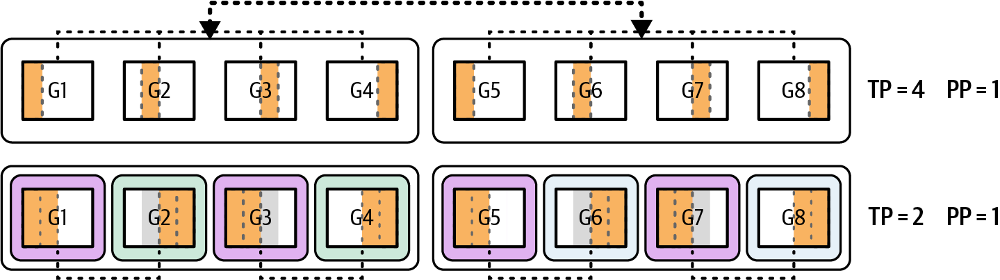

> Figure 19-2. Preprovisioning two different hybrid-sharding pools (TP = 4, PP = 1 and TP = 2, PP = 1) for a given model across eight GPUs

对长序列输入即时使用PP有助于避免由大输入序列引起的OOM错误。相反，对于短提示和延迟敏感查询，系统可以改为路由到针对低延迟优化的张量并行模型实例。在这种情况下，请求避免了PP的开销。

由于每个请求可以使用不同的并行策略，系统需要维护模型的多个实例供推理调度器/路由器选择。模型的一个实例将使用TP针对低延迟进行优化，而另一个实例使用TP和PP针对高吞吐量和大输入序列进行优化。

维护模型的多个实例是必需的，因为即时重新分片会严重破坏GPU缓存。这也会给内存和网络子系统带来太大压力--尤其是在重新分片大规模模型时。

在运行时，每个查询根据其长度和指定的服务级别协议（SLA）分派到最适合的模型实例（分片策略）。例如，DeepSeek-R1是一个约6800亿参数的稀疏混合专家模型，每个token在专家之间只激活370亿参数。

为了支持不同的工作负载配置文件，GPU可以组织成逻辑工作池，每个工作池使用特定的并行策略预分片--例如张量并行或混合张量+流水线并行。

让我们考虑一个例子。如果我们有一个8x GPU Blackwell B200服务器，总共1,440 GB的HBM内存（1,440 GB = 180 GB每GPU x 8个GPU），我们可以跨四个GPU使用四路TP服务DeepSeek-R1--让其他四个GPU空闲。

如果单个查询到达且具有极长的上下文（例如，> 100万个token），调度器可以生成一个两阶段流水线，使得阶段1跨越GPU 0-3，阶段2跨越GPU 4-7。这有效地将每个阶段的可用GPU内存加倍到约720 GB（180 GB每GPU x 4个GPU）的总HBM（720 GB可用HBM）。这有助于在处理大输入时避免OOM错误。

相反，当数十个短的、延迟敏感的提示同时到达时，系统将它们路由到仅张量并行实例。通过避免流水线气泡，或在填充和排空流水线阶段时发生的空闲期，此配置在所有可用GPU上提供尽可能低的每请求延迟。

要实现动态并行切换，您可以实现一个决策函数，检查运行时指标如输入序列长度、GPU内存使用率和当前负载。您将使用这些指标为每个请求选择最佳分片的模型实例，如下所示：

```python
def choose_worker_pool(seq_len, gpu_mem_util, concurrent_reqs):
    # 对于长上下文或高内存压力，
    # 使用混合流水线+张量并行
    # （此处显示示例阈值）
    if seq_len > 4096 or gpu_mem_util > 0.8:
        return "tp_pp_hybrid"

    # 对于许多同时的小请求，坚持使用张量并行
    if concurrent_reqs > 4:
        return "tensor_parallel"
    # 对于典型工作负载回退到张量并行
    return "tensor_parallel"
```

您将在GPU集群上预启动多个模型副本--一些分片用于仅TP，另一些用于TP + PP--并让路由器根据输入和决策策略将每个查询发送到适当的副本。这种方法确保大型、内存密集型作业获得完整的流水线支持，而短的、延迟敏感的调用在仅TP实例上运行以避免不必要的流水线开销。

建议使用模型和硬件的遥测数据来通知并行切换。您可以实时监控GPU内存利用率、计算利用率和互连（如NVLink/NVSwitch）流量来做出决策。如果您注意到由于长流水线气泡而有空闲GPU--并且您有额外的内存余量--您可以将流水线折叠成更少的阶段，以便每个GPU做更多工作并保持忙碌。

相反，如果某些阶段达到内存限制或计算瓶颈，您可以扩展到更多流水线阶段--或提高张量并行度。这将计算和内存占用分散到额外的GPU。

关键是动态调整张量和流水线分割的平衡，以保持每个GPU得到充分利用。同时，您需要保持在内存约束内并达到延迟目标。这是静态的一刀切配置无法实现的。

> The data parallel and replica scaling strategy will replicate the full model on each GPU and load-balance incoming requests across these replicas. This requires no inter-GPU synchronization for individual inferences since each GPU handles separate requests independently. This maximizes throughput for many small- or medium-sized inputs with minimal communication overhead. However, data parallelism is not an option if the model does not fit into a single GPU's memory. Tensor parallelism (TP) is a form of model parallelism (as opposed to data parallelism) that splits model matrices (e.g., weights, layers, etc.) across GPUs to speed up matrix multiplies. However, it introduces extra all-reduce communications to keep the GPUs in sync. Pipeline parallelism (PP) is another form of model parallelism that splits the model as well. But instead of splitting individual model layers and matrices, it assigns whole layers to different GPUs to overcome memory limits-assuming the layers fit into a single GPU. PP incurs additional overhead in the form of sequential stage delays. These are called pipeline bubbles, as shown in Figure 19-1. Expert parallelism, used in mixture-of-experts (MoE) model architectures, assigns each expert subnetwork its own GPU. A lightweight gating network then directs each input request or token to only the top-k active experts identified by the router. In this case, each GPU processes just the subset of experts that it hosts. By activating only a few experts per input, expert parallelism reduces per-device memory, inference time, and compute costs for models with a large number of experts, often called wide expert models. The conditional, router-based expert compute pattern scales efficiently as you add more experts. For instance, DeepSeek-R1 has 256 total experts, but only the top 9 experts (including 1 shared expert) are chosen by the router during inference. Traditionally, the parallelization strategy-including a hybrid strategy of multiple parallelism techniques combined-is chosen and fixed upfront when the model is loaded. However, to maximize performance under dynamic workloads, modern inference engines can choose different parallelism strategies at runtime based on the characteristics of the input. High-performance, adaptive inference systems use runtime metrics to choose TP, PP, or a hybrid approach on the fly. Key factors include batch size, sequence length, and memory utilization-as well as response latency and throughput requirements. For instance, very long prompts may be routed to a TP + PP instance since this spreads layers across GPUs to avoid out-of-memory (OOM) errors. Meanwhile, short latency-sensitive requests would route to a TP-only model instance to avoid pipeline-stage overhead. To support this, your serving engine maintains multiple presharded model instances, each optimized for different workload profiles, and dynamically dispatches incoming queries to the model instance whose parallelism strategy best satisfies the job's SLOs. You can also use a different number of shards. This is shown in Figure 19-2, which uses two different numbers of TP shards in two different hybrid TP + PP parallelism configurations across eight GPUs. Using PP on the fly for long sequence inputs helps to avoid OOM errors caused by the large input sequence. Conversely, for short prompts and latency-sensitive queries, the system can instead route to a tensor-parallel model instance optimized for low latency. In this case, the request avoids the overhead of PP. Since each request can use a different parallelism strategy, the system needs to maintain multiple instances of the model for the inference scheduler/router to choose. One instance of the model would be optimized for low latency using TP, while another instance is optimized for high throughput and large input sequences using both TP and PP. Maintaining multiple instances of the model is required because resharding on the fly would wreak havoc on GPU caches. This would also put too much pressure on the memory and network subsystems-especially when resharding massive models. At runtime, each query is dispatched to the best-fitting model instance (sharding strategy) based on its length and the specified service-level agreements (SLAs). DeepSeek-R1, for instance, is a ~680 billion-parameter sparse mixture-of-experts model that activates only 37 billion parameters per token across the experts. To support different workload profiles, GPUs can be organized into logical worker pools, each presharded with a specific parallelism strategy-either tensor-parallel or hybrid tensor + pipeline parallel, for instance. Let's consider an example. If we have an 8x GPU Blackwell B200 server totaling 1,440 GB of HBM memory (1,440 GB = 180 GB per GPU x 8 GPUs), we can serve DeepSeek-R1 with four-way TP across four GPUs-leaving the other four GPUs idle. If a single query arrives with an extremely long context (e.g., > 1 million tokens), the scheduler can spawn a two-stage pipeline such that stage 1 spans GPUs 0-3 and stage 2 spans GPUs 4-7. This effectively doubles the available GPU memory per stage to ~720 GB (180 GB per GPU x 4 GPUs) of total HBM (720 GB usable HBM). This helps avoid OOM errors when processing large inputs. Conversely, when dozens of short, latency-sensitive prompts arrive concurrently, the system routes them to the tensor-parallel instance only. By avoiding pipeline bubbles, or idle periods that occur while filling and draining pipeline stages, this configuration delivers the lowest possible per-request latency across all available GPUs. To implement dynamic parallelism switching, you can implement a decision function that inspects runtime metrics like input sequence length, GPU memory usage, and current load. You would use these metrics to select the best-sharded model instance for each request, as shown here: ... You'd prelaunch multiple model replicas on your GPU cluster-some sharded for TP-only and others for TP + PP-and have a router send each query to the appropriate replica based on the inputs and the decision strategy. This approach ensures that large, memory-intensive jobs get full pipeline support, while short, latency-sensitive calls run on TP-only instances to avoid unnecessary pipeline overhead. It's recommended to use telemetry from the model and hardware to inform parallelism switching. You can monitor GPU memory utilization, compute utilization, and interconnect (e.g., NVLink/NVSwitch) traffic in real time to make the decision. If you notice idle GPUs because of long pipeline bubbles-and you have extra memory headroom-you can collapse your pipeline into fewer stages so each GPU does more work and stays busy. Conversely, if some stages are hitting memory limits or compute bottlenecks, you can expand into more pipeline stages-or raise your tensor-parallel degree. This will spread the computations and memory footprint across additional GPUs. The key is to adjust the balance of tensor and pipeline splits dynamically to keep every GPU well utilized. At the same time, you need to stay within memory constraints and hit latency targets. This is something a static, one-size-fits-all configuration cannot achieve.

## 动态精度变化 (Dynamic Precision Changes)

像Blackwell这样的现代GPU引入了对8位和4位浮点（FP8/FP4）Tensor Core数学单元的支持。这些较低精度提供了大幅加速、内存节省和最小的质量损失。

动态精度切换是一种高级技术，推理引擎根据模型置信度或资源压力在运行时调整数值精度。目标是增加吞吐量而不显著损失质量。在实践中，这意味着系统可能以FP8或FP4执行模型的某些部分以提高效率，但在需要稳定性时回退到更高精度（FP16/BF16）。

精度适应的一个触发因素是logit锐度，或模型的输出置信度。例如，如果模型对下一个token的概率分布由于对特定token的高置信度而显示极端峰值，低精度的数值误差不太可能改变结果。

如果下一个token生成可以容忍低精度，引擎将安全地使用FP4进行接下来的几步以获得速度。相反，如果分布由于高不确定性而较平坦，引擎应坚持使用FP8或FP16以保持保真度。

推理引擎通过计算词汇表上softmax分布的香农熵来量化不确定性。较低的熵表示更锐利（更自信）的预测。在保留验证集上调整的固定熵阈值决定何时降到FP4以及何时保持FP8/FP16以确保数值稳定性。目标是平衡延迟增益与精度损失。

> 使用最低精度来保持精度，当模型置信度下降时（通过最大softmax概率测量）恢复到更高精度。

这利用了大型LLM在生成确定性延续（如闭合引号或完成列表）时通常会变得更加确定的事实。在这些情况下，较低精度通常足够。

另一个因素是内存压力。如果GPU内存使用由于非常长的上下文或许多并行请求而接近其限制，系统可以动态地将激活压缩到较低精度。

可以将注意力键/值张量存储在INT4而不是INT8中，当内存紧张时。这将减少50%的内存占用。但是，确保使用INT4的量化误差不会在许多解码步骤中累积。建议定期重新评估输出质量。

例如，如果推理达到KV缓存使用90%内存的点，引擎可能决定将新缓存条目从INT8量化到INT4--甚至追溯压缩旧条目--以释放空间。这可以在不停止模型的情况下完成。在这种情况下，下一个注意力层只需读取INT4缓存值--带有轻微的量化误差。

将4位权重量化与8位激活结合可以显著减少内存。例如，纯计算受限内核FP8激活可以实现高达2倍的吞吐量--尤其是在高带宽现代GPU上。对于混合或内存受限工作负载，可实现1.5倍。

使用FP4进行激活可以进一步推动内存节省。然而，它可能引入稍高的累积误差，需要仔细的逐层调优。

现代GPU提供原生FP8和FP4 Tensor Core。然而，截至本文撰写时，PyTorch的AMP支持（torch.autocast）仍然只针对FP16和BF16。它不针对FP8或FP4。虽然FP8 dtype存在于PyTorch中（如torch.float8_e4m3和torch.float8_e5m2）以及缩放数学路径，但AMP不管理它们。对于推理和训练，建议使用NVIDIA的Transformer Engine（TE）并在适当时采用其MXFP8和NVFP4。

> 对于延迟关键的解码，在Blackwell上使用AMP时优先选择BF16而不是FP16。对于FP8路径，Transformer Engine的MXFP8格式是Blackwell上的推荐默认值。有选择地将NVFP4用于KV缓存和轻量层，并进行仔细的回归测试。记得在您的特定工作负载上逐层验证数值。

表19-2总结了一些示例精度配置及其权衡。在这里，您可以看到较低精度减少内存并增加吞吐量。然而，有轻微的质量下降。

**表19-2. LLM推理中精度模式的近似权衡**

| 精度模式 | 内存使用（相对） | 计算吞吐量 | 质量影响（精度变化） |
|---------|-----------------|-----------|---------------------|
| FP16（基线） | 1.0x（100%） | 1.0x（基线） | 无影响（完全保真） |
| FP16权重 + FP8激活 | ~0.5x（50%） | ~1.5x | 可忽略（< 0.1%） |
| INT4权重 + FP8激活 | ~0.25x（25%） | ~1.8x（混合计算和内存受限） | ~0.5%质量下降 |
| INT4权重 + FP4激活 | ~0.2x（20%） | ~3.5x | ~1%下降（需要仔细调优） |

在这里，我们看到使用FP8激活，我们获得了比基线FP16约50%的内存减少，正如预期的那样，通过将激活位宽减少50%。此外，此处测量的质量损失对于FP8激活来说可以忽略不计（< 0.1%）。（注意：降低精度的质量影响取决于模型和内核。您应该使用自己的数据和工作负载进行验证。）

INT4权重 + FP8激活工作流在内存是主要瓶颈时可以产生约1.8倍的基线吞吐量。INT4权重 + FP4激活可以将内存减少到基线的20%。4位目标。加速约为3.5倍，这与FP16的理论峰值4倍改进一致。

动态精度切换的目标是在保持输出质量在可接受范围内的同时最大化性能。理想情况下，内核以尽可能快的精度（如FP8或FP4）运行，仅在必要时回退到更高精度（如FP16）。在实践中，像NVIDIA的Transformer Engine for PyTorch这样的库允许在运行时逐层控制精度。

线性层可能默认为FP8，但运行时钩子可以根据层的作用将层的精度提高到FP16或降低到FP4。例如，FP4可以应用于轻量层，如输出投影，其中轻微的精度下降是可容忍的，而FP8或FP16可能用于处理原始用户输入并受益于更高精度的早期层。

除了逐层混合精度控制，您可以使用更细粒度的优化策略，即每个token调整精度。这种方法让推理系统以尽可能快的模式运行，例如FP8，当预测有信心时。然后当更不确定时回退到更高精度模式如FP16。

在实践中，模型使用默认精度（如FP16）生成当前token，然后根据运行时指标评估置信度，如输出熵、最大softmax概率或logit方差。

如果模型对其预测非常有信心，下一个token可以以较低精度处理。如果不确定性高，系统恢复到更稳定的格式以保持输出质量。以下是演示该概念的示例代码：

```python
import contextlib
import torch

# ----------------------------
# 安全的Transformer Engine (TE) FP8 autocast导入
# ----------------------------

try:
    # TE只有在您的模型实际使用TE启用的层时才有效
    # （例如，Linear, LayerNorm包装器）。
    from transformer_engine.pytorch import fp8_autocast as _te_fp8_autocast  
    # type: ignore
    _TE_AVAILABLE = True
except Exception:
    _TE_AVAILABLE = False
    # 无操作替代，以便在没有安装TE的情况下代码运行。它从不改变
    # 数值行为。
    class _NullCtx(contextlib.ContextDecorator):
        def __init__(self, **_): pass
        def __enter__(self): return self
        def __exit__(self, *exc): return False
    def _te_fp8_autocast(**_):
        return _NullCtx()

# ----------------------------
# 辅助函数：为此步骤安全选择精度上下文
# ----------------------------
def _precision_context_cuda(use_fp8: bool, 
                            prefer_bfloat16: bool, 
                            enable_fp8: bool):
    """
    精确进入一个精度上下文。如果FP8未启用或TE
    缺失/未使用，回退到AMP (BF16/FP16)。
    """
    if use_fp8 and enable_fp8 and _TE_AVAILABLE:
        # 注意：fp8_autocast只影响TE启用的模块。
        # 非TE模块以其原生dtype运行。
        return _te_fp8_autocast(enabled=True)
    amp_dtype = torch.bfloat16 if prefer_bfloat16 else torch.float16
    return torch.autocast(device_type="cuda", dtype=amp_dtype)

def _precision_context(device: torch.device, use_fp8: bool, 
                       prefer_bfloat16: bool, enable_fp8: bool):
    return _precision_context_cuda(use_fp8, prefer_bfloat16,
                                   enable_fp8) if device.type == "cuda"
                                   else contextlib.nullcontext()

# ----------------------------
# 带平滑、滞后精度切换的主解码循环
# ----------------------------
@torch.no_grad()
def decode_with_dynamic_precision(
    model,
    tokens: torch.Tensor,
    max_steps: int,
    *,
    device: torch.device = torch.device("cuda"),
    prefer_bfloat16: bool = True,      # B200: AMP优先BF16而非FP16
    enable_fp8: bool = True,           # TE存在时允许FP8
    enter_fp8_threshold: float = 6.0,  # 滞后上限
                                       # (logit margin平均值)
    exit_fp8_threshold: float = 3.0,   # 滞后下限（避免抖动）
    reeval_interval: int = 8,          # 每N步计算/检查置信度
                                       # 以避免每步同步
    topk_dim: int = -1,                # 最后一维保存词汇表logits
    eos_id: int | None = None,
):
    """
    自回归解码循环，在AMP (BF16/FP16)
    和FP8 (TE)之间*平滑*切换，无需每步主机同步。即使TE未
    安装也能工作；在这种情况下，仅运行AMP。

    - 置信度信号：批次中平均的mean(top1 - top2) logits margin。
    - 平滑：EMA + 间隔重新评估以最小化CPU-GPU同步压力。
    - 滞后：单独的进入/退出阈值以避免精度抖动。
    """
    assert exit_fp8_threshold <= enter_fp8_threshold, \
        "Hysteresis requires exit <= enter threshold"

    model.eval()
    tokens = tokens.to(device, non_blocking=True)

    # 内部状态
    use_fp8: bool = False  # 从AMP开始。
                           # 当持续置信度允许时升级到FP8
    ema_conf: torch.Tensor | None = None  # 保持在设备上；
                                          # 主机仅在间隔时查询
    alpha = 0.2  # 置信度的EMA平滑因子
  # 一个小辅助函数，用于更新设备上的EMA而无需主机同步
    def _update_confidence_ema(logits: torch.Tensor) -> torch.Tensor:
        # logits: [B, vocab] 或 [B, T, vocab]。如果是3D则使用最后时间步。
        last = logits if logits.dim() == 2 else logits[:, -1, :]
        # 在设备上计算top-2 margin
        top2 = torch.topk(last, k=2, dim=topk_dim).values  # [B, 2]
        margin = (top2[:, 0] - top2[:, 1]).mean()      # 设备上的标量张量
        nonlocal ema_conf
        ema_conf = (1 - alpha) \
                   * (ema_conf if ema_conf is not None else margin)+alpha*margin
        return ema_conf  # 设备标量

    # 解码
    for step in range(max_steps):
        # 1) 精度上下文（确切一个）。
        # 没有嵌套上下文，没有跨迭代泄漏。
        with _precision_context(device, use_fp8, prefer_bfloat16, 
enable_fp8):
            # 前向传播（HF风格或普通）
            try:
                logits = model(input_ids=tokens)  
                if hasattr(logits, "logits"):
                    logits = logits.logits
            except TypeError:
                logits = model(tokens)

            # 2) 从*最后*位置选择下一个token
            last_step_logits = logits if logits.dim() == 2 else \
logits[:, -1, :]
            next_token = torch.argmax(last_step_logits, dim=-1, 
                                      keepdim=True)  # [B, 1]
            tokens = torch.cat([tokens, next_token], dim=1)

        # 3) 每步更新设备上的EMA信号（尚未主机同步）
        conf_dev = _update_confidence_ema(logits)

        # 4) 定期在主机上重新评估精度选择
        # 以避免每步同步
        if (step + 1) % reeval_interval == 0:
            conf_value = float(conf_dev)  # 每N步恰好一次小同步
            if not use_fp8 and enable_fp8 and _TE_AVAILABLE \
               and (conf_value > enter_fp8_threshold):
                use_fp8 = True
            elif use_fp8 and (conf_value < exit_fp8_threshold):
                use_fp8 = False

        # 5) EOS处理
        if eos_id is not None:
            if (tokens[:, -1] == eos_id).all():
                break

    return tokens

# ----------------------------
# 示例（已注释）：
# ----------------------------
# model = ...  # 您的TE启用的模型（或任何torch.nn.Module）
# input_ids = torch.randint(0, vocab_size, (batch_size, seq_len))
# out = decode_with_dynamic_precision(model, input_ids, max_steps=128, 
# eos_id=tokenizer.eos_token_id)
# print(out.shape)
```

在这里，我们看到截至本文撰写时，PyTorch autocast仅支持降低精度的FP16和BF16。在这种情况下，您需要使用Transformer Engine库将支持的模块路由到FP8内核。

> 本示例中使用的阈值（enter = 6.0, exit = 3.0）应在验证集上使用代表性提示进行校准，以防止延迟增益影响精度。

这种模式创建了一个弹性精度机制并最大化吞吐量。当模型在可预测（如低熵）区域运行时，例如生成标点符号或样板补全，它继续使用FP8以最大化性能。当它进入更高熵的段落时，例如模糊的提示或决策点，它返回FP16以保持数值精度。

当与现代GPU对低精度操作的支持相结合时，token级动态精度切换为高吞吐量、延迟敏感的推理提供了自适应策略。它仅在需要时应用低精度，减少计算开销，并在许多不同的提示条件下保持响应质量。

> Modern GPUs like Blackwell introduce support for 8-bit and 4-bit floating point (FP8/FP4) Tensor Core math units. These lower precisions offer large speedups, memory savings, and minimal quality loss. Dynamic precision switching is an advanced technique in which the inference engine adjusts the numerical precision at runtime based on model confidence or resource pressure. The goal is to increase throughput without significant quality loss. In practice, this means the system might execute certain parts of the model in FP8 or FP4 for efficiency but fall back to higher precision (FP16/BF16) when needed for stability. One trigger for precision adaptation is logit sharpness, or the model's output confidence. For example, if the model's probability distribution for the next token shows extreme peaks due to high confidence in a specific token, small numerical errors from low precision are unlikely to change the outcome. If low precision can be tolerated for the next token generation, the engine will safely use FP4 for the next few steps to gain speed. Conversely, if the distribution is flatter due to high uncertainty, the engine should stick to FP8 or FP16 to preserve fidelity. The inference engine quantifies uncertainty by computing the Shannon entropy of the softmax distribution over the vocabulary. Lower entropy indicates a sharper (more confident) prediction. A fixed entropy threshold, tuned on a held-out validation set, determines when to drop to FP4 and when to remain in FP8/FP16 for numerical stability. The goal is to balance latency gains versus accuracy loss. Use the lowest precision that maintains accuracy, and revert to higher precision when the model's confidence drops as measured by the maximum softmax probability. This leverages the fact that large LLMs often become more certain as they generate deterministic continuations, such as closing quotes or finishing a list. In these cases, lower precision is usually sufficient. Another factor is memory pressure. If GPU memory usage is approaching its limit due to a very long context-or many parallel requests, the system can dynamically compress activations to a lower precision. One could store the attention key/value tensors in INT4 instead of INT8 when memory is scarce. This would reduce the memory footprint by 50%. However, make sure the quantization error from using INT4 does not compound across many decoding steps. It's recommended to periodically reevaluate output quality. For instance, if an inference reaches a point where the KV cache is using 90% of memory, the engine might decide to quantize new cache entries from INT8 down to INT4-or even retroactively compress older entries-to free space. This can be done without stopping the model. In this case, the next attention layers simply read the INT4 cached values-with minor quantization error. Combining 4-bit weight quantization with 8-bit activations can reduce memory significantly. For instance, pure compute-limited kernels FP8 activations can achieve up to 2x throughput-especially on high-bandwidth modern GPUs. For mixed or memory-bound workloads, 1.5x is achievable. Using FP4 for activations can push memory savings even further. However, it may introduce slightly higher cumulative error that requires careful layer-wise tuning. Modern GPUs provide native FP8 and FP4 Tensor Cores. However, PyTorch's AMP support (torch.autocast) still only targets FP16 and BF16 as of this writing. It does not target FP8 or FP4. While FP8 dtypes exist in PyTorch (e.g., torch.float8_e4m3 and torch.float8_e5m2) alongside scaled math paths, AMP does not manage them. For inference and training, it's recommended to use NVIDIA's Transformer Engine (TE) and adopt its MXFP8 and NVFP4 when appropriate. For latency-critical decode, prefer BF16 over FP16 on Blackwell when using AMP. For FP8 paths, the Transformer Engine's MXFP8 format is the recommended default on Blackwell. Use NVFP4 selectively for KV cache and light layers with careful regression testing. Remember to validate numerics per layer on your specific workload. Table 19-2 summarizes some example precision configurations and their trade-offs. Here, you see that lower precision reduces memory and increases throughput. However, there is slight quality degradation. Here, we see that with FP8 activations, we get a memory reduction of ~50% from the baseline FP16 as expected by reducing the activation bit-width by 50%. Additionally, the quality loss measured here is negligible (< 0.1%) for FP8 activations. (Note: quality impact with reduced precision is model-dependent and kernel-dependent. You should validate with your own data and workloads.) INT4 weight + FP8 activation workflows can produce about ~1.8x of the baseline throughput when memory is the main bottleneck. INT4 weights + FP4 activations can reduce memory down to 20% of the baseline. 4-bit targets. The speedup is around 3.5x, which is consistent with the theoretical peak 4x improvement over FP16. The goal of dynamic precision switching is to maximize performance while keeping output quality within acceptable bounds. Ideally, the kernel runs in the fastest possible precision (e.g., FP8 or FP4) and falls back to higher precision (e.g., FP16) only when necessary. In practice, libraries like NVIDIA's Transformer Engine for PyTorch allow layer-wise control over precision at runtime. Linear layers might default to FP8, but a runtime hook could increase a layer's precision to FP16 or reduce it to FP4 depending on the layer's role. For instance, FP4 could be applied to lightweight layers like output projections in which minor accuracy degradation is tolerable, while FP8 or FP16 might be used for early layers that process raw user inputs and benefit from higher precision. Beyond per-layer mixed-precision control, you can use a more fine-grained optimization strategy, which adjusts the precision per token. This approach lets the inference system run in the fastest mode possible, FP8 for instance, when predictions are confident. It would then fall back to higher-precision modes like FP16 when it's more uncertain. In practice, the model generates the current token using a default precision (e.g., FP16), then evaluates confidence based on runtime metrics, such as output entropy, maximum softmax probability, or logit variance. If the model is highly confident in its prediction, the next token can be processed at a lower precision. If uncertainty is high, the system reverts to a more stable format to maintain output quality. Here is example code that demonstrates the concept: ... Here we see that PyTorch autocast supports only reduced-precision FP16 and BF16 as of this writing. In this case, you need to use the Transformer Engine library to route supported modules to FP8 kernels. The threshold used in this example (enter = 6.0, exit = 3.0) should be calibrated on a validation set using representative prompts to prevent latency gains from impacting accuracy. This pattern creates an elastic precision regime and maximizes throughput. When the model operates in predictable (e.g., low-entropy) regions, such as generating punctuation or boilerplate completions, it continues in FP8 to maximize performance. When it enters higher-entropy segments, such as ambiguous prompts or decision points, it returns to FP16 to preserve numerical accuracy. When paired with a modern GPU's support for low-precision operations, token-level dynamic precision switching offers an adaptive strategy for high-throughput, latency-sensitive inference. It applies low precision only when needed, reduces compute overhead, and maintains response quality across many different prompt conditions.

## Transformer自注意力和MLP路径的内核自动调优 (Kernel Autotuning for Transformer Self-Attention and MLP Paths)

神经网络层在GPU上的性能可能会因线程块大小、瓦片维度、循环展开和内存访问模式等低级参数而大幅变化。对于固定大小的模型，库通常只选择一次这些参数--通常使用通用启发式方法或离线调优。

然而，在在线推理服务场景中，输入大小（包括序列长度和批次大小）可能因请求而异。内核自动调优是指一种运行时机制，它为当前工作负载选择--甚至即时编译--最优的内核变体。

在大型transformer模型的背景下，推理的两个主要计算阶段是自注意力和前馈MLP层。两者都可以从GPU内核的自动调优中受益。让我们在内核自动调优的背景下介绍这两个阶段。

考虑一个处理长度为L、具有H个注意力头的序列的注意力层。注意力有许多实现，包括标准注意力和优化的FlashAttention--及其多个变体。FlashAttention及其变体由于分块、并行性和内存访问改进，对于长序列明显更快。然而，对于非常短的序列，其开销可能超过其收益。动态引擎可以根据序列长度L在FlashAttention内核和更简单的内核之间切换。

例如，如果请求有L = 256个token，引擎可能使用一个直接的内核启动，通过全局内存读取一次性计算注意力，这对于小L来说足够了。如果另一个请求有L = 2,048，它可以切换到FlashAttention的专用分块内核，该内核通过在共享内存中重用数据并避免不必要的HBM数据获取，对大L扩展得更好。这演示为基于输入序列长度的一个条件语句，如下所示：

```cpp
// 注意：此处显示示例阈值
if (seq_len < 256) {
    // 全局内存版本，最适合小L
    attn_kernel = standard_attention_kernel;  
} else {
    // 分块加载，最适合大L 
    attn_kernel = tiled_attention_kernel;        
}
output = attn_kernel(Q, K, V, mask);
```

在幕后，attn_kernel在完全不同的CUDA实现之间选择。一个实现使用默认注意力内核针对小输入优化，另一个使用分块内核针对大上下文优化。

理想的瓦片维度取决于GPU的共享内存容量和计算资源。像CUTLASS和OpenAI的Triton这样的框架包含自动调优器，在初始化时--甚至运行时自适应地--对一系列(TILE_Q, TILE_K)组合进行基准测试，以选择最快的变体。表19-3显示了不同瓦片大小在Blackwell类GPU上的性能示例。

**表19-3. 瓦片大小选择对共享内存占用、SM占用率和实现吞吐量的影响示例（实际值将取决于线程块维度、时钟频率和其他微架构因素）**

| 瓦片大小 | 共享内存(KB) | 占用率(%) | 吞吐量(GOPS) |
|---------|-------------|----------|-------------|
| 64 x 64 | 48 | 85 | 8.2 |
| 128 x 64 | 64 | 78 | 10.5 |
| 128 x 128 | 96 | 72 | 9.8 |
| 256 x 128 | 128 | 60 | 11.3 |

通过在运行时根据输入选择正确的变体，您可以避免一刀切方法的巨大性能悬崖。在实践中，您可能在目标硬件上进行基准测试，发现大约L = 128是盈亏平衡点。

接下来，让我们在自动调优的背景下分析前馈MLP内核。前馈层本质上是大型矩阵乘法--具体来说，是两个线性投影，中间有一个非线性激活。

像PyTorch这样的现代AI框架使用高度优化的GEMM内核，使用优化的CUDA库如cuBLAS和CUTLASS。这些库中对于给定的矩阵大小通常有多种算法变体，使用不同的分块策略、不同的Tensor Core和单独的回退路径。

例如，NVIDIA的cuBLAS和cuBLASLt库可以通过首先尝试几种算法，然后为给定维度选择最快的算法来自动调优GEMM内核。然而，这通常在第一次遇到该形状的GEMM时发生--而不是重新访问。

> 在cuBLAS/cuBLASLt或自定义内核中可用时，程序化依赖启动（PDL）可以减少启动间隙并提高稳态吞吐量。确保进行分析以确认重叠。

在看到许多不同批次大小的推理服务器中，可以显式调用此类自动调优机制--或维护最佳算法的缓存。例如，对于形状为[batch_size, hidden_dim] x [hidden_dim, 4*hidden_dim]的MLP GEMM，batch_size = 1与batch_size = 16的最优内核可能不同。

引擎可以检测新的批次大小，并使用cuBLASLt或自定义实现对候选内核进行快速微基准测试，以选择最快的内核。随后使用该批次大小的调用可以直接使用所选内核。

此外，一些推理框架和运行时使用OpenAI的Triton GPU内核领域特定库（DSL）来即时编译具有自动调优瓦片大小的注意力和MLP内核。在这种情况下，运行时会生成具有不同瓦片大小（如128 x 128、64 x 256等）的内核的几个变体，并测量在给定实际硬件和输入形状下哪个表现更好。

您可以使用Nsight Systems等工具并排实证分析不同的内核变体。

具体来说，Nsight Systems提供详细的CUDA时间线，包括memcpy和NVLink活动，Nsight Compute提供内存工作负载分析，帮助将缓存和内存行为归因于内核站点。这在评估瓦片大小和共享内存权衡时特别有用。此外，它通常可以揭示非明显的瓶颈，如L2缓存未命中，这将进一步指导您的调优决策。

> 由于L2缓存效应、内存bank冲突等，硬件在负载下可能有些不可预测，实证调优总是胜过理论猜测。但最好从合理的理论值开始调优过程。

动态瓦片切换会影响GPU占用率，在选择瓦片大小时应予以考虑。使用更大的瓦片可以增加重用并减少内核启动开销，但也可能使用更多寄存器和共享内存。这可能会减少可以并发运行的线程块数量--降低占用率。适当的自动调优器将考虑这种权衡。

在注意力内核中，更大的瓦片（如128 x 128）最大化共享内存中的数据重用。这对于长序列是理想的，因为您发出更少的全局内存加载，分摊循环开销，并产生更高的持续吞吐量。

然而，对于较短的序列，同样的大瓦片可能消耗太多共享内存，这限制了占用率，或每个SM可以并发运行的线程块数量。通过为较短序列减小瓦片大小（如64 x 64），您可以释放共享内存，以便可以并行调度更多块。这提高了SM占用率并减少了每个内核的延迟。

通过根据输入序列长度调整瓦片大小，内核在大多数情况下可以实现接近最优的占用率。一些系统甚至在运行时查询CUDA占用率API来动态选择内核启动参数，如线程块大小。以下是C++中占用率API的示例，但也有Python API可用：

```cpp
// 基于占用率的启动配置伪代码
int maxBlocks, bestThreads;
for (int threads = 64; threads <= 256; threads *= 2) {
    cudaOccupancyMaxActiveBlocksPerMultiprocessor(
        &maxBlocks, MyKernel, threads, 
        sharedMemPerBlock(threads));
    // 选择"threads"以最大化占用率
    // （记得不要超过每SM的最大线程限制
    // （例如，2,048）
    float occupancy = (float) maxBlocks * threads / 
                              hardwareMaxThreadsPerSM;
}
```

这个伪C++代码说明了对内核评估不同线程块大小。它检查给定共享内存使用情况下每个SM可以运行多少块。然后内核启动相应调整线程数或共享内存使用。高性能框架和推理引擎使用以下步骤集在内部自动化这种逻辑：

1. **测量工作负载**
   检查下一个模型前向传播的当前输入维度（批次大小B、序列长度L等）。

2. **选择候选内核**
   确定每个组件可用的内核实现，例如注意力阶段的标准注意力或flash attention，以及MLP阶段的适当GEMM算法。

3. **估计或基准测试**
   通过在样本数据上执行每个算法几次迭代来快速运行每个候选。

4. **选择最佳变体**
   根据测量的维度选择执行时间最小或吞吐量足够的内核。

5. **缓存结果**
   将选择存储在以输入维度或工作负载签名为键的查找表中。这样，如果出现类似请求，无需重新运行这些步骤就知道最佳内核。

6. **执行**
   使用所选内核实现运行模型层。

> 这类似于数据库查询优化器选择查询计划。这里的"计划"是所选的内核实现。

通过遵循这样的过程，推理运行时不断自我调优。随着时间的推移，系统为各种场景构建优化路径库，如短提示与长提示、小批次与大批次等。即时调优的开销通过异步进行--在单独的流中测试新内核，而当前推理使用默认内核--或在低流量期间进行以不影响延迟来保持较低。

建议在加载模型时包含初始预热阶段，通过运行各种样本输入来触发自动调优。这可以包括极端情况--如最大序列长度、最大批次等--以便引擎为这些情况预优化内核。

此外，最好在运行时监控每层的执行时间。如果某层由于输入特征变化突然成为瓶颈，那么是时候重新审视内核选择了。

> 一些高级框架甚至使用多臂赌博算法，持续探索替代内核，并在条件变化时更新选择不同内核。

简而言之，自动调优将静态内核转变为自适应内核。这为每个输入集从GPU集群中挤出最高性能，无论工作负载如何。您可以确信系统在不断适应。

## 动态共享内存分配和占用率感知内核选择 (Dynamic Shared-Memory Allocation and Occupancy-Aware Kernel Selection)

与内核调优密切相关的是GPU共享内存和整体流式多处理器（SM）占用率的管理。现代GPU每个SM具有大量共享内存。通过根据问题大小以及当前共享内存利用率和占用率在运行时动态分配线程，可以显著提高整体AI系统性能。

使用动态共享内存分配，系统根据问题大小调整每个线程块使用的共享内存量。使用占用率感知内核选择，系统选择最佳利用SM资源的内核启动参数--包括寄存器、共享内存和warp--以保持GPU忙碌。

选择分块注意力算法应平衡数据重用与SM占用率。例如，考虑T作为每个线程块的瓦片宽度（以token为单位）。每个线程块保留大约O(T²)个浮点数的共享内存来保存查询、键和值块，因为自注意力本质上是二次的。

大瓦片大小（例如，T=256）从DRAM加载每个键/值块一次，并为许多查询重用它。这将全局内存流量减少到接近每个线程块O(T)个浮点数。但由于每个线程块现在使用大量共享内存，考虑到硬件限制，每个SM一次只能运行少数线程块。这会降低占用率。例如，如果T=256时每个SM只能运行1个块，而T=128时可以运行4个块，使用T=256时您可能只能看到30%的SM占用率。

小瓦片大小（例如，T=64）使用的共享内存少得多，这允许更多线程块放入每个SM。这更好地隐藏延迟并提高利用率。但是，您最终会更频繁地重新加载相同的键/值数据，这会增加DRAM访问。

最佳瓦片大小T取决于几个因素，包括您的序列长度L、GPU的共享内存容量和SM数量。您需要一个足够大的瓦片来分摊DRAM读取，但又足够小以保持足够高的占用率，使许多线程块在SM上并发活跃。

在实践中，您可以手动选择几个候选T值，如64、128和256--并使用代表您数据集的序列长度L在特定硬件上对每个值进行基准测试。然后选择产生最佳整体吞吐量的T值。但是，您可以不在提前硬编码T，而是在启动内核之前计算它，如下所示：

```cpp
int T = choose_tile(L, gpu_shared_mem_per_block, num_sms);

// calculate shared memory in bytes based on the tile size 
// (multiplying by 3 for Q, K, and V) 

size_t shared_mem_bytes = 3 * T * T * sizeof(float);

numBlocks = ...

MyAttentionKernel<<<numBlocks, threadsPerBlock, 
shared_mem_bytes>>>(...);
```

在这里，T是根据序列长度L、GPU每个线程块的共享内存限制gpu_shared_mem_per_block和SM数量num_sms计算的。然后，每个线程块的共享内存shared_mem_bytes是根据计算的瓦片大小T在运行时计算的。

然后您可以使用共享内存参数shared_mem_bytes启动CUDA内核。内核本身将包含以下内容来定义一个extern __shared__数组，为每个线程块分配大小为shared_mem_bytes的共享内存缓冲区：

```cpp
// holds 3 tiles of TxT floats for Q, K, and V
extern __shared__ float smem[];

// Q tile: smem[0 ... T*T-1]
float* tile_q = smem;      

// K tile: smem[T*T ... 2*T*T-1]
float* tile_k = smem + T*T;

// V tile: smem[2*T*T ... 3*T*T-1]
float* tile_v = smem + 2*T*T;
```

通过每次启动时改变shared_mem_bytes，相同的内核二进制文件可以使用不同的瓦片大小运行。选择T后，您可以使用CUDA占用率API查询占用率，看看每个SM适合多少块。

如果占用率太低且每个SM只分配了一个块，您可以减少T。如果您正在抖动DRAM，您可以增加T。这可以实现为自动反馈循环，其中内核使用CUDA占用率API或NVIDIA数据中心GPU管理器（DCGM）以编程方式测量其自身实现的占用率--并在后续迭代中调整T。这样，每个注意力层根据当前序列长度L和硬件限制使用最佳配置。

正如我们在第6章中看到的，优化SM占用率时还需要考虑每个线程的寄存器使用。使用更多寄存器（例如，展开循环）可以加速单线程性能，但可能会降低整体SM占用率，因为每个SM的寄存器文件有限。

如果每个warp使用许多寄存器，可以调度的warp就会减少。动态运行时可以检测内核是否由于寄存器而达到占用率限制，并切换到使用更少寄存器的版本--以额外指令为代价。这些低级考虑对于自适应、高性能推理服务器至关重要。

动态共享内存调优需要对占用率与吞吐量进行分析。NVIDIA Nsight Systems/Compute和CUDA占用率API等工具可以显示每个内核的实现占用率和执行效率。同时，DCGM在系统级别提供实时GPU利用率和SM占用率指标。自适应系统可以使用这些信息注意到，例如，序列长度为2,048的注意力内核仅实现30%的占用率，因为每个线程块使用大量共享内存。

在这种情况下，系统可以动态切换到通过将注意力计算分成两次传递来减少每个线程块共享内存的内核配置。这将增加占用率--并可能增加吞吐量--如果内存延迟是瓶颈。

相反，如果内核受内存限制且未饱和ALU，使用更多共享内存--即使占用率下降--也可以通过减少内存停顿来提高有效吞吐量。理解这些权衡很重要--尤其是占用率，在某些情况下它比其他指标更不直观。

建议设计允许在运行时调整共享内存和线程块大小的内核。然后系统可以根据输入和硬件反馈将调优配置适应运行时条件。例如，它可以提供运行时参数和模板参数用于CUTLASS等库使用的瓦片大小，这些库正是出于这个原因提供运行时可调的内核变体。

您还应该持续监控SM利用率指标。考虑许多空闲warp（例如，< 50%活跃warp）或内存停顿周期（> 70%停顿）。这表明存在不平衡，要么是占用率太低（空闲warp）--要么是您的瓦片大小太小并导致过多的内存流量。

因此，您的系统应相应调整以恢复平衡。

对于推理服务，常见做法是为不同问题大小维护最佳线程块配置的小表。此映射可以实现为JSON或配置文件，将序列长度范围映射到启动参数。这允许随着模型和硬件发展轻松更新。

例如，每当您的系统使用序列长度512执行注意力时，它将使用128线程/块和16 KB共享内存。或者，对于序列长度4,096，它将使用256线程/块和64 KB共享内存等。这将自动调优的概念扩展到资源分配。

请记住，现代NVIDIA GPU为L1数据缓存和共享内存提供统一的片上池。而分割控制保留多少池用于共享内存与L1。使用cudaFuncSetAttribute调整分割，以在内核需要更大瓦片时增加共享内存可用的比例。

现代NVIDIA GPU为L1数据缓存和共享内存提供统一的片上池。NVIDIA的设备驱动程序允许您设置L1缓存与共享内存的分割百分比，或"分割"百分比。因此，您可以根据用例配置SM以优先使用更多共享内存或更多L1缓存。例如，当内核需要更大瓦片时，您可以增加共享内存可用的比例。

分割是每个内核的属性，只是提示而非保证。这是您可以调整以平衡占用率和缓存行为的另一个旋钮。

复杂的运行时可以使用cudaFuncSetAttribute()和cudaFuncAttributePreferredSharedMemoryCarveout在启动时切换此分割百分比用于特定内核。例如，如果注意力内核使用非常大的瓦片并需要更多共享内存，您可能希望将L1减少到25%并将共享内存增加到75%（假设分割值从50%开始）。

共享内存与L1分割属性是提示而非保证。始终将设置视为提示，并通过分析验证效果。检查请求的设置是否实际影响了占用率和缓存行为。

简而言之，动态共享内存和占用率感知技术确保每个SM尽可能保持忙碌。这些技术使内核的资源使用适应特定用例。这对于大型模型至关重要，否则某些层或批次大小可能会使SM利用不足。

> Dynamic Shared-Memory Allocation and Occupancy-Aware Kernel Selection: Closely related to kernel tuning is the management of GPU shared memory and overall streaming multiprocessor (SM) occupancy. Modern GPUs feature a large shared memory per SM. By dynamically allocating threads at runtime based on the problem size-as well as current shared-memory utilization and occupancy-you can significantly improve overall AI system performance. With dynamic shared-memory allocation, the system adjusts the amount of shared memory that each thread block uses based on the problem size. With occupancy-aware kernel selection, the system is choosing kernel-launch parameters that make best use of the SM's resources-including registers, shared memory, and warps-to keep the GPU busy. Choosing a tiled attention algorithm should balance data reuse against SM occupancy. For instance, consider T as your tile width, in tokens, per thread block. Each thread block reserves on the order of O(T2) floats in shared memory to hold the query, key, and value chunks since self-attention is quadratic in nature. A large tile size (e.g., T=256) loads each key/value block once from DRAM and reuses it for many queries. This reduces global-memory traffic closer to O(T) floats per thread block. But because each thread block now uses a lot of shared memory, only a few thread blocks can run on an SM at once given hardware limits. This reduces occupancy. For example, if only 1 block per SM can run at T=256 versus 4 blocks at T=128, you might see only 30% SM occupancy using T=256. A small tile size (e.g., T=64) uses far less shared memory, which allows more thread blocks to fit into each SM. This better hides latency and boosts utilization. However, you end up reloading the same key/value data more often, which increases DRAM accesses. The optimal tile size, T, depends on a few factors, including your sequence length L, the GPU's shared-memory capacity, and the SM count. You want a tile that's large enough to amortize DRAM reads but small enough to keep occupancy high enough that many thread blocks are active on the SM concurrently. In practice, you could manually pick a handful of candidate T values, such as 64, 128, and 256-and benchmark each value on your specific hardware using a sequence length, L, that represents your dataset. You would then choose the value of T that produces the best overall throughput. However, instead of hard-coding T ahead of time, you can compute it right before launching your kernel, as shown here: [...] By varying shared_mem_bytes per launch, the same kernel binary can run with different tile sizes. After selecting T, you can query occupancy using the CUDA Occupancy API to see how many blocks fit per SM. If occupancy is too low and only one block is allocated per SM, you can reduce T. If you're thrashing DRAM, you can increase T. This can be implemented as an automatic feedback loop in which the kernel programmatically measures its own achieved occupancy using the CUDA Occupancy API or NVIDIA's Data Center GPU Manager (DCGM)-and adjusts T on subsequent iterations. This way each attention layer uses the optimal configuration based on the current sequence length, L, and the hardware limits. As we saw in Chapter 6, you also need to consider register usage per thread when optimizing SM occupancy. Using more registers (e.g., unrolling loops) can speed up single-thread performance, but it can reduce overall SM occupancy since each SM has a limited register file. Fewer warps can be scheduled if each warp uses many registers. A dynamic runtime can detect if a kernel is hitting occupancy limits due to registers and switch to a version that uses fewer registers-at the expense of extra instructions. These low-level considerations are critical for adaptive, high-performance inference servers. Dynamic shared-memory tuning requires profiling occupancy versus throughput. Tools such as NVIDIA Nsight Systems/Compute and the CUDA Occupancy API can show the achieved occupancy and execution efficiency of each kernel. Meanwhile, DCGM provides real-time GPU utilization and SM occupancy metrics at the system level. An adaptive system can use this information to notice that an attention kernel with sequence length 2,048 achieves only 30% occupancy, for example, because each thread block uses a large amount of shared memory. In this case, the system could dynamically switch to a kernel configuration that reduces shared memory per thread block by splitting the attention computation across two passes, for instance. This would increase occupancy-and potentially increase throughput-if memory latency was the bottleneck. Conversely, if a kernel is memory bound and not saturating ALUs, using more shared memory-even if occupancy drops-can improve effective throughput by reducing memory stalls. It's important to understand these trade-offs-especially with occupancy since it's less intuitive, in some cases, than other metrics. It's recommended to design kernels that allow tunable shared memory and thread block sizes at runtime. The system can then adapt the tuning configuration to runtime conditions based on input and hardware feedback. For example, it can provide runtime parameters and template parameters for tile sizes used by libraries like CUTLASS, which provide runtime-tunable kernel variants for exactly this reason. You should also continuously monitor SM utilization metrics. Consider many idle warps (e.g., < 50% active warps) or memory stall cycles (> 70% stalled). This indicates an imbalance, as either occupancy is too low (idle warps)-or your tile size is too small and causes excessive memory traffic. As such, your system should adjust accordingly to restore the balance. For inference serving, it's common to maintain a small table of optimal thread block configurations for different problem sizes. This mapping can be implemented as a JSON or config file that maps sequence length ranges to launch parameters. This allows easy updates as models and hardware evolve. For instance, whenever your system performs attention with sequence length 512, it will use 128 threads/block and 16 KB shared memory. Or, for sequence length 4,096, it will use 256 threads/block and 64 KB shared memory, etc. This extends the concept of autotuning to resource allocation. Remember that modern NVIDIA GPUs provide a unified on-chip pool for L1 data cache and shared memory. And the carveout controls how much of that pool is reserved for shared memory versus L1. Adjust the carveout with cudaFuncSetAttribute to increase the fraction available to shared memory when kernels demand larger tiles. Modern NVIDIA GPUs provide a unified on-chip pool for L1 data cache and shared memory. NVIDIA's device driver allows you to set the L1 cache versus shared-memory split percentage, or "carveout" percentage. As such, you can configure an SM to prefer more shared memory or more L1 cache depending on the use case. For instance, you can increase the fraction available to shared memory when kernels demand larger tiles. The carveout is a per-kernel attribute and only a hint rather than a guarantee. It's another knob you can tune to balance occupancy and caching behavior. A sophisticated runtime can toggle this carve-out percentage at launch time using cudaFuncSetAttribute() with cudaFuncAttributePreferredSharedMemoryCarveout or specific kernels. For instance, if an attention kernel uses very large tiles and needs more shared memory, you might want to reduce the L1 to 25% and increase shared memory to 75% (assuming the carveout value starts at 50%). The shared-memory versus L1 carveout attribute is a hint rather than a guarantee. Always treat the setting as a hint and verify the effect with profiling. Check that the requested setting actually impacted occupancy and cache behavior. In short, dynamic shared memory and occupancy-aware techniques ensure that every SM is kept as busy as possible for the given task. These techniques adapt the kernel's resource usage to the specific use case. This is essential for large models in which some layers or batch sizes could otherwise underutilize the SMs.

## 用于更快TTFT的推测性KV预取 (Speculative KV Prefetching for Faster TTFT)

在实时环境中服务LLM时，首token时间（TTFT）是一个关键指标，因为它衡量系统产生模型响应第一个token的速度。这直接影响最终用户的体验。

大型模型中TTFT的一个主要贡献因素是在token生成开始之前设置模型内部状态（如键值（KV）缓存）所花费的时间。请记住，从前面的章节中，注意力KV缓存存储每个层过去token的键和值投影。

推测性KV预取是一种优化，系统预测第一个token所需的数据--并提前将必要数据加载到GPU中。这有效地将KV缓存准备与其他步骤（如计算）重叠。这样，token生成可以更快开始。推测性KV缓存的一个例子是SpeCache，如图19-3所示。

使用SpeCache，KV缓存被压缩（在这种情况下为16位）并逐层移出GPU。这减少了内存占用。生成第一个输出token后，计算一个推测性的"下一个"token。同时，模型预取该第一个解码步骤所需的相应降低精度KV对。

在随后的每一步中，模型并行解码两个token，包括实际输出token和推测性token。两个结果都输入到下一步，在每一步之前，预取推测路径所需的前k个最相关的16位KV对。这样，两条路径都有所需的KV缓存数据准备就绪。简而言之，SpeCache通过预取降低精度KV并与计算重叠来报告TTFT改进。

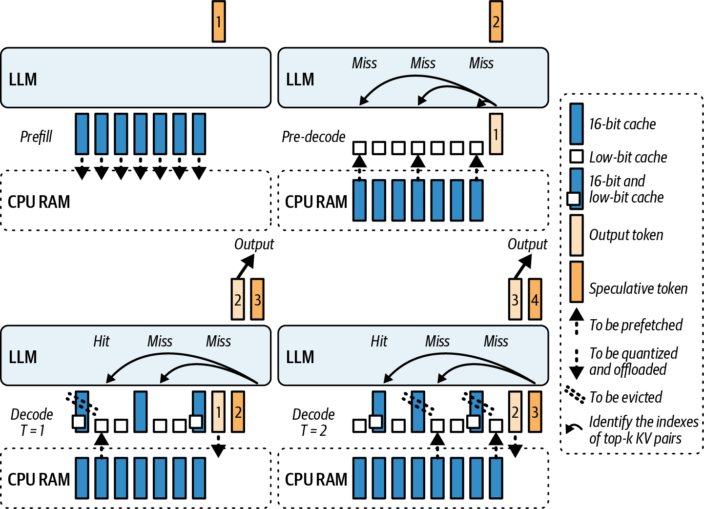

> Figure 19-3. Speculative decoding with SpeCache (source: https://oreil.ly/b21E5)

> 仅在验证访问模式和存储层后集成推测预取技术。

KV缓存可能非常大，因为现代LLM中的层数、LLM上下文窗口大小的不断增加（此时实际上无限）以及现代"思考"模型生成的大量推理链。现代推理系统通常会在GPU、CPU内存和SSD之间交换KV缓存以更好地管理容量--尤其是对于不适合GPU内存的超长上下文。

当生成新token时，朴素方法是以同步方式从其所在位置（GPU上一些，CPU上一些）获取KV数据--然后执行计算以解码下一个token。这可能会为第一个token增加显著延迟--尤其是如果缓存已被分页到CPU内存或NVMe存储。

KV缓存预取通过提前启动KV数据传输来帮助。一旦收到用户的提示，服务器就可以开始将必要的KV页面以及模型权重直接复制到GPU内存中。当模型在预填充阶段完成计算提示时，必要的数据已就位以生成第一个输出token。

具体来说，此机制仅在GPU内存中保留当前层的KV--并将其他层的KV卸载到CPU。它在计算当前层时异步预取下一层的缓存到GPU中。此外，它同时将前一层的缓存写回CPU。

这种通信和计算的重叠意味着GPU很少等待数据。结果是在CPU内存中使用卸载的KV缓存对延迟的影响最小。例如，由于额外的数据传输开销，卸载时您可能会看到约5%-10%较低的tokens/s吞吐量。

> 重叠可以掩盖CPU驻留KV的大部分延迟，但由于CPU DRAM带宽和PCIe开销，通常会保留吞吐量损失。使用您的批次和序列长度反复进行分析。

KV缓存卸载的一个例子是Hugging Face的Transformers库中的OffloadedCache机制。这可以通过调用generate(cache_implementation="offloaded")或generate(cache_implementation="offloaded_static")来启用。这将使用Transformer库生成token，如下所示。这使其成为一种低投入、高影响的优化：

```python
# 动态、可变长度服务和滑动层
# （推荐默认值）
out = model.generate(..., cache_implementation="offloaded")

# 静态形状 + torch.compile和CUDA图
# （固定形状的最高吞吐量，与torch.compile一起使用）
# out = model.generate(..., 
# cache_implementation="offloaded_static")
```

在幕后，当生成开始时，OffloadedCache将确保第1层的KV被移动到GPU。当第1层计算时，OffloadedCache发出从CPU到GPU的第2层KV的异步DMA等。它总是提前一层预取。

当正向传播到达第2层时，其KV已经本地。这减少了如果对每层使用同步复制会发生的停顿。现在我们已经描述了KV预取，让我们转向推测性KV预取。

推测性KV预取超出了常规KV预取的单层前瞻。想象一个具有多个模型副本的推理服务器配置--或多个可能的路径，如MoE模型，其中token可以被路由到多个专家网络之一。

KV预取在阶段之间的边界处有帮助。在预填充阶段结束时，理想情况下，所有层的缓存要么已经在GPU内存中，要么排队进入GPU内存。这直接最小化TTFT，因为一旦生成开始，模型不会等待内存传输。

> KV prefetching helps at the boundary between the phases. By the end of the prefill phase, ideally, the caches for all layers are either already in GPU memory or queued to come into GPU memory. This directly minimizes TTFT since, once generation starts, the model isn't waiting on memory transfers.

> 建议使用NVTX标记等追踪工具持续监控TTFT，以测量第一个token的解码时间。这将精确测量TTFT。如果您在解码阶段开始后立即看到过多的空闲时间峰值，这表明错过了预取机会。

要在自己的堆栈中实现KV预取而不停顿推理，您可以使用CUDA流进行重叠（如第11章所述）。这样，它与您的主计算流并发运行。然后您将使用CUDA事件仅在需要预取数据时同步流，如下所示：

```cpp
// kv_prefetch_overlap.cu

#include <cstdio>
#include <cuda_runtime.h>

// 示例大小
static constexpr size_t KV_BYTES = 
  /* 设置为您的块大小 */ 8ull<<20; // 8 MiB

__global__ void forward_kernel(/* ... */) {
  // 计算当前token的logits...
}

__global__ void consume_prefetched_kv(/* use prefetch_dest */) {
  // 消耗prefetch_dest中的KV...
}

int main() {
  // 在此GPU上分配目标缓冲区
  void* prefetch_dest = nullptr;
  cudaMalloc(&prefetch_dest, KV_BYTES);

  // 示例：在主机上暂存源。必须是固定的才能实现真正的重叠。
  void* kv_src_host = nullptr;
  cudaMallocHost(&kv_src_host, KV_BYTES);  // 固定（页锁定）
  // 用第一次迭代的数据填充kv_src_host...

  cudaStream_t compute_stream, prefetch_stream;
  cudaStreamCreateWithFlags(&compute_stream, 
cudaStreamNonBlocking);
  cudaStreamCreateWithFlags(&prefetch_stream, 
cudaStreamNonBlocking);
  cudaEvent_t kv_ready;
  cudaEventCreateWithFlags(&kv_ready, cudaEventDisableTiming);

  bool done = false;
  while (!done) {
    // 1) 启动当前token的计算
    forward_kernel<<< /*grid*/1, /*block*/1, 0, compute_stream>>>
();

    // 2) 异步预取下一个KV块
    // 如果您的源是另一个GPU，使用cudaMemcpyPeerAsync
    // 并启用对等访问。
    cudaMemcpyAsync(prefetch_dest, kv_src_host, KV_BYTES,
                               cudaMemcpyHostToDevice, 
prefetch_stream);
    cudaEventRecord(kv_ready, prefetch_stream);

    // 3) 确保compute_stream上的消费者及时等待
    cudaStreamWaitEvent(compute_stream, kv_ready, /*flags*/0);

    // 4) 启动消耗预取KV的工作
    consume_prefetched_kv<<< /*grid*/1, /*block*/1, 0, 
compute_stream>>>();

    // 5) ...推进状态，为下一次迭代更新kv_src_host，设置`done`
    done = true; // 演示
  }

  cudaEventDestroy(kv_ready);
  cudaStreamDestroy(prefetch_stream);
  cudaStreamDestroy(compute_stream);
  cudaFree(prefetch_dest);
  cudaFreeHost(kv_src_host);
  return 0;
}
```

在这个设置中，cudaMemcpyAsync在prefetch_stream上运行，而model.forward()使用compute_stream。这允许CUDA驱动程序将数据传输与计算重叠。您仅在计算实际需要预取的KV数据时通过等待kv_ready事件来同步。事件在交接点强制及时同步。

> 确保主机缓冲区是固定的（页锁定）。否则，cudaMemcpyAsync可能会序列化，您将无法获得所需的复制/计算重叠。如果KV源在另一个GPU上，使用cudaMemcpyPeerAsync并启用对等访问。如果您使用统一内存（例如，Grace Blackwell、Vera Rubin超级芯片），考虑使用cudaMemPrefetchAsync提前暂存页面。如果模式可重复，您也可以使用CUDA图捕获此序列。这可以在预取频繁发生时进一步减少内核启动开销。

使用单独的流确保高效的流水线。当一个token正在生成时，下一个token的KV缓存正在被预取而不中断计算流。这通过掩盖传输延迟并保持计算单元持续获得数据来最大化GPU利用率。现代LLM推理引擎以分页KV缓存的形式自动使用此技术。

最好将权重和KV缓存数据移动视为整体推理流水线的一部分。正如您应该流水线化计算操作一样，您也应该流水线化数据移动。始终在当前计算进行时让下一个需要的数据在传输中。KV缓存压缩是提高KV缓存层性能的另一个选择。让我们接下来介绍这个。

## 实时KV缓存压缩和策略切换 (Real-Time KV Cache Compression and Policy Switching)

随着LLM在会话中生成越来越多的token，KV缓存线性增长。对于长对话、文档和推理链，KV缓存消耗大量GPU内存，通常利用最多的GPU内存。

KV缓存是压缩/量化的良好候选者。像任何形式的压缩一样，KV缓存压缩减少其内存占用。

实时进行此操作意味着在推理期间即时执行压缩。策略切换意味着压缩策略可以根据当前上下文更改。目标是在需要时释放内存和网络带宽--而不影响模型精度或减慢涉及KV缓存数据的计算。图19-4显示了几种不同类型的KV缓存压缩算法。


> Figure 19-4. Different KV cache algorithms, including no caching (e.g., dense)

KV压缩的一种直接简单方法是降低其精度。许多框架默认为FP16或BF16用于KV缓存，因为16位通常是模型用于激活的精度。但是，通常可以将键和值压缩到8位甚至4位，对输出质量的影响最小--尤其是对于LLM上下文末尾的token。

Hugging Face的Transformers库支持QuantizedCache，包括用于KV内存的INT8和INT4。此功能可以通过指定cache_implementation="quantized"和特定位宽在一行中启用。结果是以少量额外计算用于量化/反量化操作为代价的大量内存节省。并且在大多数情况下，整体模型质量不会受损。

> 同时使用量化和CPU卸载时，确保主机缓冲区是固定的（页锁定）以防止序列化传输。这将有助于维持复制带宽（例如，PCIe/NVLink）。

接下来，让我们讨论动态策略切换。策略的一个例子是将最后128个token保持全精度，但将其余token压缩为4位。这样，最近的上下文--可能对预测下一个token影响最大--以更高精度保留，而较旧的历史以较低精度存储以节省存储。

如果模型突然需要关注较旧的token，通常不会造成灾难性后果，因为许多LLM无论如何都有近期偏差。这意味着它们优先考虑最近的上下文。这样，输入序列的早期部分可能不会对最终输出产生太大影响。

您可以根据用户提示长度进一步调整此窗口。例如，对于非常长的提示，您可以使用更大的全精度窗口--或者如果GPU内存使用超过阈值，则更积极地压缩。

或者，策略可以基于内存使用。例如，策略可以规定如果GPU内存使用超过80%，应将整个KV缓存压缩为8位。这有助于在长生成期间避免OOM错误。策略可能包括多层压缩，其中系统在轻度压力下将KV缓存压缩为8位，然后在极端压力下更改为4位压缩。

使用真正的动态、实时策略切换，引擎可以在token生成期间更改为不同的压缩。在这种情况下，实现需要同时维护缓存的多个表示。例如，它最初会将KV存储在FP16中，但同时维护相同数据的INT8版本。

系统将默认使用FP16，但如果内存利用率超过某个阈值，它可以开始使用INT8版本--带有适当的缩放因子--并释放FP16内存以缓解内存压力。未来的注意力读取将从INT8存储检索反量化值。

但是，这需要仔细同步，以确保压缩版本在需要时保持最新和准备就绪。在这种情况下，双缓冲和后台压缩线程等技术很有用。

通常，CPU线程可以使用向量化INT8量化操作异步处理压缩。然后可以在准备好时将压缩块复制到GPU内存。

> 在安全点（如迭代结束时）实施实时策略切换。这样，您可以避免中间计算切换，并通过在后台流中进行来隐藏重量化延迟。

还有其他技术，如无损压缩，使用熵编码和聚类来逐位压缩激活而不丢失信息。但是，这些实现很复杂，可能太慢而无法实时进行--即使在GPU上。

应该考虑更简单的机制，如块状ZFP（一种浮点压缩）甚至通用的基于CPU的压缩。但是，到目前为止最简单、最有效且支持良好的方法是量化。

> 截至本文撰写时，像ZFP这样的无损方法在离线和研究环境中进行评估，但由于相对于量化缓存的吞吐量限制，在生产LLM KV缓存路径中仍然不常见。因此，量化仍然是其速度和2-4倍内存减少平衡的首选方法。

为了最小化质量影响，您可以尝试每头和每token缩放。量化KV缓存在使用每头、分组缩放而非每token缩放时最有效。Hugging Face QuantizedCache Transformer实现校准每个注意力头的值范围。

具体来说，QuantizedCache实现了具有可配置组大小和保留最近token原始精度的残差窗口的每通道、分组量化。您通过设置cache_implementation="quantized"并传递cache_config作为字典来启用它。您可以计算张量中的最大绝对值，并相应缩放4位或8位量化。这本质上是一种最小-最大或基于幅度的量化形式。

QuantizedCache的一个有用实现是半二次量化（HQQ）后端。HQQ提供了一个免校准、即时量化器，支持广泛的低位格式，包括2位、3位、4位和8位。它使用稳健的优化来建模异常值和重尾误差分布。HQQ很好地集成到Hugging Face Transformers的KV缓存实现中。它提供PyTorch和自定义CUDA内核实现以进行快速推理。

我们可以实现一个动态策略，可以根据内存压力在8位量化和4位量化之间切换。值的锐度或分布也可能指导决策。如果缓存值大多很小且方差低，它们通常可以更积极地量化。实时切换压缩策略可以与Hugging Face QuantizedCache机制集成。

不幸的是，Transformers不支持就地更改已初始化缓存对象的位宽。但是，要实现动态策略，我们的代码可以以小块生成token，并在内存压力下，即时以新的量化缓存配置开始下一个块。此实现类似于在遇到内存不足（OOM）错误时回退到卸载缓存。以下是代码：

```python
# dynamic_quantized_cache.py
# 使用Hugging Face Transformers的QuantizedCache进行动态KV缓存策略（2025）。
# 从int8 HQQ开始，当设备内存紧张时降到int4。
# 需要：transformers >= 4.55, hqq（用于HQQ后端）。
#
# 这仅使用公共API：
#   - cache_implementation="quantized"
#   - cache_config作为字典
#
# 参考：
#   - KV缓存策略文档（QuantizedCache, HQQ/Quanto后端）

from __future__ import annotations
from typing import Dict, Optional
import logging
import torch
from transformers import AutoModelForCausalLM, AutoTokenizer


def make_cache_config(
    *,
    backend: str,
    nbits: int,
    device: torch.device,
    compute_dtype: torch.dtype = torch.float16,
    q_group_size: int = 64,
    residual_length: int = 128,
    axis_key: int = 1,
    axis_value: int = 1,
) -> Dict:
    """
    构建Transformers量化缓存接受的cache_config字典。
    HQQ支持nbits在{2, 4, 8}中；Quanto支持{2, 4}。
    axis_key/axis_value=1是HQQ推荐的。
    """
    return {
        "backend": backend,                 # "HQQ"或"quanto"
        "nbits": int(nbits),
        "axis_key": axis_key,
        "axis_value": axis_value,
        "q_group_size": int(q_group_size),  # head_dim方向的组大小
        "residual_length": int(residual_length), # 最近token（原始精度）
        "compute_dtype": compute_dtype,     # 反量化计算dtype
    }


def _gpu_used_ratio() -> float:
    """
    返回设备内存使用比例为1 - free/total。
    使用CUDA驱动程序信息，反映真实设备状态，
    不仅仅是PyTorch分配器的保留字节。
    """
    free, total = torch.cuda.mem_get_info()
    return 1.0 - (free / total)


@torch.no_grad()
def generate_with_dynamic_quantized_cache(
    model: AutoModelForCausalLM,
    tokenizer: AutoTokenizer,
    prompt: str,
    *,
    max_new_tokens: int = 256,
    chunk_tokens: int = 32,
    memory_threshold: float = 0.90,   # 如果used_ratio >= threshold则切换策略
    backend: str = "hqq",             # "hqq"或"quanto"
    start_bits: int = 8,              # 初始缓存位宽
    fallback_bits: int = 4,           # 压力下的较低位宽
    residual_length: int = 128,
) -> str:
    """
    以块为单位生成文本，同时允许运行中策略更改。
    策略通过为每个块选择cache_config应用于每个块。
    如果内存紧张，我们在后续块中从int8切换到int4。
    """
    backend = backend.lower()
    assert backend in {"hqq", "quanto"}, "backend必须是'hqq'或'quanto'"
    if backend == "quanto":
        assert start_bits in {2, 4} and fallback_bits in {2, 4}, \
               "Quanto仅支持2或4位"
    if backend == "hqq":
        assert start_bits in {2, 4, 8} and fallback_bits in {2, 4, 8}, \
               "HQQ支持2、4或8位"

    device = model.device
    inputs = tokenizer(prompt, return_tensors="pt").to(device)
    generated_ids = inputs["input_ids"]   # [batch=1, seq_len]
    tokens_remaining = int(max_new_tokens)
    current_bits = int(start_bits)

    # 如果可用，使用EOS提前终止。
    eos_id: Optional[int] = tokenizer.eos_token_id

    while tokens_remaining > 0:
        # 根据当前内存压力决定此块的策略。
        if torch.cuda.is_available():
            # 平滑信号以避免振荡
            # 当多个进程活跃时。
            if 'used_ratio' in locals():
                used_ratio = 0.8 * used_ratio + 0.2 * _gpu_used_ratio() 
            else:
                used_ratio = _gpu_used_ratio()
            if used_ratio >= memory_threshold:
                current_bits = min(current_bits, fallback_bits) # 降位
                logging.info(f"Current bits {current_bits}")

        cache_cfg = make_cache_config(
            backend=backend,
            nbits=current_bits,
            device=device,
            compute_dtype=torch.bfloat16,  
            q_group_size=64,
            residual_length=residual_length,
            axis_key=1,
            axis_value=1,
        )

        # 使用所选缓存策略生成一个小块。
        this_chunk = min(chunk_tokens, tokens_remaining)
        out = model.generate(
            input_ids=generated_ids,
            max_new_tokens=this_chunk,
            do_sample=False,       # 为清晰起见确定性；根据需要调整
            use_cache=True,
            cache_implementation="quantized",          # 选择QuantizedCache
            cache_config=cache_cfg,                    # 传递后端+设置
            pad_token_id=eos_id,
            return_dict_in_generate=False,        # 我们这里只需要token
        )
        # 'out'是[1, old_len + this_chunk]；切片出新生成的后缀
        new_tokens = out[:, generated_ids.shape[1]:]
        generated_ids = out
        tokens_remaining -= new_tokens.shape[1]

        # 如果模型发出EOS则提前终止。
        if eos_id is not None and int(new_tokens[0, -1].item()) == eos_id:
            break

    return tokenizer.decode(generated_ids[0], skip_special_tokens=True)


if __name__ == "__main__":
    # 示例用法。替换为支持您硬件的模型。
    ckpt = "meta-llama/Llama-3.1-8B-Instruct"
    tok = AutoTokenizer.from_pretrained(ckpt)
    mdl = AutoModelForCausalLM.from_pretrained(ckpt, 
                                            
torch_dtype=torch.float16).to("cuda")

    text = generate_with_dynamic_quantized_cache(
        mdl,
        tok,
        "Explain attention key-value caches in one paragraph.",
        max_new_tokens=120,
        chunk_tokens=32,
        memory_threshold=0.90,
        backend="hqq",         # 或"quanto"如果您安装了Quanto
        start_bits=8,
        fallback_bits=4,
        residual_length=128,
    )
    print(text)
```

在这里，我们从INT8 HQQ缓存开始进行适度压缩，当实际GPU空闲内存降至阈值以下时切换到INT4。这是使用torch.cuda.mem_get_info()测量的，它反映真实的空闲与总设备内存。这为策略选择提供了正确的信号。

然后我们以小块生成token，以便我们可以安全地在块之间切换策略，而无需尝试改变现有缓存实例。这避免了深入私有属性或手动量化张量。缓存后端在模型的正向传播内完成工作。

> 如本示例所示，建议在策略切换时记录事件或增加计数器。这样，您可以将压缩事件与任何精度或输出异常相关联。

类似地，如果条件改善，您可以动态关闭压缩。

假设一个长对话刚刚结束，下一个问题很短。系统可能决定停止压缩，甚至如果会产生更好的质量响应，将一些缓存恢复到更高精度。差异可能很小，所以可能不值得。

重要的是避免压缩的快速波动，因为过于频繁地开关压缩可能会损害性能。为此，您可以引入更改之间的故意延迟（又称滞后和冷却）。例如，如果更改了更高压缩策略，请保持它直到GPU内存远低于给定阈值。这样，您可以避免振荡和抖动。

拥有这种灵活性很有用，例如，如果您的服务有时为高级用户优先考虑最高质量（无压缩）与为免费用户优先考虑最大吞吐量（重度压缩）。策略也可以根据请求元数据切换，包括用户的订阅类型。

如果不考虑驱逐策略（如最近最少使用（LRU）驱逐），关于缓存的讨论就不完整。如果上下文长度变得太长，一些模型架构--如具有近期偏差或滑动窗口注意力的架构--可能会选择完全丢弃或下采样非常旧的token。滑动窗口注意力如图19-5所示。

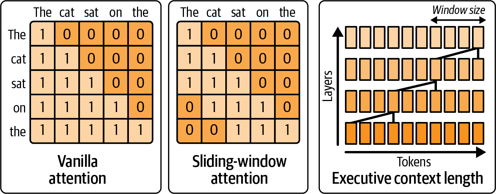

> Figure 19-5. Sliding-window attention uses the intuition that the most useful tokens are the most recent

虽然从上下文中驱逐早期token的LRU驱逐并不完全是压缩，但它是可以在运行时动态选择的另一种策略类型。例如，系统可以决定，超过2,048个token后，模型可能不需要早期token--基于一些启发式或较小的LLM。

在这种情况下，系统可以开始丢弃那些较旧的token--或定期将它们压缩成较小的摘要。这开始进入模型和算法领域--需要更多支持、维护和模型训练--但它是高级服务引擎中应考虑的一种动态上下文管理形式。

简而言之，您应该考虑推理引擎提供的量化缓存机制，因为它们可以处理维护量化缩放因子、与注意力内核接口以及在运行时监控GPU内存分配器的细节。至少，当系统看到内存利用率接近某个限制时，记录该情况，看看此时启用压缩策略是否可以在不影响延迟的情况下避免OOM。

> 在生产中，在GPU内存上设置高水位阈值（例如80%）以触发8位压缩已被证明在防止OOM崩溃方面有效。

如果使用动态压缩策略有意义，您可以实现触发器。与任何量化和压缩策略一样，请务必测试它们对您特定领域模型输出的影响。许多生成任务可以容忍激进压缩，但始终最好验证使用4位与8位不会引入错误或意外输出。

## 基于强化学习的运行时策略调优 (RL-Based Runtime Policy Tuning)

现代LLM推理引擎有多个可调旋钮，包括批次大小、并行策略、精度模式和缓存策略。手动调优这些参数以在所有条件下获得最佳性能几乎是不可能的。

强化学习（RL）为系统学习自己的调优策略提供了一个框架。通过将推理引擎视为一个环境，RL代理可以学习选择最大化性能指标的动作，如吞吐量和延迟。

基于RL的调优涉及将推理服务设置表述为马尔可夫决策过程（MDP）。系统状态包括当前工作负载指标（如队列长度、GPU内存使用率、活跃请求数、平均序列长度等）以及硬件状态（如温度、功耗、SM占用率）。

动作包括调整参数，如批次大小、并行策略、精度级别或内核选择。奖励是目标函数，如吞吐量减去延迟惩罚，或满足SLO的请求百分比。

在每个决策间隔，代理观察当前状态并选择一个动作。然后系统执行推理工作负载一段时间。之后，代理接收奖励并观察新状态。代理更新其策略以最大化累积奖励。

这种方法可以学习复杂的非线性策略。例如，当队列很长且GPU内存充足时，代理可能会学会增加批次大小。当延迟接近SLO限制时，它可能会学会降低批次大小。当检测到长序列时，它可能会学会切换到流水线并行。

一个实际示例是使用深度Q网络（DQN）或近端策略优化（PPO）来学习批次大小策略。状态包括队列长度、当前批次大小、平均延迟和GPU利用率。动作是增加、减少或保持批次大小。奖励是吞吐量减去延迟惩罚。

```python
# 伪代码：RL代理用于批次大小调整
state = [queue_length, current_batch, avg_latency, gpu_util]
action = rl_agent.select_action(state)
if action == "increase":
    batch_size = min(batch_size + 1, max_batch)
elif action == "decrease":
    batch_size = max(batch_size - 1, 1)
# 运行推理并测量奖励
throughput, latency = run_inference(batch_size)
reward = throughput - latency_penalty * max(0, latency - sla_target)
rl_agent.update(state, action, reward, new_state)
```

基于RL的调优可以适应工作负载分布的变化。如果流量模式改变--例如从短提示变为长提示--代理会自动学习新的最优策略。这比静态配置更稳健。

然而，RL需要仔细设计。奖励函数必须准确反映目标。探索策略必须平衡尝试新配置与利用已知良好配置。训练时间可能很长，因此通常先在模拟或离线数据上训练，然后在线微调。

> 建议在部署前使用历史工作负载数据离线训练RL代理。然后使用在线学习进行微调。这减少了生产中探索阶段的风险。

基于RL的调优也可以应用于其他决策，如内核选择。代理可以学习为特定输入大小选择最佳内核变体。或者它可以学习何时启用推测性解码或KV缓存压缩。

高级系统使用多智能体RL，其中不同的代理控制不同的子系统。一个代理可能控制批次大小，另一个控制精度，第三个控制缓存策略。代理协调以优化全局目标。

基于RL的调优是一个活跃的研究领域。它承诺使推理系统自主优化，减少手动调优的需求。随着LLM变得更加复杂和工作负载更加多样化，这种自适应能力将变得越来越重要。

> Modern LLM inference engines have multiple tunable knobs, including batch size, parallelism strategy, precision mode, and caching policy. Manually tuning these parameters for optimal performance under all conditions is nearly impossible. Reinforcement learning (RL) provides a framework for the system to learn its own tuning policy. By treating the inference engine as an environment, an RL agent can learn to select actions that maximize performance metrics, such as throughput and latency. RL-based tuning involves formulating the inference serving setup as a Markov Decision Process (MDP). The system state includes current workload metrics (e.g., queue length, GPU memory usage, number of active requests, average sequence length, etc.) and hardware status (e.g., temperature, power consumption, SM occupancy). Actions include adjusting parameters like batch size, parallelism strategy, precision level, or kernel selection. The reward is the objective function, such as throughput minus latency penalty, or percentage of requests meeting SLOs. At each decision interval, the agent observes the current state and selects an action. The system then executes the inference workload for a period. Afterward, the agent receives the reward and observes the new state. The agent updates its policy to maximize cumulative reward. This approach can learn complex nonlinear policies. For instance, the agent might learn to increase batch size when the queue is long and GPU memory is ample. It might learn to decrease batch size when latency approaches the SLO limit. It might learn to switch to pipeline parallelism when long sequences are detected. A practical example is using Deep Q-Network (DQN) or Proximal Policy Optimization (PPO) to learn a batch-size policy. The state includes queue length, current batch size, average latency, and GPU utilization. The action is to increase, decrease, or maintain batch size. The reward is throughput minus latency penalty. RL-based tuning can adapt to changes in workload distribution. If traffic patterns change-for example, from short prompts to long prompts-the agent automatically learns the new optimal policy. This is more robust than static configuration. However, RL requires careful design. The reward function must accurately reflect the objectives. The exploration strategy must balance trying new configurations with exploiting known good configurations. Training time can be long, so it's common to train first in simulation or on offline data, then fine-tune online. It's recommended to train the RL agent offline using historical workload data before deployment. Then use online learning to fine-tune. This reduces the risk of the exploration phase in production. RL-based tuning can also be applied to other decisions, such as kernel selection. The agent can learn to choose the best kernel variant for specific input sizes. Or it can learn when to enable speculative decoding or KV cache compression. Advanced systems use multi-agent RL, where different agents control different subsystems. One agent might control batch size, another precision, and a third caching policy. The agents coordinate to optimize the global objective. RL-based tuning is an active research area. It promises to make inference systems self-optimizing, reducing the need for manual tuning. As LLMs become more complex and workloads more diverse, this adaptive capability will become increasingly important.

## 动态内存分配器管理 (Dynamic Memory Allocator Management)

GPU内存分配是推理性能的关键因素。PyTorch的默认内存分配器使用缓存分配策略，为未来使用保留已释放的内存。这减少了分配开销，但可能导致内存碎片和次优使用。

动态内存分配器管理涉及在运行时切换或配置内存分配器以优化性能。不同的分配器有不同的权衡。例如，cudaMallocAsync提供低延迟分配，但可能不适合所有工作负载。

PyTorch允许通过PYTORCH_ALLOC_CONF环境变量配置内存分配器。您可以选择不同的后端，如cudaMallocAsync或带池的cudaMalloc。您还可以设置分割大小阈值和释放阈值。

动态分配器管理的一个用例是处理内存压力。当GPU内存使用率高时，系统可以切换到更激进的释放策略。这可能会增加分配延迟，但可以避免OOM错误。

另一个用例是优化碎片。长时间运行的推理服务可能会累积内存碎片。系统可以定期整理内存或切换到减少碎片的分配器。

一些高级系统使用自定义内存分配器。这些分配器可能针对特定工作负载进行优化。例如，它们可能为KV缓存使用池分配器，为激活使用单独的池。

实现动态分配器管理需要小心。切换分配器需要释放所有当前分配。这通常需要重启推理进程或重新加载模型。因此，动态切换通常在维护窗口或请求间隙进行。

一个实际方法是使用子进程进行推理。主进程监控内存使用和性能。当需要切换分配器时，主进程启动一个具有新分配器配置的新子进程。新请求被路由到新子进程。旧子进程在完成当前请求后关闭。

```python
import os
import torch

def run_with_allocator(allocator_conf, model_factory, request):
    """在具有指定分配器配置的子进程中运行推理。"""
    env = os.environ.copy()
    env["PYTORCH_ALLOC_CONF"] = allocator_conf
    # 启动子进程并运行推理
    # ...
```

这种方法允许在不完全重启服务的情况下切换分配器。它还隔离了内存空间，防止单个推理会话的内存泄漏影响整个系统。

> 建议为长期运行的推理服务实现分配器监控。跟踪内存碎片率、分配延迟和OOM事件。当指标超过阈值时，考虑切换分配器或重启进程。

动态内存分配器管理是一个高级主题。它需要对GPU内存行为有深入了解。然而，对于大规模推理服务，它可以是优化性能和稳定性的有力工具。

> GPU memory allocation is a critical factor in inference performance. PyTorch's default memory allocator uses a caching allocation strategy, retaining freed memory for future use. This reduces allocation overhead but can lead to memory fragmentation and suboptimal usage. Dynamic memory allocator management involves switching or configuring memory allocators at runtime to optimize performance. Different allocators have different trade-offs. For instance, cudaMallocAsync provides low-latency allocation but may not suit all workloads. PyTorch allows configuring the memory allocator through the PYTORCH_ALLOC_CONF environment variable. You can choose different backends, such as cudaMallocAsync or cudaMalloc with pooling. You can also set segmentation size thresholds and release thresholds. One use case for dynamic allocator management is handling memory pressure. When GPU memory usage is high, the system can switch to a more aggressive release strategy. This might increase allocation latency but can avoid OOM errors. Another use case is optimizing fragmentation. Long-running inference services can accumulate memory fragmentation. The system can periodically defragment memory or switch to an allocator that reduces fragmentation. Some advanced systems use custom memory allocators. These allocators might be optimized for specific workloads. For example, they might use pool allocators for KV cache and separate pools for activations. Implementing dynamic allocator management requires care. Switching allocators requires freeing all current allocations. This typically requires restarting the inference process or reloading the model. Therefore, dynamic switching is usually done during maintenance windows or request gaps. A practical approach is to use subprocesses for inference. The main process monitors memory usage and performance. When an allocator switch is needed, the main process starts a new subprocess with the new allocator configuration. New requests are routed to the new subprocess. The old subprocess is shut down after completing current requests. This approach allows switching allocators without a full service restart. It also isolates memory spaces, preventing memory leaks in a single inference session from affecting the entire system. It's recommended to implement allocator monitoring for long-running inference services. Track memory fragmentation rate, allocation latency, and OOM events. When metrics exceed thresholds, consider switching allocators or restarting the process. Dynamic memory allocator management is an advanced topic. It requires deep understanding of GPU memory behavior. However, for large-scale inference services, it can be a powerful tool for optimizing performance and stability.

## 运行时内核性能改进和热交换实现 (Runtime Kernel Performance Improvements and Hot-Swappable Implementations)

在GPU硬件和算法创新快速发展的世界中，新的、更快的内核实现不断涌现。这包括FlashAttention的新变体、megakernel和硬件特定的软件优化。

运行时内核修补是将新实现集成到运行系统中而无需完全重新部署或重新加载模型的能力。本质上，我们希望即时热交换一个较慢的内核函数为一个更快的内核函数。

考虑您的推理服务器使用默认的PyTorch缩放点积注意力（SDPA）内核进行多头注意力。然后您发现了一个新的内核实现，如FlashAttention-3，在某些情况下为长序列提供20%的加速。

传统上，您必须安装更新的库并重启服务器才能使用新实现。但通过运行时修补，您可以在运行时动态加载并将调用重定向到新内核，而不会中断服务器的正常运行时间。

这种零停机升级方法在24/7服务中至关重要，因为重启或模型重新加载会导致太多延迟或导致停机。在Python中，这可以是一个简单的猴子补丁，如下所示：

```python
import new_flash_attn_lib

# 猴子补丁模型的注意力forward以使用新库
old_attn_forward = model.transformer.self_attn.forward

def new_attn_forward(self, *args, **kwargs):
    return new_flash_attn_lib.forward(*args, **kwargs)

model.transformer.self_attn.forward = new_attn_forward.__get__(
    model.transformer.self_attn,
    type(model.transformer.self_attn))
```

此代码将注意力模块的forward方法替换为调用我们的new_flash_attn_lib.forward的方法。我们将它绑定到实例（__get__）以模拟一个正确的方法。在此补丁之后，对该注意力层的后续调用将通过新实现。这样，我们就有效地热交换了内核。

> 确保new_flash_attn_lib.forward()是直接替换兼容的--并且已经过彻底测试以在可接受的数值容差内产生相同的输出。这样，您可以避免任何模型质量回归。

另一种技术是JIT修补，它使用即时编译器（如PyTorch Inductor或OpenAI Triton）在运行时生成更快的内核--然后将其插入推理流水线。如下所示，可以使用PyTorch的torch.compile优化函数并返回其编译版本：

```python
compiled_forward = torch.compile(model.transformer.self_attn.forward,
                                  backend="inductor")

model.transformer.self_attn.forward = compiled_forward
```

现在，每当调用forward时，它将执行优化后的代码，这将融合多个操作等。如果我们在模型初始化后执行此操作，这是一种热修补形式，因为它不需要模型重新加载。它只是交换函数指针。

在CUDA方面，使用CUDA驱动程序API可以进行运行时模块加载。例如，您可以为新内核编译自定义PTX--并在不重置设备的情况下将其加载到上下文中。如果函数签名匹配，系统只需更新函数指针。像NVIDIA运行时编译（NVRTC）这样的工具可以在运行时从字符串编译PTX，从而实现此工作流程。

使用CUDA C++做这件事有点复杂。像Python的猴子补丁机制或PyTorch的可扩展后端这样的高级方法在长期内可能更实用和可维护。但是，您的高性能推理引擎可能不使用Python/PyTorch运行时。

> 进行这种类型的热交换时，保证线程安全很重要。例如，您应该排空传入请求队列或使用屏障来确保没有其他线程正在您修补的函数中间。这将避免与运行线程的竞争条件。这类似于操作系统内核加载模块的方式--需要仔细同步，但它避免了完全重启。

使用定义良好的模块边界--如分离注意力和MLP内核--使交换内部组件更容易。这主张以高度模块化的方式编写模型代码，以便您拥有这些交换点。单体模型实现更难修补，但它们可能更高效（例如，megakernel）。

当然，必须确保新内核产生与旧实现相同或可接受接近的结果。通常，这些优化内核设计为在相同精度（例如，FP16）下数值等效。

热修补也可用于快速修复。也许特定的操作序列在当前内核中导致已知错误。您可以快速修补修复程序，而不是等待完整更新，而不是等待完整更新。

考虑部署一个FP8内核，它开始对您未预期的某些边缘输入行为异常。如果您有一个更安全但稍慢的版本，您可以检测异常行为条件并在这些情况下热交换安全内核。确保记录这些事件以供将来分析。

> 考虑通过将一小部分流量路由到新内核来进行分阶段推出（影子测试或金丝雀）。然后您可以使用遥测来比较延迟和吞吐量指标与旧内核。如果新内核按预期执行且其输出与预期结果匹配，您可以将其发布给所有用户。

要管理多个可能的实现，引擎可能维护一个注册表，如attention_impl = "fast"或"safe"--并相应分支。这可以实现为功能标志，以便您可以在不更改代码的情况下切换实现。这对于快速回滚很有用，只需更改标志即可（只需确保您的代码主动从功能标志系统读取值--否则标志值保持静态，这违背了功能标志的目的）。

设计良好的推理引擎还应测量新内核的运行时性能。如果新内核在实时生产数据上不更快，推理引擎可以回滚它。这可能是由于稍微不同的硬件、未测试的批次大小或未测试的负载条件。

这是前一部分描述的自动调优的完美形式。如果自动调优器发现一个比当前默认实现快超过某个阈值的更快实现，系统可以触发"修补"以将更快实现提升为未来的默认值。

这有效地关闭了与自动调优器的循环。系统不仅在即时发现更好的内核，而且还交换它们。这导致了自优化的内核选择机制。

您可以将此策略与我们讨论的先前RL策略结合使用。这样，您可以加载多个实现--并让RL代理为每种不同类型的请求选择使用哪一个。

> 请注意在内存中维护多个实现所需的开销。添加的代码大小不应从指令缓存中驱逐其他关键代码--或耗尽GPU内存。

例如，高度优化的内核可能最适合长序列，但更简单的内核实现对于短序列可能就足够了。运行时系统可以根据每个请求在它们之间选择。这根据输入序列的长度有效地按请求修补。

简而言之，运行时内核修补是关于灵活性。它承认今天最优的可能明天会改变，并提供了快速适应的手段。这种敏捷性确保您的服务基础设施跟上模型加速技术的快速进步。像vLLM、SGLang、NVIDIA TensorRT-LLM和NVIDIA Dynamo这样的流行推理引擎架构良好，并提供了大量的动态能力。例如，TensorRT-LLM允许您使用运行时插件加载优化内核。利用这些能力为您带来优势。

> In the fast-evolving world of GPU hardware and algorithmic innovations, new and faster kernel implementations are constantly emerging. This includes newer variants of FlashAttention, megakernels, and hardware-specific software optimizations. Runtime kernel patching is the ability to integrate these new implementations into a running system without requiring a full redeployment or reload of the model. Essentially, we want to hot-swap a slower kernel function for a faster one on the fly. Consider your inference server that uses the default PyTorch scaled dot product attention (SDPA) kernel for multiheaded attention. You then discover a new kernel implementation like FlashAttention-3, which gives a 20% speed boost for long sequences in some cases. Traditionally, you'd have to install the updated library and restart the server to use the new implementation. But with runtime patching, you can dynamically load and redirect calls to the new kernel during runtime without interrupting the server's uptime. This zero-downtime upgrade approach is crucial in 24/7 services in which a restart or model reload would incur too much latency or cause an outage. In Python, this can be an easy monkey patch, as shown here: ... This code replaces the forward method of the attention module with one that calls our new_flash_attn_lib.forward. We bind it to the instance (__get__) to simulate a proper method. After this patch, subsequent calls to that attention layer will go through the new implementation. As such, we have effectively hot-swapped the kernel. Make sure that new_flash_attn_lib.forward() is drop-in compatible-and that it has been thoroughly tested to produce identical outputs within acceptable numerical tolerances. This way, you avoid any model-quality regressions. Another technique is JIT patching, which uses a just-in-time compiler like PyTorch Inductor or OpenAI Triton to generate a faster kernel at runtime-and then plugging it into the inference pipeline. As shown next, one can use PyTorch's torch.compile to optimize a function and return its compiled version: ... Now, whenever forward is called, it will execute the optimized code, which will fuse multiple operations, etc. If we do this after model initialization, it's a form of hot patching since it does not require a model reload. It simply swaps out function pointers. On the CUDA side, runtime module loading is possible using CUDA driver APIs. For instance, you can compile a custom PTX for a new kernel-and load it into the context without resetting the device. If the function signatures match, the system would just update the function pointers. Tools like NVIDIA Runtime Compilation (NVRTC) can compile PTX from strings at runtime, enabling this workflow. Doing this with CUDA C++ is a bit complex. Higher-level approaches like Python's monkey-patch mechanism-or PyTorch's extensible backends-are likely more practical and maintainable in the long term. However, your high-performance inference engine is likely not using a Python/PyTorch runtime. When doing this type of hot swapping, it's important to guarantee thread safety. For example, you should drain the incoming-request queue or use a barrier to make sure that no other thread is in the middle of the function you're patching. This will avoid race conditions with running threads. This is similar to how OS kernels load modules-careful synchronization is needed, but it avoids full restarts. Using well-defined module boundaries-like separating attention and MLP kernels-makes it easier to swap internals. This argues for writing your model code in a highly modular way so that you have these swap points. Monolithic model implementations are much harder to patch, but they can be more performant (e.g., megakernels). Of course, one must ensure that the new kernel produces identical-or acceptably close-results to the old implementation. Typically these optimized kernels are designed to be numerically equivalent at the same precision (e.g., FP16). Hot patching can also be used for quick fixes. Perhaps a particular sequence of operations is causing a known bug in the current kernel. Instead of waiting for a full update, you could quickly patch in a fix. Consider deploying an FP8 kernel that starts to misbehave for certain edge inputs that you didn't anticipate. If you have a safer but slightly slower version, you can detect the misbehaving condition and hot swap in the safe kernel in those cases. Make sure you log these events for future analysis. Consider a phased rollout by routing a small percentage of traffic to the new kernel (shadow testing or canary). You can then use telemetry to compare the latency and throughput metrics against the old kernel. If the new kernel is performing as expected and its output matches the expected results, you can release it to all users. To manage multiple possible implementations, an engine might maintain a registry, such as attention_impl = "fast" or "safe"-and branch accordingly. This can be implemented as a feature flag so that you can toggle implementations without code changes. This is useful for quick rollbacks simply by changing the flag (just make sure your code is actively reading the values from the feature-flag system-otherwise the flag value remains static, which defeats the purpose of a feature flag). A well-designed inference engine should also measure runtime performance of the new kernel. If the new kernel is not faster with live production data, the inference engine can roll it back. This can be due to slightly different hardware, untested batch sizes, or untested load conditions. This is a perfect form of autotuning, described in the previous section. If the autotuner finds a faster implementation that outperforms the current default implementation beyond some threshold, the system could trigger a "patch" to promote the faster implementation to the default going forward. This effectively closes the loop with the autotuner. The system not only finds better kernels on the fly, but it also swaps them in. This leads to a self-optimizing kernel-selection mechanism. You can combine this strategy with the previous RL strategy we discussed. This way, you can have multiple implementations loaded-and let the RL agent choose which one to use for each different type of request. Be mindful of the overhead needed to maintain multiple implementations in memory. The added code size should not evict other critical code from the instruction cache-or exhaust GPU memory. For instance, a highly optimized kernel might be best for long sequences, but a simpler kernel implementation might be fine for short sequences. A runtime system could choose between them per request. This effectively patches on a per-request basis based on the length of the input sequence. In short, runtime kernel patching is about flexibility. It acknowledges that what is optimal today might change tomorrow and provides the means to adapt quickly. This type of agility makes sure that your serving infrastructure keeps up with the rapid advancements in model acceleration techniques. Popular inference engines like vLLM, SGLang, NVIDIA TensorRT-LLM, and NVIDIA Dynamo are well architected and provide a good amount of dynamic capabilities. For example, TensorRT-LLM allows you to load optimized kernels using runtime plugins. Use these capabilities to your advantage.

## 使用时间序列预测持续预热CUDA图和缓存 (Continuous Prewarming of CUDA Graphs and Caches Using Time-Series Prediction)

在高吞吐量推理情况下，冷启动开销可能是请求-响应延迟的重要贡献因素。CUDA图（如第12章所述）允许您捕获一系列GPU操作并以最小的启动开销重放该序列。

预热CUDA图意味着在实际需要之前设置图。如果我们能预测何时会出现某种请求类型或批次大小，预热的CUDA图将准备好执行。

这种技术依赖于预测准确性。如果您的预测错误，您可能会预热一个未使用的图。您应该监控预测命中率以确保优化正在产生回报。

通过预热，当请求实际到达时，图可以跳过昂贵的启动和初始化步骤。使用ARIMA和Prophet等时间序列预测算法，系统预测未来的工作负载模式，包括流量激增和批次大小变化，以主动准备图以快速执行。

考虑一个推理服务，观察到每日周期，每天上午9点，由于时区相关的流量模式，用户流量会出现激增。知道这一点，系统可以在上午9点之前预运行几个请求，将模型加载到GPU缓存中，JIT编译必要的内核，并为预期的批次大小捕获CUDA图。在上午9点，当实际流量负载激增时，传入请求将重用预期批次大小和使用模式的预热状态。

在实践中，这可以由类似cron的作业或调度服务编排，在预期流量激增发生之前触发预热例程。只需记得留出足够的时间来配置资源。

在PyTorch中，将模型的计算包装在torch.cuda.graph()上下文中允许您捕获包含GPU内核启动的静态计算图。重放图时，PyTorch绕过Python到CUDA的调度开销，并通过单个cudaGraphLaunch提交整个工作负载。这导致显著更快的执行--尤其是对于大型、重复的输入批次，因为CPU参与最小。

缺点是这些图是静态的，因为它们不容易允许可变形状或长度。但推理服务器通常处理不同的批次大小（1、2、4、8、16等）--由于GPU内存限制和算法优化--这很适合图模型。

为了处理可变性，您可以为每个常见批次大小或序列长度维护一个预捕获图的池。您可以使用持续预热策略为这些不同的批次大小准备图池。例如，批次大小为16的请求在高峰时段很常见。服务器可以使用批次大小为16预先捕获模型前向传播的图--然后存储它以供后续使用。

下次同时进来一批16个请求时，推理系统将批处理输入输入到预捕获的图中。内部的内核已经预热并针对图执行进行了优化，因此无需排队和启动许多单独的操作，因为只需要一个图启动。

> 请记住，存储在池中的每个捕获图将为其工作空间消耗额外的GPU内存。存储许多图时应监控内存使用。如果内存紧张，可能需要从池中驱逐较少使用的图。

为了避免池的额外内存，您可能可以使用图修补（在第12章中讨论）来调整图节点以适应微小的大小差异。然而，在实践中，池是性能的更好选择。

CUDA图还减少了CPU开销，因为它只协调单个图启动而不是许多单独的内核启动。这让CPU执行其他操作，如数据预处理和其他类型的"真正"工作--而不是协调许多内核启动。

同样，您可以使用时间序列预测算法（例如，ARIMA和Prophet）来预测RPS和平均提示长度等指标。如果模型预测批次大小跳跃或特定模式的请求，如长输入序列，系统可以开始准备和预热适当的CUDA图、缓存和其他资源。例如，系统可以主动增加连续批处理算法的批次大小，将模型权重从磁盘预取到GPU内存，并分配额外的GPU实例。

> 频繁使用最近的流量数据重新训练和更新这些时间序列模型很重要。这是因为使用模式可能会随着新用户群体的上线等而随时间改变。此外，意想不到的"假期"，如加州著名的滑雪周，可能会意外增加负载曲线--就像我搬到加州后在Netflix遇到的那样！

与缓存和预热相关的是预期预填充和解码工作器的扩展。如果我们知道由于计划的批处理作业或每日报告场景，一堆具有长提示的请求可能会在某个时间到达，系统可以扩展预填充工作器并使用代表性样本数据执行代表性前向传播以预热CUDA图和KV缓存。

扩展和预热事件还应包括解码工作器和CUDA图。在解码情况下，例如，推测性解码草稿模型可以预热并加载到GPU内存中--以及草稿模型的KV缓存等。其他解码优化包括为固定数量的将生成的token进行循环展开--要么是1个token，要么在推测性解码的情况下是多个。

您还应考虑缓存CUDA内核本身。CUDA通常会缓存编译的内核（C++代码 => PTX指令 => SASS汇编）以加速执行。第一次运行内核时，可能会有一些即时JIT编译开销。

您应该将这种类型的预热与集群自动伸缩器协调，以便当新的GPU实例启动时，自动伸缩器使用一些预热API调用在它们上运行快速推理集。这样做将验证推理引擎、缓存JIT编译输出、分配内存池、准备CUDA图等。这样，引擎在添加到实时流量池之前已准备好生产。

> 使用您对系统的知识在此受控预热阶段识别和调用尽可能多的不同路径。这包括每个批次大小、CUDA图变体等。

您还应通过比较有预热和无预热情况下预测激增期间前几个请求的延迟来监控预热是否实际有帮助。根据需要调整时间和阈值。并注意时间序列预测可能是错误的。确保预热任务在错误时间运行时不会影响整体推理性能。

例如，您应该在GPU利用率不足时尝试执行预热运行（使用示例数据）。CUDA允许流优先级调度，因此您可以将预热流分配给比推理流更低的优先级。这样，预热不会与实时、高流量请求竞争资源。

此外，您应该为这些预热任务使用较低优先级的CUDA流，以便它们会让步于可能在预热期间到达的较高优先级实时流量。从好的方面来说，空闲GPU是浪费的机会，因此在空闲GPU上进行预热计算本质上是免费的--只要它不与真正的工作冲突。

Grace Blackwell系统允许一些额外的技巧，因为CPU和GPU以低延迟共享统一的、一致的内存。例如，您可以让CPU开始将数据预填充到GPU计划使用的统一内存中。这可以避免以后显式的GPU复制调用。

持续预热--由时间序列预测指导--可以使延迟更加可预测。它将推理引擎转变为一个自适应系统，学习常见的流量模式，自动准备数据，准备好硬件，并领先于需求。这将减少抖动并通过在可以分摊的时间平滑编译和内存传输等昂贵操作来减少延迟峰值。

这对于具有沉重一次性初始化成本的大型模型特别有价值。随着模型和上下文的增长，这种自适应预加载将从锦上添花变为生产LLM系统中的必需品。预测性地支付这些成本比让最终用户因为糟糕的体验而流失要好得多。

> In high-throughput inference situations, cold-start overheads can be a large contributor to request-response latency. CUDA Graphs, as described in Chapter 12, allow you to capture a sequence of GPU operations and replay the sequence with minimal launch overhead. Prewarming a CUDA Graph means setting up the graph before it's actually needed. If we can predict when a certain request type or batch size will occur, the prewarmed CUDA Graph will be ready to execute. This technique relies on prediction accuracy. If your forecast is off, you might prewarm a graph that isn't used. You should monitor prediction hit rates to make sure the optimization is paying off. By prewarming, the graph can skip costly launch and initialization steps when the request actually arrives. Using time-series prediction algorithms like ARIMA and Prophet, the system anticipates future workload patterns, including traffic surges and batch size changes, to proactively prepare the graph for fast execution. Consider an inference service that observes a daily cycle when, at 9 A.M. every day, there's a spike in user traffic due to time zone-related traffic patterns. Knowing this, the system could prerun a few requests just before 9 A.M. to load the model into the GPU caches, JIT-compile the necessary kernels, and capture the CUDA Graphs for the expected batch sizes. At 9 A.M., when the real traffic load spikes, the incoming requests will reuse the warmed state for the expected batch size and usage pattern. In practice, this can be orchestrated by a cron-like job or a scheduling service that triggers the prewarm routine right before the traffic spike is expected to occur. Just remember to leave enough time for the resources to provision. In PyTorch, wrapping your model's computation within a torch.cuda.graph() context allows you to capture a static computation graph that includes GPU kernel launches. When replaying the graph, PyTorch bypasses the Python-to-CUDA dispatch overhead and submits the entire workload with a single cudaGraphLaunch. This leads to significantly faster execution-especially for large, repetitive input batches due to the minimal CPU involvement. The downside is that these graphs are static since they don't easily allow variable shapes or lengths. But an inference server often deals with distinct batch sizes (1, 2, 4, 8, 16, etc.)-due to GPU memory limitations and algorithmic optimizations-which fits the graph model well. To handle variability, you can maintain a pool of precaptured graphs for each common batch size or sequence length. You could use a continuous prewarming strategy to prepare the pool of graphs for these distinct batch sizes. For instance, a batch of 16 requests is common during peak hours. The server can capture a graph of the model's forward pass upfront using a batch size of 16-and then store it for subsequent use. The next time a batch of 16 requests comes in simultaneously, the inference system feeds the batched inputs into the precaptured graph. The kernels inside are already prewarmed and optimized for graph execution, so there's no need to enqueue and launch many individual operations, as just one graph launch is all that's needed. Keep in mind that each captured graph stored in the pool will consume additional GPU memory for its workspace. You should monitor memory usage when storing many graphs. It might be necessary to evict less-used graphs from the pool if memory gets tight. To avoid the extra memory of a pool, you can potentially use graph patching, discussed in Chapter 12, to adjust graph nodes for minor size differences. However, in practice, a pool is a better option for performance. CUDA Graphs also reduce CPU overhead since it coordinates just a single graph launch versus many individual kernel launches. This lets the CPU perform other operations like data preprocessing and other types of "real" work-instead of coordinating many kernel launches. Again, you can use time-series prediction algorithms (e.g., ARIMA and Prophet) to forecast metrics like RPS and average prompt length. If the model predicts a jump in batch size or a particular pattern of requests, such as long input sequences, the system can start preparing and prewarming the appropriate CUDA Graphs, caches, and other resources. For instance, the system can proactively increase the batch size of the continuous batching algorithm, prefetch model weights from disk to GPU memory, and allocate additional GPU instances. It's important to retrain and update these time-series models frequently with recent traffic data. This is because usage patterns can change over time due to new user segments coming online, etc. In addition, unanticipated "holidays" like California's famous Ski Week can unexpectedly increase the load curve-as it did for me at Netflix when I first moved to California! Related to caching and prewarming is anticipating the scale-out of prefill and decode workers. If we know a bunch of requests with long prompts are likely to arrive at a certain time due to a scheduled batch job or daily report scenario, the system can scale out the prefill workers and execute a representative forward pass with representative sample data to prewarm the CUDA Graphs and KV cache. The scale-out and prewarming events should also include the decode workers and CUDA Graphs. In the decode case, the speculative decoding draft model, for instance, can be prewarmed and loaded into GPU memory-as well as the draft model's KV cache, etc. Other decode optimizations include loop unrolling for a fixed number of tokens that will be generated-either 1 token or multiple in the case of speculative decoding. You should also consider caching the CUDA kernels themselves. CUDA will often cache the compiled kernels (C++ code => PTX instructions => SASS assembly) to speed up execution. The first time a kernel runs, there is likely some on-the-fly JIT compilation overhead. You should coordinate this type of warm-up with your cluster autoscaler such that when new GPU instances spin up, the autoscaler runs a quick set of inferences on them using a few warm-up API calls. Doing this will validate the inference engines, cache JIT-compilation outputs, allocate memory pools, prepare CUDA Graphs, etc. This way, the engines are production-ready before adding them to the live traffic pool. Use your knowledge of the system to identify and invoke as many distinct paths as possible during this controlled warm-up phase. This includes every batch size, CUDA Graph variant, etc. You should also monitor that the warm-up actually helps by comparing the latency of the first few requests during the predicted surge-both with and without warm-up. Adjust the timing and threshold as needed. And be aware that the time-series prediction can be wrong. Make sure that warm-up tasks do not impact overall inference performance if they run at the wrong time. For instance, you should try to perform prewarming runs (with example data) when the GPUs are underutilized. CUDA allows stream priority scheduling so you can assign prewarm streams to a lower priority than your inference stream. This way, the prewarming does not compete for resources with the live, high-volume traffic requests. Also, you should use lower-priority CUDA streams for these prewarming tasks, so they will yield to higher-priority live traffic that may arrive during prewarming. On the plus side, idle GPUs are a wasted opportunity, so doing warm-up computations on idle GPUs is essentially free-as long as it doesn't collide with real work. Grace Blackwell systems allow some additional tricks since the CPU and GPU share unified, coherent memory at low latency. For instance, you can have the CPU start prefilling data into unified memory that the GPU plans to use. This can avoid explicit GPU copy calls later. Continuous prewarming-guided by time series predictions-can make latency far more predictable. It turns the inference engine into an adaptive system that learns common traffic patterns, automatically prepares the data, readies the hardware, and stays a step ahead of demand. This will reduce jitter and decrease latency spikes by smoothing out expensive operations like compilation and memory transfers at times when they can be amortized. This is especially valuable for large models that have heavy one-time initialization costs. As models and contexts grow, such adaptive preloading will move from a nice-to-have to a necessity in production LLM systems. Paying these costs predictively is much better than having end users churn because of a poor experience.

## 自适应批处理和分块预填充调度 (Adaptive Batching and Chunked Prefill Scheduling)

在第16章中，我们讨论了现代推理服务器如何使用不同类型的请求批处理（例如，连续批处理）来最大化吞吐量并最小化所有请求的延迟。然而，批处理可能会增加单个请求的延迟。这些权衡可以通过一种称为自适应批处理的技术在全天条件变化时动态解决。

自适应批处理根据负载动态调整请求如何分组为批次--以及请求的进展情况。这种类型的动态策略可以在环境变化时实时调整批次大小和阈值参数。

例如，在峰值负载期间，系统可以使用较大的批次大小（例如，8或16），因为吞吐量至关重要。在低负载期间，系统可以减少批次大小以更快地服务请求。这将优先考虑延迟而非吞吐量。

要决定批次大小，您可以使用简单的启发式方法，例如，"如果GPU利用率> 80%，允许较大的批次；如果< 20%，使用批次大小1以最小化延迟。"或者您可以使用更复杂的RL代理或预测策略，如前面部分所述。

预填充和解码阶段之间算术强度的差异导致执行持续时间不匹配。因此，最好解耦阶段并将它们视为可以使用单独线程/进程在单个节点上或工作器池在多节点集群上独立调优的单独工作负载。

通过解耦预填充和解码，我们将两个阶段视为单独的操作。这允许它们针对其独特的计算和内存带宽需求独立优化。其中一项优化是预填充和解码阶段使用的批次大小。

在实践中，vLLM和其他现代推理引擎正是这样做的。它们形成单独的批次发送到预填充和解码工作器。因此，一批预填充请求可以独立于解码请求批次执行。例如，解码阶段可以从较大的批次中受益，以增加算术强度，因为它是内存受限的工作负载。

像vLLM这样的现代推理服务框架使用自适应调度循环动态选择处理预填充批次还是解码批次。具体来说，vLLM支持分块预填充和解码最大化调度，以交错预填充和解码以获得更好的利用率。这些技术在不增加显著延迟的情况下提高了整体利用率和吞吐量。

预填充和解码的不匹配系统资源特性也会影响PP。考虑一个微批次在长序列上进行预填充，而另一个微批次一次解码一个token。在这种情况下，它们的持续时间不匹配，流水线气泡出现。

您可以通过将预填充切成小块并在它们之间搭载解码来交错大型预填充请求与延迟敏感的解码任务。这使所有流水线阶段保持忙碌，并最小化GPU调度中的空闲"气泡"。

分块预填充是所有现代LLM推理引擎使用的良好支持模式，用于减少流水线气泡。它有效地时间切片一个大任务（预填充），为小任务（解码）创建空间，以便在块创建的流水线间隙中执行，如图19-7所示。

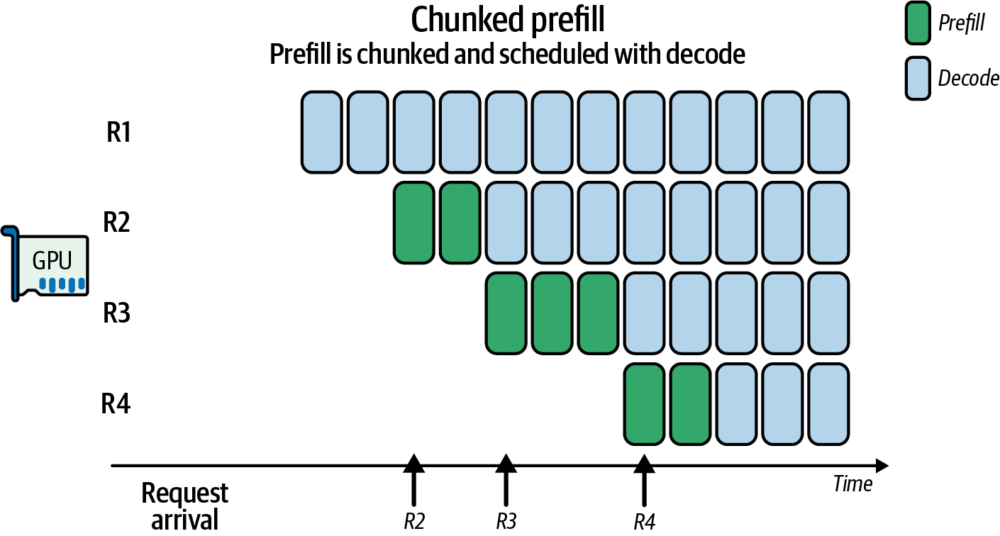

> Figure 19-7. Benefits of chunked prefills for decode-maximal batching across four requests

SARATHI论文证明，这种类型的分块预填充和搭载可以帮助您找到正确的解码最大化批处理级别，减少气泡，并将吞吐量提高约1.3-1.9倍，相比于朴素调度。SARATHI这个名字是指智能地引导预填充和解码任务的车夫。有趣！

例如，考虑一个不使用分块的10,000个token的预填充请求。在这种情况下，单个预填充传递将阻塞整个流水线，并导致解码任务排队，直到预填充完成。

但是，如果您使用分块预填充并将10,000个token的预填充请求分成五个2,000个token的块，您可以在预填充块之间交错解码批次，以保持GPU忙碌处理两个阶段并推进事情。这将挤出流水线气泡，提高吞吐量，并平滑GPU利用率。

> 一个经验法则是选择一个块大小，使预填充块花费约50-100毫秒。这样，您有频繁的机会在中间调度解码批次。这可能对应几千个token，具体取决于模型架构/大小和GPU硬件。

像vLLM这样的现代推理引擎使用自适应调度循环来决定是处理另一个预填充块还是执行解码批次--基于GPU利用率和队列状态。具体来说，vLLM持续监控token队列来做出这些决定。vLLM的调度器明确支持分块预填充和解码最大化批处理。其执行器和分块预填充功能旨在将大型预填充与较小的交互式解码重叠。

自适应调度器在选择分块预填充大小时需要考虑GPU共享内存限制和占用率。接下来显示了一个简单的自适应分块预填充实现。此代码动态调整块大小以保持GPU上的SM和占用率高：

```python
# 分块预填充/解码的自适应调度器示例

import cupy as cp
import torch

# 硬件约束
SHMEM_LIMIT   = 256 * 1024
BLOCK_THREADS = 256
TARGET_UTIL   = 0.85
OCC_THRESHOLD = 0.5

# 占用率结果和瓦片查找的缓存
_occ_cache = {}
_tile_table = {}  # 例如，{L: optimal_T}

# 1) 离线预计算tile_table；这里我们在首次使用时延迟初始化
def get_optimal_tile(L):
    if L in _tile_table:
        return _tile_table[L]
    # 通过查询基于占用率的建议来计算块大小
    min_grid, max_grid, block_size = ... # 为简洁省略

    T = min(block_size, L)
    T = max(32, (T // 32) * 32)
    _tile_table[L] = T
    return T

# 2) 缓存的占用率查询
def get_occupancy(threads, shared_bytes):
    key = (threads, shared_bytes)
    if key in _occ_cache:
        return _occ_cache[key]
    max_blocks = cp.cuda.runtime.\
        cudaOccupancyMaxActiveBlocksPerMultiprocessor(
            attention_kernel_ptr, threads, shared_bytes
        )
    props = torch.cuda.get_device_properties(0)
    warps_per_block = threads // props.warp_size
    max_warps = props.max_threads_per_multi_processor // props.warp_size
    occ = (max_blocks * warps_per_block) / max_warps
    _occ_cache[key] = occ
    return occ

def scheduler_loop():
    stream = cp.cuda.Stream(non_blocking=True)
    while True:
        pending = get_pending_requests()
        util = gpu_utilization()
        if util < TARGET_UTIL and any(r.phase=='prefill' for r in pending):
            req = select_heaviest_prefill(pending)
            L   = req.remaining_length()
            T   = get_optimal_tile(L)
            shared_bytes = 3 * T * T * 4
            occ = get_occupancy(BLOCK_THREADS, shared_bytes)
            if occ < OCC_THRESHOLD:
                T = max(32, T // 2)
                shared_bytes = 3 * T * T * 4
            chunk = req.next_prefill_chunk(T)
            # 在我们的流上使用CuPy RawKernel启动
            attention_kernel((...grid...), (BLOCK_THREADS,),
               (chunk, ...), shared_mem=shared_bytes,
               stream=stream)
            # 记录一个事件以知道何时完成
            event = cp.cuda.Event()
            event.record(stream)
        elif any(r.phase=='decode' for r in pending):
            batch = form_decode_batch(pending, max_batch=16)
            # 追踪自适应逻辑
            logger.info(f"T={T}, occ={occ:.2f}, util={util:.2f}")
            launch_decode_kernel(batch, stream=stream)
            event = cp.cuda.Event()
            event.record(stream)
        else:
            # 轮询最后一个事件而不是睡眠
            if not event.query():
                cp.cuda.get_current_stream().synchronize()  # 或pass
            continue
```

在这里，调度器正在调整块大小以使用尽可能多的共享内存。而且，重要的是，它这样做而不牺牲并行性。

具体来说，调度器首先计算瓦片宽度T，使得查询、键和值的三个共享内存缓冲区--每个需要T x T浮点数--适合GPU的每SM动态共享内存限制。然后它调用CuPy API（Python）来测量使用该T值每个SM可以并发运行多少线程块。

如果占用率低于给定的50%阈值，T减半。这将释放共享内存，以便更多块可以共存，在数据重用（较少的DRAM加载）和并行性之间取得最佳平衡。

当整体GPU利用率降至85%以下且有预填充工作待处理时，调度器选择最大的剩余预填充请求，并将其分成大小相等的T个token的块，以便每个块可以在流水线中流动而不会垄断每个阶段。

而不是固定块大小，辅助函数next_prefill_chunk根据实时指标动态调整T。如果占用率低，它将缩小块大小--如果DRAM流量过大，它将增大块大小。这确保每个切片在不暂停的情况下最大化GPU利用率。

> 确保对调度器进行仪表化以记录所选的T和产生的占用率/利用率。这样，您可以分析并验证这种自适应方法持续保持高GPU利用率。

在预填充块之间，调度器可以使用解码最大化批次使用form_decode_batch将所有就绪的解码请求捆绑到单个启动中。这允许短的、延迟敏感的token生成搭载在否则空闲的流水线间隙上。这样，即使具有短提示的用户也能看到低延迟，因为他们的解码不会等待巨大的预填充完成。这些解码在流水线间隙中调度。

通过持续监控gpu_utilization()，调度器选择是处理另一个预填充块还是排空解码队列。无论哪种方式，它总是选择填充SM槽并最小化死时间的动作。这被称为利用率最大化策略，类似于旨在实现100% CPU利用率的操作系统调度器。

总之，这些机制确保大型上下文预填充作业永远不会饿死交互式解码。同时，小的、延迟关键的请求立即得到服务。这在现代GPU上产生最佳吞吐量，而不会降低最终用户体验。

> 分块预填充将工作与GPU的优势对齐：大型预填充矩阵操作被批处理，而小型解码操作被交错。这同时最大化整体吞吐量和延迟。

如您所见，调度器监控实时指标并即时适应。分块调度确保在变化条件下没有单个请求可以阻塞整个阶段。这使所有GPU保持活跃并减少可怕的流水线气泡。

将预填充和解码视为具有自己SLA的单独队列很重要。通常最优的做法是首先使用专用时间片或CUDA流清除延迟敏感的解码任务，然后使用剩余周期处理大型预填充作业。例如，您可以为解码任务分配一定的时间预算（例如，每个解码1-5毫秒），以确保它们获得更即时的关注。

通过优先考虑面向用户的、实时的解码，您最小化感知的推理延迟。同时，当系统有空闲容量时，您仍在处理批量上下文构建。

许多高性能推理引擎使用生产者-消费者模型，为单独的阶段使用单独的线程。例如，vLLM使用多线程，使得一个线程准备解码输入，而另一个线程准备新的预填充等，它们以优化的顺序输入到单个执行流中。这是一种经过验证的有效重叠工作模式。

如果您有多个节点，您可以将预填充请求发送到一组节点，将解码请求发送到另一组节点。在这种情况下，预填充和解码节点可以使用不同的、针对其特定任务（预填充或解码）优化的异构硬件。

例如，预填充计算节点可以使用具有高FLOPS和较少内存带宽的GPU，因为预填充阶段是计算受限的。而解码节点可能使用具有更高内存带宽但较少FLOPS容量的GPU。

> 请注意，虽然异构预填充和解码工作器配置可以节省成本，但它可能会复杂化--并可能限制--动态负载均衡。如果预填充/解码比率意外变化，需要在解码优化工作器（较少FLOPS）上进行更多预填充工作，这些解码工作器可能会成为瓶颈。

使用同构节点将简化调度。只有在工作负载比率可预测并且可以处理负载变化时，才应使用硬件专业化。然而，由于资本投资、快速发展的GPU架构和成本预算，这并不总是可能的。

关于预填充和解码批处理，建议尽可能将解码调用批处理在一起，以最大化GPU吞吐量并最小化启动开销。对于预填充，您应该避免在同一批次中混合非常短和非常长的提示。

您应该使用基于长度的分桶，以便每个批次具有相似的序列长度。这可能意味着在完成批次之前将传入请求分组到最近的512-token桶。这样，您不会在过度填充上浪费计算。

在实践中，大多数现代推理引擎实现在每个生成步骤动态形成批次的token级调度器。它将等待几毫秒来收集就绪的token，限制批次大小以保持在内存和占用率限制内，并使用轮询/最大延迟规则来改善长提示和短提示之间的公平性。（确保在推理引擎的配置中启用此功能。）

简而言之，自适应批处理和预填充/解码解耦可以最大化GPU利用率并增加吞吐量，而不会牺牲太多延迟。事实上，这些技术通常可以改善总体延迟，因为它们保持GPU忙碌--较少的GPU空闲时间意味着整体更快的任务完成。

> In Chapter 16, we discussed how modern inference servers use different types of request batching (e.g., continuous batching) to maximize throughput and minimize latency across all requests. However, batching can increase latency for individual requests. The trade-offs can be dynamically addressed as conditions change throughout the day using a technique called adaptive batching. Adaptive batching dynamically adjusts how requests are grouped into batches depending on the load-and how well the requests are progressing. This type of dynamic strategy can adjust the batch size and threshold parameters in real time as the environment changes. For example, during peak load, the system can use a large batch size (e.g., 8 or 16) because throughput is critical. During periods of low load, the system can reduce the batch size to serve the requests sooner. This will prioritize latency over throughput. To decide on the batch size, you can use a simple heuristic, such as, "If GPU utilization is > 80%, allow larger batches; if < 20%, use batch size 1 to minimize latency." Or you can use a more sophisticated RL agent or predictive strategy, as discussed in the previous sections. This difference in arithmetic intensity between the prefill and decode phases leads to mismatched durations of execution. As such, it's best to disaggregate the stages and treat them as separate workloads that can be tuned independently using separate threads/processes for a single node or worker pools for a multinode cluster. By disaggregating prefill and decode, we treat the two stages as separate operations. This allows them to be independently optimized for their unique compute and memory bandwidth needs. One of these optimizations is the batch sizes used for the prefill and decode phases. In practice, vLLM and other modern inference engines do exactly this. They form separate batches to send to the prefill and decode workers. As such, a batch of prefill requests can execute independently of the batch of decode requests. For example, the decode phase can benefit from larger batches to increase arithmetic intensity since it's a memory-bound workload. Modern inference-serving frameworks like vLLM use adaptive scheduling loops to dynamically choose between processing a prefill or a decode batch. Specifically, vLLM supports chunked prefill and decode-maximal scheduling to interleave prefill and decode for better utilization. These techniques boost overall utilization and throughput without adding significant latency. The mismatched system-resource characteristics of prefill and decode can impact PP as well. Consider one microbatch doing prefill on a long sequence while another microbatch is performing decode one token at a time. In this case, their durations are mismatched, and pipeline bubbles emerge. You can interleave large prefill requests with latency-sensitive decode tasks by slicing the prefill into small chunks and piggybacking decodes between them. This keeps all pipeline stages busy and minimizes idle "bubbles" in your GPU schedule. Chunked prefill is a well-supported pattern used by all modern LLM inference engines to reduce pipeline bubbles. It effectively time-slices a big task (prefill) to create room for small tasks (decode) to execute in the pipeline gaps created by the chunks, as shown in Figure 19-7. The SARATHI paper demonstrated that this type of chunked prefill and piggybacking can help you find the right level of decode-maximal batching, reduce bubbles, and improve throughput by ~1.3-1.9x compared to naive scheduling. The name SARATHI is a reference to a charioteer that intelligently steers both prefill and decode tasks together. Fun! For example, consider a 10,000-token prefill request that does not use chunking. In this case, the single prefill pass will block the entire pipeline and cause decode tasks to queue up until the prefill completes. However, if you use chunked prefill and divide the 10,000-token prefill request into five 2,000-token chunks, you can interleave decode batches in between prefill chunks to keep the GPU busy processing both phases and moving things forward. This will squeeze out pipeline bubbles, improve throughput, and smooth out GPU utilization. A rule of thumb is to choose a chunk size such that a prefill chunk takes ~50-100 ms. This way, you have frequent opportunities to schedule decode batches in between. This may correspond to a few thousand tokens depending on the model architecture/size and GPU hardware. Modern inference engines like vLLM use adaptive scheduling loops to decide whether to process another prefill chunk-or perform a decode batch-based on GPU utilization and queue status. Specifically, vLLM continuously monitors token queues to make these decisions. vLLM's scheduler explicitly supports chunked prefill and decode-maximal batching. Its executor and chunked-prefill features are designed to overlap large prefills with smaller interactive decodes. An adaptive scheduler needs to consider GPU shared-memory limits and occupancy when choosing a chunked prefill size. A simple adaptive chunked prefill implementation is shown next. This code dynamically right-sizes the chunk size to keep SM and occupancy high on the GPU: ... Here, the scheduler is adjusting chunk size to use as much shared memory as possible. And, importantly, it does this without sacrificing parallelism. Specifically, the scheduler first computes a tile width T so that the three shared-memory buffers for queries, keys, and values-each requiring T x T floats-fit within the GPUs' per-SM dynamic shared-memory limit. It then calls the CuPy API (Python) to measure how many thread blocks can run concurrently on each SM with that value of T. If occupancy falls below a given threshold of 50%, T is reduced by half. This will free up shared memory so that more blocks can co-reside, striking an optimal balance between data reuse (fewer DRAM loads) and parallelism. When overall GPU utilization drops below 85% and prefill work is pending, the scheduler selects the largest remaining prefill request and breaks it into equal-sized chunks of T tokens so that each chunk can flow through the pipeline without monopolizing every stage. And rather than fixing the chunk size, the helper function, next_prefill_chunk, adjusts T on the fly based on live metrics. It will shrink the chunk size if occupancy is low-and grow it if DRAM traffic is excessive. This makes sure that each slice maximizes GPU utilization without stalls. Be sure to instrument the scheduler to log the chosen T and resulting occupancy/utilization. This way, you can analyze and verify that this adaptive approach is consistently maintaining high GPU utilization. Between prefill chunks, the scheduler can use decode-maximal batches to bundle all of the ready decode requests into a single launch using form_decode_batch. This lets short, latency-sensitive token generations piggyback on otherwise idle pipeline gaps. This way, even users with short prompts see low latency because their decodes don't wait for a huge prefill to finish. These decodes get scheduled in the pipeline gaps. By continuously monitoring gpu_utilization(), the scheduler chooses whether to process another prefill chunk or drain the decode queue. Either way, it is always picking the action that fills SM slots and minimizes dead time. This is called a utilization-maximization policy and is similar to an OS scheduler aiming for 100% CPU utilization. Together, these mechanisms ensure that large-context prefill jobs never starve interactive decoding. At the same time, small, latency-critical requests are served immediately. This produces optimal throughput on modern GPUs without degrading the end-user experience. Chunked prefill aligns work with the strengths of the GPU: big prefill matrix operations are batched, while small decode operations are interleaved. This maximizes overall throughput and latency together. As you can see, the scheduler monitors real‐time metrics and adapts on the fly. The chunked scheduling makes sure no single request can block an entire stage under varying conditions. This keeps all GPUs active and reduces the dreaded pipeline bubbles. It's important to treat prefill and decode as separate queues with their own SLAs. It's usually optimal to clear out latency-sensitive decode tasks first using dedicated time slices or CUDA streams, then use the leftover cycles to process large prefill jobs. For example, you can allocate a certain time budget (e.g., 1-5 ms per decode) to decode tasks to make sure they get more immediate attention. By prioritizing the user-facing, real-time decodes, you minimize perceived inference lag. At the same time, you are still powering through bulk context builds when the system has spare capacity. Many high-performance inference engines use a producer-consumer model with separate threads for the separate phases. For instance, vLLM uses multithreading such that one thread prepares decode inputs while another prepares new prefills, etc., and they feed into a single execution stream in an optimized order. This is a proven pattern to overlap work efficiently. If you have multiple nodes, you can send prefill requests to one set of nodes and decode requests to another set. In this case, the prefill and decode nodes can use different, heterogenous hardware specialized for their specific task of either prefill or decode. For instance, the prefill compute nodes can use GPUs with high FLOPS and less memory bandwidth since the prefill phase is compute bound. And the decode nodes can potentially use GPUs with higher memory bandwidth but less FLOPS capacity. Be aware that while a heterogeneous prefill and decode worker configuration can save cost, it can complicate-and potentially limit-dynamic load balancing. If the prefill/decode ratio shifts unexpectedly and more prefill work needs to be done on decode-optimized workers (less FLOPS), these decode workers may become a bottleneck. Using homogeneous nodes will simplify scheduling. Hardware specialization should be used only if the workload ratio is predictable and can handle the shifts in load. However, this isn't always possible due to capital investments, rapidly evolving GPU architectures, and cost budgets. Regarding prefill and decode batching, it's recommended that you batch your decode calls together whenever possible to maximize GPU throughput and minimize launch overhead. For prefill, you should avoid mixing very short and very long prompts in the same batch. You should use length‐based bucketing so each batch has similar sequence lengths. This might mean grouping incoming requests to the nearest 512-token bucket before completing the batch. This way, you don't waste compute on excessive padding. In practice, most modern inference engines implement a token‐level scheduler that dynamically forms batches at each generation step. It will wait a few milliseconds to gather ready tokens, cap batch sizes to stay within memory and occupancy limits, and employ round-robin/maximum-delay rules to improve fairness between long and short prompts. (Make sure this feature is enabled in your inference engine's configuration.) In short, adaptive batching and prefill/decode disaggregation can maximize GPU utilization and increase throughput without sacrificing too much latency. In fact, these techniques can often improve latency in aggregate, because they keep the GPU busy-and less GPU idle time means faster task completion overall.

## 多GPU拥塞感知和拓扑感知调度 (Congestion-Aware and Topology-Aware Scheduling with Multiple GPUs)

现代多GPU和多机架系统，如Grace Blackwell GB200 NVL72系统（72个Blackwell B200 GPU，每个180 GB HBM）和更新的Grace Blackwell Ultra GB300 NVL72（72个B300 GPU，每个288 GB），在单个高带宽NVLink/NVSwitch结构中连接72个GPU。这些架构创建了一个统一的72-GPU域，并为每个GPU提供高达约1.8 TB/s的聚合双向NVLink吞吐量。这提供了超过130 TB/s的跨NVSwitch网络的聚合横截面带宽。

> Modern multi-GPU and multirack systems like Grace Blackwell GB200 NVL72 systems (72 Blackwell B200 GPUs with 180 GB HBM each) and the newer Grace Blackwell Ultra GB300 NVL72 (72 B300 GPUs with 288 GB each) connect 72 GPUs in a single high-bandwidth NVLink/NVSwitch fabric. These architectures create a unified 72-GPU domain and give each GPU up to ~1.8 TB/s of aggregate bidirectional NVLink throughput. This provides over 130 TB/s of aggregate cross-sectional bandwidth across the NVSwitch network.

然而，大规模推理实现峰值性能不仅仅需要原始带宽。它需要智能和自适应的通信调度。拥塞感知和拓扑感知策略确保数据传输实时避免瓶颈，如图19-8所示。

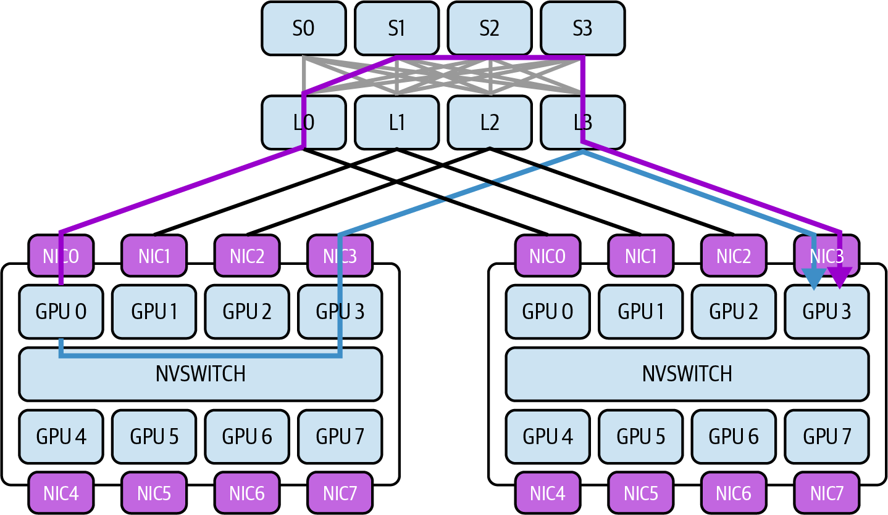

> Figure 19-8. Topology-aware routing to avoid bottlenecks across GPUs and multinode clusters

为了解决这些瓶颈，让我们考虑链路利用率遥测、动态消息路由和集体通信调度波。接下来是一些关键原则和技术，它们能够在保持低延迟和高吞吐量的同时实现高效的GPU间通信调度。为了保持具体性，我们将在NVL72机架环境的背景下进行讨论。

### NVLink/NVSwitch拓扑和带宽约束

NVLink在GPU之间以及Grace Blackwell超级芯片模块中的GPU与Grace CPU之间提供高速点对点链路。NVSwitch充当机架内网络交换机，将所有GPU连接成全对全拓扑。

在NVL72机架系统中，每个GPU具有多个NVLink端口（例如，每个GPU 18个NVLink链路），连接到一组NVSwitch芯片。此设计使每个GPU具有点对点连接性，使得任何GPU可以通过NVSwitch结构单跳到达任何其他GPU。此拓扑允许72个GPU表现得像一个具有统一连接性的巨型板。

> 聚合容量仍受每个端口和每个交换机限制的约束。因此，多对一流量模式可能会过度订阅入口。

尽管它们具有高带宽，但互连的容量是有限的。每个NVLink 5端口每个方向提供100 GB/s。每个GB200/GB300超级芯片每个GPU公开18个NVLink链路，每个GPU双向吞吐量高达1.8 TB/s。虽然NVSwitch在平衡负载下提供非阻塞全对全连接性，但某些模式（如所有GPU发送到一个GPU）可能会过度订阅链路，因为每个NVSwitch芯片的总交换吞吐量有限。

如果太多GPU同时通过同一交换机发送数据--或发送到同一目的地，就会发生拥塞。这会导致队列累积和有效传输吞吐量下降。例如，单个GPU理论上可以以1.8 TB/s双向通信，但如果多个对等方同时针对同一GPU，它们必须共享相同的NVLink入口带宽。类似地，NVSwitch可能会被某些通信模式过度订阅，如所有GPU同时交换数据--即使它设计用于完全非阻塞带宽（在平衡负载下）。

> 避免对拓扑做出假设。使用CUDA的拓扑API和NCCL的拓扑提示以编程方式检索此信息。您可以查询NVML和DCGM以获取每个NVLink端口计数器和远程端点，并在需要时结合Fabric Manager或NVSwitch工具进行交换机级映射。

了解拓扑--哪些GPU共享NVSwitch组件或NVLink路径--对于推理性能至关重要。在较小规模上，同一板或托盘上的GPU可能比不同托盘或跨节点的GPU具有更快、稍微更直接的路径。

在更大规模上，使用InfiniBand/以太网跨越节点/机架边界并离开NVLink域的通信将比NVL72内部传输产生更高的延迟和更低的带宽。例如，InfiniBand NDR每跳可能增加5-10 µs延迟，而NVSwitch跳数延迟小于1 µs。

由于物理拓扑，某些通信路径比其他路径更便宜。拥塞感知调度器使用此知识来优先选择更高带宽、更低延迟、更少拥塞的链路以最大化性能。

### 实时链路遥测和监控

为了管理拥塞，系统必须首先观察它。NVIDIA提供遥测接口来实时监控链路利用率。NVIDIA管理库（NVML），特别是nvmlDeviceGetNvLinkUtilizationCounter，公开了NVLink的每个链路吞吐量计数器和利用率统计信息。

> 启用NVLink计数器会引入开销。以合理的间隔采样它们，以避免在监控性能时影响性能！

自适应推理服务系统可以查询指标，例如每个NVLink端口传输的字节数、错误率和特定GPU对之间的流量负载。例如，您可以查询NVML或DCGM以获取吞吐量计数器、带宽统计信息和其他遥测（例如，错误等）。请注意，nvidia-smi nvlink --status提供链路健康和配置。NVML和DCGM是吞吐量等性能计数器的首选机制。

这对于识别接近100%利用率饱和的热点链路而其他链路使用不足很有用。这些低级硬件计数器允许调度器准确找到瓶颈发生的位置。这包括特定的NVSwitch上行链路--或两个特定GPU之间的链路。

除了NVML，更高级的分析工具如Nsight Systems提供GPU活动的时间线视图，包括通信事件。Nsight可以显示数据传输何时在NVLink/NVSwitch上发生--以及它们需要多长时间。

通过使用Nsight Systems对推理运行进行仪器化，可以可视化多个传输是否重叠并导致延迟--或者某些阶段是否正在等待通信。例如，时间线可能显示所有流水线阶段尝试同时通过同一链路发送激活，这将使互连不堪重负。

> 建议使用Prometheus和DCGM导出器将这些指标集成到您的监控Grafana仪表板中。这样，您可以实时查看链路利用率--以及历史和随时间变化。当您识别热点（如同步点）时，您的系统可以插入轻微延迟、重新安排任务或重新分配GPU角色以缓解热点并平滑流量。

例如，系统可以通过插入轻微延迟或不同地重叠来调整调度以减少争用。这种实时遥测实现了动态、自适应、反馈驱动的决策。调度器可以通过重新路由流量或将任务重新调度到不同的GPU来即时响应链路利用率的峰值，如下所述。

### 自适应进程-GPU映射

一个强大的策略是计算进程的拓扑感知放置，以最小化跨慢速或拥塞链路的繁重通信。例如，考虑一个多GPU推理流水线，其中不同的LLM层（"进程"）驻留在不同的GPU上。在这种情况下，大型中间张量必须沿推理流水线传递。

这本质上是一个进程-GPU放置优化问题，需要将神经网络模型层的图映射到产生最小通信成本的GPU硬件上。如果层/进程到GPU的原始分配是朴素的，这些张量可能需要经过长距离、昂贵、拥塞的路径。这可能包括多个NVSwitch跳数--甚至完全离开NVLink结构到另一个机架或数据中心。这肯定会降低吞吐量和整体性能。

使用自适应进程-GPU映射，系统动态将进程分配给GPU，使得通信尽可能保持本地（和平衡）。例如，考虑我们的LLM层（进程）在NVL72机架中跨许多GPU分区。如果GPU 0上的层/进程0馈送GPU 2上的层/进程2，但它们的GPU位于NVSwitch网络的相反端，数据必须遍历更多链路。在这种情况下，将层/进程2移动到GPU 1是首选的进程-GPU映射，如图19-9所示，在NVIDIA拓扑感知GPU选择（NVTAGS）系统的背景下。

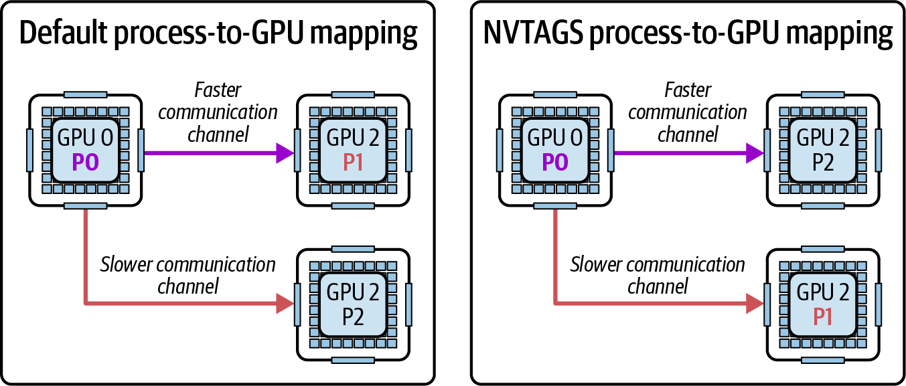

> Figure 19-9. NVIDIA's Topology-Aware GPU Selection (NVTAGS) process-to-GPU mapping

在这里，NVTAGS根据GPU之间的通信模式自动将GPU亲和性分配给进程。NVTAGS是NVIDIA的拓扑感知GPU选择框架，它使用结构距离和链路指标自动化进程到GPU映射。它主动分析拓扑并将进程重新分配给具有最快相互链路的GPU。

如果遥测表明此链路正在变得饱和，因为激活张量非常大，调度器可以将进程2重新映射到另一个"更接近"GPU 0的GPU--理想情况下是一个共享高带宽连接或位于同一NVSwitch模块中的GPU。自适应进程-GPU重新映射将动态重新分配LLM推理示例中哪个GPU持有哪个模型层。

> 作为起点，如果您不使用NVTAGS，可以使用系统的拓扑映射来帮助识别哪些GPU分组在网络拓扑背景下"更接近"。

此重新映射在初始化时以及推理之间进行。一些系统使用前期或定期分析运行来决定最佳放置。如果两个进程每秒交换数十GB数据，它们应该尽可能驻留在同一节点上。相反，计算受限或彼此之间数据传输最少的进程可以容忍彼此之间更多的距离。

当系统监控性能并随着条件变化迭代改进映射时，重新映射是自适应的。例如，如果经过一次传递后，最高流量连接是在不同节点上的进程3和进程4之间，调度器可能会将其中一个进程与同一节点上的另一个进程交换，以将3和4放在一起。

自适应重新映射的影响是一个响应观察到的流量模式的不断演进的GPU分配计划。这种方法通过将数据交换限制在本地域内直接减少跨节点流量。例如，重新映射后，原来是50 GB/s的跨节点传输可能变成两个25 GB/s的节点内传输。这消除了网络瓶颈并将该通信的网络延迟减少50%。

重新映射可以表述为使用图分区算法的优化问题。在这种情况下，图的边权重是链路上传输的数据量。您将求解最小割。

> 请注意，移动层/进程意味着移动模型权重。如果模型层有许多GB数据，您不会希望太频繁地这样做。最好在大批次之间应用此策略--或者当映射将在最短时间内保持相对静态时。

在深度学习推理中，我们可以使用流水线、张量和专家并行技术将自适应映射的思想应用于GPU间通信。彼此之间通信最多的GPU应该被分配它们之间最强、最不拥塞的连接。

### 使用NCCL优化集体通信

NVIDIA的集体通信库（NCCL）是管理这些GPU集体的标准库。它为多GPU环境提供多种算法和优化。

许多推理工作负载涉及集体通信模式，例如从多个专家收集输出、广播参数或执行全归约操作，如图19-10所示。在这里，NCCL通信（流1）与GEMM计算（流0）重叠。

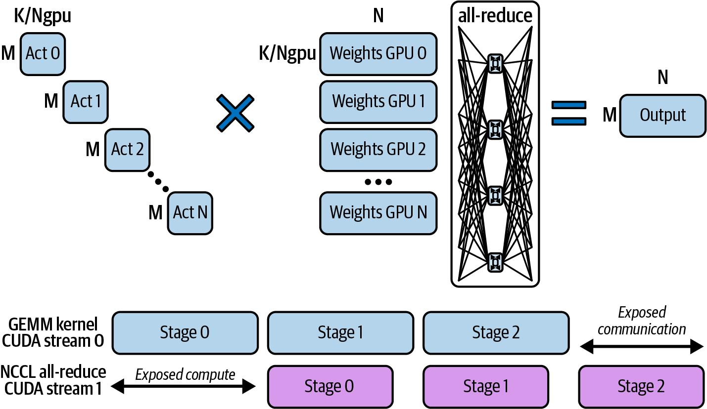

> Figure 19-10. Distributed GEMM using multiple GPUs and all-reduce across NVLink

这些NCCL优化可以由调度器在拥塞感知环境中动态应用。通过选择正确的集体算法并使用拓扑和拥塞信息对其进行调优，我们可以减少推理系统的通信开销。接下来是调度器在即时调优NCCL时可以使用的一些关键考虑因素。

**环与树全归约**

NCCL可以使用环算法或树算法执行归约（以及其他集体）。在环全归约中，每个GPU沿闭环/环传递数据，使得每个数据片段按顺序遍历所有GPU。

环方法通过保持所有链路忙碌来最大化NVLink/NVSwitch上的带宽利用率，但这意味着延迟随GPU数量线性扩展。例如，在72-GPU环上，数据需要71跳才能完成一次归约。

相比之下，树算法以对数方式归约或广播数据，因为GPU被组织成逻辑二叉树，其中每一步将参与者数量减半。然而，GPU在物理上逐链路线性连接，可以在逻辑上被视为树链。图19-11比较了基于树和基于环的GPU间通信。

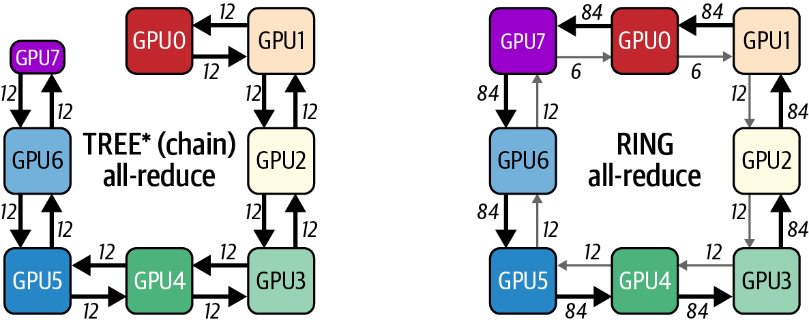

> Figure 19-11. Tree-based (chain) versus ring-based communication

在实践中，在树全归约中，GPU首先在每个节点内的简单NVLink/NVSwitch"链"中连接。跨节点时，它们以流水线双二叉树拓扑连接。这就是树基算法O(log N)延迟的原因。

树算法在更少步骤中完成（例如，在72-GPU环的情况下为log₂(72)），这直接减少了延迟--尤其是跨大量GPU的"长距离"传输。树利用NVSwitch的并行性，因为多个独立的归约流可以沿树的不同分支同时发生。权衡是树可能不会每时每刻都完全饱和每个链路的带宽，但它避免了通过长环路径使任何单个链路或GPU成为瓶颈。

> 对于小消息的延迟敏感归约，树算法通常更优。对于带宽主导的极大消息，环算法通常更好--假设网络不拥塞且带宽主导。根据消息大小和拓扑选择，并考虑分层方案。

默认情况下，NCCL根据消息大小和拓扑启发式地选择环、树或分层变体。在基于NVSwitch的节点内路径上，环通常因带宽而受青睐，而跨节点时，分层和树变体很常见。在像NVL72这样的全连接单节点NVSwitch系统上，通常最好对大型归约强制使用树。

例如，使用NCCL_ALGO环境变量强制树算法可以通过不通过一个长环路径跨所有72个GPU发送所有数据来缓解单个NVL72机架中的拥塞。例如，基于72-GPU树的全归约将比基于环的算法快得多。这是因为树算法执行6（log₂(72)）个顺序步骤，而环算法执行71（71 = 72 - 1）个顺序步骤。

调度器可以使用动态NCCL调优参数显式选择最适合当前拓扑和消息大小的算法。例如，它可以对非常大的GPU计数优先选择树全归约，以避免每次更新都循环遍历整个集群。

**旋转环端点**

当由于简单性和带宽效率而选择环算法时，一个问题是相同的链路可能持续承载最重的负载--特别是环回绕的某些GPU对之间的链路。

拥塞感知方法是跨迭代或集体操作旋转环排序。通过定期移动哪个GPU是环的起点--因此哪些对首先通信--通信负载更均匀地分布在所有NVLink连接上。

虽然NCCL的"内部/外部"环机制已经在连续调用上交替环方向，但如果您的工作负载持续不平衡，步骤之间的额外排名洗牌将有所帮助。这确保没有单个NVLink成为永久瓶颈。

在实践中，NCCL有一个交替环增强功能，在幕后实现这种旋转，但也可以由调度器使用不同集体的GPU重新索引来管理。为此，您可以定期使用排列的排名顺序调用ncclCommInitRank。效果是，随着时间的推移，没有单个链路或GPU总是每个集体的关键路径。这平滑了利用率。

**集体通信的波调度**

与其启动一次使用所有GPU的巨型集体操作，波调度将通信分成阶段性波以减少瞬时负载。例如，假设推理工作负载需要在72个GPU之间执行嵌入的全对全交换--这是混合专家或某些集成方法中常见的模式。

作为单个整体步骤执行此交换意味着每个GPU同时向71个其他GPU发送数据。这是72个GPU x 71条消息同时使每个链路和NVSwitch端口饱和。

所有72个GPU同时交换数据将导致峰值。相反，您可以将交换分成4组或波，每组18个GPU以平滑流量。

这称为波调度，它将交换构建为一系列较小的全对全交换，每波仅使用GPU子集。它还可以流水线较小的块，使得任何时候只有一部分流量在传输中。

在NCCL术语中，这可能对应于将大型全归约内部分成多个切片。NCCL实际上自动执行此操作以通过环流水线数据。调度器也可以使用NCCL编排一系列较小的集体。

通过错开这些通信波的启动时间，网络结构有一些余量，因为一波的数据部分通过系统后下一波才增加更多流量。这称为时间复用，它避免使NVSwitch结构不堪重负。此技术在概念上类似于调整网络流量以避免突发性。

另一个例子是重叠计算和通信--我们在本书中反复看到的模式。如果层输出以波的形式归约，系统可以安排下一层的计算与归约的后续波重叠。

这在计算和通信之间创建流水线，使得当一些GPU正在完成归约时，其他GPU已经移动到下一层的计算。这种重叠本质上将一些通信时间转移到计算单元否则空闲的时间。结果是在没有导致拥塞的大规模一次性峰值的情况下提高了NVLink带宽的利用率。

仔细优化集体、选择正确的算法并以平衡波构建通信对于拓扑感知调度至关重要--它导致NVLink/NVSwitch网络在所有GPU之间更高效、公平和平衡的使用。

### 使用GPUDirect RDMA的多节点和多机架通信

当扩展到单个节点（例如，NVL72机架）之外时，额外的挑战将开始出现，因为通信正在通过相对较慢的网络接口，如InfiniBand和以太网。在这种情况下，NVLink和NVSwitch不再直接连接系统中的所有GPU。相反，不同节点中的GPU使用NIC和网络交换机交换数据。

为了在多节点和多机架环境中保持高性能，现代AI系统使用GPUDirect RDMA。如第4章所述，GPUDirect RDMA允许GPU直接与远程GPU内存发送/接收数据--而不涉及主机CPU，如图19-12所示。

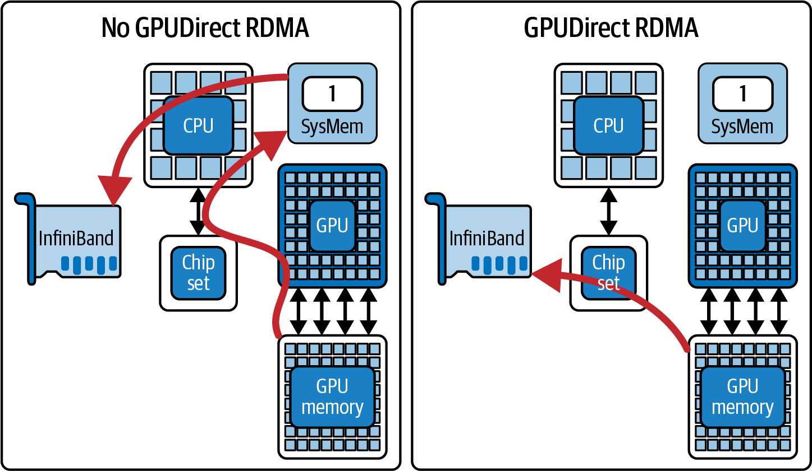

> Figure 19-12. Direct GPU-to-GPU memory transfers with GPUDirect RDMA-and without involving the host CPU memory (source: https://oreil.ly/445a9)

然而，即使具有RDMA效率，网络带宽仍然低于节点内NVLink，延迟仍然更高。因此，如果没有动态和自适应的路由调度，集群结构中的网络拥塞将成为限制因素。拥塞感知调度器可以智能地路由和平衡节点间流量以及节点内流量，正如我们前面讨论的那样。

一个关键技术是利用多个网络接口，称为多轨。高端GPU服务器通常具有多个NIC，包括每个节点双InfiniBand端口--甚至在某些设计中每个GPU一个。例如，每个节点使用两个NIC可以产生近2倍的吞吐量，而使用一个NIC。使用多个NIC时有一些开销，但它仍然提供很大的增益。

NCCL自动支持并行使用多个NIC以增加带宽。此外，它将环和树分割到这些NIC上。

拓扑感知在这里至关重要。考虑每个NIC连接到不同的网络交换机以在集群网络中形成单独的"轨"。在这种情况下，对集体操作使用多个NIC可以减少任何单个网络路径的负载。

NCCL环境变量NCCL_CROSS_NIC控制集体操作是否允许在不同节点上为同一环/树使用不同的NIC。通过在设计良好的网络拓扑上启用此功能，NCCL可能将一半GPU的数据从NIC1发送出去，另一半从NIC2发送出去。这有效地使吞吐量翻倍并避免单个链路上的瓶颈。

> 如果您的GPU节点有多个NIC且您的NCCL版本支持NCCL_CROSS_NIC，请为大型集体启用它，以便在为多轨设计的拓扑上跨轨条带化流量。

调度器可以检测一个NIC或路径是否正在达到容量。如果正在达到容量，它可以通过将某些GPU的通信移动到备用接口或备用网络路由（如果可用）来重新分配流量。这可以使用网络级自适应路由来改进，但您的应用程序也可以将某些GPU流量固定到较少使用的NIC。为此，您只需将不同的NCCL通道设置为不同的NIC。

在多节点背景下，重新路由也可能意味着与网络的自适应路由功能协作。现代InfiniBand网络具有自适应路由，其中拥塞流自动移动到结构中较少拥塞的路径。虽然这在网络级别处理，但更高级的调度器可以通过更改用于给定GPU传输的目标IP/路由来影响它。或者调度器可以将传输分成较小的块，以便网络可以平衡它们。

此外，通过将每个GPU的通信绑定到最近的NIC（例如，同一PCIe根复合体或同一NVSwitch/CPU复合体上的NIC）来强制执行NIC亲和性很重要。这将减少本地争用。

要强制执行GPU-NIC亲和性，您可以使用NVML或NCCL映射GPU ↔ NIC位置。您需要通过向NCCL提供将每个GPU与其特定NIC关联的静态拓扑描述来配置NCCL尊重此映射（例如，GPU 0-3 ↔ NIC 0，GPU 4-7 ↔ NIC 1）。

设计良好的系统将对齐GPU到NIC配对，以便每个GPU的数据采用最短路径离开节点。如果由于同一端口上的多个繁重GPU流出而导致特定NIC拥塞，调度器可以为下一轮通信将一个GPU的流量重新分配到节点上的另一个端口。虽然NCCL的自动调优会为您完成大部分工作，但可能需要手动覆盖来解决特定和持续的问题。

考虑一个极端情况，例如托管大型MoE LLM模型的大型、重负载推理集群。在这里，如果系统未正确调优，网络将是主要瓶颈。这是因为集群中节点之间的繁重通信。

在这种极端情况下，调度器可能决定在多个节点上复制某些数据（例如，专家）以减少跨节点查询。或者它可以分层执行操作，首先在每个节点内聚合结果，然后在节点之间交换摘要。这与跨节点在所有GPU之间交换完整数据形成对比。

> NVIDIA SHARP可以将某些聚合操作卸载到交换机硬件。在推理集群中，同时使用SHARP和自适应路由有助于最小化通信瓶颈。

对于多节点环境，需要拥塞感知调度以避免使任何单个网络链路饱和。这种类型的调度需要仔细的路由/绑定决策、GPUDirect RDMA以绕过不必要的内存副本，以及多轨NIC利用以最大化带宽。

目标是将拓扑感知扩展到NVSwitch之外，了解集群网络的完整拓扑（例如，胖树、蜻蜓等）并使通信模式适应该拓扑。结果是在具有数千和数百万GPU节点的规模下，节点间传输以平衡方式编排。这将防止单个慢速链路限制整个分布式推理系统。

> 将网络视为可调度资源，就像GPU、内存等一样。它应该像其他动态分配的资源一样进行规划和自适应管理。

### MoE专家重新平衡和重组

大规模语言模型越来越多地使用MoE层，这引入了独特的通信模式。在MoE模型中，神经网络的不同子集或专家驻留在不同的GPU上。每个输入token被路由到少数专家网络进行处理。

例如，在推理期间，这产生全对全流量模式，使得token被发送到托管所选专家的任何GPU。然后收集结果。在专家到GPU的朴素静态分配中，如果许多token频繁路由到这些特定GPU上的专家，某些GPU可能成为通信热点。此外，如果经常一起工作处理相似token的专家在拓扑中相距很远（例如，一个在GPU 0上，另一个在结构另一端的GPU 71上），token将需要持续经过长路径。

专家重新平衡是一种通过定期重新排列每个专家驻留在哪个GPU上来本地化通信的策略。关键思想是利用工作负载中的任何偏差或模式。例如，如果专家5和专家19都接收相同查询的片段，有意义的是将它们放在同一GPU（或同一节点）上（如果可能），以便这些操作的通信不会传输太远。

同样，如果专家7非常受欢迎并接收许多token，它可能会给其GPU带来大量入站流量。调度器可能会将该专家移动到通信较轻的GPU--甚至在系统允许的情况下复制它--以分散负载。这种重新平衡可以在推理运行之间或在长期运行服务的定期维护窗口期间发生。系统收集专家之间--或专家与专家门控节点之间--的通信频率统计信息，然后将专家重新映射到最小化最高流量链路的GPU。

在实践中，实现MoE专家重新平衡涉及模型参数的协调重新分配，因为专家本质上是模型权重的子集。这应该不频繁进行，因为这是繁重的操作。但偶尔的重新平衡可以在减少拥塞传输方面产生巨大影响。

> 专家重新平衡应在计划的维护窗口期间进行，因为移动专家意味着传输可能GB的权重。关键是使用记录的路由指标在运行时选择更好的放置策略。

重新平衡后，理想情况下每个GPU将托管一组专家，使得大多数token的路由保持在单个GPU上或至少在本地NVLink组内。任何其他非本地通信将在NVLink/NVSwitch网络上更均匀地分布--而不是重复命中相同的GPU到GPU链路。

简而言之，分散热门专家并将频繁相互通信的专家放在一起。

另一个相关优化是专家分桶或分组。此技术安排通常一起使用的专家并分配给同一组GPU（例如，在同一NVSwitch或同一服务器上），这减少了跨组流量。

调度器可以将专家放置视为图分区问题。专家（GPU）是图中的节点。边权重表示专家之间的token流量--以及从路由器到专家的流量。图使用通过最少重边的最小割进行分区。通过这样做，MoE通信变得拓扑感知，尊重NVLink/NVSwitch边界，并将数据交换限制在这些边界内。

MoE专家重组是模型架构级别的拥塞感知调度示例。它重新安排工作负载本身以适应网络--而不是重新安排网络以适应工作负载。

### 动态拥塞感知调度

虽然我们提到的所有技术都可以在系统启动或设计时配置，但最稳健和先进的系统使用动态调度来响应拥塞的发生。动态拥塞感知调度意味着系统使用前面讨论的遥测持续监控网络条件--并实时调整任务或通信的调度。

拥塞感知调度和路由有助于减少瓶颈并在动态条件下保持高性能。这类似于网络级动态数据包路由，如图19-13所示。

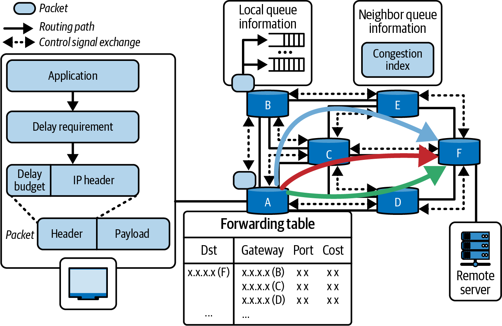

> Figure 19-13. Network-level packet routing to avoid congestion

在多GPU推理背景下，动态策略包括基于拥塞反馈的节流、重新路由或重新排序操作。例如，假设调度器检测到连接两个特定GPU的NVLink链路0当前已满，因为它正在为大型张量传输数据，例如大型流水线并行激活传输。

如果另一个高优先级传输计划使用同一链路，调度器可能会延迟第二个传输几毫秒，让第一个完成并清除。这称为时间负载均衡，它本质上插入一个小间隙以防止队列累积。这类似于网络交换机队列管理和NIC级反压。短暂排队比过载和丢包更好。

相反，如果检测到正常的大型传输因源GPU正在等待计算而空闲，调度器可以使用该时间片在链路上发送较低优先级数据并填充空闲时间。这利用可用带宽，不会干扰关键数据传输。

另一个动态策略是软件级自适应路由，如果一条路径拥塞，则选择备用路径（如果可用）。在具有多个NVSwitch平面或多个NIC轨的网络中，自适应运行时将为下一次通信选择较不繁忙的平面。

NCCL在存在多条路径时在内部执行一些此操作，但高级调度器可以维护映射到不同路径配置的多个NCCL通信器。然后它可以根据拥塞在 不同路径之间选择。

动态选择备用路径需要调度器评估要采取的最佳路径。这可能通过使用不同的虚拟通道--或调整传输使用哪个NVLink端口来实现。

现代NVSwitch系统支持多个虚拟通道和硬件服务质量（HQOS）设置。调度器可以使用这些功能将非紧急流量定向到较低优先级通道。这避免与紧急传输争用。

负载相关任务调度是动态拥塞管理的另一个功能。如果推理服务器正在处理许多共享资源的并发查询，调度器可以临时排队或重新排序某些查询以避免峰值重叠。这与前面讨论的错开大型集体以使它们不同时运行的讨论类似。

例如，考虑调度器知道查询A的下一步将涉及跨GPU的大型全收集的情况。并且它看到查询B刚刚开始，并且会在同一时间添加另一个大型全收集。在这种情况下，调度器可能会短暂推迟启动查询B的步骤，以便查询A的通信可以在没有查询B资源争用负担的情况下完成。

这种细粒度调度随时间优化通信模式。繁重流被序列化或错开而不是并发启动。决策由最近的遥测指导。如果系统在并行运行8个查询时看到NVSwitch利用率的大峰值，它可能尝试在前4个查询中运行，然后立即运行后4个。这使系统自调优，因为它监控实时遥测数据并持续搜索避免拥塞的执行计划。

动态调度通常实现为监控所有GPU和网络链路的集中式调度器。这可以与分布式协议结合，其中GPU向彼此发出拥塞信号或反压，如果目标GPU的NVLink缓冲区已满。

在这种反压场景中，目标GPU通知源GPU暂停传入传输。智能调度器然后可以在源GPU暂停时重新安排其上的任务，以便它可以在等待目标GPU取消暂停传输时执行计算任务。

> NCCL在接收方无法跟上时会应用反压。自定义调度器可以通过注意发送操作被阻塞来利用此功能。然后它可以使用该时间执行其他有用的工作。

随着时间的推移，像这样的动态调整将保持通信高效--即使在变化的批次大小、输入数据分布和其他动态工作负载变化的情况下。系统通过基于实时反馈修改调度来学习拥塞模式并快速适应。系统可以使用RL代理（在前面的部分讨论）或一组启发式规则。这对于具有突发和不可预测推理请求的环境至关重要。

### 使用精细调度协调NVSwitch传输

NVLink/NVSwitch系统的核心是NVSwitch结构本身。这是一个处理许多同时GPU到GPU传输的集中式交叉开关。NVSwitch具有极高的带宽，并有自己的内部调度算法，包括跨多个交换机芯片和平面的自适应路由。

但是，软件可以通过使用应用程序级知识（如流水线、张量和专家级并行策略）调度数据传输来倍增其有效性。想法是编排哪些GPU对通信--以及它们何时通信--以在不过度订阅集群结构的情况下最大化并行性。

一个经过验证的技术是错开通信波。这与前面提到的集体波调度策略相关，但更广泛地适用于任何重叠传输。

考虑NVL72机架中的所有72个GPU需要向特定对等方发送数据，例如中央参数服务器，其中GPU 0从所有72个GPU收集所有结果。如果所有71个其他GPU在完全相同的时间发送数据，GPU 0的18个NVLink链路--以及连接它们的NVSwitch--将经历71个输入的巨大突发，如图19-14所示。这将超过当时可以提供的带宽量。

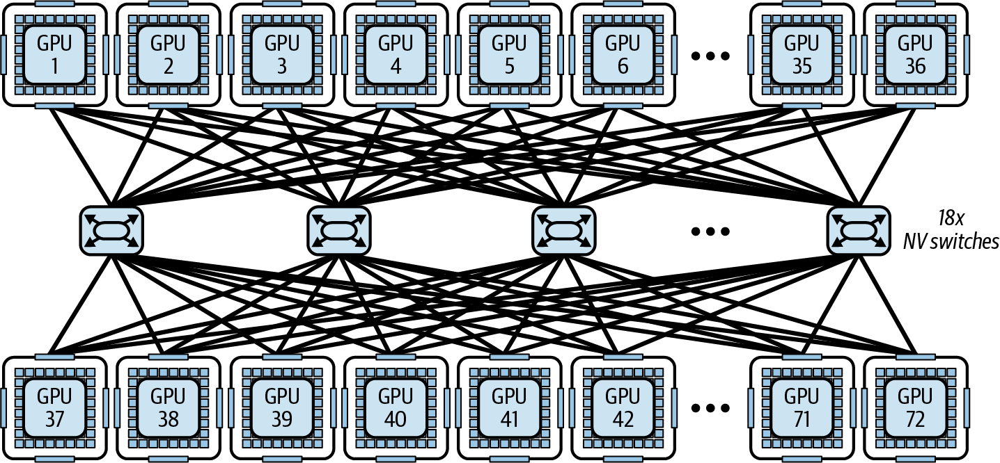

> Figure 19-14. All 72 GPUs sending data to a centralized parameter server

在这种情况下，NVSwitch需要缓冲和序列化许多这些传输。这导致延迟峰值。相反，协调和优化的方法是将发送方分成四组：组1（GPU 1-18）首先发送，然后几微秒后组2（GPU 19-36）发送，依此类推。

从GPU 0的角度来看，它按顺序接收四个较小的流量波。在任何给定时刻，大约只有18个GPU主动向GPU 0发送。这完全适合GPU的18端口容量。NVSwitch路由流量而无需排队。当组4完成时，GPU 0已接收所有数据--并且没有任何NVLink链路饱和，因为流量随时间平滑和平衡。

这种波错开方法推广到许多模式。全对全交换可以分成轮转的成对交换。这通常称为蝴蝶或洗牌模式。洗牌调度在每个时间步哪些GPU相互通信，使得每个NVSwitch端口保持忙碌，但不会过度忙碌。

NVSwitch传输的调度器可以使用时间分片算法，该算法将通信槽分配给特定GPU对或GPU组。因此，调度器不是启动一个大型、自由放任的批量传输，而是执行许多小的、同步的通信步骤--每个都分配特定的时间槽。这类似于前面描述的时分复用，它创建了NVSwitch交叉开关的可预测、无冲突使用。

值得注意的是，NVSwitch硬件本身将尝试减少网络上的争用。例如，如果多个流争用同一链路，NVSwitch将交错来自每个流的数据包以确保公平调度。

它还可能自适应地选择不同的内部交叉开关路径（如果可用）。但是，从软件角度来看，我们可以通过将这些自适应技术应用到我们的网络设计中来避免首先达到这些限制。

精细调度还包括通过限制推理期间并行运行多少繁重传输的并发控制。例如，在多GPU推理流水线期间，您可能避免同时跨GPU启动所有专家收集或广播操作。通过设计，这以一些并行性换取较少的争用。

通常，推理期间跨GPU同时进行2-4个大型专家收集或广播传输是最佳点。超过这个可能会产生收益递减或拥塞。

例如，调度器不是同时触发12个集体传输--这有使NVSwitch和NVLink饱和的风险--而是错开它们，一次运行最多4个高容量传输，等待它们完成，然后启动下一组。因为NVSwitch极快，这种序列化方法可能更快完成，因为它避免了太多重叠传输导致的拥塞。

协调NVSwitch传输是关于将通信结构视为可以调度的共享资源--类似于调度GPU内核和CPU线程的方式。通过调度网络资源，系统确保高优先级流量避免干扰。它用较低优先级流量填充空闲间隙以保持高利用率。

错开和分组通信等技术将通过避免严重争用模式来提高NVSwitch的有效吞吐量。这导致更可预测和更低延迟的通信，这对于推理服务中的尾延迟（或由拥塞网络导致的慢异常值响应）是关注点至关重要。

简而言之，多GPU推理系统中的拥塞感知、拓扑感知调度都是关于如何智能地将通信模式与给定硬件布局匹配。高性能推理系统将实时监控链路使用并适应NVLink/NVSwitch拓扑。它通过仔细的任务放置、优化的集体算法配置、多节点路由调整、MoE专家重新分配、动态运行时调整和数据传输的精细协调来实现这一点。

## 额外的自适应和动态优化技术 (Additional Adaptive and Dynamic Optimization Techniques)

接下来是一些补充我们提出的核心调优策略的额外动态推理和运行时适应技术。截至本文撰写时，这些想法是实验性的，尚未广泛使用。但是，它们很有前景，值得涵盖。这里的每种技术都包括简要描述和进一步阅读的链接。

### 动态早退网络

早退模型允许LLM在达到足够置信度时自截断其生成。这减少了简单输入的不必要计算。动态早退方法监控中间表示和logit熵来决定在每个层或token是否应该停止计算并发出最终输出。

这些网络需要特殊的模型架构或训练，因为它们在中间层添加辅助分类器。但是，它们可以在推理任务上产生高达30%-50%的推理加速而不损失精度（参见 https://oreil.ly/dn3vl 和 https://oreil.ly/73AeE）。

### 输入感知层跳过（DASH）

像DASH这样的框架将推理呈现为马尔可夫决策过程，根据输入特征逐token动态决定是执行还是跳过每个transformer层。通过学习小型评分网络，DASH可以为许多token跳过20%-40%的层。

DASH通常需要每层带有门控的修改模型。但是，它可以显著减少推理成本，同时在NLP基准测试上保持性能（https://oreil.ly/mz59T 和 https://oreil.ly/oL_Lr）。

### 推测性MoE专家路由和通信减少

对于MoE模型，推测性专家路由预测即将到来的token将激活哪些专家，并提前共同洗牌token和专家分配。

此技术涉及提前将token发送到预测的专家。如果预测错误，会浪费一些工作。但是，当预测良好时，整体通信减少。与静态专家并行（EP）+张量并行（TP）部署相比，这有助于将跨节点带宽使用减少高达30%。

### 使用LazyLLM的动态Token剪枝

LazyLLM选择性地仅为被认为重要的token计算KV缓存，使用轻量级评分函数定义。它从预填充和解码中修剪低影响token（例如，停用词和填充token）。通过仅对相关token进行昂贵的注意力计算，LazyLLM报告在长上下文工作负载上减少20%-30%的端到端延迟。

### 面向边缘的MoE内存预算

双路由和动态调度技术在受限环境（如边缘部署）中为专家权重引入潜在的内存问题。在实践中，这可能意味着保持一部分专家在GPU内存中活跃，并根据使用频率从闪存存储交换其他专家。

通过动态调整哪些低位专家驻留在内存中（与被卸载相对），推理系统可以在保持较低内存使用的同时维持高专家激活率。

### 动态量化和激活范围调整

虽然静态PTQ和QAT是众所周知的技术，但即时量化策略可以在推理期间实时调整激活量化参数。例如，它们可以使用滑动窗口统计每N个token修改观察器范围（用于激活量化器）。

这种类型的动态激活量化将实时监控激活统计信息并每N个token重新计算观察器范围。这样，可以将FP16分配给具有高方差的"热"层，将FP8分配给具有低方差的"冷"层。低方差层被约束在窄动态范围内。这最小化量化误差并最大化吞吐量。

因为低方差层产生的激活紧密聚集在均值周围，FP8的有限指数和尾数位（例如，E4M3格式）足以准确表示激活值。这产生显著的计算和内存节省--而没有明显的精度下降。

考虑使用混合FP8策略，例如E4M3用于前向传播（例如，激活和权重），E5M2用于反向传播（例如，梯度）。建议使用延迟缩放机制，如下所示使用Transformer Engine：

```python
from transformer_engine.common.recipe import Format, DelayedScaling
recipe = DelayedScaling(
    # E4M3 fwd, E5M2 bwd
    fp8_format=Format.HYBRID,      
    amax_history_len=1024,
    # delayed scaling window
    amax_compute_algo="max",
)
```

在这里，我们使用amax_history_len=1024设置延迟缩放窗口，这是一个常见的默认值。建议保持amax_compute_algo='max'，除非收敛分析建议其他方式。

同时，FP16保留给具有较大激活摆动或"热"层的层。这些层需要使用更宽的动态范围来捕获关键计算所需的数值保真度。

这种混合精度策略非常适合不需要离线校准的推理流水线。它们可以在每层动态修改数值保真度。这平衡了整体性能和模型精度。

> Next are some additional dynamic inference and runtime-adaptation techniques that complement the core tuning strategies we presented. As of this writing, these ideas are experimental and not widely available. However, they are promising and worth covering. Each technique here includes a brief description and links to further reading. Dynamic Early-Exit Networks: Early-exit models allow an LLM to self-truncate its generation when sufficient confidence is reached. This reduces unnecessary compute for easy inputs, for instance. Dynamic early-exit methods monitor intermediate representations and logit entropies to decide, at each layer or token, if it should stop computation and emit a final output. These networks require special model architecture or training since they add auxiliary classifiers at intermediate layers. However, they can produce up to 30%-50% inference speedup on reasoning tasks without accuracy loss (see https://oreil.ly/dn3vl and https://oreil.ly/73AeE). Input-Aware Layer Skipping (DASH): Frameworks like DASH present inference as a Markov Decision Process, which dynamically decides, per-token, whether to execute or skip each transformer layer based on input characteristics. By learning a small scoring network, DASH can skip 20%-40% of layers for many tokens. DASH typically requires a modified model with gating at each layer. However, it can reduce inference cost significantly while maintaining performance on NLP benchmarks (https://oreil.ly/mz59T and https://oreil.ly/oL_Lr). Speculative MoE Expert Routing and Communication Reduction: For MoE models, speculative expert routing anticipates which experts will be activated for upcoming tokens and co-shuffles tokens and expert assignments ahead of time. This technique involves sending tokens to predicted experts early. If prediction is wrong, some work is wasted. However, overall communication is reduced when predictions are good. This helps to reduce cross-node bandwidth use by up to 30% compared to static expert parallel (EP) + tensor parallel (TP) deployments. Dynamic Token Pruning with LazyLLM: LazyLLM selectively computes KV cache only for tokens deemed as important defined using a lightweight scoring function. It prunes the low-impact tokens (e.g., stopwords and filler tokens) out of both the prefill and decode. By focusing expensive attention computations on only relevant tokens, LazyLLM reports 20%-30% end-to-end latency reduction on long-context workloads. Edge-Oriented MoE Memory Budgeting: Dual routing and dynamic scheduling techniques introduce a potential memory issue for expert weights in constrained environments, such as edge deployments. In practice, this means maybe keeping a subset of experts active in GPU memory and swapping others from flash storage as needed. It does this based on usage frequency. By dynamically adjusting which low-bit experts reside in memory (versus being offloaded), inference systems can maintain high expert-activation rates while maintaining lower memory usage. Dynamic Quantization and Activation Range Adjustment: While static PTQ and QAT are well-known techniques, an on-the-fly quantization strategy can adjust activation-quantization parameters during inference in real time. They can use sliding-window statistics to modify the observer ranges (for activation quantizers) every N tokens, for example. This type of dynamic activation quantization will monitor activation statistics in real time and recompute observer ranges every N tokens. This way, FP16 can be allocated to "hot" layers with high variance and FP8 to "cool" layers with low-variance. Low-variance layers are constrained within a narrow dynamic range. This minimizes quantization error and maximizes throughput. Because low-variance layers produce activations that are clustered tightly around a mean, FP8's limited exponent and mantissa bits (e.g., E4M3 format) are sufficient enough to represent the activations' values accurately. This produces significant compute and memory savings-and without noticeable accuracy degradation. Consider using a hybrid FP8 strategy such as E4M3 for the forward pass (e.g., activations and weights) and E5M2 for the backward pass (e.g., gradients). It's recommended to use a delayed scaling mechanism as shown in the following code using the Transformer Engine: [...] Here, we set the delayed scaling window using amax_history_len=1024, which is a common default. It's recommended to keep amax_compute_algo='max' unless convergence analysis suggests otherwise. Meanwhile, FP16 remains reserved for layers with larger activation swings, or "hot" layers. These layers need to use a broader dynamic range to capture the numerical fidelity required for critical computations. This hybrid precision strategy works well for inference pipelines that don't require offline calibration. They can dynamically modify numerical fidelity at each layer. This balances overall performance and model accuracy.

## 关键要点 (Key Takeaways)

在现代GPU上，本章讨论的方法是从这些万亿参数模型中挤出每一点性能的实用方法。在实际部署中，这些动态运行时适应技术可以成就或破坏高性能推理服务产品。以下是本章的一些关键要点：

**使用torch.compile的稳态推理**：如果可以承受预热时间，优先选择mode="reduce-overhead"或autotune模式。这将有助于最小化低延迟推理工作负载的运行时开销。

**内核级自动调优**：动态优化GPU内核和瓦片大小。尽可能利用张量内存加速器（TMA）进行异步内存预取。使用提供自动调优的库和编译器，如CUTLASS和Triton--而不是手动调优它们，除非为了性能绝对必要。

**自适应精度**：在推理期间在8位和4位浮点（FP8/FP4）之间切换，以平衡速度和精度。您也可以根据需要与16位精度混合。在PyTorch中使用Transformer Engine进行FP8，因为torch.autocast()不直接支持FP8。

**解耦推理流水线**：跨资源分离预填充（提示处理）和解码（生成）阶段，以及基于实时因素（如KV缓存命中、队列深度和负载）的上下文感知请求路由。这保持了高吞吐量和长提示--而不会减慢短提示响应。

**动态并行策略**：根据输入/输出序列长度和模型结构--包括MoE路由--在数据并行、张量并行、流水线并行和混合执行组合之间即时决策。这些决策包括复制或分片模型。

**自适应解码和调度**：使用推测性解码、飞行中批次重塑和token级调度等技术来提高吞吐量和延迟。这些技术在vLLM、SGLang和NVIDIA TensorRT-LLM等引擎中实现。这验证了它们在生产环境中的有效性。

**内存管理和统一内存调优**：利用Grace CPU的内存和统一寻址将不常用的KV缓存页面卸载到CPU或NVMe。使用cudaMemAdvise和cudaMemPrefetchAsync等API进行最佳放置。确保使用GPUDirect Storage（如果可用）。这将直接从NVMe分页数据到GPU内存--绕过CPU。

**性能分析驱动的优化**：使用NVML、Nsight Systems/Compute、NVTX仪器和Prometheus指标等工具在运行时识别瓶颈，并自动应用图和内核优化。使用AI分析遥测数据以检测异常和优化机会。

> On modern GPUs, the approaches discussed in this chapter are practical ways to squeeze every bit of performance from these multi-trillion-parameter models. In real-world deployments, these dynamic runtime adaptation techniques can make or break a high-performance inference service offering. The following are some key takeaways from this chapter: Steady-state inference with torch.compile: Prefer mode="reduce-overhead" or autotune modes if you can afford the warmup time. This will help minimize runtime overhead for low-latency inference workloads. Kernel-level autotuning: Dynamically optimize GPU kernels and tile sizes. Leverage the Tensor Memory Accelerator (TMA) for asynchronous memory prefetch when possible. Use libraries and compilers that provide autotuning like CUTLASS and Triton-rather than hand-tuning them, unless absolutely necessary for performance. Adaptive precision: Switch between 8-bit and 4-bit floating point (FP8/FP4) during inference to balance speed and accuracy. You can also mix with 16-bit precision as needed. Use the Transformer Engine for FP8 in PyTorch since torch.autocast() does not support FP8 directly. Disaggregated inference pipeline: Separate the prefill (prompt processing) and decode (generation) phases across resources, and context-aware request routing based on real-time factors like KV cache hits, queue depth, and load. This maintains high throughput with long prompts-without slowing down short-prompt responses. Dynamic parallelism strategies: Perform on-the-fly decisions between data-parallel, tensor-parallel, pipeline-parallel, and hybrid execution combinations depending on input/output sequence lengths and model structure-including MoE routing. These decisions include replicating or sharding the model. Adaptive decoding and scheduling: Use techniques, such as speculative decoding, in-flight batch reshaping, and token-level scheduling, to improve throughput and latency. These techniques are implemented in engines like vLLM, SGLang, and NVIDIA TensorRT-LLM. This validates their effectiveness in production settings. Memory management and Unified Memory tuning: Utilize Grace CPU's memory with unified addressing to offload infrequently used KV cache pages to CPU or NVMe. Using APIs like cudaMemAdvise and cudaMemPrefetchAsync for optimal placement. Make sure to use GPUDirect Storage, if available. This will directly page data from NVMe to GPU memory when needed-bypassing the CPU. Profiling-driven optimization: Use tools like NVML, Nsight Systems/Compute, NVTX instrumentation, and Prometheus metrics to identify bottlenecks at runtime and automatically apply graph and kernel optimizations. Analyze telemetry using AI to detect anomalies and optimization opportunities.

## 结论 (Conclusion)

本章涵盖的技术将静态推理部署转变为自优化、自适应引擎。通过监控运行时信号（延迟、利用率、内存、网络吞吐量）并应用动态并行、精度缩放、自动调优内核、主动缓存、基于RL的控制和智能调度等策略，可以将超大型模型推理推向极限。

成功的推理服务可以处理大量用户、大型输入上下文、大量上传的文档、广泛的推理和严格的延迟SLA，同时支持大规模模型大小。而且它将成本有效地做到这一点，因为它不需要那么多硬件来实现相同的吞吐量。

请记住，网络结构是系统协同设计的一部分--而不是事后想法。想法是保持NVLink和NVSwitch集群结构充分利用。这可以提高接近线性理想条件的吞吐量扩展--同时保持低延迟--随着模型和GPU集群的持续增长。通过适当的调度，NVLink/NVSwitch结构中的GPU表现得像一个紧密耦合的加速器--从软件角度来看几乎像单个大型GPU。

每个策略都是AI系统性能工程师工具箱中的工具。最有效的解决方案通常结合这些工具。例如，您可能训练一个RL策略来决定何时切换并行模式或调整精度--或使用预热来保持连续批处理调度器准备就绪。

请记住，您不必一次实现所有这些。即使只是一两个也可以产生明显的改进。从最简单的开始（例如，缓存和批处理改进），然后逐步添加其他。

这些技术的主题是灵活性和适应性。推理运行时应该能够响应当前工作负载重新配置自己。这就是如何将大型LLM转变为精心调优、可扩展的生产服务--高效且具有成本效益。

> The techniques covered in this chapter transform a static inference deployment into a self-optimizing, adaptive engine. By monitoring runtime signals (latency, utilization, memory, network throughput) and applying strategies like dynamic parallelism, precision scaling, autotuned kernels, proactive caching, RL-based control, and smart scheduling, one can push ultralarge model inference to its limits. A successful inference service can handle massive amounts of users, large input contexts, lots of uploaded documents, extensive reasoning, and strict latency SLAs all while supporting massive model sizes. And it will do this cost-effectively since it won't need as much hardware to achieve the same throughput. Remember that the network fabric is part of the system codesign-and not an afterthought. The idea is to keep the NVLink and NVSwitch cluster fabric fully utilized. This can improve throughput-scaling that approaches near-linear in ideal conditions-while maintaining low latency-as models and GPU clusters continue to grow. With proper scheduling, the GPUs in an NVLink/NVSwitch fabric behave like a tightly coupled accelerator-acting almost as a single large GPU from a software perspective. Every strategy is a tool in the AI system performance engineer's toolkit. The most effective solutions usually combine these tools. For example, you might train an RL policy to decide when to switch parallelism modes or adjust precision-or use prewarming to keep a continuous batching scheduler primed and ready. And remember that you don't have to implement these all at once. Even just one or two can produce noticeable improvements. Start with what's easiest (e.g., caching and batching improvements), then layer in the others. The theme with these techniques is flexibility and adaptability. The inference runtime should be able to reconfigure itself in response to the current workload. This is how you can turn a massive LLM into a well-tuned, scalable production service-efficiently and cost-effectively.

> The performance of neural network layers on GPUs can vary drastically depending on low-level parameters like thread block size, tile dimensions, loop unrolling, and memory access patterns. For fixed-size models, libraries typically choose these parameters only once-often using general heuristics or offline tuning. However, in an online inference service scenario, input sizes, including sequence lengths and batch sizes, can vary from request to request. Kernel autotuning refers to a runtime mechanism that selects-or even JIT-compiles-the optimal kernel variant for the current workload. In the context of large transformer models, the two major compute phases of inference are self-attention and feed-forward MLP layers. Both can benefit from autotuning of their GPU kernels. Let's cover each of these in the context of kernel autotuning. Consider an attention layer that processes a sequence of length L with H attention heads. There are many implementations of attention, including standard attention and optimized FlashAttention-and its multiple variants. FlashAttention and its variants are significantly faster for long sequences due to tiling, parallelism, and memory-access improvements. However, for very short sequences, its overhead might outweigh its benefit. A dynamic engine can switch between a FlashAttention kernel and a simpler kernel depending on the sequence length, L. For instance, if a request has L = 256 tokens, the engine might use a straightforward kernel launch that computes attention in one go using global memory reads, which are sufficient for small L. If another request comes in with L = 2,048, it could switch to FlashAttention's specialized tiling kernel known to scale better for large L by reusing data in shared memory and avoiding unnecessary HBM data fetches. This is demonstrated as a condition statement based on the input sequence length, as shown here: ... Behind the scenes, attn_kernel picks between completely different CUDA implementations. One implementation is optimized for small inputs using the default attention kernel, and another is optimized for large contexts using the tiled kernel. The ideal tile dimensions depend on your GPU's shared-memory capacity and compute resources. Frameworks like CUTLASS and OpenAI's Triton include autotuners that benchmark a range of (TILE_Q, TILE_K) combinations at initialization-or even adaptively at runtime-to select the fastest variant. Table 19-3 shows examples of how different tile sizes perform on a Blackwell-class GPU. By choosing the right variant at runtime based on the input, you avoid the huge performance cliff of a one-size-fits-all approach. In practice you might benchmark on your target hardware to find that around L = 128 is the breakeven point. Next, let's analyze the feed-forward MLP kernels in the context of autotuning. The feed-forward layers are essentially large matrix multiplications-specifically, two linear projections with a nonlinear activation in between. Modern AI frameworks like PyTorch use highly optimized GEMM kernels using optimized CUDA libraries like cuBLAS and CUTLASS. There are often multiple algorithmic variants in these libraries for a given matrix size that use different tiling strategies, different Tensor Cores, and separate fallback paths. For instance, NVIDIA's cuBLAS and cuBLASLt libraries can autotune GEMM kernels by first trying a few algorithms, then picking the fastest algorithm for the given dimensions. However, this typically happens the first time a GEMM of that shape is encountered-and not revisited. Where available in cuBLAS/cuBLASLt or custom kernels, programmatic dependent launch (PDL) can reduce launch gaps and improve steady-state throughput. Make sure to profile to confirm overlap. In an inference server that sees many different batch sizes, one can explicitly invoke such autotuning mechanisms-or maintain a cache of best algorithms. For instance, for the MLP's GEMM of shape [batch_size, hidden_dim] x [hidden_dim, 4*hidden_dim], the optimal kernel might differ for batch_size = 1 versus batch_size = 16. The engine can detect a new batch size and run a quick microbenchmark of candidate kernels using cuBLASLt or a custom implementation to select the fastest kernel. Subsequent calls with that batch size can then directly use the chosen kernel. In addition, some inference frameworks and runtimes use OpenAI's Triton GPU kernel domain-specific library (DSL) to compile attention and MLP kernels on the fly with autotuned tile sizes. In this case, the runtime would generate a few variants of a kernel with different tile sizes (e.g., 128 x 128, 64 x 256, etc.) and measure which performs better given the actual hardware and input shape. You can use tools like Nsight Systems to empirically profile different kernel variants side by side. Specifically, Nsight Systems provides detailed CUDA timelines, including memcpy and NVLink activity, and Nsight Compute provides memory workload analysis that helps attribute cache and memory behavior to kernel sites. This is particularly useful when evaluating tile-size and shared-memory trade-offs. In addition, it can often reveal nonobvious bottlenecks like L2 cache misses that will further guide your tuning decisions. Because hardware can sometimes be somewhat unpredictable under load given L2 cache effects, memory bank conflicts, etc., empirical tuning will always beat theoretical guesses. But it's good to start the tuning process with reasonable theoretical values. Dynamic tile switching affects GPU occupancy and should be considered when choosing a tile size. Using a larger tile can increase reuse and reduce kernel-launch overhead, but it can also use more registers and shared memory. This will potentially reduce the number of thread blocks that can run concurrently-reducing occupancy. A proper autotuner will consider this trade-off. In attention kernels, a larger tile (e.g., 128 x 128) maximizes data reuse in shared memory. This is ideal for long sequences since you issue fewer global-memory loads, amortize loop overhead, and produce higher sustained throughput. For shorter sequences, however, that same large tile can consume too much shared memory, which limits the occupancy, or number of concurrent thread blocks running on each SM. By reducing the tile size (e.g., 64 x 64) for shorter sequences, you free up shared memory so you can schedule more blocks in parallel. This boosts SM occupancy and reduces per-kernel latency. By adapting the tile size based on the input sequence length, the kernel can achieve near-optimal occupancy in most cases. Some systems even query the CUDA Occupancy API at runtime to choose kernel-launch parameters dynamically, such as thread block size. An example of the Occupancy API in C++ is shown next, but a Python API is also available: ... This pseudo-C++ illustrates evaluating different thread block sizes for a kernel. It checks how many blocks per SM can run given their shared-memory usage. The kernel launch then adjusts the number of threads-or shared-memory use-accordingly. High-performance frameworks and inference engines automate this type of logic internally using the following set of steps: 1. Measure workload: Inspect the current input dimensions (batch size B, sequence length L, etc.) for the next model forward. 2. Select candidate kernels: Determine available kernel implementations for each component, such as standard attention or flash attention for the attention phase and an appropriate GEMM algorithm for the MLP phase. 3. Estimate or benchmark: Run a quick run of each candidate by executing each algorithm for a few iterations on sample data. 4. Choose best variant: Select the kernel with minimal execution time-or sufficient throughput-based on the measured dimensions. 5. Cache result: Store the choice in a lookup table keyed by the input dimension or workload signature. This way, if a similar request appears, the best kernel is known without having to rerun these steps. 6. Execute: Run the model layer using the chosen kernel implementation. This is analogous to a database query optimizer picking a query plan. Here, the "plan" is the chosen kernel implementation. By following such a process, the inference runtime continuously tunes itself. Over time, the system builds a library of optimized paths for various scenarios, such as short versus long prompts, small versus large batches, etc. The overhead of on-the-fly tuning is kept low by either doing it asynchronously-testing new kernels in a separate stream while the current inference uses a default kernel-or during low-traffic periods so as not to impact latency. It's recommended to incorporate an initial warm-up phase when a model is loaded by running a variety of sample inputs through to trigger autotuning. This can include extremes-like max sequence length, max batch, etc.-so that the engine preoptimizes kernels for those cases. Also, it's best to monitor execution time at each layer during runtime. If a layer suddenly becomes a bottleneck due to a change in input characteristics, then it's time to revisit the kernel selection. Some advanced frameworks even use multiarmed bandit algorithms that continuously explore alternative kernels and update the choice of a different kernel as conditions change. In short, autotuning transforms static kernels into adaptive ones. This squeezes the highest performance out of your GPU cluster for each set of inputs regardless of the workload. You can be confident that the system is constantly adapting.
