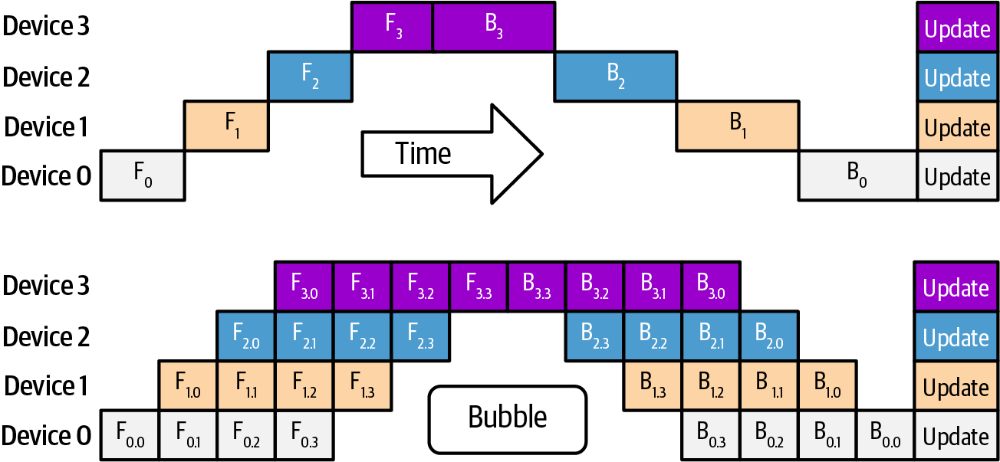
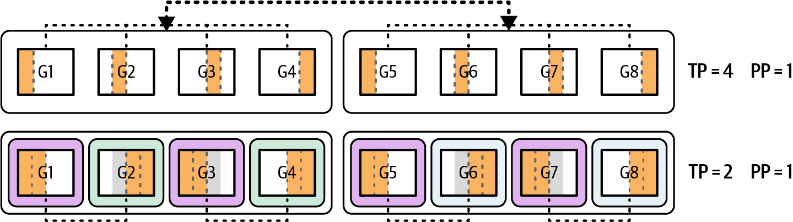
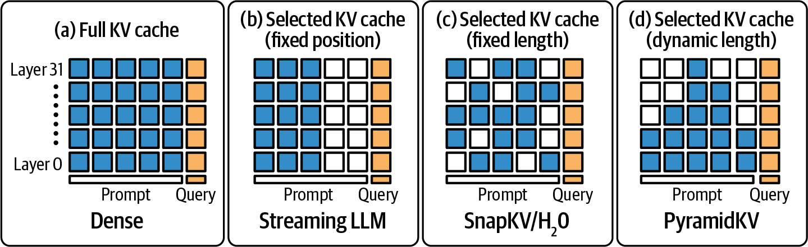
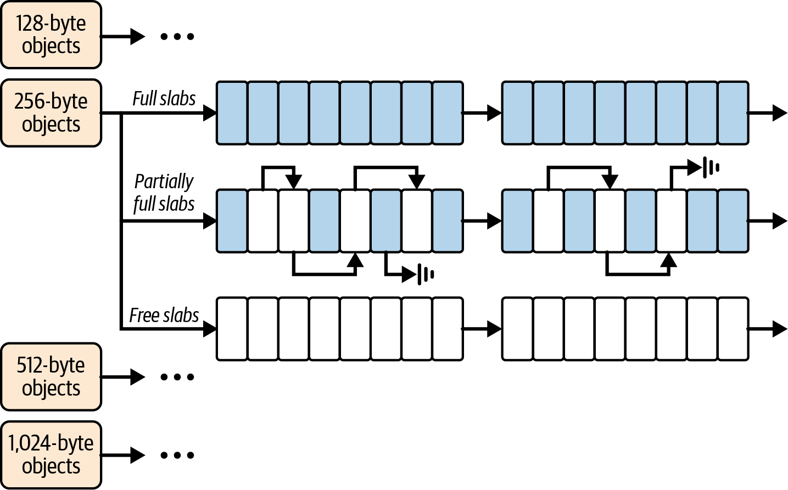
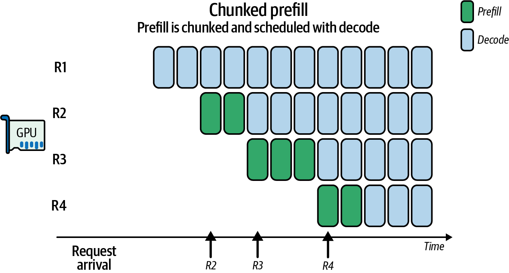
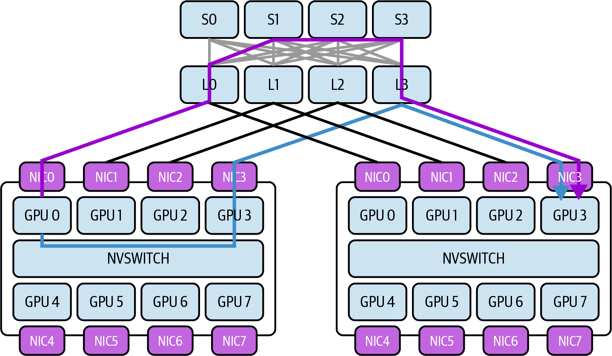
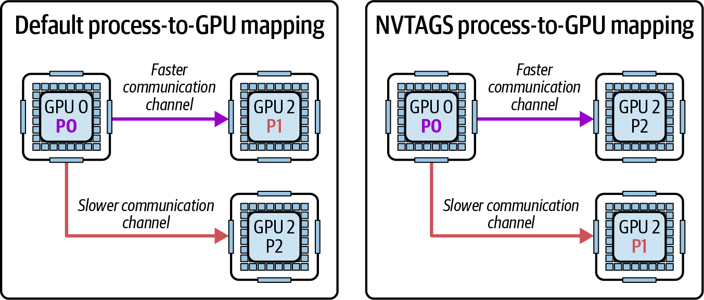
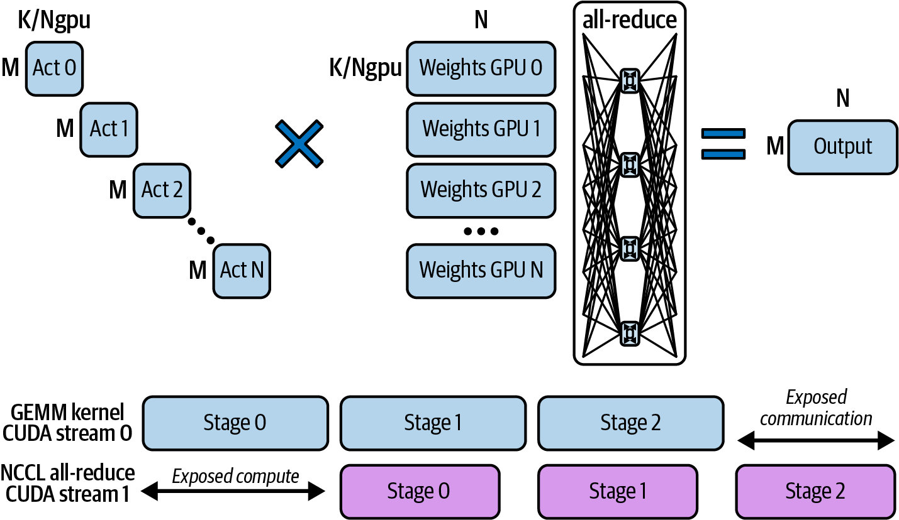
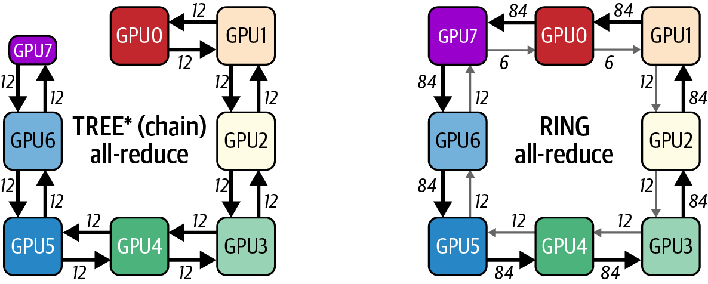
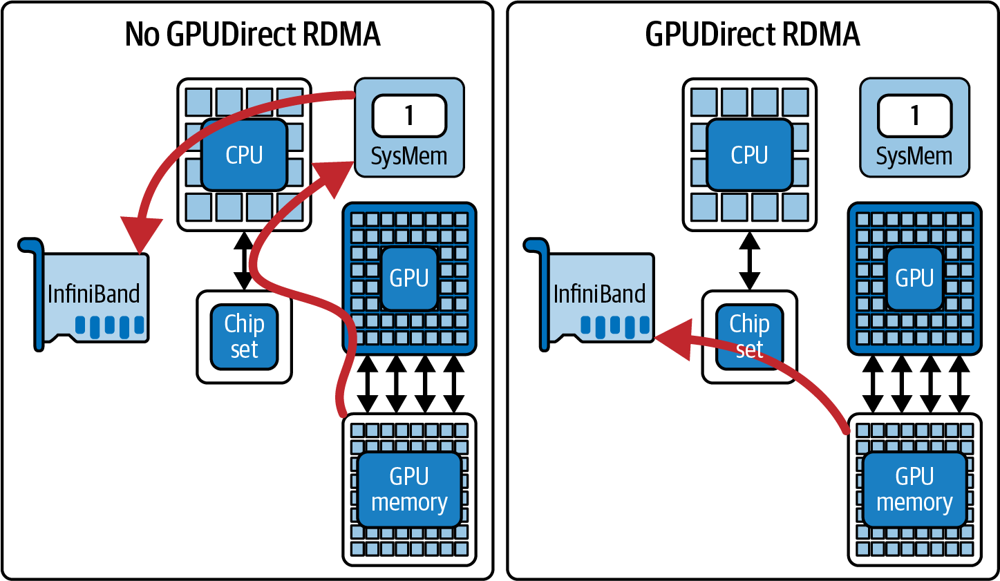

# 第19章 动态和自适应推理引擎优化 (Chapter 19. Dynamic and Adaptive Inference Engine Optimizations)

在现代硬件上运行超大规模语言模型（LLM）推理需要动态运行时适应，以在不断变化的条件下实现高吞吐量和低延迟。静态的"一刀切"模型服务优化方法已不再足够。

> Ultralarge language model (LLM) inference on modern hardware requires dynamic runtime adaptation to achieve both throughput and low latency under varying conditions. A static "one-size-fits-all" approach to model-serving optimizations is no longer sufficient.

相反，最先进的模型服务系统使用*自适应策略*，即时调整并行性、数值精度、CUDA内核调度和内存使用。本章探讨这些先进技术，包括动态并行性切换、精度缩放、实时缓存管理以及基于强化学习（RL）的调优。

> Instead, state-of-the-art model serving systems use *adaptive strategies* that adjust parallelism, numerical precision, CUDA-kernel scheduling, and memory usage on the fly. This chapter explores these advanced techniques, including dynamic parallelism switching, precision scaling, real-time cache management, and reinforcement learning (RL)-based tuning.

本章为超大规模LLM推理提供最佳实践，教您如何编排一个能够监控自身性能并实时适应以最大化效率的引擎。

> This chapter provides best practices for ultrascale LLM inference, teaching you how to orchestrate an engine that monitors its own performance and adapts in real time to maximize efficiency.

## 自适应并行策略（TP与PP与混合） (Adaptive Parallelism Strategies - TP Versus PP Versus Hybrid)

大规模LLM需要模型并行性，如张量并行和流水线并行——或混合方法——将计算分散到多个GPU。每种方法都有优缺点。表19-1总结了针对特定推理流量模式的推荐并行策略。

> Massive LLMs require model parallelism, such as tensor and pipeline—or a hybrid approach—to spread computation across multiple GPUs. Each approach has benefits and drawbacks. Table 19-1 summarizes the recommended parallelism strategies for specific inference traffic patterns.

**表19-1. 常见推理流量模式映射到推荐并行策略的总结**

| 推理流量模式 | 推荐并行策略 | 理由 |
|------------|------------|------|
| 许多短请求（< 256 tokens，高RPS） | 数据并行/副本扩展 | 最小化GPU间通信；每个GPU运行处理独立请求的副本（假设模型适合单个GPU内存） |
| 少量长请求（≥ 8k tokens，低并发） | 流水线并行（带微批次） | 通过跨GPU分割层来减少每请求延迟 |
| 混合负载（短+部分长） | 混合动态（自动切换） | 在单个GPU上运行小型聊天，流水线处理长请求以满足延迟SLA |
| 极大模型（> 1个GPU内存） | 张量+流水线混合 | 需要适应模型；在两个维度上平衡计算和内存 |
| MoE模型推理（稀疏专家选择） | 专家并行 | 将单个专家分布到GPU；每个请求仅调用专家子集，减少每设备内存和计算负载 |

> **Table 19-1. Summary of common inference traffic patterns mapped to the recommended parallelism strategy**
>
> | Inference traffic pattern | Recommended parallelism | Rationale |
> |--------------------------|------------------------|-----------|
> | Many short requests (< 256 tokens, high RPS) | Data parallel/replica scaling | Minimizes inter-GPU communications; each GPU runs replicas handling independent requests (assuming the model fits into a single GPU's memory) |
> | Few long requests (≥ 8k tokens, low concurrency) | Pipeline parallelism (with microbatches) | Reduces per-request latency by splitting layers across GPUs |
> | Mixed load (short + some long) | Hybrid dynamic (autoswitching) | Runs small chats on single GPUs and pipelines long ones to meet latency SLAs |
> | Extremely large model (> 1 GPU memory) | Tensor + pipeline hybrid | Required to fit the model; balances compute and memory across both dimensions |
> | MoE model inference (sparse expert selection) | Expert parallelism | Distributes individual experts across GPUs; each request invokes only a subset of experts, reducing per-device memory and compute load |

数据并行和副本扩展策略将在每个GPU上复制完整模型，并在这些副本之间负载均衡传入的请求。这不需要单个推理的GPU间同步，因为每个GPU独立处理单独的请求。

> The data parallel and replica scaling strategy will replicate the full model on each GPU and load-balance incoming requests across these replicas. This requires no inter-GPU synchronization for individual inferences since each GPU handles separate requests independently.

这最大化了许多中小型输入的吞吐量，通信开销最小。但是，如果模型不适合单个GPU内存，数据并行不是一个选项。

> This maximizes throughput for many small- or medium-sized inputs with minimal communication overhead. However, data parallelism is not an option if the model does not fit into a single GPU's memory.

张量并行（TP）是模型并行的一种形式（相对于数据并行），它将模型矩阵（如权重、层等）分割到GPU上以加速矩阵乘法。但是，它引入了额外的all-reduce通信来保持GPU同步。

> Tensor parallelism (TP) is a form of model parallelism (as opposed to data parallelism) that splits model matrices (e.g., weights, layers, etc.) across GPUs to speed up matrix multiplies. However, it introduces extra all-reduce communications to keep the GPUs in sync.

流水线并行（PP）是另一种形式的模型并行，它也分割模型。但它不是分割单个模型层和矩阵，而是将整个层分配给不同的GPU以克服内存限制——假设层适合单个GPU。PP会产生额外的开销，形式为顺序阶段延迟。这些被称为*流水线气泡*，如图19-1所示。

> Pipeline parallelism (PP) is another form of model parallelism that splits the model as well. But instead of splitting individual model layers and matrices, it assigns whole layers to different GPUs to overcome memory limits—assuming the layers fit into a single GPU. PP incurs additional overhead in the form of sequential stage delays. These are called *pipeline bubbles*, as shown in Figure 19-1.

专家并行用于混合专家（MoE）模型架构，将每个专家子网络分配给自己的GPU。然后，轻量级门控网络仅将每个输入请求或token定向到路由器识别的前k个活跃专家。在这种情况下，每个GPU仅处理它托管的专家子集。

> Expert parallelism, used in mixture-of-experts (MoE) model architectures, assigns each expert subnetwork its own GPU. A lightweight gating network then directs each input request or token to only the top-k active experts identified by the router. In this case, each GPU processes just the subset of experts that it hosts.



> *Figure 19-1. Pipeline bubbles caused by PP*

通过每个输入仅激活少数专家，专家并行减少了具有大量专家的模型（通常称为*宽*专家模型）的每设备内存、推理时间和计算成本。基于条件的、路由器的专家计算模式随着添加更多专家而高效扩展。例如，DeepSeek-R1有256个总专家，但在推理期间仅选择前9个专家（包括1个共享专家）。

> By activating only a few experts per input, expert parallelism reduces per-device memory, inference time, and compute costs for models with a large number of experts, often called *wide* expert models. The conditional, router-based expert compute pattern scales efficiently as you add more experts. For instance, DeepSeek-R1 has 256 total experts, but only the top 9 experts (including 1 shared expert) are chosen by the router during inference.

传统上，并行策略——包括多种并行技术组合的混合策略——在模型加载时预先选择并固定。但是，为了在动态工作负载下最大化性能，现代推理引擎可以根据输入特征在运行时选择不同的并行策略。

> Traditionally, the parallelization strategy—including a hybrid strategy of multiple parallelism techniques combined—is chosen and fixed upfront when the model is loaded. However, to maximize performance under dynamic workloads, modern inference engines can choose different parallelism strategies at runtime based on the characteristics of the input.

高性能自适应推理系统使用运行时指标即时选择TP、PP或混合方法。关键因素包括批次大小、序列长度和内存利用率——以及响应延迟和吞吐量要求。例如，非常长的提示可能会被路由到TP + PP实例，因为这会将层分散到GPU以避免内存不足（OOM）错误。

> High-performance, adaptive inference systems use runtime metrics to choose TP, PP, or a hybrid approach on the fly. Key factors include batch size, sequence length, and memory utilization—as well as response latency and throughput requirements. For instance, very long prompts may be routed to a TP + PP instance since this spreads layers across GPUs to avoid out-of-memory (OOM) errors.

同时，短的延迟敏感请求将路由到仅TP模型实例以避免流水线阶段开销。为了支持这一点，您的服务引擎维护多个预分片的模型实例，每个实例针对不同的工作负载配置文件进行优化，并动态将传入查询分派到并行策略最能满足作业SLO的模型实例。

> Meanwhile, short latency-sensitive requests would route to a TP-only model instance to avoid pipeline-stage overhead. To support this, your serving engine maintains multiple presharded model instances, each optimized for different workload profiles, and dynamically dispatches incoming queries to the model instance whose parallelism strategy best satisfies the job's SLOs.

您也可以使用不同数量的分片。如图19-2所示，它在八个GPU上使用两种不同的混合TP + PP并行配置，具有两种不同的TP分片数量。

> You can also use a different number of shards. This is shown in Figure 19-2, which uses two different numbers of TP shards in two different hybrid TP + PP parallelism configurations across eight GPUs.



> *Figure 19-2. Preprovisioning two different hybrid-sharding pools (TP = 4, PP = 1 and TP = 2, PP = 1) for a given model across eight GPUs*

对长序列输入即时使用PP有助于避免由大输入序列引起的OOM错误。相反，对于短提示和延迟敏感查询，系统可以将请求路由到针对低延迟优化的张量并行模型实例。在这种情况下，请求避免了PP的开销。

> Using PP on the fly for long sequence inputs helps to avoid OOM errors caused by the large input sequence. Conversely, for short prompts and latency-sensitive queries, the system can instead route to a tensor-parallel model instance optimized for low latency. In this case, the request avoids the overhead of PP.

由于每个请求可以使用不同的并行策略，系统需要维护模型的多个实例供推理调度器/路由器选择。模型的一个实例将使用TP针对低延迟进行优化，而另一个实例使用TP和PP针对高吞吐量和大输入序列进行优化。

> Since each request can use a different parallelism strategy, the system needs to maintain multiple instances of the model for the inference scheduler/router to choose. One instance of the model would be optimized for low latency using TP, while another instance is optimized for high throughput and large input sequences using both TP and PP.

维护模型的多个实例是必需的，因为即时重新分片会对GPU缓存造成严重破坏。这也会给内存和网络子系统带来太大压力——尤其是在重新分片大型模型时。

> Maintaining multiple instances of the model is required because resharding on the fly would wreak havoc on GPU caches. This would also put too much pressure on the memory and network subsystems—especially when resharding massive models.

在运行时，每个查询根据其长度和指定的服务级别协议（SLA）分派到最适合的模型实例（分片策略）。例如，DeepSeek-R1是一个约6800亿参数的稀疏混合专家模型，每个token仅激活370亿参数。

> At runtime, each query is dispatched to the best-fitting model instance (sharding strategy) based on its length and the specified service-level agreements (SLAs). DeepSeek-R1, for instance, is a ~680 billion-parameter sparse mixture-of-experts model that activates only 37 billion parameters per token across the experts.

为了支持不同的工作负载配置文件，GPU可以组织成逻辑工作池，每个池使用特定的并行策略进行预分片——例如张量并行或混合张量+流水线并行。

> To support different workload profiles, GPUs can be organized into logical worker pools, each presharded with a specific parallelism strategy—either tensor-parallel or hybrid tensor + pipeline parallel, for instance.

让我们考虑一个例子。如果我们有一个8× GPU Blackwell B200服务器，总计1,440 GB HBM内存（1,440 GB = 180 GB每GPU × 8 GPU），我们可以用四路TP在四个GPU上服务DeepSeek-R1——让其他四个GPU空闲。

> Let's consider an example. If we have an 8× GPU Blackwell B200 server totaling 1,440 GB of HBM memory (1,440 GB = 180 GB per GPU × 8 GPUs), we can serve DeepSeek-R1 with four-way TP across four GPUs—leaving the other four GPUs idle.

如果单个查询到达且具有极长的上下文（例如，> 100万tokens），调度器可以生成一个两阶段流水线，使得阶段1跨越GPU 0-3，阶段2跨越GPU 4-7。这有效地将每阶段可用GPU内存加倍到约720 GB（180 GB每GPU × 4 GPU）的总HBM（720 GB可用HBM）。这有助于在处理大输入时避免OOM错误。

> If a single query arrives with an extremely long context (e.g., > 1 million tokens), the scheduler can spawn a two-stage pipeline such that stage 1 spans GPUs 0–3 and stage 2 spans GPUs 4–7. This effectively doubles the available GPU memory per stage to ~720 GB (180 GB per GPU × 4 GPUs) of total HBM (720 GB usable HBM). This helps avoid OOM errors when processing large inputs.

相反，当数十个短的、延迟敏感的提示同时到达时，系统将它们路由到仅张量并行实例。通过避免流水线气泡（填充和排空流水线阶段时发生的空闲期），此配置在所有可用GPU上提供尽可能低的每请求延迟。

> Conversely, when dozens of short, latency-sensitive prompts arrive concurrently, the system routes them to the tensor-parallel instance only. By avoiding pipeline bubbles, or idle periods that occur while filling and draining pipeline stages, this configuration delivers the lowest possible per-request latency across all available GPUs.

要实现动态并行切换，您可以实现一个决策函数，检查运行时指标如输入序列长度、GPU内存使用率和当前负载。您将使用这些指标为每个请求选择最佳分片的模型实例，如下所示：

> To implement dynamic parallelism switching, you can implement a decision function that inspects runtime metrics like input sequence length, GPU memory usage, and current load. You would use these metrics to select the best-sharded model instance for each request, as shown here:

```python
def choose_worker_pool(seq_len, gpu_mem_util, concurrent_reqs):
    # 对于长上下文或高内存压力，
    # 使用混合流水线+张量并行
    # （此处显示示例阈值）
    if seq_len > 4096 or gpu_mem_util > 0.8:
        return "tp_pp_hybrid"
    # 对于许多同时的小请求，坚持使用张量并行
    if concurrent_reqs > 4:
        return "tensor_parallel"
    # 对于典型工作负载回退到张量并行
    return "tensor_parallel"
```

您将在GPU集群上预启动多个模型副本——一些分片为仅TP，另一些为TP + PP——并让路由器根据输入和决策策略将每个查询发送到适当的副本。这种方法确保大型、内存密集型作业获得完整的流水线支持，而短的、延迟敏感的调用在仅TP实例上运行以避免不必要的流水线开销。

> You'd prelaunch multiple model replicas on your GPU cluster—some sharded for TP-only and others for TP + PP—and have a router send each query to the appropriate replica based on the inputs and the decision strategy. This approach ensures that large, memory-intensive jobs get full pipeline support, while short, latency-sensitive calls run on TP-only instances to avoid unnecessary pipeline overhead.

建议使用模型和硬件的遥测数据来通知并行切换。您可以实时监控GPU内存利用率、计算利用率和互连（如NVLink/NVSwitch）流量来做出决策。如果您注意到由于长流水线气泡而有空闲GPU——并且您有额外的内存余量——您可以将流水线折叠为更少的阶段，以便每个GPU做更多工作并保持忙碌。相反，如果某些阶段达到内存限制或计算瓶颈，您可以扩展到更多流水线阶段——或提高张量并行度。这将计算和内存占用分散到额外的GPU。

> It's recommended to use telemetry from the model and hardware to inform parallelism switching. You can monitor GPU memory utilization, compute utilization, and interconnect (e.g., NVLink/NVSwitch) traffic in real time to make the decision. If you notice idle GPUs because of long pipeline bubbles—and you have extra memory headroom—you can collapse your pipeline into fewer stages so each GPU does more work and stays busy. Conversely, if some stages are hitting memory limits or compute bottlenecks, you can expand into more pipeline stages—or raise your tensor-parallel degree. This will spread the computations and memory footprint across additional GPUs.

关键是动态调整张量和流水线分割的平衡，以保持每个GPU良好利用。同时，您需要保持在内存约束内并达到延迟目标。这是静态的一刀切配置无法实现的。

> The key is to adjust the balance of tensor and pipeline splits dynamically to keep every GPU well utilized. At the same time, you need to stay within memory constraints and hit latency targets. This is something a static, one-size-fits-all configuration cannot achieve.

## 动态精度切换 (Dynamic Precision Changes)

像Blackwell这样的现代GPU引入了对8位和4位浮点（FP8/FP4）Tensor Core数学单元的支持。这些较低精度提供大幅加速、内存节省和最小的质量损失。

> Modern GPUs like Blackwell introduce support for 8-bit and 4-bit floating point (FP8/FP4) Tensor Core math units. These lower precisions offer large speedups, memory savings, and minimal quality loss.

动态精度切换是一种先进技术，推理引擎根据模型置信度或资源压力在运行时调整数值精度。目标是增加吞吐量而不显著损失质量。在实践中，这意味着系统可能以FP8或FP4执行模型的某些部分以提高效率，但在需要稳定性时回退到更高精度（FP16/BF16）。

> Dynamic precision switching is an advanced technique in which the inference engine adjusts the numerical precision at runtime based on model confidence or resource pressure. The goal is to increase throughput without significant quality loss. In practice, this means the system might execute certain parts of the model in FP8 or FP4 for efficiency but fall back to higher precision (FP16/BF16) when needed for stability.

精度适应的一个触发因素是*logit锐度*，或模型的输出置信度。例如，如果模型对下一个token的概率分布由于对特定token的高置信度而显示出极端峰值，来自低精度的小数值误差不太可能改变结果。

> One trigger for precision adaptation is *logit sharpness*, or the model's output confidence. For example, if the model's probability distribution for the next token shows extreme peaks due to high confidence in a specific token, small numerical errors from low precision are unlikely to change the outcome.

如果低精度可以容忍用于下一个token生成，引擎将安全地使用FP4进行接下来的几步以获得速度。相反，如果分布由于高不确定性而较平坦，引擎应坚持使用FP8或FP16以保持保真度。

> If low precision can be tolerated for the next token generation, the engine will safely use FP4 for the next few steps to gain speed. Conversely, if the distribution is flatter due to high uncertainty, the engine should stick to FP8 or FP16 to preserve fidelity.

推理引擎通过计算词汇表上softmax分布的香农熵来量化不确定性。较低的熵表示更锐利（更自信）的预测。在保留验证集上调优的固定熵阈值决定何时降到FP4以及何时保持在FP8/FP16以获得数值稳定性。目标是平衡延迟增益与精度损失。

> The inference engine quantifies uncertainty by computing the Shannon entropy of the softmax distribution over the vocabulary. Lower entropy indicates a sharper (more confident) prediction. A fixed entropy threshold, tuned on a held-out validation set, determines when to drop to FP4 and when to remain in FP8/FP16 for numerical stability. The goal is to balance latency gains versus accuracy loss.

使用保持精度的最低精度，并在模型置信度下降时（通过最大softmax概率测量）恢复到更高精度。

> Use the lowest precision that maintains accuracy, and revert to higher precision when the model's confidence drops as measured by the maximum softmax probability.

这利用了大型LLM在生成确定性延续时通常会变得更加确定的事实，例如闭合引号或完成列表。在这些情况下，较低精度通常足够。

> This leverages the fact that large LLMs often become more certain as they generate deterministic continuations, such as closing quotes or finishing a list. In these cases, lower precision is usually sufficient.

另一个因素是内存压力。如果GPU内存使用由于非常长的上下文或许多并行请求而接近其限制，系统可以动态将激活压缩到较低精度。

> Another factor is memory pressure. If GPU memory usage is approaching its limit due to a very long context—or many parallel requests, the system can dynamically compress activations to a lower precision.

可以在内存稀缺时将注意力键/值张量存储为INT4而不是INT8。这将减少50%的内存占用。但是，请确保使用INT4的量化误差不会在许多解码步骤中复合。建议定期重新评估输出质量。

> One could store the attention key/value tensors in INT4 instead of INT8 when memory is scarce. This would reduce the memory footprint by 50%. However, make sure the quantization error from using INT4 does not compound across many decoding steps. It's recommended to periodically reevaluate output quality.

例如，如果推理达到KV缓存使用90%内存的程度，引擎可能决定将新缓存条目从INT8量化为INT4——甚至追溯压缩旧条目——以释放空间。这可以在不停止模型的情况下完成。在这种情况下，下一个注意力层只需读取INT4缓存值——带有轻微的量化误差。

> For instance, if an inference reaches a point where the KV cache is using 90% of memory, the engine might decide to quantize new cache entries from INT8 down to INT4—or even retroactively compress older entries—to free space. This can be done without stopping the model. In this case, the next attention layers simply read the INT4 cached values—with minor quantization error.

将4位权重量化与8位激活结合可以显著减少内存。例如，纯计算受限内核FP8激活可以实现高达2倍的吞吐量——尤其是在高带宽现代GPU上。对于混合或内存受限工作负载，可实现1.5倍。使用FP4激活可以进一步推动内存节省。但是，它可能引入稍高的累积误差，需要仔细的逐层调优。

> Combining 4-bit weight quantization with 8-bit activations can reduce memory significantly. For instance, pure compute-limited kernels FP8 activations can achieve up to 2× throughput—especially on high-bandwidth modern GPUs. For mixed or memory-bound workloads, 1.5× is achievable. Using FP4 for activations can push memory savings even further. However, it may introduce slightly higher cumulative error that requires careful layer-wise tuning.

现代GPU提供原生FP8和FP4 Tensor Core。但是，截至本文撰写时，PyTorch的AMP支持（`torch.autocast`）仍仅针对FP16和BF16。它不针对FP8或FP4。虽然PyTorch中存在FP8 dtype（例如，`torch.float8_e4m3`和`torch.float8_e5m2`）以及缩放数学路径，但AMP不管理它们。对于推理和训练，建议使用NVIDIA的Transformer Engine（TE）并在适当时采用其MXFP8和NVFP4。

> Modern GPUs provide native FP8 and FP4 Tensor Cores. However, PyTorch's AMP support (`torch.autocast`) still only targets FP16 and BF16 as of this writing. It does not target FP8 or FP4. While FP8 dtypes exist in PyTorch (e.g., `torch.float8_e4m3` and `torch.float8_e5m2`) alongside scaled math paths, AMP does not manage them. For inference and training, it's recommended to use NVIDIA's Transformer Engine (TE) and adopt its MXFP8 and NVFP4 when appropriate.

对于延迟关键的解码，在Blackwell上使用AMP时优先选择BF16而不是FP16。对于FP8路径，Transformer Engine的MXFP8格式是Blackwell上的推荐默认值。选择性地使用NVFP4用于KV缓存和轻量层，并进行仔细的回归测试。记住在您的特定工作负载上逐层验证数值。

> For latency-critical decode, prefer BF16 over FP16 on Blackwell when using AMP. For FP8 paths, the Transformer Engine's MXFP8 format is the recommended default on Blackwell. Use NVFP4 selectively for KV cache and light layers with careful regression testing. Remember to validate numerics per layer on your specific workload.

**表19-2. LLM推理中精度模式的近似权衡**

| 精度模式 | 内存使用（相对） | 计算吞吐量 | 质量影响（精度变化） |
|---------|----------------|-----------|-------------------|
| FP16（基线） | 1.0×（100%） | 1.0×（基线） | 无影响（完整保真度） |
| FP16权重+FP8激活 | ~0.5×（50%） | ~1.5× | 可忽略（< 0.1%） |
| INT4权重+FP8激活 | ~0.25×（25%） | ~1.8×（混合计算和内存受限） | ~0.5%质量下降 |
| INT4权重+FP4激活 | ~0.2×（20%） | ~3.5× | ~1%下降（需要仔细调优） |

> **Table 19-2. Approximate trade-offs of precision modes in LLM inference**
>
> | Precision mode | Memory usage (relative) | Compute throughput | Quality impact (accuracy delta) |
> |----------------|------------------------|-------------------|--------------------------------|
> | FP16 (baseline) | 1.0× (100%) | 1.0× (baseline) | No impact (full fidelity) |
> | FP16 weights + FP8 activations | ~0.5× (50%) | ~1.5× | Negligible (< 0.1%) |
> | INT4 weights + FP8 activations | ~0.25× (25%) | ~1.8× (mixed compute and memory bound) | ~0.5% drop in quality |
> | INT4 weights + FP4 activations | ~0.2× (20%) | ~3.5× | ~1% drop (requires careful tuning) |

在这里，我们看到使用FP8激活，我们获得了比基线FP16约50%的内存减少，正如预期的那样，通过将激活位宽减少50%。此外，此处测量的质量损失对于FP8激活来说可以忽略不计（< 0.1%）。（注意：降低精度的质量影响取决于模型和内核。您应该使用自己的数据和工作负载进行验证。）

> Here, we see that with FP8 activations, we get a memory reduction of ~50% from the baseline FP16 as expected by reducing the activation bit-width by 50%. Additionally, the quality loss measured here is negligible (< 0.1%) for FP8 activations. (Note: quality impact with reduced precision is model-dependent and kernel-dependent. You should validate with your own data and workloads.)

INT4权重+FP8激活工作流在内存是主要瓶颈时可以产生约1.8倍的基线吞吐量。INT4权重+FP4激活可以将内存减少到基线的20%。加速约为3.5倍，这与FP16的理论峰值4倍改进一致。

> INT4 weight + FP8 activation workflows can produce about ~1.8× of the baseline throughput when memory is the main bottleneck. INT4 weights + FP4 activations can reduce memory down to 20% of the baseline. The speedup is around 3.5×, which is consistent with the theoretical peak 4× improvement over FP16.

动态精度切换的目标是在保持输出质量在可接受范围内的同时最大化性能。理想情况下，内核以尽可能快的精度（如FP8或FP4）运行，仅在必要时回退到更高精度（如FP16）。在实践中，像NVIDIA的Transformer Engine for PyTorch这样的库允许在运行时逐层控制精度。

> The goal of dynamic precision switching is to maximize performance while keeping output quality within acceptable bounds. Ideally, the kernel runs in the fastest possible precision (e.g., FP8 or FP4) and falls back to higher precision (e.g., FP16) only when necessary. In practice, libraries like NVIDIA's Transformer Engine for PyTorch allow layer-wise control over precision at runtime.

线性层可能默认为FP8，但运行时钩子可以根据层的作用将层的精度提高到FP16或降低到FP4。例如，FP4可以应用于轻量层，如输出投影，其中轻微的精度下降是可容忍的，而FP8或FP16可能用于处理原始用户输入并受益于更高精度的早期层。

> Linear layers might default to FP8, but a runtime hook could increase a layer's precision to FP16 or reduce it to FP4 depending on the layer's role. For instance, FP4 could be applied to lightweight layers like output projections in which minor accuracy degradation is tolerable, while FP8 or FP16 might be used for early layers that process raw user inputs and benefit from higher precision.

除了逐层混合精度控制，您可以使用更细粒度的优化策略，即每个token调整精度。这种方法让推理系统以尽可能快的模式运行，例如FP8，当预测有信心时。然后当更不确定时回退到更高精度模式如FP16。

> Beyond per-layer mixed-precision control, you can use a more fine-grained optimization strategy, which adjusts the precision per token. This approach lets the inference system run in the fastest mode possible, FP8 for instance, when predictions are confident. It would then fall back to higher-precision modes like FP16 when it's more uncertain.

在实践中，模型使用默认精度（如FP16）生成当前token，然后根据运行时指标评估置信度，如输出熵、最大softmax概率或logit方差。

> In practice, the model generates the current token using a default precision (e.g., FP16), then evaluates confidence based on runtime metrics, such as output entropy, maximum softmax probability, or logit variance.

如果模型对其预测非常有信心，下一个token可以以较低精度处理。如果不确定性高，系统恢复到更稳定的格式以保持输出质量。以下是演示该概念的示例代码：

> If the model is highly confident in its prediction, the next token can be processed at a lower precision. If uncertainty is high, the system reverts to a more stable format to maintain output quality. Here is example code that demonstrates the concept:

```python
import contextlib
import torch

# ----------------------------
# 安全的Transformer Engine (TE) FP8 autocast导入
# ----------------------------

try:
    # TE只有在您的模型实际使用TE启用的层时才有效
    # （例如，Linear, LayerNorm包装器）。
    from transformer_engine.pytorch import fp8_autocast as _te_fp8_autocast
    # type: ignore
    _TE_AVAILABLE = True
except Exception:
    _TE_AVAILABLE = False
    # 无操作替代，以便在没有安装TE的情况下代码运行。
    # 它从不改变数值行为。
    class _NullCtx(contextlib.ContextDecorator):
        def __init__(self, **_): pass
        def __enter__(self): return self
        def __exit__(self, *exc): return False
    def _te_fp8_autocast(**_):
        return _NullCtx()

# ----------------------------
# 辅助函数：为此步骤安全选择精度上下文
# ----------------------------
def _precision_context_cuda(use_fp8: bool,
                            prefer_bfloat16: bool,
                            enable_fp8: bool):
    """
    进入恰好一个精度上下文。如果FP8未启用或TE缺失/未使用，
    回退到AMP (BF16/FP16)。
    """
    if use_fp8 and enable_fp8 and _TE_AVAILABLE:
        # 注意：fp8_autocast仅影响TE启用的模块。
        # 非TE模块以其原生dtype运行。
        return _te_fp8_autocast(enabled=True)
    amp_dtype = torch.bfloat16 if prefer_bfloat16 else torch.float16
    return torch.autocast(device_type="cuda", dtype=amp_dtype)

def _precision_context(device: torch.device, use_fp8: bool,
                       prefer_bfloat16: bool, enable_fp8: bool):
    return _precision_context_cuda(use_fp8, prefer_bfloat16,
                                   enable_fp8) if device.type == "cuda"
                                   else contextlib.nullcontext()

# ----------------------------
# 具有平滑、滞后精度切换的主解码循环
# ----------------------------
@torch.no_grad()
def decode_with_dynamic_precision(
    model,
    tokens: torch.Tensor,
    max_steps: int,
    *,
    device: torch.device = torch.device("cuda"),
    prefer_bfloat16: bool = True,      # B200: 优先BF16而不是FP16用于AMP
    enable_fp8: bool = True,           # 当TE存在时允许FP8
    enter_fp8_threshold: float = 6.0,  # 滞后上限（logit边距平均值）
    exit_fp8_threshold: float = 3.0,   # 滞后下限（避免抖动）
    reeval_interval: int = 8,          # 每N步计算/检查置信度
                                       # 以避免每步同步
    topk_dim: int = -1,                # 最后一维保存词汇logits
    eos_id: int | None = None,
):
    """
    自回归解码循环，在AMP (BF16/FP16)和FP8 (TE)之间
    *平滑*切换，无需每步主机同步。
    即使未安装TE也能工作；在这种情况下，仅运行AMP。

    - 置信度信号：批次中top1 - top2 logits边距的平均值。
    - 平滑：EMA + 间隔重新评估以最小化CPU-GPU同步压力。
    - 滞后：单独的进入/退出阈值以避免精度抖动。
    """
    assert exit_fp8_threshold <= enter_fp8_threshold, \
        "滞后要求退出阈值 <= 进入阈值"

    model.eval()
    tokens = tokens.to(device, non_blocking=True)

    # 内部状态
    use_fp8: bool = False  # 从AMP开始。
                           # 当持续置信度允许时升级到FP8
    ema_conf: torch.Tensor | None = None  # 保持在设备上；
                                          # 主机仅在间隔时查询
    alpha = 0.2  # 置信度的EMA平滑因子

    # 一个小辅助函数，在设备上更新EMA而无需主机同步
    def _update_confidence_ema(logits: torch.Tensor) -> torch.Tensor:
        # logits: [B, vocab]或[B, T, vocab]。如果是3D则使用最后时间步。
        last = logits if logits.dim() == 2 else logits[:, -1, :]
        # 在设备上计算top-2边距
        top2 = torch.topk(last, k=2, dim=topk_dim).values  # [B, 2]
        margin = (top2[:, 0] - top2[:, 1]).mean()      # 设备上的标量张量
        nonlocal ema_conf
        ema_conf = (1 - alpha) * (ema_conf if ema_conf is not None else margin) + alpha * margin
        return ema_conf  # 设备标量

    # 解码
    for step in range(max_steps):
        # 1) 精度上下文（恰好一个）。
        # 无嵌套上下文，迭代间无泄漏。
        with _precision_context(device, use_fp8, prefer_bfloat16, enable_fp8):
            # 前向传播（HF风格或普通）
            try:
                logits = model(input_ids=tokens)
                if hasattr(logits, "logits"):
                    logits = logits.logits
            except TypeError:
                logits = model(tokens)

            # 2) 从*最后*位置选择下一个token
            last_step_logits = logits if logits.dim() == 2 else logits[:, -1, :]
            next_token = torch.argmax(last_step_logits, dim=-1,
                                      keepdim=True)  # [B, 1]
            tokens = torch.cat([tokens, next_token], dim=1)

        # 3) 每步更新设备上的EMA信号（尚未同步主机）
        conf_dev = _update_confidence_ema(logits)

        # 4) 在主机上定期重新评估精度选择
        # 以避免每步同步
        if (step + 1) % reeval_interval == 0:
            conf_value = float(conf_dev)  # 每N步恰好一次小同步
            if not use_fp8 and enable_fp8 and _TE_AVAILABLE \
               and (conf_value > enter_fp8_threshold):
                use_fp8 = True
            elif use_fp8 and (conf_value < exit_fp8_threshold):
                use_fp8 = False

        # 5) EOS处理
        if eos_id is not None:
            if (tokens[:, -1] == eos_id).all():
                break

    return tokens

# ----------------------------
# 示例（已注释）：
# ----------------------------
# model = ...  # 您的TE启用模型（或任何torch.nn.Module）
# input_ids = torch.randint(0, vocab_size, (batch_size, seq_len))
# out = decode_with_dynamic_precision(model, input_ids, max_steps=128,
#                                     eos_id=tokenizer.eos_token_id)
# print(out.shape)
```

在这里，我们看到截至本文撰写时，PyTorch autocast仅支持降低精度的FP16和BF16。在这种情况下，您需要使用Transformer Engine库将支持的模块路由到FP8内核。

> Here we see that PyTorch autocast supports only reduced-precision FP16 and BF16 as of this writing. In this case, you need to use the Transformer Engine library to route supported modules to FP8 kernels.

此示例中使用的阈值（进入=6.0，退出=3.0）应在验证集上使用代表性提示进行校准，以防止延迟增益影响精度。

> The threshold used in this example (enter = 6.0, exit = 3.0) should be calibrated on a validation set using representative prompts to prevent latency gains from impacting accuracy.

此模式创建了弹性精度机制并最大化吞吐量。当模型在可预测（如低熵）区域运行时，例如生成标点符号或样板补全，它继续在FP8中以最大化性能。当它进入高熵段时，例如模棱两可的提示或决策点，它返回FP16以保持数值精度。

> This pattern creates an elastic precision regime and maximizes throughput. When the model operates in predictable (e.g., low-entropy) regions, such as generating punctuation or boilerplate completions, it continues in FP8 to maximize performance. When it enters higher-entropy segments, such as ambiguous prompts or decision points, it returns to FP16 to preserve numerical accuracy.

当与现代GPU对低精度操作的支持相结合时，token级动态精度切换为高吞吐量、延迟敏感的推理提供了自适应策略。它仅在需要时应用低精度，减少计算开销，并在许多不同的提示条件下保持响应质量。

> When paired with a modern GPU's support for low-precision operations, token-level dynamic precision switching offers an adaptive strategy for high-throughput, latency-sensitive inference. It applies low precision only when needed, reduces compute overhead, and maintains response quality across many different prompt conditions.

## Transformer自注意力和MLP路径的内核自动调优 (Kernel Autotuning for Transformer Self-Attention and MLP Paths)

神经网络层在GPU上的性能可能会因线程块大小、瓦片维度、循环展开和内存访问模式等低级参数而有很大差异。对于固定大小的模型，库通常只选择一次这些参数——通常使用通用启发式方法或离线调优。

> The performance of neural network layers on GPUs can vary drastically depending on low-level parameters like thread block size, tile dimensions, loop unrolling, and memory access patterns. For fixed-size models, libraries typically choose these parameters only once—often using general heuristics or offline tuning.

但是，在在线推理服务场景中，输入大小（包括序列长度和批次大小）可能因请求而异。内核自动调优是指一种运行时机制，它为当前工作负载选择——甚至JIT编译——最优内核变体。

> However, in an online inference service scenario, input sizes, including sequence lengths and batch sizes, can vary from request to request. Kernel autotuning refers to a runtime mechanism that selects—or even JIT-compiles—the optimal kernel variant for the current workload.

在大型Transformer模型的上下文中，推理的两个主要计算阶段是自注意力和前馈MLP层。两者都可以从其GPU内核的自动调优中受益。让我们在内核自动调优的上下文中讨论这些。

> In the context of large transformer models, the two major compute phases of inference are self-attention and feed-forward MLP layers. Both can benefit from autotuning of their GPU kernels. Let's cover each of these in the context of kernel autotuning.

考虑一个处理长度为*L*、具有*H*个注意力头的序列的注意力层。注意力有多种实现，包括标准注意力和优化的FlashAttention——及其多个变体。

> Consider an attention layer that processes a sequence of length *L* with *H* attention heads. There are many implementations of attention, including standard attention and optimized FlashAttention—and its multiple variants.

FlashAttention及其变体由于分块、并行性和内存访问改进，对于长序列明显更快。但是，对于非常短的序列，其开销可能超过其收益。动态引擎可以根据序列长度*L*在FlashAttention内核和更简单的内核之间切换。

> FlashAttention and its variants are significantly faster for long sequences due to tiling, parallelism, and memory-access improvements. However, for very short sequences, its overhead might outweigh its benefit. A dynamic engine can switch between a FlashAttention kernel and a simpler kernel depending on the sequence length, *L*.

例如，如果请求有*L* = 256个token，引擎可能使用直接的全局内存读取一次性计算注意力的简单内核启动，这对于小*L*足够。如果另一个请求*L* = 2,048进来，它可以切换到FlashAttention的专门分块内核，该内核通过在共享内存中重用数据并避免不必要的HBM数据获取，已知对于大*L*扩展更好。这演示为基于输入序列长度的条件语句，如下所示：

> For instance, if a request has *L* = 256 tokens, the engine might use a straightforward kernel launch that computes attention in one go using global memory reads, which are sufficient for small *L*. If another request comes in with *L* = 2,048, it could switch to FlashAttention's specialized tiling kernel known to scale better for large *L* by reusing data in shared memory and avoiding unnecessary HBM data fetches. This is demonstrated as a condition statement based on the input sequence length, as shown here:

```cpp
// 注意：此处显示示例阈值
if (seq_len < 256) {
    // 全局内存版本，最适合小L
    attn_kernel = standard_attention_kernel;
} else {
    // 分块加载，最适合大L
    attn_kernel = tiled_attention_kernel;
}
output = attn_kernel(Q, K, V, mask);
```

在幕后，`attn_kernel`在完全不同的CUDA实现之间进行选择。一个实现使用默认注意力内核针对小输入进行优化，另一个使用分块内核针对大上下文进行优化。

> Behind the scenes, `attn_kernel` picks between completely different CUDA implementations. One implementation is optimized for small inputs using the default attention kernel, and another is optimized for large contexts using the tiled kernel.

理想的瓦片维度取决于GPU的共享内存容量和计算资源。像CUTLASS和OpenAI的Triton这样的框架包含自动调优器，在初始化时——甚至自适应地在运行时——对一系列`(TILE_Q, TILE_K)`组合进行基准测试，以选择最快的变体。表19-3显示了不同瓦片大小在Blackwell类GPU上的性能示例。

> The ideal tile dimensions depend on your GPU's shared-memory capacity and compute resources. Frameworks like CUTLASS and OpenAI's Triton include autotuners that benchmark a range of `(TILE_Q, TILE_K)` combinations at initialization—or even adaptively at runtime—to select the fastest variant. Table 19-3 shows examples of how different tile sizes perform on a Blackwell-class GPU.

**表19-3. 瓦片大小选择对共享内存占用、SM占用率和实现吞吐量的影响示例（实际值取决于线程块维度、时钟频率和其他微架构因素）**

| 瓦片大小 | 共享内存(KB) | 占用率(%) | 吞吐量(GOPS) |
|---------|-------------|----------|-------------|
| 64 × 64 | 48 | 85 | 8.2 |
| 128 × 64 | 64 | 78 | 10.5 |
| 128 × 128 | 96 | 72 | 9.8 |
| 256 × 128 | 128 | 60 | 11.3 |

> **Table 19-3. Example impact of tile-size choice on shared-memory footprint, SM occupancy, and achieved throughput (actual values will depend on thread-block dimensions, clock rates, and other microarchitectural factors)**
>
> | Tile size | Shared memory (KB) | Occupancy (%) | Throughput (GOPS) |
> |-----------|-------------------|---------------|-------------------|
> | 64 × 64 | 48 | 85 | 8.2 |
> | 128 × 64 | 64 | 78 | 10.5 |
> | 128 × 128 | 96 | 72 | 9.8 |
> | 256 × 128 | 128 | 60 | 11.3 |

通过在运行时根据输入选择正确的变体，您可以避免一刀切方法的巨大性能悬崖。在实践中，您可能在目标硬件上进行基准测试，发现大约*L* = 128是盈亏平衡点。

> By choosing the right variant at runtime based on the input, you avoid the huge performance cliff of a one-size-fits-all approach. In practice you might benchmark on your target hardware to find that around *L* = 128 is the breakeven point.

接下来，让我们在自动调优的上下文中分析前馈MLP内核。前馈层本质上是大型矩阵乘法——具体来说，是两个线性投影，中间有一个非线性激活。

> Next, let's analyze the feed-forward MLP kernels in the context of autotuning. The feed-forward layers are essentially large matrix multiplications—specifically, two linear projections with a nonlinear activation in between.

像PyTorch这样的现代AI框架使用高度优化的GEMM内核，使用优化的CUDA库如cuBLAS和CUTLASS。这些库中对于给定的矩阵大小通常有多种算法变体，使用不同的分块策略、不同的Tensor Core和单独的回退路径。

> Modern AI frameworks like PyTorch use highly optimized GEMM kernels using optimized CUDA libraries like cuBLAS and CUTLASS. There are often multiple algorithmic variants in these libraries for a given matrix size that use different tiling strategies, different Tensor Cores, and separate fallback paths.

例如，NVIDIA的cuBLAS和cuBLASLt库可以通过首先尝试几种算法，然后为给定维度选择最快的算法来自动调优GEMM内核。但是，这通常在第一次遇到该形状的GEMM时发生——而不是重新访问。

> For instance, NVIDIA's cuBLAS and cuBLASLt libraries can autotune GEMM kernels by first trying a few algorithms, then picking the fastest algorithm for the given dimensions. However, this typically happens the first time a GEMM of that shape is encountered—and not revisited.

在cuBLAS/cuBLASLt或自定义内核中可用的情况下，编程相关启动（PDL）可以减少启动间隙并提高稳态吞吐量。确保进行分析以确认重叠。

> Where available in cuBLAS/cuBLASLt or custom kernels, programmatic dependent launch (PDL) can reduce launch gaps and improve steady-state throughput. Make sure to profile to confirm overlap.

在看到许多不同批次大小的推理服务器中，可以显式调用此类自动调优机制——或维护最佳算法的缓存。例如，对于形状为`[batch_size, hidden_dim] x [hidden_dim, 4*hidden_dim]`的MLP GEMM，`batch_size = 1`与`batch_size = 16`的最优内核可能不同。

> In an inference server that sees many different batch sizes, one can explicitly invoke such autotuning mechanisms—or maintain a cache of best algorithms. For instance, for the MLP's GEMM of shape `[batch_size, hidden_dim] x [hidden_dim, 4*hidden_dim]`, the optimal kernel might differ for `batch_size = 1` versus `batch_size = 16`.

引擎可以检测新的批次大小，并使用cuBLASLt或自定义实现对候选内核运行快速微基准测试以选择最快的内核。随后使用该批次大小的调用可以直接使用选定的内核。

> The engine can detect a new batch size and run a quick microbenchmark of candidate kernels using cuBLASLt or a custom implementation to select the fastest kernel. Subsequent calls with that batch size can then directly use the chosen kernel.

此外，一些推理框架和运行时使用OpenAI的Triton GPU内核领域特定库（DSL）来即时编译具有自动调优瓦片大小的注意力和MLP内核。在这种情况下，运行时将生成具有不同瓦片大小（例如，128 × 128、64 × 256等）的内核的几个变体，并测量在给定实际硬件和输入形状的情况下哪个性能更好。

> In addition, some inference frameworks and runtimes use OpenAI's Triton GPU kernel domain-specific library (DSL) to compile attention and MLP kernels on the fly with autotuned tile sizes. In this case, the runtime would generate a few variants of a kernel with different tile sizes (e.g., 128 × 128, 64 × 256, etc.) and measure which performs better given the actual hardware and input shape.

您可以使用Nsight Systems等工具并行分析不同内核变体。

> You can use tools like Nsight Systems to empirically profile different kernel variants side by side.

具体来说，Nsight Systems提供详细的CUDA时间线，包括`memcpy`和NVLink活动，Nsight Compute提供内存工作负载分析，帮助将缓存和内存行为归因于内核站点。这在评估瓦片大小和共享内存权衡时特别有用。此外，它通常可以揭示非明显的瓶颈，如L2缓存未命中，这将进一步指导您的调优决策。

> Specifically, Nsight Systems provides detailed CUDA timelines, including `memcpy` and NVLink activity, and Nsight Compute provides memory workload analysis that helps attribute cache and memory behavior to kernel sites. This is particularly useful when evaluating tile-size and shared-memory trade-offs. In addition, it can often reveal nonobvious bottlenecks like L2 cache misses that will further guide your tuning decisions.

因为硬件在负载下有时可能由于L2缓存效应、内存存储体冲突等而有些不可预测，经验调优将始终胜过理论猜测。但最好从合理的理论值开始调优过程。

> Because hardware can sometimes be somewhat unpredictable under load given L2 cache effects, memory bank conflicts, etc., empirical tuning will always beat theoretical guesses. But it's good to start the tuning process with reasonable theoretical values.

动态瓦片切换会影响GPU占用率，在选择瓦片大小时应予以考虑。使用较大的瓦片可以增加重用并减少内核启动开销，但也可能使用更多寄存器和共享内存。这可能会减少可以并发运行的线程块数量——降低占用率。适当的自动调优器将考虑这种权衡。

> Dynamic tile switching affects GPU occupancy and should be considered when choosing a tile size. Using a larger tile can increase reuse and reduce kernel-launch overhead, but it can also use more registers and shared memory. This will potentially reduce the number of thread blocks that can run concurrently—reducing occupancy. A proper autotuner will consider this trade-off.

在注意力内核中，较大的瓦片（例如，128 × 128）最大化共享内存中的数据重用。这对于长序列是理想的，因为您发出更少的全局内存加载，分摊循环开销，并产生更高的持续吞吐量。

> In attention kernels, a larger tile (e.g., 128 × 128) maximizes data reuse in shared memory. This is ideal for long sequences since you issue fewer global-memory loads, amortize loop overhead, and produce higher sustained throughput.

但是，对于较短的序列，相同的大瓦片可能消耗太多共享内存，这限制了占用率，或每个SM上并发运行的线程块数量。通过为较短序列减小瓦片大小（例如，64 × 64），您可以释放共享内存，以便可以并行调度更多块。这提高了SM占用率并减少了每内核延迟。

> For shorter sequences, however, that same large tile can consume too much shared memory, which limits the occupancy, or number of concurrent thread blocks running on each SM. By reducing the tile size (e.g., 64 × 64) for shorter sequences, you free up shared memory so you can schedule more blocks in parallel. This boosts SM occupancy and reduces per-kernel latency.

通过根据输入序列长度调整瓦片大小，内核在大多数情况下可以实现接近最优的占用率。一些系统甚至在运行时查询CUDA占用率API来动态选择内核启动参数，例如线程块大小。以下是C++中占用率API的示例，但Python API也可用：

> By adapting the tile size based on the input sequence length, the kernel can achieve near-optimal occupancy in most cases. Some systems even query the CUDA Occupancy API at runtime to choose kernel-launch parameters dynamically, such as thread block size. An example of the Occupancy API in C++ is shown next, but a Python API is also available:

```cpp
// 基于占用率的启动配置伪代码
int maxBlocks, bestThreads;
for (int threads = 64; threads <= 256; threads *= 2) {
    cudaOccupancyMaxActiveBlocksPerMultiprocessor(
        &maxBlocks, MyKernel, threads,
        sharedMemPerBlock(threads));
    // 选择"threads"以最大化占用率
    // （记住不要超过每个SM的最大线程限制
    // （例如，2,048）
    float occupancy = (float) maxBlocks * threads /
                              hardwareMaxThreadsPerSM;
}
```

此伪C++演示了为内核评估不同的线程块大小。它检查考虑到共享内存使用情况，每个SM可以运行多少块。然后内核启动相应地调整线程数——或共享内存使用。高性能框架和推理引擎使用以下步骤集在内部自动化此类逻辑：

> This pseudo-C++ illustrates evaluating different thread block sizes for a kernel. It checks how many blocks per SM can run given their shared-memory usage. The kernel launch then adjusts the number of threads—or shared-memory use—accordingly. High-performance frameworks and inference engines automate this type of logic internally using the following set of steps:

**步骤1：测量工作负载** - 检查当前输入维度（批次大小`B`、序列长度`L`等）用于下一个模型前向传播。

> **Step 1: Measure workload** - Inspect the current input dimensions (batch size `B`, sequence length `L`, etc.) for the next model forward.

**步骤2：选择候选内核** - 确定每个组件的可用内核实现，例如注意力阶段的标准注意力或flash attention，以及MLP阶段的适当GEMM算法。

> **Step 2: Select candidate kernels** - Determine available kernel implementations for each component, such as standard attention or flash attention for the attention phase and an appropriate GEMM algorithm for the MLP phase.

**步骤3：估计或基准测试** - 通过在样本数据上执行每个算法几次来快速运行每个候选者。

> **Step 3: Estimate or benchmark** - Run a quick run of each candidate by executing each algorithm for a few iterations on sample data.

**步骤4：选择最佳变体** - 根据测量的维度选择执行时间最小——或吞吐量足够——的内核。

> **Step 4: Choose best variant** - Select the kernel with minimal execution time—or sufficient throughput—based on the measured dimensions.

**步骤5：缓存结果** - 将选择存储在以输入维度或工作负载签名为键的查找表中。这样，如果出现类似请求，无需重新运行这些步骤即可知道最佳内核。

> **Step 5: Cache result** - Store the choice in a lookup table keyed by the input dimension or workload signature. This way, if a similar request appears, the best kernel is known without having to rerun these steps.

**步骤6：执行** - 使用选定的内核实现运行模型层。

> **Step 6: Execute** - Run the model layer using the chosen kernel implementation.

这类似于数据库查询优化器选择查询计划。在这里，"计划"是选定的内核实现。

> This is analogous to a database query optimizer picking a query plan. Here, the "plan" is the chosen kernel implementation.

通过遵循这样的过程，推理运行时不断调整自身。随着时间的推移，系统为各种场景构建优化路径库，例如短提示与长提示、小批次与大批次等。即时调优的开销通过异步进行——在单独的流中测试新内核，而当前推理使用默认内核——或在低流量期间进行以不影响延迟来保持低水平。

> By following such a process, the inference runtime continuously tunes itself. Over time, the system builds a library of optimized paths for various scenarios, such as short versus long prompts, small versus large batches, etc. The overhead of on-the-fly tuning is kept low by either doing it asynchronously—testing new kernels in a separate stream while the current inference uses a default kernel—or during low-traffic periods so as not to impact latency.

建议在加载模型时包含初始预热阶段，通过运行各种样本输入来触发自动调优。这可以包括极端情况——如最大序列长度、最大批次等——以便引擎为这些情况预先优化内核。

> It's recommended to incorporate an initial warm-up phase when a model is loaded by running a variety of sample inputs through to trigger autotuning. This can include extremes—like max sequence length, max batch, etc.—so that the engine preoptimizes kernels for those cases.

此外，最好在运行时监控每层的执行时间。如果由于输入特征变化导致某层突然成为瓶颈，那么是时候重新审视内核选择了。

> Also, it's best to monitor execution time at each layer during runtime. If a layer suddenly becomes a bottleneck due to a change in input characteristics, then it's time to revisit the kernel selection.

一些高级框架甚至使用多臂老虎机算法，不断探索替代内核，并在条件变化时更新不同内核的选择。

> Some advanced frameworks even use multiarmed bandit algorithms that continuously explore alternative kernels and update the choice of a different kernel as conditions change.

简而言之，自动调优将静态内核转换为自适应内核。这为每个输入集从GPU集群中挤出最高性能，无论工作负载如何。您可以确信系统在不断适应。

> In short, autotuning transforms static kernels into adaptive ones. This squeezes the highest performance out of your GPU cluster for each set of inputs regardless of the workload. You can be confident that the system is constantly adapting.

## 动态共享内存分配和占用率感知内核选择 (Dynamic Shared-Memory Allocation and Occupancy-Aware Kernel Selection)

与内核调优密切相关的是GPU共享内存和整体流式多处理器（SM）占用率的管理。现代GPU每个SM具有大量共享内存。通过在运行时根据问题大小以及当前共享内存利用率和占用率动态分配线程，可以显著提高整体AI系统性能。

> Closely related to kernel tuning is the management of GPU shared memory and overall streaming multiprocessor (SM) occupancy. Modern GPUs feature a large shared memory per SM. By dynamically allocating threads at runtime based on the problem size—as well as current shared-memory utilization and occupancy—you can significantly improve overall AI system performance.

通过动态共享内存分配，系统根据问题大小调整每个线程块使用的共享内存量。通过占用率感知内核选择，系统选择最佳利用SM资源的内核启动参数——包括寄存器、共享内存和warp——以保持GPU忙碌。

> With dynamic shared-memory allocation, the system adjusts the amount of shared memory that each thread block uses based on the problem size. With occupancy-aware kernel selection, the system is choosing kernel-launch parameters that make best use of the SM's resources—including registers, shared memory, and warps—to keep the GPU busy.

选择分块注意力算法应平衡数据重用与SM占用率。例如，将`T`视为每个线程块的瓦片宽度（以token为单位）。每个线程块预留大约*O*(*T*²)个浮点数的共享内存来保存查询、键和值块，因为自注意力本质上是二次的。

> Choosing a tiled attention algorithm should balance data reuse against SM occupancy. For instance, consider `T` as your tile width, in tokens, per thread block. Each thread block reserves on the order of *O* ( *T* 2 ) floats in shared memory to hold the query, key, and value chunks since self-attention is quadratic in nature.

大瓦片大小（例如，`T=256`）从DRAM加载每个键/值块一次，并将其用于许多查询。这将全局内存流量减少到接近每个线程块O(T)个浮点数。但由于每个线程块现在使用大量共享内存，考虑到硬件限制，每个SM一次只能运行少数线程块。这降低了占用率。例如，如果在`T=256`时每个SM只能运行1个块，而在`T=128`时可以运行4个块，使用`T=256`时可能只能看到30%的SM占用率。

> A large tile size (e.g., `T=256` ) loads each key/value block once from DRAM and reuses it for many queries. This reduces global-memory traffic closer to O(T) floats per thread block. But because each thread block now uses a lot of shared memory, only a few thread blocks can run on an SM at once given hardware limits. This reduces occupancy. For example, if only 1 block per SM can run at `T=256` versus 4 blocks at `T=128` , you might see only 30% SM occupancy using `T=256` .

小瓦片大小（例如，`T=64`）使用更少的共享内存，这允许每个SM容纳更多线程块。这更好地隐藏延迟并提高利用率。但是，您最终会更频繁地重新加载相同的键/值数据，这会增加DRAM访问。

> A small tile size (e.g., `T=64` ) uses far less shared memory, which allows more thread blocks to fit into each SM. This better hides latency and boosts utilization. However, you end up reloading the same key/value data more often, which increases DRAM accesses.

最佳瓦片大小`T`取决于几个因素，包括序列长度`L`、GPU的共享内存容量和SM数量。您需要一个足够大的瓦片来分摊DRAM读取，但又足够小以保持足够高的占用率，使得许多线程块在SM上并发活动。

> The optimal tile size, `T` , depends on a few factors, including your sequence length `L` , the GPU's shared-memory capacity, and the SM count. You want a tile that's large enough to amortize DRAM reads but small enough to keep occupancy high enough that many thread blocks are active on the SM concurrently.

在实践中，您可以手动选择一些候选`T`值，如64、128和256——并使用代表您数据集的序列长度`L`在特定硬件上对每个值进行基准测试。然后选择产生最佳整体吞吐量的`T`值。但是，与其提前硬编码`T`，您可以在启动内核之前立即计算它，如下所示：

> In practice, you could manually pick a handful of candidate `T` values, such as 64, 128, and 256—and benchmark each value on your specific hardware using a sequence length, `L` , that represents your dataset. You would then choose the value of `T` that produces the best overall throughput. However, instead of hard-coding `T` ahead of time, you can compute it right before launching your kernel, as shown here:

```cpp
int T = choose_tile(L, gpu_shared_mem_per_block, num_sms);

// 根据瓦片大小计算共享内存字节数
// （乘以3用于Q、K和V）

size_t shared_mem_bytes = 3 * T * T * sizeof(float);

numBlocks = ...

MyAttentionKernel<<<numBlocks, threadsPerBlock,
shared_mem_bytes>>>(...);
```

> ```cpp
> int T = choose_tile(L, gpu_shared_mem_per_block, num_sms);
>
> // calculate shared memory in bytes based on the tile size
> // (multiplying by 3 for Q, K, and V)
>
> size_t shared_mem_bytes = 3 * T * T * sizeof(float);
>
> numBlocks = ...
>
> MyAttentionKernel<<<numBlocks, threadsPerBlock,
> shared_mem_bytes>>>(...);
> ```

在这里，`T`从序列长度`L`、GPU每个线程块的共享内存限制`gpu_shared_mem_per_block`和SM数量`num_sms`计算得出。然后，每个线程块的共享内存`shared_mem_bytes`在运行时根据计算的瓦片大小`T`计算。

> Here, `T` is computed from the sequence length `L` ; the GPUs' shared- memory limits per thread block, `gpu_shared_mem_per_block` ; and the number of SMs, `num_sms` . Then, shared memory per thread block, `shared_mem_bytes` , is computed at runtime based on the computed tile size, `T` .

然后您可以使用共享内存参数`shared_mem_bytes`启动CUDA内核。内核本身将包含以下内容来定义一个`extern __shared__`数组，为每个线程块分配大小为`shared_mem_bytes`的共享内存缓冲区：

> You can then launch the CUDA kernel with the shared-memory argument, `shared_mem_bytes` . The kernel itself would contain the following to define an `extern __shared__` array to allocate the shared-memory buffer of size `shared_mem_bytes` for each thread block:

```cpp
// 保存3个T×T浮点数的瓦片用于Q、K和V
extern __shared__ float smem[];

// Q瓦片: smem[0 ... T*T-1]
float* tile_q = smem;

// K瓦片: smem[T*T ... 2*T*T-1]
float* tile_k = smem + T*T;

// V瓦片: smem[2*T*T ... 3*T*T-1]
float* tile_v = smem + 2*T*T;
```

> ```cpp
> // holds 3 tiles of T×T floats for Q, K, and V
> extern __shared__ float smem[];
>
> // Q tile: smem[0 ... T*T-1]
> float* tile_q = smem;
>
> // K tile: smem[T*T ... 2*T*T-1]
> float* tile_k = smem + T*T;
>
> // V tile: smem[2*T*T ... 3*T*T-1]
> float* tile_v = smem + 2*T*T;
> ```

通过每次启动改变`shared_mem_bytes`，相同的内核二进制文件可以使用不同的瓦片大小运行。选择`T`后，您可以使用CUDA占用率API查询占用率，看看每个SM可以容纳多少块。

> By varying `shared_mem_bytes` per launch, the same kernel binary can run with different tile sizes. After selecting `T` , you can query occupancy using the CUDA Occupancy API to see how many blocks fit per SM.

如果占用率太低且每个SM只分配了一个块，您可以减小`T`。如果您在频繁访问DRAM，可以增加`T`。这可以实现为自动反馈循环，内核使用CUDA占用率API或NVIDIA的数据中心GPU管理器（DCGM）以编程方式测量其自身实现的占用率——并在后续迭代中调整`T`。这样，每个注意力层根据当前序列长度`L`和硬件限制使用最佳配置。

> If occupancy is too low and only one block is allocated per SM, you can reduce `T` . If you're thrashing DRAM, you can increase `T` . This can be implemented as an automatic feedback loop in which the kernel programmatically measures its own achieved occupancy using the CUDA Occupancy API or NVIDIA's Data Center GPU Manager (DCGM)—and adjusts `T` on subsequent iterations. This way each attention layer uses the optimal configuration based on the current sequence length, `L` , and the hardware limits.

正如我们在第6章中看到的，优化SM占用率时还需要考虑每个线程的寄存器使用。使用更多寄存器（例如，展开循环）可以加速单线程性能，但可能会降低整体SM占用率，因为每个SM的寄存器文件有限。

> As we saw in Chapter 6 , you also need to consider register usage per thread when optimizing SM occupancy. Using more registers (e.g., unrolling loops) can speed up single-thread performance, but it can reduce overall SM occupancy since each SM has a limited register file.

如果每个warp使用许多寄存器，可以调度的warp就会减少。动态运行时可以检测内核是否由于寄存器而达到占用率限制，并切换到使用更少寄存器的版本——以额外指令为代价。这些低级考虑对于自适应、高性能推理服务器至关重要。

> Fewer warps can be scheduled if each warp uses many registers. A dynamic runtime can detect if a kernel is hitting occupancy limits due to registers and switch to a version that uses fewer registers—at the expense of extra instructions. These low-level considerations are critical for adaptive, high- performance inference servers.

动态共享内存调优需要对占用率与吞吐量进行分析。NVIDIA Nsight Systems/Compute和CUDA占用率API等工具可以显示每个内核的实现占用率和执行效率。同时，DCGM在系统级别提供实时GPU利用率和SM占用率指标。自适应系统可以使用这些信息注意到，例如，序列长度为2,048的注意力内核仅实现30%的占用率，因为每个线程块使用大量共享内存。

> Dynamic shared-memory tuning requires profiling occupancy versus throughput. Tools such as NVIDIA Nsight Systems/Compute and the CUDA Occupancy API can show the achieved occupancy and execution efficiency of each kernel. Meanwhile, DCGM provides real-time GPU utilization and SM occupancy metrics at the system level. An adaptive system can use this information to notice that an attention kernel with sequence length 2,048 achieves only 30% occupancy, for example, because each thread block uses a large amount of shared memory.

在这种情况下，系统可以动态切换到减少每个线程块共享内存的内核配置，例如通过两次遍历分割注意力计算。这将增加占用率——并可能增加吞吐量——如果内存延迟是瓶颈。

> In this case, the system could dynamically switch to a kernel configuration that reduces shared memory per thread block by splitting the attention computation across two passes, for instance. This would increase occupancy—and potentially increase throughput—if memory latency was the bottleneck.

相反，如果内核受内存限制且未使ALU饱和，使用更多共享内存——即使占用率下降——可以通过减少内存停顿来提高有效吞吐量。理解这些权衡很重要——尤其是占用率，在某些情况下比其他指标更不直观。

> Conversely, if a kernel is memory bound and not saturating ALUs, using more shared memory—even if occupancy drops—can improve effective throughput by reducing memory stalls. It's important to understand these trade-offs—especially with occupancy since it's less intuitive, in some cases, than other metrics.

建议设计允许在运行时调整共享内存和线程块大小的内核。然后系统可以根据输入和硬件反馈将调优配置适应运行时条件。例如，它可以为CUTLASS等库使用的瓦片大小提供运行时参数和模板参数，这些库正是出于这个原因提供运行时可调的内核变体。

> It's recommended to design kernels that allow tunable shared memory and thread block sizes at runtime. The system can then adapt the tuning configuration to runtime conditions based on input and hardware feedback. For example, it can provide runtime parameters and template parameters for tile sizes used by libraries like CUTLASS, which provide runtime-tunable kernel variants for exactly this reason.

您还应该持续监控SM利用率指标。考虑许多空闲warp（例如，< 50%活跃warp）或内存停顿周期（> 70%停顿）。这表明存在不平衡，要么占用率太低（空闲warp）——要么瓦片大小太小并导致过多的内存流量。因此，您的系统应相应调整以恢复平衡。

> You should also continuously monitor SM utilization metrics. Consider many idle warps (e.g., < 50% active warps) or memory stall cycles (> 70% stalled). This indicates an imbalance, as either occupancy is too low (idle warps)—or your tile size is too small and causes excessive memory traffic. As such, your system should adjust accordingly to restore the balance.

对于推理服务，通常为不同问题大小维护最佳线程块配置的小表。这种映射可以实现为JSON或配置文件，将序列长度范围映射到启动参数。这允许随着模型和硬件的发展轻松更新。

> For inference serving, it's common to maintain a small table of optimal thread block configurations for different problem sizes. This mapping can be implemented as a JSON or config file that maps sequence length ranges to launch parameters. This allows easy updates as models and hardware evolve.

例如，每当系统使用序列长度512执行注意力时，它将使用128线程/块和16 KB共享内存。或者，对于序列长度4,096，它将使用256线程/块和64 KB共享内存等。这将自动调优的概念扩展到资源分配。

> For instance, whenever your system performs attention with sequence length 512, it will use 128 threads/block and 16 KB shared memory. Or, for sequence length 4,096, it will use 256 threads/block and 64 KB shared memory, etc. This extends the concept of autotuning to resource allocation.

请记住，现代NVIDIA GPU为L1数据缓存和共享内存提供统一的片上池。分割控制该池中有多少保留给共享内存与L1。使用`cudaFuncSetAttribute`调整分割，以在内核需要更大瓦片时增加共享内存可用的比例。

> Remember that modern NVIDIA GPUs provide a unified on-chip pool for L1 data cache and shared memory. And the carveout controls how much of that pool is reserved for shared memory versus L1. Adjust the carveout with `cudaFuncSetAttribute` to increase the fraction available to shared memory when kernels demand larger tiles.

现代NVIDIA GPU为L1数据缓存和共享内存提供统一的片上池。NVIDIA的设备驱动程序允许您设置L1缓存与共享内存的分割百分比，或"预留"百分比。因此，您可以根据用例配置SM以偏好更多共享内存或更多L1缓存。例如，当内核需要更大瓦片时，您可以增加共享内存可用的比例。

> Modern NVIDIA GPUs provide a unified on-chip pool for L1 data cache and shared memory. NVIDIA's device driver allows you to set the L1 cache versus shared-memory split percentage, or "carveout" percentage. As such, you can configure an SM to prefer more shared memory or more L1 cache depending on the use case. For instance, you can increase the fraction available to shared memory when kernels demand larger tiles.

预留是每个内核的属性，只是提示而非保证。它是您可以调整以平衡占用率和缓存行为的另一个旋钮。

> The carveout is a per-kernel attribute and only a hint rather than a guarantee. It's another knob you can tune to balance occupancy and caching behavior.

复杂的运行时可以使用`cudaFuncSetAttribute()`和`cudaFuncAttributePreferredSharedMemoryCarveout`在启动时切换此预留百分比。例如，如果注意力内核使用非常大的瓦片并需要更多共享内存，您可能希望将L1减少到25%并将共享内存增加到75%（假设预留值从50%开始）。

> A sophisticated runtime can toggle this carve-out percentage at launch time using `cudaFuncSetAttribute()` with `cudaFuncAttributePreferredSharedMemoryCarveout` or specific kernels. For instance, if an attention kernel uses very large tiles and needs more shared memory, you might want to reduce the L1 to 25% and increase shared memory to 75% (assuming the carveout value starts at 50%).

共享内存与L1预留属性是提示而非保证。始终将设置视为提示，并通过分析验证效果。检查请求的设置是否实际影响了占用率和缓存行为。

> The shared-memory versus L1 carveout attribute is a hint rather than a guarantee. Always treat the setting as a hint and verify the effect with profiling. Check that the requested setting actually impacted occupancy and cache behavior.

简而言之，动态共享内存和占用率感知技术确保每个SM尽可能保持忙碌以完成给定任务。这些技术使内核的资源使用适应特定用例。这对于大型模型至关重要，否则某些层或批次大小可能会使SM利用率不足。

> In short, dynamic shared memory and occupancy-aware techniques ensure that every SM is kept as busy as possible for the given task. These techniques adapt the kernel's resource usage to the specific use case. This is essential for large models in which some layers or batch sizes could otherwise underutilize the SMs.

## 更快TTFT的推测性KV预取 (Speculative KV Prefetching for Faster TTFT)

在实时环境中服务LLM时，首个token时间（TTFT）是一个关键指标，因为它衡量系统生成模型响应的第一个token的速度。这直接影响最终用户的体验。

> When serving LLMs in a real-time setting, time-to-first-token (TTFT) is a critical metric, as it measures how quickly the system can produce the first token of the model's response. This directly affects the end user's experience.

在大型模型中，TTFT的一个主要因素是在token生成开始之前设置模型内部状态（如键值（KV）缓存）所花费的时间。请记住，在前几章中提到，注意力KV缓存存储每个层过去token的键和值投影。

> One major contributor to TTFT in large models is the time spent setting up the model's internal states, such as the key-value (KV) cache, before token generation can begin. Remember from earlier chapters that the attention KV cache stores the past tokens' key and value projections for each layer.

推测性KV预取是一种优化，系统预判第一个token所需的数据——并提前将必要数据加载到GPU中。这有效地将KV缓存准备与其他步骤（如计算）重叠。这样，token生成可以更快开始。推测性KV缓存的一个例子是SpeCache，如图19-3所示。

> Speculative KV prefetching is an optimization in which the system anticipates the data needed for the first token—and loads the necessary data into the GPU in advance. This effectively overlaps KV cache preparation with other steps, such as compute. This way, the token generation can start more quickly. An example of speculative KV caching is SpeCache , as shown in Figure 19-3.

使用SpeCache，KV缓存被压缩（在这种情况下为16位）并逐层移出GPU。这减少了内存占用。生成第一个输出token后，计算推测性的"下一个"token。同时，模型预取该第一个解码步骤所需的相应降低精度的KV对。

> With SpeCache, the KV cache is compressed (16-bit, in this case) and moved off-GPU one layer at a time. This reduces the memory footprint. After generating the first output token, a speculative "next" token is computed. At the same time, the model prefetches the corresponding reduced-precision KV pairs needed for that first decoding step.

在随后的每一步，模型并行解码两个token，包括实际输出token和推测性token。两个结果都输入到下一步，在每一步之前，预取推测路径的前k个最相关的16位KV对。这样，两条路径都有其所需的KV缓存数据准备就绪。简而言之，SpeCache通过预取降低精度的KV并与计算重叠来报告TTFT改进。

> On each subsequent step, the model decodes two tokens in parallel, including the actual output token and the speculative token. Both results are fed into the next step, and, before each step, the top-k most relevant 16-bit KV pairs for the speculative path are prefetched. This way, both paths have their required KV cache data ready. In short, SpeCache reports TTFT improvements by prefetching reduced-precision KV and overlapping with compute.

仅在验证访问模式和存储层后才集成推测性预取技术。

> Integrate speculative prefetch techniques only after validating your access patterns and storage tiers.


> *Figure 19-3. Speculative decoding with SpeCache (source: https://oreil.ly/b21E5)*

由于现代LLM中的层数、LLM上下文窗口的不断增加（实际上已经没有限制）以及现代"思考"模型生成的大量推理链，KV缓存可能极其庞大。现代推理系统通常会在GPU、CPU内存和SSD之间交换KV缓存以更好地管理容量——尤其是对于不适合GPU内存的超长上下文。

> The KV cache can be extremely large due to the number of layers in modern LLMs, the increasing size of the LLM context window (effectively limitless at this point), and the large amount of reasoning chains generated by modern "thinking" models. Modern inference systems will often swap the KV cache between GPU, CPU memory, and SSD to better manage capacity—especially for extremely long contexts, which don't fit in GPU memory.

当生成新token时，朴素的方法是以同步方式从其所在位置（部分在GPU上，部分在CPU上）获取KV数据——然后执行计算以解码下一个token。这会为第一个token增加显著的延迟——尤其是当缓存已被分页到CPU内存或NVMe存储时。

> When a new token is being generated, a naive approach would be to fetch the KV data from wherever it resides (some on GPU, some on CPU) in synchronous fashion—and then perform the computation to decode the next token. This can add significant latency for the first token—especially if the cache has been paged out to CPU memory or NVMe storage.

KV缓存预取通过提前启动KV数据传输来帮助解决这个问题。一旦收到用户的提示，服务器就可以开始将必要的KV页面以及模型权重直接复制到GPU内存中。当模型在预填充阶段完成计算提示时，生成第一个输出token所需的数据已经就位。

> KV cache prefetching helps by starting the KV data transfers ahead of time. As soon as the user's prompt is received, the server can start copying the necessary KV pages—as well as the model weights—directly into GPU memory. By the time the model finishes computing the prompt in the prefill phase, the necessary data is in place to generate the first output token.

具体来说，该机制仅在GPU内存中保留当前层的KV——并将其他层的KV卸载到CPU。它在计算当前层时异步预取下一层的缓存到GPU。此外，它同时将前一层的缓存写回CPU。

> Specifically, this mechanism keeps only the current layer's KV in GPU memory—and offloads the other layers' KV to the CPU. It asynchronously prefetches the next layer's cache into the GPU while the current layer is being computed. Additionally, it simultaneously writes the previous layer's cache back to the CPU.

这种通信和计算的重叠意味着GPU很少等待数据。结果是，在CPU内存中使用卸载的KV缓存对延迟的影响很小。例如，由于额外的数据传输开销，卸载时可能会看到约5%–10%较低的token/s吞吐量。

> This overlap of communication and computation means the GPU rarely waits for data. The result is that using an offloaded KV cache in CPU memory has minimal impact on latency. For example, you might see ~5%– 10% lower tokens/s throughput when offloading due to the extra data- transfer overhead.

重叠可以掩盖大部分CPU驻留KV的延迟，但由于CPU DRAM带宽和PCIe开销，通常仍会存在吞吐量损失。使用您的批次和序列长度反复进行分析。

> Overlap can mask much of the latency of CPU-resident KV, but a throughput penalty typically remains due to CPU DRAM bandwidth and PCIe overhead. Profile with your batch and sequence lengths repeatedly.

KV缓存卸载的一个例子在Hugging Face的Transformers库中，形式为`OffloadedCache`机制。这可以在调用`generate(cache_implementation="offloaded")`或`generate(cache_implementation="offloaded_static")`时启用。这将使用Transformer库生成token，如下所示。这使其成为一个低投入、高影响的优化：

> An example of KV cache offloading is in Hugging Face's Transformers library in the form of the `OffloadedCache` mechanism. This can be enabled when calling `generate(cache_implementation="offloaded")` or `generate(cache_implementation="offloaded_static")` . This will generate tokens with the Transformer library, as shown here. This makes it a low-effort, high-impact optimization:

```python
# 动态、可变长度服务和滑动层
# （推荐的默认值）
out = model.generate(..., cache_implementation="offloaded")

# 静态形状 + torch.compile和CUDA Graphs
# （固定形状的最高吞吐量，与torch.compile一起使用）
# out = model.generate(...,
cache_implementation="offloaded_static")
```

> ```python
> # Dynamic, variable-length serving and sliding layers
> # (recommended default)
> out = model.generate(..., cache_implementation="offloaded")
>
> # Static shapes + torch.compile and CUDA Graphs
> # (highest throughput with fixed shapes, use with torch.compile)
> # out = model.generate(...,
> cache_implementation="offloaded_static")
> ```

在幕后，当生成开始时，`OffloadedCache`将确保第1层的KV被移动到GPU。当第1层计算时，`OffloadedCache`为第2层的KV从CPU到GPU发出异步DMA等。它总是提前一层预取。

> Under the hood, when generation begins, the `OffloadedCache` will ensure that layer 1's KV is moved to the GPU. While layer 1 computes, `OffloadedCache` issues an asynchronous DMA for layer 2's KV from the CPU to the GPU, etc. It's always prefetching one layer ahead.

当正向传播到达第2层时，其KV已经本地化。这减少了如果我们对每层使用同步复制会发生的停顿。现在我们已经描述了KV预取，让我们转向推测性KV预取。

> By the time the forward pass reaches layer 2, its KV is already local. This reduces the stall that would occur if we used a synchronous copy for each layer. Now that we have described KV prefetching, let's move to speculative KV prefetching.

推测性KV预取超越了常规KV预取的单层前瞻。想象一个具有多个模型副本的推理服务器配置——或多个可能的路径，如MoE模型，其中token可以被路由到多个专家网络之一。

> Speculative KV prefetching extends beyond just the one-layer lookahead of regular KV prefetching. Imagine an inference server configuration with multiple model replicas—or multiple possible paths like MoE models in which a token can be routed to one of several expert networks.

KV预取在阶段之间的边界处有帮助。到预填充阶段结束时，理想情况下，所有层的缓存要么已经在GPU内存中，要么排队进入GPU内存。这直接最小化了TTFT，因为一旦生成开始，模型不会等待内存传输。

> KV prefetching helps at the boundary between the phases. By the end of the prefill phase, ideally, the caches for all layers are either already in GPU memory or queued to come into GPU memory. This directly minimizes TTFT since, once generation starts, the model isn't waiting on memory transfers.

建议使用NVTX标记等跟踪工具持续监控TTFT，以精确测量第一个token的解码时间。这将精确测量TTFT。如果您在解码阶段开始后立即看到过多的空闲时间峰值，这表明错过了预取机会。

> It's recommended to continuously monitor your TTFT using tracing tools like NVTX markers to measure the first token's decode time. This will measure TTFT precisely. If you see excessive spikes of idle time immediately after the decode phase begins, this indicates a missed prefetch opportunity.

要在您自己的堆栈中实现KV预取而不停顿推理，您可以使用CUDA流进行重叠（如第11章所述）。这样，它与您的主计算流并发运行。然后您将使用CUDA事件仅在需要预取数据时同步流，如下所示：

> To implement KV prefetching in your own stack without stalling inference, you can use CUDA streams for overlap (as described in Chapter 11 ). This way, it runs concurrently with your main computation stream. You would then use CUDA events to synchronize the streams only when the prefetched data is needed, as shown here:

```cpp
// kv_prefetch_overlap.cu

#include <cstdio>
#include <cuda_runtime.h>

// 示例大小
static constexpr size_t KV_BYTES =
  /* 设置为您的块大小 */ 8ull<<20; // 8 MiB

__global__ void forward_kernel(/* ... */) {
  // 为当前token计算logits...
}

__global__ void consume_prefetched_kv(/* 使用 prefetch_dest */) {
  // 消耗prefetch_dest中的KV...
}

int main() {
  // 在此GPU上分配目标缓冲区
  void* prefetch_dest = nullptr;
  cudaMalloc(&prefetch_dest, KV_BYTES);

  // 示例：在主机上暂存源。必须固定以实现真正的重叠。
  void* kv_src_host = nullptr;
  cudaMallocHost(&kv_src_host, KV_BYTES);  // 固定（页锁定）
  // 用第一次迭代的数据填充kv_src_host...

  cudaStream_t compute_stream, prefetch_stream;
  cudaStreamCreateWithFlags(&compute_stream,
cudaStreamNonBlocking);
  cudaStreamCreateWithFlags(&prefetch_stream,
cudaStreamNonBlocking);
  cudaEvent_t kv_ready;
  cudaEventCreateWithFlags(&kv_ready, cudaEventDisableTiming);

  bool done = false;
  while (!done) {
    // 1) 为当前token启动计算
    forward_kernel<<< /*grid*/1, /*block*/1, 0, compute_stream>>>
();

    // 2) 异步预取下一个KV块
    // 如果您的源是另一个GPU，使用cudaMemcpyPeerAsync
    // 并启用对等访问。
    cudaMemcpyAsync(prefetch_dest, kv_src_host, KV_BYTES,
                               cudaMemcpyHostToDevice,
prefetch_stream);
    cudaEventRecord(kv_ready, prefetch_stream);

    // 3) 确保compute_stream上的消费者及时等待
    cudaStreamWaitEvent(compute_stream, kv_ready, /*flags*/0);

    // 4) 启动消耗预取KV的工作
    consume_prefetched_kv<<< /*grid*/1, /*block*/1, 0,
compute_stream>>>();

    // 5) ...推进状态，更新kv_src_host用于下一次
// 迭代，设置`done`
    done = true; // 演示
  }

  cudaEventDestroy(kv_ready);
  cudaStreamDestroy(prefetch_stream);
  cudaStreamDestroy(compute_stream);
  cudaFree(prefetch_dest);
  cudaFreeHost(kv_src_host);
  return 0;
}
```

> ```cpp
> // kv_prefetch_overlap.cu
>
> #include <cstdio>
> #include <cuda_runtime.h>
>
> // Example sizes
> static constexpr size_t KV_BYTES =
>   /* set to your chunk size */ 8ull<<20; // 8 MiB
>
> __global__ void forward_kernel(/* ... */) {
>   // compute logits for current token ...
> }
>
> __global__ void consume_prefetched_kv(/* use prefetch_dest */) {
>   // consumes KV in prefetch_dest ...
> }
>
> int main() {
>   // Allocate destination buffer on this GPU
>   void* prefetch_dest = nullptr;
>   cudaMalloc(&prefetch_dest, KV_BYTES);
>
>   // Example: staging source on host. MUST be pinned for real
> overlap.
>   void* kv_src_host = nullptr;
>   cudaMallocHost(&kv_src_host, KV_BYTES);  // pinned (page-
> locked)
>   // Fill kv_src_host with data for the first iteration...
>
>   cudaStream_t compute_stream, prefetch_stream;
>   cudaStreamCreateWithFlags(&compute_stream,
> cudaStreamNonBlocking);
>   cudaStreamCreateWithFlags(&prefetch_stream,
> cudaStreamNonBlocking);
>   cudaEvent_t kv_ready;
>   cudaEventCreateWithFlags(&kv_ready, cudaEventDisableTiming);
>
>   bool done = false;
>   while (!done) {
>     // 1) Launch compute for current token
>     forward_kernel<<< /*grid*/1, /*block*/1, 0, compute_stream>>>
> ();
>
>     // 2) Asynchronously prefetch next KV chunk
>     // If your source is another GPU, use cudaMemcpyPeerAsync
>     // and enable peer access.
>     cudaMemcpyAsync(prefetch_dest, kv_src_host, KV_BYTES,
>                                cudaMemcpyHostToDevice,
> prefetch_stream);
>     cudaEventRecord(kv_ready, prefetch_stream);
>
>     // 3) Ensure consumer on compute_stream waits just-in-time
>     cudaStreamWaitEvent(compute_stream, kv_ready, /*flags*/0);
>
>     // 4) Launch work that consumes the prefetched KV
>     consume_prefetched_kv<<< /*grid*/1, /*block*/1, 0,
> compute_stream>>>();
>
>     // 5) ...advance state, update kv_src_host for next
> iteration, set `done`
>     done = true; // demo
>   }
>
>   cudaEventDestroy(kv_ready);
>   cudaStreamDestroy(prefetch_stream);
>   cudaStreamDestroy(compute_stream);
>   cudaFree(prefetch_dest);
>   cudaFreeHost(kv_src_host);
>   return 0;
> }
> ```

在此设置中，`cudaMemcpyAsync`在`prefetch_stream`上运行，而`model.forward()`使用`compute_stream`。这允许CUDA驱动程序将数据传输与计算重叠。您仅在预取的KV数据实际被需要时通过等待`kv_ready`事件来同步，然后继续使用它的计算。事件在交接点强制执行及时同步。

> In this setup, `cudaMemcpyAsync` runs on `prefetch_stream` while `model.forward()` uses the `compute_stream` . This allows the CUDA driver to overlap data transfer with compute. You synchronize only when the prefetched KV data is actually needed by waiting on `kv_ready` event before continuing with the computation that consumes it. The event enforces just-in-time synchronization at the handoff point.

确保主机缓冲区是固定的（页锁定）。否则，`cudaMemcpyAsync`可能会串行化，您将无法获得所需的复制/计算重叠。如果KV源在另一个GPU上，使用`cudaMemcpyPeerAsync`并启用对等访问。如果您使用统一内存（例如，Grace Blackwell、Vera Rubin超级芯片），考虑使用`cudaMemPrefetchAsync`提前分页。如果模式可重复，您还可以使用CUDA Graphs捕获此序列。这可以在预取频繁发生时进一步减少内核启动开销。

> Make sure the host buffers are pinned (page-locked). Otherwise, `cudaMemcpyAsync` may serialize and you won't get the desired copy/compute overlap. If the KV source is on another GPU, use `cudaMemcpyPeerAsync` and enable peer access. And if you are using Unified Memory (e.g., Grace Blackwell, Vera Rubin superchips), consider using `cudaMemPrefetchAsync` to stage pages ahead of time. You can also use CUDA Graphs to capture this sequence if the pattern is repeatable. This can further reduce kernel-launch overhead when prefetching happens frequently.

使用单独的流可确保高效的流水线操作。当一个token正在生成时，下一个token的KV缓存正在被预取，而不会中断计算流。这通过掩盖传输延迟并保持计算单元持续获得数据来最大化GPU利用率。现代LLM推理引擎以分页KV缓存的形式自动使用此技术。

> Using a separate stream ensures efficient pipelining. As one token is being generated, the next token's KV cache is being prefetched without interrupting the compute stream. This maximizes GPU utilization by masking transfer latency and keeping the compute units continuously fed with data. Modern LLM inference engines use this automatically in the form of paged KV caching.

最好将权重和KV缓存数据移动视为整体推理管道的一部分。正如您应该流水线化计算操作一样，您也应该流水线化数据移动。始终在当前计算进行时让下一个需要的数据在传输中。KV缓存压缩是提高KV缓存层性能的另一个选择。让我们接下来讨论这个。

> It's best to consider weight and KV cache data movement as part of the overall inference pipeline. Just as you should pipeline compute operations, you should also pipeline data movement. Always have the next needed data in flight while the current computation is ongoing. KV cache compression is yet another option to improve performance at the KV cache layer. Let's cover this next.

## 实时KV缓存压缩和策略切换 (Real-Time KV Cache Compression and Policy Switching)

随着LLM在会话中生成越来越多的token，KV缓存线性增长。对于长对话、文档和推理链，KV缓存消耗大量GPU内存，通常利用最多的GPU内存。

> As an LLM generates more and more tokens in a session, the KV cache grows linearly. For long conversations, documents, and reasoning chains, the KV cache consumes a huge amount of GPU memory and often utilizes the most GPU memory.

KV缓存是压缩/量化的良好候选者。与任何形式的压缩一样，KV缓存压缩减少其内存占用。实时执行此操作意味着在推理过程中动态进行压缩。

> KV cache is a good candidate for compression/quantization. Like any form of compression, KV cache compression reduces its memory footprint. Doing this in real time means performing compression on the fly during inference.

策略切换意味着压缩策略可以根据当前上下文进行更改。目标是在需要时释放内存和网络带宽——而不影响模型精度或减慢涉及KV缓存数据的计算。图19-4显示了几种不同类型的KV缓存压缩算法。

> Policy switching means that the compression strategy can change based on the current context. The goal is to free up memory and network bandwidth when needed—without impacting model accuracy or slowing down computations that involve the KV cache data. Figure 19-4 shows a few different types of KV cache compression algorithms.



> *Figure 19-4. Different KV cache algorithms, including no caching (e.g., dense)*

KV压缩的一个直接简单方法是降低其精度。许多框架默认为KV缓存使用FP16或BF16，因为16位通常是模型用于激活的精度。但是，人们通常可以将键和值压缩为8位甚至4位，对输出质量的影响最小——尤其是对于LLM上下文末尾的token。

> A straightforward and simple approach to KV compression is to just reduce its precision. Many frameworks default to FP16 or BF16 for KV cache since 16-bit is typically what the model uses for activations. However, one can often compress keys and values to 8-bit or even 4-bit with minimal impact on output quality—especially for tokens at the end of the LLM's context.

Hugging Face的Transformers库支持`QuantizedCache`，包括用于KV内存的INT8和INT4。此功能可以通过指定`cache_implementation="quantized"`和特定位宽在一行中启用。结果是以少量额外的量化/反量化操作计算为代价获得大量内存节省。在大多数情况下，整体模型质量不会受损。

> Hugging Face's Transformers library supports a `QuantizedCache` , including INT8 and INT4 for KV memory. This feature can be enabled in one line by specifying `cache_implementation="quantized"` with a specific bit-width. The result is a massive memory savings at the cost of a tiny amount of extra compute for the quantization/dequantization operations. And the overall model quality does not suffer in most cases.

当同时使用量化加CPU卸载时，确保主机缓冲区是固定的（页锁定）以防止串行化传输。这将有助于维持复制带宽（例如，PCIe/NVLink）。

> When quantization plus CPU offload is used concurrently, ensure host buffers are pinned (page- locked) to prevent serialized transfers. This will help to sustain copy bandwidth (e.g., PCIe/NVLink).

接下来，让我们讨论动态策略切换。策略的一个示例是将最后128个token保持全精度，但将其余token压缩为4位。这样，最近的上下文——可能对预测下一个token影响最大——以更高精度保留，而较旧的历史以较低精度存储以节省存储。

> Next, let's discuss dynamic policy switching. An example of a policy is keeping the last 128 tokens in full precision but compressing the rest of the tokens in 4-bit. This way, the most recent context—which likely has the most impact on predicting the next token—is preserved with higher precision, whereas the older history is stored in lower precision to save storage.

如果模型突然需要关注较旧的token，通常不会造成灾难性后果，因为许多LLM无论如何都有近期偏差。这意味着它们优先考虑最近的上下文。这样，输入序列的早期部分可能不会对最终输出产生太大影响。

> If the model suddenly needs to attend to older tokens, it's usually not disastrous since many LLMs have recency bias anyway. This means that they prioritize recent context. This way, earlier parts of the input sequence may not affect the final output as much.

您可以根据用户提示长度进一步调整此窗口。例如，对于非常长的提示，您可以使用更大的全精度窗口——或者如果GPU内存使用超过阈值，则更积极地压缩。

> You might further adapt this window based on user prompt length. For example, you can use a larger full-precision window for very long prompts —or compress more aggressively if GPU memory usage is above a threshold.

或者，策略可以基于内存使用。例如，策略可以规定如果GPU内存使用超过80%，则应将整个KV缓存压缩为8位。这有助于避免长生成过程中的OOM错误。策略可能包括多层压缩，其中系统在轻度压力下将KV缓存压缩为8位，然后在极端压力下更改为4位压缩。

> Alternatively, a policy could be based on memory usage. For instance, the policy could dictate that if GPU memory usage exceeds 80%, it should compress the entire KV cache into 8-bit. This helps avoid OOM errors during long generations. The policy might include multitier compression in which the system compresses the KV cache to 8-bit under mild pressure, then changes to 4-bit compression under extreme pressure.

通过真正的动态、实时策略切换，引擎可以在token生成期间更改为不同的压缩。在这种情况下，实现需要同时维护缓存的多种表示。例如，它最初以FP16存储KV，但同时维护相同数据的INT8版本。

> With true dynamic, real-time policy switching, the engine can change to a different compression during token generation. In this case, the implementation would need to maintain multiple representations of the cache simultaneously. For instance, it would initially store KV in FP16 but concurrently maintain an INT8 version of the same data.

系统默认使用FP16，但如果内存利用率超过某个阈值，它可以开始使用INT8版本——带有适当的缩放因子——并释放FP16内存以缓解内存压力。未来的注意力读取将从INT8存储中检索反量化值。

> The system would use FP16 by default, but if memory utilization crosses a certain threshold, it could start using the INT8 version—with appropriate scaling factors—and free the FP16 memory to relieve memory pressure. Future attention reads would then retrieve dequantized values from INT8 storage.

但是，这需要仔细同步，以确保压缩版本在需要时保持最新并准备就绪。在这种情况下，双缓冲和后台压缩线程等技术很有用。

> This requires careful synchronization, however, to ensure the compressed version is kept up-to-date and ready by the time it's needed. Techniques like double buffering and background compression threads are useful in this case.

通常，CPU线程可以使用向量化INT8量化操作异步处理压缩。然后可以在准备就绪时将压缩块复制到GPU内存。

> Often a CPU thread can handle the compression asynchronously using vectorized INT8 quantization operations. It can then copy the compressed block to GPU memory when ready.

在安全点（例如迭代结束时）实现实时策略切换。这样，您可以避免计算中途切换，并通过在后台流中进行重新量化来隐藏重新量化延迟。

> Implement real-time policy swaps at safe points, such as the end of an iteration. This way, you can avoid mid-calculation switches and hide the requantization latency by doing it in a background stream.

还有其他技术，如无损压缩，使用熵编码和聚类来压缩激活而不丢失信息位。但是，这些实现很复杂，可能太慢而无法实时执行——即使在GPU上。

> There are other techniques, such as lossless compression, that use entropy coding and clustering to compress activations without losing information bit-for-bit. However, these implementations are complex and may be too slow to do in real time—even on a GPU.

应该考虑更简单的机制，如块状ZFP（一种浮点压缩类型），甚至通用的基于CPU的压缩。但是，到目前为止最简单、最有效且支持良好的方法是量化。

> Simpler mechanisms like chunk-wise ZFP, a type of floating-point compression, or even generic CPU-based compression should be considered. However, the simplest, most-effective, and well-supported method so far has been quantization.

截至本文撰写时，像ZFP这样的无损方法在离线和研究环境中进行评估，但由于吞吐量限制相对于量化缓存，在生产LLM KV缓存路径中仍然不常见。因此，量化仍然是其速度和2-4倍内存减少平衡的首选方法。

> As of this writing, lossless methods like ZFP are evaluated in offline and research contexts but remain uncommon in production LLM KV cache paths due to throughput constraints relative to quantized cache. As such, quantization remains the go-to approach for its balance of speed and 2– 4× memory reduction.

为了最小化质量影响，您可以尝试每头和每token缩放。量化KV缓存对于每头、分组缩放最有效，而不是每token缩放。Hugging Face `QuantizedCache` Transformer实现校准每个注意力头的值范围。

> For minimal quality impact, you can experiment with per-head and per- token scaling. Quantizing the KV cache is most effective with per-head, group-wise scaling rather than per-token scaling. The Hugging Face `QuantizedCache` Transformer implementation calibrates the range of values per attention head.

具体来说，`QuantizedCache`实现每通道、分组量化，具有可配置的组大小和保留最近token原始精度的残差窗口。您可以通过设置`cache_implementation="quantized"`并作为字典传递`cache_config`来启用它。您可以计算张量中的最大绝对值，并相应地缩放4位或8位量化。这本质上是一种最小-最大或基于幅度的量化形式。

> Specifically, `QuantizedCache` implements per-channel, group-wise quantization with a configurable group size and a residual window that keeps the most recent tokens in the original precision. You enable it by setting `cache_implementation="quantized"` and passing `cache_config` as a dictionary. You can compute the max absolute value in a tensor and scale the 4-bit or 8-bit quantization accordingly. This is essentially a form of min-max, or magnitude-based quantization.

`QuantizedCache`的一个有用实现是半二次量化（HQQ）后端。HQQ提供免校准、即时量化器，支持各种低位格式，包括2位、3位、4位和8位。它使用鲁棒优化来建模异常值和重尾误差分布。HQQ很好地集成到Hugging Face Transformers的KV缓存实现中。它提供PyTorch和自定义CUDA内核实现以实现快速推理。

> A useful implementation of `QuantizedCache` is the Half-Quadratic Quantization (HQQ) backend. HQQ provides a calibration-free, on-the-fly quantizer that supports a wide range of low-bit formats, including 2-bit, 3- bit, 4-bit, and 8-bit. It uses a robust optimization to model outliers and heavy-tailed error distributions. And HQQ integrates well into the Hugging Face Transformers' KV cache implementation. It provides both a PyTorch and custom CUDA kernel implementation for fast inference.

我们可以实现一个动态策略，根据内存压力在8位量化和4位量化之间切换。值的锐度或分布也可能指导决策。如果缓存值大多很小且方差低，它们通常可以更积极地量化。实时切换压缩策略可以与Hugging Face `QuantizedCache`机制集成。

> We can implement a dynamic policy that can switch between an 8-bit quantization and 4-bit quantization depending on memory pressure. The sharpness or distribution of values might also guide the decision. If the cached values are mostly small and have low variance, they can usually be quantized more aggressively. Switching the compression policy in real time can be integrated with the Hugging Face `QuantizedCache` mechanism.

不幸的是，Transformers不支持就地更改已初始化缓存对象的位宽。但是，要实现动态策略，我们的代码可以在小块中生成token，并在内存压力下，动态地使用新的量化缓存配置开始下一个块。此实现类似于在遇到内存不足（OOM）错误时回退到卸载缓存。

> Unfortunately, Transformers does not support changing the bit-width of an already-initialized cache object in place. However, to implement a dynamic policy, our code can generate tokens in small chunks and, on memory pressure, start the next chunk with a new quantized cache configuration on the fly. This implementation is similar to falling back to an offloaded cache upon hitting an out-of-memory (OOM) error.

简而言之，您应该考虑推理引擎提供的量化缓存机制，因为它们可以处理维护量化缩放因子、与注意力内核接口和运行时监控GPU内存分配器的细节。至少，当系统看到内存利用率接近某个限制时，记录下来，看看在那时启用压缩策略是否可以在不影响延迟的情况下避免OOM。

> In short, you should consider quantized cache mechanisms provided by your inference engine, as they can handle the details of maintaining quantization-scale factors, interfacing with attention kernels, and monitoring GPU memory allocators at runtime. At a minimum, when the system sees memory utilization approaching a certain limit, log that and see if enabling a compression policy at that point would avoid OOM without hurting latency.

在实践中，在GPU内存上设置高水位阈值（例如，80%）以触发8位压缩已被证明在防止生产中的OOM崩溃方面是有效的。

> In practice, setting a high-watermark threshold on GPU memory (e.g., 80%) to trigger 8-bit compression has proven effective in preventing OOM crashes in production.

如果使用动态压缩策略有意义，您可以实现触发器。与任何量化和压缩策略一样，请务必测试它们对特定于您领域的模型输出的影响。许多生成任务可以容忍激进的压缩，但始终最好验证使用4位与8位不会引入错误或意外输出。

> If it makes sense to use dynamic compression policies, you can implement the trigger. As with any quantization and compression strategy, be sure to test their impact on your model's output specific to your domain. Many generative tasks tolerate aggressive compression, but it's always good to verify that using 4-bit versus 8-bit doesn't introduce errors or unexpected outputs.

## 运行时调优AI系统的强化学习代理 (Reinforcement Learning Agents for Tuning AI Systems at Runtime)

到目前为止，我们讨论的许多技术都涉及基于系统当前状态的决策。这些决策通常需要权衡，例如速度与精度、吞吐量与延迟。我们可以使用强化学习（RL）来调优推理系统，而不是收集越来越多的启发式方法来做出决策，RL包含代理、环境、策略和奖励。

> Many of the techniques we've discussed so far involve decisions based on the system's current state. These decisions often require trade-offs, such as speed versus accuracy and throughput versus latency. Rather than collecting more and more heuristics to make decisions, we can tune our inference system with reinforcement learning with an RL agent, environment, policy, and reward.

这是一种前沿方法。您应该从更简单的启发式方法作为基线开始。然后，一旦基础稳定，您可以将RL作为增量改进来使用。

> This is a cutting-edge approach. You should start with simpler heuristics as your baseline. Then you can use RL as an incremental improvement once the basics are stable.

具体来说，我们的推理引擎监视服务器指标（环境），选择动作（策略）以最大化吞吐量同时保持延迟在目标之下，并接收反馈（奖励）指导持续改进。通过这种方式，系统成为在线优化器——随着条件变化不断完善其决策。

> Specifically, our inference engine watches server metrics (the environment), chooses actions (the policy) to maximize throughput while keeping latency under a target, and receives feedback (the reward) that guides continual improvement. In this way, the system becomes an online optimizer— continually refining its decision making as conditions change.

例如，可以设置一个环境，其中每个RL"步骤"是一个推理请求。RL动作包括以下内容：

> For instance, one could set up an environment in which each RL "step" is an inference request. And the RL actions include things like the following:

*动作1*：选择并行模式：单GPU、TP、PP和混合。

> *Action 1*: Choose parallelism mode: single, TP, PP, and hybrid.

*动作2*：选择精度：全FP8与混合FP8和FP4。

> *Action 2*: Choose precision: full FP8 versus mixing FP8 and FP4.

*动作3*：调整批次大小或批次等待时间。

> *Action 3*: Adjust batch size or batch-waiting time.

*动作4*：启用或禁用缓存压缩。

> *Action 4*: Enable or disable cache compression.

*动作5*：启用或禁用推测性解码。

> *Action 5*: Enable or disable speculative decoding.

*动作6*：为推测性解码选择较小的草稿模型。

> *Action 6*: Select a smaller draft model for speculative decoding.

*动作7*：为推测性解码选择较大的草稿模型。

> *Action 7*: Select a larger draft model for speculative decoding.

*动作8*：启用或禁用推测性KV预取。

> *Action 8*: Enable or disable speculative KV prefetching.

……更多动作……

> …more actions…

代理观察到的当前RL状态可能包括GPU利用率、内存利用率、平均延迟、请求队列长度等。然后RL奖励通过捕获业务目标来定义，例如`reward = throughput - λ * max(0, latency - SLA)`。`λ`是这个奖励函数中的可调惩罚权重，用于缩放您惩罚延迟违规的程度。

> The current RL state observed by the agent might include GPU utilization, memory utilization, average latency, queue length of requests, etc. The RL reward is then defined by capturing business objectives, such as `reward` `= throughput - λ * max(0, latency - SLA)` . `λ` is a tunable penalty weight in this reward function that scales how harshly you punish latency violations.

建议您标准化状态特征，以便RL代理不必自己学习尺度。这可以加速训练收敛。例如，您可以按最大值缩放队列长度等。

> It's recommended that you normalize the state features so that the RL agent doesn't have to learn the scale on its own. This can speed up training convergence. For example, you can scale queue length by a max value, etc.

在这里，较大的λ使代理优先保持在SLA内，而不是挤出额外的吞吐量。较小的λ允许它冒着偶尔的延迟超标风险来实现更高的token率。本质上，这个奖励函数惩罚超过SLA的延迟，但否则尝试增加吞吐量。

> Here, a larger λ makes the agent prioritize staying within the SLA over squeezing out extra throughput. A smaller λ lets it risk occasional latency overshoots to achieve higher token rates overall. Essentially, this reward function penalizes latency that exceeds the SLA but otherwise tries to increase throughput.

在实践中，从λ开始，使得λ ×（典型延迟超标）约等于您愿意交换的吞吐量增益。例如，如果10毫秒延迟是可容忍的以获得100 token/秒，设置λ使得10毫秒 × λ ≈ 100。

> In practice, start with λ such that λ × (typical latency overshoot) is about equal to the throughput gain that you'd trade for it. For example, if a 10 ms delay is tolerable to gain 100 tokens/sec, set λ so that 10 ms × λ ≈ 100.

经过多次迭代，RL代理可以学习何时压缩缓存是有益的——例如，当内存高且延迟不会立即受影响时。或者它可以学习在GPU利用率低但一个GPU过载时切换到流水线并行模式等。

> Over many iterations, the RL agent can learn when it's beneficial to compress caches—for instance, when memory is high and latency isn't immediately impacted. Or it could learn to switch to pipeline parallel mode when GPU utilization is low but one GPU is overloaded, etc.

这有帮助，因为PP将模型分成跨多个设备的顺序阶段，并将繁重的工作从瓶颈设备重新分配出去——平滑利用率并避免单GPU热点。

> This helps because PP breaks the model into sequential stages across multiple devices and redistributes the heavy work away from the bottlenecked device—smoothing out utilization and avoiding single-GPU hotspots.

代理可以发现产生更好性能的非直观配置。例如，它可能学习到对于超过一定长度的提示，它应该同时启用PP和FP4压缩以产生最佳token吞吐量，而对于较短的提示，它学习仅使用纯张量并行的FP8。如果我们尝试将此逻辑编码为一组静态规则，我们可能会错过复杂的交互。

> The agent can find nonintuitive configurations that produce better performance. For instance, it might learn that for prompts above a certain length, it should enable both PP and FP4 compression to produce the best token throughput, whereas, for shorter prompts, it learns to use just pure tensor parallel in FP8. If we tried to encode this logic as a set of static rules, we might miss complex interaction.

RL代理可以通过探索动作空间更容易地发现最优组合——并最终利用最优配置，直到环境条件改变。此时，RL将相应地调整推理系统，因为它总是在探索动作空间并尝试新配置。

> An RL agent can more easily discover optimal combinations by exploring the action space—and ultimately exploiting the optimal configuration until the environmental conditions change. At this point, the RL would adjust the inference system accordingly since it's always exploring the action space and trying new configurations.

可以使用模拟器和库（如Hugging Face的Transformer RL（TRL）库）离线训练此类代理。例如，我们可以从各种条件下的运行系统记录大量数据——然后在模拟中训练RL策略以预测结果。在非常高层次上，RL奖励和更新循环看起来像以下伪代码：

> Training such an agent can be done offline using simulators and libraries such as Hugging Face's Transformer RL (TRL) libraries . For instance, we could log a bunch of data from a running system under various conditions —and then train an RL policy in simulation to predict outcomes. At a very high level, the RL reward and update loop would look something like the following pseudocode:

```python
# RL驱动调优器的伪结构

# 此循环在主推理服务旁边的单独线程/进程中运行。

# 例如，{gpu_util:0.7, mem_util:0.9, avg_latency:120ms, req_queue:5}
state = get_system_state()

# 例如，0 -> 高精度，1 -> 低精度
action = rl_agent.select_action(state)

# 将动作映射到实际参数更改
if action == 0:
    precision_policy = "FP8"
else:
    precision_policy = "FP4"

# （我们可以有多个动作，但为说明起见使用单个动作）
apply_precision_policy(precision_policy)

# ... 在下一个token或一组token之后 ...
new_state = get_system_state()
reward = compute_reward(old_state, new_state)
rl_agent.update(state, action, reward, new_state)
```

> ```python
> # Pseudo structure for an RL-driven tuner
>
> # This loop runs in separate thread/process alongside main
> inference service.
>
> # e.g., {gpu_util:0.7, mem_util:0.9, avg_latency:120ms,
> req_queue:5}
> state = get_system_state()
>
> # e.g., 0 -> high precision, 1 -> low precision
> action = rl_agent.select_action(state)
>
> # Map action to actual parameter changes
> if action == 0:
>     precision_policy = "FP8"
> else:
>     precision_policy = "FP4"
>
> # (We could have multiple actions, but single action for
> illustration)
> apply_precision_policy(precision_policy)
>
> # ... After the next token or set of tokens ...
> new_state = get_system_state()
> reward = compute_reward(old_state, new_state)
> rl_agent.update(state, action, reward, new_state)
> ```

在这里，循环在推理服务器的后台持续运行。`compute_reward`函数包含吞吐量（例如，自上次步骤以来的每秒token数）和延迟指标。由于我们试图平衡吞吐量与延迟，这是一个多目标优化问题，我们同时优化多个目标。常见方法是使用加权和将多个目标组合成单个目标。

> Here, the loop continuously runs in the background of the inference server. The `compute_reward` function incorporates throughput (e.g., tokens per second since last step) and latency metrics. Since we are trying to balance throughput with latency, this is a multi-objective optimization problem in which we are optimizing multiple goals at once. A common approach is to use a weighted sum to combine the multiple objectives into a single objective.

为了获得更大的灵活性，特别是在不确定性下，您可以将多目标优化问题——或帕累托前沿分析——建模为部分可观察决策过程。这允许代理学习自己在吞吐量与延迟等目标之间的权衡策略。如果单个加权奖励不够，这很有帮助。

> For more flexibility, especially under uncertainty, you can instead model the multi-objective optimization problem—or Pareto front analysis—as a partially observable decision process. This allows the agent to learn its own trade-off strategy between objectives like throughput versus latency, etc. This is helpful if a single-weighted reward is not sufficient.

这些类型的多参数交互很难用基本网格搜索方法调优。因此，RL和优化技术如近端策略优化（PPO）最适合调优推理工作负载。PPO以在连续动作空间中更稳定的学习而闻名。它非常适合实时环境中的持续更新，因为它逐渐调整策略。这避免了极端振荡，这对推理稳定性很重要。我们不希望代理在每个请求上折腾决策。

> These kinds of multiparameter interactions are hard to tune with basic grid search methods. As such, RL and optimization techniques like proximal policy optimization (PPO) are best used for tuning inference workloads. PPO is known for stabler learning in continuous action spaces. It's well- suited for continuous updating in real-time environments as it adjusts the policy gradually. This avoids extreme oscillations, which is important for inference stability. We don't want the agent thrashing between decisions on every request.

另一种减少振荡的技术称为*阻尼*。这要求动作保持有效最短时间——或最少数量的请求。如果需要，您可以覆盖关键SLO违规的阻尼，但这应该谨慎进行。

> Another technique to reduce oscillations is called *damping* . This requires that an action stay in effect for a minimum amount of time—or minimum number of requests. You can override damping for critical SLO violations, if needed, but this should be done sparingly.

重要的是要知道RL代理在学习时可能会做出不安全或次优的移动。为了缓解这一点，您可以将动作空间限制在合理的范围集内。还建议使用我们已经识别的启发式方法从良好的默认策略开始。然后代理可以在该初始默认策略周围进行微调。

> It's important to know that RL agents might make unsafe or suboptimal moves while learning. To mitigate that, you can constrain the action space to a reasonable set of ranges. It's also recommended to start with a good default policy using the heuristics that we have already identified. The agent can then fine-tune around that initial default policy.

或者，代理可以在*影子模式*下在线训练，使用包含探索阶段的实时系统。在探索期间，系统偶尔尝试随机或稍微修改的策略以收集新数据。否则，它利用当前最佳策略。

> Alternatively, the agent can be trained online in *shadow mode* using a live system that incorporates an exploration phase. During exploration, the system occasionally tries a random or slightly modified strategy to gather new data. Otherwise, it exploits the current best policy.

另一种技术是应用奖励塑造，使代理不会违反关键约束。例如，如果延迟大于硬限制——或者由于错误动作发生OOM错误——RL系统将生成高负奖励。

> Another technique is to apply reward shaping, which keeps the agent from violating critical constraints. For instance, the RL system would generate a high negative reward if latency is greater than a hard limit—or if an OOM error occurs due to a bad action.

此外，您可以硬编码系统以避免不安全动作——即使奖励建议系统这样做。这设置了额外的保障措施，以便代理的自然探索不会导致灾难性故障。这是一种将RL与基于规则的护栏相结合的实用方法。

> Additionally, you can hard-code the system to avoid unsafe actions—even if the reward suggests the system do so. This puts in place extra safeguards so that the agent's natural exploration won't cause a catastrophic failure. This is a practical approach that combines RL with rule-based guardrails.

设计适当的奖励函数很重要。例如，如果我们关心延迟限制下的吞吐量，奖励看起来像这里的代码：

> Designing a proper reward function is important. For instance, if we care about throughput under a latency limit, a reward would look like the code here:

```python
reward = tokens_per_second - 1000 * (1 if latency > SLA else 0)
```

> ```python
> reward = tokens_per_second - 1000 * (1 if latency > SLA else 0)
> ```

在这里，如果超过延迟SLA，则应用大惩罚。否则，不应用惩罚。另一个选项是应用与延迟超标目标SLA的程度成比例的连续惩罚。简单的连续惩罚奖励可以写成如下：

> Here, a large penalty is applied if the latency SLA is exceeded. Otherwise, no penalty is applied. Another option is to apply a continuous penalty that is proportional to how far the latency overshoots the target SLA. A simple continuous‐penalty reward can be written, as shown here:

```python
reward = tokens_per_second – λ * max(0.0, latency – SLA)
```

> ```python
> reward = tokens_per_second – λ * max(0.0, latency – SLA)
> ```

在这里，λ是您的惩罚权重，`max(0.0, latency – SLA)`随您超过SLA的程度线性增长。这样，代理收到平滑增加的惩罚，延迟超标目标时间越长。这将产生更平滑的梯度和更渐进的权衡决策。在实践中，连续（软）惩罚通常比二进制（硬）惩罚产生更稳定的策略。

> Here, λ is your penalty weight, and `max(0.0, latency – SLA)` grows linearly with how far you exceed the SLA. This way, the agent receives a smoothly increasing penalty the longer its latency overshoots the target. This will produce smoother gradients and more gradual trade-off decisions. In practice, a continuous (soft) penalty often produces a more stable policy than a binary (hard) penalty.

建议从简单的静态启发式方法集开始调优。一旦系统稳定，您可以开始引入RL代理来处理启发式方法无法捕获的更复杂的调优。

> It's recommended to start with a simple, static set of heuristics for tuning. Once the system is stable, you can start to introduce an RL agent to handle the more complex tuning that the heuristics can't capture.

日志记录和可观察性很重要。您应该持续记录RL代理做出的决策——以及决策结果。例如，您应该使用结构化日志记录——甚至计数器和遥测仪表板——来实时跟踪状态→动作→奖励序列。这将有助于调试代理的行为，如果它开始表现异常。

> Logging and observability are important. You should continuously log the decisions that the RL agent makes—as well as the decision outcomes. For example, you should use structured logging—or even counters and telemetry dashboards—to track state → action → reward sequences in real time. This will help debug the agent's behavior if it starts behaving erratically.

还建议提供一个逃生通道，或*终止开关*。这样，如果代理开始做明显错误的事情，比如持续使延迟变差，您可以让系统回退到安全的静态配置，同时您诊断问题并离线重新训练新策略。例如，如果启用代理后p95延迟增加超过50%，系统将自动禁用代理的动作并向系统值班人员发送警报。

> It's also recommended to provide an escape hatch, or *kill switch* . This way, if the agent starts doing something obviously bad, like consistently making latency worse, you can have the system fall back to a safe, static configuration while you diagnose the issue and retrain a new policy offline. For example, if p95 latency increases by more than 50% after enabling the agent, the system will automatically disable the agent's actions and send an alert to the system on call.

虽然截至本文撰写时，RL驱动的在线推理调优在现代推理服务引擎中尚未成为主流，但刚刚开始出现。随着这些技术的成熟，预计会有更多推理平台包含自调优能力。这很重要，因为这些模型和系统正变得越来越复杂。在快速变化的条件下手动管理所有这些调优旋钮很困难——对人类来说很困难，无论如何！

> While not yet mainstream in modern inference serving engines as of this writing, RL-based, online inference tuning is just beginning to appear. Expect more inference platforms to include self-tuning capabilities as these techniques mature. This is important since these models and systems are becoming more complex. Manually managing all of these tuning knobs is difficult under rapidly changing conditions—it's difficult for humans, anyway!

实时适应的智能代理是系统优化的自然演变。我们开始看到自我优化的AI推理服务器自动实现专家级的性能调优。它们仅通过从自己的实时遥测指标学习来实现这一点。

> An intelligent agent that adapts in real time is a natural evolution of system optimization. We are starting to see self-optimizing AI inference servers that achieve expert-level performance tuning automatically. And they're doing this just by learning from their own real-time telemetry metrics.

## 动态内存分配切换（Slab与缓存与流有序） (Dynamic Memory-Allocation Switching - Slab Versus Caching Versus Stream-Ordered)

GPU内存碎片和非最优内存分配可能是沉默的性能杀手。推理服务器每秒为许多对象分配和释放数千个张量，包括token、中间激活等。内存分配器使用的策略会影响碎片和分配延迟。

> GPU memory fragmentation and nonoptimal memory allocation can be silent performance killers. Inference servers allocate and free thousands of tensors per second for many objects, including tokens, intermediate activations, etc. The strategy used by the memory allocator can influence fragmentation and allocation latency.

动态切换内存分配器意味着系统可以即时更改其分配内存的方式。例如，系统可以对某些分配大小使用slab分配器——或切换使用CUDA的流有序（`cudaMallocAsync`）分配器。决策取决于观察到的分配模式和预期的内存碎片。

> Switching the memory allocator dynamically means that the system can change how it allocates memory on the fly. For instance, the system can use a slab allocator for certain allocation sizes—or switch to use CUDA's stream- ordered ( `cudaMallocAsync` ) allocator. The decision depends on the observed pattern of allocations and expected memory fragmentation.

默认情况下，PyTorch使用伙伴/最佳适配内存分配器的变体，称为*带合并的最佳适配*（BFC）。它获取大块GPU内存并将其细分以满足分配请求。这重用空闲空间并避免频繁调用相对缓慢且同步的`cudaMalloc`和`cudaFree`。

> By default, PyTorch uses a variant of the buddy/best-fit memory allocator called *best-fit with coalescing* , or BFC. It grabs big chunks of GPU memory and subdivides the chunks to satisfy allocation requests. This reuses free space and avoids frequent calls to the relatively slow and synchronous `cudaMalloc` and `cudaFree` .

伙伴分配器将内存分割成大小为2的幂的块。slab分配器在伙伴系统之上工作，以高效管理小的、固定大小的对象。它预分配slab（或给定类型的对象集合），并在每个slab内维护空闲列表，如图19-6所示。

> A buddy allocator splits memory into blocks whose sizes are powers of two. A slab allocator works on top of the buddy system to efficiently manage small, fixed-size objects. It preallocates slabs, or collections of objects of a given type, and maintains a free list within each slab, as shown in Figure 19-6.



> *Figure 19-6. Slab allocator maintains a free list of memory objects within each preallocated slab*

slab分配器允许快速重用而无碎片。伙伴分配器处理粗粒度页面分配，而slab分配器优化细粒度对象重用。

> A slab allocator allows fast reuse without fragmentation. A buddy allocator handles coarse-grained page allocation, while a slab allocator optimizes fine-grained object reuse.

默认的PyTorch缓存分配器适用于许多工作负载。但是，如果分配模式由于在大分配和小分配之间交替而变化很大，它可能会遭受碎片。在处理不同类型查询的长时间运行的服务器中，碎片可能会累积。

> The default PyTorch caching allocator works well for many workloads. However, it can suffer fragmentation if the pattern of allocations varies widely due to alternating between large and small allocations. In a long- running server that handles different types of queries, fragmentation can build up.

在这种情况下，大量内存是空闲的，但内存对于大型张量分配来说不够连续。这导致OOM错误——即使内存技术上是可用的。

> In this case, plenty of memory is free, but the memory is not contiguous enough for large tensor allocations. This leads to OOM errors—even though memory is technically available.

请记住，PyTorch提供`torch.cuda.memory_summary()`来评估内存碎片，以及内置在`torch.profiler`中的内存分析器（`profile_memory=True`）。您可以使用这些来确定哪些操作分配大量内存。此外，NVIDIA Nsight Systems在时间线上提供CUDA内存事件和统一内存页面错误跟踪，Nsight Compute提供内存工作负载分析。

> Remember that PyTorch provides `torch.cuda.memory_summary()` to evaluate memory fragmentation, as well as a memory profiler built into `torch.profiler` ( `profile_memory=True` ). You can use these to determine which operations allocate a lot of memory. Also, NVIDIA Nsight Systems provides CUDA memory event and Unified Memory page-fault tracking on the timeline, and Nsight Compute provides memory workload analysis.

这些工具一起让您随时间观察分配行为和碎片效应。您可以在开发和测试期间使用这些工具来启动内存分配器调优策略——包括动态调优策略，如下所述。

> Together, these tools let you observe allocation behavior and fragmentation effects over time. And you can use these tools during development and testing to initiate your memory-allocator tuning strategy—including a dynamic tuning strategy, as discussed next.

减少内存碎片的一种蛮力方法是定期重置分配器状态。但是，更聪明的方法是使用CUDA的流有序缓存分配器`cudaMallocAsync`，它通过将每个分配大小分箱到一定限制来内部使用类似的概念。但slab分配通过从不混合大小将其推进一步。

> A brute-force way to reduce memory fragmentation is to periodically reset the allocator's state. However, a more clever way is to use CUDA's stream- ordered caching allocator, `cudaMallocAsync` , which uses a similar concept internally by binning per allocation size up to a certain limit. But slab allocation takes it even further by never mixing sizes.

`cudaMallocAsync`的行为有点像slab分配器与伙伴系统的结合——它由CUDA驱动程序为您管理。这为您提供了自定义分配器的大部分好处，几乎没有努力——如果您愿意，这使其成为一直保持开启的绝佳默认内存分配器。

> `cudaMallocAsync` behaves somewhat like a slab allocator combined with a buddy system—and it's managed by the CUDA driver for you. This gives you most of the benefit of custom allocators with little effort—and makes it a great default memory allocator to leave on all the time, if you prefer.

具体来说，`cudaMallocAsync`使用流有序池，当对内存的引用被释放时自动回收内存。然后它在幕后合并释放的块，因为它知道内存释放的依赖顺序——这与标准分配器不同。

> Specifically, `cudaMallocAsync` uses stream-ordered pools that automatically recycle memory when references to the memory are released. It then coalesces the freed blocks behind the scenes since it knows the dependency order of the memory-frees—unlike standard allocators.

在PyTorch运行时使用`cudaMallocAsync`时，您可以通过设置`PYTORCH_ALLOC_CONF=max_split_size_mb:<value>`环境变量动态调整`max_split_size_mb`。这可以在不同条件下调整分割大小。

> When using `cudaMallocAsync` with a PyTorch runtime, you can dynamically adjust `max_split_size_mb` by setting the `PYTORCH_ALLOC_CONF=max_split_size_mb:​<value>` environment variable. This can adjust the split size under different conditions.

例如，动态系统可以在预期大分配时增加`max_split_size_mb`。这样它们不会被分成小块。相反，当运行许多小请求时，系统可以减少`max_split_size_mb`以允许更多大块的重用。

> For instance, a dynamic system could increase `max_split_size_mb` when large allocations are expected. This way they don't get broken into small pieces. Conversely, the system can decrease `max_split_size_mb` when running many small requests to allow more reuse of large blocks.

分割大小太小会使分配器充满许多小块，这将增加元数据开销和潜在碎片。分割大小太大会减少块计数（和元数据），但在您只释放块的一部分时可能会留下更大的内存"空洞"。

> Too small a split size can flood the allocator with many tiny blocks, which will increase metadata overhead and potential fragmentation. Too large a split size reduces the block count (and metadata) but may leave bigger "holes" in memory that go unused when you free only part of a block.

考虑一个场景，您的服务检测到碎片——可能使用PyTorch的内存快照功能，该功能显示碎片引起的空洞。在这种情况下，系统可以动态切换使用`cudaMallocAsync`，它可以整合内存使用。

> Consider a scenario in which your service detects fragmentation—perhaps using PyTorch's memory snapshot functionality that shows holes caused by fragmentation. In this case, the system could dynamically switch to use `cudaMallocAsync` , which can consolidate memory usage.

您应该使用内存监控工具来跟踪——并记录——内存碎片。例如，在PyTorch中，您可以使用`torch.cuda.memory_reserved()`和`torch.cuda.memory_allocated()`。在这里，保留内存是分配器持有的总GPU内存。分配的是实际被张量使用的内存。

> You should use memory monitoring tools to track—and log—memory fragmentation. For instance, in PyTorch, you can use `torch.cuda.memory_reserved()` and `torch.cuda.memory_allocated()` . Here, the reserved memory is the total GPU memory held by the allocator. And allocated is how much of it is actually in use by tensors.

保留和分配之间的巨大差距意味着碎片，因为大量内存被保留但未使用。如果该差距随时间增长，动态策略可能是定期清除缓存以将所有未使用的内存释放回GPU，甚至重新启动工作进程以完全重置分配器。这些是侵入性但有效的方法，有时在生产中用于具有重度碎片的长时间运行进程。

> A large gap between reserved and allocated means fragmentation since a lot of memory is reserved but not used. If that gap grows over time, a dynamic policy could be to periodically purge the cache to free all the unused memory back to the GPU or even restart the worker process to fully reset the allocator. These are intrusive but effective methods that are sometimes used in production for long-running processes with heavy fragmentation.

您应该仅在维护窗口期间——或以滚动重启方式在整个集群中使用侵入性碎片整理方法（如清除和重启）以避免停机。如果您需要求助于这些破坏性机制，您可能有更深层次的问题需要解决和优化。

> You should use intrusive defragmentation methods like purging and restarting only during maintenance windows—or in a rolling restart manner across a fleet to avoid downtime. If you need to resort to these disruptive mechanisms, you likely have a deeper issue that needs to be addressed and optimized.

简而言之，像动态分配器管理和多层内存这样的技术确保您的系统可以在不同类型的负载下处理长时间运行——而不会产生内存碎片或分配延迟峰值。这是用户不会直接看到的幕后优化，但对于长时间运行推理服务器的超大规模鲁棒性至关重要。

> In short, techniques like dynamic allocator management and multitiered memory make sure your system can handle long uptimes under different types of load—all without incurring memory fragmentation or allocation latency spikes. This is a behind-the-scenes optimization that users won't directly see, but it's essential for ultrascale robustness for long-running inference servers.

## 运行时内核性能改进和热插拔实现 (Runtime Kernel Performance Improvements and Hot-Swappable Implementations)

在快速发展的GPU硬件和算法创新世界中，新的更快的内核实现不断涌现。这包括FlashAttention的新变体、megakernel和硬件特定的软件优化。

> In the fast-evolving world of GPU hardware and algorithmic innovations, new and faster kernel implementations are constantly emerging. This includes newer variants of FlashAttention, megakernels, and hardware- specific software optimizations.

运行时内核补丁是将这些新实现集成到运行系统中而无需完全重新部署或重新加载模型的能力。本质上，我们希望即时将较慢的内核函数热插拔为较快的内核。

> Runtime kernel patching is the ability to integrate these new implementations into a running system without requiring a full redeployment or reload of the model. Essentially, we want to hot-swap a slower kernel function for a faster one on the fly.

考虑您的推理服务器使用默认的PyTorch缩放点积注意力（SDPA）内核进行多头注意力。然后您发现了一个新的内核实现，如FlashAttention-3，在某些情况下为长序列提供20%的速度提升。

> Consider your inference server that uses the default PyTorch scaled dot product attention (SDPA) kernel for multiheaded attention. You then discover a new kernel implementation like FlashAttention-3, which gives a 20% speed boost for long sequences in some cases.

传统上，您必须安装更新的库并重新启动服务器才能使用新实现。但是，通过运行时补丁，您可以在运行时动态加载并将调用重定向到新内核，而不会中断服务器的运行时间。

> Traditionally, you'd have to install the updated library and restart the server to use the new implementation. But with runtime patching, you can dynamically load and redirect calls to the new kernel during runtime without interrupting the server's uptime.

这种零停机升级方法在24/7服务中至关重要，因为重新启动或模型重新加载会导致太多延迟或导致停机。在Python中，这可以是一个简单的猴子补丁，如下所示：

> This zero-downtime upgrade approach is crucial in 24/7 services in which a restart or model reload would incur too much latency or cause an outage. In Python, this can be an easy monkey patch, as shown here:

```python
import new_flash_attn_lib

# 猴子补丁模型的注意力前向传播以使用新库
old_attn_forward = model.transformer.self_attn.forward

def new_attn_forward(self, *args, **kwargs):
    return new_flash_attn_lib.forward(*args, **kwargs)

model.transformer.self_attn.forward = new_attn_forward.__get__(
    model.transformer.self_attn,
    type(model.transformer.self_attn))
```

> ```python
> import new_flash_attn_lib
>
> # Monkey-patch the model's attention forward to use the new library
> old_attn_forward = model.transformer.self_attn.forward
>
> def new_attn_forward(self, *args, **kwargs):
>     return new_flash_attn_lib.forward(*args, **kwargs)
>
> model.transformer.self_attn.forward = new_attn_forward.__get__(
>     model.transformer.self_attn,
>     type(model.transformer.self_attn))
> ```

此代码用调用我们`new_flash_attn_lib.forward`的代码替换注意力模块的`forward`方法。我们将其绑定到实例（`__get__`）以模拟适当的方法。在此补丁之后，对该注意力层的后续调用将通过新实现。因此，我们已经有效地热插拔了内核。

> This code replaces the `forward` method of the attention module with one that calls our `new_flash_attn_lib.forward` . We bind it to the instance ( `__get__` ) to simulate a proper method. After this patch, subsequent calls to that attention layer will go through the new implementation. As such, we have effectively hot-swapped the kernel.

确保`new_flash_attn_lib.forward()`是直接替换兼容的——并且已经过彻底测试以在可接受的数值容差内产生相同的输出。这样，您可以避免任何模型质量回归。

> Make sure that `new_flash_attn_lib.forward()` is drop-in compatible—and that it has been thoroughly tested to produce identical outputs within acceptable numerical tolerances. This way, you avoid any model-quality regressions.

另一种技术是JIT补丁，它使用即时编译器（如PyTorch Inductor或OpenAI Triton）在运行时生成更快的内核——然后将其插入推理管道。如下所示，可以使用PyTorch的`torch.compile`优化函数并返回其编译版本：

> Another technique is JIT patching, which uses a just-in-time compiler like PyTorch Inductor or OpenAI Triton to generate a faster kernel at runtime— and then plugging it into the inference pipeline. As shown next, one can use PyTorch's `torch.compile` to optimize a function and return its compiled version:

```python
compiled_forward = torch.compile(model.transformer.self_attn.forward,
                                  backend="inductor")

model.transformer.self_attn.forward = compiled_forward
```

> ```python
> compiled_forward = torch.compile(model.transformer.self_attn.forward,
>                                   backend="inductor")
>
> model.transformer.self_attn.forward = compiled_forward
> ```

现在，每当调用`forward`时，它将执行优化的代码，该代码将融合多个操作等。如果我们在模型初始化后执行此操作，这是一种热补丁形式，因为它不需要模型重新加载。它只是交换函数指针。

> Now, whenever `forward` is called, it will execute the optimized code, which will fuse multiple operations, etc. If we do this after model initialization, it's a form of hot patching since it does not require a model reload. It simply swaps out function pointers.

简而言之，运行时内核补丁是关于灵活性。它承认今天最优的可能明天会改变，并提供了快速适应的手段。这种敏捷性确保您的服务基础设施跟上模型加速技术的快速进步。流行的推理引擎如vLLM、SGLang、NVIDIA TensorRT-LLM和NVIDIA Dynamo架构良好，并提供了大量的动态能力。例如，TensorRT-LLM允许您使用运行时插件加载优化的内核。利用这些能力为您带来优势。

> In short, runtime kernel patching is about flexibility. It acknowledges that what is optimal today might change tomorrow and provides the means to adapt quickly. This type of agility makes sure that your serving infrastructure keeps up with the rapid advancements in model acceleration techniques. Popular inference engines like vLLM, SGLang, NVIDIA TensorRT-LLM, and NVIDIA Dynamo are well architected and provide a good amount of dynamic capabilities. For example, TensorRT-LLM allows you to load optimized kernels using runtime plugins. Use these capabilities to your advantage.

## 使用时间序列预测持续预热CUDA图和缓存 (Continuous Prewarming of CUDA Graphs and Caches Using Time-Series Prediction)

在高吞吐量推理情况下，冷启动开销可能是请求-响应延迟的主要因素。CUDA图（如第12章所述）允许您捕获一系列GPU操作并以最小的启动开销重放该序列。

> In high-throughput inference situations, cold-start overheads can be a large contributor to request-response latency. CUDA Graphs, as described in Chapter 12 , allow you to capture a sequence of GPU operations and replay the sequence with minimal launch overhead.

预热CUDA图意味着在实际需要之前设置图。如果我们可以预测何时会出现某种请求类型或批次大小，预热的CUDA图将准备好执行。

> Prewarming a CUDA Graph means setting up the graph before it's actually needed. If we can predict when a certain request type or batch size will occur, the prewarmed CUDA Graph will be ready to execute.

此技术依赖于预测准确性。如果您的预测错误，您可能会预热一个未使用的图。您应该监控预测命中率以确保优化正在产生回报。

> This technique relies on prediction accuracy. If your forecast is off, you might prewarm a graph that isn't used. You should monitor prediction hit rates to make sure the optimization is paying off.

通过预热，当请求实际到达时，图可以跳过昂贵的启动和初始化步骤。使用ARIMA和Prophet等时间序列预测算法，系统预测未来的工作负载模式，包括流量激增和批次大小变化，以主动准备图以进行快速执行。

> By prewarming, the graph can skip costly launch and initialization steps when the request actually arrives. Using time-series prediction algorithms like ARIMA and Prophet , the system anticipates future workload patterns, including traffic surges and batch size changes, to proactively prepare the graph for fast execution.

考虑一个推理服务，它观察到每日周期，每天上午9点，由于时区相关的流量模式，用户流量会出现激增。知道这一点，系统可以在上午9点之前预运行几个请求，以将模型加载到GPU缓存中，JIT编译必要的内核，并为预期的批次大小捕获CUDA图。在上午9点，当实际流量负载激增时，传入请求将重用预期批次大小和使用模式的预热状态。

> Consider an inference service that observes a daily cycle when, at 9 A.M. every day, there's a spike in user traffic due to time zone–related traffic patterns. Knowing this, the system could prerun a few requests just before 9 A.M. to load the model into the GPU caches, JIT-compile the necessary kernels, and capture the CUDA Graphs for the expected batch sizes. At 9 A.M., when the real traffic load spikes, the incoming requests will reuse the warmed state for the expected batch size and usage pattern.

在实践中，这可以由类似cron的作业或调度服务编排，在预期流量激增之前触发预热例程。只需记得留出足够的时间来配置资源。

> In practice, this can be orchestrated by a cron-like job or a scheduling service that triggers the prewarm routine right before the traffic spike is expected to occur. Just remember to leave enough time for the resources to provision.

在PyTorch中，将模型的计算包装在`torch.cuda.graph()`上下文中允许您捕获包含GPU内核启动的静态计算图。重放图时，PyTorch绕过Python到CUDA的调度开销，并通过单个`cudaGraphLaunch`提交整个工作负载。这导致显著更快的执行——尤其是对于大型、重复的输入批次，因为CPU参与最少。

> In PyTorch, wrapping your model's computation within a `torch.cuda.graph()` context allows you to capture a static computation graph that includes GPU kernel launches. When replaying the graph, PyTorch bypasses the Python-to-CUDA dispatch overhead and submits the entire workload with a single `cudaGraphLaunch` . This leads to significantly faster execution—especially for large, repetitive input batches due to the minimal CPU involvement.

缺点是这些图是静态的，因为它们不容易允许可变形状或长度。但推理服务器通常处理不同的批次大小（1、2、4、8、16等）——由于GPU内存限制和算法优化——这很适合图模型。

> The downside is that these graphs are static since they don't easily allow variable shapes or lengths. But an inference server often deals with distinct batch sizes (1, 2, 4, 8, 16, etc.)—due to GPU memory limitations and algorithmic optimizations—which fits the graph model well.

为了处理可变性，您可以为每个常见批次大小或序列长度维护预捕获图的池。您可以使用持续预热策略为这些不同的批次大小准备图池。例如，16个请求的批次在高峰时段很常见。服务器可以使用批次大小16预先捕获模型前向传播的图——然后存储以供后续使用。

> To handle variability, you can maintain a pool of precaptured graphs for each common batch size or sequence length. You could use a continuous prewarming strategy to prepare the pool of graphs for these distinct batch sizes. For instance, a batch of 16 requests is common during peak hours. The server can capture a graph of the model's forward pass upfront using a batch size of 16—and then store it for subsequent use.

下次同时进入16个请求的批次时，推理系统将批处理输入馈送到预捕获的图中。内部的内核已经预热并优化用于图执行，因此无需排队和启动许多单独的操作，只需要一个图启动。

> The next time a batch of 16 requests comes in simultaneously, the inference system feeds the batched inputs into the precaptured graph. The kernels inside are already prewarmed and optimized for graph execution, so there's no need to enqueue and launch many individual operations, as just one graph launch is all that's needed.

请记住，存储在池中的每个捕获图将消耗额外的GPU内存用于其工作空间。存储许多图时应该监控内存使用。如果内存紧张，可能需要从池中驱逐较少使用的图。

> Keep in mind that each captured graph stored in the pool will consume additional GPU memory for its workspace. You should monitor memory usage when storing many graphs. It might be necessary to evict less-used graphs from the pool if memory gets tight.

为了避免池的额外内存，您可能可以使用图补丁（在第12章中讨论）为较小的尺寸差异调整图节点。但是，在实践中，池是性能的更好选择。

> To avoid the extra memory of a pool, you can potentially use graph patching, discussed in Chapter 12 , to adjust graph nodes for minor size differences. However, in practice, a pool is a better option for performance.

CUDA图还减少了CPU开销，因为它只协调单个图启动与许多单独的内核启动。这让CPU执行其他操作，如数据预处理和其他类型的"真正"工作——而不是协调许多内核启动。

> CUDA Graphs also reduce CPU overhead since it coordinates just a single graph launch versus many individual kernel launches. This lets the CPU perform other operations like data preprocessing and other types of "real" work—instead of coordinating many kernel launches.

同样，您可以使用时间序列预测算法（例如，ARIMA和Prophet）来预测RPS和平均提示长度等指标。如果模型预测批次大小跳跃或特定模式的请求（如长输入序列），系统可以开始准备和预热适当的CUDA图、缓存和其他资源。例如，系统可以主动增加连续批处理算法的批次大小，将模型权重从磁盘预取到GPU内存，并分配额外的GPU实例。

> Again, you can use time-series prediction algorithms (e.g., ARIMA and Prophet) to forecast metrics like RPS and average prompt length. If the model predicts a jump in batch size or a particular pattern of requests, such as long input sequences, the system can start preparing and prewarming the appropriate CUDA Graphs, caches, and other resources. For instance, the system can proactively increase the batch size of the continuous batching algorithm, prefetch model weights from disk to GPU memory, and allocate additional GPU instances.

重要的是使用最近的流量数据频繁重新训练和更新这些时间序列模型。这是因为使用模式可能会随着新用户细分上线等而随时间变化。此外，意外的"假期"如加州著名的滑雪周可能会意外增加负载曲线——就像我第一次搬到加州时在Netflix遇到的那样！

> It's important to retrain and update these time-series models frequently with recent traffic data. This is because usage patterns can change over time due to new user segments coming online, etc. In addition, unanticipated "holidays" like California's famous Ski Week can unexpectedly increase the load curve—as it did for me at Netflix when I first moved to California!

与缓存和预热相关的是预期预填充和解码工作进程的扩展。如果我们知道由于计划的批处理作业或每日报告场景，可能会在特定时间到达一堆具有长提示的请求，系统可以扩展预填充工作进程并使用代表性样本数据执行代表性前向传播以预热CUDA图和KV缓存。

> Related to caching and prewarming is anticipating the scale-out of prefill and decode workers. If we know a bunch of requests with long prompts are likely to arrive at a certain time due to a scheduled batch job or daily report scenario, the system can scale out the prefill workers and execute a representative forward pass with representative sample data to prewarm the CUDA Graphs and KV cache.

扩展和预热事件还应包括解码工作进程和CUDA图。在解码情况下，例如推测性解码草稿模型可以预热并加载到GPU内存——以及草稿模型的KV缓存等。其他解码优化包括为将生成的固定数量的token进行循环展开——要么是1个token，要么在推测性解码的情况下是多个。

> The scale-out and prewarming events should also include the decode workers and CUDA Graphs. In the decode case, the speculative decoding draft model, for instance, can be prewarmed and loaded into GPU memory —as well as the draft model's KV cache, etc. Other decode optimizations include loop unrolling for a fixed number of tokens that will be generated— either 1 token or multiple in the case of speculative decoding.

您还应该考虑缓存CUDA内核本身。CUDA通常会缓存编译的内核（C++代码=> PTX指令=> SASS汇编）以加速执行。第一次运行内核时，可能会有一些即时JIT编译开销。

> You should also consider caching the CUDA kernels themselves. CUDA will often cache the compiled kernels (C++ code => PTX instructions => SASS assembly) to speed up execution. The first time a kernel runs, there is likely some on-the-fly JIT compilation overhead.

您应该将这种类型的预热与集群自动缩放器协调，以便当新的GPU实例启动时，自动缩放器使用一些预热API调用对其运行快速推理集。这样做将验证推理引擎、缓存JIT编译输出、分配内存池、准备CUDA图等。这样，引擎在添加到实时流量池之前就已经准备好投入生产。

> You should coordinate this type of warm-up with your cluster autoscaler such that when new GPU instances spin up, the autoscaler runs a quick set of inferences on them using a few warm-up API calls. Doing this will validate the inference engines, cache JIT-compilation outputs, allocate memory pools, prepare CUDA Graphs, etc. This way, the engines are production-ready before adding them to the live traffic pool.

使用您对系统的知识来识别并在此受控预热阶段调用尽可能多的不同路径。这包括每个批次大小、CUDA图变体等。

> Use your knowledge of the system to identify and invoke as many distinct paths as possible during this controlled warm-up phase. This includes every batch size, CUDA Graph variant, etc.

您还应该通过比较有和没有预热的情况下预测激增期间前几个请求的延迟来监控预热是否实际有帮助。根据需要调整时间和阈值。并注意时间序列预测可能是错误的。确保预热任务在错误时间运行时不会影响整体推理性能。

> You should also monitor that the warm-up actually helps by comparing the latency of the first few requests during the predicted surge—both with and without warm-up. Adjust the timing and threshold as needed. And be aware that the time-series prediction can be wrong. Make sure that warm-up tasks do not impact overall inference performance if they run at the wrong time.

例如，您应该尝试在GPU未充分利用时执行预热运行（使用示例数据）。CUDA允许流优先级调度，因此您可以将预热流分配给比推理流更低的优先级。这样，预热不会与实时、高流量请求竞争资源。

> For instance, you should try to perform prewarming runs (with example data) when the GPUs are underutilized. CUDA allows stream priority scheduling so you can assign prewarm streams to a lower priority than your inference stream. This way, the prewarming does not compete for resources with the live, high-volume traffic requests.

此外，您应该为这些预热任务使用较低优先级的CUDA流，以便它们会让位于可能在预热期间到达的更高优先级实时流量。从好的方面来说，空闲GPU是浪费的机会，因此在空闲GPU上进行预热计算基本上是免费的——只要它不与真正的工作冲突。

> Also, you should use lower-priority CUDA streams for these prewarming tasks, so they will yield to higher-priority live traffic that may arrive during prewarming. On the plus side, idle GPUs are a wasted opportunity, so doing warm-up computations on idle GPUs is essentially free—as long as it doesn't collide with real work.

Grace Blackwell系统允许一些额外的技巧，因为CPU和GPU以低延迟共享统一的、一致的内存。例如，您可以让CPU开始将数据预填充到GPU计划使用的统一内存中。这可以避免以后显式的GPU复制调用。

> Grace Blackwell systems allow some additional tricks since the CPU and GPU share unified, coherent memory at low latency. For instance, you can have the CPU start prefilling data into unified memory that the GPU plans to use. This can avoid explicit GPU copy calls later.

由时间序列预测指导的持续预热可以使延迟更加可预测。它将推理引擎转变为一个自适应系统，学习常见的流量模式，自动准备数据，准备好硬件，并领先于需求。这将通过在可以分摊的时间平滑编译和内存传输等昂贵操作来减少抖动并减少延迟峰值。

> Continuous prewarming—guided by time series predictions—can make latency far more predictable. It turns the inference engine into an adaptive system that learns common traffic patterns, automatically prepares the data, readies the hardware, and stays a step ahead of demand. This will reduce jitter and decrease latency spikes by smoothing out expensive operations like compilation and memory transfers at times when they can be amortized.

这对于具有繁重一次性初始化成本的大型模型特别有价值。随着模型和上下文的增长，这种自适应预加载将从锦上添花变为生产LLM系统的必需品。预测性地支付这些成本比因为体验差而让最终用户流失要好得多。

> This is especially valuable for large models that have heavy one-time initialization costs. As models and contexts grow, such adaptive preloading will move from a nice-to-have to a necessity in production LLM systems. Paying these costs predictively is much better than having end users churn because of a poor experience.

## 自适应批处理和分块预填充调度 (Adaptive Batching and Chunked Prefill Scheduling)

在第16章中，我们讨论了现代推理服务器如何使用不同类型的请求批处理（例如，连续批处理）来最大化吞吐量并最小化所有请求的延迟。但是，批处理可能会增加单个请求的延迟。可以使用称为*自适应批处理*的技术动态解决这些权衡，因为条件在一天中会发生变化。

> In Chapter 16 , we discussed how modern inference servers use different types of request batching (e.g., continuous batching) to maximize throughput and minimize latency across all requests. However, batching can increase latency for individual requests. The trade-offs can be dynamically addressed as conditions change throughout the day using a technique called *adaptive batching* .

自适应批处理根据负载以及请求进展情况动态调整请求如何分组为批次。这种类型的动态策略可以随着环境变化实时调整批次大小和阈值参数。

> Adaptive batching dynamically adjusts how requests are grouped into batches depending on the load—and how well the requests are progressing. This type of dynamic strategy can adjust the batch size and threshold parameters in real time as the environment changes.

例如，在峰值负载期间，系统可以使用大批次大小（例如，8或16），因为吞吐量至关重要。在低负载期间，系统可以减少批次大小以更快地服务请求。这将优先考虑延迟而非吞吐量。

> For example, during peak load, the system can use a large batch size (e.g., 8 or 16) because throughput is critical. During periods of low load, the system can reduce the batch size to serve the requests sooner. This will prioritize latency over throughput.

要决定批次大小，您可以使用简单的启发式方法，例如*"如果GPU利用率> 80%，允许更大的批次；如果< 20%，使用批次大小1以最小化延迟。"* 或者您可以使用更复杂的RL代理或预测策略，如前面部分所述。

> To decide on the batch size, you can use a simple heuristic, such as, *"If* *GPU utilization is > 80%, allow larger batches; if < 20%, use batch size 1* *to minimize latency."* Or you can use a more sophisticated RL agent or predictive strategy, as discussed in the previous sections.

预填充和解码阶段之间算术强度的差异导致执行持续时间不匹配。因此，最好解耦阶段并将它们视为可以独立调优的单独工作负载，使用单独的线程/进程用于单个节点或工作进程池用于多节点集群。

> This difference in arithmetic intensity between the prefill and decode phases leads to mismatched durations of execution. As such, it's best to disaggregate the stages and treat them as separate workloads that can be tuned independently using separate threads/processes for a single node or worker pools for a multinode cluster.

通过解耦预填充和解码，我们将两个阶段视为单独的操作。这允许它们针对其独特的计算和内存带宽需求进行独立优化。其中一个优化是预填充和解码阶段使用的批次大小。

> By disaggregating prefill and decode, we treat the two stages as separate operations. This allows them to be independently optimized for their unique compute and memory bandwidth needs. One of these optimizations is the batch sizes used for the prefill and decode phases.

在实践中，vLLM和其他现代推理引擎正是这样做的。它们形成单独的批次发送到预填充和解码工作进程。因此，一批预填充请求可以独立于一批解码请求执行。例如，解码阶段可以从更大的批次中受益以增加算术强度，因为它是内存受限的工作负载。

> In practice, vLLM and other modern inference engines do exactly this. They form separate batches to send to the prefill and decode workers. As such, a batch of prefill requests can execute independently of the batch of decode requests. For example, the decode phase can benefit from larger batches to increase arithmetic intensity since it's a memory-bound workload.

像vLLM这样的现代推理服务框架使用自适应调度循环来动态选择处理预填充批次还是解码批次。具体来说，vLLM支持分块预填充和解码最大化调度，以交错预填充和解码以获得更好的利用率。这些技术提高了整体利用率和吞吐量，而不会增加显著的延迟。

> Modern inference-serving frameworks like vLLM use adaptive scheduling loops to dynamically choose between processing a prefill or a decode batch. Specifically, vLLM supports chunked prefill and decode-maximal scheduling to interleave prefill and decode for better utilization. These techniques boost overall utilization and throughput without adding significant latency.

预填充和解码的不匹配系统资源特性也会影响PP。考虑一个微批次在长序列上进行预填充，而另一个微批次一次解码一个token。在这种情况下，它们的持续时间不匹配，流水线气泡就会出现。

> The mismatched system-resource characteristics of prefill and decode can impact PP as well. Consider one microbatch doing prefill on a long sequence while another microbatch is performing decode one token at a time. In this case, their durations are mismatched, and pipeline bubbles emerge.

您可以通过将预填充分成小块并在它们之间搭载解码任务来交错大型预填充请求和延迟敏感的解码任务。这使所有流水线阶段保持忙碌，并最小化GPU调度中的空闲"气泡"。

> You can interleave large prefill requests with latency-sensitive decode tasks by slicing the prefill into small chunks and piggybacking decodes between them. This keeps all pipeline stages busy and minimizes idle "bubbles" in your GPU schedule.

*分块预填充*是所有现代LLM推理引擎使用的良好支持模式，用于减少流水线气泡。它有效地对大任务（预填充）进行时间切片，以为小任务（解码）创建在块创建的流水线间隙中执行的空间，如图19-7所示。

> *Chunked prefill* is a well-supported pattern used by all modern LLM inference engines to reduce pipeline bubbles. It effectively time-slices a big task (prefill) to create room for small tasks (decode) to execute in the pipeline gaps created by the chunks, as shown in Figure 19-7.



> *Figure 19-7. Benefits of chunked prefills for decode-maximal batching across four requests*

SARATHI论文证明，这种类型的分块预填充和搭载可以帮助您找到正确的*解码最大化批处理*水平，减少气泡，并与朴素调度相比提高约1.3-1.9倍的吞吐量。SARATHI这个名字是指智能地驾驭预填充和解码任务的车夫。有趣！

> The SARATHI paper demonstrated that this type of chunked prefill and piggybacking can help you find the right level of *decode-maximal batching* , reduce bubbles, and improve throughput by ~1.3–1.9× compared to naive scheduling. The name SARATHI is a reference to a charioteer that intelligently steers both prefill and decode tasks together. Fun!

例如，考虑一个不使用分块的10,000 token预填充请求。在这种情况下，单个预填充传递将阻塞整个流水线，并导致解码任务排队，直到预填充完成。

> For example, consider a 10,000-token prefill request that does not use chunking. In this case, the single prefill pass will block the entire pipeline and cause decode tasks to queue up until the prefill completes.

但是，如果您使用分块预填充并将10,000 token预填充请求分成五个2,000 token的块，您可以在预填充块之间交错解码批次，以保持GPU忙碌处理两个阶段并推进工作。这将挤出流水线气泡，提高吞吐量，并平滑GPU利用率。

> However, if you use chunked prefill and divide the 10,000-token prefill request into five 2,000-token chunks, you can interleave decode batches in between prefill chunks to keep the GPU busy processing both phases and moving things forward. This will squeeze out pipeline bubbles, improve throughput, and smooth out GPU utilization.

一个经验法则是选择一个块大小，使得预填充块花费约50-100毫秒。这样，您有频繁的机会在中间调度解码批次。这可能对应几千个token，具体取决于模型架构/大小和GPU硬件。

> A rule of thumb is to choose a chunk size such that a prefill chunk takes ~50–100 ms. This way, you have frequent opportunities to schedule decode batches in between. This may correspond to a few thousand tokens depending on the model architecture/size and GPU hardware.

像vLLM这样的现代推理引擎使用自适应调度循环来决定是处理另一个预填充块——还是执行解码批次——基于GPU利用率和队列状态。具体来说，vLLM持续监控token队列来做出这些决策。vLLM的调度器明确支持分块预填充和解码最大化批处理。其执行器和分块预填充功能旨在重叠大型预填充和较小的交互式解码。

> Modern inference engines like vLLM use adaptive scheduling loops to decide whether to process another prefill chunk—or perform a decode batch —based on GPU utilization and queue status. Specifically, vLLM continuously monitors token queues to make these decisions. vLLM's scheduler explicitly supports chunked prefill and decode-maximal batching. Its executor and chunked-prefill features are designed to overlap large prefills with smaller interactive decodes.

简而言之，自适应批处理和预填充/解码解耦可以最大化GPU利用率并增加吞吐量，而不会牺牲太多延迟。事实上，这些技术通常可以整体改善延迟，因为它们保持GPU忙碌——更少的GPU空闲时间意味着整体更快的任务完成。

> In short, adaptive batching and prefill/decode disaggregation can maximize GPU utilization and increase throughput without sacrificing too much latency. In fact, these techniques can often improve latency in aggregate, because they keep the GPU busy—and less GPU idle time means faster task completion overall.

## 拥塞感知和拓扑感知的多GPU调度 (Congestion-Aware and Topology-Aware Scheduling with Multiple GPUs)

现代多GPU和多机架系统如Grace Blackwell GB200 NVL72系统（72个Blackwell B200 GPU，每个180 GB HBM）和更新的Grace Blackwell Ultra GB300 NVL72（72个B300 GPU，每个288 GB）在单个高带宽NVLink/NVSwitch结构中连接72个GPU。这些架构创建了统一的72 GPU域，并为每个GPU提供高达约1.8 TB/s的聚合双向NVLink吞吐量。这提供了超过130 TB/s的跨NVSwitch网络的聚合横截面带宽。

> Modern multi-GPU and multirack systems like Grace Blackwell GB200 NVL72 systems (72 Blackwell B200 GPUs with 180 GB HBM each) and the newer Grace Blackwell Ultra GB300 NVL72 (72 B300 GPUs with 288 GB each) connect 72 GPUs in a single high-bandwidth NVLink/NVSwitch fabric. These architectures create a unified 72-GPU domain and give each GPU up to ~1.8 TB/s of aggregate bidirectional NVLink throughput. This provides over 130 TB/s of aggregate cross-sectional bandwidth across the NVSwitch network.

然而，实现大规模推理的峰值性能需要的不仅仅是原始带宽。它需要智能和自适应的通信调度。拥塞感知和拓扑感知策略确保数据传输实时避免瓶颈，如图19-8所示。

> However, achieving peak performance for large-scale inference requires more than raw bandwidth. It needs intelligent and adaptive communication scheduling. Congestion-aware and topology-aware strategies make sure that data transfers avoid bottlenecks in real time, as shown in Figure 19-8.



> *Figure 19-8. Topology-aware routing to avoid bottlenecks across GPUs and multinode clusters*

为了解决这些瓶颈，让我们考虑链路利用率遥测、动态消息路由和调度集体通信波。接下来是一些关键原则和技术，能够在保持低延迟和高吞吐量的同时实现高效的GPU间通信调度。为了保持具体性，我们将在NVL72机架环境的上下文中进行讨论。

> To address these bottlenecks, let's consider link utilization telemetry, dynamic message routing, and scheduling waves of collectives. Next are some key principles and techniques that enable efficient scheduling of inter- GPU communication while maintaining low latency and high throughput. To keep things concrete, we'll do this in the context of an NVL72 rack environment.

### NVLink/NVSwitch拓扑和带宽约束 (NVLink/NVSwitch Topology and Bandwidth Constraints)

NVLink提供GPU之间以及Grace Blackwell Superchip模块中GPU与Grace CPU之间的高速点对点链路。NVSwitch充当机架内网络交换机，将所有GPU连接成全对全拓扑。

> NVLink provides high-speed point-to-point links between GPUs—and between GPUs and the Grace CPU in Grace Blackwell Superchip modules. NVSwitch acts as an on-rack network switch connecting all GPUs into an all-to-all topology.

在NVL72机架系统中，每个GPU具有多个NVLink端口（例如，每个GPU 18个NVLink链路），连接到一组NVSwitch芯片。这种设计为每个GPU提供点对点连接，使得任何GPU都可以通过NVSwitch结构在单跳或一次遍历中到达任何其他GPU。这种拓扑允许72个GPU表现得像一个具有统一连接性的巨型板。

> In an NVL72 rack system, each GPU features multiple NVLink ports (e.g., 18 NVLink links per GPU) that connect into a set of NVSwitch chips. This design gives every GPU peer-to-peer connectivity such that any GPU can reach any other in a single hop, or one traversal, through the NVSwitch fabric. This topology allows the 72 GPUs to behave like a single giant board with uniform connectivity.

聚合容量仍然遵守每个端口和每个交换机的限制。因此，多对一流量模式可能会过度订阅入口。

> Aggregate capacity still obeys per-port and per-switch limits. As such, many-to-one traffic patterns can oversubscribe ingress.

尽管具有高带宽，互连仍具有有限的容量。每个NVLink 5端口在每个方向提供100 GB/s。每个GB200/GB300超级芯片为每个GPU公开18个NVLink链路，每个GPU的双向吞吐量高达1.8 TB/s。虽然NVSwitch在平衡负载下提供非阻塞全对全连接，但某些模式（如所有GPU发送到一个GPU）可能会过度订阅链路，因为每个NVSwitch芯片的总交换吞吐量有限。

> Despite their high bandwidth, the interconnects have finite capacity. Each NVLink 5 port provides 100 GB/s per direction. And each GB200/GB300 superchip exposes 18 NVLink links per GPU for up to 1.8 TB/s bidirectional throughput per GPU. And while NVSwitch provides nonblocking all-to-all connectivity under balanced loads, certain patterns like all GPUs sending to one GPU can oversubscribe links since each NVSwitch chip has a limit on total switching throughput.

如果太多GPU同时通过同一交换机发送数据——或发送到同一目的地，就会发生拥塞。这会导致队列堆积并降低有效传输吞吐量。例如，单个GPU理论上可以以1.8 TB/s进行双向通信，但如果多个对等方同时针对该GPU，它们必须共享相同的NVLink入口带宽。同样，NVSwitch可能会被某些通信模式过度订阅，如所有GPU同时交换数据——尽管它是为完全非阻塞带宽设计的（在平衡负载下）。

> Congestion will occur if too many GPUs send data simultaneously through the same switch—or into the same destination. This causes queues to build up and a drop in effective transfer throughput. For instance, a single GPU can theoretically communicate bidirectionally at 1.8 TB/s, but if multiple peers all target that same GPU simultaneously, they must share the same NVLink ingress bandwidth. Similarly, NVSwitch can be oversubscribed by certain communication patterns, like all GPUs exchanging data at the same time—even though it's designed for full nonblocking bandwidth (under balanced loads.)

理解拓扑——哪些GPU共享NVSwitch组件或NVLink路径——对于推理性能至关重要。在较小规模上，同一板或托盘上的GPU可能比不同托盘或跨节点的GPU具有更快、更直接的路径。

> Understanding the topology—which GPUs share NVSwitch components or NVLink paths—is critical to inference performance. On a smaller scale, GPUs on the same board or tray likely have faster and slightly more direct paths compared to GPUs in different trays or across nodes.

避免对拓扑做出假设。使用CUDA的拓扑API和NCCL的拓扑提示以编程方式检索此信息。您可以查询NVML和DCGM以获取每个NVLink端口的计数器和远程端点，并在需要时结合Fabric Manager或NVSwitch工具进行交换机级映射。

> Avoid making assumptions about the topology. Use CUDA's topology APIs and NCCL's topology hints to programmatically retrieve this info. You can query NVML and DCGM for per-NVLink port counters and remote endpoints and combine that with Fabric Manager or NVSwitch tooling for switch-level mapping when needed.

在更大规模上，跨越节点/机架边界并使用InfiniBand/以太网离开NVLink域的通信将比NVL72内部传输产生更高的延迟和更低的带宽。例如，InfiniBand NDR每跳可能增加5-10 µs的延迟，而NVSwitch跳数的延迟不到1 µs。

> On a larger scale, communications that cross node/rack boundaries and leave the NVLink domain using InfiniBand/Ethernet will incur even higher latency and lower bandwidth than intra-NVL72 transfers. For example, InfiniBand NDR might add 5–10 µs of latency per hop versus less than 1 µs of latency for NVSwitch hops.

由于物理拓扑，某些通信路径比其他路径更便宜。拥塞感知调度器使用这些知识来偏好更高带宽、更低延迟、更少拥塞的链路以最大化性能。

> Because of the physical topology, some communication paths are cheaper than others. A congestion-aware scheduler uses this knowledge to prefer higher-bandwidth, lower-latency, less congested links to maximize performance.

### 实时链路遥测和监控 (Real-Time Link Telemetry and Monitoring)

要管理拥塞，系统必须首先*观察*它。NVIDIA提供遥测接口来实时监控链路利用率。NVIDIA管理库（NVML），特别是`nvmlDeviceGetNvLinkUtilizationCounter`，公开了NVLink的每个链路吞吐量计数器和利用率统计信息。

> To manage congestion, the system must first *observe* it. NVIDIA provides telemetry interfaces to monitor link utilization in real time. The NVIDIA Management Library (NVML) and, specifically, the `nvmlDeviceGetNvLinkUtilizationCounter` , expose per-link throughput counters and utilization statistics for NVLink.

启用NVLink计数器会引入开销。以合理的间隔采样它们，以避免在监控性能时影响性能！

> Enabling NVLink counters will introduce overhead. Sample them at a reasonable interval to avoid impacting performance while you're monitoring performance!

自适应推理服务系统可以查询指标，例如每个NVLink端口传输的字节数、错误率以及特定GPU对之间的流量负载。例如，您可以查询NVML或DCGM以获取吞吐量计数器、带宽统计信息和其他遥测数据（例如，错误等）。请注意，`nvidia-smi nvlink --status`提供链路健康和配置。NVML和DCGM是吞吐量等性能计数器的首选机制。

> An adaptive inference serving system can query metrics, such as bytes transferred per NVLink port, error rates, and traffic load between specific GPU pairs. For instance, you can query NVML or DCGM for throughput counters, bandwidth statistics, and other telemetry (e.g., errors, etc.). Note that `nvidia-smi nvlink --status` provides link health and configuration. NVML and DCGM are the preferred mechanisms for performance counters such as throughput.

这对于识别接近100%利用率饱和的热点链路而其他链路使用不足很有用。这些低级硬件计数器允许调度器准确找到瓶颈发生的位置。这包括特定的NVSwitch上行链路——或两个特定GPU之间的链路。

> This is useful for identifying hotspot links that are saturated at close to 100% utilization while others are underused. These low-level hardware counters allow a scheduler to find exactly where bottlenecks are occurring. This includes specific NVSwitch uplinks—or the links between two specific GPUs.

除了NVML，更高级的分析工具如Nsight Systems提供GPU活动的时间线视图，包括通信事件。Nsight可以显示数据传输何时在NVLink/NVSwitch上发生——以及它们需要多长时间。

> In addition to NVML, higher-level profiling tools like Nsight Systems provide timeline views of GPU activity, including communication events. Nsight can display when data transfers occur on NVLink/NVSwitch—and how long they take.

通过使用Nsight Systems对推理运行进行检测，可以可视化多个传输是否重叠并导致延迟——或者某些阶段是否在等待通信。例如，时间线可能显示所有流水线阶段尝试在同一时刻通过同一链路发送激活，这将使互连不堪重负。

> By instrumenting inference runs with Nsight Systems, one can visualize if multiple transfers overlap and cause delays—or if certain stages are waiting on communication. For instance, the timeline might reveal that all pipeline stages attempt to send activations at the same moment over the same link, which will overwhelm the interconnect.

建议使用Prometheus和DCGM导出器将这些指标集成到您的监控Grafana仪表板中。这样，您可以实时查看链路利用率——以及历史和随时间的变化。当您识别热点（如同步点）时，您的系统可以插入轻微延迟、重新安排任务或重新分配GPU角色以缓解热点并平滑流量。

> It's recommended to integrate these metrics into your monitoring Grafana dashboards using Prometheus and DCGM exporter. This way, you can see link utilization in real time—as well as historically and over time. And when you identify hotspots, such as synchronization points, your system can insert a slight delay, reschedule tasks, or reassign GPU roles to alleviate the hotspot and smooth out traffic.

例如，系统可以通过插入轻微延迟或以不同方式重叠来调整调度以减少争用。这种实时遥测支持动态、自适应、反馈驱动的决策。调度器可以通过重新路由流量或将任务重新安排到不同的GPU来即时响应链路利用率的峰值，如下所述。

> For example, the system can adjust the scheduling by inserting slight delays or overlapping differently to reduce contention. This real-time telemetry enables dynamic, adaptive, feedback-driven decisions. The scheduler can react on the fly to spikes in link utilization by rerouting traffic or rescheduling tasks to different GPUs, as described next.

### 自适应进程-GPU映射 (Adaptive Process-GPU Mapping)

一个强大的策略是计算进程的拓扑感知放置，以最小化跨慢速或拥塞链路的大量通信。例如，考虑一个多GPU推理流水线，其中不同的LLM层（"进程"）驻留在不同的GPU上。在这种情况下，大型中间张量必须沿着推理流水线传递。

> One powerful strategy is topology-aware placement of computation processes to minimize heavy communication across slow or congested links. For example, consider a multi-GPU inference pipeline in which different LLM layers ("processes") reside on different GPUs. In this case, large intermediate tensors must be passed along the inference pipeline.

这本质上是一个进程-GPU放置优化问题，需要将神经网络模型层的图映射到产生最小通信成本的GPU硬件上。如果层/进程到GPU的初始分配是朴素的，这些张量可能会经过长、昂贵、拥塞的路径。这可能包括多个NVSwitch跳数——甚至完全离开NVLink结构到另一个机架或数据中心。这肯定会降低吞吐量和整体性能。

> This is essentially a process-GPU placement-optimization problem, which requires mapping the graph of neural-network model layers onto GPU hardware that incurs the minimum amount of communication cost. If the original assignment of layers/processes to GPUs is naive, these tensors might travel over long, expensive, congested paths. This could include multiple NVSwitch hops—or even off the NVLink fabric entirely onto another rack or data center. This will definitely reduce throughput and overall performance.

通过自适应进程-GPU映射，系统动态地将进程分配给GPU，使得通信尽可能保持本地（和平衡）。例如，考虑我们的LLM层（进程）在NVL72机架中的许多GPU上分区。如果GPU 0上的层/进程0馈送GPU 2上的层/进程2，但它们的GPU位于NVSwitch网络的相反端，则数据必须遍历更多链路。在这种情况下，将层/进程2移动到GPU 1是首选的进程-GPU映射，如图19-9所示，在NVIDIA的拓扑感知GPU选择（NVTAGS）系统的上下文中。

> With adaptive process-GPU mapping, the system dynamically assigns processes to GPUs such that communication is kept as local (and balanced) as possible. For instance, consider our LLM layers (processes) partitioned across many GPUs in an NVL72 rack. If layer/process 0 on GPU 0 feeds layer/process 2 on GPU 2, but their GPUs are on opposite ends of the NVSwitch network, the data has to traverse more links. In this case, moving layer/process 2 to GPU 1 is the preferred process-GPU mapping, as shown in Figure 19-9 , in the context of NVIDIA's Topology-Aware GPU Selection (NVTAGS) system .



> *Figure 19-9. NVIDIA's Topology-Aware GPU Selection (NVTAGS) process-to-GPU mapping*

在这里，NVTAGS根据GPU之间的通信模式自动将GPU亲和性分配给进程。NVTAGS是NVIDIA的拓扑感知GPU选择框架，它使用结构距离和链路指标自动化进程到GPU的映射。它主动分析拓扑并将进程重新分配给具有最快相互链路的GPU。

> Here, NVTAGS automatically assigns GPU affinity to processes based on the communication patterns between the GPUs. NVTAGS is a topology- aware GPU selection framework from NVIDIA that automates process-to- GPU mapping using fabric distances and link metrics. It actively profiles the topology and reassigns processes to GPUs with the fastest mutual links.

如果遥测表明此链路正在变得饱和，例如因为激活张量非常大，调度器可以将进程2重新映射到另一个"更接近"GPU 0的GPU——理想情况下是共享高带宽连接或位于同一NVSwitch模块中的GPU。自适应进程-GPU重新映射将动态重新分配LLM推理示例中哪个GPU持有哪个模型层。

> If telemetry indicates this link is becoming saturated because the activation tensor is very large, for instance, the scheduler can remap process 2 onto another GPU that is "closer" to GPU 0—ideally one that shares a high- bandwidth connection or is in the same NVSwitch module. The adaptive process-GPU remapping will dynamically reassign which GPU holds which model layer in the LLM inference example.

作为起点，如果您不使用NVTAGS，可以使用系统的拓扑图来帮助识别哪些GPU分组在网络拓扑上下文中"更接近"。

> As a starting point, and if you're not using NVTAGS, you can use your system's topology map to help identify which GPU groupings are "closer" in the context of the network topology.

这种重新映射在初始化时以及推理之间进行。一些系统使用前期或定期分析运行来决定最佳放置。如果两个进程每秒交换数十GB数据，它们应该尽可能驻留在同一节点上。相反，更多计算受限或彼此之间数据传输最少的进程可以容忍彼此之间更多的距离。

> This remapping is done at initialization as well as between inferences. Some systems use upfront or periodic profiling runs to decide an optimal placement. If two processes exchange tens of GB per second, they should reside on the same node, if possible. Conversely, processes that are more compute bound or have minimal data transfer between them can tolerate more distance from one another.

当系统监控性能并随着条件变化迭代改进映射时，重新映射是*自适应的*。例如，如果经过一次传递后，最高流量的连接是在不同节点上的进程3和进程4之间，调度器可能会将其中一个进程与同一节点上的另一个进程交换，以将3和4放在一起。

> Remapping is *adaptive* when the system monitors performance and iteratively improves the mapping as conditions change. For instance, if after one pass the highest-traffic connection is between process 3 and process 4 on different nodes, the scheduler might swap one of those processes with another process on the same node to bring 3 and 4 together.

自适应重新映射的影响是一个响应观察到的流量模式的不断演进的GPU分配计划。这种方法通过将数据交换限制在本地域内直接减少了跨节点流量。

> The impact of adaptive remapping is an evolving GPU assignment schedule that responds to the observed traffic pattern. This approach directly reduces cross-node traffic by keeping data exchanges confined to local domains.

例如，重新映射后，原本50 GB/s的跨节点传输可能变成两个25 GB/s的节点内传输。这消除了网络瓶颈，并将该通信的网络延迟减少了50%。

> For example, after remapping, what was a 50 GB/s cross-node transfer might become two 25 GB/s within-node transfers. This eliminates a network bottleneck and reduces network latency by 50% for that communication.

重新映射可以表述为使用图分区算法的优化问题。在这种情况下，图的边权重是链路上传输的数据量。您将求解最小割。

> Remapping can be formulated as an optimization problem that uses a graph- partitioning algorithm. In this case, the graph's edge weights are the volume of data traveling over the links. You would solve for the minimal cut.

请注意，移动层/进程意味着移动模型权重。如果模型层有许多GB的数据，您不会希望太频繁地这样做。最好在大批次之间应用此策略——或者当映射将在最短时间内保持相对静态时。

> Be aware that moving a layer/process means moving model weights. If a model layer has many GB of data, you won't want to do this too frequently. It's best to apply this strategy between large batches—or when the mapping will remain relatively static for a minimum period of time.

在深度学习推理中，我们可以将自适应映射的思想应用于使用流水线、张量和专家并行技术的GPU间通信。彼此通信最多的GPU应该被分配它们之间最强、最不拥塞的连接。

> In deep learning inference, we can apply the idea of adaptive mapping to inter-GPU communications using pipeline, tensor, and expert parallel techniques. The GPUs that talk to one another the most should be assigned the strongest, least congested connections between them.

### 使用NCCL优化集体通信 (Optimizing Collective Communication with NCCL)

NVIDIA的集体通信库（NCCL）是管理这些GPU集体的标准库。它为多GPU环境提供多种算法和优化。

> NVIDIA's Collective Communications Library (NCCL) is the standard library managing these GPU collectives. It offers multiple algorithms and optimizations for multiple GPU environments.

许多推理工作负载涉及集体通信模式，例如从多个专家收集输出、广播参数或执行all-reduce操作，如图19-10所示。在这里，NCCL通信（流1）与GEMM计算（流0）重叠。

> Many inference workloads involve collective communication patterns, such as gathering outputs from multiple experts, broadcasting parameters, or performing all-reduce operations, as shown in Figure 19-10 . Here, NCCL communication (stream 1) overlaps with GEMM computations (stream 0).



> *Figure 19-10. Distributed GEMM using multiple GPUs and all-reduce across NVLink*

这些NCCL优化可以由调度器在拥塞感知环境中动态应用。通过选择正确的集体算法并使用拓扑和拥塞信息对其进行调优，我们可以减少推理系统的通信开销。接下来是调度器在动态调优NCCL时可以使用的一些关键考虑因素。

> These NCCL optimizations can be applied dynamically by the scheduler in congestion-aware environments. By choosing the right collective algorithm and tuning it using the topology and congestion information, we can reduce communication overhead of our inference system. Next are some key considerations that the scheduler can use when tuning NCCL on the fly.

**环形与树形all-reduce (Ring versus tree all-reduce)**

NCCL可以使用环形算法或树形算法执行归约（以及其他集体）。在环形all-reduce中，每个GPU沿着闭合环路/环传递数据，使得每个数据片段依次遍历所有GPU。

> NCCL can perform reductions (along with other collectives) using a ring algorithm or a tree algorithm. In a ring all-reduce, each GPU passes data along a closed loop/ring so that every piece of data traverses all GPUs in sequence.

环形方法通过保持所有链路忙碌来最大化NVLink/NVSwitch上的带宽利用率，但这意味着延迟随GPU数量线性扩展。例如，在72 GPU环上，数据需要71跳才能完成一次归约。

> The ring approach maximizes bandwidth utilization on NVLink/NVSwitch by keeping all links busy, but it means the latency scales linearly with the number of GPUs. For instance, on a 72-GPU ring, the data makes 71 hops to complete one reduction.

相比之下，树形算法以对数方式归约或广播数据，因为GPU被组织成逻辑二叉树，其中每一步将参与者数量减半。但是，GPU在物理上是线性连接的，链路接链路，形成逻辑上可以被认为是*树链*的结构。图19-11比较了基于树和基于环的GPU间通信。

> A tree algorithm, in contrast, reduces or broadcasts data in a logarithmic fashion since GPUs are organized into a logical binary tree where each step halves the number of participants. However, the GPUs are physically connected linearly, link-by-link, into what can be logically considered a *tree-chain* . Figure 19-11 compares tree-based and ring-based communication among GPUs.



> *Figure 19-11. Tree-based (chain) versus ring-based communication*

在实践中，在树形all-reduce中，GPU首先在每个节点内的简单NVLink/NVSwitch"链"中连接。跨节点时，它们以流水线化的双二叉树拓扑连接。这就是树形算法实现O(log N)延迟的方式。

> In practice, in a tree all-reduce, the GPUs first connect in a simple NVLink/NVSwitch "chain" within each node. Across nodes, they connect in a pipelined, dual-binary-tree topology. This is what allows the O(log N) latency of a tree-based algorithm.

树形算法在更少的步骤中完成（例如，在72 GPU环的情况下为log₂(72)），这直接减少了延迟——尤其是对于跨大量GPU的"长距离"传输。树利用NVSwitch的并行性，因为多个独立的归约流可以沿着树的不同分支同时发生。权衡是树可能不会在每个时刻完全饱和每个链路的带宽，但它避免了任何单个链路或GPU通过长环路径成为瓶颈。

> Tree algorithms complete in fewer steps (e.g., log₂(72) in the case of a 72- GPU ring), which directly reduces latency—especially for "long haul" transfers across a large number of GPUs. Trees utilize the parallelism of NVSwitch since multiple independent reduction flows can occur simultaneously along different branches of the tree. The trade-off is that a tree may not fully saturate every link's bandwidth at every moment, but it avoids any single link or GPU becoming a chokepoint through the long ring path.

对于具有小消息的延迟敏感归约，树形算法通常更优越。对于带宽占主导地位的极大消息，环形算法通常更好——假设网络不拥塞且带宽占主导。根据消息大小和拓扑选择，并考虑分层方案。

> For latency-sensitive reductions with small messages, a tree algorithm is usually superior. For extremely large messages in which bandwidth dominates, a ring algorithm is usually better— assuming the network is not congested and bandwidth dominates. Choose per message size and topology, and consider hierarchical schemes.

默认情况下，NCCL根据消息大小和拓扑启发式地选择环形、树形或分层变体。在基于NVSwitch的节点内路径上，环形通常因带宽而受青睐，而跨节点时，分层和树形变体很常见。在像NVL72这样的全连接单节点NVSwitch系统上，对于大型归约通常最好强制使用树形。

> By default, NCCL selects ring, tree, or hierarchical variants heuristically based on message size and topology. On NVSwitch-based intranode paths, rings are often favored for bandwidth, while across nodes, hierarchical and tree variants are common. On a fully connected, single-node NVSwitch system like the NVL72, it's usually better to force a tree for large reductions.

例如，使用`NCCL_ALGO`环境变量强制树形算法可以通过不通过所有72个GPU的一条长环路径发送所有数据来缓解单个NVL72机架中的拥塞。例如，基于树的72 GPU all-reduce将比基于环的算法快得多。这是因为树形算法执行6（log₂(72)）个顺序步骤，而环形算法执行71（71 = 72 – 1）个顺序步骤。

> Forcing a tree algorithm with the `NCCL_ALGO` environment variable, for instance, can alleviate congestion in a single NVL72 rack by not sending all data through one long ring path across all 72 GPUs. For example, a 72-GPU tree-based all-reduce will complete much faster than a ring-based algorithm. This is because the tree algorithm performs 6 (log₂(72)) sequential steps versus the ring algorithm's 71 (71 = 72 – 1) sequential steps.

调度器可以使用动态NCCL调优参数显式选择最适合当前拓扑和消息大小的算法。例如，它可以偏好树形all-reduce用于非常大的GPU计数，以避免每次更新都循环遍历整个集群。

> The scheduler can explicitly choose the algorithm that best fits the current topology and message size using dynamic NCCL tuning parameters. For instance, it can favor tree all-reduce for very large GPU counts to avoid looping across the entire cluster for each update.

**旋转环端点 (Rotating ring endpoints)**

当由于简单性和带宽效率而选择环形算法时，一个问题是相同的链路可能始终承载最重的负载——特别是环回绕处某些GPU对之间的链路。

> When a ring algorithm is chosen due to its simplicity and bandwidth efficiency, for instance, one concern is that the same links could consistently carry the heaviest load—particularly the links between certain GPU pairs where the ring wraps around.

拥塞感知方法是在迭代或集体操作之间旋转环顺序。通过周期性地移动哪个GPU是环的起点——因此哪些对首先通信——通信负载更均匀地分布在所有NVLink连接上。

> A congestion-aware approach is to rotate the ring ordering across iterations or collective operations. By periodically shifting which GPU is the start of the ring—and therefore which pairs communicate first—the communication load is distributed more evenly over all NVLink connections.

虽然NCCL的"内部/外部"环机制已经在连续调用上交替环方向，但如果您的工作负载持续不平衡，步骤之间的额外洗牌排名将有所帮助。这确保没有单个NVLink成为永久瓶颈。

> And while NCCL's "inside/outside" ring mechanism already alternates ring direction on successive calls, the additional shuffling of ranks between steps will help if your workload is persistently imbalanced. This makes sure that no single NVLink becomes a perpetual bottleneck.

在实践中，NCCL有一个交替环增强功能，在底层实现了这种旋转，但也可以由调度器使用不同集体的GPU重新索引来管理。为此，您可以周期性地使用排列的排名顺序调用`ncclCommInitRank`。效果是，随着时间的推移，没有单个链路或GPU总是每个集体的关键路径。这平滑了利用率。

> In practice, NCCL has an alternating rings enhancement that implements this kind of rotation under the hood, but it can also be managed by the scheduler using GPU re-indexing in the communicator for different collectives. To do this, you can periodically call `ncclCommInitRank` with a permuted rank order. The effect is that, over time, no single link or GPU is always on the critical path for every collective. This smooths out utilization.

**集体通信的波调度 (Wave scheduling of collectives)**

波调度不是启动一个同时使用所有GPU的巨型集体操作，而是将通信分成阶段性波以减少瞬时负载。例如，假设推理工作负载需要在72个GPU之间执行嵌入的全对全交换——这是混合专家或某些集成方法中常见的模式。

> Rather than launching one giant collective operation that uses all GPUs at once, wave scheduling breaks communications into phased waves to reduce instantaneous load. For instance, suppose an inference workload needs to perform an all-to-all exchange of embeddings among 72 GPUsa pattern common in mixtures-of-experts or certain ensemble methods.

作为一个整体步骤执行此交换将意味着每个GPU同时向71个其他GPU发送数据。这是72个GPU × 71条消息同时使每个链路和NVSwitch端口饱和。

> Doing this exchange as one monolithic step would mean that each GPU sends data to 71 others simultaneously. This is 72 GPUs × 71 messages that are saturating every link and NVSwitch port at once.

所有72个GPU同时交换数据将导致峰值。相反，您可以将交换分成4组或波，每组18个GPU以平滑流量。

> With all 72 GPUs exchanging data simultaneously, this will cause a spike. Instead, you can split the exchange into 4 groups, or waves, of 18 GPUs to smooth out the traffic.

这称为*波调度*，它将交换结构化为一系列较小的全对全交换，每波仅使用GPU的子集。它还可以流水线较小的块，使得任何给定时刻只有一部分流量在传输中。

> This is called *wave scheduling* , and it structures the exchange as a series of smaller all-to-all exchanges that use only a subset of GPUs during each wave. It can also pipeline smaller chunks such that only a fraction of the traffic is in flight at any given moment.

在NCCL术语中，这可能对应于在内部将大型all-reduce分成多个切片。NCCL实际上自动执行此操作以通过环流水线数据。调度器还可以使用NCCL编排一系列较小的集体。

> In NCCL terms, this might correspond to splitting a large all-reduce into multiple slices internally. NCCL actually does this automatically to pipeline data through a ring. The scheduler can also use NCCL to orchestrate a sequence of smaller collectives.

通过错开这些通信波的开始时间，网络结构有一些余量，因为一波的数据在下一波增加更多流量之前已经部分通过系统。这称为*时间复用*，它避免使NVSwitch结构不堪重负。这种技术在概念上类似于调整网络流量以避免突发性。

> By staggering the start times of these communication waves, the network fabric has some headroom since one wave's data is partly through the system before the next wave adds more traffic. This is called *temporal* *multiplexing* , and it avoids overwhelming the NVSwitch fabric. This technique is conceptually similar to pacing network traffic in order to avoid burstiness.

另一个例子是重叠计算和通信——我们在本书中反复看到的模式。如果层输出以波的形式归约，系统可以安排下一层的计算与归约的后续波重叠。

> Another example is overlapping computation and communication—a pattern we have seen repeatedly throughout this book. If layer outputs are reduced in waves, the system can schedule the next layer's computation to overlap with later waves of the reduction.

这在计算和通信之间创建流水线，使得当一些GPU正在完成归约时，其他GPU已经进入下一层的计算。这种重叠本质上将一些通信时间转移到计算单元否则会空闲的时间。结果是提高了NVLink带宽的利用率，而不会导致拥塞的大规模一次性峰值。

> This creates a pipeline between compute and communication such that while some GPUs are finalizing a reduction, other GPUs have moved on to the next layer's compute. And this overlap essentially time-shifts some of the communication to a time when the compute units would otherwise be idle. The result is improved utilization of NVLink bandwidth without a massive one-time spike that causes congestion.

仔细优化集体、选择正确的算法并以平衡的波结构化通信很重要。这对于拓扑感知调度至关重要——它使NVLink/NVSwitch网络在所有GPU之间更高效、公平和平衡地使用。

> It's important to carefully optimize collectives, pick the right algorithm, and structure communication in balanced waves. This is essential to topology- aware scheduling—and it leads to more efficient, fair, and balanced usage of the NVLink/NVSwitch network among all GPUs.

### 使用GPUDirect RDMA的多节点和多机架通信 (Multinode and Multirack Communication with GPUDirect RDMA)

当扩展到单个节点（例如，NVL72机架）之外时，额外的挑战将开始出现，因为通信正在通过相对较慢的网络接口（如InfiniBand和以太网）传输。在这种情况下，NVLink和NVSwitch不再直接连接系统中的所有GPU。相反，不同节点中的GPU使用NIC和网络交换机交换数据。

> When scaling beyond a single node (e.g., NVL72 rack), additional challenges will start to surface since communication is traveling over relatively slow network interfaces, such as InfiniBand and Ethernet. In this case, NVLink and NVSwitch no longer directly connect all of the GPUs in the system. Instead, GPUs in different nodes exchange data using NICs and network switches.

为了在多节点和多机架环境中保持高性能，现代AI系统使用GPUDirect RDMA。如第4章所述，GPUDirect RDMA允许GPU直接与远程GPU内存发送/接收数据——而不涉及主机CPU，如图19-12所示。

> To maintain high performance in a multinode and multirack environment, modern AI systems use GPUDirect RDMA. As covered in Chapter 4 , GPUDirect RDMA allows GPUs to directly send/receive data with remote GPUs' memory—and without host CPU involvement, as shown in Figure 19-12.



> *Figure 19-12. Direct GPU-to-GPU memory transfers with GPUDirect RDMA—and without involving the host CPU memory (source: https://oreil.ly/445a9)*

然而，即使有RDMA效率，网络带宽仍然较低，延迟仍然高于节点内NVLink。因此，如果没有动态和自适应的路由调度，集群结构中的网络拥塞将成为限制因素。拥塞感知调度器可以智能地路由和平衡节点间流量以及节点内流量，正如我们之前讨论的那样。

> Even with RDMA efficiency, however, network bandwidth is still lower and latency is still higher than intranode NVLink. As such, network congestion in the cluster fabric will become the limiting factor without a dynamic and adaptive routing schedule. A congestion-aware scheduler can intelligently route and balance internode traffic in addition to intranode traffic, as we discussed earlier.

一个关键技术是利用多个网络接口，称为*多轨道*。高端GPU服务器通常有多个NIC，包括每个节点双InfiniBand端口——甚至某些设计中每个GPU一个。例如，每个节点使用两个NIC可以产生比使用一个NIC近2倍的吞吐量。使用多个NIC时有一些开销，但它仍然提供很大的增益。

> One key technique is leveraging multiple network interfaces, called *multirail* . High-end GPU servers often have several NICs, including dual InfiniBand ports per node—or even one per GPU in some designs. For instance, using two NICs per node can produce nearly 2× the throughput versus using one NIC. There is a bit of overhead when using multiple NICs, but it still provides a large gain.

NCCL自动支持并行使用多个NIC以增加带宽。此外，它将在这些NIC之间分割环和树。拓扑感知在这里至关重要。考虑每个NIC是否连接到不同的网络交换机以在集群网络中形成单独的"轨道"。在这种情况下，每个集体操作使用多个NIC可以减少任何单个网络路径上的负载。

> NCCL automatically supports using multiple NICs in parallel to increase bandwidth. In addition, it will split rings and trees across these NICs. Topology awareness is critical here. Consider if each NIC connects to a different network switch to form separate "rails" in the cluster network. In this case, using more than one NIC per collective can reduce the load on any single network path.

NCCL环境变量`NCCL_CROSS_NIC`控制是否允许集体操作在不同节点上为同一环/树使用不同的NIC。通过在设计用于多轨道的拓扑上启用此功能，NCCL可能会将一半GPU的数据从NIC1发送出去，另一半从NIC2发送出去。这有效地使吞吐量翻倍，并避免单个链路上的瓶颈。

> The NCCL environment variable `NCCL_CROSS_NIC` controls whether a collective operation is allowed to use different NICs on different nodes for the same ring/tree. By enabling this with a well-designed network topology, NCCL might send half the GPUs' data out of NIC1 and the other half out of NIC2. This effectively doubles throughput and avoids bottlenecks on a single link.

如果您的GPU节点有多个NIC且您的NCCL版本支持`NCCL_CROSS_NIC`，请为大型集体启用它，以便在为多轨道设计的拓扑上跨轨道条带化流量。

> If your GPU nodes have multiple NICs and your NCCL version supports `NCCL_CROSS_NIC` , enable it for large collectives to stripe traffic across rails on topologies designed for multirail.

调度器可以检测某个NIC或路径是否正在达到容量。如果正在达到容量，它可以通过将某些GPU的通信移动到备用接口或备用网络路由（如果可用）来重新分配流量。这可以使用网络级自适应路由来改进，但您的应用程序也可以将某些GPU流量固定到较少使用的NIC。为此，您只需要将不同的NCCL通道设置为不同的NIC。

> The scheduler can detect if one NIC or path is reaching capacity. If it is reaching capacity, it can redistribute the traffic by moving some GPUs' communications to an alternate interface or alternate network route if one is available. This can be improved using network-level adaptive routing, but your application can also pin certain GPU traffic to less-used NICs. To do this, you just need to set different NCCL channels to different NICs.

在多节点上下文中，重新路由还可以意味着与网络的自适应路由功能合作。现代InfiniBand网络具有自适应路由，其中拥塞的流自动移动到结构中较少拥塞的路径。虽然这在网络级别处理，但更高级别的调度器可以通过更改用于给定GPU传输的目标IP/路由来影响它，例如。或者调度器可以将传输分成较小的块，以便网络可以平衡它们。

> In a multinode context, rerouting can also mean cooperating with the network's adaptive routing features. Modern InfiniBand networks have adaptive routing in which congested flows are automatically moved to less- congested paths in the fabric. While this is handled at the network level, a higher-level scheduler can influence it by changing which destination IP/route is used for a given GPU transfer, for instance. Or the scheduler can split transfers into smaller chunks so the network can balance them.

此外，通过将每个GPU的通信绑定到最近的NIC（例如，同一PCIe根复合体或同一NVSwitch/CPU复合体上的NIC）来强制NIC亲和性很重要。这将减少本地争用。

> Additionally, it's important to enforce NIC affinity by binding each GPU's communication to the NIC closest (e.g., the NIC on the same PCIe root complex or the same NVSwitch/CPU complex). This will reduce local contention.

要强制GPU-NIC亲和性，您可以使用NVML或NCCL映射GPU ↔ NIC位置。您需要通过向NCCL提供将每个GPU与其特定NIC关联的静态拓扑描述来配置NCCL遵守此映射（例如，GPU 0–3 ↔ NIC 0，GPU 4–7 ↔ NIC 1）。

> To enforce GPU-NIC affinity, you can use NVML or NCCL to map GPU ↔ NIC locality. You need to configure NCCL to respect this mapping by supplying it with a static topology description that associates each GPU with its specific NIC (e.g., GPUs 0–3 ↔ NIC 0, GPUs 4–7 ↔ NIC 1).

设计良好的系统将对齐GPU到NIC的配对，使得每个GPU的数据采用最短路径离开节点。如果某个NIC由于来自同一端口的多个重型GPU流而拥塞，调度器可以为下一轮通信将一个GPU的流量重新分配到节点上的另一个端口。虽然NCCL的自动调优将为您完成大部分工作，但可能需要手动覆盖来解决特定和持续的问题。

> A well-designed system will align GPU-to-NIC pairings so that each GPU's data takes the shortest path out of the node. If a particular NIC is congested due to multiple heavy GPU flows out of the same port, the scheduler can reassign one GPU's traffic to another port on the node for the next round of communication. And while NCCL's autotuning will do most of this for you, manual overrides may be needed to tackle specific and persistent issues.

考虑一个极端情况，例如托管大型MoE LLM模型的大型、重负载推理集群。在这里，如果系统没有正确调优，网络将成为主要瓶颈。这是因为集群中节点之间的繁重通信。

> Consider an extreme case, such as a large, heavily loaded inference cluster hosting a massive MoE LLM model. Here, the network will be a major bottleneck if the system is not tuned properly. This is because of the heavy communication between the nodes in the cluster.

在这种极端情况下，调度器可能决定在多个节点上复制某些数据（例如，专家）以减少跨节点查询。或者它可以通过首先在每个节点内聚合结果，然后在节点之间交换摘要来分层执行操作。这与跨节点的所有GPU之间交换完整数据形成对比。

> In such extreme cases, the scheduler may decide to replicate certain data (e.g., experts) on multiple nodes to reduce cross-node queries. Or it can perform operations hierarchically by first aggregating results within each node, then exchanging a summary between nodes. This is in contrast to exchanging full data between all GPUs across nodes.

NVIDIA SHARP可以将某些聚合操作卸载到交换机硬件。在推理集群中，一起使用SHARP和自适应路由有助于最小化通信瓶颈。

> NVIDIA SHARP can offload certain aggregation operations to the switch hardware. In inference clusters, using SHARP and adaptive routing together helps minimize communication bottlenecks.

对于多节点环境，需要拥塞感知调度以避免使任何单个网络链路饱和。这种类型的调度需要仔细的路由/绑定决策、GPUDirect RDMA以绕过不必要的内存副本，以及多轨道NIC利用以最大化带宽。

> For multinode environments, congestion-aware scheduling is needed to avoid saturating any single network link. This type of scheduling requires careful routing/binding decisions, GPUDirect RDMA to bypass needless memory copies, and multirail NIC utilization to maximize bandwidth.

目标是将拓扑感知扩展到NVSwitch之外，并理解集群网络的完整拓扑（例如，胖树、蜻蜓等），并使通信模式适应该拓扑。结果是在具有数千和数百万GPU节点的规模下，节点间传输以平衡的方式编排。这将防止单个慢速链路限制整个分布式推理系统。

> The goal is to extend topology awareness beyond NVSwitch and understand the cluster network's full topology (e.g., fat-tree, dragonfly, etc.) and adapt communication patterns to that topology. The result is that even at scale with thousands and millions of GPU nodes, internode transfers are orchestrated in a balanced way. This will prevent one slow link from throttling the entire distributed inference system.

将网络视为可调度资源，就像GPU、内存等一样。它应该像其他动态分配的资源一样进行规划和自适应管理。

> Treat the network as a schedulable resource just like GPUs, memory, etc. It should be planned and adaptively managed like other dynamically allocated resources.

### MoE专家重新平衡和重新分组 (MoE Expert Rebalancing and Regrouping)

大规模语言模型越来越多地使用MoE层，这引入了独特的通信模式。在MoE模型中，神经网络的不同子集或专家驻留在不同的GPU上。每个输入token被路由到少量专家网络进行处理。

> Large-scale language models increasingly use MoE layers, which introduce unique communication patterns. In an MoE model, different subsets of the neural network, or experts, reside on different GPUs. And each input token is routed to a small number of expert networks for processing.

例如，在推理期间，这会产生全对全流量模式，使得token被发送到托管所选专家的任何GPU。然后结果被收集回来。在专家到GPU的朴素静态分配中，如果许多token频繁路由到特定GPU上的专家，某些GPU可能会成为通信热点。此外，如果经常一起工作以处理相似token的专家在拓扑中相距很远（例如，一个在GPU 0上，另一个在跨结构的GPU 71上），token将需要持续经过长路径。

> During inference, for instance, this produces an all-to-all traffic pattern such that tokens are sent to whichever GPU hosts the selected experts. The results are then gathered back. In a naive static assignment of experts to GPUs, certain GPUs may become communication hotspots if many tokens frequently route to experts on those specific GPUs. Additionally, if experts that often work together to process similar tokens are placed far apart in the topology (e.g., one on GPU 0 and another on GPU 71 across the fabric), the tokens will need to continuously travel long paths.

专家重新平衡是一种通过周期性重新排列每个专家所在的GPU来本地化通信的策略。关键思想是利用工作负载中的任何偏差或模式。例如，如果专家5和专家19都接收相同查询的片段，将它们放在同一GPU（或同一节点）上是有意义的，这样通信不会为这些操作传输太远。

> Expert rebalancing is a strategy to localize communication by periodically rearranging which GPU each expert lives on. The key idea is to take advantage of any skew or patterns in the workload. If, for example, expert 5 and expert 19 both receive segments of the same queries, it makes sense to place them on the same GPU (or same node), if possible, so that the communication doesn't travel too far for those operations.

同样，如果专家7非常受欢迎并接收许多token，它可能会给其GPU带来大量入站流量。调度器可能会将该专家移动到通信较少的GPU——或者如果系统允许甚至复制它——以分担负载。这种重新平衡可以在推理运行之间或在长时间运行服务的定期维护窗口期间进行。系统收集专家之间或专家与专家门控节点之间通信频率的统计信息，然后将专家重新映射到最小化最高流量链路的GPU。

> Likewise, if expert 7 is very popular and receives many tokens, it may incur heavy inbound traffic to its GPU. The scheduler might move that expert to a less communication-heavy GPU—or even duplicate it if the system allows —to split the load. This rebalancing can happen between inference runs or during periodic maintenance windows in a long-running service. The system collects statistics on communication frequency between experts—or between experts and the expert-gating nodes—and then remaps the experts to GPUs that minimize the highest-traffic links.

在实践中，实现MoE专家重新平衡涉及模型参数的协调重新分配，因为专家本质上是模型权重的子集。这应该不频繁地进行，因为这是一个繁重的操作。但偶尔的重新平衡可以在减少拥塞传输方面产生很大影响。

> In practice, implementing MoE expert rebalancing involves a coordinated redistribution of model parameters since experts are essentially subsets of model weights. This should be done infrequently since it's a heavy operation. But occasional rebalancing can have a big impact in reducing congested transfers.

专家重新平衡应在计划的维护窗口期间进行，因为移动专家意味着传输可能GB的权重。关键是使用记录的路由指标在运行时选择更好的放置策略。

> Expert rebalancing should be done during scheduled maintenance windows since moving an expert means transferring potentially GBs of weights. The key is to use logged routing metrics to choose a better placement strategy at runtime.

重新平衡后，理想情况下每个GPU将托管一组专家，使得大多数token的路由保持在单个GPU上或至少在本地NVLink组内。任何其他非本地通信将在NVLink/NVSwitch网络上更均匀地分布——而不是重复命中相同的GPU到GPU链路。

> After rebalancing, each GPU will ideally host a combination of experts such that most tokens' routing stays on a single GPU or at least within the local NVLink group. Any other nonlocal communication will be spread more evenly across the NVLink/NVSwitch network—rather than repeatedly hitting the same GPU-to-GPU links.

简而言之，分散受欢迎的专家并将频繁彼此通信的专家放在一起。

> In short, spread out the popular experts and colocate experts that frequently communicate with one another.

另一个相关优化是专家分桶或分组。此技术安排通常一起使用的专家并分配给同一组GPU（例如，在同一NVSwitch或同一服务器上），这减少了跨组流量。

> Another related optimization is expert bucketing or grouping. This technique arranges experts that are commonly used together and are assigned to the same group of GPUs (for example, on the same NVSwitch or same server), which reduces cross-group traffic.

调度器可以将专家放置视为图分区问题。专家（GPU）是图中的节点。边权重表示专家之间的token流量——以及从路由器到专家的流量。图使用通过最少重边的最小割进行分区。通过这样做，MoE通信变得拓扑感知，遵守NVLink/NVSwitch边界，并将数据交换限制在这些边界内。

> The scheduler can treat expert placement as a graph partitioning problem. The experts (GPUs) are the nodes in the graph. The edge weights represent the token traffic between experts—as well as from the router to the experts. The graph is partitioned using a minimal cut through the fewest heavy edges. By doing this, MoE communication becomes topology-aware, respects the NVLink/NVSwitch boundaries, and keeps the data exchange confined within those boundaries.

MoE专家重新分组是模型架构级别的拥塞感知调度示例。它重新排列工作负载本身以适应网络——而不是重新排列网络以适应工作负载。

> MoE expert regrouping is an example of congestion-aware scheduling at the model architecture level. It rearranges the workload itself to fit the network—rather than rearranging the network to fit the workload.

### 动态拥塞感知调度 (Dynamic Congestion-Aware Scheduling)

虽然我们提到的所有技术都可以在系统启动或设计时配置，但最健壮和先进的系统使用动态调度来响应发生的拥塞。动态拥塞感知调度意味着系统使用前面讨论的遥测持续监控网络状况——并实时调整任务或通信的调度。

> While all the techniques we've mentioned can be configured at system startup or design time, the most robust and advanced systems use dynamic scheduling to respond to congestion as it happens. Dynamic congestion- aware scheduling means the system continuously monitors network conditions using the telemetry discussed earlier—and adjusts the scheduling of tasks or communications in real time.

拥塞感知调度和路由有助于减少瓶颈并在动态条件下保持高性能。这类似于网络级动态数据包路由，如图19-13所示。

> Congestion-aware scheduling and routing helps reduce bottlenecks and maintains high performance under dynamic conditions. This is analogous to network-level dynamic packet routing, as shown in Figure 19-13.


> *Figure 19-13. Network-level packet routing to avoid congestion*

在多GPU推理上下文中，动态策略包括基于拥塞反馈的节流、重新路由或重新排序操作。例如，假设调度器检测到连接两个特定GPU的NVLink链路0当前已达到最大值，因为它正在为大型张量传输数据，例如在大型流水线并行激活传输期间。

> In a multi-GPU inference context, dynamic strategies include throttling, rerouting, or reordering operations based on congestion feedback. For instance, suppose the scheduler detects that NVLink link 0, connecting two particular GPUs, is currently maxed out because it's transferring data for a massive tensor during a large pipeline-parallel activation transfer, for instance.

如果另一个高优先级传输计划使用同一链路，调度器可能会延迟第二个传输几毫秒，让第一个完成并清除。这称为*时间负载平衡*，它本质上插入一个小间隙以防止队列堆积。这类似于网络交换机队列管理和NIC级背压。这比过载和丢包更好短暂排队。

> If another high-priority transfer is scheduled to use the same link, the scheduler might delay that second transfer by a few milliseconds to let the first one finish and clear out. This is called *temporal load balancing* , and it essentially inserts a tiny gap to prevent queue buildup. This is analogous to network-switch queue management and NIC-level backpressure. This is better to enqueue briefly than to overload and drop packets.

相反，如果检测到正常的大型传输处于空闲状态，因为其源GPU正在等待计算，例如，调度器可以使用该时间片在链路上发送较低优先级的数据并填充空闲时间。这利用了可用带宽，不会干扰关键数据传输。

> Conversely, if a normally large transfer is detected to be idle because its source GPU is waiting on computation, for instance, the scheduler could use that time slice to send lower-priority data over the link and fill the idle time. This utilizes available bandwidth and doesn't interfere with a critical data transfer.

另一个动态策略是软件级的自适应路由，如果一条路径拥塞，则选择备用路径（如果可用）。在具有多个NVSwitch平面或多个NIC轨道的网络中，自适应运行时将为下一次通信选择较不繁忙的平面。

> Another dynamic tactic is adaptive routing at the software level such that if one path is congested, an alternate path is chosen if available. In a network with multiple NVSwitch planes or multiple NIC rails, the adaptive runtime will choose a less busy plane for the next communication.

NCCL在存在多条路径时在内部执行其中一些操作，但高级调度器可以维护映射到不同路径配置的多个NCCL通信器。然后它可以根据拥塞在不同的路径之间进行选择。

> NCCL does some of this internally when multiple paths exist, but an advanced scheduler could maintain multiple NCCL communicators that are mapped to different path configurations. It could then select among the different paths based on congestion.

动态选择备用路径需要调度器评估要采取的最佳路径。这可能通过使用不同的虚拟通道来实现——或者调整用于传输的NVLink端口。

> Choosing alternate paths dynamically requires the scheduler to evaluate the best path to take. This might be achieved by using different virtual channels —or adjusting which NVLink port is used for a transfer.

现代NVSwitch系统支持多个虚拟通道和硬件服务质量（HQOS）设置。调度器可以使用这些功能将非紧急流量引导到较低优先级通道。这避免了与紧急传输的争用。

> Modern NVSwitch systems support multiple virtual channels and hardware quality-of-service (HQOS) settings. The scheduler can use these features to direct nonurgent traffic to a lower-priority channel. This avoids contention with urgent transfers.

负载相关的任务调度是动态拥塞管理的另一个功能。如果推理服务器正在处理许多共享资源的并发查询，调度器可以临时排队或重新排序一些查询以避免峰值重叠。这与之前讨论的交错大型集体以使它们不同时运行的讨论类似。

> Load-dependent task scheduling is another feature of dynamic congestion management. If an inference server is handling many simultaneous queries that share resources, the scheduler can temporarily queue or reorder some of the queries to avoid peak overlap. This is similar to the earlier discussion on staggering large collectives so that they don't run concurrently.

例如，考虑调度器知道查询A的下一步将涉及跨GPU的大型全收集的情况。并且它看到查询B刚刚开始，并且会在同一时间添加另一个大型全收集。在这种情况下，调度器可能会短暂推迟启动查询B的步骤，以便查询A的通信可以在没有查询B资源争用负担的情况下完成。

> For instance, consider a situation in which the scheduler knows that query A's next step will involve a massive all-gather across GPUs. And it sees that query B is just starting and would add another large all-gather at the same time. In this case, the scheduler might postpone launching query B's step by a brief moment so that query A's communication can complete without the burden of query B's resource contention.

这种细粒度调度随时间优化通信模式。重型流被序列化或交错，而不是同时启动。决策由最近的遥测指导。如果系统在并行运行8个查询时看到NVSwitch利用率的大峰值，它可能会尝试在第一波中运行4个，然后立即运行4个。这使系统自我调优，因为它监控实时遥测数据并持续搜索避免拥塞的执行计划。

> This kind of fine-grained scheduling optimizes the pattern of communications over time. Heavy flows are serialized or staggered rather than launched concurrently. The decision is guided by recent telemetry. If the system sees a big spike in NVSwitch utilization when it runs 8 queries in parallel, it might try running only 4 in the first wave, and then 4 immediately after. This makes the system self-tuning because it monitors real-time telemetry data and continuously searches for execution plans that avoid congestion.

动态调度通常实现为监控所有GPU和网络链路的集中式调度器。这可以与分布式协议结合，其中GPU彼此发信号通知拥塞或背压，如果目标GPU的NVLink缓冲区已满。

> Dynamic scheduling is typically implemented as a centralized scheduler that monitors all GPUs and network links. This can be combined with a distributed protocol in which GPUs signal congestion, or backpressure, to one another if the destination GPU's NVLink buffers are full.

在这种背压场景中，目标GPU通知源GPU暂停传入传输。智能调度器然后可以在源GPU暂停时重新安排其上的任务，以便它可以在等待目标GPU取消暂停传输时执行计算任务。

> In this backpressure scenario, the destination GPU notifies the source GPU to pause incoming transfers. The smart scheduler can then reschedule tasks on the source GPU while it's paused so it can perform compute tasks while it waits for the destination GPU to unpause the transfers.

当接收方跟不上时，NCCL将应用背压。自定义调度器可以通过注意到发送操作被阻塞来利用此功能。然后它可以使用该时间执行其他有用的工作。

> NCCL will apply backpressure when receivers can't keep up. A custom scheduler can piggyback on this functionality by noticing that send operations are blocked. It can then use that time to perform other useful work.

随着时间的推移，像这样的动态调整将保持通信高效——即使有变化的批次大小、输入数据分布和其他动态工作负载变化。系统学习拥塞模式并通过根据实时反馈修改调度来快速适应。系统可以使用RL代理（在前面部分讨论）或一组启发式规则。这对于具有突发和不可预测推理请求的环境至关重要。

> Over time, dynamic adjustments like these will keep communication efficient—even with varying batch sizes, input data distributions, and other dynamic workload changes. The system learns the congestion patterns and adapts quickly by modifying the scheduling based on live feedback. The system can use an RL agent (discussed in a previous section) or a set of heuristic rules. This is essential for environments with bursty and unpredictable inference requests.

### 使用精细调度的协调NVSwitch传输 (Coordinating NVSwitch Transfers with Fine-Tuned Scheduling)

NVLink/NVSwitch系统的核心是NVSwitch结构本身。这是一个处理许多同时GPU到GPU传输的集中式交叉开关。NVSwitch具有极高的带宽，并有自己的内部调度算法，包括跨多个交换机芯片和平面的自适应路由。

> The core of an NVLink/NVSwitch system is the NVSwitch fabric itself. This is a centralized crossbar that handles many simultaneous GPU-to-GPU transfers. NVSwitch is extremely high-bandwidth and has its own internal scheduling algorithms, including adaptive routing across multiple switch chips and planes.

然而，软件可以通过使用应用级知识（如流水线、张量和专家级并行策略）调度数据传输来倍增其有效性。其思想是编排哪些GPU对通信——以及它们何时通信——以最大化并行性而不使集群结构过度订阅。

> However, software can multiply its effectiveness by scheduling data transfers with application-level knowledge, such as pipeline, tensor, and expert-level parallelism strategies. The idea is to orchestrate which GPU pairs communicate—and which times they communicate—in order to maximize parallelism without oversubscribing the cluster fabric.

一种经过验证的技术是交错通信波。这与前面提到的集体波调度策略相关，但它更广泛地适用于任何重叠传输。

> A proven technique is staggering communication waves. This is related to the wave scheduling strategy mentioned earlier for collectives, but it applies more broadly to any overlapping transfers.

考虑NVL72机架中的所有72个GPU需要向特定对等方发送数据，例如中央参数服务器，其中GPU 0从所有72个GPU收集所有结果。如果所有其他71个GPU在同一确切时间发送其数据，GPU 0的18个NVLink链路——以及连接它们的NVSwitch——将经历71个输入的巨大突发，如图19-14所示。这将超过当时可以提供的带宽量。

> Consider all 72 GPUs in a NVL72 rack needing to send data to a specific peer, such as a central parameter server in which GPU 0 collects all the results from all 72 GPUs. If all 71 other GPUs send their data at the exact same time, GPU 0's 18 NVLink links—and the NVSwitch that connects them—will experience a huge burst of 71 inputs, as shown in Figure 19-14 . This will exceed the amount of bandwidth that can be delivered at that moment.


> *Figure 19-14. All 72 GPUs sending data to a centralized parameter server*

在这种情况下，NVSwitch需要缓冲和序列化许多这些传输。这导致延迟峰值。相反，协调和优化的方法是将发送方分成四组：第1组（GPU 1–18）首先发送，然后几微秒后第2组（GPU 19–36）发送，依此类推。

> In this case, NVSwitch will need to buffer and serialize many of those transfers. This leads to latency spikes. Instead, a coordinated and optimized approach is to partition the senders into four groups: group 1 (GPUs 1–18) sends first, then a few microseconds later group 2 (GPUs 19–36) sends, and so on.

从GPU 0的角度来看，它按顺序接收四个较小的流量波。在任何给定时刻，大约只有18个GPU主动向GPU 0发送。这完全适合GPU的18端口容量。NVSwitch路由流量而无需排队。当第4组完成时，GPU 0已接收所有数据——并且没有NVLink链路饱和，因为流量随时间平滑和平衡。

> From GPU 0's perspective, it receives four smaller waves of traffic in sequence. At any given instant, roughly only 18 GPUs are actively sending to GPU 0. This perfectly fits within the GPU's 18-port capacity. NVSwitch routes the traffic without needing to queue. By the time group 4 finishes, GPU 0 has received all of the data—and none of the NVLink links were saturated since the traffic was smoothed and balanced over time.

这种波交错方法推广到许多模式。全对全交换可以分解为轮转的成对交换。这通常称为*蝴蝶*或*洗牌模式*。洗牌调度在每个时间步哪些GPU彼此通信，使得每个NVSwitch端口保持忙碌，但不会过度忙碌。

> This wave-staggering approach generalizes to many patterns. All-to-all exchanges can be broken into pairwise exchanges that rotate in rounds. This is often called the *butterfly* or *shuffle pattern* . Shuffling schedules which GPUs talk to one another at each timestep such that each NVSwitch port stays busy, but not excessively busy.

NVSwitch传输的调度器可以使用时间切片算法，该算法将通信槽分配给特定GPU对或GPU组。因此，调度器不是启动一个大型、自由放任的批量传输，而是可以执行许多小型、同步的通信步骤——每个都分配特定的时间槽。这与前面描述的时分复用类似，它创建了NVSwitch交叉开关的可预测、无冲突使用。

> The scheduler for NVSwitch transfers can use a time-sliced algorithm, which allocates communication slots to specific GPU pairs or GPU groups. So instead of launching one large, free-for-all bulk transfer, the scheduler can perform many small, synchronized communication steps—each allotted a specific time slot. This is similar to time-division multiplexing, described earlier, and it creates a predictable, conflict-free use of the NVSwitch crossbar.

值得注意的是，NVSwitch硬件本身将尝试减少网络上的争用。例如，如果多个流争用同一链路，NVSwitch将交错来自每个流的数据包以确保公平调度。

> It's worth noting that NVSwitch hardware itself will attempt to reduce contention on the network. For instance, if multiple flows are contending for the same link, NVSwitch will interleave packets from each flow to ensure fair scheduling.

它还可能自适应地选择不同的内部交叉开关路径（如果可用）。然而，从软件角度来看，我们可以通过将这些自适应技术应用到我们的网络设计中来首先避免达到这些限制。

> It may also adaptively choose different internal crossbar paths, if available. However, from a software perspective, we can avoid hitting these limits in the first place by applying these adaptive techniques into our network design.

精细调度还包括并发控制，通过限制推理期间并行运行多少重型传输。例如，在多GPU推理流水线期间，您可能避免同时跨GPU启动所有专家收集或广播操作。通过设计，这以一点并行性换取较少的争用。

> Fine-tuned scheduling also includes concurrency control by limiting how many heavy transfers run in parallel during inference. For example, during a multi-GPU inference pipeline, you might avoid launching all expert- gather or broadcast operations across GPUs at the same time. By design, this trades a bit of parallelism for less contention.

通常，推理期间跨GPU同时进行2–4个大型专家收集或广播传输是最佳点。超过这个可能会产生收益递减或拥塞。

> Often, 2–4 simultaneous large expert-gather or broadcast transfers across GPUs during inference is the sweet spot. More than that can produce diminishing returns or congestion.

例如，调度器不是同时触发12个集体传输——这有使NVSwitch和NVLink饱和的风险——而是可以交错它们，一次运行最多4个大容量传输，等待这些完成，然后启动下一组。因为NVSwitch极快，这种序列化方法可能更快完成，因为它避免了太多重叠传输导致的拥塞。

> For instance, instead of triggering 12 collective transfers simultaneously— which risks saturating NVSwitch and NVLink—a scheduler can stagger them by running up to 4 high-volume transfers at a time, waiting for those to complete, and then launching the next set. Because NVSwitch is extremely fast, this serialized approach likely finishes sooner because it avoids the congestion caused by too many overlapping transfers.

协调NVSwitch传输是关于将通信结构视为可以调度的共享资源——类似于调度GPU内核和CPU线程的方式。通过调度网络资源，系统确保高优先级流量避免干扰。它用较低优先级流量填充空闲间隙以保持高利用率。

> Coordinating NVSwitch transfers is about treating the communication fabric as a shared resource that can be scheduled—similar to how one would schedule GPU kernels and CPU threads. By scheduling network resources, the system makes sure that high-priority traffic avoids interference. It fills idle gaps with lower-priority traffic to keep utilization high.

交错和分组通信等技术将通过避免严重争用模式来增加NVSwitch的有效吞吐量。这导致更可预测和更低延迟的通信，这对于尾延迟（或由拥塞网络导致的慢异常值响应）是关注的推理服务至关重要。

> Techniques like staggering and grouping communications will increase effective throughput of the NVSwitch by avoiding severe contention patterns. This leads to more predictable and lower-latency communication, which is vital for inference serving where tail latency, or slow outlier responses caused by a congested network, is a concern.

简而言之，多GPU推理系统中的拥塞感知、拓扑感知调度完全是关于如何智能地将通信模式匹配给定的硬件布局。高性能推理系统将实时监控链路使用情况并适应NVLink/NVSwitch拓扑。它通过仔细放置任务、优化的集体算法配置、多节点路由调整、MoE专家重新分配、动态运行时调整和数据传输的精细协调来实现这一点。

> In short, congestion-aware, topology-aware scheduling in multi-GPU inference systems is all about how to intelligently match the communication pattern to the given hardware layout. High-performance inference systems will monitor link usage in real time and adapt to the NVLink/NVSwitch topology. It does this through careful placement of tasks, optimized collective algorithm configurations, multinode routing tweaks, MoE expert reallocation, dynamic runtime adjustments, and fine-grained coordination of data transfers.

## 其他自适应和动态优化技术 (Additional Adaptive and Dynamic Optimization Techniques)

接下来是一些补充我们提出的核心调优策略的额外动态推理和运行时自适应技术。截至本文撰写时，这些想法是实验性的，尚未广泛使用。然而，它们很有前途，值得介绍。这里的每种技术都包括简要描述和进一步阅读的链接。

> Next are some additional dynamic inference and runtime-adaptation techniques that complement the core tuning strategies we presented. As of this writing, these ideas are experimental and not widely available. However, they are promising and worth covering. Each technique here includes a brief description and links to further reading.

### 动态早期退出网络 (Dynamic Early-Exit Networks)

早期退出模型允许LLM在达到足够置信度时自我截断其生成。这减少了简单输入的不必要计算，例如。动态早期退出方法监控中间表示和logit熵，以在每个层或token决定是否应停止计算并发出最终输出。

> Early-exit models allow an LLM to self-truncate its generation when sufficient confidence is reached. This reduces unnecessary compute for easy inputs, for instance. Dynamic early-exit methods monitor intermediate representations and logit entropies to decide, at each layer or token, if it should stop computation and emit a final output.

这些网络需要特殊的模型架构或训练，因为它们在中间层添加辅助分类器。然而，它们可以在推理任务上产生高达30%–50%的推理加速而不损失精度。

> These networks require special model architecture or training since they add auxiliary classifiers at intermediate layers. However, they can produce up to 30%–50% inference speedup on reasoning tasks without accuracy loss.

### 输入感知的层跳过（DASH） (Input-Aware Layer Skipping - DASH)

像DASH这样的框架将推理呈现为马尔可夫决策过程，它根据输入特征逐token动态决定是执行还是跳过每个transformer层。通过学习小型评分网络，DASH可以为许多token跳过20%–40%的层。

> Frameworks like DASH present inference as a Markov Decision Process, which dynamically decides, per-token, whether to execute or skip each transformer layer based on input characteristics. By learning a small scoring network, DASH can skip 20%–40% of layers for many tokens.

DASH通常需要每层有门控的修改模型。然而，它可以显著减少推理成本，同时在NLP基准测试上保持性能。

> DASH typically requires a modified model with gating at each layer. However, it can reduce inference cost significantly while maintaining performance on NLP benchmarks.

### 推测性MoE专家路由和通信减少 (Speculative MoE Expert Routing and Communication Reduction)

对于MoE模型，推测性专家路由预测即将到来的token将激活哪些专家，并提前共同洗牌token和专家分配。

> For MoE models, speculative expert routing anticipates which experts will be activated for upcoming tokens and co-shuffles tokens and expert assignments ahead of time.

此技术涉及提前将token发送到预测的专家。如果预测错误，会浪费一些工作。然而，当预测良好时，整体通信会减少。与静态专家并行（EP）+张量并行（TP）部署相比，这有助于将跨节点带宽使用减少高达30%。

> This technique involves sending tokens to predicted experts early. If prediction is wrong, some work is wasted. However, overall communication is reduced when predictions are good. This helps to reduce cross-node bandwidth use by up to 30% compared to static expert parallel (EP) + tensor parallel (TP) deployments.

### 使用LazyLLM的动态Token剪枝 (Dynamic Token Pruning with LazyLLM)

LazyLLM选择性地仅为使用轻量级评分函数定义的重要token计算KV缓存。它从预填充和解码中修剪低影响token（例如，停用词和填充token）。通过仅对相关token进行昂贵的注意力计算，LazyLLM报告在长上下文工作负载上减少20%–30%的端到端延迟。

> LazyLLM selectively computes KV cache only for tokens deemed as important defined using a lightweight scoring function. It prunes the low- impact tokens (e.g., stopwords and filler tokens) out of both the prefill and decode. By focusing expensive attention computations on only relevant tokens, LazyLLM reports 20%–30% end-to-end latency reduction on long- context workloads.

### 面向边缘的MoE内存预算 (Edge-Oriented MoE Memory Budgeting)

双重路由和动态调度技术为受限环境（如边缘部署）中的专家权重引入了潜在的内存问题。在实践中，这意味着可能保持一部分专家在GPU内存中活跃，并根据使用频率从闪存存储中交换其他专家。

> Dual routing and dynamic scheduling techniques introduce a potential memory issue for expert weights in constrained environments, such as edge deployments. In practice, this means maybe keeping a subset of experts active in GPU memory and swapping others from flash storage as needed. It does this based on usage frequency.

通过动态调整哪些低位专家驻留在内存中（与被卸载相比），推理系统可以保持高专家激活率，同时保持较低的内存使用。

> By dynamically adjusting which low-bit experts reside in memory (versus being offloaded), inference systems can maintain high expert-activation rates while maintaining lower memory usage.

### 动态量化和激活范围调整 (Dynamic Quantization and Activation Range Adjustment)

虽然静态PTQ和QAT是众所周知的技术，但即时量化策略可以在推理期间实时调整激活量化参数。它们可以使用滑动窗口统计信息每*N*个token修改观察器范围（用于激活量化器），例如。

> While static PTQ and QAT are well-known techniques, an on-the-fly quantization strategy can adjust activation-quantization parameters during inference in real time. They can use sliding-window statistics to modify the observer ranges (for activation quantizers) every *N* tokens, for example.

这种类型的动态激活量化将实时监控激活统计信息，每*N*个token重新计算观察器范围。这样，FP16可以分配给具有高方差的"热"层，FP8分配给具有低方差的"冷"层。低方差层被约束在窄动态范围内。这最小化了量化误差并最大化了吞吐量。

> This type of dynamic activation quantization will monitor activation statistics in real time and recompute observer ranges every *N* tokens. This way, FP16 can be allocated to "hot" layers with high variance and FP8 to "cool" layers with low-variance. Low-variance layers are constrained within a narrow dynamic range. This minimizes quantization error and maximizes throughput.

因为低方差层产生的激活紧密聚集在均值周围，FP8有限的指数和尾数位（例如，E4M3格式）足以准确表示激活的值。这产生了显著的计算和内存节省——而没有明显的精度下降。

> Because low-variance layers produce activations that are clustered tightly around a mean, FP8's limited exponent and mantissa bits (e.g., E4M3 format) are sufficient enough to represent the activations' values accurately. This produces significant compute and memory savings—and without noticeable accuracy degradation.

考虑使用混合FP8策略，例如E4M3用于前向传播（例如，激活和权重），E5M2用于反向传播（例如，梯度）。建议使用延迟缩放机制，如下代码使用Transformer Engine所示：

> Consider using a hybrid FP8 strategy such as E4M3 for the forward pass (e.g., activations and weights) and E5M2 for the backward pass (e.g., gradients). It's recommended to use a delayed scaling mechanism as shown in the following code using the Transformer Engine:

```python
from transformer_engine.common.recipe import Format, DelayedScaling
recipe = DelayedScaling(
    # E4M3 fwd, E5M2 bwd
    fp8_format=Format.HYBRID,
    amax_history_len=1024,
    # delayed scaling window
    amax_compute_algo="max",
)
```

> ```python
> from transformer_engine.common.recipe import Format, DelayedScaling
> recipe = DelayedScaling(
>     # E4M3 fwd, E5M2 bwd
>     fp8_format=Format.HYBRID,
>     amax_history_len=1024,
>     # delayed scaling window
>     amax_compute_algo="max",
> )
> ```

在这里，我们使用`amax_history_len=1024`设置延迟缩放窗口，这是一个常见的默认值。建议保持`amax_compute_algo='max'`，除非收敛分析表明否则。

> Here, we set the delayed scaling window using `amax_history_len=1024` , which is a common default. It's recommended to keep `amax_compute_algo='max'` unless convergence analysis suggests otherwise.

同时，FP16保留用于具有较大激活波动的层或"热"层。这些层需要使用更宽的动态范围来捕获关键计算所需的数值保真度。

> Meanwhile, FP16 remains reserved for layers with larger activation swings, or "hot" layers. These layers need to use a broader dynamic range to capture the numerical fidelity required for critical computations.

这种混合精度策略非常适合不需要离线校准的推理管道。它们可以在每层动态修改数值保真度。这平衡了整体性能和模型精度。

> This hybrid precision strategy works well for inference pipelines that don't require offline calibration. They can dynamically modify numerical fidelity at each layer. This balances overall performance and model accuracy.

## 关键要点 (Key Takeaways)

在现代GPU上，本章讨论的方法是从这些万亿参数模型中挤出每一点性能的实用方法。在实际部署中，这些动态运行时自适应技术可以成就或破坏高性能推理服务产品。以下是本章的一些关键要点：

> On modern GPUs, the approaches discussed in this chapter are practical ways to squeeze every bit of performance from these multi-trillion- parameter models. In real-world deployments, these dynamic runtime adaptation techniques can make or break a high-performance inference service offering. The following are some key takeaways from this chapter:

### 使用torch.compile的稳态推理 (Steady-state inference with torch.compile)

如果您能承受预热时间，请选择`mode="reduce-overhead"`或自动调优模式。这将有助于最小化低延迟推理工作负载的运行时开销。

> Prefer `mode="reduce-overhead"` or autotune modes if you can afford the warmup time. This will help minimize runtime overhead for low-latency inference workloads.

### 内核级自动调优 (Kernel-level autotuning)

动态优化GPU内核和分块大小。尽可能利用张量内存加速器（TMA）进行异步内存预取。使用提供自动调优功能的库和编译器，如CUTLASS和Triton——而不是手动调优，除非性能绝对必要。

> Dynamically optimize GPU kernels and tile sizes. Leverage the Tensor Memory Accelerator (TMA) for asynchronous memory prefetch when possible. Use libraries and compilers that provide autotuning like CUTLASS and Triton—rather than hand-tuning them, unless absolutely necessary for performance.

### 自适应精度 (Adaptive precision)

在推理期间在8位和4位浮点（FP8/FP4）之间切换，以平衡速度和精度。您也可以根据需要与16位精度混合使用。使用Transformer Engine在PyTorch中进行FP8，因为`torch.autocast()`不直接支持FP8。

> Switch between 8-bit and 4-bit floating point (FP8/FP4) during inference to balance speed and accuracy. You can also mix with 16-bit precision as needed. Use the Transformer Engine for FP8 in PyTorch since `torch.autocast()` does not support FP8 directly.

### 分解推理流水线 (Disaggregated inference pipeline)

将预填充（提示处理）和解码（生成）阶段在资源上分离，并基于KV缓存命中、队列深度和负载等实时因素进行上下文感知的请求路由。这可以在长提示下保持高吞吐量——而不会减慢短提示响应。

> Separate the prefill (prompt processing) and decode (generation) phases across resources, and context-aware request routing based on real-time factors like KV cache hits, queue depth, and load. This maintains high throughput with long prompts—without slowing down short-prompt responses.

### 动态并行策略 (Dynamic parallelism strategies)

根据输入/输出序列长度和模型结构——包括MoE路由，在数据并行、张量并行、流水线并行和混合执行组合之间进行即时决策。这些决策包括复制或分片模型。

> Perform on-the-fly decisions between data-parallel, tensor- parallel, pipeline-parallel, and hybrid execution combinations depending on input/output sequence lengths and model structure—including MoE routing. These decisions include replicating or sharding the model.

### 自适应解码和调度 (Adaptive decoding and scheduling)

使用推测解码、飞行中批次重塑和token级调度等技术来提高吞吐量和延迟。这些技术在vLLM、SGLang和NVIDIA TensorRT-LLM等引擎中实现。这验证了它们在生产环境中的有效性。

> Use techniques, such as speculative decoding, in-flight batch reshaping, and token-level scheduling, to improve throughput and latency. These techniques are implemented in engines like vLLM, SGLang, and NVIDIA TensorRT-LLM. This validates their effectiveness in production settings.

### 内存管理和统一内存调优 (Memory management and Unified Memory tuning)

利用Grace CPU的内存和统一寻址将不常用的KV缓存页面卸载到CPU或NVMe。使用`cudaMemAdvise`和`cudaMemPrefetchAsync`等API进行最佳放置。确保使用GPUDirect Storage（如果可用）。这将直接在需要时将数据从NVMe分页到GPU内存——绕过CPU。

> Utilize Grace CPU's memory with unified addressing to offload infrequently used KV cache pages to CPU or NVMe. Using APIs like `cudaMemAdvise` and `cudaMemPrefetchAsync` for optimal placement. Make sure to use GPUDirect Storage, if available. This will directly page data from NVMe to GPU memory when needed—bypassing the CPU.

### 分析驱动的优化 (Profiling-driven optimization)

使用NVML、Nsight Systems/Compute、NVTX仪器和Prometheus指标等工具在运行时识别瓶颈，并自动应用图和内核优化。使用AI分析遥测数据以检测异常和优化机会。

> Use tools like NVML, Nsight Systems/Compute, NVTX instrumentation, and Prometheus metrics to identify bottlenecks at runtime and automatically apply graph and kernel optimizations. Analyze telemetry using AI to detect anomalies and optimization opportunities.

## 结论 (Conclusion)

本章涵盖的技术将静态推理部署转变为自我优化的自适应引擎。通过监控运行时信号（延迟、利用率、内存、网络吞吐量）并应用动态并行、精度缩放、自动调优内核、主动缓存、基于RL的控制和智能调度等策略，可以将超大型模型推理推向极限。

> The techniques covered in this chapter transform a static inference deployment into a self-optimizing, adaptive engine. By monitoring runtime signals (latency, utilization, memory, network throughput) and applying strategies like dynamic parallelism, precision scaling, autotuned kernels, proactive caching, RL-based control, and smart scheduling, one can push ultralarge model inference to its limits.

成功的推理服务可以处理大量用户、大型输入上下文、大量上传文档、广泛推理和严格延迟SLA，同时支持大规模模型。而且它可以经济高效地做到这一点，因为它不需要那么多硬件来实现相同的吞吐量。

> A successful inference service can handle massive amounts of users, large input contexts, lots of uploaded documents, extensive reasoning, and strict latency SLAs all while supporting massive model sizes. And it will do this cost-effectively since it won't need as much hardware to achieve the same throughput.

请记住，网络结构是系统协同设计的一部分——而不是事后考虑。其思想是保持NVLink和NVSwitch集群结构充分利用。这可以在理想条件下实现接近线性的吞吐量扩展——同时保持低延迟——随着模型和GPU集群的持续增长。通过适当的调度，NVLink/NVSwitch结构中的GPU表现得像一个紧密耦合的加速器——从软件角度来看几乎像单个大型GPU。

> Remember that the network fabric is part of the system codesign—and not an afterthought. The idea is to keep the NVLink and NVSwitch cluster fabric fully utilized. This can improve throughput-scaling that approaches near-linear in ideal conditions—while maintaining low latency—as models and GPU clusters continue to grow. With proper scheduling, the GPUs in an NVLink/NVSwitch fabric behave like a tightly coupled accelerator—acting almost as a single large GPU from a software perspective.

每个策略都是AI系统性能工程师工具箱中的工具。最有效的解决方案通常结合这些工具。例如，您可能训练RL策略来决定何时切换并行模式或调整精度——或使用预热来保持连续批处理调度器准备就绪。

> Every strategy is a tool in the AI system performance engineer's toolkit. The most effective solutions usually combine these tools. For example, you might train an RL policy to decide when to switch parallelism modes or adjust precision—or use prewarming to keep a continuous batching scheduler primed and ready.

请记住，您不必一次实现所有这些。即使只有一两个也能产生明显的改进。从最简单的开始（例如，缓存和批处理改进），然后逐步添加其他。

> And remember that you don't have to implement these all at once. Even just one or two can produce noticeable improvements. Start with what's easiest (e.g., caching and batching improvements), then layer in the others.

这些技术的主题是灵活性和适应性。推理运行时应该能够根据当前工作负载重新配置自己。这就是如何将大型LLM转变为精心调优、可扩展的生产服务——高效且经济高效。

> The theme with these techniques is flexibility and adaptability. The inference runtime should be able to reconfigure itself in response to the current workload. This is how you can turn a massive LLM into a well- tuned, scalable production service—efficiently and cost-effectively.
